# WoRLDMeM：具有记忆的长期一致世界模拟

Zeqi Xiao1 Yushi Lan1 Yifan Zhou1 Wenqi Ouyang1 Shuai Yang2 Yanhong Zeng3 Xingang Pan1 1南洋理工大学 S-Lab，2北京大学王选计算机技术研究所，3上海人工智能实验室 {zeqi001, yushi001, yifan006, wenqi.ouyang, xingang.pan}@ntu.edu.sg williamyang@pku.edu.cn, zengyh1900@gmail.com

# 摘要

世界模拟因其能够建模虚拟环境并预测行动后果而越来越受欢迎。然而，有限的时间上下文窗口常常导致长期一致性维护的失败，特别是在保持三维空间一致性方面。在这项工作中，我们提出了WoRLDMEM，一个通过由存储记忆帧和状态（例如，姿态和时间戳）组成的记忆库增强场景生成的框架。通过采用状态感知记忆注意力，有效从这些基于状态的记忆帧中提取相关信息，我们的方法能够准确重建先前观察到的场景，即使在显著的视角或时间间隔下。此外，通过将时间戳纳入状态，我们的框架不仅建模静态世界，还捕捉其随时间的动态演变，从而实现对模拟世界的感知和交互。大量在虚拟和真实场景中的实验验证了我们方法的有效性。项目页面位于 https://xizaoqu.github.io/worldmem。

# 1 引言

世界模拟因其建模环境和预测行动结果的能力而受到了广泛关注（Bar et al., 2024；Decart et al., 2024；Alonso et al., 2025；Feng et al., 2024；Parker-Holder et al., 2024；Valevski et al., 2024）。视频扩散模型的最新进展进一步推动了这一领域的发展，使得能够基于用户的行动进行高保真度的潜在未来场景推演，例如在环境中导航或与物体交互。这些能力使得世界模拟器在自主导航应用（Feng et al., 2024；Bar et al., 2024）以及作为传统游戏引擎的可行替代方案（Decart et al., 2024；Parker-Holder et al., 2024）方面显得尤为有前景。尽管取得了这些进展，依然存在一个根本性挑战：有限的探测视野。由于计算和内存限制，视频生成模型仅在固定的上下文窗口内操作，无法对过去生成的完整序列进行条件调节。因此，大多数现有方法简单地丢弃先前生成的内容，导致世界不一致的重要问题，这一点在Wang et al. (2025)中也有所揭示。如图1(a)所示，当相机远离并返回时，重新生成的内容与之前的场景发生偏差，违反了在一致世界中应有的连贯性。一个自然的解决方案是维护一个外部记忆，以存储和检索生成循环外的相关历史信息。尽管这一思路直观，但制定这样一个记忆机制并非易事。直接的方法可能涉及显式的3D场景重建，以保留几何形状和细节。然而，3D表示在动态和不断演变的环境中缺乏灵活性，并且容易导致细节丢失，尤其是在大型、无限场景中（Wu et al., 2025a）。

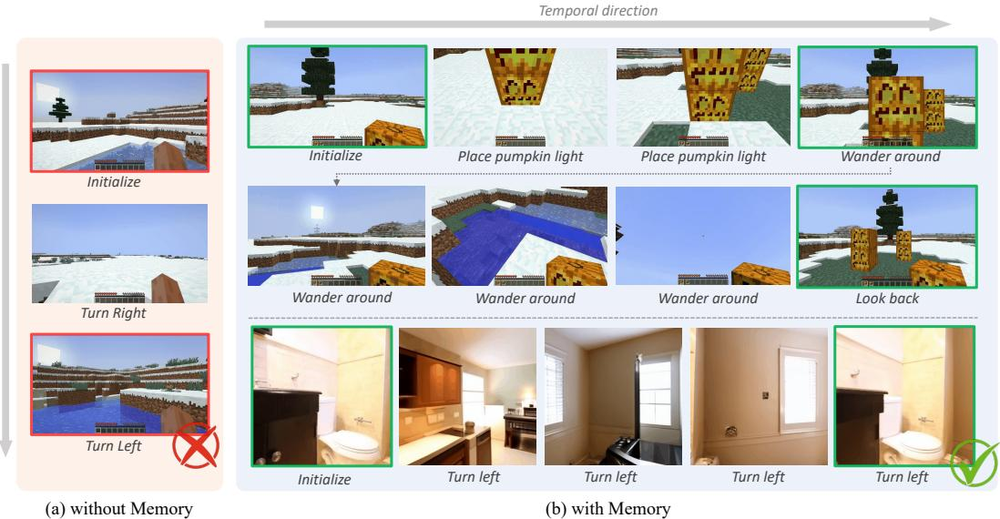  

Figure 1: WoRLDMEM enables long-term consistent world generation with an integrated memory mechanism. (a) Previous world generation methods typically face the problem of inconsistent world due to limited temporal context window size. (b) WoRLDMEM empowers the agent to explore diverse and consistent worlds with an expansive action space, e.., crafting environments by placing objects like pumpkin light or freely roaming around. Most importantly, after exploring for a while and glancing back, we find the objects we placed are still there, with the inspiring sight of the light melting the surrounding snow, testifying to the passage of time. Red and green boxes indicate scenes that should be consistent.

相反，我们认为无几何表示提供了一种更灵活的解决方案。然而，这些表示也带来了自身的挑战，特别是在保持细节与内存可扩展性之间的平衡。例如，通过 LoRA 模块存储抽象特征的隐式方法 (Hong et al., 2024) 提供了紧凑性，但失去了视觉保真度和空间特异性。一些近期的研究将视觉场景表示为离散词元，以编码细粒度的视觉信息 (Sajjadi et al., 2022; Jiang et al., 2025)，但它们受到固定词元的限制，难以捕捉多样化和不断变化环境的复杂性。为解决此问题，我们观察到在生成即时未来时，通常只有一小部分历史内容是相关的。在此基础上，我们提出了一个词元级内存库，存储所有以前生成的潜在词元，并根据相关性为每个生成步骤检索一个针对性的子集。对检索到的内存进行条件处理需要时空推理。有别于早期工作中内存帮助本地时序平滑 (Zheng et al., 2024a) 或语义连贯性 (Wu et al., 2025b; Rahman et al., 2023)，长期世界模拟需要在大时空间隔内进行推理，例如，内存和查询可能在视角和时间上有所不同，并且保留确切的场景细节。为了促进这种推理，我们提出为每个内存单元增加显式状态线索，包括空间位置、视角和时间戳。这些线索作为推理的锚点，并作为查询-键注意机制的一部分进行嵌入。通过这种状态感知的注意机制，我们的模型能够有效地将当前帧与过去的观察进行推理，从而促进准确且连贯的生成。重要的是，这种设计利用了标准的注意架构，使其能够自然地与现代硬件和模型容量进行扩展。

受此想法的启发，我们在条件扩散变换器（Conditional Diffusion Transformer，CDiT）（Peebles 和 Xie，2023）和扩散驱动（Diffusion Forcing，DF）范式（Chen 等，2025）的基础上构建了我们的方法 WoRLDMEM，该方法通过外部动作信号自回归生成第一人称视角。如上所述，WoRLDMEM 的核心是由记忆库和记忆注意力组成的记忆机制。为了确保从记忆库中有效且相关的记忆检索，我们引入了一种基于置信度的选择策略，该策略根据视场（FOV）重叠和时间接近度对记忆单元进行评分。在记忆注意力中，正在生成的潜在词元作为查询，关注记忆词元（作为键和值），以融入相关的历史上下文。为了确保在不同视角和时间间隔间的强对应性，我们使用状态感知嵌入增强查询和键。引入了一种相对嵌入设计，以简化空间和时间关系的学习。该流程能够对长时间记忆进行精确、可扩展的推理，确保在动态和不断变化的世界模拟中保持一致性。我们在定制的 Minecraft 基准（Fan 等，2022）和 RealEstate10K（Zhou 等，2018）上对 WoRLDMEM 进行了评估。Minecraft 基准包括多样的地形（如平原、草原和沙漠）以及各种动作模态（移动、视角控制和事件触发），为创意验证提供了良好的环境。大量实验表明，WoRLDMEM 显著提高了 3D 空间一致性，实现了强健的视角推理和高保真场景生成，如图 1(b) 所示。此外，在动态环境中，WoRLDMEM 精准跟踪并追随不断演变的事件和环境变化，展示了其感知与交互生成世界的能力。我们希望我们有前景的结果和可扩展的设计能够激发对基于记忆的世界模拟的未来研究。

# 2 相关工作

视频扩散模型。随着扩散模型的快速发展（Song 等, 2020；Peebles 和 Xie, 2023；Chen 等, 2025），视频生成取得了显著进展（Wang 等, 2023a,b；Chen 等, 2023；Guo 等, 2023；OpenAI, 2024；Jin 等, 2024；Yin 等, 2024）。该领域从传统的基于 U-Net 的架构（Wang 等, 2023a；Chen 等, 2023；Guo 等, 2023）演变至基于 Transformer 的框架（OpenAI, 2024；Ma 等, 2024；Zheng 等, 2024b），使得视频扩散模型能够生成高度真实且时间一致的视频。最近，自回归视频生成（Chen 等, 2025；Kim 等, 2024；Henschel 等, 2024）作为一种有前景的方法出现，以理论上无限地延长视频长度。值得注意的是，Diffusion Forcing（Chen 等, 2025）引入了一种逐帧噪声水平去噪范式。与在所有帧上应用统一噪声水平的全序列范式不同，逐帧噪声水平去噪提供了更灵活的方法，支持自回归生成。

交互式世界模拟。世界模拟旨在通过根据当前状态和动作预测下一个状态来建模环境。该概念在智能体学习的世界模型构建中得到了广泛的探索（Ha 和 Schmidhuber, 2018b）（Ha 和 Schmidhuber, 2018a；Hafner 等, 2019, 2020；Hu 等, 2023；Beattie 等, 2016；Yang 等, 2023）。随着视频生成技术的进步，高质量的世界模拟与稳健控制变得可行，促使许多研究集中在交互式世界模拟上（Bar 等, 2024；Decart 等, 2024；Alonso 等, 2025；Feng 等, 2024；Parker-Holder 等, 2024；Valevski 等, 2024；Yu 等, 2025c,a,b）。这些方法使智能体能够在生成的环境中导航并基于外部指令与其互动。然而，由于上下文窗口的限制，这些方法会丢弃之前生成的内容，从而导致模拟世界中的不一致性，特别是在维持三维空间一致性方面。

一致性世界模拟。确保生成世界的一致性对于有效的世界模拟至关重要（王等，2025）。现有方法可以大致分为两类：基于几何的和无几何的。基于几何的方法明确地将生成的世界重建为3D/4D表示（刘等，2024；高等，2024；王和阿嘎皮托，2024；任等，2025；余等，2024b,a；梁等，2024）。虽然这一策略可以可靠地保持一致性，但对灵活性施加了严格的限制：一旦世界被重建，修改或与之互动就变得具有挑战性。无几何的方法侧重于隐式学习。像阿隆索等（2025）；瓦列夫斯基等（2024）的方法通过过拟合预定义场景（例如，特定的CS:GO或DOOM地图）确保一致性，限制了可扩展性。StreamingT2V（亨舍尔等，2024）通过从先前帧的全局和局部视觉上下文继续处理，保持长期一致性，而SlowFastGen（洪等，2024）逐步训练LoRA（胡等，2022）模块以进行记忆重校。然而，这些方法依赖于抽象表示，使得准确的场景重建变得具有挑战性。相比之下，我们的方法从先前生成的帧及其状态中检索信息，以确保世界的一致性，而不对特定场景进行过拟合。

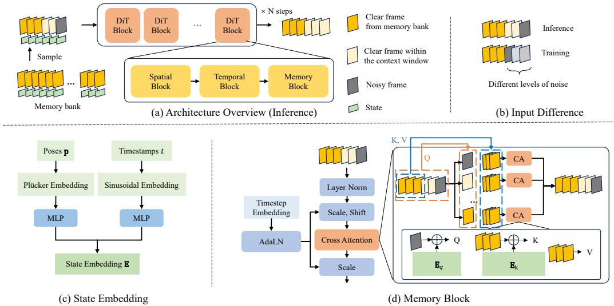  

Figure 2: Comprehensive overview of WoRLDMEM. The framework comprises a conditional diffusion transformer integrated with memory blocks, with a dedicated memory bank storing memory units from previously generated content. By retrieving these memory units from the memory bank and incorporating the information by memory blocks to guide generation, our approach ensures long-term consistency in world simulation.

# 3 世界内存

本节详细介绍了WoRLDMEM的方法论。第3.1节介绍了相关的基础知识，第3.2节描述了作为基线的交互式世界模拟器。第3.3节和第3.4节呈现了我们提出的记忆机制的核心内容。

# 3.1 初步研究

视频扩散模型。视频扩散模型通过学习到的反向过程，迭代地去噪高斯噪声，从而生成视频序列：

$$
p _ { \theta } ( \mathbf { x } _ { t } ^ { k - 1 } | \mathbf { x } _ { t } ^ { k } ) = \mathcal { N } ( \mathbf { x } _ { t } ^ { k - 1 } ; \mu _ { \theta } ( \mathbf { x } _ { t } ^ { k } , k ) , \sigma _ { k } ^ { 2 } \mathbf { I } ) ,
$$

其中所有帧 $( \mathbf { x } _ { t } ^ { k } ) _ { 1 \leq t \leq T }$ 共享相同的噪声水平 $k$，$T$ 是上下文窗口长度。这种全序列方法提供了全局指导，但在序列长度和自回归生成方面缺乏灵活性。自回归视频生成。自回归视频生成旨在通过按顺序预测帧来实现长期的视频扩展（Kondratyuk et al., 2024; Wu et al., 2023）。虽然存在多种自回归生成方法，但扩散增强（Diffusion Forcing, DF）(Chen et al., 2025) 提供了一种简洁而有效的方法来实现这一目标。具体来说，DF 引入了每帧的噪声水平 $k _ { t }$：

$$
p _ { \theta } ( \mathbf { x } _ { t } ^ { k _ { t } - 1 } | \mathbf { x } _ { t } ^ { k _ { t } } ) = \mathcal { N } ( \mathbf { x } _ { t } ^ { k _ { t } - 1 } ; \mu _ { \theta } ( \mathbf { x } _ { t } ^ { k _ { t } } , k _ { t } ) , \sigma _ { k _ { t } } ^ { 2 } \mathbf { I } ) ,
$$

与全序列扩散不同，DF 可灵活且稳定地生成超出训练范围的视频。当仅最后一帧或几帧存在噪声时，自回归生成是一种特殊情况。通过自回归视频生成，长期的互动世界模拟变得可行。

# 3.2 交互式世界仿真

在介绍内存机制之前，我们首先呈现我们的交互式世界模拟器，它使用自回归条件扩散变换器建模长视频序列。通过专用的条件模块将外部控制信号，主要是动作，嵌入模型中以实现交互（Parker-Holder et al., 2024；Decart et al., 2024；Yu et al., 2025c）。按照先前的工作（Decart et al., 2024），我们采用条件扩散变换器（DiT）（Peebles and Xie, 2023）架构进行视频生成，并使用扩散预测（DF）（Chen et al., 2025）进行自回归预测。如图2(a)所示，我们的模型由多个DiT模块和用于时空推理的空间与时间模块组成。时间模块应用因果注意力，以确保每帧仅关注前面的帧。动作通过首先使用多层感知机（MLP）投影到嵌入空间中进行注入。生成的动作嵌入被添加到去噪时间步嵌入中，并通过自适应层归一化（AdaLN）（Xu et al., 2019）注入到时间模块中，遵循Bar et al.（2024）；Decart et al.（2024）的范式。在我们的Minecraft实验中，动作空间包含25个维度，包括移动、视角调整和事件触发。我们还以相同方式将时间步嵌入应用到空间模块中，尽管为清晰起见这在图中被省略。标准架构组件如残差连接、多头注意力和前馈网络也未展示。条件DiT和DF的结合为长期交互视频生成提供了强大的基线。然而，由于视频合成的计算成本，时间上下文窗口仍然有限。因此，此窗口外的内容被遗忘，这导致在长期生成过程中出现不一致（Decart et al., 2024）。

# 3.3 记忆表示与检索

为了应对视频生成模型有限的上下文窗口，我们引入了一种记忆机制，使模型能够保留和检索超出当前生成窗口的信息。该机制维护一个由历史帧及其相关状态信息组成的记忆库 $\{ ( \mathbf { x } _ { i } ^ { m } , \mathbf { p } _ { i } , t _ { i } ) \} _ { i = 1 } ^ { N }$，其中 $\mathbf { x } _ { i } ^ { m }$ 表示记忆帧，$\mathbf { p } _ { i } \in \mathbb { R } ^ { 5 }$（x, y, z, 俯仰角, 偏航角）为其姿态，$t _ { i }$ 为时间戳。每个元组称为一个记忆单元。我们在词元级别保存 $\mathbf { m } _ { i }$，该数据通过视觉编码器进行压缩，但保留足够的细节以便重构。相应的状态 $\{ ( \mathbf { p } , t ) \}$ 在记忆检索中不仅发挥关键作用，还在实现状态感知记忆条件方面至关重要。

# 算法 1：记忆检索算法

历史状态的记忆库 $N$ $\{ ( \mathbf { x } _ { i } ^ { m } , \mathbf { \dot { p } } _ { i } , t _ { i } ) \} _ { i = 1 } ^ { N }$ ; 当前状态 $\left( \mathbf { x } _ { c } , \mathbf { p } _ { c } , t _ { c } \right)$ ; 记忆条件长度 $L _ { M }$ ; 相似度阈值 $t r$ ; 权重 $w _ { o } , w _ { t }$ .

输出：选择的状态索引列表 $S$ 计算置信度分数： 通过蒙特卡洛采样计算视场重叠比例 $\mathbf { o }$。 计算时间差 $\mathbf { d } = \mathbf { C o n c a t } ( \{ | t _ { i } - t _ { c } | \} _ { i = 1 } ^ { n } )$。 计算置信度 $\pmb { \alpha } = \mathbf { o } \cdot w _ { o } - \mathbf { d } \cdot w _ { t }$。 相似性过滤选择： 初始化 $S = \emptyset$ 对于 $m = 1$ 到 $L _ { M }$，选择具有最高 $\alpha _ { i ^ { * } }$ 的 $i ^ { * }$，将 $i ^ { * }$ 添加到 $S$ 中，移除所有相似性 $( i ^ { * } , j ) > t r$ 的 $j$。 返回 $S$ 记忆检索。由于可用于条件化的记忆帧数量有限，因此需要一种高效的策略从记忆库中抽取记忆单元。我们采用一种基于帧对相似性的贪婪匹配算法，其中相似性是通过视场重叠比例和时间戳差异定义的，作为置信度度量。算法 1 展示了我们用于记忆检索的方法。尽管该策略简单，但在检索与条件化相关的信息方面非常有效。此外，模型对记忆的推理有助于保持性能，即使检索的内容不完美。

# 3.4 状态感知内存条件

在检索必要的记忆单元后，我们的目标是明确重建以前看过的视觉内容，即使在视角或场景发生显著变化的情况下，这与以前主要利用记忆进行时间平滑（Zheng et al., 2024a）或语义指导（Wu et al., 2025b；Rahman et al., 2023）的方法不同。这要求模型执行时空推理，从记忆中提取相关信息，我们使用交叉注意力进行建模（Vaswani et al., 2017）。由于单纯依赖视觉词元可能会产生歧义，我们结合相应的状态作为线索，来实现状态感知注意力。状态嵌入。状态嵌入为记忆检索提供了必要的空间和时间上下文。为了编码空间信息，我们采用 Plücker 嵌入（Sitzmann et al., 2021）将 5D 姿态 $\mathbf { p } \in \bar { \mathbb { R } } ^ { 5 }$ 转换为 $\mathbf { P E } ( \mathbf { p } ) \in \mathbb { R } ^ { h \times w \times \mathbf { \bar { 6 } } }$，遵循（He e al., 2024；Gao et al., 2024）。时间上下文通过在正弦嵌入 $( S E )$ 时间戳上应用轻量级多层感知机（MLP）来捕获。最终的嵌入为（图 2 (c)）：

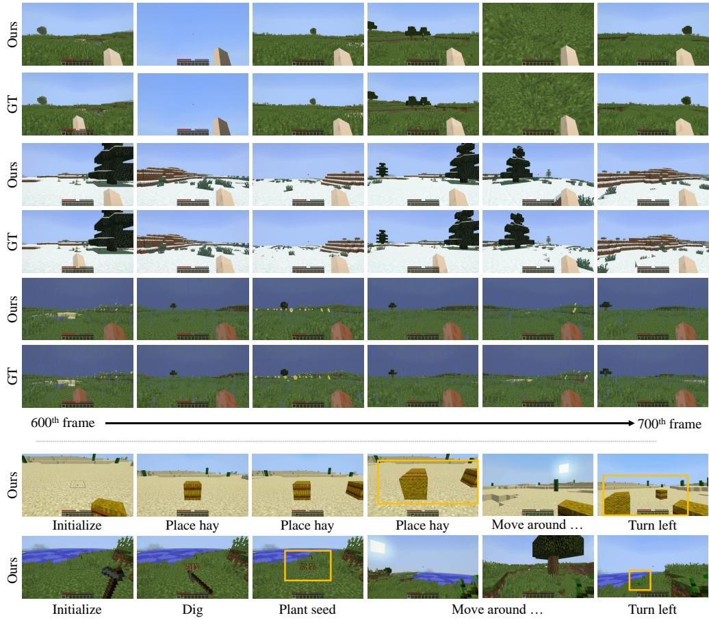  

Figure 3: Qualitative results. We showcase WoRLDMEM's capabilities through two sets of examples. Top: A comparison with Ground Truth (GT). WoRLDMEM accurately models diverse dynamics (e.g., rain) by conditioning on 600 past frames, ensuring temporal consistency. Bottom: Interaction with the world. Objects like hay in the desert or wheat in the plains persist over time, with wheat visibly growing. For the best experience, see the supplementary videos.

$$
\mathbf { E } = G _ { p } ( \mathbf { P E } ( \mathbf { p } ) ) + G _ { t } ( \mathbf { S E } ( t ) ) ,
$$

其中 $G _ { p }$ 和 $G _ { t }$ 是将姿态和时间映射到共享空间的多层感知器（MLP）。状态感知记忆注意力。为了支持在视角和时间变化下的重建，我们引入了一种状态感知注意力机制，该机制将时空线索融入记忆检索。通过对视觉特征和状态信息同时进行条件注意，模型在输入与记忆之间实现了更精确的推理。设 $\mathbf { X } _ { q } \in \mathbb { R } ^ { l _ { q } \times d }$ 表示输入帧（查询）的展平特征图，$\mathbf { X } _ { k } \in \mathbb { R } ^ { l _ { k } \times d }$ 表示连接的记忆特征（键和值）。我们首先通过相应的状态嵌入 $\mathbf { E } _ { q }$ 和 $\mathbf { E } _ { k }$ 来丰富这两者：

$$
\begin{array} { r } { \tilde { \mathbf { X } } _ { q } = \mathbf { X } _ { q } + \mathbf { E } _ { q } , \quad \tilde { \mathbf { X } } _ { k } = \mathbf { X } _ { k } + \mathbf { E } _ { k } . } \end{array}
$$

接着应用交叉注意力以检索相关记忆内容，并输出更新后的 $\mathbf { X } ^ { \prime }$ ：

$$
{ \bf X } ^ { \prime } = \mathrm { C r o s s A t t n } ( Q = p _ { q } ( \tilde { \bf X } _ { q } ) , { \cal K } = p _ { k } ( \tilde { \bf X } _ { k } ) , { \cal V } = p _ { v } ( { \bf X } _ { k } ) ) ,
$$

其中 $p _ { q } , p _ { k }$ 和 $p _ { v }$ 是可学习的投影。为了简化推理空间，我们采用相对状态的表述。对于每个查询帧，状态被设置为零参考（例如，姿态重置为单位矩阵，时间戳重置为零），而关键帧的状态则归一化为相对值。这样的设计，如图 2(d) 所示，提高了视角变化下的对齐性，并简化了学习目标。

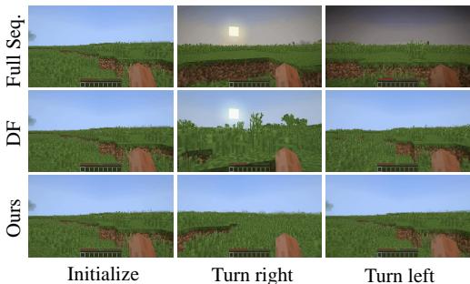  

Figure 4: Within context window evaluation. The motion sequence involves turning right and returning to the original position, showing selfcontained consistency.

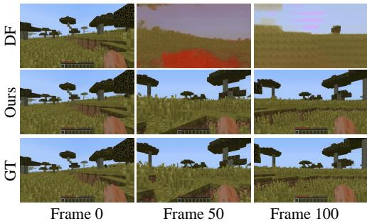  

Figure 5: Beyond context window evaluation. Diffusion-Forcing suffers inconsistency over time, while ours maintains quality and recovers past scenes.

Table 1: Evaluation on Minecraft   

<table><tr><td colspan="4">Within context window</td></tr><tr><td>Methods</td><td>PSNR ↑</td><td>LPIPS ↓</td><td>rFID ↓</td></tr><tr><td>Full Seq.</td><td>20.14</td><td>0.0691</td><td>13.87</td></tr><tr><td>DF</td><td>24.11</td><td>0.0094</td><td>13.88</td></tr><tr><td>Ours</td><td>25.98</td><td>0.0072</td><td>13.73</td></tr><tr><td colspan="4">Beyond context window</td></tr><tr><td>Methods</td><td>PSNR ↑</td><td>LPIPS ↓</td><td>rFID ↓</td></tr><tr><td>Full Seq.</td><td>/</td><td>/</td><td>1</td></tr><tr><td>DF</td><td>17.32</td><td>0.4376</td><td>51.28</td></tr><tr><td>Ours</td><td>23.98</td><td>0.1429</td><td>15.37</td></tr></table>

Table 2: Ablation on embedding designs   

<table><tr><td>Pose type</td><td>Embed. type</td><td>PSNR ↑</td><td>LPIPS ↓</td><td>rFID ↓</td></tr><tr><td>Sparse</td><td>Absolute</td><td>20.67</td><td>0.2887</td><td>39.23</td></tr><tr><td>Dense</td><td>Absolute</td><td>23.63</td><td>0.1830</td><td>29.34</td></tr><tr><td>Dense</td><td>Relative</td><td>23.98</td><td>0.1429</td><td>15.37</td></tr></table>

Table 3: Ablation on memory retrieve strategy   

<table><tr><td>Strategy</td><td>PSNR ↑</td><td>LPIPS ↓</td><td>rFID ↓</td></tr><tr><td>Random</td><td>18.32</td><td>0.3224</td><td>47.35</td></tr><tr><td>+ Confidence Filter</td><td>23.12</td><td>0.1863</td><td>24.33</td></tr><tr><td>+ Similarity Filter</td><td>23.98</td><td>0.1429</td><td>15.37</td></tr></table>

将记忆融入管道中。我们通过将记忆帧视为训练和推理过程中的干净输入，将其融入管道。如图2（a-b）所示，在训练过程中，记忆帧被分配最低噪声水平 $k _ { \mathrm { m i n } }$ ，而上下文窗口帧则从范围 $[ k _ { \operatorname* { m i n } } , k _ { \operatorname* { m a x } } ]$独立采样噪声水平。在推理过程中，记忆帧和上下文帧均被分配 $k _ { \mathrm { m i n } }$ ，而当前生成的帧被分配 $k _ { \mathrm { m a x } }$ 。为了将记忆的影响仅限于记忆块，我们应用了一个时间注意力掩码：

$$
A _ { \mathrm { m a x k } } ( i , j ) = \left\{ { \begin{array} { l l } { 1 , } & { i \leq L _ { M } { \mathrm { a n d } } j = i } \\ { 1 , } & { i > L _ { M } { \mathrm { a n d } } j \leq i } \\ { 0 , } & { { \mathrm { o t h e r w i s e } } } \end{array} } \right.
$$

其中 $L _ { M }$ 是在上下文窗口内附加的内存帧数量。这可以保证因果注意力，同时防止内存单元之间相互影响。

# 4 实验

数据集。我们使用 MineDojo（Fan et al., 2022）在 Minecraft 中创建多样的训练和评估数据集，配置不同的环境（例如，平原、热带草原、冰原和沙漠）、智能体动作和交互。对于现实场景，我们利用 RealEstate10K（Zhou et al., 2018）并附带相机位姿注释，以评估长期世界的一致性。指标。为了进行定量评估，我们采用重建指标，其中获取真实标注数据（GT）的方法因具体设置而异。然后，我们使用 PSNR、LPIPS（Zhang et al., 2018）和重建 FID（rFID）（Heusel et al., 2017）评估生成视频的一致性和质量，这些指标综合测量像素级保真度、感知相似性和整体现实感。

实验细节。对于我们在Minecraft上的实验（Fan et al., 2022），我们采用了Oasis（Decart et al., 2024）作为基础模型。我们的模型使用固定学习率$2 \times 10^{-5}$进行Adam优化器训练。训练在$640 \times 360$的分辨率下进行，帧首先通过VAE在$32 \times 18$的分辨率下编码为潜在空间，然后进一步切分为$16 \times 9$。我们的训练数据集包含约12K个长视频，每个视频包含1500帧，生成自Fan et al. (2022)。在训练过程中，我们采用8帧的时间上下文窗口以及8帧的记忆窗口。该模型在4个GPU上训练约500K步，每个GPU的批量大小为4。对于主论文中算法1所指定的超参数，我们将相似性阈值$t_r$设置为0.9，$w_{o}$设置为1，以及$w_{t}$设置为$0.2/t_{c}$。对于方程(5)和方程(6)中的噪声水平，我们将$k_{\mathrm{min}}$设置为15，$k_{\mathrm{max}}$设置为1000。

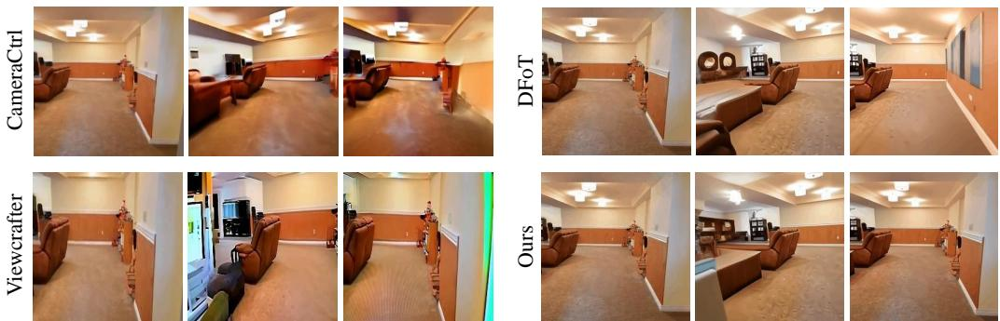  

Figure 6: Results on RealEstate (Zhou et al., 2018). We visualize loop closure consistency over a full camera rotation. The visual similarity between the first and last frames serves as a qualitative indicator of 3D spatial consistency.

Table 4: Evaluation on RealEstate10K   

<table><tr><td>Methods</td><td>PSNR ↑</td><td>LPIPS ↓</td><td>rFID ↓</td></tr><tr><td>CameraCtrl (He et al., 2024)</td><td>13.19</td><td>0.3328</td><td>133.81</td></tr><tr><td>TrajAttn (Xiao et al., 2024)</td><td>14.22</td><td>0.3698</td><td>128.36</td></tr><tr><td>Viewcrafter (Yu et al., 2024c)</td><td>21.72</td><td>0.1729</td><td>58.43</td></tr><tr><td>DFoT (Song et al., 2025)</td><td>16.42</td><td>0.2933</td><td>110.34</td></tr><tr><td>Ours</td><td>23.34</td><td>0.1672</td><td>43.14</td></tr></table>

在我们的RealEstate10K实验中（Zhou等，2018），我们采用DFoT作为基础模型（Song等，2025）。RealEstate10K数据集提供了大约65K个短视频片段的训练集。训练在分辨率$256 \times 256$下进行，帧被切割为$128 \times 128$的补丁。模型在4个GPU上训练大约50K步，每个GPU的批次大小为8。

# 4.1 生成基准上的结果

Minecraft 基准测试的比较。我们将我们的方法与标准的全序列（Full Seq.）训练方法（He et al., 2024; Wang et al., 2024）和扩散强制（Diffusion Forcing, DF）（Chen et al., 2025）进行了比较。关键区别如下：全序列条件扩散变压器（Peebles 和 Xie, 2023）在训练和推理过程中保持相同的噪声水平，DF 为训练和推理引入了不同的噪声水平，而我们的方法结合了记忆机制。为了评估短期和长期世界一致性，我们在上下文窗口内和超出窗口的情况下进行了评估。我们在 300 个测试视频上评估了这两种设置。在以下实验中，智能体的姿势由游戏模拟器生成作为真实标注数据。然而，在真实场景中，仅可用动作输入，姿势并不可直接观察。在这种情况下，可以根据之前的场景、过去的状态和即将到来的动作来预测下一个帧的姿势。我们在补充材料中探讨了这一设计选择。在上下文窗口内。对于此实验，所有方法均使用 16 的上下文窗口，而我们的方法还额外维持了 8 的记忆窗口。我们在定制的运动场景（例如，先左转再右转或向前移动再后退）中进行测试，以评估自我一致性，其中真实标注数据由在相同位置上以前生成的帧构成。如表 1 和图 4 所示，全序列基线在其自身的上下文窗口内也存在不一致性。DF 通过增强生成帧之间的信息交流来改善一致性。我们基于记忆的方法取得了最佳性能，证明了结合专用记忆机制的有效性。

Table 5: Ablation on sampling strategy for training   

<table><tr><td>Sampling strategy</td><td>PSNR ↑</td><td>LPIPS ↓</td><td>rFID ↓</td></tr><tr><td>Small-range</td><td>19.23</td><td>0.3786</td><td>46.55</td></tr><tr><td>Large-range</td><td>21.11</td><td>0.3855</td><td>42.96</td></tr><tr><td>Progressive</td><td>23.98</td><td>0.1429</td><td>15.37</td></tr></table>

超越上下文窗口。在此设置中，所有方法使用8的上下文窗口并生成100个未来帧；我们的方法还利用了8的记忆窗口，同时初始化了一个600帧的记忆库。我们在600帧之后计算后续100个真实标注帧的重构误差。完整序列方法无法进行这么长的推演，因此我们将其排除。DF在PSNR和LPIPS评分上表现不佳，表明在上下文窗口之外与真实标注数据严重不一致。此外，其低rFID表明质量显著下降。相比之下，我们的记忆增强方法在所有指标上始终优于其他方法，展示了更好的长期一致性和质量保留。图5进一步证实了这些发现。图3展示了WoRLDMEM的能力。顶部部分展示了其在多样化环境中在自由动作空间内的操作能力。给定一个600帧的记忆库，我们的模型在保留真实标注数据的动作和姿势的同时生成100个未来帧，确保了强大的世界一致性。底部部分强调了对动态环境的交互。通过将时间戳用作嵌入，模型能够记住环境变化并捕捉自然事件的发展，例如植物随时间的生长。真实场景的比较。我们在RealEstate10K数据集（Zhou et al., 2018）上将我们的方法与先前的工作（He et al., 2024；Xiao et al., 2024；Yu et al., 2024c；Song et al., 2025）进行了比较。我们设计了5条评估轨迹，每条轨迹在100个场景中以相同的姿态开始和结束。轨迹长度从37帧到60帧不等，超过了所有基线的训练长度（最大25帧）。CameraCtrl（He et al., 2024）、TrajAttn（Xiao et al., 2024）和DFoT（Song et al., 2025）丢弃过去帧，因此遭遇不一致性。Viewcrafter（Yu et al., 2024c）整合了显式的三维重建，得到更好的结果，但受到后续处理中的重建和渲染错误的限制。如表4和图6所示，我们的方法在所有指标上都取得了优越的性能。然而，RealEstate数据集本质上限制了我们方法的全部潜力，因为它由短小的非交互式片段组成，时间复杂性有限。我们将更具挑战性和交互性的现实场景评估留待未来工作。

嵌入设计。内存块中嵌入的设计对于跨帧关系建模至关重要。我们评估了三种策略（表2）：（1）带有绝对编码的稀疏姿态嵌入，（2）带有绝对编码的密集姿态嵌入，以及（3）带有相对编码的密集姿态嵌入。结果表明，密集姿态嵌入（Plücker 嵌入）显著增强了所有指标，强调了更丰富的姿态表示的好处。切换绝对关系推理和信息检索。如图7所示，绝对嵌入随着时间的推移积累误差，而相对嵌入在超过300帧后仍能保持稳定。训练的采样策略。我们比较了在Minecraft基准测试中不同的训练采样策略。小范围采样限制内存条件仅在Minecraft世界中$2 \mathrm { m }$内的帧，而大范围采样则将此范围扩展至$8 \mathrm { m }$。渐进采样则从小范围样本开始进行初步训练步骤，然后逐渐扩展到大范围样本。如表5所示，小范围和大范围采样在一致性和质量上均面临挑战，而渐进采样显著改善所有指标。这表明，在训练过程中逐步增加难度有助于模型学习推理并有效查询内存块中的信息。时间条件。我们在表6中评估时间戳条件（无论是嵌入还是检索）的有效性。我们整理了100个包含放置事件的视频样本，并评估未来生成的内容是否与事件进展一致。如表中所示，加入时间条件显著提高了PSNR和LPIPS，表明添加时间信息有助于模型忠实地再现世界模拟中的事件变化。由于植物生长等事件本质上是不可预测的，我们没有对这类情况进行定量评估，而是提供了图8中的定性示例。

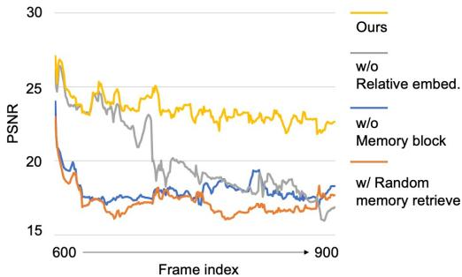  

Figure 7: Long-term Generation Comparison. This figure presents the PSNR of different ablation methods compared to the ground truth over a 300-frame sequence. The results show that our method without memory blocks or using random memory retrieval exhibits immediate inconsistencies with the ground truth. Additionally, the model lacking relative embeddings begins to degrade significantly beyond 100 frames. In contrast, our full method maintains strong consistency even beyond 300 frames.

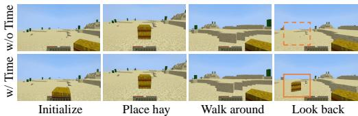  

Figure 8: Results w/o and w/ time condition. Without timestamps, the model fails to differentiate memory units from the same location at different times, causing errors. With time conditioning, it aligns with the updated world state, ensuring consistency.

Table 6: Ablation on time condition   

<table><tr><td>Time condition</td><td>PSNR ↑</td><td>LPIPS ↓</td><td>rFID ↓</td></tr><tr><td>w/o</td><td>23.17</td><td>0.1989</td><td>23.89</td></tr><tr><td>w/</td><td>25.12</td><td>0.1613</td><td>16.53</td></tr></table>

内存检索策略。我们在表3中分析了内存检索策略。从内存库随机采样导致性能较差和严重的质量下降，这在rFID的骤然下降和与真实标注数据的快速偏离中得到了证明（图7）。基于置信度的过滤显著增强了一致性和生成质量。此外，我们通过基于相似性过滤冗余内存单元来优化检索，进一步改善了所有评估指标，证明了我们方法的有效性。

# 5 限制与未来工作

尽管我们的方法有效，但某些问题仍需进一步探索。首先，我们无法保证能够总是从记忆库中检索到所有必要的信息。在某些边缘情况下（例如，当视角被障碍物遮挡时），仅依赖视角重叠可能不足。其次，我们目前与环境的互动缺乏多样性和真实感。在未来的工作中，我们计划将模型扩展到具有更真实和多样化的交互的现实场景中。最后，我们的记忆设计仍然会导致线性增加的内存使用，这在处理极长序列时可能会带来限制。

# 6 结论

总之，WoRLDMEM 通过使用过去帧及其相关状态的记忆库，解决了在世界模拟中保持长期一致性这一长期挑战。其记忆注意机制能够在大视角或时间间隔较大的情况下，准确重建之前观察到的场景，并有效建模随时间变化的动态。针对虚拟和真实环境的广泛实验验证了 WoRLDMEM 在强大、身临其境的世界模拟方面的能力。我们希望我们的研究能鼓励进一步探索基于记忆的世界模拟器的设计与应用。致谢。本研究得到了新加坡国家研究基金会的支持，资助编号为 <NRF-NRFF16-2024-0003>。本研究还得到了南洋理工大学 SUG-NAP 的支持，以及南洋理工大学 S-Lab 和行业合作伙伴的现金及实物资助。

# References

Eloi Alonso, Adam Jelley, Vincent Micheli, Anssi Kanervisto, Amos J Storkey, Tim Pearce, and François Fleuret. Diffusion for world modeling: Visual details matter in atari. Advances in Neural Information Processing Systems, 37:5875758791, 2025.

Amir Bar, Gaoyue Zhou, Danny Tran, Trevor Darrell, and Yann LeCun. Navigation world models, 2024.

Charles Beattie, Joel Z Leibo, Denis Teplyashin, Tom Ward, Marcus Wainwright, Heinrich Küttler, Andrew Lefrancq, Simon Green, Víctor Valdés, Amir Sadik, et al. Deepmind lab. arXiv preprint arXiv:1612.03801, 2016.

Boyuan Chen, Diego Martí Monsó, Yilun Du, Max Simchowitz, Russ Tedrake, and Vincent Sitzmann. Diffusion forcing: Next-token prediction meets full-sequence diffusion. Advances in Neural Information Processing Systems, 37:2408124125, 2025.

Haoxin Chen, Menghan Xia, Yingqing He, Yong Zhang, Xiaodong Cun, Shaoshu Yang, Jinbo Xing, Yaofang Liu, Qifeng Chen, Xintao Wang, et al. Videocrafter1: Open diffusion models for high-quality video generation. arXiv preprint arXiv:2310.19512, 2023.

Decart, Julian Quevedo, Quinn McIntyre, Spruce Cambell Xinlei Chen, and Robert Wachen. Oasis:A universe in a transformer. 2024. Project website.

Linxi Fan, Guanzhi Wang, Yunfan Jiang, Ajay Mandlekar, Yuncong Yang, Haoyi Zhu, Andrew Tang, DeAn Huang, Yuke Zhu, and Anima Anandkumar. Minedojo: Building open-ended embodied agents with internet-scale knowledge. Advances in Neural Information Processing Systems, 35:1834318362, 2022.

Ruili Feng, Han Zhang, Zhantao Yang, Jie Xiao, Zhilei Shu, Zhiheng Liu, Andy Zheng, Yukun Huang, Yu Liu, and Hongyang Zhang. The matrix: Infinite-horizon world generation with real-time moving control. arXiv preprint arXiv:2412.03568, 2024.

Ruiqi Gao, Aleksander Holynski, Philipp Henzler, Arthur Brussee, Ricardo Martin-Brualla, Pratul Srinivasan, Jonathan T Barron, and Ben Poole. Cat3d: Create anything in 3d with multi-view diffusion models. arXiv preprint arXiv:2405.10314, 2024.

Yuwei Guo, Ceyuan Yang, Anyi Rao, Zhengyang Liang, Yaohui Wang, Yu Qiao, Maneesh Agrawala, Dahua Lin, and Bo Dai.Animatediff: Animate your personalized text-to-image diffusion models without specific tuning. arXiv preprint arXiv:2307.04725, 2023.

David Ha and Jürgen Schmidhuber. Recurrent world models facilitate policy evolution. Advances in neural information processing systems, 31, 2018a.

David Ha and Jürgen Schmidhuber. World models. arXiv preprint arXiv:1803.10122, 2018b.

Danijar Hafner, Timothy Lillicrap, Jimmy Ba, and Mohammad Norouzi. Dream to control: Learning behaviors by latent imagination. arXiv preprint arXiv:1912.01603, 2019.

Danijar Hafner, Timothy Lillicrap, Mohammad Norouzi, and Jimmy Ba. Mastering atari with discrete world models. arXiv preprint arXiv:2010.02193, 2020.

Hao He, Yinghao Xu, Yuwei Guo, Gordon Wetzstein, Bo Dai, Hongsheng Li, and Ceyuan Yang. Cameractrl: Enabling camera control for text-to-video generation. arXiv preprint arXiv:2404.02101, 2024.

R Hsel, Lvo ayn, niil Hayyn, Hay gosn, Vr Tdeosyn, Za Wang, Shant Navasardyan, and Humphrey Shi. Streamingt2v: Consistent, dynamic, and extendable long video generation from text. arXiv preprint arXiv:2403.14773, 2024.

Martin Heusel, Hubert Ramsauer, Thomas Unterthiner, Bernhard Nessler, and Sepp Hochreiter. Gans trained by a two time-scale update rule converge to a local nash equilibrium. Advances in neural information processing systems, 30, 2017.

Yining Hong, Beide Liu, Maxine Wu, Yuanhao Zhai, Kai-Wei Chang, Linjie Li, Kevin Lin, Chung-Ching Lin, Jianfeng Wang, Zhengyuan Yang, Ying Nian Wu, and Lijuan Wang Wang. Slowfast-vgen: Slow-fast learning for action-driven long video generation. arXiv preprint arXiv:2410.23277, 2024.

Anthony Hu, Lloyd Russell, Hudson Yeo, Zak Murez, George Fedoseev, Alex Kendall, Jamie Shotton, and Gianluca Corrado. Gaia-1: A generative world model for autonomous driving. arXiv preprint arXiv:2309.17080, 2023.

Edward J Hu, Yelong Shen, Phillip Wallis, Zeyuan Allen-Zhu, Yuanzhi Li, Shean Wang, Lu Wang, Weizhu Chen, et al. Lora: Low-rank adaptation of large language models. ICLR, 1(2):3, 2022.

Hanwen Jiang, Hao Tan, Peng Wang, Haian Jin, Yue Zhao, Sai Bi, Kai Zhang, Fujun Luan, Kalyan Sunkavalli, Qixig Huang, et al. Rayzer: A self-supervised large view synthesis model. arXiv preprint arXiv:2505.00702, 2025.

Yang Jin, Zhicheng Sun, Ningyuan Li, Kun Xu, Hao Jiang, Nan Zhuang, Quzhe Huang, Yang Song, Yadong Mu, and Zhouchen Lin. Pyramidal flow matching for efficient video generative modeling. arXiv preprint arXiv:2410.05954, 2024.

Jihwan Kim, Junoh Kang, Jinyoung Choi, and Bohyung Han. FIFO-diffusion: Generating infinite videos from text without training. In The Thirty-eighth Annual Conference on Neural Information Processing Systems, 2024.

Dan Kondratyuk, Lijun Yu, Xiuye Gu, José Lezama, Jonathan Huang, Grant Schindler, Rachel Hornung, Vighnesh Birodkar, Jimmy Yan, Ming-Chang Chiu, Krishna Somandepalli, Hassan Akbari, Yair Alon, Yong Cheng, Josh Dillon, Agrim Gupta, Meera Hahn, Anja Hauth, David Hendon, Alonso Martinez, David Minnen, Mikhail Sirotenko, Kihyuk Sohn, Xuan Yang, Hartwig Adam, Ming-Hsuan Yang, Irfan Essa, Huisheng Wang, David A. Ross, Bryan Seybold, and Lu Jiang. Videopoet: A large language model for zero-shot video generation, 2024.

Hanwen Liang, Junli Cao, Vidit Goel, Guocheng Qian, Sergei Korolev, Demetri Terzopoulos, Konstantinos N Plataniotis, Sergey Tulyakov, and Jian Ren. Wonderland: Navigating 3d scenes from a single image. arXiv preprint arXiv:2412.12091, 2024.

Fangfu Liu, Wenqiang Sun, Hanyang Wang, Yikai Wang, Haowen Sun, Junliang Ye, Jun Zhang, and Yueqi Duan. Reconx: Reconstruct any scene from sparse views with video diffusion model. arXiv preprint arXiv:2408.16767, 2024.

Xin Ma, Yaohui Wang, Gengyun Jia, Xinyuan Chen, Ziwei Liu, Yuan-Fang Li, Cunjian Chen, and Yu Qiao. Latte: Latent diffusion transformer for video generation. arXiv preprint arXiv:2401.03048, 2024.

OpenAI. Video generation models as world simulators. https://openai.com/research/ video-generation-models-as-world-simulators,2024.

Jack Parker-Holder, Philip Ball, Jake Bruce, Vibhavari Dasagi, Kristian Holsheimer, Christos Kaplanis, Alexandre Moufarek, Guy Scully, Jeremy Shar, Jimmy Shi, Stephen Spencer, Jessica Yung, Michael Dennis, Sultan Kenjeyev, Shangbang Long, Vlad Mnih, Harris Chan, Maxime Gazeau, Bonnie Li, Fabio Pardo, Luyu Wang, Lei Zhang, Frederic Besse, Tim Harley, Anna Mitenkova, Jane Wang, Jeff Clune, Demis Hassabis, Raia Hadsell, Adrian Bolton, Satinder Singh, and Tim Rocktäschel. Genie 2: A large-scale foundation world model. 2024.

William Peebles and Saining Xie. Scalable diffusion models with transformers. In Proceedings of the IEEE/CVF international conference on computer vision, pages 41954205, 2023.

Tanzila Rahman, Hsin-Ying Lee, Jian Ren, Sergey Tulyakov, Shweta Mahajan, and Leonid Sigal. Make-a-story: Visual memory conditioned consistent story generation. In Proceedings of the IEEE/CVF conference on computer vision and pattern recognition, pages 24932502, 2023.

Xuanchi Ren, Tianchang Shen, Jiahui Huang, Huan Ling, Yifan Lu, Merlin Nimier-David, Thomas Müller, Alexander Keller, Sanja Fidler, and Jun Gao. Gen3c: 3d-informed world-consistent video generation with precise camera control. In Proceedings of the IEEE/CVF Conference on Computer Vision and Pattern Recognition, 2025.

Mehdi SM Sajjadi, Henning Meyer, Etienne Pot, Urs Bergmann, Klaus Greff, Noha Radwan, Suhani Vora, Mario Lui, Daniel Duckworth, Alexey Dosovitskiy, et al. Scene representation transformer: Geometry-free novel view synthesis through set-latent scene representations. In Proceedings of the IEEE/CVF Conference on Computer Vision and Pattern Recognition, pages 62296238, 2022.

Vincent Sitzmann, Semon Rezchikov, Bill Freeman, Josh Tenenbaum, and Fredo Durand. Light field networks: Neural scene representations with single-evaluation rendering. Advances in Neural Information Processing Systems, 34:1931319325, 2021.

Kiwhan Song, Boyuan Chen, Max Simchowitz, Yilun Du, Russ Tedrake, and Vincent Sitzman. History-guided video diffusion. arXiv preprint arXiv:2502.06764, 2025.

Yang Song, Jascha Sohl-Dickstein, Diederik P Kingma, Abhishek Kumar, Stefano Ermon, and Ben Poole. Score-based generative modeling through stochastic differential equations. arXiv preprint arXiv:2011.13456, 2020.   
Dani Valevski, Yaniv Leviathan, Moab Arar, and Shlomi Fruchter. Diffusion models are real-time game engines. arXiv preprint arXiv:2408.14837, 2024.   
Ashish Vaswani, Noam Shazeer, Niki Parmar, Jakob Uszkoreit, Llion Jones, Aidan N. Gomez, Lukasz Kaiser, and Illia Polosukhin. Attention is all you need, 2017.   
Hengyi Wang and Lourdes Agapito. 3d reconstruction with spatial memory. arXiv preprint arXiv:2408.16061, 2024.   
Jiuniu Wang, Hangjie Yuan, Dayou Chen, Yingya Zhang, Xiang Wang, and Shiwei Zhang. Modelscope text-to-video technical report. arXiv preprint arXiv:2308.06571, 2023a.   
Jing Wang, Fengzhuo Zhang, Xiaoli Li, Vincent YF Tan, Tianyu Pang, Chao Du, Aixin Sun, and Zhuoran Yang. Error analyses of auto-regressive video diffusion models: A unified framework. arXiv preprint arXiv:2503.10704, 2025.   
Yaohui Wang, Xinyuan Chen, Xin Ma, Shangchen Zhou, Ziqi Huang, Yi Wang, Ceyuan Yang, Yinan He, Jiashuo Yu, Peiqing Yang, et al. Lavie: High-quality video generation with cascaded latent diffusion models. arXiv preprint arXiv:2309.15103, 2023b.   
Zhouxia Wang, Ziyang Yuan, Xintao Wang, Yaowei Li, Tianshui Chen, Menghan Xia, Ping Luo, and Ying Shan. Motionctrl: A unified and flexible motion controller for video generation. In ACM SIGGRAPH 2024 Conference Papers, pages 111, 2024.   
Sib Wu, Congrong Xu, Binbin Huang, Andreas Geiger, and Anpei Chen. Genfusion: Closing the loop between reconstruction and generation via videos. arXiv preprint arXiv:2503.21219, 2025a.   
Tong Wu, Zhihao Fan, Xiao Liu, Yeyun Gong, Yelong Shen, Jian Jiao, Hai-Tao Zheng, Juntao Li, Zhongyu Wei, Jian Guo, Nan Duan, and Weizhu Chen. Ar-diffusion: Auto-regressive diffusion model for text generation, 2023.   
Xindi Wu, Uriel Singer, Zhaojiang Lin, Andrea Madotto, Xide Xia, Yifan Xu, Paul Crook, Xin Luna Dong, and Seungwhan Moon. Corgi: Cached memory guided video generation. In 2025 IEEE/CVF Winter Conference on Applications of Computer Vision (WACV), pages 45854594. IEEE, 2025b.   
Zeqi Xiao, Wenqi Ouyang, Yifan Zhou, Shuai Yang, Lei Yang, Jianlou Si, and Xingang Pan. Trajectory attention for fine-grained video motion control. arXiv preprint arXiv:2411.19324, 2024.   
Jinging Xu, Xu Sun, Zhiyuan Zhang, Guangxiang Zhao, and Junyang Lin. Understanding and improving layer normalization. Advances in neural information processing systems, 32, 2019.   
Mengjiao Yang, Yilun Du, Kamyar Ghasemipour, Jonathan Tompson, Dale Schuurmans, and Pieter Abbeel. Learning interactive real-world simulators. arXiv preprint arXiv:2310.06114, 1(2):6, 2023.   
From slow bidirectional to fast causal video generators. arXiv preprint arXiv:2412.07772, 2024.   
Hong-Xing Yu, Haoyi Duan, Charles Herrman, William T Freeman, and Jiajun Wu. Wonderworld: Interactive 3d scene generation from a single image. arXiv preprint arXiv:2406.09394, 2024a.   
Hong-Xing Yu, Haoyi Duan, Junhwa Hur, Kyle Sargent, Michael Rubinstein, William T Freeman, Forrester Cole, Deqing Sun, Noah Snavely, Jiajun Wu, et al. Wonderjourney: Going from anywhere to everywhere. In Proceedings of the IEEE/CVF Conference on Computer Vision and Pattern Recognition, pages 66586667, 2024b.   
Jiwen Yu, Yiran Qin, Haoxuan Che, Quande Liu, Xintao Wang, Pengfei Wan, Di Zhang, Kun Gai, Hao Chen, and Xihui Liu. A survey of interactive generative video. arXiv preprint arXiv:2504.21853, 2025a.   
Jiwen Yu, Yiran Qin, Hoxuan Che, Quande Liu, Xintao Wang, Pengei Wan, Di Zhang, and Xihui Liu.Psition: Interactive generative video as next-generation game engine. arXiv preprint arXiv:2503.17359, 2025b.   
Jiwen Yu, Yiran Qin, Xinto Wang, Pengei Wan, Di Zhang, and Xihui Liu. Gameactory: Creating new games with generative interactive videos. arXiv preprint arXiv:2501.08325, 2025c.

Wangbo Yu, Jinbo Xing, Li Yuan, Wenbo Hu, Xiaoyu Li, Zhipeng Huang, Xiangjun Gao, Tien-Tsin Wong, Ying Shan, and Yonghong Tian. Viewcrafter: Taming video diffusion models for high-fidelity novel view synthesis. arXiv preprint arXiv:2409.02048, 2024c.

Richard Zhang, Phillip Isola, Alexei A Efros, Eli Shechtman, and Oliver Wang. The unreasonable effectiveness of deep features as a perceptual metric. In Proceedings of the IEEE conference on computer vision and pattern recognition, pages 586595, 2018.

Longtao Zheng, Yifan Zhang, Hanzhong Guo, Jiachun Pan, Zhenxiong Tan, Jiahao Lu, Chuanxin Tang, Bo An, and Shuicheng Yan. Memo: Memory-guided diffusion for expressive talking video generation. arXiv preprint arXiv:2412.04448, 2024a.

Zangwei Zheng, Xiangyu Peng, Tianji Yang, Chenhui Shen, Shenggui Li, Hongxin Liu, Yukun Zhou, Tianyi Li. and Yang You. Open-sora: Democratizing efficient video production for all, 2024b.

Tingui Zhou, Richard Tucker, John Flynn, Graham Fyffe, and Noah Snavely. Stereo magnification: Learning view synthesis using multiplane images. In SIGGRAPH, 2018.

# 7 Supplementary Materials

# 7.1 Details and Experiments

Embedding designs. We present the detailed designs of embeddings for timesteps, actions, poses, and timestamps in Figure 10, where $F , C , H , W , A$ denote the frame number, channel count, height, width, and action count, respectively.

The input pose is parameterized by position $( x , z , y )$ and orientation (pitch $\theta$ and yaw $\phi _ { , }$ . The extrinsic matrix $\mathbf { T } \in \mathbb { R } ^ { 4 \times 4 }$ is formed as:

$$
\begin{array} { r } { \mathbf { T } = \left[ \begin{array} { l l } { \mathbf { R } _ { c } } & { \mathbf { c } } \\ { \mathbf { 0 } ^ { T } } & { 1 } \end{array} \right] , } \end{array}
$$

where ${ \bf c } = ( x , z , y ) ^ { T }$ and $\mathbf { R } _ { c } = \mathbf { R } _ { y } ( \phi ) \mathbf { R } _ { x } ( \theta )$ .

To encode camera pose, we adopt the Plücker embedding. Given a pixel $( u , v )$ with normalized camera coordinates:

$$
\pi _ { u v } = { \bf K } ^ { - 1 } [ u , v , 1 ] ^ { T } ,
$$

its world direction is:

$$
{ \bf d } _ { u v } = { \bf R } _ { c } \pi _ { u v } + { \bf c } .
$$

The Plücker embedding is:

$$
\mathbf { l } _ { u v } = ( \mathbf { c } \times \mathbf { d } _ { u v } , \mathbf { d } _ { u v } ) \in \mathbb { R } ^ { 6 } .
$$

For a frame of size $H \times W$ , the full embedding is:

$$
\mathbf { L } _ { i } \in \mathbb { R } ^ { H \times W \times 6 } .
$$

Memory context length. We evaluate how different memory context lengths affect performance in the Minecraft benchmark. Table 7 shows that increasing the context length from 1 to 8 steadily boosts PSNR, lowers LPIPS, and reduces rFID. However, extending the length to 16 deteriorates results, indicating that excessive memory frames may introduce noise or reduce retrieval precision. A context length of 8 provides the best trade-off, yielding the highest PSNR and the lowest LPIPS and rFID.

Pose prediction. For interactive play, ground truth poses are not accessible. To address this, we designed a lightweight pose prediction module that estimates the pose of the next frame. As illustrated in Figure 9, the predictor takes the previous image, the previous pose, and the upcoming action as inputs and outputs the predicted next pose. This module enables the system to operate using actions alone, eliminating the need for ground truth poses during inference. In Table 8, we compare the performance of using predicted poses versus ground truth poses. While using ground truth poses yields better results across all metrics, the performance drop with predicted poses is acceptable. This is because our method does not rely heavily on precise pose predictions  new frames are generated based on these predictions  and the ground truth poses generated by the Minecraft simulator also contain a certain degree of randomness.

Table 7: Ablation on length of memory context length   

<table><tr><td rowspan=1 colspan=1>Length</td><td rowspan=1 colspan=1>PSNR ↑</td><td rowspan=1 colspan=1>LPIPS ↓</td><td rowspan=1 colspan=1>rFID ↓</td></tr><tr><td rowspan=2 colspan=1>14</td><td rowspan=1 colspan=1>22.18</td><td rowspan=1 colspan=1>0.1899</td><td rowspan=1 colspan=1>20.47</td></tr><tr><td rowspan=1 colspan=1>14.68</td><td rowspan=1 colspan=1>0.1568</td><td rowspan=1 colspan=1>16.54</td></tr><tr><td rowspan=1 colspan=1>8</td><td rowspan=1 colspan=1>25.32</td><td rowspan=1 colspan=1>0.1429</td><td rowspan=2 colspan=1>15.3718.33</td></tr><tr><td rowspan=1 colspan=1>16</td><td rowspan=1 colspan=1>23.14</td><td rowspan=1 colspan=1>0.1687</td></tr></table>

Table 8: Comparison between using predicted poses and ground truth poses   

<table><tr><td rowspan=1 colspan=1>Pose Type</td><td rowspan=1 colspan=1>PSNR ↑</td><td rowspan=1 colspan=1>LPIPS ↓</td><td rowspan=1 colspan=1>rFID ↓</td></tr><tr><td rowspan=2 colspan=1>Ground truthPredicted</td><td rowspan=2 colspan=1>25.3223.13</td><td rowspan=1 colspan=1>0.1429</td><td rowspan=2 colspan=1>15.3720.36</td></tr><tr><td rowspan=1 colspan=1>0.1786</td></tr></table>

# 7.2 Memory Usage and Scalability Analysis

To assess the scalability and practical feasibility of our method, we provide detailed quantitative analysis covering memory usage, generation duration, training cost, and inference efficiency.

Memory Usage of the Memory Bank. The memory bank is lightweight. Storing 600 visual memory tokens with shape [600, 16, 18, 32] in f1oat32 takes approximately 21MB.

Retrieval Latency. Below we report the average retrieval time (for 8 memory frames) as a function of memory bank size:   

<table><tr><td>Number of Memory Candidates | Retrieval Time (s)</td><td></td></tr><tr><td>10</td><td>0.04</td></tr><tr><td>100</td><td>0.06</td></tr><tr><td>600</td><td>0.10</td></tr><tr><td>1000</td><td>0.16</td></tr></table>

The generation cost (20 denoising steps) is ${ \sim } 0 . 9 5$ per frame. Retrieval time accounts for only $10 \mathrm { - } 2 0 \%$ of total inference time even with 1000 candidates.

Comparison with Baseline. We compare our method with a baseline model (without memory), under consistent settings: 8 context frames, 8 memory frames, 20 denoising steps, and no acceleration techniques, on single H200.

<table><tr><td></td><td colspan="2">Training</td><td colspan="2">Inference</td></tr><tr><td>Method</td><td>Mem. Usage</td><td>Speed (it/s)</td><td>Mem. Usage</td><td>Speed (it/s)</td></tr><tr><td>w/o Memory</td><td>33 GB</td><td>3.19</td><td>9 GB</td><td>1.03</td></tr><tr><td>with Memory</td><td>51 GB</td><td>1.76</td><td>11 GB</td><td>0.89</td></tr></table>

Adding memory introduces moderate training overhead. During inference, the impact is minimal: only a small increase in memory usage and a slight decrease in speed.

Inference Optimization. With modern acceleration techniques (e.g., timestep distillation, early exit, sparse attention), inference speed can reach ${ \sim } 1 0$ FPS, making our method practical for deployment.

FOV Overlapping Computation. We present the details of Monte Carlo-based FOV overlapping computation in Alg. 11, as well as the two-view overlapping sampling in Figure 11.

# 7.3 Visualizations

In this section, we provide more visualization of different aspects to facilitate understanding.

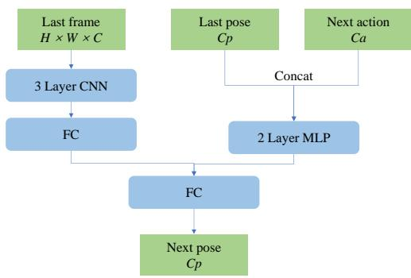  
Figure 9: Structure of pose predictor.

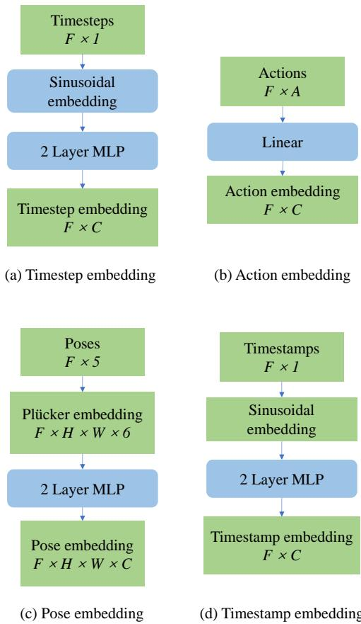  
Figure 10: Illustration of different embeddings.

Minecraft Training Examples. We present a diverse set of training environments that include various terrain types, action spaces, and weather conditions, as shown in Figure 12. These variations help enhance the model's adaptability and robustness in different scenarios.

Trajectory Examples in Minecraft. Figure 13 illustrates trajectory examples in the x-z space over 100 frames. The agent's movement exhibits a random action pattern, ensuring diverse learning objectives and a broad range of sampled experiences.

Pose Distribution. We collect and visualize 800 samples within a sampling range of 8, as shown in Figure 14. The random pattern observed in Figure 14 ensures a diverse distribution of sampled poses in space, which is beneficial for learning the reasoning process within the memory blocks.

# Algorithm 2: Monte Carlo-based FOV Overlap Computation (Notationally Disjoint)

#

: $Q _ { \mathrm { r e f } } \in \mathbb { R } ^ { F \times 5 }$ : reference poses from memory bank (x,y,z,pitch,yaw), $F$ is the number of stored poses.   
: $Q _ { \mathrm { t g t } } \in \mathbb { R } ^ { 5 }$ :pose of the current (target) frame.   
: $M$ : number of 3D sample points (default 10,000).   
: $R$ : radius of the sampling sphere (default $3 0 \mathrm { m }$ ).   
: $\phi _ { h }$ , $\phi _ { v }$ : horizontal/vertical field-of-view angles (in degrees).

# Output:

: $\boldsymbol { \rho } \in \mathbb { R } ^ { F }$ :overlapping ratios between each reference pose and the target pose.

# begin

# $\Delta$ Step 1: Random Sampling in a Sphere

Generate $M$ points $\mathbf { q }$ uniformly in a 3D sphere of radius $R$ :

$$
\mathbf { q } \gets \mathrm { P o i n t { S a m p l i n g } } \left( M , R \right) .
$$

$\Delta$ Step 2: Translate Points to $Q _ { \mathrm { t g t } }$ as Center

Let $Q _ { \mathrm { t g t } } ( x , y , z )$ be the 3D coordinates of the current camera pose. Shift all sampled points:

$$
\mathbf { q }  \mathbf { q } + Q _ { \mathrm { t g t } } ( x , y , z ) .
$$

$\Delta$ Step 3: FOV Checks

Compute a boolean matrix $\mathbf { v } _ { \mathrm { r e f } } \in \{ 0 , 1 \} ^ { F \times M }$ , where each entry indicates if a point in $\mathbf { q }$ lies in the FOV of a reference pose:

$$
\mathbf { v } _ { \mathrm { r e f } }  \mathrm { I s I n s i d e F O V } \Big ( \mathbf { q } , Q _ { \mathrm { r e f } } , \phi _ { h } , \phi _ { v } \Big ) .
$$

Similarly, compute a boolean vector $\mathbf { v } _ { \mathrm { t g t } } \in \{ 0 , 1 \} ^ { M }$ for the target pose:

$$
{ \bf v } _ { \mathrm { t g t } }  \mathrm { I s I n s i d e F O V } \Bigl ( { \bf q } , Q _ { \mathrm { t g t } } , \phi _ { h } , \phi _ { v } \Bigr ) .
$$

# $\Delta$ Step 4: Overlapping Ratio Computation

Obtain the final overlapping ratio vector $\boldsymbol { \rho } \in \mathbb { R } ^ { F }$ by combining $\mathbf { v } _ { \mathrm { r e f } }$ and $\mathbf { v } _ { \mathrm { t g t } }$ .For instance,

$$
\pmb { \rho } [ i ] = \frac { 1 } { M } \sum _ { j = 1 } ^ { M } \Bigl ( \mathbf { v } _ { \mathrm { r e f } } [ i , j ] \cdot \mathbf { v } _ { \mathrm { t g t } } [ j ] \Bigr ) ,
$$

to measure the fraction of sampled points that are visible in both the $i$ -th reference pose and the target pose.

Return $\rho$

end

More Qualitative Results. For additional qualitative examples, we recommend consulting the attached web page, which offers enhanced visualizations.

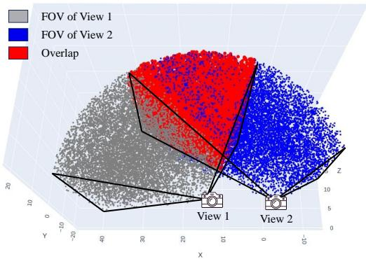  
Figure 11: Two-view FOV overlapping visualization.

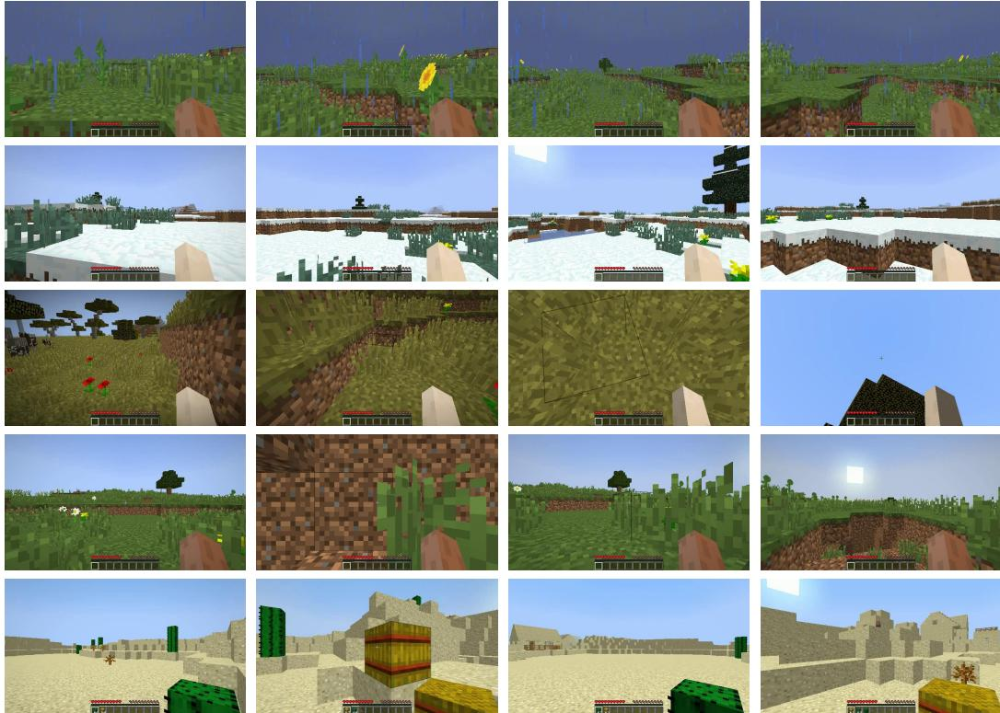  
Figure 12: Training Examples. Our training environments encompass diverse terrains, action spaces, and weather conditions, providing a comprehensive setting for learning.

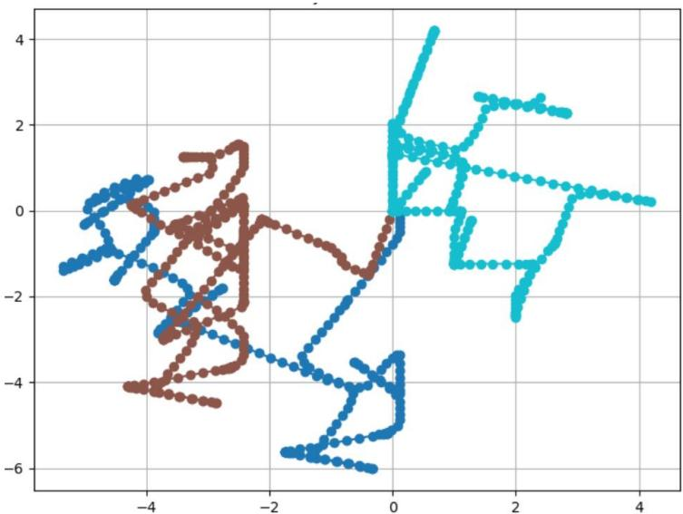  
Figure 13: Visualization of Trajectory Examples in the X-Z Space. The axis scales represent distances within the Minecraft environment.

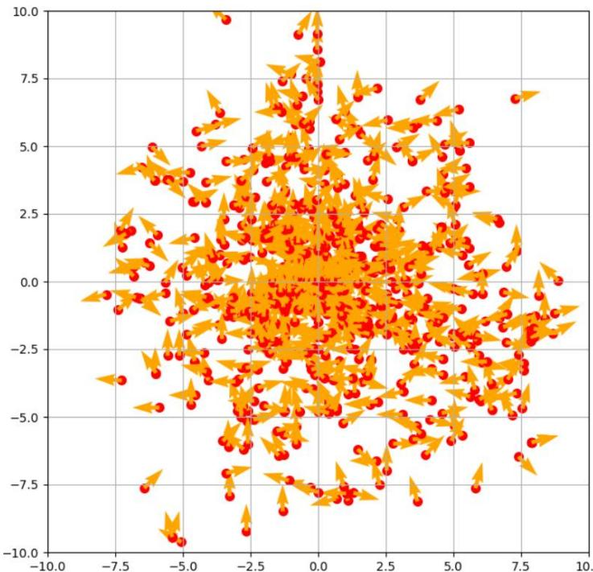  
Figure 14: Visualization of Relative Pose Distribution for Training in X-Z Space. Red dots indicate positions, while yellow arrows represent directions.