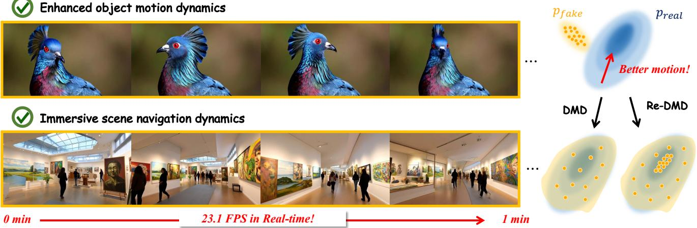
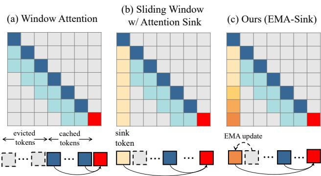
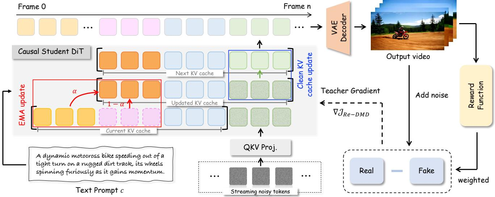
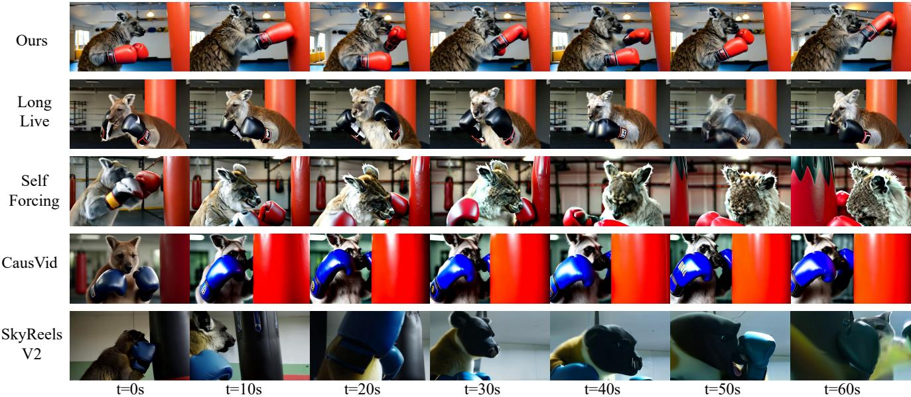
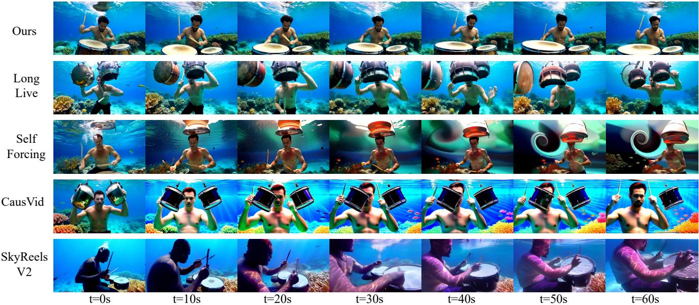
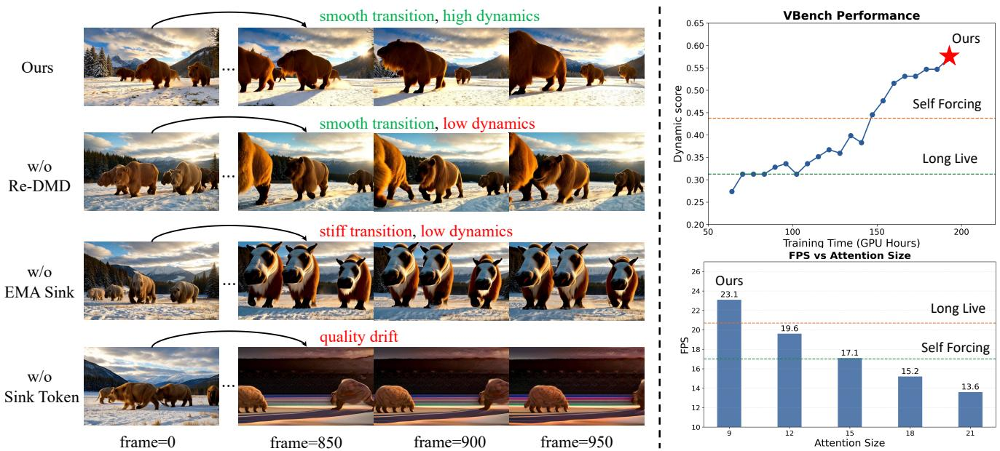
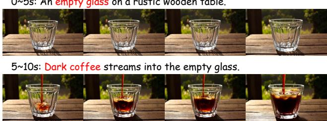
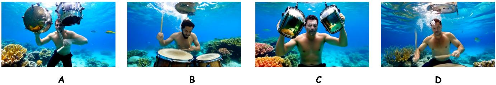

# Reward Forcing: Efficient Streaming Video Generation with Rewarded Distribution Matching Distillation

Yunhong Lu1,2 Yanhong Zeng†,2 Haobo $\mathrm { L i ^ { 2 , 4 } }$ Hao Ouyang2 Qiuyu Wang2 Ka Leong Cheng2 Jiapeng Zhu2 Hengyuan Cao1 Zhipeng Zhang4 Xing Zhu2 Yujun Shen2 Min Zhang\*,1,3 1Zhejiang University 2Ant Group 3SIAS-ZJU 4SJTU

https://reward-forcing.github.io/

  
enhanced object motion dynamics and immersive scene navigation dynamics in generated videos.

# Abstract

Efficient streaming video generation is critical for simulating interactive and dynamic worlds. Existing methods distill few-step video diffusion models with sliding window attention, using initial frames as sink tokens to maintain attention performance and reduce error accumulation. However, video frames become overly dependent on these static tokens, resulting in copied initial frames and diminished motion dynamics. To address this, we introduce Reward Forcing, a novel framework with two key designs. First, we propose EMA-Sink, which maintains fixed-size tokens initialized from initial frames and continuously updated by fusing evicted tokens via exponential moving average as they exit the sliding window. Without additional computation cost, EMA-Sink tokens capture both long-term context and recent dynamics, preventing initial frame copying while maintaining long-horizon consistency. Second, to better distill motion dynamics from teacher models, we propose a novel Rewarded Distribution Matching Distillation (Re-DMD). Vanilla distribution matching treats every training sample equally, limiting the model's ability to prioritize dynamic content. Instead, Re-DMD biases the model's output distribution toward high-reward regions by prioritizing samples with greater dynamics rated by a vision-language model. Re-DMD significantly enhances motion quality while preserving data fidelity. We include both quantitative and qualitative experiments to show that Reward Forcing achieves state-of-the-art performance on standard benchmarks while enabling high-quality streaming video generation at 23.1 FPS on a single H100 GPU.

# 1. Introduction

The scaling of video diffusion transformers (DiTs) [53, 72] has advanced text-to-video generation, producing realistic videos with intricate dynamics [2, 4, 11, 76]. However, their simultaneous denoising of all frames using bidirectional attention hinders interactive applications, which demand streaming generation over extended horizons under strict latency constraints. Achieving both low latency and high visual-dynamic fidelity remains the central challenge.

To achieve efficient streaming video generation, recent advances distill slow pre-trained bidirectional diffusion models into efficient few-step autoregressive student models [7, 30, 89]. In these models, each frame attends only to previous frames with sliding window attention, enabling real-time streaming inference through key-value (KV) cache mechanisms. However, they often suffer from the well-known error accumulation issue [6, 30], as each frame depends on potentially corrupted previous outputs, causing errors to propagate progressively.

To mitigate error accumulation, recent works have adopted attention sink mechanisms that retain initial tokens in the KV cache [45, 62, 82]. Such a design largely recovers the performance of sliding window attention and alleviates long-horizon drifting. However, a new challenge arises: by consistently preserving initial tokens throughout generation, models develop a strong bias toward the starting frame, leading to over-attention on initial content. This manifests as diminished motion dynamics, where subsequent frames fail to evolve naturally, and frequent visual flashbacks that revert to the first frame's appearance. While classical distribution matching distillation [86, 87] minimizes the divergence between student and teacher output distributions to transfer knowledge, this strategy struggles to address the over-attention issue. The degraded samples, despite their motion deficiencies, usually exhibit good visual quality and already fall close to the teacher distribution, making them difficult to distinguish and optimize.

In this paper, we propose Reward Forcing, a novel framework with two key technical innovations to ensure both high visual and dynamic fidelity for efficient streaming video generation. During training, Reward Forcing generates video chunks autoregressively by conditioning on previously self-generated outputs through KV cache mechanisms to bridge the train-test gap, following Self Forcing [30]. Instead of using static initial tokens as sink tokens in the KV cache, we introduce EMA-Sink, a novel state packaging mechanism for ultra-long video sequences. The core idea of EMA-Sink is to maintain fixed-size tokens initialized from initial frames while continuously updating them by fusing evicted tokens via exponential moving average as they exit the sliding window. Without additional cost, this design not only compresses effective global context to maintain attention performance, but also introduces recent dynamics to prevent over-attending to initial frames. To better distill motion dynamics from teacher models, we introduce Rewarded Distribution Matching Distillation (Re

DMD). Instead of treating all samples equally as in vanilla distribution matching distillation, Re-DMD is able to distinguish samples with diminished motion dynamics and prioritizes matching with samples exhibiting greater dynamics. To this end, Re-DMD uses a powerful vision-language model as reward function to rate samples according to their motion quality, then uses these scores to weight distribution matching gradients. This effectively biases the distribution matching toward high-quality regions while preserving high data fidelity, leading to enhanced motion dynamics in streaming video generation. Comprehensive experimental evaluation on both short and long video benchmarks demonstrates that Reward Forcing achieves state-of-the-art video quality at 23.1 FPS on a single H100 GPU.

# 2. Related Works

Autoregressive long video generation. Video diffusion models have advanced short video generation, yet most state-of-the-art models are limited to 510 second clips. To reduce the high cost of bidirectional denoising, recent studies have adopted autoregressive diffusion modeling for long video generation [18, 24, 39, 41, 64, 84, 91, 94]. Among these, Pyramidal-flow employs multi-scale flow matching to alleviate computational burden [33], while SkyReels-V2 integrates diffusion forcing [6] with structural planning and multi-modal control [7]. FAR combines short and longterm contexts via flexible positional encoding [20], and MAGI-1 utilizes chunk-wise prediction for scalable autoregressive generation [69]. CausVid reformulates bidirectional diffusion as causal generation through distribution matching distillation [86, 87] to reduce denoising steps [89]. Self-Forcing builds on this framework to mitigate train-test discrepancy by simulating inference conditions [30], which is further extended by LongLive through KV recaching and stream-based fine-tuning for long video generation [82], and by Rolling-Forcing via joint denoising for simultaneous multi-frame processing [45]. However, these methods consistently trade off motion dynamics against visual quality, often introducing cumulative artifacts.

Reinforcement learning for video generation. Reinforcement learning [67] addresses optimizing non-differentiable metrics and temporally extended outcomes, enabling video generation models to better align with human preferences. Research has diverged into two strands. The first develops specialized datasets and reward models [44, 57, 79] for video evaluation. The second integrates RL algorithms into generation pipelines. Some approaches use rewards [56, 90] to directly supervise generative models, while direct preference optimization (DPO) methods [48, 49, 60] implicitly learn preferences from datasets without explicit reward modeling, showing strong robustness [46, 93]. Additionally, policy optimization [92] techniques, such as SelfForcing $^ { + + }$ [11], incorporate Flow-GRPO [43] into DMDdistilled models to improve long-term temporal smoothness. However, this method depends on pre-distilled models, with performance inherently tied to base model.

# 3. Method

# 3.1. Preliminaries

Autoregressive video diffusion models. In autoregressive video diffusion models, an $N$ -frame sequence $\pmb { x } ^ { \bar { 1 } : N }$ folows $\begin{array} { r } { p ( \pmb { x } ^ { 1 : N } ) = \prod _ { i = 1 } ^ { N } p ( \pmb { x } ^ { i } | \pmb { x } ^ { < i } ) } \end{array}$ Self Foring 30 introduces an autoregressive self-rollout mechanism aligning training with inference. During training, each frame $\mathbf { x } ^ { i }$ undergoes iterative denoising conditioned on previously generated clean frames and its noisy state, sampling from the autoregressive distribution. A few-step diffusion model $G _ { \theta }$ approximates each conditional $p ( \pmb { x } ^ { i } | \pmb { x } ^ { < i } )$ . Given timesteps $\{ t _ { 0 } , t _ { 1 } , \cdots , t _ { T } \}$ , denoising at step $t _ { j }$ for frame $i$ processes noisy frame $\mathbf { \Delta } \mathbf { x } _ { t _ { j } } ^ { i }$ conditioned on $\mathbf { \boldsymbol { x } } ^ { < i }$ , then reintroduces controlled Gaussian noise via forward process $\Psi$ to yield $\pmb { x } _ { t _ { j } } ^ { i }$ for the next step. The model distribution is: $p _ { \theta } ( \pmb { x } ^ { i } | \pmb { x } ^ { < i } ) = f _ { \theta , t _ { 1 } } \circ f _ { \theta , t _ { 2 } } \circ \cdots \circ f _ { \theta , t _ { T } } ( \pmb { x } _ { t _ { T } } ^ { i } )$ where $f _ { \theta , t _ { j } } ( \pmb { x } _ { t _ { j } } ^ { i } ) = \Psi ( G _ { \theta } ( \pmb { x } _ { t _ { j } } ^ { i } , t _ { j } , \pmb { x } ^ { < i } ) , t _ { j - 1 } )$ and $x _ { t _ { T } } ^ { i } \sim$ $\mathcal { N } ( 0 , \bf { I } )$ . For longer sequences, LongLive [82] uses sink tokens [78] with $p ( \pmb { x } ^ { i } | \pmb { x } ^ { 1 } , \pmb { x } ^ { i - w + 1 : i - 1 } )$ (window size $w$ to model $p ( \pmb { x } ^ { i } | \pmb { x } ^ { < i } )$ , but over-relies on the initial frame, limiting dynamic variation and smooth transitions. While models can output multi-frame chunks per step [30, 69, 89], we term each chunk a "frame" for simplicity.

Distribution matching distillation. DMD [86, 88] distills multi-step diffusion models into a few-step generator $G$ by minimizing reverse KL divergence between real $p _ { \mathrm { r e a l } } ( \pmb { x } )$ and generated distributions $p _ { \mathrm { f a k e } } ( { \pmb x } )$ across timesteps:

$$
\begin{array} { r l } & { \nabla _ { \theta } \mathcal { L } _ { \mathrm { D M D } } \triangleq \mathbb { E } _ { t } ( \nabla _ { \theta } \mathbb { D } _ { \mathrm { K L } } ( p _ { \mathrm { f a k e } , t } ( { \pmb x } _ { t } ) | | p _ { \mathrm { r e a l } , t } ( { \pmb x } _ { t } ) ) ) } \\ & { ~ \approx - \mathbb { E } _ { t } \Big ( \displaystyle \int ( s _ { \mathrm { r e a l } } ( \Psi ( G _ { \theta } ( { \epsilon } ) , t ) , t ) } \\ & { ~ - s _ { \mathrm { f a k e } } ( \Psi ( G _ { \theta } ( { \epsilon } ) , t ) , t ) ) \frac { \mathrm { d } G _ { \theta } ( { \epsilon } ) } { \mathrm { d } \theta } \mathrm { d } { \epsilon } \Big ) . } \end{array}
$$

where $\epsilon \sim \mathcal { N } ( 0 , \bf { I } )$ , $\Psi$ denotes forward diffusion at timestep $t$ . In diffusion models, the score function is defined as:

$$
s _ { \mathrm { r e a l } } ( \mathbf { x } _ { t } , t ) = \nabla _ { x _ { t } } \log p _ { \mathrm { r e a l } , t } ( \mathbf { x } _ { t } ) = - \frac { \mathbf { x } _ { t } - \alpha _ { t } \mu _ { \mathrm { r e a l } } ( \mathbf { x } _ { t } , t ) } { \sigma _ { t } ^ { 2 } } ,
$$

where $\mu _ { \mathrm { r e a l } }$ is the denoised estimate, and $\alpha _ { t } , \sigma _ { t }$ are noise schedule parameters [25, 34, 52]. DMD freezes pre-trained $\mu _ { \mathrm { r e a l } }$ (teacher) and updates $\mu _ { \mathrm { f a k e } }$ on generator outputs.

Reinforcement learning. A unified RL [67] fine-tuning objective is established by maximizing the evidence lower bound for optimal video generation $\scriptstyle { \mathbf { { \mathit { x } } } } _ { 0 }$ , culminating in an RL objective that makes an explicit trade-off between reward maximization and fidelity to the original model:

$$
\mathcal { T } _ { \mathrm { R L } } ( p , q ) = \mathbb { E } \Big [ \frac { r ( { \pmb x } _ { 0 } , { \pmb c } ) } { \beta } - \log \frac { p ( { \pmb x } _ { 0 } | { \pmb c } ) } { q ( { \pmb x } _ { 0 } | { \pmb c } ) } \Big ] .
$$

Here, $\scriptstyle { \mathbf { { \mathit { x } } } } _ { 0 }$ denotes the output, $r$ represents the reward model, $^ c$ represents the conditioning input, $p$ and $q$ are distributions, and $\beta$ acts as the regularization term.

  
Figure 2. Comparison of EMA Sink with Existing Methods. Long video generation models typically extrapolate beyond their training sequence length during inference. (a) Window Attention caches only recent tokens for efficient inference but suffers performance degradation. (b) Sliding Window with attention sinks retains initial tokens for stable attention computation and recent tokens for extrapolation. However, discarding intermediate frames causes over-reliance on the first frame, leading to "frame copying" and stiff transitions. (c) EMA Sink preserves full history through exponential moving average (EMA) updates of all historical frames, maintaining stable and consistent performance in long video extrapolation without increasing computational cost.

# 3.2. EMA-Sink: state packaging for long video

Problem formulation. Efficient streaming video generation aims to create indefinitely long videos while maintaining strict temporal and causal consistency. Although sliding window attention is widely adopted in autoregressive models to reduce computational cost, current approaches fail to retain historical context beyond their limited attention windows [89]. As generation progresses, earlier frames are discarded, creating an information bottleneck that diminishes global awareness and leads to temporal inconsistencies and quality drift over time. To address this, we introduce EMASink, a novel state-packaging mechanism that compresses history to support efficient autoregressive generation. Our approach preserves global context in a compact, computationally efficient form throughout the streaming process.

For further illustration, given a noise schedule $\boldsymbol { \mathcal { T } } =$ $\{ t _ { j } \} _ { j = 0 } ^ { T }$ consisting of distinct noise levels, the model processes each intermediate noisy frame $\mathbf { \Delta } \mathbf { x } _ { t _ { j } } ^ { i }$ at denoising step $t _ { j }$ and frame index $i$ , incorporating earlier clean frames $\bar { { \mathcal X } } ^ { i , w } = [ { \pmb x } ^ { i - w + 1 : i - 1 } ]$ where $w$ denotes the window size used during video extrapolation $( i \mathrm { ~  ~ { ~ > ~ } ~ } w )$ . It first estimates a denoised version of the frame, then applies the forward diffusion operator $\Psi$ to reintroduce a lower level of Gaussian noise, producing $\pmb { x } _ { t _ { j - 1 } } ^ { i }$ for subsequent denoising:

  
reward function. This score is then used to weight the distribution matching gradient from the teacher model.

$\Psi ( G _ { \theta } ( \pmb { x } _ { t _ { j } } ^ { i } , t _ { j } , \pmb { \chi } _ { i } ^ { w } ) , t _ { j - 1 } )$ ,where $\mathbf { \boldsymbol { x } } _ { t _ { T } } ^ { i } \ \sim \ { \mathcal { N } } ( 0 , \mathrm { I } )$ . As the window advances to frame $i + 1$ , the oldest frame $\scriptstyle x ^ { i - w + 1 }$ is removed from immediate access and is permanently discarded, thereby creating an information bottleneck [30].

EMA-Sink mechanism. Rather than discarding evicted frames, EMA-Sink maintains compressed global states ${ \cal S } _ { \ast } ^ { i }$ in the KV-cache through an exponential moving average. When frame $\mathbf { \Delta } x ^ { i - w }$ is evicted from the sliding window, its key-value pair $( K ^ { i - w } , V ^ { i - w } )$ is continuously fused into the compressed sink states $S _ { * } ^ { i }$ .

$$
\begin{array} { r } { { \pmb { S } } _ { K } ^ { i } = \alpha \cdot { \pmb { S } } _ { K } ^ { i - 1 } + ( 1 - \alpha ) \cdot { \pmb { K } } ^ { i - w } , } \\ { { \pmb { S } } _ { V } ^ { i } = \alpha \cdot { \pmb { S } } _ { V } ^ { i - 1 } + ( 1 - \alpha ) \cdot { \pmb { V } } ^ { i - w } . } \end{array}
$$

Here $\alpha \in ( 0 , 1 )$ is the momentum decay factor controlling compression rate, providing smooth temporal compression where recent information dominates while preserving a fading memory of distant history. During attention computation [70], we prepend the compressed sink states to the local window context:

$$
K _ { \mathrm { g l o b a l } } ^ { i } = \left[ S _ { K } ^ { i } ; K ^ { i - w + 1 : i } \right] ,
$$

$$
V _ { \mathrm { \ g l o b a l } } ^ { i } = \left[ S _ { V } ^ { i } ; V ^ { i - w + 1 : i } \right] ,
$$

where $K ^ { i - w + 1 : i }$ and Vi-w+1:i represent the key and value states from the current sliding window. This formulation allows each query to attend to both the fine-grained local context and the coarse-grained global history, effectively breaking the information bottleneck of the fixed window size. To handle the spatial-temporal nature of video while maintaining causal relationships, we employ a rotary position embedding (ROPE) [65] when calculating attention. The position encoding is applied causally, ensuring that each position can only attend to previous positions in the sequence.

# 3.3. Rewarded distribution matching distillation

Problem formulation. DMD [86, 88] offers an effective framework for converting multi-step diffusion models into efficient single-step generators by enforcing alignment between the fake and real distributions:

$$
\mathcal { T } _ { \mathrm { D M D } } = \mathbb { E } _ { p ( c ) p _ { \mathrm { f a k e } } ( \pmb { x } _ { 0 } | c ) } \Big [ \log \frac { p _ { \mathrm { f a k e } } ( \pmb { x } _ { 0 } | \pmb { c } ) } { p _ { \mathrm { r e a l } } ( \pmb { x } _ { 0 } | \pmb { c } ) } \Big ] .
$$

Despite its success in preserving sample fidelity, DMD has a fundamental limitation: it treats all regions of the target distribution uniformly, lacking any mechanism to prioritize high-quality outputs according to task-specific metrics. This becomes particularly problematic in video generation, where models progressively produce increasingly static frames during training. This observation motivates a key question: Can we incorporate motion awareness into the distillation process while maintaining distributional $\mathscr { f }$ . delity? We address this challenge by integrating RL principles [67] to bias the distillation toward high-reward regions of the output space, thereby generating content with enhanced properties without sacrificing data fidelity.

Re-DMD mechanism. We introduce Rewarded Distribution Matching Distillation (Re-DMD), which reweights the distribution matching objective according to sample motion quality. Our approach builds on the Reward-Weighted Regression framework [16, 38, 44, 54], which reformulates the reinforcement learning problem as probabilistic inference via the Expectation-Maximization (EM) algorithm [51].

  
o .   
motion dynamics while baselines exhibit diminished dynamics and weaker alignment.

In the E-step [51, 54], we solve Eq. (3) as a constrained optimization problem, obtaining the optimal solution:

$$
p ( \pmb { x } _ { 0 } | \pmb { c } ) = \frac { 1 } { Z ( \pmb { c } ) } q ( \pmb { x } _ { 0 } | \pmb { c } ) \exp \Big ( \frac { r ( \pmb { x } _ { 0 } , \pmb { c } ) } { \beta } \Big ) ,
$$

where $\begin{array} { r } { Z ( \pmb { c } ) \ = \ \sum _ { \pmb { x } _ { 0 } } p ( \pmb { x } _ { 0 } | \pmb { c } ) \exp ( \frac { r ( \pmb { x } _ { 0 } , \pmb { c } ) } { \beta } ) . \mathbb { W } } \end{array}$ eassign the distributions in Eq. (3) as $q = p _ { \mathrm { f a k e } } ^ { \prime }$ and $p = p _ { \mathrm { r e a l } } ^ { \prime }$ .

In the M-step [51, 54], we project the nonparametric optimal model $p = p _ { \mathrm { r e a l } } ^ { \prime }$ onto the parametric model by maximizing expected log-likelihood Eq. (3) with respect to $p _ { \mathrm { f a k e } }$

$$
\mathcal { T } _ { \mathrm { R e - D M D } } = \mathbb { E } _ { p ( c ) p _ { \mathrm { f a k e } } ^ { \prime } ( \pmb { x } _ { 0 } | c ) } \left[ \frac { \exp \left( r \left( \pmb { x } _ { 0 } , \pmb { c } \right) / \beta \right) } { Z ( \pmb { c } ) } \log \frac { p _ { \mathrm { f a k e } } \left( \pmb { x } _ { 0 } | \pmb { c } \right) } { p _ { \mathrm { r e a l } } \left( \pmb { x } _ { 0 } | \pmb { c } \right) } \right] .
$$

Computing the probability density to estimate this loss is generally intractable. However, when training the generator via gradient descent, we only need to obtain the gradient with respect to $\theta$ By differentiating Eq. (10), we obtain:

$$
\begin{array} { r l } & { \nabla _ { \theta } \mathcal { J } _ { \mathrm { R e - D M D } } = \mathbb { E } _ { t } \Big ( \nabla _ { \theta } \mathbb { E } _ { p _ { \mathrm { f a k e } } ^ { c } ( \pmb { x } _ { t } ) } \Big [ \frac { \exp \big ( r ^ { c } ( \pmb { x } _ { t } ) / \beta \big ) } { Z ( c ) } \log \frac { p _ { \mathrm { f a k e } } ^ { c } ( \pmb { x } _ { t } ) } { p _ { \mathrm { r e a l } } ^ { c } ( \pmb { x } _ { t } ) } \Big ] \Big ) } \\ & { \approx - \mathbb { E } _ { t } \Big ( \int \exp ( r ^ { c } ( \pmb { x } _ { t } ) / \beta ) \cdot \big ( s _ { \mathrm { r e a l } } ( \Psi ( G _ { \theta } ( \epsilon ) , t ) , t ) } \\ & { \quad \quad \quad - s _ { \mathrm { f a k e } } \big ( \Psi ( G _ { \theta } ( \epsilon ) , t ) , t ) \big ) \frac { \mathrm { d } G _ { \theta } ( \epsilon ) } { \mathrm { d } \theta } \mathrm { d } \epsilon \Big ) . } \end{array}
$$

where $\epsilon$ is random Gaussian noise, and $G _ { \theta }$ is a generator parameterized by $\theta$ . $s _ { \mathrm { r e a l } }$ and $s _ { \mathrm { f a k e } }$ represent the score functions trained on the data and the generator's output distribution, respectively, using a denoising objective. In addition, $r ^ { \mathbf { c } } ( { \boldsymbol { \mathbf { x } } } _ { t } )$ is estimated by $r ^ { \mathbf { c } } ( { \boldsymbol { \mathbf { x } } } _ { 0 } )$ . This approach stabilizes training and accelerates convergence by bypassing the intractable normalization constant and alleviating the need to compute the reward function's gradient.

# 3.4. Efficiency analysis

Theoretical properties. The EMA-Sink enables token eviction in $O ( 1 )$ time with low overhead. While attention remains $O ( w ^ { 2 } )$ in window size, it becomes independent of sequence length. By compressing history into a fixedsize sink, our method achieves constant memory usage relative to sequence length while retaining global context. The differentiable EMA enables gradient propagation through compression, supporting end-to-end learning of compression strategies. The Re-DMD objective implicitly optimizes a constrained reward maximization problem (maximizing expected reward under a distribution matching constraint), ensuring systematic quality improvement without distributional collapse. Notably, our approach avoids typical RL computational costs: the reward serves as a static weighting factor, eliminating backpropagation through reward models and preventing instability from noisy reward gradients.

Real-time long video inference. Long video generation faces quadratic complexity with dense causal attention, hindering real-time synthesis. Local window attention confines complexity to window size, independent of sequence length. With KV cache scaling by window dimension rather than video length, smaller windows accelerate inference and significantly improve efficiency.

  
Prompt: A dramatic underwater photograph captures a man performing an intense drumming session.   
while baselines suffer from noticeable quality degradation and inconsistency over time.

# 4. Experiments

Implementation details. Reward Forcing is built upon Wan2.1-T2V-1.3B [72] to generate 5-second videos at $8 3 2 \times 4 8 0$ resolution. The model is first trained on 16k ODE solution pairs sampled from the base model, initialized with causal attention masking, following CausVid [89]. Text prompts are drawn from the filtered and LLM-augmented VidProM [73] dataset. We use VideoAlign's [44] motion quality as the reward function with $\beta = \textstyle { \frac { 1 } { 2 } }$ . During training, denoising is applied chunk-wise using 3 latent frames per chunk, with denoising steps set to [1000, 750, 500, 250] and an attention window size of 9. Training runs for 600 steps on $6 4 ~ \mathrm { H } 2 0 0$ GPUs with a total batch size of 64 (3 hours). The AdamW optimizer is adopted with learning rates of $2 . 0 \times 1 0 ^ { - 6 }$ for the generator $G _ { \theta }$ and $4 . 0 \times 1 0 ^ { - 7 }$ for the fake score $s _ { \mathrm { f a k e } }$ , updating the generator every 5 steps and adjusting the fake score $s _ { \mathrm { f a k e } }$ accordingly.

# 4.1. Comparison with state-of-the-art

Short video generation. We generate 5-second videos using 946 official VBench [31, 32] prompts rewrited using Qwen/Qwen2.5-7B-Instruct [1] following Self Forcing [30], each sampled with 5 different seeds for comprehensive quality assessment. We benchmark our method against relevant open-source video generation models of comparable scale, including LTXVideo [13], Wan2.1 [72],

Table 1. Short video performance comparison with baselines. The comparison includes representative open-source models of comparable scale. Best results in bold, second-best underlined.   

<table><tr><td rowspan="2">Model</td><td rowspan="2">Params</td><td rowspan="2">FPS↑</td><td colspan="3">VBench evaluation scores ↑</td></tr><tr><td>Total</td><td>Quality</td><td>Semantic</td></tr><tr><td colspan="6">Diffusion</td></tr><tr><td>LTX-Video [13]</td><td>1.9B</td><td>8.98</td><td>80.00</td><td>82.30</td><td>70.79</td></tr><tr><td>Wan-2.1 [72]</td><td>1.3B</td><td>0.78</td><td>84.26</td><td>85.30</td><td>80.09</td></tr><tr><td colspan="6">Autoregressive</td></tr><tr><td>SkyReels-V2 [7]</td><td>1.3B</td><td>0.49</td><td>82.67</td><td>84.70</td><td>74.53</td></tr><tr><td>MAGI-1 [69]</td><td>4.5B</td><td>0.19</td><td>79.18</td><td>82.04</td><td>67.74</td></tr><tr><td>NOVA [13]</td><td>0.6B</td><td>0.88</td><td>80.12</td><td>80.39</td><td>79.05</td></tr><tr><td>Pyramid Flow [33]</td><td>2B</td><td>6.7</td><td>81.72</td><td>84.74</td><td>69.62</td></tr><tr><td>CausVid [89]</td><td>1.3B</td><td>17.0</td><td>82.88</td><td>83.93</td><td>78.69</td></tr><tr><td>Self Forcing [30]</td><td>1.3B</td><td>17.0</td><td>83.80</td><td>84.59</td><td>80.64</td></tr><tr><td>LongLive [82]</td><td>1.3B</td><td>20.7</td><td>83.22</td><td>83.68</td><td>81.37</td></tr><tr><td>Rolling Forcing [45]</td><td>1.3B</td><td>17.5</td><td>81.22</td><td>84.08</td><td>69.78</td></tr><tr><td>Ours</td><td>1.3B</td><td>23.1</td><td>84.13</td><td>84.84</td><td>81.32</td></tr></table>

SkyReels-V2 [7], MAGI-1 [69], CausVid [89], NOVA [13], Pyramid Flow [33], Self Forcing [30], LongLive [82], and Rolling Forcing [45]. The overall score of VBench comprises both quality and semantic components. As shown in Tab. 1, our method achieves an overall score of 84.13 on the 5-second clips, surpassing all existing baselines and demonstrating superior video generation quality. Notably, our approach employs the smallest attention window while achieving the fastest inference speed among all compared methods. Specifically, we attain a real-time generation speed of 23.1 FPS, representing a $4 7 . 1 4 \times$ speedup over SkyReels-V2 and a $1 . 3 6 \times$ speedup over Self Forcing.

Table 2. Long video performance comparison with key baselines. The best results are highlighted in bold.   

<table><tr><td rowspan="2">Model</td><td colspan="7">VBench Long Evaluation Scores ↑</td><td rowspan="2">Drift↓</td><td colspan="3">Qwen3-VL Score ↑</td></tr><tr><td></td><td></td><td></td><td></td><td></td><td></td><td>Total Subject Background Smoothness Dynamic Aesthetic Imaging Quality</td><td>Visual Dynamic Text</td><td></td><td></td></tr><tr><td>Diffusion Forcing</td><td></td><td></td><td></td><td></td><td></td><td></td><td></td><td></td><td></td><td></td><td></td></tr><tr><td>SkyReels-V2 [7]</td><td></td><td>75.94 96.43</td><td>96.59</td><td>98.91</td><td>39.86</td><td>50.76</td><td>58.65</td><td>7.315</td><td>3.30</td><td>3.05</td><td>2.70</td></tr><tr><td>Distilled Causal</td><td></td><td></td><td></td><td></td><td></td><td></td><td></td><td></td><td></td><td></td><td></td></tr><tr><td>Caus Vid [89]</td><td>77.78</td><td>97.92</td><td>96.62</td><td>98.47</td><td>27.55</td><td>58.39</td><td>67.77</td><td>2.906</td><td>4.66</td><td>3.16</td><td>3.32</td></tr><tr><td>Self Forcing [30]</td><td>79.34</td><td>97.10</td><td>96.03</td><td>98.48</td><td>54.94</td><td>54.40</td><td>67.61</td><td>5.075</td><td>3.89</td><td>3.44</td><td>3.11</td></tr><tr><td>LongLive [82]</td><td>79.53</td><td>97.96</td><td>96.50</td><td>98.79</td><td>35.54</td><td>57.81</td><td>69.91</td><td>2.531</td><td>4.79</td><td>3.81</td><td>3.98</td></tr><tr><td>Ours</td><td>81.41</td><td>97.26</td><td>96.05</td><td>98.88</td><td>66.95</td><td>57.47</td><td>70.06</td><td>2.505</td><td>4.82</td><td>4.18</td><td>4.04</td></tr></table>

Long video generation. Qualitative analysis of the results confirms the effectiveness of our approach. Specifically, Figure 4 illustrates its capability to produce more dynamic sequences for long video generation, and Figure 5 validates its improved temporal consistency. For long video quantitative evaluation, we use the first 128 prompts from MovieGen (consistent with CausVid [89]), extending generation duration to 60 seconds. We employ VBenchLong [32] metrics, including subject consistency, background consistency, motion smoothness, dynamic degree, aesthetic quality, and imaging quality, normalized and weighted using standard VBench [31] coefficients to compute the total score. To quantify drift in long video generation, we compute the standard deviation of imaging quality across 30 segments (2 seconds each) from 60-second videos. As shown in Tab. 2, our method achieves a total score of 81.41, significantly surpassing the state-of-the-art baseline LongLive (79.53). Notably, we observe substantial improvement in the dynamic metric (66.95), representing an $8 8 . 3 8 \%$ boost in dynamic amplitude while minimizing quality drift, demonstrating our method's effectiveness with comparable performance on other metrics. Additionally, we employ Qwen3-VL-235B-A22B-Instruct [1] to evaluate long video generation quality at 5560 seconds, assessing visual quality, motion dynamics, and text alignment (see more details in the supplements). Each of the 128 videos is scored from 1 to 5, with averaged results showing our model achieves the best performance across all three metrics. We also include a user study for comprehensive comparison in the supplementary material, which demonstrates that our method consistently outperforms all key baselines.

# 4.2. Ablation studies

Impact of EMA-Sink and Re-DMD. We show the effectiveness of Reward Forcing through qualitative and quantitative comparisons. Qualitatively, as presented in Fig. 6, our method maintains smooth transitions and high dynamism when generating 850950 frames (approximately 1 minute), with clearly perceptible fluidity between consecutive frames. Without Re-DMD training, long video generation preserves high consistency with the initial frame and smooth scene transitions, but exhibits significantly reduced dynamism with the dynamic score drops from 64.06 to 43.75 ( Tab. 3). As illustrated in Fig. 6, removing the EMA Sink module results in considerable inconsistency with the first frame and minimal dynamism, reflected quantitatively by declining motion smoothness (98.91 to 98.64 in Tab. 3) and dynamic score (43.75 to 35.15). Ablating the sink token leads to noticeable quality degradation.

Table 3. Ablation studies on key components. The best results for the "Improvement" module are indicated in bold.   

<table><tr><td rowspan="2">Model</td><td colspan="4">VBench Evaluation Scores ↑</td><td rowspan="2">Drift↓</td></tr><tr><td>Background Smooth</td><td></td><td>Dynamic</td><td>Quality</td></tr><tr><td colspan="6">Improvement</td></tr><tr><td>Ours w/o Re-DMD w/o EMA w/o Sink</td><td>95.07 95.85 95.61</td><td>98.82 98.91 98.64 98.56</td><td>64.06 43.75 35.15 51.56</td><td>70.57 71.42 70.50 69.92</td><td>2.51 1.77 2.65 5.08</td></tr><tr><td colspan="6">94.94 Impact of α</td></tr><tr><td>α = 0.99 α = 0.9 α = 0.5</td><td>95.90 95.80 94.57</td><td>98.96 99.09 98.89</td><td>65.15 63.15 64.37</td><td>70.81 71.37 71.11</td><td>2.52 3.23 3.78</td></tr><tr><td colspan="6">Impact of β</td></tr><tr><td>β= 1 β = 2/3</td><td>95.14 95.02</td><td>98.31 98.46</td><td>54.68 60.93</td><td>71.73 70.61</td><td>2.63 1.91</td></tr><tr><td>β = 1/3</td><td>94.94</td><td>98.43</td><td>58.59</td><td>69.29</td><td>2.02</td></tr><tr><td>β = 1/5</td><td>92.40</td><td>96.40</td><td>94.53</td><td>68.26</td><td>3.13</td></tr></table>

Impact of EMA update weight $\alpha$ An appropriately EMA coefficient $\alpha$ ensures smooth scene transitions in long videos, while a suitable $\alpha$ value effectively balances motion fluidity and temporal consistency. In our implementation, $\alpha$ is set to $9 e ^ { - 3 }$ . We can observe from Tab. 3 that $\alpha = 0 . 9 9$ achieves a motion smoothness of 98.96 with a corresponding drift of 2.52. Conversely, reducing $\alpha$ to 0.9 improves motion smoothness to 99.09 but increases drift to 3.23.

Impact of reward weight $\beta$ The parameter $\beta$ modulates the reward term's influence, with smaller values assigning higher reward weight. As illustrated in Tab. 3, an excessively small $\beta$ (e.g., 1/5) yields an overly high dynamic score (94.53) at the expense of background consistency (92.40), motion smoothness (96.40), and image quality (68.26). Conversely, an overly large $\beta$ (e.g., 1) produces an insufficient dynamic score (54.68). Therefore, we select $\beta = 1 / 2$ to optimally balance these metrics.

# 4.3. Analysis

Dynamic enhancement of Re-DMD. We employ the VBench dynamic score (averaged over the first 128 prompts) to evaluate training effectiveness. An inspection of Fig. 6 reveals that the dynamic score increases steadily with training time while requiring modest computational resources (under 200 GPU hours). Our method surpasses LongLive (high consistency, low dynamism) after only 100 GPU hours and exceeds Self-Forcing (high dynamism, severe drift) after 150 GPU hours. Our model achieves high dynamism while maintaining strong consistency.

Impact of attention window size. The attention window size is a critical factor affecting the speed of real-time generation. Figure 6 demonstrates that inference FPS is inversely proportional to the size of the attention window.

Interactive video generation. As shown in Fig. 7, our method supports interactive video generation, allowing users to modify prompts during generation to control output content. This is achieved by clearing the previous crossattention cache and recomputing it with the new prompt. Our EMA Sink mechanism ensures seamless prompt transitions while maintaining high temporal consistency.

  
Figure 7. Interactive video generation. Reward Forcing supports real-time prompt interaction with seamless transitions.

# 5. Conclusion

We presented Reward Forcing, which tackles the problem of motion stagnation in efficient streaming video generation. Our solution is built on two pillars: the EMA-Sink mechanism, which dynamically maintains context to prevent over-dependence on initial frames and ensures longterm coherence, and Re-DMD, which enhances motion dynamics by prioritizing high-reward samples during distillation. Our experiments confirmed that the proposed method achieves state-of-the-art performance on standard benchmarks. By successfully balancing high visual fidelity with strong dynamic motion, Reward Forcing enables highquality streaming video generation in real-time. This work establishes a new benchmark for performance and efficiency in generating dynamic, interactive virtual worlds.

# 6. Acknowledgments

This work was supported by the National Major Science and Technology Projects (the grant number 2022ZD0117000) and the National Natural Science Foundation of China (grant number 62202426). This work was supported by Ant Group Research Intern Program.

# References

[1] Shuai Bai, Keqin Chen, Xuejing Liu, Jialin Wang, Wenbin Ge, Sibo Song, Kai Dang, Peng Wang, Shijie Wang, Jun Tang, Humen Zhong, Yuanzhi Zhu, Mingkun Yang, Zhaohai Li, Jianqiang Wan, Pengfei Wang, Wei Ding, Zheren Fu, Yiheng Xu, Jiabo Ye, Xi Zhang, Tianbao Xie, Zesen Cheng, Hang Zhang, Zhibo Yang, Haiyang Xu, and Junyang Lin. Qwen2.5-vl technical report. arXiv preprint arXiv:2502.13923, 2025. 6, 7   
[2] Philip J. Ball, Jakob Bauer, Frank Belletti, Bethanie Brownfield, Ariel Ephrat, Shlomi Fruchter, Agrim Gupta, Kristian Holsheimer, Aleksander Holynski, Jiri Hron, Christos Kaplanis, Marjorie Limont, Matt McGill, Yanko Oliveira, Jack Parker-Holder, Frank Perbet, Guy Scully, Jeremy Shar, Stephen Spencer, Omer Tov, Ruben Villegas, Emma Wang, Jessica Yung, Cip Baetu, Jordi Berbel, David Bridson, Jake Bruce, Gavin Buttimore, Sarah Chakera, Bilva Chandra, Paul Collins, Alex Cullum, Bogdan Damoc, Vibha Dasagi, Maxime Gazeau, Charles Gbadamosi, Woohyun Han, Ed Hirst, Ashyana Kachra, Lucie Kerley, Kristian Kjems, Eva Knoepfel, Vika Koriakin, Jessica Lo, Cong Lu, Zeb Mehring, Alex Moufarek, Henna Nandwani, Valeria Oliveira, Fabio Pardo, Jane Park, Andrew Pierson, Ben Poole, Helen Ran, Tim Salimans, Manuel Sanchez, Igor Saprykin, Amy Shen, Sailesh Sidhwani, Duncan Smith, Joe Stanton, Hamish Tomlinson, Dimple Vijaykumar, Luyu Wang, Piers Wingfield, Nat Wong, Keyang Xu, Christopher Yew, Nick Young, Vadim Zubov, Douglas Eck, Dumitru Erhan, Koray Kavukcuoglu, Demis Hassabis, Zoubin Gharamani, Raia Hadsell, Aäron van den Oord, Inbar Mosseri, Adrian Bolton, Satinder Singh, and Tim Rocktäschel. Genie 3: A new frontier for world models. 2025. 2   
[3] Andreas Blattmann, Tim Dockhorn, Sumith Kulal, Daniel Mendelevitch, Maciej Kilian, Dominik Lorenz, Yam Levi, Zion English, Vikram Voleti, Adam Letts, et al. Stable video difusion:Scaling latent vido diffsion models t e datasets. arXiv preprint arXiv:2311.15127, 2023. 6   
[4] Tim Brooks, Bill Peebles, Connor Holmes, Will DePue, Yufei Guo, Li Jing, David Schnurr, Joe Taylor, Troy Luhman, Eric Luhman, Clarence Ng, Ricky Wang, and Aditya Ramesh. Video generation models as world simulators. 2024. 2, 6   
[5] Hengyuan Cao, Yutong Feng, Biao Gong, Yijing Tian, Yunhong Lu, Chuang Liu, and Bin Wang. Dimension-reduction attack! video generative models are experts on controllable image synthesis. arXiv preprint arXiv:2505.23325, 2025. 6 [6] Boyuan Chen, Diego Martí Monsó, Yilun Du, Max Simchowitz, Russ Tedrake, and Vincent Sitzmann. Diffusion forcing: Next-token prediction meets full-sequence diffusion. Advances in Neural Information Processing Systems, 37:2408124125, 2024. 2, 6   
[7] Guibin Chen, Dixuan Lin, Jiangping Yang, Chunze Lin, Junchen Zhu, Mingyuan Fan, Hao Zhang, Sheng Chen, Zheng Chen, Chengcheng Ma, et al. Skyreels-v2: Infinite-length film generative model. arXiv preprint arXiv:2504.13074, 2025. 2, 6, 7   
[8] Nan Chen, Mengqi Huang, Yihao Meng, and Zhendong Mao. Longanimation: Long animation generation with dynamic global-local memory. arXiv preprint arXiv:2507.01945, 2025. 6 [9] Xinyuan Chen, Yaohui Wang, Lingjun Zhang, Shaobin Zhuang, Xin Ma, Jiashuo Yu, Yali Wang, Dahua Lin, Yu Qiao, and Ziwei Liu. Seine: Short-to-long video diffusion model for generative transition and prediction. In The Twelfth International Conference on Learning Representations, 2023. 6   
[10] Jiale Cheng, Ruiliang Lyu, Xiaotao Gu, Xiao Liu, Jiazheng Xu, Yida Lu, Jiayan Teng, Zhuoyi Yang, Yuxiao Dong, Jie Tang, et al. Vpo: Aligning text-to-video generation models with prompt optimization. arXiv preprint arXiv:2503.20491, 2025.6   
[11] Justin Cui, Jie Wu, Ming Li, Tao Yang, Xiaojie Li, Rui Wang, Andrew Bai, Yuanhao Ban, and Cho-Jui Hsieh. Selfforcing $^ { + + }$ :Towards minute-scale high-quality video generation. arXiv preprint arXiv:2510.02283, 2025. 2   
[12] Karan Dalal, Daniel Koceja, Jiarui Xu, Yue Zhao, Shihao Han, Ka Chun Cheung, Jan Kautz, Yejin Choi, Yu Sun, and Xiaolong Wang. One-minute video generation with test-time training. In Proceedings of the Computer Vision and Pattern Recognition Conference, pages 1770217711, 2025. 6   
[13] Haoge Deng, Ting Pan, Haiwen Diao, Zhengxiong Luo, Yufeng Cui, Huchuan Lu, Shiguang Shan, Yonggang Qi, and Xinlong Wang. Autoregressive video generation without vector quantization. arXiv preprint arXiv:2412.14169, 2024.6   
[14] Xueji Fang, Liyuan Ma, Zhiyang Chen, Mingyuan Zhou, and Guo-jun Qi. Inflvg: Reinforce inference-time consistent long video generation with grpo. arXiv preprint arXiv:2505.17574, 2025. 6   
[15] Ruili Feng, Han Zhang, Zhantao Yang, Jie Xiao, Zhilei Shu, Zhiheng Liu, Andy Zheng, Yukun Huang, Yu Liu, and Hongyang Zhang. The matrix: Infinite-horizon world generation with real-time moving control. arXiv preprint arXiv:2412.03568, 2024. 6   
[16] Hiroki Furuta, Heiga Zen, Dale Schuurmans, Aleksandra Faust, Yutaka Matsuo, Percy Liang, and Sherry Yang. Improving dynamic object interactions in text-to-video generation with ai feedback. arXiv preprint arXiv:2412.02617, 2024. 5, 6   
[17] Chongkai Gao, Haozhuo Zhang, Zhixuan Xu, Zhehao Cai, and Lin Shao. Flip: Flow-centric generative planning as general-purpose manipulation world model. arXiv preprint arXiv:2412.08261, 2024. 6   
[18] Jianxiong Gao, Zhaoxi Chen, Xian Liu, Jianfeng Feng, Chenyang Si, Yanwei Fu, Yu Qiao, and Ziwei Liu. Longvie: Multimodal-guided controllable ultra-long video generation. arXiv preprint arXiv:2508.03694, 2025. 2, 6   
[19] Yu Gao, Haoyuan Guo, Tuyen Hoang, Weilin Huang, Lu Jiang, Fangyuan Kong, Huixia Li, Jiashi Li, Liang Li, Xiaojie Li, et al. Seedance 1.0: Exploring the boundaries of video generation models. arXiv preprint arXiv:2506.09113, 2025.6   
[20] Yuchao Gu, Weijia Mao, and Mike Zheng Shou. Longcontext autoregressive video modeling with next-frame prediction. arXiv preprint arXiv:2503.19325, 2025. 2   
[21] Yuwei Guo, Ceyuan Yang, Ziyan Yang, Zhibei Ma, Zhijie Lin, Zhenheng Yang, Dahua Lin, and Lu Jiang. Long context tuning for video generation. arXiv preprint arXiv:2503.10589, 2025. 6   
[22] Haoran He, Yang Zhang, Liang Lin, Zhongwen Xu, and Ling Pan. Pre-trained video generative models as world simulators. arXiv preprint arXiv:2502.07825, 2025. 6   
[23] Yingqing He, Tianyu Yang, Yong Zhang, Ying Shan, and Qifeng Chen. Latent video diffusion models for high-fidelity long video generation. arXiv preprint arXiv:2211.13221, 2022.6   
[24] Roberto Henschel, Levon Khachatryan, Hayk Poghosyan, Daniil Hayrapetyan, Vahra Tadevosyan, Zhangyang Wang, Shant Navasardyan, and Humphrey Shi. Streamingt2v: Consistent, dynamic, and extendable long video generation from text. In Proceedings of the Computer Vision and Pattern Recognition Conference, pages 25682577, 2025. 2, 6   
[25] Jonathan Ho, Ajay Jain, and Pieter Abbeel. Denoising diffusion probabilistic models. Advances in neural information processing systems, 33:68406851, 2020. 3   
[26] Jonaa Ho, Willi han, Chit Sahara, Jay Whag, Ruiqi Gao, Alexey Gritsenko, Diederik P Kingma, Ben Poole, Mohammad Norouzi, David J Fleet, et al. Imagen video: High definition video generation with diffusion models. arXiv preprint arXiv:2210.02303, 2022. 6   
[27] Jonathan Ho, Tim Salimans, Alexey Gritsenko, William Chan, Mohammad Norouzi, and David J Fleet. Video diffusion models. Advances in neural information processing systems, 35:86338646, 2022. 6   
[28] Wenyi Hong, Ming Ding, Wendi Zheng, Xinghan Liu, and Jie Tang. Cogvideo: Large-scale pretraining for text-to-video generation via transformers. arXiv preprint arXiv:2205.15868, 2022. 6   
[29] Panwen Hu, Nan Xiao, Feifei Li, Yongquan Chen, and Rui Huang. A reinforcement learning-based automatic video editing method using pre-trained vision-language model. In Proceedings of the 31st ACM International Conference on Multimedia, pages 64416450, 2023. 6   
[30] Xun Huang, Zhengqi Li, Guande He, Mingyuan Zhou, and Eli Shechtman. Self forcing: Bridging the traintest gap in autoregressive video diffusion. arXiv preprint arXiv:2506 08009 2025, 2,3 4.6.7   
[31] Ziqi Huang, Yinan He, Jiashuo Yu, Fan Zhang, Chenyang Si, Yuming Jiang, Yuanhan Zhang, Tianxing Wu, Qingyang Jin, Nattapol Chanpaisit, Yaohui Wang, Xinyuan Chen, Limin Wang, Dahua Lin, Yu Qiao, and Ziwei Liu. VBench: Comprehensive benchmark suite for video generative models. In Proceedings of the IEEE/CVF Conference on Computer Vision and Pattern Recognition, 2024. 6, 7, 5   
[32] Ziqi Huang, Fan Zhang, Xiaojie Xu, Yinan He, Jiashuo Yu, Ziyue Dong, Qianli Ma, Nattapol Chanpaisit, Chenyan Si, Yuming Jiang, Yaohui Wang, Xinyuan Chen, YingCong Chen, Limin Wang, Dahua Lin, Yu Qiao, and Ziwei Liu. VBench $^ { + + }$ : Comprehensive and versatile benchmark suite for video generative models. arXiv preprint arXiv:2411.13503, 2024. 6, 7   
[3] Yang Jin, Zhicheng Sun, Ningyuan Li, Kun Xu, Hao Jiang, Nan Zhuang, Quzhe Huang, Yang Song, Yadong Mu, and Zhouchen Lin. Pyramidal flow matching for efficient video generative modeling. arXiv preprint arXiv:2410.05954, 2024. 2, 6   
[34] Tero Karras, Miika Aittala, Timo Aila, and Samuli Laine. Elucidating the design space of diffusion-based generative models. Advances in neural information processing systems, 35:2656526577, 2022. 3   
[35] Jisoo Kim, Wooseok Seo, Junwan Kim, Seungho Park, Sooyeon Park, and Youngjae Yu. Vip: Iterative online preference distillation for efficient video diffusion models. In Proceedings of the IEEE/CVF International Conference on Computer Vision, pages 1723517245, 2025. 6   
[36] Diederik P Kingma and Max Welling. Auto-encoding variational bayes. arXiv preprint arXiv:1312.6114, 2013. 6   
[37] Weijie Kong, Qi Tian, Zijian Zhang, Rox Min, Zuozhuo Dai, Jin Zhou, Jiag Xiong, Xin Li, Bo Wu, Jiai Zang et al. Hunyuanvideo: A systematic framework for large video generative models. arXiv preprint arXiv:2412.03603, 2024. 6   
[38] Kimin Lee, Hao Liu, Moonkyung Ryu, Olivia Watkins, Yuqing Du, Craig Boutilier, Pieter Abbeel, Mohammad Ghavamzadeh, and Shixiang Shane Gu. Aligning textto-image models using human feedback. arXiv preprint arXiv:2302.12192, 2023. 5   
[39] Wuyang Li, Wentao Pan, Po-Chien Luan, Yang Gao, and Alexandre Alahi. Stable video infinity: Infinite-length video generation with error recycling. arXiv preprint arXiv:2510.09212, 2025. 2   
[40] Bin Lin, Yunyang Ge, Xinhua Cheng, Zongjian Li, Bin Zhu, Shaodong Wang, Xianyi He, Yang Ye, Shenghai Yuan, Liuhan Chen, et al. Open-sora plan: Open-source large video generation model. arXiv preprint arXiv:2412.00131, 2024. 6   
[41] Shanchuan Lin, Ceyuan Yang, Hao He, Jianwen Jiang, Yuxi Ren, Xin Xia, Yang Zhao, Xuefeng Xiao, and Lu Jiang. Autoregressive adversarial post-training for real-time interactive video generation. arXiv preprint arXiv:2506.09350, 2025.2   
[42] Wenfeng Lin, Renjie Chen, Boyuan Liu, Shiyue Yan, Ruoyu Feng, Jiangchuan Wei, Yichen Zhang, Yimeng Zhou, Chao Feng, Jiao Ran, et al. Contentv: Efficient training of video generation models with limited compute. arXiv preprint arXiv:2506.05343, 2025. 6   
[43] Jie Liu, Gongye Liu, Jiajun Liang, Yangguang Li, Jiaheng Liu, Xintao Wang, Pengfei Wan, Di Zhang, and Wanli Ouyang. Flow-grpo: Training flow matching models via online rl. arXiv preprint arXiv:2505.05470, 2025. 2   
[44] Jie Liu, Gongye Liu, Jiajun Liang, Ziyang Yuan, Xiaokun Liu, Mingwu Zheng, Xiele Wu, Qiulin Wang, Wenyu Qin, Menghan Xia, et al. Improving video generation with human feedback. arXiv preprint arXiv:2501.13918, 2025. 2, 5, 6   
[45] Kunhao Liu, Wenbo Hu, Jiale Xu, Ying Shan, and Shijian Lu. Rolling forcing: Autoregressive long video diffusion in real time. arXiv preprint arXiv:2509.25161, 2025. 2, 6   
[46] Runtao Liu, Haoyu Wu, Ziqiang Zheng, Chen Wei, Yingqing He, Renjie Pi, and Qifeng Chen. Videodpo: Omnipreference alignment for video diffusion generation. In Proceedings of the Computer Vision and Pattern Recognition Conference, pages 80098019, 2025. 2, 6   
[47] Yu Lu, Yuanzhi Liang, Linchao Zhu, and Yi Yang. Freelong: Training-free long video generation with spectralblend temporal attention. Advances in Neural Information Processing Systems, 37:131434131455, 2024. 6   
[48] Yunhong Lu, Qichao Wang, Hengyuan Cao, Xierui Wang, Xiaoyin Xu, and Min Zhang. Inpo: Inversion preference optimization with reparametrized ddim for efficient diffusion model alignment. In Proceedings of the Computer Vision and Pattern Recognition Conference, pages 2862928639, 2025. 2   
[49] Yunhong Lu, Qichao Wang, Hengyuan Cao, Xiaoyin Xu, and Min Zhang. Smoothed preference optimization via renoise inversion for aligning diffusion models with varied human preferences. arXiv preprint arXiv:2506.02698, 2025. 2   
[50] Yintai Ma, Diego Klabjan, and Jean Utke. Video to video generativeadversarial network or few-shot learning based on policy gradient. arXiv preprint arXiv:2410.20657, 2024. 6   
[51] T.K. Moon. The expectation-maximization algorithm. IEEE Signal Processing Magazine, 13(6):4760, 1996. 5   
[52] Alexander Quinn Nichol and Prafulla Dhariwal. Improved denoising diffusion probabilistic models. In International conference on machine learning, pages 81628171. PMLR, 2021. 3   
[53] William Peebles and Saining Xie. Scalable diffusion models with transformers. In Proceedings of the IEEE/CVF international conference on computer vision, pages 41954205, 2023. 1, 6   
[54] Jan Peters and Stefan Schaal. Reinforcement learning by reward-weighted regression for operational space control. In Proceedings of the 24th International Conference on Machine Learning, page 745750, New York, NY, USA, 2007. Association for Computing Machinery. 5   
[55] Adam Polyak, Amit Zohar, Andrew Brown, Andros Tjandra, Animesh Sinha, Ann Lee, Apoorv Vyas, Bowen Shi, ChihYao Ma, Ching-Yao Chuang, et al. Movie gen: A cast of media foundation models. arXiv preprint arXiv:2410.13720, 2024. 1   
[56] Mihir Prabhudesai, Russell Mendonca, Zheyang Qin, Katerina Fragkiadaki, and Deepak Pathak. Video diffusion alignment via reward gradients. arXiv preprint arXiv:2407.08737, 2024. 2, 6   
[57] Yiran Qin, Zhelun Shi, Jiwen Yu, Xijun Wang, Enshen Zhou, Lijun Li, Zhenfei Yin, Xihui Liu, Lu Sheng, Jing Shao, et al. Worldsimbench: Towards video generation models as world simulators. arXiv preprint arXiv:2410.18072, 2024. 2   
[58] Haonan Qiu, Menghan Xia, Yong Zhang, Yingqing He, Xintao Wang, Ying Shan, and Ziwei Liu. Freenoise: Tuning-free longer video diffusion via noise rescheduling. arXiv preprint arXiv:2310.15169, 2023. 6   
[59] Alec Radford, Jong Wook Kim, Chris Hallacy, Aditya Ramesh, Gabriel Goh, Sandhini Agarwal, Girish Sastry, Amanda Askell, Pamela Mishkin, Jack Clark, et al. Learning transferable visual models from natural language supervision. In International conference on machine learning, pages 87488763. PmLR, 2021. 6   
[60] Rafael Rafailov, Archit Sharma, Eric Mitchell, Christopher D Manning, Stefano Ermon, and Chelsea Finn. Direct preference optimization: Your language model is secretly a reward model. Advances in neural information processing systems, 36:5372853741, 2023. 2   
[61] Olaf Ronneberger, Philipp Fischer, and Thomas Brox. Unet: Convolutional networks for biomedical image segmentation. In International Conference on Medical image computing and computer-assisted intervention, pages 234241. Springer, 2015. 6   
[62] Joonghyuk Shin, Zhengqi Li, Richard Zhang, Jun-Yan Zhu, Jaesik Park, Eli Schechtman, and Xun Huang. Motionstream: Real-time video generation with interactive motion controls. arXiv preprint arXiv:2511.01266, 2025. 2   
[63] Uriel Singer, Adam Polyak, Thomas Hayes, Xi Yin, Jie An, Songyang Zhang, Qiyuan Hu, Harry Yang, Oron Ashual, Oran Gafni, et al. Make-a-video: Text-to-video generation without text-video data. arXiv preprint arXiv:2209.14792, 2022.6   
[64] Kiwhan Song, Boyuan Chen, Max Simchowitz, Yilun Du, Russ Tedrake, and Vincent Sitzmann. History-guided video diffusion. arXiv preprint arXiv:2502.06764, 2025. 2, 6   
[65] Jianlin Su, Murtadha Ahmed, Yu Lu, Shengfeng Pan, Wen Bo, and Yunfeng Liu. Roformer: Enhanced transformer with rotary position embedding. Neurocomputing, 568:127063, 2024. 4   
[66] Yanxiao Sun, Jiafu Wu, Yun Cao, Chengming Xu, Yabiao Wang, Weijian Cao, Donghao Luo, Chengjie Wang, and Yanwei Fu. Swiftvideo: A unified framework for few-step video generation through trajectory-distribution alignment. arXiv preprint arXiv:2508.06082, 2025. 6   
[67] R.S. Sutton and A.G. Barto. Reinforcement learning: An introduction. IEEE Transactions on Neural Networks, 9(5): 10541054, 1998. 2, 3, 4   
[68] Meituan LongCat Team, Xunliang Cai, Qilong Huang, Zhuoliang Kang, Hongyu Li, Shijun Liang, Liya Ma, Siyu Ren, Xiaoming Wei, Rixu Xie, et al. Longcat-video technical report. arXiv preprint arXiv:2510.22200, 2025. 6   
[69] Hansi Teng, Hongyu Jia, Lei Sun, Lingzhi Li, Maolin Li, Mingqiu Tang, Shuai Han, Tianning Zhang, WO Zhang, Weifeng Luo, et al. Magi-1: Autoregressive video generation at scale. arXiv preprint arXiv:2505.13211, 2025. 2, 3,   
6 [70] Ashish Vaswani, Noam Shazeer, Niki Parmar, Jakob Uszkoreit, Llion Jones, Aidan N Gomez, Lukasz Kaiser, and Illia Polosukhin. Attention is all you need. Advances in neural information processing systems, 30, 2017. 4, 6 [71] Ruben Villegas, Mohammad Babaeizadeh, Pieter-Jan Kindermans, Hernan Moraldo, Han Zhang, Mohammad Taghi Saffar, Santiago Castro, Julius Kunze, and Dumitru Erhan. Phenaki: Variable length video generation from open domain textual description. arXiv preprint arXiv:2210.02399, 2022.   
6 [72] Team Wan, Ang Wang, Baole Ai, Bin Wen, Chaojie Mao, Chen-Wei Xie, Di Chen, Feiwu Yu, Haiming Zhao, Jianxiao Yang, et al. Wan: Open and advanced large-scale video generative models. arXiv preprint arXiv:2503.20314, 2025. 1,   
6 [73] Wenhao Wang and Yi Yang. Vidprom: A million-scale real prompt-gallery dataset for text-to-video diffusion models. Advances in Neural Information Processing Systems, 37:   
6561865642, 2024. 6 [74] Yaohui Wang, Xinyuan Chen, Xin Ma, Shangchen Zhou, Ziqi Huang, Yi Wang, Ceyuan Yang, Yinan He, Jiashuo Yu, Peiqing Yang, et al. Lavie: High-quality video generation with cascaded latent diffusion models. International Journal of Computer Vision, 133(5):30593078, 2025. 6 [75] Yibin Wang, Yuhang Zang, Hao Li, Cheng Jin, and Jiaqi Wang. Unified reward model for multimodal understanding and generation. arXiv preprint arXiv:2503.05236, 2025. 6 [76] Thaddäus Wiedemer, Yuxuan Li, Paul Vicol, Shixiang Shane Gu, Nick Matarese, Kevin Swersky, Been Kim, Priyank Jaini, and Robert Geirhos. Video models are zero-shot learners and reasoners. arXiv preprint arXiv:2509.20328, 2025.   
2 [77] Jie Wu, Yu Gao, Zilyu Ye, Ming Li, Liang Li, Hanzhong Guo, Jie Liu, Zeyue Xue, Xiaoxia Hou, Wei Liu, et al. Rewarddance: Reward scaling in visual generation. arXiv preprint arXiv:2509.08826, 2025. 6 [78] Guangxuan Xiao, Yuandong Tian, Beidi Chen, Song Han, and Mike Lewis. Efficient streaming language models with attention sinks. arXiv preprint arXiv:2309.17453, 2023. 3 [79] Jiazheng Xu, Yu Huang, Jiale Cheng, Yuanming Yang, Jiajun Xu, Yuan Wang, Wenbo Duan, Shen Yang, Qunlin Jin, Shurun Li, et al. Visionreward: Fine-grained multi-dimensional human preference learning for image and video generation. arXiv preprint arXiv:2412.21059, 2024. 2, 6 [80] Zeyue Xue, Jie Wu, Yu Gao, Fangyuan Kong, Lingting Zhu, Mengzhao Chen, Zhiheng Liu, Wei Liu, Qiushan Guo, Weilin Huang, et al. Dancegrpo: Unleashing grpo on visual generation. arXiv preprint arXiv:2505.07818, 2025. 6 [81] An Yang, Anfeng Li, Baosong Yang, Beichen Zhang, Binyuan Hui, Bo Zheng, Bowen Yu, Chang Gao, Chengen Huang, Chenxu Lv, et al. Qwen3 technical report. arXiv preprint arXiv:2505.09388, 2025. 2 [82] Shuai Yang, Wei Huang, Ruihang Chu, Yicheng Xiao, Yuyang Zhao, Xianbang Wang, Muyang Li, Enze Xie, Yingcong Chen, Yao Lu, et al. Longlive: Real-time interactive long viueo generauon. arAiv preprint aralv:zou9.zzozz, 2025. 2, 3, 6, 7, 1, 5   
[83] Zhuoyi Yang, Jiayan Teng, Wendi Zheng, Ming Ding, Shiyu Huang, Jiazheng Xu, Yuanming Yang, Wenyi Hong, Xiaohan Zhang, Guanyu Feng, et al. Cogvideox: Text-to-video diffusion models with an expert transformer. arXiv preprint arXiv:2408.06072, 2024. 6   
[84] Hidir Yesiltepe, Tuna Han Salih Meral, Adil Kaan Akan, Kaan Oktay, and Pinar Yanardag. Infinity-rope: Actioncontrollable infinite video generation emerges from autoregressive self-rollout. arXiv preprint arXiv:2511.20649, 2025. 2   
[85] Shengming Yin, Chenfei Wu, Huan Yang, Jianfeng Wang, Xiaodong Wang, Minheng Ni, Zhengyuan Yang, Linjie Li, Shuguang Liu, Fan Yang, et al. Nuwa-xl: Diffusion over diffusion for extremely long video generation. arXiv preprint arXiv:2303.12346, 2023. 6   
[86] Tianwei Yin, Michaël Gharbi, Taesung Park, Richard Zhang, Eli Shechtman, Fredo Durand, and Bill Freeman. Improved distribution matching distillation for fast image synthesis. Advances in neural information processing systems, 37:4745547487, 2024. 2, 3, 4   
[87] Tianwei Yin, Michaël Gharbi, Richard Zhang, Eli Shechtman, Fredo Durand, William T Freeman, and Taesung Park. One-step diffusion with distribution matching distillation. In Proceedings of the IEEE/CVF conference on computer vision and pattern recognition, pages 66136623, 2024. 2   
[88] Tianwei Yin, Michaël Gharbi, Richard Zhang, Eli Shechtman, Frédo Durand, William T Freeman, and Taesung Park. One-step diffusion with distribution matching distillation. In CVPR, 2024. 3, 4   
[89] Tianwei Yin, Qiang Zhang, Richard Zhang, William T Freeman, Fredo Durand, Eli Shechtman, and Xun Huang. From slow bidirectional to fast autoregressive video diffusion models. In Proceedings of the Computer Vision and Pattern Recognition Conference, pages 2296322974, 2025. 2, 3, 6, 7, 1, 5   
[90] Hangjie Yuan, Shiwei Zhang, Xiang Wang, Yujie Wei, Tao Feng, Yining Pan, Yingya Zhang, Ziwei Liu, Samuel Albanie, and Dong Ni. Instructvideo: Instructing video diffusion models with human feedback. In Proceedings of the IEEE/CVF Conference on Computer Vision and Pattern Recognition, pages 64636474, 2024. 2, 6   
[91] Hangjie Yuan, Weihua Chen, Jun Cen, Hu Yu, Jingyun Liang, Shuning Chang, Zhihui Lin, Tao Feng, Pengwei Liu, Jiazheng Xing, et al. Lumos-1: On autoregressive video generation from a unified model perspective. arXiv preprint arXiv:2507.08801, 2025. 2, 6   
[92] Hui Zhang, Zuxuan Wu, Zhen Xing, Jie Shao, and Yu-Gang Jiang. Adadiff: Adaptive step selection for fast diffusion. arXiv preprint arXiv:2311.14768, 2023. 2   
[93] Jiacheng Zhang, Jie Wu, Weifeng Chen, Yatai Ji, Xuefeng Xiao, Weilin Huang, and Kai Han. Onlinevpo: Align video diffusion model with online video-centric preference optimization. arXiv preprint arXiv:2412.15159, 2024. 2   
[94] Lvmin Zhang and Maneesh Agrawala. Packing input frame context in next-frame prediction models for video generation. arXiv preprint arXiv:2504.12626, 2(3):5, 2025. 2, 6   
[95] Kaifeng Zhao, Gen Li, and Siyu Tang. Dartcontrol: A diffusion-based autoregressive motion model for real-time text-driven motion control. arXiv preprint arXiv:2410.05260, 2024. 6   
[96] Min Zhao, Guande He, Yixiao Chen, Hongzhou Zhu, Chongxuan Li, and Jun Zhu. Riflex: A free lunch for length extrapolation in video diffusion transformers. arXiv preprint arXiv:2502.15894, 2025. 6

# Reward Forcing: Efficient Streaming Video Generation with Rewarded Distribution Matching Distillation

Supplementary Material

# S1: More Video Results

Pleas check the videos in the project pagehs:/rewarrigihu.These videos are compressed to approximately $40 \%$ of their original file size without significant quality degradation.

uensia a rah  ahe propts from MoviGenBench [5],cusing n Scene Navigation and Objec Motion s demostrate in the ides, ur Reae hv crucial for simulating dynamic environments.

I ivu o

# S2: User Studies

Exeal su.Tcehensiyvaluat  peoncur proo metho  o on, u   0 pant parpant  pee ius he ouri   iCui [9], Se-or 30, LonL [] na (rThevi wenabe s, , , atao bs.In a eec1,60ea 0 participants $\times 2 0$ video groups $\times 4$ videos).

LoRan Teoal Consiey:This meti asse whetherheidmainais sal qualyan coene well each video preserved semantic and structural consistency from start to finish.   
lexh eaue e  os n he repetitive patterns.   
fidelity, coherence, motion quality, and subjective viewing experience. For each criterion, participants assigned scores ranging from:   
•4 (Good): High quality with no noticeable issues.   
3 (Borderline Accept): Acceptable quality with minor issues.   
2 (Borderline Reject): Below acceptable quality with noticeable issues   
1 (Poor): Unacceptable quality with major issues.

Ru    u G en  Like ca w6rTalnsey r pleiy n. Theuvhoah

# S3: More Quantitative Results and Details

i al

Prompt: A dramaticunderwater photograph captures a man performing an intense drumming session. He is subergeinclear blue water, withhis ace partiallscred by bubbles. His ars movehytically, ingheru wi poweu rokeTherumaderable mat  spen bo reflecting the vibrant underwater environment. The background features a colorful coral reef with fish ua mesmerizing effect. A dynamic low-angle shot from below the surface, emphasizing the man's energetic movements and the aquatic surroundings.

  
Reference Values: 1=Poor, $\scriptstyle 2 =$ Borderline Reject, $\textcircled { 3 } =$ Borderline Accept, 4=Good   
Figure 8. User study instruction screenshots.

<table><tr><td rowspan=1 colspan=1></td><td rowspan=1 colspan=1>A</td><td rowspan=1 colspan=1>B</td><td rowspan=1 colspan=1>C</td><td rowspan=1 colspan=1>D</td></tr><tr><td rowspan=1 colspan=1>Consistency</td><td rowspan=1 colspan=1></td><td rowspan=1 colspan=1></td><td rowspan=1 colspan=1></td><td rowspan=1 colspan=1></td></tr><tr><td rowspan=1 colspan=1>Dynamic</td><td rowspan=1 colspan=1></td><td rowspan=1 colspan=1></td><td rowspan=1 colspan=1></td><td rowspan=1 colspan=1></td></tr><tr><td rowspan=1 colspan=1>Overall</td><td rowspan=1 colspan=1></td><td rowspan=1 colspan=1></td><td rowspan=1 colspan=1></td><td rowspan=1 colspan=1></td></tr></table>

Table 4. Average User Rating.   

<table><tr><td>Models</td><td>Temporal Consistency</td><td>Dynamic Complexity</td><td>Overall Preference</td></tr><tr><td>CausVid [89]</td><td>1.81408</td><td>1.72676</td><td>1.87324</td></tr><tr><td>Self Forcing [30]</td><td>1.19437</td><td>1.75493</td><td>1.27042</td></tr><tr><td>LongLive [82]</td><td>2.78873</td><td>2.38310</td><td>2.74648</td></tr><tr><td>Reward Forcing</td><td>3.60282</td><td>3.72113</td><td>3.75493</td></tr></table>

i y Zhan  l. []Eac eiuvide is divi $M$ clips where $M = 3 0$ e lasting 2 seconds. For any given long video clip $V _ { i }$ , we compute the drift as follows:

$$
\operatorname { D r i f t } ( V _ { i } ) = { \sqrt { \frac { 1 } { M - 1 } \sum _ { j = 1 } ^ { M } ( s _ { i , j } - { \bar { s } } _ { i } ) } } ,
$$

where $C _ { i , j }$ represent clip $j$ from video $i$ . $s _ { i , j }$ be the imaging quality score of clip $C _ { i , j }$ .The overall drift across all videos is the mean of individual video drifts:

$$
{ \mathrm { D r i f t } } = { \frac { 1 } { N } } \sum _ { i = 1 } ^ { N } { \mathrm { D r i f t } } ( V _ { i } ) ,
$$

where $N$ i Ou hohatei  a, m.

Qwen3-VL evaluation details.We use a powerul vision-language model, Qwen3-VL-235B-A22B-Instruct [81], fo a e detailed results for different methods as follows.

dimensions:

\*\*Evaluation Dimensions:\*\*

1. \*\*Text Alignment\*\*:

Measures the consistency between the video content and the text description.   
- 1: Completely Irelevant - Content is unrelated or severely contradicts the description.   
- : Mostly Mismatched - Only a fewminor elements are relevant; the core concept is missing orincoret.   
- 3: Partially Matched - The core idea is present but with significant deviations or missing key elements.   
- 4 Largely Consistent - Faithfully represents the description with only minor omissions or discrepancies.   
- 5: Perfectly Aligned - Comprehensive and accurate representation of the entire text description.

2. $^ { * * }$

tat / Disjointed Littooynamiement; omotio  sveely rokenandincot.   
- 2: Mostly Static - Limited, simple motion; dynamics feel stiff, mechanical, or poorly executed.   
- 3: Moderately Dynamic - Basic movement is present but lacks fuidity and natural flow; may appear robotic.   
- 4Largely Dnmi Genealluidan engagi ot wih  o sense fow; miopens may eist.   
-5Highly Dynamic Exceptionally smooth, natural, and purposeful motion that enhances the visual narrative. 3. $^ { * * }$ .   
- 2: Poor - Consistently blurry, noticeable noise, unnatural color palette, or frequent minor artifacts.   
-3Fair - Passable clarity and color, but with visible technical flaws; composition may be unremarkable.   
GCoh.   
.   
\*\*Scoring Requirements:\*\*   
- Plewa nd :   
Text Alignment: [1-5]   
Reason: [brief explanation]   
Dynamics: [1-5]   
Reason: [brief explanation]   
Visual Quality: [1-5]   
Reason: [brief explanation]   
Now please evaluate the following content:   
Text Prompt: "   
Video Content: Please carefully watch the provided video   
"\*\*

# Caus Vid Full Results

Average Scores by Dimension: Text Alignment: 3.32 Dynamics: 3.16 Visual Quality: 4.66

5, 5, 3, 5, 4, 2, 5, 4, 2, 5, 5, 2, 1, 2, 5, 1, 3, 1, 5]   
2, 4, 5, 3, 4, 4, 3, 3, 3, 3, 4, 2, 4, 2, 2, 3, 3]   
5, 4, 5, 5, 5, 5, 5, 5, 5, 5, 5, 5, 3, 5, 5, 5, 4, 5]

# SkyReels Full Results

Average Scores by Dimension: Text Alignment: 2.70 Dynamics: 3.05 Visual Quality: 3.30

Detailed Scores by Dimension:

T 5, 5, 1, 3, 3, 2, 3, 4, 1, 3, 5, 3, 2, 4, 1, 1, 5, 1, 5]   
3, 4, 4, 2, 3, 4, 4, 2, 4, 4, 4, 5, 2, 4, 4, 3, 3]   
4, 4, 3, 2, 2, 4, 3, 4, 2, 4, 3, 5, 4, 4, 5, 5, 4, 5]

# Self Forcing Full Results

Average Scores by Dimension: Text Alignment: 3.11 Dynamics: 3.44 Visual Quality: 3.89

Detailed Scores by Dimension:

T 5, 4, 3, 3, 3, 3, 5, 2, 2, 5, 5, 3, 3, 4, 5, 3, 2, 1, 5]

4, 4, 4, 4, 3, 4, 3, 3, 3, 4, 4, 4, 4, 4, 3, 2, 3]

3, 4, 4, 5, 4, 5, 3, 3, 5, 4, 3, 5, 5, 4, 5, 4, 4, 4]

# LongLive Full Results

Average Scores by Dimension: Text Alignment: 3.98 Dynamics: 3.81 Visual Quality: 4.79

T 5, 5, 5, 5, 5, 4, 5, 4, 3, 5, 5, 5, 2, 4, 5, 1, 3, 1, 5]   
5, 5, 5, 5, 3, 5, 4, 4, 4, 5, 4, 5, 3, 4, 2, 4, 3]   
5, 5, 5, 5, 5, 5, 5, 5, 5, 5, 4, 4, 5, 5, 5, 5, 5, 5]

# Reward Forcing Full Results

Average Scores by Dimension: Text Alignment: 4.04 Dynamics: 4.18 Visual Quality: 4.82

Detailed Scores by Dimension:

T 5, 4, 5, 5, 2, 4, 5, 5, 3, 4, 5, 4, 2, 5, 5, 2, 5, 2, 5]   
5, 5, 4, 5, 4, 5, 4, 4, 4, 5, 4, 5, 4, 4, 4, 4, 4]   
5, 5, 5, 5, 5, 5, 5, 4, 5, 5, 4, 4, 5, 5, 5, 5, 5, 5]

su B[ eo iv val  [uhe tep  1 the following formula: normalized score $= ( { \mathrm { s c o r e } } - { \mathrm { m i n } } )$ / (max - min). The normalization range (minimum and maximum) for each dimension and the assigned weights used to compute the weighted average are provided in the Tab. 5.

Table 5. Normalization ranges and weighting coefficients of VBench score.   

<table><tr><td></td><td>Subject Consistency</td><td>Background Consistency</td><td>Temporal Flickering</td><td>Motion Smoothness</td><td>Dynamic Degree</td><td>Aesthetic Quality</td><td>Imaging Quality</td><td>Overall Consistency</td></tr><tr><td>min</td><td>0.1462</td><td>0.2615</td><td>0.6293</td><td>0.706</td><td>0.0</td><td>0.0</td><td>0.0</td><td>0.0</td></tr><tr><td>max</td><td>1.0</td><td>1.0</td><td>1.0</td><td>0.9975</td><td>1.0</td><td>1.0</td><td>1.0</td><td>0.364</td></tr><tr><td>weighting coefficients</td><td>1</td><td>1</td><td>1</td><td>1</td><td>0.5</td><td>1</td><td>1</td><td>1</td></tr><tr><td></td><td>Object Class</td><td>Multiple Objects</td><td>Human Action</td><td>Color</td><td>Spatial Relationship</td><td>Scene</td><td>Style</td><td>Temporal Appearance Style</td></tr><tr><td>min</td><td>0.0</td><td>0.0</td><td>0.0</td><td>0.0</td><td>0.0</td><td>0.0</td><td>0.0</td><td>0.0009</td></tr><tr><td>max</td><td>1.0</td><td>1.0</td><td>1.0</td><td>1.0</td><td>1.0</td><td>0.8222</td><td>0.364</td><td>0.2855</td></tr><tr><td>weighting coefficients</td><td>1</td><td>1</td><td>1</td><td>1</td><td>1</td><td>1</td><td>1</td><td>1</td></tr></table>

Indin,  providetail valatT.nOurmethahive  tal sco . demonstrating its effectiveness.

Table 6. Quality evaluation on extended VBench.   

<table><tr><td>Model</td><td>Subject Consistency</td><td>Background Temporal Consistency</td><td>Flickering</td><td>Motion Smoothness</td><td>Dynamic Aesthetic Imaging Degree</td><td>Quality</td><td>Quality</td><td>Quality Score</td><td>Total Score</td></tr><tr><td>Caus Vid [89]</td><td>96.33</td><td>95.84</td><td>99.44</td><td>97.98</td><td>61.11</td><td>64.52</td><td>67.96</td><td>83.93</td><td>82.88</td></tr><tr><td>Self Forcing [30]</td><td>95.09</td><td>96.10</td><td>99.01</td><td>98.24</td><td>66.38</td><td>65.79</td><td>69.71</td><td>84.59</td><td>83.80</td></tr><tr><td>LongLive [82]</td><td>96.98</td><td>96.92</td><td>99.35</td><td>98.79</td><td>40.83</td><td>67.03</td><td>69.18</td><td>83.68</td><td>83.22</td></tr><tr><td>Reward Forcing</td><td>95.43</td><td>96.59</td><td>98.97</td><td>98.32</td><td>68.05</td><td>65.66</td><td>69.38</td><td>84.84</td><td>84.13</td></tr></table>

Table 7. Semantic evaluation on extended VBench.   

<table><tr><td>Model</td><td>Class</td><td>Object Multiple Human Objects</td><td>Action</td><td>Color</td><td>Spatial Relationship</td><td>Scene</td><td>Style</td><td>Temporal Appearance Style</td><td>Overall Consistency</td><td>Semantic Score</td><td>Total Score</td></tr><tr><td>CausVid [89]</td><td>92.78</td><td>88.32</td><td>96.20</td><td>86.67</td><td>74.05</td><td>51.35</td><td>23.95</td><td>20.19</td><td>25.95</td><td>78.69</td><td>82.88</td></tr><tr><td>Self Forcing [30]</td><td>93.16</td><td>87.19</td><td>96.40</td><td>86.83</td><td>81.77</td><td>56.13</td><td>24.45</td><td>20.34</td><td>26.85</td><td>80.64</td><td>83.80</td></tr><tr><td>LongLive [82]</td><td>96.28</td><td>86.49</td><td>95.80</td><td>90.79</td><td>80.56</td><td>58.79</td><td>24.16</td><td>20.42</td><td>26.61</td><td>81.37</td><td>83.22</td></tr><tr><td>Reward Forcing</td><td>94.81</td><td>86.79</td><td>96.80</td><td>89.42</td><td>82.47</td><td>57.19</td><td>24.33</td><td>20.38</td><td>26.88</td><td>81.32</td><td>84.13</td></tr></table>

# S4: More Implementation details

hulmo BWaeFo pliz matching framework. We implement a time step shift defined as $t ^ { \prime } ( k , t ) = ( k t / 1 0 0 0 ) / ( 1 + ( k - 1 ) ( t / 1 0 0 0 ) ) \cdot 1 0 0 0$ with a shift factor $k$ $\begin{array} { r } { x _ { t } = \frac { t ^ { \prime } } { 1 0 0 0 } x + \frac { 1 - t ^ { \prime } } { 1 0 0 0 } \epsilon } \end{array}$ where $\epsilon$ is drawn from a standard normal distribution $\mathcal { N } ( 0 , \bf { I } )$ and $t$ ranges from 0 to 1000. The data prediction model is formulated as :

$$
G _ { \theta } ( \boldsymbol { x } , t , c ) = c _ { \mathrm { s k i p } } \cdot \epsilon - c _ { \mathrm { o u t } } \cdot v _ { \theta } ( c _ { \mathrm { i n } } \cdot x _ { t } , c _ { \mathrm { n o i s e } } ( t ^ { \prime } ) , c ) .
$$

The preconditioning coefficients remain consistent with the base models' settings: specifically, $c _ { \mathrm { s k i p } } , c _ { \mathrm { i n } } , c _ { \mathrm { o u t } }$ are all 1, and $c _ { \mathrm { n o i s e } } ( t ) = t$ .For our few-step diffusion sampling, we adopt a uniform 4-step schedule with time steps $\left[ t _ { 1 } , t _ { 2 } , t _ { 3 } , t _ { 4 } \right] =$ $[ 1 0 0 0 , 7 5 0 , 5 0 0 , 2 5 0 ]$ .

# S5: Further Related Works

Vdoifuiels.Vide iffoels [, , 6, ] havvolvom Net [1] bacne  DiffsinT[a  tal ] u c[]HV ] , ceet vids.Hunua-Vidoitera causal 3D VAE [36] nd agugemodel orextal controlOpen-S [40] av effe andalim, whilWan .1 [72] valiae large-cale pre-rai bnet nd oVidoX [28,83] iroved aligment via adaptive LayerNorm.For long video eneration, Phenaki [71] uses discrete tokens, LDM [23] e hiarhial  atee, an UWAL [85] us care-e procsi. aVi [7] ntea ndaltten, IE [9] ea shask, LCT [21] e mulho  [ ci if ualiteyrei [] a memoyodule, History-uidevideo [64]use historicontext, FramePack [94]cpr ames, Lumo-1 [91] M 8uTpoalbed FreeNois [58] c oedul wtten, ndFreeLng [47]- ing multi-frequency information.

Reinorcement learning for video models.Video generative models [, 8, 3, 59, 66, 6, 70, 77] using MLE ors isalu pab tato  plgecv [. Dr efeeOptiizatio P) [16]diate post-rai let cludiViP [6] toalssteny, VisRewar [79]ormulobjectiv preerences, anvarants wphysis-asgneratio.GrouReiv Pi Optiization (GRPO), extendin PO [29, 50, 95], iproves generalization s shownn DanceGRPO [80. Rewrb peskIstVi [90] i prac nd AER [56 n - war bypass poliearIere-imeethods ikeInG ] icora RP ornaicon-rmoly      wation [10, 15, 17, 22, 75], bridging surrogate objectives and human-valued quality.

# S6: Discussion and Future Work

GealizabilyOurmetho de a-purn plugn-ayab me tah

Mial  wns  vn el henseluipoalnstemotone bje nsey aco i theic, an smanti alment.Our reward model my priorizecertadimensions ve her—for eaple, h ol chdhasizheualTtzat scenarios where reward improvements don't translate proportionally to VBench score gains.

Vr ms. etho h c el ivey  ualv, ulHea m o  sy benefit from these improvements, enabling further optimization.

Fu s  ol veh y scueve t y lu - apu ending physical and semantic priors about real-wor dynamiAdvancig reward modelng along thesdmensins evaluation frameworks.

# S7: Border Social Impact

T raeqtlaneuta c azans er heve eo en  ve o r al vo