# AdaWorld: Learning Adaptable World Models with Latent Actions

Shenyuan Gao 1 Siyuan Zhou 1 Yilun Du 2 Jun Zhang 1 Chuang Gan 3 4 adaptable-world-model.github.io

# Abstract

# Action-Agnostic Pretraining

World models aim to learn action-controlled future prediction and have proven essential for the development of intelligent agents. However, most existing world models rely heavily on substantial action-labeled data and costly training, making it challenging to adapt to novel environments with heterogeneous actions through limited interactions. This limitation can hinder their applicability across broader domains. To overcome this limitation, we propose AdaWorld, an innovative world model learning approach that enables efficient adaptation. The key idea is to incorporate action information during the pretraining of world models. This is achieved by extracting latent actions from videos in a self-supervised manner, capturing the most critical transitions between frames. We then develop an autoregressive world model that conditions on these latent actions. This learning paradigm enables highly adaptable world models, facilitating efficient transfer and learning of new actions even with limited interactions and finetuning. Our comprehensive experiments across multiple environments demonstrate that AdaWorld achieves superior performance in both simulation quality and visual planning.

# 1. Introduction

Intelligent agents should perform effectively across various tasks (Reed et al., 2022; Lee et al., 2022; Durante et al., 2024; Raad et al., 2024). A promising solution to this objective is developing world models that can simulate different environments (Wu et al., 2023; 2024; Yang et al., 2024c; Hansen et al., 2024). Recent world models are typically initialized from pretrained video models (Xiang et al., 2024; Agarwal et al., 2025; He et al., 2025). Despite improved generalization, these models still require substantial action labels and high training costs to acquire precise action controllability. While pseudo labels can be annotated for videos (Baker et al., 2022; Zhang et al., 2022), defining a unified action format for general environments is challenging. As a result, existing methods often require costly training when adapting to new environments with varying action specifications (Gao et al., 2024; Chi et al., 2024; Che et al., 2025). These limitations pose great challenges for transferring and learning new actions based on limited interactions and finetuning.

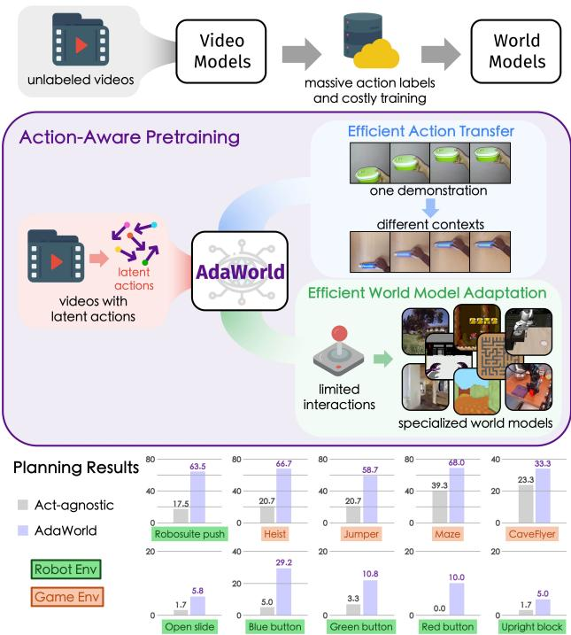  
Figure 1. Different world model learning paradigms. Prior methods often require expensive labeling and training to achieve action controllability in new environments. To overcome this, we introduce latent actions as a unified condition for action-aware pretraining from videos, enabling highly adaptable world modeling. Our world model, dubbed AdaWorld, can readily transfer actions across contexts without training. By initializing the control interface with the corresponding latent actions, AdaWorld can also be adapted into specialized world models efficiently and achieve significantly better planning results than the action-agnostic baseline.

As humans, we can estimate the effects of different actions through limited experiences (Ha & Schmidhuber, 2018). This ability likely arises from our internal representations of actions learned from extensive observations (Rizzolatti et al., 1996; Romo et al., 2004; Dominici et al., 2011). These common knowledge can be reused across different contexts and associated with specific action spaces efficiently (Rybkin et al., 2019; Schmeckpeper et al., 2020; Sun et al., 2024). Consequently, humans can easily transfer observed actions to various contexts and imagine the transitions of new environments through a few interactions (Poggio & Bizzi, 2004). These insights motivate us to ponder: can we achieve human-like adaptability in world modeling by learning transferrable action representations from observations? In this paper, we propose AdaWorld, an innovative pretraining approach for highly adaptable world models. Unlike previous methods that only pretrain on action-agnostic videos, we argue that incorporating action information during pretraining will significantly enhance the adaptability of world models. As illustrated in Figure 1, the adaptability of AdaWorld primarily manifests in two aspects: (1) Given one demonstration of an action, AdaWorld can readily transfer that action to various contexts without further training. (2) It can also be efficiently adapted into specialized world models with raw action inputs via minor interactions and finetuning, enabling more effective planning in various environments.

AdaWorld consists of two key components: a latent action autoencoder that extracts actions from unlabeled videos, and an autoregressive world model that takes the extracted actions as conditions. Our main challenge is that in-the-wild videos often involve complicated contexts (e.g., colors and textures), which hinders effective action recognition. To overcome this challenge, we introduce an information bottleneck design to our latent action autoencoder. Specifically, the latent action encoder extracts a compact encoding from two consecutive frames. We refer to this encoding as latent action hereinafter, as it is used to represent the transition between these two frames. Based on the latent action and the former frame, the latent action decoder makes its best effort to predict the subsequent frame. By minimizing the prediction loss using the minimal information encoded in the latent action, our autoencoder is encouraged to disentangle the most critical action from its context. Unlike previous methods (Bruce et al., 2024; Chen et al., 2024b; Ye et al., 2025) that focus on playability and behavior cloning, we compress the latent actions into a continuous latent space to maximize expressiveness and enable flexible composition. We find that our latent actions are context-invariant and can be effectively transferred across different contexts. We then pretrain an autoregressive world model that conditions on the latent actions. Thanks to the strong transferability of our latent actions, the resulting world model is readily adaptable to various environments. In particular, since our world model has learned to simulate different actions represented by any latent actions, adapting to a new environment is akin to finding the mapping of corresponding latent actions for its action space. Given one demonstration of an action, our model can readily transfer the demonstrated action by extracting the latent action with latent action encoder and reusing it across different contexts. When action labels are provided, we can similarly obtain their latent actions and initialize the control interface efficiently. This enables us to adapt our model to specialized world models with minimal finetuning. When only a limited number of interactions are available (e.g., 50 interactions), our approach is significantly more efficient than pretraining from action-agnostic videos. Note that our approach is as scalable as existing video pretraining methods (Seo et al., 2022; Mendonca et al., 2023; Wu et al., 2023; Agarwal et al., 2025; He et al., 2025; Yu et al., 2025). To enhance the generalization ability of AdaWorld, we collect a large corpus of videos from thousands of environments through automated generation. The resulting dataset encompasses extensive interactive scenarios, spanning from ego perspectives and third-person views to virtual games and real-world activities. After action-aware pretraining at scale, we show that the adaptability of AdaWorld can seamlessly generalize to a wide variety of domains. In summary, we make the following contributions: •We present AdaWorld, an autoregressive world model that is highly adaptable across various environments. It can readily transfer actions to different contexts and allows efficient adaptation with limited interactions. •We establish AdaWorld on a large-scale dataset sourced from extremely diverse environments. After extensive pretraining, AdaWorld demonstrates strong generalization capabilities across various domains. •We conduct comprehensive experiments across multiple environments to verify the efficacy of AdaWorld. Our model achieves promising results in action transfer, world model adaptation, and visual planning.

# 2. Method

In this section, we first introduce the architectural design of our latent action autoencoder (Sec. 2.1). By leveraging the latent actions as conditions, we then build an autoregressive world model through action-aware pretraining (Sec. 2.2). Finally, we demonstrate how our model facilitates highly adaptable world modeling (Sec. 2.3).

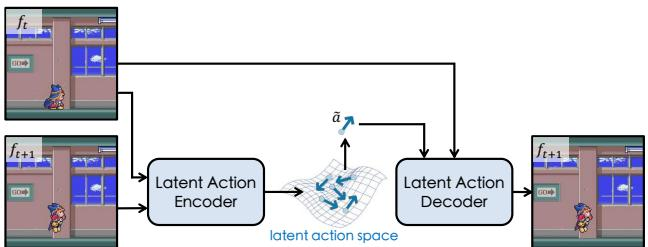  
Figure 2. Latent action autoencoder. With an information bottleneck design, our latent action autoencoder is able to extract the most critical action information from videos and compresses it into a continuous latent action.

# 2.1. Latent Action Autoencoder

Instead of only taking actionless videos for world model pretraining, our key innovation is to incorporate action information during the pretraining phase. Benefiting from the pretrained knowledge of action controllability, the resulting world models can be efficiently adapted using limited ground truth actions. However, action labels are rarely available for in-the-wild videos. While a common practice is to collect these labels through interactions, collecting them across a multitude of environments incurs significant labor. Furthermore, defining a unified action format across diverse environments is often unfeasible, and current world models require costly training to accommodate new action formats. To address these challenges, instead of relying on explicit action annotations, we propose extracting latent actions from videos as a unified condition for world model pretraining. Nevertheless, in general videos, the action information is often entangled with the contexts, posing significant difficulty for effective action recognition. Inspired by the observation that agents' actions often drive the dominant variation in most interactive scenarios (Rybkin et al., 2019; Menapace et al., 2021; 2022; Bruce et al., 2024), we introduce an information bottleneck to automatically differentiate actions from observations.

To be specific, we instantiate a latent action autoencoder based on the Transformer architecture (Vaswani et al., 2017), where the encoder extracts the latent action $\tilde { a }$ from two consecutive frames $f _ { t : t + 1 }$ , and the decoder predicts the subsequent frame $f _ { t + 1 }$ based on the latent action $\tilde { a }$ and the former frame $f _ { t }$ . The latent action encoder divides two frames $f _ { t : t + 1 }$ into image patches of size $1 6 \times 1 6$ These patches are then projected to patch embeddings and flattened along the spatial dimension. Afterwards, they are concatenated with two learnable tokens $a _ { t : t + 1 }$ .Sinusoidal position embeddings (Dosovitskiy et al., 2021) are also applied to each frame to indicate the spatial information. To efficiently encode the tokens from these two frames, we employ a spatiotemporal Transformer (Bruce et al., 2024) with $L$ stacked blocks. Each block comprises interleaved spatial and temporal attention modules, followed by a feed-forward network.

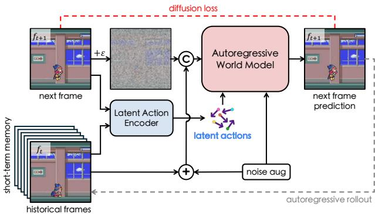  
Figure 3. Action-aware pretraining. We extract latent actions from unlabeled videos using the latent action encoder. By leveraging the extracted actions as a unified condition, we pretrain a world model that can perform autoregressive rollouts at inference.

The spatial attention can attend to all tokens within each frame, while the temporal attention has access to the two tokens in the same spatial positions across the two frames. We also incorporate rotary embeddings (Su et al., 2024) in temporal attentions to indicate the causal relationship. After sufficient attention correlations, the learnable tokens $a _ { t : t + 1 }$ can adaptively aggregate the temporal dynamics between the two input frames. We then discard all tokens and only project $a _ { t + 1 }$ to estimate the posterior of the latent action $( \mu _ { \tilde { a } } , \sigma _ { \tilde { a } } )$ following the standard VAE (Kingma & Welling, 2014). Subsequently, we sample $\tilde { a }$ from the approximated posterior and attach it to $f _ { t }$ , which is then sent to the latent action decoder. The latent action decoder is a spatial Transformer that predicts the subsequent frame $f _ { t + 1 }$ in the pixel space. The whole latent action autoencoder is optimized with the VAE objective:

$$
\begin{array} { r l } & { \mathcal { L } _ { \theta , \phi } ^ { p r e d } ( f _ { t + 1 } ) = \mathbb { E } _ { q _ { \phi } ( \tilde { a } \mid f _ { t : t + 1 } ) } \log p _ { \theta } ( f _ { t + 1 } | \tilde { a } , f _ { t } ) } \\ & { \quad \quad \quad - D _ { K L } ( q _ { \phi } ( \tilde { a } | f _ { t : t + 1 } ) | | p ( \tilde { a } ) ) . } \end{array}
$$

Compared to the original pixel space, the dimension of our latent action is extremely compact. Hence, it is challenging to forward the entire subsequent frame to the decoder via latent action. To minimize the prediction error of the subsequent frame, the latent action $\tilde { a }$ must encapsulate the most critical variations relative to the former frame. This results in context-invariant action representations that closely correspond to the true actions taken by the agents. Nevertheless, we empirically find that our latent action autoencoder, trained using the aforementioned formulation, struggles to express diverse transitions between frames. This problem arises because the standard VAE imposes a strong constraint on posterior distributions. Conversely, removing this constraint may compromise the disentanglement ability of VAE (Burgess et al., 2017). To remedy this, we adopt the $\beta$ -VAE formulation (Higgins et al., 2017; Alemi et al., 2017), which introduces an adjustable hyperparameter $\beta$ :

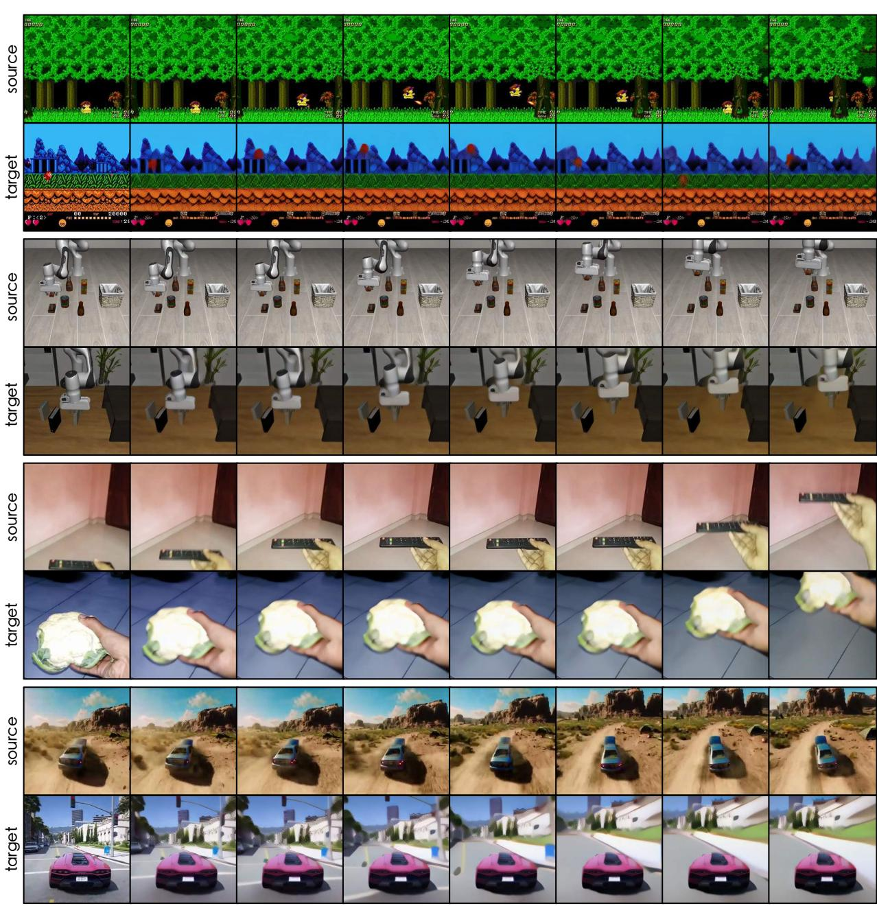  
.

$$
\begin{array} { r } { \mathcal { L } _ { \theta , \phi } ^ { p r e d } ( f _ { t + 1 } ) = \mathbb { E } _ { q _ { \phi } ( \tilde { a } | f _ { t : t + 1 } ) } \log p _ { \theta } ( f _ { t + 1 } | \tilde { a } , f _ { t } ) } \\ { - \beta D _ { K L } \big ( q _ { \phi } ( \tilde { a } | f _ { t : t + 1 } ) | | p ( \tilde { a } ) \big ) . } \end{array}
$$

The additional hyperparameter enables us to flexibly control the information contained by the latent actions. In practice, we empirically adjust this hyperparameter to achieve a good trade-off between expressiveness and context disentangling ability of our latent actions. As shown in Figure 4, our latent action autoencoder can extract context-invariant actions that are transferrable across different contexts.

# 2.2. Action-Aware Pretraining

After training the latent action autoencoder, we can use its encoder to automatically extract action information from videos. This allows us to incorporate action information for world model pretraining, which we refer to as action-aware pretraining. To realize this, we pretrain a world model that predicts the next frame conditioned on the current latent action. As shown in Figure 3, we utilize the latent action encoder to extract the latent actions between frames and send them as inputs for our world model. Unlike previous methods that often predict video clips (Yang et al., 2024c;

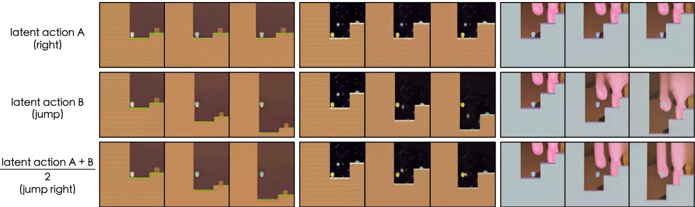

Xiang et al., 2024; Agarwal et al., 2025), our model supports frame-level control, offering finer granularity for interaction. To ensure smooth transitions, we maintain a short-term memory with $K$ historical frames. During inference, our model can predict a sequence of future frames by autoregressively repeating the next-frame prediction process and appending the predicted frames to the memory.

Although it may seem straightforward to repurpose the latent action decoder as the function of world model, it only makes coarse predictions via a single forward pass, resulting in significant quality degradation after several interactions. To achieve genuine predictions, we establish an independent world model based on diffusion models. Specifically, we initialize the world model with Stable Video Diffusion (SVD) (Blattmann et al., 2023), a latent diffusion model trained with the EDM framework (Karras et al., 2022). Different from the original SVD, we only denoise one noisy frame each time. To enable deep aggregation with the action information, the latent action is concatenated with both the timestep embedding and the CLIP image embedding from the original SVD. The last frame in memory is used as the condition image of SVD. To inherit the pretrained temporal modeling capability, we encode the historical frames using the SVD image encoder and concatenate them with the noise latent map of the frame to predict. Since the number of available historical frames may vary in practice, we randomly sample historical frames with a maximum length of 6 during training and send the memory length condition to the world model. Following previous practices (He et al., 2022; Valevski et al., 2025), noise augmentation is also applied to corrupt the historical frames during training. This augmentation can effectively alleviate the long-term drift problem, even when no noise is applied during inference. We pretrain the world model on our large-scale dataset by minimizing the following diffusion loss:

$$
\begin{array} { r } { \mathcal { L } _ { \mathrm { p r e t r a i n } } = \mathbb { E } _ { \pmb { x } _ { 0 } , \epsilon , t } \Big [ \| \pmb { x } _ { 0 } - \hat { \pmb { x } } _ { 0 } ( \pmb { x } _ { t } , t , \pmb { c } ) \| ^ { 2 } \Big ] , } \end{array}
$$

where $\scriptstyle { \hat { \mathbf { x } } } _ { 0 }$ is the prediction of our world model and $^ c$ is the conditioning information which includes historical frames and the latent action $\tilde { a }$ .

# 2.3. Highly Adaptable World Models

After action-aware pretraining across various environments, the world model can be controlled by different latent actions, making it highly adaptable for multiple applications, including efficient action transfer, world model adaptation, and even action creation. Efficient action transfer. When presented with a demonstration video, we use the latent action encoder to extract a sequence of latent actions. This enables us to disentangle the action from its context and replicate it across different contexts. Specifically, given the initial frame from a new context, we can reuse the extracted latent action sequence as the conditions to generate a new video autoregressively. As demonstrated in Figure 4, AdaWorld naturally transfers actions from source videos to various contexts. Efficient world model adaptation. AdaWorld also allows efficient world model adaptation with limited action labels and training steps. Specifically, after collecting a few actionvideo pairs through interactions, we use the latent action encoder to infer their latent actions. Thanks to the continuity of our latent action space, latent actions for the same label can be averaged directly. We empirically find that the averaged embedding consistently represents the intended action. Thus, for a new environment with $N$ discrete actions, we initialize a specialized world model using $N$ averaged latent actions and finetune the whole model for a few steps. For environments with continuous action spaces, since there are infinite options, we add a lightweight MLP to map raw action inputs to the latent action interface. The interface can also be efficiently initialized by finetuning the MLP with minimal action-latent action pairs. Figure 6 shows that the models initialized in aforementioned ways can be efficiently adapted to take control inputs through minimal finetuning. Action composition and creation. It is also noteworthy that AdaWorld enables several unique applications compared to existing world models. For instance, it allows the composition of new actions by interpolating observed actions within the latent space, as demonstrated in Figure 5. In addition, by collecting and clustering latent actions, we can easily create a flexible number of control options with distinct functions and strong controllability. This suggests that AdaWorld could serve as an alternative to generative interactive environments (Bruce et al., 2024). See Appendix C for experimental details on action creation.

# 3. Experiments

In this section, we first demonstrate AdaWorld's strengths in action transfer in Sec. 3.1. We then study how efficient world model adaptation enables better simulation and planning in Sec. 3.2. Lastly, we analyze the effectiveness of our designs with ablation studies in Sec. 3.3. To thoroughly understand the adaptability of our approach, we compare AdaWorld with three representative baselines: •Action-agnostic pretraining. In this setup, we train a world model that shares the same architecture as AdaWorld but always takes zeros as action conditions during pretraining. This baseline is used to demonstrate the effect of the predominant pretraining paradigm that relies only on action-agonistic videos (Mendonca et al., 2023; Wu et al., 2023; Ga0 et al., 2024; Che et al., 2025; Agarwal et al., 2025; He et al., 2025). •Optical flow as an action-aware condition. We automatically predict optical flows from videos using UniMatch (Xu et al., 2023a). The flow maps are downsampled to $1 6 \times 1 6$ and flattened as conditional encodings to replace the latent actions during pretraining. This baseline serves as an alternative solution for extracting action information from unlabeled videos. Discrete latent action as an action-aware condition. We also implement a variant of the latent action autoencoder based on the standard VQ-VAE (Van Den Oord et al., 2017). Instead of using a continuous latent action space, this variant adopts a VQ codebook with 8 discrete codes following Genie (Bruce et al., 2024). Except for the above modifications, we align other training settings for the baselines and our method. The world models of all compared methods are trained for 50K iterations to ensure a fair comparison. Our training dataset comprises four publicly accessible datasets (Goyal et al., 2017; Grauman et al., 2022; O'Neill et al., 2024; Ju et al., 2024) and videos collected automatically from 1016 environments in Gym Retro (Nichol et al., 2018) and Procgen Benchmark (Cobbe et al., 2020). This results in about 2000 million frames of interactive scenarios in total. More details about our datasets and implementation are provided in Appendices A and B.

Table 1. Action transfer comparison. In both datasets, AdaWorld excels at transferring the demonstrated actions to different contexts.   

<table><tr><td rowspan="2">Method</td><td colspan="3">LIBERO</td><td colspan="3">SSv2</td></tr><tr><td>FVD↓</td><td>ECS↑</td><td>Human↑</td><td>FVD↓</td><td>ECS↑</td><td>Human↑</td></tr><tr><td>Act-agnostic</td><td>1545.2</td><td>0.702</td><td>0%</td><td>847.2</td><td>0.592</td><td>1%</td></tr><tr><td>Flow cond.</td><td>1409.5</td><td>0.724</td><td>2%</td><td>702.8</td><td>0.611</td><td>10.5%</td></tr><tr><td>Discrete cond.</td><td>1504.5</td><td>0.700</td><td>3.5%</td><td>726.8</td><td>0.596</td><td>21.5%</td></tr><tr><td>AdaWorld</td><td>767.0</td><td>0.804</td><td>70.5%</td><td>473.4</td><td>0.639</td><td>61.5%</td></tr></table>

# 3.1. Action Transfer

AdaWorld can readily transfer a demonstrated action to various contexts without further training. Below, we provide both qualitative and quantitative evaluations to showcase how effectively AdaWorld performs action transfer. Qualitative results. We transfer action sequences of length 20 through autoregressive generation in Figure 4. It shows that AdaWorld can effectively disentangle the demonstrated actions and emulate them across contexts. Qualitative comparison with other baselines can be found in Appendix C.

Quantitative results. To quantitatively compare with other baselines, we construct a evaluation set sourced from the unseen LIBERO (Liu et al., 2023) and Something-Something v2 (SSv2) (Goyal et al., 2017) datasets. Specifically, we select and pair videos from the same tasks in LIBERO and the same labels among the top-10 most frequent labels in SSv2, resulting in 1300 pairs for evaluation (more details in Appendix D). While the selected video pairs contain similar actions, we find that the video pairs from LIBERO often differ in the arrangement of objects, and those from SSv2 have significant differences in contexts. For each video pair, we take the first video as the demonstration video and use the first frame from the second video as the initial frame. We then generate videos by extracting action conditions from the demonstration video and employing different models to autoregressively predict the next 20 frames from the initial frame. The evaluation is performed by measure the generated videos against the original videos using Fréchet Video Distance (FVD) (Unterthiner et al., 2018). To complement the FVD evaluation, which reflects overall distribution similarity, we additionally employ Embedding Cosine Similarity (ECS) (Sun et al., 2024) that performs frame-level measurements with I3D (Carreira & Zisserman, 2017). We further conduct a human evaluation on a set of 50 video pairs from LIBERO and SSv2, respectively. Four volunteers are invited to judge whether the action is successfully transferred or not. Both the automatic and human evaluations in Table 1 demonstrate that our continuous latent action achieves the best action transfer performance, underscoring its capability to express more nuanced actions without losing generality.

# 3.2. World Model Adaptation

We also investigate how the proposed method benefits efficient world model adaptation in terms of simulation quality e us0a  .

<table><tr><td rowspan="2">Method</td><td colspan="2">Habitat (discrete action)</td><td colspan="2">Minecraft (discrete action)</td><td colspan="2">DMLab (discrete action)</td><td colspan="2">nuScenes (continuous action)</td></tr><tr><td>PSNR↑</td><td>LPIPS↓</td><td>PSNR↑</td><td>LPIPS↓</td><td>PSNR↑</td><td>LPIPS↓</td><td>PSNR↑</td><td>LPIPS↓</td></tr><tr><td>Act-agnostic</td><td>20.34</td><td>0.450</td><td>19.44</td><td>0.532</td><td>20.96</td><td>0.386</td><td>20.86</td><td>0.475</td></tr><tr><td>Flow cond.</td><td>22.49</td><td>0.373</td><td>20.71</td><td>0.492</td><td>22.22</td><td>0.357</td><td>20.94</td><td>0.462</td></tr><tr><td>Discrete cond.</td><td>23.31</td><td>0.342</td><td>21.33</td><td>0.465</td><td>22.36</td><td>0.349</td><td>21.28</td><td>0.450</td></tr><tr><td>AdaWorld</td><td>23.58</td><td>0.327</td><td>21.59</td><td>0.457</td><td>22.92</td><td>0.335</td><td>21.60</td><td>0.436</td></tr></table>

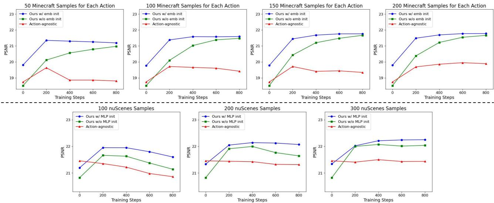  
new environments more rapidly than conventional pretraining methods.

and visual planning performance.

# 3.2.1. SIMULATION QUALITY

Setup. To evaluate the simulation quality after adaptation, we choose three environments with discrete action space (Habitat (Savva et al., 2019), Minecraft, DMLab (Beattie et al., 2016)) and one environment with continuous action space (nuScenes (Caesar et al., 2020)) that are not included in our training dataset. Each environment has a validation set consisting of 300 samples, which is used to evaluate the adaption quality in terms of PSNR (Hore & Ziou, 2010) and LPIPS (Zhang et al., 2018). To demonstrate the adaptability with restricted labels, we collect only 100 samples for each action in every discrete environment and 100 trajectories for nuScenes. Using the limited interaction data, we then finetune all compared world models for 800 steps with a batch size of 32 and a learning rate of $5 \times 1 0 ^ { - 5 }$ . The learning rate for the pretrained weights is discounted by a factor of 0.1. For the action-agnostic baseline, we initialize action embeddings with random parameters. For the other three models, we use the averaged action conditions extracted from the 100 samples to initialize the action embeddings as described in Sec. 2.3. Note that for nuScenes, we add a two-layer MLP to map continuous displacements to the latent action interface. The MLP is fine-tuned with limited action-latent action pairs for 3K steps, which takes less than 30 seconds on a single GPU. Results. As reported in Table 2, AdaWorld achieves the best fidelity after finetuning with limited interactions and compute. The comparison results suggest that the proposed method allows the world models to efficiently simulate new action controls in unseen environments. Note that all actionaware variants significantly outperform the action-agnostic baseline, underlining the importance of our key innovation, i.e., incorporating action information during pretraining. To further demonstrate our sample efficiency and finetuning efficiency, we conduct more comparative experiments using different sample numbers and finetuning steps on Minecraft and nuScenes. We show the evolving curves of PSNR in Figure 6. In all cases, AdaWorld performs much better at the beginning and improves significantly faster after a few finetuning steps. This suggests that our approach provides a superior initialization for efficient world model adaptation compared to conventional pretraining methods.

# 3.2.2. Visual Planning in Games

Setup. After learning action controls, world models can be utilized for planning. To demonstrate the superiority of AdaWorld in planning performance, we first compare it with the action-agnostic baseline in video game environments using sampling-based model predictive control (MPC) optimized by Cross-Entropy Method (De Boer et al., 2005; Chua et al., 2018). The MPC planning and optimization procedure are deferred to Appendix B.4. We define a goal-reaching task based on the Procgen benchmark (Cobbe et al., 2020) and select 30 scenes from each of four environments (Heist, Jumper, Maze, CaveFlyer). This ensures that the specified goals can be reached within an acceptable number of steps (more details in Appendix E). For each scene, we randomly collect 100 samples for each action in the default action space (LEFT, DOWN, UP, RIGHT). Based on the collected samples, the pretrained world models are finetuned for 500 steps with a batch size of 32 and a learning rate of $5 \times 1 0 ^ { - 5 }$ We then use the finetuned world models to perform MPC planning in the selected scenes. The reward is defined as the cosine similarity between the predicted observations and the image of the final state. The planning is deemed successful if the agent reaches the final state within 20 steps. without finetuning.Oracle $:$ We use the ground truth simulator for MPC, which indicate the upper bound of this planning strategy.   

<table><tr><td rowspan="2">Method</td><td colspan="5">Success Rate↑</td></tr><tr><td>Heist</td><td>Jumper</td><td>Maze</td><td>CaveFlyer</td><td>Average</td></tr><tr><td>Random</td><td>19.33±4.41%</td><td>22.00±2.50%</td><td>41.33±5.44%</td><td>22.00±2.50%</td><td>26.17±2.55%</td></tr><tr><td>Act-agnostic AdaWorld</td><td>20.67±3.55%</td><td>20.67±2.45%</td><td>39.33±2.87%</td><td>23.33±1.84%</td><td>26.00±0.98%</td></tr><tr><td>w/o finetune</td><td>38.67±2.01%</td><td>68.00±2.25%</td><td>41.33±2.72%</td><td>31.33±2.50%</td><td>44.83±1.37%</td></tr><tr><td>w/ finetune</td><td>66.67±4.09%</td><td>58.67±2.50%</td><td>68.00±1.69%</td><td>33.33±3.80%</td><td>56.67±2.16%</td></tr><tr><td></td><td></td><td></td><td></td><td></td><td></td></tr><tr><td>Q-learning</td><td>22.67±3.87%</td><td>47.33±6.71%</td><td>4.67±0.81%</td><td>34.00±6.17%</td><td>27.17±1.27%</td></tr><tr><td>Oracle (GT env.)</td><td>86.67±3.16%</td><td>77.33±2.67%</td><td>84.67±2.91%</td><td>74.00±3.99%</td><td>80.67±2.11%</td></tr></table>

$\mathrm { { V P ^ { 2 } } }$ We also report he aggregate sucess ratesnormalized by the score  the ground trut smulator on thet.

<table><tr><td rowspan="2">Method</td><td colspan="6"></td></tr><tr><td>Robosuite push</td><td>Open slide</td><td>Blue button</td><td>Green button</td><td>Red button</td><td>Upright block</td><td>Aggregate</td></tr><tr><td>Act-agnostic</td><td>17.50±0.50%</td><td>1.67±1.67%</td><td>5.00±1.67%</td><td>3.33±0.00%</td><td>0.00±0.00%</td><td>1.67±1.67%</td><td>5.03</td></tr><tr><td>AdaWorld</td><td>63.50±1.71%</td><td>5.83±2.85%</td><td>29.17±2.50%</td><td>10.83±2.50%</td><td>10.00±2.36%</td><td>5.00±0.96%</td><td>21.54</td></tr></table>

Results. Table 3 presents the success rates averaged over 5 random seeds. While the action-agnostic baseline performs similarly to random planning, AdaWorld substantially increase the success rates across all environments. This indicates that our approach not only adapts more efficiently but also enables more effective planning. Visit our project page to see planning demonstrations of agents in games. Additionally, we evaluate the visual planning performance without finetuning our model using the collected samples. In particular, we only utilize the averaged latent actions derived from these samples as action embeddings for the corresponding scenes. The results in Table 3 indicate that even without updating model weights, our variant still outperforms the finetuned action-agnostic pretraining baseline. To further demonstrate the effectiveness of our approach, we also compare the planning results with Q-learning (Sutton & Barto, 2018), a classical model-free reinforcement learning method. For each scene, we construct a Q-table using the same samples collected for the MPC planning. The states of Q-table are represented by quantized images, and the rewards are obtained by computing the cosine similarity with the goal image. As shown in Table 3, AdaWorld significantly dominates the Q-learning method, suggesting that our approach makes more effective use of limited interactions.

# 3.2.3. Visual Planning in Robot Tasks

Setup. To verify our efficacy in robot control tasks, we pretrain a low-resolution variant of AdaWorld and evaluate the planning performance on the $\mathrm { { V P ^ { 2 } } }$ benchmark (Tian et al., 2023) after adaptation. The planning is also sampling-based and is performed using the model-predictive path integral (MPPI) (Williams et al., 2016; Nagabandi et al., 2020). We focus on a similar compute-efficient setting and finetune the pretrained variant and an action-agnostic baseline for 1K steps. The evaluation is conducted on 100 tabletop Robosuite tasks (Zhu et al., 2020) and 7 RoboDesk tasks (Kannan et al., 2021). More details are in Appendix B.5. Results. Table 4 reports the success rates on $\mathrm { { V P ^ { 2 } } }$ . We omit the Flat block and Open drawer tasks from RoboDesk, as they do not yield meaningful scores under our constrained adaptation setting. The results show that AdaWorld adapts more efficiently with limited finetuning steps and improves the planning performance by a clear margin.

# 3.3. Ablation and Analysis

Interface initialization. We ablate the latent action initialization approaches in Sec. 2.3 with random initialization and adapt the resultant model to the unseen Minecraft and nuScenes. Figure 6 shows that randomly initializing the control interface of AdaWorld results in a quality drop at the beginning. Nevertheless, it is noteworthy that although our variant is slightly worse than the action-agnostic pretraining baseline when the finetuning begins, it rapidly surpasses the action-agnostic baseline after just 200 steps. This is because AdaWorld has learned a highly adaptable control interface through action-aware pretraining, allowing it to efficiently adapt to an unseen environment by simply fitting the action embeddings for the new action space.

Table 5. Impacts of training data diversity. Increasing data diversity enhances the generalization of latent actions to new domains.   

<table><tr><td rowspan="2">Training Data</td><td colspan="2">Procgen</td></tr><tr><td>PSNR↑</td><td>LPIPS↓</td></tr><tr><td>OpenX</td><td>25.51</td><td>0.318</td></tr><tr><td>Retro</td><td>26.43</td><td>0.250</td></tr><tr><td>Retro+OpenX</td><td>26.62</td><td>0.234</td></tr></table>

Table 6. Generality of AdaWorld. Applying action-aware pretraining to iVideoGPT also significantly improves its adaptability.   

<table><tr><td rowspan="2">Model</td><td colspan="2">BAIR</td></tr><tr><td>PSNR↑</td><td>LPIPS↓</td></tr><tr><td>iVideoGPT</td><td>16.59</td><td>0.220</td></tr><tr><td>iVideoGPT+AdaWorld</td><td>17.40</td><td>0.204</td></tr></table>

Data diversity. We also study the impact of data mixture to the generalization ability of latent actions. To this end, we implement three latent action autoencoder with different combinations of Open X-Embodiment (OpenX) (O'Neill et al., 2024) and Gym Retro (Nichol et al., 2018) datasets for 40K steps. We then assess the latent action decoder predictions of these three variants on Procgen benchmark (Cobbe et al., 2020) in Table 5. Surprisingly, we discover that even though OpenX mainly consists of real-world robot videos, incorporating OpenX helps the latent action autoencoder generalize to the unseen 2D virtual games in Procgen. This suggests that further increasing data diversity may positively affect the generalization of our latent actions. Method generality. To demonstrate the generality of our method, we use iVideoGPT (Wu et al., 2024) as a state-ofthe-art baseline. iVideoGPT is an action-controlled world model with an autoregressive Transformer architecture. It is pretrained by action-agnostic video prediction and adds a linear projection to learn action control during finetuning. For fair comparison, we implement a variant by conditioning iVideoGPT with our latent actions during pretraining. The training details can be found in Appendix B.6. After finetuning, we compare action-controlled simulation quality on BAIR robot pushing dataset (Ebert et al., 2017) in Table 6. The proposed action-aware pretraining significantly enhances the adaptability of iVideoGPT, suggesting that our method is generally applicable to different world models.

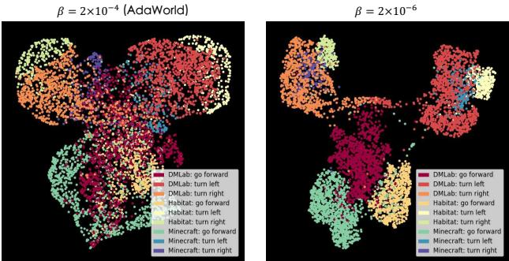  
Figure 7. UMAP of latent actions. Reducing the value of $\beta$ increases expressiveness but sacrifices disentanglement from context.

Hyperparameter choice. In Eq. (2), the hyperparameter $\beta$ is adjusted to achieve a good trade-off between expressiveness and context disentangling ability of latent actions. To provide a more intuitive illustration, we randomly collect 1000 samples for each action from Habitat, Minecraft, and DMLab, and use UMAP (McInnes et al., 2018) for visualization. Figure 7 shows that the same actions, even from different environments, are clustered together, which validates the context-invariant property of our latent actions. Note that noise exists because the action inputs cannot be executed in certain states (e.g., cannot go ahead when an obstacle is in front). We also compare samples inferred by a model trained with a lower $\beta$ . Although this results in more differentiable latent actions, it also reduces action overlap across environments thus sacrificing disentanglement ability. We therefore set $\beta$ as $2 \times 1 0 ^ { - 4 }$ by default.

# 4. Conclusion

In this paper, we introduce AdaWorld, a new world model learning approach that facilitates efficient adaptation across various environments. It is highly adaptable in transferring and learning new actions with limited interactions and finetuning. Extensive experiments and analyses demonstrate the superior adaptability of AdaWorld, highlighting its potential as a new paradigm for world model pretraining. Limitations. While AdaWorld promotes adaptable world modeling, several challenges remain. First, it does not operate at real-time frequency. Future work could incorporate distillation and sampling techniques (Feng et al., 2024; Yin et al., 2025) to accelerate inference speed. Similar to prior works (Yang et al., 2024e), AdaWorld struggles to create novel content when the rollout exceeds the initial scene. This issue is likely to be solved by scaling model and training data (Bruce et al., 2024; Bar et al., 2025). Additionally, our model falls short in achieving extremely long-term rollouts, and we will explore potential solutions (Chen et al., 2024a; Feng et al., 2024; Ruhe et al., 2024) in future work. We also append some primary failure cases in Appendix C.

# Acknowledgements

Shenyuan Gao and Jun Zhang were supported by the Hong Kong Research Grants Council under the NSFC/RGC Collaborative Research Scheme grant CRS_HKUST603/22.

# Impact Statement

This paper presents work whose goal is to advance the field of machine intelligence. There are many potential societal consequences of our work, none which we feel must be specifically highlighted here.

# References

Agarwal, N., Ali, A., Bala, M., Balaji, Y., Barker, E., Cai, T., Chattopadhyay, P., Chen, Y., Cui, Y., Ding, Y., et al. Cosmos World Foundation Model Platform for Physical AI. arXiv preprint arXiv:2501.03575, 2025. Alemi, A. A., Fischer, I. Dillon, J.V., and Murphy, K.Deep Variational Information Bottleneck. In ICLR, 2017. Alonso, E., Jelley, A., Micheli, V., Kanervisto, A., Storkey, A., Pearce, T., and Fleuret, F. Diffusion for World Modeling: Visual Details Matter in Atari. In NeurIPS, 2024. Baker, B., Akkaya, I., Zhokov, P., Huizinga, J., Tang, J. Ecoffet, A., Houghton, B., Sampedro, R., and Clune, J. Video PreTraining (VPT): Learning to Act by Watching Unlabeled Online Videos. In NeurIPS, 2022. Bar, A., Zhou, G., Tran, D., Darrell, T., and LeCun, Y. Navigation World Models. In CVPR, 2025. Beattie, C., Leibo, J. Z., Teplyashin, D., Ward, T., Wainwright, M., Küttler, H., Lefrancq, A., Green, S., Valdés, V., Sadik, A., et al. DeepMind Lab. arXiv preprint arXiv:1612.03801, 2016. Blattmann, A., Dockhorn, T., Kulal, S., Mendelevitch, D., Kilian, M., Lorenz, D., Levi, Y., English, Z., Voleti, V. Letts, A., et al. Stable Video Diffusion: Scaling Latent Video Diffusion Models to Large Datasets. arXiv preprint arXiv:2311.15127, 2023. Bruce, J., Dennis, M. D., Edwards, A., Parker-Holder, J., Shi, Y., Hughes, E., Lai, M., Mavalankar, A., Steigerwald, R., Apps, C., et al. Genie: Generative Interactive Environments. In ICML, 2024. Bu, Q., Zeng, J., Chen, L., Yang, Y., Zhou, G., Yan, J., Luo, P., Cui, H., Ma, Y., and Li, H. Closed-Loop Visuomotor Control with Generative Expectation for Robotic Manipulation. In NeurIPS, 2024. Bu, Q., Cai, J., Chen, L., Cui, X., Ding, Y., Feng, S., Gao, S., He, X., Huang, X., Jiang, S., et al. AgiBot World Colosseo: A Large-Scale Manipulation Platform for Scalable and Intelligent Embodied Systems. arXiv preprint arXiv:2503.06669, 2025. Burgess, C. P., Higgins, I., Pal, A., Matthey, L., Watters, N., Desjardins, G., and Lerchner, A. Understanding Disentangling in $\beta$ VAE. In NeurIPS Workshops, 2017. Caesar, H., Bankiti, V., Lang, A. H., Vora, S., Liong, V. E., Xu, Q., Krishnan, A., Pan, Y., Baldan, G., and Beijbom, O. nuScenes: A Multimodal Dataset for Autonomous Driving. In CVPR, 2020. Carreira, J. and Zisserman, A. Quo Vadis, Action Recognition? A New Model and the Kinetics Dataset. In CVPR, 2017. Che, H., He, X., Liu, Q., Jin, C., and Chen, H. GameGenX: Interactive Open-World Game Video Generation. In ICLR, 2025. Chen, B., Monso, D. M., Du, Y., Simchowitz, M., Tedrake, R., and Sitzmann, V. Diffusion Forcing: Next-Token Prediction Meets Full-Sequence Diffusion. In NeurIPS, 2024a. Chen, X., Guo, J., He, T., Zhang, C., Zhang, P., Yang, D. C., Zhao, L., and Bian, J. IGOR: Image-GOal Representations are the Atomic Control Units for Foundation Models in Embodied AI. arXiv preprint arXiv:2411.00785, 2024b. Chen, Y., Ge, Y., Li, Y., Ge, Y., Ding, M., Shan, Y., and Liu, X. Moto: Latent Motion Token as the Bridging Language for Robot Manipulation. arXiv preprint arXiv:2412.04445, 2024c. Chi, X., Zhang, H., Fan, C.-K., Qi, X., Zhang, R., Chen, A., Chan, C.-m., Xue, W., Luo, W., Zhang, S., et al. EVA: An Embodied World Model for Future Video Anticipation. arXiv preprint arXiv:2410.15461, 2024. Chua, K., Calandra, R., McAllister, R., and Levine, S. Deep Reinforcement Learning in a Handful of Trials using Probabilistic Dynamics Models. In NeurIPS, 2018. Cobbe, K., Hesse, C., Hilton, J., and Schulman, J. Leveraging Procedural Generation to Benchmark Reinforcement Learning. In ICML, 2020. Cui, Z. J., Pan, H., Iyer, A., Haldar, S., and Pinto, L. DynaMo: In-Domain Dynamics Pretraining for Visuo-Motor Control. In NeurIPS, 2024. De Boer, P.-T., Kroese, D. P., Mannor, S., and Rubinstein, R. Y. A Tutorial on the Cross-Entropy Method. Annals of Operations Research, 2005.

Dominici, N., Ivanenko, Y. P., Cappellini, G., d' Avella, A., Mondi, V., Cicchese, M., Fabiano, A., Silei, T., Di Paolo, A., Giannini, C., et al. Locomotor Primitives in Newborn Babies and Their Development. Science, 2011.   
Dosovitskiy, A., Beyer, L., Kolesnikov, A., Weissenborn, D., Zhai, X., Unterthiner, T., Dehghani, M., Minderer, M., Heigold, G., Gelly, S., Uszkoreit, J., and Houlsby, N. An Image is Worth 16x16 Words: Transformers for Image Recognition at Scale. In ICLR, 2021.   
Du, Y., Yang, S., Dai, B., Dai, H., Nachum, O., Tenenbaum, J., Schuurmans, D., and Abbeel, P. Learning Universal Policies via Text-Guided Video Generation. In NeurIPS, 2023.   
Du, Y., Yang, M., Florence, P., Xia, F., Wahid, A., Ichter, B., Sermanet, P., Yu, T., Abbeel, P., Tenenbaum, J. B., et al. Video Language Planning. In ICLR, 2024.   
Durante, Z., Sarkar, B., Gong, R., Taori, R., Noda, Y., Tang, P., Adeli, E., Lakshmikanth, S. K., Schulman, K., Milstein, A., et al. An Interactive Agent Foundation Model. arXiv preprint arXiv:2402.05929, 2024.   
Ebert, F., Finn, C., Lee, A. X., and Levine, S. SelfSupervised Visual Planning with Temporal Skip Connections. In CoRL, 2017.   
Edwards, A., Sahni, H., Schroecker, Y., and Isbell, C. Imitating Latent Policies from Observation. In ICML, 2019.   
Feng, R., Zhang, H., Yang, Z., Xiao, J., Shu, Z., Liu, Z., Zheng, A., Huang, Y., Liu, Y., and Zhang, H. The Matrix: Infinite-Horizon World Generation with Real-Time Moving Control. arXiv preprint arXiv:2412.03568, 2024.   
Gao, S., Yang, J., Chen, L., Chitta, K., Qiu, Y., Geier, A., Zhang, J., and Li, H.Vista:A Generalizable Drivin World Model with High Fidelity and Versatile Controllability. In NeurIPS, 2024.   
Goyal, R., Ebrahimi Kahou, S., Michalski, V., Materzynska, J., Westphal, S., Kim, H., Haenel, V., Fruend, I., Yianilos, P., Mueller-Freitag, M., et al. The "Something Something" Video Database for Learning and Evaluating Visual Common Sense. In ICCV, 2017.   
Grauman, K., Westbury, A., Byrne, E., Chavis, Z., Furnari, A., Girdhar, R., Hamburger, J., Jiang, H., Liu, M., Liu, X., et al. Ego4D: Around the World in 3,000 Hours of Egocentric Video. In CVPR, 2022.   
Ha, D. and Schmidhuber, J. Recurrent World Models Facilitate Policy Evolution. In NeurIPS, 2018.   
Her .s J Ba J Diverse Domains through World Models. arXiv preprint arXiv:2301.04104, 2023.   
Hansen, N., Su, H., and Wang, X. TD-MPC2: Scalable, Robust World Models for Continuous Control. In ICLR, 2024.   
Hassan, M., Stapf, S., Rahimi, A., Rezende, P., Haghighi, Y., Brüggemann, D., Katircioglu, I., Zhang, L., Chen, X., Saha, S., et al. GEM: A Generalizable Ego-Vision Multimodal World Model for Fine-Grained Ego-Motion, Object Dynamics, and Scene Composition Control. In CVPR, 2025.   
He, H., Zhang, Y., Lin, L., Xu, Z., and Pan, L. Pre-Trained Video Generative Models as World Simulators. arXiv preprint arXiv:2502.07825, 2025.   
He, Y., Yang, T., Zhang, Y., Shan, Y., and Chen, Q. Latent Video Diffusion Models for High-Fidelity Long Video Generation. arXiv preprint arXiv:2211.13221, 2022.   
Higgins, I., Matthey, L., Pal, A., Burgess, C. P., Glorot, X., Botvinick, M. M., Mohamed, S., and Lerchner, A. betaVAE: Learning Basic Visual Concepts with a Constrained Variational Framework. In ICLR, 2017.   
Hong, Y., Liu, B., Wu, M., Zhai, Y., Chang, K.-W., Li, L., Lin, K., Lin, C.-C., Wang, J., Yang, Z., et al. SlowFastVGen: Slow-Fast Learning for Action-Driven Long Video Generation. In ICLR, 2025.   
Hore, A. and Ziou, D. Image Quality Metrics: PSNR vs. SSIM. In ICPR, 2010.   
Hu, A., Russell, L., Yeo, H., Murez, Z., Fedoseev, G., Kendall, A., Shotton, J., and Corrado, G. GAIA-1: A Generative World Model for Autonomous Driving. arXiv preprint arXiv:2309.17080, 2023.   
Ju, X., Gao, Y., Zhang, Z., Yuan, Z., Wang, X., Zeng, A., Xiong, Y., Xu, Q., and Shan, Y. MiraData: A LargeScale Video Dataset with Long Durations and Structured Captions. In NeurIPS Datasets and Benchmarks, 2024.   
Kaiser, L., Babizadeh, M., Milos, P., Osinski, B., Campbell, R. H., Czechowski, K., Erhan, D., Finn, C., Kozakowski, P., Levine, S., et al. Model-Based Reinforcement Learning for Atari. In ICLR, 2020.   
Kannan, H., Hafner, D., Finn, C., and Erhan, D. RoboDesk: A Multi-Task Reinforcement Learning Benchmark. https://github.com/ google-research/robodesk,2021.   
Karras, T. Aittala, M., Aila, T., and Laine, S. Eluciag the Design Space of Diffusion-Based Generative Models. In NeurIPS, 2022.   
Kazemi, N., Savov, N., Paudel, D., and Van Gool, L. Learning Generative Interactive Environments by Trained Agent Exploration. In NeurIPS Workshops, 2024. Kim, M. J., Pertsch, K., Karamcheti, S., Xiao, T., Balakrishna, A., Nair, S., Rafailov, R., Foster, E., Lam, G., Sanketi, P., et al. OpenVLA: An Open-Source VisionLanguage-Action Model. In CoRL, 2024. Kim, S. W., Zhou, Y., Philion, J., Torralba, A., and Fidler, S. Learning to Simulate Dynamic Environments with GameGAN. In CVPR, 2020. Kim, S. W., Philion, J., Torralba, A., and Fidler, S. DriveGAN: Towards a Controllable High-Quality Neural Simulation. In CVPR, 2021. Kingma, D. P. K. and Welling, M. Auto-Encoding Variational Bayes. In ICLR, 2014. Ko, P.-C., Mao, J., Du, Y., Sun, S.-H., and Tenenbaum, J. B. Learning to Act from Actionless Videos through Dense Correspondences. In ICLR, 2024. Kong, W., Tian, Q., Zhang, Z., Min, R., Dai, Z., Zhou, J., Xiong, J., Li, X., Wu, B., Zhang, J., et al. HunyuanVideo: A Systematic Framework For Large Video Generative Models. arXiv preprint arXiv:2412.03603, 2024. Lee, K.-H., Nachum, O., Yang, M. S., Lee, L., Freeman, D., Guadarrama, S., Fischer, I., Xu, W., Jang, E., Michalewski, H., et al. Multi-Game Decision Transformers. In NeurIPS, 2022. Ling, P., Bu, J., Zhang, P., Dong, X., Zang, Y., Wu, T., Chen, H., Wang, J., and Jin, Y. MotionClone: Training-Free Motion Cloning for Controllable Video Generation. In ICLR, 2025. Liu, B., Zhu, Y., Gao, C., Feng, Y., Liu, Q., Zhu, Y., and Stone, P. LIBERO: Benchmarking Knowledge Transfer for Lifelong Robot Learning. In NeurIPS Datasets and Benchmarks, 2023. Loshchilov, I. and Hutter, F. Decoupled Weight Decay Regularization. In ICLR, 2019. Lu, T., Shu, T., Xiao, J., Ye, L., Wang, J., Peng, C. Wei, C., Khashabi, D., Chellappa, R., Yuille, A., et al. GenEx: Generating an Explorable World. arXiv preprint arXiv:2412.09624, 2024. Lu, T., Shu, T., Yuille, A., Khashabi, D., and Chen, J. Generative World Explorer. In ICLR, 2025. Mazzaglia, P., Verbelen, T., Dhoedt, B., Courville, A., and Rajeswar, S. GenRL: Multimodal-Foundation World Models for Generalization in Embodied Agents. In NeurIPS, 2024. McInnes, L., Healy, J., and Melville, J. UMAP: Uniform Manifold Approximation and Projection for Dimension Reduction. arXiv preprint arXiv:1802.03426, 2018. Menapace, W., Lathuiliere, S., Tulyakov, S., Siarohin, A., and Ricci, E. Playable Video Generation. In CVPR, 2021. Menapace, W., Lathuilière, S., Siarohin, A., Theobalt, C., Tulyakov, S., Golyanik, V., and Ricci, E. Playable Environments: Video Manipulation in Space and Time. In CVPR, 2022. Mendonca, R., Bahl, S., and Pathak, D. Structured World Models from Human Videos. In RSS, 2023. Micheli, V., Alonso, E., and Fleuret, F. Transformers are Sample-Efficient World Models. In ICLR, 2023. Nagabandi, A., Konolige, K., Levine, S., and Kumar, V. Deep Dynamics Models for Learning Dexterous Manipulation. In CoRL, 2020. Nichol, A., Pfau, V., Hesse, C., Klimov, O., and Schulman, J. Gotta Learn Fast: A New Benchmark for Generalization in RL. arXiv preprint arXiv:1804.03720, 2018. Nikulin, A., Zisman, I., Tarasov, D., Lyubaykin, N., Polubarov, A., Kiselev, I., and Kurenkov, V. Latent Action Learning Requires Supervision in the Presence of Distractors. arXiv preprint arXiv:2502.00379, 2025. O'Neill, A., Rehman, A., Gupta, A., Maddukuri, A., Gupta, A., Padalkar, A., Lee, A., Pooley, A., Gupta, A., Mandlekar, A., et al. Open X-Embodiment: Robotic Learning Datasets and RT-X Models. In ICRA, 2024. Pearce, T., Rashid, T., Bignell, D., Georgescu, R., Devlin, S., and Hofmann, K. Scaling Laws for Pre-Training Agents and World Models. arXiv preprint arXiv:2411.04434, 2024. Peebles, W. and Xie, S. Scalable Diffusion Models with Transformers. In ICCV, 2023. Poggio, T. and Bizzi, E. Generalization in Vision and Motor Control. Nature, 2004. Qi, H., Yin, H., Du, Y., and Yang, H. Strengthening Generative Robot Policies through Predictive World Modeling. arXiv preprint arXiv:2502.00622, 2025. Raad, M. A., Ahuja, A., Barros, C., Besse, F., Bolt, A., Bolton, A., Brownfield, B., Buttimore, G., Cant, M., Chakera, S., et al. Scaling Instructable Agents Across Many Simulated Worlds. arXiv preprint arXiv:2404.10179, 2024. Reed, S., Zolna, K., Parisotto, E., Colmenarejo, S. G., Novikov, A., Barth-Maron, G., Gimenez, M., Sulsky, Y., Kay, J., Springenberg, J. T., et al. A Generalist Agent. In TMLR, 2022. Ren, Z., Wei, Y., Guo, X., Zhao, Y., Kang, B., Feng, J. and Jin, X. VideoWorld: Exploring Knowledge Learning from Unlabeled Videos. In CVPR, 2025. Rigter, M., Gupta, T., Hilmkil, A., and Ma, C. AVID: Adapting Video Diffusion Models to World Models. arXiv preprint arXiv:2410.12822, 2024. Rizzolatti, G., Fadiga, L., Gallese, V., and Fogassi, L. Premotor Cortex and the Recognition of Motor Actions. Cognitive Brain Research, 1996. Romo, R., Hernández, A., and Zainos, A. Neuronal Correlates of a Perceptual Decision in Ventral Premotor Cortex. Neuron, 2004. Ruhe, D., Heek, J., Salimans, T., and Hoogeboom, E. Rolling Diffusion Models. In ICML, 2024. Rybkin, O., Pertsch, K., Derpanis, K. G., Daniilidis, K., and Jaegle, A. Learning What You Can Do before Doing Anything. In ICLR, 2019. Savva, M., Kadian, A., Maksymets, O., Zhao, Y., Wijmans, E., Jain, B., Straub, J., Liu, J., Koltun, V., Malik, J., et al. Habitat: A Platform for Embodied AI Research. In ICCV, 2019. Schmeckpeper, K., Xie, A., Rybkin, O., Tian, S., Daniilidis, K., Levine, S., and Finn, C. Learning Predictive Models From Observation and Interaction. In ECCV, 2020. Schmidt, D. and Jiang, M. Learning to Act without Actions. In ICLR, 2024. Seo, Y., Lee, K., James, S. L., and Abbeel, P. Reinforcement Learning with Action-Free Pre-Training from Videos. In ICML, 2022. Seo, Y., Hafner, D., Liu, H., Liu, F., James, S., Lee, K., and Abbeel, P. Masked World Models for Visual Control. In CoRL, 2023. Su, J., Ahmed, M., Lu, Y., Pan, S., Bo, W., and Liu, Y. RoFormer: Enhanced Transformer with Rotary Position Embedding. Neurocomputing, 2024. Sun, Y., Zhou, H., Yuan, L., Sun, J. J., Li, Y., Jia, X., Adam, H., Hariharan, B., Zhao, L., and Liu, T. Video Creation by Demonstration. arXiv preprint arXiv:2412.09551, 2024. Sutton, R. S. Dyna, an Integrated Architecture for Learning, Planning, and Reacting. ACM Sigart Bulletin, 1991. Sutton, R. S. and Barto, A. G. Reinforcement Learning: An Introduction. MIT Press, 2018. Tian, S., Finn, C., and Wu, J. A Control-Centric Benchmark for Video Prediction. In ICLR, 2023. Unterthiner, T., Van Steenkiste, S., Kurach, K., Marinier, R., Michalski, M., and Gelly, S. Towards Accurate Generative Models of Video: A New Metric & Challenges. arXiv preprint arXiv:1812.01717, 2018. Valevski, D., Leviathan, Y., Arar, M., and Fruchter, S. Diffusion Models are Real-Time Game Engines. In ICLR, 2025. Van Den Oord, A., Vinyals, O., et al. Neural Discrete Representation Learning. In NeurIPS, 2017. Vaswani, A., Shazeer, N., Parmar, N., Uszkoreit, J., Jones, L., Gomez, A. N., Kaiser, L., and Polosukhin, I. Attention is All You Need. In NeurIPS, 2017.

Villar-Corrales, A. and Behnke, S. PlaySlot: Learning Inverse Latent Dynamics for Controllable ObjectCentric Video Prediction and Planning. arXiv preprint arXiv:2502.07600, 2025. Wang, L., Zhao, K., Liu, C., and Chen, X. Learning Real-World Action-Video Dynamics with Heterogeneous Masked Autoregression. arXiv preprint arXiv:2502.04296, 2025. Wang, X., Zhu, Z., Huang, G., Chen, X., Zhu, J., and Lu, J. DriveDreamer: Towards Real-World-Driven World Models for Autonomous Driving. In ECCV, 2024. Watter, M., Springenberg, J., Boedecker, J., and Riedmiller, M. Embed to Control: A Locally Linear Latent Dynamics Model for Control from Raw Images. In NeurIPS, 2015. Willi, T., Jackson, M. T., and Foerster, J. N. Jafar: An Open-Source Genie Reimplemention in JAX. In ICML Workshops, 2024. Williams, G., Drews, P., Goldfain, B., Rehg, J. M., and Theodorou, E. A. Aggressive Driving with Model Predictive Path Integral Control. In ICRA, 2016. Wu, J., Ma, H., Deng, C., and Long, M. Pre-Training Contextualized World Models with In-the-Wild Videos for Reinforcement Learning. In NeurIPS, 2023. Wu, J., Yin, S., Feng, N., He, X., Li, D., Hao, J., and Long, M. iVideoGPT: Interactive VideoGPTs are Scalable World Models. In NeurIPS, 2024. Wu, P., Escontrela, A., Hafner, D., Abbeel, P., and Goldberg, K. DayDreamer: World Models for Physical Robot Learning. In CoRL, 2022. Wu, Y., Tian, R., Swamy, G., and Bajcsy, A. From Foresight to Forethought: VLM-In-the-Loop Policy Steering via Latent Alignment. arXiv preprint arXiv:2502.01828, 2025.

X J Y. o Q. Y. aY, Z., Tao, T., Hao, S., Shi, Y., et al. Pandora: Towards General World Model with Natural Language Actions and Video States. arXiv preprint arXiv:2406.09455, 2024.   
Xu, H., Zhang, J., Cai, J., Rezatofighi, H., Yu, F., Tao, D., and Geiger, A. Unifying Flow, Stereo and Depth Estimation. IEEE TPAMI, 2023a.   
Xu, M., Xu, Z., Chi, C., Veloso, M., and Song, S. XSkill: Cross Embodiment Skill Discovery. In CoRL, 2023b.   
Yang, J., Gao, S., Qiu, Y., Chen, L., Li, T., Dai, B., Chitta, K., Wu, P., Zeng, J., Luo, P., et al. Generalized Predictive Model for Autonomous Driving. In CVPR, 2024a.   
Yang, M., Du, Y., Dai, B., Schuurmans, D., Tenenbaum, J. B., and Abbeel, P. Probabilistic Adaptation of Text-toVideo Models. In ICLR, 2024b.   
Yang, M., Du, Y., Ghasemipour, K., Tompson, J., Schuurmans, D., and Abbeel, P. Learning Interactive Real-World Simulators. In ICLR, 2024c.   
Y ., Li J .he S.YuY.Fu Q., W., and Ye, D. Playable Game Generation. arXiv preprint arXiv:2412.00887, 2024d.   
Yang, S., Walker, J., Parker-Holder, J., Du, Y., Bruce, J., Barreto, A., Abbeel, P., and Schuurmans, D. Video as the New Language for Real-World Decision Making. In ICML, 2024e.   
Yang, Z., Teng, J., Zheng, W., Ding, M., Huang, S., Xu, J., Yang, Y., Hong, W., Zhang, X., Feng, G., et al. CogVideoX: Text-to-Video Diffusion Models with An Expert Transformer. In ICLR, 2025.   
Yatim, D., Fridman, R., Bar-Tal, O., Kasten, Y., and Dekel, T. Space-Time Diffusion Features for Zero-Shot TextDriven Motion Transfer. In CVPR, 2024.   
Ye, S., Jang, J., Jeon, B., Joo, S., Yang, J., Peng, B., Mandlekar, A., Tan, R., Chao, Y.-W., Lin, B. Y., et al. Latent Action Pretraining from Videos. In ICLR, 2025.   
Ye, W., Zhang, Y., Abbeel, P., and Gao, Y. Become a   
Pcnt ayer ith Limid Da through Wathing Pure Videos. In ICLR, 2023.   
Yin, T., Zhang, Q., Zhang, R., Freeman, W. T., Durand, F., Shechtman, E., and Huang, X. From Slow Bidirectional to Fast Causal Video Generators. In CVPR, 2025.   
Yu, J., Qin, Y., Wang, X., Wan, P., Zhang, D., and Liu, X. GameFactory: Creating New Games with Generative Interactive Videos. arXiv preprint arXiv:2501.08325, 2025.   
Zhang, J., Zhu, R., and Ohn-Bar, E. SelfD: Self-Learning Large-Scale Driving Policies From the Web. In CVPR, 2022.   
Zhang, L., Kan, M., Shan, S., and Chen, X. PreLAR: World Model Pre-Training with Learnable Action Representation. In ECCV, 2024.   
Zhang, R., Isola, P., Efros, A. A., Shechtman, E., and Wang, O. The Unreasonable Effectiveness of Deep Features as a Perceptual Metric. In CVPR, 2018.   
Zhen, H., Qiu, X., Chen, P., Yang, J., Yan, X., Du, Y., Hong, Y., and Gan, C. 3D-VLA: A 3D Vision-Language-Action Generative World Model. In ICML, 2024.   
Zhou, G., Pan, H., LeCun, Y., and Pinto, L. DINO-WM: World Models on Pre-Trained Visual Features enable Zero-Shot Planning. arXiv preprint arXiv:2411.04983, 2024a.   
Zhou, S., Du, Y., Chen, J., Li, Y., Yeung, D.-Y., and Gan, C. RoboDreamer: Learning Compositional World Models for Robot Imagination. In ICML, 2024b.   
Zhu, F., Wu, H., Guo, S., Liu, Y., Cheang, C., and Kong, T. IRASim: Learning Interactive Real-Robot Action Simulators. arXiv preprint arXiv:2406.14540, 2024.   
Zhu, Y., Wong, J., Mandlekar, A., Martín-Martín, R., Joshi, A., Nasiriany, S., and Zhu, Y. robosuite: A Modular Simulation Framework and Benchmark for Robot Learning. arXiv preprint arXiv:2009.12293, 2020.

# A. Datasets

# A.1. Data Collection and Generation

Oa  ubl ; X- e  e po low-frequency and low-resolution frames. eve  o ROMs weun int GReto (Nicho  l. 18), sultn total 0teiv vt ee f     olar v   sar e tme p t collect  ransitions or ah GymRet evioment and 10Mor eac Procen evirmet.Unke s v s v visualize some representative environments in our final dataset.

# A.2. Data Mixture usheet uniform action sampling strategy (1000 steps)   

<table><tr><td>Category</td><td>Data Source</td><td>Automated</td><td># Frames</td><td>Ratios</td></tr><tr><td rowspan="2">2D Video Game</td><td>Gym Retro (Nichol et al., 2018)</td><td>✓</td><td>1000M</td><td>49%</td></tr><tr><td>Procgen Benchmark (Cobbe et al., 2020)</td><td>✓</td><td>144M</td><td>2%</td></tr><tr><td>Robot Data</td><td>Open X-Embodiment (O&#x27;Neillet al., 2024)</td><td>×</td><td>170M</td><td>30%</td></tr><tr><td rowspan="2">Human Activity</td><td>Ego4D (Grauman et al., 2022)</td><td>X</td><td>330M</td><td>1%</td></tr><tr><td>Something-Something V2 (Goyal et al., 2017)</td><td>X</td><td>7M</td><td>3%</td></tr><tr><td>3D Rendering</td><td>MiraData (Ju et al., 2024)</td><td>X</td><td>200M</td><td>14%</td></tr><tr><td>City Walking</td><td>MiraData (Ju et al., 2024)</td><td>×</td><td>120M</td><td>1%</td></tr></table>

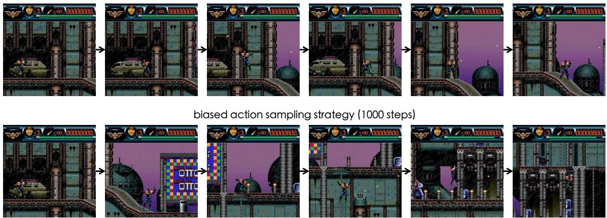  
agents to explore longer horizons.

Flt o

<table><tr><td>ActRaiser2-Stes 1942-Nes AddamsFamilyPugsleyScaver ngerHun-Nes AdventuesOfamanAndRobis-Genesis</td><td>1943-Nes ActionPachio-Snes AdventuresOfBayouBilly-Nes</td><td>NinjasKickBack-Genesis AdancedBusterwkGleylancer-Ge AddamsFamily-GameBoy AdventuresOfDinoRiki-Nes</td><td>SEyes-Nes AddamsFamily-Genesis Adventure-Auari2600 AdventuresOD:Frankes-Snes</td><td>AaahhRealMonsters-Genesis Adventarelsland-GameBoy AddamsFamily-Nes AdventuresOfKidKleets-Sncs</td><td>AbadoxTheDeadlyInnerWar-Nes AddamsFamily-Sms arelsland3-Nes AdventuresOMightyMas-Genesis</td><td>AcceleBrid-Snes Adventu AddamsFamily-Snes AdventuresOMightyMas-Snes</td></tr><tr><td>AeroTheAcoBat-Snes AirDiver-Genesis Alies-Atari2600 AlphaMossion-Nes ArcherMacleansSuperDropuone-Snes</td><td>OfRockyAndBullwinkleAndFriends-Nes AcoTheAcroBa2-Genesis AirRaid-Atari2600 Alien3-Nes AleredBeast-Genesis AndyLightfot-Stes</td><td>OfRockyAndBullwinkleAndFriends-Snes AcroTheAcroBat2-Snes Airstriker-Genesis Alien3-Sms Amagos-Nes Argus-Nes</td><td>dventuresOfStarSaver-GameBoy AferBurerll-Geesis Airwoll-Nes ArielThelitleMermaid-Genesis cingPenguin-GameBoy</td><td>AlfredChickes-GameBoy AlienSyndrome-Sms AmericanGladiators-Genesis</td><td>Angh S AlienVsPredator-Snes AlfredChickes-Nes</td><td>Airy AlfredChicken-Snes Alleyway-GameBoy</td></tr><tr><td>AsterisAndObelix-GameBoy ArrowFlash-Genesis</td><td>AntOfFighting-Genesis AsterisAndTheGreaRescue-Genesis</td><td>AnOfFighting-Snes AsterisAndTheGratRescue-Sms</td><td>Assaul-Atari2500</td><td>Arkanoid-Nes Asteris-Atari2600</td><td>Amidar-Atari2600 ArkistasRing-Nes</td><td>AchRivalsTheArcadeGame-Genesi Armadillo-Nes</td></tr><tr><td></td><td></td><td></td><td>AsterixAndThePowerOfTheGods-Genesis</td><td>AsterixAndTheSecretMission-Sms</td><td>Asterix-Sms</td><td></td></tr><tr><td>AstroRabby-GameBoy</td><td>AstroRobcSass-Nes</td><td>AstroWarrior-Sms</td><td>Astyatax-Nes</td><td></td><td></td><td>Asteroids-GameBoy Asterix-Snes</td></tr><tr><td>AtomicRoboKid-Genesis</td><td>AlomicRunner-Geneis</td><td>AttackAnimalGakuen-Nes</td><td>AltackOfTheKilerTomatoes-GameBoy</td><td>Athesa-Nes</td><td></td><td></td></tr><tr><td></td><td>BOB-Genesis</td><td>BOB-Saes</td><td>BWings-Nes</td><td>AltackOfTheKillerTomatees-Nes BackToTheFuturePartl-Genesis</td><td>BadDudes-Nes</td><td>Axelay-Snes</td></tr><tr><td>BakaretuSenshiWarrier-GameBoy</td><td>BarkleyShurUpAndlam-Genesis BalloonFight-Nes</td><td>BallonKid-GameBoy</td><td>Baltron-Nes</td><td>BananaPrince-Nes</td><td>BanishingRace-GameBoy</td><td>BadStreetBrawle-Nes</td></tr><tr><td>Barbie-Nes</td><td>BumanRetuns-Snes</td><td>BattleArenaToshinden-GameBoy</td><td></td><td></td><td>Batman-Genesis</td><td>BatmanReturns-Genesis BankHeist-Atari2600</td></tr><tr><td>BatmasReturns-Nes</td><td>BattletcadsInBattlen</td><td></td><td>B BatteBull-GameBoy</td><td>Battletcads-Genesis BattleCity-Nes</td><td>BattleMasterKyukyokuNeSenshiTachi-Snes</td><td>BatteSquadron-Genesis</td></tr><tr><td>BanleTechAGameOAmmoredCombat-Genesis BattletoadsDoubleDeagon-Snes</td><td>BillAndTedsExcellentGameBoyAdventure-GaneBoy</td><td>BiminiRun-Genesis</td><td>BinayLand-Nes</td><td>BeatyAndTheBeastBellesQuest-Gc</td><td></td><td></td></tr><tr><td>Berzerk-Atari2600 BicSenshiDanlncreaserTonoTatakai-Nes</td><td>BlockKazshiGB-GameBoy BirdWeek-Nes</td><td>BishoujeSenshiSailorMoon-Genesis Blockout-Genesis</td><td>BishoujoSenshiSailorMoonR-Snes</td><td>BioHazardBatte-Genesis BlaZeonTheBioCyborgChallenge-Snes</td><td>BioMeal-Ses</td><td>BioMiracleBokutteUpa-Nes BladesOfVengeance-Geneis</td></tr><tr><td>BlockKuzshi-Snes BoobyBoys-CGameBoy</td><td></td><td>BoogemanAPckAndFlickAdventure-Geneis</td><td>BodyCount-Genesis BoogermanAPckAndFlickAdventure-Snes</td><td>Bomblack CameBoy BoogicWoogicBowling-Genesis</td><td>Biosk Ss</td><td>BonkersWaxUp-Sms</td></tr><tr><td>Bowling-Atari2600</td><td>eeCcoy</td><td></td><td>BabbaNStis-Genesis</td><td></td><td>BoulderdDasb-GameBoy BramStokersDracula-Snes</td><td>BoulderDash-Nes</td></tr><tr><td>BreakThrs-Nes BubbleBobblePart2-Nes</td><td>BullsVersusBlazrsAndTheNBAPtyoffs-Genesi BubbleGhost-GameBoy</td><td>BallsVLakersAndTheNBAPlayoffs-Gene Bubsyll-Genesis</td><td>Bubsyll-Ssnes</td><td>BubsylnClassEncoutesOfTheFurdKind-Genesis</td><td>BubbleBobble-Nes BubsylnClawsEncountersOfTheFuredKind-Snes</td><td>Brilh s</td></tr><tr><td>CalRipkenlBaseball-Genesis</td><td>Caliber50-Genesis</td><td>CalifomiaCames-Genesis</td><td>BuraiFighter-Nes Cameliry-Snes</td><td>BurningForce-Genesis CannonFodder-Genesis</td><td>CannonFodder-Snes</td><td>BuckyOHare-Nes Cadash-Genesis</td></tr><tr><td>CaptainAmericaAndTheAvengers-Nes</td><td>CaptainAmericaAndTheAvengers-Snes CastleOfllusion-Genesis</td><td>CaptainCommando-Snes Castleratia-Nes</td><td>CaptainPanetAndThePancteers-Genesis</td><td>CaptainPlanetAndThePlaneteers-Nes CastlevaniaDraculaX-Snes</td><td>CaptainSilver-Nes</td><td>CaptainAmericaAndTheAven</td></tr><tr><td>CaNindenTeyandee-Nes</td><td>CheeseCaAstropheStarringSpeedyGonzales-Genesis Centipede-Atari2600</td><td>CheeseCaAstropheStarringSpeedlyGonzales-Sms ChacknPop-Nes</td><td>ChesterCheetahTooCoolToFoo-Genesis Challenger-Nes</td><td>ChampionsWcrldClasSoccer-Genesis</td><td>ChampionshipProAm-Genesis</td><td>ChaosEingine-Genesis</td></tr><tr><td>ChaseHQil-Genesis ChiChisPoChallengeGoll-Genesis</td><td>ChiliChilkiBoys-Genesis ChubbyCherub-Nes</td><td>Choplifer-Nes ChuckRock-Genesis</td><td></td><td>ChesterCheetahTooCoefToFool-Snes</td><td>ChesterCheetahWiWiaQuest-Genesis</td><td>ChesterCheetahWildWildQuest-Snes</td></tr><tr><td>ChoujikuuYousaiMacrosScrambleValkyrie-Snes CincasCaper-Nes</td><td>CircusCharlie-Nes CloudMaster-Sms</td><td>CityConnection-Nes</td><td>ClayFighter-Genesis ChuckRock-Sms</td><td>Claymates-Snes</td><td>ChuckRockllSonOFChuck-Genesis</td><td>ChuckRockISonOfChuck-Sms</td></tr><tr><td>Cliffhunger-Snes ColumnsIII-Genesis</td><td>CombatCars-Genesis</td><td>ComicalMachineGunloe-Sms CluCluLand-Nes</td><td>CobraTriangle-Nes ComixZone-Genesis</td><td>CodeNameViper-Nes Conan-Nes</td><td>Cliffhanger-Genesis CollegeSlan-Genesis</td><td>Cliffhanger-Nes Columns-Genesis</td></tr><tr><td>ContraForce-Nes CrazyClimber-Atari2600</td><td>CoolSpot-Genesis CrossFire-Nes</td><td>CoolSpot-Sms CrueBallHeavyMetalPinball-Ger</td><td>CoolSpot-Snes</td><td>CosmicEpsion-Nes</td><td>CongosCaper-Saes CosmoGiung TheVideo-Snes</td><td>ConquestOfTheCryotalPalace-Nes</td></tr><tr><td>Cyherbull-Genesis</td><td>Cyhenator-Snes DangerouSeed-Genesis</td><td>Cyborglustice-Genesis</td><td>DJBoy-Genesis Curse-Genesis</td><td>CutieSuzukiNoRingsideAngel-Genesis DaffyDacklnHollywood-Sms</td><td>DaffyDuckTheMarvinMission-Snes CutthroatIsland-Genesis</td><td>CrackDown-Genesis CyberShinobi-Sms</td></tr><tr><td>Dhi yhedaorghis me</td><td>DeepDuckTroubleSurringDonaldDuck-Sms DashGalaxyInTheAlienAsylum-Nes</td><td>DariusForce-Snes</td><td>DuvidRobins DariusIl-Genesis nsSupremeCourt-Genesis</td><td>DariusTwin-Snes DuzeBeforeChristmas-Genesis</td><td></td><td>DaisenpuTwinHawk-Genesis Darkmas-Nes</td></tr><tr><td>DeathDuel-Genesis DevilCrashMD-Genesis</td><td>DevilshTheNexPossession-Genesis</td><td>Defender-Adari2600 DickTracy-Genesis</td><td>Defenderll-Nes Dick Tracy-Sms</td><td>DemonAttack-Auari2600</td><td>DuzeBeforeChristmas-Snes DesnisTheMenace-Snes</td><td>DesertStrikeRetusToTheGll-Genesis DeadlyMoves-Gene</td></tr><tr><td>DonkeyKongCountry-Snes orce-Snes</td><td>DonkeyKongCountry2-Snes DinoCity-Snes</td><td>DonkeyKongCountry3DisieKongsDoubleTrouble-Snes DinoLand-Genesis</td><td>Dity Harry-Nes DonkeyKongle-Nes</td><td>DickVialesAwresomeBabyCollegeHoop-Genesis DonDokoDon-Nes</td><td>DigDugITroublelsParadise-Nes</td><td>DiggerTheLegendOfTheLoatCity-Nes</td></tr><tr><td>Daues</td><td>DoubleDragonVTheShadowFall-Genesis</td><td>DoableDeibbleThePayoffEditicn-Genesis</td><td>DoubleDunk-Atari2600</td><td>DoubleDeragon-Genesis DrRobotniksMeanBeanMachine-Genesis</td><td>Da </td><td></td></tr><tr><td>DynamiteHeaddy-Genesis ElevatorAction-Nes</td><td>ESPNBaschallTonight-Genesis EliminateDown-Genesis</td><td>EamnestEvans-Genesis DragonsLair-Snes</td><td>EarthDefenseForce-Snes</td><td>DreamTeamUSA-Geneis EViento-Genesis</td><td>ElementalMaster-Genesis</td><td>DragonSpiritTheNewLegend-Nes DynamiteDuke-Sms</td></tr><tr><td>FZSenkiAxisFinalZone-Genesi</td><td>FaeryTaleAdventure-Genesi</td><td>Enduro-Atari2600 FamilyDog-Snes</td><td>anClubSoccer-Genesis</td><td>ExMutants-Genesis</td><td>Excrion-Nes</td><td>ElevatorAction-Atari2600 F1-Genesis</td></tr><tr><td>FantasyZonelTheTeansOOpaOpu-Sms</td><td>FantasyZoneTheMaze-Sms</td><td>FatalFury-Genesis</td><td>Feat oein</td><td>FEalla is</td><td>FantayZone-Sma FatalRewind-Genesis</td><td>FelixTheCat-Nes</td></tr><tr><td></td><td>FlyingDragenTheSecretSceroll-Nes</td><td>Framay ae Ss</td><td></td><td>FinalFight2-Snes</td><td>FinalFight3-Snes</td><td></td></tr><tr><td>FessPeterPanAndThePratesTheRevengeOfCaptainHook-Nes FintosesTheRescueOfDinoAndHoppy-Nes</td><td>FrankThomasBigHurtBasehall-Genesis GlloeTheAdantisFactor-Nes</td><td>Freeway-Atari2600 FlyingHero-Nes</td><td>FlyingHeroBugyurNoDaiboaken-Snes Frogger-Genesis</td><td>FrontLine-Nes</td><td>Forgotten Worlds-Genesis Frostbite-Atari2600</td><td>FormationZ-Nes</td></tr><tr><td>GilloeARealAmericanHero-Nes GalaxyFocell-Genesis</td><td></td><td>GadgetTwins-Genesis Gauntlet-Sms</td><td>Gaiares-Genesis Geimos-Nes</td><td>GainGround-Genesi GeneralChaos-Genesis</td><td></td><td>FushigiNoOshiroPtPot-Sms GalaxyForce-Sms</td></tr><tr><td>GoldenAse-Genesis</td><td>Gimnick-Nes GoldenAxellI-Genesis</td><td>GlobalDefemie-Sms Gopher-Atari2600</td><td>GlobalGiladitors-Genesis</td><td>Gods-Genesis</td><td>Gods-Snes</td><td>GhoulSchool-Nes</td></tr><tr><td>Cremin2TheNewBachb-Nes Granada-Genesis</td><td>Geavitar-Alari2600 GrindStommer-Genesis</td><td></td><td>GreaCircusMysteryStarringMickeyAndMinnie-Snes Gradius-Nes</td><td>Gradiusl-Nes</td><td>GreatWaldoSeanch-Genesis GradiusII-Snes</td><td>GradiusThelntestellarAsaul-GaneBoy</td></tr><tr><td>Gynoug-Genesis</td><td>Gyrodine-Nes</td><td>Gynuss-Nes</td><td>GuardianLegend-Nes HammerinHary-Nes</td><td>Cirala Ne HangOn-Sms</td><td>GunNac-Nes</td><td>GreendogTheBeachedSurferDude-Genesis Gunship-Genesis</td></tr><tr><td>Havec-Cesesis</td><td>Heavy Barrel-Nes HomeAlone-Genesis</td><td>HearyNova-Genesis HomeAlone2LostlnNewYork-Genesis</td><td></td><td>Hellire-Gienesis</td><td>HardDrivin-Genesis HelloKittyWorld-Nes</td><td>HarleysHumongousAdventure-Snes Hero-Atari2600</td></tr><tr><td>HundForRedOctober-Snes</td><td>Hurricanes-Genesis</td><td>Hurricanes-Snes</td><td>IMGlsternationalTourTennis-Genesis</td><td>IceClimber-Nes Hook-Genesis</td><td>Hok-Sas IceHeckey-Atari2500</td><td></td></tr><tr><td>Hn</td><td>IsolatedWarrior-Nes</td><td>IachyAndScratchyGame-Snes</td><td>nct</td><td>InsctorX-Nes</td><td>ImpectorGadges-Snes</td><td>IncredibleHalk-Sms lkari-Nes</td></tr><tr><td>IshidoTheWayOfStones-Geneis</td><td>JamesBond007TheDuel-Genesis</td><td>JamesBond007TheDuel-Sms</td><td>lzzysQuesForTheOlympicRings-Genesis</td><td>1zzysQuestFerTheOlympicRings-Snes JamesPond2CodenameRoboCod-Smm</td><td>Jackal-Nes</td><td>JackieChansActionKungFe-Nes</td></tr><tr><td>JoeAndMac-Genesis watetAgeni-Genesis</td><td>JoeAndMac-Nes</td><td>Jaws-Nes JoeAndMac-Stes</td><td>JoeAndMacHLostlsTheTropics-Snes</td><td>JetsonsCogwellsCaper-Nes JouneyEscape-Aari2600</td><td>JamesPond3-Genesis</td><td>JamesPondICodenameRobocod-Genesis</td></tr><tr><td>JuJuDessetsTokiGoingApeSpi-Geneis</td><td>Jualp Coin</td><td>JudgeDeead-Snes KabakiQuantumFighter-Nes</td><td>JungleBook-Genesis</td><td></td><td>JourneyToSiius-Nes JungleBook-Snes</td><td>Joust-Nes</td></tr><tr><td>Kangaroo-Alari2600</td><td>KanshakudamaNageKantarouNoToukaidouGojusanTsugi-Nes</td><td>KeroppiToKesrinuNoSplashBomb-Nes</td><td>KidChaneleon-Genesis</td><td>Killcans-Nes</td><td>KidKlownlsCrazyChase-Snes</td><td>JusticeLeagueTaskForce-Genesis</td></tr><tr><td>KidNiiRadicalNinja-Nes Kange-Nes</td><td>Ki ss</td><td>KingOTheMonsend2-Genesis KungFuKid-Sms</td><td>Kia Chmeds oin</td><td></td><td>KnighOrTheRound-Snes</td><td>KidKlownlsNighMayorWorld-Nes Krull-Auri2600</td></tr><tr><td>LastActonHero-Snes</td><td>LegendaryWings-Nes LastBatte-Genesis</td><td>LethalEnforcers-Genesis LastSarfighter-Nes</td><td>LethalEnforcensGunFighters-Genesins LawnmowerMan-Genesis</td><td>Legend-Snes</td><td>LegendO6Galahad-Genesis</td><td>LastActionHero-Nes LegendOfKage-Nes</td></tr><tr><td>LegendOPinceValiant-Nes LitfleMermaid-Nes</td><td>LowGMasTheLowGravityMas-Nes MagicalTaruranoKun-Genesis</td><td>LackyDineCaperStarringDonaldDuck-Sms</td><td>MCKids-Nes</td><td>LethalWeapon-Saes MUSHA-Genesis</td><td>LifeForce-Nes MagicBoy-Snes</td><td>LineOfFire-Sms</td></tr><tr><td>MagicalQuestSurringMickeyMouse-Sncs MarioBros-Nes</td><td>Marko-Genesis</td><td>Marsupilami-Genesis Magnas-Nes</td><td>MacuRenjishi-Genesis MarvelLand-Genesis</td><td>MappyLand-Nes Mask-Snes</td><td>MarbleMadness-Geneis MasterOfDarkness-Sms</td><td>MagicSwoed-Snes MarbieMadness-Sms</td></tr><tr><td>MechanizedAnack-Nes</td><td>MegaMan-Nes MichaeUacksonsMoonwalker-Genesis</td><td>MegaMan2-Nes MichaellacksonsMoowalker-Sms</td><td>MegaMasTheWilyWa-Genesis MickeyMossecapade-Nes</td><td>MidnighResistance-Gesesis MegaSWTV-Genesis</td><td>MegaTurrican-Genesis</td><td>McDonaldsTreasureLandAdventure-Genesis MendelPalace-Nes</td></tr><tr><td>MetalStorm-Nes MighyMorphinPowerRangers-Genesis</td><td>MightyMerphinPowerRangersTheMovie-Geneis MonserParty-Nes</td><td>MightyMorphinPowerRangersTheMovie-Snes</td><td>Mellipede-Nes MoonPatrol-Atari2600</td><td>MitsumeGaTooru-Nes</td><td>MightyBomblack-Nes MoeroTwinBeeCinnamonHakaseOSukue-Nes</td><td>MightyFinalFight-Nes MonsterlnMyPocket-Nes</td></tr><tr><td>MonsterLaiz-Genesis MrNutz-Genesis</td><td>MrNutz-Snes MysteryQuest-Nes</td><td>MsPacMan-Genesis NARC-Nes</td><td>MsPacMan-Nes</td><td>MortalKembut-Genesis MsPacMan-Sms</td><td>MortalKombat3-Genesis MsPacman-Atari2600</td><td>MoralKombatl-Genesis</td></tr><tr><td>MyHero-Sms NewZealandStory-Sms</td><td>Ninja-Sms</td><td>NinjaCrusaders-Nes</td><td>NHIL.94-Genesis NinjaGaiden-Nes</td><td>NHL94lonl-Genesis NinjaGaiden-Sms</td><td>NinjaGaidenllITheAncientShipOfDoom-Nes NameThisGame-Atari2600</td><td>MutantVirsCrisislnACompaterWorld-Nes NewZealandStury-Genesis</td></tr><tr><td>NinjaKid-Nes OverHorizon-Nes</td><td>NoahsAk-Nes PoWPisnnOfWar-Nes</td><td>NormysBeachBabeORama-Genesis PaclnTime-Snes</td><td>OperationWelf-Nes PacManNamco-Nes</td><td>Onifants-Genesis PacMania-Genesis</td><td>Er  </td><td>NinjaGaidelITheDarkSwordOfChacs-Nes OurToLunch-Snes</td></tr><tr><td>Paperboy-Genesis</td><td>Paperboy-Nes Phalanx-Snes</td><td>Paperboy-Sms Phelios-Genesis</td><td>Paperboy2-Genesis Phoenix-Atari2600</td><td>Parodius-Nes</td><td>Parodius-Snes</td><td>PanicRestaurant-Nes PeaceKeepers-Snes</td></tr><tr><td>PenguinKunWars-Nes PaFighter-Sas</td><td>Pitfall-Atari2600 Pooyan-Nes</td><td>PitalITheMayanAdventuro Popeye-Nes</td><td></td><td>PinkGeesToHolywood-Genesis</td><td>PiratesOfDarkWater-Snes</td><td>PiFighte-Genesis Pong-Atari2600</td></tr><tr><td>Pooyan-Atari2600 PowerAthlete-Gesesis</td><td>PowerPiggsOfTheDarkAge-Snes PsychicWorld-Sms</td><td>PowerStrike-Sms Qbert-Atari2600</td><td>PowerStrikell-Sms PanchOus-Nes</td><td>Prate min</td><td>Pra Ss</td><td>PoseidonWars3D-Sms PehistorikMan-Snes</td></tr><tr><td>PrivateEye-Atari2600 PuttySquad-Snes RTypelll-Sness</td><td>RadicalRes-Genesis QBert-Nes RambolII-Genesis</td></table>

# B. Implementation Details

# B.1. Architecture

Th I or me dots 3Net VD (Blat a 03 w5rae pe memory length of 6. The default input resolution for both models is $2 5 6 \times 2 5 6$ .

# B.2. Training

The latent actucoer  taior0Kses o scratc wi  batc z We plyhemW optimizer (Loshchilov & Hutter, 2019) with a learning rate of $2 . 5 \times 1 0 ^ { - 5 }$ and a weight decay of 0.01. The hyperparameter $\beta$ is set to $2 \times 1 0 ^ { - 4 }$ to achieve a good balance between representation capacity and context disentangling ability. The autoregressive world model is trained for 80K steps with a batch size of 64 and a learning rate of $5 \times 1 0 ^ { - 5 }$ on 16 NVIDIA 100 GPUs Wedopt  csie arin ratheduler wi 10K waru stes. T a predi l, oep T ange of 0.0 to 0.7, with an interval of 0.1.

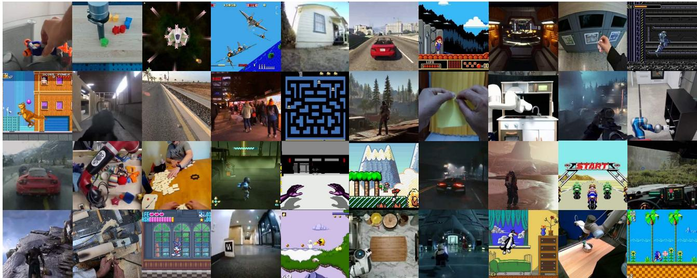  
Fiure Diversiy urrainig datast. Our uratedatase agregates  extremely widerange  c.

F zo of $1 0 \ : \mathrm { H z }$ for training.

# B.3. Sampling

Byu  a al results. A timestep shifting strategy (Kong et al., 2024) is also applied to enhance generation quality.

# B.4. Visual Planning on the Procgen Benchmark

We summarize our model predictive control process for visual planning as below: defined as the maximum reward obtained along the planned trajectory.   
2.At each iteration, we sample a population of $N$ action sequences, each with a length of $L$ , from a distribution. The initial distribution is set to a uniform distribution over four actions (LEFT, DOWN, UP, RIGHT).   
For ea sample actin sequence, the worlmode is used to predict the resultng trajcry and the rear is calculated for each trajectory. 4. The top $K$ action sequences with the highest rewards are selected, and we update the distribution by increasing the sampling probabilities of these selected actions. 5. A new set of $N$ $i$ Cross-Entropy Method iterations. 6. After $i$ optimization iterations, the first $T$ action in the action sequence with the highest probability is executed in the emTh pnia hewhenheal sta s hive whehearc m s x. In practice, we use $i = 2$ Cross-Entropy Method iterations. For each iteration, $N = 1 0 0$ action sequences with a length of $L = 1 5$ are sampled, and the best $K = 1 0$ samples are selected to update the action sampling distribution. After the optimization procedure is done, the first $T = 5$ actions are executed in the environment. We set the search limit to 20 steps.   
For efficiency, we use only 3 denoising steps and disable classifier-free guidance during planning.

# B.5. Visual Planning on the $\mathbf { V P } ^ { 2 }$ Benchmark

We train low-resolution variants at a resolution of $6 4 \times 6 4$ for control-centric evaluation on the $\mathrm { { V P ^ { 2 } } }$ benchmark. We follow the official protocol of $\mathrm { { V P ^ { 2 } } }$ to evaluate all models. During adaptation, we use 5K given trajectories for Robosuite and 35K s  ot size of 32 and a learning rate of $5 \times 1 0 ^ { - 4 }$ .A cost below 0.05 is considered as success in Robosuite tabletop pushing tasks.

# B.6. iVideoGPT Training Details

Wo eeoino tee p ex ese  oeiboctsr teAo pshata.heult are tested on 256 test videos.

# C. Additional Results

# C.1. Action Transfer ualitative oparison.e ualtativey paraWorl trane o 0 teps wiherbaseline Fure The u ob

VliztsW mon ul t s generated by transferring a latent action sequence with a length of 20. uW o view shifts.

# C.2. World Model Adaptation

T ue ue.  uy Thidoeh cul beizameho moeptat conventional methods.

# C.3. Action Creation through Clustering

As mtS.AdaWor nls eas catxienbecnto ts hrou late R derived with AdaWorld, we adopt the $\Delta$ PSNR metric following Genie (Bruce et al., 2024). Table 9 shows the $\Delta$ PSNR of the latent action decoder predictions. The larger the $\Delta$ PSNR, the more the predictions are affected by the action conditions AWorab does not support a customizable number of actions, as it is fixed once trained.

<table><tr><td rowspan="2">Method</td><td colspan="9">ΔPSNR</td></tr><tr><td>4</td><td>5</td><td>6</td><td>7</td><td>8</td><td>9</td><td>10</td><td>11</td><td>12</td></tr><tr><td>Discrete cond.</td><td>N/A</td><td>N/A</td><td>N/A</td><td>N/A</td><td>6.47</td><td>N/A</td><td>N/A</td><td>N/A</td><td>N/A</td></tr><tr><td>AdaWorld</td><td>5.67</td><td>5.15</td><td>7.28</td><td>8.23</td><td>6.26</td><td>7.32</td><td>6.07</td><td>6.68</td><td>6.53</td></tr></table>

# D. Something-Something v2 Categories for Action Transfer

, Co  i h", "sh hogh  U h  hb,  " u

# E. Selected Scenes for Visual Planning

Tuit  ioo

# F. Related Work

# F.1. World Models

Dv X i ehepliathenheorr a u H &, Y  0  y ve  iHa Th lt 0He 0H a H u Zl0Zu 0Zhu Z Bu et al., 2024; Wang et al., 2025; Qi et al., 2025; Wu et al., 2025). preai assiideWatte  l0e l 0Wu l. H tmssoa H by assuming that the parameters of the pretrained video models are frozen or inaccessible. W  rul haplrivt o unique applications for adaptable world modeling.

# F.2. Latent Action from Videos

H zat T a sacdeveuc potoype u  3 Howevehe eqoly paired videos, which limits their scalability for most real-world tasks. T pl h Crale&Bke . However, hyiu et i cexiy Whio e  u et al., 2025). Thus, the potential of latent actions for adaptable world modeling remains underexplored.

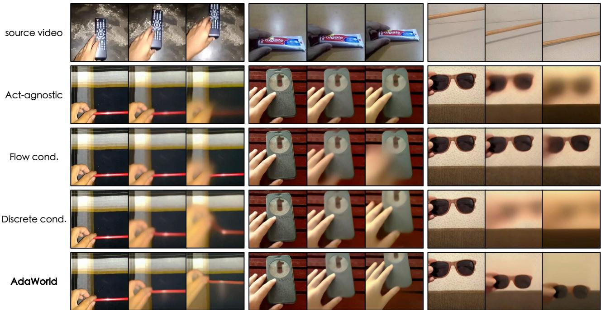  
transfer it to another context, while the other baselines fall short in doing so.

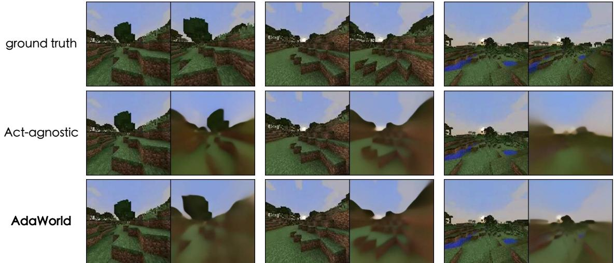  
perform the correct actions.

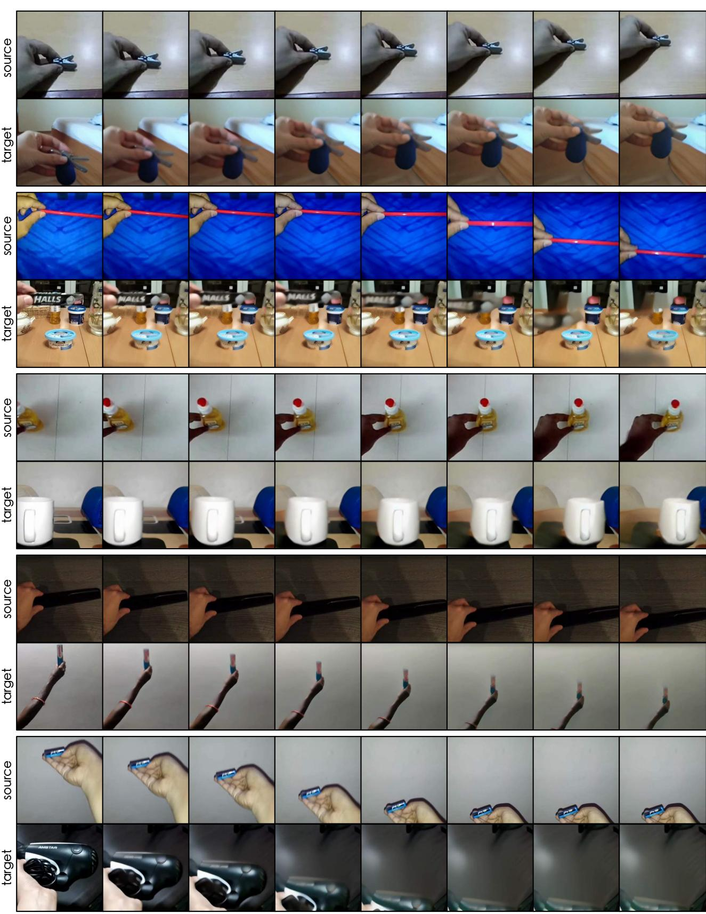  
Figure 12. Additional action transfer results by AdaWorld. Best viewed with zoom-in.

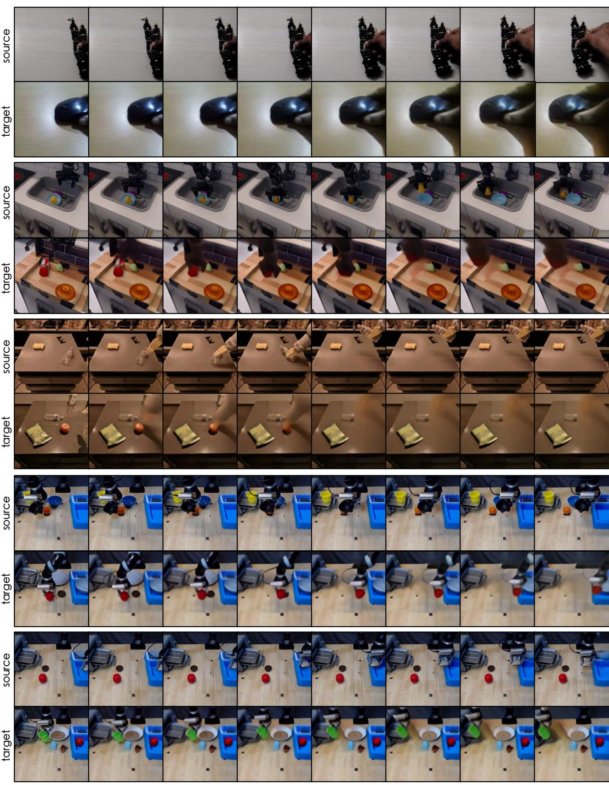  
Figure 13. Additional action transfer results by AdaWorld. Best viewed with zoom-in.

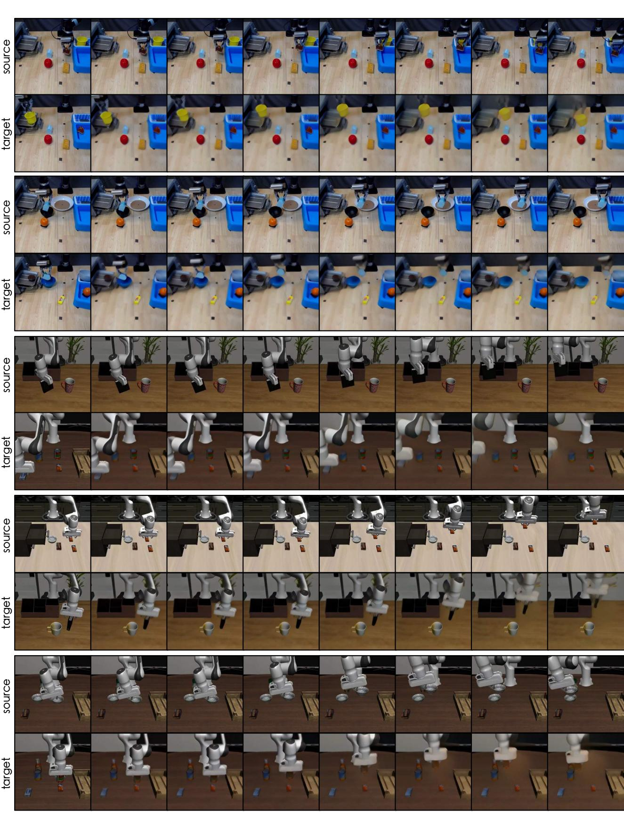  
Figure 14. Additional action transfer results by AdaWorld. Best viewed with zoom-in.

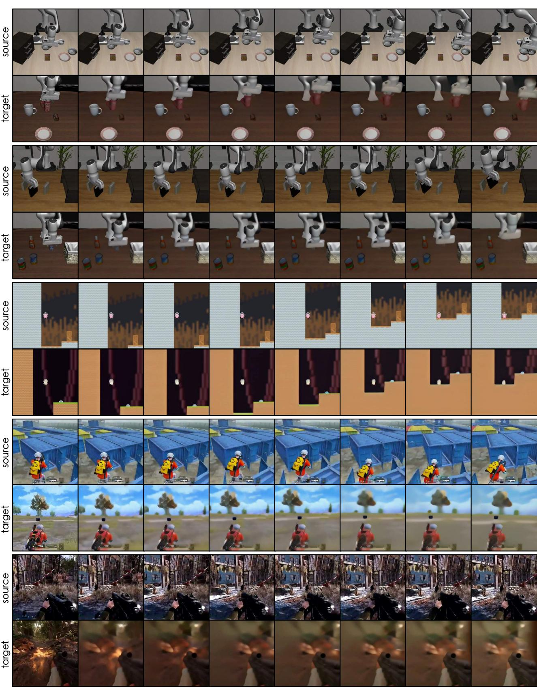  
Figure 15. Additional action transfer results by AdaWorld. Best viewed with zoom-in.

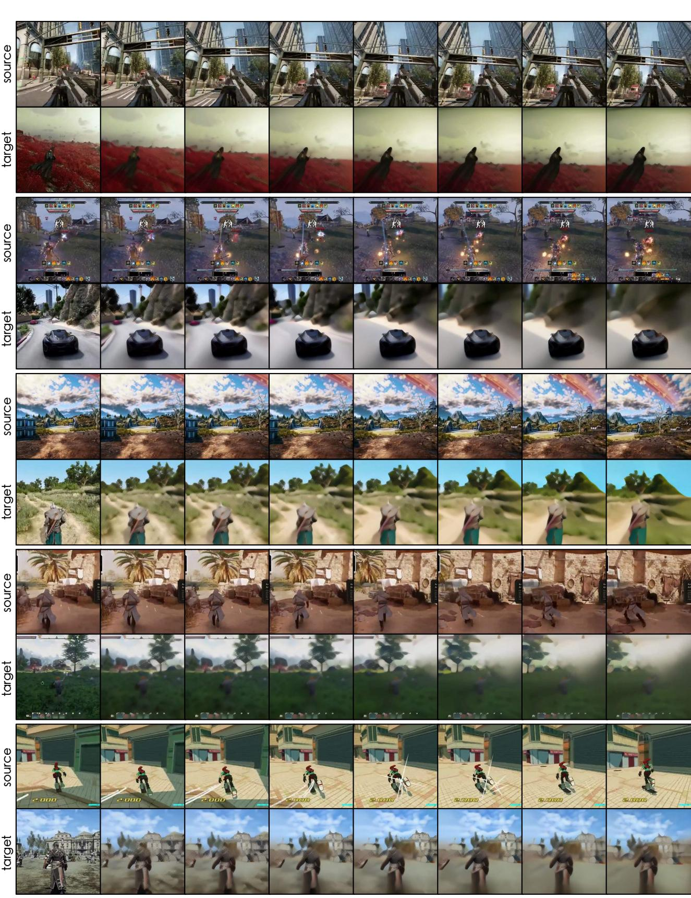  
Figure 16. Additional action transfer results by AdaWorld. Best viewed with zoom-in.

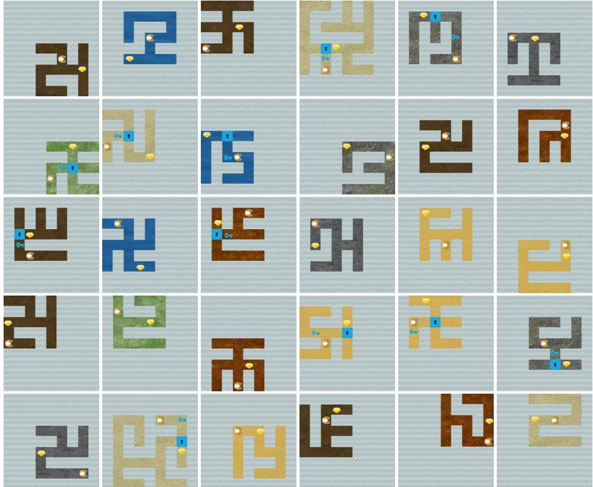  
Fgur  Heist scenes for planning evaluation.Thegure illustrates the initial states all selectese.

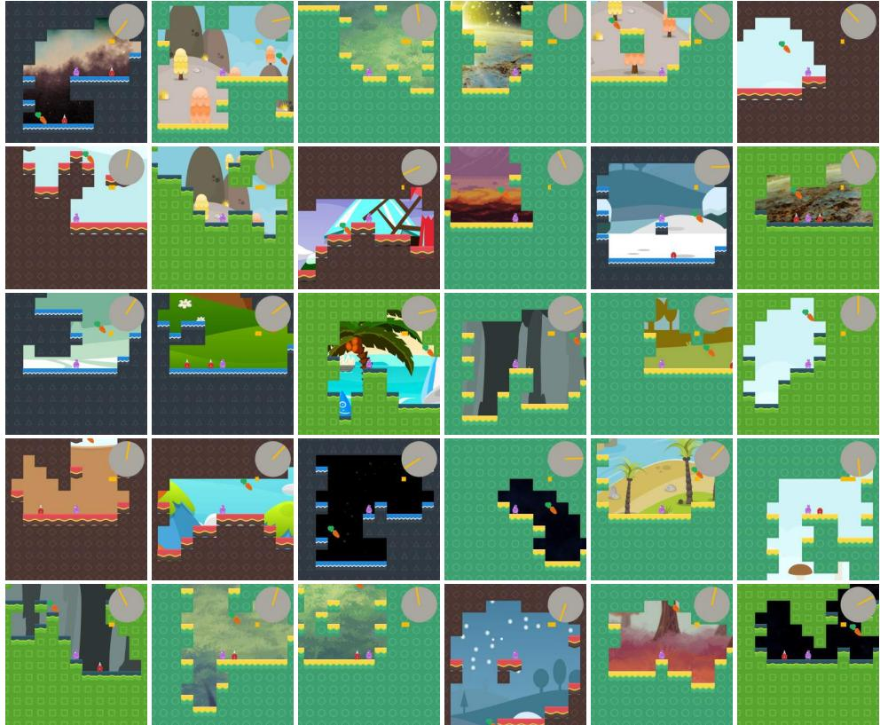  
uJ  or p valaiTegulua all.

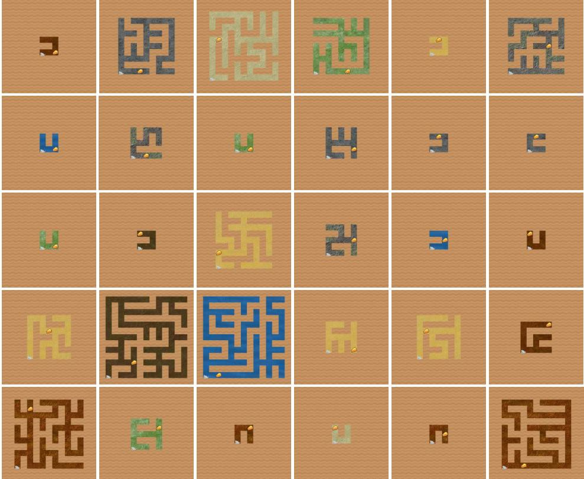  
Figur Maze cenes or plannng valuation. Thegureustrates henitialstate  all select s.

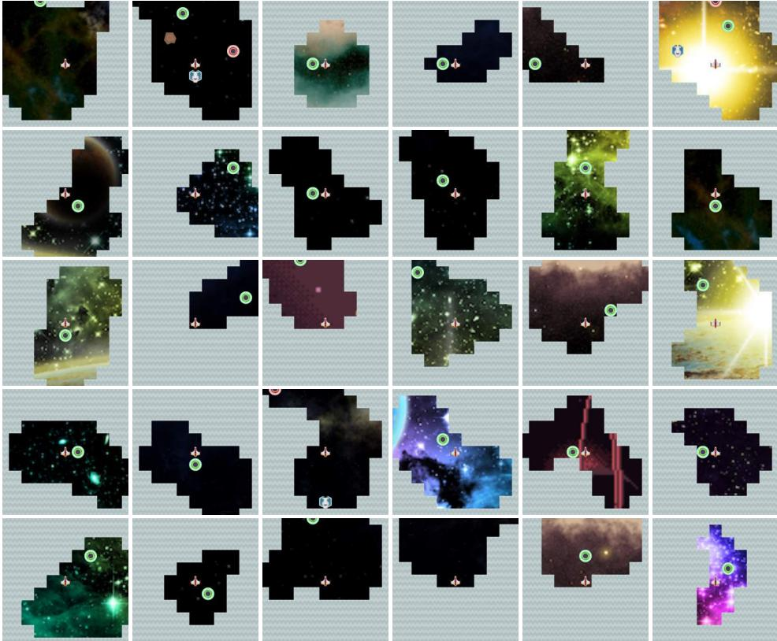  
avFly   vaaTeul lat .

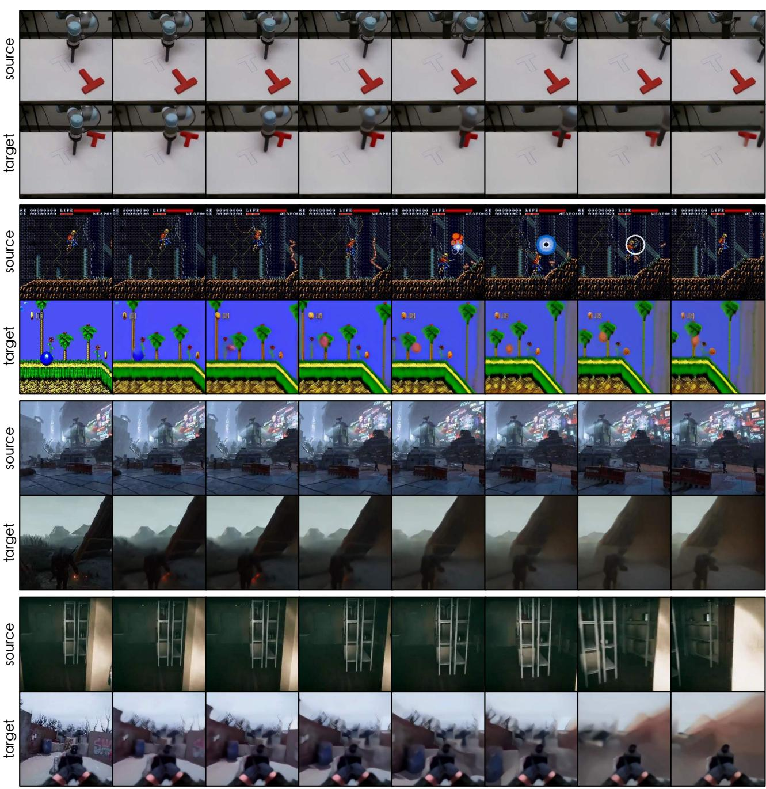  
ollouts, and significant view changes.