# Self-Forcing++: Towards Minute-Scale High-Quality Video Generation

Justin Cui1,2 Jie Wu2,† Ming $\mathsf { L i ^ { 2 , 3 } }$ Tao Yang2 Xiaojie Li² Rui Wang2 Andrew Bai1 Yuanhao Ban1 Cho-Jui Hsieh1,‡

1UCLA, ByteDance Seed, 3University of Central Florida

‡Corresponding author, †Project lead

# Abstract

Diffusion models have revolutionized image and video generation, achieving unprecedented visual quality. However, their reliance on transformer architectures incurs prohibitively high computational costs, particularly when extending generation to long videos. Recent work has explored autoregressive formulations for long video generation, typically by distilling from short-horizon bidirectional teachers. Nevertheless, given that teacher models cannot synthesize long videos, the extrapolation of student models beyond their training horizon often leads to pronounced quality degradation, arising from the compounding of errors within the continuous latent space. In this paper, we propose a simple yet effective approach to mitigate quality degradation in long-horizon video generation without requiring supervision from long-video teachers or retraining on long video datasets. Our approach centers on exploiting the rich knowledge of teacher models to provide guidance for the student model through sampled segments drawn from self-generated long videos. Our method maintains temporal consistency while scaling video length by up to $2 0 \times$ beyond teacher's capability, avoiding common issues such as over-exposure and error-accumulation without recomputing overlapping frames like previous methods. When scaling up the computation, our method shows the capability of generating videos up to 4 minutes and 15 seconds, equivalent to $9 9 . 9 \%$ of the maximum span supported by our base model's position embedding and more than 50x longer than that of our baseline model. Experiments on standard benchmarks and our proposed improved benchmark demonstrate that our approach substantially outperforms baseline methods in both fidelity and consistency. Our long-horizon videos demo can be found at https://self-forcing-plus-plus.github.io/.

# 1 Introduction

The field of video generation is advancing at a remarkable pace, catalyzed by the advent of diffusion models. Seminal works such as Sora [43], Wan [56], Hunyuan-DiT [29], and Veo [13] are progressively closing the gap betwen generated content and reality. Despite this progress a formidable challenge remains: the majority o state-of-the-art models are confined to generating short-form videos, typically capped at 5-10 seconds. This constraint is inherent to the architectural design of the underlying Diffusion Transformers (DiT) [45], the inherently non-streaming and non-causal nature of the vanilla DiT architecture poss a significant challenge to achieving temporal scalability,

Aprisnaveue r ransndinth itationeshiftio bdretionaldiffusion arhitectue autoregressive, streaming-based models. One such approach, Diffusion Forcing [5, 25], applies heterogeneous noise schedules across frames to enable sequential generation. However, the combinatorial complexity of noise scheduling often leads to training instability and has proven diffult to scale [6, 15]. A more tractable strategy involves predicting the next frame or chunk from a clean context, with KV caching emerging as a key mechanism for enabling performant, real-time streaming. For instance, CausVid [69] proposes a method to distill a bidirectional teacher model into a streaming student model using heterogeneous distilation. However, its reliance on overlapping frames for temporal consistency and a pronounced train-inference mismatch often results in over-exposureartifacts.The Se-Forcing [1] method mitigates the over-exposure issue by alig the training and inference distributions. While this sets a new benchmark for short-form video quality, its capacity remains bottlenecked by the fixed-duration teacher model. Consequently, when tasked with generating content beyond this intrinsic temporal window (e.g., $>$ 10 seconds), the model's visual quality degrades precipitously.

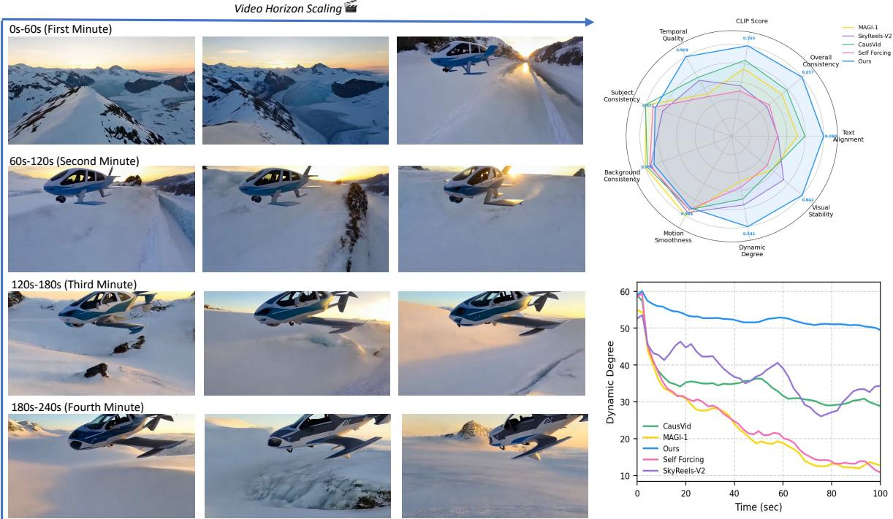  
Figure 1 Self-forcing $^ { + + }$ generates videos up to four minutes long. The radar chart highlights our model's superiority, while the line plot shows its sustained motion dynamics over long durations.

A primary challenge limiting the quality of autoregressive long-video generation models is a significant training-inference misalignment. This misalignment manifests in two principal ways. First, a temporal mismatch occurs: during training, models generate short clips of up to 5 seconds—the maximum horizon of the teacher model—whereas at inference, they must generate videos of significantly greater length. Second, error accumulation caused by supervision misalignment during long-horizon generation. In training, the teacher model provides abundant supervision for every frame within the short clip. This intensive guidance, however, means the student model is rarely exposed to the compounding errors that naturally arise in long rollouts, leaving it ill-equipped to handle them. As a result, generation quality rapidly deteriorates beyond the 5-second training horizon, often collapsing into static or stalled content.

In this paper, we introduce Self-Forcing++, which directly targets the above two issues. Building upon the observation from previous works [1, 3, 31] that a teacher model, despite its own 5-second generation limit, possesses ric knowledge for correctingerrors in quality-degraded videos due to its training on a vast video corpus. We leverage this insight by extending the student's generation horizon far beyond 5 seconds (up to 100 seconds in our experiments). This process intentionally produces candidate long videos that contain accumulated errors. To enable the student model to handle these errors, we then re-inject noise into these degraded rollouts and apply distribution-matching distillation with the strong teacher model, a process combined with a long-horizon rolling KV cache and windowed sampling. This strategy teaches the student to recover from degraded states and sustain high-quality, coherent video generation over extended durations. Experimental results demonstrate that our method can scale video generation up to 100 seconds, a $2 0 \times$ increase over the baseline, while maintaining high visual quality. By scaling up computation through extended training, our method is capable of generating videos up to 4 minutes and 15 seconds1, utilizing $9 9 . 9 \%$ of the base model's positional embedding capacity and representing a $5 0 \times$ improvement over the baseline. Furthermore, our investigation revealed that the widely used VBench [22] benchmark exhibits a bias that favors overexpose an degradeames when evaluatinglongvideos,underminin therelabilty its results. To remedy this, we propose a new metric, Visual Stability, designed to systematically capture both quality degradation and over-exposure in long video generation. Our work paves the way for building more robust and reliable long video generation models. Our contributions are summarized as follows:

Identifying Horizon Scaling Bottlenecks: We reveal the primary obstacle to extending the generation horizon of autoregressive models: a dual mismatch in temporality and supervision during training versus inference. This insight provides a clear target for overcoming previous limitations on the generation length. A Simple Solution: We propose a simple training framework, named Self-Forcing++. By generating beyond the teacher'horizon an correctingthe student modeontswn ng eoaccmulaterollout trajes, Self-Forcing++ extends high-quality video generation to 100 seconds, far surpassing previous state-of-the-art methods without reusing overlapping frames.   
SOTA Performance and Horizon Scalability: Self-Forcing++ achieves state-of-the-art (SOTA) performance in long-video generation across a range of durations (e.g., 10s, 50s, 100s). Furthermore, we discover a significant scaling property: by scaling the training computation, our model's generation capability extends to multiple minutes, a feat previously considered out of reach.

# 2 Related Work

Video Diffusion Models Video diffusion models have advanced rapidly, beginning with UNet [50] based approaches that extended image diffusion backbones into the temporal domain [2, 1618]. These early models enabled short-form video generation but faced limitations in scalability. The introduction of the Diffusion Transformer (DiT)[45] represented a turning point by replacing convolutional hierarchies with transformer blocks, which allowed models to capture global spatio-temporal dependencies more effectively and to scale with larger datasets and computational resources. This shift led to a new wave of architectures, such as Sora[43], which produces realistic, coherent videos with strong temporal consistency and diverse motion, and Hunyuan Video [29], which employs a causal 3D VAE [26] for spatio-temporal token compression in latent space combined with a large language model for text conditioning. Wan 2.1 [56] further demonstrates the benefits of massive pretraining for high-resolution video generation. CogVideoX [19, 66] introduces an expert transformer with adaptive LayerNorm to enhance cross-modal fusion, supported by a 3D VAE, progressive training, and multi-resolution frame packing, thereby achieving strong text alignment and motion coherence. Open-Sora [33, 47] and Open-Sora-Plan [33] extend these advancements in the open-source community, delivering high-quality video generation and significantly accelerating progress in efficiency and realism. Collectively,thee work ustrateow scalistrategi narchitecturalnovations haveransormevie diffusion from modest UNet adaptations into transformer-driven models capable of generating controllable and high-quality videos.

LonVideGeneratinDueohe ubstantiarang annerenc osDT-basarchitectures, mosaeof-the-art models remain limited to generating videos of 510 seconds. To overcome this constraint, a number of techniques have been introduced to extend generation to longer durations [12, 23, 28, 34]. RIFLEx [71] is a training-free approach that revisits positional encoding, effectively doubling the generation length by avoiding encodings that induce repetitive motion, and surpassing prior methods by a large margin [7, 46, 72]. Another promising direction is autoregressive video generation. Nova [10] reformulates video synthesis as a non-quantized autoregressive problem, jointly modeling temporal frame-by-frame prediction and spatial set-by-set prediction, which enables flexible in-context learning. Pyramid-Flow [24] interprets denoising as a hierarchical process across multi-stage pyramids, linking fows across resolutions and time to support end-to-end autoregressive video generation with a single diffusion transformer. SkyReels-V2 adopts diffusion forcing [5] to support potentially infinite rollouts, while MAGI-1 [54] trains a model to progressively denoise per-chunk noise that increases over time, autoregressively predicting fixed-length segments of consecutive frames. CausVid [69] employs block causal attention and a KV cache to autoregressively extend sequences, and Self-Forcing [21] further aligns training with inference by incorporating the KV cache directly during training, producing high-quality short videos.

Reinforcement Learning Reinforcement learning has become a central component in the post-training of large language models [20, 30, 44, 61. With the rise of image generation, it has also proven effective for improving generative models, with early efforts introducing reward models tailored to images, such as ImageReward [62], Pick-a-Pic [27], and HPS V2 [59]. These concepts have since been extended to video through reward functions like VideoReward [36] and VisionReward [63], which assess temporal coherence and motion quality. Building on these reward signals, optimization techniques first developed for language models, including Direct Preference Optimization (DPO)[49] and Group Relative Policy Optimization (GRPO)[52], have been adapted to diffusionbased generation. Notably, Diffusion-DPO [55] applies preference-based training directly to diffusion models, while Flow-GRPO [35, 64] leverages GRPO to fine-tune video diffusion models, resulting in improvements in both visual fidelity and motion consistency.

# 3 Method

This section details our methodology for long video generation. We begin by revisiting the conversion of bidirectional models into streaming autoregressive generators [21, 69]. Building upon this, we introduce our novel strategies tailored for long-form video synthesis. The complete generative process is formalized in Algorithm 1.

# 3.1 Background

Video difusion models, while powerful, typically require denoising along a multi-step noise schedule, which renders the generation process computationally intensive. A prevalent strategy to mitigate this computational burden is to distill the foundational model into a few-step generator. Prominent approaches in this domain include Distribution Matching (DM) [41, 67, 68] and Consistency Models (CM) [53, 57]. Building upon the methodologies of CausVid and Self-Forcing, we distillthe original bidirectional teacher model into a few-step generator, then convert it into an autoregressive model. This conversion is accomplished by training a student model to replicate the Ordinary Diferential Equation (ODE) trajectories sampled from the teacher. We refer to this procedure as an initialization stage (see section 8.3 for implementation details). The Self-Forcing method extends this approach by training the distilled model on self-generated rollouts of up to five seconds using techniques such as Distribution Matching Distillation (DMD) loss [67]. While this tecnique efectively mitigatesthe over-exposureartiacts present in CausVid it exhibits a critical limitation: a significant degradation in generative quality when producing sequences that exceed its constrained training horizon.

# 3.2 Extend training beyond teacher's limit

Motivation As discussed earlier, the teacher model is trained exclusively on five-second video segments. Consequently, distillation-based methods such as CausVid [69] and Self-Forcing [21] only enforce studentteacher distribution alignment within this limited temporal window. This constrained training objective leads to a precipitous decline in quality when generation extends beyond this five-second horizon. Despite this performance collapse, we make a critical observation: videos rolled out beyond the training horizon often retain structural coherence, even if this coherence manifests as undesirable artifacts such as motion stagnation (a common failure mode in Self-Forcing). This suggests that the core problem is not a fundamental breakdown of the autoregressive mechanism, which correctly leverages the history KV cache to maintain context. Rather, the primary issue is the compounding of autoregressive errors during extended rollouts.

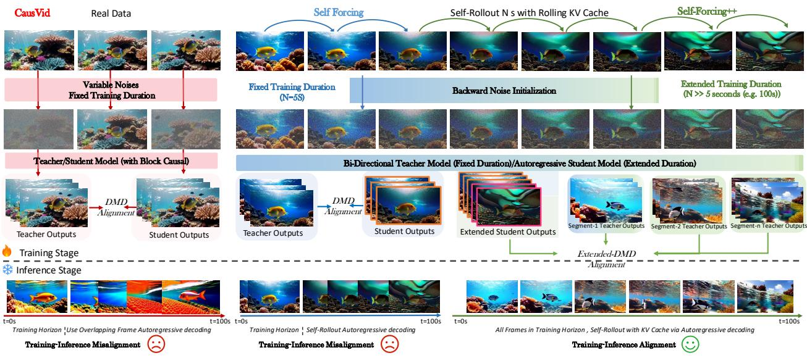  
Figure 2 Workflow between baselines and Self-Forcing $^ { + + }$ . Our method employ backward noise initialization, extended DMD and rolling KV Cache to effectively mitigates train-test discrepancies.

These errors accumulate and eventually manifest as motion loss, scene freezing, and catastrophic degradation of visual fidelity. This insight motivates us to introduce a simple yet effective method to mitigate error accumulation, which is described in the following sections.

Backwards Noise Initialization A central challenge in extending student-teacher distilation to long-horizon video generation resides in the noiseinitialization strategy. In the short-horizon setting i for videos wi a length up to $T$ frames), the student model can be directly supervised on complete trajectories sampled from the teacher, each originating from random noise. However, for long-horizon generation, a trajectory initialized from pure random noise is decoupled from the preceding video content, leading to a fundamental context misalignment since the sampled noise does not preserve the temporal dependencies of previously generated frames. Based on the observation mentioned above, we add noise back to the denoised latent vectors and use it as the starting noise which is also shown to boost the performance of distillation [67]. While similar techniques of re-injecting noise have been employed in prior work [21, 67, 69], our motivation and application are distinct. Whereas they used this for short-video distillation, primarily to enhance single-shot quality or circumvent the need for real training data. We leverage it as a mechanism to enforce temporal consistency across long videos. Specifically, the student model is first rolled out to a sequence of $N$ clean frames, with $N \gg T$ , where $T$ denotes the maximum horizon the teacher can reliably generate such as 5 seconds. We given the clean trajectory th ol $\{ x _ { t } ^ { S } \} _ { t = 1 } ^ { N }$ $\{ \sigma _ { t } \} _ { t = 1 } ^ { N }$ .Formally,

$$
x _ { t } = ( 1 - \sigma _ { t } ) x _ { 0 } + \sigma _ { t } \epsilon , \quad \mathrm { w h e r e } \ x _ { 0 } = x _ { t - 1 } - \sigma _ { t - 1 } \hat { \epsilon } _ { \theta } ( x _ { t - 1 } , t - 1 ) ,
$$

where $\epsilon \sim \mathcal { N } ( 0 , I )$ denotes Gaussian noise, and $\hat { \epsilon } _ { \theta }$ is the noise prediction network parameterized by $\theta$ . which serves as the initial stateor computing theteacher and student distributions.This approac ensures that the distribution divergence betwen student and teacher model is evaluated on trajectories that retain temporal consistency and correctly structured according to the prescribed noise schedule.

Extended Distribution Matching Distillation Our strategy for extending training to long videos is grounded in the observation that although the bidirectional teacher model is trained exclusively on short,five-second clips itplicy capture he underyin datadistributiono theordfrom itstraidatFrothis perspective, any short, contiguous video segment can be viewed as a sample from the marginal distribution o a valid, longer video sequence [1, 3, 31]. This intuition motivates our core methodological extension. Since our baseline method Self-Forcing [21] restricts the training duration to the first $T$ frames (typically ${ \sim } 5 $ seconds), we instruct the student model to roll out to $N$ frames where $N \gg T$ . We then uniformly sample a contiguous window of length $T$ from the generated sequence, and compute the distributional discrepancy between the student and teacher models within this window. This sliding-window distillation process is formalized as equation (2):

$$
\begin{array} { r l } & { \nabla _ { \theta } \mathcal { L } _ { \mathrm { \scriptsize ~ { \mathrm { e x t e n d e d } } } } = \mathbb { E } _ { t } \mathbb { E } _ { z } \left[ \nabla _ { \theta } \mathrm { K L } \Big ( p _ { \theta , t } ^ { S } ( z ) \| p _ { t } ^ { T } ( z ) \Big ) \right] } \\ & { \qquad \approx - \mathbb { E } _ { t } \mathbb { E } _ { i \sim \mathrm { U n i f } \ \{ 1 , \dots , N - K + 1 \} } \left[ \int \Bigl ( s ^ { T } ( \Phi ( G _ { \theta } ( z _ { i } ) , t ) , t ) - s _ { \theta } ^ { S } ( \Phi ( G _ { \theta } ( z _ { i } ) , t ) , t ) \Big ) \frac { d G _ { \theta } ( z _ { i } ) } { d \theta } d z _ { i } \right] , } \end{array}
$$

Here, $G _ { \theta } ( z )$ denotes the student generator rollout given a latent $z$ , and $\Phi ( \cdot , t )$ is the transformation process at timestep $t$ $p _ { \theta , t } ^ { S }$ and $p _ { t } ^ { T }$ represent the student and teacher distributions at time $t$ , with corresponding scores $s _ { \theta } ^ { S }$ and $s ^ { T }$ . We uniformly sample a starting index $i \sim \operatorname { U n i f } \{ 0 , \dots , N - K \}$ from the student rollout of length $N$ , and extract a window of length $K$ . The student is then trained to minimize the average KL divergence between its distribution and the teacher's distribution across this window. The window size $K$ is typically chosen to match the horizon to which the teacher model was originally trained to generate.

Remark $B i$ -directional diffusion can be seen as a process to gradually restore a degraded target in different denoising time-steps. Our method adapts the idea to autoregressive video generation regime by having a short-horizon teacher gradually restore student's degraded rollouts at different temporal time-frames and then distills these correction knowledge back into the student model.

Training with rolling KV Cache Despite using KV cache at inference time, CausVid [69] still relies on recomputing overlapping frames and suffers from a severe over-exposure problem. Self-Forcing [21] attempts tadress this butintroduces a tran-erencemismatch by usiga fd cache duritraining and aol cache at inference.Although this is partilly mitigated by masking the first latent frame, the mismatch stil leads to substantial error accumulation and temporal fickering in long videos (see figure 4). In contrast, our method naturally eliminates this mismatch by employing a rolling KV cache during both training and inference. At training time, this cache is used to roll out sequences far beyond the teacher's supervisory horizon to compute the extended DMD as detailed above. Consequently, our approach greatly simplifies the entire process, requiring neither the recomputation of overlapping frames nor latent frame masking.

# 3.3 Improving Long-Term Smoothness via GRPO

A common drawback of generative models [40, 60] employing sliding-window or sparse attention mechanisms for long sequences generation is the gradual loss of long-term memory. This degradation often manifests as temporal inconsistencis such as objects abruptly emerging orvanishing or unaturally rapi scene transitions. Although the method we proposed above has achieved strong results, we show that Group Relative Policy Optimization (GRPO), a reinforcement learning technique [35, 64], can be utilized in autoregressive video $\begin{array} { r } { \rho _ { t , i } = \frac { \pi _ { \theta } \left( a _ { t , i } \mid s _ { t , i } \right) } { \pi _ { \theta _ { \mathrm { o l d } } } \left( a _ { t , i } \mid s _ { t , i } \right) } } \end{array}$ where $\pi _ { \boldsymbol { \theta } } \big ( a _ { t , i } \big | s _ { t , i } \big )$ denotes the policy function for output $o _ { i }$ at time step $t$ can be computed according to eqation (1) and the overall generation probability can be computed as the sum o allthe log probabiliies in current autoregressive rollouts which we show in section 8.4. To guide the optimization process towards temporally mot outpus, we follow prior work [4, 42] and use the rlative magnitude  optial ow betwen consecutive frames as a proxy for motion continuity.

Require: Student $G _ { \theta }$ , teacher $T _ { \phi }$ , cache size $L$ ; rollout length $N \gg 5 \mathrm { s }$ ; slice length $K$ (5s); denoise steps $\{ t _ { 1 } , \dots , t _ { T } \}$   
1: loop   
2: $V \gets \mathrm { R o l l o u t } ( G _ { \theta } , N , L )$   
3: Pick $i \sim \{ 1 , \ldots , N { - } K { + } 1 \}$ , set $W \gets V [ i : i + K - 1 ]$ uniform slice   
4: Sample $t \sim \{ t _ { 1 } , \ldots , t _ { T } \}$   
5: Backward noise initialization: $x _ { t } ( W )  \mathrm { B a c k w a r d N o i s e I n i t } ( W , t )$   
6: $\mathcal { L } _ { \mathrm { D M D } } \gets \mathrm { D M D } ( G _ { \theta } ( x _ { t } ( W ) , t )$ $T _ { \phi } ( x _ { t } ( W ) , t ) .$   
7: $\theta  \theta - \eta \nabla _ { \theta } \mathcal { L } _ { \mathrm { D M D } }$   
8:end loop   
9: $R $ OpticalFlowReward $\left( G _ { \theta } \right)$ ; θ ← GRPO_update(θ, R)

# 3.4 New metrics for long videos evaluation

Most prior works rely on VBench [22] to assess image and aesthetic quality in long video generation. We find, however, that outdated evaluation models make the benchmark favor over-exposed videos (e.g., CausVid) and degraded long videos (e.g. Self-Forcing), leading to inaccurate scores. To address this, we adopt Gemin2.5-Pro [9], a state-of-the-art video MLLM with strong reasoning ability [8, 38]. Our protocol defines key long-video issues such as over-exposure and error accumulation, prompts Gemini-2.5-Pro to rate videos along these axes, and aggregates the results onto a $0 - 1 0 0$ scale termed visual stability for consistent comparison. More details are provided in figure 3 and section 8.5.

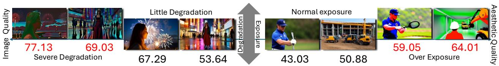  
F reuarnraarnat e iVBenten atn over-exposed frames rendering these two metrics unreliable.

# 4 Experiments

# 4.1 Settings

Baseline methods We include the following baseline methods such as NOVA [11], Pyramid Flow [24], SkyReelsV2-1.3B [6], MAGI-1-4.5B [54] distilled to 16 steps for long video generation, CausVid [69] and Self-Forcing [21], both 1.3B distilled few-step generators similar to ours. Additional two state-of-the-art bidirectional models LTX-Video [14] and Wan2.1 [56] are included for references.

Evaluation metrics We conduct evaluations under two primary settings. The first setting follows the general VBench protocol [22], which measures generation quality on short videos of 5 seconds using 946 prompts across 16 dimensions. The second setting examines the model's capacity to extend generation up to 50/75/100 seconds with the same prompt set used in CausVid, consisting of 128 prompts from MovieGen [48]. Performance in this setting is assessed with both VBench Long and our proposed improved evaluation metric.

# 4.2 Empirical Results in Long Video Generation

Quantitative and qualitative results are presented in tables 1 and 2, and figures 1 and 4, respectively. Our method achieves competitive performance in short-horizon generation and demonstrates substantial advantages as the generation horizon extends.

Short-Horizon (5s):Although not specifically rained for the initial 5 seconds, our model perfors comarably to Sel-Forcing on short clips, achieving strong overall results with a semantic score of 80.37 and a total score of 83.11, both surpassing the remaining baselines.

Table1 Performance comparisons on 5s short videos and 50s long videos. Baseline methods achieve high temporal quality scores primarily due to stagnation reflected by their dynamic degree.   

<table><tr><td rowspan="2">Model</td><td rowspan="2">#Params</td><td rowspan="2">Throughput ((S)</td><td colspan="3">Results on 5s ↑</td><td colspan="5">Results on 50s ↑</td></tr><tr><td>Total Score</td><td>Quality Score</td><td>Semantic Score</td><td>Text Alignment</td><td>Temporal Quality</td><td>Dynamic Degree</td><td>Visual Stability</td><td>Framewise† Quality</td></tr><tr><td colspan="10">Bidirectional models</td></tr><tr><td>LTX-Video</td><td>1.9B</td><td>8.98</td><td>80.00</td><td>82.30</td><td>70.79</td><td>-</td><td>-</td><td>-</td><td>-</td><td>-</td></tr><tr><td>Wan2.1</td><td>1.3B</td><td>0.78</td><td>84.67</td><td>85.69</td><td>80.60</td><td>-</td><td></td><td></td><td></td><td>-</td></tr><tr><td colspan="10">Autoregressive models</td></tr><tr><td>NOVA</td><td></td><td>0.88</td><td>80.12</td><td>80.39</td><td>79.05</td><td>24.58</td><td>86.53</td><td>31.96</td><td>45.94</td><td>34.45</td></tr><tr><td>Pyramid Flow</td><td>0.6B 2B</td><td>6.7</td><td>81.72</td><td>84.74</td><td>69.62</td><td>-</td><td>-</td><td>-</td><td>-</td><td>-</td></tr><tr><td>MAGI-1</td><td>4.5B</td><td>0.19</td><td>79.18</td><td>82.04</td><td>67.74</td><td>26.04</td><td>88.34</td><td>28.49</td><td>51.25</td><td>54.20</td></tr><tr><td>SkyReels-V2</td><td>1.3B</td><td>0.49</td><td>82.67</td><td>84.70</td><td>74.53</td><td>23.73</td><td>88.78</td><td>39.15</td><td>60.41</td><td>54.13</td></tr><tr><td>ausVid</td><td>1.3B</td><td>17.0</td><td>82.46</td><td>83.61</td><td>77.84</td><td>25.25</td><td>89.34</td><td>37.35</td><td>40.47</td><td>61.56</td></tr><tr><td>Self Forcing</td><td>1.3B</td><td>17.0</td><td>83.00</td><td>83.71</td><td>80.14</td><td>24.77</td><td>88.17</td><td>34.35</td><td>40.12</td><td>61.06</td></tr><tr><td>Ours</td><td>1.3B</td><td>17.0</td><td>83.11</td><td>83.79</td><td>80.37</td><td>26.37</td><td>91.03</td><td>55.36</td><td>90.94</td><td>60.82</td></tr></table>

l     .

Long-Horizon (50s/75s/100s): The superiority of our method becomes more pronounced in long-horizon generation. We observe consistent improvements across key metrics. E.g.our model achieves a text alignment score of 26.04 and dynamic degree of 54.12 with 100-second video, outperforming CasuVid by 6.67% and $5 6 . 4 \%$ respectively which relies on recomputing overlapping frames and our baseline method Self-Forcing by $1 8 . 3 6 \%$ and $1 0 4 . 9 \%$ respectively as shown in figure 4. This suggests that our approach effectively mitigates error accumulation during long rollouts.

TablePerormance coparisons  and 100s long vids.Baselne methods achieve hi temporal quality re primarily due to stagnation or degrade to pure noise.   

<table><tr><td rowspan="2">Model</td><td colspan="5">Results on 75s ↑</td><td colspan="5">Results on 100s ↑</td></tr><tr><td>Text Alignment</td><td>Temporal Quality</td><td>Dynamic Degree</td><td>Visual Stability</td><td>Framewise Quality</td><td>Text Alignment</td><td>Temporal Quality</td><td>Dynamic Degree</td><td>Visual Stability</td><td>Framewise Quality</td></tr><tr><td colspan="9">Autoregressive models</td><td></td></tr><tr><td>NOVA</td><td>23.37</td><td>86.32</td><td>31.24</td><td>34.06</td><td>31.53</td><td>22.89</td><td>86.24</td><td>31.09</td><td>32.97</td><td>31.03</td></tr><tr><td>MAGI-1</td><td>24.95</td><td>87.89</td><td>24.82</td><td>43.28</td><td>52.04</td><td>23.75</td><td>87.62</td><td>22.21</td><td>39.38</td><td>50.90</td></tr><tr><td>SkyReels-V2</td><td>22.70</td><td>88.99</td><td>39.89</td><td>55.47</td><td>51.55</td><td>22.05</td><td>88.80</td><td>38.75</td><td>56.72</td><td>500.48</td></tr><tr><td>CausVid</td><td>24.76</td><td>89.14</td><td>35.82</td><td>39.84</td><td>60.96</td><td>24.41</td><td>89.06</td><td>34.60</td><td>39.21</td><td>61.01</td></tr><tr><td>Self Forcing</td><td>23.39</td><td>87.79</td><td>29.15</td><td>35.00</td><td>60.02</td><td>22.00</td><td>87.39</td><td>26.41</td><td>32.03</td><td>58.25</td></tr><tr><td>Ours</td><td>26.31</td><td>91.00</td><td>55.62</td><td>86.10</td><td>60.67</td><td>26.04</td><td>90.87</td><td>54.12</td><td>84.22</td><td>60.66</td></tr></table>

In contrast, baseline methods exhibit significant degradation when generating long videos. Their primary fmode reMotiollapseWhilemaai hortteremporl srucure therviden collapse into nearly static sequences, as reflected by their low dynamic degree scores. Our method, however, sustains coherent motion throughout the entire sequence. i) Fidelity Degradation: Baselines often suffer from exposure instability. For instance, CausVid trends towards over-exposure, while Self-Forcing videos progressively darken. Our model maintains stable brightness and visual quality. This degradation in SelfForcing is a direct consequence of accumulated errors without explicit long-horizon training. While some diffusion forcing methods show sporadic recovery from noise collapse such as SkyReels, the resulting content is of low fidelity.

# 4.3 Ablation Study

# 4.3.1 Length of attention window

A straightforward way to mitigate Self-Forcing's training-inference mismatch is to shorten the attention span during training, exposing the model to more diverse cache states within a limited horizon.

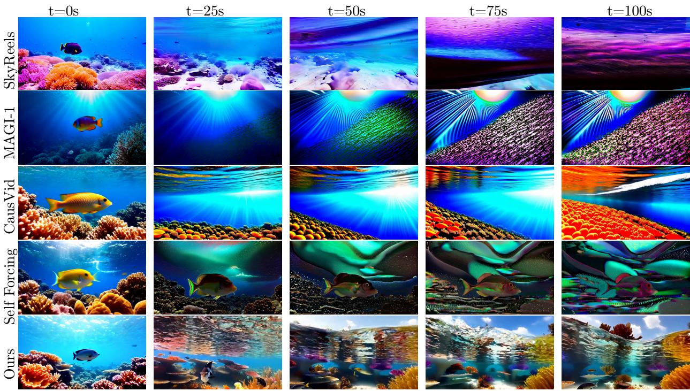  
Fiusn viate or prpt rntropil acfuly rogcoloue, su  aclaseslly uao nvese severe quality degradation when generating long videos.

For instance, a 5-second clip corresponds to 21 latent frames; by reducing the attention window, the model is forced to slide attention multiple times. As shown in table 3 and visualized in Appendix figure 7, smaller windows bring modest gains. For example, visual stability improves from 40.12 to 52.50 with a

Table 3 Ablation study on various methods to reduce error accumulation measured by visual stability on 50s videos.   

<table><tr><td>Causvid</td><td>Self-Forcing</td><td>Attn-15</td><td>Attn-12</td><td>Attn-9</td><td>Ours</td></tr><tr><td>40.47</td><td>40.12</td><td>44.69</td><td>42.19</td><td>52.50</td><td>90.94</td></tr></table>

window of 9 latent frames. However, this comes at the cost of increased inconsistency, since the model now relies on much less context compared to the original 21-frame history.

# 4.3.2 The effect of GRPO with optical-flow reward

Here we show its effectiveness for enhancing temporal consistency by examining the optical flow magnitude, a proxy for temporal stability. As visualized in fig. 5, videos generated without GRPO may suffer from abrupt scene transitions. These transitions manifest as sharp spikes in the optical flow magnitude, an artifact that is exacerbated by the rolling window mechanism used during inference. By promoting smoother temporal transitions, our GRPO method effectively suppresses these spikes. This results in a marked improvement in long-range consistency and overall perceptual quality of the generated videos.

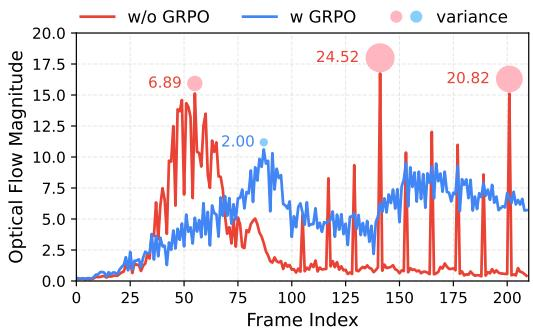  
Figure 5 Comparison of generation outcomes with and without GRPO. Variance is computed with window size 8.

# 4.4 Training Budget Scaling

Finally, wenvestiate the effecto scalin the trainig budet on the model's lon-duration videogeneration capabilitiess illustrated ngure6, ur mode, followin ODE itiization, exhibitsonly acet y to generate short, low-fidelity clips. We establish a baseline (1 $. \times$ budget) as the training required to produce a coherent 5-second video. At this scale, extending generation leads to significant temporal fickering and error accumulation, a failure mode similar to that of Self-Forcing [21]. Increasing the budget to 4 $\times$ enables the model to maintain semantic coherence over longer horizons, successfully rendering a consistent subject like the specified elephant. At $8 \times$ , the model begins to generate detailed backgrounds and more semantically accurate subjects, although motion dynamics remain limited and temporal quality degradation persists. A further scaling to $2 0 \times$ yields a substantial improvement, producing high-fidelity videos that remain stable for over 50 seconds. Remarkably, at a $2 5 \times$ budget, the model successfully generates a 255-second video with negligible quality loss. These findings indicate that scaling the training budget is a viable path toward hih-quality, long-duration vido synthesis,circuventingthereliancenlarge-scalereal videodatasetswhich are notoriously difficult to acquire.

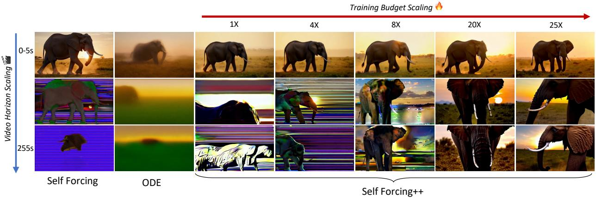  
FigureScaling phenomenon observe in 55-second generation or prompt:A massive elephant walks sowlc a sunlit savannah, dust rising around its feet, the warm glow of sunset...".

# 5 Conclusion

We introduce Self-Forcing++, a method that mitigates error accumulation in autoregressive long-video generation. By leveraging a short-video teacher to guide the student on its own sel-generated long rollouts, our approach learns to correct errors without requiring long-video supervision. Experiments demonstrate that our method significantly extends video length to even over 4 minutes (a $5 0 \times$ improvement over the baseline) while maintaining high fidelity. We also propose a new metric, Visual Stability, to address critical biases in existing long-video evaluation benchmarks. Our contributions pave the way for more robust and scalable long-video synthesis.

# 6 Limitations and Further work

Our method, while efective, inherits certain limitations from its Self-Forcing foundation and the capacity of the underlying Wan2.1-T2V-1.3B model. Key drawbacks include slower training speed compared to teacher-forcing and a lack of long-term memory, which can cause content divergence in regions occluded for extended periods.Toaddress these challenges, we identiy several promising future drections.First, ttackle the high training cost of self-rollout, we wil explore paralelizing the training process. Second, to further mitigate quality degradation over long sequences, we plan toinvestigate techniquesor controlling thefdeliy of latent vectors. This includes quantizing latent representations stored in the KV cache, as suggested by prior works [70], or normalizing the KV cache to prevent distributional shift. Finally, we aim to incorporate long-term memory mechanisms [32, 39] into our autoregressive framework, which we believe is crucial for achieving true long-range temporal coherence.

# 7 Discussion

We next discuss concurrent works related to ours and highlight their key differences. Rolling Forcing [37] extends the concept of Rolling Diffusion [51] by applying progressively varied noise levels to different video frames. It integrates attention sink frames for balancing short- and long-term consistency, while training efficiency is improved by sampling non-overlapping frames. LongLive [65] builds upon Self Forcing [21], introducing KV re-caching for prompt switching and leveraging clean contexts. It further employs attention sink frames to mitigate error accumulation by repeatedly applying DMD to future frames beyond the teacher's horizon. Our approach is most closely related to LongLive where we also incorporate DMD into long selrolled sequences in a windowed fashion with clean context as detailed in section 3.2. Unlike LongLive, however, our simplified design avoids reliance on attention sink frames to counter error accumulation, which was shown to be a key design of LongLive.

Bo Rolg Forcg [37] d LongLiv [5, et, bl teh-ualiy  u to several minutes long, which marks a significant advance in autoregressive long video generation compared to previous methods.

# References

[1] Eloi Alonso, Adam Jelley, Vincent Michel, Anssi Kanervisto, Amos J Storkey, Tim Pearce, and François Fleuret. Diffusion for world modeling:Visual details matter in atari. Advances in Neural Information Processing Systems, 37:5875758791, 2024.   
[2] Andreas Blattmann, Tim Dockhorn, Sumith Kulal, Daniel Mendelevitch, Maciej Kilian, Dominik Lorenz, Yam Levi Zion English,Vikram Voleti Adam Letts, e alStable vidodiffuson: Scalnglatent videodiffuion el to large datasets. arXiv preprint arXiv:2311.15127, 2023.   
[3] Jake Bruce, Michael D Dennis, Ashley Edwards, Jack Parker-Holder, Yuge Shi, Edward Hughes, Matthew Lai, AdMavalankar, Richietegerwal, ChrisApps,  alGenie:Generative interactiv environments. I Fortyrst International Conference on Machine Learning, 2024.   
[4] Hila Chefer, Uriel Singer, Amit Zohar, Yuval Kirstain, Adam Polyak, Yaniv Taigman, Lior Wolf, and Shelly Sheynin. Videojam: Joint appearance-motion representations for enhanced motion generation in video models. arXiv preprint arXiv:2502.02492, 2025.   
[5] Boyuan Chen, Diego Martí Monsó, Yilun Du, Max Simchowitz, Russ Tedrake, and Vincent Sitzmann. Diffusion forcing: Next-token prediction meets full-sequence diffusion.Advances in Neural Information Processing Systems, 37:2408124125, 2024.   
[6] Guibin Chen, Dixuan Lin, Jiangping Yang, Chunze Lin, Junchen Zhu, Mingyuan Fan, Hao Zhang, Sheng Chen, Zheng Chen, Chengcheng Ma, et al. Skyreels-v2: Infinite-length film generative model. arXiv preprint arXiv:2504.13074, 2025.   
[7] Shouyuan Chen, Sherman Wong, Liangjian Chen, and Yuandong Tian. Extending context window of large language models via positional interpolation. arXiv preprint arXiv:2306.15595, 2023.   
[8] Wei-Lin Chiang, Anastasios Angelopoulos, L Zheng, Y Sheng, LDunlap, CChou, T Li, E Frick, N Jain, DLi, et al. Chatbot arena. LMArena, https://lmarena. ai, 2024.   
[9] Gheorghe Comanici, Eric Bieber, Mike Schaekermann, Ice Pasupat, Noveen Sachdeva, Inderjit Dhillon, Marcel Blistein, Ori Ram, Dan Zhang, Evan Rosen, et al. Gemini 2.5: Pushing the frontier with advanced reasoning, multimodality, long context, and next generation agentic capabilities. arXiv preprint arXiv:2507.06261, 2025.   
[10] Hoge Deng, Ting Pan, Haiwen Diao, Zhengxiong Luo, Yufeng Cui, Huchuan Lu, Shiguang Shan, Yonggang Qi, and Xinlong Wang. Autoregressive video generation without vector quantization. arXiv preprint arXiv:2412.14169, 2024.   
[11] Haoge Deng, Ting Pan, Haiwen Diao, Zhengxiong Luo, Yufeng Cui, Huchuan Lu, Shiguang Shan, Yonggang Qi, and Xinlong Wang. Autoregressive video generation without vector quantization. In ICLR, 2025.   
[12] Xueji Fang, Liyuan Ma, Zhiyang Chen, Mingyuan Zhou, and Guo-jun Qi. Infvg: Reinforce inference-time consistent long video generation with grpo. arXiv preprint arXiv:2505.17574, 2025.   
[13] Google DeepMind. Veo. https://deepmind.google/models/veo/, 2025. Accessed: 2025-09-09.   
[14] Yoav HaCohen, Nisan Chiprut, Benny Brazowski, Daniel Shalem, Dudu Moshe, Eitan Richardson, Eran Levin, Guy Shiran, Nir Zabari, Ori Gordon, et al. Ltx-video:Realtime videolatent diffusion.arXiv preprint arXiv:2501.00103, 2024.   
[15] Xianglong He, Chunli Peng, Zexiang Liu, Boyang Wang, Yifan Zhang, Qi Cui, Fei Kang, Biao Jiang, Mengyin An, Yangyang Ren, et al. Matrix-game 2.0:An open-source, real-time, and streaming interactive world model.arXiv preprint arXiv:2508.13009, 2025.   
[16] Yingqing He, Tianyu Yang, Yong Zhang, Ying Shan, and Qifeng Chen. Latent video difusion models for high-fidelity long video generation. arXiv preprint arXiv:2211.13221, 2022.   
[17] Jonathan Ho, William Chan, Chitwan Saharia, Jay Whang, Ruiqi Gao, Alexey Gritsenko, Diederik P Kingma, Ben Poole, Mohammad Norouzi, David J Fleet, et al. Imagen video: High definition video generation with diffusion models. arXiv preprint arXiv:2210.02303, 2022.   
[18] Jonathan Ho, Tim Salimans, Alexey Gritsenko, William Chan, Mohammad Norouzi, and David J Fleet. Video diffusion models. Advances in neural information processing systems, 35:86338646, 2022.   
[19] Wenyi Hong, Ming Ding, Wendi Zheng, Xinghan Liu, and Jie Tang. Cogvideo: Large-scale pretraining for text-to-video generation via transformers. arXiv preprint arXiv:2205.15868, 2022.   
[20] Zhenyu Hou, Xin Lv, Rui Lu, Jiajie Zhang, Yujang Li, Zijun Yao, Juanzi Li, Jie Tang, and Yuxio Dong. Advancing language model reasoning through reinforcement learning and inference scaling. arXiv preprint arXiv:2501.11651, 2025.   
[21] Xun Huang, Zhengqi Li, Guande He, Mingyuan Zhou, and Ei Shechtan. Self forcin:Bridging the train-test gap in autoregressive video diffusion. arXiv preprint arXiv:2506.08009, 2025.   
[22] Ziqi Huang, Yinan He, Jiashuo Yu, Fan Zhang, Chenyang Si, Yuming Jiang, Yuanhan Zhang, Tianxing Wu, Qingyang Jin, Nattapol Chanpaisit, et al. Vbench: Comprehensive benchmark suite for video generative models. In Proceedings of the IEEE/CVF Conference on Computer Vision and Pattern Recognition, pages 2180721818, 2024.   
[23] Jiaxiu Jiang, Wenbo Li, Jinging Ren, Yuping Qiu, Yong Guo, Xiagang Xu, Han Wu, and Wangeg Zuo. Lovic: Efficient long video generation with context compression. arXiv preprint arXiv:2507.12952, 2025.   
[24] Yang Jin, Zhicheng Sun, Ningyuan Li, Kun Xu, Hao Jang, Nan Zhuang, Quzhe Huang, Yang Song, Yadong Mu, and Zhouchen Lin. Pyramidal flow matching for efficient video generative modeling. In ICLR, 2025.   
[5] Jihwan Kim, Junh Kang, Jinyg Choi, and Boyung Han.Fifo-diffus:Generti iinitvidos from text without training. Advances in Neural Information Processing Systems, 37:8983489868, 2024.   
[26] Diederik P Kingma and Max Welling. Auto-encoding variational bayes. arXiv preprint arXiv:1312.6114, 2013.   
[27] Yuval Kirstain, Adam Polyak, Uriel Singer, Shahbuland Matiana, Joe Penna, and Omer Levy. Pick-a-pic: An open dataset o user preferences or text-to-image generation.Advances in neural information processing systems, 36:3665236663, 2023.   
[28] Akio Kodaira, Tingbo Hou, Ji Hou, Masayoshi Tomizuka, and Yue Zhao. Streamdit: Real-time streaming text-to-video generation. arXiv preprint arXiv:2507.03745, 2025.   
[29] Weijie Kong, Qi Tian, Zijan Zhang, Rox Min, Zuozhuo Dai, Jin Zhou, Jiangfeng Xiong, Xin Li, Bo Wu, Jianwi Zhang, eal. Hunyuanvideo A systematic framework or large video generative models.arXiv preprint arXiv:2412.03603, 2024.   
[30] Aviral Kumar, Vincent Zhuang, Rishab Agarwal, Yi Su, John  Co-Reyes, AviSingh, Kate Baum, Shariq Iqbal, CBiRR preprint arXiv:2409.12917, 2024.   
[31] Jiaqi Li, Junshu Tang, Zhiyong Xu, Longhuang Wu, Yuan Zhou, Shuai Shao, Tianbao Yu, Zhiguo Cao, and Qinglin Lu. Hunyuan-gamecraft:High-dynamic interactive game video generation with hybrid history condition. arXiv preprint arXiv:2506.17201, 2025.   
[32] Jiaqi Li, Junshu Tang, Zhiyong Xu, Longhuang Wu, Yuan Zhou, Shuai Shao, Tianbao Yu, Zhiguo Cao, and Qiglin Lu. Hunyuan-gamecrat: High-dynami interactive game video generation with hybrid history condition, 2025. URL https://arxiv.org/abs/2506.17201.   
[33] Bin Lin, Yunyang Ge, XinuCheng, Zongan Li, Bin Zhu, Shaog Wang, Xiany He, Yang Y, Shengi Yuan, Liuhan Chen, et al. Open-sora plan:Open-source large video generation model. arXiv preprint arXiv:2412.00131, 2024.   
[34] Shanchuan Lin, Ceyuan Yang, Hao He, Jianwen Jiang, Yuxi Ren, Xin Xia, Yang Zhao, Xuefeng Xiao, and Lu Jiang.Autoregressive adversarial post-training for real-time interactive video generation.arXiv preprint arXiv:2506.09350, 2025.   
[5 Jie Liu GonyeLiu, Jaju Liang, Yang Li, Jiahe Liu, XintWang, Peni Wan, Di Zhang, and Wan Ouyang. Flow-grpo: Training flow matching models via online rl. arXiv preprint arXiv:2505.05470, 2025.   
[36] Jie Liu, Gongye Liu, Jiajun Liang, Zyang Yuan, Xioun Liu, Mingw Zheng, Xiele Wu, Qiuln Wang, Wenyu Qin, Menghan Xia, et al. Improving video generation with human feedback. arXiv preprint arXiv:2501.13918, 2025.   
[37 u Lu, WenboHu, Jale Xu, Ying Shan, and Shijan Lu.Ro orci:utoesv ongvido in real time, 2025. URL https://arxiv.org/abs/2509.25161.   
[38] Yuanxin Liu, Kun Ouyang, Haoning Wu, Yi Liu, Lin Sui, Xinhao Li, Yan Zhong, Y Charles, Xinyu Zhou, and Xu Sun. Videoreasonbench: Can mllms perform vision-centric complex video reasoning? arXiv preprint arXiv:2505.23359, 2025.   
[39] Zhiheng Liu, Xueqing Deng, Shoufa Chen, Angtian Wang, Qiushan Guo, Mingfei Han, Zeyue Xue, Mengzhao Chen, Ping Luo, and Linje Yang. Worldweaver: Generating long-horizon video worlds via rich perception.arXiv preprint arXiv:2508.15720, 2025.   
[40] Yang Luo, Xuanlei Zhao, Mengzhao Chen, Kaipeng Zhang, Wenqi Shao, Kai Wang, Zhangyang Wang, and Yang You. Enhance-a-video: Better generated video for free. arXiv preprint arXiv:2502.07508, 2025.   
[41] Yihong Luo, Tianyang Hu, Jiacheng Sun, Yujun Cai, and Jing Tang. Learning few-step difusion models by trajectory distribution matching. arXiv preprint arXiv:2503.06674, 2025.   
[42] Hyeln Nam, Jaemin Kim, Dohun Le, and Jong Chul Ye. Optical-fow guided prompt optimization for coherent video generation. In Proceedings of the Computer Vision and Pattern Recognition Conference, pages 78377846, 2025.   
[43] OpenAI. Video generation models as world simulators. Technical report, OpenAI, February 2024. URL https://openai.com/index/video-generation-models-as-world-simulators/. Technical report.   
[4] Long Ouyang, Jeffey Wu, Xu Jiang, DiogoAlmida, Carrol Wainright, PameaMishkin, Chong Zhan, Sanhii Agarwal, Katar SamaAlex Ray,  alTrai ange models oostrions wiunc. Advances in neural information processing systems, 35:2773027744, 2022.   
[5] William Peble and Sainng Xie.Scalable iffuion modes withtransormers. In Procding of the IEEE/CVF international conference on computer vision, pages 41954205, 2023.   
[46] Bowen Png, Jefry Quesnell, Honglu Fan, and Enrico Shippole. Yarn Efficit context window extensn large language models. arXiv preprint arXiv:2309.00071, 2023.   
[47] Xiangyu Peng, Zangwei Zheng, Chenhui Shen, Tom Young, Xinying Guo, Binluo Wang, Hang Xu, Hongxin Liu, Mingyan Jiang, Wenjun Li, et al. Open-sora 2.0: Training a commercial-level video generation model in $2 0 0 \mathrm { ~ k ~ }$ . arXiv preprint arXiv:2503.09642, 2025.   
[48] Adam Polyak, Amit Zohar, Andrew Brown, Andros Tjandra, Animesh Sinha, Ann Lee, Apoorv Vyas, Bowen Shi, Chih-Yao Ma, Ching-Yao Chuang, et al. Movie gen: A cast of media foundation models. arXiv preprint arXiv:2410.13720, 2024.   
[49] Rafael Rafailov, Archit Sharma, Eric Mitchell, Christopher D Manning, Stefano Ermon, and Chelsea Finn. Dirc preference optimization: Your language model is secretly a reward model.Advances in neural information processing systems, 36:5372853741, 2023.   
[50] Olaf Ronneberger, Philipp Fischer, and Thomas Brox. U-net: Convolutional networks for biomedical image segmentation. In International Conference on Medical image computing and computer-assisted intervention, pages 234241. Springer, 2015.   
[51] David Ruhe, Jonathan Heek, Tim Salimans, and Emiel Hoogeboom. Rolling diffusion models, 2024. URL https://arxiv.org/abs/2402.09470.   
[52] Zhihong Shao, Peiyi Wang, Qihao Zhu, Runxin Xu, Junxio Song, Xiao Bi, Haowei Zhang, Mingchuan Zhang, YK Li, Yang Wu, et al. Deepseekmath: Pushing the limits of mathematical reasoning in open language models. arXiv preprint arXiv:2402.03300, 2024.   
[53] Yang Song, Prafulla Dhariwal, Mark Chen, and Ilya Sutskever. Consistency models. 2023.   
[54] Hansi Teng, Hony Jia, Lei Sun, Lingi Li, Maoln Li, Minqu Tang, Shuai Han, Tiang Zhag, W Zhang, Weifeng Luo, et al. Magi-1: Autoregressive video generation at scale. arXiv preprint arXiv:2505.13211, 2025.   
[55] Bram Wallace, Meihua Dang, Rafael Rafailov, Linqi Zhou, Aaron Lou, Senthil Purushwalkam, Stefano Ermon, Caimig Xiong, Shafiq Joty, and Nikhil Naik. Diffusion model alignment using direct preference optimization. In Proceedings of the IEEE/CVF Conference on Computer Vision and Pattern Recognition, pages 82288238, 2024.   
[56] Team Wan, Ang Wang, Baole Ai, Bin Wen, Chaojie Mao, Chen-Wei Xie, Di Chen, Feiwu Yu, Haiming Zhao, Janxo Yang, Jianyuan Zeng, Jiayu Wang, Jngfeng Zhang, Jingren Zhou, Jinkai Wang, Jixuan Chen, Kai Zhu, Kang Zhao, Keyu Yan, Lianghua Huang, Mengyang Feng, Ningyi Zhang, Pandeng Li, Pingyu Wu, Ruihang Chu, Ruili Feng, Shiwei Zhang, Siyang Sun, Tao Fang, Tianxing Wang, Tianyi Gui, Tingyu Weng, Tong Shen, Wei Lin, Wei Wang, Wei Wang, Wenmeng Zhou, Wente Wang, Wenting Shen, Wenyuan Yu, Xianzhong Shi, Xiaoig Huang, Xin Xu, Yan Kou, Yangyu Lv, Yifei Li, Yijing Lu, Yiming Wang, Yingy Zhang, Yitong Huang, Yong Li, You Wu, Yu Liu, Yulin Pan, Yun Zheng, Yuntao Hong, Yupeng Shi, Yutong Feng, Zeyinzi Jiang, Zhen Han, Zhi-Fan Wu, and Ziyu Liu. Wan: Open and advanced large-scale video generative models. arXiv preprint arXiv:2503.20314, 2025.   
[57] Fu-Yun Wang, Zhaoyang Huang, Alexander Bergman, Dazhong Shen, Peng Gao, Michael Lingelbach, Keqiang Sun, Weikang Bian, Guanglu Song, Yu Liu, et al. Phased consistency models. Advances in neural information processing systems, 37:8395184009, 2024.   
[58] Wenhao Wang and Yi Yang. Vidprom: A mllion-scale real prompt-gallery dataset for text-to-video diffusion models. Advances in Neural Information Processing Systems, 37:6561865642, 2024.   
[59] Xiaoshi Wu, Yiming Hao, Keqiang Sun, Yixiong Chen, Feng Zhu, Rui Zhao, and Hongsheng Li. Human preference score v2: A solid benchmark for evaluating human preferences of text-to-image synthesis.arXiv preprint arXiv:2306.09341, 2023.   
[60] Guangxuan Xiao, Yuandong Tian, Beidi Chen, Song Han, and Mike Lewis.Effcient streaming language models with attention sinks. arXiv preprint arXiv:2309.17453, 2023.   
[] Zhiui Xie, Liyu Chen, Weicho Mao, Jngjing Xu, Lineg Kong,  al. Teachg languge modls t cique via reinforcement learning. arXiv preprint arXiv:2502.03492, 2025.   
[2 J Xu, XiLiu, YucheWu, YuTong, Qki , Mi Ding, J Tang nd Yux Dog Ia: leanealatu prec r exaatio. roing he37 Ite Conference on Neural Information Processing Systems, pages 1590315935, 2023.   
[3] Jiazhg u, Yu Huang, JialeCheng, Yuanig Yang, Jajun Xu, Yuan Wang, Weno Duan, Shen Yng, Qun Jin, Shurun Li, Jiayan Teng, Zhuoyi Yang, Wendi Zheng, Xiao Liu, Ming Ding, Xiaohan Zhang, Xiaotao Gu, Shiyu Huang, Minlie Huang, Jie Tang, and Yuxiao Dong. Visionreward: Fine-grained multi-dimensional human preference learning for image and video generation, 2024. URL https://arxiv.org/abs/2412.21059.   
[] Zeyue ue, Jie Wu, Y Gao, FangnKong, Linting Zhu,Meno Chen, Zhihg Liu, Wei Liu, Qushuo, Weilin Huang, et al. Dancegrpo: Unleashing grpo on visual generation. arXiv preprint arXiv:2505.07818, 2025.   
[65] Shuai Yang, Wei Huang, Ruihang Chu, Yicheng Xiao, Yuyang Zhao, Xianbang Wang, Muyang Li, Enze Xie, Yingcong Chen, Yao Lu, and Song Hanand Yukang Chen. Longlive: Real-time interactive long video generation. 2025.   
[66] Zhuoyi Yang, Jiayan Teng, Wendi Zheng, Ming Ding, Shiyu Huang, Jiazheng Xu, Yuanming Yang, Wenyi Hong, Xian Zhang, Guanyu Feng et al.Cogvideox:Text-to-video diffusion models with an expert transormer.arXiv preprint arXiv:2408.06072, 2024.   
[67] Tanwei Yin, Michal Gharbi, Taesug Park, Richard Zhang, Eli Shechtman, Fredo Durand, and BilFreeman. Improved distribution matchingdistillationforfast image synthess.Advances in neural information processing systems, 37:4745547487, 2024.   
[8] Tawei Yin, Mich Gharbi, Richard Zhang, Ei Shechtn, Freo Durand WillamTFrema, and Taeung Park.One-step dffusion with distribution matchingdistillation. In Proceedings of the IEEE/CVF conference on computer vision and pattern recognition, pages 66136623, 2024.   
[69] Tianwei Yin, Qiang Zhang, Richard Zhang, William T Freeman, Fredo Durand, Ei Shechtman, and Xun Huang. From slow bidirectional to fast autoregressive video diffusion models. In CVPR, 2025.   
[70] Lvmin Zhang and Maneesh Agrawala. Packing input frame context in next-frame prediction models for video generation. arXiv preprint arXiv:2504.12626, 2025.   
[71 Min Zhao, Gande He, Yixi Chen, Honou Zhu, Chonuan Li, and Jun Zhu. Rifex:reeunch ornh extrapolation in video diffusion transformers. arXiv preprint arXiv:2502.15894, 2025.   
[72] Le Zhuo, Ruoyi Du, Han Xiao, Yangung Li Dongyang Liu, Ronge Huag, Wenze Liu, Xiangang Zhu,Fu-Yun Wang, Zhanyu Ma, et al. Lumina-nextMakig lumina-t2x stronger and faster with next-dit.Advances in Neural Information Processing Systems, 37:131278131315, 2024.

# 8 Appendix

# 8.1 Detailed evaluation results for all dimensions

Due to limited space, we only report VBench aggregated metrics in tables 1 and 2 in the main text. Here we show the full evaluated data for each dimension in table 4.

TableCmparison moel across multiple quality etric n 0s,5,and 100s videosr ur main results. The gray metrics are aggregated metrics by VBench Long.   

<table><tr><td></td><td>text alignment</td><td>overall consistency</td><td>clip score</td><td>temporal quality</td><td>subject consistency</td><td>background consistency</td><td>motion smoothness</td><td>dynamic degree</td><td>frame-wise quality</td><td>aesthetic quality</td><td>imaging quality</td></tr><tr><td colspan="10">50 seconds</td></tr><tr><td>NOVA</td><td>24.58</td><td>20.55</td><td>28.61</td><td>86.53</td><td>92.48</td><td>95.21</td><td>99.18</td><td>31.96</td><td>34.45</td><td>39.85</td><td>29.06</td></tr><tr><td>MAGI-1</td><td>26.04</td><td>21.55</td><td>30.53</td><td>88.34</td><td>98.08</td><td>97.50</td><td>99.36</td><td>28.49</td><td>54.20</td><td>52.15</td><td>56.26</td></tr><tr><td>SkyReels-V2</td><td>23.73</td><td>18.94</td><td>28.53</td><td>88.78</td><td>96.06</td><td>96.43</td><td>98.67</td><td>39.15</td><td>54.13</td><td>50.44</td><td>57.82</td></tr><tr><td>CausVid</td><td>25.25</td><td>20.71</td><td>29.80</td><td>89.34</td><td>98.29</td><td>97.27</td><td>98.45</td><td>37.35</td><td>61.56</td><td>57.91</td><td>65.21</td></tr><tr><td>Self-Forcing</td><td>24.77</td><td>20.27</td><td>29.27</td><td>88.17</td><td>96.77</td><td>96.24</td><td>98.40</td><td>34.35</td><td>61.06</td><td>54.95</td><td>67.17</td></tr><tr><td>Ours</td><td>26.37</td><td>22.03</td><td>30.71</td><td>91.03</td><td>97.00</td><td>95.55</td><td>98.39</td><td>55.36</td><td>60.82</td><td>53.76</td><td>67.87</td></tr><tr><td colspan="10">75 seconds</td></tr><tr><td>NOVA</td><td>23.37</td><td>19.19</td><td>27.54</td><td>86.32</td><td>91.78</td><td>95.57</td><td>99.14</td><td>31.24</td><td>31.53</td><td>37.34</td><td>25.73</td></tr><tr><td>MAGI-1</td><td>24.95</td><td>20.36</td><td>29.53</td><td>87.89</td><td>98.20</td><td>97.70</td><td>99.29</td><td>24.82</td><td>52.04</td><td>49.38</td><td>54.71</td></tr><tr><td>SkyReels-V2</td><td>22.70</td><td>17.60</td><td>27.81</td><td>88.99</td><td>96.08</td><td>96.54</td><td>98.88</td><td>39.89</td><td>51.55</td><td>47.55</td><td>55.55</td></tr><tr><td>CausVid</td><td>24.76</td><td>19.99</td><td>29.53</td><td>89.14</td><td>98.32</td><td>97.28</td><td>98.50</td><td>35.82</td><td>60.96</td><td>56.87</td><td>65.06</td></tr><tr><td>Self-FForcing</td><td>23.39</td><td>18.85</td><td>27.93</td><td>87.79</td><td>97.43</td><td>96.50</td><td>98.77</td><td>29.15</td><td>60.02</td><td>53.28</td><td>66.77</td></tr><tr><td>Ours</td><td>26.31</td><td>22.09</td><td>30.53</td><td>91.00</td><td>96.93</td><td>95.45</td><td>98.29</td><td>55.62</td><td>60.67</td><td>53.38</td><td>67.97</td></tr><tr><td colspan="10">100 seconds</td></tr><tr><td>NOVA</td><td>22.89</td><td>18.63</td><td>27.15</td><td>86.24</td><td>91.66</td><td>95.50</td><td>99.13</td><td>31.09</td><td>31.03</td><td>36.64</td><td>25.42</td></tr><tr><td>MAGI-1</td><td>23.75</td><td>18.94</td><td>28.57</td><td>87.62</td><td>98.35</td><td>97.99</td><td>99.20</td><td>22.21</td><td>50.90</td><td>47.25</td><td>54.55</td></tr><tr><td>SkyReels-V2</td><td>22.05</td><td>16.84</td><td>27.25</td><td>88.80</td><td>96.05</td><td>96.52</td><td>98.86</td><td>38.75</td><td>50.48</td><td>46.33</td><td>54.62</td></tr><tr><td>CausVid</td><td>24.41</td><td>19.61</td><td>29.22</td><td>89.06</td><td>98.41</td><td>97.46</td><td>98.54</td><td>34.60</td><td>61.01</td><td>57.22</td><td>64.79</td></tr><tr><td>Self-Forcing</td><td>22.00</td><td>17.16</td><td>26.84</td><td>87.39</td><td>97.39</td><td>96.76</td><td>98.52</td><td>26.41</td><td>58.25</td><td>51.16</td><td>65.35</td></tr><tr><td>Ours</td><td>26.04</td><td>21.75</td><td>30.34</td><td>90.87</td><td>97.09</td><td>95.53</td><td>98.35</td><td>54.12</td><td>60.66</td><td>53.00</td><td>68.31</td></tr></table>

Implementation details We adopt the same base model Wan2.1-T2V-1.3B [56] as Causvid and Self-Forcing, which is later converted into an autoregressive model as describe above. The model is initialized with sampled 16K ODE training trajectories by optimizing the loss in equation (4). We use the same filtered and LLM-extended version of VidProM [58] as Self-Forcing for training. In the training phase, since we utilize backward noiseinitialization, thus we don't need real data fortraining.We utilize the same Wan2.-T2V-1.3B as the teacher model.

Training details Self-Forcing++ is trained with a training batch size of 8. The hyperparameters are mostly adopted from Self-Forcing such as the denoising steps of 1000,750,500 and 250 with a generator learning rate of $2 e ^ { - 6 }$ and critic learning rate of $4 e ^ { - 7 }$ . The generator and critic update ratio is 5. AdamW optimizer is used for both generator and critic both with $\beta _ { 1 } = 0$ and $\beta _ { 2 } = 0 . 9 9 9$ . Our rolling KV cache window size is 21 latent frames in all cases except ablation study. The model is updated with EMA starting at 200 epochs. We have also inspected the version without EMA which can also generate long high quality videos but the EMA version performs better. Our method can already generate consistent high quality long videos such as videos up to 4minute 15 seconds before GPRO, in the ablation study, we show that it's possible to further boost the model's performance with properly designed rewards.

# 8.2 Adding noise to context window

As demonstrated in table 1, methods such as MAGI-1 [54] and SkyReels-V2 [6], which rely on variable noisy context injection following a predefined schedule [5], are insufficient to mitigate error accumulation when rolling to long videos. To further investigate its effect on methods, we conduct an experiment where noise is manually injected into the KV cache to explicitly simulate the effect of accumulated errors over extended sequences. Specifically, before adding any query or key to the KV cache, we inject random Gaussian noise into them.While this strategy yields a sligh improvement in both image quality and visual stability compare to the original Self-Forcing, it nonetheless fails to prevent substantial degradation in long-horizon video generation which can be seen in figure 7.

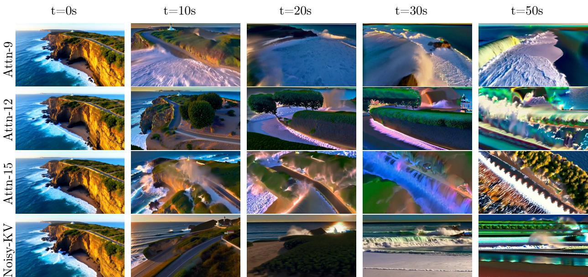  
Fiulat urvaru mtho gatculatioHelizti 50-econd video or prompt: Drone viewf waves crashing against the rugged cliffs along Big Sur' garay point beach..."

# 8.3 More Background

Video diffusion models are typically trained to denoise along a fixed noise schedule, which makes video generation computationally expensive. A common strategy to reduce this cost is to distill the model into a few-step generator, using approaches such as Distribution Matching [41, 67, 68] and Consistency Model [53, 57]. In line with CausVid and Self-Forcing, we also adopt DMD to distil the original bidirectional model into a few-step model, which can be viewed as minimizing the reverse KL divergence between the student and teacher models, as formulated in equation (3).

$$
\begin{array} { r l } & { \nabla _ { \theta } \mathcal { L } _ { \mathrm { D M D } } = \mathbb { E } _ { t } \Big [ \nabla _ { \theta } \mathrm { K L } \big ( p _ { \mathrm { f a k e } , t } \ \lVert \ p _ { \mathrm { r e a l } , t } \big ) \Big ] } \\ & { \qquad = - \mathbb { E } _ { t } \Bigg [ \int \Big ( s _ { \mathrm { r e a l } } ( \Phi ( G _ { \theta } ( z ) , t ) , t ) - s _ { \mathrm { f a k e } } ( \Phi ( G _ { \theta } ( z ) , t ) , t ) \Big ) \ \frac { d G _ { \theta } ( z ) } { d \theta } d z \Bigg ] . } \end{array}
$$

After the model is distilled into few-step form, it is converted into an autoregressive model by introducing causal attention. The conversion is carried out by sampling ODE trajectories from the teacher and training the autoregressive model on these trajectories. This stage functions as a warm-up phase, distinct from the main training procedure described below. The ODE training process is formally expressed in equation (4).

$$
\begin{array} { r } { \mathcal { L } _ { \mathrm { o d e } } = \mathbb { E } _ { \mathbf { x } , t } \left[ \left\| G _ { \phi } \left( \{ \mathbf { x } _ { t _ { i } } ^ { ( i ) } \} _ { i = 1 } ^ { N } , \{ t _ { i } \} _ { i = 1 } ^ { N } \right) - \{ \mathbf { x } _ { \mathrm { t e a c h e r } } ^ { ( i ) } \} _ { i = 1 } ^ { N } \right\| ^ { 2 } \right] . } \end{array}
$$

# 8.4 Improving Long-Term Smoothness via GRPO

Following the discussion in the main text, here we show the general form of GRPO which can be written as:

$$
\mathcal { I } ( \theta ) = \mathbb { E } _ { \{ o _ { i } \} _ { i = 1 } ^ { G } \sim \pi _ { \theta _ { \mathrm { o l d } } } ( \cdot | c ) } \mathbb { E } _ { a _ { t , i } \sim \pi _ { \theta _ { \mathrm { o l d } } } ( \cdot | s _ { t , i } ) } \left[ \frac { 1 } { G } \sum _ { i = 1 } ^ { G } \frac { 1 } { T } \sum _ { t = 1 } ^ { T } \operatorname* { m i n } \Bigl ( \rho _ { t , i } A _ { i } , \mathrm { c l i p } ( \rho _ { t , i } , 1 - \epsilon , 1 + \epsilon ) A _ { i } \Bigr ) \right] ,
$$

where ,i = lai| is the importance weight, $\pi _ { \boldsymbol { \theta } } \big ( a _ { t , i } \big | s _ { t , i } \big )$ denotes the policy function for output $o _ { i }$ at time step $t$ whose value can be computed according to equation (1), $\epsilon$ is a clipping hyper-parameter, and

$A _ { i }$ is the advantage computed across a generation group. The advantage is computed across a group of $G$ outputs as:

$$
A _ { i } = { \frac { r _ { i } - \operatorname * { m e a n } ( \{ r _ { 1 } , r _ { 2 } , \ldots , r _ { G } \} ) } { \operatorname * { s t d } ( \{ r _ { 1 } , r _ { 2 } , \ldots , r _ { G } \} ) } } .
$$

In order to generate adopt our model for GRPO, we inject Gaussian noise at each non-terminal step according to the noise scheduler. The probability of the final generated video can be formulated as below.

$$
\begin{array} { l } { \displaystyle \log p ( \boldsymbol { x } _ { 1 : N } ) = \sum _ { n = 1 } ^ { N } \log p ( \boldsymbol { x } _ { n } \mid \boldsymbol { x } _ { < n } ) } \\ { \displaystyle = \sum _ { n = 1 } ^ { N } \sum _ { t = 1 } ^ { T } \sum _ { i = 1 } ^ { D } \left[ - \frac { \left( x _ { t , i } ^ { ( n ) } - ( 1 - \sigma _ { t } ) x _ { 0 , i } ^ { ( n ) } \right) ^ { 2 } } { 2 \sigma _ { t } ^ { 2 } } - \log { \sigma _ { t } } - \frac { 1 } { 2 } \log ( 2 \pi ) \right] , } \end{array}
$$

where x(n) is computed following equation (1) conditioned on the previously generated samples $x _ { < n }$ , $D$ denotes the latent dimension size, $T$ is the number of non-terminal sampling steps, and $N$ is the total number of autoregressive steps.

# 8.4.1 Temporal Repetition

As highlighted in RIFLEx [71], one of the primary challenges in long video generation is temporal repetition, where videos begin to cycle with fixed, recurring patterns. In contrast, autoregressive approaches such as Self-Forcing [21] and our method, which rely exclusively on the KV cache to produce new frames, are less prone to this failure mode. To quantify this, we adopt the NoRepeat Score introduced in RIFLEx and report the results in table 5.

From table 5, we observe that NOVA, MAGI-1 and CausVid are more susceptible to repeated temporal patterns when extended to long videos. In contrast, methods that generate solely from the KV cache such as Self-Forcing and ours achieve stronger resistance to temporal repetition without requiring recomputation or overlapping frames.

Table 5 NoRepeat scores (↑) across different methods, computed following RIFLEx. The RIFLEx score reported here corresponds to its best published result and serves only as a reference.   

<table><tr><td>RIFLEx</td><td>Nova</td><td>MAGI-1</td><td>SkyReels-V2</td><td>CausVid</td><td>Self-Forcing</td><td>Ours</td></tr><tr><td>89.0</td><td>67.19</td><td>73.44</td><td>95.31</td><td>92.97</td><td>100.0</td><td>98.44</td></tr></table>

# 8.5 Evaluation with gemini-2.5-pro and manually verification

We present several representative results with Gemini-2.5-Pro on 50-second videos generated by our method and by baselie methods, s how nfgure  and Nonef the baselin sustainhigh quality at thi eh, and each displays distinct failure modes. CausVid consistently shows pronounced over-exposure even within ira  rzn hi o he n clptelySelF suffers from severe error accumulation, leading to global darkening and stagnation. MAGI-1 initially avoids uekeyues e oribut apietraesntheavve and sructural collapse.SkyReels-V2, as seen nfgure , gnerally preserves sructure but exhibits moderate to severe over-exposure, resembling CausVid's failure pattern.

Asurnn p p-plu-pluu demonstrate systematic breakdown in long-video generation that state-of-the-art MLLMs readily detect. To ensure alignment with human judgment, we conducted manual verification: 20 randomly sampled MovieGen videos were independently annotated by two authors, and the averaged scores were compared with Gemini2.5-Pro. For 50-second sequences, Spearman's rank correlation reached $1 0 0 \%$ for the top three methods and $9 4 . 2 \%$ across all six baselines. Similar results are observed for the 75-second and 100-second videos, where the generation quality of baseline methods further declines.

Overall, our method achieves sustained long-term visual stability. Methods trained with diffusion forcing, such as SkyReels-V2 and MAGI-1, rank next, followed by CausVid, which maintains structure only under severe exposure. Both Self-Forcing and NOVA degrade to comparable low levels.

# CausVid

# Self Forcing

#

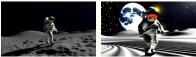

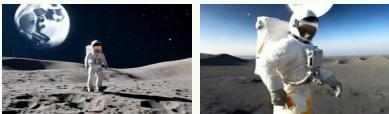

Rating: 2- Noticeable Exposure Problems

Reason: The video consistently displays significant exposure issues, primarily with high contrast that leads to a loss of detail.

While the scene remains perfectly understandable, these "clear and persistent clipping in highlights or shadows" affect major portions of the frame (the main subject and its shadow), which aligns perfectly with the definition for a rating of 2.

Rating: 2- Noticeable Exposure Problems

Reason: The large celestial body in the background is significantly overexposed, with large areas blown out to pure white, causing a complete loss of surface detail. The highlights on the astronaut's suit are also very bright and appear clipped.

These exposure issues are not fleeting; they are constant throughout the entire video.

# Rating: 5/5 - Well-Exposed

Reason: The video is well-exposed, demonstrating excellent handling of a highcontrast scene. The deep blacks of the space background and the harsh shadows on the lunar surface are appropriate for the setting and do not represent crushed blacks or loss of detail. Detail is well-preserved throughout the tonal range

FgurExamle evaluation using Gemii2.5-pron the resuls nerated by urmethod, Cuidand SelFo f       o tpr.Gasae hoh output reasoning first before outputting the final rating.

# SkyReelsV2

# MAGI-1

#

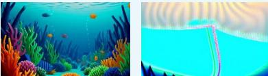

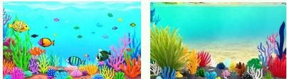

# Rating:1 - Severe Exposure Failure

Reason: While the video begins with a reasonably well-exposed image (0:00-0:09), it undergoes an artistic transition where the exposure rapidly and deliberately fails. From approximately the 15-second mark onward, large portions of the foreground coral and anemones become completely blown out to pure white. This over-exposure dominates the lower half of the frame for the majority of the video's runtime, severely distorting visibility and losing all detail in those areas.

Rating: 1 - Severe Exposure Failure

Reason: The video begins well-exposed for the first 8-10 seconds, showing a clear and balanced underwater scene. However, after approximatelythe 15-second mark, the image quality degrades catastrophically. The latter two-thirds of the video is dominated by extreme over-exposure. Large areas of the frame become a flat, blown-out cyan.

Rating: 5/5 - Well-Exposed

Reason: The video maintains a balanced and consistent exposure throughout. There are no noticeable areas where highlights are blown out to pure white or where shadows are crushed to pure black. All the details in the colorful fish, coral, and background are clearly visible, resulting in a clean and wellpresented image.

Figur Examle valuation using Gemii2.5-pron the resuls eerated b urmethod Cusid and SelFo forprpt  u e ae ora i corlnture. 2.she u.

The prompt we use for evaluating is as following:

You are tasked with rating the exposure stability of a video. Assign a score according to the following scale:

0:Catastrophic Exposure. Nearly the entire frame is either blown out (pure white) or crushed (pure black), rendering the scene unreadable.

1: Severe Exposure Failure. Large portions of the frame are dominated by over-exposure or under-exposure, substantially impairing visibility.

2: Noticeable Exposure Problems. Persistent clipping is present in highlights or shadows. Significant areas lose detail, though the frame remains viewable.

3: Moderate Exposure Issues. Over-exposed highlights or under-exposed shadows occur but are limited in extent or duration.

4: Minor Exposure Flaws. Small regions are occasionally too bright or too dark, but these do not meaningfully disrupt overall visibility.

5: Well-Exposed. Balanced lighting across the frame. No distracting over-exposure or darkening; both highlights and shadows retain detail.

Do not claim that the observations in any video are of a specific artistic style or scene transitions unless the prompt explicitly states so. The prompt for generating the video is as follows:

First, provide a brief explanation of your reasoning, describing the observed exposure characteristics.   
Then, state your final score according to the scale.

# 8.6 Discussion of Diffusion Forcing vs Autoregressive

Both diffusion forcing such as SkyReels and MAGI and autoregressive models with clean context such as SelForcing and ours can generate longvideos. Difusionforcig works b keeping alargenumberf framesin thect agean app diffnt no evel r t eThus it atalyc wi bet term memory. However, such as long term memory comes at the cost of training instability as the number of different noise level combinations can be extremely huge due to the nature of diffusion models which needs multiple step denoising. Thus methods such as StreamDiT [28] has opted to distillthe model first to limit the number of combinations which reduces the tranining instability. However, as the resutls shown in our work tables 1, 2 and 4 that a context with variable noises it not absolutely required to achieve long horizon generation with little quality degradation.As shown in our ablation study, the model is gradually learns to generate long videos with increased training budget even without using long vido training set. We hopeour work can help the community with generating better and more consistent long videos.

# 8.7 More Visualizations

Please checkout our demo page for more videos at https://self-forcing-plus-plus.github.io/