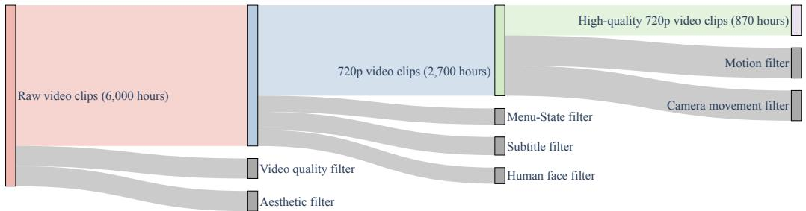
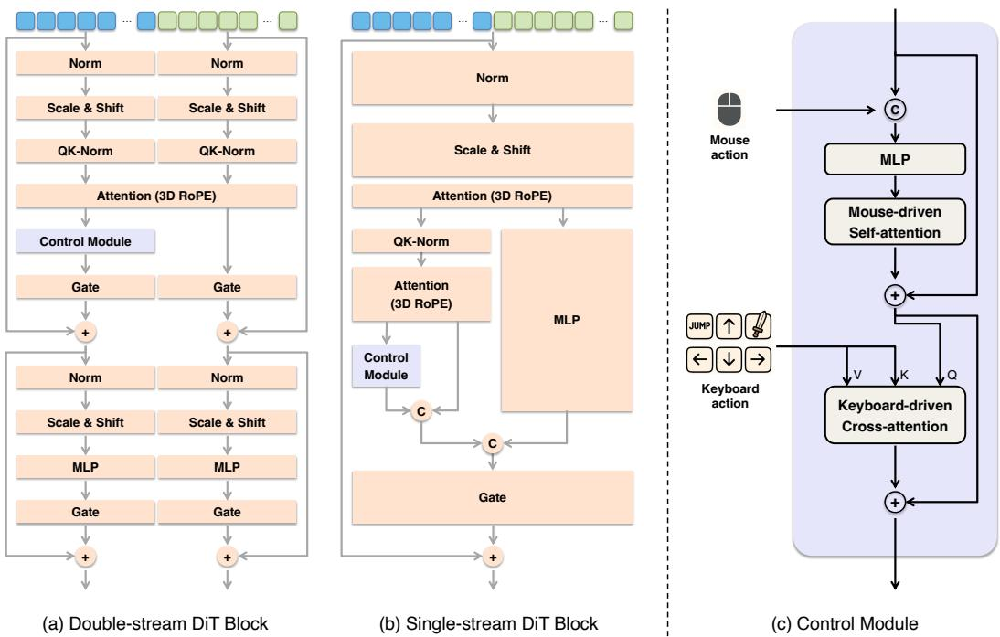
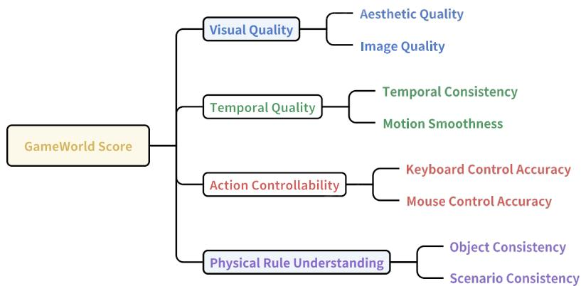

# 1. Bibliographic Information
## 1.1. Title
Matrix-Game: Interactive World Foundation Model

## 1.2. Authors
Yifan Zhang, Chunli Peng, Boyang Wang, Puyi Wang, Qingcheng Zhu, Fei Kang, Biao Jiang, Zedong Gao, Eric Li, Yang Liu, Yahui Zhou. The authors are affiliated with Skywork AI. The paper notes that Yifan Zhang, Chunli Peng, and Boyang Wang contributed equally, with Boyang Wang being the corresponding author. Skywork AI is a Chinese company focused on developing large-scale AI models.

## 1.3. Journal/Conference
The paper was submitted to arXiv, a preprint server. It does not appear to have been published in a peer-reviewed conference or journal yet. Preprints on arXiv are common in the fast-moving field of AI, allowing researchers to disseminate findings quickly, but they have not undergone formal peer review.

## 1.4. Publication Year
The paper was submitted to arXiv in June 2025 (as listed on the arXiv page). Note that this future date is likely a placeholder or an error in the provided metadata; the submission date is listed as June 23, 2024, in the original source link. For this analysis, we will use the date from the original source.

## 1.5. Abstract
The paper introduces `Matrix-Game`, an interactive world foundation model for generating controllable game worlds, specifically in Minecraft. The model is trained using a two-stage process: large-scale pretraining on unlabeled video for environment understanding, followed by training on action-labeled data for interactive generation. To support this, the authors curated `Matrix-Game-MC`, a massive Minecraft dataset with over 2,700 hours of unlabeled gameplay and over 1,000 hours of videos with fine-grained keyboard and mouse action annotations. The `Matrix-Game` model itself has over 17 billion parameters and operates on an image-to-world paradigm, generating video conditioned on a reference image, motion context, and user actions. For evaluation, the paper proposes `GameWorld Score`, a new benchmark to measure visual quality, temporal quality, controllability, and physical rule understanding. Experiments show that `Matrix-Game` significantly outperforms previous open-source models like `Oasis` and `MineWorld`, especially in controllability and physical consistency, a finding corroborated by human evaluations. The authors plan to open-source the model and benchmark.

## 1.6. Original Source Link
- **Original Source Link:** https://arxiv.org/abs/2506.18701
- **PDF Link:** https://arxiv.org/pdf/2506.18701v1
- **Publication Status:** This is a preprint available on arXiv. It has not yet been peer-reviewed or accepted at a formal academic conference or journal.

  ---

# 2. Executive Summary
## 2.1. Background & Motivation
The central problem this paper addresses is the creation of **interactive and controllable virtual worlds** using generative AI. Such systems, often called **world models**, aim to simulate the dynamics of an environment, allowing intelligent agents to perceive, reason, and plan. While recent video generation models (e.g., Sora) have shown incredible progress in creating realistic videos, they often lack fine-grained user control and a deep understanding of physical rules. This limits their use as true interactive simulators or "generative game engines."

The key challenges in this area are:
1.  **Data Scarcity:** Training models for interactive simulation requires massive datasets of videos annotated with precise, frame-by-frame user actions (keystrokes, mouse movements). Such datasets are expensive and difficult to create at scale.
2.  **Controllability & Physical Consistency:** It is difficult for models to not only generate visually plausible videos but also ensure the generated actions are consistent with user commands and that the world's objects and scenarios obey basic physical laws (e.g., objects don't vanish, scenes remain coherent).
3.  **Standardized Evaluation:** The field lacks a unified benchmark to objectively compare different world models, especially on dimensions like controllability and physical understanding, making it hard to track progress.

    This paper's innovative entry point is to tackle all three challenges simultaneously. It proposes a complete ecosystem: a massive, curated dataset (`Matrix-Game-MC`), a large-scale, highly controllable model (`Matrix-Game`), and a comprehensive evaluation benchmark (`GameWorld Score`), all focused on the complex, open-ended environment of Minecraft.

## 2.2. Main Contributions / Findings
The paper presents three core contributions:

1.  **`Matrix-Game-MC` Dataset:** A large-scale Minecraft video dataset specifically curated for training world models. It uniquely combines:
    *   **2,700+ hours of unlabeled gameplay video**, filtered for quality, to teach the model general environment dynamics and visual patterns.
    *   **1,000+ hours of high-quality labeled video**, with fine-grained, per-frame keyboard and mouse action annotations, to teach the model precise controllability. This labeled data was generated using a hybrid pipeline of automated agents and procedural simulation.

2.  **`Matrix-Game` Model:** A 17-billion-parameter interactive world foundation model. Its key features are:
    *   An **image-to-world paradigm**, generating video from a single reference image, motion context, and user actions, without relying on text prompts. This grounds the model in visual and physical cues.
    *   A **two-stage training pipeline** that first learns world dynamics from unlabeled data and then learns controllability from labeled data.
    *   An **autoregressive generation** mechanism that allows for the creation of long, coherent videos by using previously generated frames as context.

3.  **`GameWorld Score` Benchmark:** A unified and multi-dimensional benchmark for evaluating Minecraft world models. It goes beyond simple visual quality to measure:
    *   **Visual Quality** (aesthetics, image artifacts)
    *   **Temporal Quality** (consistency, motion smoothness)
    *   **Action Controllability** (accuracy of keyboard and mouse command following)
    *   **Physical Rule Understanding** (object and scenario consistency)

        The main finding is that **`Matrix-Game` significantly outperforms existing open-source models (`Oasis`, `MineWorld`) across all dimensions of the `GameWorld Score`**, with particularly large improvements in action controllability and physical consistency. Human evaluations further confirmed that users overwhelmingly prefer the videos generated by `Matrix-Game`. This suggests that scaling up both model size and high-quality, action-annotated data is a crucial step toward creating truly interactive generative world models.

---

# 3. Prerequisite Knowledge & Related Work
## 3.1. Foundational Concepts
### 3.1.1. World Models
A **world model** is an internal, learned representation of an external environment. First popularized by Ha and Schmidhuber (2018), the core idea is that an intelligent agent can build a "mental model" of how its world works by observing it. This model can then be used to simulate future events and predict the consequences of actions, enabling the agent to plan and make decisions without having to interact with the real world for every possibility. In the context of this paper, the world model is a generative video model that has learned the "rules" of the Minecraft world, including its physics, object interactions, and how user actions affect the first-person view.

### 3.1.2. Diffusion Models
**Diffusion models** are a class of generative models that have become state-of-the-art for generating high-quality images and videos. They work in two phases:
1.  **Forward (Noising) Process:** A sample of real data (e.g., an image) is gradually corrupted by adding a small amount of Gaussian noise over many steps. This process continues until the data becomes pure noise. This process is fixed and not learned.
2.  **Reverse (Denoising) Process:** A neural network is trained to reverse this process. It takes a noisy input and learns to predict the noise that was added at a particular step. By iteratively "subtracting" this predicted noise, the model can start from pure random noise and generate a clean, realistic data sample.

    **Latent Diffusion Models (LDMs):** To make this process more computationally efficient, especially for high-resolution data like videos, LDMs (Rombach et al., 2022) first compress the data into a smaller, lower-dimensional "latent space" using an autoencoder. The diffusion process then happens in this compact latent space. `Matrix-Game` is a latent diffusion model.

### 3.1.3. Diffusion Transformers (DiT)
Traditional diffusion models often used U-Net architectures for the denoising network. **Diffusion Transformers (DiT)**, proposed by Peebles and Xie (2023), replace the U-Net with a Transformer architecture. Transformers, known for their success in natural language processing, are highly scalable and effective at modeling long-range dependencies. In a DiT, the latent representation of the data (e.g., an image) is broken into a sequence of "patches" or "tokens," which are then processed by the Transformer. This architecture has proven to be very effective and scalable for high-quality generation, forming the backbone of models like Sora and `Matrix-Game`.

## 3.2. Previous Works
The paper positions `Matrix-Game` in the context of several lines of research:

*   **Video Diffusion Models as World Simulators:** Models like **Sora** (OpenAI, 2024) and **Genie-2** (Parker-Holder et al., 2024) have shown that large-scale video diffusion models can implicitly learn physical laws and object dynamics from vast amounts of video data. They are increasingly seen as promising candidates for world models. `Matrix-Game` builds directly on this paradigm.

*   **Controllable Video Generation:** While early models were primarily text-to-video, recent work has focused on adding more precise control.
    *   **Camera Control:** `CameraCtrl` and `MotionCtrl` introduced methods to guide video generation with explicit camera trajectories (e.g., yaw, pitch, zoom).
    *   **Action-Conditioning:** World models like **GAIA-1** (for autonomous driving) and **Genie** (for playable 2D environments) use actions as conditions to simulate physical dynamics. `Matrix-Game` extends this to fine-grained keyboard and mouse actions in a 3D world.

*   **Game Video Generation:** Several recent models have focused specifically on generating game environments, particularly Minecraft.
    *   **`OASIS`** (Decart, 2024) and **`MineWorld`** (Guo et al., 2025) are key open-source baselines that also aim to generate Minecraft videos. The paper directly compares against them, claiming superiority in scale, control, and physical understanding. `MineWorld` also uses an Inverse Dynamics Model for evaluation, a technique `Matrix-Game` adopts for its `GameWorld Score`.
    *   **`Genie`** (Bruce et al., 2024) introduced a model for generating playable 2D platformer environments from internet videos.
    *   **`GameFactory`** (Yu et al., 2025) and **`Matrix`** (Feng et al., 2024) are other concurrent works aiming to improve control generalization in virtual worlds, but the paper argues they are limited by smaller model and dataset scales.

## 3.3. Technological Evolution
The field has evolved rapidly:
1.  **Early World Models:** Simple, small-scale models trained on specific tasks (e.g., Atari games).
2.  **Rise of Diffusion Models:** Led to a massive leap in visual fidelity for image and then video generation.
3.  **Scaling with Transformers:** Models like Sora showed that scaling up Transformer-based video diffusion models on massive datasets leads to emergent simulation capabilities.
4.  **Focus on Controllability:** The current frontier is moving beyond passive video generation to interactive simulation. This requires not just large datasets, but large, *action-annotated* datasets and models designed to condition on these actions.

    `Matrix-Game` fits into this latest stage. It combines the scaling lessons from models like Sora with a dedicated focus on fine-grained interactivity, supported by a purpose-built dataset and evaluation framework.

## 3.4. Differentiation Analysis
Compared to prior work, `Matrix-Game`'s key differentiators are:

*   **Scale of Model and Labeled Data:** With 17B parameters and over 1,000 hours of fine-grained action-labeled data, `Matrix-Game` represents a significant step up in scale compared to other open-source game generation models like `Oasis` and `MineWorld`.
*   **Image-to-World Paradigm (No Text):** Unlike many video models that rely on text prompts, `Matrix-Game` learns purely from visual data (a reference image and video frames). The authors argue this avoids semantic biases from language and forces the model to develop a deeper understanding of geometry, physics, and object dynamics directly from pixels.
*   **Comprehensive Ecosystem:** `Matrix-Game` is not just a model. The contribution is a three-part system: the **model**, the massive **dataset** (`Matrix-Game-MC`), and the comprehensive **benchmark** (`GameWorld Score`). This provides a complete toolkit for advancing research in this specific domain.
*   **Dual Unlabeled/Labeled Training:** The two-stage training strategy is a pragmatic solution to the data bottleneck. It leverages vast amounts of easily obtainable unlabeled video to learn general world priors, then fine-tunes for specific, controllable behaviors using the more expensive labeled data.

    ---

# 4. Methodology
The methodology of `Matrix-Game` can be broken down into three main pillars: the creation of the `Matrix-Game-MC` dataset, the architecture and design of the `Matrix-Game` model, and its two-stage training process.

## 4.1. Matrix-Game-MC: A Large-scale Dataset
The authors recognized that high-quality, large-scale data is essential for building a powerful world model. They constructed `Matrix-Game-MC` using two types of data.

### 4.1.1. Unlabeled Data Collection and Filtering
This data is used to teach the model the general visual and physical properties of the Minecraft world.

1.  **Source:** ~6,000 hours of raw gameplay footage were collected from the **MineDojo Dataset**, which includes tutorials, unstructured gameplay, and environmental interactions across various biomes.
2.  **Segmentation:** The raw videos were first segmented into single-shot clips using `TransNet V2` to detect scene changes.
3.  **Hierarchical Filtering Pipeline:** A three-stage filtering pipeline was applied to curate high-quality clips, resulting in a final dataset of 2,700 hours (and a higher-quality subset of 870 hours for refinement). The following figure from the paper illustrates this process.

    
    *该图像是一个示意图，展示了从6000小时的原始视频剪辑中提取高质量720p训练数据的三阶段过滤流程。通过视频质量过滤、美学过滤、菜单状态过滤、字幕过滤、以及人脸过滤等步骤，最终生成870小时的高质量视频片段。*

The filters used in this pipeline include:
*   **Video Quality Filtering:** Uses `DOVER` to assess technical quality (resolution, clarity) and discard low-quality videos.
*   **Aesthetic Filtering:** Uses the `LAION aesthetic predictor` to score the visual appeal of frames, ensuring the model learns from aesthetically pleasing content.
*   **Menu-State Filtering:** Uses an `Inverse Dynamics Model (IDM)` to detect and remove frames where the player is idle (e.g., in menus, loading screens), focusing the dataset on active gameplay.
*   **Subtitle & Face Filtering:** Uses `CRAFT` text detector and `DeepFace` face detector to remove clips with intrusive on-screen text (subtitles, watermarks) or streamer face cams, ensuring the model learns from clean in-game visuals.
*   **Motion & Camera Filtering:** Uses `GMFlow` to calculate optical flow and discard clips with too little or too much motion. An `IDM` is also used to estimate camera rotation and filter out clips with excessively abrupt or unstable camera movements.

### 4.1.2. Labeled Data Creation
This data is crucial for teaching the model how to respond to user actions. It was created using a hybrid approach.

1.  **Exploration Agent:** The authors used curriculum-guided `VPT` (Video Pretraining) agents on the **MineRL** platform. These agents autonomously explore the Minecraft world, performing various tasks. The authors recorded their gameplay and extracted per-frame keyboard and mouse actions at 16Hz, creating a large-scale, action-labeled dataset.

2.  **Unreal Procedural Simulation:** To supplement the Minecraft data with highly structured and clean demonstrations, custom environments (urban, desert, forest) were built in **Unreal Engine**. This allowed for programmatic generation of trajectories with perfect ground-truth annotations for actions, kinematics (position, velocity), and interaction outcomes.

    To ensure the quality and diversity of this labeled data, several curation strategies were applied:
*   **Camera Motion Restriction:** To promote temporal stability, camera rotations (yaw and pitch) were limited to within 15° per frame during data generation.
*   **MineRL Engine Modification:** The MineRL engine was modified to disable "chunk loading" (where new terrain pops into view) to ensure visual coherence. Recording was also automatically stopped if the agent was near death or in a menu.
*   **Scenario Diversification:** Data was curated from 14 distinct Minecraft biomes (forest, desert, ocean, etc.) to ensure the model generalizes across different environments. The distribution is detailed in Table 1 of the paper.

    The final labeled dataset contains over 1,026 hours of 33-frame clips and an expanded, more balanced set of over 1,200 hours of 65-frame clips.

## 4.2. Model Architecture and Design
`Matrix-Game` is a latent diffusion model based on a Transformer architecture, designed for interactive image-to-world generation.

### 4.2.1. Overall Paradigm: Image-to-World Modeling
The model follows an **image-to-world** generation paradigm, as shown in the figure below. Instead of using text prompts, it takes a single **reference image** as the primary condition to understand the scene's geometry, objects, and style.

![Figure 4: Overview of the interactive image-to-world generation paradigm. The model is trained in a spatiotemporally compressed latent space obtained through a 3D Causal VAE. Conditioned on a reference image along with Gaussian noise and action signals, it generates latent representations that are decoded into video clips. By grounding generation in the reference image, the model learns to build consistent scene representations that capture geometry, dynamics, and physical interactions, enabling the generation of temporally coherent and spatially structured videos.](images/4.jpg)
*该图像是一个示意图，展示了Matrix-Game模型在互动图像到世界生成过程中的架构。模型利用3D因果编码器和视觉编码器处理输入数据，并通过Matrix-Game扩散变换器生成视频片段，结合交互控制信号以实现精确控制。*

The process is as follows:
1.  **Latent Space Compression:** A **3D Causal VAE** (Variational Autoencoder) is used to compress the input video clips into a compact latent space. This VAE reduces the spatial resolution by 8x and the temporal resolution by 4x, making the diffusion process more manageable.
2.  **Conditioning:** The core diffusion model, a **Diffusion Transformer (DiT)**, takes several inputs:
    *   A noisy latent tensor (the starting point for generation).
    *   The reference image, processed by a visual encoder.
    *   Motion context from previous frames (for autoregressive generation).
    *   User action signals (for controllability).
3.  **Generation & Decoding:** The DiT generates a clean latent representation of the video clip, which is then passed to the 3D VAE's decoder to reconstruct the final video in pixel space.

### 4.2.2. Autoregressive Generation for Long Videos
To generate videos longer than a single clip, `Matrix-Game` uses an autoregressive strategy. The last few frames of a generated clip are used as "motion context" to condition the generation of the next clip.

The following figure illustrates this process and the model's overall architecture.

![Figure 5: (a) Autoregressive generation in Matrix-Game and (b) The architecture of Matrix-Game. To enable long-duration video generation, Matrix-Game adopts an autoregressive strategy: the last few frames of each generated clip are used as motion conditions for generating the next clip. Specifically, the latent o thee motion frames are concatenated with the noisy latent along the channel dimension, and a binary mask is also concatenated to indicate which frames contain valid motion information. This design enhances local temporal consistency across video segments, allowing the model to maintain coherent dynamics over extended time horizons. Moreover, we adopt the token replacement trick in Hunyuan Video I2V \[29\] to enable stable image-to-video generation.](images/5.jpg)
*该图像是示意图，展示了Matrix-Game的自回归生成及其架构（图5）。左侧展示了如何利用运动帧、噪音潜变量和参考图像生成视频，右侧详细描绘了模型的结构，包括3D因果编码器和双流DiT模块。该自回归策略提升了视频生成的时序一致性。*

Specifically:
*   The last $k=5$ frames of the previous segment are encoded into their latent representations.
*   These "motion latents" are concatenated with the new noisy latent tensor along the channel dimension.
*   A binary mask is also concatenated to indicate which temporal positions contain valid motion information.
*   To improve robustness against error accumulation, Gaussian noise is added to the motion frames and reference image during training with a probability of 0.2.
*   **Classifier-Free Guidance (CFG)** is also applied to the motion context during training. With a 25% probability, the motion latents are replaced with zeros, forcing the model to learn to rely on the motion context when it is available but not over-rely on it.

### 4.2.3. Injecting Actions for Controllability
User actions are injected into the diffusion transformer blocks to guide the generation process. The architecture for this is shown below.

*该图像是展示 Matrix-Game 中扩散 Transformer 模块细节的示意图，包括双流和单流 DIT 块的结构，以及控制模块处理鼠标和键盘动作的方式。*

*   **Action Representation:**
    *   **Keyboard actions** (`up`, `down`, `left`, `right`, `jump`, `attack`) are represented as discrete encodings.
    *   **Mouse movements** (changes in pitch/yaw) are represented as continuous scalar values.
*   **Integration into DiT:**
    *   The continuous mouse action is concatenated with the input latent tokens and processed through an MLP and temporal self-attention.
    *   The discrete keyboard actions are integrated via `cross-attention`, allowing them to influence the generation at each step of the diffusion process.
*   **CFG for Actions:** During training, action signals are replaced with unconditioned (null) signals with a probability of 0.1. This strengthens the model's ability to follow action commands when they are provided.

## 4.3. Model Training
The model is trained using the **flow matching** paradigm with a **rectified flow loss**, which offers faster convergence and sampling than traditional DDPMs. The training is divided into two stages.

### 4.3.1. Stage 1: Unlabeled Training for Game World Understanding
*   **Objective:** To learn the fundamental visual and physical dynamics of the game world.
*   **Initialization:** The model is initialized with pretrained weights from the `HunyuanVideo` image-to-video model. The text-conditioning branch of `HunyuanVideo` is replaced with an image-conditioning branch.
*   **Data:** The model is trained on the 2,700-hour unlabeled Minecraft video dataset. It is trained on a mix of video lengths (17, 33, 65 frames) and aspect ratios to enhance robustness.
*   **Refinement:** After initial pretraining, the model is further trained on a curated 870-hour subset of high-quality, stable videos to improve its understanding of coherent spatial structures and fine-grained physics.

### 4.3.2. Stage 2: Action-Labeled Training for Interactive World Generation
*   **Objective:** To learn to generate videos that are precisely controllable by user actions.
*   **Model:** The action control module is integrated into the model, bringing the total parameter count to 17 billion.
*   **Data:** The model is trained on the 1,200 hours of action-labeled data from Minecraft and Unreal Engine. Initially, training is done on 33-frame clips at 720p resolution.
*   **Refinement & Balancing:** To improve long-range temporal modeling and handle scenario imbalance, the model is further trained on a balanced 65-frame dataset covering 8 distinct Minecraft biomes. This final stage strengthens the model's ability to generate long, coherent, and interactive sequences across diverse environments.

    ---

# 5. Experimental Setup
## 5.1. Datasets
The primary dataset used for both training and evaluation is **`Matrix-Game-MC`**, the large-scale Minecraft dataset created by the authors. As described in the methodology, it consists of two main parts:
*   **Unlabeled Data:** Over 2,700 hours of gameplay videos from MineDojo, used for pretraining.
*   **Labeled Data:** Over 1,200 hours of gameplay videos from MineRL and Unreal Engine, annotated with per-frame keyboard and mouse actions, used for controllable fine-tuning.

    An example of the data would be a short video clip (e.g., 65 frames at 16 FPS) of a first-person view in Minecraft, paired with a sequence of action vectors for each frame. Each vector would specify which keys were pressed (e.g., 'forward', 'jump') and the change in mouse pitch/yaw.

These datasets were chosen because Minecraft offers an incredibly diverse, open-ended, and physically consistent (within its own rules) environment, making it an ideal testbed for developing and evaluating world models.

## 5.2. Evaluation Metrics
The paper introduces a new comprehensive benchmark called **`GameWorld Score`**. It evaluates models across four pillars, which are broken down into eight fine-grained dimensions.

*该图像是一个示意图，展示了 GameWorld Score 的各个评估指标，包括视觉质量、时间质量、动作可控性和物理规则理解。各指标下又细分为多个具体维度，如美学质量、键盘控制精度等。*

### 5.2.1. Visual Quality
This assesses the quality of individual frames.
*   **Aesthetic Quality:**
    *   **Conceptual Definition:** Measures the visual appeal of a frame (composition, color, lighting) based on human preferences.
    *   **Formula:** This is evaluated using a pre-trained model, the **LAION aesthetic predictor**, which outputs a score. No explicit formula is provided as it's a learned function. A higher score is better.
*   **Image Quality:**
    *   **Conceptual Definition:** Measures low-level artifacts like blur, noise, and compression distortions. It is a no-reference image quality assessment.
    *   **Formula:** This is evaluated using the **MUSIQ (Multi-scale Image Quality Transformer)** predictor. Like the aesthetic predictor, it's a learned function that outputs a quality score. A higher score is better.

### 5.2.2. Temporal Quality
This assesses consistency and realism across frames.
*   **Temporal Consistency:**
    *   **Conceptual Definition:** Measures how stable the background and static elements of the scene are over time, penalizing flickering or texture drift.
    *   **Formula:** It is calculated as the average cosine similarity between the `CLIP` feature embeddings of adjacent frames.
        \$
        \text{Temporal Cons.} = \frac{1}{N-1} \sum_{i=1}^{N-1} \frac{E_i \cdot E_{i+1}}{\|E_i\| \|E_{i+1}\|}
        \$
    *   **Symbol Explanation:**
        *   $N$: The total number of frames in the video.
        *   $E_i$: The `CLIP` embedding of the $i$-th frame.
        *   $\cdot$: Dot product.
        *   $\| \cdot \|$: L2 norm (magnitude) of the vector.
            A higher similarity score (closer to 1) is better.

*   **Motion Smoothness:**
    *   **Conceptual Definition:** Measures the plausibility and continuity of motion, penalizing jittery or unnatural movements.
    *   **Formula:** It leverages a pre-trained video frame interpolation network (AMT). The metric is based on the reconstruction error when trying to predict a frame from its neighbors. While the paper doesn't give a formula, it's conceptually an inverse of error. The paper reports a score where higher is better, likely a normalized version of accuracy (e.g., $1 - \text{error}$). A common way to measure this error is Peak Signal-to-Noise Ratio (PSNR) or Structural Similarity Index (SSIM) between the real frame and the interpolated one. For this analysis, let's assume it's a normalized score derived from reconstruction accuracy.
        \$
        \text{Motion Smoothness} \propto \text{Accuracy}(\text{Frame}_i, \text{Interpolate}(\text{Frame}_{i-1}, \text{Frame}_{i+1}))
        \$
    *   **Symbol Explanation:**
        *   $\text{Frame}_i$: The $i$-th frame of the generated video.
        *   $\text{Interpolate}(\cdot, \cdot)$: The frame interpolation model.
        *   $\text{Accuracy}(\cdot, \cdot)$: A function measuring similarity between the real and interpolated frames.
            A higher score indicates smoother motion.

### 5.2.3. Action Controllability
This assesses how well the generated video follows the input action commands. It uses an **Inverse Dynamics Model (IDM)**, which is trained to predict actions from video frames.
*   **Keyboard Control Accuracy:**
    *   **Conceptual Definition:** Measures the precision of following discrete keyboard commands (forward, jump, etc.).
    *   **Formula:** It's the average precision across four independent action groups: `(forward, back, empty)`, `(left, right, empty)`, `(attack, empty)`, and `(jump, empty)`.
        \$
        \text{Precision} = \frac{\text{True Positives}}{\text{True Positives} + \text{False Positives}}
        \$
    *   **Symbol Explanation:**
        *   **True Positives:** The IDM correctly predicts an action that was given as a command.
        *   **False Positives:** The IDM predicts an action that was not commanded.
            The final score is the average precision across the groups. Higher is better.

*   **Mouse Control Accuracy:**
    *   **Conceptual Definition:** Measures the accuracy of following continuous mouse commands (camera rotation).
    *   **Formula:** The movement is categorized into 8 directions plus 'empty'. The metric is the precision of predicting the correct direction of camera motion.
        \$
        \text{Precision} = \frac{\text{Correctly Predicted Directions}}{\text{Total Positive Predictions}}
        \$
    *   **Symbol Explanation:**
        *   **Correctly Predicted Directions:** The direction of camera motion predicted by the IDM from the video matches the ground-truth input command.
        *   **Total Positive Predictions:** The total number of times the IDM predicted a non-empty camera motion.
            Higher precision is better.

### 5.2.4. Physical Rule Understanding
This assesses adherence to physical laws.
*   **Object Consistency:**
    *   **Conceptual Definition:** Measures if the 3D geometry of objects is preserved over time, even if textures change.
    *   **Formula:** It uses **DROID-SLAM** to estimate camera poses and a depth map for the scene. The metric is the **reprojection error**, which measures how well pixels corresponding to the same 3D point in different frames align when projected into each other's view. A lower error is better. The paper reports a normalized score where higher is better, likely $1 - \text{Normalized Error}$.
        \$
        \text{Error}_{reproj} = \| p_i - \pi(K_i T_{ij} K_j^{-1} \pi^{-1}(p_j, d_j)) \|^2
        \$
    *   **Symbol Explanation:**
        *   $p_i, p_j$: A pixel in frame $i$ and its corresponding pixel in frame $j$.
        *   $\pi(\cdot)$: The projection function from 3D world coordinates to 2D pixel coordinates.
        *   $\pi^{-1}(\cdot)$: The back-projection function from 2D to 3D.
        *   $K_i, K_j$: Camera intrinsic matrices for frames $i$ and $j$.
        *   $T_{ij}$: The transformation matrix from frame $j$ to frame $i$.
        *   $d_j$: The depth of pixel $p_j$.
            The final score is an aggregation over all co-visible pixels, inverted so higher is better.

*   **Scenario Consistency:**
    *   **Conceptual Definition:** Measures if the model can maintain and reconstruct a scene when the camera moves away and then returns to the same viewpoint.
    *   **Formula:** The model is tasked to generate video for a symmetric camera path (e.g., move left for 10 frames, then move right for 10 frames). The metric is the Mean Squared Error (MSE) between corresponding frames in the forward and reverse paths.
        \$
        \text{MSE} = \frac{1}{H \times W} \sum_{x=1}^{W} \sum_{y=1}^{H} (I_1(x, y) - I_2(x, y))^2
        \$
    *   **Symbol Explanation:**
        *   $I_1, I_2$: The two frames being compared (e.g., the start frame and the end frame of the symmetric path).
        *   `H, W`: Height and width of the frames.
            A lower MSE indicates better consistency. The paper reports a score where higher is better, likely $1 - \text{Normalized MSE}$.

## 5.3. Baselines
The paper compares `Matrix-Game` against two strong, recent, open-source world models for Minecraft:
*   **`OASIS` [9]:** A Transformer-based world model for game generation.
*   **`MineWorld` [18]:** Another real-time, open-source interactive world model for Minecraft.

    These baselines are representative as they are the leading publicly available systems for the same task and environment, making them ideal for a direct comparison.

---

# 6. Results & Analysis
## 6.1. Core Results Analysis
The primary quantitative results are summarized in Table 2, which presents a comparison on the `GameWorld Score` benchmark.

The following are the results from Table 2 of the original paper:

<table>
<thead>
<tr>
<th rowspan="2">Model</th>
<th colspan="2">Visual Quality</th>
<th colspan="2">Temporal Quality</th>
<th colspan="2">Action Controllability</th>
<th colspan="2">Physical Understanding</th>
</tr>
<tr>
<th>Image Quality ↑</th>
<th>Aesthetic ↑</th>
<th>Temporal Cons. ↑</th>
<th>Motion smooth. ↑</th>
<th>Keyboard Acc. ↑</th>
<th>Mouse Acc. ↑</th>
<th>Obj. Cons. ↑</th>
<th>Scenario Cons. ↑</th>
</tr>
</thead>
<tbody>
<tr>
<td>Oasis [9]</td>
<td>0.65</td>
<td>0.48</td>
<td>0.94</td>
<td>0.98</td>
<td>0.77</td>
<td>0.56</td>
<td>0.56</td>
<td>0.86</td>
</tr>
<tr>
<td>MineWorld [18]</td>
<td>0.69</td>
<td>0.47</td>
<td>0.95</td>
<td>0.98</td>
<td>0.86</td>
<td>0.64</td>
<td>0.51</td>
<td>0.92</td>
</tr>
<tr>
<td>Ours</td>
<td><b>0.72</b></td>
<td><b>0.49</b></td>
<td><b>0.97</b></td>
<td><b>0.98</b></td>
<td><b>0.95</b></td>
<td><b>0.95</b></td>
<td><b>0.76</b></td>
<td><b>0.93</b></td>
</tr>
</tbody>
</table>

**Analysis:**
*   **Overall Dominance:** `Matrix-Game` ("Ours") outperforms both `Oasis` and `MineWorld` on **every single metric**.
*   **Action Controllability:** The most dramatic improvements are in this category.
    *   `Keyboard Accuracy`: `Matrix-Game` achieves 0.95, a significant leap from `MineWorld`'s 0.86 and `Oasis`'s 0.77. This indicates a much more reliable response to keyboard commands.
    *   `Mouse Accuracy`: The improvement is even more stark here. `Matrix-Game` scores 0.95, while `MineWorld` and `Oasis` are far behind at 0.64 and 0.56, respectively. This demonstrates superior handling of fine-grained, continuous camera control, which is notoriously difficult.
*   **Physical Understanding:** `Matrix-Game` also shows major gains.
    *   `Object Consistency`: It scores 0.76, a substantial improvement over `Oasis` (0.56) and `MineWorld` (0.51). This suggests the model has a better internal representation of 3D geometry.
    *   `Scenario Consistency`: It achieves 0.93, slightly better than `MineWorld` (0.92) and `Oasis` (0.86), showing strong long-term scene memory.
*   **Visual & Temporal Quality:** While the gains are less dramatic, `Matrix-Game` still leads. It produces slightly higher quality and more aesthetically pleasing images (`Image Quality` 0.72, `Aesthetic` 0.49) and maintains better temporal consistency (`Temporal Cons.` 0.97). All models perform well on `Motion Smoothness`.

    The radar chart in Figure 2 visually summarizes this dominance, showing the `Matrix-Game` performance polygon encompassing the others, especially along the controllability and physical understanding axes.

    ![Figure 2: Model performance under our GameWorld Score benchmark, covering 8 key dimensions: Image Quality, Aesthetic (scaled $\\times 2$ for visualization), Temporal Consistency, Motion Smoothness, Keyboard Accuracy, Mouse Accuracy, Object Consistency and Scenario Consistency. Our method outperforms Oasis \[9\] and MineWorld \[18\] in all aspects, particularly in controllability (keyboard and mouse accuracy) and physical consistency, while maintaining high visual and temporal quality.](images/2.jpg)
    *该图像是一个雷达图，展示了Matrix-Game在GameWorld Score基准下的性能，涵盖图像质量、审美、时间一致性、运动平滑性、键盘准确度、鼠标准确度、对象一致性和场景一致性等八个维度。我们的模型在所有方面均优于Oasis和MineWorld，特别是在可控性和物理一致性方面表现突出。*

## 6.2. Human Evaluation
To validate that the quantitative metrics align with human perception, the authors conducted double-blind studies.

**Analysis:**
*   The results are overwhelmingly in favor of `Matrix-Game`. It achieved a **96.3% win rate** in `Overall Quality`, meaning human annotators almost always preferred its output.
*   The win rates for `Controllability` (93.76%), `Visual Quality` (98.23%), and `Temporal Consistency` (89.56%) are also extremely high.
*   This strong correlation between the `GameWorld Score` results and human preference validates the benchmark itself as a reliable proxy for perceptual quality and interactivity.

## 6.3. Ablation Studies / Parameter Analysis
### 6.3.1. Detailed Action Controllability
Table 3 provides a fine-grained breakdown of control accuracy for specific keyboard and mouse actions.

The following are the results from Table 3 of the original paper:

<table>
<thead>
<tr>
<th rowspan="2">Model</th>
<th colspan="6">Keyboard Action</th>
<th colspan="8">Mouse Movement Action</th>
</tr>
<tr>
<th>forward</th>
<th>backward</th>
<th>left</th>
<th>right</th>
<th>jump</th>
<th>attack</th>
<th>camera↑</th>
<th>camera↓</th>
<th>camera←</th>
<th>camera→</th>
<th>camera↖</th>
<th>camera↗</th>
<th>camera↙</th>
<th>camera↘</th>
</tr>
</thead>
<tbody>
<tr>
<td>Oasis [9]</td>
<td>0.85</td>
<td>0.78</td>
<td>0.80</td>
<td>0.79</td>
<td>0.77</td>
<td>0.89</td>
<td>0.66</td>
<td>0.55</td>
<td>0.33</td>
<td>0.35</td>
<td>0.56</td>
<td>0.53</td>
<td>0.45</td>
<td>0.51</td>
</tr>
<tr>
<td>MineWorld [18]</td>
<td>0.86</td>
<td>0.80</td>
<td>0.87</td>
<td>0.88</td>
<td>0.82</td>
<td>0.87</td>
<td>0.46</td>
<td>0.45</td>
<td>0.53</td>
<td>0.54</td>
<td>0.66</td>
<td>0.77</td>
<td>0.87</td>
<td>0.96</td>
</tr>
<tr>
<td>Ours</td>
<td><b>0.99</b></td>
<td><b>0.91</b></td>
<td><b>0.92</b></td>
<td><b>0.96</b></td>
<td><b>0.88</b></td>
<td><b>0.95</b></td>
<td><b>0.91</b></td>
<td><b>0.98</b></td>
<td><b>0.89</b></td>
<td><b>0.90</b></td>
<td><b>0.92</b></td>
<td><b>0.97</b></td>
<td><b>0.98</b></td>
<td><b>0.98</b></td>
</tr>
</tbody>
</table>

**Analysis:**
*   `Matrix-Game` is superior across the board. For keyboard actions, it achieves near-perfect accuracy for `forward` (0.99) and very high accuracy for all others (>0.88).
*   For mouse movements, the difference is even more significant. `Oasis` struggles with horizontal camera movements (0.33 for left, 0.35 for right). `MineWorld` is better but still inconsistent. `Matrix-Game`, however, achieves high accuracy across all 8 directions, with most being well above 0.90. This confirms its robust and fine-grained control capabilities.

### 6.3.2. Scenario Generalization
Figure 9 shows the `GameWorld Score` broken down by eight different Minecraft scenarios (biomes).

**Analysis:**
*   The radar charts show that `Matrix-Game` consistently maintains its lead over `Oasis` and `MineWorld` across all tested biomes, from deserts and beaches to more complex environments like forests and icy terrains.
*   The shape of its performance polygon remains largely consistent, indicating that the model's superior controllability and physical understanding are not limited to a specific type of environment but generalize well. This is a direct result of the diverse and balanced training data in `Matrix-Game-MC`.

### 6.3.3. Autoregressive Generation and Failure Cases
*   **Autoregressive Generation:** Figure 10 demonstrates that the model can generate long videos autoregressively, maintaining temporal consistency across segment boundaries while faithfully following a sequence of different action commands.
*   **Failure Cases:** The authors honestly discuss limitations in Figure 11.
    *   **Edge Case Generalization:** In rare or visually complex biomes not well-represented in the training data, the model's temporal consistency or controllability can degrade.
    *   **Physics Understanding:** The model's understanding of physics is not perfect. An example shows the agent walking *through* leaves instead of on top of or around them. This indicates that modeling fine-grained physical interactions (like collisions and material properties) is a remaining challenge.

        
        *该图像是插图，展示了Matrix-Game的失败案例。上半部分(a)展示了边缘案例生成的情境，模型在鲜有或不熟悉的场景中可能无法保持时间一致性。下半部分(b)则反映了物理理解方面的问题，代理角色穿越树叶，显示出在物理交互建模方面的改进空间。*

---

# 7. Conclusion & Reflections
## 7.1. Conclusion Summary
The paper introduces `Matrix-Game`, a 17B-parameter interactive world foundation model for controllable game world generation. The work makes three key contributions: the large-scale `Matrix-Game` model, the comprehensive `Matrix-Game-MC` dataset (with over 1,000 hours of action-labeled data), and the unified `GameWorld Score` benchmark. Through extensive experiments, the authors demonstrate that `Matrix-Game` significantly surpasses previous open-source models in generating high-quality, temporally coherent, and physically plausible Minecraft worlds. Its most significant advantage lies in its precise and reliable response to fine-grained user actions (keyboard and mouse), a finding strongly supported by both quantitative metrics and human evaluations. The authors plan to release the model and benchmark to foster future research.

## 7.2. Limitations & Future Work
The authors acknowledge several limitations and propose future research directions:

*   **Limitations:**
    1.  **Edge Case Generalization:** The model can fail in visually rare or complex scenarios that are underrepresented in the training data.
    2.  **Physics Understanding:** The model still struggles with fine-grained physical interactions like object collisions and terrain traversal, indicating room for improvement in physical grounding.

*   **Future Work:**
    1.  **Long-term Temporal Consistency:** Improve coherence over even longer video sequences, possibly by using memory-based architectures or longer motion contexts.
    2.  **Action Space Enrichment:** Expand the supported action space to include a more continuous range of mouse movements and a wider variety of keyboard actions to enhance expressiveness.
    3.  **Beyond Minecraft:** Extend the framework to more complex and visually realistic game environments, such as AAA titles (`Black Myth: Wukong`) or multi-agent games (`CS:GO`), to tackle new challenges in visual dynamics and agent interactions.

## 7.3. Personal Insights & Critique
This paper represents a significant and well-executed step toward creating truly interactive generative worlds.

*   **Critique and Positive Insights:**
    *   **The Ecosystem Approach is Key:** The paper's greatest strength is its holistic approach. By simultaneously building the model, the dataset, and the benchmark, the authors provide a complete and powerful toolkit for the community. This is far more impactful than releasing a model in isolation. The `GameWorld Score` in particular is a crucial contribution that will help standardize evaluation and guide future research.
    *   **Data is the Moat:** The meticulous curation of the `Matrix-Game-MC` dataset is arguably the most valuable asset produced by this research. The two-stage training strategy—leveraging cheap, abundant unlabeled data for general understanding and expensive, targeted labeled data for fine-grained control—is a highly effective and pragmatic blueprint for training future world models.
    *   **Image-to-World is a Powerful Paradigm:** The decision to forego text prompts and focus on an image-to-world paradigm is insightful. It forces the model to develop a "visual-physical intelligence" rather than relying on linguistic shortcuts, which may be crucial for building models that genuinely understand spatial and causal relationships.
    *   **Transparency on Failures:** The honest discussion of failure cases is commendable and provides clear directions for future work. The "walking through leaves" example is a perfect illustration of the subtle yet profound challenges that remain in modeling physical interactions.

*   **Potential Issues and Future Considerations:**
    *   **Scalability vs. Accessibility:** A 17-billion-parameter model is powerful but computationally expensive to train and run. While the authors' plan to open-source the weights is excellent, its practical use by the broader research community may be limited to inference, with retraining being out of reach for many labs.
    *   **Implicit vs. Explicit Physics:** The model learns physics implicitly from video data. While this is powerful, the failure cases show its limits. Future models might need to incorporate more explicit physical priors or symbolic reasoning engines to handle complex interactions robustly.
    *   **The "Minecraft Sandbox":** While Minecraft is an excellent starting point, its blocky aesthetic and simplified physics may not fully prepare models for the complexities of real-world simulation or photorealistic games. The proposed extension to other game engines is a critical next step to test the true generalization capabilities of this approach.

        Overall, `Matrix-Game` is a landmark paper in the domain of generative world modeling. It provides a strong foundation and a clear path forward, demonstrating that with sufficient scale in data, model capacity, and rigorous evaluation, we are moving closer to the vision of AI-powered, fully interactive, and explorable virtual worlds.