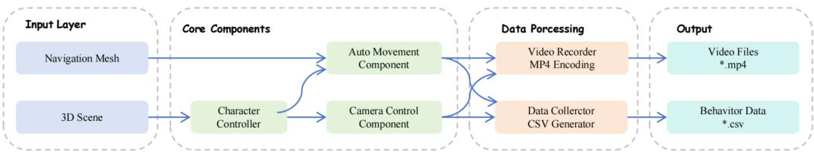
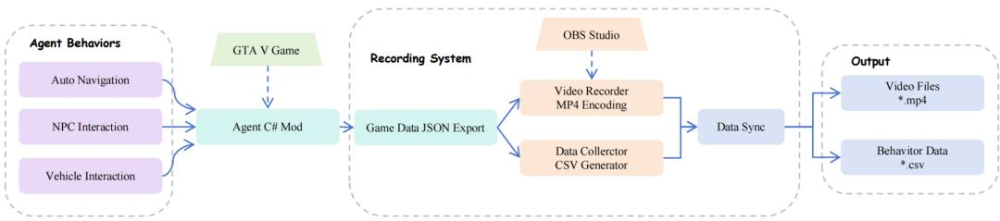
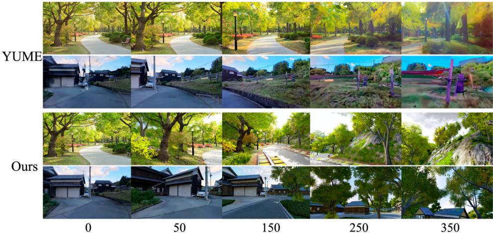
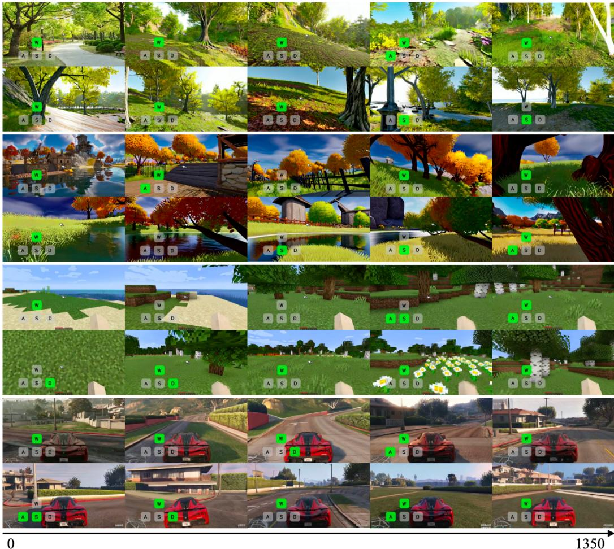
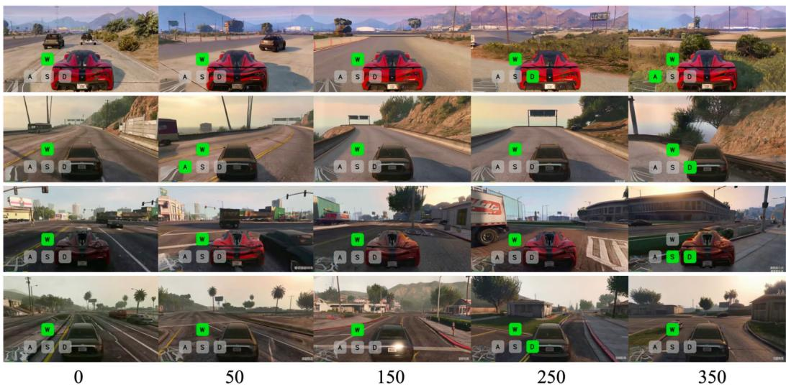
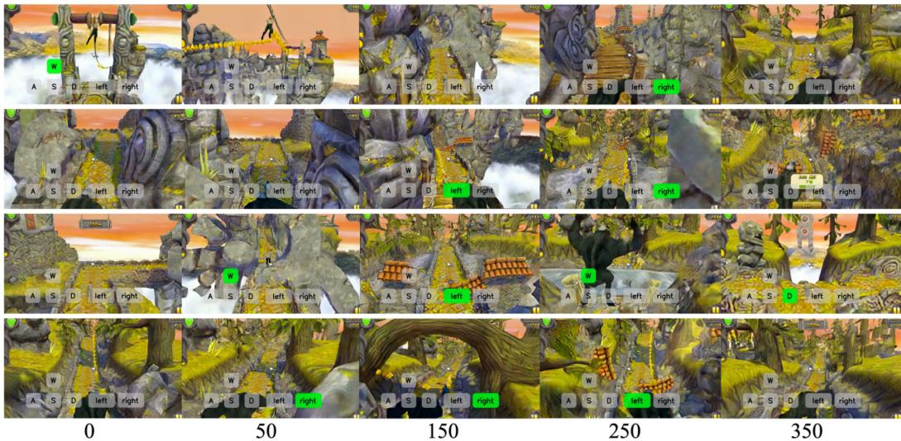
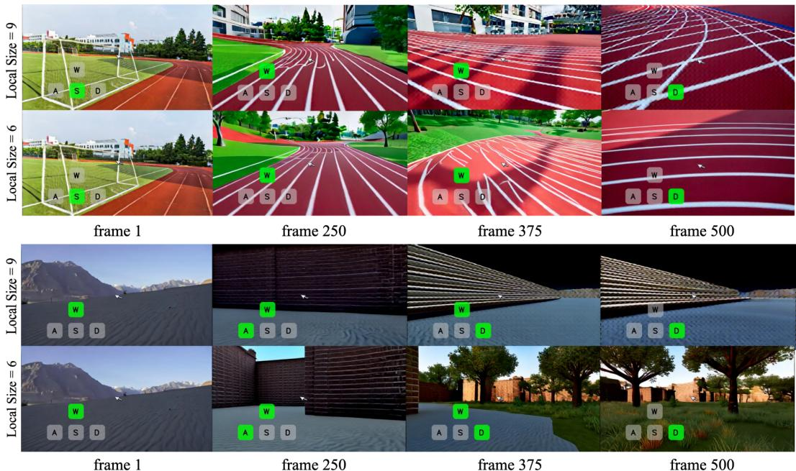
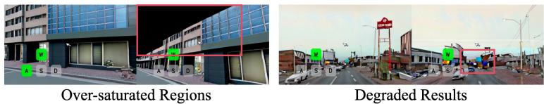

# 1. Bibliographic Information
## 1.1. Title
Matrix-game 2.0: An open-source real-time and streaming interactive world model

The title clearly states the paper's subject: a new version of a model named "Matrix-Game". It highlights three key features: it is **open-source**, operates in **real-time and streams** video, and functions as an **interactive world model**. This immediately positions the work at the intersection of generative AI, real-time systems, and reinforcement learning/AI agent research.

## 1.2. Authors
The paper lists a large team of authors: Xianglong He, Chunli Peng, Zexiang Liu, Boyang Wang, Yifan Zhang, Qi Cui, Fei Kang, Biao Jiang, Mengyin An, Yangyang Ren, Baixin Xu, Hao-Xiang Guo, Kaixiong Gong, Size Wu, Wei Li, Xuchen Song, Yang Liu, Yangguang Li, and Yahui Zhou. All authors are affiliated with **Skywork AI**, a large AI research company. The extensive author list is indicative of a large-scale, well-resourced industrial research project, which is often necessary for developing foundational models that require massive datasets and computational power.

## 1.3. Journal/Conference
The paper was submitted to **arXiv**, which is a preprint server for academic papers in fields like physics, mathematics, computer science, and quantitative biology. This means the paper has not yet undergone formal peer review for publication in a conference or journal. Publishing on arXiv is a common practice in the fast-moving field of AI to disseminate findings quickly to the research community.

## 1.4. Publication Year
The publication date listed is **August 18, 2025**. This is a future date and likely serves as a placeholder on arXiv. The paper was accessible in mid-2024, with version 3 submitted around that time.

## 1.5. Abstract
The abstract introduces `Matrix-Game 2.0`, an interactive world model designed for real-time video generation. It identifies a key problem with existing models: their reliance on bidirectional attention and numerous inference steps makes them too slow for real-time applications where responses must be instantaneous. To solve this, `Matrix-Game 2.0` uses a few-step auto-regressive diffusion process. The framework has three main components: (1) a large-scale data production pipeline using Unreal Engine and GTA5 to generate approximately 1200 hours of video with detailed interaction data; (2) an action injection module that conditions the model on frame-level mouse and keyboard inputs; and (3) a few-step distillation technique built on a causal architecture to enable real-time streaming. The model can generate minute-long, high-quality videos at 25 frames per second (FPS). The authors announce that they will open-source the model and codebase.

## 1.6. Original Source Link
- **Original Source Link:** `https://arxiv.org/abs/2508.13009`
- **PDF Link:** `https://arxiv.org/pdf/2508.13009v3`
- **Publication Status:** This is a **preprint** available on arXiv.

# 2. Executive Summary
## 2.1. Background & Motivation
The primary problem this paper addresses is the **latency of interactive video generation models**. Recent advancements have shown that diffusion models can serve as powerful **world models**—systems that learn the dynamics of an environment to predict future states. However, existing models are ill-suited for real-time interaction (like in video games or simulators) for two main reasons:
1.  **Architectural Inefficiency:** Many models use bidirectional attention, meaning that to generate a single frame, they must process information from both past and future frames. This is inherently non-causal and computationally expensive, making real-time, on-the-fly generation impossible.
2.  **Slow Inference:** Diffusion models traditionally require many denoising steps to generate a high-quality output, which is far too slow for real-time performance targets like 25 FPS.

    Furthermore, training such interactive models is hampered by a **lack of large-scale, high-quality datasets** with precise, frame-level annotations of user actions (e.g., keyboard presses, mouse movements).

The paper's innovative entry point is to build a holistic system that tackles both the data problem and the model problem simultaneously. They propose creating a massive, high-fidelity synthetic dataset and then using it to train a model specifically architected for fast, causal, and interactive generation.

## 2.2. Main Contributions / Findings
The paper presents three core contributions to achieve its goal of a real-time interactive world model:

1.  **A Scalable Data Production Pipeline:** The authors developed a sophisticated pipeline using **Unreal Engine** and **Grand Theft Auto V (GTA5)**. This pipeline can generate vast amounts (~1200 hours) of video data where every frame is precisely annotated with corresponding keyboard and mouse actions. This solves the critical data bottleneck for training interactive models.
2.  **An Action-Conditioned Causal Architecture:** The model, `Matrix-Game 2.0`, is built on a diffusion transformer architecture. It includes a specialized `action injection module` to integrate frame-level user inputs (mouse and keyboard) as control signals. Crucially, the model is designed with a causal structure, meaning it only looks at past information to predict the future, which is essential for streaming.
3.  **Real-Time Performance via Distillation:** To overcome the slowness of diffusion models, the authors employ a **few-step distillation** process based on `Self-Forcing`. This technique trains a smaller, faster "student" model to emulate the output of a larger, high-quality "teacher" model in just a few steps. This, combined with optimizations like `KV caching`, allows the model to generate video at an impressive **25 FPS** on a single H100 GPU.

    The key finding is that this combination of a massive custom dataset and a carefully designed and optimized model architecture makes it possible to generate **high-quality, controllable, minute-long videos in real-time**, a significant step forward for interactive world modeling.

# 3. Prerequisite Knowledge & Related Work
## 3.1. Foundational Concepts
To understand this paper, one must be familiar with the following concepts:

*   **World Models:** A world model is an AI system, typically a neural network, that learns an internal representation (or "model") of an environment. It can use this model to simulate the environment and predict how it will change in the future based on a sequence of actions. This allows an AI agent to "imagine" the consequences of its actions without having to perform them in the real world, enabling more efficient planning and decision-making.

*   **Diffusion Models:** These are a class of generative models that have become state-of-the-art for generating high-quality images and videos. They work in two phases:
    1.  **Forward Process (Noise Addition):** A clean data sample (e.g., an image) is gradually corrupted by adding a small amount of Gaussian noise over many steps, eventually turning it into pure noise.
    2.  **Reverse Process (Denoising):** A neural network is trained to reverse this process. It takes a noisy sample and a timestep as input and predicts the noise that was added. By repeatedly subtracting this predicted noise, the model can generate a clean sample starting from pure noise.

*   **Auto-regressive Models:** An auto-regressive model generates a sequence of data one step at a time, where the output at each step is conditioned on the outputs from all previous steps. For video generation, this means generating frame $N$ based on frames $1, 2, ..., N-1$. This is a natural fit for real-time streaming, as the model does not need to know the future to generate the present.

*   **Diffusion Transformer (DiT):** This is an architecture that replaces the commonly used U-Net backbone in diffusion models with a Transformer. Transformers, with their self-attention mechanism, are highly scalable and have proven effective at modeling long-range dependencies, which is beneficial for complex data like high-resolution images and videos. The DiT in this paper processes latent representations of video frames as a sequence of tokens.

*   **Knowledge Distillation:** This is a machine learning technique where a small, efficient "student" model is trained to replicate the performance of a larger, more complex "teacher" model. The goal is to transfer the "knowledge" from the teacher to the student, allowing the student to achieve similar accuracy but with much lower computational cost and faster inference speed. The paper uses `Self-Forcing` and `Distribution Matching Distillation (DMD)` for this purpose.

*   **KV Caching:** In auto-regressive Transformer models, the `self-attention` mechanism computes a representation for each token based on all previous tokens. KV (Key-Value) caching is an optimization that stores the computed key and value matrices for previous tokens so they don't need to be recomputed at every new step. This dramatically speeds up sequential generation.

## 3.2. Previous Works
The paper situates its work in the context of several key research areas and prior models:

*   **Controllable Video Generation:** The paper references works that control video generation using various signals like text, images, or camera trajectories. `Matrix-Game 2.0` focuses specifically on **action controllability** via keyboard and mouse, which is essential for interactive simulation.

*   **Long-context Video Generation:** Generating long videos is a major challenge. The paper mentions two main approaches:
    1.  **Stitching Short Segments:** Methods like `SEINE` generate overlapping short clips and combine them.
    2.  **Auto-regressive Generation:** Methods like `Diffusion Forcing`, `CausVid`, and `Self-Forcing` generate frames sequentially. `Matrix-Game 2.0` adopts this auto-regressive approach.
    *   **`Self-Forcing` [18]:** This is a critical technique used by the paper. In traditional auto-regressive training (known as "Teacher Forcing"), the model is always given the ground-truth previous frame to predict the next one. This creates a mismatch with inference time, where the model must use its *own* previously generated (and potentially imperfect) frame. This is called **exposure bias**. `Self-Forcing` addresses this by training the model on its own generated outputs, better aligning the training and inference processes and reducing error accumulation.

*   **Real-Time Video Generation:** The paper discusses other real-time models:
    *   **`Oasis` [12]:** A real-time interactive world model for Minecraft. The authors use it as a key baseline and claim `Matrix-Game 2.0` achieves better visual quality over long sequences.
    *   **`YUME` [27]:** An interactive world generation model for more general "wild" scenes. The paper uses it as another baseline, highlighting that while `YUME` can handle diverse scenes, it is not real-time and suffers from quality degradation.
    *   **`Matrix-Game 1.0` [57]:** The predecessor to this work. Its main limitation was its use of a **full-sequence diffusion model**, which processes the entire video at once. This is not causal and too slow for real-time interaction, a key limitation that `Matrix-Game 2.0` is designed to overcome with its auto-regressive framework.

## 3.3. Technological Evolution
The field of video generation has evolved rapidly:
1.  **Early GANs/VAEs:** Generated short, low-resolution, often blurry video clips.
2.  **Diffusion Models for Video:** Enabled high-quality, short video generation from text or images (e.g., `Stable Video Diffusion`).
3.  **Long Video Models:** Addressed the challenge of temporal consistency over longer durations, using techniques like auto-regression or keyframe interpolation.
4.  **Controllable Video Models:** Introduced mechanisms to control aspects like camera movement or object motion.
5.  **Interactive World Models:** The current frontier, aiming to create fully interactive simulations where a user can control the world's evolution in real-time.

    `Matrix-Game 2.0` squarely fits into this final category. It pushes the boundary by not only enabling interactivity but also achieving the **real-time performance** necessary for practical applications like gaming engines or interactive simulators.

## 3.4. Differentiation Analysis
Compared to prior work, `Matrix-Game 2.0` makes several key innovations:
*   **Holistic System Design:** It is not just a model but a complete system, including a massive, purpose-built data pipeline. This vertical integration is a major differentiator, as it solves the data bottleneck that plagues many other models.
*   **Real-Time Causal Architecture:** Unlike `Matrix-Game 1.0` and other bidirectional models, its core architecture is causal and auto-regressive, specifically designed for streaming.
*   **Superior Quality-Speed Tradeoff:** Compared to `Oasis`, it claims to maintain higher visual quality over long durations. Compared to `YUME`, it is orders of magnitude faster (real-time vs. offline). It achieves this balance through an effective distillation process (`Self-Forcing`) that minimizes the quality loss typically associated with speeding up diffusion models.
*   **Text-Free World Modeling:** The model intentionally avoids using text prompts, forcing it to learn world dynamics purely from visual data and actions. This "de-semanticized" approach encourages the model to learn intuitive physics rather than relying on linguistic shortcuts, aligning with the concept of `spatial intelligence`.

# 4. Methodology
## 4.1. Principles
The core principle of `Matrix-Game 2.0` is to build a **real-time interactive world model** by distilling the knowledge of a large, high-quality, but slow, bidirectional diffusion model into a lightweight, fast, auto-regressive student model. This student model is designed to generate video frames sequentially, conditioned on a starting image and a continuous stream of user actions, enabling a seamless "human-in-the-loop" experience. The entire process is underpinned by a massive, custom-generated dataset that provides the necessary supervision for learning complex interactive dynamics.

## 4.2. Core Methodology In-depth (Layer by Layer)
The methodology can be broken down into three main stages: Data Production, Foundation Model Training, and Real-time Distillation.

### 4.2.1. Data Pipeline Development (Section 3)
A key contribution is the creation of a massive, high-fidelity dataset. The authors developed two pipelines for this.

**1. Unreal Engine-based Data Production:**
This pipeline is designed for generating structured, clean data with precise annotations.

The overall workflow is shown in Figure 3.

*该图像是一幅示意图，展示了数据生产管道的核心组件，包括输入层、核心组件、数据处理及输出。输入层接收导航网格和3D场景，核心组件包含角色控制器和摄像机控制器，最后生成视频文件和行为数据。*

*   **Path Planning:** A `Navigation Mesh-based Path Planning System` is used to generate diverse and realistic agent trajectories. This system prevents agents from getting stuck or colliding with walls, ensuring high-quality movement data.
*   **Agent Behavior:** To enhance realism, agent behaviors are improved using Reinforcement Learning (RL), specifically `Proximal Policy Optimization (PPO)`. The RL agent is trained with a reward function that encourages exploration and diverse movements while penalizing collisions:
    \$
    R _ { t } = \alpha \cdot R _ { c o l l i s i o n } + \beta \cdot R _ { e x p l o r a t i o n } + \gamma \cdot R _ { d i v e r s i t y }
    \$
    where:
    *   $R_t$: The total reward at time $t$.
    *   $R_{collision}$: A penalty for colliding with objects.
    *   $R_{exploration}$: A reward for discovering new areas.
    *   $R_{diversity}$: A reward for generating varied movement patterns.
    *   $\alpha, \beta, \gamma$: Weighting coefficients for each reward component.
*   **Precise Action Recording:** The system uses Unreal Engine's `Enhanced Input` system to capture multiple keyboard inputs with millisecond precision, ensuring tight synchronization between actions and rendered frames. To ensure accurate camera control, they implement `quaternion precision optimization` using double-precision arithmetic, which dramatically reduces rotation errors.
*   **Data Curation:** After collection, data is filtered. Redundant frames are removed, and a `velocity-based validation` mechanism discards samples with invalid motion (e.g., zero velocity), ensuring only meaningful data is used for training.

**2. GTA5 Interactive Data Recording System:**
This pipeline is used to capture more dynamic and complex interactive scenes from the GTA5 game world.

The system overview is presented in Figure 6.

*该图像是示意图，展示了GTA5交互数据录制系统的框架，涵盖了代理行为、记录系统和输出部分。系统通过Agent C# Mod进行数据采集，并利用OBS Studio进行视频录制和行为数据收集，最终生成视频文件和行为数据文件。*

*   **Data Capture:** It uses `Script Hook V`, a popular modding library for GTA5, to create a plugin that records in-game footage (via OBS Studio) and simultaneously logs user actions (mouse and keyboard) with frame-accurate synchronization.
*   **Dynamic Scenarios:** The system allows for control over environmental parameters like traffic density, number of NPCs, weather, and time of day, leading to a diverse dataset.
*   **Camera and Action Inference:** For vehicle navigation, the camera position is automatically aligned relative to the vehicle, and the corresponding keyboard inputs (acceleration, steering) are inferred from the vehicle's dynamics (velocity, acceleration, steering angle). The camera position is updated using the formula:
    \$
    { \mathrm { Camera } } _ { p o s i t i o n } = { \mathrm { V e h i c l e } } _ { p o s i t i o n } + { \mathrm { offset } } \times { \mathrm { r o t a t i o n } }
    \$
    This ensures a consistent viewpoint during data collection.

### 4.2.2. Foundation Model Architecture (Section 4.1)
The authors first train a powerful, but slow, foundation model. This model serves as the "teacher" in the subsequent distillation phase.

The architecture is shown in Figure 8.

![Figure 8: Overview of Matrix-Game 2.0 Architecture. The foundation model is derived from the Wan \[44\] I2V design. By removing the text branch and adding action modules as in Matrix-Game \[57\], the model predicts next frames only from visual contents and corresponding actions.](images/8.jpg)
*该图像是示意图，展示了Matrix-Game 2.0的架构。图中包括3D因果编码器、图像编码器和用户输入模块，生成高质量视频的过程被明确标示。Action-modulated DiT Block用于处理鼠标和键盘输入，以实现互动视频生成。*

*   **Base Architecture:** The model is an Image-to-Video (I2V) model derived from the `Wan` and `SkyReelsV2` architectures. Crucially, the **text-conditioning branch is removed**. This forces the model to learn from visual and action inputs alone.
*   **Input Processing:** The model takes a single reference image and a sequence of actions.
    *   The video frames are compressed into a latent space by a **3D Causal VAE**. This reduces the spatial dimensions by 8x and the temporal dimension by 4x, making the training more efficient.
    *   The reference image is encoded by both the 3D VAE encoder and a CLIP image encoder to provide strong visual conditioning.
*   **Action Injection Module:** This is how user interaction is integrated.
    *   **Mouse Actions (Continuous):** Representing viewpoint changes, these are directly concatenated with the latent video tokens, processed by an MLP, and then fed into a temporal self-attention layer.
    *   **Keyboard Actions (Discrete):** Representing movement, these are embedded and then integrated into the model using a `cross-attention` mechanism, where the video features "query" the action embeddings.
    *   **Positional Encoding:** The model uses **Rotary Positional Encoding (RoPE)** for the action embeddings, which is known to be better for handling long sequences compared to standard sinusoidal embeddings.
*   **Generation Process:** The `Diffusion Transformer (DiT)` takes the conditioned inputs and generates a sequence of latent visual tokens, which are then decoded back into a video by the 3D VAE decoder. This foundation model is **bidirectional**, meaning it attends to the full sequence of frames, making it slow but high-quality.

### 4.2.3. Real-time Interactive Auto-Regressive Video Generation (Section 4.2)
This is the core of the paper's method for achieving real-time performance. The slow bidirectional foundation model is distilled into a fast, few-step auto-regressive "student" model.

**1. Student Model Initialization:**
Instead of training a student from scratch, it is initialized in a way that provides a strong starting point. This is done by sampling from the teacher model's learned ODE (Ordinary Differential Equation) trajectory. This process (shown in Figure 9) provides a stable initialization for the student, which is crucial for the subsequent distillation to succeed.

**2. Causal Diffusion Model Training via Self-Forcing:**
The student model is trained using a distillation process that aligns its output distribution with the teacher's. This process is illustrated in Figure 10.

*该图像是示意图，展示了自我强迫（Self-forcing）与因果扩散模型训练的关系，通过自条件生成对学生模型和教师模型的分布进行对齐。该过程减轻了误差累积，同时保持了生成质量。*

*   **Causal Structure:** During training, causal masks are applied to the attention layers of the student model. This forces it to be **auto-regressive**, generating each frame using only information from previous frames.
*   **Self-Forcing:** To mitigate exposure bias, the student model is conditioned on previous frames that it generated **itself**, rather than ground-truth frames. This makes the training setup closely resemble the inference process.
*   **Distillation Loss:** The student generator $G_{\phi}$ is trained to predict the clean frames $\{x_0^i\}$ from noisy inputs $\{x_{t^i}^i\}$ generated by the teacher model. The training objective is a regression loss:
    \$
    \mathcal { L } _ { \mathrm { student } } = \mathbb { E } _ { x , t ^ { i } } \left\| G _ { \phi } \left( \left\{ x _ { t ^ { i } } ^ { i } \right\} _ { i = 1 } ^ { L } , \left\{ c ^ { i } \right\} _ { i = 1 } ^ { L } , \left\{ t ^ { i } \right\} _ { i = 1 } ^ { L } \right) - \left\{ x _ { 0 } ^ { i } \right\} _ { i = 1 } ^ { L } \right\| ^ { 2 }
    \$
    where:
    *   $G_{\phi}$: The student generator network.
    *   $\{x_{t^i}^i\}_{i=1}^L$: A sequence of $L$ noisy frames at different timesteps $t^i$.
    *   $\{c^i\}_{i=1}^L$: The corresponding action conditions for each frame.
    *   $\{t^i\}_{i=1}^L$: The noise timesteps for each frame.
    *   $\{x_0^i\}_{i=1}^L$: The target sequence of clean (original) frames.
*   **KV-Caching for Efficiency:** During inference, `KV-caching` is used to store the key and value matrices of previous frames. This allows the model to generate the next frame by only computing attention over the new frame's tokens, dramatically speeding up the auto-regressive generation process and enabling infinite-length video generation with a fixed-size memory cache.

# 5. Experimental Setup
## 5.1. Datasets
The authors used a combination of their own large-scale synthetic datasets and an existing real-world dataset.

*   **Custom Datasets:**
    *   **Minecraft Data:** 153 hours.
    *   **Unreal Engine Data:** 615 hours, covering various static and dynamic scenes.
    *   **GTA-driver Data:** 574 hours, focusing on dynamic driving scenes.
    *   **Temple Run Data:** 560 hours, from a parkour-style game.
    *   All custom data was generated using the pipelines described in Section 3, with frame-level action annotations. The total custom data amounts to over 1800 hours, although the abstract states ~1200 hours, which may reflect the curated final dataset size.
*   **Public Dataset:**
    *   **Sekai Dataset [24]:** An open-source dataset with 85 hours of curated real-world video data. The authors resampled frames from this dataset to align its temporal dynamics with their game-based data.

        All videos were processed at a resolution of **$352 \times 640$**.

## 5.2. Evaluation Metrics
The paper uses the **GameWorld Score Benchmark** [57], which evaluates interactive world models across four key dimensions. Since this is a qualitative benchmark, it likely relies on human evaluators. The metrics are:

1.  **Visual Quality:**
    *   `Image Quality`: Assesses the clarity, detail, and lack of artifacts in individual generated frames.
    *   `Aesthetic`: A subjective measure of how visually pleasing the generated video is.
2.  **Temporal Quality:**
    *   `Temporal Consistency`: Measures how well objects and scenes maintain a consistent appearance and identity across frames.
    *   `Motion Smoothness`: Evaluates the fluidity of motion in the video, checking for jerkiness or unnatural transitions.
3.  **Action Controllability:**
    *   `Keyboard Accuracy`: Assesses whether the generated video accurately reflects the intended movement from keyboard inputs (e.g., pressing 'W' moves the camera forward).
    *   `Mouse Accuracy`: Assesses whether the camera rotation in the video accurately follows the mouse movements.
4.  **Physical Understanding:**
    *   `Object Consistency`: Checks if objects behave plausibly (e.g., they don't disappear or morph randomly).
    *   `Scenario Consistency`: Evaluates whether the overall scene evolution is logical and consistent with the environment's rules (e.g., not walking through walls).

        Since formulas are not provided, these are best understood as criteria for human raters. Higher scores (↑) are better for all metrics.

## 5.3. Baselines
The paper compares `Matrix-Game 2.0` against two state-of-the-art interactive world models in their respective domains:

*   **`Oasis` [12]:** A real-time interactive world model specifically for the **Minecraft** environment. It is a strong baseline for this domain as it also targets real-time performance.
*   **`YUME` [27]:** An interactive world model designed for generating **diverse, "wild" scenes** from real-world images. It is chosen as a baseline to test the generalization capabilities of `Matrix-Game 2.0` beyond gaming environments. However, `YUME` is not a real-time model.

# 6. Results & Analysis
## 6.1. Core Results Analysis
The paper presents results for Minecraft, wild scenes, and other game environments, demonstrating the model's effectiveness and versatility.

**Minecraft Scene Results:**
The comparison with `Oasis` shows the superiority of `Matrix-Game 2.0`.

The following figure (Figure 11 from the original paper) shows a qualitative comparison.

![Figure 11: Qualitative Comparisons on Minecraft Scene Generations. Compared to Oasis \[12\] our model shows superior visual performance in long interactive video generations.](images/11.jpg)
*该图像是图表，展示了Oasis与我们的模型在Minecraft场景生成中的定性比较。上方为Oasis生成的视频序列，下方为我们模型生成的相应序列。可以看出，我们模型在长交互视频生成上显示出更优的视觉效果。*

Visually, `Oasis` suffers from significant quality degradation after a few dozen frames, with the scene collapsing into noisy artifacts. In contrast, `Matrix-Game 2.0` maintains high visual quality and temporal consistency throughout the long sequence.

The following are the results from Table 1 of the original paper:

<table>
<thead>
<tr>
<th rowspan="2">Model</th>
<th colspan="2">Visual Quality</th>
<th colspan="2">Temporal Quality</th>
<th colspan="2">Action Controllability</th>
<th colspan="2">Physical Understanding</th>
</tr>
<tr>
<th>Image Quality ↑</th>
<th>Aesthetic ↑</th>
<th>Temporal Cons. ↑</th>
<th>Motion smooth. ↑</th>
<th>Keyboard Acc. ↑</th>
<th>Mouse Acc. ↑</th>
<th>Obj. Cons. ↑</th>
<th>Scenario Cons. ↑</th>
</tr>
</thead>
<tbody>
<tr>
<td>Oasis [12]</td>
<td>0.27</td>
<td>0.27</td>
<td>0.82</td>
<td>0.99</td>
<td>0.73</td>
<td>0.56</td>
<td>0.18</td>
<td>0.84</td>
</tr>
<tr>
<td>Ours</td>
<td>0.61</td>
<td>0.50</td>
<td>0.94</td>
<td>0.98</td>
<td>0.91</td>
<td>0.95</td>
<td>0.64</td>
<td>0.80</td>
</tr>
</tbody>
</table>

Quantitatively, `Matrix-Game 2.0` significantly outperforms `Oasis` in `Visual Quality`, `Action Controllability`, and `Object Consistency`. The authors note that `Oasis` scores slightly higher on `Motion Smoothness` and `Scenario Consistency` because when its generation collapses, it often produces static frames, which are trivially smooth and consistent.

**Wild Scene Results:**
The comparison with `YUME` tests the model's generalization to non-gaming, real-world scenes.

The following figure (Figure 12 from the original paper) provides a visual comparison.

*该图像是示意图，展示了YUME和Matrix-Game 2.0在复杂场景生成中的对比效果。上方为YUME生成的结果，下方为本模型生成的结果，显示模型在生成速度及场景细节上的优势。*

`YUME`'s output shows noticeable artifacts and color saturation issues after several hundred frames. `Matrix-Game 2.0` maintains a more stable and faithful style. Most importantly, `Matrix-Game 2.0` generates these frames in real-time, while `YUME` is very slow.

The following are the results from Table 2 of the original paper:

<table>
<thead>
<tr>
<th rowspan="2">Model</th>
<th colspan="2">Visual Quality</th>
<th colspan="2">Temporal Quality</th>
<th colspan="2">Physical Understanding</th>
</tr>
<tr>
<th>Image Quality ↑</th>
<th>Aesthetic ↑</th>
<th>Temporal Cons. ↑</th>
<th>Motion smooth. ↑</th>
<th>Obj. Cons. ↑</th>
<th>Scenario Cons. ↑</th>
</tr>
</thead>
<tbody>
<tr>
<td>YUME [27]</td>
<td>0.65</td>
<td>0.48</td>
<td>0.85</td>
<td>0.99</td>
<td>0.77</td>
<td>0.80</td>
</tr>
<tr>
<td>Ours</td>
<td>0.67</td>
<td>0.51</td>
<td>0.86</td>
<td>0.98</td>
<td>0.71</td>
<td>0.76</td>
</tr>
</tbody>
</table>

The quantitative scores are comparable, with `Matrix-Game 2.0` showing slightly better visual quality. The authors argue that `YUME`'s higher consistency scores might also be due to its tendency to generate static content after collapsing. They also state that their model maintains robust action control, whereas `YUME`'s control degrades in out-of-domain scenarios.

**More Qualitative Results:**
The paper showcases the model's ability to generate long, high-quality videos (Figure 13) and its adaptability to other game environments like GTA5 (Figure 14) and Temple Run (Figure 15), demonstrating its potential as a general-purpose world modeling framework.

*该图像是图表，展示了 Matrix-Game 2.0 的长视频生成结果。图中包含了多种场景的实时生成画面，突出了出色的视觉质量和对操作控制的精准响应。*

## 6.2. Data Presentation (Tables)
The result tables have been presented in the section above.

## 6.3. Ablation Studies / Parameter Analysis
The authors conducted important ablation studies to validate their design choices.

**1. Different KV-cache Local Size:**
This study investigates the impact of the `KV-cache` size on long-term generation quality.

The following figure (Figure 16 from the original paper) compares a cache size of 9 frames vs. 6 frames.

*该图像是图表，展示了不同局部大小对KV-cache的定性比较。上半部与下半部分别使用局部大小为9和6，在逐帧生成过程中，各帧的画面质量和内容保真度差异明显。较大的局部大小在长序列中产生伪影，而较小的局部大小则保持了视觉质量与内容的平衡。*

Counter-intuitively, a **larger cache (9 frames) leads to earlier generation collapse**, producing artifacts sooner. A **smaller cache (6 frames) results in better long-term quality**. The authors hypothesize that with a larger cache, the model becomes over-reliant on its stored history. If errors accumulate in the cache, the model continues to treat them as valid scene information, compounding the problem. A smaller cache forces the model to rely more on its learned internal priors and the current action inputs to correct errors, leading to more robust generation.

**2. Comparative Analysis of Acceleration Techniques:**
This study analyzes the impact of different optimizations used to achieve the target of 25 FPS.

The following are the results from Table 3 of the original paper:

<table>
<thead>
<tr>
<th rowspan="2">Acceleration Techniques</th>
<th colspan="2">Visual Quality</th>
<th colspan="2">Temporal Quality</th>
<th colspan="2">Action Controllability</th>
<th colspan="2">Physical Understanding</th>
<th>Speed</th>
</tr>
<tr>
<th>Image ↑</th>
<th>Aesthetic ↑</th>
<th>Temporal ↑</th>
<th>Motion ↑</th>
<th>Keyboard ↑</th>
<th>Mouse ↑</th>
<th>Object ↑</th>
<th>Scenario ↑</th>
<th>FPS ↑</th>
</tr>
</thead>
<tbody>
<tr>
<td>(1) +VAE Cache</td>
<td>0.61</td>
<td>0.51</td>
<td>0.93</td>
<td>0.97</td>
<td>0.91</td>
<td>0.95</td>
<td>0.68</td>
<td>0.81</td>
<td>15.49</td>
</tr>
<tr>
<td>(2) (1)+Halving action modules</td>
<td>0.61</td>
<td>0.51</td>
<td>0.94</td>
<td>0.97</td>
<td>0.92</td>
<td>0.95</td>
<td>0.63</td>
<td>0.81</td>
<td>21.03</td>
</tr>
<tr>
<td>(3) (2)+Reducing denoising steps (4→3)</td>
<td>0.61</td>
<td>0.50</td>
<td>0.94</td>
<td>0.98</td>
<td>0.91</td>
<td>0.95</td>
<td>0.64</td>
<td>0.80</td>
<td>25.15</td>
</tr>
</tbody>
</table>

The table shows the progressive speedup from each optimization:
1.  **VAE Caching:** Adding a cache to the VAE decoder brings the speed to 15.5 FPS.
2.  **Halving Action Modules:** Using the action injection modules only in the first half of the DiT blocks (a simplification) increases speed to 21.0 FPS.
3.  **Reducing Denoising Steps:** Reducing the number of diffusion steps in the distilled model from 4 to 3 achieves the final speed of **25.15 FPS**.

    Crucially, the table demonstrates that these significant speed gains are achieved with **almost no degradation** in the qualitative metrics, showcasing an excellent speed-quality trade-off.

# 7. Conclusion & Reflections
## 7.1. Conclusion Summary
`Matrix-Game 2.0` represents a major step forward in creating practical, real-time interactive world models. The paper's key contributions are twofold:
1.  **A massive, high-fidelity data generation pipeline** for interactive scenarios, solving a critical bottleneck in the field.
2.  **A novel auto-regressive diffusion framework** that uses distillation (`Self-Forcing`) and architectural optimizations (`KV-caching`) to achieve real-time (25 FPS) performance.

    The model demonstrates state-of-the-art performance, delivering high visual quality, precise action controllability, and temporal coherence over minute-long video generations. By open-sourcing their work, the authors provide a powerful foundation for future research in interactive AI, game engines, and real-world simulation.

## 7.2. Limitations & Future Work
The authors candidly discuss the model's limitations and areas for future improvement.

*   **Generalization:** The model can struggle with **out-of-domain (OoD) scenes** or actions. For instance, performing an action for too long (e.g., continuously moving forward) in an unfamiliar environment can lead to degraded or over-saturated results (as shown in Figure 17).

    
    *该图像是示意图，展示了Matrix-Game 2.0在处理异常场景时的失败案例，左侧呈现了过饱和区域，右侧则为退化结果。图中标注的字符代表操控输入。*

*   **Resolution:** The output resolution of $352 \times 640$ is relatively low compared to the HD or 4K capabilities of some state-of-the-art (non-real-time) video generation models.
*   **Long-Term Memory:** While the auto-regressive model can generate long videos, maintaining perfect content consistency and "memory" of events over very long durations (e.g., many minutes) remains a challenge due to the lack of an explicit long-term memory mechanism.

    Future work will focus on addressing these limitations by expanding the training data domain, scaling up the model architecture for higher resolution, and integrating memory mechanisms to improve long-term consistency.

## 7.3. Personal Insights & Critique
This paper is an excellent piece of engineering-driven research that successfully tackles a very practical and challenging problem.

**Inspirations:**
*   **The Power of Vertical Integration:** The most impressive aspect is the holistic approach. By building both the data pipeline and the model, the authors created a virtuous cycle where the data perfectly suits the model's needs, and the model can be tailored to the data's strengths. This is a powerful lesson for building complex AI systems.
*   **Pragmatic Optimization:** The systematic approach to acceleration, from distillation to KV caching and model simplification, demonstrates a keen understanding of the trade-offs required to move a model from a research curiosity to a practical, real-time tool.
*   **Text-Free Learning:** The decision to eschew text conditioning is a bold and interesting one. It forces the model to ground its understanding directly in visual dynamics, which could lead to more robust and "intuitive" physical reasoning, a direction that deserves more exploration.

**Critique:**
*   **Sim-to-Real Gap:** The model is trained almost exclusively on data from game engines. While these are complex worlds, they have simplified and deterministic physics. The model's ability to act as a "world model" for the *real world* is therefore unproven and likely limited. Generalizing its impressive in-game performance to real-world robotics or autonomous driving would be a significant challenge.
*   **Subjectivity of Evaluation:** The `GameWorld Score Benchmark` is primarily qualitative. While necessary for evaluating such complex outputs, this subjectivity makes it difficult to rigorously track progress and compare models. More objective, automated metrics for physical plausibility and long-term consistency are needed.
*   **The "World Model" Claim:** The term "world model" implies a deep understanding of causality, physics, and object permanence. While `Matrix-Game 2.0` is a phenomenal interactive scene generator, it is likely still operating as a very sophisticated pattern-matching system. Its "understanding" of the world is implicit and may not be as robust or generalizable as the term suggests. Probing the model's internal representations to verify its grasp of physical laws would be a valuable next step.