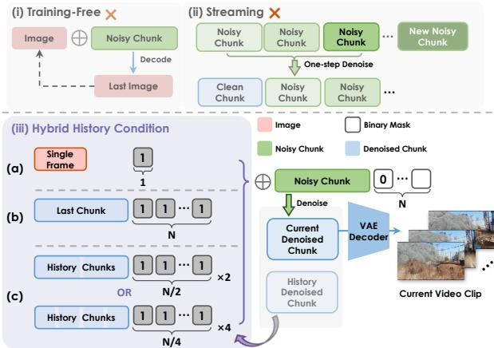

# 1. Bibliographic Information

## 1.1. Title
Hunyuan-GameCraft: High-dynamic Interactive Game Video Generation with Hybrid History Condition

The title clearly outlines the paper's focus: generating interactive videos specifically for high-action ("high-dynamic") game environments. It highlights the core technical contribution, a "Hybrid History Condition," which is used to control the generation process.

## 1.2. Authors
Jiaqi Li, Junshu Tang, Zhiyong Xu, Longhuang Wu, Yuan Zhou, Shuai Shao, Tianbao Yu, Zhiguo Cao, and Qinglin Lu.

The affiliations listed are Tencent Hunyuan and Huazhong University of Science and Technology. Tencent is a major player in both the gaming industry and large-scale AI research, which positions this work at the intersection of practical application (gaming) and cutting-edge generative AI development. The "Hunyuan" name connects this project to Tencent's broader family of large foundation models.

## 1.3. Journal/Conference
The paper is available on arXiv, which is a preprint server. This means it has not yet undergone a formal peer-review process for publication in a conference or journal. The submission date suggests it is intended for a future publication venue.

## 1.4. Publication Year
The metadata indicates a publication date of June 20, 2025. This is likely a placeholder or target date, as the paper was submitted as a preprint in 2024. For academic purposes, the initial release year on arXiv (2024) is the most relevant reference point.

## 1.5. Abstract
The abstract introduces a new framework named `Hunyuan-GameCraft` for generating high-dynamic, interactive game videos. It addresses key limitations in existing methods, such as poor dynamics, lack of generality, and insufficient long-term consistency and efficiency. The core contributions are:
1.  **Unified Action Space:** It converts standard keyboard and mouse inputs into a continuous camera representation space, allowing for fine-grained control over movement and view.
2.  **Hybrid History Conditioning:** It proposes a novel training strategy to extend video sequences autoregressively (one chunk after another) while maintaining scene consistency.
3.  **Model Distillation:** It uses distillation to accelerate the model's inference speed, making it suitable for real-time applications.
    The model was trained on a massive dataset of over one million gameplay clips from more than 100 AAA games and fine-tuned on a synthetic dataset for precision. The authors claim that `Hunyuan-GameCraft` significantly outperforms existing models in realism and playability.

## 1.6. Original Source Link
-   **Original Source Link:** [https://arxiv.org/abs/2506.17201](https://arxiv.org/abs/2506.17201)
-   **PDF Link:** [https://arxiv.org/pdf/2506.17201v1](https://arxiv.org/pdf/2506.17201v1)
-   **Publication Status:** Preprint on arXiv.

# 2. Executive Summary

## 2.1. Background & Motivation
The field of generative AI has made incredible strides in video synthesis, opening the door to creating immersive, interactive digital worlds, particularly for gaming. However, generating videos that a user can *play* in real-time presents a unique set of challenges that standard video generation models are not equipped to handle.

The core problem is that existing methods struggle with several key aspects crucial for a good gaming experience:
*   **High Dynamics:** They often fail to generate scenes with fast-paced action and complex motion, which are common in modern games.
*   **Long-Term Consistency:** As a user interacts with the world over time, models tend to "forget" the scene, leading to visual artifacts, changing environments, and a broken sense of immersion.
*   **Fine-Grained Control:** Control is often limited to simple text prompts or a few discrete actions, lacking the fluid, responsive control expected from keyboard and mouse inputs.
*   **Efficiency:** Generating high-quality video is computationally expensive, making real-time interaction (i.e., generating the next few seconds of gameplay before the player finishes watching the current ones) nearly impossible.

    This paper's entry point is to tackle these challenges head-on by designing a framework specifically for the demands of interactive game video generation. Their innovative idea is to combine a continuous representation of player actions with a novel training strategy that explicitly balances generating new content with remembering past scenes, and then to drastically speed up the whole process using model distillation.

## 2.2. Main Contributions / Findings
The paper presents four primary contributions that collectively build the `Hunyuan-GameCraft` framework:

1.  **A Novel Framework for Interactive Game Video Synthesis:** The paper proposes `Hunyuan-GameCraft`, a complete system designed to generate dynamic game scenes that users can interact with through customized action inputs.
2.  **Continuous Action Space Unification:** Instead of treating each key press (W, A, S, D) as a separate, discrete command, the authors unify keyboard and mouse inputs into a shared, continuous action space. This space represents motion in terms of direction and speed, allowing for more complex and fluid interactions like smoothly accelerating or making slight adjustments in viewing angle.
3.  **Hybrid History-Conditioned Training Strategy:** To solve the problem of long-term consistency, they introduce a training method where the model learns to generate the next video segment conditioned on a *mix* of different types of historical information (e.g., just the last frame, or a whole previous clip). This hybrid approach helps the model maintain spatial and temporal coherence over long sequences of actions without becoming unresponsive to new user commands.
4.  **Inference Acceleration via Model Distillation:** To make the system playable in real-time, they employ model distillation. This technique trains a smaller, faster "student" model to replicate the performance of the large, powerful "teacher" model, achieving a significant speedup in inference time and reducing latency to under 5 seconds per action.

# 3. Prerequisite Knowledge & Related Work

## 3.1. Foundational Concepts

### 3.1.1. Diffusion Models
Diffusion models are a class of generative models that have become state-of-the-art for generating high-quality images and videos. They work in two stages:
1.  **Forward Process (Noising):** This is a fixed process where Gaussian noise is gradually added to a real data sample (like an image) over a series of timesteps, until the data becomes pure, indistinguishable noise.
2.  **Reverse Process (Denoising):** This is the generative part. The model, typically a U-Net neural network, is trained to reverse the forward process. It takes a noisy input and a timestep, and predicts the noise that was added at that step. By repeatedly subtracting the predicted noise from a pure noise sample, the model can gradually "denoise" it into a clean, realistic data sample. To guide the generation, the model can be *conditioned* on additional information, such as text prompts or images.

### 3.1.2. Latent Diffusion Models (LDMs)
Running the diffusion process on high-resolution images or videos is extremely computationally expensive. Latent Diffusion Models (LDMs) solve this by working in a compressed **latent space**.
*   An **autoencoder** (specifically a Variational Autoencoder or VAE) is first trained. The **encoder** part compresses a high-resolution image into a much smaller latent representation. The **decoder** part reconstructs the original image from this latent representation.
*   The diffusion process is then applied to these small latent representations instead of the full-resolution images. This is much faster and requires less memory. Once the denoising process in the latent space is complete, the final latent is passed through the VAE decoder to produce the final high-resolution output. The `Hunyuan-GameCraft` model is built upon this principle.

### 3.1.3. Autoregressive Models
Autoregressive models generate data sequentially, where each new element is generated based on the elements that came before it. A classic example is a language model like GPT, which predicts the next word based on the preceding text. In video generation, this approach can be used to predict the next frame based on previous frames, or, as in this paper, to generate the next *chunk* of video based on the previous chunk.

### 3.1.4. Model Distillation
Model distillation is a technique for model compression. It involves a large, powerful but slow "teacher" model and a smaller, faster "student" model. The goal is to transfer the knowledge from the teacher to the student. This is typically done by training the student model to match the output distribution of the teacher model, rather than just training on the ground-truth labels. **Consistency Models**, mentioned in the paper, are an advanced form of distillation for diffusion models that enable generation in very few steps (sometimes just one) by learning to map any noisy input directly to the final clean output.

### 3.1.5. Plücker Embeddings
Plücker coordinates are a way to represent 3D lines (like a camera's line of sight or direction of movement) in a 6-dimensional space. This representation has useful geometric properties that can make it easier for a neural network to understand and manipulate camera poses and trajectories compared to other representations like Euler angles or quaternions.

## 3.2. Previous Works
The paper positions itself relative to several streams of research:

*   **Interactive World Models:** Works like `Genie 2` and `Matrix` aim to create interactive, explorable worlds from images or text. However, the paper notes they often struggle with high-fidelity dynamics or are limited to specific game environments (like `Minecraft` for `Oasis` and `GameFactory`). `Hunyuan-GameCraft` aims for higher dynamics and broader applicability by training on a diverse set of AAA games.
*   **Camera-Controlled Video Generation:** Models like `Motionctrl` and `CameraCtrl` focus on giving users explicit control over the camera's movement during video generation. These methods established the idea of injecting camera parameters into a video diffusion model. `Hunyuan-GameCraft` builds on this but adapts it for the specific input modality of gaming (keyboard/mouse) and integrates it with a long-video generation strategy.
*   **Long Video Extension:** Generating long, consistent videos is a major challenge. Previous methods like `StreamingT2V` use memory blocks, while others use next-frame prediction or training-free approaches. The paper argues these methods can lead to quality degradation or are incompatible with their base model. Their proposed `hybrid history condition` is presented as a more robust solution within a diffusion paradigm.

    The following table, adapted from Table 1 of the original paper, provides a comparison with related works.

    <table>
    <tr>
    <td></td>
    <td>GameNGen [26]</td>
    <td>GameGenX [5]</td>
    <td>Oasis [8]</td>
    <td>Matrix [10]</td>
    <td>Genie 2 [22]</td>
    <td>GameFactory [34]</td>
    <td>Matrix-Game [36]</td>
    <td>Hunyuan-GameCraft</td>
    </tr>
    <tr>
    <td>Game Sources</td>
    <td>DOOM</td>
    <td>AAA Games</td>
    <td>Minecraft</td>
    <td>AAA Games</td>
    <td>Unknown</td>
    <td>Minecraft</td>
    <td>Minecraft</td>
    <td>AAA Games</td>
    </tr>
    <tr>
    <td>Resolution</td>
    <td>240p</td>
    <td>720p</td>
    <td>640 × 360</td>
    <td>720p</td>
    <td>720p</td>
    <td>640 × 360</td>
    <td>720p</td>
    <td>720p</td>
    </tr>
    <tr>
    <td>Action Space</td>
    <td>Key</td>
    <td>Instruction</td>
    <td>Key + Mouse</td>
    <td>4 Keys</td>
    <td>Key+Mouse</td>
    <td>7 Keys+Mouse</td>
    <td>7 Keys+Mouse</td>
    <td>Continous</td>
    </tr>
    <tr>
    <td>Scene Generalizable</td>
    <td>X</td>
    <td>X</td>
    <td>X</td>
    <td>v</td>
    <td>v</td>
    <td>v</td>
    <td>v</td>
    <td>v</td>
    </tr>
    <tr>
    <td>Scene Dynamic</td>
    <td>v</td>
    <td>v</td>
    <td>X</td>
    <td>v</td>
    <td>X</td>
    <td>v</td>
    <td>X</td>
    <td>v</td>
    </tr>
    <tr>
    <td>Scene Memory</td>
    <td>X</td>
    <td>X</td>
    <td>X</td>
    <td>X</td>
    <td>X</td>
    <td>X</td>
    <td>v</td>
    <td>v</td>
    </tr>
    </table>

## 3.3. Technological Evolution
The field has evolved from generating short, non-interactive video clips to striving for fully interactive, long-form, and controllable "world models." Early works focused on unconditional video generation. Then came text-to-video models (e.g., Sora, Imagen Video), which added semantic control. The next frontier, where this paper sits, is **action-to-video**, where the model generates content in response to continuous user inputs, effectively acting as a generative game engine. This requires solving not just generation quality but also consistency, control, and real-time performance.

## 3.4. Differentiation Analysis
Compared to prior work, `Hunyuan-GameCraft` makes several key innovations:
*   **Action Representation:** While others use discrete keys (`Matrix-Game`) or text instructions (`GameGen-X`), this paper's **continuous action space** offers a more nuanced and expressive form of control that better mimics modern game controls.
*   **Consistency Method:** The **hybrid history condition** is a novel training strategy specifically designed to balance long-term consistency with moment-to-moment responsiveness, a trade-off that is central to interactive generation and not fully addressed by prior long-video techniques.
*   **Data and Scope:** By training on a massive dataset of over 100 different AAA games, the model aims for much broader generalization across various art styles and game genres compared to models trained on a single game like `Minecraft`.
*   **Performance:** The explicit focus on **model distillation for real-time inference** is a crucial practical step towards making these models genuinely "playable," an aspect often overlooked in pure research settings.

# 4. Methodology

## 4.1. Principles
The core idea behind `Hunyuan-GameCraft` is to treat interactive video generation as a sequence of autoregressive steps. At each step, the model generates a short video "chunk" that corresponds to a player's action, conditioned on both the action itself and the visual context from the preceding chunk. To make this work effectively, the methodology is broken down into three main parts: (1) representing player actions in a way the model can understand, (2) generating video that is consistent over time, and (3) making the generation process fast enough for interaction.

## 4.2. Core Methodology In-depth (Layer by Layer)

### 4.2.1. Continuous Action Space and Injection
To achieve fine-grained and intuitive control, the model first translates discrete user inputs (like pressing 'W' or moving the mouse left) into a continuous mathematical representation. This allows for smooth transitions and variable speeds, which are not possible with simple on/off key presses.

**Step 1: Defining the Continuous Action Space**
The action space $\mathcal{A}$ is defined to capture both translation (moving) and rotation (looking around), along with their respective speeds. The formula is:
$$
\mathcal { A } : = \left\{ \mathbf { a } = \left( \mathbf { d } _ { \mathrm { t r a n s } } , \mathbf { d } _ { \mathrm { r o t } } , \alpha , \beta \right) \ : \middle | \begin{array} { l l } { \mathbf { d } _ { \mathrm { t r a n s } } \in \mathbb { S } ^ { 2 } , \quad \mathbf { d } _ { \mathrm { r o t } } \in \mathbb { S } ^ { 2 } , } \\ { \alpha \in [ 0 , v _ { \mathrm { m a x } } ] , \quad \beta \in [ 0 , \omega _ { \mathrm { m a x } } ] \ : \middle ) . } \end{array} \right.
$$
**Symbol Explanation:**
*   $\mathbf{a}$: A single action command within the action space $\mathcal{A}$.
*   $\mathbf{d}_{\mathrm{trans}}$: A unit vector representing the **direction of translation** (e.g., forward, left, up). It belongs to $\mathbb{S}^2$, the surface of a unit sphere in 3D, meaning it only captures direction, not magnitude.
*   $\mathbf{d}_{\mathrm{rot}}$: A unit vector representing the **axis of rotation**.
*   $\alpha$: A scalar value representing the **speed of translation**, ranging from 0 to a maximum velocity $v_{\mathrm{max}}$.
*   $\beta$: A scalar value representing the **speed of rotation**, ranging from 0 to a maximum angular velocity $\omega_{\mathrm{max}}$.

    This formulation elegantly unifies diverse inputs into a single, comprehensive motion command. For example, pressing 'W' gently corresponds to a small $\alpha$ with $\mathbf{d}_{\mathrm{trans}}$ pointing forward, while moving the mouse quickly to the right corresponds to a large $\beta$ with $\mathbf{d}_{\mathrm{rot}}$ pointing upwards.

**Step 2: Encoding and Injecting the Action**
The action command $\mathbf{a}$ needs to be encoded into a format that the main video generation model (`MM-DiT`) can process.
1.  The action vector $\mathbf{a}$ is first converted into a sequence of camera trajectory parameters, potentially using representations like **Plücker embeddings**.
2.  These parameters are fed into a **lightweight action encoder**, which consists of a few convolutional and pooling layers. This encoder processes the trajectory information and outputs a set of "action tokens."
3.  These action tokens are then **injected** into the main `MM-DiT` backbone via a simple **token addition** strategy. This means the action tokens are added element-wise to the video latent tokens at the beginning of the generation process, effectively informing the model about the desired motion for the upcoming video chunk.

### 4.2.2. Hybrid History Conditioned Long Video Extension
To generate long, coherent videos, the model must remember what the scene looks like from the previous step. The paper proposes a novel "hybrid" training strategy to achieve this while remaining responsive to new actions.

The overall process is autoregressive, as illustrated in the figure below (adapted from Figure 5 in the paper). The model denoises a new `Noisy Chunk Latent` conditioned on a `History` component and the user's `Action`.

**Step 1: The Core Denoising Process**
At each step, the model takes a `head condition` (historical information) and an `action` to generate a new `chunk`.
*   The `head condition` is the latent representation of the previous video segment. It is kept **clean** (noise-free).
*   The new `chunk` starts as pure noise.
*   The model uses a binary mask (value 1 for the head region, 0 for the chunk region) to tell the `MM-DiT` which part is the clean condition and which part needs to be denoised.
*   The model then performs the diffusion denoising process on the noisy chunk, guided by the clean head condition and the action tokens. The output is a clean latent for the new video chunk.

**Step 2: The "Hybrid" Training Strategy**
The key innovation is what constitutes the `head condition` during training. Instead of always using the same type of history, the model is trained on a mixture of three different conditions to make it robust and versatile:
1.  **Single Frame Condition (Image-to-Video):** The history is just the latent of the very last frame of the previous clip. This forces the model to be highly responsive to new actions, as the historical context is minimal.
2.  **Single Clip Condition:** The history is the latent of the entire previous video chunk. This provides strong historical context, promoting high temporal consistency and visual quality. However, it can make the model "sluggish" in responding to actions that drastically change the motion.
3.  **Multiple Clip Condition:** The history consists of several previous chunks. This provides even richer context for very long-term consistency.

    During training, these three conditions are sampled with a specific ratio (e.g., 70% single clip, 25% single frame, 5% multiple clips). This hybrid approach trains a single model that can both generate a video from a static image (using the single frame mode) and extend an existing video consistently (using the clip modes), while balancing the trade-off between consistency and control. The figure below (from Figure 6) demonstrates how this hybrid approach (c) avoids the quality collapse of training-free methods (a) and the control degradation of a pure clip-conditioned model (b).

    
    *该图像是图表，展示了不同视频扩展方案的效果分析。第一行 (a) 为训练无关方案，导致明显的质量崩溃；第二行 (b) 为历史剪辑条件，出现控制降级；第三行 (c) 为混合历史条件，显示出准确的动作控制和历史保存（见红框）。W、A、S分别表示向前、向左和向后移动。*

### 4.2.3. Accelerated Generative Interaction
The final piece of the methodology is making the model fast enough for real-time interaction. A standard diffusion model can take minutes to generate a few seconds of video, which is unacceptable for gaming.

**Step 1: Adopting a Consistency Model Framework**
The authors use the **Phased Consistency Model (PCM)**, a state-of-the-art technique for accelerating diffusion models. Consistency models are trained to map any point on the noising trajectory directly to the clean data point. This allows them to skip most of the iterative denoising steps and generate an output in as few as 1-8 steps, offering a massive speedup.

**Step 2: Classifier-Free Guidance Distillation**
A common technique to improve generation quality is **Classifier-Free Guidance (CFG)**, where the model's output is pushed away from an unconditional generation and towards a conditional one. However, this requires running the model twice at each step (once with the condition, once without), doubling the compute cost.

To avoid this, the authors use **CFG Distillation**. The smaller "student" model is trained to directly predict the *guided* output of the larger "teacher" model. The objective is to minimize the difference between the student's output and the teacher's guided output. The loss function is:
$$
L _ { c f g } = \mathbb { E } _ { w \sim p _ { w } , t \sim U [ 0 , 1 ] } [ | | \hat { u _ { \theta } } ( z _ { t } , t , w , T _ { s } ) - u _ { \theta } ^ { s } ( z _ { t } , t , w , T _ { s } ) | | _ { 2 } ^ { 2 } ]
$$
where the teacher's guided output $\hat{u}_{\theta}$ is calculated as:
$$
\hat { u _ { \theta } } ( z _ { t } , t , w , T _ { s } ) = ( 1 + w ) u _ { \theta } ( z _ { t } , t , T _ { s } ) - w u _ { \theta } ( z _ { t } , t , \emptyset)
$$
*(Note: The second formula in the paper has a typo. The standard CFG formula is shown here for clarity, where the second term is the unconditional prediction, denoted by an empty condition $\emptyset$.)*

**Symbol Explanation:**
*   $L_{cfg}$: The distillation loss function.
*   $u_{\theta}^s$: The output of the student model.
*   $\hat{u}_{\theta}$: The guided output from the teacher model, which the student tries to mimic.
*   $z_t$: The noisy latent input at timestep $t$.
*   $w$: The guidance scale, controlling the strength of the conditioning.
*   $T_s$: The condition (e.g., text prompt, action).
*   $u_{\theta}(z_t, t, T_s)$: The teacher model's prediction *with* the condition.
*   $u_{\theta}(z_t, t, \emptyset)$: The teacher model's prediction *without* the condition (unconditional).

    By training the student with this objective, it learns to produce high-quality, guided outputs in a single forward pass, achieving up to a **20x speedup** and enabling near real-time frame rates.

# 5. Experimental Setup

## 5.1. Datasets
The model's performance relies on a large and diverse dataset curated through a multi-stage pipeline.

*   **Game Scene Data (Live Data):**
    *   **Source:** Over 1 million 6-second clips extracted from gameplay recordings of more than 100 AAA games, including titles like *Assassin's Creed*, *Red Dead Redemption*, and *Cyberpunk 2077*.
    *   **Processing Pipeline:**
        1.  **Data Partition:** Long gameplay videos are segmented into coherent scenes using `PySceneDetect`, and then further partitioned at action boundaries using `RAFT` optical flow to ensure clips align with specific actions.
        2.  **Data Filtering:** Low-quality, dark, or static clips are removed using a combination of quality assessment models, luminance filtering, and VLM-based gradient detection.
        3.  **Interaction Annotation:** The 6-DoF (Degrees of Freedom) camera trajectories for each clip are reconstructed using `Monst3R`, providing the ground-truth motion data needed for training.
        4.  **Structured Captioning:** Game-specific Vision-Language Models (VLMs) are used to generate both short and long text descriptions for each clip.
*   **Synthetic Data:**
    *   **Source:** ~3,000 high-quality motion sequences rendered from curated 3D assets.
    *   **Characteristics:** These sequences feature diverse and precisely controlled camera trajectories (translations, rotations) at various speeds.
    *   **Purpose:** This high-precision data is used to fine-tune the model, improving its motion prediction accuracy and teaching it essential geometric priors that might be noisy or less common in real gameplay footage.
*   **Distribution Balancing:** The authors noted that real gameplay data is heavily biased towards forward motion. To counteract this, they used **stratified sampling** to ensure balanced directional representation and **temporal inversion augmentation** (playing clips backward) to increase the amount of backward motion data.

## 5.2. Evaluation Metrics
The paper uses a comprehensive set of metrics to evaluate different aspects of the generated videos.

*   **Fréchet Video Distance (FVD):**
    *   **Conceptual Definition:** FVD measures the quality and realism of generated videos. It evaluates how similar the distribution of generated videos is to the distribution of real videos. A lower FVD score indicates that the generated videos are more realistic and visually similar to real ones. It assesses both per-frame image quality and temporal consistency.
    *   **Mathematical Formula (based on Fréchet Inception Distance):**
        \$
        FVD(r, g) = ||\mu_r - \mu_g||^2 + \text{Tr}(\Sigma_r + \Sigma_g - 2(\Sigma_r\Sigma_g)^{1/2})
        \$
    *   **Symbol Explanation:**
        *   $r$ and $g$ refer to the sets of real and generated videos.
        *   $\mu_r$ and $\mu_g$ are the mean vectors of features extracted from real and generated videos by a pre-trained deep neural network (e.g., I3D).
        *   $\Sigma_r$ and $\Sigma_g$ are the covariance matrices of those features.
        *   $\text{Tr}$ denotes the trace of a matrix.

*   **Relative Pose Error (RPE):**
    *   **Conceptual Definition:** RPE measures the accuracy of the generated camera motion compared to the ground-truth trajectory. It is calculated for both translation (`RPE trans`) and rotation (`RPE rot`). A lower RPE means the generated camera movement more accurately follows the user's input command.
    *   The calculation involves aligning the predicted trajectory with the ground truth and then computing the error between them over time.

*   **Image Quality and Aesthetic Scores:**
    *   **Conceptual Definition:** These metrics use pre-trained models to predict human ratings of visual quality and aesthetic appeal for individual frames. Higher scores are better.

*   **Temporal Consistency:**
    *   **Conceptual Definition:** This metric measures the frame-to-frame smoothness and visual coherence of the generated video. It is often calculated as the average cosine similarity between the feature embeddings of adjacent frames. A higher score indicates a smoother, more consistent video.

*   **Dynamic Average:**
    *   **Conceptual Definition:** This metric quantifies the amount of motion or "dynamism" in a video. The authors adapt a metric from VBench by directly reporting the average magnitude of **optical flow** vectors between consecutive frames. Optical flow is a measure of the apparent motion of objects between two frames. A higher `Dynamic Average` score indicates more significant motion in the generated video.

## 5.3. Baselines
The proposed method is compared against four representative models:
*   **`Matrix-Game`:** The primary competitor, another state-of-the-art model for interactive game video generation.
*   **`CameraCtrl`:** A well-known model for camera-controlled video generation, used here to assess general camera control capabilities.
*   **`MotionCtrl`:** Another strong baseline for controlling camera and object motion in video generation.
*   **`WanX-Cam`:** A large-scale video generation model with camera control features.

    These baselines provide a robust comparison, covering both direct competitors in the game-generation niche and leading models in the broader field of controllable video synthesis.

# 6. Results & Analysis

## 6.1. Core Results Analysis
The main quantitative results are presented in Table 2, which compares `Hunyuan-GameCraft` with the baselines.

The following are the results from Table 2 of the original paper:

<table>
<thead>
<tr>
<th rowspan="2">Model</th>
<th colspan="4">Visual Quality</th>
<th rowspan="2">Temporal Consistency↑</th>
<th colspan="2">RPE</th>
<th rowspan="2">Infer Speed↑ (FPS)</th>
</tr>
<tr>
<th>FVD↓</th>
<th>Image Quality↑</th>
<th>Dynamic Average↑</th>
<th>Aesthetic↑</th>
<th>Trans↓</th>
<th>Rot↓</th>
</tr>
</thead>
<tbody>
<tr>
<td>CameraCtrl</td>
<td>1580.9</td>
<td>0.66</td>
<td>7.2</td>
<td>0.64</td>
<td>0.92</td>
<td>0.13</td>
<td>0.25</td>
<td>1.75</td>
</tr>
<tr>
<td>MotionCtrl</td>
<td>1902.0</td>
<td>0.68</td>
<td>7.8</td>
<td>0.48</td>
<td>0.94</td>
<td>0.17</td>
<td>0.32</td>
<td>0.67</td>
</tr>
<tr>
<td>WanX-Cam</td>
<td>1677.6</td>
<td>0.70</td>
<td>17.8</td>
<td>0.67</td>
<td>0.92</td>
<td>0.16</td>
<td>0.36</td>
<td>0.13</td>
</tr>
<tr>
<td>Matrix-Game</td>
<td>2260.7</td>
<td>0.72</td>
<td>31.7</td>
<td>0.65</td>
<td>0.94</td>
<td>0.18</td>
<td>0.35</td>
<td>0.06</td>
</tr>
<tr>
<td><b>Ours</b></td>
<td><b>1554.2</b></td>
<td>0.69</td>
<td><b>67.2</b></td>
<td>0.67</td>
<td><b>0.95</b></td>
<td><b>0.08</b></td>
<td><b>0.20</b></td>
<td>0.25</td>
</tr>
<tr>
<td><b>Ours + PCM</b></td>
<td>1883.3</td>
<td>0.67</td>
<td>43.8</td>
<td>0.65</td>
<td>0.93</td>
<td><b>0.08</b></td>
<td><b>0.20</b></td>
<td><b>6.6</b></td>
</tr>
</tbody>
</table>

**Analysis:**
*   **Superior Performance:** `Hunyuan-GameCraft` (the "Ours" row) outperforms all baselines across most key metrics. It achieves the lowest (best) `FVD`, indicating the highest video realism. It also has the lowest (best) `RPE` for both translation and rotation, demonstrating superior control accuracy.
*   **High Dynamics:** The most striking result is the `Dynamic Average` score. At 67.2, it is more than double that of its closest competitor, `Matrix-Game` (31.7), proving its ability to generate high-motion scenes.
*   **Real-Time Capability:** The "Ours + PCM" row shows the performance of the distilled, accelerated model. There is a predictable trade-off: `FVD` increases and `Dynamic Average` decreases, indicating a slight drop in visual quality and motion. However, control accuracy (`RPE`) remains identical, and the inference speed skyrockets to **6.6 FPS**. This is a massive leap from the 0.06-0.25 FPS of other high-quality models, making it genuinely suitable for interactive use.
*   **Qualitative Superiority:** The qualitative comparisons in Figure 7 visually support the quantitative data, showing that `Hunyuan-GameCraft` produces more coherent and action-responsive videos than `Matrix-Game`, even in `Matrix-Game`'s native `Minecraft` environment.

## 6.2. User Study
To account for the subjective nature of video quality and playability, a user study was conducted.

The following are the results from Table 3 of the original paper:

| Method | Video Quality↑ | Temporal Consistency↑ | Motion Smoothness↑ | Action Accuracy↑ | Dynamic↑ |
| :--- | :--- | :--- | :--- | :--- | :--- |
| CameraCtrl | 2.20 | 2.40 | 2.16 | 2.87 | 2.57 |
| MotionCtrl | 3.23 | 3.20 | 3.21 | 3.09 | 3.22 |
| WanX-Cam | 2.42 | 2.53 | 2.44 | 2.81 | 2.46 |
| Matrix-Game | 2.72 | 2.43 | 2.75 | 1.63 | 2.21 |
| **Ours** | **4.42** | **4.44** | **4.53** | **4.61** | **4.54** |

**Analysis:**
The user study results are overwhelmingly in favor of `Hunyuan-GameCraft`. It received the highest average ranking (on a scale of 1 to 5) across all five criteria by a significant margin. This confirms that the improvements measured by the quantitative metrics translate into a tangibly better experience for human users.

## 6.3. Ablation Studies / Parameter Analysis
The authors conducted ablation studies to validate the effectiveness of each proposed component.

The following are the results from Table 4 of the original paper:

<table>
<tr>
<td colspan="5"></td>
<td>FVD↓</td>
<td>DA↑</td>
<td>Aesthetic↑</td>
<td>RPE trans↓</td>
<td>RPE rot↓</td>
</tr>
<tr>
<td colspan="5">(a) Only Synthetic Data</td>
<td>2550.7</td>
<td>34.6</td>
<td>0.56</td>
<td>0.07</td>
<td>0.17</td>
</tr>
<tr>
<td colspan="5">(b) Only Live Data</td>
<td>1937.7</td>
<td>77.2</td>
<td>0.60</td>
<td>0.16</td>
<td>0.27</td>
</tr>
<tr>
<td colspan="5">(c) Token Concat.</td>
<td>2236.4</td>
<td>59.7</td>
<td>0.54</td>
<td>0.13</td>
<td>0.29</td>
</tr>
<tr>
<td colspan="5">(d) Channel-wise Concat.</td>
<td>1725.5</td>
<td>63.2</td>
<td>0.49</td>
<td>0.11</td>
<td>0.25</td>
</tr>
<tr>
<td colspan="5">(e) Image Condition</td>
<td>1655.3</td>
<td>47.6</td>
<td>0.58</td>
<td>0.07</td>
<td>0.22</td>
</tr>
<tr>
<td colspan="5">(f) Clip Condition</td>
<td>1743.5</td>
<td>55.3</td>
<td>0.57</td>
<td>0.16</td>
<td>0.30</td>
</tr>
<tr>
<td colspan="5">(g) Ours (Render:Live=1:5)</td>
<td><b>1554.2</b></td>
<td><b>67.2</b></td>
<td><b>0.67</b></td>
<td><b>0.08</b></td>
<td><b>0.20</b></td>
</tr>
</table>

**Analysis:**
*   **Data Distribution:** Comparing (a), (b), and (g) shows the value of the hybrid dataset. Training only on synthetic data (a) yields excellent control (`RPE` is lowest) but poor video quality (`FVD` is high) and dynamics (`DA` is low). Training only on live game data (b) produces great dynamics but worse control. The final mix (g) achieves the best balance, outperforming both specialized models overall.
*   **Action Control Injection:** Comparing (c), (d), and (g) validates the choice of `Token Addition`. It outperforms both `Token Concatenation` and `Channel-wise Concatenation`, particularly in video quality (`FVD`) and control accuracy (`RPE`).
*   **Hybrid History Conditioning:** This is the most crucial ablation. Comparing (e), (f), and (g) highlights the consistency-control trade-off. Using only an `Image Condition` (e) gives great control (low `RPE trans`) but mediocre quality. Using only a `Clip Condition` (f) degrades control accuracy significantly. The proposed hybrid approach (g) successfully balances these competing objectives, achieving the best overall `FVD` and a strong combination of control and consistency.

# 7. Conclusion & Reflections

## 7.1. Conclusion Summary
The paper successfully introduces `Hunyuan-GameCraft`, a robust framework for generating high-dynamic, interactive game videos. By unifying user inputs into a continuous action space, the model achieves fine-grained control. The core innovation, a `hybrid history-conditioned` training strategy, effectively solves the critical trade-off between long-term temporal consistency and immediate responsiveness to user actions. Finally, the integration of model distillation makes the system practical for real-time deployment by dramatically accelerating inference speed. Extensive experiments show that `Hunyuan-GameCraft` significantly surpasses existing methods in video realism, control accuracy, and dynamic motion, establishing a new state-of-the-art and paving the way for truly playable generative game experiences.

## 7.2. Limitations & Future Work
The authors acknowledge a key limitation: the current action space is primarily focused on **exploration and navigation** (moving and looking around). It lacks more complex, game-specific interactions such as shooting, using items, throwing objects, or triggering events like explosions.

For future work, they plan to expand the dataset to include these more diverse gameplay elements. Building on the strong foundation of controllability and history preservation established in this work, the ultimate goal is to develop a next-generation model capable of simulating more physical and strategically complex game interactions.

## 7.3. Personal Insights & Critique
This paper represents a significant and practical step forward in the quest for "generative games."

**Strengths and Inspirations:**
*   **Problem-Oriented Engineering:** The entire methodology is thoughtfully engineered to solve the specific problems of interactive gaming. The hybrid history condition is a clever solution to a non-trivial trade-off, and the focus on real-time performance via distillation shows a clear understanding of the application's requirements.
*   **Data as a Moat:** The scale and quality of the curated dataset (1M+ clips from 100+ AAA games) is a massive undertaking and a key driver of the model's high performance and generalization ability. This highlights the increasing importance of large-scale, high-quality data in generative AI.
*   **Transferable Techniques:** The core ideas, particularly the hybrid conditioning for balancing history and control, could be highly valuable in other domains requiring interactive generation, such as robotics simulation, virtual reality environments, or interactive storytelling.

**Potential Issues and Areas for Improvement:**
*   **Dependency on Trajectory Extraction:** The model's control accuracy is fundamentally dependent on the quality of the 6-DoF camera trajectories extracted by the `Monst3R` tool. Any errors or noise in this annotation process would directly limit the model's performance, yet the impact of this dependency is not analyzed.
*   **Creativity vs. Mimicry:** While the model can generate new scenes in the *style* of existing games, it's unclear if it can generate truly novel game mechanics, physics, or environmental logic. It is currently more of a "world explorer" than a "world creator." The next major leap will be to imbue these models with a deeper understanding of cause-and-effect and object interaction.
*   **Scalability of Action Space:** The current continuous action space is elegant for motion. However, scaling it to include dozens of discrete actions (shoot, jump, reload, open door) presents a significant challenge. Future work will need to find a way to represent a much more complex and hybrid (continuous + discrete) action space without causing a combinatorial explosion in training complexity.

    Overall, `Hunyuan-GameCraft` is a strong piece of research that pushes the boundaries of what is possible with interactive video generation, bringing the dream of playing inside an AI-generated world one step closer to reality.