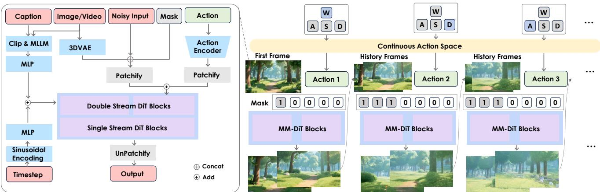
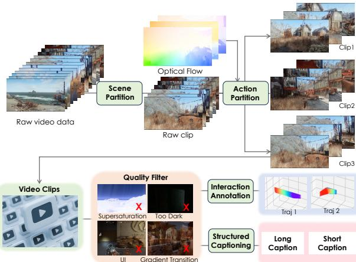
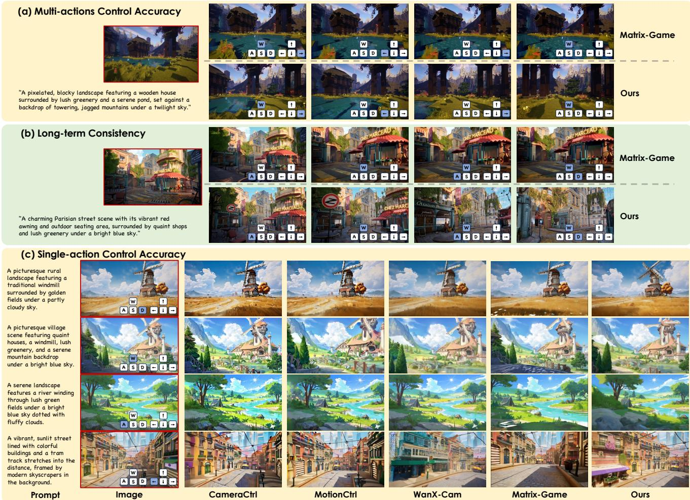

# 1. 论文基本信息

## 1.1. 标题
Hunyuan-GameCraft: High-dynamic Interactive Game Video Generation with Hybrid History Condition (混元-游戏世界生成器：基于混合历史条件的高动态交互式游戏视频生成)

论文标题直接点明了研究的核心：一个名为 `Hunyuan-GameCraft` 的框架，专注于生成**高动态**、**可交互**的**游戏视频**。其中，`Hybrid History Condition`（混合历史条件）是实现这一目标的关键技术之一。

## 1.2. 作者
Jiaqi Li, Junshu Tang, Zhiyong Xu, Longhuang Wu, Yuan Zhou, Shuai Shao, Tianbao Yu, Zhiguo Cao, Qinglin Lu。

作者团队主要来自腾讯混元 (Tencent Hunyuan) 和华中科技大学 (Huazhong University of Science and Technology)。腾讯混元是腾讯公司专注于大模型研发的团队，这表明该研究具有强大的工业背景和资源支持，旨在解决实际应用中的问题。

## 1.3. 发表期刊/会议
该论文目前作为预印本 (preprint) 发布在 arXiv 上。arXiv 是一个开放获取的学术论文存档网站，允许研究人员在同行评审之前分享他们的研究成果。论文中提到了提交至 `ICLR 2025` (International Conference on Learning Representations)，这是机器学习领域的顶级会议之一，具有极高的学术声誉和影响力。

## 1.4. 发表年份
预印本于 2024 年 12 月首次提交，论文中提及的发表时间为 2025 年 6 月 20 日（UTC）。

## 1.5. 摘要
论文摘要概括了研究的核心内容。首先，它指出现有的视频生成方法在**动态性、泛化性、长期一致性和效率**方面存在局限，无法满足多样化游戏视频生成的需求。为了解决这些问题，论文提出了 `Hunyuan-GameCraft` 框架，其核心创新点包括：
1.  **统一的动作空间：** 将键盘和鼠标输入统一到一个共享的相机表征空间，以实现精细化的动作控制。
2.  **混合历史条件训练策略：** 在自回归生成视频序列的同时，有效保留游戏场景信息，确保长期一致性。
3.  **模型蒸馏：** 通过模型蒸馏技术加速推理过程，降低计算开销，使其适用于实时交互环境。
4.  **大规模数据集：** 模型在一个包含超过 100 款 3A 游戏、百万级游戏录像的大规模数据集上进行训练，并通过一个精细标注的合成数据集进行微调。

    实验结果表明，`Hunyuan-GameCraft` 在交互式游戏视频生成的**真实感**和**可玩性**方面显著优于现有模型。

## 1.6. 原文链接
*   **原文链接:** [https://arxiv.org/abs/2506.17201](https://arxiv.org/abs/2506.17201)
*   **PDF 链接:** [https://arxiv.org/pdf/2506.17201v1.pdf](https://arxiv.org/pdf/2506.17201v1.pdf)
*   **发布状态:** 预印本 (Preprint)。

# 2. 整体概括

## 2.1. 研究背景与动机
随着生成式人工智能的飞速发展，视频生成技术取得了显著进步。然而，将这项技术应用于创建**可玩的、沉浸式的游戏体验**仍然面临巨大挑战。当前主流的视频生成模型虽然能生成高质量的视频片段，但在以下几个关键方面存在明显不足（Gap）：

1.  <strong>动态性不足 (Lack of Dynamics):</strong> 许多模型生成的视频内容相对静态，难以捕捉 3A 游戏中常见的快速移动、视角切换等高动态场景。
2.  <strong>泛化性受限 (Limited Generality):</strong> 一些模型仅在特定游戏（如《我的世界》）或场景中表现良好，缺乏对多样化游戏风格和环境的泛化能力。
3.  <strong>长期一致性差 (Poor Long-term Consistency):</strong> 在连续的用户交互下，模型生成的长视频容易出现场景漂移、物体消失或画质下降等问题，破坏了沉浸感。
4.  <strong>效率低下 (Low Efficiency):</strong> 扩散模型的生成过程通常需要多步去噪，计算成本高，推理速度慢，难以满足游戏场景所要求的**实时交互**。

    `Hunyuan-GameCraft` 的研究动机正是为了填补这些空白。它旨在创建一个能够生成**高动态、长时序、风格多样且能实时响应玩家操作**的交互式游戏视频的统一框架，从而向“生成式游戏”的终极目标迈出重要一步。

## 2.2. 核心贡献/主要发现
本文的核心贡献可以总结为以下四点：

1.  **提出 `Hunyuan-GameCraft` 框架：** 这是一个专为高动态交互式游戏视频生成而设计的全新框架。它以一个强大的文生视频基础模型为底座，通过创新的设计实现了对游戏场景的精准控制和高质量生成。

2.  **创新的连续动作空间表示：** 论文没有将玩家的键盘（W/A/S/D）和鼠标（视角转动）操作作为离散的、孤立的信号处理，而是将它们统一映射到一个**连续的共享动作空间**中。这种设计不仅能表示简单的移动，还能表示移动速度、转向角度等更复杂、更精细的组合操作，极大地增强了交互的灵活性和真实感。

3.  **新颖的混合历史条件训练策略：** 为了解决长视频生成中的一致性问题，论文提出了一种<strong>混合历史条件 (Hybrid History Condition)</strong> 训练方法。该方法在自回归生成新视频片段时，巧妙地混合了不同长度的历史信息（如单帧图像、前一小段视频）作为条件，成功地在**保持历史场景信息**和**响应新动作指令**之间取得了平衡，显著提升了长视频的连贯性。

4.  **实现实时交互的推理加速：** 认识到交互体验对推理速度的苛刻要求，论文引入了<strong>模型蒸馏 (Model Distillation)</strong> 技术，将庞大的扩散模型压缩成一个轻量级的一致性模型 (Consistency Model)。这使得推理速度提升了 10-20 倍，将每次操作的延迟降低到 5 秒以内，为实现真正的**实时可玩性**奠定了基础。

# 3. 预备知识与相关工作

## 3.1. 基础概念
### 3.1.1. 扩散模型 (Diffusion Models)
扩散模型是一类强大的生成模型，近年来在图像和视频生成领域取得了突破性进展。其核心思想分为两个过程：
*   <strong>前向过程（加噪）：</strong> 从一张真实的图像或视频帧开始，逐步、多次地向其添加少量高斯噪声，直到它完全变成一个纯粹的噪声分布。这个过程是固定的，不需要学习。
*   <strong>反向过程（去噪）：</strong> 模型的核心任务是学习如何逆转这个加噪过程。它接收一个充满噪声的输入，并预测出每一步应该去除的噪声。通过迭代地执行这个去噪步骤，模型可以从一个随机噪声输入出发，最终生成一张清晰、真实的图像或视频。
    `Hunyuan-GameCraft` 正是基于扩散模型的范式来生成视频帧。

### 3.1.2. 潜在扩散模型 (Latent Diffusion Models, LDM)
直接在像素空间上运行扩散模型计算成本极高，尤其对于高分辨率视频。潜在扩散模型的思想是先使用一个<strong>变分自编码器 (Variational Autoencoder, VAE)</strong> 将高维的像素数据压缩到一个低维的<strong>潜在空间 (latent space)</strong> 中。扩散模型的加噪和去噪过程都在这个更小、更紧凑的潜在空间中进行。生成完成后，再用 VAE 的解码器将潜在表示恢复成像素级的视频。这样做可以极大地降低计算复杂度，提高效率。本文的基座模型 `HunyuanVideo` 就是一个潜在扩散模型。

### 3.1.3. 自回归生成 (Autoregressive Generation)
自回归是一种序列生成模式，常用于语言模型（如 GPT）和时间序列数据。其核心思想是“逐个生成”，即下一个元素的生成依赖于之前已经生成的所有元素。在视频生成的语境下，这意味着生成下一段视频 `chunk` 时，需要将前面已经生成的视频片段作为**条件**或**历史信息**输入给模型。这有助于保持视频内容的时间连贯性。

### 3.1.4. 模型蒸馏 (Model Distillation)
模型蒸馏是一种模型压缩技术，旨在将一个大型、复杂的“教师模型”的知识迁移到一个小型、高效的“学生模型”中。其基本流程是：用教师模型的输出作为监督信号来训练学生模型。学生模型的目标是学习模仿教师模型的行为，从而在参数量和计算量远小于教师模型的情况下，达到接近其性能的水平。在本文中，作者使用这种技术将需要多步推理的扩散模型蒸馏成一个仅需几步就能完成生成的一致性模型，从而实现推理加速。

## 3.2. 前人工作
论文将相关工作分为三类，并进行了比较，如下方的原文 `Table 1` 所示。

<table>
<tr>
<td></td>
<td>GameNGen [26]</td>
<td>GameGenX [5]</td>
<td>Oasis [8]</td>
<td>Matrix [10]</td>
<td>Genie 2 [22]</td>
<td>GameFactory [34]</td>
<td>Matrix-Game [36]</td>
<td>Hunyuan-GameCraft</td>
</tr>
<tr>
<td>Game Sources</td>
<td>DOOM</td>
<td>AAA Games</td>
<td>Minecraft</td>
<td>AAA Games</td>
<td>Unknown</td>
<td>Minecraft</td>
<td>Minecraft</td>
<td>AAA Games</td>
</tr>
<tr>
<td>Resolution</td>
<td>240p</td>
<td>720p</td>
<td>640 × 360</td>
<td>720p</td>
<td>720p</td>
<td>640 × 360</td>
<td>720p</td>
<td>720p</td>
</tr>
<tr>
<td>Action Space</td>
<td>Key</td>
<td>Instruction</td>
<td>Key + Mouse</td>
<td>4 Keys</td>
<td>Key+Mouse</td>
<td>7 Keys+Mouse</td>
<td>7 Keys+Mouse</td>
<td>Continous</td>
</tr>
<tr>
<td>Scene Generalizable</td>
<td>X</td>
<td>X</td>
<td>X</td>
<td>v</td>
<td>v</td>
<td>v</td>
<td>v</td>
<td>v</td>
</tr>
<tr>
<td>Scene Dynamic</td>
<td>v</td>
<td>v</td>
<td>X</td>
<td>v</td>
<td>X</td>
<td>v</td>
<td>X</td>
<td>v</td>
</tr>
<tr>
<td>Scene Memory</td>
<td>X</td>
<td>X</td>
<td>X</td>
<td>X</td>
<td>X</td>
<td>X</td>
<td>v</td>
<td>v</td>
</tr>
</table>

### 3.2.1. 交互式游戏场景世界模型 (Interactive Game Scene World Model)
这类工作致力于构建能够理解和预测游戏世界动态的模型。
*   **Genie 2:** 由 Google DeepMind 开发，是一个大规模的基础世界模型，可以从单张图片生成可交互的 2D 平台游戏世界。
*   **Matrix / Matrix-Game:** 探索了在 3A 游戏数据上进行流式生成，以实现无限长度的内容生成。
*   **GameGen-X:** 一个基于 Transformer 的扩散模型，用于生成开放世界游戏视频。

### 3.2.2. 相机控制的视频生成 (Camera-Controlled Video Generation)
这类工作专注于让用户能够精确控制生成视频中的相机运动。
*   **MotionCtrl:** 设计了一个统一的运动控制器，可以独立控制相机和物体的运动轨迹。
*   **CameraCtrl / CameraCtrl II:** 使用<strong>普吕克嵌入 (Plücker embedding)</strong> 来表示相机参数，并通过一个轻量级的注入模块实现对预训练视频模型的相机控制。

### 3.2.3. 长视频扩展 (Long Video Extension)
这类工作研究如何生成时间上更长且保持一致性的视频。
*   **StreamingT2V:** 引入了短期和长期记忆模块，以流式生成的方式扩展视频长度。
*   **Diffusion Forcing:** 结合了“预测下一帧”和“全序列扩散”的范式，以增强长视频的连贯性。

## 3.3. 差异化分析
相较于上述工作，`Hunyuan-GameCraft` 的核心创新与差异在于：
*   **更通用的动作空间：** 与 `Matrix-Game` 等仅支持离散按键的模型不同，`Hunyuan-GameCraft` 的**连续动作空间**可以表示更平滑、更复杂的组合操作（如加速前进的同时缓慢右转），更接近真实的游戏体验。
*   **更鲁棒的长期一致性方案：** 相较于流式生成或简单的最后一帧条件，`Hunyuan-GameCraft` 提出的**混合历史条件训练**是一种更灵活、更有效的策略，它在训练阶段就让模型学会了如何平衡历史信息和当前指令，从而在推理时表现更佳。
*   **对实时性的高度关注：** 大多数学术研究集中于提升生成质量，而 `Hunyuan-GameCraft` 通过**模型蒸馏**将实时交互性作为一个核心优化目标，这使其更具实际应用潜力。
*   **数据规模与多样性：** 依托于超过 100 款 3A 游戏构建的数据集，`Hunyuan-GameCraft` 在场景多样性和视觉保真度上具有天然优势，泛化能力更强。

# 4. 方法论
`Hunyuan-GameCraft` 的整体框架基于一个预训练的文生视频模型 `HunyuanVideo`，其核心网络结构为 `MM-DiT` (Multi-modal Diffusion Transformer)。在此基础上，作者设计了三大核心模块来实现高动态、可交互的游戏视频生成：**连续动作空间与注入**、**混合历史条件长视频扩展**以及**加速生成交互**。

下图（原文 Figure 4）展示了模型的整体框架。

*该图像是示意图，展示了Hunyuan-GameCraft框架的整体结构与流程。左侧部分介绍了通过多层感知机（MLP）、3D变分自编码器（3D-VAE）和双流/单流DIt块实现的输入处理。而右侧则显示了连续动作空间的生成过程，其中包含历史帧和动作编码的示例，表明系统如何利用动作控制和历史信息生成高动态交互视频。*

## 4.1. 连续动作空间和注入 (Continuous Action Space and Injection)
为了实现对游戏画面的精细化控制，模型首先需要一种能有效表示玩家操作的方式。

### 4.1.1. 动作空间的定义
作者没有使用离散的按键信号，而是定义了一个连续的动作子空间 $\mathcal{A}$，它是相机参数 $\mathcal{C}$ 的一部分。这个空间的定义如下：
$$
\mathcal { A } : = \left\{ \mathbf { a } = \left( \mathbf { d } _ { \mathrm { t r a n s } } , \mathbf { d } _ { \mathrm { r o t } } , \alpha , \beta \right) \ : \middle | \begin{array} { l l } { \mathbf { d } _ { \mathrm { t r a n s } } \in \mathbb { S } ^ { 2 } , \quad \mathbf { d } _ { \mathrm { r o t } } \in \mathbb { S } ^ { 2 } , } \\ { \alpha \in [ 0 , v _ { \mathrm { m a x } } ] , \quad \beta \in [ 0 , \omega _ { \mathrm { m a x } } ] \ : \middle ) . } \end{array} \right.
$$
**公式符号解释:**
*   $\mathbf{a}$: 表示一个具体的动作。
*   $\mathbf{d}_{\mathrm{trans}}$: 一个单位向量，定义了相机<strong>平移 (translation)</strong> 的方向。它位于一个二维球面空间 $\mathbb{S}^2$ 上，可以表示三维空间中的任意方向。
*   $\mathbf{d}_{\mathrm{rot}}$: 一个单位向量，定义了相机<strong>旋转 (rotation)</strong> 的方向，同样位于 $\mathbb{S}^2$ 空间。
*   $\alpha$: 一个标量，表示相机平移的<strong>速度 (speed)</strong>，其值介于 0 和最大速度 $v_{\mathrm{max}}$ 之间。
*   $\beta$: 一个标量，表示相机旋转的<strong>角速度 (angular speed)</strong>，其值介于 0 和最大角速度 $\omega_{\mathrm{max}}$ 之间。

    这种表示方法非常灵活，它将 W/A/S/D 等移动键和鼠标的视角转动统一到了方向向量和平移/旋转速度上，允许模型处理如“半速前进并向左上方缓慢转动”这样的复杂组合指令。

### 4.1.2. 动作信息的编码与注入
1.  <strong>动作编码器 (Action Encoder):</strong> 作者设计了一个**轻量级**的编码网络，该网络由少数卷积层和池化层构成，负责将上述连续动作信号（通常会先转换为标准的相机轨迹参数和普吕克嵌入）编码成与视频潜在表示对齐的特征。
2.  <strong>信息注入 (Information Injection):</strong> 编码后的动作特征通过<strong>令牌加法 (Token Addition)</strong> 的方式注入到 `MM-DiT` 主干网络中。即将动作特征令牌和视频特征令牌逐元素相加，从而将控制信号融入到视频的生成过程中。作者在消融实验中验证了这种方式在计算效率和控制性能上取得了最佳平衡。

## 4.2. 混合历史条件长视频扩展 (Hybrid history conditioned Long Video Extension)
生成具有长期一致性的视频是交互式应用的核心挑战。作者提出了一种新颖的<strong>混合历史条件 (Hybrid History Condition)</strong> 训练策略来解决这个问题。

下图（原文 Figure 5）对比了不同的长视频扩展方案。

*该图像是图表，展示了不同的自回归长视频扩展方案。其中包括(i) 无需训练的推理、(ii) 流式生成，以及(iii) 本文提出的混合历史条件。图中展示了各种噪声块的处理方式，包括最后一块和当前去噪块的关系，并使用 `当前去噪块 + 历史去噪块` 的形式。图表清晰阐述了这些方法的流程和相互关系。*

### 4.2.1. 方法原理
该方法采用自回归的方式，将长视频的生成过程分解为一步步地生成短视频片段 (chunk)。在生成当前 `chunk` 时，会将<strong>历史信息 (history)</strong> 作为条件。与以往方法不同的是，这里的历史信息是**混合的**。

在训练过程中，模型会从以下三种历史条件中随机采样一种来进行训练：
1.  <strong>单帧图像条件 (Single Image Condition):</strong> 历史信息是前一个视频片段的**最后一帧**。这种模式主要用于从一张静态图开始生成视频 (Image-to-Video)，或者在动作指令发生剧烈变化时，给予模型最大的自由度。
2.  <strong>单片段条件 (Single Clip Condition):</strong> 历史信息是**前一个完整的视频片段**。这是最常见的模式，它为模型提供了充足的上下文来保持运动和场景的连续性。
3.  <strong>多片段条件 (Multiple Clips Condition):</strong> 历史信息是**前几个视频片段**。这种模式提供了最丰富的历史信息，有助于维持更长时间的场景一致性。

### 4.2.2. 实现机制
1.  **条件拼接：** 在模型的输入端，历史片段的潜在表示 (`head latent`) 与当前待去噪的噪声片段 (`chunk latent`) 在**条件层面**和**噪声层面**进行拼接。
2.  <strong>二元掩码 (Binary Mask):</strong> 一个额外的二元掩码被引入，其中历史区域的值为 1，当前生成区域的值为 0。这个掩码告诉模型哪部分是已知的、干净的条件，哪部分是需要去噪生成的目标。
3.  **引导去噪：** 在去噪过程中，历史片段始终保持为**无噪声的干净潜在表示**，它会引导模型对后续的噪声 `chunk` 进行去噪，从而生成与历史信息连贯的新视频片段。

    通过在训练中混合这三种条件（论文中设定的比例为：单片段 0.7，多片段 0.05，单帧 0.25），模型学会了在不同信息量的历史条件下都能稳定生成。这使得单一模型既能完成从零开始的生成任务，也能进行高质量的长视频扩展，巧妙地平衡了**生成一致性**和**交互响应性**之间的矛盾。

下图（原文 Figure 6）直观展示了不同历史条件下的生成效果差异。

*该图像是图表，展示了不同视频扩展方案的分析，包括训练无关的简单方案（a）、历史片段条件（b）以及混合历史条件（c）。每种条件的效果对比，显示混合历史条件实现了精确控制和历史保留，避免了明显的质量下降和控制退化（见红框）。*

## 4.3. 加速生成交互 (Accelerated Generative Interaction)
为了让生成过程足够快以支持实时交互，作者采用了**模型蒸馏**技术，具体是基于<strong>分阶段一致性模型 (Phased Consistency Model, PCM)</strong>。

### 4.3.1. 无分类器指导蒸馏 (Classifier-Free Guidance Distillation)
<strong>无分类器指导 (Classifier-Free Guidance, CFG)</strong> 是一种在扩散模型中增强条件控制（如文本提示）影响力的常用技术，但它需要在推理时进行两次模型前向传播（一次有条件，一次无条件），增加了计算开销。

为了在加速的同时保留 CFG 的效果，作者采用了<strong>指导蒸馏 (Guidance Distillation)</strong> 的策略。其目标是训练一个学生模型，使其能够直接生成带有指导效果的输出，而无需在推理时进行两次计算。其损失函数设计如下：
$$
\begin{array} { r l } & { L _ { c f g } = \mathbb { E } _ { w \sim p _ { w } , t \sim U [ 0 , 1 ] } [ | | \hat { u _ { \theta } } ( z _ { t } , t , w , T _ { s } ) - u _ { \theta } ^ { s } ( z _ { t } , t , w , T _ { s } ) | | _ { 2 } ^ { 2 } ] , } \\ & { \hat { u _ { \theta } } ( z _ { t } , t , w , T _ { s } ) = ( 1 + w ) u _ { ( } z _ { t } , t , T _ { s } ) - w u _ { \theta } ( z _ { t } , t , ) } \end{array}
$$
**公式符号解释:**
*   $L_{cfg}$: 指导蒸馏的损失函数。
*   $\mathbb{E}$: 数学期望，表示对不同噪声水平 $t$ 和指导强度 $w$ 进行采样并计算平均损失。
*   $u_{\theta}^{s}$: <strong>学生模型 (student model)</strong> 的输出。
*   $\hat{u_{\theta}}$: <strong>教师模型 (teacher model)</strong> 的输出，这里特指经过 CFG 计算后的“指导后”输出。
*   $z_t$: 在时间步 $t$ 的带噪潜在表示。
*   $w$: 无分类器指导的强度系数。
*   $T_s$: 条件输入，如文本提示或动作信号。
*   `u_ { ( } z _ { t } , t , T _ { s } )`: 教师模型的**有条件**预测。**注意：** 原文此处有一个明显的排版错误，`u_(` 应为 $u_θ$。
*   $u _ { \theta } ( z _ { t } , t , )$: 教师模型的**无条件**预测。**注意：** 原文此处省略了无条件输入的符号（通常用 $\emptyset$ 表示），其形式应为 $u _ { \theta } ( z _ { t } , t , \emptyset)$。

    这个损失函数的核心思想是，让学生模型 $u_{\theta}^{s}$ 的输出直接去逼近教师模型经过 CFG 计算后的结果 $\hat{u_{\theta}}$。通过这种方式，学生模型学会了“一步到位”地产生高质量、强相关的生成结果，从而将推理步数从几十步减少到几步（论文中为 8 步），实现了高达 20 倍的加速，使得帧率达到 6.6 FPS。

# 5. 实验设置

## 5.1. 数据集
### 5.1.1. 游戏场景数据
*   **来源:** 超过 100 款 3A 大作，如《刺客信条》、《荒野大镖客》、《赛博朋克 2077》等。
*   **规模:** 超过 100 万个 6 秒时长的 1080p 视频片段。
*   **处理流程:** 作者设计了一个包含四个阶段的端到端数据处理流水线，如下图（原文 Figure 3）所示：
    1.  **场景与动作感知的数据切分:** 使用 `PySceneDetect` 进行场景级别的切分，并利用 `RAFT` 光流算法检测动作边界，实现更精细的切分。
    2.  **数据过滤:** 移除低质量、过暗以及包含不适宜内容的片段。
    3.  **交互标注:** 使用 `Monst3R` 工具重建视频中相机的六自由度 (6-DoF) 轨迹，为每个视频帧标注位置和姿态数据。
    4.  **结构化字幕:** 使用针对游戏的视觉语言模型 (VLM) 为每个视频生成简短（30 字符）和详细（100+ 字符）两种描述。

        
        *该图像是示意图，展示了数据集构建管道的四个预处理步骤：场景和动作感知数据分区、数据过滤、互动注释和结构化描述，旨在为游戏视频生成提供高质量的数据支持。*

### 5.1.2. 合成数据
*   **来源:** 使用精选的 3D 资源渲染了约 3000 个高质量的运动序列。
*   **特点:** 这些数据包含了系统性的相机轨迹（平移、旋转、复合运动）和不同的运动速度，具有高精度的相机参数真值。
*   **作用:** 合成数据主要用于在训练后期进行微调，以提升模型对相机运动预测的**精确性**和**时序连贯性**，并为模型建立复杂的几何先验知识。

### 5.1.3. 分布平衡策略
为了解决真实游戏数据中普遍存在“前进”动作远多于其他动作的数据不平衡问题，作者采用了两种策略：
1.  <strong>分层采样 (Stratified Sampling):</strong> 在采样时确保不同方向的运动向量能够被均衡地选中。
2.  <strong>时间反转增强 (Temporal Inversion Augmentation):</strong> 将视频片段倒放，从而将“前进”的数据变成了“后退”的数据，使后退动作的覆盖率翻倍。

## 5.2. 评估指标
论文使用了多个指标来全面评估模型的性能。

*   **Fréchet Video Distance (FVD):**
    1.  **概念定义:** FVD 是一个用于衡量生成视频与真实视频分布之间距离的指标。它通过一个预训练的视频特征提取网络（通常是 I3D）将视频编码为特征向量，然后计算两组特征向量分布的 Fréchet 距离。FVD 分数越低，表示生成的视频在内容、动态和时序结构上与真实视频越相似，即视频质量越高。
    2.  **数学公式:**
        $$
        \mathrm{FVD}(x, g) = ||\mu_x - \mu_g||^2 + \mathrm{Tr}(\Sigma_x + \Sigma_g - 2(\Sigma_x\Sigma_g)^{1/2})
        $$
    3.  **符号解释:**
        *   $x$ 和 $g$ 分别代表真实视频和生成视频的特征分布。
        *   $\mu_x$ 和 $\mu_g$ 是特征分布的均值向量。
        *   $\Sigma_x$ 和 $\Sigma_g$ 是特征分布的协方差矩阵。
        *   $\mathrm{Tr}(\cdot)$ 表示矩阵的迹。

*   **Relative Pose Error (RPE):**
    1.  **概念定义:** 相对姿态误差用于评估相机轨迹预测的准确性。它计算的是在连续时间步之间，预测的相机位姿变化与真实位姿变化之间的差异。论文中分别计算了平移误差 (`RPE trans`) 和旋转误差 (`RPE rot`)。该值越低，表示模型的动作控制越精确。
    2.  <strong>数学公式 (以平移为例):</strong>
        $$
        \text{RPE}_{\text{trans}, i} = || (\mathbf{T}_{gt, i}^{-1} \mathbf{T}_{gt, i+1}) - (\mathbf{T}_{pred, i}^{-1} \mathbf{T}_{pred, i+1}) ||
        $$
    3.  **符号解释:**
        *   $\mathbf{T}_{gt, i}$ 是在时间步 $i$ 的真实相机位姿矩阵 (Ground Truth)。
        *   $\mathbf{T}_{pred, i}$ 是在时间步 $i$ 的预测相机位姿矩阵。
        *   $||\cdot||$ 表示矩阵范数（通常是 Frobenius 范数）。

*   **Dynamic Average:**
    1.  **概念定义:** 该指标用于量化生成视频的**动态程度**。它源自 `VBench` 中的 `Dynamic Degree` 指标，但作者对其进行了修改，不再是二元分类，而是直接报告视频帧间<strong>光流 (optical flow)</strong> 的绝对值。该值越高，表示视频中的运动越剧烈，动态性越强。

*   **其他指标:**
    *   **Image Quality / Aesthetic:** 使用预训练的评估模型对生成视频的单帧图像质量和美学得分进行打分。
    *   **Temporal Consistency:** 评估视频序列在视觉内容和运动上的连续性和稳定性。

## 5.3. 对比基线
论文将 `Hunyuan-GameCraft` 与以下四种具有代表性的模型进行了比较：
*   **Matrix-Game:** 当前最先进的开源交互式游戏生成模型之一，同样基于 `HunyuanVideo`，是本文最直接的竞争对手。
*   **CameraCtrl:** 一个专注于相机控制的文生视频模型。
*   **MotionCtrl:** 另一个知名的可控视频生成模型，支持相机和物体运动控制。
*   **WanX-Cam:** 基于阿里 `WanX` 模型的相机可控视频生成工作。

# 6. 实验结果与分析

## 6.1. 核心结果分析
### 6.1.1. 定量比较
以下是原文 `Table 2` 的结果，该表格对比了 `Hunyuan-GameCraft` 与其他基线模型在多个指标上的性能。

<table>
<thead>
<tr>
<th rowspan="2">Model</th>
<th colspan="4">Visual Quality</th>
<th rowspan="2">Temporal Consistency↑</th>
<th colspan="2">RPE</th>
<th rowspan="2">Infer Speed↑ (FPS)</th>
</tr>
<tr>
<th>FVD↓</th>
<th>Image Quality↑</th>
<th>Dynamic Average↑</th>
<th>Aesthetic↑</th>
<th>Trans↓</th>
<th>Rot↓</th>
</tr>
</thead>
<tbody>
<tr>
<td>CameraCtrl</td>
<td>1580.9</td>
<td>0.66</td>
<td>7.2</td>
<td>0.64</td>
<td>0.92</td>
<td>0.13</td>
<td>0.25</td>
<td>1.75</td>
</tr>
<tr>
<td>MotionCtrl</td>
<td>1902.0</td>
<td>0.68</td>
<td>7.8</td>
<td>0.48</td>
<td>0.94</td>
<td>0.17</td>
<td>0.32</td>
<td>0.67</td>
</tr>
<tr>
<td>WanX-Cam</td>
<td>1677.6</td>
<td>0.70</td>
<td>17.8</td>
<td>0.67</td>
<td>0.92</td>
<td>0.16</td>
<td>0.36</td>
<td>0.13</td>
</tr>
<tr>
<td>Matrix-Game</td>
<td>2260.7</td>
<td>0.72</td>
<td>31.7</td>
<td>0.65</td>
<td>0.94</td>
<td>0.18</td>
<td>0.35</td>
<td>0.06</td>
</tr>
<tr>
<td><b>Ours</b></td>
<td><b>1554.2</b></td>
<td>0.69</td>
<td><b>67.2</b></td>
<td>0.67</td>
<td><b>0.95</b></td>
<td><b>0.08</b></td>
<td><b>0.20</b></td>
<td>0.25</td>
</tr>
<tr>
<td><b>Ours + PCM</b></td>
<td>1883.3</td>
<td>0.67</td>
<td>43.8</td>
<td>0.65</td>
<td>0.93</td>
<td><b>0.08</b></td>
<td><b>0.20</b></td>
<td><b>6.6</b></td>
</tr>
</tbody>
</table>

**分析:**
*   **全面领先：** `Hunyuan-GameCraft` (Ours) 在绝大多数关键指标上都取得了最佳或接近最佳的成绩。FVD 分数最低（1554.2），表明其生成视频的真实感最高。
*   **卓越的动态性和控制精度：** 最引人注目的优势体现在 `Dynamic Average`（67.2）和 `RPE`（平移 0.08，旋转 0.20）上。`Dynamic Average` 分数远超所有对手，包括 `Matrix-Game`（31.7），表明其生成高动态场景的能力极强。同时，其 `RPE` 分数是所有模型中最低的，证明了其连续动作空间和控制注入机制的有效性，控制精度极高。
*   **模型蒸馏的权衡：** 经过 PCM 蒸馏加速后的版本 (`Ours + PCM`)，推理速度从 0.25 FPS 大幅提升至 **6.6 FPS**，实现了近实时的交互。作为代价，视频质量指标（如 FVD 和 Dynamic Average）有一定程度的下降，但<strong>控制精度 (RPE) 依然保持在最高水平</strong>。这表明蒸馏过程成功地保留了模型的核心交互能力，实现了速度与质量的有效权衡。

### 6.1.2. 定性比较
下图（原文 Figure 7）展示了 `Hunyuan-GameCraft` 与其他模型在不同场景下的定性对比。

**分析:**
*   <strong>与 Matrix-Game 的对比 (a, b):</strong> 即使在 `Matrix-Game` 的训练域（《我的世界》）中，`Hunyuan-GameCraft` 也展现出更强的交互能力和历史信息保持能力。在连续的左右旋转中，`Hunyuan-GameCraft` 能更好地维持场景的几何结构，而 `Matrix-Game` 可能出现场景扭曲。在耦合动作（如前进+左转）下，`Hunyuan-GameCraft` 也能精准响应，保持空间连贯性。
*   <strong>与所有基线的对比 (c):</strong> 在从单张图片生成视频的任务中，`Hunyuan-GameCraft` 在动态性（如风车持续旋转的一致性）和整体视觉质量上都表现出明显优势。

### 6.1.3. 用户研究
以下是原文 `Table 3` 的用户研究结果，用户被要求对不同模型的生成结果在五个维度上进行排名（5 分最高，1 分最低）。

<table>
<thead>
<tr>
<th>Method</th>
<th>Video Quality↑</th>
<th>Temporal Consistency↑</th>
<th>Motion Smoothness↑</th>
<th>Action Accuracy↑</th>
<th>Dynamic↑</th>
</tr>
</thead>
<tbody>
<tr>
<td>CameraCtrl</td>
<td>2.20</td>
<td>2.40</td>
<td>2.16</td>
<td>2.87</td>
<td>2.57</td>
</tr>
<tr>
<td>MotionCtrl</td>
<td>3.23</td>
<td>3.20</td>
<td>3.21</td>
<td>3.09</td>
<td>3.22</td>
</tr>
<tr>
<td>WanX-Cam</td>
<td>2.42</td>
<td>2.53</td>
<td>2.44</td>
<td>2.81</td>
<td>2.46</td>
</tr>
<tr>
<td>Matrix-Game</td>
<td>2.72</td>
<td>2.43</td>
<td>2.75</td>
<td>1.63</td>
<td>2.21</td>
</tr>
<tr>
<td><b>Ours</b></td>
<td><b>4.42</b></td>
<td><b>4.44</b></td>
<td><b>4.53</b></td>
<td><b>4.61</b></td>
<td><b>4.54</b></td>
</tr>
</tbody>
</table>

**分析:**
`Hunyuan-GameCraft` 在所有五个主观评估维度上都获得了远超其他模型的分数，这表明其生成结果在**视频质量、连贯性、运动平滑度、动作准确性和动态性**方面都最受用户青睐，验证了定量实验的结论。

## 6.2. 消融实验/参数分析
作者进行了一系列消融实验来验证其方法中各个关键设计的有效性。以下是原文 `Table 4` 的结果。

<table>
<thead>
<tr>
<th colspan="5">FVD↓ DA↑ Aesthetic↑ RPE trans↓ RPE rot↓</th>
</tr>
</thead>
<tbody>
<tr>
<td>(a) Only Synthetic Data</td>
<td>2550.7</td>
<td>34.6</td>
<td>0.56</td>
<td>0.07</td>
<td>0.17</td>
</tr>
<tr>
<td>(b) Only Live Data</td>
<td>1937.7</td>
<td>77.2</td>
<td>0.60</td>
<td>0.16</td>
<td>0.27</td>
</tr>
<tr>
<td>(c) Token Concat.</td>
<td>2236.4</td>
<td>59.7</td>
<td>0.54</td>
<td>0.13</td>
<td>0.29</td>
</tr>
<tr>
<td>(d) Channel-wise Concat.</td>
<td>1725.5</td>
<td>63.2</td>
<td>0.49</td>
<td>0.11</td>
<td>0.25</td>
</tr>
<tr>
<td>(e) Image Condition</td>
<td>1655.3</td>
<td>47.6</td>
<td>0.58</td>
<td>0.07</td>
<td>0.22</td>
</tr>
<tr>
<td>(f) Clip Condition</td>
<td>1743.5</td>
<td>55.3</td>
<td>0.57</td>
<td>0.16</td>
<td>0.30</td>
</tr>
<tr>
<td><b>(g) Ours (Render:Live=1:5)</b></td>
<td><b>1554.2</b></td>
<td><b>67.2</b></td>
<td><b>0.67</b></td>
<td><b>0.08</b></td>
<td><b>0.20</b></td>
</tr>
</tbody>
</table>

**分析:**
*   <strong>数据分布的影响 (a, b vs. g):</strong>
    *   仅使用<strong>合成数据 (a)</strong> 训练，模型的控制精度非常高（RPE trans 0.07），但动态性 (`DA` 34.6）和视频真实感（`FVD` 2550.7）很差。
    *   仅使用<strong>真实游戏数据 (b)</strong> 训练，动态性（`DA` 77.2）很强，但控制精度（`RPE` trans 0.16）较差。
    *   本文的<strong>混合数据策略 (g)</strong> 在两者之间取得了最佳平衡，同时提升了控制精度和动态表现。

*   <strong>动作控制注入方式的影响 (c, d vs. g):</strong>
    *   对比 `Token Concatenation` (c), `Channel-wise Concatenation` (d) 和本文采用的 `Token Addition` (g)，可以看出 `Token Addition` 在所有指标上均表现最优，尤其是在控制精度（RPE）和视频质量（FVD）上。

*   <strong>混合历史条件的影响 (e, f vs. g):</strong>
    *   仅使用<strong>单帧图像条件 (e)</strong> 训练，控制精度很高（RPE trans 0.07），但动态性不足，且在长视频生成中容易出现质量崩溃。
    *   仅使用<strong>单片段条件 (f)</strong> 训练，生成视频的连贯性较好，但当控制信号与历史运动差异较大时，响应不够灵敏，导致控制精度下降（RPE trans 0.16）。
    *   本文的<strong>混合历史条件策略 (g)</strong> 再次证明了其优越性，它有效地平衡了控制精度和生成一致性，在所有相关指标上都取得了最好的结果。

# 7. 总结与思考

## 7.1. 结论总结
`Hunyuan-GameCraft` 是一项在交互式游戏视频生成领域的杰出工作。论文通过引入多项创新，成功地构建了一个功能强大且实用的框架：
1.  **统一连续的动作空间**实现了对游戏画面前所未有的精细化和组合式控制。
2.  **混合历史条件训练策略**巧妙地解决了长视频生成中一致性与响应性之间的核心矛盾。
3.  **模型蒸馏**的应用使其具备了实时交互的潜力，大大提升了其实用价值。
4.  **大规模、高质量的数据集**为模型的强大泛化能力和高保真度奠定了坚实基础。

    总而言之，该研究显著推动了生成式游戏技术的发展，为未来创造更加沉浸和动态的交互式媒体体验铺平了道路。

## 7.2. 局限性与未来工作
作者在论文中也坦诚地指出了当前工作的一些局限性，并展望了未来的研究方向：
*   **局限性:** 当前模型的动作空间主要集中于开放世界探索中的**移动和视角控制**，缺乏更多游戏特有的交互动作，例如**射击、投掷、爆炸**等。这限制了其在更广泛游戏类型中的应用。
*   **未来工作:** 未来的研究将致力于扩展数据集，涵盖更多样化的游戏玩法元素。基于当前在可控性、长视频生成和历史保持方面的进展，团队将专注于开发下一代模型，以支持更具**物理真实感**和**可玩性**的游戏交互。

## 7.3. 个人启发与批判
这篇论文带来了诸多启发，同时也引发了一些思考：
*   **启发点:**
    1.  **问题定义的清晰与务实:** 论文没有追求一步到位实现一个完整的“AI 游戏”，而是聚焦于“可交互的游戏视频生成”这一核心且可行的技术点，并对其中的关键挑战（动态性、一致性、实时性）进行了深入剖-析和有效解决。
    2.  **系统性工程思维:** 从数据构建、模型设计、训练策略到最终的推理优化，整个工作流程体现了强大的系统工程能力。特别是其大规模数据处理流水线，是学术研究中常被忽视但对最终效果至关重要的环节。
    3.  **对核心矛盾的巧妙平衡:** “混合历史条件”是对“一致性 vs. 响应性”这一核心矛盾的优雅解决方案。它没有选择非此即彼的极端，而是通过在训练中引入随机性，让模型自己学会权衡，这种思想值得借鉴。

*   **批判性思考:**
    1.  <strong>“实时”</strong>的定义: 论文中提到的 6.6 FPS (约 150ms 延迟) 对于视频生成领域已是巨大进步，但对于要求即时反馈的动作游戏（通常需要 30/60 FPS，延迟低于 50ms）来说，仍有较大差距。称之为“实时可玩”可能略显乐观，更适合回合制或慢节奏的探索游戏。
    2.  **泛化性的边界:** 尽管模型在 100 多款 3A 游戏上训练，但其泛化能力仍可能受限于训练数据的分布。当面对一个全新风格或全新物理规则的游戏世界时（例如，一个零重力环境），模型的表现如何，仍有待验证。
    3.  **模型的可复现性:** 该工作严重依赖于腾讯内部的 `HunyuanVideo` 基础模型和庞大的私有数据集，这使得社区难以完全复现其结果，可能会在一定程度上限制其对学术界的直接推动作用。不过，其提出的方法论和思想依然具有重要的参考价值。
    4.  **物理与逻辑的一致性：** 当前模型主要关注视觉和运动的连贯性。但真正的游戏世界还需要遵守严格的物理规则和逻辑因果（如，钥匙开了门，门就应该保持打开状态）。如何将这种结构化的世界状态和逻辑融入生成模型，是通往真正“生成式游戏”的下一个巨大挑战。