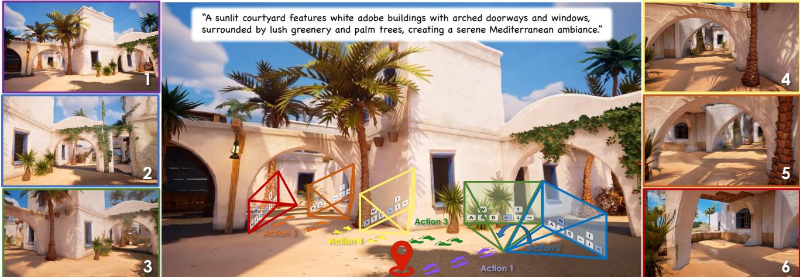
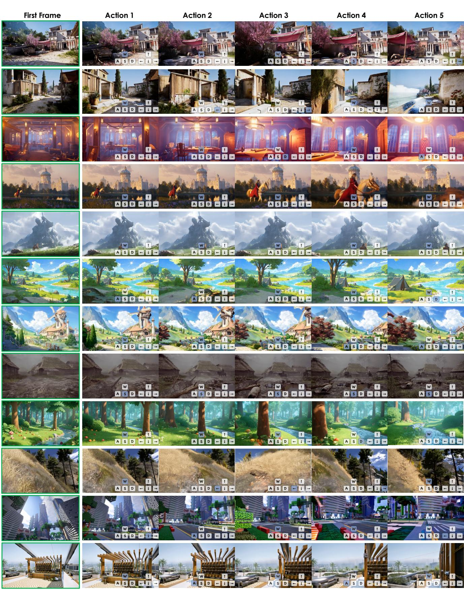
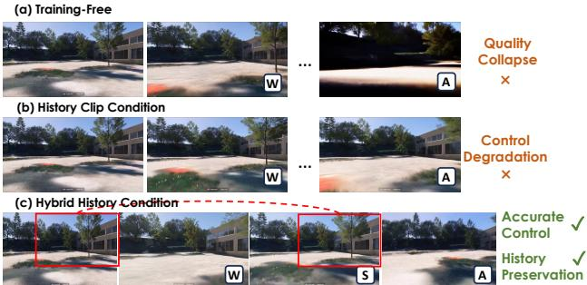
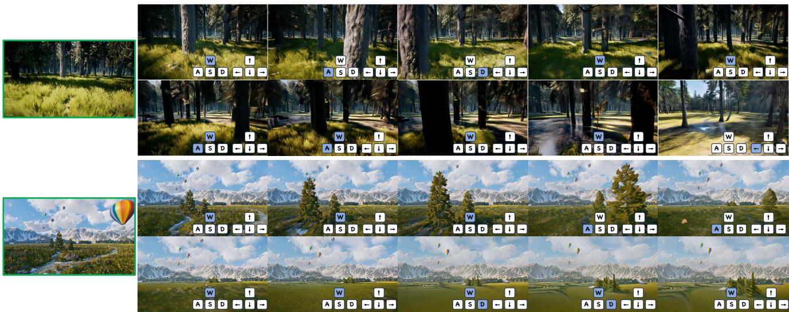
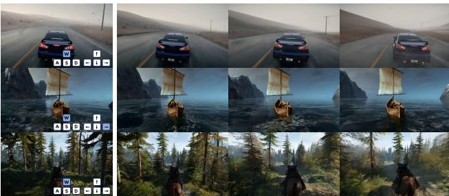
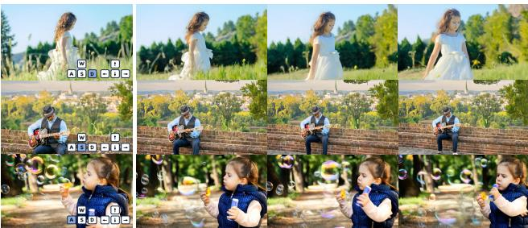

# Hunyuan-GameCraft: High-dynamic Interactive Game Video Generation with Hybrid History Condition

Jiaqi Li,2\* Junshu Tang1\* Zhiyong ${ \mathrm { X u } } ^ { 1 }$ Longhuang Wu1 Yuan Zhou1 Shuai Shao1 Tianbao ${ \mathrm { Y u } } ^ { 1 }$ Zhiguo Cao2 Qinglin Lu1

1 Tennt Hunya  Huazhong Univery  Science an Technology https://hunyuan-gamecraft.github.io/

  
represent transition movement and $\uparrow , \left. , \downarrow , \right.$ denote changes in view angles.

# Abstract

Recent advances in diffusion-based and controllable video generation have enabled high-quality and temporally coherent video synthesis, laying the groundwork for immersive interactive gaming experiences. However, current methods face limitations in dynamics, generality, longterm consistency, and efficiency, which limit the ability to create various gameplay videos. To address these gaps, we introduce Hunyuan-GameCraft, a novel framework for high-dynamic interactive video generation in game environments. To achieve fine-grained action control, we unify standard keyboard and mouse inputs into a shared camera representation space, facilitating smooth interpolation between various camera and movement operations. Then we propose a hybrid history-conditioned training strategy that extends video sequences autoregressively while preserving game scene information. Additionally, to enhance inference efficiency and playability, we achieve model distillation to reduce computational overhead while maintaining consistency across long temporal sequences, making it suitable for real-time deployment in complex interactive environments. The model is trained on a large-scale dataset comprising over one million gameplay recordings across over 100 AAA games, ensuring broad coverage and diversity, then fine-tuned on a carefully annotated synthetic dataset to enhance precision and control. The curated game scene data significantly improves the visual fidelity, realism and action controllability. Extensive experiments demonstrate that Hunyuan-GameCraft significantly outperforms existing models, advancing the realism and playability of interactive game video generation.

  
represent transition movement and $\uparrow , \left. , \downarrow , \right.$ denote changes in view angles.

# 1. Introduction

The rapid progress in generative modeling has transformed numerous fields, including entertainment and education, and beyond, fueling growing interest in high-dynamic, immersive, generative gaming experiences. Recent breakthroughs in diffusion-based video generation [1, 2, 6, 19, 31] have significantly advanced dynamic content creation, enabling high-quality, temporally coherent video synthesis. Moreover, advances in controllable video generation have introduced novel creative forms of dynamic, user-driven video production, expanding the boundaries of interactive digital experiences.

Recent advances in visual generation have explored spatial intelligence, the analysis and creation of coherent spatial scenes. These models focus on interactivity and exploration, enabling dynamic 3D/4D environments with spatiotemporal coherence. For example, WorldLabs [32] demonstrates the potential for reconstructing high-fidelity 3D environments from static imagery, while Genie 2 [22] introduces latent action modeling to enable physics-consistent interactions over time. Despite these advances, current approaches still struggle with significant limitations in critical areas such as real-time dynamic scene element fidelity, long-sequence consistency, and computational efficiency, limiting their applicability in high-dynamic, playable interactive scenarios. Notably, in game interaction modeling, real-time interactive generation and high dynamicity constitute fundamental components of player experience.

To address these challenges, we introduce HunyuanGameCraft, a novel framework designed for high-dynamic, action-controllable video synthesis in game environments. Built upon a text-to-video foundation model, HunyuanVideo [18], our method enables the generation of temporally coherent and visually rich gameplay footage conditioned on discrete user actions. We unify a broad set of standard keyboard and mouse inputs (e.g., W, A, S, D, arrow keys, Space) into a shared camera representation space, which unified embedding supports smooth interpolation between various camera and movement operations, ensuring physical plausibility while enabling cinematic flexibility in user-driven interactions, for example, speeding up.

To maintain long-term consistency in interactive game video generation, prior works [6, 15, 20] have primarily focused on training-free extensions, streaming denoising or last-frame conditioning. However, these approaches often suffer from quality degradation and temporal inconsistency with causal VAEs [33]. We propose a novel hybrid historyconditioned training strategy that autoregressively extends sequences while preserving scene information, using historical context integration and a mask indicator to address error accumulation in autoregressive generation. Moreover, to improve inference efficiency and playability, we implement the model distillation acceleration strategy [28], which reduces computational overhead while maintaining consistency across long temporal sequences, making our framework suitable for real-time deployment in complex interactive environments.

We evaluate our Hunyuan-GameCraft on both curated game scenes and general styles, obtaining a significant lead over current models. In summary, our contributions are:

• We propose Hunyuan-GameCraft, a novel interactive game video synthesis framework for dynamic content creation in game scenes, enabling users to produce content through customized action input. • We unify the discrete keyboard/mouse action signals into a shared continuous action space, supporting more complex and fine-grained interactive inputs, such as speed, angle, etc. •We introduce a novel hybrid history-condition training strategy that maintains long-term spatial and temporal coherency across various action signals. •We implement model distillation to speed up the inference speed which improves the interaction experience.

# 2. Related Work

# 2.1. Interactive Game Scene World Model

Recent research has gradually focused on incorporating video generation models to enhance dynamic prediction and interaction capabilities in game scenes. We conduct a survey on recent works, as shown in Tab. 1. WorldDreamer [30] proposes constructing a general world model by predicting masked tokens, which supports multi-modal interaction and is applicable to natural scenes and driving environments. GameGen-X [5], a diffusion Transformer model for open-world games, integrates multi-modal control signals to enable interactive video generation. The Genie series [22] generates 3D worlds from single-image prompts, while the Matrix model leverages game data with a streaming generation format to infinitely produce content through user actions.

# 2.2. Camera-Controlled Video Generation

Motionctrl [31] uses a unified and flexible motion controller designed for video generation, which independently controls the movement of video cameras and objects to achieve precise control over the motion perspectives in generated videos. CameraCtrl [13] employs Plücker embedding as the primary representation for camera parameters, training only the camera encoder and linear layers to achieve camera control. Furthermore, the recent approach CameraCtrl II [14] constructs a high-dynamics dataset with camera parameter annotations for training, and designs a lightweight camera injection module and training scheme to preserve the dynamics of pretrained models.

<table><tr><td rowspan=1 colspan=1></td><td rowspan=1 colspan=1>GameNGen [26]</td><td rowspan=1 colspan=1>GameGenX [5]</td><td rowspan=1 colspan=1>Oasis [8]</td><td rowspan=1 colspan=1>Matrix [10]</td><td rowspan=1 colspan=1>Genie 2 [22]</td><td rowspan=1 colspan=1>GameFactory [34]</td><td rowspan=1 colspan=1>Matrix-Game [36]</td><td rowspan=1 colspan=1>Hunyuan-GameCraft</td></tr><tr><td rowspan=1 colspan=1>Game Sources</td><td rowspan=1 colspan=1>DOOM</td><td rowspan=1 colspan=1>AAA Games</td><td rowspan=1 colspan=1>Minecraft</td><td rowspan=1 colspan=1>AAA Games</td><td rowspan=1 colspan=1>Unknown</td><td rowspan=1 colspan=1>Minecraft</td><td rowspan=1 colspan=1>Minecraft</td><td rowspan=1 colspan=1>AAA Games</td></tr><tr><td rowspan=1 colspan=1>Resolution</td><td rowspan=1 colspan=1>240p</td><td rowspan=1 colspan=1>720p</td><td rowspan=1 colspan=1>640 × 360</td><td rowspan=1 colspan=1>720p</td><td rowspan=1 colspan=1>720p</td><td rowspan=1 colspan=1>640 × 360</td><td rowspan=1 colspan=1>720p</td><td rowspan=1 colspan=1>720p</td></tr><tr><td rowspan=1 colspan=1>Action Space</td><td rowspan=1 colspan=1>Key</td><td rowspan=1 colspan=1>Instruction</td><td rowspan=1 colspan=1>Key + Mouse</td><td rowspan=1 colspan=1>4 Keys</td><td rowspan=1 colspan=1>Key+Mouse</td><td rowspan=1 colspan=1>7 Keys+Mouse</td><td rowspan=1 colspan=1>7 Keys+Mouse</td><td rowspan=1 colspan=1>Continous</td></tr><tr><td rowspan=1 colspan=1>Scene Generalizable</td><td rowspan=1 colspan=1>X</td><td rowspan=1 colspan=1>X</td><td rowspan=1 colspan=1>X</td><td rowspan=1 colspan=1>v</td><td rowspan=1 colspan=1>v</td><td rowspan=1 colspan=1>v</td><td rowspan=1 colspan=1>v</td><td rowspan=1 colspan=1>v</td></tr><tr><td rowspan=1 colspan=1>Scene Dynamic</td><td rowspan=1 colspan=1>v</td><td rowspan=1 colspan=1>v</td><td rowspan=1 colspan=1>X</td><td rowspan=1 colspan=1>v</td><td rowspan=1 colspan=1>X</td><td rowspan=1 colspan=1>v</td><td rowspan=1 colspan=1>X</td><td rowspan=1 colspan=1>v</td></tr><tr><td rowspan=1 colspan=1>Scene Memory</td><td rowspan=1 colspan=1>X</td><td rowspan=1 colspan=1>X</td><td rowspan=1 colspan=1>X</td><td rowspan=1 colspan=1>X</td><td rowspan=1 colspan=1>X</td><td rowspan=1 colspan=1>X</td><td rowspan=1 colspan=1>v</td><td rowspan=1 colspan=1>v</td></tr></table>

preservation of historical scene information.

# 2.3. Long Video Extension

Generating long videos poses challenges in maintaining temporal consistency and high visual quality over extended durations. Early methods used GAN to explore long video generation [23]. With the popularity of diffusion, some methods began to try to solve the problem using diffusion model. StreamingT2V [15] introduces short-term and longterm memory blocks with randomized blending to ensure consistency and scalability in text-to-video generation. In addition, some methods also explore different paradigms, such as next frame prediction [11, 12], combining nexttoken and full-sequence diffusion (DiffusionForcing) [6] and test-time training [7]. Compared with previous methods, we propose a novel hybrid history-conditioned training strategy that extends video sequences in an autoregressive way while effectively preserving game scene information, under a diffusion paradigm.

# 3. Dataset Construction

# 3.1. Game Scene Data Curation

We curate over 100 AAA titles, such as Assassin's Creed, Red Dead Redemption, and Cyberpunk 2077, to create a diverse dataset with high-resolution graphics and complex interactions. As shown in Fig 3, our end-to-end data processing framework comprises four stages that addresses annotated gameplay data scarcity while establishing new standards for camera-controlled video generation.

Scene and Action-aware Data Partition. We introduce a two-tier video partitioning approach (scene-level and action-level). Using PySceneDetect [4], we segment 2- 3 hour gameplay recordings into 6-second coherent clips ( $^ { \mathrm { 1 M + } }$ clips at $1 0 8 0 \mathrm { p }$ . RAFT [24] computes optical flow gradients to detect action boundaries (e.g., rapid aiming), enabling precise alignment for video generation training.

Data Filtering. To enhance synthesis quality, we employ quality assessment [17] to remove low-fidelity clips, apply OpenCV [3]-based luminance filtering to eliminate dark scenes, and utilize VLM [29]-based gradient detection for comprehensive data filtering from multiple perspectives.

  
Figure 3. Dataset Construction Pipeline. It consists of four preprocessing steps: Scene and Action-aware Data Partition, Data Filtering, Interaction Annotation and structured captioning.

Interaction Annotation. We reconstruct 6-DoF camera trajectories using Monst3R [35] to model viewpoint dynamics (translational/rotational motion). Each clip is annotated with frame-by-frame position/orientation data, which is essential for video generation training.

Structured Captioning. For video captioning, we implement a hierarchical strategy using game-specific VLMs [29] to generate: 1) concise 30-character summaries and 2) detailed $1 0 0 +$ character descriptions. These captions are randomly sampled during training.

# 3.2. Synthetic Data Construction

We rendered about 3,000 high-quality motion sequences from curated 3D assets, systematically sampling multiple starting positions to generate diverse camera trajectories (translations, rotations, and composites) re-rendered at varying speeds. Our multi-phase training strategy demonstrates that introducing high-precision rendered sequences significantly improves motion prediction accuracy and temporal coherence during viewpoint transitions, while establishing essential geometric priors for complex camera movements that complement real-world samples.

  
where 1 and 0 indicate history frames and predicted frames, respectively.

# 3.3. Distribution Balancing Strategy

Leveraging a hybrid training framework with combined datasets, we addressed inherent forward-motion bias in camera trajectories via a two-pronged strategy: 1) stratified sampling of start-end vectors to balance directional representation in 3D space and 2) temporal inversion augmentation to double backward motion coverage. Combined with late-stage fine-tuning using uniformly distributed rendered data, these techniques enhanced control signal generalization, training stability, and cross-directional performance consistency.

# 4. Method

In this paper, we propose Hunyuan-GameCraft, a highdynamic interactive game video generation model based on a previously open-sourced MM-DiT [9] based text-tovideo model, Hunyuan Video [18]. The overall framework is shown in Fig 4. To achieve fine-grained controllable game video synthesis with temporal coherence, we first unify diverse common keyboard/mouse options in games (W, A, S, D $ , \uparrow , \left. , \downarrow , \right. .$ ,Space, etc.) into a shared camera representation space (Sec. 4.1) and design a light-weight action encoder to encode the camera trajectory(Sec. 4.1). Then, we propose a hybrid history-conditioned video extension approach that autoregressively denoise new noisy latent conditioned on historical denoised chunks (Sec. 4.2). Finally, to accelerate the inference speed and improve the interaction experience, we implement the model distillation, based on Phased Consistency Model [28]. This distillation achieves a $1 0 { - } 2 0 \times$ acceleration in inference speed, reducing latency to less than 5s per action (Sec. 4.3).

# 4.1. Continuous Action Space and Injection

To achieve fine-grained control over the generated content for enhanced interactive effects, we define a subset action space $\mathcal { A }$ within the camera parameter ${ \mathcal { C } } \subseteq \mathbb { R } ^ { n }$ dedicated to continuous and intuitive motion control injection:

$$
\begin{array} { r } { \mathcal { A } : = \left\{ \mathbf { a } = \left( \mathbf { d } _ { \mathrm { t r a n s } } , \mathbf { d } _ { \mathrm { r o t } } , \alpha , \beta \right) \ : \middle | \begin{array} { l l } { \mathbf { d } _ { \mathrm { t r a n s } } \in \mathbb { S } ^ { 2 } , \quad \mathbf { d } _ { \mathrm { r o t } } \in \mathbb { S } ^ { 2 } , } \\ { \alpha \in [ 0 , v _ { \mathrm { m a x } } ] , \quad \beta \in [ 0 , \omega _ { \mathrm { m a x } } ] \ : \middle ) . } \end{array} \right. } \end{array}
$$

${ \bf d } _ { \mathrm { t r a n s } }$ and $\mathbf { d } _ { \mathrm { { r o t } } }$ are unit vectors defining the translation and rotation direction on the 2-sphere space $\mathbb { S } ^ { 2 }$ ,respectively. Scalars $\alpha$ and $\beta$ are used for controlling translation and rotation speed, bounded by maximum velocity $v _ { \mathrm { m a x } }$ and $\omega _ { \mathrm { m a x } }$ . Specifically, they are the differential modulus of relative velocity and angle during frame-by-frame motion.

Building upon prior knowledge of gaming scenarios and general camera control conventions, we eliminate the degree of freedom in the roll dimension while incorporating velocity control. This design enables fine-grained trajectory manipulation that aligns with user input habits. Furthermore, this representation can be seamlessly converted into standard camera trajectory parameters and Plücker embeddings. Similar with previous camera-controlled video generation arts, we design a light-weight camera information encoding network that aligns Plücker embeddings with video latents. Unlike previous approaches that employ cascaded residual blocks or transformer blocks to construct Plücker embedding encoders, our encoding network consists solely of a limited number of convolutional layers for spatial downsampling and pooling layers for temporal downsampling. A learnable scaling coefficient is incorporated to automatically optimize the relative weighting during token-wise addition, ensuring stable and adaptive fea

# Autoregressive Long Video Extention

  
Figure 5. Comparison of different autoregressive long video extension schemes. (i) Training-free inference. (ii) Streaming generation. (iii) Hybrid history condition proposed in this paper.

ture fusion.

Then we adopted the token addition strategy to inject camera pose control into the MM-DiT backbone. Dual lightweight learnable tokenizers are used to achieve efficient feature fusion between video and action tokens, enabling effective interactive control. Additional ablation studies and comparative analyses are detailed in Sec. 5.3.

Leveraging the robust multimodal fusion and interaction capabilities of MM-DiT backbone, our method achieves state-of-the-art interactive performance despite significant encoder parameter reduction, while maintaining negligible additional computational overhead.

# 4.2. Hybrid history conditioned Long Video Extension

Consistently generating long or potentially infinite-length videos remains a fundamental challenge in interactive video generation. As shown in Fig 5, current video extrapolation approaches can be categorized into three main paradigms: (1) training-free inference from single images, (2) rolling streaming generation with non-uniform noise windows, and (3) chunk-wise extension using historical segments. As shown in Fig 6(a), training-free methods lack insufficient historical context during extrapolation, leading to inconsistent generation quality and frequent scene collapse in iterative generation. The streaming approach shows significant architectural incompatibility with our image-to-video foundation model, where the causal VAE's uneven encoding of initial versus subsequent frames fundamentally limits efficiency and scalability. To address these limitations, we investigate hybrid-conditioned autoregressive video extension, where multiple guidance conditions are mixed during training to achieve high consistency, fidelity, and compatibility.

  
Figure 6. Analysis on different video extension schemes. Baseline (a) is a naive solution using training-free inference from single images, and it will lead to obvious quality collapse. Using history clip condition (b) will result in control degradation. With our proposed hybrid history condition (c), the model can achieve accurate action control and history preservation (see red box). W, A, S denote moving forward, left and backward.

As illustrated in Fig. 5, we define each autoregressive step as a chunk latent denoising process guided by head latent and interactive signals. The chunk latent, serving as a global representation by causal VAE, is subsequently decoded into a temporally consistent video segment that precisely corresponds to the input action. Head condition can be different forms, including (i) a single image frame latent, (ii) the final latent from the previous clip, or (iii) a longer latent clip segment. Hunyuan-GameCraft achieves high-fidelity denoising of chunk latents through concatenation at both condition and noise levels. An additional binary mask assigns value 1 to head latent regions and 0 to chunk segments, enabling precise control over the denoising part. Within the noise schedule, the preceding head condition remains noise-free as clean latent, which guides subsequent noisy chunk latents through flow matching to progressively denoise and generate new clean video clips for the next denoising iteration.

We conduct extensive experiments on the three aforementioned head conditions, as detailed in Fig 6. The results demonstrate that autoregressive video extension shows improved consistency and generation quality when the head condition contains more information, while interactive performance decreases accordingly. This trade-off occurs because the training data comes from segmented long videos, where subsequent clips typically maintain motion continuity with preceding ones. As a result, stronger historical priors naturally couple the predicted next clip with the given history, which limits responsiveness to changed action inputs. However, richer reference information simultaneously enhances temporal coherence and generation fidelity.

To address this trade-off, in addition to constructing training samples and applying stratified sampling, hybridconditioned training is proposed to mix all three extension modes during training to jointly optimize both interactive capability and generation consistency. This hybrid approach achieves state-of-the-art performance by reasonably balancing these competing objectives. The hybridconditioned paradigm also provides practical deployment benefits. It successfully integrates two separate tasks (initial frame generation and video extension) into a unified model. This integration enables seamless transitions between generation modes without requiring architectural modifications, making the solution particularly valuable for real-world applications that demand both flexible control and coherent long-term video generation.

  
F c control accuracy. In our case, blue-t keys indicate key presses. W, A, S, D represent transition movement and $\uparrow , \left. , \downarrow , \right.$ denote changes in view angles.

# 4.3. Accelerated Generative Interaction

To enhance the gameplay experience and enable accelerated interaction with the generated game videos, we further extend our approach by integrating acceleration techniques. A promising direction involves combining our core framework with Consistency Models [21], a stateof-the-art method for accelerating diffusion-based generation. In particular, we adopt the Phased Consistency Model (PCM) [28], which distills the original diffusion process and classifier-free guidance into a compact eight-step consistency model. To further reduce computational overhead and improve inference efficiency, we introduce Classifier-Free Guidance Distillation. This approach defines a distillation objective that trains the student model to directly produce guided outputs without relying on external guidance mechanisms, the object function is designed as:

$$
\begin{array} { r l } & { L _ { c f g } = \mathbb { E } _ { w \sim p _ { w } , t \sim U [ 0 , 1 ] } [ | | \hat { u _ { \theta } } ( z _ { t } , t , w , T _ { s } ) - u _ { \theta } ^ { s } ( z _ { t } , t , w , T _ { s } ) | | _ { 2 } ^ { 2 } ] , } \\ & { \hat { u _ { \theta } } ( z _ { t } , t , w , T _ { s } ) = ( 1 + w ) u _ { ( } z _ { t } , t , T _ { s } ) - w u _ { \theta } ( z _ { t } , t , ) } \end{array}
$$

where $T _ { s }$ denotes the prompt. Through this integration, we achieve up to a $2 0 \times$ speedup in inference, reaching realtime rendering rates of 6.6 frames per second (FPS), thereby significantly enhancing the interactivity and playability of our system.

# 5. Experiment

# 5.1. Experimental Setup

Implementation Details. Hunyuan-GameCraft builds upon text-to-video foundation model HunyuanVideo [18], implementing a latent mask mechanism and hybrid history conditioning to achieve image-to-video generation and long video extension. The experiments employ full-parameter training on 192 NVIDIA H20 GPUs, conducted in two phases with a batch size of 48. The first phase trains the model for $3 0 \mathrm { k }$ iterations at a learning rate of $3 \times 1 0 ^ { - 5 }$ using all collected game data and synthetic data at their original proportions. The second phase introduces data augmentation techniques, as described in Sec. 3, to balance action distributions, while reducing the learning rate to $1 \times 1 0 ^ { - 5 }$ for an additional 20,000 iterations to enhance generation quality and interactive performance. The hybrid history condition maintains specific ratios: 0.7 for single historical clip, 0.05 for multiple historical clips, and 0.25 for single frame. The system operates at 25 fps, with each video chunk comprising 33-frame clips at $7 2 0 \mathrm { p }$ resolution.

Evaluation Datasets. We curate a test set of 150 diverse images and 12 different action signals, sourced from online repositories, spanning gaming scenarios, stylized artwork, and AI-generated content. This composition facilitates both quantitative and qualitative evaluation of interactive control accuracy and generalization. To demonstrate cross-scenario adaptability, we present exemplar results from diverse contexts.

Evaluation Metrics. We employ several metrics for comprehensive evaluation to ensure fair comparison. We utilize Fréchet Video Distance(FVD) [25] to evaluate the video realism. Relative pose error (RPE trans and RPE rot) are adopted to evaluate interactive control performance, after applying a Sim3 Umeyama alignment on the reconstructed trajectory of prediction to the ground truth. Following Matrix-Game, we employ Image Quality and Aesthetic scores for visual quality assessment, while utilizing Temporal Consistency to evaluate the visual and cinematographic continuity of generated sequences. For dynamic performance evaluation, we adapt the Dynamic Degree metric from VBench [16], modifying its original binary classification approach to directly report absolute optical flow values as Dynamic Average, enabling a more nuanced, continuous assessment of motion characteristics. Additionally, we incorporate user preference scores obtained from user studies.

Baselines. We compare our method with four representative baselines, including a current state-of-the-art opensourced interactive game model, Matrix-Game, and three camera-controlled generation works: CameraCtrl [13], MotionCtrl [31] and WanX-Cam [27]. The CameraCtrl and MotionCtrl employ the image-to-video SVD implementation, while WanX-Cam corresponds to the VideoX-Fun implementation.

# 5.2. Comparisons with other methods

Quantitative Comparison. We conduct comprehensive comparisons with Matrix-Game, the current leading open-source game interaction model, under identical gaming scenarios. Despite employing the same base model [18], Hunyuan-GameCraft demonstrates significant improvements across the majority of key metrics, including generation quality, dynamic capability, control accuracy, and temporal consistency as shown in Tab. 2. Notably, Hunyuan-GameCraft achieves the best results in dynamic performance compared to Matrix-Game, while simultaneously reducing interaction errors by $5 5 \%$ in crossdomain tests. These advancements are attributable to our optimized training strategy and conditional injection mechanism, which collectively enable robust interactive generation across both gaming scenarios and diverse artistic styles.

We also evaluate generation quality and control accuracy on the same test set, with quantitative results presented in Tab. 2. Hunyuan-GameCraft demonstrates superior performance compared to other baselines. The results suggest that our action-space formulation captures fundamental principles of camera motion that transcend game scene characteristics. Furthermore, we report the inference speed of each baseline. Our method can achieve nearly real-time inference while slightly damaging the dynamic and visual quality, which is more suitable for game scene interaction.

Qualitative Comparison. As shown in Fig. 7, we qualitatively demonstrate superior capabilities of HunyuanGameCraft from multiple perspectives. The part(a) compares our method with Matrix-Game in sequential singleaction scenarios, using the Minecraft environment originally employed for training of Matrix-Game. The results demonstrate significantly superior interaction capabilities of Hunyuan-GameCraft. Furthermore, continuous left-right rotations effectively showcase the enhanced historical information retention enabled by hybrid history condition training approach. The comparison of both game interaction models with sequential coupled action is shown in (b). Our method can accurately map input-coupled interaction signals while maintaining both quality consistency and spatial coherence during long video extension, achieving an immersive exploration experience. Part(c) focuses on evaluating image-to-video generation performance under single action across all baselines. Hunyuan-GameCraft demonstrates significant advantages in dynamic capability, including windmill rotation consistency, as well as overall visual quality.

<table><tr><td rowspan="2">Model</td><td colspan="4">Visual Quality</td><td>Temporal</td><td colspan="2">RPE</td><td rowspan="2">Infer Speed↑ (FPS)</td></tr><tr><td>FVD↓</td><td>Image Quality↑</td><td>Dynamic Average↑</td><td>Aesthetic↑</td><td>Temporal Consistency↑</td><td>Trans↓</td><td>Rot↓</td></tr><tr><td>CameraCtrl</td><td>1580.9</td><td>0.66</td><td>7.2</td><td>0.64</td><td>0.92</td><td>0.13</td><td>0.25</td><td>1.75</td></tr><tr><td>MotionCtrl</td><td>1902.0</td><td>0.68</td><td>7.8</td><td>0.48</td><td>0.94</td><td>0.17</td><td>0.32</td><td>0.67</td></tr><tr><td>WanX-Cam</td><td>1677.6</td><td>00.700</td><td>17.8</td><td>00.67</td><td>0.92</td><td>0.16</td><td>0.36</td><td>0.13</td></tr><tr><td>Matrix-Game</td><td>2260.7</td><td>0.72</td><td>31.7</td><td>0.65</td><td>0.94</td><td>0.18</td><td>0.35</td><td>0.06</td></tr><tr><td>Ours</td><td>1554.2</td><td>0.69</td><td>67.2</td><td>00.67</td><td>0.95</td><td>0.08</td><td>0.20</td><td>0.25</td></tr><tr><td>Ours + PCM</td><td>1883.3</td><td>00.67</td><td>43.8</td><td>0.65</td><td>0.93</td><td>0.08</td><td>0.20</td><td>6.6</td></tr></table>

Table 2. Quantitative comparison with recent related works. $\uparrow$ indicates higher is better, while $\downarrow$ indicates that lower is better. The best result is shown in bold.

Table 3. Average ranking score of user study. For each object, users are asked to give a rank score where 5 for the best, and 1 for the worst. User prefer ours the best in both aspects.   

<table><tr><td>Method</td><td>Video ↑ Quality</td><td>Temporal Consistency</td><td>Motion ↑ Smooth</td><td>Action Accuracy</td><td>Dynamic↑</td></tr><tr><td>CameraCtrl</td><td>2.20</td><td>2.40</td><td>2.16</td><td>2.87</td><td>2.57</td></tr><tr><td>MotionCtrl</td><td>3.23</td><td>3.20</td><td>3.21</td><td>3.09</td><td>3.22</td></tr><tr><td>WanX-Cam</td><td>2.42</td><td>2.53</td><td>2.44</td><td>2.81</td><td>2.46</td></tr><tr><td>Matrix-Game</td><td>2.72</td><td>2.43</td><td>2.75</td><td>1.63</td><td>2.21</td></tr><tr><td>Ours</td><td>4.42</td><td>4.44</td><td>4.53</td><td>4.61</td><td>4.54</td></tr></table>

Table 4. Ablation study on different data distribution, control injection, and hybrid history conditioning. DA denotes Dynamic Average score.   

<table><tr><td colspan="5">FVD↓ DA↑ Aesthetic↑ RPE trans↓ RPE rot↓</td></tr><tr><td>(a) Only Synthetic Data</td><td>2550.7 34.6</td><td>0.56</td><td>0.07</td><td>0.17</td></tr><tr><td>) Only Live Data</td><td>1937.7 77.2</td><td>0.60</td><td>0.16</td><td>0.27</td></tr><tr><td>(c) Token Concat.</td><td>2236.4 59.7</td><td>0.54</td><td>0.13</td><td>0.29</td></tr><tr><td>(d) Channel-wise Concat.</td><td>1725.5 63.2</td><td>0.49</td><td>0.11</td><td>0.25</td></tr><tr><td>(e) Image Condition</td><td>1655.3 47.6</td><td>0.58</td><td>0.07</td><td>0.22</td></tr><tr><td>(f) Clip Condition</td><td>1743.5 55.3</td><td>0.57</td><td>0.16</td><td>0.30</td></tr><tr><td>(g) Ours (Render:Live=1:5) 1554.2</td><td>67.2</td><td>0.67</td><td>0.08</td><td>0.20</td></tr></table>

User Study. Given the current lack of comprehensive benchmarks for interactive video generation models in both gaming and general scenarios, we conducted a user study involving 30 evaluators to enhance the reliability of our assessment. As shown in Tab. 3, our method achieved the highest scores by a margin across multiple dimensions in the anonymous user rankings.

# 5.3. Ablation Study

In this section, comprehensive experiments are conducted to validate the effectiveness of our contributions, including the data distribution, control injection, and hybrid history conditioning.

Data Distribution. To understand the distinct contributions of game data and synthetic data, we began with an ablation study evaluating their impact on the model's capabilities. Notably, the synthetic data does not highlight dynamic objects due to the computational expense and complexity of generating dynamical scenes. Tab. 4(a)(b) demonstrate that training exclusively on synthetic data significantly improves interaction accuracy but substantially degrades dynamic generation capabilities, while gameplay data exhibits the opposite characteristics. Our training distribution achieves balanced results.

Action Control Injection. Here we present ablation details for our camera injection experiments. Since the Plücker embeddings are already temporally and spatially aligned with the video latent representations, we implement three straightforward camera control schemes: (i) Token Addition, (ii) Token Concatenation, and (iii) Channel-wise Concatenation, as shown in the Tab. $( \mathbf { c } ) ( \mathbf { d } ) ( \mathbf { g } )$ .Simply adding control signals at the initial stage achieves state-of-the-art control performance. Considering computational efficiency, we ultimately adopt Token Addition in our framework.

Hybrid History Conditioning. Hunyuan-GameCraft implements hybrid history conditioning for video generation and extension. Fig. 6 visually demonstrates visual results under different conditioning schemes, while we provide quantitative ablation analysis here. As shown in Tab. 4(e)(f)(g), Hunyuan-GameCraft achieves satisfactory control accuracy when trained with single frame conditioning, yet suffers from quality degradation over multiple action sequences due to limited historical context, leading to quality collapse as shown in Fig. 6. When employing historical clip conditioning, the model exhibits degraded interaction accuracy when processing control signals that significantly deviate from historical motions. Our hybrid history conditioning effectively balances this trade-off, enabling Hunyuan-GameCraft to simultaneously achieve superior interaction performance, long-term consistency and visual quality.

# 6. Generalization on Real Worlds

Although our model is tailored for game scenes, the integration of a pre-trained video foundation model significantly enhances its generalization capabilities, enabling it to generate interactive videos in real-world domains as well. As shown in Fig 10, given images in real world, HunyuanGameCraft can successfully generate reasonable video with conditioned camera movement while keeping the dynamics.

  
quality.

  
Figure 9. Interactive results on the third-perspective game video generation.

  
Figure 10. Hunyuan-GameCraft enables high-fidelity and highdynamic real-world video generation with accurate camera control.

# 7. Limitations and Future Work

While Hunyuan-GameCraft demonstrates impressive capabilities in interactive game video generation, its current action space is mainly tailored to open-world exploration and lacks a wider array of game-specific actions such as shooting, throwing, and explosions. In future work, we will expand the dataset with more diverse gameplay elements. Building on our advancements in controllability, long-form video generation, and history preservation, we will focus on developing the next-generation model for more physical and playable game interactions.

# 8. Conclusion

In this paper, we introduce Hunyuan-GameCraft, a significant step forward in interactive video generation. Through a unified action representation, hybrid history-conditioned training, and model distillation, our framework enables fine-grained control, efficient inference, and scalable long video synthesis. Besides, Hunyuan-GameCraft delivers enhanced realism, responsiveness, and temporal coherence. Our results demonstrate substantial improvements over existing methods, establishing Hunyuan-GameCraft as a robust foundation for future research and real-time deployment in immersive gaming environments.

# References

[1] Andreas Blattmann, Tim Dockhorn, Sumith Kulal, Daniel Mendelevitch, Maciej Kilian, Dominik Lorenz, Yam Levi, Zion English, Vikram Voleti, Adam Letts, et al. Stable video diffusion: Scaling latent video diffusion models to large datasets. arXiv preprint arXiv:2311.15127, 2023. 3

[2] Andreas Blattmann, Robin Rombach, Huan Ling, Tim Dockhorn, Seung Wook Kim, Sanja Fidler, and Karsten Kreis. Align your latents: High-resolution video synthesis with latent diffusion models. In Proceedings of the IEEE/CVF conference on computer vision and pattern recognition, pages 2256322575, 2023. 3   
[3] Gary Bradski. The opencv library. Dr. Dobb's Journal: Software Tools for the Professional Programmer, 25(11):120 123, 2000.4   
[4] Brandon Castellano. PySceneDetect. 4 [5] Haoxuan Che, Xuanhua He, Quande Liu, Cheng Jin, and Hao Chen. Gamegen-x: Interactive open-world game video generation. In International Conference on Learning Representations, 2025. 3, 4   
[6] Boyuan Chen, Diego Martí Monsó, Yilun Du, Max Simchowitz, Russ Tedrake, and Vincent Sitzmann. Diffusion forcing: Next-token prediction meets full-sequence diffusion. Advances in Neural Information Processing Systems, 37:2408124125, 2024. 3, 4 [7] Karan Dalal, Daniel Koceja, Gashon Hussein, Jiarui Xu, Yue Zhao, Youjin Song, Shihao Han, Ka Chun Cheung, Jan Kautz, Carlos Guestrin, et al. One-minute video generation with test-time training. arXiv preprint arXiv:2504.05298, 2025. 4   
[8] Decard. Oasis: A universe in a transformer. https://www.decart.ai/articles/oasis interactive-ai-video-game-model,2024.4   
[9] Patrick Esser, Sumith Kulal, Andreas Blattmann, Rahim Entezari, Jonas Müller, Harry Saini, Yam Levi, Dominik Lorenz, Axel Sauer, Frederic Boesel, et al. Scaling rectified flow transformers for high-resolution image synthesis. In Forty-first international conference on machine learning, 2024. 5   
[10] Ruili Feng, Han Zhang, Zhantao Yang, Jie Xiao, Zhilei Shu, Zhiheng Liu, Andy Zheng, Yukun Huang, Yu Liu, and Hongyang Zhang. The matrix: Infinite-horizon world generation with real-time moving control. arXiv preprint arXiv:2412.03568, 2024. 4   
[11] Kaifeng Gao, Jiaxin Shi, Hanwang Zhang, Chunping Wang, and Jun Xiao. Vid-gpt: Introducing gpt-style autoregressive generation in video diffusion models. arXiv preprint arXiv:2406.10981, 2024. 4   
[12] Yuchao Gu, Weijia Mao, and Mike Zheng Shou. Longcontext autoregressive video modeling with next-frame prediction. arXiv preprint arXiv:2503.19325, 2025. 4   
[13] Hao He, Yinghao Xu, Yuwei Guo, Gordon Wetzstein, Bo Dai, Hongsheng Li, and Ceyuan Yang. Cameractrl: Enabling camera control for text-to-video generation. arXiv preprint arXiv:2404.02101, 2024. 3, 8   
[14] Hao He, Ceyuan Yang, Shanchuan Lin, Yinghao Xu, Meng Wei, Liangke Gui, Qi Zhao, Gordon Wetzstein, Lu Jiang, and Hongsheng Li. Cameractrl ii: Dynamic scene exploration via camera-controlled video diffusion models. arXiv preprint arXiv:2503.10592, 2025. 3   
[15] Roberto Henschel, Levon Khachatryan, Hayk Poghosyan, Daniil Hayrapetyan, Vahram Tadevosyan, Zhangyang Wang, Shant Navasardvan. and Humphrev Shi. Streamingt2v: Consistent, dynamic, and extendable long video generation from text. arXiv preprint arXiv:2403.14773, 2024. 3, 4   
[16] Ziqi Huang, Yinan He, Jiashuo Yu, Fan Zhang, Chenyang Si, Yuming Jiang, Yuanhan Zhang, Tianxing Wu, Qingyang Jin, Nattapol Chanpaisit, et al. Vbench: Comprehensive benchmark suite for video generative models. In Proceedings of the IEEE/CVF Conference on Computer Vision and Pattern Recognition, pages 2180721818, 2024. 8   
[17] KolorsTeam. Kolors: Effective training of diffusion model for photorealistic text-to-image synthesis. arXiv preprint, 2024. 4   
[18] Weijie Kong, Qi Tian, Zijian Zhang, Rox Min, Zuozhuo Dai, Jin Zhou, Jiangfeng Xiong, Xin Li, Bo Wu, Jianwei Zhang, et al. Hunyuanvideo: A systematic framework for large video generative models. arXiv preprint arXiv:2412.03603, 2024. 3, 5, 8   
[19] Ruihuang Li, Caijin Zhou, Shoujian Zheng, Jianxiang Lu, Jiabin Huang, Comi Chen, Junshu Tang, Guangzheng Xu, Jiale Tao, Hongmei Wang, et al. Hunyuan-game: Industrialgrade intelligent game creation model. arXiv preprint arXiv:2505.14135, 2025. 3   
[20] Yu Lu, Yuanzhi Liang, Linchao Zhu, and Yi Yang. Freelong: Training-free long video generation with spectralblend temporal attention. arXiv preprint arXiv:2407.19918, 2024. 3   
[21] Simian Luo, Yiqin Tan, Longbo Huang, Jian Li, and Hang Zhao. Latent consistency models: Synthesizing highresolution images with few-step inference. arXiv preprint arXiv:2310.04378, 2023. 7   
[22] Jack Parker-Holder, Philip Ball, Jake Bruce, Vibhavari Dasagi, Kristian Holsheimer, Christos Kaplanis, Alexandre Moufarek, Guy Scully, Jeremy Shar, Jimmy Shi, Stephen Spencer, Jessica Yung, Michael Dennis, Sultan Kenjeyev, Shangbang Long, Vlad Mnih, Harris Chan, Maxime Gazeau, Bonnie Li, Fabio Pardo, Luyu Wang, Lei Zhang, Frederic Besse, Tim Harley, Anna Mitenkova, Jane Wang, Jeff Clune, Demis Hassabis, Raia Hadsell, Adrian Bolton, Satinder Singh, and Tim Rocktäschel. Genie 2: A large-scale foundation world model. 2024. 3, 4   
[23] Ivan Skorokhodov, Sergey Tulyakov, and Mohamed Elhoseiny. Stylegan-v: A continuous video generator with the price, image quality and perks of stylegan2. In Proceedings of the IEEE/CVF conference on computer vision and pattern recognition, pages 36263636, 2022. 4   
[24] Zachary Teed and Jia Deng. Raft: Recurrent all-pairs field transforms for optical flow. In Computer Vision-ECCV 2020: 16th European Conference, Glasgow, UK, August 23 28, 2020, Proceedings, Part II 16, pages 402419. Springer, 2020. 4   
[25] Thomas Unterthiner, Sjoerd Van Steenkiste, Karol Kurach, Raphaël Marinier, Marcin Michalski, and Sylvain Gelly. Fvd: A new metric for video generation. 2019. 8   
[26] Dani Valevski, Yaniv Leviathan, Moab Arar, and Shlomi Fruchter. Diffusion models are real-time game engines. arXiv preprint arXiv:2408.14837, 2024. 4   
[27] Team Wan, Ang Wang, Baole Ai, Bin Wen, Chaojie Mao, Chen-Wei Xie, Di Chen, Feiwu Yu, Haiming Zhao, Jianxiao Yang, Jianyuan Zeng, Jiayu Wang, Jingfeng Zhang, Jingren Zhou, Jinkai Wang, Jixuan Chen, Kai Zhu, Kang Zhao, Keyu Yan, Lianghua Huang, Mengyang Feng, Ningyi Zhang, Pandeng Li, Pingyu Wu, Ruihang Chu, Ruili Feng, Shiwei Zhang, Siyang Sun, Tao Fang, Tianxing Wang, Tianyi Gui, Tingyu Weng, Tong Shen, Wei Lin, Wei Wang, Wei Wang, Wenmeng Zhou, Wente Wang, Wenting Shen, Wenyuan Yu, Xianzhong Shi, Xiaoming Huang, Xin Xu, Yan Kou, Yangyu Lv, Yifei Li, Yijing Liu, Yiming Wang, Yingya Zhang, Yitong Huang, Yong Li, You Wu, Yu Liu, Yulin Pan, Yun Zheng, Yuntao Hong, Yupeng Shi, Yutong Feng, Zeyinzi Jiang, Zhen Han, Zhi-Fan Wu, and Ziyu Liu. Wan: Open and advanced large-scale video generative models. arXiv preprint arXiv:2503.20314, 2025. 8   
[28] Fu-Yun Wang, Zhaoyang Huang, Alexander Bergman, Dazhong Shen, Peng Gao, Michael Lingelbach, Keqiang Sun, Weikang Bian, Guanglu Song, Yu Liu, et al. Phased consistency models. Advances in neural information processing systems, 37:8395184009, 2024. 3, 5, 7   
[29] Peng Wang, Shuai Bai, Sinan Tan, Shijie Wang, Zhihao Fan, Jinze Bai, Keqin Chen, Xuejing Liu, Jialin Wang, Wenbin Ge, et al. Qwen2-vl: Enhancing vision-language model's perception of the world at any resolution. arXiv preprint arXiv:2409.12191, 2024. 4   
[30] Xiaofeng Wang, Zheng Zhu, Guan Huang, Boyuan Wang, Xinze Chen, and Jiwen Lu. Worlddreamer: Towards general world models for video generation via predicting masked tokens. arXiv preprint arXiv:2401.09985, 2024. 3   
[31] Zhouxia Wang, Ziyang Yuan, Xintao Wang, Yaowei Li, Tianshui Chen, Menghan Xia, Ping Luo, and Ying Shan. Motionctrl: A unified and flexible motion controller for video generation. In ACM SIGGRAPH 2024 Conference Papers, pages 111, 2024. 3, 8   
[32] WorldLabs. Generating worlds. https://www. worldlabs.ai/blog,2024. 3   
[33] Mengyue Yang, Furui Liu, Zhitang Chen, Xinwei Shen, Jianye Hao, and Jun Wang. Causalvae: Disentangled representation learning via neural structural causal models. In Proceedings of the IEEE/CVF conference on computer vision and pattern recognition, pages 95939602, 2021. 3   
[34] Jiwen Yu, Yiran Qin, Xintao Wang, Pengfei Wan, Di Zhang, and Xihui Liu. Gamefactory: Creating new games with generative interactive videos. arXiv preprint arXiv:2501.08325, 2025. 4   
[35] Junyi Zhang, Charles Herrmann, Junhwa Hur, Varun Jampani Trevo Darre, Forreer Cole, Deqing un, and MingHsuan Yang. Monst3r: A simple approach for estimating geometry in the presence of motion. arXiv preprint arXiv:2410.03825, 2024. 4   
[36] Yifan Zhang, Chunli Peng, Boyang Wang, Puyi Wang, Qingcheng Zhu, Zedong Gao, Eric Li, Yang Liu, and Yahui Zhou. Matrix-game: Interactive world foundation model. arXiv, 2025. 4