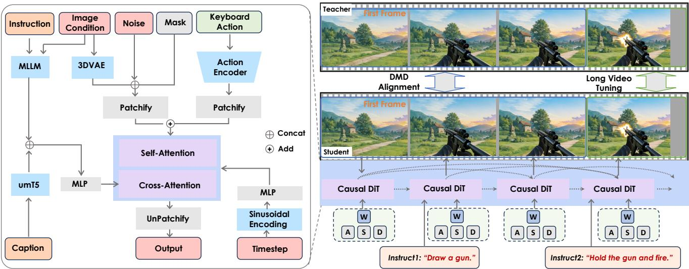
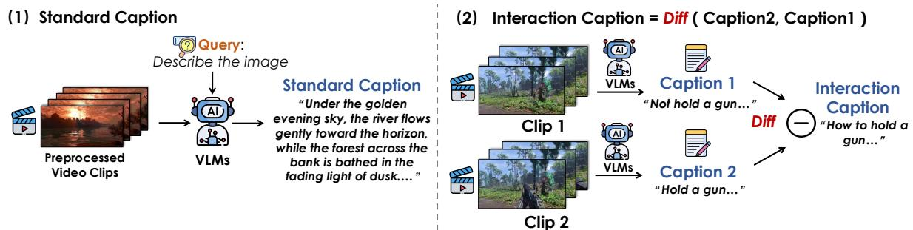
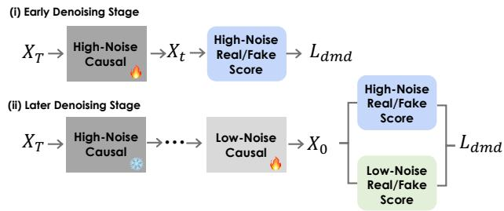
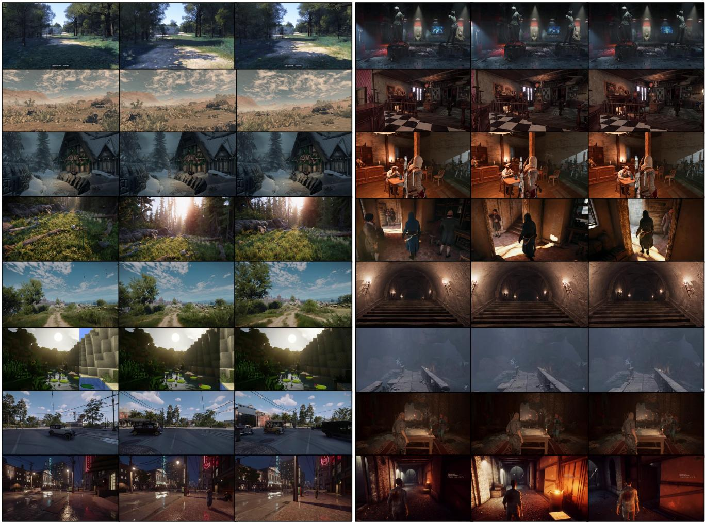
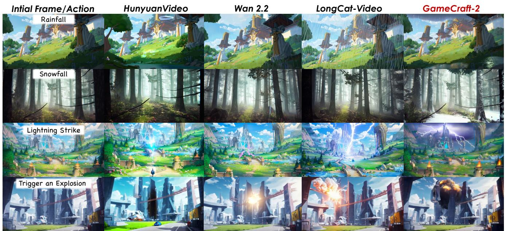
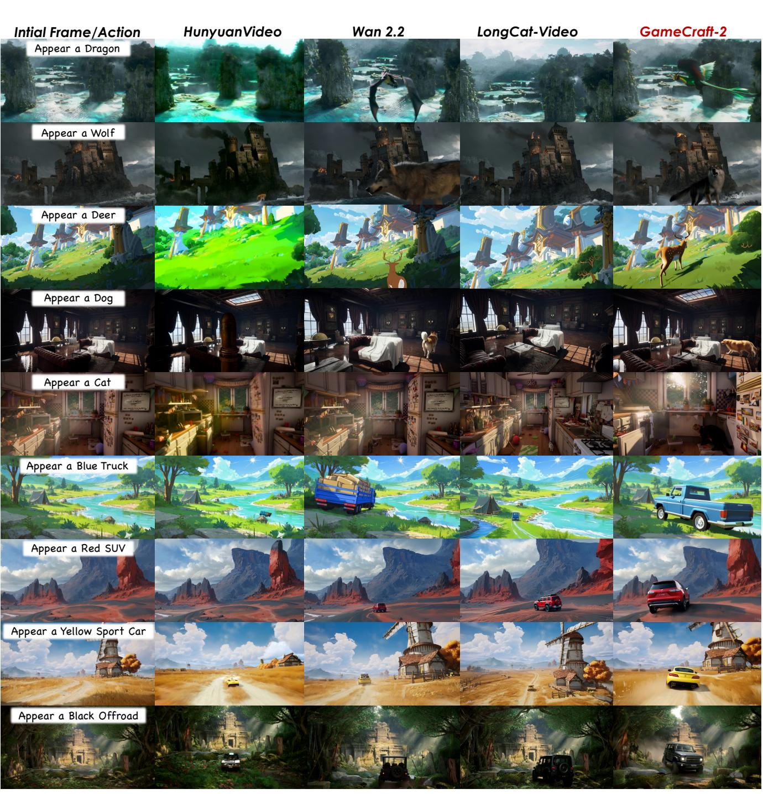

# 1. 论文基本信息

## 1.1. 标题
**Hunyuan-GameCraft-2: Instruction-following Interactive Game World Model**
（混元-GameCraft-2：遵循指令的交互式游戏世界模型）

## 1.2. 作者
Junshu Tang, Jiacheng Liu, Jiaqi Li, Longhuang Wu, Haoyu Yang, Penghao Zhao, Siruis Gong, Xiang Yuan, Shuai Shao, Qinglin Lu 等。
这些作者隶属于 <strong>腾讯混元 (Tencent Hunyuan)</strong> 团队。他们在生成式人工智能（AIGC）、视频生成和游戏世界建模领域具有深厚的研究背景。

## 1.3. 发表期刊/会议
本论文目前发布于 **arXiv** 预印本平台。考虑到其技术深度和实验规模，该工作属于计算机视觉（CV）与人工智能（AI）领域的顶级前沿研究。

## 1.4. 发表年份
**2025年**（提交日期：2025-11-28）。

## 1.5. 摘要
生成式世界模型在创建开放式游戏环境方面取得了显著进展，正从静态场景合成向动态交互模拟演进。然而，当前方法受限于僵化的动作模式和高昂的标注成本。本文推出了 **Hunyuan-GameCraft-2**，这是一种全新的指令驱动交互范式。该模型不仅支持固定的键盘输入，还允许用户通过<strong>自然语言提示词 (Natural Language Prompts)</strong>、键盘或鼠标信号来控制游戏视频内容。研究团队正式定义了<strong>交互式视频数据 (Interactive Video Data)</strong> 的概念，并开发了自动化流程将大规模非结构化文本-视频对转化为因果对齐的交互数据集。模型基于 14B 参数的图像到视频 <strong>混合专家模型 (Mixture-of-Experts, MoE)</strong> 基础架构，引入了文本驱动的交互注入机制。此外，论文提出了专门的基准测试 **InterBench**。实验证明，该模型能生成时间连贯且符合因果逻辑的交互视频，实时推理速度达 16 FPS。

## 1.6. 原文链接
*   **PDF 链接:** [https://arxiv.org/pdf/2511.23429v1](https://arxiv.org/pdf/2511.23429v1)
*   **发布状态:** 预印本 (Preprint)。

    ---

# 2. 整体概括

## 2.1. 研究背景与动机
<strong>世界模型 (World Models)</strong> 是指人工智能能够模拟真实或虚拟世界的物理规律、逻辑因果和动态演变的模型。在游戏领域，理想的世界模型应该能让玩家“玩”起来，即根据玩家的操作即时生成后续画面。

*   **核心问题:** 现有的交互式视频模型（如早期版本或 Genie 系列）通常只支持简单的键盘/鼠标离散动作（如 W/A/S/D），难以处理复杂的语义指令（如“点燃火炬”或“触发爆炸”）。
*   **挑战:** 
    1.  **数据稀缺:** 缺乏大规模、带标注的“动作-结果”因果关联数据。
    2.  **长视频稳定性:** 在长时程推演中，模型容易产生语义偏移和画质崩溃。
    3.  **实时性:** 复杂的扩散模型通常生成速度慢，无法满足交互式游戏所需的即时反馈。
*   **切入点:** 提出一种融合了文本指令和物理按键的统一控制框架，并利用自动化管线大规模合成高质量交互数据。

## 2.2. 核心贡献/主要发现
*   **新范式:** 提出首个支持自由文本指令控制的交互式游戏世界模型。
*   **数据定义与生产:** 首次形式化定义了“交互式视频数据”，并利用视觉语言模型（VLM）和图像编辑模型自动构建了包含因果标签的大规模数据集。
*   **技术架构:** 采用 14B MoE 架构，结合 <strong>自强迫 (Self-Forcing)</strong> 蒸馏技术和随机长视频微调，实现了稳定且高效的视频生成。
*   **性能突破:** 实现了 **16 FPS** 的实时交互速度，且在物理连贯性和指令遵循能力上显著优于现有最先进模型（SOTA）。
*   **评估体系:** 发布了 **InterBench**，这是首个从触发率、物理正确性、流畅度等六个维度衡量交互视频质量的基准。

    ---

# 3. 预备知识与相关工作

## 3.1. 基础概念
*   <strong>混合专家模型 (Mixture-of-Experts, MoE):</strong> 
    一种深度学习架构，模型由多个“专家”（子网络）组成。在每次推理时，只有一小部分专家被激活。这使得模型可以拥有庞大的参数量（如 14B），但计算开销保持在可控范围内。
*   <strong>扩散模型 (Diffusion Models):</strong> 
    目前主流的视频生成技术，通过学习从噪声中恢复图像/视频的过程来生成内容。
*   **交互式视频建模:** 
    不同于传统的 T2V（文本转视频），交互式模型需要根据实时输入（如按下 A 键）预测下一帧图像，维持环境的状态连贯性。
*   <strong>推演 (Rollout):</strong> 
    在世界模型中，指从初始状态开始，根据一系列动作连续生成未来多帧的过程。

## 3.2. 相关工作与技术演进
论文回顾了从 3D 重建到视频生成的技术路线。

*   <strong>视频路径 (Video-based):</strong> 如 **Genie** 和 **Matrix-Game**，它们直接从视频数据中学习世界动态。
*   **技术演进:** 
    1.  **GameNGen:** 专注于特定游戏（如《毁灭战士》），使用离散按键。
    2.  **Hunyuan-GameCraft (V1):** 引入了连续动作空间，但主要依赖键鼠信号。
    3.  <strong>本文 (V2):</strong> 将语义丰富的文本指令融入控制空间，实现了更高级别的交互。

## 3.3. 差异化分析
相较于之前的研究，GameCraft-2 的核心区别在于：
1.  **控制维度:** 从单一的键鼠控制扩展到“键鼠+自由文本”的双重控制。
2.  **生成效率:** 通过蒸馏技术将多步扩散过程压缩，达到实时水平。
3.  **数据质量:** 不再仅仅依赖原始游戏录像，而是通过合成技术创造了具有明确因果转折的训练数据。

    ---

# 4. 方法论

## 4.1. 方法原理
Hunyuan-GameCraft-2 的核心思想是将多种控制模态（文本指令、键盘、鼠标）映射到一个统一的特征空间，并将其注入到视频生成模型中。模型不仅要学习“场景长什么样”，更要学习“动作如何改变场景”。

下图（原文 Figure 5）展示了模型的整体架构：

*该图像是架构图，展示了Hunyuan-GameCraft-2模型的工作流程。图中包含指令处理、图像条件、噪声、键盘动作等模块，通过自注意力和交叉注意力机制实现指令驱动的互动任务。*

## 4.2. 交互式视频数据构建
这是论文的关键创新。作者认为，交互式数据必须包含<strong>显著的状态转换 (Significant State Transition)</strong>。

### 4.2.1. 自动标注与计算语义差异
为了给原始视频生成“交互描述”，作者提出了以下公式来计算视频段落间的交互属性：
$$
I_{t,t+1} = \Delta(\Phi(C_{t+1}), \Phi(C_t))
$$
**符号解释：**
*   $C_t$: 时刻 $t$ 的视频帧的标准描述（由 VLM 生成）。
*   $\Phi$: 语义编码器，将文本转化为向量。
*   $\Delta$: 差异算子，识别两个状态之间的变化部分。
*   $I_{t,t+1}$: 最终得到的交互描述（例如“门从关闭变为打开”）。

    该流程详见下图（原文 Figure 4）：

    
    *该图像是示意图，展示了如何生成标准描述和交互描述。左侧步骤展示了处理后的视频片段如何转化为标准描述，而右侧则展示了两段描述之间的差异（Diff）如何生成交互描述。*

## 4.3. 核心模型架构与训练流程
模型训练分为四个关键阶段。

### 4.3.1. 第一阶段：动作注入训练 (Action-Injected Training)
在这一阶段，模型学习基础的 3D 物理知识。键盘/鼠标信号被映射为相机轨迹参数。相机参数采用 <strong>Plücker 嵌入 (Plücker embeddings)</strong> 表示，并与视频词元 (tokens) 相加。
$$
X_{conditioned} = X_{latent} + E_{camera}
$$
其中 $X_{latent}$ 是视频的潜在表示，$E_{camera}$ 是相机动作的嵌入。

### 4.3.2. 第二阶段：指令导向的监督微调 (Instruction-Oriented SFT)
使用合成的 150K 条交互数据进行训练，重点加强模型对动词（如“点燃”、“爆炸”、“出现”）的响应。为了提高效率，此阶段冻结相机编码器，仅微调 MoE 的专家网络。

### 4.3.3. 第三阶段：自回归生成器蒸馏 (Autoregressive Generator Distillation)
为了实现长视频生成，模型必须以自回归方式运行（即用已生成的帧预测下一帧）。作者采用了 <strong>自强迫 (Self-Forcing)</strong> 蒸馏。

在注意力机制中，为了防止长视频生成中的语义偏移，引入了 <strong>汇词元 (Sink Token)</strong> 机制：
*   <strong>汇词元 (Sink Token):</strong> 始终保留初始帧在 KV 缓存 (KV Cache) 中。这为模型提供了一个恒定的空间参考点（坐标原点）。
*   <strong>块稀疏注意力 (Block Sparse Attention):</strong> 仅关注最近的 $N$ 个块，提高计算速度。

### 4.3.4. 第四阶段：随机长视频推演微调 (Randomized Long-Video Tuning)
这是为了解决“训练短、测试长”的不匹配问题。算法流程如下：

<strong>算法 1：随机扩展长视频微调 (Randomized Extended Long-Video Tuning)</strong>
1.  从数据集采样一段真实长视频 $V_{gt}$。
2.  随机选择一个推演长度 $N$。
3.  利用学生模型 $G_{\theta}$ 以自回归方式生成 $V_{pred}$。
4.  **混合损失函数:** 结合 <strong>分布匹配蒸馏 (Distributional Moment Distance, DMD)</strong> 损失。
    $$
\mathcal{L} = \mathrm{DMD} \big( T_{fake}(x_t(W), t, c_{student}) , T_{real}(x_t(W), t, c_{teacher}) \big)
$$
**符号解释：**
*   $W$: 从生成的视频中随机采样的窗口。
*   $T_{fake}$: 评估生成视频分布的评分器。
*   $T_{real}$: 评估真实视频分布的评分器。
*   $c_{student}/c_{teacher}$: 分别代表基于历史预测帧和真实帧的条件。

    该策略（见下图原文 Figure 6）有效地缓解了长时程生成中的误差累积。

    
    *该图像是一个示意图，展示了高噪声因果模型在早期去噪阶段和后期去噪阶段的工作流程。图中描述了通过高噪声因果转化为低噪声因果的过程，并包含高噪声和低噪声的真实/假评分数，相关损失函数为 $L_{dmd}$。*

---

# 5. 实验设置

## 5.1. 数据集
*   **来源:** 超过 150 款 AAA 级大作（如《刺客信条》、《赛博朋克 2077》）。
*   **规模:** 包含 100 万条通用游戏视频和 15 万条精选交互视频。
*   **多样性:** 涵盖第一人称、第三人称，以及雨、雪、城市、野外等各种场景（见下图原文 Figure 18）。

    
    *该图像是示意图，展示了 Hunyuan-GameCraft-2 模型生成的多样化互动游戏场景。图像中包含不同环境和角色的动态画面，展示了用户通过自然语言指令与游戏世界的互动。部分镜头呈现了角色在环境中的移动和操作，体现了模型在时序一致性和因果关系方面的能力。*

## 5.2. 评估指标
论文使用了通用的视频质量指标和创新的交互指标。

### 5.2.1. 通用指标
1.  **FVD (Fréchet Video Distance):**
    *   **概念:** 衡量生成视频分布与真实视频分布之间的距离，数值越低表示越真实。
2.  **RPE (Relative Pose Error):**
    *   **概念:** 衡量生成的视频与预设相机轨迹之间的对齐精度。

### 5.2.2. InterBench: 交互性能基准
作者提出了六个维度，均通过 VLM 进行自动化评分（0-5分）：
1.  <strong>交互触发率 (Trigger Rate):</strong> 动作是否发生了？（二值化，0 或 1）。
2.  <strong>提示词-视频对齐 (Prompt-Video Alignment):</strong> 生成内容是否符合指令描述？
3.  <strong>交互流畅度 (Fluency):</strong> 动作是否丝滑，有无瞬间移动或闪烁？
4.  <strong>交互范围准确性 (Scope):</strong> 全局事件（如天气）和局部动作（如拿手机）的影响范围是否合理？
5.  <strong>末态一致性 (End-State Consistency):</strong> 动作完成后，结果是否稳定持久？
6.  <strong>物体物理正确性 (Physics):</strong> 是否存在穿模、不自然的形变？

## 5.3. 对比基线
对比了目前最强的开源视频生成模型：
*   **HunyuanVideo:** 混元视频大模型基座。
*   **Wan 2.2:** 阿里巴巴开源的高质量视频模型。
*   **LongCatVideo:** 擅长长视频生成的模型。

    ---

# 6. 实验结果与分析

## 6.1. 核心结果分析
GameCraft-2 在所有交互维度上均大幅领先。

以下是原文 **Table 5** 的定量结果转录：

<table>
<thead>
<tr>
<th>类别 (Category)</th>
<th>方法 (Method)</th>
<th>触发率 (Trigger)</th>
<th>对齐度 (Align)</th>
<th>流畅度 (Fluency)</th>
<th>范围 (Scope)</th>
<th>末态 (EndState)</th>
<th>物理 (Physics)</th>
</tr>
</thead>
<tbody>
<tr>
<td rowspan="2">环境交互 (Environment)</td>
<td>Wan2.2 A14B</td>
<td>0.799</td>
<td>3.511</td>
<td>3.579</td>
<td>3.722</td>
<td>3.951</td>
<td>3.008</td>
</tr>
<tr>
<td><b>GameCraft-2</b></td>
<td><b>0.962</b></td>
<td><b>4.342</b></td>
<td><b>4.247</b></td>
<td><b>4.578</b></td>
<td><b>4.688</b></td>
<td><b>3.893</b></td>
</tr>
<tr>
<td rowspan="2">角色动作 (Actor)</td>
<td>Wan2.2 A14B</td>
<td>0.836</td>
<td>3.490</td>
<td>3.488</td>
<td>4.036</td>
<td>4.054</td>
<td>3.175</td>
</tr>
<tr>
<td><b>GameCraft-2</b></td>
<td><b>0.983</b></td>
<td><b>4.087</b></td>
<td><b>4.191</b></td>
<td><b>4.576</b></td>
<td><b>4.686</b></td>
<td><b>3.828</b></td>
</tr>
</tbody>
</table>

**分析点：**
*   **触发率:** 在“角色动作”类别中，GameCraft-2 达到了 **0.983**，意味着它几乎能听懂并执行所有指令，而基线模型常出现指令被忽略的情况。
*   **物理表现:** 显著高于其他模型，这归功于高质量合成数据的因果学习。

## 6.2. 定性对比
下图（原文 Figure 12 和 Figure 14）展示了直观的生成效果对比：

*该图像是示意图，展示了四种不同生成模型（HunyuanVideo、Wan 2.2、LongCat-Video 和 GameCraft-2）在四个初始帧/动作（降雨、降雪、闪电击和引发爆炸）下的输出效果，反映了各模型在动态场景生成上的表现。*

*该图像是插图，展示了不同生成模型在互动视频中的表现。每行展示了初始框架/动作及其对应在不同模型下的输出（如HunyuanVideo、Wan 2.2、LongCat-Video和GameCraft-2），通过自然语言描述，展示了例如“出现一只龙”、“出现一只狗”等不同场景下的效果。*

可以看到，GameCraft-2 生成的“爆炸”更有冲击力且光影连贯，而“出现一只龙”的指令在其他模型中往往会出现形变。

## 6.3. 泛化能力
模型表现出了惊人的泛化性。即使在训练集中没有“龙”或“某类特定手机”，模型也能凭借强大的基础知识通过语义理解完成操作。

下图（原文 Figure 15）展示了对未见实体的处理：

*该图像是示意图，展示了Hunyuan-GameCraft-2在处理新出现的实体和动作时的能力。每一行展示了用户通过自然语言指令生成的互动场景，体现了模型在缺乏训练数据情况下，依然可以生成连贯且物理上合理的状态转变。*

---

# 7. 总结与思考

## 7.1. 结论总结
Hunyuan-GameCraft-2 成功将游戏世界模型从简单的“按键响应”提升到了“语义理解”的高度。通过定义交互式数据、提出高效的蒸馏微调方案以及建立严苛的评估基准，该研究为实现“可玩的 AI 生成世界”迈出了坚实一步。其 16 FPS 的运行速度和对复杂指令的精准遵循，展示了其在游戏开发、虚拟直播和沉浸式体验中的巨大潜力。

## 7.2. 局限性与未来工作
*   **长程记忆:** 虽然通过汇词元改善了偏移，但在超过 500 帧的长视频中，依然可能出现语义漂移。模型缺乏显式的长期记忆库。
*   **逻辑推理:** 目前主要支持单步交互，复杂的、多阶段的任务逻辑（如“先找钥匙再开门”）仍是挑战。
*   **硬件门槛:** 尽管达到了实时，但仍需要高性能 GPU 支撑，未来需要进一步轻量化。

## 7.3. 个人启发与批判
*   **启发:** 论文中“数据定义先于模型设计”的思路非常值得学习。如果没有对“什么是好的交互数据”的深入思考，单纯增加参数量很难解决指令遵循问题。
*   **批判:** 尽管模型在视觉上很震撼，但作为“世界模型”，其背后的物理引擎仍是隐式的。如果能将扩散模型与显式的物理求解器（如 NVIDIA PhysX）结合，或许能彻底解决复杂交互中的穿模问题。此外，InterBench 虽然全面，但完全依赖 VLM 评分，VLM 本身的偏见可能会影响结果的客观性，未来应引入更多基于模拟器状态的客观指标。