# 混元游戏工坊2：指令跟随互动游戏世界模型

唐君书* 刘佳成* 李佳琦* 吴龙煌 杨昊宇 赵鹏浩 龚思瑞 袁翔 刷韶‡ 腾讯混元 https://hunyuan-gamecraft-2.github.io/

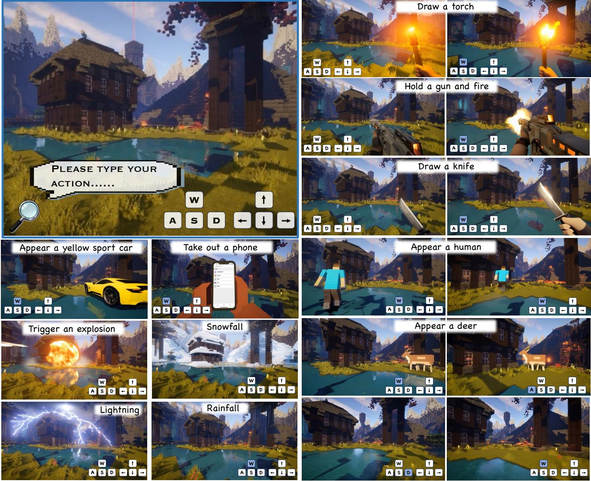  
F transition movement and $\uparrow , \left. , \downarrow , \right.$ denote changes in view angles, and white denotes an idle state.

# 摘要

近期在生成世界模型方面的进展使得创建开放式游戏环境取得了显著进展，从静态场景合成演变为动态、交互式模拟。然而，当前的方法仍受到严格的动作模式和高昂的标注成本的限制，限制了它们对多样化游戏内互动和玩家驱动动态的建模能力。为了应对这些挑战，我们引入了Hunyuan-GameCraft-2，这是一种新的基于指令驱动的互动生成游戏世界建模范式。我们的模型允许用户通过自然语言提示、键盘或鼠标信号控制游戏视频内容，而不是依赖固定的键盘输入，从而在生成的世界中实现灵活且语义丰富的互动。我们正式定义了互动视频数据的概念，并开发了一个自动化管道，将大规模、非结构化的文本-视频对转换为因果对齐的互动数据集。我们的模型基于一个14B图像到视频的专家混合模型（MoE）基础模型，结合了一个以文本驱动的互动注入机制，以实现对相机运动、角色行为和环境动态的细粒度控制。我们引入了一个专注于互动的基准，InterBench，以全面评估互动性能。大量实验表明，我们的模型生成的互动游戏视频具有时间上的一致性和因果基础，能够有效响应多样化和自由形式的用户指令，如“开门”、“画把火把”或“引发爆炸”。

# 1. 引言

扩散模型的快速发展显著推动了动态游戏内容的创作。除了静态图像或短视频合成，最近的前沿成果，从RTFM到Genie系列，表明世界模型可以作为沉浸式、可控虚拟体验的基础，这标志着向AI驱动的“可玩世界”迈出了关键一步，该世界能够模拟并响应用户的意图。

现有的世界模型可以分为基于3D和基于视频的方法。基于3D的世界模型强调几何一致性和物理准确性，使得详细的世界重建和记忆持久性成为可能。然而，它们通常仅限于脚本化或静态的交互，缺乏互动游戏环境中所必需的创造性灵活性和开放式游戏动态。随着最近视频基础模型的改进，基于视频的技术路径显示出了显著潜力。这些研究通过隐式端到端表示学习，从大规模视频数据中直接学习世界动态。值得注意的是，Genie系列引入了潜在动作建模来模拟玩家驱动的物理交互，而Matrix-Game和HunyuanGameCraft将离散的玩法动作（例如W/A/S/D、鼠标移动）融入统一的表示空间，实现了响应用户输入的连续高保真视频生成。这些前沿工作标志着重点的根本转变，从世界的静态外观“世界看起来如何”转向其互动动态“我们如何与之互动”。因此，这迫使我们在世界模型的背景下，尤其是在游戏场景中，严格界定“互动”的概念。我们正式定义世界模型中的互动为“由明确智能体执行的动作，触发环境中具有明确因果关系和物理或逻辑有效性的状态转变。”此定义涵盖了多种输入方式，从鼠标和键盘操作到具身运动传感。基于此视角，有两个主要挑战阻碍了这一进展：（1）缺乏互动视频数据的正式定义和可扩展构建管道，以及（2）在保持视频质量和交互准确性的同时实现长视频生成中的多轮交互。为了解决这些挑战，我们提出了HunyuanGameCraft-2，一种用于自由形式指令跟随控制的互动游戏世界模型。我们首先在生成世界模型的背景下正式定义互动，并开发了两个用于互动视频数据构建和完善的自动化管道。这些管道首次实现了大规模非结构化文本—视频对的高效转化，生成富含隐式因果标签的开放域互动数据集。在模型训练方面，我们的模型将基于文本的指令和键盘/鼠标动作信号整合为一个统一的可控视频生成器，能够在动态游戏环境中实现灵活、语义上扎根且因果一致的互动。为了支持高效的长视视频生成，我们采用了一种全面的自回归蒸馏策略，将双向视频生成器转化为因果自回归模型。随后，引入随机图像到长视频扩展调优方案，以减轻扩展推演过程中错误积累，确保稳定和一致的长格式生成。对于多轮互动推理，我们借鉴LongLive，采用KV重缓存机制来增强自回归长视频生成中的多轮交互的准确性和稳定性。此外，我们还引入了几项工程加速优化，将模型的推理速度提升到16帧/秒，实现实时互动视频生成。为了全面评估不同模型的互动表现，我们引入了InterBench，这是一个新的基准，系统性地测量互动行为的关键维度——包括互动完整性、动作有效性、因果连贯性和物理合理性。在InterBench和一般视频质量指标上的大量实验表明我们框架的有效性，实现了生成能忠实响应用户指令的互动视频的最先进性能，同时保持高视觉保真度和时间连贯性。总体而言，我们的主要贡献如下： • 我们提出了一个统一的可控视频生成框架，将文本、键盘和鼠标信号集成，以实现语义上扎根的互动。 • 我们利用自回归蒸馏和随机长视频调优，确保高效和稳定的长视生成，通过KV重缓存实现多轮推理，并通过工程优化达到实时16帧/秒的性能。 • 通过大量定量和定性实验，我们全面验证了所提框架的有效性，展示了在生成能忠实响应用户指令的互动视频方面，相较于其他模型的优越表现，且保持视觉质量和时间连贯性。

# 2. 相关工作

# 2.1. 长视频扩展

在长视频生成中保持时间一致性是一个主要挑战，主要源于扩散模型中“短期训练-长期测试”的差异，这通常导致语义漂移和积累的伪影。为了克服这一问题，一项主要的研究方向旨在更好地对齐训练过程与推理条件。诸如自我强迫（Self-Forcing）的方法，通过对模型自身预测进行条件化，以模拟误差积累，而滚动强迫（RollingForcing）则通过滚动窗口逐步更新上下文。另一种互补策略则集成了显式内存结构，如记忆强迫（Memory-Forcing）和流式T2V（StreamingT2V），以保留长距离依赖和全局动态。除了调整现有的训练循环外，其他研究还探索了生成范式的更根本性变化。这些包括替代性公式，如下一帧预测模型，混合扩散自回归框架如扩散强迫（DiffusionForcing），以及用于推理精细化的测试时适应。研究前沿还在向交互式和结构化合成发展，例如LongLive引入了一种KV重新缓存机制，以实现响应式语义控制，而MAGI-1则自回归地产生时间块，通过显式分区减轻误差传播。

# 2.2. 基于视频的交互式世界模型

与传统的视频生成模型生成预设序列不同，交互式世界模型动态响应用户输入，使得可探索和可玩的游戏环境得以创建（见表1）。该领域的早期探索常常利用像Minecraft这样的游戏环境作为试验平台。模型如MineWorld、Matrix和GameFactory展示了根据离散用户行为（通常是键盘和鼠标输入）生成视频的能力。同样，Yume从单个图像提示出发，通过离散的键盘命令生成交互视频。尽管开创性，这些模型通常局限于特定游戏和简单的动作空间。然而，这些模型支持的互动范围仍然十分有限。后续研究在泛化和长期一致性方面取得了进展。Genie2引入了一种基础模型，能够根据单个图像生成多样的、可控的二维世界。为了应对扩展模拟中的一致性挑战，WorldMem引入了一种内存库框架来解决长期一致性问题，而近期的工作如PAN也专注于实现交互式的长程世界模拟。在这些基础上，研究人员开始探索更灵活的交互方式。GameGen-X为开放世界游戏整合了多模态控制信号。重要的是，Genie3和Hunyuan-GameCraft通过将离散的键盘和鼠标信号统一为共享的连续动作空间，推动了这一范式的发展。这种直接控制和语言提示的融合显示出巨大的潜力。然而，这些最新作品中的提示主要用于世界设置和高层次的指导，而不是作为直接的交互控制机制。因此，交互的丰富性仍然基本受到物理输入设备离散性质的限制。

# 2.3. 基于文本的视频生成与编辑

基于文本的视频合成控制已经通过两个主要范式显著进展：增强语义理解和执行结构化计划。第一个范式侧重于丰富初始提示。这是通过融合来自大语言模型（LLMs）的表示以提供更细致的输入[39, 49]，利用LLMs对简单查询进行改写或扩展[68]，或使用轻量级适配器来弥合领域差距[68, 70]来实现的。第二个更复杂的范式将文本视为脚本或待执行的计划。在这里，LLMs充当“导演”，将高级提示分解为逐帧描述的序列，以描绘时间演变的场景[21, 22]。这一概念还扩展到协调复杂的多场景视频，具有明确的空间布局和一致性约束[36, 37]。与之相关的方法可在视频编辑中找到，其中文本指令指导诸如风格迁移或对象操作等离散任务，通常在视频到视频的框架内使得零样本或端到端控制成为可能[9, 28, 32, 45, 46]。

<table><tr><td>Model</td><td>Resolusions</td><td>Training Data</td><td>Action type</td><td></td><td>Action space Action Generalizable Scene dynamic Scene memory</td><td></td><td></td><td>Real time</td></tr><tr><td>GameNGen [54]</td><td>240p</td><td>Gameplay</td><td>Keyboard</td><td>Discrete</td><td>Closed</td><td>X</td><td>v</td><td>X</td></tr><tr><td>Oasis [12]</td><td>360p</td><td>Gameplay video</td><td>Key+Mouse</td><td>Discrete</td><td>Closed</td><td>X</td><td>X</td><td></td></tr><tr><td>GameGen-X [7]</td><td>720p</td><td>Gameplay video</td><td>Key+Mouse</td><td>Discrete</td><td>Closed</td><td></td><td></td><td></td></tr><tr><td>Matrix [13]</td><td>720p</td><td>Gameplay + Rendered</td><td>Key</td><td>Discrete</td><td>Closed</td><td>V</td><td></td><td></td></tr><tr><td>Matrix-Game [69]</td><td>720p</td><td>Gameplay + Rendered</td><td>Key+Mouse</td><td>Discrete</td><td>Closed</td><td></td><td></td><td></td></tr><tr><td>Genie 2 [43]</td><td>720p</td><td>Unknown</td><td>Key+Mouse</td><td>Unknown</td><td>Closed</td><td></td><td></td><td></td></tr><tr><td>GameFactory [66]</td><td>360p</td><td>Gameplay video</td><td>Key+Mouse</td><td>Discrete</td><td>Closed</td><td></td><td></td><td></td></tr><tr><td>GameCraft [31]</td><td>720p</td><td>Gameplay + Rendered</td><td>Key+Mouse</td><td>Continuous</td><td>Closed</td><td></td><td></td><td></td></tr><tr><td>Genie 3 [2]</td><td>720p</td><td>Unknown</td><td>Key+Mouse</td><td>Unknown</td><td>Unknown</td><td></td><td></td><td></td></tr><tr><td>GameCraft-2</td><td>480p</td><td>Gameplay + Rendered + Interaction Data</td><td>Key+Mouse + Prompt-based Instruction</td><td>Continuous</td><td>Open-ended</td><td></td><td></td><td></td></tr></table>

尽管这些方法功能强大，但本质上是非交互式的。无论是增强提示还是执行脚本，它们都基于静态的预定义命令集合进行一次性的转化。它们缺乏状态转移和持续反馈的核心概念，其中一个动作会不断重定义未来的可能性。与此形成鲜明对比的是，Hunyuan-GameCraft-2 引入了真正的交互，用户的提示持续驱动动态世界状态的演变，其目标与计划生成或脚本编辑根本不同。

# 3.1. 交互式视频数据的定义

交互视频数据是指明确记录因果驱动状态转换过程的时间序列，在该过程中，智能体或环境从一个明确定义的初始状态转换到一个显著不同的最终状态。这类数据的重要性在于它能够忠实捕捉事件随时间演变的方式，而非视觉复杂性。如果一个视频片段满足以下任一属性，则被视为交互式：•显著状态转换。该视频必须包含可识别且非平凡的宏观状态变化。它应清晰地呈现可区分的前置条件和后置条件状态，两者之间的时间内容构成转换过程。

# 3. 互动视频数据构建

目前适合训练交互式世界模型的视频数据仍然稀缺。现实世界捕获的视频具有高真实感，但收集成本高、耗时且难以扩展。使用虚幻引擎等引擎进行基于仿真的生成具有强大的视角和交互控制能力，但繁重的建模和渲染成本限制了场景多样性。来自YouTube等平台的互联网视频提供了大量的体量和多样性，但其高度不一致的质量和大量噪声要求复杂的清理流程。公共学术数据集虽然标注良好且可靠，但在规模和领域覆盖上有限。因此，这些来源没有一个能够同时满足交互性、大规模和广泛多样性的要求，导致高质量交互视频数据根本不足。这一稀缺性凸显了对何谓真正的交互数据需要更清晰的理解，我们在以下分析中进行了形式化。 • 主题的出现或交互。主要内容涉及显式主题，包括：1. 出现：在先前空白的上下文中出现新主题。2. 行动驱动：主题执行一个改变自身状态或影响环境的动作。 • 场景转变或演变。视频记录场景或背景的根本转变或演变，而非微小或随机的扰动。因此，交互视频具有显式的因果结构、清晰的状态转变和可感知的行动主体，使世界模型能够学习可解释的动作结果映射。 根据这一定义，我们系统地将交互数据组织为三个主要类别以构建我们的分析：（1）环境交互，包括全局或局部场景变化；（2）参与者动作，由具身智能体驱动；（3）实体和物体出现，涉及新主题的引入。为了方便细致评估，每个类别进一步划分为简单和复杂设置，以反映不同的难度层次。每个类别的具体示例在附录A.3中提供。

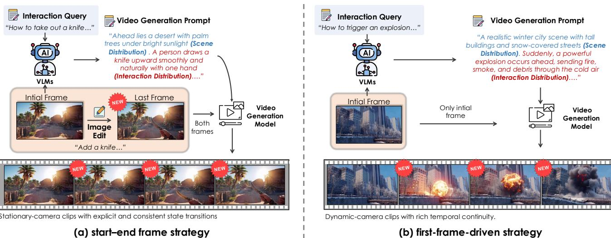  
motion-rich interactions with flexible camera movement.

# 3.2. 合成数据构建

为了解决交互视频数据稀缺和高标注成本的问题，我们提出了一种可控的合成交互视频管道，以实现大规模自动化制作。尽管为训练视频模型生成合成数据的研究尚未充分开展，但我们认为通过利用近期基础模型的先进知识和视觉表征能力，现在已经可以实现。我们在附录B（图19-21）中展示了我们的管道在生成多样化、高质量数据方面的有效性。我们从初始帧 $F _ { t }$ 开始生成交互视频。为了处理多样的视觉情境，我们首先采用视觉语言模型（VLM）分析 $F _ { t }$ ，然后在高层次指令（例如：“拿出手电筒”）的指导下，生成定制的特定场景提示。根据交互类型，我们应用两种不同策略之一：1. 开始-结束帧策略：对于需要明确状态转变的静态场景（例如，环境变化如“下雪”），VLM引导图像编辑模型生成目标结束帧 $F _ { t } ^ { \prime }$ 。这为最终状态提供了强大的可控性。2. 首帧驱动策略：对于涉及显著摄像机运动的动态动作（例如，“打开门”），模型仅从初始帧自由生成。这种方法避免了失真，并产生更平滑的摄像机运动和时间连续性。为某些交互（如“打开门”）获取特定初始帧是一个重要瓶颈，因为手动策划既昂贵又低效。为了解决这个问题，我们利用先进的文本到图像模型（例如，HunyuanImage-3.0 [5]），按需合成这些所需帧，为我们的视频生成管道提供可扩展的高质量输入来源。

# 3.3. 游戏场景数据策展

我们从超过150款AAA游戏（例如，《刺客信条》、《赛博朋克2077》）构建数据集，展示了丰富多样的环境、光照、艺术风格和摄影视角，详见附录B图17和图18。场景和动作感知数据划分。我们采用两阶段划分策略处理原始视频。首先，使用PySceneDetect [6] 将长视频划分为视觉上一致的6秒片段。随后，我们使用基于RAFT的光流 [52] 来定位细粒度的动作边界，确保每个片段在训练中保持时间完整性。数据过滤。为了确保数据质量，我们进行三阶段过滤过程。一种基于学习的模型首先去除低保真或伪影较多的帧 [29]。接下来，亮度过滤去除光照不足的场景 [3]。最后，基于VLM的语义检查验证帧间的内容一致性，只保留视觉结构干净且运动对齐准确的片段 [57]。摄像机注释。我们使用VIPE [24] 为每个片段重建6自由度的摄像机轨迹。此过程生成逐帧的平移和旋转运动估计，为训练感知摄像机的模型提供精确的元数据，并强制执行时空一致性。结构化描述。为了提供交互感知的监督，我们设计了一种包含两个部分的结构化描述方案。首先，由VLM为每个片段生成的标准描述 $( C _ { t } )$ 描述静态视觉内容。其次，交互描述 $( I _ { t t + 1 } )$ 捕捉相邻片段之间的状态转变。此交互通过各自标准描述之间的语义差异计算得出：

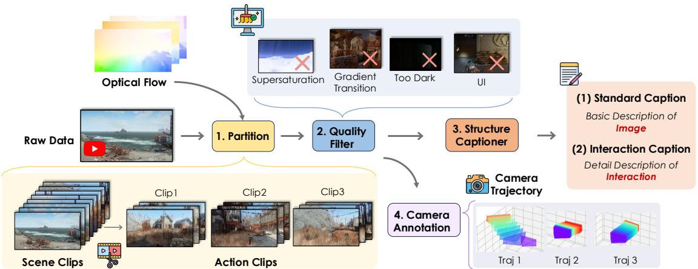

  
steps convert raw gameplay footage into clean, structured, and interaction-aware training data.   
enables both scene-level descriptions and explicit interaction-oriented annotations for supervision.

$$
I _ { t  t + 1 } = \Delta ( \Phi ( C _ { t + 1 } ) , \Phi ( C _ { t } ) ) ,
$$

其中 $\Phi$ 是语义编码器，$\Delta$ 是差异算子。这种双组件方法使得模型能够共同学习外观层面的感知（来自 $C _ { t }$）和动作层面的推理（来自 $I _ { t t + 1 }$）。

# 4. 方法

我们提出了 Hunyuan-GameCraft-2，这是一种专注于基于自由形式指令控制的互动游戏视频模型。整体框架如图 5 所示。特别地，我们的模型将自然动作注入因果架构、图像条件自回归长视频生成以及多样的多提示交互统一为一个一致的框架。本节将介绍模型架构、训练和推理过程。

# 4.1. 模型架构

我们模型的主要架构基于一个140亿参数的图像到视频混合专家（MoE）基础视频生成模型[56]。我们的目标是将这一图像到视频的扩散模型扩展为一个可控的动作生成器。如第1节所述，动作空间包括键盘输入和自由格式的文本提示。对于键盘和鼠标信号的注入（W、A、S、D、$\uparrow、\left.、\downarrow、\right. …、空格等），我们采用GameCraft-1[31]的方法，将这些离散动作信号映射为连续的摄像机控制参数。在训练过程中，标注的摄像机参数被编码为普吕克嵌入[18]，并通过词元添加的方式集成到模型中。在推理阶段，用户输入被转换为摄像机轨迹以得出这些参数。至于基于提示的交互注入，我们观察到基础模型在表达某些交互动词方面存在困难，主要是由于交互文本相较于场景描述具有更高的语义和空间复杂性。这类文本通常与特定视觉区域或对象实例紧密相关。为了解决这个问题，我们利用多模态大语言模型（MLLM）[57]来提取、推理并注入交互信息到主模型中，从而丰富与交互相关的文本指导，提高模型在训练中区分一般文本指令和细粒度交互行为的能力。这种基于摄像机条件的控制，结合基于文本的场景和交互输入，形成了一个统一机制，使得Hunyuan-GameCraft-2能够在其环境中无缝导航和交互。

  
To maintain the long-term video quality, we design a randomized long video tuning scheme(See Sec. 4.2).

# 4.2. 训练过程

为了实现长期和实时的互动视频生成，有必要将基础的双向模型提炼为一个几步的因果生成器。在本研究中，我们扩展了全面自回归蒸馏技术 SelfForcing [26]，应用于一个14B专家混合（MoE）图像到视频模型 [56]。该方案专门旨在提升长视频生成的质量和效率，这种生成往往具有大幅度和快速的场景变化。我们引入随机扩展调优以减轻误差累积。训练过程分为四个阶段：（1）动作注入训练；（2）指令导向的监督微调；（3）自回归生成器蒸馏；（4）随机长视频扩展调优。

# 4.2.1. 动作注入训练

这一阶段的主要目标是建立对三维场景动态、照明和物理的基本理解。我们加载预训练权重，并使用流匹配目标对模型进行微调，以实现建筑适应性。为了提高长期一致性，我们采用了课程学习策略。具体而言，我们将训练分为三个阶段，依次让模型接触到 $4 8 0 \mathrm { p }$ 分辨率的 45、81 和 149 帧视频数据。这种逐步方法允许模型首先巩固其对短期运动动态的理解，然后逐渐调整其注意力机制，以处理较长时间一致性所需的复杂依赖关系。此外，我们在训练过程中随机选择长短字幕，并连接交互字幕进行交互学习。这个选项将帮助模型初步感知交互信息的注入。

# 4.2.2. 以指令为导向的监督微调

为了增强模型的交互能力，我们通过将现实世界的录像与程序生成的合成视频相结合，构建了一个包含150K样本的数据集（详细信息见第3节）。这些合成序列能够为多种交互类型（例如，状态转换、主体交互）提供高保真度的监督，从而在动作与其视觉结果之间建立紧密的对应关系。在随后的阶段中，我们固定相机编码器的参数，仅对MoE专家进行微调。这个过程旨在提升模型与语义控制线索的对齐程度。

Table 2. Detailed training configurations across different stages. CP denotes context parallelism.   

<table><tr><td>Training Stage</td><td>Dataset</td><td>Data type</td><td>CP</td><td>#iters</td></tr><tr><td>Action-Injected Training</td><td>1M</td><td>Game-play &amp; Render Video</td><td>1</td><td>100k</td></tr><tr><td>Instruction-Oriented SFT</td><td>150K</td><td>Game-play &amp; Synthetic Video</td><td>1</td><td>20k</td></tr><tr><td>Autoregressive Generator Distillation</td><td>200K</td><td>Game-play &amp; Synthetic Video</td><td>4</td><td>10K</td></tr><tr><td>Randomized Long-Video Extension Tuning</td><td>100K</td><td>Game-play Long video</td><td>4</td><td>3K</td></tr></table>

18: 结束循环

  
Figure 6. Distillation Schedule for Self-Forcing post training on the MoE Model.

# 4.2.3. 自回归生成器蒸馏

对于交互式世界模型，将固定长度的视频生成器扩展到高质量的自回归长视频生成至关重要。已有研究对长视频生成进行了初步尝试。基于高噪声和低噪声的混合专家网络架构以及相机参数注入，我们针对注意力机制和蒸馏协议进行了有针对性的调整。这些修改特别旨在优化自回归蒸馏过程中的性能。

Sink Token 和块稀疏注意力：之前的研究[26, 65]采用直接滑窗方法更新因果注意力中的 KV 缓存。然而，这可能导致生成质量随时间下降，因为后续步骤无法参考初始条件帧，造成漂移。因此，受到之前工作的启发[48, 55, 62]，我们将初始帧设定为一个 sink token，始终保留在 KV 缓存中。这一修改起到两个关键作用：首先，它提升并稳定了生成质量。其次，在我们的特定任务中，sink token 提供了坐标系原点的信息。这确保在自回归过程中注入的相机参数始终与初始帧保持一致，从而避免在每个自回归步骤由于坐标原点的变动而需要重新缓存。此外，我们采用块稀疏注意力[16]进行局部注意力，更适合我们的自回归分块生成过程。具体而言，正在生成的目标块可以关注一组前面的块。这种局部注意力结合上述的 sink 注意力，构成完整的 KV 缓存，提升生成质量并加快生成速度。蒸馏计划：由于独特的特性，

# 算法 1 随机扩展长视频微调

需要：学生 $G_{ \theta }$ ，真实分数 $T_{ \mathrm { r e a l } }$ ，伪造分数 $T_{ \mathrm { f a k e } }$ ，数据集 $\mathcal { D }$ ，缓存大小 $L$ ，窗口 $K$ ，最大长度 $N_{ \mathrm { m a x } }$ ，时间步 $\{ t_{ 1 } , \dots , t_{ T } \}$ 1: 循环 2: $V_{ \mathrm { g t } } \sim \mathsf { S a m p l e } ( \mathcal { D } )$ # 采样一个真实视频 3: N \~ 采样 $\left( \mathcal { U } ( K , N_{ \operatorname* { m a x } } ) \right)$ # 随机化推理长度 4: $V_{ \mathrm { p r e d } } [ V_{ \mathrm { g t } } [ 0 ] ]$ , $\mathbf { K V } \gets \emptyset$ # 用第一帧初始化 第一步：自回归推理 5: 对 $j = 1$ 到 $N / K$ 的循环 6: $V_{ \mathrm { p r e v } } \mathsf { L a s t K F r a m e s } ( V_{ \mathrm { p r e d } } , K )$ # 自回归地扩展序列 7: Vchunk, KV ← Gθ(Vprev, KV, sink_token) 8: 附加(Vred, Vhunk) 9: 结束循环 第二步：随机窗口采样 10: $i \sim \mathsf { S a m p l e } ( \mathcal { U } \{ 1 , \dots , N - K + 1 \} )$ # 均匀采样一个预测窗口 11: $W V_{ \mathrm { p r e d } } [ i : i + K - 1 ]$ 第三步：交替强制逻辑 # 自我强制：基于预测历史条件 12: $c_{ \mathrm { s t u d e n t } } V_{ \mathrm { p r e d } } [ i - 1 ]$ # 教师强制：基于真实数据条件 13: ${ \mathfrak { s } }_{ \mathrm { t e a c h e r } } \gets V_{ \mathrm { g t } } [ i - 1 ]$ 第四步：在不同条件下的蒸馏 14: t ∼ 采样({t1, . . . , tT}), $\epsilon \sim \mathcal { N } ( 0 , \bf { I } )$ # 应用前向扩散噪声 15: $x_{ t } ( W ) \gets$ 噪声调度(W, t) # 计算 DMD 损失 16: $\mathcal { L } \gets \mathrm { D M D } \big ( T_{ \mathrm { f a k e } } ( x_{ t } ( W ) , t , c_{ \mathrm { s t u d e n t } } ) , T_{ \mathrm { r e a l } } ( x_{ t } ( W ) , t , c_{ \mathrm { t e a c h e r } } ) \big )$ # 更新生成器参数 17: θ ← θ − ηθL MoE 架构中，高噪声专家的训练和收敛比低噪声专家更具挑战性 [56]，特别是在 SFT 或蒸馏过程中。为了解决这个问题，我们为每个专家分配不同的学习率。同时，我们根据噪声水平边界重新定义蒸馏的去噪时间步长目标列表。这确保教师和学生模型在蒸馏过程中在高噪声或低噪声专家的选择上保持一致性。

# 4.2.4. 随机扩展长视频微调

我们启用长视频生成的方法是基于这样的观察：尽管基础模型是在短片段上进行预训练的，但它隐含地捕捉了全局视觉数据分布。之前的方法 [10, 62] 从因果生成器中推演长视频序列，并在扩展帧上应用分布矩量距离（DMD） [63, 64] 对齐。这一策略有效减少了自回归生成过程中的误差累积。在这一见解的基础上，我们采用一种随机扩展调优策略，使用持续时长超过10秒的长视频游戏播放数据集。在这个阶段，模型自回归地推演 $N$ 帧，并均匀采样连续的 $T$ 帧窗口以对齐预测分布和目标分布（无论是真实标注数据还是教师先验）。此外，我们随机扩展因果生成器生成的预测视频至不同长度，促进在不同时间范围内的鲁棒性。在实践中，当在窗口 $W = V [ i : i + K - 1 ]$ 推演时，学生生成器使用 sink token 和 KV 缓存，且自回归地扩展长视频，而假分数教师模型使用前一段干净预测块 $V [ i - 1 ]$ 中的最后一帧作为图像条件；而真实分数则使用原始视频中的真实帧。为了减轻在少步蒸馏过程中内在的互动能力侵蚀，我们采用了一种交替自强与教师强制的训练范式。这一方法的基本缘由是强迫模型掌握状态恢复并保持时间稳定性。关键在于，通过在生成轨迹的任意点暴露模型于多样化状态，而不是仅限于初始阶段，来实现这一目标。

# 4.3. 多轮互动推理

自注意力KV缓存。为了与训练策略保持一致，我们的推理过程采用固定长度的自注意力KV缓存，并使用滚动更新机制以促进高效的自回归生成，如图7所示。具体而言，汇聚标记永久保留在缓存窗口的开头。随后的部分作为局部注意力窗口，在多轮交互中始终保持目标去噪块之前的$N$帧。完整的KV缓存由这些汇聚标记和局部注意力组件组成，该组件通过块稀疏注意力实现。该设计不仅提高了自回归效率，还有效防止了质量漂移。ReCache机制。我们采用再缓存机制来提高自回归长视频生成中多轮交互的准确性和稳定性。在收到新的交互提示后，模型提取相应的交互嵌入，以重新计算最后一个自回归块并更新自注意力和交叉注意力KV缓存。这一策略以最小的计算开销为后续目标块提供精确的历史上下文，从而确保准确和及时的反馈，促进更顺畅的用户体验。

# 4.4. 实时交互加速

为了进一步加速推理并最小化延迟，我们采用了几种系统层优化措施：• FP8量化降低了内存带宽并利用GPU加速，同时保持视觉质量；• 并行VAE解码支持同时的潜在帧重建，缓解了长序列解码中的瓶颈；• SageAttention [67] 用优化后的量化注意力核替代了FlashAttention，实现更快的变换器计算；• 序列并行性将视频标记分布到多个GPU上，支持高效的长上下文生成。这些技术共同将推理速度提升至16帧每秒，实现稳定质量和低延迟的实时互动视频生成。

# 5. 实验

# 5.1. 模型与数据集配置。

我们将我们的方法与几个最先进的图像到视频生成基础模型进行了比较，包括HunyuanVideo、Wan2.2 A14B和LongCatVideo。为了公平起见，所有基线都在推荐或常用的推理配置下进行评估，具体如下： • HunyuanVideo。我们使用官方配置，设置如下：FLOW_SHIFT $= 7.0$，EMBEDDED_CFG_SCALE $= 6.0$，50个去噪步骤，并启用flow_reverse和$\dot{1} 2 \boldsymbol{\tau} ._stability以增强时间鲁棒性。 • Wan2.2 A14B。我们使用UniPC采样器，设置sample_shift $= 5.0$，sample_step $S = 40$，boundary $= 0.900$，并使用双阶段CFG，两个噪声模式的比例均为(3.5, 3.5)。 • LongCatVideo。我们使用默认的高质量推理设置，guidance_scale为4，50个去噪步骤，并启用编译优化以提高效率。 分辨率和数据集。为了全面评估可控的视频生成，我们构建了一个测试套件，围绕三个核心交互维度进行组织：（1）环境交互，（2）演员动作，以及（3）实体和物体外观。为了支持这一框架，我们策划了一个包含100幅图像的自定义测试集，涵盖了广泛的场景（室内/室外，自然/城市）、光照条件和视觉风格（现实主义、游戏风格、卡通）。

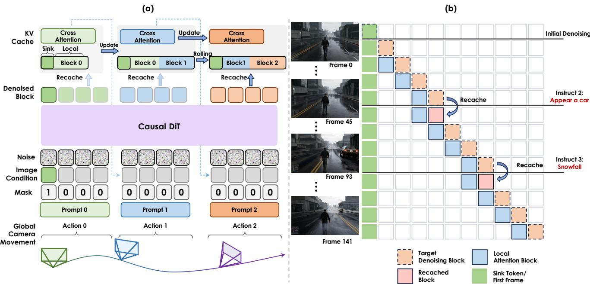  
.

此外，我们为特定动作构建了专门的子集，例如用于评估开启门动作的额外20张关闭门的图像。在所有评估中，模型要求生成统一分辨率为 ${ \bf 8 3 2 } \times { \bf 4 4 8 }$ 且固定长度为93帧的视频。

# 5.2. 评估指标

为了全面评估我们模型在视频生成方面的表现，我们采用两类互补的指标：通用视频质量指标和我们的互动焦点评估套件 InterBench。通用指标评估视觉保真度、时间一致性和运动逼真度等基础方面，提供整体视频质量的基线测量。然而，仅靠这些指标不足以捕捉到因果结构、动作执行和状态转换，这些对于互动视频生成至关重要。为了解决这一空白，InterBench 引入了六个以互动为中心的维度，每个维度专门用于评估互动行为的核心属性——包括互动完整性、动作有效性、因果一致性和物理合理性。这两类指标共同构成了一个全面而严格的互动视频模型评估框架。

# 5.2.1. 一般指标

为了对我们的模型进行全面评估，我们采用了一套多样化的评估指标。在视频真实感方面，我们使用 Fréchet 视频距离（FVD），该指标联合捕捉空间保真度和时间动态。通过图像质量和美学评分来量化视觉质量，反映了低层次的感知清晰度和高层次的视觉吸引力。我们进一步测量时间一致性，以评估跨帧的一致性并检测诸如闪烁或结构不稳定的伪影。对于动态性能，我们采用了 VBench 中的动态指数指标。我们不再使用原始的二元运动分类，而是直接报告绝对光流幅度，称为动态平均。这一连续的表述提供了对运动强度和自然性的更细腻的描述。对于交互式相机控制性能，我们采用多方面的评估协议。我们使用相对姿态误差（RPE trans 和 RPE rot）来测量轨迹控制的准确性，该误差是在对预测的重建轨迹与真实标注进行 Sim3 Umeyama 对齐后计算的。这一对齐消除了尺度和全局姿态的差异，使得 RPE 特别反映局部运动保真度和帧间控制精度。通过检查平移和旋转分量，该指标提供了更清晰的视角，以展示模型如何准确响应交互输入以及如何可靠地保持预期的运动轨迹。复杂度级别（基础和扩展），并为每个细化子集指定了提示数量。

<table><tr><td>Category</td><td>Sub-category</td><td>Level</td><td>Subset</td><td>Num</td></tr><tr><td rowspan="3">Environmental Interactions</td><td>Weather</td><td rowspan="3">Basic</td><td>Snow Rain</td><td>100 100</td></tr><tr><td></td><td>Lightning</td><td>100</td></tr><tr><td>Physical event</td><td>Explosion</td><td>100</td></tr><tr><td rowspan="3">Actor Actions</td><td>Primitive actions</td><td>Basic</td><td>Draw gun Draw knife</td><td>100 100</td></tr><tr><td rowspan="2">Composite actions</td><td rowspan="2">Extended</td><td>Take out torch</td><td>100</td></tr><tr><td>Draw and fire gun Take out and operate phone</td><td>100 100</td></tr><tr><td rowspan="9">Entity &amp; Object Appearances</td><td rowspan="3"></td><td></td><td>Open door</td><td>20</td></tr><tr><td>Basic</td><td>Cat</td><td>25</td></tr><tr><td>Basic</td><td>Dog</td><td>25</td></tr><tr><td rowspan="3">Animals</td><td>Basic</td><td>Wolf</td><td>25</td></tr><tr><td>Basic</td><td>Deer</td><td>25</td></tr><tr><td>Extended</td><td>Dragon</td><td>100</td></tr><tr><td rowspan="3">Vehicles</td><td rowspan="3">Basic</td><td>Red SUV</td><td>25</td></tr><tr><td>Blue truck</td><td>25</td></tr><tr><td>Yellow sports car Black off-road car</td><td>25</td></tr><tr><td>Humans</td><td>Extended</td><td>Human appearances</td><td>25 100</td></tr></table>

视觉质量、时间一致性、相机控制精确度和效率。

<table><tr><td rowspan="2">Model</td><td colspan="3">Visual Quality</td><td>Temporal</td><td colspan="2">RPE</td><td rowspan="2">FPS↑</td></tr><tr><td>FVD↓ Image Quality Dynamic Average↑Aesthetic↑ Temporal Consistency Trans↓ Rot↓</td><td></td><td></td><td></td><td></td><td></td></tr><tr><td>GameCraft</td><td>1554.2</td><td>0.69</td><td>67.2</td><td>0.67</td><td>0.95</td><td>0.08</td><td>0.20 0.25</td></tr><tr><td>GameCraft-PCM 1883.3</td><td></td><td>0.67</td><td>43.8 0.65</td><td>0.93</td><td>0.08</td><td>0.20</td><td>6.6</td></tr><tr><td>Matrix-Game</td><td>2260.7</td><td>0.72</td><td>31.7</td><td>0.65 0.94</td><td></td><td>0.18 0.35</td><td>0.06</td></tr><tr><td>Matrix-Game-2.0</td><td>1920.6</td><td>0.62</td><td>20.5 0.49</td><td>0.84</td><td>0.08</td><td>0.25</td><td>16</td></tr><tr><td>GameCraft-2</td><td>1856.3</td><td>0.70</td><td>45.2</td><td>0.71</td><td>0.96</td><td>0.08 0.17</td><td>16</td></tr></table>

# 5.2.2. InterBench：视频生成中的动作级交互基准测试

为了严格评估生成视频中的动作级交互，我们提出了 InterBench，这是一个专为交互视频生成量身定制的六维评估协议。InterBench 利用视觉语言模型（VLM）作为自动评估器，不仅用于测量交互是否被触发，还评估其真实度、流畅性和物理 plausibility 时间的变化。以下定义了六个核心维度。有关该协议的全面讨论，请参阅附录 D。 1. 交互触发率。一个基本的二元指标，用于评估请求的交互是否成功启动。这作为一个网关检查，将模型完全忽略提示的情况与尝试执行动作的情况区分开来。 2. 提示视频对齐。评估视频与完整提示之间的语义真实度。该维度有两个方面：静态对齐（保持场景的上下文和对象）和动态对齐（根据规定执行正确的动作）。 3. 交互流畅性。衡量交互过程的时间自然性和视觉一致性。它对时间伪影进行惩罚，例如突发跳跃、闪烁或对象传送，这些都破坏了连续运动和稳定时间线的幻觉。

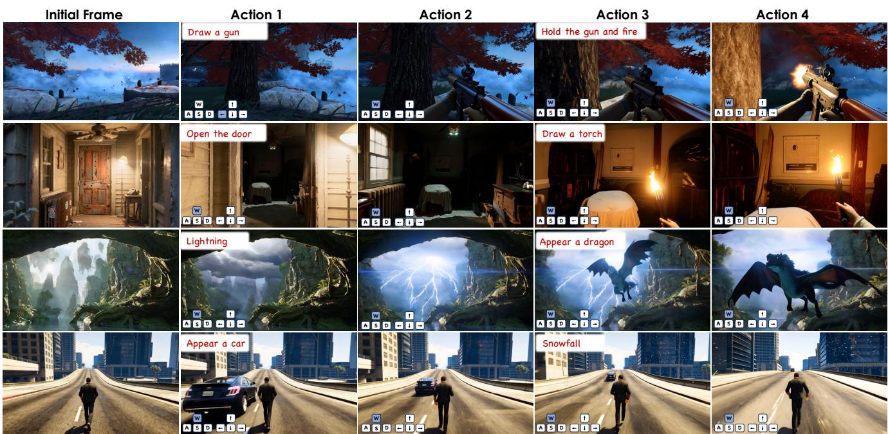  
Figure 8. Inference results by Hunyuan-GameCraft-2 on multi-action control.

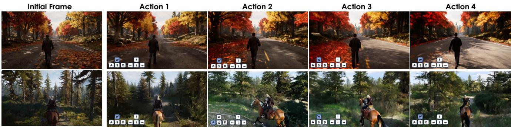  
Fgure9. Inference results by Hunyuan-GameCraft-2on the third-perspective long-term game video generation

4. 互动范围准确性。检验互动效果的空间范围是否合适。确保全球事件（如天气变化）影响整个场景，而地方性行为（如“点燃火把”）则在有限但现实的影响区域内进行。 5. 终态一致性。评估互动是否收敛到一个稳定且正确的最终状态，并保持到视频结束。这区分了成功的行为和那些仅部分完成或其效果过早消失的行为。 6. 物体物理正确性。评估互动智能体和物体的物理合理性。这包括保持刚体的结构完整性（无不自然的变形），确保运动运动学的现实性，以及保持正确的接触关系（例如，手与物体之间无穿透现象）。 评分协议。每个视频根据InterBench维度使用离散的有序评分系统进行评估。具体而言，互动触发率用二元值（成功/失败）评估，其余五个维度则接受多级有序分数，以捕捉不同程度的互动质量。这些每个视频的分数随后被平均，以产生每个互动类别的分数。通过聚合这些类别级别的结果，得到一个最终的全球InterBench分数。该分级评分协议不仅支持对特定失败模式的细致分析，还便于跨不同模型的互动能力的高层次比较。 提示设计。为了确保公平和可控的评估，我们设计了一种标准化的双部分提示策略。该方法为每个测试图像构建两个互补的组件：一个互动提示用于指定动态目标行为或事件，和一个基础提示用于描述静态场景属性，并将生成过程锚定于输入图像的外观。在推理过程中，这两个提示被串联成一个单一的条件句，并直接输入到每个模型中。这种解耦设计不仅确保所有模型收到相同的指令以实现公平比较，而且关键的是，它还通过允许我们系统地变化互动指令同时保持视觉上下文不变，实现了可控评估。

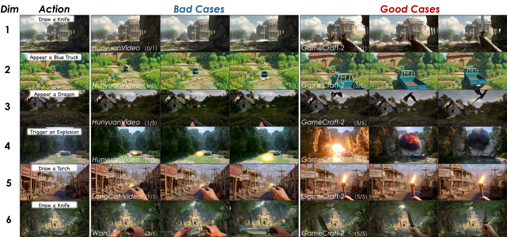  
F iit Fuey co, consistently achieves higher ratings across all dimensions.

# 5.3. 互动评估

交互评估的定量结果 我们在表5中展示了三个交互类别的定量结果。评估遵循我们提出的InterBench协议（第5.2.2节），围绕其六个核心维度进行结构化：触发、对齐、流畅性、范围、最终状态和物理性。为了提供一个用于比较的单一综合指标，我们还计算了加权总体得分：

$$
{ \begin{array} { r l } & { { \mathrm { O v e r a l l } } = \left( 5 \times { \mathrm { T r i g g e r } } + { \mathrm { A l i g n } } + { \mathrm { F l u e n c y } } \right. } \\ & { \qquad \left. + { \mathrm { S c o p e } } + { \mathrm { E n d S t a t e } } + { \mathrm { P h y s i c s } } \right) / 6 . } \end{array} }
$$

类别的定量分析（表5）表明，GameCraft-2 在启动交互方面的显著优势，从其异常高的成功率开始。该模型在环境交互方面获得了 O.962 的触发评分，而在演员动作方面则达到接近完美的 0.983，远远超出了所有基线模型。除了成功启动外，GameCraft-2 还在建模这些交互的真实性方面表现优异。这在其物理逼真度上尤为明显，在环境交互的物理评分中，该模型比下一个最佳模型超出 0.683，而在实体与物体外观方面则超过 0.52。此外，它在时间连贯性和最终状态稳定性方面也显著提升，演员动作的流畅度和最终状态评分分别提高了 $+ 0 . 7 0$ 和 $+ 0 . 6 3$。综合来看，这些结果突显了 GameCraft-2 的先进能力，不仅可靠地触发交互，还能够在语义、动态和物理一致性方面高保真呈现这些交互。

定性分析 为了直观展示性能差异，我们在图22至图24中提供了定性比较。结果清晰地突显了Hunyuan-GameCraft-2相较于基线模型的卓越表现。基线模型在处理复杂交互时常常表现出明显的不足。例如，环境效果常缺乏动态演变和逼真的光照交互。角色动作常常受到物体变形、运动不连贯和手物接触不准确的困扰。此外，新生成的实体往往遭遇身份漂移、不稳定的几何形状和与场景糟糕的融合。相比之下，Hunyuan-GameCraft-2在所有交互类别中表现出显著更高的保真度和一致性。在环境交互中，其生成的效果，如降雪，能够实现全球覆盖和动态积累，使其更具物理真实性。在角色动作中，Hunyuan-GameCraft-2产生了更连贯的动作序列，使角色能够稳定地抓握和精确操作物体，同时确保稳定的最终状态。在实体与物体外观方面，该模型持续保持物体的结构完整性和身份，与场景的光照和视角无缝融合。重要的是，这种鲁棒性还扩展到我们特定训练类别之外的概念；例如，该模型能够熟练处理涉及“电话”的交互或“龙”的出现，展示出强大的泛化能力。总的来说，这些定性例子不仅证实了我们的定量研究结果，也具体展示了Hunyuan-GameCraft-2生成语义准确、时间连贯和物理可信的复杂交互视频的强大能力。

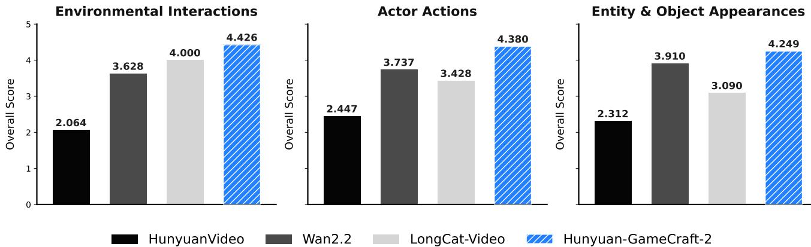  
environment-level effects. Our approach better preserves global influence and temporal stability.

  
environment-level effects. Our approach better preserves global influence and temporal stability.

超越训练分布的泛化 Hunyuan-GameCraft-2 的一个显著强项在于其能够超越训练数据中存在的特定实体和场景，泛化交互动态。该模型并非仅仅记忆视觉模式，而是内化了交互的基本结构——智能体如何发起、传播和完成状态转移。因此，HunyuanGameCraft-2 能够稳健地处理之前未见的主题和对象。例如，尽管我们的数据集中没有“人”突然出现、“龙”出现或演员“拿出手机”的实例，但该模型成功地产生了所有这些情况的连贯且物理上合理的交互。它通过利用学习到的对象出现、基于动作的因果关系以及手-物体协调的原则，实现了这一点，使其能够将新概念映射到熟悉的交互模式上。这表明该模型已经获得了可迁移的交互过程表征，使其能够推断出远超其训练分布范围的开放领域场景。

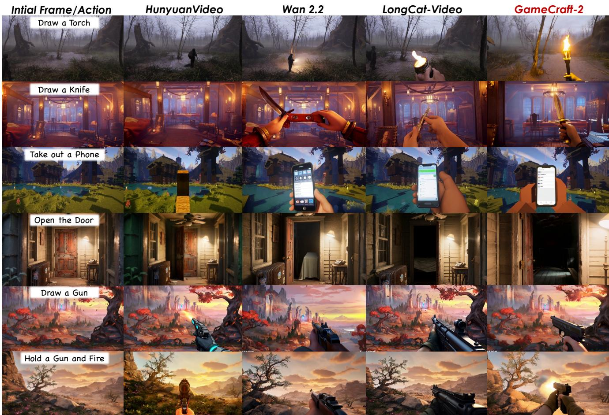  
.

六个关键互动维度，并突出我们模型的优越结果。

<table><tr><td>Category</td><td>Method</td><td>Trigger</td><td>Align</td><td>Fluency</td><td>Scope</td><td>EndState</td><td>Physics</td></tr><tr><td rowspan="4">Environmental Interactions</td><td>Wan2.2 A14B</td><td>0.799</td><td>3.511</td><td>3.579</td><td>3.722</td><td>3.951</td><td>3.008</td></tr><tr><td>LongCat-Video</td><td>0.897</td><td>3.963</td><td>3.777</td><td>4.188</td><td>4.377</td><td>3.210</td></tr><tr><td>HunyuanVideo</td><td>0.490</td><td>1.950</td><td>1.940</td><td>2.065</td><td>2.308</td><td>1.670</td></tr><tr><td>GameCraft-2</td><td>0.962</td><td>4.342</td><td>4.247</td><td>4.578</td><td>4.688</td><td>3.893</td></tr><tr><td rowspan="4">Actor Actions</td><td>Wan2.2 A14B</td><td>0.836</td><td>3.490</td><td>3.488</td><td>4.036</td><td>4.054</td><td>3.175</td></tr><tr><td>LongCat-Video</td><td>0.806</td><td>3.089</td><td>3.005</td><td>3.832</td><td>3.771</td><td>2.839</td></tr><tr><td>HunyuanVideo</td><td>0.587</td><td>2.147</td><td>2.202</td><td>2.717</td><td>2.748</td><td>1.931</td></tr><tr><td>GameCraft-2</td><td>0.983</td><td>4.087</td><td>4.191</td><td>4.576</td><td>4.686</td><td>3.828</td></tr><tr><td rowspan="4">Entity &amp; Object Appearances</td><td>Wan2.2 A14B</td><td>0.874</td><td>3.943</td><td>3.545</td><td>4.281</td><td>4.265</td><td>3.054</td></tr><tr><td>LongCat-Video</td><td>0.712</td><td>3.050</td><td>2.758</td><td>3.340</td><td>3.482</td><td>2.352</td></tr><tr><td>HunyuanVideo</td><td>0.607</td><td>2.037</td><td>1.870</td><td>2.736</td><td>2.734</td><td>1.462</td></tr><tr><td>GameCraft-2</td><td>0.944</td><td>4.292</td><td>3.978</td><td>4.410</td><td>4.514</td><td>3.578</td></tr></table>

  
aninteracticorectess.Ourmethd deliver moreaccurate, able, nd physicaly plausbljebehavors.

长视频微调和缓存设置分析 我们定性分析了长视频微调和键值缓存设置的影响，特别是关于汇聚词元和局部注意力。正如图16所示，我们在对齐的时间步长中比较生成的帧，随机扩展长视频微调的整合在第450帧之后显著提高了视频的保真度和运动一致性。此外，扩展汇聚词元和局部注意力的大小可以丰富细节，但会增加伪影。这些观察结果证实了我们微调策略的有效性，以及利用汇聚词元和局部注意力以维持强健上下文的重要性。

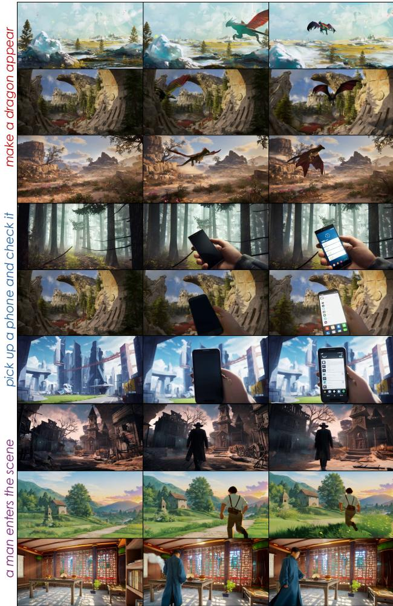  
Figure 15. Generalization to Unseen Entities and Actions. Examples showing that Hunyuan-GameCraft-2 successfully handles interactions involving previously unseen subjects and objects The model produces coherent and physically plausible state transitions despite these cases being absent from the training data.

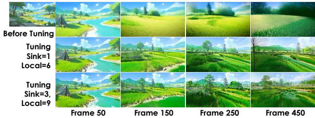  
Figure 16. Qualitative Analysis of Long-Video Tuning and Cache Settings. Row 1: Baseline results without Long-Video Tuning (sink token size $= 1$ , local attention $\mathrm { s i z e } = 6$ ). Row 2: Incorporates Long-Video Tuning upon the baseline. Row 3: Further modifies setting based on Row 2 by increasing the sink token size to 3 and local attention size to 9. Input prompts and camera parameters remain consistent across all samples.

# 6. 限制与未来工作

尽管我们的方法取得了进展，但仍存在一些局限性，突显了未来研究的方向。首先，虽然我们的随机长视频调优策略缓解了自回归生成中的误差累积，但并未完全消除这一问题，语义漂移在长序列中仍可能出现（超过500帧）。这部分归因于我们模型缺乏显式的长期记忆机制，而这对于高级世界模型来说是一个关键组成部分，因为它依赖于其有限的KV缓存容量。此外，当前支持的交互范围主要集中在单步、即时效果的动作上。实现需要逻辑推理或规划的多阶段任务仍然是一个重要的未来挑战。最后，尽管我们在16帧每秒时实现了实时性能，但仍需进一步优化以减少高反应性游戏的延迟，并能够在更易获取的硬件上进行部署。

# 7. 结论

在本研究中，我们介绍了Hunyuan-GameCraft-2，这是一种互动游戏世界模型，能够生成高保真、可控的视频，响应自由形式的文本指令及键盘/鼠标操作。我们正式定义了互动视频数据，并提出了其策展和合成的自动化流程，有效解决了这一领域中阻碍进展的数据瓶颈。我们的模型在一个稳健的训练框架内统一了多模态控制信号，利用一种新颖的随机长视频微调方案和高效的推理机制（如KV-recache），实现了稳定、长时程和实时的互动生成。为了严格评估我们的贡献，我们推出了InterBench，这是一个专门设计用于评估动作级互动质量的新基准。广泛的实验表明，GameCraft-2在互动真实性、视觉质量和时间一致性等所有维度上显著超越现有的最先进模型。通过将被动视频合成的前沿推向积极的用户驱动世界生成，我们的工作标志着朝着创造真正可玩和沉浸式的AI生成虚拟体验迈出了重要一步。

# References

[1] Sand. ai, Hansi Teng, Hongyu Jia, Lei Sun, Lingzhi Li, Maolin Li, Mingqiu Tang, Shuai Han, Tianning Zhang, W. Q. Zhang, Weifeng Luo, Xiaoyang Kang, Yuchen Sun, Yue Cao, Yunpeng Huang, Yutong Lin, Yuxin Fang, Zewei Tao, Zheng Zhang, Zhongshu Wang, Zixun Liu, Dai Shi, Guoli Su, Hanwen Sun, Hong Pan, Jie Wang, Jiexin Sheng, Min Cui, Min Hu, Ming Yan, Shucheng Yin, Siran Zhang, Tingting Liu, Xianping Yin, Xiaoyu Yang, Xin Song, Xuan Hu, Yankai Zhang, and Yuqiao Li. Magi-1: Autoregressive video generation at scale, 2025.   
[2] Philip J. Ball, Jakob Bauer, Frank Belletti, Bethanie Brownfield, Ariel Ephrat, Shlomi Fruchter, Agrim Gupta, Kristian Holsheimer, Aleksander Holynski, Jiri Hron, Christos Kaplanis, Marjorie Limont, Matt McGill, Yanko Oliveira, Jack Parker-Holder, Frank Perbet, Guy Scully, Jeremy Shar, Stephen Spencer, et al. Genie 3: A new frontier for world models. 2025.   
[3] Gary Bradski. The opencv library. Dr. Dobb's Journal: Software Tools for the Professional Programmer, 25(11):120 123, 2000.   
[4] Tim Brooks, Bill Peebles, Connor Holmes, Will DePue, Yufei Guo, Li Jing, David Schnurr, Joe Taylor, Troy Luhman, Eric Luhman, Clarence Ng, Ricky Wang, and Aditya Ramesh. Video generation models as world simulators. 2024.   
[5] Siyu Cao, Hangting Chen, Peng Chen, Yiji Cheng, Yutao Cui, Xinchi Deng, Ying Dong, Kipper Gong, Tianpeng Gu, Xiusen Gu, et al. Hunyuanimage 3.0 technical report. arXiv preprint arXiv:2509.23951, 2025.   
[6] Brandon Castellano. PySceneDetect.   
[7] Haoxuan Che, Xuanhua He, Quande Liu, Cheng Jin, and Hao Chen. Gamegen-x: Interactive open-world game video generation. In International Conference on Learning Representations, 2025.   
[8] Boyuan Chen, Diego Martí Monsó, Yilun Du, Max Simchowitz, Russ Tedrake, and Vincent Sitzmann. Diffusion forcing: Next-token prediction meets full-sequence diffusion. Advances in Neural Information Processing Systems, 37:2408124125, 2024.   
[9] Jiaxin Cheng, Tianjun Xiao, and Tong He. Consistent videoto-video transfer using synthetic dataset, 2023.   
10] Justin Cui, Jie Wu, Ming Li, Tao Yang, Xiaojie Li, Rui Wang, Andrew Bai, Yuanhao Ban, and Cho-Jui Hsieh. Selfforcing $^ { + + }$ : Towards minute-scale high-quality video generation. arXiv preprint arXiv:2510.02283, 2025.   
11] Karan Dalal, Daniel Koceja, Gashon Hussein, Jiarui Xu, Yue Zhao, Youjin Song, Shihao Han, Ka Chun Cheung, Jan Kautz, Carlos Guestrin, et al. One-minute video generation with test-time training. arXiv preprint arXiv:2504.05298, 2025.   
12] Decard. Oasis: A universe in a transformer. ht tps : / / www . decart.ai/articles/oasis-interactive-aivideo-game-model,2024.   
13] Ruili Feng, Han Zhang, Zhantao Yang, Jie Xiao, Zhilei Shu, Zhiheng Liu, Andy Zheng, Yukun Huang, Yu Liu, and Hongyang Zhang. The matrix: Infinite-horizon world generation with real-time moving control. arXiv preprint • 2412 02500,2004   
[14] Kaifeng Gao, Jiaxin Shi, Hanwang Zhang, Chunping Wang, u XiViIu yl sive generation in video diffusion models. arXiv preprint arXiv:2406.10981, 2024.   
[15] Yuchao Gu, Weijia Mao, and Mike Zheng Shou. Long-context autoregressive video modeling with next-frame prediction. arXiv preprint arXiv:2503.19325, 2025.   
[16] Junxian Guo, Haotian Tang, Shang Yang, Zhekai Zhang, Zhijian Liu, and Song Han. Block Sparse Attention. https : //github.com/mit-han-lab/Block-SparseAttention, 2024.   
[17] Junliang Guo, Yang Ye, Tianyu He, Haoyu Wu, Yushu Jiang, Tim Pearce, and Jiang Bian. Mineworld: a real-time and open-source interactive world model on minecraft, 2025.   
[18] Hao He, Yinghao Xu, Yuwei Guo, Gordon Wetzstein, Bo Dai, Hongsheng Li, and Ceyuan Yang. Cameractrl: Enabling camera control for text-to-video generation. arXiv preprint arXiv:2404.02101, 2024.   
[19] Roberto Henschel, Levon Khachatryan, Hayk Poghosyan, Daniil Hayrapetyan, Vahram Tadevosyan, Zhangyang Wang, Shant Navasardyan, and Humphrey Shi. Streamingt2v: Consistent, dynamic, and extendable long video generation from text. arXiv preprint arXiv:2403.14773, 2024.   
[20] Jonathan Ho, Ajay Jain, and Pieter Abbeel. Denoising Diffusion Probabilistic Models, 2020. arXiv:2006.11239 [cs].   
[21] Susung Hong, Junyoung Seo, Heeseong Shin, Sunghwan Hong, and Seungryong Kim. Direct2v: Large language models are frame-level directors for zero-shot text-to-video generation, 2024.   
[22] Hanzhuo Huang, Yufan Feng, Cheng Shi, Lan Xu, Jingyi Yu, and Sibei Yang. Free-bloom: Zero-shot text-to-video generator with llm director and ldm animator, 2023.   
[23] Junchao Huang, Xinting Hu, Boyao Han, Shaoshuai Shi, Zhuotao Tian, Tianyu He, and Li Jiang. Memory forcing: Spatio-temporal memory for consistent scene generation on minecraft, 2025.   
[24] Jiahui Huang, Qunjie Zhou, Hesam Rabeti, Aleksandr Korovko, Huan Ling, Xuanchi Ren, Tianchang Shen, Jun Gao, Dmitry Slepichev, Chen-Hsuan Lin, Jiawei Ren, Kevin Xie, Joydeep Biswas, Laura Leal-Taixe, and Sanja Fidler. Vipe: Video pose engine for 3d geometric perception. In NVIDIA Research Whitepapers arXiv:2508.10934, 2025.   
[25] Tianyu Huang, Wangguandong Zheng, Tengfei Wang, Yuhao Liu, Zhenwei Wang, Junta Wu, Jie Jiang, Hui Li, Rynson WH Lau, Wangmeng Zuo, and Chunchao Guo. Voyager: Longrange and world-consistent video diffusion for explorable 3d scene generation. arXiv preprint arXiv:2506.04225, 2025.   
[26] Xun Huang, Zhengqi Li, Guande He, Mingyuan Zhou, and Eli Shechtman. Self forcing: Bridging the train-test gap in autoregressive video diffusion, 2025.   
[27] Ziqi Huang, Yinan He, Jiashuo Yu, Fan Zhang, Chenyang Si, Yuming Jiang, Yuanhan Zhang, Tianxing Wu, Qingyang Jin, Nattapol Chanpaisit, et al. Vbench: Comprehensive benchmark suite for video generative models. In Proceedings of the IEEE/CVF Conference on Computer Vision and Pattern Recognition, pages 2180721818, 2024.   
[28] Levon Khachatryan, Andranik Movsisyan, Vahram Tadevosyan, Roberto Henschel, Zhangyang Wang, Shant Navasardyan, and Humphrey Shi. Text2video-zero: Textto-image diffusion models are zero-shot video generators, 2023.   
[29] KolorsTeam. Kolors: Effective training of diffusion model for photorealistic text-to-image synthesis. arXiv preprint, 2024.   
[30] Weijie Kong, Qi Tian, Zijian Zhang, Rox Min, Zuozhuo Dai, Jin Zhou, iag Xiog, Xin Bo Wu, Jiaa et al. Hunyuanvideo: A systematic framework for large video generative models. arXiv preprint arXiv:2412.03603, 2024.   
[31] Jiaqi Li, Junshu Tang, Zhiyong Xu, Longhuang Wu, Yuan Zhou, Shuai Shao, Tianbao Yu, Zhiguo Cao, and Qinglin Lu. Hunyuan-gamecraft: High-dynamic interactive game video generation with hybrid history condition, 2025.   
[32] Xirui Li, Chao Ma, Xiaokang Yang, and Ming-Hsuan Yang. Vidtome: Video token merging for zero-shot video editing, 2023.   
[33] Xinyang Li, Tengfei Wang, Zixiao Gu, Shengchuan Zhang, Chunchao Guo, and Liujuan Cao. FlashWorld: High-quality 3D Scene Generation within Seconds, 2025.   
[34] Zhimin Li, Jianwei Zhang, and and others Lin. HunyuanDiT: A powerful multi-resolution diffusion transformer with fine-grained chinese understanding.   
[35] Zhen Li, Chuanhao Li, Xiaofeng Mao, Shaoheng Lin, Ming Li, Shitian Zhao, Zhaopan Xu, Xinyue Li, Yukang Feng, Jianwen Sun, Zizhen Li, Fanrui Zhang, Jiaxin Ai, Zhixiang Wang, Yuwei Wu, Tong He, Jiangmiao Pang, Yu Qiao, Yunde Jia, and Kaipeng Zhang. Sekai: A video dataset towards world exploration, 2025.   
[36] Long Lian, Boyi Li, Adam Yala, and Trevor Darrell. Llmgrounded diffusion: Enhancing prompt understanding of textto-image diffusion models with large language models, 2024.   
[37] Han Lin, Abhay Zala, Jaemin Cho, and Mohit Bansal. Videodirectorgpt: Consistent multi-scene video generation via llm-guided planning, 2024.   
[38] Kunhao Liu, Wenbo Hu, Jiale Xu, Ying Shan, and Shijian Lu. Rolling forcing: Autoregressive long video diffusion in real time, 2025.   
[39] Mushui Liu, Yuhang Ma, Yang Zhen, Jun Dan, Yunlong Yu, Zeng Zhao, Zhipeng Hu, Bai Liu, and Changjie Fan. Llm4gen: Leveraging semantic representation of lms for text-to-image generation, 2024.   
[40] Yifan Liu, Zhiyuan Min, Zhenwei Wang, Junta Wu, Tengfei Wang, Yixuan Yuan, Yawei Luo, and Chunchao Guo. Worldmirror: Universal 3d world reconstruction with any-prior prompting. arXiv preprint arXiv:2510.10726, 2025.   
[41] Xiaoxiao Long, Qingrui Zhao, Kaiwen Zhang, Zihao Zhang, Dingrui Wang, Yumeng Liu, Zhengjie Shu, Yi Lu, Shouzheng Wang, Xinzhe Wei, Wei Li, Wei Yin, Yao Yao, Jia Pan, Qiu Shen, Ruigang Yang, Xun Cao, and Qionghai Dai. A survey: Learning embodied intelligence from physical simulators and world models, 2025.   
[42] Xiaofeng Mao, Shaoheng Lin, Zhen Li, Chuanhao Li, Wenshuo Peng, Tong He, Jiangmiao Pang, Mingmin Chi, Yu Qiao, and Kaipeng Zhang. Yume: An interactive world generation model, 2025.   
[43] JackParker-Holder, Philip Bal Jke Bruce, Vibhavari Dasagi, Kristian Holsheimer. Christos Kaplanis. Alexandre Moufarek. Guy Scully, Jeremy Shar, Jimmy Shi, Stephen Spencer, Jessca Yung, Michael Dennis, Sultan Kenjeyev, Shangbang Long, Vlad Mnih, Harris Chan, Maxime Gazeau, Bonnie Li, Fabio Pardo, Luyu Wang, Lei Zhang, Frederic Besse, Tim Harley, Anna Mitenkova, Jane Wang, Jeff Clune, Demis Hassabis, Raia Hadsell Adrian Bolton, Satinder Singh, and Tim Rocktäschel. Genie 2: A large-scale foundation world model. 2024.   
[44] William Peebles and Saining Xie. Scalable Diffusion Models with Transformers, 2023. arXiv:2212.09748 [cs].   
[45] Chenyang Qi, Xiaodong Cun, Yong Zhang, Chenyang Lei, Xintao Wang, Ying Shan, and Qifeng Chen. Fatezero: Fusing attentions for zero-shot text-based video editing, 2023.   
[46] Bosheng Qin, Juncheng Li, Siliang Tang, Tat-Seng Chua, and Yueting Zhuang. Instructvid2vid: Controllable video editing with natural language instructions, 2024.   
[47] Robin Rombach, Andreas Blattmann, Dominik Lorenz, Patrick Esser, and Björn Ommer. High-Resolution Image Synthesis with Latent Diffusion Models, 2022. arXiv:2112.10752 [cs].   
[48] Joonghyuk Shin, Zhengqi Li, Richard Zhang, Jun-Yan Zhu, Jaesik Park, Eli Schechtman, and Xun Huang. Motionstream: Real-time video generation with interactive motion controls. arXiv preprint arXiv:2511.01266, 2025.   
[49] Shuai Tan, Biao Gong, Yutong Feng, Kecheng Zheng, Dandan Zheng, Shuwei Shi, Yujun Shen, Jingdong Chen, and Ming Yang. Mimir: Improving video diffusion models for precise text understanding, 2024.   
[50] HunyuanWorld Team, Zhenwei Wang, Yuhao Liu, Junta Wu, Zixiao Gu, Haoyuan Wang, Xuhui Zuo, Tianyu Huang, Wenhuan Li, Sheng Zhang, Yihang Lian, Yulin Tsai, and Wangand others. HunyuanWorld 1.0: Generating Immersive, Explorable, and Interactive 3D Worlds from Words or Pixels, 2025.   
[51] PAN Team, Jiannan Xiang, Yi Gu, Zihan Liu, Zeyu Feng, Qiyue Gao, Yiyan Hu, Benhao Huang, Guangyi Liu, Yichi Yang, Kun Zhou, Davit Abrahamyan, Arif Ahmad, Ganesh Bannur, Junrong Chen, Kimi Chen, Mingkai Deng, Ruobing Han, Xinqi Huang, Haoqiang Kang, Zheqi Liu, Enze Ma, Hector Ren, Yashowardhan Shinde, Rohan Shingre, Ramsundar Tanikella, Kaiming Tao, Dequan Yang, Xinle Yu, Cong Zeng, Binglin Zhou, Zhengzhong Liu, Zhiting Hu, and Eric P. Xing. Pan: A world model for general, interactable, and long-horizon world simulation, 2025.   
[52] Zachary Teed and Jia Deng. Raft: Recurrent all-pairs field transforms for optical flow. In Computer VisionECCV 2020: 16th European Conference, Glasgow, UK, August 2328, 2020, Proceedings, Part II 16, pages 402419. Springer, 2020.   
[53] Thomas Unterthiner, Sjoerd Van Steenkiste, Karol Kurach, Raphaël Marinier, Marcin Michalski, and Sylvain Gelly. Fvd: A new metric for video generation. 2019.   
[54] Dani Valevski, Yaniv Leviathan, Moab Arar, and Shlomi Fruchter. Diffusion models are real-time game engines. arXiv preprint arXiv:2408.14837, 2024.   
[55] Florentina Voboril, Vaidyanathan Peruvemba Ramaswamy, and Stefan Szeider. Streamllm: Enhancing constraint programming with large language model-generated streamliners.   
[67] Jintao Zhang, Jia Wei, Haofeng Huang, Pengle Zhang, Jun Zhu, and Jianfei Chen. Sageattention: Accurate 8-bit attention for plug-and-play inference acceleration, 2025.   
[68] Xiangjun Zhang, Litong Gong, Yinglin Zheng, Yansong Liu, Wentao Jiang, Mingyi Xu, Biao Wang, Tiezheng Ge, and Ming Zeng. Rise-t2v: Rephrasing and injecting semantics with llm for expansive text-to-video generation, 2025.   
[69] Yifan Zhang, Chunli Peng, Boyang Wang, Puyi Wang, Qingcheng Zhu, Zedong Gao, Eric Li, Yang Liu, and Yahui Zhou. Matrix-game: Interactive world foundation model. arXiv, 2025.   
[70] Shihao Zhao, Shaozhe Hao, Bojia Zi, Huaizhe Xu, and KwanYee K. Wong. Bridging different language models and generative vision models for text-to-image generation, 2024.   
[71] Tinghui Zhou, Richard Tucker, John Flynn, Graham Fyffe, and Noah Snavely. Stereo magnification: Learning view synthesis using multiplane images, 2018. In 2025 IEEE/ACM 1st International Workshop on NeuroSymbolic Software Engineering (NSE), pages 1722. IEEE Computer Society, 2025.   
[56] Team Wan, Ang Wang, Baole Ai, Bin Wen, Chaojie Mao, Chen-Wei Xie, Di Chen, Feiwu Yu, Haiming Zhao, Jianxiao Yang, Jianyuan Zeng, Jiayu Wang, Jingfeng Zhang, Jingren Zhou, Jinkai Wang, Jixuan Chen, Kai Zhu, Kang Zhao, Keyu Yan, Lianghua Huang, Mengyang Feng, Ningyi Zhang, Pandeng Li, Pingyu Wu, Ruihang Chu, Ruili Feng, Shiwei Zhang, Siyang Sun, Tao Fang, Tianxing Wang, Tianyi Gui, Tingyu Weng, Tong Shen, Wei Lin, Wei Wang, Wei Wang, Wenmeng Zhou, Wente Wang, Wenting Shen, Wenyuan Yu, Xianzhong Shi, Xiaoming Huang, Xin Xu, Yan Kou, Yangyu Lv, Yifei Li, Yijing Liu, Yiming Wang, Yingya Zhang, Yitong Huang, Yong Li, You Wu, Yu Liu, Yulin Pan, Yun Zheng, Yuntao Hong, Yupeng Shi, Yutong Feng, Zeyinzi Jiang, Zhen Han, Zhi-Fan Wu, and Ziyu Liu. Wan: Open and advanced largescale video generative models.   
[57] Peng Wang, Shuai Bai, Sinan Tan, Shijie Wang, Zhihao Fan, Jinze Bai, Keqin Chen, Xuejing Liu, Jialin Wang, Wenbin Ge, et al. Qwen2-vl: Enhancing vision-language model's perception of the world at any resolution. arXiv preprint arXiv:2409.12191, 2024.   
[58] Thaddäus Wiedemer, Yuxuan Li, Paul Vicol, Shixiang Shane Gu, Nick Matarese, Kevin Swersky, Been Kim, Priyank Jaini, and Robert Geirhos. Video models are zero-shot learners and reasoners. arXiv preprint arXiv:2509.20328, 2025.   
[59] WorldLabs. Generating worlds. https://www. worldlabs.ai/blog,2024.   
[60] WorldLabs. Rtfm: A real-time frame model. https : / / www.worldlabs.ai/blog/rtfm,2025.   
[61] Zeqi Xiao, Yushi Lan, Yifan Zhou, Wenqi Ouyang, Shuai Yang, Yanhong Zeng, and Xingang Pan. WORLDMEM: Long-term Consistent World Simulation with Memory, 2025. arXiv:2504.12369 [cs].   
[62] Shuai Yang, Wei Hug, Ruihang Chu, Yicheng Xiao, Yyang Zhao, Xianbang Wang, Muyang Li, Enze Xie, Yingcong Chen, Yao Lu, Song Han, and Yukang Chen. Longlive: Realtime interactive long video generation, 2025.   
[63] Tianwei Yin, Michaël Gharbi, Taesung Park, Richard Zhang, Eli Shechtman, Fredo Durand, and Bill Freeman. Improved distribution matching distillation for fast image synthesis. Advances in neural information processing systems, 37:47455 47487, 2024.   
[64] Tianwei Yin, Michaël Gharbi, Richard Zhang, Eli Shechtman, Fredo Durand, William T Freeman, and Taesung Park. One-step diffusion with distribution matching distillation. In Proceedings of the IEEE/CVF conference on computer vision and pattern recognition, pages 66136623, 2024.   
[65] Tianwei Yin, Qiang Zhang, Richard Zhang, William T. Freeman, Fredo Durand, Eli Shechtman, and Xun Huang. From slow bidirectional to fast autoregressive video diffusion models, 2025.   
[66] Jiwen Yu, Yiran Qin, Xintao Wang, Pengfei Wan, Di Zhang, and Xihui Liu. Gamefactory: Creating new games with generative interactive videos. arXiv preprint arXiv:2501.08325, 2025.

# A. Illustrative Examples of Interactive Video Data

To provide a comprehensive understanding of our definition, we present representative examples that clarify the boundary between interactive and non-interactive video data.

# A.1. Positive Examples: Interactive Video Data

The following examples satisfy one or more properties of interactive video data, exhibiting clear causal structures and perceivable state transitions.

# Subject Emergence.

•Example 1: Vehicle Appearance. An empty street (initial state) transitions as a car enters from off-screen and parks at the roadside (transition process), culminating in a scene depicting "a car parked on the street" (final state). The automobile constitutes the emergent core subject, transforming the scene from vacant to occupied.

•Example 2: Object Retrieval. From a first-person perspective, the frame initially contains only a pair of hands (initial state). The hands retrieve a key from a pocket and hold it prominently (transition process), resulting in a final state of "hands holding a key" (final state). The key represents the emergent core subject.

# Action-Driven Interaction.

•Example 3: Door Opening. The scene begins with a subject standing before a closed door (initial state). The subject pushes the door open (transition process), leading to a fully open door (final state). This exemplifies direct interaction where the subject acts upon an object, inducing a clear state change.

•Example 4: Weapon Discharge. A character aims a firearm at a target (initial state), pulls the trigger (transition process), resulting in projectile impact and target destruction (final state). This demonstrates actionconsequence causality with observable physical effects.

# Environmental State Evolution.

•Example 5: Weather Transition. A clear sky (initial state) undergoes gradual cloud accumulation followed by snowfall of increasing intensity (transition process), ultimately blanketing the entire scene in heavy snow (final state). This represents a fundamental transformation of the environmental weather attribute.

•Example 6: Spatial Transition. Upon opening a door, the camera view shifts from an interior room (initial scene) to an exterior courtyard (final scene). This exemplifies a discrete scene transition driven by subject action, fundamentally altering the observational context.

# A.2. Negative Examples: Non-Interactive Video Data

These examples, though visually dynamic, lack the defining characteristics of interactive video data.

# Continuous Static Process.

•Example 1: Sustained Blizzard. A 10-second video segment depicting continuous heavy snowfall. Although visually dynamic, the macroscopic state remains constant as "actively snowing throughout," lacking a transition from "no snow" to "snow present." The absence of state evolution disqualifies this as interactive data.

# Stochastic Background Activity.

•Example 2: Busy Intersection. A scene featuring continuous pedestrian and vehicular traffic at a crowded intersection. While abundant motion exists, there is no singular event-driven macroscopic state change with definitive beginning and end points. The scene's overarching state persistently remains "busy intersection," lacking a coherent causal narrative.

# Generalized Motion without Core Subject.

•Example 3: Ambient Environmental Fluctuations. Ripples propagating across a water surface or leaves swaying in wind. These phenomena typically constitute random environmental perturbations rather than state transitions driven by specific subjects or events with explicit causal chains. They lack the purposeful, agent-driven transformation characteristic of interactive data.

# A.3. Interaction Categories

Following the definition of interactive data in the main text, we provide here a detailed breakdown of the three principal interaction categories used to structure our dataset and analysis. Each category includes both simple and complex settings to reflect different levels of difficulty and to facilitate a fine-grained evaluation of model capabilities.

(1) Environmental Interactions. These interactions reflect global or local scene changes. Simple cases include atmospheric effects such as snowfall and rainfall. Complex cases involve more substantial causal transformations, such as lightning strikes or triggering an explosion, which require coherent illumination changes, particle dynamics, and physically plausible propagation.

(2) Actor Actions. These interactions are driven by an embodied or first-person actor. Simple cases include basic manipulation actions such as drawing a gun or drawing a knife. Complex cases require multi-step or environmentaffecting interactions, such as drawing a torch to illuminate the surroundings, firing a gun, taking out a phone and operating it, or opening a door. These demand consistent bodyobject coordination and temporal stability.

(3) Entity and Object Appearances. These interactions introduce new entities into the scene. Simple cases include the appearance of a single human or common object. Complex cases involve entities with more distinct geometry or motion priors, such as animals (cat, dog, deer, wolf, dragon) or vehicles (red SUV, yellow sports car, blue truck, black off-road vehicle), which require accurate spatial placement, scale consistency, and stable identity preservation.

outperforming existing models across diverse interaction scenarios.

# B. Dataset Showcase

This appendix provides visual examples from our constructed dataset, which is composed of two primary sources: curated real-world gameplay footage and synthetically generated interactive videos. The following sections showcase the diversity and quality of each data type.

# B.1. Curated Gameplay Data

The following figures illustrate the rich diversity of our curated gameplay data, collected from over 150 AAA games. As shown, the dataset covers a wide array of interaction contexts, including both first-person and third-person viewpoints (Fig. 17), as well as a comprehensive range of environments spanning natural and urban scenes under various lighting, weather, and terrain conditions (Fig. 18). This diversity is crucial for training robust and generalizable world models.

# B.2. Synthetic Interaction Data

Generated by our synthetic data pipeline, the following examples demonstrate the pipeline's capability to create controlled and high-quality interactive videos. These examples cover the three main interaction categories defined in our work: Environmental Interactions such as weather changes and explosions (Fig. 19), Actor Actions involving complex body-object coordination (Fig. 20), and Entity/Object Appearances that introduce new subjects into the scene with high fidelity (Fig. 21).

# C. Detailed Comparison Across Interaction Dimensions

In this section, we present a concise comparison of our approach against baseline models across three key dimensions of interactive video generation: environmental interactions, actor—action dynamics, and entity or object appearance behaviors. As illustrated in Figures 2224, our method achieves higher temporal stability, more coherent action execution, and more accurate object emergence, consistently

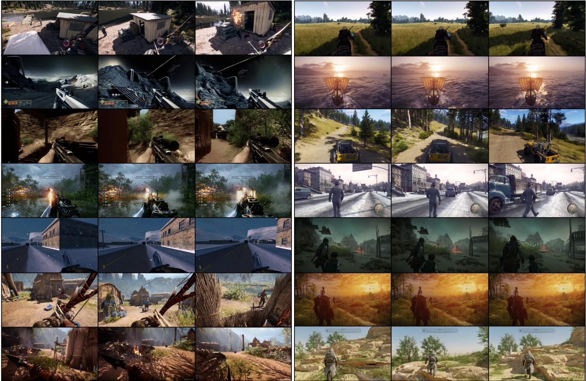  
h different viewpoints, illustrating rich interactive semantics captured from our gameplay collection.

  
ei urban scenes, under diverse lighting, weather, and terrain conditions.

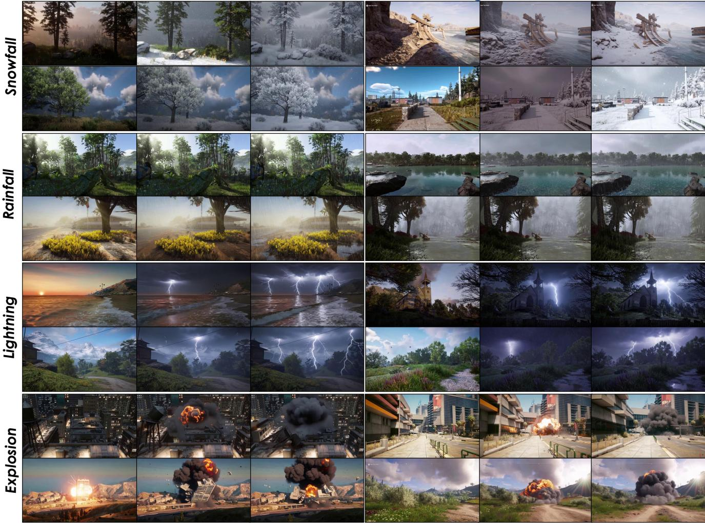  
covering snowfall, rainfall, lightning, and explosions.

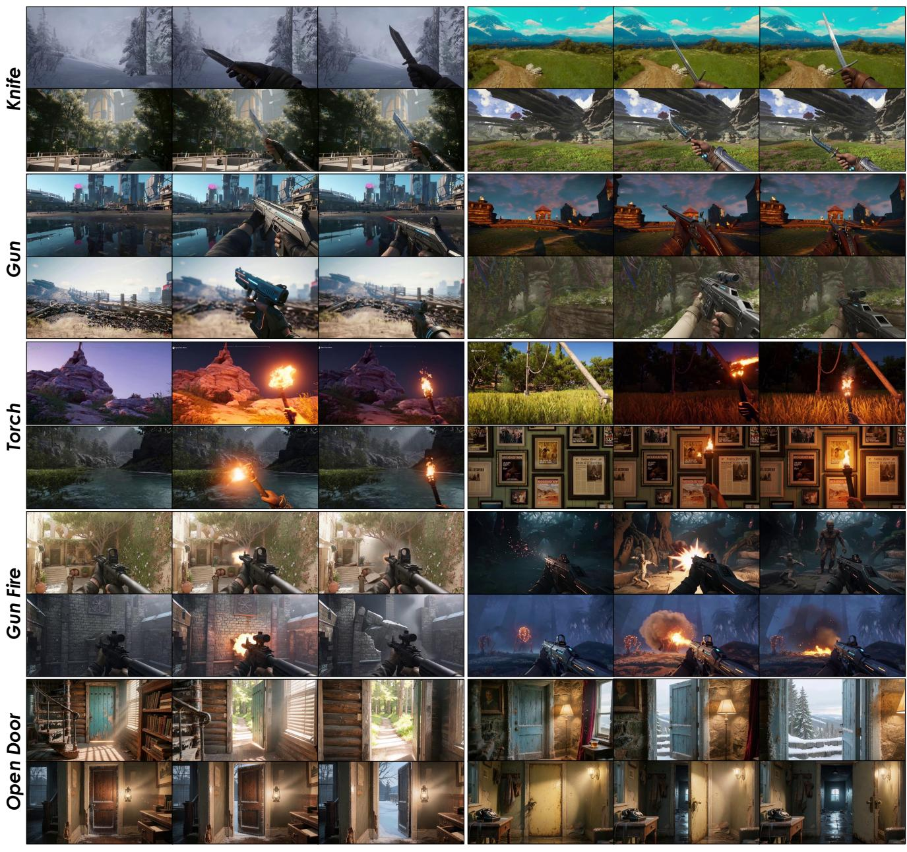  
consistent bodyobject coordination and temporal coherence.

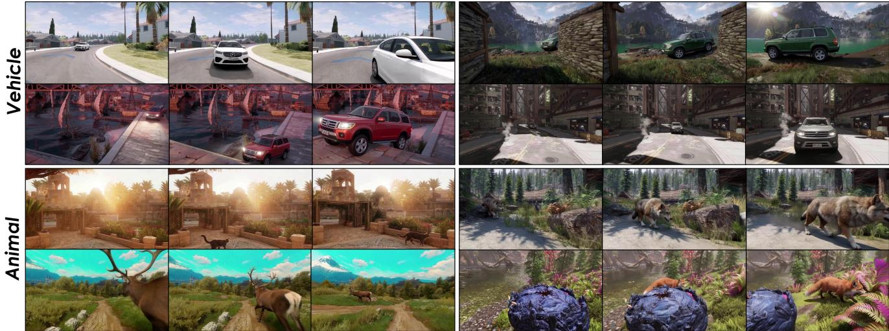  
entities with realistic geometry, scale consistency, and stable identity across frames.

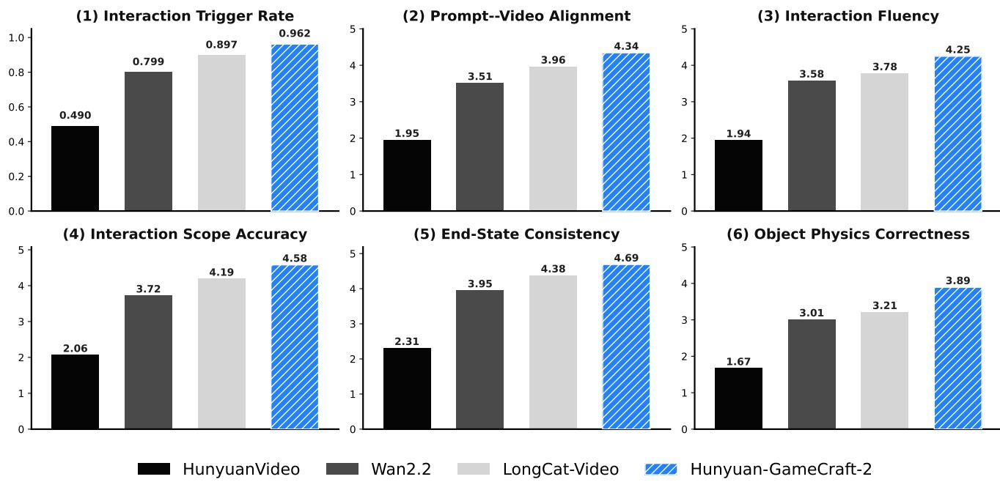  
Quantitative Evaluation: Environmental Interactions   
F environment-level effects. Our approach better preserves global influence and temporal stability.

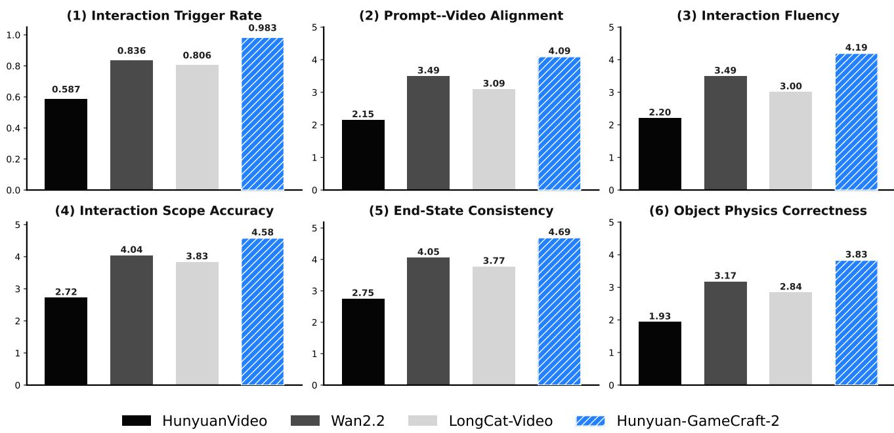  
F .

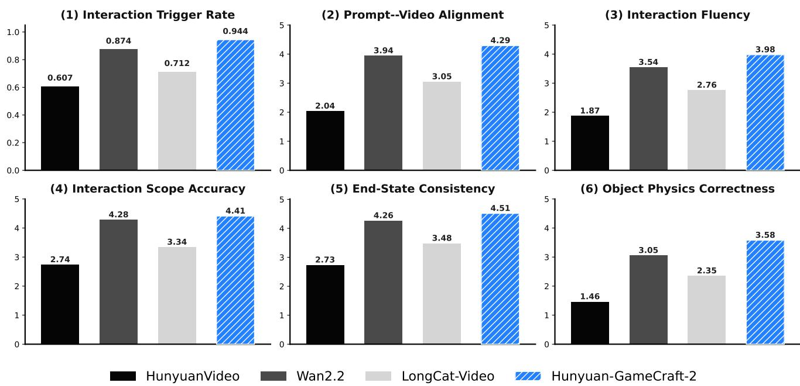  
Quantitative Evaluation: Entity & Object Appearances   
andinteraction coectnessOur method deliver moreaccurate,stable, an physically plausible bject beavors.

# D. InterBench: A Detailed Protocol for Benchmarking Action-Level Interaction

Motivation and Design Philosophy. Existing video generation benchmarks, such as Fréchet Video Distance or CLIP Score, primarily assess perceptual quality, temporal consistency, and static text-video alignment. While valuable, they are ill-suited for evaluating interactive video generation, where the primary task is to render a causal change in response to a specific action command. These metrics cannot distinguish between a correctly executed action and a visually plausible but semantically incorrect video. To fill this critical gap, we designed InterBench, an evaluation protocol specifically tailored to measure the fidelity of action-level interactions. Its philosophy is to deconstruct the complex concept of a "good interaction" into a set of distinct, measurable, and interpretable dimensions, enabling a fine-grained analysis of model capabilities and failure modes.

Interaction Trigger Rate. This dimension serves as the most fundamental, gateway assessment. It asks the question:

Did the requested interaction happen at all?" This metric is designed to isolate the model's basic ability to acknowledge and act upon an instruction, separating cases where the model successfully initiated the action from those where it completely failed to respond. This is a binary metric:

• 1 (Success): The requested interaction is initiated in the video. For instance, for the prompt draw a gun," this score is given if a gun becomes visible. If this score is given, the subsequent dimensions are evaluated on their respective scales. • 0 (Failure): The requested interaction does not occur at all. The model ignores or completely misunderstands the interaction prompt. If this score is given, all subsequent dimensions are automatically scored 0.

Prompt-Video Alignment. Beyond simply triggering an action, this dimension evaluates the semantic fidelity of the generated video with respect to the entire prompt (both the base scene description and the interaction command). It ensures the interaction happens in the right way and the right context, encompassing both static and dynamic alignment. This metric is scored on a 0-1-3-5 ordinal scale, contingent on the interaction being triggered:

• 5 (Excellent): Both the static context (scene, style) and the dynamic action perfectly match the prompt's description.   
•3 (Moderate): The primary action is correct, but there are minor semantic deviations in the scene's context or the specifics of the action's execution.   
• $\mathbf { 1 } \left( \mathbf { P o o r } \right)$ : A recognizable interaction occurs, but it involves a major semantic error, such as performing the wrong action (e.g., closing instead of opening a door) or generating a scene that bears no resemblance to the base prompt.   
•0 (Failure): The triggered video content shows no meaningful semantic alignment with either the prompt's context or its specified action.

Interaction Fluency. This dimension measures the temporal naturalness and continuity of the interaction process. It specifically penalizes temporal discontinuities such as abrupt teleportation of objects, noticeable frame jumps, unrealistic motion jitter, and structural tearing of geometry, particularly around the interacting regions. This metric is scored on a 0-1-3-5 ordinal scale:

•5 (Excellent): The motion is perfectly smooth, continuous, and natural, with no temporal artifacts present. •3 (Moderate): The motion is generally continuous but contains minor, non-disruptive artifacts like slight jitter or a single inconspicuous jump-cut. • 1 (Poor): The interaction is plagued by severe temporal artifacts (e.g., constant flickering, object teleportation) that significantly disrupt the viewing experience.

Interaction Scope Accuracy. This metric assesses a model's spatial reasoning by examining whether the spatial extent and environmental influence of an interaction are plausible and consistent with its expected scope (global or local). This metric is scored on a 0-1-3-5 ordinal scale:

• 5 (Excellent): The spatial influence of the interaction is physically and semantically correct (e.g., global effects are global, local effects are local and propagate realistically). •3 (Moderate): The scope is generally correct but with minor inaccuracies, such as a global effect not covering the entire scene or a local effect having a slightly incorrect area of influence. : $\mathbf { 1 } \left( \mathbf { P o o r } \right)$ : The scope is fundamentally wrong. For example, a global event is rendered as a tiny local patch, or a local effect implausibly affects the entire scene.

End-State Consistency. A successful interaction must not only be initiated correctly but also converge to a stable and correct outcome. This dimension evaluates the final state of the video to ensure the result of the action persists as expected. This metric is scored on a 0-1-3-5 ordinal scale:

• 5 (Excellent): The interaction converges to the correct final state, which remains stable until the end of the video. •3 (Moderate): The final state is mostly correct but exhibits minor instability, such as slight flickering, object drift, or subtle geometric inconsistencies. • 1 (Poor): The interaction fails to converge correctly. The final state is incorrect, highly unstable (e.g., oscillating), or the effects of the action vanish prematurely.

Object Physics Correctness. This dimension focuses on the physical plausibility and structural integrity of the objects and agents involved in the interaction, evaluating whether their behavior adheres to basic physical principles like object permanence, rigidity, and kinematics. This metric is scored on a 0-1-3-5 ordinal scale:

• 5 (Excellent): All objects and agents maintain structural integrity and interact in a physically plausible manner. There is no unnatural deformation, interpenetration, or kinematic errors.   
• 3 (Moderate): Minor physical inaccuracies are present, such as slight object warping during movement or brief, non-critical interpenetration between an agent and an object.   
• 1 (Poor): Severe physical violations occur. Objects unnaturally deform, agents pass through solid objects, or motion is kinematically impossible.