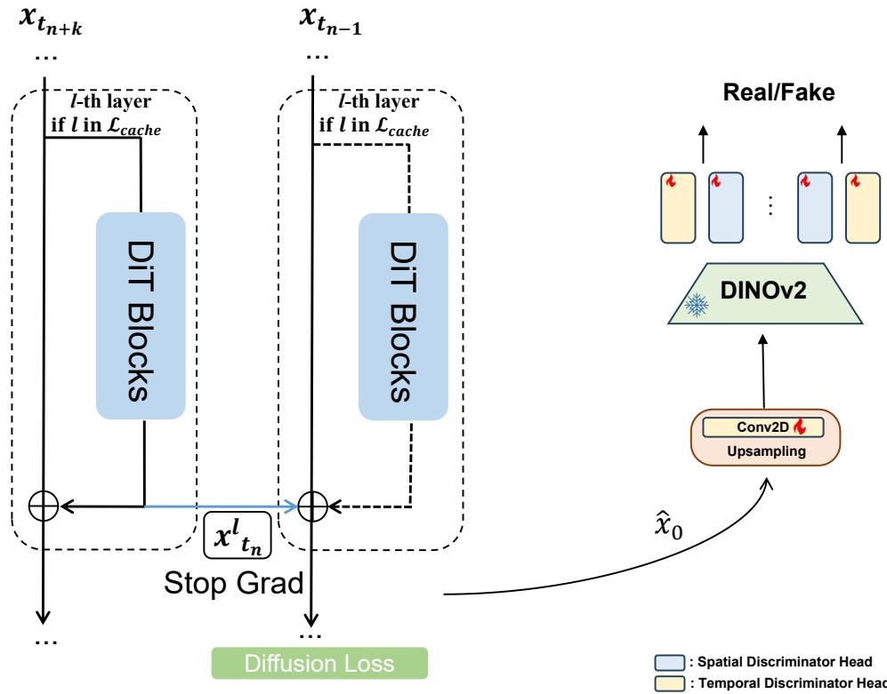

# 1. Bibliographic Information
## 1.1. Title
Yume: An Interactive World Generation Model

## 1.2. Authors
*   Xiaofeng Mao (Shanghai AI Laboratory, Fudan University)
*   Shaoheng Lin (Shanghai AI Laboratory)
*   Zhen Li (Shanghai AI Laboratory)
*   Chuanhao Li (Shanghai AI Laboratory)
*   Wenshuo Peng (Shanghai AI Laboratory)
*   Tong He (Shanghai AI Laboratory)
*   Jiangmiao Pang (Shanghai AI Laboratory)
*   Mingmin Chi (Fudan University)
*   Yu Qiao (Shanghai AI Laboratory)
*   Kaipeng Zhang (Shanghai AI Laboratory, Shanghai Innovation Institute)

    The authors are primarily affiliated with the Shanghai AI Laboratory, a prominent research institution in China, with additional affiliations at Fudan University and the Shanghai Innovation Institute. This indicates a strong institutional backing with expertise in large-scale AI model development.

## 1.3. Journal/Conference
The paper is available on arXiv, which is a repository for electronic preprints of scientific papers. This means it has not yet undergone a formal peer-review process for publication in a specific conference or journal.

## 1.4. Publication Year
2025 (as listed on the arXiv submission).

## 1.5. Abstract
The paper introduces `Yume`, a model designed to generate an interactive, realistic, and dynamic world from an input image, text, or video. This report focuses on a preview version, named `method` in the abstract but referred to as `Yume` throughout the paper, which takes a single image and allows users to explore the generated dynamic world using keyboard actions. The framework is built on four key components:
1.  **Camera Motion Quantization:** Camera movements are discretized into simple actions (e.g., forward, turn left) to enable stable training and intuitive keyboard control.
2.  **Video Generation Architecture:** A `Masked Video Diffusion Transformer (MVDT)` with a memory module is used for autoregressive, theoretically infinite video generation.
3.  **Advanced Sampler:** A training-free `Anti-Artifact Mechanism (AAM)` and `Time Travel Sampling based on Stochastic Differential Equations (TTS-SDE)` are introduced to improve visual quality and control precision.
4.  **Model Acceleration:** A combination of adversarial distillation and caching mechanisms is employed to speed up the generation process.

    The model is trained on a high-quality world exploration dataset called `Sekai` and demonstrates strong performance in various scenes.

## 1.6. Original Source Link
*   **Original Source Link:** https://arxiv.org/abs/2507.17744
*   **PDF Link:** https://arxiv.org/pdf/2507.17744v1
*   **Publication Status:** Preprint.

# 2. Executive Summary
## 2.1. Background & Motivation
The generation of vast, interactive, and persistent virtual worlds is a significant goal in AI, with applications in simulation, gaming, and virtual reality. While video diffusion models have shown great promise, applying them to create controllable, realistic worlds from a single image presents several challenges:

*   **Domain Gap:** Many existing navigable world generation models are trained on synthetic data (e.g., from games like Minecraft) and do not generalize well to the complexity and diversity of real-world urban environments.
*   **Complex Camera Control:** Previous methods often rely on continuous, absolute camera pose matrices. This requires precise annotation, adds complexity to the model architecture (requiring extra modules), and can be unstable or unintuitive for user interaction.
*   **Visual Artifacts:** Generating high-fidelity video of complex urban scenes is difficult. Models often produce visual artifacts like flickering, unnatural textures, and geometric distortions, which degrade the immersive experience.
*   **Computational Cost:** Diffusion models are notoriously slow due to their iterative sampling process, making real-time interactive generation a major hurdle.

    This paper's entry point is to create a more practical and user-friendly system for world exploration. `Yume` aims to bridge these gaps by transforming a static image into a dynamic, explorable world using simple keyboard commands, focusing specifically on achieving high visual quality and intuitive control in real-world scenes.

## 2.2. Main Contributions / Findings
The paper's primary contributions are encapsulated in its well-designed framework with four key innovations:

1.  **A Novel Camera Control Paradigm:** The introduction of **Quantized Camera Motion (QCM)**. Instead of using complex, continuous camera pose data, `Yume` discretizes camera movements into a small set of intuitive actions (e.g., 'move forward', 'turn right'). These actions are then injected into the model as text prompts, simplifying the control mechanism, stabilizing training, and enabling direct keyboard-based interaction without needing extra learnable modules.

2.  **An Advanced Autoregressive Architecture:** The use of a **Masked Video Diffusion Transformer (MVDT)** combined with a **FramePack-inspired memory module**. The `MVDT` improves frame-to-frame consistency and reduces artifacts, while the memory module allows for theoretically infinite video generation by compressing and feeding past frames back into the model as context.

3.  **A Sophisticated Sampler for High-Quality Generation:** The development of two sampler enhancements:
    *   **Training-Free Anti-Artifact Mechanism (AAM):** A two-pass denoising process that uses a low-frequency guide from an initial generation to refine high-frequency details in a second pass, significantly improving visual quality and reducing artifacts without retraining.
    *   **Time Travel Sampling based on SDE (TTS-SDE):** A sampling method that leverages information from future denoising steps to guide earlier ones and incorporates stochasticity to enhance control and sharpness.

4.  **A Hybrid Acceleration Strategy:** A synergistic optimization that combines **adversarial distillation** (reducing the number of required sampling steps) with a **caching mechanism** (reusing intermediate computations across steps). This approach significantly speeds up inference, making interactive use more feasible.

    The key finding is that this integrated framework successfully generates high-quality, temporally coherent, and controllable video streams from a single image, outperforming existing models in both instruction following (camera control) and visual consistency for real-world scenes.

# 3. Prerequisite Knowledge & Related Work
## 3.1. Foundational Concepts
### 3.1.1. Diffusion Models
Diffusion models are a class of generative models that learn to create data by reversing a gradual noising process. The core idea involves two stages:
1.  **Forward Process (Noising):** Start with a real data sample (e.g., an image) and slowly add a small amount of Gaussian noise over many steps. After enough steps, the image becomes indistinguishable from pure random noise. This process is fixed and does not involve learning.
2.  **Reverse Process (Denoising):** Train a neural network (often a U-Net or, in this paper, a Transformer) to reverse this process. At each step, the model takes a noisy image and predicts the noise that was added. By subtracting this predicted noise, it can gradually denoise the image, starting from pure noise and ending with a clean, realistic sample.

    **Latent Diffusion Models (LDMs)** perform this process not on the high-resolution pixel data itself, but in a compressed, lower-dimensional "latent space." A `Variational Autoencoder (VAE)` is used to encode the image into this latent space and decode it back. This significantly reduces computational cost, enabling the generation of high-resolution images and videos.

### 3.1.2. Diffusion Transformers (DiT)
A Diffusion Transformer (`DiT`) replaces the commonly used U-Net architecture in the denoising network with a Transformer. The noisy latent representation is broken down into a sequence of patches (like tokens in NLP). The Transformer architecture, with its core `self-attention` mechanism, is highly effective at capturing long-range dependencies between these patches, which can lead to better global consistency and scalability. The model in this paper is based on a `DiT` architecture.

### 3.1.3. Rectified Flow
Rectified Flow is a generative modeling framework that formulates generation as an Ordinary Differential Equation (ODE). It aims to learn a "velocity field" that transports samples from a simple distribution (e.g., Gaussian noise) to a complex data distribution (e.g., real images) along nearly straight paths. Compared to traditional diffusion models which follow curved paths, this "straightening" of the trajectory offers several advantages:
*   **Efficiency:** It allows for generation in fewer steps (fewer function evaluations) with higher accuracy.
*   **Simpler Training:** The training objective is a straightforward regression task: predict the vector difference between the data point and the noise point.

    `Yume` is trained using a Rectified Flow-based methodology, which contributes to its efficiency and stability. The training objective is to minimize the Mean Squared Error (MSE) between the model's predicted velocity $v_{\theta}(z_t, c, t)$ and the true velocity $(z_1 - z_0)$.

\$
\theta^* = \underset{\theta}{\arg\min} \mathbb{E}_{t \sim U[0, 1]} \mathbb{E}_{z_0, z_1 \sim \pi_0, \pi_1} \left[ || z_1 - z_0 - v_{\theta}(z_t, c, t) ||_2^2 \right]
\$

where $z_0$ is the latent representation of the real video, $z_1$ is random noise, and $z_t = t z_1 + (1-t) z_0$ is a point on the straight line connecting them.

## 3.2. Previous Works
The paper positions itself relative to several key areas of research:

*   **Video Diffusion Models:** The paper acknowledges the rapid progress from early models like `Imagen Video` and `Make-A-Video` to large-scale systems like Google's `Lumiere` and OpenAI's `Sora`. It builds upon open-source foundations like `Stable Video Diffusion`, leveraging their architectural principles while adding its unique control and generation mechanisms.
*   **Camera Control in Video Generation:** Previous works like `MotionCtrl`, `Direct-a-Video`, and `CameraCtrl` have focused on giving users explicit control over camera movement. However, they typically rely on providing a dense sequence of absolute camera pose matrices. This is precise but often requires complex user input and can be unstable. `Yume`'s **Quantized Camera Motion (QCM)** is a direct response to this limitation, opting for a simpler, more intuitive discrete control scheme.
*   **Navigable World Generation:** Models like `Genie` (for 2D worlds) and `Matrix-Game` (for game worlds) have explored generating interactive environments. However, these often operate in synthetic or simplified domains (e.g., trained on Minecraft data). `Yume`'s focus on the `Sekai` dataset, which contains real-world urban exploration videos, differentiates it by targeting realistic, complex scenes.
*   **Mitigating Generation Artifacts:** The paper's `Anti-Artifact Mechanism (AAM)` is related to training-free methods that operate at inference time to improve quality. It is inspired by methods like `DDNM`, which uses a pre-existing degraded image to guide the denoising process for tasks like super-resolution. `AAM` adapts this idea for pure generation by using a first-pass generation as a low-frequency guide for a second, refined pass.
*   **Video Diffusion Acceleration:** The paper's acceleration strategy combines two existing lines of work. **Distillation** methods (`Consistency Models`, `LCMs`) aim to reduce the number of sampling steps required. **Caching** mechanisms (`ToCa`, `AdaCache`) aim to reduce the computation within each step by reusing feature maps. `Yume` proposes a joint optimization of both, which is a novel contribution.

## 3.3. Technological Evolution
The field has evolved from generating short, static-camera video clips to creating longer, more dynamic, and controllable content. Early models focused on text-to-video synthesis. The next wave introduced control mechanisms, primarily for camera movement, using explicit pose information. Concurrently, efforts to scale models (`Sora`) and make them interactive (`Genie`) have pushed the boundaries. `Yume` fits into this timeline by focusing on a specific, practical niche: turning a static real-world image into an infinitely explorable dynamic world with simple, game-like controls. It represents a shift from complex, expert-level control signals to intuitive, user-friendly interaction.

## 3.4. Differentiation Analysis
Compared to related work, `Yume`'s core innovations are:
*   **Control Method:** It uses **discrete, text-encoded relative camera motions** instead of continuous, absolute camera poses. This is fundamentally simpler and more robust for keyboard-based interaction.
*   **Target Domain:** It is explicitly trained on and designed for **real-world urban scenes** (`Sekai` dataset), whereas many competitors focus on synthetic game environments.
*   **Generation Strategy:** It combines a **masked transformer architecture (`MVDT`)** for quality with a **memory-based autoregressive loop** for infinite generation, addressing both short-term consistency and long-term coherence.
*   **Inference-Time Enhancement:** The `AAM` and `TTS-SDE` samplers are novel training-free methods specifically designed to boost visual quality and control for this task, offering a flexible way to improve results without costly retraining.
*   **Acceleration:** The **joint optimization of distillation and caching** is a more holistic approach to acceleration than pursuing either technique in isolation.

# 4. Methodology
## 4.1. Principles
The core principle of `Yume` is to create a high-fidelity, interactive video generation system that is both powerful and easy to control. This is achieved by systematically optimizing four key aspects of the generation pipeline: (1) simplifying the control signal (camera motion), (2) enhancing the model's ability to generate coherent long videos (architecture), (3) refining the output during sampling (sampler design), and (4) making the process fast enough for interaction (acceleration).

## 4.2. Core Methodology In-depth (Layer by Layer)
### 4.2.1. Data Processing: Camera Motion Quantization (QCM)
The foundation of `Yume`'s interactivity is its novel approach to camera control. Instead of using raw camera trajectory data, it quantizes them into a discrete set of actions.

1.  **Define a Discrete Action Set:** A predefined set of basic camera movements, $\mathbb{A}_{set}$, is created. Each action $A_j$ (e.g., "move-forward," "turn-left," "tilt-up") corresponds to a canonical relative transformation matrix, $T_{\text{canonical}, j}$. These actions can be mapped directly to keyboard inputs.

2.  **Process Real Trajectories:** For each video in the `Sekai` training dataset, the per-frame camera-to-world (`c2w`) matrices are processed. For any two consecutive camera poses, $C_{\text{curr}}$ and $C_{\text{next}}$, the actual relative transformation is calculated. This is done by first moving to the current camera's coordinate system ($C_{\text{curr}}^{-1}$) and then applying the next pose's transformation ($C_{\text{next}}$).
    \$
    T_{\text{rel,actual}} = C_{\text{curr}}^{-1} \cdot C_{\text{next}}
    \$

3.  **Quantization via Matching:** The actual relative transformation $T_{\text{rel,actual}}$ is then compared to all the canonical transformation matrices in the predefined set. The action $A_j^*$ whose canonical matrix $T_{\text{canonical}, j}$ is "closest" to the actual one is selected. The "distance" function can be a weighted combination of differences in translation and rotation. This process effectively converts a continuous camera path into a sequence of discrete actions.

    The process is summarized in `Algorithm 1` from the paper:
*该图像是Yume项目的示意图，展示了四个核心组件：摄像机运动量化、模型架构、长视频训练与生成。图中展示了视频、描述解析及MVDT训练过程，涉及自注意力和交叉注意力机制。*

4.  **Textual Injection:** Each selected discrete action $A^*$ is mapped to a textual description (e.g., "Person moves forward and left"). These text descriptions, along with calculated motion speed indicators, are concatenated with a general scene description and fed into the model's text encoder. This allows `Yume` to control camera motion using its existing text-conditioning mechanism, avoiding the need for new, learnable modules.

### 4.2.2. Model Architecture
`Yume`'s architecture builds on the `Wan` model, which uses a spatio-temporal VAE and a denoising DiT, but introduces two key modifications: the `MVDT` for better frame consistency and a memory module for long video generation.

#### 4.2.2.1. Masked Video Diffusion Transformers (MVDT)
To improve visual quality and reduce artifacts, `Yume` incorporates a masked representation learning strategy inspired by Masked Autoencoders (MAE).

1.  **Masking:** During training, a random portion (e.g., 30%) of the input latent video tokens $z_{t_n}$ are masked out. This creates a smaller set of visible tokens $z_{t_n, u}$.
2.  **Asymmetric Encoder-Decoder:**
    *   **Encoder:** A portion of the DiT blocks acts as an encoder, processing **only the visible tokens**. This saves significant computation.
    *   **Side-Interpolator:** This lightweight module takes the encoded visible tokens and a set of learnable latent tokens, and through self-attention, predicts the features for the masked regions.
    *   **Decoder:** The full sequence of tokens (original visible tokens + predicted masked tokens) is then processed by the remaining DiT blocks (the decoder).

        This forces the model to learn robust contextual relationships between different parts of the video, leading to better structural consistency. During inference, no masking is applied, and the full model is used.

#### 4.2.2.2. Long Video Generation with Memory
For generating videos longer than a single chunk, `Yume` uses an autoregressive approach with a memory mechanism similar to `FramePack`.

The core idea is to provide the model with a compressed history of previously generated frames as context for generating the next segment.

1.  **Context Compression:** As new video chunks are generated, the history of past frames is compressed using a `Patchify` module with varying downsampling rates. More recent frames are kept at higher resolution, while older frames are more aggressively compressed. For example:
    *   Frames `t-1` to `t-2`: Compressed with $(1, 2, 2)$ ratios (temporal, height, width).
    *   Frames `t-3` to `t-6`: Compressed with $(1, 4, 4)$.
    *   Frames `t-7` to `t-23`: Compressed with $(1, 8, 8)$.
        The very first input image is also retained at a relatively high resolution.

2.  **Autoregressive Generation:** At each generation step, the model receives the compressed historical frames, the text condition (including the QCM action), and noise. It then generates the next video segment. The last frame of this new segment becomes the conditioning frame for the next iteration, and the segment is added to the history, which is then re-compressed. This process can be repeated indefinitely.

    The following figure illustrates this long-form generation method:

    
    *该图像是示意图，展示了长形式视频生成方法的框架。图中包含多个模块，包括首次帧处理和历史帧处理，均使用了自注意力机制与不同的输入降采样策略。此外，图形展示了如何通过解析输入信息（如速度和方向）来生成相应的视频帧。整体结构强调了信息的流动和处理过程。*

### 4.2.3. Sampler Design
`Yume` introduces two advanced, training-free sampling techniques to enhance the final output.

#### 4.2.3.1. Training-Free Anti-Artifact Mechanism (AAM)
`AAM` is a two-pass denoising process designed to improve detail and reduce artifacts.

*   **Pass 1 (Standard Denoising):** A standard denoising process is run for a set number of steps (e.g., 30) to generate an initial latent estimate, $z_{\text{orig}}$. This result captures the overall scene structure and motion but may lack fine details or contain artifacts.
*   **Pass 2 (Refinement Denoising):** A second denoising process is initiated from the same starting noise. For the first few steps ($K_{\text{refine}}$) of this pass, a special intervention occurs:
    1.  The latent from the current step in the refinement pass is denoted $z'_{t_i}$.
    2.  The final result from Pass 1, $z_{\text{orig}}$, is noised back up to the current timestep $t_i$.
    3.  A low-pass filter (e.g., Gaussian blur), denoted by operator $B$, is applied to this noised version of $z_{\text{orig}}$ to extract its low-frequency components: $z_{\text{low.from.orig}} = B(z_{\text{orig}, t_i})$.
    4.  The high-frequency components of the current refinement latent $z'_{t_i}$ are extracted: $z'_{\text{high.current}} = z'_{t_i} - B(z'_{t_i})$.
    5.  A new latent is recomposed by combining the low frequencies from the first pass with the high frequencies from the current pass: $z'_{t_i} \gets z_{\text{low.from.orig}} + z'_{\text{high.current}}$.
    6.  This recomposed latent is then fed into the diffusion model to predict the next step.

        This procedure, detailed in `Algorithm 2`, forces the refinement pass to respect the stable, low-frequency structure of the initial generation while allowing it to generate new, higher-fidelity details in the high-frequency domain.

#### 4.2.3.2. Time Travel Sampling based on SDE (TTS-SDE)
This sampler improves sharpness and textual controllability by looking ahead in the denoising process.

1.  **Time Travel:** At a given timestep $t_n$, instead of just predicting the latent for $t_{n-1}$, the sampler first "travels" forward a few steps (e.g., $l=5$ steps) into the future of the denoising path. This provides a glimpse of where the trajectory is headed.
2.  **Refinement:** This future information is then used to refine the prediction for the current step, leading to a more accurate and stable trajectory.
3.  **Stochastic Differential Equation (SDE):** Unlike deterministic ODE-based sampling, `TTS-SDE` uses a Stochastic Differential Equation. This introduces a controlled amount of randomness into the sampling process, which the paper finds significantly improves the model's ability to follow the textual control signals (the QCM commands).

### 4.2.4. Model Acceleration
To make `Yume` practical for interactive use, the paper proposes a hybrid acceleration framework.

#### 4.2.4.1. Adversarial Distillation
The goal of distillation is to train a student model that can produce high-quality results in far fewer steps than the original teacher model. `Yume` uses adversarial distillation.
*   A **discriminator** network $\mathcal{D}$ is trained to distinguish between real video data and videos generated by the `Yume` model in a few steps.
*   The `Yume` model (the denoiser) is then trained with a combined loss function: a standard diffusion loss to ensure it denoises correctly, and an **adversarial loss** that encourages it to generate videos that can "fool" the discriminator.
    \$
    \mathcal{L}_{\text{total}} = \mathcal{L}_{\text{diffusion}} + \lambda_{\text{adv}} \mathcal{L}_{\text{adv}}
    \$
This pushes the model to generate perceptually realistic results even with a reduced number of sampling steps (e.g., 14 instead of 50).

#### 4.2.4.2. Cache-Accelerating
This technique reduces computation *within* each denoising step.
*   **Observation:** The computations in many intermediate layers of the DiT do not change drastically from one timestep to the next.
*   **Mechanism:** The model identifies the least important DiT blocks (based on an MSE analysis shown in Figure 4). For these layers, instead of re-computing them at every step, the model computes them once, **caches** the result (the residual feature), and reuses it for the next few steps.
*   **Joint Optimization:** The adversarial distillation and caching are optimized together. During the distillation training, the model simulates the caching behavior (using `Stop Grad` to prevent gradients from flowing through cached features) so that it learns to be robust to the potential errors introduced by reusing old computations.

    This joint strategy allows `Yume` to benefit from both fewer steps and less computation per step, leading to a significant speedup. The following figure illustrates the joint optimization design:

    
    *该图像是一个示意图，展示了加速方法的设计框架，包括 DiT 块和差分损失。他们共同利用 DINOv2 进行真实/假数据的判别，以及卷积上采样过程。图中显示了潜在的层机制和停梯度的影响。*

# 5. Experimental Setup
## 5.1. Datasets
*   **Training Dataset:** `Sekai-Real-HQ`, a 400-hour subset of the `Sekai` dataset. It contains high-quality, real-world walking and drone video clips with corresponding camera trajectory annotations and semantic labels. The videos primarily feature urban exploration from a first-person perspective.
*   **Evaluation Dataset (`Yume-Bench`):** The authors created a custom benchmark to evaluate interactive generation. They collected 70 videos or images from the `Sekai` dataset (excluding training samples) that cover a wide range of complex, combined camera motions (e.g., moving forward-left while looking right). This benchmark is designed to specifically test the model's ability to follow keyboard commands in diverse scenarios.

    The following table shows the distribution of action combinations in the `Yume-Bench` dataset.

    <table>
    <thead>
    <tr>
    <th>Keyboard-Mouse Action</th>
    <th>Count</th>
    </tr>
    </thead>
    <tbody>
    <tr>
    <td>No Keys + Mouse Down</td>
    <td>2</td>
    </tr>
    <tr>
    <td>No Keys + Mouse Up</td>
    <td>2</td>
    </tr>
    <tr>
    <td>S Key + No Mouse Movement</td>
    <td>2</td>
    </tr>
    <tr>
    <td>W+A Keys + No Mouse Movement</td>
    <td>29</td>
    </tr>
    <tr>
    <td>W+A Keys + Mouse Left</td>
    <td>6</td>
    </tr>
    <tr>
    <td>W+A Keys + Mouse Right</td>
    <td>17</td>
    </tr>
    <tr>
    <td>W+D Keys + No Mouse Movement</td>
    <td>5</td>
    </tr>
    <tr>
    <td>W+D Keys + Mouse Left</td>
    <td>5</td>
    </tr>
    <tr>
    <td>W+D Keys + Mouse Right</td>
    <td>2</td>
    </tr>
    </tbody>
    </table>

## 5.2. Evaluation Metrics
`Yume-Bench` evaluates models on visual quality and camera motion tracking using six metrics.

*   **Instruction Following:**
    *   **Conceptual Definition:** This metric measures how accurately the generated video's camera motion follows the given keyboard/mouse command. Since automated camera pose estimation on generated videos is not yet reliable, this was evaluated via human assessment. A higher score means the generated motion more closely matches the intended action.
    *   **Mathematical Formula:** Not applicable (human evaluation).

        The following five metrics are adopted from the `VBench` suite:

*   **Subject Consistency:**
    *   **Conceptual Definition:** Measures whether the main subject or foreground elements remain consistent in appearance and identity throughout the video. It is important for preventing objects from unnaturally changing or morphing. It is typically calculated by measuring the cosine similarity of CLIP image embeddings of the subject across frames.
    *   **Mathematical Formula:**
        \$
        \text{Subject Consistency} = \frac{1}{N-1} \sum_{i=2}^{N} \text{cos_sim}(\text{CLIP}_{\text{img}}(f_i, b_i), \text{CLIP}_{\text{img}}(f_{i-1}, b_{i-1}))
        \$
    *   **Symbol Explanation:** $N$ is the number of frames, $f_i$ is the $i$-th frame, $b_i$ is the bounding box of the subject in frame $i$, $\text{CLIP}_{\text{img}}$ is the CLIP image encoder, and $\text{cos\_sim}$ is the cosine similarity.

*   **Background Consistency:**
    *   **Conceptual Definition:** Similar to subject consistency, but measures the consistency of the background scenery. This is crucial for creating a stable and believable world.
    *   **Mathematical Formula:**
        \$
        \text{Background Consistency} = \frac{1}{N-1} \sum_{i=2}^{N} \text{cos_sim}(\text{CLIP}_{\text{img}}(f_i), \text{CLIP}_{\text{img}}(f_{i-1}))
        \$
    *   **Symbol Explanation:** Same as above, but embeddings are calculated for the entire frame.

*   **Motion Smoothness:**
    *   **Conceptual Definition:** Quantifies the smoothness of motion in the video, penalizing jittery or abrupt movements. It is often calculated by measuring the amount of optical flow variation between consecutive frames.
    *   **Mathematical Formula:** A common way to measure this is by calculating the $L_1$ norm of the temporal derivative of the optical flow.
    *   **Symbol Explanation:** Lower values of flow variation indicate smoother motion. The final score is often normalized.

*   **Aesthetic Quality:**
    *   **Conceptual Definition:** Measures the subjective visual appeal of the generated video. This is typically evaluated using a pretrained model that has been trained on a large dataset of images with human aesthetic ratings.
    *   **Mathematical Formula:** The score is the output of a pretrained aesthetic predictor model.

*   **Imaging Quality:**
    *   **Conceptual Definition:** Assesses the objective quality of the video frames, focusing on aspects like sharpness, clarity, and absence of compression artifacts.
    *   **Mathematical Formula:** Often measured using No-Reference Image Quality Assessment (NR-IQA) models.

## 5.3. Baselines
The paper compares `Yume` against two state-of-the-art models:
*   **Wan-2.1:** A powerful large-scale video generation model. For this comparison, it was controlled using textual instructions for camera motion (e.g., "camera moves forward").
*   **MatrixGame:** An interactive world foundation model designed for game-like environments. It uses its own native keyboard/mouse control system.

    These baselines were chosen to represent two different approaches: a general-purpose video model controlled via text, and a specialized interactive model trained on synthetic data. This allows for a fair comparison of `Yume`'s ability to handle real-world scenes with its unique control mechanism.

# 6. Results & Analysis
## 6.1. Core Results Analysis
The following are the results from Table 2 of the original paper:

<table>
<thead>
<tr>
<th>Model</th>
<th>Instruction Following ↑</th>
<th>Subject Consistency ↑</th>
<th>Background Consistency ↑</th>
<th>Motion Smoothness ↑</th>
<th>Aesthetic Quality ↑</th>
<th>Imaging Quality ↑</th>
</tr>
</thead>
<tbody>
<tr>
<td>Wan-2.1 Wan et al. (2025)</td>
<td>0.057</td>
<td>0.859</td>
<td>0.899</td>
<td>0.961</td>
<td>0.494</td>
<td>0.695</td>
</tr>
<tr>
<td>MatrixGame Zhang et al. (2025)</td>
<td>0.271</td>
<td>0.911</td>
<td>0.932</td>
<td>0.983</td>
<td>0.435</td>
<td>0.750</td>
</tr>
<tr>
<td>Yume (Ours)</td>
<td><strong>0.657</strong></td>
<td><strong>0.932</strong></td>
<td><strong>0.941</strong></td>
<td><strong>0.986</strong></td>
<td><strong>0.518</strong></td>
<td>0.739</td>
</tr>
</tbody>
</table>

*   **Instruction Following:** `Yume` achieves a score of **0.657**, which is dramatically higher than both `Wan-2.1` (0.057) and `MatrixGame` (0.271). This is the most significant result, as it directly validates the effectiveness of the **Quantized Camera Motion (QCM)** approach. Controlling a general model like `Wan-2.1` with text prompts is very unreliable. `MatrixGame`, while controllable, struggles to apply its knowledge from game worlds to real-world scenes. `Yume`'s specialized training on real-world data with discrete actions proves far superior for this task.
*   **Visual Quality & Consistency:** `Yume` also achieves the highest scores in `Subject Consistency`, `Background Consistency`, `Motion Smoothness`, and `Aesthetic Quality`. This demonstrates that the `MVDT` architecture and the `Sekai` dataset are effective in producing high-quality, stable, and visually appealing videos. Its `Imaging Quality` is slightly below `MatrixGame` but still very competitive.

### 6.1.1. Long-video Generation Analysis
The paper tested `Yume`'s ability to generate an 18-second video autoregressively.
The results are shown in the chart below (Figure 5 from the original paper):

*该图像是图表，展示了长视频生成中的指标动态。图中含有五个指标：主体一致性、背景一致性、运动流畅度、美学质量和指令遵循，使用不同的推断次数（4 infs 与 2 infs）进行比较。各指标随时间的变化趋势清晰呈现。*

The analysis reveals that `Yume` maintains high consistency over time, with `Subject Consistency` and `Background Consistency` dropping by only 0.5% and 0.6% respectively over the course of the generation. A notable dip in `Instruction Following` occurred during a motion transition phase (8-12s), which the authors attribute to "inertia" from the previous motion. However, performance recovered significantly after the transition, confirming the model's robustness in long-form generation.

## 6.2. Ablation Studies / Parameter Analysis
### 6.2.1. Sampler Effectiveness (TTS-SDE)
The following are the results from Table 3 of the original paper:

<table>
<thead>
<tr>
<th>Model</th>
<th>Instruction Following ↑</th>
<th>Subject Consistency ↑</th>
<th>Background Consistency ↑</th>
<th>Motion Smoothness ↑</th>
<th>Aesthetic Quality ↑</th>
<th>Imaging Quality ↑</th>
</tr>
</thead>
<tbody>
<tr>
<td>Yume-ODE</td>
<td>0.657</td>
<td>0.932</td>
<td>0.941</td>
<td>0.986</td>
<td>0.518</td>
<td>0.739</td>
</tr>
<tr>
<td>Yume-SDE</td>
<td>0.629</td>
<td>0.927</td>
<td>0.938</td>
<td>0.985</td>
<td>0.516</td>
<td>0.737</td>
</tr>
<tr>
<td>Yume-TTS-ODE</td>
<td>0.671</td>
<td>0.923</td>
<td>0.936</td>
<td>0.985</td>
<td>0.521</td>
<td>0.737</td>
</tr>
<tr>
<td>Yume-TTS-SDE</td>
<td><strong>0.743</strong></td>
<td>0.921</td>
<td>0.933</td>
<td>0.985</td>
<td>0.507</td>
<td>0.732</td>
</tr>
</tbody>
</table>

This ablation study clearly demonstrates the value of the `TTS-SDE` sampler.
*   Simply switching from ODE to SDE sampling slightly hurts performance across the board.
*   Adding the "Time Travel" (TTS) mechanism to the ODE sampler (`Yume-TTS-ODE`) improves instruction following.
*   Combining both **Time Travel and SDE (`Yume-TTS-SDE`)** provides the best `Instruction Following` score (**0.743**), a significant jump from the baseline ODE sampler. This confirms the authors' hypothesis that the stochasticity introduced by SDE, when combined with the lookahead mechanism of TTS, is key to enhancing controllability, even at the cost of a minor dip in consistency and quality metrics.

### 6.2.2. Model Distillation
The following are the results from Table 4 of the original paper:

<table>
<thead>
<tr>
<th>Model</th>
<th>Time (s)↓</th>
<th>Instruction Following </th>
<th>Subject Consistency ↑</th>
<th>Background Consistency ↑</th>
<th>Motion Smoothness ↑</th>
<th>Aesthetic Quality ↑</th>
<th>Imaging Quality ↑</th>
</tr>
</thead>
<tbody>
<tr>
<td>Baseline</td>
<td>583.1</td>
<td>0.657</td>
<td>0.932</td>
<td>0.941</td>
<td>0.986</td>
<td>0.518</td>
<td>0.739</td>
</tr>
<tr>
<td>Distil</td>
<td><strong>158.8</strong></td>
<td>0.557</td>
<td>0.927</td>
<td>0.940</td>
<td>0.984</td>
<td>0.519</td>
<td>0.739</td>
</tr>
</tbody>
</table>

The distillation process successfully reduced the number of steps from 50 to 14, resulting in a **3.7x speedup** (583.1s to 158.8s). This came at the cost of a decrease in `Instruction Following`, which the authors suggest is because fewer steps weaken the model's ability to adhere to text controls. However, all other quality metrics remained nearly identical, showing that the distillation effectively preserves visual fidelity while dramatically improving speed.

# 7. Conclusion & Reflections
## 7.1. Conclusion Summary
The paper successfully introduces `Yume`, an interactive world generation model that can create a dynamic, explorable world from a single image using simple keyboard inputs. Its main success lies in its well-designed, four-part framework that addresses key challenges in the field. The **Quantized Camera Motion (QCM)** provides an intuitive and stable control mechanism. The **MVDT architecture with a memory module** enables high-quality, infinite-length video generation. The advanced **AAM and TTS-SDE samplers** significantly enhance visual fidelity and controllability at inference time. Finally, the **hybrid acceleration strategy** makes the model fast enough for practical interactive applications. `Yume` sets a new standard for controllable, real-world video generation from static images.

## 7.2. Limitations & Future Work
The authors acknowledge several limitations and areas for future work:

*   **Visual Quality and Efficiency:** While `Yume` is a significant step forward, there is still room to improve the overall visual fidelity, reduce artifacts further, and increase runtime speed for a truly real-time experience.
*   **Control Accuracy:** The model's ability to follow commands, while strong, is not perfect, as shown by the inertia effect during motion transitions and the drop in performance after distillation.
*   **Lack of Object Interaction:** The current version of `Yume` only allows for exploration (camera movement). A crucial next step towards a true "world model" is to enable interaction with objects and characters within the generated scene.
*   **AAM in Long-Video Generation:** The authors note that the `AAM` sampler, while excellent for single-shot I2V generation, causes discontinuities in autoregressive long-video generation. They hypothesize this is because the underlying model is I2V-based and suggest fine-tuning on V2V tasks could solve this.
*   **Project Vision:** The paper presents a "preview version." The ultimate goal for `Yume` is much broader, aiming to use text, images, or videos as input and allow control via peripheral devices or even neural signals.

## 7.3. Personal Insights & Critique
`Yume` is an impressive piece of engineering that makes a very practical contribution to the field of generative AI.

*   **Strengths:**
    *   **Pragmatism over Purity:** The decision to use **Quantized Camera Motion** is a brilliant example of pragmatic design. Instead of pursuing the technically "pure" but difficult path of continuous camera control, the authors identified that for user-driven exploration, a discrete, game-like control scheme is not only sufficient but often superior in terms of stability and usability.
    *   **Holistic Optimization:** The paper's strength lies in its comprehensive approach. It doesn't just propose a better model architecture; it rethinks the entire pipeline from the control signal to the final sampling and acceleration. This holistic view is why the system works so well.
    *   **Training-Free Enhancements:** The development of `AAM` and `TTS-SDE` as training-free modules is highly valuable. It allows for significant quality improvements on top of any compatible diffusion model without the immense cost of retraining, making it a transferable contribution.

*   **Potential Issues & Areas for Improvement:**
    *   **Generalization Beyond "Walks":** The model is trained on the `Sekai` dataset, which consists of "walking" and "drone" videos. Its ability to generate other types of dynamic scenes (e.g., bustling crowds, complex object interactions, non-rigid deformations) remains to be seen. The model might have an inherent bias towards forward-moving, first-person-view scenery.
    *   **Semantic Drift in Long Videos:** While the paper shows good consistency over 18 seconds, true "infinite" generation is prone to semantic drift, where the scene slowly and illogically transforms over time. Longer-term evaluations are needed to assess how well `Yume` mitigates this.
    *   **The "World" in "World Model":** The current model generates a "dynamic world" that is essentially a streaming video texture mapped onto a moving camera. It lacks a persistent 3D understanding of the scene. If the user turns back, the model will generate a new scene rather than showing what was previously behind them. Building in a genuine, persistent 3D representation is the next major frontier for this line of research.

        Overall, `Yume` is a significant and well-executed project that pushes the boundary of what's possible in interactive content generation. Its focus on user-centric design and practical solutions provides a strong foundation for future work in creating truly immersive and interactive virtual worlds.