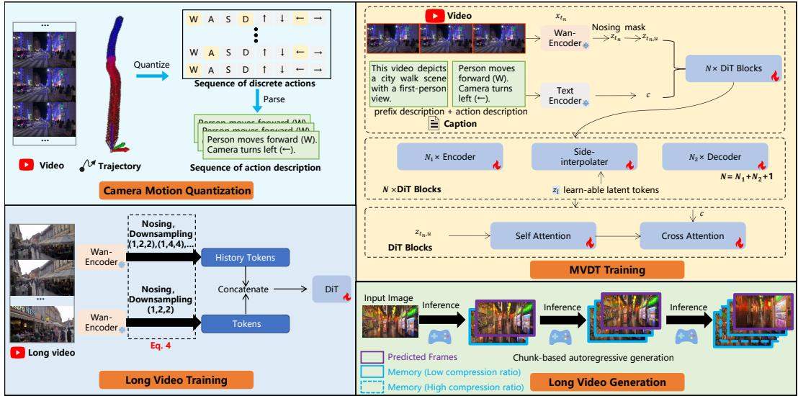
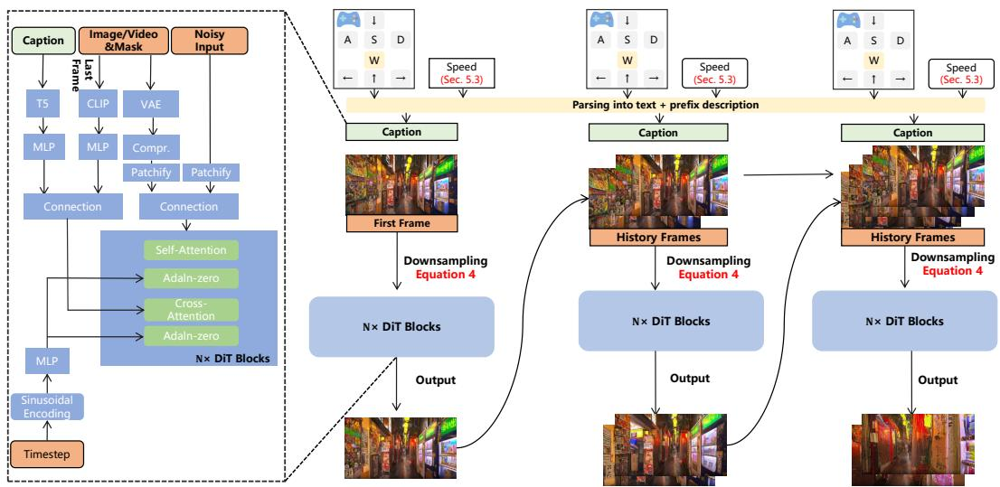
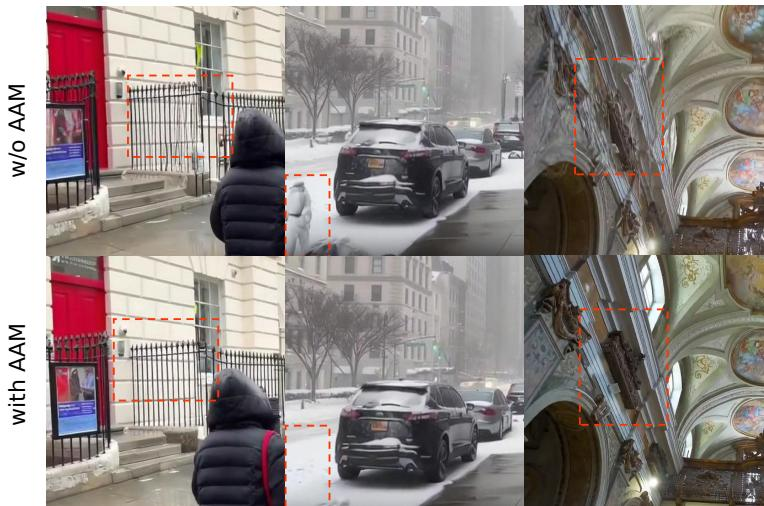
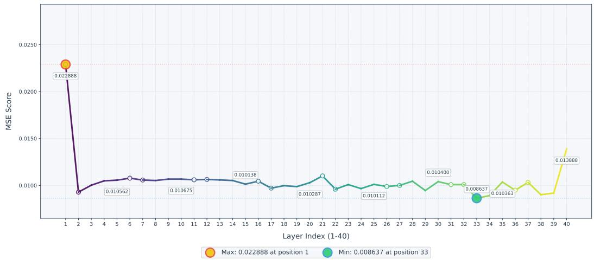
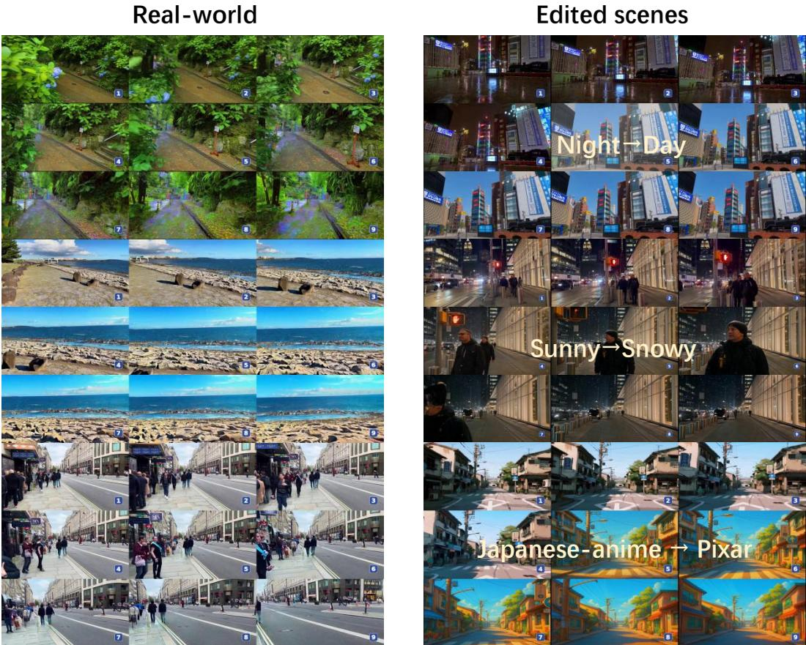

# 1. 论文基本信息

## 1.1. 标题
Yume: An Interactive World Generation Model (Yume：一个交互式世界生成模型)

论文的核心主题是提出一个名为 `Yume` 的模型，该模型旨在利用文本、图像或视频作为输入，生成一个可交互的、逼真且动态的虚拟世界。此版本的 `Yume` 专注于从单张图片创建动态世界，并允许用户通过键盘操作进行探索。

## 1.2. 作者
- **作者团队:** Xiaofeng Mao, Shaoheng Lin, Zhen Li, Chuanhao Li, Wenshuo Peng, Tong He, Jiangmiao Pang, Mingmin Chi, Yu Qiao, Kaipeng Zhang 等。
- **隶属机构:** 主要来自上海人工智能实验室 (Shanghai AI Laboratory)，部分作者来自复旦大学 (Fudan University) 和上海创新研究院 (Shanghai Innovation Institute)。
- **研究背景:** 这是一个由大型研究机构主导的项目，作者团队在计算机视觉和生成模型领域有深厚的研究背景。项目负责人之一张开鹏 (Kaipeng Zhang) 是该领域的知名研究者。

## 1.3. 发表期刊/会议
该论文目前作为预印本 (Preprint) 发布在 `arXiv` 上，尚未在同行评审的学术会议或期刊上正式发表。`arXiv` 是一个开放获取的学术论文发布平台，研究者可以在这里分享最新的研究成果，以便快速交流。

## 1.4. 发表年份
2025年 (根据 `arXiv` 提交信息，这是一个预测的未来发表日期，实际提交于2024年)。论文中引用了多篇标记为2025年的文献，表明这是一个着眼于未来技术趋势的研究。

## 1.5. 摘要
`Yume` 的宏伟目标是利用图像、文本或视频创建一个可交互、逼真且动态的世界，用户可以通过键盘、鼠标等外设甚至神经信号进行探索和控制。本报告展示了 `Yume` 的一个预览版本，该版本能从一张输入图像创建一个动态世界，并允许用户通过键盘动作进行探索。为实现高保真和交互式的视频世界生成，论文提出了一个精心设计的框架，包含四大核心组件：
1.  <strong>相机运动量化 (Camera Motion Quantization):</strong> 将连续的相机运动量化为离散动作，以实现稳定的训练和用户友好的键盘交互。
2.  <strong>视频生成架构 (Video Generation Architecture):</strong> 引入了带有记忆模块的<strong>遮蔽视频扩散Transformer (Masked Video Diffusion Transformer, MVDT)</strong>，以自回归的方式生成无限时长的视频。
3.  <strong>高级采样器 (Advanced Sampler):</strong> 引入了无需训练的<strong>抗伪影机制 (Anti-Artifact Mechanism, AAM)</strong> 和基于随机微分方程的<strong>时间旅行采样 (Time Travel Sampling based on SDE, TTS-SDE)</strong>，以提升视觉质量和控制精度。
4.  <strong>模型加速 (Model Acceleration):</strong> 通过<strong>对抗性蒸馏 (Adversarial Distillation)</strong> 和<strong>缓存机制 (Caching Mechanisms)</strong> 的协同优化来加速模型。

    该模型使用高质量的世界探索数据集 `Sekai`进行训练，并在多种场景和应用中取得了显著成果。

## 1.6. 原文链接
- **arXiv 链接:** https://arxiv.org/abs/2507.17744
- **PDF 链接:** https://arxiv.org/pdf/2507.17744v1
- **项目主页:** https://stdstu12.github.io/YUME-Project/
- **代码与数据:** https://github.com/stdstu12/YUME

  **发布状态:** 预印本 (Preprint)。

---

# 2. 整体概括

## 2.1. 研究背景与动机
- **核心问题:** 如何从静态输入（如一张图片）生成一个不仅视觉逼真，而且可以被用户**实时交互和探索**的动态三维世界？这不仅仅是生成一段视频，而是要创造一个“活的”环境。
- **问题重要性:** 随着元宇宙、数字孪生、游戏和虚拟现实等概念的兴起，对可交互虚拟世界的需求日益增长。传统的视频生成模型通常只能生成一段固定的、不可交互的视频片段。而现有的可交互世界生成方法，大多局限于游戏场景（如Minecraft）或合成数据，与真实世界的复杂性和动态性存在巨大差距。
- <strong>现有挑战与空白 (Gap):</strong>
    1.  **真实世界泛化性差:** 现有方法大多在合成或静态场景上训练，难以处理真实世界（特别是城市环境）的复杂纹理、动态物体和多变光照。
    2.  **相机控制不直观:** 传统方法依赖于精确的、连续的相机位姿矩阵作为控制信号，这不仅增加了标注和训练的难度，对普通用户来说也非常不友好。
    3.  **生成质量问题:** 在生成长视频或复杂场景时，容易出现闪烁、纹理失真、几何畸变等视觉伪影 (artifacts)，破坏了沉浸感。
- **本文切入点:** `Yume` 旨在填补这一空白，通过一系列系统性优化，专注于从真实世界数据生成高质量、可交互的动态世界。其核心创新思路是：**将复杂的连续相机控制问题简化为离散的、类似游戏操作的键盘输入，并设计一套完整的架构来支持这种交互方式下的高质量、无限长视频生成**。

## 2.2. 核心贡献/主要发现
- **主要贡献:**
    1.  **提出 `Yume` 框架:** 一个专为交互式世界生成设计的综合框架，系统性地解决了相机控制、模型架构、采样质量和运行效率四大难题。
    2.  <strong>相机运动量化 (QCM):</strong> 提出一种创新的相机运动量化方法，将复杂的相机位姿轨迹转化为离散的文本指令（如“前进”、“左转”），使得模型训练更稳定，用户交互更直观（通过键盘）。
    3.  **改进的视频生成架构:** 采用了<strong>遮蔽视频扩散Transformer (MVDT)</strong> 提升单帧质量，并结合类似 `FramePack` 的记忆机制，实现了理论上无限时长的自回归视频生成。
    4.  **高级采样技术:** 提出了两种新颖的采样器优化技术：无需训练的<strong>抗伪影机制 (AAM)</strong> 用于提升细节和减少失真；基于随机微分方程的<strong>时间旅行采样 (TTS-SDE)</strong> 用于增强控制精度和视频清晰度。
    5.  **高效加速方案:** 探索了**对抗性蒸馏**和**特征缓存**的协同优化策略，显著提升了模型的推理速度。
    6.  **发布高质量数据集和模型:** 开源了训练所用的 `Sekai` 数据集、完整的代码库和预训练模型权重，极大地推动了社区在该方向上的发展。

- **主要发现:**
    - 通过将相机运动量化为文本指令，可以有效地在不增加额外学习模块的情况下，控制预训练的视频生成大模型，实现精确的相机运动。
    - 结合**遮蔽学习**和**长程记忆机制**，模型能够生成时间上更连贯、内容更一致的长视频。
    - 在采样阶段通过后处理（如 `AAM`）或改进采样轨迹（如 `TTS-SDE`），可以显著提升生成视频的视觉质量，解决伪影和模糊问题。
    - `Yume` 在真实世界场景的交互式视频生成任务上，无论是在**指令遵循能力**还是**视觉质量**方面，都显著优于现有的先进模型（如 `Wan-2.1`, `MatrixGame`）。

      ---

# 3. 预备知识与相关工作

## 3.1. 基础概念

### 3.1.1. 扩散模型 (Diffusion Models)
扩散模型是一类强大的生成模型，其核心思想源于热力学。它包含两个过程：
1.  <strong>前向过程（加噪）:</strong> 从一张真实的图片开始，在很多步（例如1000步）中逐步地、微量地向图片添加高斯噪声，直到图片完全变成一张纯粹的噪声图。这个过程是固定的，不需要学习。
2.  <strong>反向过程（去噪）:</strong> 训练一个神经网络（通常是 `U-Net` 或 `Transformer` 结构），让它学会在每一步中，从加了噪声的图片里预测出所添加的噪声（或直接预测出去噪后的图片）。学会之后，就可以从一张完全随机的噪声图开始，一步步地去噪，最终“创造”出一张全新的、逼真的图片。
    `Yume` 正是基于扩散模型的去噪思想来生成视频帧。

### 3.1.2. 变分自编码器 (Variational Autoencoder, VAE)
`VAE` 是一种生成模型，由编码器 (Encoder) 和解码器 (Decoder) 两部分组成。
- **编码器:** 将高维的输入数据（如一张 512x512 的图片）压缩成一个低维的、符合特定概率分布（通常是高斯分布）的<strong>潜空间 (Latent Space)</strong> 表示。这个潜空间可以理解为数据的“精华”或“特征摘要”。
- **解码器:** 从潜空间中采样一个点，然后将其还原（解码）成原始数据维度（如一张 512x512 的图片）。
  在 `Yume` 中，`VAE` 的作用是**降维**。直接在像素空间（高分辨率图像）上运行扩散模型计算成本极高。因此，论文先用 `VAE` 的编码器将视频帧压缩到低维的潜空间，在潜空间中执行计算成本较低的扩散过程，生成潜空间表示后，再用 `VAE` 的解码器将其还原成高分辨率视频。这种方法被称为<strong>潜扩散模型 (Latent Diffusion Model, LDM)</strong>。

### 3.1.3. 扩散 Transformer (Diffusion Transformer, DiT)
传统的扩散模型主要使用 `U-Net` 作为去噪网络。`DiT` 是一种新的架构，它将 `Transformer` 引入扩散模型中。`Transformer` 的核心是<strong>自注意力机制 (self-attention)</strong>，它能够捕捉数据中长距离的依赖关系。在图像生成中，这意味着模型可以更好地理解图像的全局结构。`Yume` 的核心去噪网络就是一种基于 `Transformer` 的架构。

### 3.1.4. Rectified Flow
`Rectified Flow` 是一种较新的生成模型训练方法，旨在连接数据分布 $\pi_0$ (如噪声) 和 $\pi_1$ (如真实图像) 之间的路径。与传统扩散模型模拟复杂的随机过程不同，`Rectified Flow` 试图学习一个**尽可能直的路径**（由常微分方程 ODE 定义）。
- **直觉:** 想象从A点（噪声）到B点（图像），`Rectified Flow` 想要学习一条直线路径，而不是一条弯弯曲曲的随机路径。
- **优势:**
    1.  **训练简单高效:** 它的训练目标是直接预测起点和终点之间的“速度矢量”。
    2.  **采样速度快:** 因为路径更直，可以用更少的步数（甚至一步）从噪声生成图像，同时保持高质量。
        `Yume` 使用 `Rectified Flow` 作为其训练范式，以实现更高效的训练和采样。

## 3.2. 前人工作
`Yume` 的工作建立在以下几个领域的研究基础之上：

1.  **视频扩散模型:** 从早期的 `Imagen Video` 和 `Make-A-Video`，到后来更大规模、更高质量的 `Lumiere` (Google) 和 `Sora` (OpenAI)，再到开源社区的 `Stable Video Diffusion` 和 `Hunyuan-Video` 等，这些模型为 `Yume` 提供了强大的视频生成基础。`Yume` 使用了 `Wan` 架构作为其基础模型。

2.  **视频生成中的相机控制:**
    - `MotionCtrl`: 提出了一个统一的控制器来管理相机和物体运动。
    - `Direct-a-Video`: 实现了对相机平移/缩放和物体运动的解耦控制。
    - `CameraCtrl` & `CameraCtrl II`: 专注于通过迭代指定相机轨迹来生成连贯的长视频。
      这些方法通常依赖于**显式的、密集的绝对相机位姿矩阵**，训练和使用都较为复杂。

3.  **可导航世界生成:**
    - `Genie` (Google DeepMind): 从图像生成可由动作控制的2D世界。
    - `GAIA-1` (Wayve): 生成可控的自动驾驶场景。
    - `Matrix-Game`: 一个专注于可控游戏世界生成的基础模型，主要使用 `Minecraft` 数据集。
    - `WORLDMEM`: 引入记忆库来增强长时程世界模拟的一致性。
      这些工作推动了交互式生成的边界，但大多局限于游戏或合成数据，与真实世界的复杂性有差距。

4.  **生成伪影的缓解:**
    - **训练时方法:** 如改进 `VAE` 自动编码器来捕捉更多高频细节。
    - **免训练方法:** 在推理采样阶段进行优化。例如 `FreqPrior` 在频域中优化初始噪声，`Enhance-A-Video` 调整时间注意力分布。`Yume` 的 `AAM` 和 `TTS-SDE` 属于此类，即在不改变模型权重的情况下提升生成质量。

5.  **视频扩散模型加速:**
    - **蒸馏方法:** 如 `Consistency Models`，将多步采样过程“蒸馏”到少数几步甚至一步。
    - **缓存机制:** 如 `ToCa` 和 `AdaCache`，通过缓存和重用 `DiT` 中间层的特征计算来减少冗余，加速推理。`Yume` 结合了这两种思路。

## 3.3. 技术演进
视频生成技术的发展脉络大致如下：
`GANs` -> `VAEs` -> **扩散模型** -> <strong>潜扩散模型 (LDM)</strong> -> **视频扩散模型** -> **可控/交互式视频生成**。
`Yume` 处在最新的**可控/交互式视频生成**阶段。它不再满足于仅根据文本生成一段固定视频，而是追求让用户能够成为“摄影师”，实时控制虚拟世界中的“镜头”，探索由AI创造的环境。

## 3.4. 差异化分析
与相关工作相比，`Yume` 的核心差异化在于其**系统性**和**对真实世界的专注**：
- **vs. `CameraCtrl` 等:** 其他相机控制方法依赖**连续的绝对位姿**，而 `Yume` 创新地使用**量化的相对运动**，并将其转化为文本，这更符合人类的直观交互方式（键盘），也简化了模型设计。
- **vs. `Matrix-Game` 等:** 其他可交互世界生成模型大多基于**游戏数据**，而 `Yume` 使用<strong>真实世界视频数据集 (`Sekai`)</strong> 进行训练，使其生成的世界更逼真，泛化能力更强。
- **vs. 标准视频生成模型:** `Yume` 不仅仅是一个生成器，它集成了**相机控制、长视频生成、质量增强、模型加速**四个方面的优化，提供了一个完整的、端到端的交互式世界生成解决方案。

  ---

# 4. 方法论
`Yume` 的框架由四个精心设计的核心组件构成，下面将逐一深入解析。

下图（原文 Figure 2）展示了`Yume`的四个核心组件：相机运动量化，模型架构，长视频训练与生成。

*该图像是Yume项目的示意图，展示了四个核心组件：摄像机运动量化、模型架构、长视频训练与生成。图中展示了视频、描述解析及MVDT训练过程，涉及自注意力和交叉注意力机制。*

## 4.1. 相机运动量化 (Camera Motion Quantization, QCM)
这是实现直观键盘交互的关键。传统方法使用一长串复杂的相机位姿矩阵来控制镜头，而 `Yume` 将其简化为几个离散的动作。

### 4.1.1. 方法原理
核心思想是：将视频中连续的、微小的相机位姿变化，匹配到一组预定义的基础动作（如“前进”、“左转”、“向上倾斜”等）。这样，复杂的相机轨迹就被“量化”成了一系列简单的动作指令。在训练时，这些动作指令作为文本条件输入模型；在推理时，用户的键盘按键可以直接映射到这些动作指令，从而控制视频生成。

### 4.1.2. 核心方法详解
该过程由原文中的 `Algorithm 1` 描述：

**Algorithm 1: Camera Motion Quantization**
> **Require:** Sequence of camera-to-world matrices $\mathcal { C } = \{ C _ { 0 } , C _ { 1 } , \ldots , C _ { N - 1 } \}$ , Predefined set of $K$ camera motion $\mathbb { A } _ { \mathrm { s e t } } = \{ A ^ { ( 1 ) } , \ldots , A ^ { ( K ) } \}$ , Corresponding canonical relative $S E ( 3 )$ transformations $\{ T _ { \mathrm { c a n o n i c a l } } ^ { ( 1 ) } , \ldots , \overline { { T } } _ { \mathrm { c a n o n i c a l } } ^ { ( K ) } \}$ cannical.   
> **Ensure:** Sequence of selected camera motion $\mathcal { A } ^ { * } = \{ A _ { 0 } ^ { * } , \ldots , A _ { M - 1 } ^ { * } \}$ (where $M$ depends on processing stride).   
> 1: Initialize $A ^ { * } \leftarrow \emptyset$   
> 2: for each relevant pair $( C _ { \mathrm { c u r r } } , C _ { \mathrm { n e x t } } )$ from $\mathcal { C }$ do   
> 3: $\quad T _ { \mathrm { r e l , a c t u a l } } \leftarrow C _ { \mathrm { c u r r } } ^ { - 1 } \cdot C _ { \mathrm { n e x t } }$   
> 4: $\quad A _ { \mathrm { c u r r e n t } } ^ { * } \leftarrow \arg \underset { A ^ { ( j ) } \in \mathbb { A } _ { \mathrm { s e t } } } { \mathrm { m i n } } \mathrm { D i s t a n c e } ( T _ { \mathrm { r e l , a c t u a l } } , T _ { \mathrm { c a n o n i c a l } } ^ { ( j ) } )$   
> 5: Append $A _ { \mathrm { c u r r e n t } } ^ { * }$ to $\mathcal{A}^{*}$
> 6: end for   
> 7: return $\mathcal{A}^{*}$

**融合讲解:**

1.  **输入:**
    - **相机位姿序列 $\mathcal{C}$**: 这是一个列表，包含了视频中每一帧（或每隔几帧）的相机在世界坐标系中的位姿。每个位姿 $C$ 是一个<strong>4x4的变换矩阵 (camera-to-world matrix, c2w)</strong>，描述了相机的位置和朝向。
    - **预定义动作集 $\mathbb{A}_{\mathrm{set}}$**: 这是一个包含 $K$ 个基础动作的集合，例如 `{前进, 后退, 左转, 右转, ...}`。
    - **标准变换矩阵集 $\{T_{\mathrm{canonical}}\}$**: 与动作集一一对应，每个动作都有一个标准的**相对变换矩阵**。例如，“前进”动作对应的标准矩阵表示向前移动一个单位。

2.  <strong>处理流程 (循环部分):</strong>
    - <strong>Step 1: 计算实际相对运动 (第3行)</strong>
        - 选取视频中两个连续的相机位姿 $C_{\mathrm{curr}}$ (当前帧) 和 $C_{\mathrm{next}}$ (下一帧)。
        - 计算公式 $T_{\mathrm{rel, actual}} \leftarrow C_{\mathrm{curr}}^{-1} \cdot C_{\mathrm{next}}$。
        - **公式解释:** $C_{\mathrm{curr}}^{-1}$ 将世界坐标系下的坐标转换到当前相机坐标系下。因此，$C_{\mathrm{curr}}^{-1} \cdot C_{\mathrm{next}}$ 计算出的 $T_{\mathrm{rel, actual}}$ 表示从**当前相机视角**看，**下一帧相机**的位置和朝向。这正是两帧之间的**实际相对运动**。
    - <strong>Step 2: 匹配最近的动作 (第4行)</strong>
        - 计算实际相对运动矩阵 $T_{\mathrm{rel, actual}}$ 与每一个预定义的标准动作矩阵 $T_{\mathrm{canonical}}^{(j)}$ 之间的“距离”。
        - **公式解释:** $A_{\mathrm{current}}^* \leftarrow \arg \min \mathrm{Distance}(T_{\mathrm{rel, actual}}, T_{\mathrm{canonical}}^{(j)})$。
        - 这个 `Distance` 函数衡量两个变换矩阵的相似度，可以综合考虑位移和旋转的差异。
        - 选取距离最小的那个标准动作 $A^{(j)}$ 作为当前时刻的量化动作 $A_{\mathrm{current}}^*$。
    - <strong>Step 3: 记录结果 (第5行)</strong>
        - 将匹配到的动作 $A_{\mathrm{current}}^*$ 添加到结果列表 $\mathcal{A}^*$ 中。

3.  **输出:**
    - 最终返回一个由离散动作组成的序列 $\mathcal{A}^*$，例如 `[前进, 前进, 左转, 前进, ...]`。这些动作随后被转换成文本描述，与其他文本条件（如场景描述）一起送入模型。

## 4.2. 视频生成架构

### 4.2.1. 遮蔽视频扩散 Transformer (Masked Video Diffusion Transformers, MVDT)
为了提升生成视频的视觉质量，`Yume` 引入了遮蔽学习的思想。

- **原理:** 灵感来源于 `Masked Autoencoders (MAE)`。在训练时，随机遮蔽（Mask）掉视频潜空间特征的一部分，然后让模型去预测并恢复被遮蔽的部分。
- **好处:** 这种“完形填空”式的任务迫使模型学习到更深层次的、更具全局性的视觉结构和上下文关系，而不是仅仅学习表面纹理。这有助于减少生成视频中的结构性错误和伪影。
- **架构:** MVDT 包含一个非对称的网络结构：
    1.  <strong>编码器 (Encoder):</strong> 只处理未被遮蔽的可见特征块，计算量小。
    2.  <strong>侧插值器 (Side-Interpolator):</strong> 结合编码后的可见特征和一些可学习的 `mask token`，通过自注意力机制来预测被遮蔽区域的内容。
    3.  <strong>解码器 (Decoder):</strong> 处理由原始可见特征和预测的遮蔽特征共同组成的完整特征序列，进行最终的去噪预测。

### 4.2.2. 无限长视频生成
为了实现可交互探索，视频必须能够无限生成下去。`Yume` 采用了一种基于记忆模块的自回归生成框架。

下图（原文 Figure 3）展示了长视频生成的方法。

*该图像是示意图，展示了长形式视频生成方法的框架。图中包含多个模块，包括首次帧处理和历史帧处理，均使用了自注意力机制与不同的输入降采样策略。此外，图形展示了如何通过解析输入信息（如速度和方向）来生成相应的视频帧。整体结构强调了信息的流动和处理过程。*

- **原理:** 类似于 `FramePack`，其核心思想是：在生成新的视频片段时，不仅要考虑当前的输入（如图像和动作指令），还要回顾**过去已经生成的历史帧**。
- **方法:**
    1.  **历史帧压缩:** 历史帧不需要全部以高分辨率保留。离当前越远的历史帧，其重要性越低。因此，模型使用不同压缩率的 `Patchify`（一种将图像块化的操作）来处理历史帧。
        - 最近的几帧（如 `t-1` 到 `t-2`）使用低压缩率（如 `1x2x2`），保留较多细节。
        - 较远的历史帧（如 `t-3` 到 `t-6`）使用中等压缩率（如 `1x4x4`）。
        - 非常久远的历史帧（如 `t-7` 到 `t-23`）使用高压缩率（如 `1x8x8`），只保留最核心的结构信息。
        - 最初的输入图像也以较低压缩率保留，作为全局的参考。
    2.  **特征拼接:** 将压缩后的历史帧特征、初始图像特征以及当前要生成的片段的噪声特征在**通道维度**上拼接起来，共同输入到 `DiT` 模型中。
    3.  **自回归生成:** 生成一个新片段后，这个新片段就成为“历史”的一部分。在生成下一个片段时，它会被压缩并加入到历史记忆中，如此循环往复，理论上可以生成无限长的视频。

- **采样过程公式:**
  $$
\begin{array} { r l } & { z _ { t _ { n - 1 } } = z _ { \mathrm { i n } } + ( t _ { i - 1 } - t _ { i } ) \cdot v _ { \theta } \big ( \hat { z } _ { \mathrm { i n } } , c , t _ { n } \big ) } \\ & { \quad \hat { z } _ { \mathrm { i n } } = ( ( 1 - t _ { n } ) { \bf I } _ { \mathrm { i n } } + t _ { n } z _ { \mathrm { n o i s e } } \big ) \oplus z _ { i n } } \end{array}
$$
- **公式解释:**
    - $z_{t_n}$ 是在去噪时间步 $t_n$ 的潜变量。
    - $v_\theta$ 是去噪模型（DiT）。
    - $I_{in}$ 是历史帧的压缩特征。
    - $z_{noise}$ 是随机噪声。
    - $\hat{z}_{in}$ 是模型的完整输入，它由两部分通过拼接符号 $\oplus$ 组合而成：
        - $(1-t_n)I_in + t_n z_noise$: 这是 `Rectified Flow` 的插值，表示带有噪声的历史信息。
        - $z_{in}$: 这是当前正在生成的视频片段的带噪潜变量。
    - 整个公式描述了如何利用历史信息 $I_{in}$ 和文本条件 $c$ 来指导当前片段 $z_{in}$ 的去噪过程，从而生成下一个时间步的潜变量 $z_{t_{n-1}}$。

## 4.3. 高级采样器 (Advanced Sampler)
为了进一步提升视觉质量，`Yume` 设计了两种在推理采样阶段使用的增强技术。

### 4.3.1. 免训练抗伪影机制 (Training-Free Anti-Artifact Mechanism, AAM)
- **原理:** 这是一种两阶段采样方法，灵感来自 `DDNM`。它认为一次标准的扩散去噪过程可能无法完美生成所有细节。因此，它进行第二次去噪，并利用第一次去噪的结果来指导第二次，以修复伪影、增强细节。
- **核心思想:** **保留初次生成结果的“低频”结构，替换为二次生成过程中的“高频”细节。**
    - **低频信息:** 指图像的整体轮廓、颜色、结构等宏观信息。
    - **高频信息:** 指图像的纹理、边缘、细节等微观信息。

- <strong>方法详解 (基于 `Algorithm 2`):</strong>

**Algorithm 2: Anti-Artifact by High Frequency Refinement**
> ...
> 6: $\quad z_{\mathrm{orig}, t_i} \leftarrow (1-t_i) * z_{\mathrm{orig}} + t_i * z_{t_{N-1}}$
> 7: $\quad z_{\mathrm{low.from.orig}} \leftarrow B(z_{\mathrm{orig}, t_i})$
> 8: $\quad z'_{\mathrm{high.current}} \leftarrow z'_{\mathrm{in}} - B(z'_{\mathrm{in}})$
> 9: $\quad z'_{\mathrm{in}} \leftarrow z_{\mathrm{low.from.orig}} + z'_{\mathrm{high.current}}$
> ...

1.  **第一阶段:** 执行一次完整的标准去噪过程，得到一个初步的生成结果 $z_{\mathrm{orig}}$。这个结果宏观结构正确，但可能细节不足或有伪影。

2.  <strong>第二阶段 (Refinement Pass):</strong> 重新从随机噪声开始去噪。在去噪的前 $K$ 步，执行以下特殊操作：
    - <strong>Step 1 (第6行):</strong> 将第一阶段的最终结果 $z_{\mathrm{orig}}$ “加噪”回当前的噪声水平 $t_i$，得到 $z_{\mathrm{orig}, t_i}$。这相当于模拟出“如果当初沿着这条路走，在 $t_i$ 步应该是什么样子”。
    - <strong>Step 2 (第7行):</strong> 对 $z_{\mathrm{orig}, t_i}$ 应用一个<strong>低通滤波器 (Low-pass filter)</strong> $B$（例如高斯模糊），提取出其低频信息 $z_{\mathrm{low.from.orig}}$。
    - <strong>Step 3 (第8行):</strong> 从当前第二阶段的潜变量 $z'_{\mathrm{in}}$ 中减去其低频部分（即 $z'_{\mathrm{in}}$ 减去 $z'_{\mathrm{in}}$ 经过低通滤波后的结果），从而得到其高频信息 $z'_{\mathrm{high.current}}$。
    - <strong>Step 4 (第9行):</strong> 将第一阶段的低频信息和第二阶段的高频信息**重新组合**：$z'_{\mathrm{in}} \leftarrow z_{\mathrm{low.from.orig}} + z'_{\mathrm{high.current}}$。这个新的 $z'_{\mathrm{in}}$ 既保留了初次生成的稳定结构，又融入了当前步骤新生成的细节。
    - **Step 5:** 将这个重组后的 $z'_{\mathrm{in}}$ 送入扩散模型进行下一步去噪。

      在 $K$ 步之后，恢复正常的去噪流程。这个方法在不改变模型的情况下，通过巧妙的采样策略显著提升了画质。

下图（原文 Figure 7）展示了 `AAM` 机制在改善城市和建筑场景结构细节方面的效果。

*该图像是比较图，展示了应用训练自由反伪机制（AAM）前后城市和建筑场景的结构细节变化。上方为未应用 AAM 的图像，下方为应用 AAM 后的效果，明显改善了细节清晰度。*

### 4.3.2. 基于随机微分方程的时间旅行采样 (TTS-SDE)
- **原理:** 灵感同样来自 `DDNM` 和 `Repaint` 等工作。其核心思想是“时间旅行”——在决定当前一步如何去噪时，**提前向未来“看”几步**，然后用未来的信息来修正当前。
- **方法:** 在去噪过程的第 $n$ 步，模型并不直接计算出第 `n-1` 步的结果。而是：
    1.  从第 $n$ 步的状态出发，先<strong>试探性地向前（去噪方向）走</strong> $l$ 步，得到一个未来的状态 $x_{t_{n-l}}$。
    2.  利用这个未来的状态 $x_{t_{n-l}}$ 作为更准确的“目标”，来反过来指导如何从第 $n$ 步走到第 `n-1` 步。
- **与 SDE 结合:**
    - <strong>ODE (常微分方程):</strong> 路径是确定的。给定起点和模型，终点是唯一的。这会导致生成结果虽然清晰，但多样性不足，对文本的控制力可能减弱。
    - <strong>SDE (随机微分方程):</strong> 在每一步都引入微小的随机性。
      `TTS-SDE` 发现，将“时间旅行”采样与 SDE 结合，引入的随机性可以**增强模型对文本指令的遵循能力**。直观上，随机扰动让模型在去噪过程中有更多机会“探索”并对齐文本描述的运动轨迹。

## 4.4. 模型加速
为了让交互式生成成为可能，模型的推理速度至关重要。`Yume` 采用了两种技术协同优化的策略。

### 4.4.1. 对抗性蒸馏 (Adversarial Distillation)
- **原理:** 将多步扩散过程“蒸馏”成更少的步数。它引入一个<strong>判别器 (Discriminator)</strong> 网络，形成一个生成对抗网络 (`GAN`)。
- **训练过程:**
    - <strong>去噪模型 (生成器) 的目标:</strong> 生成的图像不仅要符合扩散模型的去噪目标，还要能够“欺骗”判别器，让判别器认为它生成的是真实图像。
    - **判别器的目标:** 努力区分真实图像和去噪模型生成的“假”图像。
    - 这种对抗博弈迫使去噪模型在很少的步数内就能生成非常逼真的图像，从而实现加速。

- **损失函数:**
  总损失 $\mathcal{L}_{\mathrm{total}}$ 由两部分组成：
    $$
    \mathcal{L}_{\mathrm{total}} = \mathcal{L}_{\mathrm{diffusion}} + \lambda_{\mathrm{adv}} \mathcal{L}_{\mathrm{adv}}
    $$
    - $\mathcal{L}_{\mathrm{diffusion}}$: 标准的扩散损失，保证去噪的准确性。
    - $\mathcal{L}_{\mathrm{adv}}$: 对抗损失，用于“欺骗”判别器。

### 4.4.2. 特征缓存 (Cache-Accelerating)
- **原理:** 在视频生成的连续去噪步骤中，`DiT` 模型的许多中间层计算结果是相似的。因此，没有必要每一步都重新计算所有层的特征。
- **方法:**
    1.  **选择缓存层:** 通过实验分析（如下图 Figure 4），找出对最终结果影响最小的那些 `DiT` 模块（通常是中间层）。
    2.  **缓存与重用:**
        - 在某个时间步 $t_n$，完整计算一次所有模块，并将选定缓存层的输出特征 $\Delta x_{t_n}^l$ 存储起来。
        - 在接下来的几个时间步（如 $t_{n-1}, t_{n-2}, \ldots$），对于这些缓存层，直接跳过计算，重用之前存储的特征。
    3.  **协同优化:** 在对抗性蒸馏的训练过程中，就模拟这种缓存行为（通过 `Stop Grad` 操作），让模型提前适应在有缓存的情况下工作，从而减少因使用缓存特征而带来的误差。

        下图（原文 Figure 4）展示了 DiT 各模块的重要性分析，中间部分的模块MSE分数较低，影响较小，因此适合被缓存。

        
        *该图像是图表，展示了不同层索引与均方误差（MSE）分数的关系。图中标示了最大值0.0228888出现在位置1，最小值0.008637出现在位置33。*

---

# 5. 实验设置

## 5.1. 数据集
- **训练数据集:** `Sekai-Real-HQ`
    - **来源:** `Sekai` 数据集的一个高质量子集。`Sekai` 数据集本身是通过从 YouTube 上收集大量第一人称视角行走（walking）和无人机（drone）视频，并经过精细处理和标注得到的。
    - **规模:** `Sekai-Real-HQ` 包含 400 小时的视频片段。经过相机运动量化和筛选后，最终得到 139,019 个用于训练的视频片段。
    - **特点:** 视频质量高（1080p），场景多样（城市、自然风光等），并包含高质量的相机轨迹、语义标签、位置等标注。
    - **选择原因:** 该数据集是为真实世界探索任务量身定制的，其高质量的视频和相机轨迹标注是训练 `Yume` 这种交互式世界模型的理想选择。

- **评估数据集:** `Yume-Bench`
    - **构建方法:** 作者专门为评估交互式生成构建了一个新的基准测试集。它从 `Sekai-Real-HQ` 中排除了训练视频，并采样了 70 个视频或图像作为测试用例。
    - **特点:** 覆盖了各种复杂的键盘动作组合，特别是对于一些稀有动作（如后退、抬头/低头），直接使用静态图像作为输入，以测试模型的泛化能力。
    - **样本示例:** `Yume-Bench` 包含了如下表所示的动作组合。

      以下是原文 Table 1 的结果：

      <table>
      <thead>
      <tr>
      <th>Keyboard-Mouse Action</th>
      <th>Count</th>
      </tr>
      </thead>
      <tbody>
      <tr>
      <td>No Keys + Mouse Down</td>
      <td>2</td>
      </tr>
      <tr>
      <td>No Keys + Mouse Up</td>
      <td>2</td>
      </tr>
      <tr>
      <td>S Key + No Mouse Movement</td>
      <td>2</td>
      </tr>
      <tr>
      <td>W+A Keys + No Mouse Movement</td>
      <td>29</td>
      </tr>
      <tr>
      <td>W+A Keys + Mouse Left</td>
      <td>6</td>
      </tr>
      <tr>
      <td>W+A Keys + Mouse Right</td>
      <td>17</td>
      </tr>
      <tr>
      <td>W+D Keys + No Mouse Movement</td>
      <td>5</td>
      </tr>
      <tr>
      <td>W+D Keys + Mouse Left</td>
      <td>5</td>
      </tr>
      <tr>
      <td>W+D Keys + Mouse Right</td>
      <td>2</td>
      </tr>
      </tbody>
      </table>

## 5.2. 评估指标
`Yume-Bench` 从**视觉质量**和**指令遵循**两个维度评估模型，使用了六个细粒度指标。

1.  <strong>指令遵循 (Instruction Following)</strong>
    - **概念定义:** 评估生成的视频是否准确地遵循了给定的相机运动指令（即量化后的键盘动作）。例如，指令是“向前走并向左转”，视频是否也表现出相应的运镜。由于自动评估方法的精度问题，该指标由**人类评估者**进行打分。
    - **数学公式:** N/A (人工评估)。
    - **符号解释:** N/A。

2.  <strong>主体一致性 (Subject Consistency)</strong>
    - **概念定义:** 评估视频中主要对象或场景在时间上的外观一致性。一个高分的视频应该避免主体突然改变形状、颜色或身份。
    - **数学公式:** 通常基于视频帧之间特征的相似度计算，例如计算连续帧中对应区域 `CLIP` 特征的余弦相似度。
    - **符号解释:** N/A (论文引用 `VBench`，未提供具体公式)。

3.  <strong>背景一致性 (Background Consistency)</strong>
    - **概念定义:** 评估视频背景的稳定性。背景不应出现不合理的闪烁、扭曲或内容突变。
    - **数学公式:** 类似于主体一致性，但关注背景区域的特征相似度。
    - **符号解释:** N/A。

4.  <strong>运动流畅度 (Motion Smoothness)</strong>
    - **概念定义:** 评估视频中物体运动和相机运动的平滑程度。一个高分的视频不应有卡顿、跳跃或不自然的急促变化。
    - **数学公式:** 通常通过计算连续帧之间光流 (optical flow) 向量的方差或变化率来衡量。
    - **符号解释:** N/A。

5.  <strong>美学质量 (Aesthetic Quality)</strong>
    - **概念定义:** 评估生成视频的整体美感，包括构图、色彩、光影等是否令人愉悦。通常由一个预训练的美学评分模型进行打分。
    - **数学公式:** $S_{aesthetic} = f_{aesthetic}(V)$
    - **符号解释:** $V$ 是待评估视频，$f_{aesthetic}$ 是一个预训练的美学评分模型。

6.  <strong>成像质量 (Imaging Quality)</strong>
    - **概念定义:** 评估视频的底层图像质量，如清晰度、噪声水平、是否有伪影等。
    - **数学公式:** N/A (通常由无参考图像质量评估模型，如 `BRISQUE` 或 `NIQE`，进行打分)。
    - **符号解释:** N/A。

## 5.3. 对比基线
论文将 `Yume` 与以下两个最先进的 (state-of-the-art) 模型进行了比较：
- **Wan-2.1:** 一个强大的开源视频生成模型。在实验中，它使用纯文本指令来尝试控制相机运动，作为与 `Yume` 量化动作控制的对比。
- **MatrixGame:** 一个专注于交互式游戏世界生成的基础模型。它有自己原生的键鼠控制方案。将其用于真实世界场景，可以检验其泛化能力。

  ---

# 6. 实验结果与分析

## 6.1. 核心结果分析
实验主要验证 `Yume` 在交互式视频生成任务上的性能，特别是与基线模型相比的优势。

以下是原文 Table 2 的结果：

<table>
<thead>
<tr>
<th>Model</th>
<th>Instruction Following ↑</th>
<th>Subject Consistency ↑</th>
<th>Background Consistency ↑</th>
<th>Motion Smoothness ↑</th>
<th>Aesthetic Quality ↑</th>
<th>Imaging Quality ↑</th>
</tr>
</thead>
<tbody>
<tr>
<td>Wan-2.1 Wan et al. (2025)</td>
<td>0.057</td>
<td>0.859</td>
<td>0.899</td>
<td>0.961</td>
<td>0.494</td>
<td>0.695</td>
</tr>
<tr>
<td>MatrixGame Zhang et al. (2025)</td>
<td>0.271</td>
<td>0.911</td>
<td>0.932</td>
<td>0.983</td>
<td>0.435</td>
<td>0.750</td>
</tr>
<tr>
<td>Yume (Ours)</td>
<td><strong>0.657</strong></td>
<td><strong>0.932</strong></td>
<td><strong>0.941</strong></td>
<td><strong>0.986</strong></td>
<td><strong>0.518</strong></td>
<td>0.739</td>
</tr>
</tbody>
</table>

- **分析:**
    - **指令遵循能力是最大优势:** `Yume` 在 `Instruction Following` 指标上得分高达 **0.657**，远超 `Wan-2.1` (0.057) 和 `MatrixGame` (0.271)。这强有力地证明了其<strong>相机运动量化 (QCM)</strong> 机制的有效性。纯文本控制（`Wan-2.1`）几乎无法精确控制相机，而为游戏场景设计的 `MatrixGame` 在真实世界场景中的控制能力也有限。
    - **视觉质量全面领先:** 在 `Subject Consistency`, `Background Consistency`, `Motion Smoothness`, `Aesthetic Quality` 等多个衡量视觉质量的指标上，`Yume` 均取得了最高或接近最高的分数。这表明 `Yume` 在实现可控性的同时，并没有牺牲生成质量，其 `MVDT` 架构和先进采样器发挥了重要作用。
    - **真实世界泛化能力:** `MatrixGame` 虽然可控，但其美学质量（0.435）得分最低，说明从游戏数据训练的模型直接泛化到真实世界场景效果不佳。而 `Yume` 基于真实世界数据集 `Sekai` 训练，生成的内容更符合真实世界的视觉特征。

      下图（原文 Figure 6）直观展示了 `Yume` 在真实和非真实场景中都表现出优秀的视觉质量和精准的键盘控制遵循能力。

      
      *该图像是示意图，展示了‘Yume’在真实世界和编辑场景中的动态视频生成效果。左侧为真实世界场景，右侧为经过处理的场景，包括夜晚转日间、晴天变雪天，以及风格转换（如日本动漫转为皮克斯风格）。*

## 6.2. 消融实验/参数分析
作者通过一系列消融实验来验证模型中各个创新组件的有效性。

### 6.2.1. TTS-SDE 采样器有效性验证
以下是原文 Table 3 的结果：

<table>
<thead>
<tr>
<th>Model</th>
<th>Instruction Following ↑</th>
<th>Subject Consistency ↑</th>
<th>Background Consistency ↑</th>
<th>Motion Smoothness ↑</th>
<th>Aesthetic Quality ↑</th>
<th>Imaging Quality ↑</th>
</tr>
</thead>
<tbody>
<tr>
<td>Yume-ODE</td>
<td>0.657</td>
<td>0.932</td>
<td>0.941</td>
<td>0.986</td>
<td>0.518</td>
<td>0.739</td>
</tr>
<tr>
<td>Yume-SDE</td>
<td>0.629</td>
<td>0.927</td>
<td>0.938</td>
<td>0.985</td>
<td>0.516</td>
<td>0.737</td>
</tr>
<tr>
<td>Yume-TTS-ODE</td>
<td>0.671</td>
<td>0.923</td>
<td>0.936</td>
<td>0.985</td>
<td>0.521</td>
<td>0.737</td>
</tr>
<tr>
<td><strong>Yume-TTS-SDE</strong></td>
<td><strong>0.743</strong></td>
<td>0.921</td>
<td>0.933</td>
<td>0.985</td>
<td>0.507</td>
<td>0.732</td>
</tr>
</tbody>
</table>

- **分析:**
    - **TTS-SDE 显著提升控制力:** `Yume-TTS-SDE` 的 `Instruction Following` 分数达到了 **0.743**，是所有变体中最高的。这验证了论文的假设：将“时间旅行”采样（TTS）与随机微分方程（SDE）相结合，引入的随机性确实有助于模型更好地对齐运动指令。
    - **TTS 本身也有效:** `Yume-TTS-ODE` (0.671) 的控制力也比基准 `Yume-ODE` (0.657) 有所提升，说明“时间旅行”策略本身是有效的。
    - **轻微的质量权衡:** 尽管 `TTS-SDE` 极大地增强了控制力，但在一致性等指标上略有下降。这是一种典型的权衡：增加随机性以探索更好的控制路径，可能会牺牲一些生成内容的稳定性。

### 6.2.2. 模型蒸馏效果验证
以下是原文 Table 4 的结果：

<table>
<thead>
<tr>
<th>Model</th>
<th>Time (s)↓</th>
<th>Instruction Following ↑</th>
<th>Subject Consistency ↑</th>
<th>Background Consistency ↑</th>
<th>Motion Smoothness ↑</th>
<th>Aesthetic Quality ↑</th>
<th>Imaging Quality ↑</th>
</tr>
</thead>
<tbody>
<tr>
<td>Baseline</td>
<td>583.1</td>
<td>0.657</td>
<td>0.932</td>
<td>0.941</td>
<td>0.986</td>
<td>0.518</td>
<td>0.739</td>
</tr>
<tr>
<td>Distil</td>
<td><strong>158.8</strong></td>
<td>0.557</td>
<td>0.927</td>
<td>0.940</td>
<td>0.984</td>
<td>0.519</td>
<td>0.739</td>
</tr>
</tbody>
</table>

- **分析:**
    - **显著的速度提升:** 经过蒸馏后，生成时间从 583.1秒 大幅降低到 **158.8秒**，加速效果非常明显。这对于实现实时交互至关重要。
    - **控制力的损失:** 蒸馏模型在 `Instruction Following` 指标上从 0.657 下降到了 0.557。这说明，将采样步数从50步大幅减少到14步，虽然加快了速度，但也削弱了模型精确理解和执行文本指令的能力。
    - **视觉质量保持良好:** 除控制力外，其他所有视觉质量指标几乎没有变化。这表明对抗性蒸馏在保持生成质量方面是成功的。如何在加速的同时保持高控制力，是未来需要进一步研究的问题。

      ---

# 7. 总结与思考

## 7.1. 结论总结
`Yume` 作为一个交互式世界生成模型，在其预览版本中取得了令人瞩目的成就。论文的核心贡献可以总结为：
1.  **提出并实现了一个系统性的框架**，成功地将静态图像转化为一个用户可以通过键盘实时探索的动态世界。
2.  通过<strong>相机运动量化 (QCM)</strong>，巧妙地将复杂的连续控制问题转化为简单的离散文本指令，极大地提升了模型的可控性和用户交互的直观性。
3.  结合 **MVDT** 架构和**长程记忆机制**，模型能够生成高质量且时间连贯的无限长视频。
4.  创新的 **AAM** 和 **TTS-SDE** 采样器在不增加训练成本的情况下，有效提升了视频的视觉细节和控制精度。
5.  通过**对抗性蒸馏**和**特征缓存**的协同优化，在模型加速方面取得了显著进展，为实现真正的实时交互铺平了道路。

    总而言之，`Yume` 不仅在技术上实现了多项创新，更重要的是，它为“从任何输入创建可交互虚拟世界”这一宏伟目标，提供了一个坚实且可行的技术蓝图，并以开源的方式极大地推动了该领域的发展。

## 7.2. 局限性与未来工作
论文作者坦诚地指出了当前版本存在的一些局限性：
- **AAM 在长视频生成中的局限:** `AAM` 机制在生成单段高质量视频时表现优异，但在自回归的长视频生成中，容易导致新旧片段之间出现不连续。作者推测这可能是因为其依赖的预训练模型是基于 I2V (图生视频) 而非 V2V (视频生视频) 任务训练的。
- **蒸馏带来的控制力下降:** 模型加速虽然效果显著，但代价是指令遵循能力的降低。
- **功能尚不完善:** `Yume` 的最终目标是创建一个可以与其中万物交互的世界，但当前版本只实现了相机运动控制（探索世界），尚未实现与世界内物体的交互。
- **效率仍有提升空间:** 尽管进行了加速，但对于真正的实时交互，目前的生成速度可能仍有待提高。

**未来工作:**
- **提升长视频生成的一致性:** 计划将 `AAM` 适配到 V2V 任务上。
- **实现物体交互:** 这是 `Yume` 宏伟蓝图的下一步。
- **持续迭代:** `Yume` 是一个长期项目，承诺将每月更新，以逐步实现其最终目标，包括支持更复杂的输入（文本、视频）和控制方式（神经信号）。

## 7.3. 个人启发与批判
- **启发:**
    1.  **化繁为简的工程智慧:** `Yume` 的 `QCM` 机制是一个绝佳的例子，它没有去硬磕复杂的连续控制问题，而是通过“量化”这一巧妙的简化，将问题转化为现有大模型能够轻松处理的文本控制任务，四两拨千斤。
    2.  **系统性思维的重要性:** `Yume` 的成功不在于某一个单点技术的突破，而在于它系统性地考虑了交互式生成所面临的四大核心挑战（控制、架构、质量、效率），并为每一个挑战都提出了针对性的解决方案，最终组合成一个强大的整体。
    3.  **开源精神的价值:** `Yume` 团队将数据集、代码、模型全部开源，并承诺持续更新，这种开放的姿态极大地降低了后续研究者的门槛，必将加速整个领域的发展。

- **批判性思考:**
    1.  **对数据集的依赖:** `Yume` 的出色表现很大程度上得益于高质量的 `Sekai` 数据集。该数据集主要包含较为平稳的第一人称行走和无人机航拍视频。模型在面对更加混乱、抖动剧烈或包含非常规运动的真实用户输入时，其鲁棒性有待检验。
    2.  <strong>“交互”</strong>的深度有限: 目前的“交互”还停留在“摄影师”层面，即控制镜头移动。这与真正的“玩家”层面的交互（如捡起一个物体、与NPC对话）还有本质的区别。从探索世界到改变世界，是技术上一个巨大的跨越。
    3.  <strong>“神经信号”</strong>控制的噱头性质: 摘要中提到的“神经信号”控制在当前技术阶段更多是一个吸引眼球的宏大愿景，与论文实际实现的技术（键盘控制）相去甚远，可能存在过度宣传的嫌疑。
    4.  **长时程一致性的挑战:** 尽管有记忆模块，但生成几分钟甚至更长的视频后，不可避免地会出现“语义漂移”（例如，场景风格逐渐变化）或逻辑错误。这是所有自回归生成模型的固有难题，`Yume` 虽然有所缓解，但远未根治。