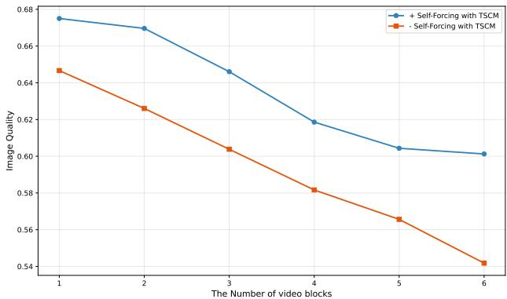

# 1. 论文基本信息

## 1.1. 标题

**Yume-1.5: A Text-Controlled Interactive World Generation Model**

中文可译为：**Yume-1.5：一个由文本控制的交互式世界生成模型**。

从标题可以直观地看出，这篇论文的核心主题是关于一个名为 `Yume-1.5` 的模型，其主要功能是生成一个虚拟世界，这个世界不仅是“交互式”的（意味着用户可以像在游戏中一样进行探索），而且其生成过程可以被“文本”所控制。

## 1.2. 作者

*   Xiaofeng Mao, Zhen Li, Chuanhao Li, Xiaojie Xu, Kaining Ying, Tong He, Jiangmiao Pang, Yu Qiao, Kaipeng Zhang
*   **隶属机构:**
    1.  上海人工智能实验室 (Shanghai AI Laboratory)
    2.  复旦大学 (Fudan University)
    3.  上海算法创新研究院 (Shanghai Innovation Institute)

        这些作者和机构在计算机视觉和人工智能领域，特别是在生成模型方向，有着深厚的研究背景和卓越的声誉。例如，上海人工智能实验室是国内顶尖的人工智能研究机构，主导或参与了多个知名的开源大模型项目。

## 1.3. 发表期刊/会议

*   <strong>发表于 (UTC)：</strong> 2025-12-26T17:52:49.000Z
*   **期刊/会议:** 论文中提供了 `arXiv` 的链接，这表明它是一篇<strong>预印本 (preprint)</strong> 论文。

    **对初学者友好的解释：** `arXiv` 是一个著名的学术论文预印本服务器。科研人员在将其论文提交给正式的、需要同行评审 (peer review) 的学术会议或期刊之前，通常会先将手稿上传到 `arXiv` 上，以便快速与全球的科研同行分享最新的研究成果。因此，这篇论文在当前时间点（2026年1月）尚未经过正式的同行评审，但其内容已经可以公开获取和讨论。

## 1.4. 发表年份

根据论文元数据，发表年份为 **2025** 年。这可能是一个占位符或预期的发表年份。

## 1.5. 摘要

这篇论文针对现有利用<strong>扩散模型 (diffusion models)</strong> 生成可交互、可探索世界的方案中存在的**参数量过大、推理步骤冗长、历史上下文信息爆炸**等严重制约实时性能和文本控制能力的问题，提出了一个名为 `Yume-1.5` 的新型框架。该框架能够从<strong>单张图片或单个文本提示 (prompt)</strong> 出发，生成一个真实、可交互且连续的虚拟世界，并支持用户通过键盘进行探索。`Yume-1.5` 的核心由三个组件构成：
1.  一个集成了**统一上下文压缩**与**线性注意力机制**的**长视频生成框架**，用于处理不断增长的历史信息。
2.  一个由**双向注意力蒸馏**和**增强的文本嵌入方案**驱动的**实时流式加速策略**，用于提升生成速度。
3.  一种用于生成<strong>世界事件 (world events)</strong> 的**文本控制方法**。

## 1.6. 原文链接

*   <strong>官方来源 (arXiv):</strong> [https://arxiv.org/abs/2512.22096](https://arxiv.org/abs/2512.22096)
*   **PDF 链接:** [https://arxiv.org/pdf/2512.22096v1.pdf](https://arxiv.org/pdf/2512.22096v1.pdf)
*   **发布状态:** 预印本 (Preprint)。

# 2. 整体概括

## 2.1. 研究背景与动机

### 2.1.1. 核心问题

论文旨在解决**自动化生成广阔、可交互、可持续的虚拟世界**这一前沿课题。具体来说，当前最先进的视频生成模型（尤其是基于扩散模型的方法）虽然效果惊艳，但在应用于“生成一个可以实时探索的无限世界”这一任务时，面临三大瓶颈：

1.  <strong>高昂的生成延迟 (High Generation Latency):</strong> 扩散模型通常需要多步推理才能生成一帧高质量图像，生成连续的视频帧序列更是耗时。对于需要即时响应用户操作（如键盘移动）的“世界探索”任务，这种延迟是致命的，无法实现<strong>实时交互 (real-time performance)</strong>。
2.  <strong>无限上下文处理难题 (Growing Historical Context):</strong> 在一个连续探索的世界中，模型每生成新的一帧，都需要参考前面已经生成的所有历史画面，以保证世界的<strong>时序连贯性 (temporal coherence)</strong>。随着探索时间的增加，历史上下文会无限增长，导致计算量和内存消耗急剧膨胀，最终系统会崩溃。
3.  <strong>缺乏灵活的文本控制能力 (Insufficient Text Control):</strong> 现有的一些交互式生成方法主要依赖于图像作为输入，并仅支持键盘、鼠标等物理控制，但无法根据用户的文本指令来动态地在世界中生成<strong>随机事件 (random events)</strong>，例如“天空中出现一架飞碟”或“路边突然下起大雨”。

### 2.1.2. 创新思路

针对上述挑战，`Yume-1.5` 的核心思路是通过**系统性的协同优化**，在保证生成质量和连贯性的前提下，将生成速度提升至实时水平，并引入文本控制能力。其切入点可以概括为：<strong>“压缩历史，加速当前，控制未来”</strong>。

*   **压缩历史：** 提出一种创新的上下文压缩机制 `TSCM`，而不是像先前工作那样粗暴地丢弃或过度压缩遥远的历史信息。
*   **加速当前：** 采用类似知识蒸馏的策略，将一个强大的、慢速的多步扩散模型的能力“蒸馏”到一个快速的、少步生成的模型中，并结合 `TSCM` 解决训练与推理不一致的问题。
*   **控制未来：** 通过巧妙的模型架构和数据集设计，让模型能够理解并执行描述“世界事件”的文本指令。

## 2.2. 核心贡献/主要发现

论文的主要贡献可以清晰地总结为以下三点：

1.  <strong>提出了联合时空-通道建模 (Joint Temporal-Spatial-Channel Modeling, TSCM) 方法：</strong> 这是一种用于无限长视频生成的上下文管理策略。它能有效压缩不断增长的历史视频帧，同时保持生成速度的稳定，解决了上下文信息爆炸的问题。
2.  **提出了结合 `Self-Forcing` 与 `TSCM` 的加速推理框架：** 该框架通过一种特殊的训练方式，将模型训练成一个只需极少推理步骤（例如4步）就能生成高质量视频的“快速生成器”，同时通过引入 `TSCM` 机制，有效缓解了快速推理中常见的<strong>误差累积 (error accumulation)</strong> 问题，保证了长视频的生成质量。
3.  **实现了文本控制的世界生成与编辑能力：** 通过精心的模型架构设计（如分离事件和动作的文本编码）和混合数据集训练策略，`Yume-1.5` 不仅能根据用户的键盘操作探索世界，还能响应文本指令，在世界中动态生成或编辑内容（如天气变化、特定事件发生），且实现这一功能所需的数据成本较低。

    最终，`Yume-1.5` 实现了在单张 A100 GPU 上以 540p 分辨率、12 帧/秒 (fps) 的速度进行实时交互式世界生成，这是一个非常显著的性能提升。

# 3. 预备知识与相关工作

## 3.1. 基础概念

### 3.1.1. 扩散模型 (Diffusion Models)

扩散模型是一类强大的生成模型，其灵感来源于热力学中的扩散过程。它的工作方式分为两个阶段：

1.  <strong>前向过程 (Forward Process):</strong> 在这个阶段，我们从一张真实的图片开始，在很多个时间步（比如1000步）中，逐步、少量地向图片中添加<strong>高斯噪声 (Gaussian noise)</strong>。经过足够多的步骤后，原始图片会变成一张完全由随机噪声构成的图片。这个过程是固定的，不需要学习。
2.  <strong>反向过程 (Reverse Process):</strong> 这是模型学习的核心。模型（通常是一个神经网络，如 `U-Net` 或 `Transformer`）的任务是学习如何“逆转”上述过程。也就是说，给定一张充满噪声的图片和当前的时间步，模型需要预测出应该从中“减去”什么样的噪声，才能让它向着更清晰的原始图片靠近一步。通过一步步地去噪，模型最终就能从一张纯噪声图片出发，生成一张全新的、高质量的图片。

### 3.1.2. 潜在扩散模型 (Latent Diffusion Models, LDM)

由于在原始像素空间上运行扩散模型计算成本非常高，`LDM` 提出了一种更高效的方案。它首先使用一个<strong>变分自编码器 (Variational Autoencoder, VAE)</strong> 将高分辨率的图片压缩到一个维度小得多的<strong>潜在空间 (latent space)</strong> 中。然后，扩散模型的“加噪”和“去噪”过程都在这个低维的潜在空间中进行，大大降低了计算量。当去噪过程完成后，再用 VAE 的解码器将潜在空间中的表示恢复成高分辨率的图片。`Stable Diffusion` 就是一个著名的 `LDM`。

### 3.1.3. 扩散变换器 (Diffusion Transformer, DiT)

在传统的扩散模型中，用于预测噪声的神经网络通常是 `U-Net` 架构。`DiT` 是一项重要改进，它提出使用在自然语言处理领域大获成功的 **Transformer** 架构来替代 `U-Net`。`DiT` 将加噪后的图片（在潜在空间中）切分成一个个<strong>图块 (patches)</strong>，并将这些图块视为<strong>词元 (tokens)</strong>，然后输入到 Transformer 中进行处理。实验证明，`DiT` 架构具有更好的<strong>可扩展性 (scalability)</strong>，即随着模型规模和计算资源的增加，其性能提升更显著。本文的 `Yume-1.5` 就是基于 `DiT` 架构构建的。

### 3.1.4. 自回归生成 (Autoregressive Generation)

自回归是一种序列生成模式，其核心思想是“一步一步地生成”。在生成序列中的下一个元素时，模型会将之前已经生成的所有元素作为输入。例如，在语言模型中，要生成句子“我爱人工智能”，模型会先生成“我”，然后基于“我”生成“爱”，再基于“我爱”生成“人工智能”。在本文的视频生成任务中，自回归意味着模型会根据已经生成的视频帧（历史上下文）来预测和生成下一小段视频帧。

### 3.1.5. 注意力机制 (Attention Mechanism)

注意力机制是 Transformer 架构的核心。它允许模型在处理一个元素时，能够“关注”到输入序列中所有其他元素，并根据相关性分配不同的<strong>注意力权重 (attention weights)</strong>。标准注意力机制的计算过程如下：

$$
\mathrm{Attention}(Q, K, V) = \mathrm{softmax}\left(\frac{QK^T}{\sqrt{d_k}}\right)V
$$

*   **符号解释:**
    *   $Q$ (Query, 查询): 代表当前正在处理的元素。
    *   $K$ (Key, 键): 代表输入序列中所有可以被查询的元素。
    *   $V$ (Value, 值): 代表输入序列中所有元素的内容。
    *   $d_k$: 是 $K$ 向量的维度，用于缩放，防止梯度过小。
    *   **计算流程:** 首先计算 $Q$ 和所有 $K$ 的点积（相似度），然后通过 `softmax` 函数将其转换为权重（总和为1），最后将这些权重应用于 $V$ 进行加权求和，得到最终的输出。这个过程的计算复杂度是序列长度的平方，即 $O(N^2)$，当序列很长时（如长视频），计算成本非常高。

### 3.1.6. 线性注意力 (Linear Attention)

为了解决标准注意力机制在处理长序列时计算成本过高的问题，研究者提出了多种近似方法，`线性注意力`是其中之一。它的核心思想是改变计算顺序，避免直接计算 $Q$ 和 $K$ 的巨大注意力矩阵。通过使用一个核函数 $\phi$ 并利用矩阵乘法的结合律，它可以将计算复杂度从 $O(N^2)$ 降低到 $O(N)$，即与序列长度成线性关系。这使得它非常适合处理像本文中无限增长的视频上下文这样的长序列。

## 3.2. 前人工作

作者将相关工作分为三类：

1.  **基于视频扩散模型的世界生成:** 早期工作如 `Imagen Video` 和 `Make-A-Video` 开启了高质量文生视频的时代。随后，`Lumiere` 和 `Sora` 等大规模模型进一步提升了视频的长度、连贯性和逼真度。开源社区也涌现出 `Stable Video Diffusion`、`Hunyuan-Video` 等优秀模型。在这些强大的基础模型之上，研究开始转向创造可直接控制的世界，例如生成可控2D世界的 `Genie`、用于自动驾驶模拟的 `GAIA-1`。为了解决长时一致性问题，`StreamingT2V` 提出了可扩展视频生成，`Matrix-Game` 和 `WORLDMEM` 则分别专注于交互式游戏和记忆增强的一致性。`Yume-1.5` 正是建立在这些先进模型的基础上，专注于生成**真实的动态世界**。

2.  **视频生成中的相机控制:** 如何精确控制生成视频中的镜头运动至关重要。`MotionCtrl`、`Direct-a-Video` 和 `CameraCtrl` 等方法允许用户通过提供明确的相机位姿序列来控制镜头轨迹。与这些需要精细参数调整的方法不同，`Yume-1.5` 采用了更直观的方式，将连续的相机运动<strong>离散化 (discretize)</strong> 为类似游戏中的键盘按键（如 W/A/S/D），降低了用户的操作门槛。

3.  **长视频生成:** 一些工作探索了长视频的生成方法。`SkyReels V2` 采用滑动窗口，用最近的几帧作为历史上下文。`CausVid` 和 `SelfForcing` 则利用了 `KV Cache`（一种缓存注意力机制中键和值的技术）来实现自回归推理。`SelfForcing` 通过让模型在训练时就接触到自己先前生成的、带有误差的帧，来缓解测试时因误差累积导致质量下降的问题。

## 3.3. 技术演进

该领域的技术演进脉络清晰可见：
1.  **从静态到动态:** 从生成高质量**图像**（如 DALL-E, Stable Diffusion）发展到生成**短视频**（如 Make-A-Video, SVD）。
2.  **从短到长:** 从生成几秒钟的短视频发展到追求生成数分钟甚至更长的**长视频**，这催生了对上下文管理技术的研究（如滑动窗口、KV Cache）。
3.  **从被动观看到主动交互:** 从生成预设内容的视频发展到生成用户可以**实时交互和探索**的虚拟世界（如 Matrix-Game, Yume-1.5）。
4.  **从物理控制到语义控制:** 从仅支持键盘、鼠标等物理移动控制，发展到支持**文本指令**来动态改变世界内容和事件。

    `Yume-1.5` 正是处在技术演进的最新阶段，它试图同时解决长视频生成、实时交互和文本控制这三大挑战。

## 3.4. 差异化分析

与相关工作相比，`Yume-1.5` 的核心创新和区别在于：

*   **与 `SelfForcing` 等方法的区别:** `SelfForcing` 等方法依赖 `KV Cache` 来存储历史信息，但随着视频变长，`KV Cache` 同样会无限增长，最终还是需要简单粗暴地截断历史信息。`Yume-1.5` 提出的 **`TSCM` 机制**是一种更优雅的解决方案，它通过时空和通道两个维度的联合压缩来管理历史上下文，避免了信息的过早丢失，同时保持了计算负载的稳定。
*   **与 `WORLDMEM` 等方法的区别:** `WORLDMEM` 依赖已知的相机轨迹来检索最相关的历史帧，这种方法不适用于 `Yume-1.5` 这种通过键盘实时控制、相机轨迹事先未知的场景。`Yume-1.5` 的 `TSCM` 不依赖于相机轨迹，通用性更强。
*   **与 `CameraCtrl` 等方法的区别:** `CameraCtrl` 等方法需要用户提供精确的、每一步的相机位姿参数序列，操作复杂。`Yume-1.5` 将控制方式简化为直观的键盘输入，大大提升了易用性。
*   **与 `MatrixGame` 等方法的区别:** `MatrixGame` 等方法主要在游戏场景数据集上训练，生成的世界偏向于游戏风格。`Yume-1.5` 混合了真实世界数据集和高质量合成数据集，其目标是生成更逼真的**动态城市场景**，并且加入了前者所不具备的**文本控制事件**的能力。

# 4. 方法论

本部分将详细拆解 `Yume-1.5` 的技术实现。其整体框架可以看作一个在 `Wan` 模型基础上进行深度魔改的系统。

## 4.1. 架构初步 (Architecture Preliminary)

`Yume-1.5` 的基础是一个能同时进行<strong>文生视频 (Text-to-Video, T2V)</strong> 和<strong>图生视频 (Image-to-Video, I2V)</strong> 的模型。它基于 `Wan` 模型，使用 `DiT` 作为其核心骨干网络。

*   **输入表示:** 模型处理的是在 VAE 潜在空间中的表示 $z$。对于视频生成，输入是一个形状为 $C \times f_t \times h \times w$ 的噪声张量，其中 $C$ 是通道数，$f_t$ 是总帧数，$h$ 和 $w$ 是高和宽。
*   <strong>图生视频 (I2V) 模式:</strong> 当给定一个条件图像或视频 $z_c$ 时，它会被拼接到总帧数 $f_t$ 的长度，未提供的部分用 0 填充。一个二进制掩码 $M_c$ 会标记哪些部分是已知的历史帧（值为1），哪些是需要模型生成的新帧（值为0）。最终输入到 `DiT` 的是历史帧和噪声的组合：$M_c \cdot z_c + (1 - M_c) \cdot z$。
*   **文本编码策略的创新:** 这是一个重要的细节。传统的做法是直接将整个文本描述（caption）输入到一个文本编码器（如 T5）中。`Yume-1.5` 进行了拆分，如原文 Figure 3(b) 所示，它将文本描述分为两部分：
    1.  <strong>事件描述 (Event Description):</strong> 描述要生成的场景或事件，例如“突降大雨”。
    2.  <strong>动作描述 (Action Description):</strong> 描述键盘和鼠标的控制指令，例如“相机向前移动 (W)”。
        这两部分被分别送入 T5 编码器，然后将得到的<strong>嵌入向量 (embeddings)</strong> 拼接起来。
    **这么做的好处是：** 动作描述的种类是有限的（如前进、后退、左转、右转等），因此它们的嵌入向量可以<strong>预先计算好并缓存 (cache)</strong> 起来。在连续的视频生成过程中，如果用户只是在移动而没有输入新的事件描述，模型就无需重复运行计算昂贵的 T5 编码器，只需从缓存中读取动作嵌入即可，**极大地降低了推理过程中的计算开销**。

## 4.2. 通过联合时空-通道建模 (TSCM) 生成长视频

这是 `Yume-1.5` 的核心创新之一，旨在解决自回归生成中历史上下文无限增长导致的计算灾难。`TSCM` 通过两条并行的路径对历史帧 $z_c$ 进行压缩处理。

### 4.2.1. 时空压缩 (Temporal-Spatial Compression)

这条路径的目标是减少输入到标准 `DiT` 注意力模块的 `token` 数量。

1.  **时间维度压缩:** 首先对历史帧 $z_c$ 进行随机的<strong>时间采样 (temporal random frame sampling)</strong>，例如每32帧只取1帧。
2.  **空间维度压缩:** 然后，对采样后的帧应用不同压缩率的 `Patchify` 操作（即将图片切块并线性投影）。这个压缩率是**渐进式**的：
    *   离当前预测帧最近的帧（如 t-1 到 t-2 帧）：使用较低的压缩率，如空间下采样2倍 $(1, 2, 2)$，保留更多细节。
    *   稍远一些的帧（如 t-3 到 t-6 帧）：使用中等压缩率，如空间下采样4倍 $(1, 4, 4)$。
    *   更遥远的帧（如 t-7 到 t-23 帧）：使用更高的压缩率，如空间下采样8倍 $(1, 8, 8)$。
    *   最初的起始帧：保留较高分辨率，使用 $(1, 2, 2)$。
        通过这种方式，模型既能“记住”遥远的历史（尽管很模糊），又能“看清”最近的过去。

3.  **拼接与输入:** 经过上述压缩后，得到的历史帧压缩表示 $\hat{z}_c$ 与当前待预测帧的表示 $\hat{z}_p$（使用标准压缩率 $(1, 2, 2)$ 处理）进行拼接，然后一起送入 `DiT` Block 中的**标准自注意力模块**。

### 4.2.2. 通道压缩 (Channel Compression)

这条路径与时空压缩并行，旨在利用计算高效的**线性注意力**来融合长程历史信息。

1.  **高压缩率处理:** 历史帧 $z_c$ 经过一个高压缩率的 `Patchify` 操作（时间维度8倍，空间维度4倍，即 $(8, 4, 4)$），并且其通道维度被压缩到96，得到一个非常紧凑的表示，记为 $z_{\mathrm{linear}}$。
2.  **信息融合:** 如图 Figure 3(a) 所示，在 `DiT` 的每个 Block 内部：
    *   主要的视频 `tokens` $z^l$ 经过标准的<strong>交叉注意力层 (cross-attention layer)</strong>。
    *   然后，从 $z^l$ 中提取出与待预测帧相关的部分 $z_p^l$，并与之前压缩好的历史信息 $z_{\mathrm{linear}}$ 进行拼接，形成融合 `token` $z_{fus}$。
    *   这个 $z_{fus}$ 被送入一个<strong>线性注意力层 (linear attention layer)</strong> 进行信息融合，得到输出 $z_{fus}^l$。
    *   最后，将 $z_{fus}^l$ 的通道维度恢复，并与原始的 $z^l$ 进行<strong>逐元素相加 (element-wise addition)</strong>，从而将长程历史信息注入到主干网络的每一层中。

3.  **线性注意力计算:** 论文中给出了线性注意力输出 $o^l$ 的计算公式：
    $$
    o ^ { l } = \frac { \left( \sum _ { i = 1 } ^ { N } v _ { i } ^ { l } \phi ( k _ { i } ^ { l } ) ^ { T } \right) \phi ( q ^ { l } ) } { \left( \sum _ { j = 1 } ^ { N } \phi ( k _ { j } ^ { l } ) ^ { T } \right) \phi ( q ^ { l } ) }
    $$
    *   **符号解释:**
        *   $l$: 表示 `DiT` 的第 $l$ 层。
        *   $q^l, k^l, v^l$: 分别是由输入 $z_{fus}^l$ 通过全连接层计算得到的 Query, Key, Value 向量。
        *   $N$: 是输入 $z_{fus}^l$ 中的 `token` 总数。
        *   $\phi$: 是一个非线性激活函数，论文中指明是 `ReLU`。它取代了标准注意力中的 `exp` 函数。
        *   **核心思想:** 这个公式通过改变计算顺序，先计算 $\sum v\phi(k)^T$ 和 $\sum \phi(k)^T$，这两个部分可以被看作是历史信息的“记忆状态”，然后才与当前的查询 $\phi(q)$ 相乘。这样避免了构建一个 $N \times N$ 的注意力矩阵，从而实现了线性复杂度。

            <strong>总结 <code>TSCM</code>：</strong> `TSCM` 是一个双管齐下的策略。它用**时空压缩**来减轻**标准注意力**的负担（对 `token` 数量敏感），同时用**通道压缩**来适配**线性注意力**的特性（对通道维度敏感）。通过这种方式，它在不丢失太多信息的前提下，高效地处理了无限增长的历史上下文。

## 4.3. 实时加速 (Real-time Accelerate)

为了实现实时生成，模型必须在极少的推理步骤内（例如4步，而标准扩散模型通常需要20-50步）完成去噪。`Yume-1.5` 采用了一种结合了**知识蒸馏**和 `Self-Forcing` 思想的加速策略。

1.  **模型设置:** 框架中包含三个模型，它们都由预训练好的基础模型初始化：
    *   <strong>生成器 (Generator) $G_{\theta}$:</strong> 这是我们最终要训练和使用的快速生成模型。
    *   <strong>伪模型 (Fake Model) $G_s$:</strong> 代表由生成器自己产生的数据分布。
    *   <strong>真模型 (Real Model) $G_t$:</strong> 代表真实数据或一个强大的教师模型指导的分布。

2.  **训练过程:** 如图 Figure 4 所示，训练的核心思想是<strong>让生成器 $G_{\theta}$ 学会如何修复由自己（或相似的快速模型）产生的、带有误差的数据</strong>。
    *   **`Self-Forcing` 核心:** 在训练的每一步，生成器 $G_{\theta}$ 不再像传统训练那样以完美的真实数据作为条件，而是以**它自己在前一步生成的存在误差的帧**作为历史上下文条件，来生成新的预测帧。这弥合了训练（使用完美数据）和推理（使用有误差的自身输出）之间的<strong>差距 (train-inference discrepancy)</strong>，从而有效减少了误差累积。
    *   **蒸馏损失:** 模型通过最小化一个类似<strong>分布匹配蒸馏 (Distribution Matching Distillation, DMD)</strong> 的损失函数来进行优化。其梯度计算公式如下：
        $$
        \nabla \mathcal { L } _ { \mathrm { DMD } } = - \mathbb { E } _ { t } \left( \int \left( s _ { \mathrm { real } } ( F ( G _ { \theta } ( z _ { t } ) , t ) , t ) - s _ { \mathrm { fake } } ( F ( G _ { \theta } ( z _ { t } ) , t ) , t ) \right) \frac { d G _ { \theta } ( z ) } { d \theta } d z \right)
        $$
    *   **符号解释:**
        *   $s_{\mathrm{real}}$ 和 $s_{\mathrm{fake}}$: 分别代表“真实”分布和“伪”分布的<strong>分数 (score)</strong>，即对数概率密度的梯度。它们指导生成器 $G_{\theta}$ 的更新方向，使其输出更接近“真实”分布。
        *   $F(G_{\theta}(z_t), t)$: 表示将生成器 $G_{\theta}$ 的输出（去噪一步的结果）再次通过前向过程加噪 $t$ 步。
        *   **直观理解:** 这个损失函数的目标是，让生成器 $G_{\theta}$ 的输出在经过任意步加噪后，其分数（即去噪方向）能同时匹配上“真实”模型和“伪”模型的分数。这本质上是一种知识蒸馏，迫使快速的学生模型 $G_{\theta}$ 模仿强大的教师模型。

3.  **与 `Self-Forcing` 的关键区别:** 原始的 `Self-Forcing` 依赖 `KV Cache` 存储历史上下文。而 `Yume-1.5` 在此框架中用其创新的 <strong><code>TSCM</code> 机制完全取代了 <code>KV Cache</code></strong>。这使得模型在加速训练和推理时，能够利用到更长、更丰富的上下文信息，进一步提升了长视频生成的质量和一致性。

# 5. 实验设置

## 5.1. 数据集

为了训练出一个既能生成逼真世界、又能理解用户指令的模型，作者精心构建了一个混合数据集。

1.  <strong>真实世界数据集 (Real-world Dataset):</strong>
    *   **来源:** `Sekai-Real-HQ`，这是一个包含大量高质量、带标注的真人第一视角行走视频的数据集。
    *   **处理:**
        *   从原始的相机轨迹数据中提取出离散的键盘/鼠标控制信号（如 W, A, S, D 等），作为模型的<strong>动作条件 (action condition)</strong>。
        *   对标注进行“一数两用”：原始的详细场景描述用于<strong>文生视频 (T2V)</strong> 训练；同时，使用大语言模型 `InternVL3-78B` 为视频生成新的、专注于**动态事件**的描述（例如，原文 Figure 2 中的例子），用于<strong>图生视频 (I2V)</strong> 训练。
    *   <strong>数据示例 (原文 Figure 2):</strong>
        *   <strong>原始描述 (T2V 用):</strong> "A vivid European-style city street scene in bright summer daylight. .. , and a sidewalk cafe on the right where people are seated or standing." (一个阳光明媚的夏日，生动的欧式城市街道场景...右边有一个路边咖啡馆，有人坐着或站着。)
        *   <strong>新描述 (I2V 用):</strong> "People are moving aside to avoid the street sprinkler." (人们正在躲避洒水车。)

2.  <strong>合成数据集 (Synthetic Dataset):</strong>
    *   **目的:** 防止模型在真实世界数据上<strong>过拟合 (overfitting)</strong>，并保持其通用的视频生成能力，避免<strong>灾难性遗忘 (catastrophic forgetting)</strong>。
    *   **构建过程:** 从 `Openvid` 数据集中挑选了 8 万个多样的文本描述，使用 `Wan 2.1` 模型生成了 8 万个 720p 视频，再使用 `VBench` 评估工具筛选出质量最高的 5 万个视频用于 T2V 训练。

3.  <strong>事件数据集 (Event Dataset):</strong>
    *   **目的:** 专门增强模型生成**特定事件**的能力。
    *   **构建过程:** 招募志愿者编写了四类事件的描述（城市生活、科幻、奇幻、天气），收集了 1 万张匹配的图像，使用 `Wan 2.2` 模型生成了 1 万个 I2V 视频，最后人工筛选出与描述最匹配的 4000 个高质量视频用于 T2V 训练。

## 5.2. 评估指标

论文使用了 `Yume-Bench` 评估框架，包含六个细粒度指标，全面考察模型的生成质量和控制能力。

1.  <strong>指令跟随 (Instruction Following, IF):</strong>
    *   **概念定义:** 衡量生成的视频是否准确地遵循了给定的控制指令，例如指令要求“向前走并向右转”，视频中的镜头运动是否与此一致。这是评估模型**可控性**的核心指标。
    *   **数学公式:** 该指标通常通过一个预训练的运动估计模型或分类器来计算。给定生成的视频 $V_{gen}$ 和指令 $I$，评估模型 $M_{eval}$ 输出一个分数，表示一致性程度。公式可抽象为 $IF = M_{eval}(V_{gen}, I)$。
    *   **符号解释:** $V_{gen}$ 是生成的视频， $I$ 是输入的控制指令。$M_{eval}$ 是一个评估模型。分数越高，表示越一致。

2.  <strong>主体一致性 (Subject Consistency, SC):</strong>
    *   **概念定义:** 衡量视频中主要对象（如人物、车辆）在不同帧之间是否保持了外观和身份的一致性，不会发生突然的“变脸”或“变形”。
    *   **数学公式:** 通常通过计算视频中不同帧里检测到的同一对象的特征向量之间的余弦相似度来度量。对于视频中的第 $i$ 帧和第 $j$ 帧的主体特征 $f_i$ 和 $f_j$，一致性可以表示为：$SC = \frac{1}{N_{pairs}} \sum_{(i,j)} \frac{f_i \cdot f_j}{\|f_i\| \|f_j\|}$。
    *   **符号解释:** $f_i, f_j$ 是从帧 `i, j` 中提取的主体特征向量， $N_{pairs}$ 是计算的帧对总数。

3.  <strong>背景一致性 (Background Consistency, BC):</strong>
    *   **概念定义:** 类似于主体一致性，但关注的是视频背景部分。衡量背景在镜头移动时是否保持稳定和连贯，没有不合理的扭曲或跳变。
    *   **数学公式:** 计算方式与 SC 类似，但特征提取的对象是背景区域。

4.  <strong>运动平滑度 (Motion Smoothness, MS):</strong>
    *   **概念定义:** 评估视频中的运动是否流畅自然，没有卡顿、抖动或不符合物理规律的突变。
    *   **数学公式:** 通常通过计算视频的光流 (optical flow) 场在时间上的二阶导数（即加速度）的范数来衡量。一个平滑的运动其光流加速度应该很小。`MS = -\log(\mathbb{E}_{x,y,t}[\|\frac{\partial^2 F}{\partial t^2}\|_2])`，其中 $F$ 是光流场。
    *   **符号解释:** `F(x,y,t)` 表示在像素点 `(x,y)` 和时间 $t$ 的光流向量。期望值 $\mathbb{E}$ 在所有像素和时间上计算。

5.  <strong>美学质量 (Aesthetic Quality, AQ):</strong>
    *   **概念定义:** 衡量生成的视频在视觉上是否“好看”，包括构图、色彩、光影等方面是否符合人类的美学偏好。
    *   **数学公式:** 通常使用一个在大量带有美学评分的数据集上预训练的评分模型 $M_{aesthetic}$ 来打分。$AQ = \frac{1}{N_{frames}} \sum_{i=1}^{N_{frames}} M_{aesthetic}(Frame_i)$。
    *   **符号解释:** $M_{aesthetic}$ 是美学评分模型，$Frame_i$ 是视频的第 $i$ 帧。

6.  <strong>图像质量 (Imaging Quality, IQ):</strong>
    *   **概念定义:** 评估单帧图像的质量，关注的是清晰度、伪影（artifacts）、噪声水平等技术性指标，而不涉及美学。
    *   **数学公式:** 可以使用多种无参考图像质量评估（No-Reference IQA）算法，如 BRISQUE 或 NIQE。例如，$IQ = \frac{1}{N_{frames}} \sum_{i=1}^{N_{frames}} \mathrm{NIQE}(Frame_i)$。
    *   **符号解释:** $\mathrm{NIQE}$ 是一种常用的无参考图像质量评估算法。

## 5.3. 对比基线

论文将 `Yume-1.5` 与以下几个代表性的模型进行了比较：

*   **`Wan-2.1`:** 一个强大的开源文生视频/图生视频模型，是 `Yume-1.5` 的基础模型之一。将其作为基线可以展示 `Yume-1.5` 的改进效果。
*   **`MatrixGame`:** 一个专注于生成交互式游戏世界的模型，与 `Yume-1.5` 的目标相似，是直接的竞争对手。
*   **`Yume`:** `Yume-1.5` 的前一个版本，对比它可以清晰地展示 `1.5` 版本中新引入的技术（如 TSCM）带来的提升。

# 6. 实验结果与分析

## 6.1. 核心结果分析 (图生视频)

核心实验结果展示在原文的 Table 1 中，比较了不同模型在 I2V 任务上的性能。

以下是原文 Table 1 的结果：

<table>
<thead>
<tr>
<th>Model</th>
<th>Time(s)</th>
<th>IF↑</th>
<th>SC↑</th>
<th>BC↑</th>
<th>MS↑</th>
<th>AQ↑</th>
<th>IQ↑</th>
</tr>
</thead>
<tbody>
<tr>
<td>Wan-2.1</td>
<td>611</td>
<td>0.057</td>
<td>0.859</td>
<td>0.899</td>
<td>0.961</td>
<td>0.494</td>
<td>0.695</td>
</tr>
<tr>
<td>MatrixGame</td>
<td>971</td>
<td>0.271</td>
<td>0.911</td>
<td>0.932</td>
<td>0.983</td>
<td>0.435</td>
<td>0.750</td>
</tr>
<tr>
<td>Yume</td>
<td>572</td>
<td>0.657</td>
<td>0.932</td>
<td>0.941</td>
<td>0.986</td>
<td>0.518</td>
<td>0.739</td>
</tr>
<tr>
<td>Yume1.5</td>
<td>8</td>
<td><b>0.836</b></td>
<td>0.932</td>
<td>0.945</td>
<td>0.985</td>
<td>0.506</td>
<td>0.728</td>
</tr>
</tbody>
</table>

**结果解读:**

1.  **巨大的速度优势:** 最引人注目的结果是<strong>生成时间 (Time)</strong>。`Yume-1.5` 生成96帧视频仅需 **8秒**，而其他模型（包括其前身 `Yume`）都需要 **500秒以上**，速度提升了近 **70倍**。这得益于其创新的**实时加速**策略，使得模型只需4个推理步骤即可完成生成，真正实现了实时交互的可能性。
2.  **卓越的指令跟随能力:** 在<strong>指令跟随 (IF)</strong> 指标上，`Yume-1.5` 取得了 **0.836** 的高分，远超所有对比模型。`Wan-2.1` 几乎不具备可控性（0.057），`MatrixGame` 在真实世界场景下的泛化能力有限（0.271），而 `Yume-1.5` 相较于前代 `Yume`（0.657）也有显著提升。这证明了 `Yume-1.5` 的训练策略和模型设计能非常有效地理解和执行用户的键盘控制指令。
3.  **保持高质量生成:** 尽管速度极快，`Yume-1.5` 在其他各项视频质量指标上（SC, BC, MS, AQ, IQ）并没有做出牺牲，其分数与需要数十倍时间的 `Yume` 和 `MatrixGame` 模型基本持平，甚至在某些指标上略有优势。这表明其加速策略成功地在**速度和质量之间取得了出色的平衡**。

## 6.2. 长视频生成性能验证

为了验证模型在长时间生成下的稳定性，作者进行了长视频生成测试，并观察质量指标随时间的变化。

<strong>结果解读 (原文 Figure 5 &amp; 6):</strong>

*   **实验设置:** 模型被要求生成一个30秒的视频（分为6个5秒的视频块），并比较使用了“Self-Forcing with TSCM”加速训练的模型（`Yume-1.5` 的最终形态）和未使用该技术的基线模型。
*   <strong>美学质量 (AQ, Figure 5):</strong> 随着生成时间的推移（从第1个视频块到第6个），未使用加速技术的基线模型的美学分数出现了明显的**下降趋势**，从约 0.52 掉到了 0.442。这正是**误差累积**的体现。相比之下，`Yume-1.5` 的分数则保持得**更加稳定**，在第6个视频块时仍有 0.523 的高分。
*   <strong>图像质量 (IQ, Figure 6):</strong> 图像质量也表现出类似的趋势。基线模型的 IQ 分数在后期明显下滑，而 `Yume-1.5` 则保持了相对平稳的水平，最终得分为 0.601，高于基线的 0.542。

    **结论:** 这些结果有力地证明了 `Yume-1.5` 的 **`Self-Forcing with TSCM` 框架**对于抑制长视频生成过程中的质量衰减至关重要。

## 6.3. 消融实验/参数分析

作者通过消融实验验证了其核心组件 `TSCM` 的有效性。

### 6.3.1. TSCM 的有效性验证

实验比较了使用 `TSCM` 的模型和将 `TSCM` 替换为 `Yume` (v1) 中使用的简单空间压缩方法的模型。

以下是原文 Table 2 的结果：

<table>
<thead>
<tr>
<th>Model</th>
<th>IF↑</th>
<th>SC↑</th>
<th>BC↑</th>
<th>MS↑</th>
<th>AQ↑</th>
<th>IQ↑</th>
</tr>
</thead>
<tbody>
<tr>
<td><b>TSCM</b></td>
<td><b>0.836</b></td>
<td>0.932</td>
<td>0.945</td>
<td>0.985</td>
<td>0.506</td>
<td>0.728</td>
</tr>
<tr>
<td>Spatial Compression</td>
<td>0.767</td>
<td>0.935</td>
<td>0.945</td>
<td>0.973</td>
<td>0.504</td>
<td>0.733</td>
</tr>
</tbody>
</table>

<strong>结果解读 (Table 2):</strong>
*   **指令跟随能力提升:** 最显著的差异体现在 **IF** 指标上。使用 `TSCM` 的模型得分（0.836）明显高于仅使用空间压缩的模型（0.767）。论文推测，这是因为 `TSCM` 能更好地处理和整合长程历史信息，减少了历史帧中固有的运动方向对当前预测的干扰，使得模型能更专注于当前的控制指令。
*   **其他指标影响不大:** 在其他质量指标上，两者差异很小，说明 `TSCM` 在提升可控性的同时，没有损害生成质量。

### 6.3.2. TSCM 的速度稳定性验证

<strong>结果解读 (原文 Figure 7):</strong>
*   **实验设置:** 该图比较了三种不同上下文处理方式下的推理时间随视频块数（即上下文长度）增加的变化情况：`TSCM`、`Spatial Compression` (空间压缩) 和 `Full Context` (不压缩，输入全部历史帧)。
*   **`TSCM` 表现最佳:** 蓝色曲线代表的 `TSCM` 方法表现出**最强的稳定性**。随着视频块数从1增加到10，其推理时间几乎保持不变，在超过8个块后成为一条水平线。这证明了 `TSCM` 成功地将计算复杂度与上下文长度解耦。
*   **其他方法性能下降:** `Spatial Compression`（橙色曲线）的推理时间随上下文增长而线性增加。而 `Full Context`（绿色曲线）的性能下降最为剧烈，时间成本呈指数级增长，很快就变得不可行。

    **结论:** 消融实验从**效果**和**效率**两个方面都证明了 `TSCM` 机制的优越性，它是 `Yume-1.5` 实现稳定、高效长视频生成的关键。

# 7. 总结与思考

## 7.1. 结论总结

`Yume-1.5` 是一项在**交互式世界生成**领域的重大进展。它成功地将一个原本计算成本极高、延迟巨大的任务，转变为可以在单个高端GPU上**实时运行**的应用。论文的主要贡献和发现可以总结如下：

1.  **实现了实时交互生成：** 通过创新的 `Self-Forcing with TSCM` 加速框架，将视频生成的推理时间从分钟级压缩到秒级，同时有效抑制了误差累积，保证了长时生成的质量稳定性。
2.  **解决了无限上下文难题：** 提出的 `TSCM` 上下文管理机制通过时空和通道双路径压缩，巧妙地平衡了历史信息的保留与计算成本的控制，实现了恒定的推理速度，为“无限探索”奠定了技术基础。
3.  **赋予了世界文本控制能力：** 通过精巧的文本编码设计和混合数据集训练，模型不仅能响应键盘的物理移动指令，还能理解并执行创造性的文本指令来动态生成世界事件，极大地丰富了交互的维度。

    总而言之，`Yume-1.5` 为构建更加真实、动态和富有想象力的虚拟世界提供了一个高效、可行的技术范式。

## 7.2. 局限性与未来工作

作者在论文中坦诚地指出了当前模型的局限性：

1.  <strong>生成内容的偶然性伪影 (Artifacts):</strong> 模型有时会生成一些不合逻辑的现象，例如车辆倒着开、行人倒着走。
2.  **在密集场景下的性能下降:** 当场景中人群密度极高时，模型的生成质量会下降。
3.  **模型规模与性能的权衡:** 作者认为这些问题可能源于当前 5B 参数模型的容量限制。虽然提升分辨率能部分缓解，但根本解决需要更大的模型。然而，直接扩大模型规模又会牺牲来之不易的实时生成速度。

    基于此，作者提出的未来工作方向是探索<strong>专家混合 (Mixture-of-Experts, MoE)</strong> 架构。MoE 允许在大幅增加模型总参数量的同时，保持单次推理的计算量不变（因为每次只激活一部分“专家”网络），这被认为是同时实现更大模型容量和更低推理延迟的一个极具前景的方向。

## 7.3. 个人启发与批判

这篇论文给我带来了几点深刻的启发，同时也引发了一些批判性思考：

*   **启发:**
    1.  **系统性优化的力量:** `Yume-1.5` 的成功并非源于单一的技术突破，而是对模型架构、训练策略、数据工程等多个环节进行协同优化的结果。例如，`TSCM` 解决了上下文问题，加速框架解决了速度问题，文本编码和数据集解决了控制问题，三者结合才实现了最终目标。这体现了在复杂 AI 系统工程中全局思维的重要性。
    2.  **对“旧瓶装新酒”的思考:** `Self-Forcing` 和 `线性注意力` 等都不是全新的概念，但 `Yume-1.5` 的巧妙之处在于将 `TSCM` 这一新设计无缝地整合进 `Self-Forcing` 框架中，用以取代 `KV Cache`，取得了“1+1>2”的效果。这展示了将现有技术进行创新性组合的价值。
    3.  **从“能用”到“好用”的跨越:** 许多研究停留在验证一个概念“可行”的阶段，而 `Yume-1.5` 则非常务实地关注“实时性”和“易用性”（键盘控制），这是推动技术从实验室走向实际应用的关键一步。

*   **批判性思考:**
    1.  **控制的粒度问题:** 论文将相机控制离散化为键盘输入，虽然直观，但也可能牺牲了控制的精细度。例如，平滑的变速移动、复杂的弧线运镜等可能难以实现。未来如何结合离散控制的便捷性和连续控制的精确性，是一个值得探讨的问题。
    2.  <strong>“事件”</strong>的深度和逻辑性: 当前的文本控制事件似乎是瞬时和孤立的。例如，输入“下雨”，世界开始下雨。但一个更高级的交互式世界应该具有因果逻辑。比如，下雨后，路面会变湿，行人会打伞，车辆会开灯。当前模型是否具备这种长期的、跨模态的逻辑一致性，论文并未深入探讨。这可能是通往真正“世界模拟器”的下一个巨大挑战。
    3.  **对合成数据的依赖:** 模型严重依赖合成数据来扩充训练集和避免过拟合。虽然这是当前领域的常见做法，但也带来了风险：合成数据可能引入其生成模型（如 `Wan 2.1`）固有的偏见和 artifacts，这些可能会被 `Yume-1.5` “继承”下来。其鲁棒性和在更广泛、未见过场景中的泛化能力仍有待检验。