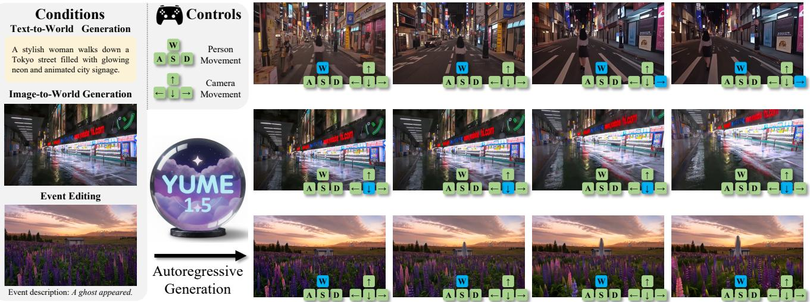
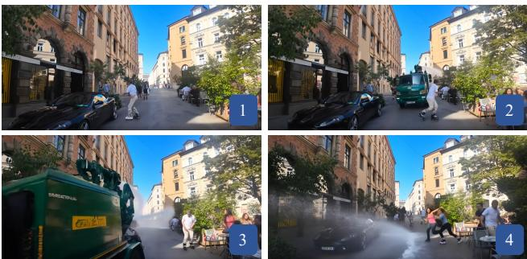
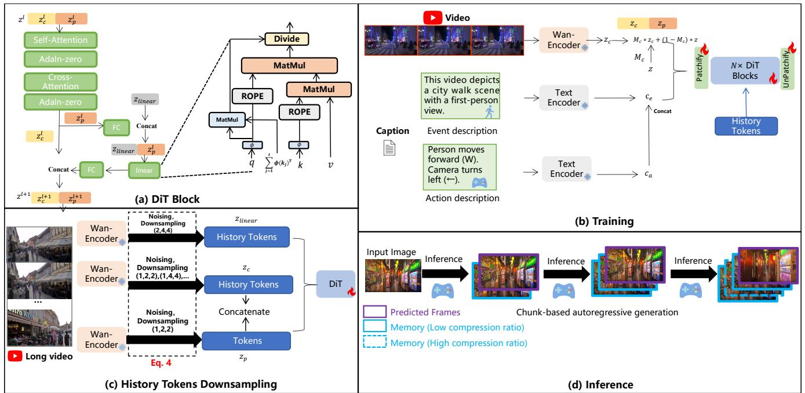
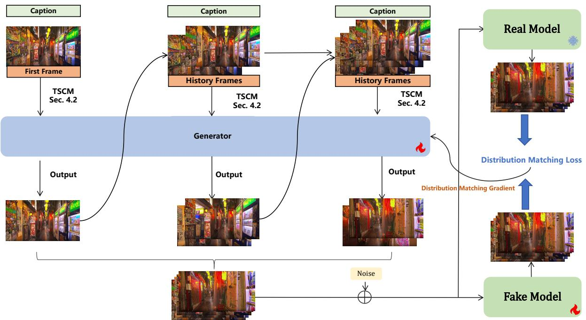
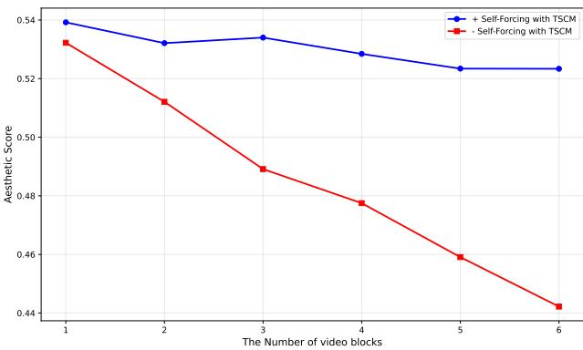
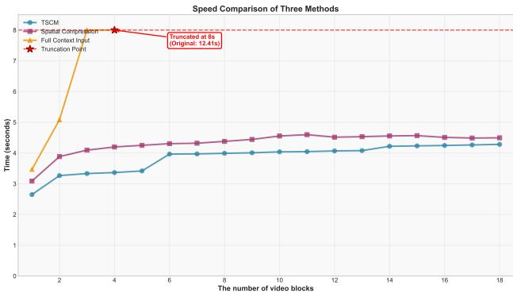
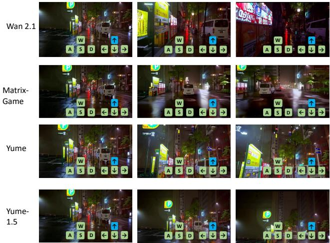

# Yume1 . 5: A Text-Controlled Interactive World Generation Model

Xiaofeng $\mathbf { M } \mathbf { a } \mathbf { o } ^ { 1 , 2 }$ , Zhen $\mathbf { L i } ^ { 1 }$ , Chuanhao $\mathbf { L i } ^ { 1 }$ , Xiaojie $\mathbf { X } \mathbf { u } ^ { 1 }$ , Kaining Ying2, Tong $\mathbf { H e } ^ { 1 }$ , Jiangmiao Pang1, Yu Qiao1, Kaipeng Zhang1,3††

1Shanghai AI Laboratory 2Fudan University 3Shanghai Innovation Institute $\ Q$ Github:https://github.com/stdstu12/YUME Project Page: https://stdstu12.github.io/YUME-Project Data: https://github.com/Lixsp11/sekai-codebase

  
the supplementary materials.

# Abstract

Recent approaches have demonstrated the promise of using diffusion models to generate interactive and explorable worlds. However, most of these methods face critical challenges such as excessively large parameter sizes, reliance on lengthy inference steps, and rapidly growing historical context, which severely limit real-time performance and lack text-controlled generation capabilities. To address these challenges, we propose Yume1.5, a novel framework designed to generate realistic, interactive, and continuous worlds from a single image or text prompt. Yume1 . 5 achieves this through a carefully designed framework that supports keyboard-based exploration of the generated worlds. The framework comprises three core components: (1) a long-video generation framework integrating unified context compression with linear attention; (2) a realtime streaming acceleration strategy powered by bidirectional attention distillation and an enhanced text embedding scheme; (3) a text-controlled method for generating world events. We have provided the codebase in the supplementary material. The model weights and full codebase will be made public.

# 1. Introduction

Video diffusion models [2, 3, 8, 20, 22, 27, 27, 29], which have shown remarkable capabilities in synthesizing highfidelity and temporally coherent visual content [3, 14], present a promising avenue to realize such a sophisticated interactive world generation task. Recently, the automated generation of vast, interactive, and persistent virtual worlds [1, 41] has advanced rapidly, driven by progress in generative models and the growing demand for immersive experiences in domains such as world simulation, interactive entertainment [17], and virtual embodiment [34, 41].

However, existing video diffusion methods face significant challenges in generating interactive and realistic videos. The main bottlenecks include: (1) Limited Generalizability: Most methods [34, 41] are trained on game datasets, creating a domain gap that makes it difficult to generate realistic dynamic urban scenes. (2) High Generation Latency: The high computational cost of diffusion models hinders real-time continuous generation required for unlimited exploration, thus limiting interactivity. (3) Insufficient Text Control Capability: Existing methods [34, 41] utilize images to generate videos and only keyboard, mouse control is supported but lack text control capability and cannot generate random events.

To address these limitations, we propose the Yume 1 . 5, which generates interactive infinite video worlds from single images in an autoregressive manner [21]. Through systematic optimization across three key dimensions, Yume1 . 5 achieves intuitive and stable camera control via keyboard inputs while significantly enhancing visual quality and continuity in complex scene generation:

(1) Long Video Generation via Joint TemporalSpatial-Channel Modeling (TSCM). We observe that existing methods suffer from either slow inference speed [39] as video duration increases. To overcome this, we design a joint temporal-spatial and channel compression approach: historical frames are compressed along temporal-spatial dimensions for input to the DiT [24], while channel-wise compressed features are processed by a parallel linear DiT. This design significantly reduces memory consumption and improves inference speed.

(2) Acceleration Method. Through synergistic optimization combining score distillation, we substantially enhance sampling efficiency while maintaining visual quality. Considering that the model suffers from error accumulation during inference, where fewer inference steps lead to more severe error accumulation, we designed an approach similar to Self-Forcing [15] to mitigate this issue. Unlike Self-Forcing, however, we replace the KV cache with our proposed TSCM, establishing a novel training paradigm.

(3) Text-Controlled World Event Generation. Observing the absence of text-based generation capabilities in prior models [21, 41], we enable event generation through careful architectural design and a mixed-dataset training strategy, achieving this capability with minimal data requirements.

In summary, Yume 1 . 5 represents a significant advancement in generating high-quality, dynamic, and interactive worlds. Our main contributions are as follows:

• We propose Joint Temporal-Spatial-Channel Modeling (TSCM) for infinite-context generation, which maintains stable sampling speed despite increasing context length. • We integrate Self-Forcing with TSCM to accelerate Yume 1 . 5's inference while reducing error accumulation. •Through careful dataset and model architecture design, Yume1 . 5 achieves superior performance on both world generation and editing.

# 2. Related Works

# 2.1. World Generation with Video Diffusion Models

Diffusion models [13, 28], initially for image synthesis, now underpin video generation. The adoption of Latent Diffusion Models (LDMs) was pivotal for efficiency, leading to works like Video LDM [4] which integrated temporal awareness for high-resolution video. Early text-to-video breakthroughs, including Imagen Video [14] and Make-AVideo [27], demonstrated the potential of this domain. The field has since advanced significantly in scale and architecture. Large-scale models like Google's Lumiere [2], featuring a Space-Time U-Net, and OpenAI's Sora [5], with its diffusion transformer, have greatly improved the generation of long, coherent, and high-fidelity videos. Concurrently, the open-source ecosystem has flourished, with Stable Video Diffusion [3] providing a robust baseline, and recent efforts such as HunyuanVideo [20], MoChi-DiffusionXL [22], Step-Video-T2V [29], and SkyReels-V2 [8] continue to push the boundaries. Building on these powerful video generation capabilities, recent research focuses on creating directly controllable worlds. Examples include Genie [6] for generating action-controllable 2D worlds, and GAIA-1 [33] for realistic driving simulations. To ensure long-term consistency, which is critical for exploration, frameworks like StreamingT2V [12] for extendable videos, Matrix-Game [41] for interactive games, and WORLDMEM [34] for memory-enhanced coherence have been proposed. Based on these advanced foundation models, we built Yume 1 . 5 for realistic dynamic world exploration.

# 2.2. Camera Control in Video Generation

Precise camera control is crucial for customizable video generation. While early models lacked explicit control mechanisms, recent research has focused on conditioning video diffusion models directly on camera parameters. A significant body of work enables control via explicit camera trajectories. MotionCtrl [32] introduced a unified controller for camera and object motion using pose sequences. Directa-Video [35] provided decoupled control of camera pan/- zoom, and CameraCtrl [11] proposed a plug-and-play module for integrating pose control into existing models. This was later extended by CameraCtrII [40] for iterative, longform video exploration. Training-free approaches have also

  
Figure 2. An example of re-annotating the dataset. The original and new captions are used for T2V and I2V training, respectively. The Original caption describes detail scene context, while the New caption, generated by VLM, explicitly focuses on dynamic events.

Original: A vivid European-style city street scene in bright summer daylight. .. , and a sidewalk cafe on the right where people are seated or standing.

New: People are moving aside to avoid the street sprinkler.

emerged, such as CamTrol [10], which manipulates latent noise priors to guide the camera without model fine-tuning. These methods typically rely on sequences of absolute camera poses to define the trajectory, requiring precise specification of camera parameters at each timestep. In contrast to these approaches that require fine-grained adjustments to explicit camera paths, we achieves intuitive keyboard-based control by discretizing the camera pose space.

# 2.3. Long Video Generation

Several recent works have explored methods for long video generation. SkyReels V2 [9] adopts a diffusion forcing [7] framework and employs a sliding window approach, using the last few generated frames as "historical context" or conditioning to predict and generate subsequent video segments. CausVid [38] combines KV cache [30] with a diffusion model to enable autoregressive inference. SelfForcing [15] improves upon Caus Vid by forcing the model to predict the next frame based on its own previously generated frames (which already contain errors), thereby reducing the error accumulation observed in Caus Vid. However, these methods do not adequately address the issue of increasing memory consumption or computational load as the generated video length grows, and merely truncate previous frames in a simplistic manner. Unlike these methods, our approach does not require prematurely truncating historical context information to alleviate computational load.

# 3. Data Processing

To enhance model training and enable both Text-to-Video (T2V) and Image-to-Video (I2V) capabilities, we constructed a comprehensive dataset by integrating three distinct sources: a Real-world Dataset, a Synthetic Dataset, and a specialized Event Dataset. These components were meticulously processed and combined to balance the model's performance across realistic motion control, general video quality, and specific event generation.

# 3.1. Real-world Dataset

We employ Sekai-Real-HQ as our primary real-world training source. This dataset constitutes a subset of Sekai [18], containing large-scale walking video clips with high-quality annotations, including camera motion trajectories and semantic labels. To adapt this dataset for our specific requirements, we implemented two key modifications:

First, we utilize the method from [21] to derive keyboard and mouse control signals from the trajectory data. These signals are conditioned to guide the model's generation. We map these controls into discrete action descriptions using the vocabularies defined in Eq. 1 and Eq. 2:

$$
\mathrm { v o c a b . c a m e r a } = \{ \begin{array} { l l } {  \mathrm { { ; C a m e r a ~ t u r n s ~ r i g h t ~ (  ) } } . } \\ {  \mathrm { { ; C a m e r a ~ t u r n s ~ l e f t ~ (  ) } } } \\ { \uparrow \mathrm { { ; C a m e r a ~ t i l t s ~ \mathrm { { \alpha } } \mathrm { { ~ } } } } { \mathrm { { \alpha } m ~ } } ( \uparrow ) } \\ { \downarrow \mathrm { { ; C a m e r a ~ t i l t s ~ d o w n ~ ( \downarrow ) } } } \\ { \uparrow  \mathrm { { ; C a m e r a ~ t i l t s ~ u p ~ a n d ~ t u r n s ~ r i g h t ~ ( \uparrow  ) } ~ } } \\ { \downarrow  \mathrm { { ; C a m e r a ~ t i l t s ~ d o w n ~ a n d ~ t u r n s ~ r i g h t ~ ( \downarrow  ) } ~ } } \\ { \downarrow  \mathrm { { ; C a m e r a ~ t i l t s ~ d o w n ~ a n d ~ t u r n s ~ l e f t ~ ( \downarrow  ) } ~ } } \\ { \cdot \mathrm { { ; C a m e r a ~ t i l t s ~ d o w n ~ s t i l t ~ ( \cdot ) } . } } \end{array} 
$$

W : Camera moves forward (W). A : Camera moves left (A). S : Camera moves backward (S). D : Camera moves right (D). vocab_human $=$ W+A : Camera moves forward and left $( \mathsf { W } { + } \mathbf { A } )$ . $\mathrm { { W } + D : }$ Camera moves forward and right $( \mathrm { W } \mathrm { + D } )$ . $_ { \mathrm { S + D } }$ : Camera moves backward and right $( \mathbf { S } { + } \mathbf { D } )$ . $\mathsf { S } { + } \mathsf { A }$ : Camera moves backward and left $\mathbf { \left( S { + } A \right) }$ . None $:$ Camera stands still (·).

Second, we re-annotated the dataset to distinguish between T2V and I2V tasks. While the original annotations—describing scenes and context—are retained for Text-to-Video training, we employ InternVL3-78B [42] to generate new descriptions for Image-to-Video training. These new captions focus specifically on the events occurring within the video rather than the static scene context, thereby enhancing the model's event-driven generation capabilities. Figure 2 summarizes the differences between these annotation strategies.

# 3.2. Synthetic Dataset

Since our model is initialized using a pre-trained video diffusion model, relying solely on real-world data may lead to catastrophic forgetting. To mitigate this and avoid overfitting to the Sekai-Real-HQ domain, we incorporate a highquality synthetic dataset. We start with the Openvid [23] dataset, performing similarity-based caption deduplication and random sampling to select 80,000 diverse captions. Using Wan 2.1 [31] 14B, we synthesized 80,000 videos at 720p resolution. We then computed quality scores using VBench [16] and filtered the results to retain the top 50,000 videos. These samples are primarily used for text-to-video training to maintain the model's general video generation ability.

  
distance. (d) Chunk-based autoregressive inference with dual-compression memory management.

# 3.3. Event Dataset

To further bolster the model's capability in generating specific events, we created a specialized Event Dataset. We recruited volunteers (compensated at rates meeting or exceeding local minimum wage standards) to write descriptions across four distinct categories:urban daily life ., cats playing), sci-fi (e.g., UFO encounters), fantasy (e.g., dragons breathing fire), and weather phenomena (e.g., sudden heavy rainfall).

We collected 10,000 first-person perspective images corresponding to these descriptions and utilized Wan 2.2 $1 4 \mathrm { B } { \cdot } \mathrm { I } 2 \mathrm { V } ^ { 1 }$ to synthesize 10,000 image-to-video sequences. Through rigorous manual screening, we selected 4,000 videos that accurately matched their scene descriptions. These curated videos are employed specifically for text-tovideo training to improve semantic alignment in complex scenarios.

# 4. Method

We propose a comprehensive framework for generating interactive, realistic, and temporally coherent video worlds through systematic innovations across multiple dimensions. Our approach establishes a unified foundation for joint text-to-video and image-to-video generation while addressing key challenges in long-term consistency and real-time performance. The core contributions include: (1) a joint TSCM strategy for efficient long-video generation; (2) a real-time acceleration framework combining TSCM and Self-Forcing; and (3) an alternating training paradigm that enables both world generation and exploration capabilities. Collectively, these advancements facilitate the creation of dynamic, interactive environments suitable for complex real-world scene exploration.

# 4.1. Architecture Preliminary

We establish a foundational model for joint text-to-video and image-to-video generation by adopting the methodology proposed by Wan [31]. This approach initializes the video generation process using a noise: $\boldsymbol { z } \in \mathbb { R } ^ { C \times f _ { t } \times h \times w }$ .

For text-to-video training, the text embedding $c$ and $z$ which is then fed into the DiT backbone.

For the image-to-video model, given an image or video condition $\boldsymbol { z } _ { c } ~ \in ~ \mathbb { R } ^ { C \times f _ { i } \times h \times w }$ , it is zero-padded to match the dimensions $C \times f _ { t } \times h \times w$ A binary mask $M _ { c } \in$ $\{ 0 , 1 \} ^ { 1 \times f _ { t } \times h \times w }$ is constructed (where 1 indicates preserved regions and 0 denotes regions to be generated). The conditional input is fused via $M _ { c } \cdot z _ { c } + ( 1 - M _ { c } ) \cdot z$ and subsequently processed by the Wan DiT backbone. At this point, $z$ can be considered as consisting of historical frames $z _ { c }$ and predicted frames $z _ { p }$ .

Our text encoding strategy differs from Wan's approach. While Wan processes the entire caption directly through T5, we decompose the caption into Event Description and Action Description as shown in Figure 3 (b), feeding them separately into T5 [25]. The resulting embedded representations are concatenated afterward. The Event Description specifies the target scene or event to be generated, while the Action Description defines keyboard and mouse controls. This methodology offers significant advantages: since the set of possible Action Descriptions is finite, they can be precomputed and cached efficiently. Meanwhile, the Event Description is processed only during the initial generation phase. As a result, our approach substantially reduces T5 computational overhead during subsequent video inference steps. The model is trained using the Rectified Flow loss [19].

# 4.2. Long Video Generation via Joint TemporalSpatial-Channel Modeling (TSCM)

Given the extended duration of video inference, the frame count $f _ { i }$ of the video condition $z _ { c }$ progressively increases, leading to substantial computational overhead. It is impractical to include all contextual frames in the computation. Several existing methods aim to mitigate this issue:

(1) Sliding Window: A widely adopted approach that selects consecutive recent frames within a window near the current prediction frame. This method, however, tends to result in the loss of historical frame information.

(2) Historical Frame Compression: Methods such as FramePack [39] and Yume [21] compress historical frames, applying less compression to frames closer to the prediction frame and greater compression to those farther away. This similarly leads to increased information loss in more distant historical frames.

(3) Camera Trajectory-Based Search: Approaches like World Memory [34] leverage known camera trajectories to compute the field-of-view overlap between historical frames and the current frame to be predicted, selecting frames with the highest overlap. This method is incompatible with video models controlled via keyboard input. Even with predicted camera trajectories, it remains difficult to accurately estimate the trajectory under dynamic viewpoint changes, often resulting in significant errors.

To address these limitations, our method proposes a joint TemporalSpatialChannel modeling approach, implemented in two steps. We consider applying temporalspatial compression and channel-wise compression separately to the historical frames $z _ { c }$ .

# 4.2.1. Temporal-Spatial Compression

For historical frames $z _ { c }$ , we first apply temporal and spatial compression: we perform random frame sampling at a rate of 1 out of 32, followed by using a high-compression-ratio Patchify. The compression scheme operates as follows:

$$
\begin{array} { r l r } & { { \mathrm { F r a m e s ~ } } t - 1 { \mathrm { ~ t o ~ } } t - 2 : } & { ( 1 , 2 , 2 ) } \\ & { { \mathrm { F r a m e s ~ } } t - 3 { \mathrm { ~ t o ~ } } t - 6 : } & { ( 1 , 4 , 4 ) } \\ & { { \mathrm { F r a m e s ~ } } t - 7 { \mathrm { ~ t o ~ } } t - 2 3 : } & { ( 1 , 8 , 8 ) } \\ & { \vdots } & { \vdots } \\ & { { \mathrm { I n i t i a l ~ f r a m e } } : } & { ( 1 , 2 , 2 ) } \end{array}
$$

Here, (1, 2, 2) denotes downsampling rates of $1 \times , ~ 2 \times$ , and $2 \times$ along the temporal, height, and width dimensions of $z _ { c }$ , respectively. Similarly, (1, 4, 4) corresponds to downsampling rates of $1 \times , 4 \times$ ,and $4 \times$ along the same dimensions, and so forth. We achieve these varying downsampling ratios by interpolating the Patchify weights within the DiT. Compared to YUME, our approach of performing temporal random frame sampling reduces both the parameter count of Patchify and the computational load of the model. We obtain the compressed representation $\hat { z } _ { c }$ and process the prediction frame through the original Patchify with a downsampling rate of (1, 2, 2). The compressed representation $\hat { z } _ { c }$ is then concatenated with the processed prediction frames $\hat { z } _ { p }$ , and the combined tensor is fed into the DiT Block.

# 4.2.2. Channel Compression

We apply further downsampling to the historical frames $z _ { c }$ we pass the $z _ { c }$ through a Patchify with a compression rate of (8, 4, 4) and the channel dimension to 96, obtainingZiar As shown in Figure 3 (a), these compressed historical tokens are fed into the DiT block. After the video tokens $z ^ { l }$ pass through the cross-attention layer in the DiT block, they are first processed by a fully connected (FC) layer for channel reduction, after extracting the predicted frames $z _ { p } ^ { l }$ , concatenate them with $z _ { \mathrm { l i n e a r } }$ .The combined tokens $z _ { f u s }$ are fused via a linear attention layer to produce $z _ { \mathrm { f u s } } ^ { l }$ Finally, $z _ { \mathrm { f u s } } ^ { l }$ nel dimension and then added element-wise to $z _ { l }$ for feature fusion: $z _ { \mathrm { f u s } } ^ { l } [ : , - N _ { l } : ] + z _ { l }$ , where $N _ { l }$ denotes the number of tokens in the $z _ { l }$ .

linear attention. Our design is illustrated in Figure 3 (a). This approach draws inspiration from Linear Attention [26], whc is orar pemen.e ct $z _ { f u s } ^ { l }$ through fully connected layers to obtain the query $q ^ { l }$ , key $k ^ { l }$ , and value $v ^ { l }$ representations, then replace the exponential kernel function $\exp ( ( k ^ { l } ) ^ { T } q ^ { l } )$ with a dot product $\phi ( k ^ { l } ) ^ { T } \phi ( q ^ { l } )$ , where $\phi : \mathbb { R } ^ { d }  \mathbb { R } ^ { n }$ is the ReLU activation function. The computation is defined as follows:

  
F oi videos.

$$
o ^ { l } = \frac { \left( \sum _ { i = 1 } ^ { N } v _ { i } ^ { l } \phi ( k _ { i } ^ { l } ) ^ { T } \right) \phi ( q ^ { l } ) } { \left( \sum _ { j = 1 } ^ { N } \phi ( k _ { j } ^ { l } ) ^ { T } \right) \phi ( q ^ { l } ) }
$$

where $N$ denotes the number of tokens in $z _ { f u s } ^ { l }$ .We then compute $\begin{array} { r l r } {  { ( \sum _ { j = 1 } ^ { N } \phi ( k _ { j } ^ { l } ) ^ { T } ) \phi ( q ^ { l } ) } } \end{array}$ prior to aplng ROPE to $q _ { l }$ and $k _ { t }$ , while incorporating normalization layers $q =$ $\mathrm { N o r m } ( q ) , \quad k = \mathrm { N o r m } ( k )$ to prevent gradient instability. Typically, the attention output $o _ { t }$ is passed through a linear layer, so we apply a normalization layer before this computation:

# 4.3. Real-time Accelerate

We first train the pre-trained diffusion model on a mixed dataset. We employ an alternating training strategy for textto-video and image-to-video tasks. Specifically, the model is trained on text-to-video datasets at the current step and switched to image-to-video datasets at the next step. This approach equips the model with comprehensive capabilities in world generation, editing, and exploration. The resulting model is called the foundation model.

$$
\hat { o } _ { t } = \mathrm { N o r m } ( o _ { t } ) W ^ { o }
$$

Summary. Since the computational cost of standard attention is sensitive to the number of input tokens, we compress historical frames via temporal-spatial compression and process them alongside the prediction frame using standard attention within the DiT block. In contrast, as linear attention is sensitive to the channel dimension, we apply channelwise compression to historical frames and fuse them with the prediction frame in the linear attention layer of the DiT block. Through this approach, we achieve joint temporalspatial-channel compression while preserving generation quality.

As illustrated in Figure 4, we first initialize the generator $G _ { \theta }$ , fake model $G _ { s }$ , and real model $G _ { t }$ with weights from a foundation model [15]. The generator samples previous frames from its own distribution and uses them as context to generate new predicted frames. This process iterates, sequentially producing and assembling frames to form a clean video sequence $z _ { \mathrm { 0 } }$ . We then convert the multi-step diffusion model into a few-step generator $G _ { \theta }$ [37] by minimizing the expected KL divergence between the diffused real data distribution and the generated data distribution across noise

levels $t$

$$
\begin{array} { r l } & { s _ { \mathrm { r e a l } } ( z _ { t } , t ) = \nabla _ { z _ { t } } \log p _ { \mathrm { r e a l } , t } ( z _ { t } ) } \\ & { \qquad = - \frac { z _ { t } - \alpha _ { t } G _ { \mathrm { r e a l } } ( z _ { t } , t ) } { \sigma _ { t } ^ { 2 } } , } \\ & { s _ { \mathrm { f i a c } } ( z _ { t } , t ) = \nabla _ { z _ { t } } \log p _ { \mathrm { f i a s } , t } ( z _ { t } ) } \\ & { \qquad = - \frac { z _ { t } - \alpha _ { t } G _ { \mathrm { f i a s } } ( z _ { t } , t ) } { \sigma _ { t } ^ { 2 } } , } \\ & { \nabla \mathcal { L } _ { \mathrm { D M D } } = - \mathbb { E } _ { t } \left( \int \left( s _ { \mathrm { r e a l } } ( F ( G _ { \theta } ( z _ { t } ) , t ) , t ) \right) \right. } \\ & { \qquad \left. - s _ { \mathrm { f i a c } } ( F ( G _ { \theta } ( z _ { t } ) , t ) , t ) ) \frac { d G _ { \theta } ( z ) } { d \theta } d z \right) . } \end{array}
$$

where $F$ is the forward diffusion at step $t$ [36]. The key distinction from DMD lies in using model-predicted data rather than real data as video conditioning, thereby alleviating the train-inference discrepancy and associated error accumulation.

Our approach diverges from Self-Forcing by eliminating the KV cache and introducing Temporal-Spatial-Channel Modeling (TSCM), enabling utilization of substantially longer contextual information.

# 5. Experiment

# 5.1. Experimental Settings

# 5.1.1. Training Details

We utilized the $\mathrm { W a n } 2 . 2 – 5 \mathrm { B } ^ { 2 }$ as the pre-trained model. We first conducted foundation model training with the following configuration: video resolution of $7 0 4 \times 1 2 8 0$ , frame rate of 16 FPS, batch size of 40, and the Adam optimizer with a learning rate of 1e-5. The training was performed on NVIDIA A100 GPUs for 10,000 iterations. Subsequently, we conducted Self-Forcing with TSCM training under identical hyperparameters, except the number of iterations was reduced to 600.

# 5.1.2. Evaluation Dataset

We employ the Yume-Bench [21] evaluation framework. Yume-Bench assesses two core capabilities of the model: visual quality and instruction following (camera motion tracking), using six fine-grained metrics. For instruction tracking evaluation, we examine whether the generated videos correctly adhere to the intended walking direction and camera movements. For the remaining metrics, we adopt the metrics from VBench [16], including subject consistency, background consistency, motion smoothness, aesthetic quality, and imaging quality. The test data has a resolution of $5 4 4 \times 9 6 0$ , a frame rate of 16 FPS, and consists of 96 frames in total. We applied 4 inference steps for Yume1.5.

Table 1. Quality comparison of different models. IF: Instruction Following, SC: Subject Consistency, BC: Background Consistency, MS: Motion Smoothness, AQ: Aesthetic Quality, IQ: Imaging Quality. Wan-2.1 utilize text-based control. MatrixGame employs its own native keyboard/mouse control scheme.   

<table><tr><td>Model</td><td>Time(s)</td><td>IF↑</td><td>SC↑</td><td>BC↑</td><td>MS↑</td><td>AQ↑</td><td>IQ↑</td></tr><tr><td>Wan-2.1</td><td>611</td><td>0.057</td><td>0.859</td><td>0.899</td><td>0.961</td><td>0.494</td><td>0.695</td></tr><tr><td>MatrixGame</td><td>971</td><td>0.271</td><td>0.911</td><td>0.932</td><td>0.983</td><td>0.435</td><td>0.750</td></tr><tr><td>Yume</td><td>572</td><td>0.657</td><td>0.932 </td><td>0.941</td><td>0.9860.518</td><td></td><td>0.739</td></tr><tr><td>Yumel.5</td><td>8</td><td>0.836</td><td>0.932</td><td></td><td>0.9450.985</td><td>0.506</td><td>0.728</td></tr></table>

# 5.2. Quantitative Results

# 5.2.1. Image-to-Video Generation

We compared several state-of-the-art (SOTA) image-tovideo generation models, including Wan-2.1 and MatrixGame, as shown in Table 1. Our experimental results revealed that: (1) Wan-2.1 [31] and MatrixGame [41] shows limited instruction-following capabilities in real world testset. (2) Although Yume [21] demonstrates some degree of controllability, it struggles to generalize to real-world scenarios and lacks sufficient scene replication control. In contrast, our Yume1. 5 excels in controllability, with its instruction-following capability scoring 0.836, significantly outperforming other models. Although Yume [21] demonstrates certain controllability, its reasoning capability remains limited. In comparison to these models, our $\mathtt { Y u m e 1 . 5 }$ excels in controllability, with its instructionfollowing score reaching 0.836, significantly outperforming other models. We find that Yume 1 . 5 achieves an average generation speed of 12 fps at 540p resolution using only a single A100 GPU. We provide Text-to-Video (T2V) VBench metrics in the appendix.

  
Figure 5. Aesthetic Score Dynamics in Long-video Generation. Aesthetic Score Dynamics in Long-video Generation. The $\mathbf { X }$ axis represents the number of video blocks (chronological segments), and the $\mathbf { y }$ -axis denotes the Aesthetic Score.

  
Figure 6. Image Quality Dynamics in Long-video Generation. The $\mathbf { X }$ -axis corresponds to the number of video blocks, and the $\mathbf { y }$ axis shows the Image Quality score.

# 5.2.2. Validation of Long-video Generation Performance

To evaluate the long-video generation capability of our model, we conducted text-to-video generation tests, which present greater challenges than image-to-video tasks. Since the original Yume-Bench test data tends to encounter limitations in long-video generation, we relabeled the test samples using InternVL3-78B to obtain improved captions for text-to-video generation and estimated forward movement controls. We compared models trained with and without Self-Forcing with TSCM, using 4 and 20 sampling steps respectively. For each 30-second generated video, we extracted 6 consecutive 5-second clips and computed both aesthetic quality and image quality scores for each segment, then analyzed how these metrics evolved over time. As shown in Figure 6, the model trained with Self-Forcing and TSCM demonstrates more stable aesthetic scores from the 4th to 6th video segments, achieving a final aesthetic score of 0.523 in the 6th segment - notably higher than the 0.442 achieved by the model without Self-Forcing and TSCM. Similarly, Figure 5 reveals that the image quality scores of the Self-Forcing with TSCM model remain more consistent between the 5th and 6th segments, with the 6th segment attaining an image quality score of 0.601 compared to 0.542 for the baseline model.

# 5.3. Ablation study

# 5.3.1. Verification of TSCM

We established Yume1 . 5 model with TSCM removed as the baseline. To validate the effectiveness of TSCM, we trained a new model under identical training configurations by removing TSCM and incorporating the spatial compression module from [21]. As shown in Table 2, our method demonstrates significant improvement in the key metric of Instruction Following. This is likely because TSCM reduces the influence of motion directions inherent in historical frames on predicted frames, while other metrics show minimal differences. We also compared the variation in autoregressive inference time across different methods as the number of video blocks increases, as illustrated in Figure 7. The results show that the method using TSCM maintains the most stable change in autoregressive inference time with increasing video blocks, reducing fluctuations caused by expanding context. When the number of video blocks exceeds 8, the inference time per step remains constant. In contrast, the full-context input method exhibits the slowest performance, showing the largest gap compared to other methods at the 3rd inference step.

  
Figure 7. Speed Comparison of TSCM, Spatial Compression and Full Context Input. The test resolution is $7 0 4 \times 1 2 8 0$ The $\mathbf { X }$ axis indicates the number of video blocks (increasing context length), and the $\mathbf { y }$ -axis represents the inference time in seconds.

Table 2. Validation of distillation method effectiveness. IF: Instruction Following, SC: Subject Consistency, BC: Background Consistency, MS: Motion Smoothness, AQ: Aesthetic Quality, IQ: Imaging Quality.   

<table><tr><td>Model</td><td>IF↑</td><td>SC↑</td><td>BC↑</td><td>MS↑</td><td>AQ↑</td><td>IQ↑</td></tr><tr><td>TSCM</td><td>0.836</td><td>0.932</td><td>0.945</td><td>0.985</td><td>0.506</td><td>0.728</td></tr><tr><td>Spatial Compression</td><td>0.767</td><td>0.935</td><td>0.945</td><td>0.973</td><td>0.504</td><td>0.733</td></tr></table>

# 5.4. Qualitative Results

As shown in Figure 8, our method demonstrates effective camera control while achieving superior generation quality. Other visual results are included in the supplementary materials.

# 6. Conclusion

In this paper, we present Yume1. 5, an interactive world generation model that enables infinite video generation from a single input image through autoregressive synthesis while supporting intuitive keyboard-based camera control. Our framework addresses three fundamental challenges in dynamic world generation: limited generalizability across domains, high computational latency, and insufficient textbased control capabilities.

  
Figure 8. Qualitative generation results. All tests were conducted at a resolution of $5 4 4 \times 9 6 0$ ,with Yume1 . 5 using 4 sampling steps while all other methods employed 50 sampling steps.

The key innovations of $\mathtt { Y u m e 1 . 5 }$ include: (1) a joint temporal-spatial-channel modeling approach that enables efficient long video generation while maintaining temporal coherence; (2) an acceleration method that mitigates error accumulation during inference; and (3) text-controlled world event generation capability achieved through careful architectural design and mixed-dataset training.

We will envision extending Yume 1 . 5 to support more sophisticated world interactions and broader application scenarios in virtual environments and simulation systems.

# 7. Limitations

Yume 1 . 5 still exhibits certain generation artifacts, such as vehicles moving backwards and characters walking in reverse. Performance tends to degrade in scenarios with extremely high crowd density. While increasing the resolution from 540p to $7 2 0 \mathrm { p }$ provides some mitigation, these issues persist to some extent. We attribute these limitations to the constrained capacity of the 5B parameter model; however, scaling to larger models would lead to prohibitively high generation latency. Inspired by Wan2.2, we consider exploring Mixture-of-Experts (MoE) architectures as a promising direction to achieve both larger parameter counts and reduced inference latency.

# References

[1] Niket Agarwal, Arslan Ali, Maciej Bala, Yogesh Balaji, Erik Barker, Tiffany Cai, Prithvijit Chattopadhyay, Yongxin Chen, Yin Cui, Yifan Ding, et al. Cosmos world foundation model platform for physical ai. arXiv preprint arXiv:2501.03575, 2025. 2   
[2] Omer Bar-Tal, Hila Chefer, Omer Tov, Charles Herrmann, Roni Paiss, Shiran Zada, Ariel Ephrat, Junhwa Hur, Guanghui Liu, Amit Raj, Yuanzhen Li, Michael Rubinstein, Tomer Michaeli, Oliver Wang, Deqing Sun, Tali Dekel, and Inbar Mosseri. Lumiere: A space-time diffusion model for video generation, 2024. 1, 2   
[3] Andreas Blattmann, Tim Dockhorn, Sumith Kulal, Daniel Mendelevitch, Maciej Kilian, Dominik Lorenz, Yam Levi, Zion English, Vikram Voleti, Adam Letts, Varun Jampani, and Robin Rombach. Stable video diffusion: Scaling latent video diffusion models to large datasets, 2023. 1, 2   
[4] Andreas Blattmann, Robin Rombach, Huan Ling, Tim Dockhorn, Seung Wook Kim, Sanja Fidler, and Karsten Kreis. Align your latents: High-resolution video synthesis with latent diffusion models. In Proceedings of the IEEE/CVF Conference on Computer Vision and Pattern Recognition (CVPR), pages 2256322575, 2023. 2   
[5] Tim Brooks, Bill Peebles, Connor Holmes, Will DePue, Yufei Guo, Li Jing, David Schnurr, Joe Taylor, Troy Luhman, Eric Luhman, Clarence Ng, Ricky Wang, and Aditya Ramesh. Video generation models as world simulators. Technical report, OpenAI, 2024. 2   
[6] Jake Bruce, Michael D Dennis, Ashley Edwards, Jack Parker-Holder, Yuge Shi, Edward Hughes, Matthew Lai, Aditi Mavalankar, Richie Steigerwald, Chris Apps, Yusuf Aytar, Stefan Bechtle, Sumit Bileschi, Sebastian Borgeaud, Stephanie Borja, Arun Byravan, Ken Caluwaerts, Marion Caron, Tiago Carvalho, Andrew Cassirer, Yiding Chen, Michele Covell, Silvia de Abreu, Andrew Fant, AMA Glaese, Tom Henighan, Lennon Hughes, Egle Kasinskaite, Cosmin Kema, Misha Kumar, Matt Kyle, Hubert Laur, Tom Lovitt, Elliot Rutherford, Maria Rutherford, Martin Salz, Laurent Sifre, John Simon, Oleksandr Smytnis, Tom Valdevit, Oriol Vinyals, Greg Wayne, Jonathan Zack, and Zhaosen Zhu. Genie: Generative interactive environments. In Proceedings of the 41st International Conference on Machine Learning (ICML), pages 46174640. PMLR, 2024. 2   
[7] Boyuan Chen, Diego Martí Monsó, Yilun Du, Max Simchowitz, Russ Tedrake, and Vincent Sitzmann. Diffusion forcing: Next-token prediction meets full-sequence diffusion. Advances in Neural Information Processing Systems, 37:2408124125, 2024. 3   
[8] Guibin Chen, Dixuan Lin, Jiangping Yang, Chunze Lin, Juncheng Zhu, Mingyuan Fan, Hao Zhang, Sheng Chen, Zheng Chen, Chengchen Ma, et al. Skyreelsv2: Infinite-length film generative model. arXiv preprint arXiv:2504.13074, 2025. 1, 2   
[9] Guibin Chen, Dixuan Lin, Jiangping Yang, Chunze Lin, Juncheng Zhu, Mingyuan Fan, Hao Zhang, Sheng Chen, Zheng Chen, Chengchen Ma, et al. Skyreelsv2: Infinite-length film generative model. arXiv preprint arXiv:2504.13074, 2025. 3   
10] Shuai Geng, Zexu Liu, Zuanbang Shang, Jinxiang Chai, Chen Change Loy, and Ziwei Liu. Training-free camera control for video generation with text and image prompts, 2024. 3   
11] Hao He, Yinghao Xu, Yuwei Guo, Gordon Wetzstein, Bo Dai, Hongsheng Li, and Ceyuan Yang. CameraCtrl: Enabling camera control for text-to-video generation, 2024. 2   
[12] Roberto Henschel, Levon Khachatryan, Hayk Poghosyan, Daniil Hayrapetyan, Vahram Tadevosyan, Zhangyang Wang, Shant Navasardyan, and Humphrey Shi. StreamingT2V: Consistent, dynamic, and extendable long video generation from text, 2024. 2   
[13] Jonathan Ho, Ajay Jain, and Pieter Abbeel. Denoising diffusion probabilistic models. In Advances in Neural Information Processing Systems, pages 68406851, 2020. 2   
[14] Jonathan Ho, William Chan, Chitwan Saharia, Jay Whang, Ruiqi Gao, Alexey Gritsenko, Diederik P. Kingma, Ben Poole, Mohammad Norouzi, David J. Fleet, and Tim Salimans. Imagen video: High definition video generation with diffusion models, 2022. 1, 2   
[15] Xun Huang, Zhengqi Li, Guande He, Mingyuan Zhou, and Eli Shechtman. Self forcing: Bridging the traintest gap in autoregressive video diffusion. arXiv preprint arXiv:2506.08009, 2025. 2, 3, 6   
[16] Ziqi Huang, Yinan He, Jiashuo Yu, Fan Zhang, Chenyang Si, Yuming Jiang, Yuanhan Zhang, Tianxing Wu, Qingyang Jin, Nattapol Chanpaisit, et al. Vbench: Comprehensive benchmark suite for video generative models. In Proceedings of the IEEE/CVF Conference on Computer Vision and Pattern Recognition, pages 2180721818, 2024. 4, 7   
[17] Ruihuang Li, Caijin Zhou, Shoujian Zheng, Jianxiang Lu, Jiabin Huang, Comi Chen, Junshu Tang, Guangzheng Xu, Jiale Tao, Hongmei Wang, et al. Hunyuan-game: Industrialgrade intelligent game creation model. arXiv preprint arXiv:2505.14135, 2025. 2   
[18] Zhen Li, Chuanhao Li, Xiaofeng Mao, Shaoheng Lin, Ming Li, Shitian Zhao, Zhaopan Xu, Xinyue Li, Yukang Feng, Jianwen Sun, et al. Sekai: A video dataset towards world exploration. arXiv preprint arXiv:2506.15675, 2025. 3   
[19] Xingchao Liu, Chengyue Gong, and Qiang Liu. Flow straight and fast: Learning to generate and transfer data with rectified flow. arXiv preprint arXiv:2209.03003, 2022. 5   
[20] Zhaoitem Ma, Yufei Liu, Lin Geng, Jiaxin Liu, Yaohua Tang, Ming Lu, Xinyuan Chen, Jingwen He, Zilong Huang, Fan Wen, Ping Li, Deliang Fan, Sitong Su, Kai Li, Can Wang, ShiFeng Zhang, Min Dou, Xiaoyi Dong, JiaLUnLiu, Boqin He, Yong He, Yang Song, Haibo E, Gang Yue, Yaokun Liu, Yixuan Liu, Songcen Xu, Shaoshuai Shi, Tao An, Chao Yang, Lin Cui, Libo Zhang, Dit-Yan Yeung, Yong Dou, Yujun Shen, Yu Qiao, and Tat-Seng Chua. Hunyuanvideo: A systematic framework for large video generative models, 2024. 1, 2   
[21] Xiaofeng Mao, Shaoheng Lin, Zhen Li, Chuanhao Li, Wenshuo Peng, Tong He, Jiangmiao Pang, Mingmin Chi, Yu Qiao, and Kaipeng Zhang. Yume: An interactive world generation model. arXiv preprint arXiv:2507.17744, 2025. 2, 3, 5, 7, 8   
[22] Prem Nagrath, Nareddy Reddy, Jian Ren, Robin keyValue, Saad Nadeem, Meng Li, Ser-Nam Lim, Chao Liu, Guttu TG, Rama Chellappa, and Ajinkya Kale. Mochi-diffusion-xl: An efficient model for high-resolution video generation, 2024. 1, 2   
[23] Kepan Nan, Rui Xie, Penghao Zhou, Tiehan Fan, Zhenheng Yang, Zhijie Chen, Xiang Li, Jian Yang, and Ying Tai. Openvid-1m: A large-scale high-quality dataset for text-tovideo generation. arXiv preprint arXiv:2407.02371, 2024. 3   
[24] William Peebles and Saining Xie. Scalable diffusion models with transformers. In Proceedings of the IEEE/CVF international conference on computer vision, pages 41954205, 2023. 2   
[25] Colin Raffel, Noam Shazeer, Adam Roberts, Katherine Lee, Sharan Narang, Michael Matena, Yanqi Zhou, Wei Li, and Peter J Liu. Exploring the limits of transfer learning with a unified text-to-text transformer. Journal of machine learning research, 21(140):167, 2020. 5   
[26] Zhuoran Shen, Mingyuan Zhang, Haiyu Zhao, Shuai Yi, and Hongsheng Li. Efficient attention: Attention with linear complexities. In Proceedings of the IEEE/CVF winter conference on applications of computer vision, pages 3531 3539, 2021. 5   
[27] Uriel Singer, Adam Polyak, Thomas Hayes, Xi Yin, Jie An, Songyang Zhang, Qiyuan Hu, Harry Yang, Oron Ashual, Oran Gafni, Devi Parikh, Sonal Gupta, and Yaniv Taigman. Make-a-video: Text-to-video generation without text-video data. In International Conference on Learning Representations (ICLR), 2023. 1, 2   
[28] Jascha Sohl-Dickstein, Eric A. Weiss, Niru Maheswaranathan, and Surya Ganguli. Deep unsupervised learning using nonequilibrium thermodynamics, 2015. 2   
[29] The Step-Video-T2V Team. Step-Video-T2V technical report: The practice, challenges, and future of video foundation model, 2025. 1, 2   
[30] Ashish Vaswani, Noam Shazeer, Niki Parmar, Jakob Uszkoreit, Llion Jones, Aidan N Gomez, Lukasz Kaiser, and Illia Polosukhin. Attention is all you need. Advances in neural information processing systems, 30, 2017. 3   
[31] Team Wan, Ang Wang, Baole Ai, Bin Wen, Chaojie Mao, Chen-Wei Xie, Di Chen, Feiwu Yu, Haiming Zhao, Jianxiao Yang, et al. Wan: Open and advanced large-scale video generative models. arXiv preprint arXiv:2503.20314, 2025. 4,   
[32] Zhouxia Wang, Ziyang Yuan, Xintao Wang, Tianshui Chen, Menghan Xia, Ping Luo, and Ying Shan. MotionCtrl: A unified and flexible motion controllr for video generation, 2023. 2   
[33] Wayve Technologies. GAIA-1: A Generative AI Model for Autonomous Driving. https: //wayve. com/blog/ introducing-gaial-generative-ai-modeldriving/, 2023. Accessed: May 20, 2025. 2   
[34] Zeqi Xiao, Yushi Lan, Yifan Zhou, Wenqi Ouyang, Shuai Yang, Yanhong Zeng, and Xingang Pan. WORLDMEM: Long-term consistent world simulation with memory, 2025. 2,5   
[35] Shiyuan Yang, Liang Hou, Haibin Huang, Chongyang Ma, Pengfei Wan, Di Zhang, Xiaodong Chen, and Jing Liao. Direct-a-Video: Customized video generation with userdirected camera movement and object motion. arXiv preprint arXiv:2402.03162, 2024. 2   
[36] Tianwei Yin, Michaël Gharbi, Taesung Park, Richard Zhang, Eli Shechtman, Fredo Durand, and Bill Freeman. Improved distribution matching distillation for fast image synthesis. Advances in neural information processing systems, 37:4745547487, 2024. 7   
[37] Tianwei Yin, Michaël Gharbi, Richard Zhang, Eli Shechtman, Fredo Durand, William T Freeman, and Taesung Park. One-step diffusion with distribution matching distillation. In Proceedings of the IEEE/CVF conference on computer vision and pattern recognition, pages 66136623, 2024. 6   
[38] Tianwei Yin, Qiang Zhang, Richard Zhang, William T Freeman, Fredo Durand, Eli Shechtman, and Xun Huang. From slow bidirectional to fast autoregressive video diffusion models. In Proceedings of the Computer Vision and Pattern Recognition Conference, pages 2296322974, 2025. 3   
[39] Lvmin Zhang and Maneesh Agrawala. Packing input frame context in next-frame prediction models for video generation. arXiv preprint arXiv:2504.12626, 2025. 2, 5   
[40] Yucan Zhang, Zixu Zhang, Ceyuan Yang, Yuming Liu, Zhaowei Chen, Shiliang Pu, Yaxiong Wang, Yujun Shen, Yu Qiao, and Yuliang Liu. CameraCtrl II: Dynamic scene exploration via camera-controlled video diffusion models, 2024. 2   
[41] Yifan Zhang, Chunli Peng, Boyang Wang, Puyi Wang, Qingcheng Zhu, Zedong Gao, Eric Li, Yang Liu, and Yahui Zhou. Matrix-game: Interactive world foundation model. arXiv preprint, 2025. Technical report, https : //github.com/SkyworkAI/Matrix-Game/raw/ main/assets/report.pdf. Accessed: May 20, 2025. (Year listed as 2025 in some project BibTeX, but content available 2024 or earlier.). 2, 7   
[42] Jinguo Zhu, Weiyun Wang, Zhe Chen, Zhaoyang Liu, Shenglong Ye, Lixin Gu, Hao Tian, Yuchen Duan, Weijie Su, Jie Shao, et al. Internvl3: Exploring advanced training and test-time recipes for open-source multimodal models. arXiv preprint arXiv:2504.10479, 2025. 3