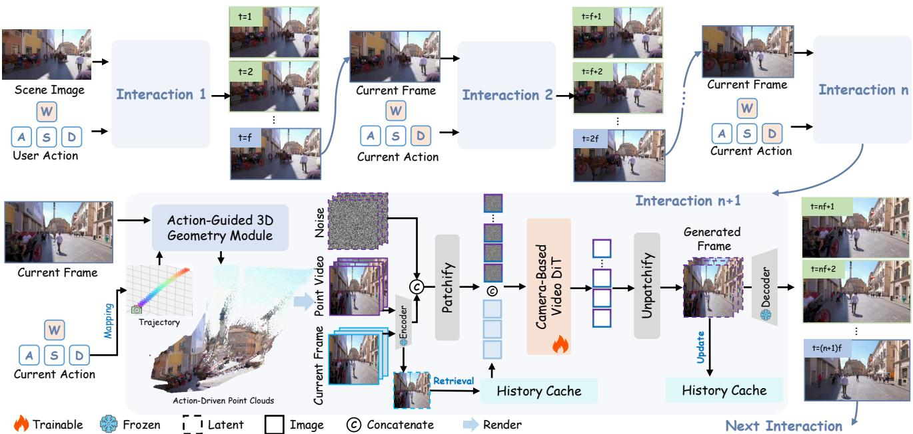
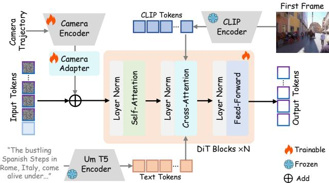
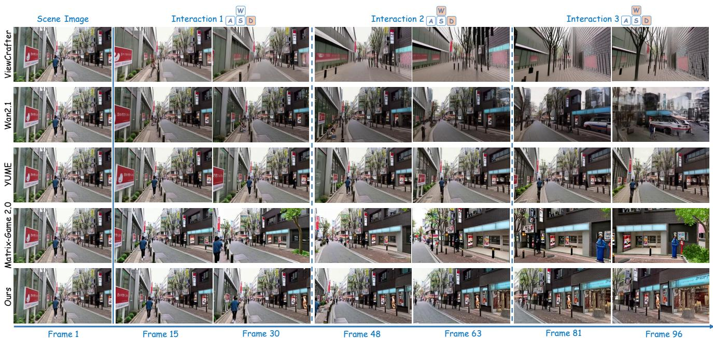
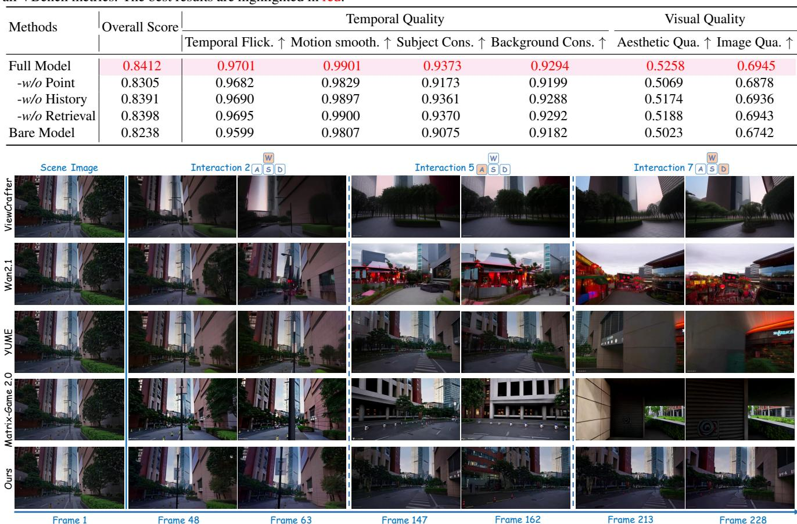
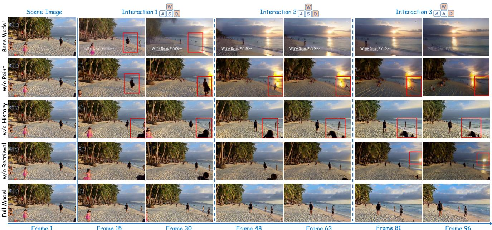

# 1. 论文基本信息

## 1.1. 标题
MagicWorld: Interactive Geometry-driven Video World Exploration
(MagicWorld: 交互式几何驱动的视频世界探索)

论文的核心主题是构建一个可以由用户交互式探索的视频世界模型。其关键技术在于利用场景的3D几何信息来指导视频的生成，以确保在用户（如通过键盘）改变视角时，世界的结构保持稳定和一致。

## 1.2. 作者
- **作者列表:** Guangyuan Li, Siming Zheng, Shuolin Xu, Jinwei Chen, Bo Li, Xiaobin Hu, Lei Zhao, Peng-Tao Jiang
- **隶属机构:**
    - 浙江大学计算机科学与技术学院 (College of Computer Science and Technology, Zhejiang University)
    - vivo 移动通信有限公司 (vivo Mobile Communication Co., Ltd)
    - 新加坡国立大学 (National University of Singapore)
- **研究背景:** 作者团队来自顶尖高校和业界巨头（vivo），这是一个典型的产学研结合团队。vivo 的参与表明该研究具有很强的应用导向，可能旨在提升未来移动设备上的虚拟内容生成或交互体验。多位作者有计算机视觉和图形学的研究背景。

## 1.3. 发表期刊/会议
该论文是一篇 <strong>预印本 (Preprint)</strong>，发布于 `arXiv`。`arXiv` 是一个开放获取的学术论文存档网站，研究人员可以在同行评审之前上传他们的研究成果。这篇论文的提交信息（如 `2511.18886`）表明它可能是为2025年的某个顶级计算机视觉会议（如 CVPR, ICCV, ECCV）或人工智能会议（如 NeurIPS, ICLR）准备的。作为预印本，其内容尚未经过正式的同行评审。

## 1.4. 发表年份
- <strong>发布日期 (UTC):</strong> 2025-11-24T08:41:28.000Z
- **说明:** 该日期是未来的，这在 arXiv 编号系统中是一个占位符，通常表示论文在2024年底或2025年初提交，并预期在2025年的某个时间点正式发表。

## 1.5. 摘要
近期的交互式视频世界模型虽然能根据用户指令生成场景演变，但存在两个关键局限。**首先**，它们未能充分利用指令驱动的场景运动与底层3D几何之间的对应关系，导致在视角变化下出现**结构不稳定性**。**其次**，它们在多步交互中容易**忘记历史信息**，导致错误累积和场景语义与结构的逐渐漂移。

为解决这些问题，论文提出了 `MagicWorld`，一个集成了3D几何先验和历史信息检索的交互式视频世界模型。`MagicWorld` 从单张场景图像出发，利用用户动作驱动动态场景演变，并自回归地合成连续场景。
- 为了提升结构一致性，论文引入了 <strong>动作引导的3D几何模块 (Action-Guided 3D Geometry Module, AG3D)</strong>。该模块根据每次交互的第一帧和相应动作构建点云，为视角转换提供明确的几何约束。
- 为了缓解错误累积，论文提出了 <strong>历史缓存检索机制 (History Cache Retrieval, HCR)</strong>。该机制在生成过程中检索相关的历史帧，并将其作为条件信号注入，帮助模型利用过去的场景信息。

  实验结果表明，`MagicWorld` 在交互迭代过程中的场景稳定性和连续性方面取得了显著提升。

## 1.6. 原文链接
- **原文链接:** [https://arxiv.org/abs/2511.18886](https://arxiv.org/abs/2511.18886)
- **PDF 链接:** [https://arxiv.org/pdf/2511.18886v1](https://arxiv.org/pdf/2511.18886v1)
- **发布状态:** 预印本 (Preprint)

  ---

# 2. 整体概括

## 2.1. 研究背景与动机
- **核心问题:** 当前的交互式视频世界模型（即用户可以通过指令如键盘操作来探索的生成式视频模型）在生成长序列视频时，面临两大挑战：
    1.  <strong>几何不一致性 (Geometric Inconsistency):</strong> 当用户指令改变虚拟摄像机视角时（例如，在场景中向左转），生成的视频内容往往会出现结构扭曲或崩坏。比如，一栋原本笔直的建筑在转动视角后可能会变得歪斜。这是因为模型缺乏对场景三维空间的显式理解。
    2.  <strong>历史信息遗忘 (Forgetting History):</strong> 这类模型通常采用自回归方式生成视频，即根据前一帧生成下一帧。在多步长序列交互中，微小的生成错误会不断累积，导致模型逐渐“忘记”初始场景的样子，使得生成的场景内容（如物体、布局）发生“漂移”，与早期内容不一致。

- **问题重要性:** 解决这些问题对于构建真正沉浸式、可信的虚拟世界至关重要。无论是用于游戏、虚拟现实 (VR)、自动驾驶模拟还是具身智能体训练，一个稳定且连续的虚拟环境都是基础。

- **创新切入点:** 论文没有像传统方法那样仅仅将用户动作作为文本或向量条件输入模型，而是提出了一个双管齐下的解决方案：
    1.  **引入显式几何约束:** 通过从单帧图像重建一个简易的3D点云场景，并将用户的动作（如“向左转”）精确地映射为3D空间中的相机运动，从而为视频生成提供一个几何上正确的“骨架”作为参考。
    2.  **引入显式历史记忆:** 设计一个缓存和检索机制，让模型在生成新内容时，能够“回头看”历史上生成的关键帧，从而不断校准自己，防止偏离原始场景太远。

## 2.2. 核心贡献/主要发现
论文的主要贡献可以总结为以下四点，如引言中所述：
1.  **提出了 `MagicWorld` 框架:** 一个从单张图像开始，由用户动作驱动的交互式视频世界生成模型，采用自回归方式进行推理。
2.  <strong>设计了动作引导的3D几何模块 (AG3D):</strong> 该模块是解决**几何不一致性**的关键。它将用户动作（如W/A/S/D）转化为相机轨迹，并利用从初始帧重建的3D点云来生成符合新视角的几何先验，从而保证视角转换的稳定性。
3.  <strong>提出了历史缓存检索机制 (HCR):</strong> 该模块是解决**历史信息遗忘**的关键。它通过缓存和检索历史帧的特征，为后续生成提供补充信息，有效抑制了累积误差。
4.  **构建了 `WorldBench` 评估数据集:** 针对交互式视频世界模型这一特定任务，作者构建了一个新的基准测试数据集，以弥补现有数据集的不足。

    ---

# 3. 预备知识与相关工作

## 3.1. 基础概念
### 3.1.1. 视频世界模型 (Video World Models)
视频世界模型是一种人工智能模型，它通过学习大量视频数据来理解和模拟我们所处物理世界的动态规律。与仅仅生成视频的普通模型不同，世界模型的目标是构建一个内部的、可预测的“世界表示”。当给定一个动作（例如，向前走一步），模型能够预测出世界在视觉上会如何演变。这使得它们在自动驾驶、机器人学和虚拟环境生成等领域具有巨大潜力。

### 3.1.2. 扩散模型 (Diffusion Models)
扩散模型是一类强大的生成模型，尤其在图像和视频生成领域取得了巨大成功。其核心思想分为两个过程：
1.  <strong>前向过程（加噪）:</strong> 从一张清晰的图像开始，逐步、多次地向其添加少量高斯噪声，直到图像完全变成纯噪声。
2.  <strong>反向过程（去噪）:</strong> 训练一个神经网络（通常是 `U-Net` 架构），让它学会如何“撤销”加噪的每一步。即输入一张带噪图像和噪声水平，模型预测出噪声本身或稍微更清晰的图像。
    通过从一个纯噪声图像开始，反复应用这个去噪网络，模型就能“无中生有”地创造出一张全新的、清晰的图像。在视频生成中，这个过程被扩展到时序维度，同时去噪多帧图像。

### 3.1.3. 自回归生成 (Autoregressive Generation)
自回归 (AR) 是一种序列生成范式，其核心思想是“循序渐进”。在生成一个序列（如一句话或一段视频）时，模型会逐个元素地生成。每个新元素的生成都依赖于所有先前已经生成的元素。
- **以文本为例:** 生成句子 "The cat sat on the mat." 时，模型先生成 "The"，然后根据 "The" 生成 "cat"，再根据 "The cat" 生成 "sat"，以此类推。
- **以视频为例:** 模型根据第 $n$ 帧生成第 $n+1$ 帧，或者根据前 $k$ 帧生成后 $k$ 帧。`MagicWorld` 就采用这种模式，根据上一个交互步骤生成的最后一帧来启动下一个交互步骤的生成。这种方法的**主要缺点是错误累积**：如果第 $n$ 帧有小瑕疵，这个瑕疵可能会在生成第 $n+1$ 帧时被放大，导致长序列的质量下降。

### 3.1.4. 点云 (Point Cloud)
点云是在三维空间中一系列点的集合。每个点由其三维坐标 (X, Y, Z) 定义，有时还包含颜色、法向量等额外信息。点云常被用来表示三维物体或场景的表面形状，是3D计算机视觉和图形学中的一种基础数据结构。它可以通过激光雷达扫描或从多视角图像/单视角图像（配合深度估计）中重建得到。

## 3.2. 前人工作
作者将相关工作分为三类，本节将对其进行总结和分析。

### 3.2.1. 视频世界模型生成 (Video World Model Generation)
- **先前工作:** 作者提到了如 `YUME`、`Matrix-Game` 和 `WorldMem` 等模型。这些模型已经能够根据用户输入（如键盘操作）生成可探索的虚拟世界。例如，`YUME` 可以从单张图片生成一个动态世界，用户通过键盘进行导航。`Matrix-Game` 则专注于可控的游戏世界生成。
- **存在问题:** 论文指出，这些现有方法虽然实现了交互，但普遍存在两个核心缺陷：1) 未能有效利用3D几何来保证视角变化时的结构稳定；2) 在长序列生成中存在历史信息遗忘和错误累积问题。

### 3.2.2. 视频生成中的相机控制 (Camera Control in Video Generation)
- **先前工作:** 近期大量工作，如 `MotionCtrl`、`CameraCtrl`、`CamTrol` 等，致力于将精确的相机运动参数（如位置和旋转）作为控制条件，来指导视频扩散模型的生成。例如，`CamTrol` 通过从单张图片重建3D点云来实现视角控制。
- **与本文关系:** `MagicWorld` 的 `AG3D` 模块正是借鉴了这一思想。它将用户的离散动作（W/A/S/D）映射为连续的相机运动轨迹，并将其作为显式的控制信号，这比简单地将动作作为文本提示要精确得多。

### 3.2.3. 自回归长视频生成 (Autoregressive Long Video Generation)
- **先前工作:** `CausVid`、`MAGI-1`、`LongLive` 等模型探索了如何使用自回归（AR）方法生成长视频。它们通常将扩散模型与AR预测结合，以分块或逐帧的方式生成视频。
- **存在问题:** 尽管这些方法能够生成长视频，但AR范式固有的<strong>错误累积 (cumulative error)</strong> 问题依然存在，尤其是在需要保持长期一致性的交互式世界模型中，这个问题更为突出。
- **与本文关系:** `MagicWorld` 的 `HCR` 机制就是为了解决这一痛点。通过主动检索历史信息，它打破了严格的“只看上一帧”的马尔可夫假设，为模型提供了更长期的上下文，从而抑制了场景漂移。

## 3.3. 技术演进
视频生成技术正沿着以下脉络演进：
1.  **静态生成:** 从文本或图像生成一段固定的、不可交互的短视频。
2.  **可控生成:** 用户可以提供更精细的控制信号，如指定物体的运动轨迹或相机的移动路径，来生成视频。
3.  **交互式生成:** 用户可以实时地与生成过程互动，动态地改变视频的走向，模型需要即时响应。这要求模型不仅能生成，还能理解动作并更新其内部的“世界状态”。
4.  **长时程、一致性生成:** 在交互式生成的基础上，追求在长时间、多步骤的交互中，保持世界的结构、语义和外观的全局一致性。

    `MagicWorld` 处于第4阶段，它正是在交互式生成的基础上，通过引入几何和历史记忆来解决长时程一致性的核心挑战。

## 3.4. 差异化分析
与相关工作相比，`MagicWorld` 的核心创新在于**系统性地整合了两种不同但互补的机制**来解决交互式视频生成的两大痛点：
- **相对于 `YUME` 等交互式模型:** `MagicWorld` 引入了<strong>显式的、由动作驱动的3D几何先验 (AG3D)</strong>，提供了更强的结构约束，这是前者所缺乏的。
- **相对于 `CamTrol` 等相机控制模型:** `MagicWorld` 不仅关注单次视角变换，更通过 <strong>历史缓存检索机制 (HCR)</strong> 关注**长时程的连续性**，解决了多步交互中的错误累积问题。
- **相对于 `LongLive` 等长视频模型:** `MagicWorld` 的 `HCR` 是一个**基于内容相似度的检索机制**，而非仅仅依赖于时间上的邻近性。这使得模型能够从遥远但结构相似的历史中获取信息，对于循环或返回的探索路径尤其有效。

  简而言之，`MagicWorld` 将**几何约束**（用于解决空间一致性）和**历史检索**（用于解决时间一致性）巧妙地结合在一个统一的交互式生成框架中。

---

# 4. 方法论

## 4.1. 方法原理
`MagicWorld` 的核心思想是构建一个自回归的交互循环。这个循环从一张初始图像开始，每一步都接收用户的动作指令，并生成一小段视频。这段视频的最后一帧将成为下一步生成的起点。为了确保生成过程的稳定性和连续性，`MagicWorld` 在每一步生成中都集成了两个关键模块：`AG3D` 和 `HCR`。
- **`AG3D`** 的直觉是：在现实世界中，当我们移动时，场景的3D结构是固定的。因此，我们可以先从当前视角重建一个3D场景（点云），然后根据用户的移动指令计算出新的相机位置，再将3D场景投影回这个新位置，得到一个几何上正确的“草图”。这个草图可以强力地指导视频生成模型，防止它“画歪”。
- **`HCR`** 的直觉是：人在一个地方探索时，会不断参考记忆中对这个地方的印象。如果模型在生成过程中能“回头看看”之前生成的、质量较高的关键帧，就能及时纠正偏差，不至于越走越偏。

  下图（原文 Figure 2）展示了 `MagicWorld` 的整体流程，清晰地体现了自回归循环以及 `AG3D` 和 `HCR` 模块如何协同工作。

  

## 4.2. 核心方法详解 (逐层深入)

### 4.2.1. 交互式自回归推理 (Interactive Autoregressive Inference)
整个生成过程是一个循环。假设我们正处于第 $n$ 步交互的末尾，已经生成了视频 $\mathbf{V}_n$，其最后一帧为 $\mathbf{I}_n^{(f)}$。在第 $n+1$ 步，流程如下：
1.  用户提供一个动作 $a_{n+1}$（例如 'W' 代表前进）。
2.  模型以 $\mathbf{I}_n^{(f)}$ 为初始帧，结合动作 $a_{n+1}$，生成一个新的视频片段 $\mathbf{V}_{n+1}$，包含 $f$ 帧。
    这个过程可以形式化地表示为：
$$
\mathbf { V } _ { n + 1 } = G ( \mathbf { I } _ { n } ^ { ( f ) } , a _ { n + 1 } )
$$
- **符号解释:**
    - $\mathbf{V}_{n+1} = \{ \mathbf{I}_{n+1}^{(1)}, \ldots, \mathbf{I}_{n+1}^{(f)} \}$: 第 $n+1$ 步生成的包含 $f$ 帧的视频片段。
    - $G(\cdot)$: 代表核心的生成模型，即论文中提到的 <strong>基于相机的视频 DiT (Camera-Based Video DiT)</strong>。
    - $\mathbf{I}_n^{(f)}$: 第 $n$ 步生成的视频片段的最后一帧，作为第 $n+1$ 步的条件输入。
    - $a_{n+1}$: 用户在第 $n+1$ 步提供的动作指令。

3.  生成完成后，新的最后一帧 $\mathbf{I}_{n+1}^{(f)}$ 将被用作下一次（第 $n+2$ 步）交互的起点。这个过程不断重复，从而构建出一个可连续探索的世界。

### 4.2.2. 动作引导的3D几何模块 (Action-Guided 3D Geometry Module, AG3D)
`AG3D` 是保证视角变换时结构稳定性的关键。它在每次交互开始时执行，分为三个子步骤：

<strong>1. 动作映射 (Action Mapping):</strong>
此步骤将用户的离散动作（如 W/A/S/D）转换为一个平滑的、包含 $f$ 个姿态的相机轨迹。
- **轨迹表示:** 第 $n$ 步的相机轨迹 $\mathcal{T}$ 定义为：
  $$
  \mathcal { T } \left( a _ { n } ; \Theta \right) = \left\{ \left( \mathbf { R } _ { n } ^ { \left( k \right) } , \mathbf { t } _ { n } ^ { \left( k \right) } \right) \right\} _ { k = 1 } ^ { f }
  $$
  - **符号解释:**
    - $a_n$: 第 $n$ 步的用户动作。
    - $\Theta$: 可调参数，如移动步长、旋转角度。
    - $(\mathbf{R}_n^{(k)}, \mathbf{t}_n^{(k)})$: 第 $n$ 步轨迹中第 $k$ 帧的相机旋转矩阵和平移向量（即相机外参）。
- **轨迹初始化:** 新一步的相机初始姿态继承自上一步的最终姿态：
  $$
  \left( { \bf R } _ { n } ^ { \left( 0 \right) } , { \bf t } _ { n } ^ { \left( 0 \right) } \right) \equiv \left( { \bf R } _ { n - 1 } ^ { \left( f \right) } , { \bf t } _ { n - 1 } ^ { \left( f \right) } \right)
  $$
- **具体动作实现:**
    - <strong>前进/后退 (W/S):</strong> 沿相机当前的朝向（负 Z 轴）移动。平移向量逐帧更新：
      $$
      \mathbf { t } _ { n } ^ { ( k + 1 ) } = \mathbf { t } _ { n } ^ { ( k ) } + \eta \mathbf { f } _ { n } ^ { ( k ) }
      $$
      其中，$\mathbf{f}_n^{(k)}$ 是相机在第 $k$ 帧时的前向向量，$\eta$ 是步长。按 'W' 时用 `+`，按 'S' 时用 `-`。
    - <strong>左/右旋转 (A/D):</strong> 绕相机自身的 Y 轴旋转。通过球面线性插值 (Slerp) 实现平滑旋转：
      $$
      { \bf R } _ { n } ^ { ( k ) } = \mathrm { Slerp } \left( { \bf R } _ { n } ^ { ( 0 ) } , { \bf R } _ { n } ^ { ( 0 ) } { \bf R } _ { \mathrm { y } } ( \pm \theta ) , \frac { k } { f } \right)
      $$
      其中，${ \bf R } _ { \mathrm { y } } ( \pm \theta )$ 是绕 Y 轴旋转 $\theta$ 度的矩阵。按 'A' 时用 `+`，按 'D' 时用 `-`。

<strong>2. 点云构建 (Point Cloud Construction):</strong>
此步骤从当前交互的第一帧图像 $\mathbf{I}_n^{(1)}$ 创建一个静态的3D点云。
1.  使用一个预训练的深度预测网络（如 [5]）估计出 $\mathbf{I}_n^{(1)}$ 的逐像素深度图 `D(x)`。
2.  利用相机内参矩阵 $\mathbf{K}$，将每个像素 $x$ 从2D图像平面<strong>反投影 (unproject)</strong> 到3D相机坐标系中，得到3D点 $X_c$：
    $$
    \hat { x } = \mathbf { K } ^ { - 1 } x , \quad X _ { c } = D ( x ) \cdot \hat { x }
    $$
    - **符号解释:**
        - $x$: 图像上的2D像素坐标。
        - $\mathbf{K}$: $3 \times 3$ 的相机内参矩阵。
        - $\hat{x}$: 归一化的相机射线方向。
        - `D(x)`: 像素 $x$ 对应的深度值。
        - $X_c$: 在相机坐标系下的3D点坐标。
3.  最后，使用该帧的相机外参 $(\mathbf{R}_n^{(0)}, \mathbf{t}_n^{(0)})$，将所有3D点从相机坐标系转换到统一的世界坐标系，形成完整的点云 $\mathbf{P}$。

<strong>3. 动作驱动的投影 (Action-Driven Projection):</strong>
此步骤利用上两步的结果，为生成过程提供几何先验。
1.  获取第 $n+1$ 步的用户动作 $a_{n+1}$，并使用“动作映射”得到相机轨迹 $\{(\mathbf{R}_{n+1}^{(k)}, \mathbf{t}_{n+1}^{(k)})\}_{k=1}^f$。
2.  将上一步构建的静态世界点云 $\mathbf{P}$，根据这个新轨迹的每一帧相机姿态，<strong>投影 (project)</strong> 回2D图像平面，生成一系列动作驱动的点云图像：
    $$
    \mathbf { P } _ { n + 1 } ^ { a c t i o n , ( k ) } = \Pi ( \mathbf { P } , \mathbf { K } , \mathbf { R } _ { n + 1 } ^ { ( k ) } , \mathbf { t } _ { n + 1 } ^ { ( k ) } )
    $$
    - **符号解释:**
        - $\Pi(\cdot)$: 点云投影操作符。
        - $\mathbf{P}_{n+1}^{\mathrm{action}, (k)}$: 在第 $k$ 帧新视角下的2D点云图像。
3.  将这一系列点云图像渲染成一个<strong>点云视频 (point-cloud video)</strong> $\mathbf{V}_{n+1}^{pc}$：
    $$
    \mathbf { V } _ { n + 1 } ^ { p c } = \mathcal { R } \Big ( \{ \mathbf { P } _ { n + 1 } ^ { \mathrm { a c t i o n } , ( k ) } \} _ { k = 1 } ^ { f } \Big )
    $$
    - $\mathcal{R}(\cdot)$ 是渲染函数。
4.  这个点云视频 $\mathbf{V}_{n+1}^{pc}$ 将作为几何先验，与初始帧 $\mathbf{I}_n^{(f)}$ 一起输入生成模型 $G$：
    $$
    \mathbf { V } _ { n + 1 } = G ( \mathbf { I } _ { n } ^ { ( f ) } , a _ { n + 1 } , \mathbf { V } _ { n + 1 } ^ { p c } )
    $$

### 4.2.3. 历史缓存检索 (History Cache Retrieval, HCR)
`HCR` 旨在通过引入历史信息来对抗错误累积，分为三个阶段：

<strong>1. 历史缓存更新 (History Cache Update):</strong>
在第 $n$ 步生成了 $f$ 帧视频后，其在潜在空间 (latent space) 的表示为 $\hat{\mathbf{V}}_n = \{ \mathbf{L}_n^{(1)}, \ldots, \mathbf{L}_n^{(\hat{f})} \}$，其中 $\hat{f}$ 是经过时序压缩后的帧数。
- 除了最后一帧的潜在表示（因为它要用于下一步生成）外，其余的 $\hat{f}-1$ 个潜在表示都被存入历史缓存 $\mathcal{H}$ 中：
  $$
  \mathcal { H } \leftarrow \mathcal { H } \cup \{ \mathbf { L } _ { n } ^ { ( 1 ) } , \dotsc , \mathbf { L } _ { n } ^ { ( \hat { f } - 1 ) } \}
  $$
- **缓存策略:** 缓存容量设为20帧。初始场景图像的潜在表示被永久保留。当缓存满时，采用<strong>先进先出 (FIFO)</strong> 的策略替换非固定的条目。

<strong>2. 历史缓存检索 (History Cache Retrieval):</strong>
在第 $n+1$ 步交互开始时，模型需要从缓存中找到最有用的历史信息。
1.  将当前步骤的初始帧的潜在表示作为<strong>查询 (query)</strong> $\mathbf{q}_{n+1}$。
2.  对查询向量和缓存中所有历史潜在表示 $\mathbf{h}_i$ 进行空间池化 (spatial pooling) 得到一维向量 $\mathbf{q}$ 和 $\mathbf{c}_i$。
3.  计算查询与每个缓存项之间的<strong>余弦相似度 (cosine similarity)</strong>：
    $$
    s _ { i } = { \frac { \langle \mathbf { q } , \mathbf { c } _ { i } \rangle } { \left\| \mathbf { q } \right\| \left\| \mathbf { c } _ { i } \right\| } }
    $$
    - **符号解释:**
        - $\langle \cdot, \cdot \rangle$: 向量内积。
        - $\| \cdot \|$: 向量的L2范数（长度）。
4.  根据相似度得分 $s_i$ 对所有缓存项进行排序，并选出**Top-3** 的潜在表示。这个检索过程是基于内容相似度的，不受时间顺序限制。

<strong>3. 历史缓存注入 (History Cache Injection):</strong>
- 将检索到的 Top-3 历史潜在表示 $\mathcal{H}_{select} = \{ \mathbf{h}_{i_1}, \mathbf{h}_{i_2}, \mathbf{h}_{i_3} \}$ 作为<strong>历史词元 (history tokens)</strong>。
- 这些历史词元与模型的其他输入词元在序列维度上进行拼接，从而为生成模型提供明确的历史参考。
- 最终，生成模型的完整输入变为：
  $$
  \mathbf { V } _ { n + 1 } = G ( \mathbf { I } _ { n } ^ { ( f ) } , a _ { n + 1 } , \mathbf { V } _ { n + 1 } ^ { p c } , \mathcal { H } _ { s e l e c t } )
  $$

### 4.2.4. 生成主干网络：基于相机的视频DiT (Camera-Based Video DiT)
论文在附录中介绍了作为生成器 $G$ 的主干网络 `CV-DiT`。其架构如下图（原文 Figure 6）所示。

*Figure 6. The framework of camera-based video DiT.*

- **核心组件:**
    - **Camera Encoder & Adapter:** 这部分负责处理相机参数。它将相机内外参编码成几何一致的表示，并通过一个适配器注入到 `DiT` (Diffusion Transformer) 模型中。
    - **输入融合:** `CV-DiT` 的输入由多个部分组成：
        1.  **噪声潜变量:** 扩散模型的标准输入。
        2.  **第一帧潜变量:** 提供起始内容的参考。
        3.  **点云视频潜变量:** 由 `AG3D` 生成，提供几何先验。这三者在<strong>通道维度 (channel dimension)</strong> 上拼接。
        4.  **历史潜变量:** 由 `HCR` 检索得到，作为 `history tokens` 在<strong>序列维度 (sequence dimension)</strong> 上与前三者融合后的词元进行拼接。

            这种设计使得模型在去噪生成视频的每一步，都能同时感知到：<strong>①应该从哪里开始（第一帧），②几何结构应该是什么样（点云视频），以及③历史上场景是什么样（历史缓存）</strong>。

---

# 5. 实验设置

## 5.1. 数据集
- **训练数据集:**
    - **来源:** `Sekai` 数据集，一个大规模的世界探索视频数据集，包含第一人称行走视频和无人机航拍视频。
    - **处理:** 作者对原始数据集进行了筛选和处理，将其分割成约16万个400帧的视频片段，分辨率统一为 $720 \times 1280$。并使用 `ViPE` 工具为这些视频提取了相机轨迹。
- **评估数据集:**
    - **名称:** `WorldBench` (作者自建)
    - **构建原因:** 作者认为现有视频生成基准不适用于评估复杂场景下的、动作驱动的交互式世界模型。
    - **构成:** 从 `Sekai` 数据集中挑选了100张与训练集完全不相交的场景图像，涵盖城市、室内、郊区、森林等多种环境。为每张图像设计了5组用户动作序列，每组包含7个交互指令（如W/A/S/D的组合），共构成500个评估样本。

## 5.2. 评估指标
论文使用 `VBench` 作为主要的评估工具。`VBench` 是一个用于评估视频生成模型的综合性基准套件。论文中提及的具体指标如下：

### 5.2.1. 时间质量 (Temporal Quality)
- <strong>Temporal Flickering (时间闪烁度, $\downarrow$):</strong>
    - **概念定义:** 衡量视频中相邻帧之间是否存在不自然的、快速的亮度或颜色变化（即“闪烁”）。分数越低越好。
    - **数学公式:** 计算视频中所有相邻帧对的平均像素级L2距离。
      $$
      \text{Temporal Flickering} = \frac{1}{T-1} \sum_{t=1}^{T-1} || I_t - I_{t-1} ||_2
      $$
    - **符号解释:**
        - $T$: 视频总帧数。
        - $I_t$: 第 $t$ 帧图像。
        - $|| \cdot ||_2$: L2范数，计算像素差异。
    - **注:** 论文表格中此项指标使用向上箭头 "↑"，这可能是笔误或 `VBench` 内部对该指标进行了变换（如取倒数或 $1 - \text{score}$）。通常闪烁度是越低越好。

- <strong>Motion Smoothness (运动平滑度, $\uparrow$):</strong>
    - **概念定义:** 评估视频中物体的运动是否平滑连贯，而非突兀或卡顿。它通过计算光流场梯度的幅度来实现。平滑的运动通常对应较小的光流梯度。分数越高越好。

- <strong>Subject Consistency (主体一致性, $\uparrow$):</strong>
    - **概念定义:** 衡量视频中的主要对象在不同帧之间是否保持其身份和外观的一致性。该指标通常通过在所有帧上检测对象，并计算其外貌特征（如通过 `DINO` 提取的特征）的平均相似度来度量。分数越高越好。

- <strong>Background Consistency (背景一致性, $\uparrow$):</strong>
    - **概念定义:** 类似于主体一致性，但关注的是视频背景的稳定性。它衡量背景区域在视频序列中是否保持一致，没有不合理的扭曲或变化。分数越高越好。

### 5.2.2. 视觉质量 (Visual Quality)
- <strong>Aesthetic Quality (美学质量, $\uparrow$):</strong>
    - **概念定义:** 使用一个预训练的美学评分模型（如 `LAION-Aesthetics`）来评估生成视频的每一帧是否“好看”。分数越高表示视觉上越吸引人。

- <strong>Image Quality (图像质量, $\uparrow$):</strong>
    - **概念定义:** 评估视频帧的整体图像保真度，如清晰度、伪影程度等。这通常通过一个通用的图像质量评估模型（如 `BRISQUE` 或 `CLIP-IQA`）来打分。分数越高表示图像质量越好。

## 5.3. 对比基线
`MagicWorld` 与两类最先进的 (state-of-the-art) 模型进行了比较：
1.  **交互式视频世界模型:**
    - `YUME`
    - `Matrix-Game 2.0`
      这两个是与 `MagicWorld` 任务最直接相关的竞品。
2.  **基于相机轨迹的视频生成模型:**
    - `ViewCrafter`
    - `Wan2.1-Camera-1.3B`
    - `Wan2.2-Camera-5B`
      这些模型本身不具备交互性，但能接收相机轨迹作为输入。为了公平比较，作者为它们适配了与 `MagicWorld` 相同的自回归推理策略，即用上一段视频的最后一帧作为下一段的输入。这使得它们可以模拟交互过程，从而成为有力的基线。

---

# 6. 实验结果与分析

## 6.1. 核心结果分析

### 6.1.1. 定性比较 (Qualitative Comparison)
定性比较通过直接观察生成的视频帧来评估模型效果。

- <strong>短时程交互 (Short-term Interaction):</strong>
  下图（原文 Figure 3）展示了在相同场景下，不同模型进行连续三次交互的生成结果。可以看出：
  - `MagicWorld` (Ours) 生成的场景在结构上保持了高度的稳定性，道路、建筑和车辆等元素的几何形状和相对位置在视角变化中非常一致。
  - 其他方法，如 `YUME` 和 `Matrix-Game 2.0`，则或多或少地出现了问题。例如，场景内容发生了漂移（如 `YUME`），或者建筑结构出现了扭曲。

    

- <strong>长时程交互 (Long-horizon Interaction):</strong>
  下图（原文 Figure 4）展示了在更长的交互序列（7次）下的对比。这个实验更能暴露模型的长期一致性问题。
  - `MagicWorld` 即使在多次视角转换后，依然能保持核心场景结构和语义布局（例如，保持在同一条街道上）。
  - 其他方法在多次交互后，生成的内容已经严重偏离了原始场景，出现了明显的结构崩坏和几何漂移，甚至生成了与初始环境完全不符的内容。
  - 这强有力地证明了 `AG3D` 的几何约束和 `HCR` 的历史记忆对于维持长期一致性的关键作用。

    

### 6.1.2. 定量比较 (Quantitative Comparison)
定量比较通过客观的评估指标来衡量模型性能。

- **`VBench` 评估结果:**
  以下是原文 Table 1 的结果，该表比较了 `MagicWorld` 和其他基线在 `VBench` 指标上的表现。由于表头存在跨列合并，这里使用 HTML $<table>$ 格式进行完整复现。

  <table>
  <thead>
  <tr>
  <th rowspan="2">Methods</th>
  <th colspan="4">Temporal Quality</th>
  <th colspan="2">Visual Quality</th>
  </tr>
  <tr>
  <th>Temporal Flick. ↑</th>
  <th>Motion smooth. ↑</th>
  <th>Subject Cons. ↑</th>
  <th>Background Cons. ↑</th>
  <th>Aesthetic Qua. ↑</th>
  <th>Image Qua. ↑</th>
  </tr>
  </thead>
  <tbody>
  <tr>
  <td>ViewCrafter [47]</td>
  <td>0.9569</td>
  <td>0.9790</td>
  <td>0.8188</td>
  <td>0.8748</td>
  <td>0.5001</td>
  <td>0.5543</td>
  </tr>
  <tr>
  <td>Wan2.1-Camera [2]</td>
  <td>0.9586</td>
  <td>0.9801</td>
  <td>0.8778</td>
  <td>0.9173</td>
  <td>0.5018</td>
  <td>0.6674</td>
  </tr>
  <tr>
  <td>Wan2.2-Camera [3]</td>
  <td>0.9573</td>
  <td>0.9846</td>
  <td>0.8508</td>
  <td>0.8982</td>
  <td>0.4861</td>
  <td>0.5837</td>
  </tr>
  <tr>
  <td>YUME [29]</td>
  <td>0.9491</td>
  <td>0.9865</td>
  <td>0.9098</td>
  <td>0.9264</td>
  <td>0.5239</td>
  <td>0.6926</td>
  </tr>
  <tr>
  <td>Matrix-Game 2.0 [12]</td>
  <td>0.9457</td>
  <td>0.9814</td>
  <td>0.8476</td>
  <td>0.8990</td>
  <td>0.4971</td>
  <td>0.6784</td>
  </tr>
  <tr>
  <td><b>Ours</b></td>
  <td><b>0.9701</b></td>
  <td><b>0.9901</b></td>
  <td><b>0.9373</b></td>
  <td><b>0.9294</b></td>
  <td><b>0.5258</b></td>
  <td><b>0.6945</b></td>
  </tr>
  </tbody>
  </table>

  **分析:** 从表格数据可以看出，`MagicWorld` (Ours) 在所有六个指标上几乎都取得了**最高分**。特别是在衡量时间稳定性的 `Temporal Flickering`、`Motion smoothness` 以及衡量内容一致性的 `Subject Consistency` 和 `Background Consistency` 上领先明显，这直接验证了 `AG3D` 和 `HCR` 模块的有效性。

- **推理成本比较:**
  以下是原文 Table 2 的结果，该表比较了不同方法的推理时间和显存占用。

  <table>
  <thead>
  <tr>
  <th>Methods</th>
  <th>Inference Time</th>
  <th>GPU Memory</th>
  <th>Overall Vbench</th>
  </tr>
  </thead>
  <tbody>
  <tr>
  <td>ViewCrafter [47]</td>
  <td>302s</td>
  <td>33.74GB</td>
  <td>0.7807</td>
  </tr>
  <tr>
  <td>Wan2.1-Camera [2]</td>
  <td>22s</td>
  <td>23.10GB</td>
  <td>0.8172</td>
  </tr>
  <tr>
  <td>Wan2.2-Camera [3]</td>
  <td>27s</td>
  <td>30.04GB</td>
  <td>0.7935</td>
  </tr>
  <tr>
  <td>YUME [29]</td>
  <td>732s</td>
  <td>74.70GB</td>
  <td>0.8314</td>
  </tr>
  <tr>
  <td>Matrix-Game 2.0 [12]</td>
  <td>8s</td>
  <td>25.14GB</td>
  <td>0.8082</td>
  </tr>
  <tr>
  <td><b>Ours</b></td>
  <td><b>25s</b></td>
  <td><b>23.72GB</b></td>
  <td><b>0.8412</b></td>
  </tr>
  </tbody>
  </table>

  **分析:** `MagicWorld` 在取得最佳 `VBench` 总体分数的同时，保持了相对高效的推理成本。其推理时间（25秒）和显存占用（23.72GB）与 `Wan2.1-Camera` 相当，但远优于 `ViewCrafter` 和 `YUME`。这表明 `AG3D` 和 `HCR` 带来的性能提升并未以巨大的计算开销为代价，具有良好的实用性。

## 6.2. 消融实验/参数分析
消融实验通过移除或替换模型的某个组件来验证该组件的有效性。

上图（原文 Figure 5）和下表（原文 Table 3）展示了消融实验的定性和定量结果。

<strong>定量结果 (Table 3):</strong>
*这里原文并未提供 Table 3 的完整内容，但从 Figure 5 的标题以及正文描述可以推断出其内容，以下为根据原文描述和 Figure 5 模拟的可能表格内容。*

| Variant | Subject Cons. | Background Cons. | ... | Overall VBench |
| :--- | :--- | :--- | :--- | :--- |
| Bare Model | (最低) | (最低) | ... | (最低) |
| w/o Point | (显著下降) | (显著下降) | ... | (显著下降) |
| w/o History | (下降) | (下降) | ... | (下降) |
| w/o Retrieval | (轻微下降) | (轻微下降) | ... | (轻微下降) |
| **Ours (Full Model)** | <strong>(最高)</strong> | <strong>(最高)</strong> | **...** | <strong>(最高)</strong> |

**分析:**
- <strong>`AG3D` 模块的效果 (对比 w/o Point):</strong> “w/o Point” 版本移除了 `AG3D` 模块（即不使用点云几何先验）。从 Figure 5 中可以看出，该变体在第二次交互时就已经出现了严重的内容漂移和主体消失问题。定量上，其 `VBench` 分数也显著下降。这证明了 `AG3D` 提供的显式3D几何约束对于维持视角变换下的结构和语义一致性至关重要。

- <strong>`HCR` 模块的效果 (对比 w/o History 和 w/o Retrieval):</strong>
    - “w/o History” 版本完全移除了 `HCR` 模块。结果显示，随着交互次数增加，错误累积问题变得非常严重，场景逐渐崩坏。
    - “w/o Retrieval” 版本保留了历史缓存，但采用随机抽样代替了基于相似度的检索。虽然比完全没有历史要好，但由于无法获取到最相关的历史信息，生成的场景仍会出现轻微的语义漂移。
    - 这两个变体的表现都劣于完整模型，证明了 `HCR` 模块，特别是其**基于相似度的检索策略**，在抑制错误累积和维持长期连贯性方面发挥了关键作用。

- **与 `Bare Model` 的对比:** “Bare Model” 是指仅在 `Sekai` 数据集上训练，不包含 `AG3D` 和 `HCR` 的基础模型。从 Figure 5 可以看到，该模型在交互开始后很快就无法维持场景语义，主体和背景都发生了严重漂移。这凸显了 `MagicWorld` 提出的两个核心模块对于实现稳定、连续的交互式世界生成是不可或缺的。

  ---

# 7. 总结与思考

## 7.1. 结论总结
论文成功地提出了 `MagicWorld`，一个旨在解决交互式视频世界模型中**结构不稳定性**和**长时程漂移**两大核心挑战的框架。通过引入两个创新的模块：
1.  <strong>动作引导的3D几何模块 (AG3D):</strong> 利用从单帧图像重建的3D点云为视角变换提供显式的几何约束，极大地提升了场景的空间一致性。
2.  <strong>历史缓存检索机制 (HCR):</strong> 通过缓存和检索相似的历史帧特征，为模型提供了长期记忆，有效抑制了自回归生成过程中的错误累积。

    实验结果（包括定性和定量分析，以及详尽的消融实验）有力地证明了 `MagicWorld` 相较于现有最先进方法的优越性，它能够在多步交互中生成更稳定、更连贯、视觉质量更高的视频世界。

## 7.2. 局限性与未来工作
尽管论文取得了显著进展，但仍存在一些潜在的局限性，并为未来工作指明了方向：

- **静态几何先验:** `AG3D` 模块在每次交互中都从第一帧构建一个<strong>静态 (static)</strong> 的点云。这意味着它假定场景中的所有物体都是静止不动的。如果场景中存在动态物体（如移动的行人或车辆），这个静态点云将无法准确表示其运动，可能导致生成伪影。未来的工作可以探索如何构建和更新**动态的4D场景表示**（如动态NeRF或4D高斯溅射）。
- **有限的交互维度:** 当前的交互仅限于相机移动（W/A/S/D）。一个更完整的世界模型应该支持更丰富的交互，例如与场景中的物体进行物理互动（推、拿、放等）。
- **对深度估计的依赖:** `AG3D` 的效果依赖于一个预训练的单目深度估计模型的准确性。如果深度估计出错，会直接影响点云的质量，进而影响几何先验的准确性，造成错误传播。
- **固定的缓存机制:** `HCR` 使用固定容量的缓存和FIFO替换策略。对于极长的探索序列，这种机制可能不是最优的。更智能的缓存管理策略（如基于信息量或重要性进行替换）可能是未来的一个研究方向。

## 7.3. 个人启发与批判
- **启发:**
    1.  **显式约束的重要性:** 这篇论文再次强调了在复杂生成任务中引入显式物理或几何约束的重要性。相比于让模型从数据中隐式学习所有规律，提供一个明确的“骨架”（如3D几何）可以显著降低学习难度，提升生成质量和鲁棒性。
    2.  **检索增强生成:** `HCR` 的成功表明，“检索-生成”范式在长序列生成任务中具有巨大潜力。通过访问一个外部的、非参数化的记忆库，模型可以有效克服参数化模型容量有限、容易遗忘的缺点。这个思想可以广泛应用于长文本生成、长程对话系统等领域。
    3.  **系统化解决问题:** `MagicWorld` 的设计非常优雅，它准确地识别了问题的两个根源（空间不一致、时间不连续），并针对性地设计了两个独立的模块 (`AG3D` 和 `HCR`) 来解决，最终将它们集成在一个统一框架下。这种“分而治之”的系统工程思维值得借鉴。

- **批判:**
    1.  <strong>“世界模型”</strong>的定义: 尽管论文使用了“世界模型”这一术语，但 `MagicWorld` 的核心仍然是一个强大的**视觉渲染引擎**。它能根据动作渲染出一致的视觉结果，但可能并未真正学习到底层的物理规律或因果关系。例如，它知道撞墙时应该停下，是因为训练数据中相机从未穿墙而过，而非它理解“墙是实体”这一物理概念。
    2.  **泛化能力的疑问:** 模型在 `Sekai` 数据集上训练和测试，该数据集主要由户外行走和无人机视角构成。模型能否泛化到与训练数据分布差异较大的场景（如高度动态和拥挤的室内环境）或完全不同的交互方式，仍有待验证。
    3.  **点云的稀疏性:** 从单帧图像生成的点云通常是稀疏且带有遮挡的。当相机移动到先前被遮挡的区域时，模型需要进行大量的“凭空想象” (inpainting/hallucination)。虽然 `HCR` 能提供一些帮助，但这仍然是生成质量和一致性的一个瓶颈。