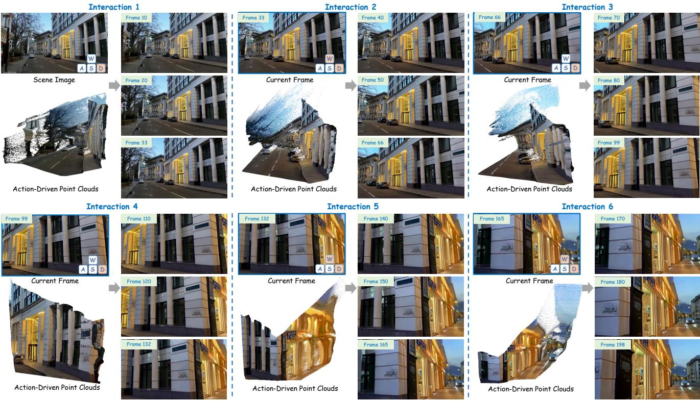
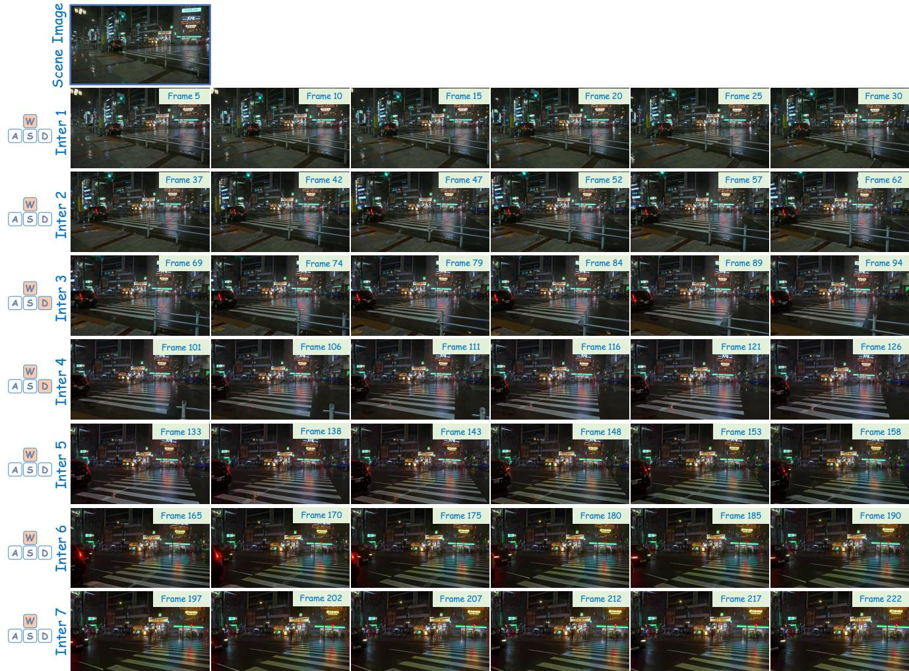
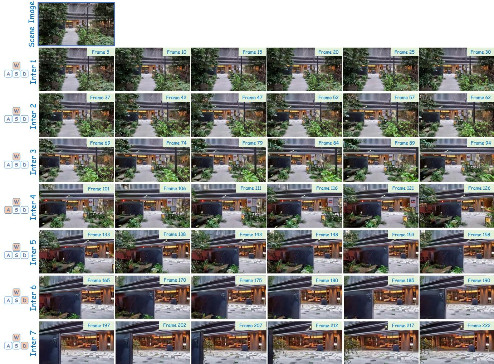
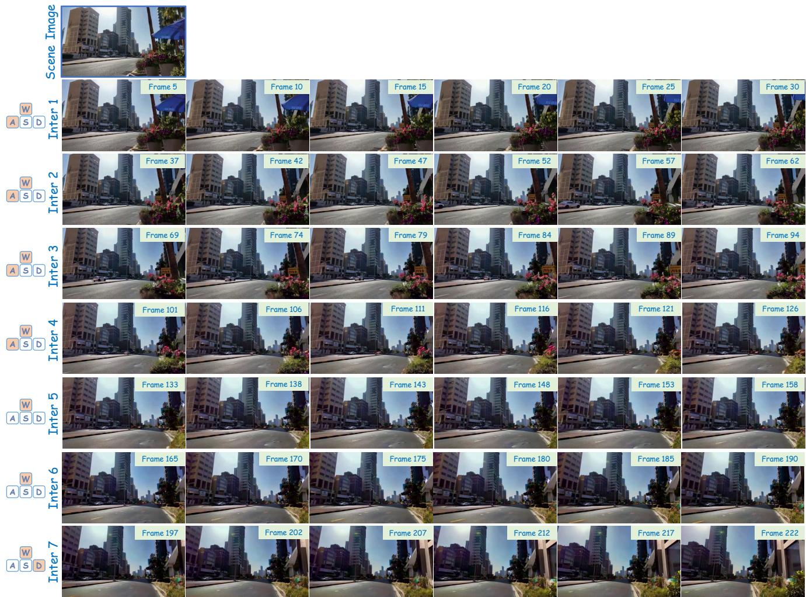
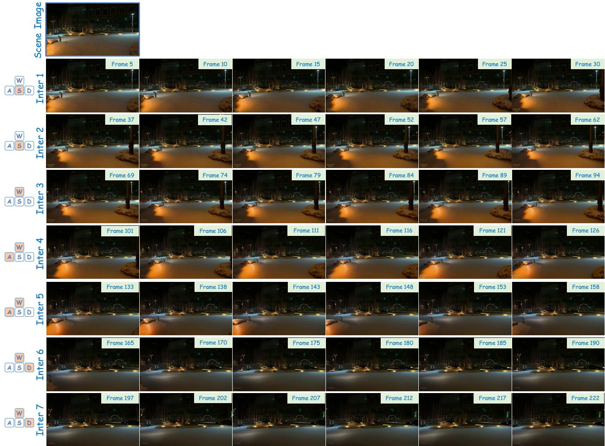

# MagicWorld: Interactive Geometry-driven Video World Exploration

Guangyuan $\mathrm { L i ^ { 1 , 2 } }$ Siming Zheng2 Shuolin $\mathrm { { X u ^ { 2 } } }$ Jinwei Chen2 Bo Li2 Xiaobin $\mathrm { H u ^ { 3 } }$ Lei Zhao1,\* Peng-Tao Jiang2, \* 1College of Computer Science and Technology, Zhejiang University   
2vivo Mobile Communication Co., Ltd 3National University of Singapore

  
poit clous romuserinputs W, A, S, D) to provide eomericconstraints orstable viewpoint ransiins.

# Abstract

Recent interactive video world model methods generate scene evolution conditioned on user instructions. Although they achieve impressive results, two key limitations remain. First, they fail to fully exploit the correspondence between instruction-driven scene motion and the underlying 3D geometry, which results in structural instability under viewpoint changes. Second, they easily forget historical information during multi-step interaction, resulting in error accumulation and progressive drift in scene semantics and structure. To address these issues, we propose MagicWorld, an interactive video world model that integrates 3D geometric priors and historical retrieval. MagicWorld starts from a single scene image, employs user actions to drive dynamic scene evolution, and autoregressively synthesizes continuous scenes. We introduce the Action-Guided 3D Geometry Module (AG3D), which constructs a point cloud from the first frame of each interaction and the corresponding action, providing explicit geometric constraints for viewpoint transitions and thereby improving structural consistency. We further propose History Cache Retrieval (HCR) mechanism, which retrieves relevant historical frames during generation and injects them as conditioning signals, helping the model utilize past scene information and mitigate error accumulation. Experimental results demonstrate that MagicWorld achieves notable improvements in scene stability and continuity across interaction iterations. Project Page: vivocameraresearch.github.io/magicworld.

# 1. Introduction

Video world models [1, 8, 10, 27, 30, 40, 42] can directly learn the evolution of visual scenes driven by actions, enabling stronger capabilities in understanding, prediction, and planning in open environments. By capturing continuous spatiotemporal structure, motion semantics, and object interactions, video world models [6, 13, 18, 49] are especially important for tasks such as autonomous driving [4, 24, 44], embodied intelligence [26, 31, 38], and virtualworld generation [1, 20, 48]. Besides, through generative video prediction and action-conditioned modeling, video world models [8, 10, 30] can construct interactive virtual environments internally, supporting low-cost experimentation and policy optimization, and thus empowering agents with better generalization and long-term planning abilities.

Currently, interactive video world models [12, 29, 36, 48] have become mainstream, and they are typically built using diffusion models combined with autoregressive generation. Specifically, these methods condition on user interaction actions (e.g., keyboard commands) to generate the next frame accordingly. While these methods support interactive video generation, they still face two challenges. (1) Although they can generate video conditioned on user instruction actions (e.g., camera motion), they fail to effectively leverage the correspondence between instructiondriven scene motion and 3D geometry. Without explicit constraints on true viewpoint transitions, the generated content tends to exhibit unstable or inconsistent scene structures when the view changes. (2) They struggle to retain historical information across interactions, weakening the continuity of the evolving world state. During interactive generation, accumulated errors grow with interaction length, causing the produced content to drift from earlier observations and resulting in structural and semantic deviations.

Based on the above analysis, we propose MagicWorld, an interactive video world model equipped with 3D geometric priors and history cache retrieval. We adopt an autoregressive inference paradigm that starts from a single scene image. At each step, user-specified action commands drive the interactive generation of the video world. To address the limitation that existing methods fail to fully exploit the correspondence between instruction-driven scene motion and scene geometry, we introduce the Action-Guided 3D Geometry Module (AG3D). Specifically, we construct a 3D point-cloud scene from the first frame of each interaction and project it into multiple views based on the action-driven camera constraints. This projection embeds action-induced motion cues into a unified 3D geometric prior. This prior provides explicit 3D structural constraints and viewpoint references for the world model, improving scene consistency and semantic stability. To tackle the tendency of existing methods to forget historical information during interactive generation, we design a History Cache Retrieval (HCR) mechanism. Specifically, during autoregressive generation, each generated frame latent is written into a history cache. In the subsequent iteration, the model retrieves the most relevant historical latents by measuring similarity between the first-frame latent of the current iteration and those stored in the cache. The retrieved latents are incorporated into the next generation step, reinforcing past scene information and suppressing error accumulation. Since existing video-generation benchmarks are not well suited for complex scenes and action-driven interactive video world model, we construct WorldBench as an evaluation dataset tailored for interactive video world model tasks. Our contributions to the community are fourfold:

•We propose MagicWorld, which adopts autoregressive inference starting from a single scene image to enable interactive video world generation driven by user actions. • We design an action-guided 3D geometry module, which constructs a point-cloud scene from the first frame of each interaction and the corresponding user action, providing geometric priors for stable viewpoint transitions. We propose a history cache retrieval mechanism that integrates retrieved historical frames into autoregressive generation to supply complementary scene information and reduce cumulative errors. We construct WorldBench as an evaluation dataset for interactive video world modeling tasks. Extensive experiments demonstrate that MagicWorld outperforms SOTA methods in both VBench metrics and visual quality.

# 2. Related Work

# 2.1. Video World Model Generation

Generating expansive, interactive, and temporally coherent virtual worlds is a long-standing goal in AI, motivating recent advances in video-based world model generation methods [10, 29, 30, 36, 38, 48]. For instance, Wu et al. [36] propose a framework that leverages geometry-grounded longterm spatial memory to improve long-horizon consistency in video world models. Matrix-Game [48] presents an interactive world foundation model designed for controllable game-world generation, with an emphasis on fine-grained action control. Yume [29] generates a dynamically explorable virtual world from a single input image and enables interactive navigation through keyboard operations. Guo et al. [10] propose a real-time interactive world model built for Minecraft. Despite these advancements, current interactive video world model generation methods still face two major limitations: (1) they fail to effectively model the correspondence between instruction-driven scene motion and scene geometry, leading to structural instability under viewpoint changes; and (2) they gradually forget historical information during autoregressive generation, leading to error accumulation and disrupted scene continuity.

# 2.2. Camera Control in Video Generation

User interaction commands can be modeled as camera motion trajectories within a world scene. Recently, numerous studies [7, 11, 14, 21, 32, 35, 39, 41, 46, 47] have focused on explicitly incorporating camera parameters as control conditions in video diffusion models. For example, MotionCtrl [35] introduces a unified controller that embeds camera pose sequences into the video generation process. CameraCtrl [11] provides a plug-and-play module to incorporate accurate camera pose control into video diffusion models. CamTrol [14] enables viewpoint control by reconstructing 3D point clouds from a single image, without requiring model fine-tuning. ViewCrafter [47] generates high-fidelity novel views from a single or sparse reference image while supporting highly accurate pose control. TrajectoryCrafter [46] produces high-quality novel views from casually captured monocular videos and likewise supports precise pose control. Inspired by these methods, we map user actions to camera motion trajectories and use them as explicit control signals to guide video world model generation.

# 2.3. Autoregressive Long Video Generation

# 3.1. Interactive Autoregressive Inference

Our method aims to build an interactive video world model that allows users to explore a dynamically evolving world created from a single scene image through continuous user interactions. Unlike conventional video generation methods that produce fixed sequences under static conditions, an interactive video world model is required to continuously generate content according to user instructions, update the latent world state, and preserve coherent scene transitions across interaction iterations. To this end, we introduce an interactive autoregressive inference mechanism. The model is initialized with the first frame and upon receiving each user action, generates the corresponding video segment and updates the internal world state. The updated state is then passed to the next inference stage, facilitating coherent, step-wise world construction governed by user interaction. The overall pipeline of MagicWorld is illustrated in Fig. 2.

# 3. Methodology

Current long video generation methods [9, 16, 22, 25, 37, 43, 45] typically combine diffusion models with autoregressive (AR) prediction, forming a middle-ground paradigm between purely diffusion-based and purely AR-based approaches. For example, CausVid [45] reconstructs video diffusion into a causal AR process and reduces inference steps through distribution-matching distillation. MAGI-1 [33] scales AR video generation via chunk-wise prediction. Self-forcing [16] narrows the gap between training and inference in AR video diffusion by simulating inference during training. LongLive [43] performs causal framelevel AR, introducing KV-recache, long-sequence training, and short-window attention with a frame-sink mechanism to enhance long-term consistency and accelerate generation. However, AR-based long video generation still suffers from cumulative error, especially when applied to interactive video world models. Therefore, we introduce a history cache retrieval mechanism to mitigate this issue.

Given a single scene image $\mathbf { I } _ { 0 } \in \mathbb { R } ^ { H \times W \times 3 }$ , as the initial observation for world construction, the model generates $f$ frames at each interaction step. At the $n$ -th step interaction, the user provides an action $a _ { n } \in { \mathcal { A } }$ , where $\mathcal { A }$ denotes the action space, such as keyboard commands (e.g., combinations of W, A, S, and D). This action specifies the intended movement or viewpoint change within the virtual world. Since generation at interaction step $n { + 1 }$ depends on the last frame produced at step $n$ , we denote this frame as $\mathbf { I } _ { n } ^ { ( f ) }$ Thus, generation at step $n { \mathrel { + { 1 } } }$ can be formulated as:

$$
\mathbf { V } _ { n + 1 } = G ( \mathbf { I } _ { n } ^ { ( f ) } , a _ { n + 1 } ) ,
$$

where $\mathbf { V } _ { n + 1 } = \{ \mathbf { I } _ { n + 1 } ^ { ( 1 ) } , \mathbf { I } _ { n + 1 } ^ { ( 2 ) } , \ldots , \mathbf { I } _ { n + 1 } ^ { ( f ) } \}$ represents the $f$ . frame video segment generated at step $n + 1$ $G ( \cdot )$ denotes the camera-based video DiT. After generation, the final frame $\mathbf { I } _ { n + 1 } ^ { ( f ) }$ is used as the initial state for the next step to support subsequent interaction. Ultimately, under the action sequence $\{ a _ { 1 } , a _ { 2 } , \ldots , a _ { n } , a _ { n + 1 } , \ldots \}$ , MagicWorld produces the corresponding sequence of video segments $\left\{ \mathbf { V } _ { 1 } , \mathbf { V } _ { 2 } , \ldots , \mathbf { V } _ { n } , \mathbf { V } _ { n + 1 } , \ldots \right\}$ , thereby progressively constructing an explorable world.

# 3.2. Action-Guided 3D Geometry Module

For the interactive video world generation process, user actions intrinsically correspond to the motion of a virtual camera within the world. However, existing methods typically incorporate such action-driven scene motions only as conditional inputs, without explicitly modeling their correspondence to the underlying scene geometry. To alleviate this limitation, we propose Action-Guided 3D Geometry Module (AG3D). Specifically, a 3D point-cloud scene is constructed from a single first frame of each interaction. The point-cloud is then projected into different viewpoints under camera-trajectory constraints, thereby encoding actioninduced motion cues into a unified 3D geometric prior. This prior provides explicit structural constraints and viewpoint guidance for the world model, helping to enhance scene consistency and semantic stability. AG3D consists of three steps. First, user actions are mapped to camera trajectories. Second, depth is estimated from the first frame and unprojected to construct a static point-cloud, which is then transformed from the camera coordinate system to a unified world coordinate frame. Finally, conditioned on the actiondriven camera poses, the point cloud is projected into different viewpoints to obtain the action-driven point clouds.

  
hisor sTeayndiay.

Action Mapping. To convert user interaction into an executable geometric control signal, we map each discrete action $a _ { n } \in { \mathcal { A } }$ to a camera extrinsic sequence of length $f$ (i.e., the camera trajectory at step $n$ ):

$$
\begin{array} { r } { \mathcal { T } \left( a _ { n } ; \Theta \right) = \left\{ \left( \mathbf { R } _ { n } ^ { \left( k \right) } , \mathbf { t } _ { n } ^ { \left( k \right) } \right) \right\} _ { k = 1 } ^ { f } , } \end{array}
$$

where $\Theta$ denotes tunable parameters (e.g., step size, rotation angle, or interpolation steps), $k = \{ 1 , \ldots , f \}$ indexes the discretized camera poses along the trajectory, $\mathbf { R }$ and t denote the rotation and translation matrices. The trajectory initialization is given by the final camera extrinsics from the previous step, which is formulated as follows:

In the following, we provide detailed explanations using the W/S and A/D keyboard commands as examples.

Forward/Backward (W/S). The forward direction is defined as the negative $z$ -axis of the previous camera coordinate system. Given a step size $\eta$ , the camera translation is updated frame by frame as:

$$
\mathbf { t } _ { n } ^ { ( k + 1 ) } = \mathbf { t } _ { n } ^ { ( k ) } + \eta \mathbf { f } _ { n } ^ { ( k ) } ,
$$

$\mathbf { f } _ { n } ^ { ( k ) } = - \mathbf { R } _ { n } ^ { ( k ) } [$ , 2]. We apply $+ \eta \mathbf { f } _ { n } ^ { ( k ) }$ when the action $a _ { n }$ is forward (W), and $- \eta \mathbf { f } _ { n } ^ { ( k ) }$ when it is backward (S).

Left/Right Rotation $\mathbf { \Gamma } ( \mathbf { A } / \mathbf { D } )$ A target rotation ${ \bf R } _ { \mathrm { y } } ( \pm \theta )$ is applied around the $y$ -axis. We then perform frame-wise olat $\mathbf { R } _ { n } ^ { ( 0 ) }$ and the arget rotation ${ \bf R } _ { n } ^ { ( 0 ) } { \bf R } _ { \mathrm { y } } ( \pm \theta )$ using Slerp:

$$
{ \bf R } _ { n } ^ { ( k ) } = \mathrm { S l e r p } \left( { \bf R } _ { n } ^ { ( 0 ) } , { \bf R } _ { n } ^ { ( 0 ) } { \bf R } _ { \mathrm { y } } ( \pm \theta ) , \frac { k } { f } \right) ,
$$

where $a _ { n }$ as A applies $+ \theta$ ,and $a _ { n }$ as $\mathrm { D }$ applies $- \theta$ .

Point Cloud Construction. Given the first frame $\mathbf { I } _ { n } ^ { ( 1 ) }$ , we first estimate its per-pixel depth $D ( x )$ using a depth prediction network [5], where $x \in \Omega$ and $\Omega$ denotes the set of image-plane coordinates. Based on the camera intrinsic matrix $\mathbf { K } \in \mathbb { R } ^ { 3 \times 3 }$ , each pixel is then unprojected into the camera coordinate system:

$$
\left( { \bf R } _ { n } ^ { \left( 0 \right) } , { \bf t } _ { n } ^ { \left( 0 \right) } \right) \equiv \left( { \bf R } _ { n - 1 } ^ { \left( f \right) } , { \bf t } _ { n - 1 } ^ { \left( f \right) } \right) .
$$

$$
\hat { x } = \mathbf { K } ^ { - 1 } x , X _ { c } = D ( x ) \cdot \hat { x } ,
$$

where $\hat { x }$ is the normalized camera-ray direction, $X _ { c }$ the 3D point in camera coordinates. Subsequently, using the camera extrinsics of the reference view, the 3D points are transformed from the camera coordinate system to the world coordinate system. By traversing all pixels, a complete 3D point cloud $\mathbf { P }$ is obtained.

Action-Driven Projection. At step $n + 1$ , the user proVides l a tion $a _ { n + 1 } \in { \mathcal { A } }$ whichh is mappe $( \mathbf { R } _ { n + 1 } ^ { ( k ) } , \mathbf { t } _ { n + 1 } ^ { ( k ) } )$ $\mathbf { P }$ coordinate system is projected into the new viewpoint, producing the action-driven point clouds:

$$
\mathbf { P } _ { n + 1 } ^ { a c t i o n , ( k ) } = \Pi ( \mathbf { P } , \mathbf { K } , \mathbf { R } _ { n + 1 } ^ { ( k ) } , \mathbf { t } _ { n + 1 } ^ { ( k ) } ) ,
$$

where $\Pi ( \cdot )$ denotes the point-cloud projection operator. The resulting $\mathbf { P } _ { n + 1 } ^ { a c t i o n , ( k ) }$ serves as an explicit geometric prior. We first render the action-driven point-cloud sequence into a point-cloud video Vpc n+1:

$$
\mathbf { V } _ { n + 1 } ^ { p c } = \mathcal { R } \Big ( \{ \mathbf { P } _ { n + 1 } ^ { \mathrm { a c t i o n } , ( k ) } \} _ { k = 1 } ^ { f } \Big ) ,
$$

where $\mathcal { R } ( \cdot )$ denotes the rendering function. The point-cloud video is combined with the current first frame and the noise input, and fed into the camera-based DiT, formulated as:

$$
\mathbf { V } _ { n + 1 } = G ( \mathbf { I } _ { n } ^ { ( f ) } , a _ { n + 1 } , \mathbf { V } _ { n + 1 } ^ { p c } ) .
$$

# 3.3. History Cache Retrieval

During interactive autoregressive generation, each inference step depends on previously generated results, causing prediction errors to accumulate as interactions progress. Such accumulation gradually weakens the model's reliance on earlier observations, leading to scene drift that manifests as geometric instability and semantic deviations. This effect becomes particularly evident in extended interactive scenarios, where the compounding of errors disrupts scene coherence and visual stability across iterations. To address this issue, we introduce a History Cache Retrieval (HCR) mechanism that explicitly enables the model to retrieve structurally relevant historical key frames during interactive inference. By maintaining access to remote visual context, HCR alleviates the accumulation of inter-step errors and enhances scene continuity across interaction iterations.

As shown in Fig. 2, the goal of HCR is to store the clean latent features generated at each autoregressive step into a history cache. During the subsequent inference step, the current input frame latent is matched against the cached history via similarity retrieval to obtain the most relevant reference frames, which are then fed into the model as auxiliary conditions. By explicitly injecting relevant historical cues, HCR helps the model recover previously observed scene information and stabilizes scene transitions across interaction iterations. HCR consists of three stages.

History Cache Update. Given the latent sequence ${ \hat { \mathbf { V } } } _ { n } = { }$ $\{ \mathbf { L } _ { n } ^ { ( 1 ) } , \ldots , \mathbf { L } _ { n } ^ { ( \hat { f } ) } \}$ generated at step $n$ where $\hat { f } ~ = ~ f / 4$ (4 denotes the temporal compression ratio). We retain only its last-frame latent representation for the next interaction, while the remaining frame latents are appended to the cache:

$$
\mathcal { H }  \mathcal { H } \cup \{ \mathbf { L } _ { n } ^ { ( 1 ) } , \dotsc , \mathbf { L } _ { n } ^ { ( \hat { f } - 1 ) } \} .
$$

We set the cache capacity to 20 latent frames. When updating the history cache, we keep the first-frame latent fixed and only update the remaining entries. The first latent is obtained from the initial interaction and directly corresponds to the latent derived from the input scene image, thus carrying the most essential and stable information about the environment. Once the cache reaches its capacity, the nonfixed entries are replaced in a first-in, first-out manner.

History Cache Retrieval. At interaction step $n { + 1 }$ , we take the latent of the first frame in the current step as $\mathbf { q } _ { n + 1 }$ . To perform retrieval, we apply spatial pooling to both the query and all cached latents to obtain vector representations: $\mathbf { q } =$ $\operatorname { p o o l } ( \mathbf { q } _ { n + 1 } ) , \mathbf { c } _ { i } = \operatorname { p o o l } ( \mathbf { h } _ { i } )$ Following previous works [19, 28], we compute the cosine similarity as follows:

$$
s _ { i } = { \frac { \langle \mathbf { q } , \mathbf { c } _ { i } \rangle } { \left\| \mathbf { q } \right\| \left\| \mathbf { c } _ { i } \right\| } } .
$$

All cached latents are ranked by similarity, and the top-3 entries are selected. Notably, retrieval is independent of temporal distance. By computing similarity in the latent space, the model retrieves historical states that best match the current iteration in structure or semantics, even if they are from much earlier steps. This design avoids bias toward short-term neighbors and provides the model with relevant contextual cues that help mitigate scene drift.

History Cache Injection. The retrieved top-3 latents $\mathcal { H } _ { s e l e c t } = \{ { \bf h } _ { i _ { 1 } } , { \bf h } _ { i _ { 2 } } , { \bf h } _ { i _ { 3 } } \}$ are embedded as history tokens and concatenated with the input tokens along the sequence dimension, providing explicit reference information:

$$
\mathbf { V } _ { n + 1 } = G ( \mathbf { I } _ { n } ^ { ( f ) } , a _ { n + 1 } , \mathbf { V } _ { n + 1 } ^ { p c } , \mathcal { H } _ { s e l e c t } ) .
$$

HCR mitigates autoregressive error accumulation by caching and retrieving historical information, supporting more stable scene evolution across interactions.

# 4. Experiments

# 4.1. Datasets

Training Data. We use Sekai [23], a large-scale world exploration video dataset, as our training corpus. It consists of egocentric walking videos and drone-view videos with recorded audio. To improve overall data quality, we refine the original Sekai dataset. Specifically, we segment each video into clips of 400 frames, resulting in approximately

.   

<table><tr><td rowspan="2">Methods</td><td colspan="4">Temporal Quality</td><td colspan="2">Visual Quality</td></tr><tr><td></td><td></td><td></td><td>Temporal Flick. ↑ Motion smooth. ↑ Subject Cons. ↑ Background Cons. ↑</td><td>Aesthetic Qua. ↑ Image Qua. ↑</td><td></td></tr><tr><td>ViewCrafter [47]</td><td>0.9569</td><td>0.9790</td><td>0.8188</td><td>0.8748</td><td>0.5001</td><td>0.5543</td></tr><tr><td>Wan2.1-Camera [2]</td><td>0.9586</td><td>0.9801</td><td>0.8778</td><td>0.9173</td><td>0.5018</td><td>0.6674</td></tr><tr><td>Wan2.2-Camera [3]</td><td>0.9573</td><td>0.9846</td><td>0.8508</td><td>0.8982</td><td>0.4861</td><td>0.5837</td></tr><tr><td>YUME [29]</td><td>0.9491</td><td>0.9865</td><td>0.9098</td><td>0.9264</td><td>0.5239</td><td>0.6926</td></tr><tr><td>Matrix-Game 2.0 [12]</td><td>0.9457</td><td>0.9814</td><td>0.8476</td><td>0.8990</td><td>0.4971</td><td>0.6784</td></tr><tr><td>Ours</td><td>0.9701</td><td>0.9901</td><td>0.9373</td><td>0.9294</td><td>0.5258</td><td>0.6945</td></tr></table>

  
visual semanticcompared wit other aproaches. Tworames are selecte from eachinteraction orvisualization.

Table 2. Comparison of inference cost across different methods. We report the mean VBench score for performance comparison. The best and second-best results are highlighted in red and blue.   

<table><tr><td rowspan=1 colspan=1>Methods</td><td rowspan=1 colspan=1>Inference Time</td><td rowspan=1 colspan=2>|GPU Memory |Overall Vbench</td></tr><tr><td rowspan=1 colspan=1>ViewCrafter [47]</td><td rowspan=1 colspan=1>302s</td><td rowspan=1 colspan=1>33.74GB</td><td rowspan=1 colspan=1>0.7807</td></tr><tr><td rowspan=1 colspan=1>Wan2.1-Camera [2]</td><td rowspan=1 colspan=1>22s</td><td rowspan=1 colspan=1>23.10GB</td><td rowspan=1 colspan=1>0.8172</td></tr><tr><td rowspan=1 colspan=1>Wan2.2-Camera [3]</td><td rowspan=1 colspan=1>27s</td><td rowspan=1 colspan=1>30.04GB</td><td rowspan=1 colspan=1>0.7935</td></tr><tr><td rowspan=1 colspan=1>YUME [29]</td><td rowspan=1 colspan=1>732s</td><td rowspan=1 colspan=1>74.70GB</td><td rowspan=1 colspan=1>0.8314</td></tr><tr><td rowspan=1 colspan=1>Matrix-Game 2.0 [12]</td><td rowspan=1 colspan=1>8s</td><td rowspan=1 colspan=1>25.14GB</td><td rowspan=1 colspan=1>0.8082</td></tr><tr><td rowspan=1 colspan=1>Ours</td><td rowspan=1 colspan=1>25s</td><td rowspan=1 colspan=1>23.72GB</td><td rowspan=1 colspan=1>0.8412</td></tr></table>

160K clips in total. All clips are standardized to a resolution of $7 2 0 \times 1 2 8 0$ We employ ViPE [15] to extract camera trajectories corresponding to these video clips.

Evaluation Data. Since existing video-generation benchmarks are not well suited for complex scenes and actiondriven interactive video world model tasks, we construct WorldBench dataset for evaluation. Specifically, we select 100 scene images from the Sekai dataset that are strictly disjoint from the training set. These images span diverse locations, viewpoints, and weather conditions. We ensure coverage over urban streets, indoor regions, suburbs, forests, lakesides, and mountain trails. We construct 5 groups of user actions, each comprising 7 interaction commands (e.g., W/A/S/D), producing 500 evaluation samples.

# 4.2. Implementation Details

We adopt the pretrained weights from Wan2.1-Fun-V1.1- 1.3B [2] as the foundational model, which is fine-tuned based on Wan2.1-I2V-1.3B [34]. All experiments are conducted on 8 NVIDIA H20 GPUs using our refined Sekai dataset. During training, the batch size is set to 4 per GPU, and the video input resolution is $7 2 0 \times 1 2 8 0$ ,with each training video sample containing 81 frames. The model is optimized with the AdamW optimizer using a learning rate of $2 \times 1 0 ^ { - 5 }$ , and training runs for a total of 40K iterations. During inference, the test data resolution is $4 8 0 \times 8 3 2$ at 16 FPS. We use 20 inference steps with a guidance scale of 6.0, and each iteration produces 33 frames.

all VBench metrics. The best results are highlighted in red.

  
are selected from each interaction for visualization.

# 4.3. Comparison with SOTA Methods

We compare our method with recent interactive video world models, YUME [29] and Matrix-Game 2.0 [12]. We also evaluate our method against camera-trajectory-based video generation models, including ViewCrafter [47], Wan2.1- Camera-1.3B [2], and Wan2.2-Camera-5B [3]. For a fair comparison, we adopt the same autoregressive inference strategy for all camera trajectory methods, where the last frame of each interaction serves as the first frame of the subsequent one. We use VBench [17] for evaluation, covering aesthetic quality, imaging quality, subject consistency, background consistency, and motion smoothness.

Qualitative Comparison. Fig. 3 presents a comparison of the results generated under three consecutive interactions within the same scene. Compared with existing methods, our approach demonstrates superior structural consistency, content realism, and temporal stability. Specifically, our method maintains more stable scene geometry, better subject continuity, and higher visual fidelity throughout the sequence. In contrast, other methods often exhibit structural distortion, subject drift, or content that is semantically inconsistent with the current scene during interaction, whereas our method consistently preserves the world state and produces coherent, realistic visual outcomes.

Fig. 4 presents the qualitative comparison under longhorizon interactive generation. Existing methods gradually deviate from the original scene semantics after multiple interactions, exhibiting noticeable structural corruption, global geometric drift, and even synthesizing content inconsistent with the original environment. In contrast, benefiting from effective historical frame retrieval and geometric priors, our method preserves the core scene structure and semantic layout even after repeated viewpoint transitions. We provide the visual results of all seven interactions in the supplementary material, along with the corresponding video.

Quantitative Comparison. Tab. 1 reports the VBench [17] evaluation on our constructed WorldBench dataset. Our approach achieves the best performance in both visual quality and temporal quality. These results demonstrate that our method can generate interactive video sequences with more appealing visual appearance, more stable scene structure, and improved subjectbackground consistency. We further compare the inference cost of different methods, as shown in Tab. 2. We report the GPU memory usage and the time required for a single interaction during inference. All methods are evaluated on a single H20 GPU, generating videos at a resolution of $4 8 0 \times 8 3 2$ with 33 frames. We observe that our method achieves the best results while requiring only a small amount of inference time and GPU memory.

  
selected from each interaction for visualization.

# 4.4. Ablation Study

To evaluate the effectiveness of each component in MagicWorld, we conduct ablation studies on the Action-Guided 3D Geometry Module (AG3D) and the History Cache Retrieval (HCR). All variants are evaluated under the same experimental settings as the full model. The results of different variants are shown in Fig. 5 and Tab. 3.

Effect of AG3D. To evaluate the effectiveness of the actionguided 3D geometry module, we design a variant model by removing AG3D, discarding action-driven point clouds, referred to as w/o Point. As shown, removing the geometric prior provided by the action-driven point clouds leads to a significant drop in VBench scores. Moreover, the visual results show that w/o Point fails to maintain scene semantics from the second iteration, exhibiting content drift and partial subject disappearance. This demonstrates that the geometric prior plays a crucial role in preserving structural stability under viewpoint transitions, providing explicit 3D constraints that help maintain spatial and semantic consistency during interactive generation.

Effect of HCR. To evaluate the impact of the history cache retrieval, we design two variant models: 1) w/o History, which completely removes the HCR module and 2) w/o Retrieval, which removes the retrieval strategy and randomly selects 3 latent frames from the history cache at each iteration. As shown, both w/o History and w/o Retrieval exhibit performance degradation on VBench compared with the full model. From Fig. 5, we observe that $w / o$ History suffers from error accumulation as the number of interactions increases. Although w/o Retrieval alleviates this issue, its random selection of historical frames prevents the model from utilizing the most relevant temporal information, leading to slight semantic drift in the generated scenes.

Comparison with the Bare Model. We compare with the bare model trained on the refined Sekai dataset without any proposed modules. From Fig. 5, it is clear that the bare model fails to maintain scene semantics during interaction. Semantic degradation emerges shortly after generation begins. As early as the second interaction, the main subject and surrounding content noticeably drift. This demonstrates the critical role of AG3D and HCR in maintaining structural coherence and stabilizing scene evolution across interactions, also quantitatively verified in Tab. 3.

# 5. Conclusion

In this paper, we present MagicWorld, an interactive video world model that integrates 3D geometric priors and historical retrieval for coherent scene generation. With the action-guided geometry module and history cache retrieval, MagicWorld preserves structural stability under viewpoint transitions and maintains smooth temporal evolution across interactions. Experiments show clear gains in scene stability and interaction-level continuity, demonstrating the effectiveness of combining geometric and historical cues for interactive video world model.

# References

[1] Niket Agarwal, Arslan Ali, Maciej Bala, Yogesh Balaji, Erik Barker, Tiffany Cai, Prithvijit Chattopadhyay, Yongxin Chen, Yin Cui, Yifan Ding, et al. Cosmos world foundation model platform for physical ai. arXiv preprint arXiv:2501.03575, 2025. 2   
[2] alibaba pai. Wan2.1-fun-v1.1-1.3b-control-camera, 2025.6, 7   
[3] alibaba pai. Wan2.2-fun-5b-control-camera, 2025. 6, 7   
[4] Amir Bar, Gaoyue Zhou, Danny Tran, Trevor Darrell, and Yann LeCun. Navigation world models. In Proceedings of the Computer Vision and Pattern Recognition Conference, pages 1579115801, 2025. 2   
[5] Aleksei Bochkovskii, Amaël Delaunoy, Hugo Germain, Marcel Santos, Yichao Zhou, Stephan R. Richter, and Vladlen Koltun. Depth pro: Sharp monocular metric depth in less than a second. In International Conference on Learning Representations, 2025. 4   
[6] Tim Brooks, Bill Peebles, Connor Holmes, Will DePue, Yufei Guo, Li Jing, David Schnurr, Joe Taylor, Troy Luhman, Eric Luhman, et al. Video generation models as world simulators. OpenAI Blog, 1(8):1, 2024. 2   
[7] Chenjie Cao, Jingkai Zhou, Shikai Li, Jingyun Liang, Chaohui Yu, Fan Wang, Xiangyang Xue, and Yanwei Fu. Uni3c: Unifying precisely 3d-enhanced camera and human motion controls for video generation. arXiv preprint arXiv:2504.14899, 2025. 3   
[8] Ruili Feng, Han Zhang, Zhantao Yang, Jie Xiao, Zhilei Shu, Zhiheng Liu, Andy Zheng, Yukun Huang, Yu Liu, and Hongyang Zhang. The matrix: Infinite-horizon world generation with real-time moving control. arXiv preprint arXiv:2412.03568, 2024. 2   
[9] Yuchao Gu, Weijia Mao, and Mike Zheng Shou. Longcontext autoregressive video modeling with next-frame prediction. arXiv preprint arXiv:2503.19325, 2025. 3   
10] Junliang Guo, Yang Ye, Tianyu He, Haoyu Wu, Yushu Jiang, Tim Pearce, and Jiang Bian. Mineworld: a real-time and open-source interactive world model on minecraft. arXiv preprint arXiv:2504.08388, 2025. 2   
11] Hao He, Yinghao Xu, Yuwei Guo, Gordon Wetzstein, Bo Dai, Hongsheng Li, and Ceyuan Yang. Cameractrl: Enabling camera control for text-to-video generation. arXiv preprint arXiv:2404.02101, 2024. 3   
12] Xianglong He, Chunli Peng, Zexiang Liu, Boyang Wang, Yifan Zhang, Qi Cui, Fei Kang, Biao Jiang, Mengyin An, Yangyang Ren, et al. Matrix-game 2.0: An open-source, real-time, and streaming interactive world model. arXiv preprint arXiv:2508.13009, 2025. 2, 6, 7   
13] Jonathan Ho, Tim Salimans, Alexey Gritsenko, William Chan, Mohammad Norouzi, and David J Fleet. Video diffusion models. Advances in neural information processing systems, 35:86338646, 2022. 2 video generation. In The Thirteenth International Conference on Learning Representations. 3 [15] Jiahui Huang, Qunjie Zhou, Hesam Rabeti, Aleksandr Korovko, Huan Ling, Xuanchi Ren, Tianchang Shen, Jun Gao, Dmitry Slepichev, Chen-Hsuan Lin, et al. Vipe: Video pose engine for 3d geometric perception. arXiv preprint arXiv:2508.10934, 2025. 6 [16] Xun Huang, Zhengqi Li, Guande He, Mingyuan Zhou, and Eli Shechtman. Self forcing: Bridging the traintest gap in autoregressive video diffusion. arXiv preprint arXiv:2506.08009, 2025. 3 [17] Ziqi Huang, Yinan He, Jiashuo Yu, Fan Zhang, Chenyang Si, Yuming Jiang, Yuanhan Zhang, Tianxing Wu, Qingyang Jin, Nattapol Chanpaisit, et al. Vbench: Comprehensive benchmark suite for video generative models. In Proceedings of the IEEE/CVF Conference on Computer Vision and Pattern Recognition, pages 2180721818, 2024. 6, 7 [18] Weijie Kong, Qi Tian, Zijian Zhang, Rox Min, Zuozhuo Dai, Jin Zhou, Jiangfeng Xiong, Xin Li, Bo Wu, Jianwei Zhang, et al. Hunyuanvideo: A systematic framework for large video generative models. arXiv preprint arXiv:2412.03603, 2024.   
2 [19] Guangyuan Li, Jun Lv, Yapeng Tian, Qi Dou, Chengyan Wang, Chenliang Xu, and Jing Qin. Transformer-empowered multi-scale contextual matching and aggregation for multicontrast mri super-resolution. In Proceedings of the IEEE/CVF Conference on Computer Vision and Pattern Recognition, pages 2063620645, 2022. 5 [20] Ruihuang Li, Caijin Zhou, Shoujian Zheng, Jianxiang Lu, Jiabin Huang, Comi Chen, Junshu Tang, Guangzheng Xu, Jiale Tao, Hongmei Wang, et al. Hunyuan-game: Industrialgrade intelligent game creation model. arXiv preprint arXiv:2505.14135, 2025. 2 [21] Teng Li, Guangcong Zheng, Rui Jiang, Shuigen Zhan, Tao Wu, Yehao Lu, Yining Lin, Chuanyun Deng, Yepan Xiong, Min Chen, et al. Realcam-i2v: Real-world image-to-video generation with interactive complex camera control. In Proceedings of the IEEE/CVF International Conference on Computer Vision, pages 2878528796, 2025. 3 [22] Zongyi Li, HU Shujie, LIU Shujie, Long Zhou, Jeongsoo Choi, Lingwei Meng, Xun Guo, Jinyu Li, Hefei Ling, and Furu Wei. Arlon: Boosting diffusion transformers with autoregressive models for long video generation. In The Thirteenth International Conference on Learning Representations. 3 [23] Zhen Li, Chuanhao Li, Xiaofeng Mao, Shaoheng Lin, Ming Li, Shitian Zhao, Zhaopan Xu, Xinyue Li, Yukang Feng, Jianwen Sun, et al. Sekai: A video dataset towards world exploration. arXiv preprint arXiv:2506.15675, 2025. 5 [24] Bencheng Liao, Shaoyu Chen, Haoran Yin, Bo Jiang, Cheng Wang, Sixu Yan, Xinbang Zhang, Xiangyu Li, Ying Zhang, Qian Zhang, et al. Diffusiondrive: Truncated diffusion model for end-to-end autonomous driving. In Proceedings of the Computer Vision and Pattern Recognition Conference, pages   
1203712047, 2025. 2 [25] Shanchuan Lin, Ceyuan Yang, Hao He, Jianwen Jiang, Yuxi Ren, Xin Xia, Yang Zhao, Xuefeng Xiao, and Lu Jiang. Autoregressive adversarial post-training for real-time interactive video generation. arXiv preprint arXiv:2506.09350, 2025.3   
[26] Huaping Liu, Di Guo, and Angelo Cangelosi. Embodied intelligence: A synergy of morphology, action, perception and learning. ACM Computing Surveys, 57(7):136, 2025. 2   
[27] Yixin Liu, Kai Zhang, Yuan Li, Zhiling Yan, Chujie Gao, Ruoxi Chen, Zhengqing Yuan, Yue Huang, Hanchi Sun, Jianfeng Gao, et al. Sora: A review on background, technology, limitations, and opportunities of large vision models.arXiv preprint arXiv:2402.17177, 2024. 2   
[28] Liying Lu, Wenbo Li, Xin Tao, Jiangbo Lu, and Jiaya Jia. Masa-sr: Matching acceleration and spatial adaptation for reference-based image super-resolution. In Proceedings of the IEEE/CVF Conference on Computer Vision and Pattern Recognition, pages 63686377, 2021. 5   
[29] Xiaofeng Mao, Shaoheng Lin, Zhen Li, Chuanhao Li, Wenshuo Peng, Tong He, Jiangmiao Pang, Mingmin Chi, Yu Qiao, and Kaipeng Zhang. Yume: An interactive world generation model. arXiv preprint arXiv:2507.17744, 2025. 2, 6, 7   
[30] J Parker-Holder, P Ball, J Bruce, V Dasagi, K Holsheimer, C Kaplanis, A Moufarek, G Scully, J Shar, J Shi, et al. Genie 2: A large-scale foundation world model. URL: https://deepmind. google/discover/blog/genie2-a-large-scale-foundation-world-model, 2024. 2   
[31] Lei Ren, Jiabao Dong, Shuai Liu, Lin Zhang, and Lihui Wang. Embodied intelligence toward future smart manufacturing in the era of ai foundation model. IEEE/ASME Transactions on Mechatronics, 2024. 2   
[32] Xuanchi Ren, Tianchang Shen, Jiahui Huang, Huan Ling, Yifan Lu, Merlin Nimier-David, Thomas Müller, Alexander Keller, Sanja Fidler, and Jun Gao. Gen3c: 3d-informed world-consistent video generation with precise camera control. In Proceedings of the Computer Vision and Pattern Recognition Conference, pages 61216132, 2025. 3   
[33] Hansi Teng, Hongyu Jia, Lei Sun, Lingzhi Li, Maolin Li, Mingqiu Tang, Shuai Han, Tianning Zhang, WQ Zhang, Weifeng Luo, et al. Magi-1: Autoregressive video generation at scale. arXiv preprint arXiv:2505.13211, 2025. 3   
[34] Team Wan, Ang Wang, Baole Ai, Bin Wen, Chaojie Mao, Chen-Wei Xie, Di Chen, Feiwu Yu, Haiming Zhao, Jianxiao Yang, et al. Wan: Open and advanced large-scale video generative models. arXiv preprint arXiv:2503.20314, 2025. 6, 1   
[35] Zhouxia Wang, Ziyang Yuan, Xintao Wang, Yaowei Li, Tianshui Chen, Menghan Xia, Ping Luo, and Ying Shan. Motionctrl: A unified and flexible motion controller for video generation. In ACM SIGGRAPH 2024 Conference Papers, pages 111, 2024. 3   
[36] Tong Wu, Shuai Yang, Ryan Po, Yinghao Xu, Ziwei Liu, Dahua Lin, and Gordon Wetzstein. Video world models with long-term spatial memory. arXiv preprint arXiv:2506.05284, 2025.2   
[37] Xunzhi Xiang, Yabo Chen, Guiyu Zhang, Zhongyu Wang, Zhe Gao, Quanming Xiang, Gonghu Shang, Junqi Liu, Haibin Huang, Yang Gao, et al. Macro-from-micro planning for high-quality and parallelized autoregressive long video generation. arXiv preprint arXiv:2508.03334, 2025. 3   
[38] Zeqi Xiao, Yushi Lan, Yifan Zhou, Wenqi Ouyang, Shuai Yang, Yanhong Zeng, and Xingang Pan. Worldmem: Longterm consistent world simulation with memory. arXiv preprint arXiv:2504.12369, 2025. 2   
[39] Shuolin Xu, Siming Zheng, Ziyi Wang, HC Yu, Jinwei Chen, Huaqi Zhang, Bo Li, and Peng-Tao Jiang. Hypermotion: Ditbased pose-guided human image animation of complex motions, 2025. 3   
[40] Sherry Yang, Yilun Du, Seyed Kamyar Seyed Ghasemipour, Jonathan Tompson, Dale Schuurmans, and Pieter Abbeel. Learning interactive real-world simulators. In NeurIPS 2023 Workshop on Generalization in Planning. 2   
[41] Shiyuan Yang, Liang Hou, Haibin Huang, Chongyang Ma, Pengfei Wan, Di Zhang, Xiaodong Chen, and Jing Liao. Direct-a-video: Customized video generation with userdirected camera movement and object motion. In ACM SIGGRAPH 2024 Conference Papers, pages 112, 2024. 3   
[42] Sherry Yang, Jacob C Walker, Jack Parker-Holder, Yilun Du, Jake Bruce, Andre Barreto, Pieter Abbeel, and Dale Schuurmans. Position: video as the new language for real-world decision making. In Forty-first International Conference on Machine Learning, 2024. 2   
[43] Shuai Yang, Wei Huang, Ruihang Chu, Yicheng Xiao, Yuyang Zhao, Xianbang Wang, Muyang Li, Enze Xie, Yingcong Chen, Yao Lu, et al. Longlive: Real-time interactive long video generation. arXiv preprint arXiv:2509.22622, 2025. 3   
[44] Xuemeng Yang, Licheng Wen, Tiantian Wei, Yukai Ma, Jianbiao Mei, Xin Li, Wenjie Lei, Daocheng Fu, Pinlong Cai, Min Dou, et al. Drivearena: A closed-loop generative simulation platform for autonomous driving. In Proceedings of the IEEE/CVF International Conference on Computer Vision, pages 2693326943, 2025. 2   
[45] Tianwei Yin, Qiang Zhang, Richard Zhang, William T Freeman, Fredo Durand, Eli Shechtman, and Xun Huang. From slow bidirectional to fast autoregressive video diffusion models. In Proceedings of the Computer Vision and Pattern Recognition Conference, pages 2296322974, 2025. 3   
[46] Mark YU, Wenbo Hu, Jinbo Xing, and Ying Shan. Trajectorycrafter: Redirecting camera trajectory for monocular videos via diffusion models. arXiv preprint arXiv:2503.05638, 2025. 3   
[47] Wangbo Yu, Jinbo Xing, Li Yuan, Wenbo Hu, Xiaoyu Li, Zhipeng Huang, Xiangjun Gao, Tien-Tsin Wong, Ying Shan, and Yonghong Tian. Viewcrafter: Taming video diffusion models for high-fidelity novel view synthesis. arXiv preprint arXiv:2409.02048, 2024. 3, 6, 7   
[48] Yifan Zhang, Chunli Peng, Boyang Wang, Puyi Wang, Qingcheng Zhu, Fei Kang, Biao Jiang, Zedong Gao, Eric Li, Yang Liu, et al. Matrix-game: Interactive world foundation model. arXiv preprint arXiv:2506.18701, 2025. 2   
[49] Zheng Zhu, Xiaofeng Wang, Wangbo Zhao, Chen Min, Nianchen Deng, Min Dou, Yuqi Wang, Botian Shi, Kai Wang, Chi Zhang, et al. Is sora a world simulator? a comprehensive survey on general world models and beyond. arXiv preprint arXiv:2405 03520 2024 2

# MagicWorld: Interactive Geometry-driven Video World Exploration

Supplementary Material

# 6. Camera-Based Video DiT

We introduce camera-based video DiT (CV-DiT) as the generative backbone of MagicWorld, as shown in Fig. 6. Inspired by Wan [34], CV-DiT employs an explicit cameracontrol module composed of a Camera Encoder and a Camera Adapter, which are applied before the transformer to incorporate camera-related information. The Camera Encoder constructs geometrically consistent camera condition representations from intrinsic and extrinsic parameters, and further encodes them at the per-pixel ray level via Plücker ray embedding. The Camera Adapter injects these representations into the DiT as conditioning features. We render the action-driven point-cloud into a corresponding pointcloud video and obtain its latent representation through an encoder. This point-cloud latent is then concatenated along the channel dimension with the noise latent and the firstframe latent, and subsequently mapped through an embedding layer to form the input tokens. We embed the three most relevant retrieved historical frames as history tokens and concatenate them with the input tokens along the sequence dimension.

  
Figure 6. The framework of camera-based video DiT.

# 7. More Visual Results

In this section, we provide additional visual results of MagicWorld under seven rounds of interaction, as shown in Fig. 7, 8, 9, and 10. The results demonstrate that our method maintains stable scene structure and coherent motion across long interaction sequences, effectively preserving both global geometry and fine-grained details throughout the generated videos.

Fig. 7 presents the visualization of MagicWorld over seven consecutive interaction rounds. For each round, five frames are uniformly sampled from the generated sequence, with their global frame indices annotated at the top-right corner. As shown, despite multiple action-driven updates, MagicWorld consistently preserves stable global scene geometry, coherent lighting conditions, and reliable scene semantics. Elements such as vehicles, roads, and signage maintain highly consistent appearance and spatial relationships throughout the long sequence. Moreover, the viewpoint changes induced by user interactions exhibit smooth temporal transitions without structural drift or texture flickering, demonstrating the model's robustness and spatiotemporal consistency in long-horizon interactive scenarios.

Fig. 8 provides another visualization of MagicWorld across seven interaction rounds. The results illustrate that MagicWorld robustly maintains scene semantics and structural coherence throughout prolonged interactions. The walkway, vegetation, architectural elements, and lighting conditions remain consistent and stable as the viewpoint gradually evolves under user-driven actions. Even as the camera moves around corners and reveals new regions of the environment, the generated content transitions smoothly without abrupt artifacts, geometric distortions, or temporal flickering. This further demonstrates the model's ability to preserve long-range spatial relationships and produce highquality, temporally coherent scene evolution over extended interactive sequences.

Fig. 9 presents an additional visualization of MagicWorld across seven rounds of interaction. The results show that MagicWorld consistently maintains stable structural layout, lighting conditions, and semantic coherence as the viewpoint gradually moves through an open urban environment. Buildings, streets, vegetation, and shadows are rendered with high spatial fidelity, and newly exposed regions exhibit smooth transitions without noticeable temporal artifacts or geometric drift. This example further demonstrates the model's robustness in handling continuous viewpoint changes and preserving scene consistency throughout extended interactive sequences.

Fig. 10 shows a further visualization across seven rounds of interaction, this time in a nighttime outdoor scene. The results show that MagicWorld is able to maintain stable illumination, consistent scene geometry, and coherent semantic structure despite operating under low-light conditions. The reflections on the snow, the glow of streetlights, and the surrounding architectural features remain temporally stable as the viewpoint gradually shifts. Newly revealed regions also exhibit smooth transitions without flickering or geometric artifacts. These results demonstrate that MagicWorld can robustly handle challenging lighting environments while preserving long-range spatiotemporal consistency throughout extended interactive sequences.

  
display, with the corresponding frame indices annotated at the top-right corner of each image.

  
display, with the corresponding frame indices annotated at the top-right corner of each image.

  
display, with the corresponding frame indices annotated at the top-right corner of each image.

  
display, with the corresponding frame indices annotated at the top-right corner of each image.