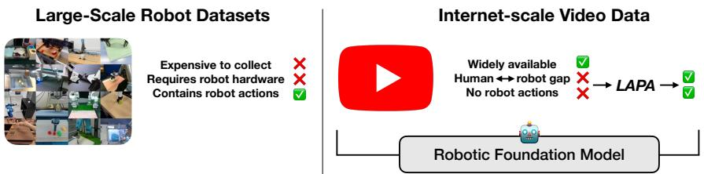
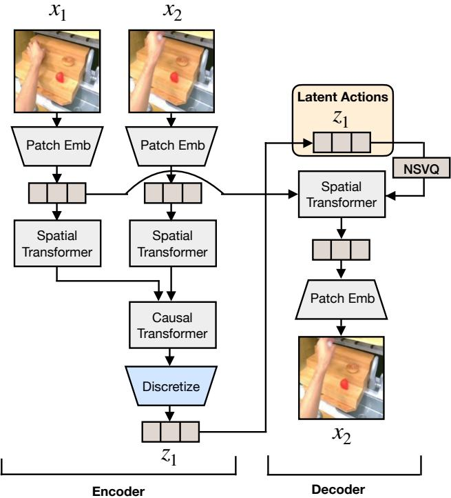

# 1. 论文基本信息

## 1.1. 标题
Latent Action Pretraining from Videos (从视频中进行潜动作预训练)

## 1.2. 作者
- Seonghyeon Ye (KAIST), Joel Jang (University of Washington), Byeongguk Jeon (KAIST), Sejune Joo (KAIST), Jianwei Yang (Microsoft Research), Baolin Peng (Microsoft Research), Ajay Mandlekar (NVIDIA), Reuben Tan (Microsoft Research), Yu-Wei Chao (NVIDIA), Yuchen Lin (Allen Institute for AI), Lars Liden (Microsoft Research), Kimin Lee (KAIST), Jianfeng Gao (Microsoft Research), Luke Zettlemoyer (University of Washington), Dieter Fox (University of Washington, NVIDIA), Minjoon Seo (KAIST).
- 本文作者团队阵容强大，汇集了来自韩国科学技术院 (KAIST)、华盛顿大学、微软研究院 (Microsoft Research)、英伟达 (NVIDIA) 和艾伦人工智能研究所 (Allen Institute for AI) 等顶尖学术界和工业界的研究人员。这表明该研究融合了多方的技术实力和资源，特别是在机器人学、计算机视觉和大规模模型领域。

## 1.3. 发表期刊/会议
- 本文目前作为预印本 (Preprint) 发布在 arXiv 上。虽然尚未经过同行评审，但 arXiv 是人工智能领域快速传播最新研究成果的重要平台。

## 1.4. 发表年份
- 2024年10月15日

## 1.5. 摘要
论文介绍了一种名为 **LAPA (Latent Action Pretraining for general Action models)** 的无监督预训练方法，用于训练<strong>视觉-语言-动作 (Vision-Language-Action, VLA)</strong> 模型，而**无需**依赖带有真实标注的机器人动作数据。现有的 VLA 模型在预训练阶段通常需要由人类操作员通过<strong>远程遥控 (teleoperation)</strong> 收集的动作标签，这极大地限制了数据来源和规模。

为解决此问题，本文提出了一种可以从互联网规模的、无机器人动作标签的视频中学习的方法。该方法分为三个阶段：
1.  <strong>动作量化 (Action Quantization):</strong> 首先训练一个基于 **VQ-VAE** 的模型，从未标注的视频帧之间学习离散的<strong>潜动作 (latent actions)</strong>。
2.  <strong>潜动作预训练 (Latent Pretraining):</strong> 接着，预训练一个 VLA 模型，使其能够根据视觉观察和任务描述来预测这些离散的潜动作。
3.  <strong>微调 (Finetuning):</strong> 最后，在一个小规模的、带有真实机器人动作标签的数据集上对 VLA 模型进行微调，以学习从潜动作到真实机器人动作的映射。

    实验结果表明，LAPA 在从大规模视频中训练机器人操作策略方面，显著优于现有技术。更重要的是，它在需要语言条件、对未见物体泛化和对未见指令进行语义泛化的真实世界操作任务中，其性能甚至超过了使用带动作标签数据训练的当前<strong>最先进的 (state-of-the-art)</strong> VLA 模型。此外，仅使用人类操作视频进行预训练也显示出积极的迁移效果，这为利用网络规模的数据来构建机器人基础模型开辟了可能性。

## 1.6. 原文链接
- **官方链接:** https://arxiv.org/abs/2410.11758
- **PDF 链接:** https://arxiv.org/pdf/2410.11758v2
- **发布状态:** 预印本 (Preprint)

# 2. 整体概括

## 2.1. 研究背景与动机
- **核心问题:** 当前构建通用机器人模型（特别是 VLA 模型）严重依赖于大规模、高质量的机器人演示数据。这些数据通常通过人类<strong>远程遥控 (teleoperation)</strong> 机器人来收集，这个过程成本高昂、耗时耗力，极大地阻碍了数据规模的扩展，从而限制了机器人模型的能力和泛化性。
- **重要性与挑战:** 互联网上存在着海量的视频数据（如 YouTube、Ego4D 等），其中包含了丰富的物理交互和人类行为范例。如果能有效利用这些数据，将极大地推动机器人学习的发展。然而，利用这些网络视频面临两大挑战：
    1.  <strong>缺乏动作标签 (Lack of Action Labels):</strong> 绝大多数网络视频只有图像和可能的文本描述，没有机器人可以执行的精确动作指令（如末端执行器坐标、关节角度等）。
    2.  <strong>领域差异 (Domain Gap):</strong> 网络视频（通常是人类视角或第三方视角）与机器人系统的<strong>形态 (embodiment)</strong>（如机械臂的结构、自由度）和环境存在巨大差异。
- **切入点/创新思路:** 本文的创新思路是**绕过对真实动作标签的直接需求**。它不试图从视频中直接推断出精确的机器人动作，而是提出了一种“两步走”的策略：
    1.  首先，通过一个无监督模型从视频中学习一种通用的、离散化的“动作词汇表”，即<strong>潜动作 (latent actions)</strong>。这些潜动作代表了视频中状态变化的本质，例如“向前移动一点”、“向下抓取”等，但不与任何具体的机器人形态绑定。
    2.  然后，训练一个 VLA 模型来学习理解语言指令并“说出”这些潜动作词汇。
    3.  最后，通过少量带标签的数据，教会模型如何将这些“潜动作词汇”翻译成特定机器人的“母语”（即可执行的动作指令）。

        下图（原文 Figure 1）直观地展示了本文的研究问题：如何利用无动作标签的人类操作视频来构建一个通用的机器人基础模型。

        
        *Figure 1: Problem Formulation. We investigate building a generalist robotic foundation model from human motion videos without action labels.*

## 2.2. 核心贡献/主要发现
- **提出 LAPA 方法:** 提出了一种名为<strong>潜动作预训练 (Latent Action Pretraining, LAPA)</strong> 的无监督方法，首次实现了在**不使用真实动作标签**的情况下预训练 VLA 模型，从而能够利用海量的网络视频数据。
- **超越 SOTA 性能:** 实验证明，经过 LAPA 预训练的模型在真实世界机器人操作任务中，性能**超过了**当前使用大规模带标签数据预训练的最先进模型 (OpenVLA)。具体来说，LAPA (Open-X) 的平均成功率比 OpenVLA (Open-X) 高出 **6.22%**。
- **极高的预训练效率:** LAPA 的预训练效率极高，比 OpenVLA 高出 **30-40 倍**。这主要归功于其更高效的骨干模型和更简单的潜动作预测任务。
- **验证了从人类视频学习的可行性:** 实验表明，即使只在人类操作视频（Something-Something V2 数据集）上进行预训练，LAPA 也能学习到有效的操作先验知识，并在机器人任务上取得积极的迁移效果，其性能甚至优于在大型机器人数据集 (BridgeV2) 上预训练的基线模型。
- **潜动作的通用性和可解释性:** 定性分析表明，LAPA 学到的潜动作具有跨不同机器人<strong>形态 (embodiment)</strong> 和环境的**共享表征**。例如，同一个潜动作指令 `[1,1,3,2]` 在不同场景下都能被解码为相似的“向左下方移动”的语义动作。
- **世界模型的潜力:** LAPA 的潜动作量化模型的解码器可以被用作一个<strong>世界模型 (world model)</strong>，通过预测的潜动作来生成未来的视频帧，从而构建一个神经模拟器，实现完全通过神经网络进行闭环评估。

# 3. 预备知识与相关工作

## 3.1. 基础概念
### 3.1.1. 视觉-语言-动作模型 (Vision-Language-Action Model, VLA)
**VLA 模型**是一种多模态大模型，旨在将机器人的感知、理解和行动能力统一在一个端到端的框架内。它可以同时处理三种信息：
-   <strong>视觉 (Vision):</strong> 通过摄像头捕捉的图像或视频流，理解当前环境的状态。
-   <strong>语言 (Language):</strong> 理解人类通过自然语言下达的任务指令（例如，“把苹果放到篮子里”）。
-   <strong>动作 (Action):</strong> 生成机器人可以执行的底层控制命令（例如，机械臂末端执行器的位置变化量、关节角度等）。
    VLA 模型通常基于一个强大的<strong>视觉-语言模型 (Vision-Language Model, VLM)</strong> 进行扩展，通过在包含 `(视觉, 语言, 动作)` 三元组的机器人数据集上进行<strong>微调 (fine-tuning)</strong>，将语言和视觉的理解能力<strong>“接地”</strong> (grounding) 到物理世界中。

### 3.1.2. 矢量量化变分自编码器 (Vector Quantized-Variational Autoencoder, VQ-VAE)
**VQ-VAE** 是一种生成模型，其核心思想是学习将连续的数据（如图像）映射到一个**离散的**、**可学习的**潜在表征空间中。它由三部分组成：
1.  <strong>编码器 (Encoder):</strong> 将输入数据（例如，一张图片）编码成一个连续的特征向量。
2.  <strong>码本 (Codebook):</strong> 这是一个可学习的“字典”，包含大量离散的嵌入向量（称为 code）。编码器输出的连续向量会与码本中所有的 code进行比较，并被替换为距离最近的那个 code。这个过程就是<strong>矢量量化 (Vector Quantization)</strong>。
3.  <strong>解码器 (Decoder):</strong> 接收量化后的离散 code，并尝试重构出原始的输入数据。
    在本文中，VQ-VAE 被用来学习“动作的词汇表”。输入是视频的当前帧和未来帧，模型学习用一个离散的<strong>潜动作 (latent action)</strong> code 来表示这两帧之间的变化。这类似于自然语言处理中的<strong>词元化 (tokenization)</strong>，将连续的世界变化“离散化”为可处理的单元。

### 3.1.3. 逆向动力学模型 (Inverse Dynamics Model, IDM)
在机器人学中，动力学模型描述了状态、动作和下一状态之间的关系。
-   <strong>正向动力学模型 (Forward Dynamics Model):</strong> 给定当前状态 $s_t$ 和动作 $a_t$，预测下一个状态 $s_{t+1}$。这通常被称为<strong>世界模型 (world model)</strong>。
-   <strong>逆向动力学模型 (Inverse Dynamics Model, IDM):</strong> 正好相反，给定当前状态 $s_t$ 和下一个状态 $s_{t+1}$，推断出是**什么动作 $a_t$ 导致了这个状态转变**。
    本文在训练 LAPA 的第一阶段，实际上训练了一个 VQ-VAE，其编码器部分就充当了一个 IDM 的角色：输入是当前帧 $x_t$ 和未来帧 $x_{t+H}$，输出是导致这一变化的（潜）动作 $z_t$。

## 3.2. 前人工作
- **VLA 模型:** 近期工作如 `RT-2`、`OpenVLA` 等通过在机器人数据上微调大型 VLM，实现了强大的泛化能力。然而，这些模型都依赖于带有<strong>真实标注数据 (Ground Truth)</strong> 的动作进行训练，这限制了它们的数据来源和可扩展性。LAPA 的不同之处在于它在预训练阶段**不需要**这些动作标签。
- **从视频中训练机器人策略:**
    - **预训练视觉编码器:** 一些工作 (如 `R3M`) 利用人类自我中心的视频来预训练一个强大的视觉编码器，以提升视觉表征能力，但仍需在下游任务中学习动作。
    - **视频生成模型:** 另一些工作 (如 `UnIPI`) 训练视频生成模型来预测未来的轨迹，然后用一个 IDM 从生成的视频中提取动作。LAPA 同样学习动作，但它学习的是抽象的潜动作，而不是直接生成像素级的视频。
    - <strong>动作重定向 (Retargeting):</strong> 部分工作尝试通过手部姿态估计器或动作捕捉系统，将人类视频中的动作“翻译”成机器人动作。这种方法通常需要特定的硬件或对齐的数据，并且难以泛化。
    - **世界模型 + IDM:** 有些方法（如 `VPT`）先在少量有标签数据上训练一个 IDM，然后用这个 IDM 去为大量无标签视频“伪造”动作标签，再用这些伪标签训练策略。LAPA 与之不同，它不依赖于一个预训练的 IDM，而是端到端地学习潜动作表征。
- <strong>潜动作 (Latent Actions):</strong>
    - 在游戏领域，`GENIE` 和其他工作使用潜动作来构建生成式交互环境或进行策略学习。`GENIE` 的目标是生成可交互的游戏世界，而 LAPA 的目标是训练一个能解决真实机器人任务的 VLA 模型。
    - 在机器人领域，一些工作 (如 `LAVA`) 将**真实的**动作 Groud Truth 映射到潜空间，以处理多模态或提升任务语义。LAPA 的核心区别在于，它的潜动作是<strong>直接从观测（视频帧）中无监督地学习而来</strong>，而非从真实动作转换得到。

## 3.3. 技术演进
机器人学习的技术路线正从依赖特定任务的小规模数据集，转向利用大规模、多样化数据进行预训练的“基础模型”范式，这与 NLP 和 CV 领域的发展趋势一致。
1.  **早期:** 针对特定任务，在特定环境中收集数据，训练专用模型。泛化能力差。
2.  **中期:** 出现大规模多任务、多机器人形态的数据集（如 `Open X-Embodiment`），催生了 `RT-2`、`Octo`、`OpenVLA` 等通用 VLA 模型。这些模型展示了强大的零样本或少样本泛化能力，但仍受限于带标签数据的获取瓶颈。
3.  <strong>当前探索 (本文所在位置):</strong> 如何突破对带标签数据的依赖，转向利用互联网上更海量的无标签/弱标签数据（如视频）。本文提出的 LAPA 是这一方向的开创性尝试，它通过学习潜动作，为利用无动作标签的视频数据预训练机器人基础模型提供了一条可行的路径。

## 3.4. 差异化分析
与相关工作相比，LAPA 的核心创新和差异点在于：
- **无监督动作学习:** LAPA 是第一个**完全在预训练阶段不依赖真实动作标签**的 VLA 预训练方法。它不预测像素、不依赖预训练的 IDM、也不需要动作重定向，而是直接从视觉变化中学习一个抽象的、离散的动作空间。
- **统一的潜动作空间:** LAPA 学习到的潜动作是**跨形态、跨环境**的。这使得模型可以在一个混合了各种机器人和人类视频的数据集上进行预训练，并从这种多样性中受益，而不是像传统方法那样，因不同数据集的动作空间不兼容而导致负迁移。
- **三阶段范式:** “**量化 -> 预训练 -> 微调**” 的三阶段范式清晰地分离了“学习世界如何变化”（动作量化）、“学习根据指令引发何种变化”（潜动作预训练）和“学习如何用特定身体执行该变化”（动作微调）这三个子问题，使得整个流程更加模块化和可扩展。

# 4. 方法论

本文提出的 LAPA (Latent Action Pretraining) 方法是一个包含两个顺序学习模型和一个微调阶段的框架。其整体流程如下图（原文 Figure 2）所示。

*Figure : Overview of Latent Action Pretraining. (1) Latent Action Quantization: We first learn discrete latent actions in a fully unsupervised manner using the VQ-VAE objective (Detail in Figure 8).() Latent Pretraining:The VLM is trained to predict latent actions, essentially performing behavior cloning. After pretraining, we finetune LAPA on a small set of action-labeled trajectories to map the latent space to the end effector delta action space.*

## 4.1. 阶段一：潜动作量化 (Latent Action Quantization)

这个阶段的目标是**在完全无监督的情况下，从视频中学习出一套离散的潜动作“词汇表”**。该方法基于 VQ-VAE 架构，其核心思想是：**一个“动作”可以被定义为引起两个连续视频帧之间变化的潜在原因**。

### 4.1.1. 模型架构与流程
该阶段使用的模型是一个编码器-解码器结构，其详细架构如原文 Figure 8 所示。

*Figure 8: Model architecture of our Latent Action Quantization Model.*

1.  **输入:** 模型接收一对视频帧作为输入：当前帧 $x_t$ 和未来某一时刻的帧 $x_{t+H}$。$H$ 是一个固定的窗口大小。
2.  <strong>编码 (Encoding):</strong>
    *   $x_t$ 和 $x_{t+H}$ 首先各自通过一个<strong>图像编码器 (Patch Embedding + Spatial Transformer)</strong>，被转换成 patch 嵌入表示 $p_1$ 和 $p_2$。
    *   为了捕捉时序信息，$p_1$ 和 $p_2$ 的表示被送入一个<strong>时序 Transformer (Causal Transformer)</strong>，得到更高级的连续嵌入 $e_1$ 和 $e_2$。
    *   两帧之间的“变化”被定义为这两个嵌入的差值：$d_1 = e_2 - e_1$。这个 $d_1$ 是一个连续的向量，代表了从 $t$ 到 $t+H$ 的视觉变化。
3.  <strong>量化 (Quantization):</strong>
    *   $d_1$ 随后通过一个卷积网络 (CNN)，其输出被送入矢量量化模块。
    *   该模块包含一个可学习的<strong>码本 (codebook)</strong> $C$。$d_1$ 会被替换为码本中最接近它的一个离散嵌入向量（即一个 code）。这个过程可以用以下公式表示：
        $$
        z_1 = \arg \min_{z_k \in C} \| d_1 - z_k \|^2
        $$
        其中，$z_1$ 就是最终得到的<strong>离散潜动作 (discrete latent action)</strong>，$z_k$ 是码本中的第 $k$ 个 code。通过调整 CNN 的参数，潜动作 $z_1$ 可以是一个 token 序列，而不仅仅是单个 token，从而表达更复杂的动作。
4.  <strong>解码 (Decoding):</strong>
    *   解码器的目标是利用当前帧的表示 $p_1$ 和量化后的潜动作 $z_1$ 来重构出未来帧 $x_{t+H}$。
    *   为了避免在 VQ-VAE 训练中常见的“梯度崩溃”问题，论文采用了 **NSVQ (Noise Substitution in VQ)** 技术。它在反向传播时，用一个带噪声的梯度来替代原始的量化误差梯度。量化后的表示 $\hat{d}_1$ 计算如下：
        $$
        \hat{d}_1 = d_1 + \frac{\| d_1 - z_1 \|}{\| v \|} v
        $$
        其中 $v \sim \mathcal{N}(0, 1)$ 是一个标准正态分布的噪声向量。这个技巧有助于梯度更平滑地流过量化层。
    *   解码器使用<strong>交叉注意力 (cross attention)</strong> 机制，以当前帧的 patch 嵌入 $p_1$ 作为查询 (Query)，以潜动作表示 $\hat{d}_1$ 作为键 (Key) 和值 (Value)，来预测未来帧。同时，在 $p_1$ 上施加了<strong>停止梯度 (stop gradient)</strong>，以防止模型走捷径，即忽略潜动作而直接从 $p_1$ 复制信息，这有助于避免表征崩溃。重构的未来帧 $\hat{x}_2$（即 $\hat{x}_{t+H}$）计算如下：
        $$
        \hat{x_2} = D(\mathrm{Attn}(\mathrm{sg}[p_1], \hat{d}_1, \hat{d}_1))
        $$
        其中 $D$ 是解码器，$\mathrm{Attn}$ 是交叉注意力，$\mathrm{sg}$ 是停止梯度操作。
5.  **训练目标:** 模型的训练目标是最小化重构帧 $\hat{x}_{t+H}$ 和真实未来帧 $x_{t+H}$ 之间的 L2 距离（重构损失）：
    $$
    L = \| x_{t+H} - \hat{x}_{t+H} \|_2^2
    $$

训练完成后，这个模型的**编码器**就成了一个<strong>潜动作逆向动力学模型 (Latent IDM)</strong>，可以为任何视频片段 $(x_t, x_{t+1})$ 生成一个潜动作标签 $z_t$。而**解码器**则成了一个<strong>潜动作世界模型 (Latent World Model)</strong>。

## 4.2. 阶段二：潜动作预训练 (Latent Pretraining)

在这个阶段，目标是训练一个 VLA 模型，使其能够根据语言指令和当前视觉观察来预测下一时刻应该执行哪个潜动作。

1.  **数据标注:** 使用阶段一训练好的<strong>编码器 (Latent IDM)</strong>，对整个预训练视频数据集进行离线处理。对于数据集中的每一对连续帧 $(x_t, x_{t+1})$，都用编码器提取出对应的潜动作标签 $z_t$。这样，原本无动作标签的视频数据 `(视频, 语言指令)` 就变成了 `(视频, 语言指令, 潜动作序列)`。
2.  **模型训练:**
    *   选择一个预训练好的 VLM 作为<strong>主干网络 (backbone)</strong> (本文使用 LWM-Chat-1M)。
    *   在 VLM 的语言模型输出端，附加一个简单的<strong>潜动作头 (latent action head)</strong>，通常是一个 MLP 层，其输出维度等于码本的大小 $|C|$。
    *   训练任务是<strong>行为克隆 (Behavior Cloning)</strong>：模型输入当前图像 $x_t$ 和整个视频片段的语言指令，然后预测在 $t$ 时刻对应的潜动作 $z_t$。
    *   损失函数是标准的交叉熵损失，用于分类预测正确的潜动作 token。
    *   在训练过程中，通常会**冻结视觉编码器**，只训练语言模型和新加的潜动作头。

        这个阶段完成后，得到的模型（称为 LAPA）已经学会了将高级语言指令和视觉场景映射到一系列抽象的、有意义的潜动作上。

## 4.3. 阶段三：动作微调 (Action Finetuning)

预训练好的 LAPA 模型还不能直接在机器人上执行，因为它输出的是潜动作而非物理动作。最后一步就是将这些潜动作“翻译”成特定机器人的可执行动作。

1.  **模型修改:** 丢弃 LAPA 模型在阶段二中使用的潜动作头。换上一个新的<strong>动作头 (action head)</strong>，用于预测真实的机器人动作。
2.  **动作离散化:** 为了便于模型预测，连续的机器人动作空间（如 7-DoF 机械臂的末端执行器位移和旋转）被<strong>离散化 (discretize)</strong>。每个动作维度被分成若干个 bin，使得模型将动作预测任务转化为一个分类问题。
3.  **微调:**
    *   在一个**小规模**的、带有<strong>真实标注数据 (Ground Truth)</strong> 动作的机器人数据集上进行微调。
    *   模型输入与之前相同（图像、语言指令），但现在的目标是预测离散化后的真实机器人动作。
    *   与预训练类似，微调时通常也冻结视觉编码器，只更新语言模型和新的动作头。

        通过这个阶段，模型学会了如何将它在预训练阶段学到的通用“规划能力”（即生成潜动作序列的能力）映射到特定机器人身体的物理执行上。

# 5. 实验设置

## 5.1. 数据集
论文在多样化的预训练和微调数据集上进行了实验，以验证 LAPA 在不同场景下的性能。

## 5.1.1. 预训练数据集
- **Language Table (Sim & Real):** 一个模拟和真实世界的桌面块状物操作任务数据集。模拟数据集包含 181k 条轨迹，真实世界数据集包含 442k 条轨迹。
- **BridgeV2:** 一个大规模的开源机器人数据集，包含 60k 条由 WidowX 机械臂执行的轨迹。
- **Open X-Embodiment (Open-X):** 一个巨大的、多形态、多任务的机器人数据集，汇集了来自不同来源的 970k 条真实世界机器人演示。
- **Something-Something v2 (Sthv2):** 一个大规模的人类视频数据集，包含约 220k 段视频，内容是人类与日常物品进行交互。这个数据集**不包含任何机器人数据**。

## 5.1.2. 评估/微调数据集与环境
- **Language Table:** 一个 2-DOF 的模拟环境，机器人需要根据指令推动不同颜色的块。任务包含 `BlocktoBlock`、`Separate` 等5个类别。评估分为<strong>域内 (in-domain)</strong>、<strong>跨任务 (cross-task)</strong> 和<strong>跨环境 (cross-environment)</strong> 三种设置。下图（原文 Figure 9(a)）展示了该环境的真实与模拟场景。
- **SIMPLER:** 一套用于评估通用机器人操作策略的模拟环境，使用 7-DOF 的 WidowX 机械臂。论文在 4 个任务上进行评估（如下图原文 Figure 9(b) 所示）。由于该环境没有提供微调数据，作者自行收集了 100 条成功轨迹用于微调。
- <strong>真实世界桌面操作 (Real-World Tabletop Manipulation):</strong> 使用 7-DOF 的 Franka Emika Panda 机械臂在三个真实桌面任务上进行评估（如下图原文 Figure 9(c) 所示）：
    1.  $'Pick <object> into Sink'$ (拾取物体放入水槽)
    2.  $'Cover <object> with Towel'$ (用毛巾盖住物体)
    3.  $'Knock <object> Over'$ (推倒物体)
        每个任务收集了 150 条轨迹用于微调，评估涵盖了对**未见物体组合**、**未见物体**和**未见指令**的泛化能力。

下图（原文 Figure 9）展示了主要的实验环境。

*Figure 9: Experimental Setups. (a) shows an example from the $4 4 0 \mathrm { k }$ real-world trajectories (top) and the 181k simulation trajectoris ottom)fromheLanguageTableBencmark.  shows thedifferent evaluatin tasks we use with the SIMPLER environment. (c) shows the three different tasks that we perform in the real-world.*

## 5.2. 评估指标
论文主要使用<strong>成功率 (Success Rate)</strong> 作为评估指标。在真实世界实验中，为了进行更细致的评估，还采用了<strong>部分成功标准 (partial success criterion)</strong>。

## 5.2.1. 成功率 (Success Rate, SR)
- <strong>概念定义 (Conceptual Definition):</strong> 成功率衡量了模型在给定一组测试任务中，完全成功完成任务的次数所占的比例。它是评估机器人策略性能最直接和最常用的指标。
- <strong>数学公式 (Mathematical Formula):</strong>
  $$
  \text{Success Rate} = \frac{\sum_{i=1}^{N} \mathbb{I}(\text{task}_i \text{ is successful})}{N}
  $$
- <strong>符号解释 (Symbol Explanation):</strong>
    - $N$: 总的评估任务（或称推演，rollout）次数。
    - $\text{task}_i$: 第 $i$ 次评估任务。
    - $\mathbb{I}(\cdot)$: 指示函数 (Indicator Function)。当条件为真时，其值为 1；当条件为假时，其值为 0。

## 5.2.2. 部分成功得分 (Partial Success Score)
- <strong>概念定义 (Conceptual Definition):</strong> 在复杂的、多阶段的任务中，二元的成功/失败评估可能无法区分“差一点就成功”和“完全失败”的策略。部分成功得分为任务的不同完成阶段赋予不同的分数，从而提供更细粒度的性能衡量。
- <strong>具体定义 (在本文中):</strong>
    - **推倒任务:** 机器人到达正确物体得 0.5 分，成功推倒得 1 分。
    - **覆盖任务:** 成功拿起毛巾得 0.33 分，到达正确物体或部分覆盖得 0.66 分，完全覆盖得 1 分。
    - **拾取并放置任务:** 到达正确物体得 0.25 分，抓住物体得 0.5 分，移动到水槽附近但放置失败得 0.75 分，成功放入水槽得 1 分。
      最终报告的成功率是这些部分成功得分的平均值。

## 5.3. 对比基线
- **SCRATCH:** 不进行任何预训练，直接在下游任务上微调 VLM <strong>主干网络 (backbone)</strong>。用于衡量预训练带来的增益。
- **UNIP1:** 一种同样无需动作标签的预训练方法。它使用视频扩散模型生成未来的视频<strong>推演 (rollout)</strong>，然后训练一个 IDM 从生成的视频中提取动作进行微调。
- **VPT:** 先在少量有标签数据上训练一个 IDM，然后用这个 IDM 为大规模无标签视频生成伪动作标签，最后用这些伪标签来预训练 VLM。
- **ActionVLA:** 使用**真实的动作标签**进行预训练。这可以被看作是 LAPA 性能的<strong>理论上限 (upper bound)</strong>，因为它使用了最强形式的监督信息。
- **OpenVLA:** 当前最先进的 VLA 模型，它在包含 970k 条真实机器人演示的 Open-X 数据集上进行了预训练（使用了真实动作标签）。这是一个非常强大的外部基线。

# 6. 实验结果与分析

## 6.1. 核心结果分析
## 6.1.1. 模拟环境实验 (Language Table)
以下是原文 Table 1 的结果，展示了在 Language Table 基准上的平均成功率 (%)。

<table>
<thead>
<tr>
<th rowspan="2"></th>
<th colspan="2">In-domain (1k)</th>
<th colspan="2">Cross-task (7k)</th>
<th colspan="2">Cross-env (1k)</th>
</tr>
<tr>
<th>Seen</th>
<th>Unseen</th>
<th>Seen</th>
<th>Unseen</th>
<th>Seen</th>
<th>Unseen</th>
</tr>
</thead>
<tbody>
<tr>
<td>SCRATCH</td>
<td>15.6±9.2</td>
<td>15.2±8.3</td>
<td>27.2±13.6</td>
<td>22.4±11.0</td>
<td>15.6±9.2</td>
<td>15.2±8.3</td>
</tr>
<tr>
<td>UnIPI</td>
<td>22.0±12.5</td>
<td>13.2±7.7</td>
<td>20.8±12.0</td>
<td>16.0±9.1</td>
<td>13.6±8.6</td>
<td>12.0±7.5</td>
</tr>
<tr>
<td>VPT</td>
<td>44.0±7.5</td>
<td>32.8±4.6</td>
<td>72.0±6.8</td>
<td>60.8±6.6</td>
<td>18.0±7.7</td>
<td>18.4±9.7</td>
</tr>
<tr>
<td><strong>LAPA</strong></td>
<td><strong>62.0±8.7</strong></td>
<td><strong>49.6±9.5</strong></td>
<td><strong>73.2±6.8</strong></td>
<td><strong>54.8±9.1</strong></td>
<td><strong>33.6±12.7</strong></td>
<td><strong>29.6±12.0</strong></td>
</tr>
<tr>
<td>ActionVLA</td>
<td><u>77.0±3.5</u></td>
<td><u>58.8±6.6</u></td>
<td><u>77.0±3.5</u></td>
<td><u>58.8±6.6</u></td>
<td><u>64.8±5.2</u></td>
<td><u>54.0±7.0</u></td>
</tr>
</tbody>
</table>

**分析:**
- <strong>域内性能 (In-Domain):</strong> LAPA (62.0%) 显著优于所有无动作标签的基线 (SCRATCH, UnIPI, VPT)，并大大缩小了与使用真实动作标签的 ActionVLA (77.0%) 的差距。这证明了潜动作预训练的有效性。
- <strong>跨任务泛化 (Cross-Task):</strong> 当模型在所有任务上预训练，但只在一个任务 (`separate`) 上微调时，LAPA 不仅在该任务上表现出色，在其他未微调的任务上也保持了很高的性能 (73.2%)，表明其学到的技能具有很好的泛化性。
- <strong>跨环境迁移 (Cross-Env):</strong> 这是最严苛的测试，模型在真实世界机器人视频上预训练，在模拟环境中微调。LAPA (33.6%) 仍然显著优于 SCRATCH (15.6%)，实现了从真实到模拟的正向迁移。相比之下，VPT (18.0%) 的提升很小，表明其依赖的 IDM 在环境变化时不够鲁棒，而 LAPA 的潜动作表征则更具通用性。

## 6.1.2. 真实世界实验 (Real-World Tabletop Manipulation)
下图（原文 Figure 3）和下表（原文 Table 2）展示了在真实世界桌面操作任务上的平均成功率。

*Figure 3: Real-world Tabletop Manipulation Results. We evaluate on a total of 54 rollouts for each model encompassing unseen object combinations, unseen objects and unseen instructions. Average success rate $( \% )$ $\pm$ StdErr are shown (detailed results provided in Appendix G.3).*

以下是原文 Table 2 的结果，按泛化能力类型对成功率进行了细分。

<table>
<thead>
<tr>
<th></th>
<th>Seen Obj. Unseen Combo</th>
<th>Unseen Obj.</th>
<th>Seen Obj. Unseen Instr.</th>
<th>AVG</th>
</tr>
</thead>
<tbody>
<tr>
<td>SCRATCH</td>
<td>18.0</td>
<td>20.3</td>
<td>25.4</td>
<td>21.2</td>
</tr>
<tr>
<td>ACTIONVLA (Bridge)</td>
<td>38.3</td>
<td>31.8</td>
<td>27.7</td>
<td>32.6</td>
</tr>
<tr>
<td>OPENVLA (Bridge)</td>
<td>35.6</td>
<td>34.6</td>
<td>22.1</td>
<td>30.8</td>
</tr>
<tr>
<td><strong>LAPA (Bridge)</strong></td>
<td><u>43.4</u></td>
<td>31.4</td>
<td><u>35.6</u></td>
<td><u>36.8</u></td>
</tr>
<tr>
<td>OPENVLA (Open-X)</td>
<td>46.2</td>
<td><u>42.1</u></td>
<td>43.4</td>
<td>43.9</td>
</tr>
<tr>
<td><strong>LAPA (Open-X)</strong></td>
<td><strong>57.8</strong></td>
<td><strong>43.9</strong></td>
<td><strong>48.5</strong></td>
<td><strong>50.1</strong></td>
</tr>
<tr>
<td><strong>LAPA (Human Videos)</strong></td>
<td>36.5</td>
<td>37.4</td>
<td>28.1</td>
<td>34.0</td>
</tr>
</tbody>
</table>

**分析:**
- **LAPA 超越有监督预训练:** 最引人注目的结果是 **LAPA (Open-X)** 在平均成功率上 (50.1%) **显著超过了**使用同样数据且有真实动作标签进行预训练的<strong>最强基线 OpenVLA (Open-X)</strong> (43.9%)。这颠覆了“有监督预训练是性能上限”的传统认知。论文推测，这是因为 OpenVLA 在预训练时过拟合到了各种不同机器人的具体动作空间，导致在微调到新机器人时产生负迁移。而 LAPA 学习的是一个统一的、与形态无关的潜动作空间，因此具有更好的跨<strong>形态 (embodiment)</strong> 迁移能力。
- **数据规模效应:** 在 Open-X 数据集上预训练的模型普遍优于在 BridgeV2 上预训练的模型，证明了预训练数据的规模和多样性对下游任务性能有积极影响。
- **从人类视频中学习:** **LAPA (Human Videos)** 的表现令人惊讶，它仅使用人类操作视频 (Sthv2) 进行预训练，其平均性能 (34.0%) 竟然**超过了**在大型机器人数据集 BridgeV2 上预训练的 ActionVLA (32.6%) 和 OpenVLA (30.8%)。这有力地证明了 LAPA 能够有效弥合人类与机器人之间的巨大形态差异，并从纯人类视频中提取出有用的操作先验知识。特别是在“未见物体”的泛化上，LAPA (Human Videos) 表现出色 (37.4%)，可能是因为 Sthv2 数据集包含了比 BridgeV2 更丰富的物体多样性。

## 6.1.3. 消融实验与分析
下图（原文 Figure 5）展示了 LAPA 在模型大小、数据量、潜动作空间大小等维度上的扩展性实验结果。

**分析:**
- <strong>扩展定律 (Scaling Laws):</strong> 结果显示，LAPA 的性能随着**模型参数量**、**预训练数据量**、**潜动作序列长度**和**潜动作词汇表大小**的增加而持续提升。这表明 LAPA 框架具有良好的可扩展性，未来可以通过投入更多计算资源和数据来进一步提升模型能力。
- **潜动作空间的设计:** 实验还发现，潜动作空间的最优设计（序列长度 vs. 词汇表大小）可能与任务的复杂性有关。对于动作维度简单的任务（如 Language Table），增加词汇表大小更有效；而对于更复杂的任务，增加序列长度可能更有益。

## 6.1.4. 潜动作可解释性分析
论文通过可视化潜动作解码器的输出来分析其语义。

![Figure 6: Latent Action Analysis. We condition the current observation `x _ { 1 }` and quantized latent action to the decoder of the latent action quantization model.We observe that each latent action can be mapped into a semantic action. For example, latent action \[1,1,3,2\] corresponds to going down and left while \[3,2,0,1\] corresponds to going up a little bit.](images/6.jpg)
*Figure 6: Latent Action Analysis. We condition the current observation `x _ { 1 }` and quantized latent action to the decoder of the latent action quantization model.We observe that each latent action can be mapped into a semantic action. For example, latent action [1,1,3,2] corresponds to going down and left while [3,2,0,1] corresponds to going up a little bit.*

上图（原文 Figure 6）展示了在 Open-X 数据集上学到的潜动作。即使输入的当前帧来自**不同的机器人形态和环境**（左侧两列 vs. 右侧两列），当给定**相同的潜动作**（例如 `[1,1,3,2]`）时，解码器生成的未来帧都显示出相似的语义动作（向左下方移动）。这直观地证明了 LAPA 成功学习到了一个**共享的、与形态无关的潜动作表征空间**。

## 6.1.5. 作为世界模型的潜力
下图（原文 Figure 7）展示了 LAPA 在闭环<strong>推演 (rollout)</strong> 中的表现。模型仅经过预训练，未进行微调。通过将 LAPA 预测的潜动作序列输入到潜动作解码器中，可以生成一系列未来的预测帧。

**分析:**
在“把西兰花从锅里拿出来”的指令下，模型生成了“伸向西兰花 -> 向下抓取 -> 拿走西兰花（西兰花消失）”的合理图像序列。这表明，LAPA 不仅能预测动作，还能预测动作带来的后果，具备了作为<strong>神经世界模型 (Neural World Model)</strong> 的潜力，可用于任务规划和纯粹在模型内部进行的闭环评估。

# 7. 总结与思考

## 7.1. 结论总结
本文提出了一种名为 LAPA 的开创性预训练框架，它首次实现了在**不依赖真实动作标签**的情况下，从大规模视频（包括机器人视频和人类视频）中为 VLA 模型学习有效的机器人操作技能。
- **主要贡献:** LAPA 通过“**动作量化 -> 潜动作预训练 -> 动作微调**”的三阶段范式，成功地将无标签视频数据转化为强大的机器人操作先验知识。
- **主要发现:** 实验结果表明，LAPA 不仅在无动作标签学习方面远超现有方法，其性能甚至**超越了**使用海量带标签数据预训练的 SOTA 模型 OpenVLA。更重要的是，它证明了从纯人类视频中学习复杂机器人操作技能是可行的，为利用互联网规模数据构建机器人基础模型铺平了道路。
- **意义:** LAPA 极大地降低了机器人模型预训练的数据收集成本，打破了当前机器人学习领域面临的“数据瓶颈”，有望推动机器人基础模型进入一个类似于 NLP 和 CV 领域由大规模无监督预训练驱动的新时代。

## 7.2. 局限性与未来工作
论文作者也坦诚地指出了当前方法的局限性：
- **精细动作控制:** LAPA 在需要精细操作（如抓取）的任务上，表现有时不如有监督预训练的模型。作者认为这可能通过增加潜动作空间的表示能力来改进。
- **推理延迟:** 和其他大型 VLA 模型一样，LAPA 在实时推理时面临延迟挑战。未来可以探索分层架构，用一个小模型进行高频动作预测。
- **应用领域扩展:** 目前 LAPA 主要在桌面操作视频上进行了验证。虽然它能捕捉到相机移动等变化，但其在自动驾驶、导航等更广泛领域的应用潜力尚待探索。

## 7.3. 个人启发与批判
- **启发:**
    1.  **解耦问题的智慧:** LAPA 的核心思想在于“解耦”。它没有试图一步到位地解决“从视频像素到机器人力矩”这个极其困难的问题，而是将其分解为：① 学习“什么是动作”（潜动作量化），② 学习“何时执行何种动作”（潜动作预训练），③ 学习“如何用身体执行动作”（微调）。这种分而治之的策略在解决复杂 AI 问题时极具启发性。
    2.  <strong>“通用语言”</strong>的重要性: LAPA 的成功关键在于找到了一个跨形态、跨领域的“通用动作语言”——潜动作。这就像巴别塔的比喻，一旦所有智能体（无论是人类还是不同形态的机器人）都有了一套共通的语言来描述物理世界的变化，知识的迁移和共享就变得异常高效。
    3.  **重新思考监督的价值:** LAPA 的结果挑战了我们对“监督信息”的传统认知。它表明，在超大规模、多样化的数据面前，一种巧妙设计的**无监督/自监督目标**（如重构帧间变化）可能比在有限但“完美”的标签上进行监督学习，更能学到鲁棒和可泛化的表征。

- **批判与思考:**
    1.  **两阶段训练的潜在问题:** LAPA 的量化和预训练是分开的两个阶段。第一阶段训练的 VQ-VAE 质量直接决定了后续所有任务的上限。这种非端到端的训练方式可能不是最优的。未来是否可以探索一种联合训练或端到端的方式，让潜动作的形成也受到下游任务梯度的影响？
    2.  **潜动作的“黑盒”性:** 虽然论文通过解码器可视化来解释潜动作，但这些离散的 token 序列本质上仍是“黑盒”。我们对其语义的理解依赖于解码器的重构质量。如果重构出现偏差，我们对潜动作的理解也会出错。如何建立更可靠的潜动作分析和调试工具是一个重要问题。
    3.  **对视频数据质量的依赖:** LAPA 的性能高度依赖于预训练视频的质量和多样性。网络视频中充满了噪声、视角突变、非交互内容等。论文中使用的 Sthv2 数据集相对干净。当扩展到更嘈杂的YouTube级别数据时，如何进行数据清洗和筛选，以及 LAPA 对这些噪声的鲁棒性如何，将是决定其能否真正走向“网络规模”的关键。