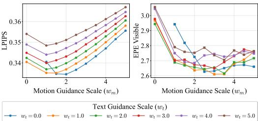

# 1. Bibliographic Information

## 1.1. Title
MotionStream: Real-Time Video Generation with Interactive Motion Controls

## 1.2. Authors
The authors are Joonghyuk Shin, Zhengqi Li, Richard Zhang, Jun-Yan Zhu, Jaesik Park, Eli Shechtman, and Xun Huang. Their affiliations are with Adobe Research, Carnegie Mellon University, and Seoul National University. This team comprises prominent researchers in computer graphics, computer vision, and generative models, with many having prior influential work in image and video synthesis.

## 1.3. Journal/Conference
The paper was published as a preprint on arXiv. arXiv is a well-known open-access repository for electronic preprints of scientific papers in fields like physics, mathematics, computer science, and more. While not a peer-reviewed venue itself, it is the standard platform for researchers to share their latest work quickly with the global scientific community, often before or during the peer-review process for a major conference or journal. Given the authors' affiliations and the quality of the work, it is likely intended for a top-tier computer vision or graphics conference such as CVPR, ICCV, or SIGGRAPH.

## 1.4. Publication Year
The paper was submitted to arXiv with a listed publication date of November 3, 2025. This appears to be a futuristic placeholder date common on arXiv for papers submitted for future conferences. The version analyzed is $v2$, indicating it has been updated since its initial submission.

## 1.5. Abstract
The abstract introduces `MotionStream`, a novel method for real-time, motion-controlled video generation. It addresses the key limitations of existing methods: high latency (minutes per video) and non-causal processing, which prevent interactive use. `MotionStream` achieves sub-second latency and streaming generation at up to 29 FPS on a single GPU. The approach involves a two-stage process. First, a high-quality bidirectional "teacher" model is created by augmenting a text-to-video model with motion control. Second, this teacher is distilled into a causal "student" model using a novel distillation technique called `Self Forcing with Distribution Matching Distillation`, which enables real-time inference. The paper highlights solutions to challenges in long-video generation, such as preventing error accumulation and maintaining constant inference speed. The key technical innovation is the use of `sliding-window causal attention` combined with `attention sinks` and an `extrapolation-aware training` process involving self-rollout and KV cache rolling. This allows for constant-speed generation of arbitrarily long videos. The model achieves state-of-the-art results in motion tracking and video quality while being two orders of magnitude faster than previous work, enabling a truly interactive experience where users can see their edits unfold in real time.

## 1.6. Original Source Link
*   **Original Source Link:** https://arxiv.org/abs/2511.01266
*   **PDF Link:** https://arxiv.org/pdf/2511.01266v2
*   **Publication Status:** This is a preprint available on arXiv. It has not yet been officially published in a peer-reviewed journal or conference proceeding.

# 2. Executive Summary

## 2.1. Background & Motivation
The field of video generation has made significant progress, particularly in creating models that can be controlled by user inputs like text or motion trajectories. However, a major bottleneck prevents these powerful tools from being truly interactive. The core problem is that current state-of-the-art motion-controlled video generation methods suffer from three fundamental constraints:

1.  **Prohibitive Latency:** Generating even a short, few-second video clip can take several minutes. This forces users into a tedious "render-and-wait" cycle, which is antithetical to a creative, interactive workflow.
2.  **Non-Causal Processing:** Most high-quality models are based on diffusion architectures that use bidirectional attention. This means the model must process the entire motion trajectory for the whole video at once. It cannot start generating the video until the user has specified the motion for every single frame, making on-the-fly interaction impossible.
3.  **Short-Duration Generation:** Existing models are typically trained on and limited to generating very short clips (e.g., a few seconds). They cannot generate long or continuous video streams, which severely limits their creative potential.

    These challenges mean that the dream of giving a creator a "director's chair"—where they can guide actors, objects, and cameras in real time—remains unfulfilled. The paper's motivation is to break these constraints and build a system that is **fast**, **causal (streaming)**, and capable of **infinite-length generation**, thereby enabling a fluid, interactive video creation experience.

## 2.2. Main Contributions / Findings
The paper introduces `MotionStream`, a system designed to solve the aforementioned problems. Its primary contributions are:

1.  **A Real-Time Streaming Pipeline:** The paper presents the first motion-conditioned video generation system that can run at interactive speeds (up to 29.5 FPS) on a single GPU. This transforms video generation from a passive, offline task to an active, real-time creative process.
2.  **A Synergistic and Efficient System Design:** The authors propose a complete system that combines several efficient components. This includes a lightweight motion control module (`track head`), an efficient joint text-motion guidance mechanism that is baked into the model during distillation to avoid inference overhead, and a custom-trained `Tiny VAE` to accelerate the final decoding step.
3.  **A Novel Distillation Strategy for Long Videos:** To enable stable, infinite-length video generation, the paper introduces a unique distillation method. For the first time, it systematically incorporates `attention sinks` and `local attention` with an `extrapolation-aware training` process. This technique effectively prevents the model from drifting or degrading in quality during long-term streaming.
4.  **State-of-the-Art Performance with High Efficiency:** The proposed `MotionStream` model achieves state-of-the-art results on motion transfer and camera control tasks. Crucially, it does so at speeds that are orders of magnitude faster than previous methods, robustly generalizing to diverse interactive applications like painting trajectories, dragging objects, and controlling camera movements in real time.

# 3. Prerequisite Knowledge & Related Work

## 3.1. Foundational Concepts
To understand this paper, several core concepts in generative AI are essential.

### 3.1.1. Video Diffusion Models
A **diffusion model** is a type of generative model that learns to create data by reversing a process of gradually adding noise.
*   **Forward Process:** You start with a real data sample (e.g., a video frame) and incrementally add Gaussian noise over a series of timesteps until it becomes pure, indistinguishable noise.
*   **Reverse Process:** The model, typically a U-Net architecture, is trained to predict the noise that was added at each timestep. By iteratively subtracting this predicted noise from a random noise image, the model can generate a clean data sample from scratch.
*   **Latent Diffusion Models (LDMs):** To make this process more computationally efficient for high-resolution data like images and videos, LDMs first encode the data into a lower-dimensional **latent space** using an autoencoder (specifically, a **Variational Autoencoder or VAE**). The diffusion process then happens in this compressed latent space. Once the denoising is complete, a decoder from the VAE converts the clean latent representation back into a full-resolution video. This paper builds on `WanDiT`, a Transformer-based latent diffusion model.

### 3.1.2. Autoregressive (AR) Models
**Autoregressive models** generate data sequentially, where each new element is generated based on the previously generated ones. Think of how you write a sentence: each word you choose depends on the words that came before it.
*   **Example:** In language, a model like GPT predicts the next word given the preceding text. In video, an AR model would predict the next frame (or chunk of frames) given the previous frames.
*   **Key Characteristic:** This sequential, causal nature (`future depends on past`) makes AR models naturally suited for streaming applications, as you don't need to know the entire future sequence to start generating. This is in stark contrast to standard diffusion models, which often process the entire sequence in parallel (bidirectionally).

### 3.1.3. Model Distillation
**Model distillation** is a technique for compressing a large, powerful but slow model (the "teacher") into a smaller, faster model (the "student") while retaining most of the teacher's performance.
*   **Process:** The student is trained to mimic the output of the teacher. Instead of training on raw data labels, the student learns from the "soft labels" or probability distributions produced by the teacher.
*   **Distribution Matching Distillation (DMD):** This is an advanced distillation technique used in the paper. Instead of just matching the final output, DMD aims to match the entire output distribution of the student to the teacher's. It involves training a critic (or discriminator) to distinguish between the teacher's and student's output distributions, and the student generator is updated to "fool" this critic. This is a key part of how `MotionStream` becomes a fast, few-step generator.

### 3.1.4. Attention Mechanism & KV Cache
The **attention mechanism**, particularly `self-attention`, is the core component of Transformer models. It allows the model to weigh the importance of different parts of the input sequence when processing a specific part.
*   **How it works:** For each element (e.g., a pixel patch or a word token), the model computes three vectors: a **Query (Q)**, a **Key (K)**, and a **Value (V)**. The Query represents the current element's "question." The Keys from all other elements are compared to this Query to calculate attention scores (how much "attention" to pay to each other element). These scores are then used to create a weighted sum of all the Values, producing the output for the current element.
*   **KV Cache:** In autoregressive generation, when generating a new token, the Key and Value vectors for all previous tokens have already been computed. Instead of recomputing them every single time, they can be stored in memory in a `KV cache`. For the next step, you only need to compute the K and V for the newest token and append them to the cache. This dramatically speeds up inference.

### 3.1.5. Attention Sinks
This is a recent concept, popularized by `StreamingLLM`. The observation is that in autoregressive Transformer models, a few initial tokens in the sequence receive a disproportionately high amount of attention from all subsequent tokens. These initial tokens act as "attention sinks," gathering global information that is crucial for maintaining coherence.
*   **The Idea:** If you use a simple sliding window attention, you eventually discard these crucial initial tokens, causing the model's performance to degrade (a phenomenon known as "drift").
*   **The Solution:** An `attention sink` mechanism keeps the very first few tokens (the "sinks") in the attention window permanently, while the rest of the window slides as new tokens are generated. This anchors the generation process and prevents drift, enabling stable streaming for long sequences. `MotionStream` is the first to systematically apply this idea to video generation.

### 3.1.6. Classifier-Free Guidance (CFG)
**Classifier-Free Guidance** is a technique to control the output of diffusion models to better match a given condition (e.g., a text prompt) without needing a separate classifier model.
*   **How it works:** During training, the model is sometimes given the condition and sometimes not (e.g., an empty text string). At inference time, you run the model twice in each step: once with the condition (`conditional prediction`) and once without (`unconditional prediction`). The final prediction is then extrapolated away from the unconditional prediction and towards the conditional one.
*   **Formula:** The guided prediction $\hat{\epsilon}$ is often calculated as:
    $\hat{\epsilon} = \epsilon_{\text{uncond}} + w \cdot (\epsilon_{\text{cond}} - \epsilon_{\text{uncond}})$
    where $w$ is the guidance scale. A higher $w$ forces the output to adhere more strictly to the condition. This paper uses a joint version for both text and motion.

## 3.2. Previous Works
The authors position `MotionStream` in the context of three main research areas:

1.  **Controllable Video Generation:** Many recent works aim to control video generation using signals like optical flow, trajectories, bounding boxes, or camera parameters. Methods like `MotionPrompting` and `Go-With-The-Flow` have shown impressive results in following motion. However, they are all based on standard diffusion models with **bidirectional attention**. This requires the entire control signal (e.g., the full motion path) to be known upfront and processes all frames in parallel, making them inherently offline and slow. `MotionStream` directly tackles this limitation.

2.  **Autoregressive Video Models:** This research line focuses on generating videos causally. Early works used GANs, but recent approaches have shifted to diffusion models or pure autoregressive transformers. A key paradigm, which `MotionStream` follows, is to combine the quality of diffusion models with the causality of AR models. This is often achieved through **distillation**, where a slow, high-quality "teacher" model is distilled into a fast, causal "student." Relevant works here are `Self Forcing` and `CausVid`, which demonstrated this for image and video generation. However, these prior methods either suffer from drift when generating videos beyond their training length or require complex fine-tuning.

3.  **Interactive Video World Models:** This emerging field aims to create simulated environments that users can interact with in real time. Systems like `Genie` have shown impressive results. However, they either require massive computational resources or are limited to synthetic, non-photorealistic environments. `MotionStream` is unique in achieving real-time, interactive generation of open-domain, photorealistic videos on a single GPU.

## 3.3. Technological Evolution
The technological trajectory in this field has been a clear trade-off between **quality** and **interactivity**.
*   **Early Stage (High Quality, No Interactivity):** Large-scale text-to-video models (e.g., Sora, Gen-2) and controllable diffusion models (`ControlNet`, `MotionPrompting`) achieved high fidelity but were extremely slow and non-causal. They established the quality benchmark.
*   **Middle Stage (Towards Interactivity):** Researchers began exploring autoregressive and distillation-based methods (`CausVid`, `Self Forcing`) to speed up generation and enable causality. These methods made strides but struggled with maintaining quality over long sequences, often suffering from "drift" or error accumulation.
*   **Current State (MotionStream):** `MotionStream` represents a significant step forward by solving the long-sequence drift problem. By integrating insights from large language models (`attention sinks`) into the video distillation process, it achieves a trifecta: **high quality**, **real-time speed**, and **stable long-duration streaming**. This moves the technology from a "tool" to an "instrument" for creative expression.

## 3.4. Differentiation Analysis
`MotionStream`'s core innovation lies in its **synergistic and purpose-built design for real-time, long-video interaction**. Compared to related work, its key differentiators are:

*   **Extrapolation-Aware Training for Long Videos:** Unlike `Self Forcing` or `CausVid`, which perform well within their training horizon but degrade when extrapolating, `MotionStream` explicitly trains the model to handle infinite horizons. It does this by simulating the exact inference-time conditions during training. This includes using a **rolling KV cache** and, most importantly, **attention sinks**. This is the first work to systematically apply these techniques to video distillation, solving the critical problem of long-term drift.
*   **Efficient "Baked-In" Guidance:** Classifier-Free Guidance is powerful but computationally expensive, as it requires multiple model evaluations per step. `MotionStream` uses a clever distillation objective where the expensive multi-term joint text-motion guidance of the teacher is "baked into" the student. The student learns to produce the guided output with just a single function evaluation, eliminating the inference overhead entirely.
*   **Holistic System Optimization:** The authors didn't just focus on the core algorithm but optimized the entire pipeline. This includes a lightweight `track head` for motion conditioning (avoiding the heavy `ControlNet` architecture), and a custom-trained `Tiny VAE` that dramatically speeds up the final decoding step, which is often a bottleneck in streaming applications.

# 4. Methodology
The methodology of `MotionStream` is a carefully orchestrated two-stage process: first, building a powerful but slow **bidirectional teacher model**, and second, distilling it into a fast and efficient **causal student model**.

The overall architecture and training pipeline is visualized in Figure 2 from the paper.

![Figure 2: Model architecture and training pipeline. To build a teacher motion-controlled video model, we extract and randomly sample 2D tracks from the input video and encode them using a lightweight track head. The resulting track embeddings are combined with the input image, noisy video latents, and text embeddings as input to the diffusion transormer with bidirectional attention, which is then trained with a flow matching loss (top). We then distill a few-step causal diffusion model from the teacher through Self Forcing-style DMD distillation, integrating joint text-motion guidance into the objective, where autoregressive rollout with rolling KV cache and attention sink is applied during both training and inference (bottom).](images/2.jpg)
*Figure 2: Model architecture and training pipeline. To build a teacher motion-controlled video model, we extract and randomly sample 2D tracks from the input video and encode them using a lightweight track head. The resulting track embeddings are combined with the input image, noisy video latents, and text embeddings as input to the diffusion transormer with bidirectional attention, which is then trained with a flow matching loss (top). We then distill a few-step causal diffusion model from the teacher through Self Forcing-style DMD distillation, integrating joint text-motion guidance into the objective, where autoregressive rollout with rolling KV cache and attention sink is applied during both training and inference (bottom).*

## Figure 2: Model architecture and training pipeline. To build a teacher motion-controlled video model, we extract and randomly sample 2D tracks from the input video and encode them using a lightweight track head. The resulting track embeddings are combined with the input image, noisy video latents, and text embeddings as input to the diffusion transormer with bidirectional attention, which is then trained with a flow matching loss (top). We then distill a few-step causal diffusion model from the teacher through Self Forcing-style DMD distillation, integrating joint text-motion guidance into the objective, where autoregressive rollout with rolling KV cache and attention sink is applied during both training and inference (bottom).

## 4.1. Stage 1: Building the Motion-Controlled Bidirectional Teacher Model
The goal of this stage is to create a high-quality video generation model that accurately follows both a global text prompt and local motion trajectories. This model serves as the quality upper bound and the "teacher" for the subsequent distillation.

## 4.1.1. Track Representation and Conditioning
To control the model with motion, the paper needs an efficient way to represent and inject 2D motion trajectories.

*   **Track Representation:** Instead of using a heavy architecture like `ControlNet` which duplicates large parts of the network, the authors opt for a more lightweight approach. Each 2D track (a sequence of (x, y) coordinates over time) is assigned a unique ID, which is converted into a $d$-dimensional embedding vector $\phi_n$ using sinusoidal positional encoding.
*   **Conditioning Signal Construction:** For a video with $N$ tracks over $T$ frames, the conditioning signal $c_m$ is a sparse tensor. At each time $t$ and spatial location $(x_t^n, y_t^n)$, the embedding $\phi_n$ of the corresponding track is placed. This is formalized by the equation:
    \$
    c _ { m } \big [ t , \lfloor \frac { y _ { t } ^ { n } } { s } \rfloor , \lfloor \frac { x _ { t } ^ { n } } { s } \rfloor \big ] = v [ t , n ] \cdot \phi _ { n }
    \$
    where:
    *   $c_m$ is the motion conditioning tensor.
    *   $(x_t^n, y_t^n)$ are the coordinates of the $n$-th track at time $t$.
    *   $s$ is the spatial downsampling factor of the VAE, so the coordinates are mapped to the latent space.
    *   $v[t, n] \in \{0, 1\}$ indicates if the track is visible at time $t$.
    *   $\phi_n$ is the unique sinusoidal embedding for the $n$-th track.
*   **Architectural Integration:** This sparse tensor is processed by a lightweight `track-encoding head` (a few convolutional layers) and then directly concatenated with the video latents channel-wise. This is far more efficient than `ControlNet`.

## 4.1.2. Teacher Model Training
The teacher model is trained using a **rectified flow matching** objective.

*   **Flow Matching:** This is a modern alternative to the standard denoising objective in diffusion models. It learns a velocity field that transports a simple noise distribution to the complex data distribution. The forward process is a simple linear interpolation between a data sample $z_0$ and a Gaussian noise sample $z_1$:
    $z_t = (1-t)z_0 + t z_1$, where $t \in [0, 1]$.
    The model is then trained to predict the velocity vector field, which is simply $(z_1 - z_0)$.
*   **Stochastic Masking:** A practical issue arises when a user stops providing a control signal. The model can't distinguish between an object becoming occluded (and thus its track disappearing) and the user simply releasing control. To make the model robust to this, the authors introduce `stochastic mid-frame masking` during training, where the motion conditioning signal $c_m$ for random chunks of frames is set to zero. This teaches the model to maintain coherence even when the control signal is intermittent.

## 4.1.3. Joint Text and Motion Guidance
A key finding is that text and motion guidance are complementary. Motion guidance ensures precise trajectory following but can lead to rigid, unnatural movements. Text guidance can produce more natural secondary dynamics (like a cape fluttering in the wind) but may not strictly follow the trajectory. The authors propose a joint guidance formula to get the best of both worlds:

\$
\boldsymbol { \hat { v } } = v _ { \mathrm { b a s e } } + \boldsymbol { w_ { t } } \cdot \big ( \boldsymbol { v } ( c _ { t } , c _ { m } ) - v ( \mathcal { Q } , c _ { m } ) \big ) + \boldsymbol { w _ { m } } \cdot \big ( \boldsymbol { v } ( c _ { t } , c _ { m } ) - v ( c _ { t } , \mathcal { Q } ) \big )
\$
where:
*   $\hat{v}$ is the final guided velocity prediction.
*   $v(c_t, c_m)$ is the velocity predicted with both text ($c_t$) and motion ($c_m$) conditions.
*   $v(\emptyset, c_m)$ is the velocity with only motion condition (text dropped). $\emptyset$ represents a null or empty condition.
*   $v(c_t, \emptyset)$ is the velocity with only text condition (motion dropped).
*   $w_t$ and $w_m$ are the guidance scales for text and motion, respectively.
*   $v_{base}$ is a weighted average of the single-condition predictions: $v _ { \mathrm { b a s e } } = \alpha \cdot v ( \mathcal { D } , c _ { m } ) + ( 1 - \alpha ) \cdot v ( c _ { t } , \mathcal { D } )$ with $\alpha = w_t / (w_t + w_m)$.

    This formula requires **3 model evaluations per denoising step**, making the teacher model very slow, but it produces high-quality results. This cost will be eliminated in the student model.

## 4.2. Stage 2: Causal Distillation for Real-Time Streaming
The goal of this stage is to transfer the knowledge from the slow, powerful teacher to a fast, causal student model that can generate video in a streaming fashion. The process is based on `Self Forcing` with `DMD`, but with crucial modifications for long-video stability.

## 4.2.1. The Core Idea: Extrapolation-Aware Training
The main challenge in autoregressive video generation is **drift**: errors accumulate over time, causing the video quality to degrade, especially when generating sequences longer than what the model saw during training. The authors' key insight is that this is caused by a **train-test mismatch**. The model is trained on short clips but tested on long, extrapolated sequences.

Their solution is to **perfectly simulate the inference-time autoregressive rollout process during training**. This involves three key components: `attention sinks`, `rolling KV cache`, and `self-rollout`.

As shown in Figure 3, the authors observed that even in causal models, some attention heads consistently focus on the initial frame's tokens, similar to the `attention sink` phenomenon in LLMs.

*Figure 3: Visualization of self attention probability map. We visualize attention probability maps for bidirectional, full causal, and causal sliding window attentions. Several attention heads focus on the tokens corresponding to the initial frame throughout denoising generation.*

## Figure 3: Visualization of self attention probability map. We visualize attention probability maps for bidirectional, full causal, and causal sliding window attentions. Several attention heads focus on the tokens corresponding to the initial frame throughout denoising generation.

## 4.2.2. Self Forcing-Style Distillation with DMD
The training process works as follows. For a given training sample, the student model generates a sequence of video chunks autoregressively.

*   **Autoregressive Rollout:** The generation is done chunk-by-chunk. To generate the $i$-th chunk, the model attends to a specific context $\mathcal{C}_i$:
    \$
    \mathcal { C } _ { i } = \{ z _ { t } ^ { i } \} \cup \{ z _ { 0 } ^ { j } \} _ { j \leq S } \cup \{ z _ { 0 } ^ { j } \} _ { \operatorname* { m a x } ( 1 , i - W ) \leq j < i }
    \$
    where:
    *   $\{ z_t^i \}$ are the noisy latents of the current chunk being generated.
    *   $\{ z_0^j \}_{j \leq S}$ are the clean, denoised latents of the first $S$ chunks, which act as the **attention sink**. These are kept in the `KV cache` permanently.
    *   $\{ z_0^j \}_{\max(1, i-W) \leq j < i}$ are the clean latents of the previous $W$ chunks, which form the **local sliding window**. As new chunks are generated, older chunks in this window are dropped from the `KV cache` (this is the **rolling KV cache**).
    *   Crucially, the latents $\{z_0^j\}$ for $j<i$ are from the student model's **own previous predictions** (`self-rollout`), not the ground truth data.

        This setup precisely mimics how the model will generate infinitely long videos at inference time: with a fixed-size context comprising a static anchor (the sink) and a rolling local history.

## 4.2.3. "Baking-In" Guidance with DMD
After the student model $G_\theta$ generates the full sequence of chunks $\hat{z}_0 = \{z_0^1, ..., z_0^L\}$, the `Distribution Matching Distillation (DMD)` objective is applied. The gradient for updating the student generator $\theta$ is:
\$
\nabla _ { \boldsymbol { \theta } } \mathcal { L } _ { \mathrm { D M D } } \approx - \mathbb { E } _ { t , \hat { z } _ { 0 } } \left[ \left( s _ { \mathrm { r e a l } } \big ( \Psi \big ( \hat { z } _ { 0 } , t \big ) , t \big ) - s _ { \mathrm { f a k e } } \big ( \Psi \big ( \hat { z } _ { 0 } , t \big ) , t \big ) \right) \cdot \frac { \partial \hat { z } _ { 0 } } { \partial \boldsymbol { \theta } } \right]
\$
where:
*   $s_{real}$ is the score function (related to the velocity field) from the teacher model.
*   $s_{fake}$ is the score function from a trainable critic model that tries to match the student's output distribution.
*   $\Psi(\hat{z}_0, t)$ is the process of adding noise to the student's generated video $\hat{z}_0$.
*   $\frac{\partial \hat{z}_0}{\partial \theta}$ is the gradient of the student's output with respect to its parameters, which allows the loss to backpropagate through the entire rollout process.

    The key trick for efficiency is how $s_{real}$ and $s_{fake}$ are defined:
*   **The "Real" Score (Teacher):** This is defined using the frozen teacher model $f_\phi$ with the full, expensive **joint guidance formula**.
    \$
    s _ { \mathrm { r e a l } } = s _ { \mathrm { b a s e } } + w _ { t } \cdot ( f _ { \phi } ( c _ { t } , c _ { m } ) - f _ { \phi } ( \emptyset , c _ { m } ) ) + w _ { m } \cdot ( f _ { \phi } ( c _ { t } , c _ { m } ) - f _ { \phi } ( c _ { t } , \emptyset ) )
    \$
*   **The "Fake" Score (Critic):** This is parameterized by a trainable critic network $f_\psi$ that takes the conditions directly and does **not use any Classifier-Free Guidance**.
    \$
    s _ { \mathrm { f a k e } } = f _ { \psi } ( \overline { { c _ { t } } } , \overline { { c _ { m } } } )
    \$

The distillation objective forces the student generator $G_\theta$ (whose score is approximated by $s_{fake}$) to produce outputs that match the distribution defined by the teacher's complex, multi-evaluation guidance ($s_{real}$). As a result, the student learns to generate high-quality, guided outputs with just a **single model evaluation per step**, effectively "baking in" the guidance and eliminating the inference overhead.

# 5. Experimental Setup

## 5.1. Datasets
The authors used a combination of real-world and synthetic datasets for training and evaluation.

*   **Training Datasets:**
    *   **OpenVid-1M:** A large-scale dataset of real-world videos. The authors filtered it down to 0.6 million videos with a minimum length of 81 frames and a 16:9 aspect ratio. This was used for initial pre-training to learn general motion.
    *   **Synthetic Wan Videos:** To improve trajectory adherence and quality, the models were fine-tuned on high-quality synthetic videos generated by larger text-to-video models from the `Wan` family. This includes 70K samples at 480p and 30K samples at 720p.
*   **Evaluation Datasets:**
    *   **DAVIS:** A standard benchmark for video object segmentation. It contains challenging real-world sequences with significant occlusions, testing the model's robustness. The validation set of 30 videos was used.
    *   **Sora Demo Subset:** A curated set of 20 high-quality videos from OpenAI's Sora webpage. These videos have clean motion and consistent visibility, providing a good test for ideal-case performance.
    *   **LLFF (Local Light Field Fusion):** A dataset for novel view synthesis, consisting of real-world scenes captured with handheld cameras. It was used to evaluate the model's zero-shot camera control capabilities.
*   **Data Preprocessing:** For all videos, 2D motion trajectories were extracted from a uniform 50x50 grid of points using `CoTracker3`, a state-of-the-art point tracker.

## 5.2. Evaluation Metrics
The paper uses several standard metrics to evaluate video quality and motion accuracy.

*   **PSNR (Peak Signal-to-Noise Ratio):**
    *   **Conceptual Definition:** PSNR measures the quality of a reconstructed image or video by comparing it to the original. It quantifies the ratio between the maximum possible power of a signal (e.g., max pixel value) and the power of corrupting noise that affects its fidelity. A higher PSNR generally indicates a higher quality reconstruction.
    *   **Mathematical Formula:**
        \$
        \text{PSNR} = 10 \cdot \log_{10} \left( \frac{\text{MAX}_I^2}{\text{MSE}} \right)
        \$
    *   **Symbol Explanation:**
        *   $\text{MAX}_I$ is the maximum possible pixel value of the image (e.g., 255 for an 8-bit grayscale image).
        *   $\text{MSE}$ (Mean Squared Error) is the average of the squares of the pixel-wise differences between the ground truth and generated images.

*   **SSIM (Structural Similarity Index Measure):**
    *   **Conceptual Definition:** SSIM is a perceptual metric that measures image quality degradation as perceived by the human visual system. Unlike PSNR, it considers changes in structural information, luminance, and contrast. A value closer to 1 indicates higher similarity.
    *   **Mathematical Formula:**
        \$
        \text{SSIM}(x, y) = \frac{(2\mu_x\mu_y + c_1)(2\sigma_{xy} + c_2)}{(\mu_x^2 + \mu_y^2 + c_1)(\sigma_x^2 + \sigma_y^2 + c_2)}
        \$
    *   **Symbol Explanation:**
        *   `x, y` are the two image windows being compared.
        *   $\mu_x, \mu_y$ are the average pixel values of $x$ and $y$.
        *   $\sigma_x^2, \sigma_y^2$ are the variances of $x$ and $y$.
        *   $\sigma_{xy}$ is the covariance of $x$ and $y$.
        *   $c_1, c_2$ are small constants to stabilize the division.

*   **LPIPS (Learned Perceptual Image Patch Similarity):**
    *   **Conceptual Definition:** LPIPS is a metric that aims to better align with human perception of image similarity. It calculates the distance between the deep feature embeddings of two images, extracted from a pre-trained deep neural network (like VGG or AlexNet). A lower LPIPS score indicates that the two images are more perceptually similar.
    *   **Mathematical Formula:**
        \$
        d(x, x_0) = \sum_l \frac{1}{H_l W_l} \sum_{h,w} \| w_l \odot (\hat{y}_{hw}^l - \hat{y}_{0hw}^l) \|_2^2
        \$
    *   **Symbol Explanation:**
        *   $d(x, x_0)$ is the distance between images $x$ and $x_0$.
        *   The summation is over layers $l$ of the deep network.
        *   $\hat{y}^l, \hat{y}_0^l$ are the feature activations from layer $l$ for each image, normalized channel-wise.
        *   $w_l$ are learned weights that scale the contribution of each channel.

*   **EPE (End-Point Error):**
    *   **Conceptual Definition:** EPE is used to measure motion accuracy. It calculates the average Euclidean distance between the predicted positions of tracked points in the generated video and their actual positions in the ground truth video. A lower EPE means the generated motion more accurately follows the input trajectories.
    *   **Mathematical Formula:**
        \$
        \text{EPE} = \frac{1}{N_{vis}} \sum_{(u,v) \in P_{vis}} \sqrt{(u_{pred} - u_{gt})^2 + (v_{pred} - v_{gt})^2}
        \$
    *   **Symbol Explanation:**
        *   $P_{vis}$ is the set of all visible tracked points.
        *   $N_{vis}$ is the number of visible points.
        *   $(u_{pred}, v_{pred})$ are the coordinates of a point tracked in the generated video.
        *   $(u_{gt}, v_{gt})$ are the ground truth coordinates of that same point.

## 5.3. Baselines
The paper compares `MotionStream` against several state-of-the-art methods in motion control and novel view synthesis. These baselines are representative of different approaches to the problem:
*   **Motion Transfer Baselines:** `Image Conductor`, `Go-With-The-Flow` (GWTF), `Diffusion-As-Shader` (DAS), and `ATI`. These are all powerful but slow, non-causal diffusion-based models.
*   **Novel View Synthesis Baselines:** `DepthSplat`, `ViewCrafter`, and `SEVA`. These methods are specialized for 3D camera control and provide a strong comparison for that specific task.
*   **Backbone Models:** The paper also implicitly compares against the `Wan` family of models, showing that adding motion control does not degrade the base model's capabilities.

# 6. Results & Analysis

## 6.1. Core Results Analysis
The experimental results strongly validate the claims of the paper, demonstrating state-of-the-art performance in both quality and speed.

## 6.1.1. Motion Transfer (Reconstruction)
This experiment evaluates how well the models can reconstruct a video given the first frame and the ground truth motion trajectories. The results are shown in Table 1.

The following are the results from Table 1 of the original paper:

<table>
<thead>
<tr>
<th rowspan="2">Method</th>
<th rowspan="2">Backbone &amp; Resolution</th>
<th rowspan="2">FPS</th>
<th colspan="4">DAVIS Validation Set</th>
<th colspan="4">Sora Demo Subset</th>
</tr>
<tr>
<th>PSNR</th>
<th>SSIM</th>
<th>LPIPS</th>
<th>EPE</th>
<th>PSNR</th>
<th>SSIM</th>
<th>LPIPS</th>
<th>EPE</th>
</tr>
</thead>
<tbody>
<tr>
<td>Image Conductor (Li et al., 2025d)</td>
<td>AnimateDiff (256P)</td>
<td>2.98</td>
<td>11.30</td>
<td>0.214</td>
<td>0.664</td>
<td>91.64</td>
<td>10.29</td>
<td>0.192</td>
<td>0.644</td>
<td>31.22</td>
</tr>
<tr>
<td>Go-With-The-Flow Burgert et al. (2025)</td>
<td>CogVideoX-5B (480P)</td>
<td>0.60</td>
<td>15.62</td>
<td>0.392</td>
<td>0.490</td>
<td>41.99</td>
<td>14.59</td>
<td>0.410</td>
<td>0.425</td>
<td>10.27</td>
</tr>
<tr>
<td>Diffusion-As-Shader (Gu et al., 2025b)</td>
<td>CogVideoX-5B (480P)</td>
<td>0.29</td>
<td>15.80</td>
<td>0.372</td>
<td>0.483</td>
<td>40.23</td>
<td>14.51</td>
<td>0.382</td>
<td>0.437</td>
<td>18.76</td>
</tr>
<tr>
<td>ATI (Wang et al., 2025b)</td>
<td>Wan 2.1-14B (480P)</td>
<td>0.23</td>
<td>15.33</td>
<td>0.374</td>
<td>0.473</td>
<td>17.41</td>
<td>16.04</td>
<td>0.502</td>
<td>0.366</td>
<td>6.12</td>
</tr>
<tr>
<td>Ours Teacher (Joint CFG)</td>
<td>Wan 2.1-1.3B (480P)</td>
<td>0.79</td>
<td>16.61</td>
<td>0.477</td>
<td>0.427</td>
<td>5.35</td>
<td>17.82</td>
<td>0.586</td>
<td>0.333</td>
<td>2.71</td>
</tr>
<tr>
<td>Ours Causal (Distilled)</td>
<td>Wan 2.1-1.3B (480P)</td>
<td>16.7</td>
<td>16.20</td>
<td>0.447</td>
<td>0.443</td>
<td>7.80</td>
<td>16.67</td>
<td>0.531</td>
<td>0.360</td>
<td>4.21</td>
</tr>
<tr>
<td>Ours Teacher (Joint CFG)</td>
<td>Wan 2.2-5B (720P)</td>
<td>0.74</td>
<td>16.10</td>
<td>0.466</td>
<td>0.427</td>
<td>7.86</td>
<td>17.18</td>
<td>0.571</td>
<td>0.331</td>
<td>3.16</td>
</tr>
<tr>
<td>Ours Causal (Distilled)</td>
<td>Wan 2.2-5B (720P)</td>
<td>10.4</td>
<td>16.30</td>
<td>0.456</td>
<td>0.438</td>
<td>11.18</td>
<td>16.62</td>
<td>0.545</td>
<td>0.343</td>
<td>4.30</td>
</tr>
</tbody>
</table>

**Analysis:**
*   **Motion Accuracy (EPE):** `MotionStream` (both teacher and causal student) achieves dramatically lower End-Point Error (EPE) than all baselines on both datasets. For example, on the Sora subset, the 1.3B teacher has an EPE of 2.71, while the next best baseline (ATI) has 6.12. This shows superior motion-following capability.
*   **Video Quality (PSNR, SSIM, LPIPS):** The proposed models also achieve the best scores across all quality metrics (higher PSNR/SSIM, lower LPIPS), indicating higher visual fidelity.
*   **Speed (FPS):** This is the most striking result. The causal (distilled) `MotionStream` models are **two orders of magnitude faster** than the baselines. The 1.3B causal model runs at 16.7 FPS, while competitors run at less than 1 FPS (and `Image Conductor` at ~3 FPS). This confirms the claim of real-time performance.
*   **Teacher vs. Student:** The causal student model's performance is very close to the much slower teacher model, demonstrating the effectiveness of the distillation process. There is only a minor drop in quality and motion accuracy in exchange for a >20x speedup.

## 6.1.2. Camera Control (Novel View Synthesis)
This experiment evaluates the model's ability to perform 3D camera control in a zero-shot setting on the LLFF dataset. The results are in Table 2.

The following are the results from Table 2 of the original paper:

<table>
<thead>
<tr>
<th rowspan="2">Method</th>
<th rowspan="2">Resolution</th>
<th rowspan="2">FPS</th>
<th colspan="3">LLFF</th>
</tr>
<tr>
<th>PSNR</th>
<th>SSIM</th>
<th>LPIPS</th>
</tr>
</thead>
<tbody>
<tr>
<td>DepthSplat (Xu et al., 2025)</td>
<td>576P</td>
<td>1.40</td>
<td>13.9</td>
<td>0.28</td>
<td>0.30</td>
</tr>
<tr>
<td>ViewCrafter (Yu et al., 2024)</td>
<td>576P</td>
<td>0.26</td>
<td>14.0</td>
<td>0.30</td>
<td>0.30</td>
</tr>
<tr>
<td>SEVA (Yu et al., 2024)</td>
<td>576P</td>
<td>0.20</td>
<td>14.1</td>
<td>0.30</td>
<td>0.29</td>
</tr>
<tr>
<td>Ours Teacher (1.3B)</td>
<td>480P</td>
<td>0.79</td>
<td>16.0</td>
<td>0.42</td>
<td>0.21</td>
</tr>
<tr>
<td>Ours Causal (1.3B)</td>
<td>480P</td>
<td>16.7</td>
<td>15.7</td>
<td>0.38</td>
<td>0.23</td>
</tr>
<tr>
<td>Ours Teacher (5B)</td>
<td>720P</td>
<td>0.74</td>
<td>14.0</td>
<td>0.40</td>
<td>0.22</td>
</tr>
<tr>
<td>Ours Causal (5B)</td>
<td>720P</td>
<td>10.4</td>
<td>15.0</td>
<td>0.39</td>
<td>0.23</td>
</tr>
</tbody>
</table>

**Analysis:**
*   `MotionStream` significantly outperforms specialized 3D novel view synthesis methods like `DepthSplat` and `ViewCrafter` on all metrics, despite not being explicitly trained for this 3D task. This demonstrates its strong generalization capability.
*   Again, the causal models achieve this state-of-the-art quality at much higher speeds (>10 FPS) compared to the baselines (<1.5 FPS).

## 6.2. Ablation Studies / Parameter Analysis
The paper includes several crucial ablation studies to validate its design choices.

## 6.2.1. Impact of Chunk Size, Attention Sink, and Window Size
This is the most important ablation, investigating the core components of the long-video generation strategy. The results are shown in Table 4 and Figure 6.

The following are the results from Table 4 of the original paper:

<table>
<thead>
<tr>
<th rowspan="2">Config</th>
<th colspan="4">Sora Extended</th>
</tr>
<tr>
<th>LPIPS</th>
<th>EPE</th>
<th>Latency (s)</th>
<th>Throughput (FPS)</th>
</tr>
</thead>
<tbody>
<tr>
<td>Ours base (c3s1w1)</td>
<td>0.464</td>
<td>25.34</td>
<td>0.70 ± 0.01</td>
<td>16.92 ± 0.80</td>
</tr>
<tr>
<td>+ Remove sink (c3s0w1)</td>
<td>0.501</td>
<td>26.64</td>
<td>0.68 ± 0.005</td>
<td>17.43 ± 0.88</td>
</tr>
<tr>
<td>+ Chunk Size 1 (c1s1w1)</td>
<td>0.597</td>
<td>76.21</td>
<td>0.30 ± 0.01</td>
<td>13.26 ± 1.36</td>
</tr>
<tr>
<td>Sliding window</td>
<td>0.480</td>
<td>28.09</td>
<td>0.80 ± 0.08</td>
<td>14.96 ± 1.42</td>
</tr>
</tbody>
</table>

The following chart (Figure 6 from the original paper) shows the impact of sink and window size on long-video extrapolation.

**Analysis:**
*   **The Importance of the Sink:** The results clearly show that having at least one sink chunk ($s1$) is crucial for long-video stability. Removing the sink (`c3s0w1`) degrades quality (LPIPS increases from 0.464 to 0.501). Figure 6 shows that this effect is even more pronounced for very long videos, as models without a sink drift over time.
*   **The Role of the Window:** Surprisingly, a larger local window size ($W$) degrades performance. The best results are achieved with a minimal window of just one chunk ($w1$). The authors hypothesize this is because a larger window allows errors from the distant past to accumulate in the context, whereas a small window forces the model to rely only on the most recent context and the stable anchor (the sink), preventing drift.
*   **The Optimal Configuration:** The configuration `c3s1w1` (chunk size 3, sink size 1, window size 1) offers the best balance of quality, speed, and stability for long-video streaming. It significantly outperforms a standard sliding window approach (`Sliding window`) in both quality and stability (lower latency fluctuation).

## 6.2.2. Track Representation
Table 3 compares the paper's `PE-Head` (sinusoidal positional encoding with a learnable head) against an `RGB-VAE` approach where tracks are encoded as colored lines on a canvas.

The following are the results from Table 3 of the original paper:

<table>
<thead>
<tr>
<th rowspan="3">Method</th>
<th rowspan="3">Time (ms)</th>
<th colspan="4">DAVIS / Sora</th>
</tr>
<tr>
<th>PSNR</th>
<th>SSIM</th>
<th>LPIPS</th>
<th>EPE</th>
</tr>
</thead>
<tbody>
<tr>
<td>RGB-VAE</td>
<td>1053</td>
<td>16.03 / 16.99</td>
<td>0.433 / 0.544</td>
<td>0.463 / 0.363</td>
<td>8.57 / 3.96</td>
</tr>
<tr>
<td>PE-Head</td>
<td>24.8</td>
<td>16.29 / 17.15</td>
<td>0.452 / 0.559</td>
<td>0.456 / 0.359</td>
<td>6.54 / 3.13</td>
</tr>
</tbody>
</table>

**Analysis:** The `PE-Head` approach is not only **40x faster** in encoding time (24.8ms vs 1053ms), which is critical for real-time interaction, but also achieves better quality and motion accuracy (lower EPE).

## 6.2.3. Guidance Strategies
Figures 4 and 5 qualitatively and quantitatively analyze the effect of different guidance strategies.

**Analysis:**
*   Pure motion guidance ($w_m > 0, w_t = 0$) yields the best trajectory accuracy (lowest EPE) but can result in rigid, simplistic motion.
*   Pure text guidance enables more natural secondary dynamics but fails to follow the trajectory precisely.
*   The proposed **joint guidance** ($w_t = 3.0, w_m = 1.5$) provides the best balance, achieving strong motion fidelity while allowing for realistic and dynamic visual results, as seen in the "rainbow appears" example where the text prompt adds an effect not present in the motion data.

# 7. Conclusion & Reflections

## 7.1. Conclusion Summary
The paper successfully introduces `MotionStream`, a groundbreaking framework for real-time, interactive video generation with motion control. By tackling the core challenges of latency, non-causality, and short duration, it transforms video generation from an offline rendering task into a live, creative experience. The key contributions are a highly efficient system architecture and a novel distillation strategy. This strategy, featuring extrapolation-aware training with attention sinks and rolling KV caches, enables stable, infinite-length video streaming at up to 29 FPS on a single GPU. `MotionStream` achieves state-of-the-art results on motion-following and camera control tasks, while being orders of magnitude faster than previous methods, thus paving the way for a new class of interactive content creation tools.

## 7.2. Limitations & Future Work
The authors candidly discuss several limitations in the appendix, which also point to clear directions for future research.

*   **Handling Complete Scene Changes:** The fixed `attention sink` mechanism, which anchors the generation to the initial frame, is a double-edged sword. While it ensures long-term stability, it prevents the model from handling scenarios with complete scene transitions (e.g., walking from one room to another). The model tends to preserve the initial scene's features. Future work could explore dynamic sinking strategies where the anchor frames are updated adaptively.
*   **Robustness to Implausible Trajectories:** The model can produce artifacts or temporal inconsistencies when the user-provided motion trajectories are extremely fast or physically impossible. Improving robustness could involve better track augmentation during training or using larger, more capable backbone models.
*   **Backbone Capacity Limitations:** In highly complex scenes with intricate details or multiple identities, the model's performance can degrade. This is largely a limitation of the underlying backbone model's capacity. As more powerful base models become available, the performance of `MotionStream` is expected to improve.
*   **Expressiveness of 2D Tracks:** The current system relies on 2D trajectories. While effective for many tasks, they cannot fully express complex 3D interactions, such as an object rotating or deforming in depth.

## 7.3. Personal Insights & Critique
`MotionStream` is an excellent piece of engineering and research that makes a significant practical contribution to the field of generative AI.

**Inspirations and Strengths:**
*   **The Power of System-Level Thinking:** The paper's success comes not from a single, isolated algorithmic breakthrough, but from the intelligent integration of multiple recent advances (`DMD`, `attention sinks`, `flow matching`, efficient conditioning) into a cohesive, end-to-end system designed with a clear practical goal in mind.
*   **Bridging Research Communities:** The work brilliantly borrows the `attention sink` concept from the Large Language Model community and demonstrates its effectiveness in solving a critical problem in video generation. This cross-pollination of ideas is a powerful driver of progress.
*   **Focus on Practicality:** The entire project is geared towards a real-world application: interactive creation. The emphasis on latency, throughput, and user experience, including optimizations like the `Tiny VAE`, sets it apart from more purely academic pursuits. The extrapolation-aware training is a particularly elegant solution to a very practical problem.

**Potential Issues and Areas for Improvement:**
*   **Dependency on External Trackers:** The system's performance is inherently tied to the quality of the external point tracker (`CoTracker3`). Any errors or limitations in the tracker will propagate into the video generation. A future direction could be to train the tracker and generator jointly or to develop a representation that is more robust to tracking noise.
*   **The "Anchor" Problem:** As the authors note, the fixed initial frame sink is a significant constraint for true "world model" applications where the environment itself should be able to change. This is perhaps the biggest conceptual limitation for extending the work beyond object/camera manipulation within a static scene.
*   **User Interface and Control Granularity:** While interactive, the current control mechanism (dragging a grid of points) may still feel crude for fine-grained artistic control. More sophisticated interfaces that allow for selecting and controlling semantic parts of objects, or specifying higher-level motion commands, would be a valuable next step.

    Overall, `MotionStream` is a compelling demonstration that the long-standing trade-off between quality and interactivity in video generation can be overcome. It lays a solid foundation for the future of interactive media, where creators are no longer just passive users of generative tools but active directors of digital worlds.