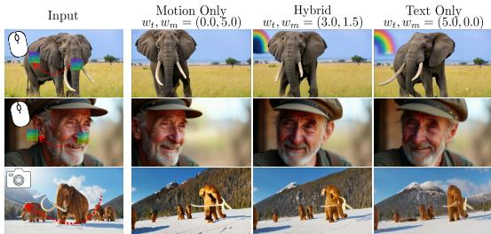

# 1. 论文基本信息

## 1.1. 标题
MotionStream: Real-Time Video Generation with Interactive Motion Controls
(MotionStream：具有交互式运动控制的实时视频生成)

## 1.2. 作者
*   Joonghyuk Shin (Adobe Research, 首尔国立大学)
*   Zhengqi Li (Adobe Research)
*   Richard Zhang (Adobe Research)
*   Jun-Yan Zhu (卡内基梅隆大学)
*   Jaesik Park (首尔国立大学)
*   Eli Shechtman (Adobe Research)
*   Xun Huang (Adobe Research)

    作者团队主要来自 **Adobe Research**，并与卡内基梅隆大学、首尔国立大学的顶尖学者合作，在生成模型和计算机视觉领域具有深厚的研究背景。

## 1.3. 发表期刊/会议
这是一篇发表在 arXiv 上的预印本论文。arXiv 是一个开放获取的学术论文预印本平台，通常用于在正式同行评审前发布最新的研究成果。虽然尚未经过正式发表，但该平台是计算机科学领域快速传播前沿思想的重要渠道。

## 1.4. 发表年份
预印本首次提交于 2025年11月3日 (根据论文元数据)。

## 1.5. 摘要
现有的运动条件视频生成方法存在延迟过高（每段视频需数分钟）和非因果处理的问题，这阻碍了实时交互。本文提出了 `MotionStream`，它在单块 GPU 上实现了亚秒级延迟，流式生成帧率高达 29 FPS。研究方法首先通过增强一个文本到视频模型，使其具备运动控制能力，从而生成能同时遵循全局文本提示和局部运动指导的高质量视频，但该模型无法实时推理。因此，作者通过“自分布匹配蒸馏（Self Forcing with Distribution Matching Distillation）”将这个<strong>双向的 (bidirectional)</strong> 教师模型蒸馏成一个<strong>因果的 (causal)</strong> 学生模型，以实现实时流式推理。在生成长时程甚至无限时长的视频时，出现了几个关键挑战：(1) 弥合在有限长度视频上训练与在无限时长上推断之间的领域鸿沟；(2) 通过防止误差累积来保持高质量；(3) 在不因上下文窗口增长而增加计算成本的情况下，维持快速推理。本文方法的关键是引入了精心设计的<strong>滑动窗口因果注意力 (sliding-window causal attention)</strong>，并结合了<strong>注意力池 (attention sinks)</strong>。通过在训练中结合带有注意力池和 KV 缓存滚动的自推演 (self-rollout)，该方法恰当地模拟了推理时使用固定上下文窗口的外推过程，从而能以恒定速度生成任意长度的视频。`MotionStream` 在运动遵循和视频质量方面取得了最先进的结果，同时速度快了两个数量级，并独特地实现了无限长度的流式生成。借助 `MotionStream`，用户可以绘制轨迹、控制相机或迁移运动，并实时看到结果展开，提供了一种真正的交互式体验。

## 1.6. 原文链接
*   **ArXiv 链接:** [https://arxiv.org/abs/2511.01266](https://arxiv.org/abs/2511.01266)
*   **PDF 链接:** [https://arxiv.org/pdf/2511.01266v2.pdf](https://arxiv.org/pdf/2511.01266v2.pdf)
*   **发布状态:** 预印本 (Preprint)。

    ---

# 2. 整体概括

## 2.1. 研究背景与动机
当前，利用运动轨迹（如用户鼠标拖拽的路径）来控制视频生成的技术已经取得了显著进展，可以让用户像导演一样指导视频中物体的运动。然而，这些技术距离真正的“交互式”体验还很遥远。

**核心问题：** 现有方法存在三大根本性制约：
1.  <strong>速度过慢 (Slow):</strong> 生成一段几秒钟的视频可能需要数分钟甚至更久。例如，论文提到 `Motion Prompting` 模型生成5秒视频需要12分钟。这种“渲染-等待”的循环极大地影响了创作效率和体验。
2.  <strong>非因果处理 (Non-causal):</strong> 主流的视频扩散模型采用<strong>双向注意力 (bidirectional attention)</strong>，意味着在生成任何一帧时，模型都需要看到整个视频序列的全部信息（包括未来的运动轨迹）。这导致用户必须先完整地规划好所有运动，然后才能开始生成，无法在生成过程中进行调整或看到部分结果。
3.  <strong>时长受限 (Short-duration):</strong> 现有模型通常只能生成几秒钟的短视频，限制了创意表达的范围。

    这三大问题共同导致了当前技术无法实现**实时、流式、可交互**的视频创作。本文的动机正是要攻克这些难题，将视频生成从一个被动的等待过程转变为一个主动的、实时的创作过程。

**创新切入点：** 本文的思路是，既然强大的双向模型无法实时，那么能否将它的“知识”<strong>蒸馏 (distill)</strong> 到一个轻量级的、能够逐帧生成的<strong>自回归 (autoregressive)</strong> 模型中？为了解决自回归模型在生成长视频时容易出现的质量下降（<strong>误差累积 (error accumulation)</strong>）和速度变慢（<strong>上下文窗口增长 (increasing context window)</strong>）的问题，本文巧妙地从大语言模型领域借鉴了 `StreamingLLM` 的核心思想——<strong>注意力池 (attention sinks)</strong>，并将其成功应用于视频生成，从而在保持高质量和恒定速度的同时，实现了无限长度的流式生成。

## 2.2. 核心贡献/主要发现
本文最主要的贡献是提出了 `MotionStream`，这是首个能够实现实时、交互式、无限时长运动控制的视频生成框架。

具体来说，其关键贡献和发现可概括为以下四点：
1.  **实现了前所未有的实时性能：** 提出了第一个能够在单块 H100 GPU 上以高达 29.5 FPS 运行的流式运动条件视频生成管线，将生成延迟从分钟级降低到亚秒级，真正实现了交互式应用。
2.  **提出了高效的协同系统设计：** 整合了多种高效的架构设计，包括轻量级的运动轨迹编码头 (`track head`)、无需 `ControlNet` 结构的条件注入方式，以及将复杂的<strong>联合文本-运动引导 (joint text-motion guidance)</strong> 成本在训练阶段“烘焙”进学生模型的技术，并通过一个微型 VAE 进一步加速解码。
3.  **首创了适用于长视频生成的蒸馏策略：** 首次系统性地将<strong>注意力池 (attention sinks)</strong> 和<strong>局部注意力 (local attention)</strong> 与<strong>外推感知训练 (extrapolation-aware training)</strong> 相结合。通过在训练中模拟推理时的滚动上下文机制，有效解决了自回归模型在生成长视频时的质量漂移问题。
4.  **在多个任务上取得SOTA结果：** 在<strong>运动迁移 (motion transfer)</strong> 和<strong>相机控制 (camera control)</strong> 等任务上，`MotionStream` 的效果达到了最先进水平，同时速度比现有方法快了几个数量级，并能稳健地泛化到各种交互式用例。

    ---

# 3. 预备知识与相关工作

## 3.1. 基础概念
### 3.1.1. 视频扩散模型 (Video Diffusion Models)
视频扩散模型是一类强大的生成模型，其工作原理可以通俗地理解为一个“去噪”过程。首先，在训练阶段，模型学习如何从一个完全是高斯噪声的视频潜空间（latent space）中，一步步地将噪声去除，最终恢复出清晰的原始视频。在推理（生成）阶段，模型从一个随机噪声开始，反复应用它学到的去噪网络，逐步生成一段全新的、高质量的视频。为了控制生成内容，通常会引入文本、图像或运动等条件信息来指导去噪过程。

### 3.1.2. 自回归模型 (Autoregressive Models, AR) 与因果注意力 (Causal Attention)
自回归模型是一种按顺序生成数据的模型。在视频生成的语境下，它会一帧一帧地生成视频，生成第 $t$ 帧时，会依赖于它已经生成的前 `t-1` 帧。这种“从过去预测未来”的模式天然适合流式生成。为了实现这一点，模型内部的注意力机制必须是<strong>因果的 (causal)</strong>，即在计算当前帧的表示时，只能“看到”（attend to）它自己和它之前的帧，而不能“看到”未来的帧。

### 3.1.3. 双向注意力 (Bidirectional Attention)
与因果注意力相对，双向注意力允许序列中的每个元素（例如视频中的每一帧）都能“看到”序列中的所有其他元素，包括过去和未来的。这使得模型能够捕捉全局依赖关系，通常能生成更高质量和更连贯的内容。但其缺点是，必须一次性处理整个序列，因此不适用于需要逐帧生成的实时流式应用。

### 3.1.4. 知识蒸馏 (Knowledge Distillation)
这是一种模型压缩技术，旨在将一个大型、复杂但性能强大的“教师模型”的知识，迁移到一个小型、轻量且推理速度快的“学生模型”中。通常的做法是，让学生模型学习模仿教师模型的输出或中间层表示。本文正是利用蒸馏，将一个高质量但缓慢的**双向注意力**教师模型，转化为一个速度极快但需要精心设计的**因果注意力**学生模型。

### 3.1.5. KV 缓存 (KV Cache)
在 Transformer 架构中，自注意力机制会计算查询（Query, Q）、键（Key, K）和值（Value, V）三个矩阵。在自回归生成时，每一新步生成的词元或帧，其 K 和 V 向量都可以被缓存下来，供后续步骤使用，而无需重新计算整个历史序列的 K 和 V。这极大地加速了自回归模型的推理速度。

## 3.2. 前人工作
### 3.2.1. 可控视频生成 (Controllable Video Generation)
*   **`ControlNet` (Zhang et al., 2023):** 是一种非常流行的技术，用于向预训练的图像/视频扩散模型添加精细的空间控制能力。它的核心思想是复制一部分预训练模型的网络块，形成一个可训练的副本，该副本专门用于处理控制信号（如边缘图、姿态骨架、运动轨迹等），然后将其输出以一种可学习的方式融入到原始模型的去噪过程中。`ControlNet` 效果很好，但代价是**计算开销翻倍**。本文为了追求极致的实时性，**特意避免了这种重型架构**。
*   **`Motion Prompting` (Geng et al., 2025):** 一种直接利用运动轨迹控制视频生成的方法，虽然质量很高，但如前所述，生成速度极慢，是本文旨在超越的典型“离线”方法。

### 3.2.2. 自回归视频模型与知识蒸馏
*   **`Self Forcing` (Huang et al., 2025b):** 一种针对自回归生成模型的训练范式。传统的自回归模型训练时，通常使用真实数据（Ground Truth）作为下一步的输入（称为 `Teacher Forcing`），但这会导致训练与推理之间的不匹配（`train-test gap`），因为推理时模型必须依赖自己之前生成的、可能不完美的输出。`Self Forcing` 通过在训练过程中进行<strong>自推演 (self-rollout)</strong>，即让模型使用自己生成的输出作为后续步骤的输入，来弥合这一差距，从而提高生成长序列时的稳定性和质量。本文的蒸馏过程正是基于 `Self Forcing` 的思想。
*   **`Distribution Matching Distillation (DMD)` (Yin et al., 2024b;a):** 一种高效的蒸馏方法，旨在让学生模型的输出分布与教师模型的输出分布相匹配。它通过训练一个判别器（或称为 `critic`）来区分学生和教师的输出，并利用这个判别器的信号来指导学生模型的训练。本文采用 DMD 作为其蒸馏的核心目标函数。

### 3.2.3. 长上下文处理与注意力池 (Attention Sinks)
*   **`StreamingLLM` (Xiao et al., 2023):** 这是大语言模型领域的一项关键工作，旨在实现对无限长文本的高效处理。其研究发现，即使在滑动窗口注意力机制中，模型对序列最开始的几个<strong>词元 (token)</strong> 也会表现出异常高的注意力权重。这些初始词元就像一个“锚点”，作者称之为<strong>注意力池 (attention sinks)</strong>。如果简单地在滑动窗口中丢弃这些初始词元，模型的性能会迅速崩溃。`StreamingLLM` 的解决方案是，在滑动窗口之外，**永久保留**最开始的几个词元在 KV 缓存中。
*   本文敏锐地观察到，在视频生成中也存在类似现象（如原文 Figure 3 所示，注意力也高度集中在视频的**第一帧**），并首次将 `Attention Sinks` 的思想引入视频生成领域，用以解决长视频生成中的漂移问题。

## 3.3. 技术演进
视频生成技术从早期的 GANs 演进到如今由扩散模型主导。在可控性方面，从简单的文本控制发展到更精细的结构、姿态、运动等多模态控制。然而，性能和实时性一直是一对矛盾。为了解决速度问题，学术界开始探索将强大的扩散模型蒸馏为快速的自回归模型。本文正是在这个技术脉络上，进一步解决了自回归模型在**长时程**和**流式**应用中的核心痛点，即稳定性和效率问题，将前沿的 LLM 架构思想（`Attention Sinks`）成功迁移并适配到了视频生成领域。

## 3.4. 差异化分析
与相关工作相比，本文的核心区别和创新在于：
*   **目标不同：** 不同于追求最高生成质量的离线方法，`MotionStream` 的首要目标是**实现实时交互**，并在此前提下优化质量。
*   **架构更轻量：** 放弃了 `ControlNet` 等重型控制结构，采用更高效的条件注入方式。
*   **蒸馏更彻底：** 不仅蒸馏了模型的生成能力，还巧妙地将教师模型中计算开销巨大的**多步联合引导**策略，“烘焙”进了学生模型单次前向传播的过程中，实现了巨大的加速。
*   **首次引入 `Attention Sinks` 到视频领域：** 这是解决长视频生成稳定性的关键创新。通过在训练和推理中都采用“初始帧锚定 + 局部滑动窗口”的注意力机制，完美解决了外推（extrapolation）时的质量下降问题，实现了恒定速度的无限长度生成。

    ---

# 4. 方法论

`MotionStream` 的整体方法论分为两个核心阶段：首先，训练一个高质量但速度慢的<strong>双向教师模型 (Bidirectional Teacher Model)</strong>；然后，通过一种特殊的蒸馏方法，将其知识迁移到一个速度极快的<strong>因果学生模型 (Causal Student Model)</strong>。

下图（原文 Figure 2）展示了模型的整体架构和训练流程。

![Figure 2: Model architecture and training pipeline. To build a teacher motion-controlled video model, we extract and randomly sample 2D tracks from the input video and encode them using a lightweight track head. The resulting track embeddings are combined with the input image, noisy video latents, and text embeddings as input to the diffusion transormer with bidirectional attention, which is then trained with a flow matching loss (top). We then distill a few-step causal diffusion model from the teacher through Self Forcing-style DMD distillation, integrating joint text-motion guidance into the objective, where autoregressive rollout with rolling KV cache and attention sink is applied during both training and inference (bottom).](images/2.jpg)
*Figure 2: Model architecture and training pipeline. To build a teacher motion-controlled video model, we extract and randomly sample 2D tracks from the input video and encode them using a lightweight track head. The resulting track embeddings are combined with the input image, noisy video latents, and text embeddings as input to the diffusion transormer with bidirectional attention, which is then trained with a flow matching loss (top). We then distill a few-step causal diffusion model from the teacher through Self Forcing-style DMD distillation, integrating joint text-motion guidance into the objective, where autoregressive rollout with rolling KV cache and attention sink is applied during both training and inference (bottom).*

## 4.1. 阶段一：构建运动可控的双向教师模型

### 4.1.1. 运动轨迹的表示与编码 (Track Representation)
为了让模型理解运动，首先需要一种高效的方式来表示和编码 2D 运动轨迹。
*   **轨迹表示：** 论文遵循 `MotionPrompting` 的方法，为视频中每个被追踪的物体点（track）分配一个唯一的 ID。这个 ID 通过<strong>正弦位置编码 (sinusoidal positional encoding)</strong> 转换成一个 $d$ 维的嵌入向量 $\phi_n$。然后，在视频的每一帧 $t$ 中，将每个可见点的嵌入向量 $\phi_n$ 放置到其对应坐标 $(x_t^n, y_t^n)$ 经过下采样后的空间位置上，形成一个运动条件特征图 $c_m$。
    $$
    c_m \left[ t, \lfloor \frac{y_t^n}{s} \rfloor, \lfloor \frac{x_t^n}{s} \rfloor \right] = v[t, n] \cdot \phi_n
    $$
    **符号解释：**
    *   $c_m$ 是最终输入给模型的运动条件特征图，其维度为 $T \times H/s \times W/s \times d$。
    *   $t$ 是时间帧索引。
    *   $(x_t^n, y_t^n)$ 是第 $n$ 个追踪点在第 $t$ 帧的坐标。
    *   $s$ 是 VAE 的空间下采样率。
    *   $v[t, n] \in \{0, 1\}$ 是一个可见性标志，表示第 $n$ 个点在第 $t$ 帧是否可见。
    *   $\phi_n$ 是第 $n$ 个追踪点的 $d$ 维嵌入向量。

*   <strong>轻量级编码头 (`Track Head`)：</strong> 与 `ControlNet` 复制大量网络层不同，`MotionStream` 设计了一个非常轻量级的编码头，它对时间维度进行 4 倍压缩，然后通过一个 $1 \times 1 \times 1$ 卷积调整通道。处理后的轨迹嵌入直接与视频的潜变量（latents）在通道维度上<strong>拼接 (concatenate)</strong>，只对 DiT 模型的第一层（patchify layer）做了微小修改，核心架构保持不变，从而极大地降低了计算开销。

### 4.1.2. 教师模型训练
*   **训练目标：** 采用<strong>修正流匹配 (rectified flow matching)</strong> 目标进行训练。这是一种先进的扩散模型训练方法。其前向过程是线性地在原始数据 $z_0$ 和高斯噪声 $z_1$ 之间进行插值：$z_t = (1-t)z_0 + tz_1$。模型 $v_\theta$ 的任务是预测从噪声 $z_t$ 指向原始数据 $z_0$ 的速度场（即 $z_1 - z_0$）。
*   **处理控制信号中断：** 在交互式应用中，用户可能会随时停止拖拽，导致运动信号突然变为零。为了让模型能正确处理这种情况（理解为物体静止或被遮挡，而非突然消失），作者在训练中引入了<strong>随机中段帧掩码 (stochastic mid-frame masking)</strong>，即以一定概率将某一段连续帧的运动信号 $c_m$ 置为零。

### 4.1.3. 联合文本与运动引导 (Joint Guidance)
为了生成既遵循精确轨迹、又具有丰富自然动态的视频，作者提出了一种<strong>联合引导 (joint guidance)</strong> 策略。它结合了<strong>无分类器引导 (Classifier-Free Guidance, CFG)</strong> 中的文本条件和运动条件。
*   **直觉：** 单纯的运动引导会使物体运动僵硬（如死板的平面移动），而单纯的文本引导虽能产生自然的次级动态（如背景变化），却无法精确遵循轨迹。联合引导旨在取二者之长。
*   **公式：** 最终的预测速度场 $\boldsymbol{\hat{v}}$ 由三部分加权组成：
    $$
    \boldsymbol{\hat{v}} = v_{\mathrm{base}} + \boldsymbol{w_t} \cdot \big( \boldsymbol{v}(c_t, c_m) - v(\emptyset, c_m) \big) + \boldsymbol{w_m} \cdot \big( \boldsymbol{v}(c_t, c_m) - v(c_t, \emptyset) \big)
    $$
    其中，基础项 $v_{\mathrm{base}} = \alpha \cdot v(\emptyset, c_m) + (1-\alpha) \cdot v(c_t, \emptyset)$，且 $\alpha = w_t / (w_t + w_m)$。（公式中省略了对噪声潜变量 $z_t$ 的依赖以求简洁）。
    **符号解释：**
    *   $\boldsymbol{v}(c_t, c_m)$ 是同时使用文本条件 $c_t$ 和运动条件 $c_m$ 时的模型预测。
    *   $v(\emptyset, c_m)$ 是只使用运动条件、不使用文本条件（用空集 $\emptyset$ 表示）时的预测。
    *   $v(c_t, \emptyset)$ 是只使用文本条件、不使用运动条件时的预测。
    *   $\boldsymbol{w_t}$ 和 $\boldsymbol{w_m}$ 分别是文本引导和运动引导的权重。
*   **代价：** 这种联合引导策略效果虽好，但每次去噪步骤需要模型进行 3 次前向传播（`3 NFE`），非常耗时，这也是为什么需要蒸馏的关键原因之一。

## 4.2. 阶段二：因果蒸馏 (Causal Distillation)

这个阶段的目标是将上述强大但缓慢的教师模型，蒸馏成一个快速、因果、能生成长视频的学生模型。

### 4.2.1. 注意力池与因果自适应 (Attention Sink & Causal Adaptation)
*   **核心洞察：** 作者通过可视化注意力图（原文 Figure 3）发现，无论是在双向模型还是因果模型中，许多注意力头都持续关注视频的**初始帧**。这与 `StreamingLLM` 在语言模型中的发现不谋而合。

    *   **解决方案：** 基于此洞察，作者将<strong>注意力池 (attention sinks)</strong> 的概念应用到视频模型中。在自回归生成时，模型不再是简单地在一个滑动的窗口内计算注意力，而是始终保留<strong>初始视频块 (initial chunks)</strong> 的 `KV` 缓存，同时维护一个滚动的<strong>局部窗口 (local window)</strong> 来处理最近的上下文。这个“初始块+局部窗口”的结构既通过锚定初始帧防止了长期生成的质量漂移，又通过固定大小的上下文窗口保证了恒定的生成速度。
    *Figure 3: Visualization of self attention probability map. We visualize attention probability maps for bidirectional, full causal, and causal sliding window attentions. Several attention heads focus on the tokens corresponding to the initial frame throughout denoising generation.*

### 4.2.2. 自分布匹配蒸馏 (Self Forcing-Style Distillation with DMD)
这是整个方法的核心。训练学生模型的过程是一个<strong>自回归推演 (autoregressive roll-out)</strong> 的过程，结合了 `Self Forcing` 和 `DMD`。
*   **自回归推演流程：**
    1.  学生模型 $G_\theta$ 将视频分成多个小块 (chunks) 进行生成。
    2.  在生成第 $i$ 个块时，它会依赖**自己之前已经生成的干净视频块**的 `KV` 缓存，而不是依赖真实的视频数据。
    3.  其注意力上下文 $\mathcal{C}_i$ 由三部分组成：当前正在处理的噪声块 $\{z_t^i\}$、固定的**注意力池**块 $\{z_0^j\}_{j \le S}$、以及滚动的**局部窗口**块 $\{z_0^j\}_{\max(1, i-W) \le j < i}$。
    *   $S$ 是注意力池的大小（包含的块数）。
    *   $W$ 是局部窗口的大小。
*   **DMD 目标函数：** 在学生模型生成了完整的视频序列 $\hat{z}_0$ 后，使用 DMD 目标来更新模型参数 $\theta$。DMD 的梯度直观上来自于“真实分数”和“伪造分数”之间的差异，它驱动学生模型的生成分布去逼近教师模型的分布。
    $$
    \nabla_{\boldsymbol{\theta}} \mathcal{L}_{\mathrm{DMD}} \approx - \mathbb{E}_{t, \hat{z}_0} \left[ \left( s_{\mathrm{real}} \big( \Psi(\hat{z}_0, t) \big) - s_{\mathrm{fake}} \big( \Psi(\hat{z}_0, t) \big) \right) \cdot \frac{\partial \hat{z}_0}{\partial \boldsymbol{\theta}} \right]
    $$
    **符号解释：**
    *   $\hat{z}_0$ 是学生模型生成的完整视频序列。
    *   $\Psi(\hat{z}_0, t)$ 是对 $\hat{z}_0$ 添加噪声后的版本。
    *   $s_{\mathrm{real}}$ 是真实数据分布的分数函数 (score function)，由**冻结的教师模型**来近似。
    *   $s_{\mathrm{fake}}$ 是学生模型生成数据分布的分数函数，由一个可训练的<strong>评价网络 (critic)</strong> $f_\psi$ 来近似。
    *   $\frac{\partial \hat{z}_0}{\partial \boldsymbol{\theta}}$ 是通过反向传播计算的梯度，将分数差异传递给学生模型的参数。

*   <strong>“烘焙”</strong>联合引导： 这是最巧妙的一步。为了让学生模型学到教师模型昂贵的联合引导效果，同时自身只需一次前向传播，作者将联合引导的计算完全放在了 $s_{\mathrm{real}}$ 的定义中：
    $$
    s_{\mathrm{real}} = s_{\mathrm{base}} + w_t \cdot (f_{\phi}(c_t, c_m) - f_{\phi}(\emptyset, c_m)) + w_m \cdot (f_{\phi}(c_t, c_m) - f_{\phi}(c_t, \emptyset))
    $$
    其中 $f_\phi$ 是冻结的教师模型。而 $s_{\mathrm{fake}}$ 则被定义为一个简单的、无任何引导的单次评估：
    $$
    s_{\mathrm{fake}} = f_{\psi}(\overline{c_t}, \overline{c_m})
    $$
    通过这种方式，DMD 损失会迫使学生模型 $G_\theta$（其分数由 $f_\psi$ 近似）的单次输出，在效果上等同于教师模型经过 3 次评估和复杂加权后的结果。这就将计算成本从推理时转移到了训练时的损失函数中，实现了巨大的效率提升。

---

# 5. 实验设置

## 5.1. 数据集
*   **训练数据集：**
    *   **`OpenVid-1M`:** 一个大规模的真实世界视频数据集。作者筛选了其中约 60 万个长度超过 81 帧、宽高比为 16:9 的视频。
    *   **合成数据集:** 使用更强大的 `Wan` 系列文生视频模型生成的高质量、内容干净的视频。`Wan 2.1` 模型使用了 7 万个 480p 样本，`Wan 2.2` 模型使用了 3 万个 720p 样本。
*   **评估数据集：**
    *   **`DAVIS` (validation set):** 一个经典的视频对象分割基准数据集，包含 30 个视频。这些视频场景复杂，常有物体被遮挡，用于测试模型的鲁棒性。
    *   **`Sora` Demo Subset:** 从 OpenAI Sora 模型的展示页面上精选的 20 个视频。这些视频质量高、运动清晰、可见性好，用于评估模型的最佳性能。
    *   **`LLFF`:** 用于评估<strong>新视角合成 (novel view synthesis)</strong> 的数据集，作者用它来测试模型的零样本相机控制能力。

## 5.2. 评估指标
## 5.2.1. PSNR (Peak Signal-to-Noise Ratio)
*   **概念定义:** **峰值信噪比**是衡量图像或视频质量的常用客观指标。它通过计算原始图像与生成（或压缩）图像之间对应像素值的均方误差（MSE）来评估失真程度。PSNR 值越高，表示生成图像与原始图像越接近，质量越好。它以分贝（dB）为单位。
*   **数学公式:**
    $$
    \mathrm{PSNR} = 10 \cdot \log_{10}\left(\frac{\mathrm{MAX}_I^2}{\mathrm{MSE}}\right)
    $$
    其中，均方误差 MSE 的计算公式为：
    $$
    \mathrm{MSE} = \frac{1}{m \cdot n} \sum_{i=0}^{m-1} \sum_{j=0}^{n-1} [I(i,j) - K(i,j)]^2
    $$
*   **符号解释:**
    *   $\mathrm{MAX}_I$ 是图像像素值的最大可能值（例如，对于 8 位灰度图像，它是 255）。
    *   `m, n` 分别是图像的高度和宽度。
    *   `I(i,j)` 是原始图像在坐标 `(i,j)` 处的像素值。
    *   `K(i,j)` 是生成图像在坐标 `(i,j)` 处的像素值。

## 5.2.2. SSIM (Structural Similarity Index Measure)
*   **概念定义:** **结构相似性指数**是一种衡量两幅图像相似度的指标，它比 PSNR 更符合人眼的视觉感知。SSIM 不仅仅比较像素值的差异，还综合评估了亮度、对比度和结构三个方面的信息。其取值范围在 -1 到 1 之间，值越接近 1，表示两幅图像在结构上越相似。
*   **数学公式:**
    $$
    \mathrm{SSIM}(x,y) = \frac{(2\mu_x\mu_y + c_1)(2\sigma_{xy} + c_2)}{(\mu_x^2 + \mu_y^2 + c_1)(\sigma_x^2 + \sigma_y^2 + c_2)}
    $$
*   **符号解释:**
    *   `x, y` 是待比较的两个图像块。
    *   $\mu_x, \mu_y$ 是图像块 `x, y` 的平均亮度。
    *   $\sigma_x^2, \sigma_y^2$ 是图像块 `x, y` 的方差（对比度）。
    *   $\sigma_{xy}$ 是图像块 `x, y` 的协方差（结构相似性）。
    *   $c_1, c_2$ 是为了避免分母为零的稳定常数。

## 5.2.3. LPIPS (Learned Perceptual Image Patch Similarity)
*   **概念定义:** **学习感知图像块相似度**是一种利用深度神经网络来衡量图像相似度的指标。它通过比较两张图片在预训练深度网络（如 VGG, AlexNet）中提取出的特征向量的距离，来判断它们的感知相似性。LPIPS 被认为比 PSNR 和 SSIM 更能捕捉人类对图像质量的主观感受。LPIPS 值越低，表示两张图片在感知上越相似。
*   **数学公式:**
    $$
    d(x, x_0) = \sum_l \frac{1}{H_l W_l} \sum_{h,w} \left\| w_l \odot (\hat{y}_{hw}^l - \hat{y}_{0hw}^l) \right\|_2^2
    $$
*   **符号解释:**
    *   $d(x, x_0)$ 是图像 $x$ 和 $x_0$ 之间的 LPIPS 距离。
    *   $l$ 表示网络的第 $l$ 个卷积层。
    *   $\hat{y}^l, \hat{y}_0^l$ 是从第 $l$ 层提取的特征图，经过归一化处理。
    *   $H_l, W_l$ 是第 $l$ 层特征图的高度和宽度。
    *   $w_l$ 是一个可学习的权重，用于缩放不同通道的重要性。
    *   $\odot$ 表示逐元素相乘。

## 5.2.4. EPE (End-Point Error)
*   **概念定义:** **端点误差**是评估运动估计（如光流或轨迹跟踪）准确性的标准指标。它计算的是预测的运动终点与真实的运动终点之间的欧几里得距离。在本文中，它被用来衡量生成的视频中有多少精确地遵循了输入的运动轨迹。EPE 值越低，表示运动遵循得越准确。
*   **数学公式:**
    $$
    \mathrm{EPE} = \sqrt{(x_{pred} - x_{gt})^2 + (y_{pred} - y_{gt})^2}
    $$
*   **符号解释:**
    *   $(x_{pred}, y_{pred})$ 是模型生成的视频中，追踪点的预测坐标。
    *   $(x_{gt}, y_{gt})$ 是输入的真实轨迹中，追踪点的目标坐标。

## 5.3. 对比基线
论文将 `MotionStream` 与一系列最先进的运动控制视频生成模型进行了比较：
*   **运动迁移任务基线:** `Image Conductor`, `Go-With-The-Flow`, `Diffusion-As-Shader`, `ATI`。这些模型代表了当前领域内不同技术路线的高水平方法。
*   **新视角合成任务基线:** `DepthSplat`, `ViewCrafter`, `SEVA`。这些是专门用于从单张图片生成新视角的 3D 或 2.5D 方法。

    ---

# 6. 实验结果与分析

## 6.1. 核心结果分析
## 6.1.1. 运动迁移 (Motion Transfer)
以下是原文 Table 1 的结果，比较了 `MotionStream` 与其他基线在 DAVIS 和 Sora 数据集上的表现。

<table>
<thead>
<tr>
<th rowspan="2">Method</th>
<th rowspan="2">Backbone & Resolution</th>
<th rowspan="2">FPS</th>
<th colspan="4">DAVIS Validation Set</th>
<th colspan="4">Sora Demo Subset</th>
</tr>
<tr>
<th>PSNR</th>
<th>SSIM</th>
<th>LPIPS</th>
<th>EPE</th>
<th>PSNR</th>
<th>SSIM</th>
<th>LPIPS</th>
<th>EPE</th>
</tr>
</thead>
<tbody>
<tr>
<td>Image Conductor (Li et al., 2025d)</td>
<td>AnimateDiff (256P)</td>
<td>2.98</td>
<td>11.30</td>
<td>0.214</td>
<td>0.664</td>
<td>91.64</td>
<td>10.29</td>
<td>0.192</td>
<td>0.644</td>
<td>31.22</td>
</tr>
<tr>
<td>Go-With-The-Flow Burgert et al. (2025)</td>
<td>CogVideoX-5B (480P)</td>
<td>0.60</td>
<td>15.62</td>
<td>0.392</td>
<td>0.490</td>
<td>41.99</td>
<td>14.59</td>
<td>0.410</td>
<td>0.425</td>
<td>10.27</td>
</tr>
<tr>
<td>Diffusion-As-Shader (Gu et al., 2025b)</td>
<td>CogVideoX-5B (480P)</td>
<td>0.29</td>
<td>15.80</td>
<td>0.372</td>
<td>0.483</td>
<td>40.23</td>
<td>14.51</td>
<td>0.382</td>
<td>0.437</td>
<td>18.76</td>
</tr>
<tr>
<td>ATI (Wang et al., 2025b)</td>
<td>Wan 2.1-14B (480P)</td>
<td>0.23</td>
<td>15.33</td>
<td>0.374</td>
<td>0.473</td>
<td>17.41</td>
<td>16.04</td>
<td>0.502</td>
<td>0.366</td>
<td>6.12</td>
</tr>
<tr>
<td>Ours Teacher (Joint CFG)</td>
<td>Wan 2.1-1.3B (480P)</td>
<td>0.79</td>
<td>16.61</td>
<td>0.477</td>
<td>0.427</td>
<td>5.35</td>
<td>17.82</td>
<td>0.586</td>
<td>0.333</td>
<td>2.71</td>
</tr>
<tr>
<td>Ours Causal (Distilled)</td>
<td>Wan 2.1-1.3B (480P)</td>
<td>16.7</td>
<td>16.20</td>
<td>0.447</td>
<td>0.443</td>
<td>7.80</td>
<td>16.67</td>
<td>0.531</td>
<td>0.360</td>
<td>4.21</td>
</tr>
<tr>
<td>Ours Teacher (Joint CFG)</td>
<td>Wan 2.2-5B (720P)</td>
<td>0.74</td>
<td>16.10</td>
<td>0.466</td>
<td>0.427</td>
<td>7.86</td>
<td>17.18</td>
<td>0.571</td>
<td>0.331</td>
<td>3.16</td>
</tr>
<tr>
<td>Ours Causal (Distilled)</td>
<td>Wan 2.2-5B (720P)</td>
<td>10.4</td>
<td>16.30</td>
<td>0.456</td>
<td>0.438</td>
<td>11.18</td>
<td>16.62</td>
<td>0.545</td>
<td>0.343</td>
<td>4.30</td>
</tr>
</tbody>
</table>

**分析：**
*   <strong>速度 (FPS):</strong> `MotionStream` 的蒸馏后模型 (`Ours Causal`) 实现了 **10.4 ~ 16.7 FPS** 的惊人速度，比所有基线模型（最快的 `Image Conductor` 为 2.98 FPS，其他均低于 1 FPS）快了 **1-2个数量级**。这证明了其作为实时交互工具的可行性。
*   <strong>质量 (PSNR, SSIM, LPIPS):</strong> 尽管速度极快，蒸馏后模型的生成质量与强大的教师模型 (`Ours Teacher`) 非常接近，并且在所有质量指标上都全面优于或持平于其他所有基线方法。
*   <strong>运动遵循精度 (EPE):</strong> `MotionStream` 的教师模型在 EPE 指标上取得了最佳结果，尤其是在 Sora 数据集上（2.71），远超其他方法。蒸馏后的学生模型 EPE 略有上升，但仍然显著优于除 ATI 之外的所有基线，表明其在高速生成的同时保持了极高的运动控制精度。

## 6.1.2. 相机控制 (新视角合成)
以下是原文 Table 2 的结果，评估模型在 LLFF 数据集上的零样本新视角合成能力。

<table>
<thead>
<tr>
<th rowspan="2">Method</th>
<th rowspan="2">Resolution</th>
<th rowspan="2">FPS</th>
<th colspan="3">LLFF</th>
</tr>
<tr>
<th>PSNR</th>
<th>SSIM</th>
<th>LPIPS</th>
</tr>
</thead>
<tbody>
<tr>
<td>DepthSplat (Xu et al., 2025)</td>
<td>576P</td>
<td>1.40</td>
<td>13.9</td>
<td>0.28</td>
<td>0.30</td>
</tr>
<tr>
<td>ViewCrafter (Yu et al., 2024)</td>
<td>576P</td>
<td>0.26</td>
<td>14.0</td>
<td>0.30</td>
<td>0.30</td>
</tr>
<tr>
<td>SEVA (Yu et al., 2024)</td>
<td>576P</td>
<td>0.20</td>
<td>14.1</td>
<td>0.30</td>
<td>0.29</td>
</tr>
<tr>
<td>Ours Teacher (1.3B)</td>
<td>480P</td>
<td>0.79</td>
<td>16.0</td>
<td>0.42</td>
<td>0.21</td>
</tr>
<tr>
<td>Ours Causal (1.3B)</td>
<td>480P</td>
<td>16.7</td>
<td>15.7</td>
<td>0.38</td>
<td>0.23</td>
</tr>
<tr>
<td>Ours Teacher (5B)</td>
<td>720P</td>
<td>0.74</td>
<td>14.0</td>
<td>0.40</td>
<td>0.22</td>
</tr>
<tr>
<td>Ours Causal (5B)</td>
<td>720P</td>
<td>10.4</td>
<td>15.0</td>
<td>0.39</td>
<td>0.23</td>
</tr>
</tbody>
</table>

**分析：**
*   `MotionStream` 作为一个通用的运动控制模型，尽管没有针对 3D 新视角合成任务进行专门训练，但其性能**远超**所有专门为此设计的基线方法。这表明其学习到的运动-视频生成能力具有很强的泛化性。
*   同样，蒸馏后的因果模型在速度上实现了巨大飞跃（例如，1.3B 版本从 0.79 FPS 提升到 16.7 FPS），同时质量指标仅有微小下降，再次验证了蒸馏策略的成功。

## 6.2. 消融实验/参数分析
## 6.2.1. 注意力池和窗口大小的影响
这是验证长视频生成稳定性的核心实验。作者在长达 241 帧的视频上测试了不同注意力池大小 (sink size, $s$) 和局部窗口大小 (window size, $w$) 的组合。

<strong>分析 (原文 Figure 6):</strong>
*   **注意力池至关重要:** 从图中可以看出，只要有**至少一个**注意力池块（sink size > 0），模型的性能就比没有池（sink size = 0）要好得多。这证明了初始帧作为“锚点”对于防止长期漂移的关键作用。
*   **更多的池帮助不大:** 增加注意力池的数量（从1个增加到2个或更多）带来的收益非常微小，但会增加计算延迟。
*   **更大的窗口反而有害:** 令人惊讶的是，增加局部窗口的大小（$w$ 从 1 增加到 3 或 6）**反而降低了性能**。作者推测，这是因为更大的窗口会让模型看到更久远的历史，而这些历史信息中可能已经包含了累积的误差，从而对当前帧的生成造成干扰。
*   **最佳配置:** 实验表明，**`c3s1w1`**（块大小为3，池大小为1，窗口大小为1）是最佳配置，它在质量、稳定性和速度之间取得了最好的平衡。

## 6.2.2. 联合引导策略的效果
下图（原文 Figure 5）直观展示了不同引导策略的差异。

**分析：**
*   <strong>纯运动引导 (`Motion Guidance Only`):</strong> 大象被死板地沿着轨迹平移，失去了立体感和自然的动态。
*   <strong>纯文本引导 (`Text Guidance Only`):</strong> 遵循了文本提示“彩虹出现在背景中”，但大象的运动与轨迹偏离较大。
*   <strong>联合引导 (`Hybrid Guidance`):</strong> 完美地结合了两者的优点，大象精确地沿着轨迹移动，同时身体姿态自然，背景也出现了彩虹。这证明了联合引导策略的有效性。

## 6.2.3. Tiny VAE 的加速效果
为了解决 VAE 解码器成为流式生成瓶颈的问题，作者训练了一个微型的 VAE 解码器 (`Tiny VAE`)。

以下是原文附录 Table A2 的结果：

<table>
<thead>
<tr>
<th>Model</th>
<th>Throughput (FPS)</th>
<th>Latency (s)</th>
<th>PSNR</th>
<th>SSIM</th>
<th>LPIPS</th>
</tr>
</thead>
<tbody>
<tr>
<td>Full VAE (Wan 2.1)</td>
<td>16.7</td>
<td>0.69</td>
<td>16.67</td>
<td>0.531</td>
<td>0.360</td>
</tr>
<tr>
<td>Tiny VAE (Wan 2.1, Ours)</td>
<td>29.5</td>
<td>0.39</td>
<td>16.68</td>
<td>0.528</td>
<td>0.365</td>
</tr>
<tr>
<td>Full VAE (Wan 2.2, 5B)</td>
<td>10.4</td>
<td>1.14</td>
<td>16.62</td>
<td>0.545</td>
<td>0.343</td>
</tr>
<tr>
<td>Tiny VAE (Wan 2.2, Ours)</td>
<td>23.9</td>
<td>0.49</td>
<td>16.62</td>
<td>0.543</td>
<td>0.349</td>
</tr>
</tbody>
</table>

**分析：**
*   使用 `Tiny VAE` 后，`Wan 2.1` 模型的吞吐量从 16.7 FPS **大幅提升至 29.5 FPS**，延迟从 0.69s **降低至 0.39s**。
*   `Wan 2.2` 模型也从 10.4 FPS **提升至 23.9 FPS**，延迟从 1.14s **降低至 0.49s**。
*   最重要的是，这种巨大的速度提升几乎**没有带来任何可察觉的质量损失**（PSNR, SSIM, LPIPS 指标基本不变）。这证明 `Tiny VAE` 是一个极其有效的优化手段。

    ---

# 7. 总结与思考

## 7.1. 结论总结
本文成功地提出了 `MotionStream`，一个开创性的框架，它首次将运动控制视频生成带入了**实时、流式、无限时长**的交互时代。通过巧妙地结合**高效架构设计**、**知识蒸馏**以及从大语言模型中借鉴并改造的**注意力池**和**滚动 KV 缓存**机制，`MotionStream` 在保持最先进生成质量的同时，将生成速度提升了两个数量级。它不仅在标准的运动迁移和相机控制任务上取得了卓越成果，更重要的是，它为视频创作提供了一种全新的、即时反馈的交互范式，极大地解放了创作者的生产力。

## 7.2. 局限性与未来工作
论文作者坦诚地指出了当前方法的几个局限性：
1.  **无法处理完整场景切换：** 由于采用了固定的**注意力池**来锚定初始帧，模型在处理需要彻底改变场景的视频（例如游戏引擎中的连续环境变化）时会遇到困难，它会倾向于保留初始场景的特征，而不是适应全新的环境。
2.  **对极端运动的鲁棒性不足：** 当输入的运动轨迹过快或不符合物理规律时，生成的视频可能会出现伪影或物体变形。
3.  **复杂场景下的细节保持能力：** 在处理包含多个复杂物体、精细纹理或多个人物的场景时，模型有时难以完美保留所有源图像的细节，这主要受限于主干网络的容量。

    未来的工作可以探索**动态注意力池**策略（例如，在检测到场景切换时自适应地更新“锚点”帧），以及通过更好的训练数据增强和更大规模的主干网络来提升模型的鲁棒性和细节保真度。

## 7.3. 个人启发与批判
这篇论文给我带来了深刻的启发，其方法论和实验设计都堪称典范。
*   **跨领域思想迁移的典范：** 本文最亮眼之处在于成功地将大语言模型（LLM）领域用于处理长序列的 `StreamingLLM` 核心思想（`Attention Sinks`）迁移到了视频生成领域。这表明不同模态的生成模型在底层架构和挑战上具有共通性，跨领域的借鉴和融合是推动技术突破的重要源泉。
*   **系统工程与算法创新的结合：** `MotionStream` 的成功不仅仅依赖于某一个单一的算法创新，而是整个系统协同设计的结果。从轻量级的编码头，到蒸馏时“烘焙”引导策略的巧思，再到 `Tiny VAE` 的工程优化，每一步都为最终的实时性能做出了贡献。这体现了顶尖研究工作不仅要有深刻的理论洞察，还要有卓越的系统实现能力。
*   **对“实时交互”价值的深刻理解：** 论文的出发点非常明确，即解决现有技术的“非交互性”痛点。所有的技术选择都围绕着这一核心目标展开，即使这意味着在某些方面做出权衡（例如，用固定的注意力池换取稳定性，牺牲了处理场景切换的灵活性）。这种以应用为导向的研究思路非常值得学习。

**批判性思考：**
*   **固定注意力池的权衡：** 正如作者所言，固定的 `Attention Sink` 是一个双刃剑。它极大地增强了长视频生成的稳定性，但也锁死了模型的“世界观”，使其难以成为一个真正的、能够探索动态世界的“世界模型”。这一定程度上限制了其在某些前沿应用（如模拟仿真、游戏生成）中的潜力。
*   **对合成数据的依赖：** 模型在第二阶段的微调和蒸馏阶段高度依赖高质量的合成数据。虽然这提升了最终效果，但也引发了一个问题：该方法的性能上限在多大程度上受限于用于生成合成数据的更强大模型的性能？这是否会形成一种“技术依赖”？
*   **运动表示的局限性：** 当前的 2D 稀疏轨迹表示法虽然高效，但在表达复杂的非刚性形变、三维旋转或物体交互方面能力有限。例如，让一个人“打开门”而不是“穿过门”，或者让一只猫“从盒子里跳出来”而不是“平移出盒子”，这些复杂的语义动作很难仅通过点轨迹来精确描述。未来的工作可能需要探索更丰富的运动表示方法。

    总而言之，`MotionStream` 是一项里程碑式的工作，它不仅在技术上取得了重大突破，更重要的是为视频内容创作的未来指明了一个清晰的、以交互为核心的发展方向。