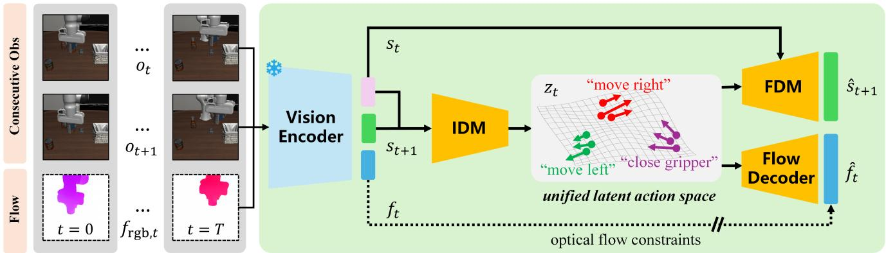
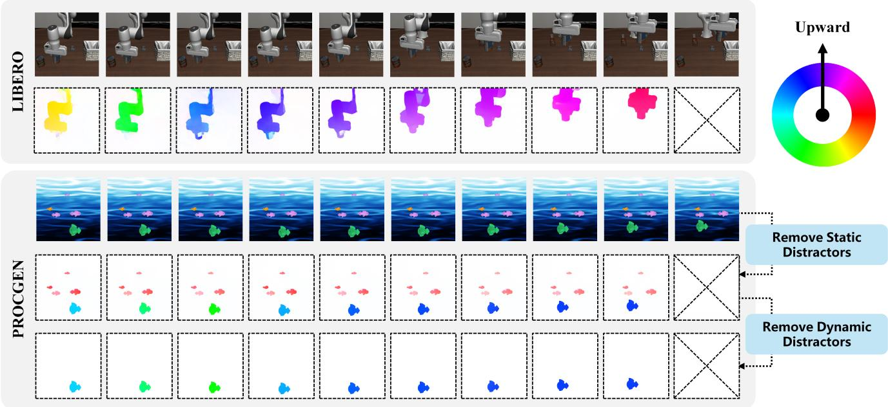
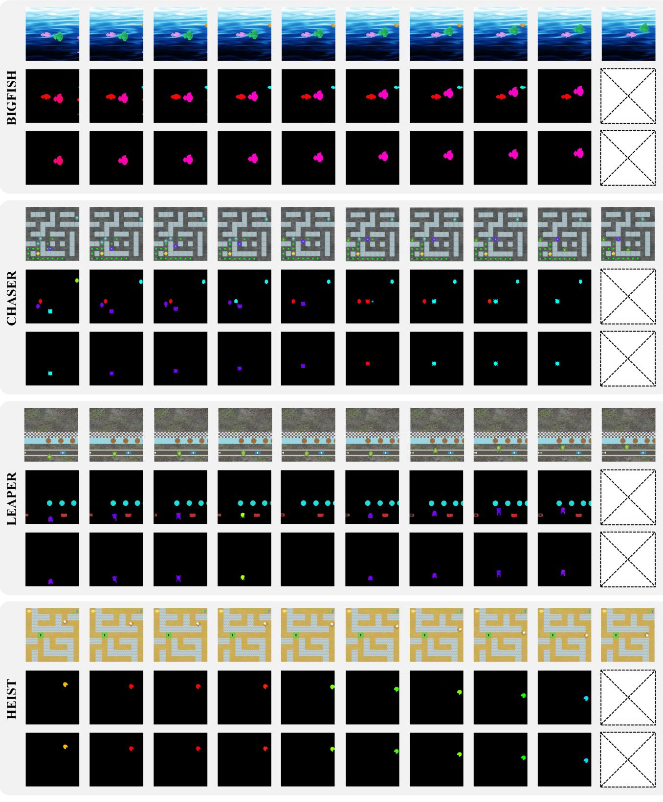
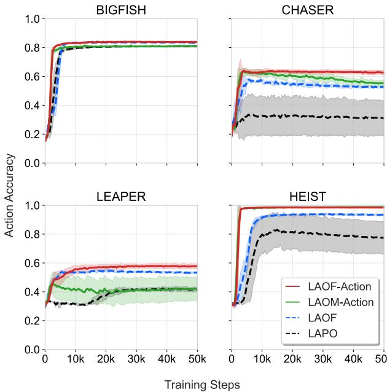
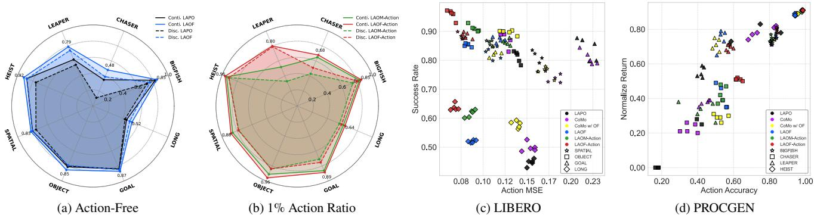

# 1. 论文基本信息

## 1.1. 标题
**LAOF: Robust Latent Action Learning with Optical Flow Constraints**
（LAOF：基于光流约束的鲁棒隐式动作学习）

## 1.2. 作者
Xizhou Bu, Jiexi Lyu, Fulei Sun, Ruichen Yang, Zhiqiang Ma, Wei Li。作者分别隶属于复旦大学和西北工业大学。

## 1.3. 发表期刊/会议
该论文发布于 **ArXiv** 预印本平台（发表时间为 2024 年 11 月 20 日），属于具身智能（Embodied AI）和计算机视觉领域的前沿研究。

## 1.4. 发表年份
2024 年（标注的 UTC 时间为 2025-11-20，根据 ArXiv 编号 2411.16407 推断其实际发布年份为 2024 年）。

## 1.5. 摘要
从大规模视频中学习 <strong>隐式动作 (Latent Actions)</strong> 对预训练可扩展的具身基础模型至关重要，但现有方法常受动作无关干扰物（Distractors）的影响。本文提出了一种名为 **LAOF** 的伪监督框架，利用智能体的 <strong>光流 (Optical Flow)</strong> 作为动作驱动信号。光流能自然抑制背景并突出移动物体。实验证明，LAOF 在下游模仿学习和强化学习任务中优于现有方法，即使在无动作标注的情况下，其表现也能匹配甚至超越仅有 1% 标注的监督方法。

## 1.6. 原文链接
- **PDF 链接:** [https://arxiv.org/pdf/2511.16407v1](https://arxiv.org/pdf/2511.16407v1)
- **ArXiv 链接:** [https://arxiv.org/abs/2511.16407](https://arxiv.org/abs/2511.16407)
- **代码仓库:** [https://github.com/XizoB/LAOF](https://github.com/XizoB/LAOF)

  ---

# 2. 整体概括

## 2.1. 研究背景与动机
在具身智能领域，直接从互联网上的海量视频中学习如何行动是构建通用机器人的关键。然而，这些视频通常缺乏显式的 <strong>动作标签 (Action Labels)</strong>（如电机转动的具体数值）。
*   **核心问题:** 现有的隐式动作学习方法（如 LAPO）假设视频中所有的变化都是由智能体的动作引起的。但在真实世界中，视频里可能有移动的背景、光影变化或其他干扰物。
*   **挑战:** 如果仅靠重建图像来学习，模型容易把背景的波动误认为是动作，导致学习到的隐式动作与真实的物理运动脱节。
*   **创新思路:** 利用 <strong>光流 (Optical Flow)</strong>。光流记录了像素在前后帧之间的运动矢量，它天生就能过滤掉静止背景，聚焦在移动物体（通常是机器人手臂或受控物体）上。本文将光流作为一种“天然的伪标签”来约束隐式动作的学习。

## 2.2. 核心贡献/主要发现
1.  **提出 LAOF 框架:** 引入光流约束作为伪监督信号，使隐式动作表示对干扰物更具鲁棒性。
2.  **动作稀缺下的稳定性:** 证明了在动作标签极度匮乏（如 0% 到 10%）的情况下，光流约束能显著稳定训练并提升性能。
3.  **超越弱监督:** 发现即便完全不使用动作标签，LAOF 的效果也能达到或超过使用 1% 动作标签进行监督的传统方法。
4.  **架构探索:** 通过消融实验确定了将独立的光流解码器直接挂载在隐式动作上的结构是最优的。

    ---

# 3. 预备知识与相关工作

## 3.1. 基础概念
*   <strong>隐式动作 (Latent Action):</strong> 在没有真实动作标签时，通过编码视频前后帧的变化，模型自主“悟”出的一个代表动作的低维向量。
*   <strong>逆动力学模型 (Inverse Dynamics Model, IDM):</strong> 输入当前帧和下一帧，预测这两帧之间发生了什么动作。
*   <strong>正动力学模型 (Forward Dynamics Model, FDM):</strong> 给定当前状态和动作，预测下一帧的状态。
*   <strong>光流 (Optical Flow):</strong> 描述图像中像素点随时间移动的速度和方向。比如手往右移，手部区域的光流向量就指向右侧。

## 3.2. 前人工作
*   **LAPO (Latent Action Policies):** 这一范式的核心是利用自动编码器结构：IDM 提取隐式动作 $z$，FDM 利用 $z$ 重建下一帧。其核心公式为重建误差：
    $$\mathcal{L}_{rec} = \| \hat{s}_{t+1} - s_{t+1} \|^2$$
*   **LAOM:** 发现加入少量真实动作监督能极大缓解干扰物问题，但在标签极少时容易 <strong>过拟合 (Overfitting)</strong>。

## 3.3. 技术演进与差异化
传统的隐式动作学习完全依赖图像像素的重建，而像素包含大量的纹理、光照等非运动信息。LAOF 的差异化在于引入了物理运动的先验——光流，强制隐式动作必须能解释像素级的物理位移，而不仅仅是像素值的变化。

---

# 4. 方法论

## 4.1. 方法原理
LAOF 的核心思想是：<strong>隐式动作向量 $z_t$ 应该不仅能预测下一帧的特征，还应该能解码出当前帧到下一帧的像素级位移（即光流）</strong>。

## 4.2. 核心方法详解 (逐层深入)

### 4.2.1. 模型整体架构
下图（原文 Figure 1）展示了 LAOF 的整体流程：

1.  **状态编码:** 连续观测 $(o_t, o_{t+1})$ 以及对应的光流图 $f_{rgb,t}$ 被编码进特征空间 $s_t, s_{t+1}, f_t$。这里使用了预训练的 `DINOv2` 作为视觉编码器。
2.  **隐式动作推断:** <strong>逆动力学模型 (IDM)</strong> 接收 $s_t$ 和 $s_{t+1}$，推断出隐式动作 $z_t$：
    $$z_t \sim p_{IDM}(z_t | s_t, s_{t+1})$$
3.  **多头监督:** 
    *   <strong>正动力学模型 (FDM)</strong> 接收 $s_t$ 和 $z_t$，预测下一时刻状态 $\hat{s}_{t+1}$。
    *   <strong>光流解码器 (Flow Decoder)</strong> 接收 $z_t$，预测当前时刻的光流特征 $\hat{f}_t$。

### 4.2.2. 损失函数与优化目标
模型通过最小化以下组合损失进行端到端预训练：
1.  <strong>下一帧重建损失 (Reconstruction Loss):</strong> 确保 $z_t$ 包含完成状态转换所需的信息。
    $$\mathcal{L}_{reconstruction}(t) := \| \hat{s}_{t+1} - s_{t+1} \|_2$$
2.  <strong>光流约束损失 (Optical Flow Loss):</strong> 强制 $z_t$ 必须能还原物理运动。
    $$\mathcal{L}_{flow}(t) := \| \hat{f}_t - \bar{f}_t \|_2$$
    其中 $\bar{f}_t$ 是由预训练的光流模型（如 `RAFT`）生成的伪标签。

**总预训练损失公式:**
$$\mathcal{L}_{pretrain} = \mathcal{L}_{reconstruction} + \mathcal{L}_{flow}$$

### 4.2.3. LAOF-Action：结合稀疏动作监督
在有少量真实动作标签 $a_t$ 的情况下，LAOF 扩展为 LAOF-Action。除了上述损失，还加入了一个 <strong>动作解码器 (Action Decoder)</strong>，其损失函数为：
$$\mathcal{L}_{action} := \| d_{action}(\hat{a}_t | z_t) - a_t \|_2$$

**混合监督公式:**
$${ \mathcal { L } } _ { \mathrm { p r e t r a i n } } = { \mathcal { L } } _ { \mathrm { r e c o n s t r u c t i o n } } + ( 1 - \lambda ) \cdot { \mathcal { L } } _ { \mathrm { f l o w } } + \lambda \cdot { \mathcal { L } } _ { \mathrm { a c t i o n } }$$
其中 $\lambda$ 是一个平衡系数，通常设为标注数据在总数据中的占比。

### 4.2.4. 光流的 RGB 格式化与物体中心化
为了让光流能通过 `DINOv2` 等视觉模型处理，作者将二维的光流向量 `(u, v)` 转换为 RGB 图像。
*   **转换逻辑:** 运动方向映射为色调 (Hue)，运动幅度映射为饱和度 (Saturation) 和明度 (Value)。幅度归一化公式为：
    $$m_{norm} = \min \left( 1.0, \frac{m}{\sigma \cdot \sqrt{H^2 + W^2}} \right)$$
    其中 $m$ 是原始模长，$\sigma$ 是敏感度因子。

为了应对动态背景，作者还引入了 <strong>物体中心化光流 (Object-Centric Optical Flow)</strong>，利用 `LangSAM` 根据文本提示（如“机器人手臂”）生成掩码，只保留目标物体的运动信息，见下图（原文 Figure 2）：

---

# 5. 实验设置

## 5.1. 数据集
1.  **LIBERO:** 机器人操作多任务基准。包含四个子集（SPATIAL, OBJECT, GOAL, LONG），每个子集有 10 个任务。
2.  **PROCGEN:** 过程生成的游戏环境，具有强烈的干扰物（如移动的背景鱼、随机变化的颜色）。
    *   **样本示例:** 如下表 Figure 7 所示（原文 Figure 7），PROCGEN 中的任务包含复杂的动态背景。

        

## 5.2. 评估指标
1.  <strong>均方误差 (Mean Squared Error, MSE):</strong> 衡量预测动作与真实动作在连续空间中的偏离程度。
    $$\mathbf{MSE} = \frac{1}{M} \sum_{i=1}^{M} \| \hat{a}_i - a_i \|_2$$
2.  <strong>分类准确率 (Accuracy, Acc):</strong> 用于离散动作任务。
    $$\mathrm{Acc} = \frac{1}{M} \sum_{i=1}^{M} \mathbb{1} [ \hat{a}_i = a_i ]$$
3.  <strong>成功率 (Success Rate):</strong> 机器人完成任务的频率。
4.  <strong>标准化回报 (Normalized Return):</strong> 强化学习任务中的累积奖励。

## 5.3. 对比基线
*   **LAPO:** 原始隐式动作学习基线，无额外约束。
*   **CoMo:** 使用帧间差分代替未来帧输入 IDM，试图缓解捷径学习。
*   **LAOM-Action:** 仅使用稀疏动作监督的对比方法。

    ---

# 6. 实验结果与分析

## 6.1. 核心结果分析
实验结果表明，LAOF 在各项指标上均显著超过基线。特别是在 LIBERO 任务中，LAOF 在没有动作标签的情况下，MSE 甚至低于一些有标签的方法。

以下是原文 **Table 1** 在 LIBERO 任务上的结果对比（评估在 1% 动作比例下）：

<table>
<thead>
<tr>
<th rowspan="2">Method</th>
<th colspan="2">SPATIAL</th>
<th colspan="2">OBJECT</th>
<th colspan="2">GOAL</th>
<th colspan="2">LONG</th>
<th colspan="2">Avg. Impr.</th>
</tr>
<tr>
<th>MSE (↓)</th>
<th>Succ. (↑)</th>
<th>MSE (↓)</th>
<th>Succ. (↑)</th>
<th>MSE (↓)</th>
<th>Succ. (↑)</th>
<th>MSE (↓)</th>
<th>Succ. (↑)</th>
<th>MSE (↓)</th>
<th>Succ. (↑)</th>
</tr>
</thead>
<tbody>
<tr>
<td>LAPO</td>
<td>0.162</td>
<td>80.4±1.7</td>
<td>0.139</td>
<td>81.2±2.4</td>
<td>0.219</td>
<td>84.0±2.2</td>
<td>0.154</td>
<td>44.7±1.6</td>
<td>-0.000</td>
<td>+0.0</td>
</tr>
<tr>
<td>CoMo</td>
<td>0.181</td>
<td>74.1±1.8</td>
<td>0.125</td>
<td>87.6±1.3</td>
<td>0.221</td>
<td>80.8±2.7</td>
<td>0.153</td>
<td>49.9±1.8</td>
<td>+0.02</td>
<td>+0.5</td>
</tr>
<tr>
<td><strong>LAOF</strong></td>
<td>0.111</td>
<td>82.5±2.3</td>
<td>0.082</td>
<td>85.3±1.4</td>
<td>0.118</td>
<td>87.2±2.2</td>
<td>0.088</td>
<td>52.0±1.7</td>
<td>-0.069</td>
<td>+4.2</td>
</tr>
<tr>
<td>LAOM-Action</td>
<td>0.108</td>
<td>86.0±2.3</td>
<td>0.090</td>
<td>91.1±1.5</td>
<td>0.127</td>
<td>86.3±1.7</td>
<td>0.086</td>
<td>61.6±2.3</td>
<td>-0.066</td>
<td>+8.7</td>
</tr>
<tr>
<td><strong>LAOF-Action</strong></td>
<td><strong>0.076</strong></td>
<td><strong>88.2±1.5</strong></td>
<td><strong>0.064</strong></td>
<td><strong>95.9±1.3</strong></td>
<td><strong>0.081</strong></td>
<td><strong>88.6±1.6</strong></td>
<td><strong>0.068</strong></td>
<td><strong>63.7±1.9</strong></td>
<td><strong>-0.096</strong></td>
<td><strong>+11.5</strong></td>
</tr>
</tbody>
</table>

## 6.2. 稳定性分析
从 Figure 5 的曲线可以看出，LAOF (红色实线) 在训练过程中比 LAPO (蓝色实线) 更加稳定，且最终达到的动作预测准确率更高。这意味着光流约束起到了强大的 <strong>正则化 (Regularization)</strong> 作用。

*Figure 5. Comparison of stability and overfitting among different methods, where solid lines represent unsupervised methods and dashed lines represent action-supervised methods. LAOM-Action and LAOF-Action are evaluated at a $1 \%$ action ratio.*

## 6.3. 动作比例的影响
Figure 4 显示，光流约束在动作标签占比小于 10% 时能带来巨大收益。当标签比例达到 100% 时，提升效果消失甚至略有下降。这说明 **光流是极度缺乏标注时的“最佳代用品”**。

---

# 7. 总结与思考

## 7.1. 结论总结
LAOF 成功地将物理运动先验（光流）引入了隐式动作学习框架。通过光流解码器，模型被迫从像素变化中提取出真实的物理含义。实验有力证明了该方法在减少对人工标注依赖、提高模型在复杂干扰环境下的鲁棒性方面的卓越效能。

## 7.2. 局限性与未来工作
1.  **光流模型的依赖:** LAOF 的性能上限受限于现有的光流估计模型（如 `RAFT`）。如果光流本身有噪声，伪监督就会受损。
2.  <strong>相机运动 (Eye-in-Hand):</strong> 目前的方法主要针对相机固定（Eye-off-Hand）的情况。当相机随手臂移动时，全局光流会非常混乱。未来需要显式地建模环境运动与智能体运动的解耦。
3.  **掩码质量:** 依赖 `LangSAM` 提取物体掩码。如果语言提示理解偏差导致掩码不准，性能也会下降。

## 7.3. 个人启发与批判
*   **启发:** 这是一个典型的“引入归纳偏置”的成功案例。在神经网络学习遭遇困难（如干扰物、数据稀缺）时，寻找一种低成本的物理特征（如光流、深度等）作为辅助任务，往往比纯粹增加模型规模更有效。
*   **批判:** 尽管论文声称即便无监督也能超越 1% 监督，但在实际部署到机器人（Fine-tuning 阶段）时，仍然需要一个小规模的有标签数据集来训练 `action decoder`。这意味着该框架仍不是完全“从看中学习”，其最终落脚点还是需要通过少量的真实示教来锚定隐式空间。此外，对于完全静态的物体操作（如非常缓慢的微调），光流可能极其微弱，此时 LAOF 的表现可能不如传统方法，论文对此类边界情况讨论较少。