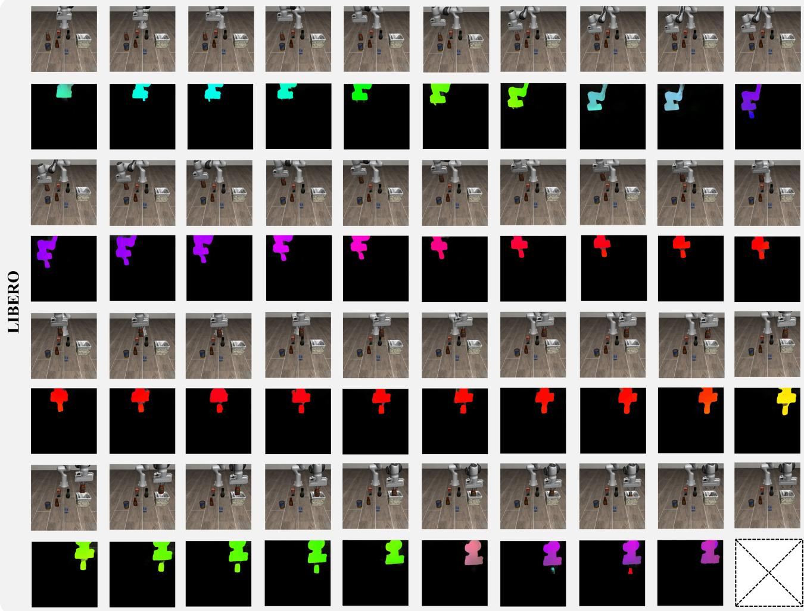
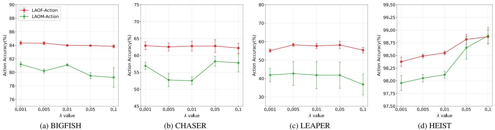

# LAOF: Robust Latent Action Learning with Optical Flow Constraints

Xizhou Bu1 Jiexi Lyu1 Fulei Sun1 Ruichen Yang1 Zhiqiang $\mathbf { M } \mathbf { a } ^ { 2 }$ Wei Lil 1Fudan University 2Northwestern Polytechnical University

# Abstract

Learning latent actions from large-scale videos is crucial for the pre-training of scalable embodied foundation models, yet existing methods often struggle with action-irrelevant distractors. Although incorporating action supervision can alleviate these distractions, its effectiveness is restricted by the scarcity of available action labels. Optical flow represents pixel-level motion between consecutive frames, naturally suppressing background elements and emphasizing moving objects. Motivated by this, we propose robust Latent Action learning with Optical Flow constraints (LAOF), a pseudo-supervised framework that leverages the agent's optical flow as an action-driven signal to learn latent action representations robust to distractors. Experimental results show that the latent representations learned by LAOF outperform existing methods on downstream imitation learning and reinforcement learning tasks. This superior performance arises from optical flow constraints, which substantially stabilize training and improve the quality of latent representations under extremely label-scarce conditions, while remaining effective as the proportion of action labels increases to $10 \%$ . Importantly, even without action supervision, LAOF matches or surpasses action-supervised methods trained with $1 \%$ of action labels. Code can be found at https://github.com/XizoB/LAOF

# 1. Introduction

In recent years, latent action learning based on large-scale, action-free datasets has attracted increasing attention for its superior pretraining efficiency and scalability [1, 25, 43]. Among the emerging approaches [13, 24, 32, 33, 42], the Latent Action Policies (LAPO) paradigm [32] has played a pivotal role in enabling the unsupervised training of latent action models (LAMs), significantly accelerating the development of scalable embodied foundation models [2, 4, 17, 41]. The core idea of LAPO is to jointly train an inverse dynamics model (IDM) and a forward dynamics model (FDM) within an autoencoding framework using a reconstruction objective, allowing latent actions to encode the changes between consecutive observations.

However, the original LAPO implicitly assumes that all changes between consecutive observations are solely caused by the agent's actions, as in scenarios like robot manipulation on static backgrounds [19, 23, 29]. Unfortunately, this assumption does not hold for real-world large-scale videos, where environmental dynamics are not exclusively driven by the agent but may also rise from stochastic factors, such as moving background objects [34]. Moreover, relying solely on reconstruction without explicit physical constraints can lead latent action representations to become entangled with visual appearance, rather than accurately capturing the agent's motion.

To address these, existing methods incorporate action supervision by decoding latent actions into ground-truth actions during training, thereby reducing the impact of distractors and enhancing physical consistency [8, 22, 27, 44]. LAOM [27] and related works [22, 44] demonstrate that even a small set of action labels can significantly improved downstream performance. Building on this, villa-X [8] introduces a proprioceptive FDM that decodes latent actions into physical actions and predicts future low-level proprioceptive states, further tightening the link between latent actions and the agent's true motion. These methods are typically trained by alternating between labeled and unlabeled data [22, 27, 44]. Nonetheless, in real-world scenarios where action labels are extremely scarce compared to readily available large-scale videos, this alternating training often becomes unstable and prone to overfitting. Under such sparse supervision, the model easily drifts toward spurious correlations in visual features [27], hindering the anchoring of latent actions in a physically meaningful action space.

In this work, we propose LAOF, a pseudo-supervised framework that leverages the agent's optical flow as an auxiliary action signal to regularize latent action learning. LAOF is founded on the key insights that (1) the agent's optical flow provides explicit pixel-level motion between consecutive frames, which is strongly correlated with ground-truth actions; and (2) advances in optical flow estimation have produced robust models with strong cross-scene generalization, enabling optical flow to serve as an effective supervision signal without requiring manual annotation [35, 38]. Specifically, LAOF employs a dedicated flow decoder to directly map latent actions into optical flow, thereby imposing a physical motion constraint. The optical flow pseudolabels used for training are generated by a pre-trained optical flow foundation model. For large-scale datasets with limited action labels, we propose an action-supervised method, LAOF-Action, which further incorporates an action decoder to apply supervision on labeled data while using optical flow to provide complementary supervision on unlabeled data. Our main contributions are as follows:

(1) We introduce optical fow constraints to provide pseudo-supervision of physical motion, enabling more stable and robust latent action learning, and validate their effectiveness on downstream imitation learning tasks on LIBERO and reinforcement learning tasks on PROCGEN.

(2) We evaluate the effect of adding optical flow constraints to the baseline on datasets with gradually increasing action-label proportions, showing that they remain beneficial even at a $1 0 \%$ action ratio, and that LAOF matches or outperforms action-supervised methods trained with a $1 \%$ action ratio, even without action supervision.

(3) We conduct an ablation study that varies both the constraint structure and its coupling with the FDM to explore various LAOF variants, and find that directly attaching a dedicated flow decoder to the latent actions yields the best performance.

# 2. Related Work

Latent action forms. The form of latent action representations greatly affects their quality. While continuous representations are highly expressive, they make the IDM prone to shortcut learning [40], often degenerating into future-frame encoding rather than capturing true inter-frame changes. In response, many studies [25, 79, 11, 32, 41] adopt the VQ-VAE [36] quantization operation to discretize latent actions, creating an information bottleneck that encourages the IDM to focus on dynamics-relevant features. Yet, the relative advantages of discrete and continuous representations remain debated, with recent studies suggesting that continuous ones generally achieve better performance [14, 22, 27, 40, 44]. For example, CoMo [40] employs a temporal difference strategy on continuous representations, replacing the IDM's future-frame input with inter-frame differences to avoid shortcut learning. LAOM [27] demonstrates that continuous representations with a larger bottleneck improve both ground-truth actions predictability and downstream policy performance, a finding corroborated by our experiments. Our work provides a comprehensive evaluation of different representation forms across both imitation learning and reinforcement learning tasks.

Visual encoder. A growing research trend is to transform raw images into a compact feature space before training the dynamics models [3, 11, 27, 40]. DynaMo [11] and LAOM [27] decouple the visual encoder from the IDM, while the FDM focus on reconstructing high-level image features rather than decoding latent actions into pixels. Genie [3] independently trains the visual encoder and CoMo [40] directly utilizes a pretrained ViT [12] as an image feature extractor. These works show that training IDM and FDM in feature space improves both representation quality and transferability across tasks and environments. Accordingly, we employ DINOv2 [28], a pre-trained visual encoder that provides robust and generalizable image features for downstream tasks, to control for variations in visual encoder learning across environments. Futhermore, some works [21, 37] use pre-trained visual foundation models to decompose input video frames into spatio-temporal object slots for learning object-centric latent actions, mitigating performance degradation caused by distractors. Compared with spatio-temporal object slots, object-centric optical flow isolates objects and provides more direct motion information, allowing it to serve as a supervision signal that imposes stronger constraints on latent action learning.

Capability extension. The capability extension of LAPO have primarily evolved along two directions. The first builds on the IDM branch, leading to the development of visuallanguage-action models (VLAs). For example, LAPA [41] extends the original LAPO by integrating language modalities to achieve multi-task learning, while UniVLA [5] employs DINOv2 [28] to construct task-centric latent action representations, mitigating the influence of task-irrelevant dynamics. GO-1 [4] scales up the training of LAMs to millions of trajectories, and GR00T N1 [2] further enlarges the data scale by training LAMs on a heterogeneous mixture of real robot trajectories, human videos, and synthetic data. It employs a diffusion transformer module as the action head to build a large-scale embodied foundation model. The second direction builds on the FDM branch, inspiring the development of world models (WMs). For instance, Genie [3] trains an interactive world model in the image feature space, whereas AdaWorld [5] develops an autoregressive world model based on diffusion modeling. In addition, several interesting approaches have emerged, such as JIF [18], which integrates tactile inputs to introduce more physical priors, and UniSkill [20], which reduces distillation loss by providing future-frame information via video prompts, enabling the IDM to directly infer latent actions. It is worth noting that we have identified a contemporaneous work, FlowVLA [45], which differs from LAOF in its use of optical flow. FlowVLA treats optical flow as auxiliary information to enhance the generative quality of the world model, indirectly benefiting policy learning. In contrast, the key innovation of LAOF is to employ optical flow as a direct training constraint on latent action learning, ensuring the learned representations encode agent-controllable physical dynamics.

  
ure 1. Overviw f LAOF framework Consecutive bservatons $\left( o _ { t } , o _ { t + 1 } \right)$ and the coreponding RGB-foratted otial fow $f _ { \mathrm { r g b } , t }$ are encoded into feature space $\left( { { s _ { t } } , { s _ { t + 1 } } , { f _ { t } } } \right)$ . The inverse and forward dynamics models, along with the flow decoder, are then jointly optimized under the combined supervision of next-state reconstruction and optical flow constraints.

# 3. Problem Setting

This work aims to leverage optical flow constraints to effectively capture the priors of an agent's motions, thereby learning robust latent actions from videos. Formally, the a $O = \mathbb { R } ^ { H \times W \times 3 }$ , and the optical flow space as $\mathcal { F } _ { \mathrm { r g b } } = \mathbb { R } ^ { H \times W \times 3 }$ , where $H$ and $W$ denote image height and width, respectively. The raw optical flow is converted into a standard RGB format to enable unified modeling, as detailed in Section 4.3. The state space is defined as $S = \mathbb { R } ^ { d }$ , where $d$ denotes the dimensionality of the state. The latent action space is defined as $\mathcal { Z } = \mathbb { R } ^ { k }$ , and the physical action space as $\mathcal { A } = \mathbb { R } ^ { n }$ , where $k$ and $n$ denote the dimensions of latent and physical actions, respectively.

# 4. Methodology

The training process is structured as a three-stage pipeline: pre-training, distillation, and fine-tuning, each corresponding to a specific dataset. The unlabeled dataset, $\mathcal { D } _ { \mathrm { u n l a b e l } } =$ $\{ ( o _ { t } , f _ { \mathrm { r g b } , t } ) \} _ { t = 1 } ^ { N }$ $o _ { t }$ and $f _ { \mathrm { r g b } , t } \in \mathcal { F } _ { \mathrm { r g b } }$ denote the observation and optical flow, respectively. It is important to note that the primary objective of pre-training is to learn high-quality latent action representations capable of capturing inter-frame transitions. Accordingly, the dataset can include partially failed demonstrations or videos without clear task relevance [22]. In the distillation stage, high-quality data containing the task's language instruction $l _ { t }$ is essential for transferring the learned representations to the latent action policy. We construct the latent-labeled dataset $\mathcal { D } _ { \mathrm { l a t e n t } } = \{ ( o _ { t } , z _ { t } , l _ { t } ) \} _ { t = 1 } ^ { N }$ by using the frozen pre-trained IDM to annotate each consecutive observation pair $\left( o _ { t } , o _ { t + 1 } \right)$ from this dataset with its corresponding latent action $z _ { t }$ . Finally, only a small action-labeled dataset $\boldsymbol { \mathcal { D } } _ { \mathrm { a c t i o n } } = \{ ( o _ { t } , a _ { t } , l _ { t } ) \} _ { t = 1 } ^ { M }$ , is used for fine-tuning, where $a _ { t }$ denotes the physical action. Here, $N$ and $M$ denote the numbers of unlabeled and labeled data, respectively.

In our experiments, we consider two dataset settings: (1) an extreme setting with pure videos, and (2) a more realistic setting where $N \gg M$ , i.e., large-scale videos with limited action labels.

# 4.1. Pseudo Supervision from Optical Flow

The LAOF framework integrates the inverse and forward dynamics models along with a flow decoder $d _ { \mathrm { f l o w } } : \mathcal { Z } \to \mathcal { F } _ { \mathrm { r g b } }$ , as illustrated in Fig.1. Here, IDM is implemented as a spatial-temporal transformer [39], whereas FDM and the flow decoder are implemented as spatial transformers. Based on the assumption that an agent's optical flow is highly correlated with its physical actions, we leverage inter-frame optical flow to obtain a latent action space $z$ that approximates the physical action space $\mathcal { A }$ .

Pre-training. An inverse dynamics model $p _ { \mathrm { I D M } } \big ( z _ { t } \big | s _ { t } , s _ { t + 1 } \big )$ is trained to infer the latent action from a pair of consecutive states $\left( { { s _ { t } } , { s _ { t + 1 } } } \right)$ , while a forward dynamics model $p _ { \mathrm { F D M } } \big ( \hat { s } _ { t + 1 } \big | s _ { t } , z _ { t } \big )$ predicts the next state conditioned on the current state and the inferred latent action. In the original LAPO framework, these two models are jointly optimized by minimizing the next-state reconstruction loss: $\mathcal { L } _ { \mathrm { r e c o n s t r u c t i o n } } ( t ) : = \| \hat { s } _ { t + 1 } - s _ { t + 1 } \| _ { 2 }$ . We extend this framework by introducing a flow decoder $d _ { \mathrm { f l o w } } ( \hat { f } _ { t } | z _ { t } )$ , which decodes the latent action into the agent's optical flow features $\hat { f } _ { t } \in S$ , thereby providing an additional motion constraint. The decoder is supervised using pseudo-labeled optical flow via the loss: $\mathcal { L } _ { \mathrm { f l o w } } ( t ) : = \| \hat { f } _ { t } - \bar { f } _ { t } \| _ { 2 }$ , where $f _ { t }$ denotes the RGBformatted optical flow $f _ { \mathrm { r g b } , t }$ encoded into the state space through the visual encoder. The overall pre-training objective in LAOF combines both the next-state reconstruction loss and the optical flow constraint loss.

$$
\begin{array} { r } { \mathcal { L } _ { \mathrm { p r e t r a i n } } = \mathcal { L } _ { \mathrm { r e c o n s t r u c t i o n } } + \mathcal { L } _ { \mathrm { f l o w } } . } \end{array}
$$

Distillation. This stage enables the latent policy to infer latent actions directly from the current state, effectively transferring the learned IDM representations into a deployable policy without relying on future frames. To this end, we initialize $\pi$ and perform behavior cloning using the latentlabeled dataset $\mathcal { D } _ { \mathrm { l a t e n t } }$ , which is then optimized via gradient descent on the following distillation loss: $\begin{array} { r l r } { \mathrm { ~ } } & { { } } & { \mathcal { L } _ { \mathrm { d i s t i l l a t i o n } } : = } \end{array}$ $\| \pi ( \widehat { z } _ { t } | s _ { t } , l _ { t } ) - z _ { t } \| _ { 2 }$ , where $z _ { t } \sim p _ { \mathrm { I D M } } ( \cdot | s _ { t } , s _ { t + 1 } )$ .

Fine-tuning. To deploy the latent action policy on a real agent, we use a small action-labeled dataset $\mathcal { D } _ { \mathrm { a c t i o n } }$ to train an action decoder $d _ { \mathrm { a c t i o n } } : z \to \mathcal { A }$ , which maps latent actions to physical actions. The decoder is optimized using the following loss: $\mathcal { L } _ { \mathrm { a c t i o n } } : = | | d _ { \mathrm { a c t i o n } } ( \hat { a } _ { t } | \boldsymbol { z } _ { t } ) - a _ { t } | | _ { 2 }$ , where $z _ { t } \sim \pi ( \cdot \mid s _ { t } , l _ { t } )$ is kept frozen. After training, the decoder and the latent action policy can be composed into a single function, $d _ { \mathrm { a c t i o n } } \circ \pi$ , which provides an end-to-end mapping from states to physical actions conditioned on the given language instruction.

# 4.2. Learning with Sparse Action Supervision

We introduce LAOF-Action for scenarios where a small set of action labels is available in the training dataset. Building upon the base LAOF framework, it incorporates an action decoder that applies explicit action supervision to the labeled samples, thereby enhancing the consistency between latent actions and physical actions. For the remaining unlabeled data, LAOF-Action provides complementary supervision through optical flow, which serves as an auxiliary action signal to constrain latent action learning. The action decoder is implemented as a lightweight multilayer perceptron (MLP). Accordingly, the overall pre-training objective of LAOF-Action is formulated as:

$$
{ \mathcal { L } } _ { \mathrm { p r e t r a i n } } = { \mathcal { L } } _ { \mathrm { r e c o n s t r u c t i o n } } + ( 1 - \lambda ) \cdot { \mathcal { L } } _ { \mathrm { f l o w } } + \lambda \cdot { \mathcal { L } } _ { \mathrm { a c t i o n } } ,
$$

where $\lambda$ balances the contributions of action supervision and optical flow constraints. Following [44], we set $\begin{array} { r } { \lambda = \frac { M } { N + M } } \end{array}$ , which corresponds to the proportion of action labels in the overall training dataset. The training process follows an alternating update strategy: in each iteration, the unlabeled data are used to update the flow decoder, while the actionlabeled data are used to update the action decoder.

# 4.3. Optical Flow in RGB Format

Given two consecutive observations $\left( o _ { t } , o _ { t + 1 } \right)$ , the optical flow $f _ { \mathrm { u v } , t } \in \mathcal { F } _ { \mathrm { u v } }$ represents the pixel-level motion from $o _ { t }$ to $o _ { t + 1 }$ , where $\mathcal { F } _ { \mathrm { u v } } = \mathrm { \mathbb { R } } ^ { H \times W \times 2 }$ Each pixel in $f _ { \mathrm { u v } }$ is described by two channels, $( u , \nu )$ , corresponding to the horizontal and vertical motion components, respectively. Since raw optical flow is not directly compatible with DINOv2's input format, we follow the technique of VideoJAM [6] to convert it into RGB-formatted optical flow, i.e., $\mathcal { F } _ { \mathrm { u v } }  \mathcal { F } _ { \mathrm { r g b } }$ , enabling consistent processing alongside the original images. Specifically, each optical flow vector $( u , \nu )$ is first converted into polar coordinates, with the direction $\alpha = \mathrm { a t a n } 2 ( \nu , u )$ mapped to the Hue channel and the magnitude $m = \sqrt { u ^ { 2 } + \nu ^ { 2 } }$ mapped to the Saturation and Value channels. The resulting HSV image is then converted to an RGB-formatted optical flow $f _ { \mathrm { r g b } }$ using a standard color transformation. To capture motions of varying scales effectively, the magnitude $m$ is further normalized as follows,

T APOAOMAOF action-supervised methods, evaluated under a $1 \%$ action ratio.   

<table><tr><td rowspan="2">Method</td><td colspan="2">SPATIAL</td><td colspan="2">OBJECT</td><td colspan="2">GAOL</td><td colspan="2">LONG</td><td colspan="2">Avg. Impr.</td></tr><tr><td>MSE (↓)</td><td>Succ. (↑)</td><td>MSE (↓)</td><td>Succ. ()</td><td>MSE (↓)</td><td>Succ. ()</td><td>MSE (↓)</td><td>Succ. ()</td><td>MSE (1)</td><td>Succ. (↑)</td></tr><tr><td>LAPO [32]</td><td>0.162</td><td>80.4 ± 1.7</td><td>0.139</td><td>81.2 ± 2.4</td><td>0.219</td><td>84.0 ± 2.2</td><td>0.154</td><td>44.7 ± 1.6</td><td>-0.000</td><td>+0.0</td></tr><tr><td> CoMo [40]</td><td>0.181</td><td>74.1 ± 1.8</td><td>0.125</td><td>87.6 ± 1.3</td><td>0.221</td><td>80.8 ± 2.7</td><td>0.153</td><td>49.9 ± 1.8</td><td>+0.02</td><td>+0.5</td></tr><tr><td>CoMo w/ OF</td><td>0.172</td><td>76.2 ± 1.5</td><td>0.129</td><td>89.7 ± 1.2</td><td>00.113</td><td>82.6 ± 2.4</td><td>0.139</td><td>57.9 ± 1.8</td><td>-0.030</td><td>+4.0</td></tr><tr><td>LAOF</td><td>0.111</td><td>82.5 ± 2.3</td><td>0.082</td><td>85.3 ± 1.4</td><td>0.118</td><td>87.2 ± 2.2</td><td>0.088</td><td>52.0 ± 1.7</td><td>-0.069</td><td>+4.2</td></tr><tr><td>LAOM-Action [27]</td><td>0.108</td><td>86.0 ± 2.3</td><td>0.090</td><td>91.1 ± 1.5</td><td>0.127</td><td>86.3 ± 1.7</td><td>0.086</td><td>61.6 ± 2.3</td><td>-0.066</td><td>+8.7</td></tr><tr><td>LAOF-Action</td><td>0.076</td><td>88.2 ± 1.5</td><td>0.064</td><td>95.9 ± 1.3</td><td>0.081</td><td>88.6 ± 1.6</td><td>0.068</td><td>63.7 ± 1.9</td><td>-0.096</td><td>+11.5</td></tr></table>

  
mean Pearson correlation coeficient averaged across all tasks being 0.8288 for PROCGEN and $- 0 . 7 3 1 1$ for LIBERO.

$$
m _ { \mathrm { n o r m } } = \operatorname * { m i n } \biggl ( 1 . 0 , \ : \frac { m } { \sigma \cdot \sqrt { H ^ { 2 } + W ^ { 2 } } } \biggr ) ,
$$

where $\sigma$ is a sensitivity factor that balances subtle and pronounced motions.

# 4.4. Object-Centric Optical Flow

To generate optical flow pseudo-labels, we use RAFT [35], a pre-trained optical flow model that provides accurate and dense pixel-level motion estimates between consecutive observations, as illustrated in Fig.2. Optical flow naturally filters out static distractors and can be directly applied to several popular robot manipulation datasets[19, 23, 29] without additional processing. In scenarios with dynamic distractors, such as pixel-based games [10, 16, 26], actionirrelevant motion may introduce noise that hinders latent action learning, which requires a mechanism to obtain object-centric optical flow. Specifically, we employ

LangSAM [15], which generates an object-centric semantic mask for the current observation frame $o _ { t }$ under the guidance of object-related textual prompts. The generated hp  go l to filter out moving objects other than the agent, resulting in: ffrgb,t $f _ { \mathrm { r g b } , t } ^ { \mathrm { s a m } } = \mathrm { m a s k } _ { t } \odot f _ { \mathrm { r g b } , t } ^ { \mathrm { a l l } }$ , where $\odot$ denotes element-wise weighting, retaining only the optical flow features within the $f _ { \mathrm { r g b } , t } = \{ f _ { \mathrm { r g b } , t } ^ { \mathrm { a l l } } , f _ { \mathrm { r g b } , t } ^ { \mathrm { s a m } } \}$ is selected adaptively according to the task scenario: in environments with static distractors, the global optical flow can be used directly, whereas in environments with dynamic distractors, the object-centric optical flow is adopted to capture motions relevant to the agent.

# 5. Experiments

Our experiments aim to address the following questions:

(Q1) Which form of representation is more effective: continuous actions or discrete actions?

(Q2) Does introducing optical fow constraints enhance the quality of learned representations and improve down

T action classification $( \% )$ , Return denotes the average normalized episodic return over 1000 trials.   

<table><tr><td rowspan="2">Method</td><td colspan="3">BIGFISH</td><td colspan="2">CHASER</td><td colspan="2">LEAPER</td><td colspan="2">HEIST</td><td colspan="2">Avg. Impr.</td></tr><tr><td>Acc. (↑)</td><td>Return (↑)</td><td>Acc. (↑)</td><td>Return (↑)</td><td></td><td>Acc. (↑) Return (↑)</td><td>Acc. (↑)</td><td></td><td>Return ) Acc. ) Return</td><td></td><td></td></tr><tr><td>LAPO [32]</td><td colspan="3">80.98 ± 0.28</td><td colspan="2">26.87 ± 12.86</td><td>40.09 ± 1.40</td><td>0.55</td><td colspan="2">72.23 ± 13.61</td><td>+0.00</td><td>+0.00</td></tr><tr><td>CoMo [40]</td><td colspan="2">81.02 ± 0.49</td><td>0.72 0.72</td><td>35.39 ± 3.96</td><td>0.11 0.23</td><td>44.29 ± 2.73</td><td>0.56</td><td>75.58 ± 7.09</td><td>0.76 0.78</td><td>+4.03</td><td>+0.04</td></tr><tr><td>CoMo w/ OF</td><td colspan="2">82.91 ± 0.24</td><td>0.74</td><td>52.53 ± 3.10</td><td>0.29</td><td>50.38 ± 1.63</td><td>0.71</td><td>95.05 ± 0.59</td><td>0.89</td><td>+15.18</td><td>+0.12</td></tr><tr><td>LAOF</td><td colspan="2">83.71 ± 0.20</td><td>0.76</td><td>53.83 ± 2.47</td><td>0.39</td><td>53.23 ± 1.78</td><td>0.74</td><td>94.19 ± 0.02</td><td>0.88</td><td>+16.20</td><td>+0.16</td></tr><tr><td>LAOM-Action [27] 81.05 ± 0.51</td><td colspan="3">0.74</td><td>52.95 ± 1.96</td><td>0.43</td><td>41.85 ± 8.22</td><td>0.33</td><td>98.14 ± 0.04</td><td>0.91</td><td>+13.46</td><td>+0.07</td></tr><tr><td rowspan="7">LAOF-Action 92 LAOM-Action 90</td><td rowspan="7">84.13 ± 0.18 0.80</td><td></td><td colspan="3">62.75 ± 1.63 0.51</td><td>57.64 ± 1.57</td><td>0.79 98.57 ± 0.01</td><td>0.91 100.0</td><td>+20.73</td><td></td><td>+0.22</td></tr><tr><td>920 LAOF-Action</td><td>90</td><td></td><td></td><td>80</td><td>:</td><td></td><td></td><td></td></tr><tr><td>Performance Gain LAOF</td><td></td><td></td><td></td><td>8750 75</td><td></td><td>99.5</td><td></td><td></td><td>100</td></tr><tr><td>LAPO</td><td></td><td>80</td><td></td><td></td><td>70</td><td>7.5 5</td><td></td><td></td><td></td></tr><tr><td></td><td></td><td></td><td></td><td>60</td><td></td><td></td><td></td><td></td><td></td></tr><tr><td></td><td></td><td></td><td></td><td>53.83 55</td><td></td><td>53.23</td><td></td><td></td><td></td></tr><tr><td colspan="3">84 83.71 82</td><td>30-</td><td>50 45 26.87</td><td>40 2 3 4 5678910 100 1 Action Ratio (%)</td><td>$90r a0 40.09 1</td><td>2 ( HEIST</td><td>3 4 5678910 100 Action Ratio (%)</td><td>94.19_ 72.23</td></tr></table>

$1 \%$ action ratio, LAOF without any action supervision matches or even outperforms the action-supervised LAOM-Action.

stream task performance?

(Q3) Up to what proportion of labeled actions in the training dataset does optical flow continue to provide performance gains over the baseline?

(Q4) To what extent can optical flow serve as a substitute for action labels under limited supervision?

(Q5) What is the optimal architecture for introducing optical flow constraints?

# 5.1. Experimental Setup

Benchmark. Our experimental setup includes both continuous and discrete control tasks, involving downstream imitation learning and reinforcement learning. For all tasks, the dimensionality of the latent action is set to 128, and each task is evaluated using 5 random seeds.

• LIBERO [23]: This benchmark is designed to investigate knowledge transfer in multitask robot learning. We adopt four task suites: SPATIAL, OBJECT, GOAL and LONG. Each suite contains 10 tasks, with 50 humanteleoperated demonstrations per task, 45 of which are used for the training set and the remaining 5 for the test set. Since all LIBERO tasks share the same environment, we aggregate data from all tasks into a unified training set to fully exploit the environment dynamics. Instead of building a powerful

VLA model, we simply extend all baselines by incorporating language instructions to construct a multi-task model. This is because the optimal architectures for continuous and discrete representations remain uncertain when fine-tuning the base vision-language model, and we seek to prevent additional factors from affecting the ablation study. Moreover, omitting the fine-tuning step allows us to directly evaluate the effectiveness of optical flow constraints in enhancing representation learning and improving downstream imitation performance. The training process consists of three stages: a pre-training stage of 20 epochs, a distillation stage of 5 epochs, and a fine-tuning stage of 5 epochs.

•PROCGEN [10]: It is a procedurally generated discrete control reinforcement learning benchmark that incorporates both static distractors and dynamic distractors induced by stochastic effects, which are not driven by the agent's actions. We adopt four tasks: BIGFISH, CHASER, LEAPER, HEIST. Among these environments, the first three contain dynamic distractors, while the last involves only static ones. Since these tasks are set in different environments, we train separate models for each task. The training and test sets contain approximately 2M and 0.2M frames, respectively. All data are collected using an expert policy trained with PPO over 50M frames. The training process consists of three stages: a pre-training stage of 50K steps, a distillation stage of 60K steps, and a reinforcement learning stage of 4M steps. During the reinforcement learning stage, a hybrid policy head is employed, comprising a policy head fine-tuned via imitation learning for 3 epochs and an initialized policy head that is updated through reinforcement learning.

Baselines. We select several typical latent action learning methods as baselines for comparison.

•LAPO [32]: An original baseline that jointly trains inverse and forward dynamics models through a reconstruction objective, without explicit motion constraints.

CoMo [40]: It builds upon LAPO by using a temporaldifference strategy in the IDM input, where the next frame is replaced with inter-frame differences to encourage latent actions to capture temporal variations between frames.

• LAOM-Action [27]: It is an action-supervised method that incorporates an additional action decoder mapping latent actions to physical actions, enforcing consistency between the learned representations and physical actions.

Metrics. We train the latent action decoder for 3 epochs and use its performance to evaluate the quality of the latent actions learned during training. For discrete latent actions, the evaluation metric is classification accuracy (top1): $\begin{array} { r } { \mathrm { A c c } = \frac { 1 } { M } \sum _ { i = 1 } ^ { M } \mathbb { 1 } \left[ \hat { a } _ { i } = a _ { i } \right] } \end{array}$ where $a _ { i }$ is the ground-truth action, $\hat { a } _ { i }$ is the predicted action, and $\mathbb { 1 } [ \cdot ]$ is the indicator function, which equals 1 if the condition inside is true and 0 otherwise. For continuous latent actions, the metric is the mean squared error (MSE) between the predicted and ground-truth actions: $\begin{array} { r } { \mathbf { M S E } = \frac { 1 } { M } \sum _ { i = 1 } ^ { M } \| \hat { a } _ { i } - \bar { a _ { i } } \| _ { 2 } } \end{array}$ .

# 5.2. Conclusion

The results shown in Fig. 3 validate that our proposed evaluation metric effectively assesses the quality of latent action representations. Combined with Tables 1 and 2, optical flow constraints improve success rates by $4 . 2 \%$ for unsupervised methods and $1 1 . 5 \%$ for action-supervised methods on the LIBERO benchmark. On the PROCGEN benchmark, they increase normalized episodic rewards by $1 6 \%$ and $2 2 \%$ , respectively. Together, these results indicate that incorporating optical flow constraints during pre-training substantially enhances the quality of latent action representations across both unsupervised and action-supervised methods, leading to improved performance on downstream imitation learning and reinforcement learning tasks (Q2). Moreover, we find that replacing the IDM's future frame input with interframe differences, as done in CoMo [40], does not lead to consistent performance improvements, as evidenced by performance degradation in the SPATIAL and GOAL tasks. Although inter-frame or encoded feature differences can capture 'changes', they do not provide a faithful approximation of physical motion or actions, as they lack pixel-level direction, magnitude, and locality, and cannot represent true physical movements like optical flow.

  
Figure 5. Comparison of stability and overfitting among different methods, where solid lines represent unsupervised methods and dashed lines represent action-supervised methods. LAOM-Action and LAOF-Action are evaluated at a $1 \%$ action ratio.

To investigate the potential performance gain that optical flow constraints can provide to action-supervised methods at different action ratios, we evaluated the action accuracy of different methods as the action ratio increases, as illustrate in Fig.4. We find that optical flow constraints consistently enhance the quality of latent action representations for baseline as the action ratio increases up to $1 0 \%$ (Q3). Beyond this point, the positive effects diminish, and at an action ratio of $1 0 0 \%$ , performance degradation is even observed in the BIGFISH and CHASER environments, likely due to noise in the optical flow pseudo-labels. Accordingly, we suggest applying optical flow constraints when the dataset contains less than $1 0 \%$ action-labeled data. When the proportion exceeds this threshold, their use should be considered on a case-bycase basis. If optical flow constraints achieve performance comparable to action supervision alone, we recommend using the latter, as it provides a simpler network architecture, faster training, and reduces the risk of noise from low-quality optical flow pseudo-labels.

As shown in Fig. 3, the original LAPO demonstrates highly unstable performance with large standard deviations in the CHASER and HEIST tasks, indicating that, without explicit motion constraints, the learned latent actions are easily influenced by action-irrelevant distractors such as moving objects or background changes. Under the extreme condition of a $1 \%$ action ratio, LAOM-Action also exhibits training instability and overfitting in the LEAPER and CHASER tasks, even with action supervision, as sparse action supervision makes the model prone to spurious correlations in visual features. By introducing optical flow constraints, LAOF-Action shows significantly improved stability across all tasks. The learning curves show faster convergence, smaller variance, and higher final action accuracy, indicating that optical flow serves as an effective supervision signal to regularize latent action learning. Notably, LAOF without any action supervision achieves performance comparable to or even outperforms that of LAOM-Action trained with sparse action labels $( 1 \% )$ , highlighting the strong capability of flow-based constraints in capturing meaningful physical dynamics and mitigating overfitting (Q4).

# 6. Discussion

To investigate how the form and placement of optical flow constraints affect latent action learning, we conduct a focused set of ablations that vary both the constraint structure and its coupling with the FDM. Specifically, we examine the following structures:

• LAOF: It builds upon LAPO and introduces a dedicated decoder that directly maps latent actions to optical flow. • LAOF-FlowFDM: It integrates the flow decoder into the FDM to simplify the architecture, enabling the model to jointly predict both optical flow and the next state. •LAOF-Only $\left( { { z } _ { t } } \right)$ : By removing the FDM and retaining a dedicated flow decoder, this variant examines whether latent actions can be learned solely through optical flow constraints to evaluate the necessity of the FDM. LAOF-Only $( z _ { t } , s _ { t } )$ : The flow decoder takes both the latent action and the current state as input. This design assesses the effect of applying optical flow constraints to both state and latent action, testing whether such constraints should be integrated into the FDM. LAOF-AE: It conducts optical flow autoencoding to explore whether this mechanism can independently yield a visual encoder for embodied foundation models.

The experimental results reveal a clear performance hierarchy: LAOF $\dot { \iota }$ LAOF-AE $\dot { \iota }$ LAOF-Only $\left( { { z } _ { t } } \right)$ $\dot { \iota }$ LAOFFlowFDM $\textit { i }$ LAOF $\mathrm { { O n l y } } ( z _ { t } , s _ { t } )$ , from which several insights emerge. First, LAOF-Only $\left( { { z } _ { t } } \right)$ removes the FDM relative to LAOF and exhibits reduced performance, suggesting that the FDM provides structural context beneficial for latent action learning. Second, naively integrating the flow decoder into the FDM, as in LAOF-FlowFDM, to simplify the architecture proves suboptimal. The performance of $\mathrm { L A O F - O n l y } ( z _ { t } , s _ { t } )$ further confirms this, falling below that of LAOF-Only $\left( { { z } _ { t } } \right)$ and even underperforming LAOFFlowFDM. This effect may arise from applying optical flow constraints simultaneously to both latent actions and the current state, which allows the model to form direct dependencies from the state to optical flow, preventing the motion constraints from fully regularizing latent action learning. Finally, LAOF achieves the best performance, demonstrating that introducing optical fow constraints with a dedicated decoder provides strong and direct physical supervision for latent actions (Q5).

Table 3. Average performance improvement of LAOF variants over LAPO across all LIBERO and PROCGEN tasks.   

<table><tr><td rowspan="2">Method</td><td colspan="3">LIBERO PROCGEN</td></tr><tr><td>MSE (↓) Succ.</td><td>(↑) Acc. (↑)</td><td>Return (↑)</td></tr><tr><td>LAPO</td><td>-0.000</td><td>+0.0 +0.00</td><td>+0.00</td></tr><tr><td>LAOF-FlowFDM</td><td>-0.046</td><td>+3.3 +11.95</td><td>+0.13</td></tr><tr><td>LAOF-Only(zt )</td><td>-0.053</td><td>+3.6 +13.2</td><td>+0.14</td></tr><tr><td>LAOF-Only(z ,  )</td><td>-0.012</td><td>+0.8 +6.26</td><td>+0.03</td></tr><tr><td>LAOF-AE</td><td>-0.060</td><td>+3.9 +13.31</td><td>+0.14</td></tr><tr><td>LAOF</td><td>0.069</td><td>+4.2 +16.20</td><td>+0.16</td></tr></table>

Moreover, we explored a simplified optical flow autoencoding variant, LAOF-AE, whose competitive performance demonstrates that optical fow supervision alone provides strong prior information about physical motions for learning latent actions. These findings suggest that training optical flow encoders through unsupervised learning could be an effective strategy for developing general-purpose embodied foundation models.

# 7. Limitations and Future Work

The quality of optical flow estimation is critical to the performance of LAOF. While high-quality motion constraints can greatly enhance latent action representations, existing models still exhibit limited generalization beyond their training domains, restricting scalability to internet-scale datasets. We evaluated the state-of-the-art model SEA-RAFT [38], but found that RAFT [35] remains the most reliable choice for our experimental setting. Future advances in optical flow accuracy and generalization are expected to further extend the applicability of our framework.

Building on this, we employ the LangSAM [15] to obtain object segmentations guided by text prompts. However, text-driven segmentation often yields imprecise boundaries, leading to mismatches between the extracted masks and the actual agents. Future work could integrate click-based interactive segmentation to produce more accurate agent masks.

Moreover, our approach mainly supports "eye-off-hand" scenarios, where the environment remains static and the agent moves in the image. In contrast, in "eye-in-hand" settings, the camera is rigidly attached to the agent, so that the agent remains centered in the view, whereas the environment exhibits motion. This motivates an initial idea that explicitly model environmental motion to inversely infer the agent's motion, enabling a unified formulation across both visual configurations. We leave this for future work, aiming to develop a more general LAOF framework applicable to multi-view datasets.

# References

[1] Bo Ai, Stephen Tian, Haochen Shi, Yixuan Wang, Tobias Pfaff, Cheston Tan, Henrik I Christensen, Hao Su, Jiajun Wu, and Yunzhu Li. A review of learning-based dynamics models for robotic manipulation. Science Robotics, 10(106), 2025. 1   
[2] Johan Bjorck, Fernando Castañeda, Nikita Cherniadev, Xingye Da, Runyu Ding, Linxi Fan, Yu Fang, Dieter Fox, Fengyuan Hu, Spencer Huang, et al. Gr00t n1: An open foundation model for generalist humanoid robots. arXiv preprint arXiv:2503.14734, 2025. 1, 2   
[3] Jake Bruce, Michael D Dennis, Ashley Edwards, Jack Parker-Holder, Yuge Shi, Edward Hughes, Matthew Lai, Aditi Mavalankar, Richie Steigerwald, Chris Apps, et al. Genie: Generative interactive environments. In ICML, 2024. 2   
[4] Qingwen Bu, Jisong Cai, Li Chen, Xiuqi Cui, Yan Ding, Siyuan Feng, Shenyuan Gao, Xindong He, Xuan Hu, Xu Huang, et al. Agibot world colosseo: A largescale manipulation platform for scalable and intelligent embodied systems. In IROS, 2025. 1, 2   
[5] Qingwen Bu, Yanting Yang, Jisong Cai, Shenyuan Gao, Guanghui Ren, Maoqing Yao, Ping Luo, and Hongyang Li. Learning to act anywhere with taskcentric latent actions. In RSS, 2025. 2   
[6] Hila Chefer, Uriel Singer, Amit Zohar, Yuval Kirstain, Adam Polyak, Yaniv Taigman, Lior Wolf, and Shelly Sheynin. Videojam: Joint appearance-motion representations for enhanced motion generation in video models. In ICML, 2025. 4   
[7] Xiaoyu Chen, Junliang Guo, Tianyu He, Chuheng Zhang, Pushi Zhang, Derek Cathera Yang, Li Zhao, and Jiang Bian. Igor: Image-goal representations are the atomic control units for foundation models in embodied ai. arXiv preprint arXiv:2411.00785, 2024. 2   
[8] Xiaoyu Chen, Hangxing Wei, Pushi Zhang, Chuheng Zhang, Kaixin Wang, Yanjiang Guo, Rushuai Yang, Yucen Wang, Xinquan Xiao, Li Zhao, et al. Villa-x: enhancing latent action modeling in vision-languageaction models. arXiv preprint arXiv:2507.23682, 2025. 1   
[9] Yi Chen, Yuying Ge, Weiliang Tang, Yizhuo Li, Yixiao Ge, Mingyu Ding, Ying Shan, and Xihui Liu. Moto: Latent motion token as the bridging language for learning robot manipulation from videos. In ICCV, 2025. 2   
10] Karl Cobbe, Chris Hesse, Jacob Hilton, and John Schulman. Leveraging procedural generation to benchmark reinforcement learning. In ICML, 2020. 5, 6   
11] Zichen Cui, Hengkai Pan, Aadhithya Iyer, Siddhant Haldar, and Lerrel Pinto. Dynamo: In-domain dynamics pretraining for visuo-motor control. In NeurIPS, 2024 2   
[12] Alexey Dosovitskiy. An image is worth 16x16 words: Transformers for image recognition at scale. In ICLR, 2021. 2   
[13] Ashley Edwards, Himanshu Sahni, Yannick Schroecker, and Charles Isbell. Imitating latent policies from observation. In ICML, 2019. 1   
[14] Shenyuan Gao, Siyuan Zhou, Yilun Du, Jun Zhang, and Chuang Gan. Adaworld: Learning adaptable world models with latent actions. In ICML, 2025. 2   
[15] Paul Guerrero. Language segment-anything. ht tps : //github.com/paulguerrero/lang-sam, 2023. 4, 5, 8, 13   
[16] William H Guss, Cayden Codel, Katja Hofmann, Brandon Houghton, Noboru Kuno, Stephanie Milani, Sharada Mohanty, Diego Perez Liebana, Ruslan Salakhutdinov, Nicholay Topin, et al. The minerl 2019 competition on sample efficient reinforcement learning using human priors. In NeurIPS, 2019. 5   
[7] Su Huag, Lg Chen, n Zhou, Shengcong Chen, Zhengkai Jiang, Yue Hu, Yue Liao, Peng Gao, Hongsheng Li, Maoqing Yao, et al. Enerverse: Envisioning embodied future space for robotics manipulation. In NeurIPS, 2025. 1   
[18] Gagan Khandate, Boxuan Wang, Sarah Park, Weizhe Ni, Joaquin Palacios, Kathyrn Lampo, Philippe Wu, Rosh Ho, Eric Chang, and Matei Ciocarlie. Train robots in a jif: Joint inverse and forward dynamics with human and robot demonstrations. arXiv preprint arXiv:2503.12297, 2025. 2   
[19] Alexander Khazatsky, Karl Pertsch, Suraj Nair, Ashwin Balakrishna, Sudeep Dasari, Siddharth Karamcheti, Soroush Nasiriany, Mohan Kumar Srirama, Lawrence Yunliang Chen, Kirsty Ellis, et al. Droid: A large-scale in-the-wild robot manipulation dataset. In RSS Workshop: Data Generation for Robotics, 2024. 1,5   
[20] Hanjung Kim, Jaehyun Kang, Hyolim Kang, Meedeum Cho, Seon Joo Kim, and Youngwoon Lee. Uniskill: Imitating human videos via cross-embodiment skill representations. In CoRL, 2025. 2   
[21] Albina Klepach, Alexander Nikulin, Ilya Zisman, Denis Tarasov, Alexander Derevyagin, Andrei Polubarov, Nikita Lyubaykin, and Vladislav Kurenkov. Objectcentric latent action learning. In 7th Robot Learning Workshop: Towards Robots with Human-Level Abilities, 2025. 2   
[22] Anthony Liang, Pavel Czempin, Matthew Hong, Yutai Zhou, Erdem Biyik, and Stephen Tu. Clam: Continuous latent action models for robot learning from unlabeled demonstrations. arXiv preprint arXiv:2505.04999, 2025. 1, 2, 3   
[23] Bo Liu, Yifeng Zhu, Chongkai Gao, Yihao Feng, Qiang Liu, Yuke Zhu, and Peter Stone. Libero: Bench"o. In NeurIPS, 2023. 1, 5, 6   
[24] Mingyu Liu, Jiuhe Shu, Hui Chen, Zeju Li, Canyu Zhao, Jiange Yang, Shenyuan Gao, Hao Chen, and Chunhua Shen. Stamo: Unsupervised learning of generalizable robot motion from compact state representation. arXiv preprint arXiv:2510.05057, 2025. 1   
[25] Robert McCarthy, Daniel CH Tan, Dominik Schmidt, Fernando Acero, Nathan Herr, Yilun Du, Thomas G Thuruthel, and Zhibin Li. Towards generalist robot learning from internet video: A survey. Journal of Artificial Intelligence Research, 83, 2025. 1   
[26] Volodymyr Mnih, Koray Kavukcuoglu, David Silver, Alex Graves, Ioannis Antonoglou, Daan Wierstra, and Martin Riedmiller. Playing atari with deep reinforcement learning. NeurIPS Workshop, 2013. 5   
[27] Alexander Nikulin, Ilya Zisman, Denis Tarasov, Nikita Lyubaykin, Andrei Polubarov, Igor Kiselev, and Vladislav Kurenkov. Latent action learning requires supervision in the presence of distractors. In ICML, 2025. 1, 2, 5, 6, 7   
[28] Maxime Oquab, Timothée Darcet, Théo Moutakanni, Huy Vo, Marc Szafraniec, Vasil Khalidov, Pierre Fernandez, Daniel Haziza, Francisco Massa, Alaaeldin El-Nouby, et al. Dinov2: Learning robust visual features without supervision. TMLR, 2024. 2, 14   
[29] Abby O'Neill, Abdul Rehman, Abhiram Maddukuri, Abhishek Gupta, Abhishek Padalkar, Abraham Lee, Acorn Pooley, Agrim Gupta, Ajay Mandlekar, Ajinkya Jain, et al. Open $\mathbf { X }$ embodiment: Robotic learning datasets and rt-x models: Open x-embodiment collaboration 0. In ICRA, 2024. 1, 5   
[30] Colin Raffel, Noam Shazeer, Adam Roberts, Katherine Lee, Sharan Narang, Michael Matena, Yanqi Zhou, Wei Li, and Peter J Liu. Exploring the limits of transfer learning with a unified text-to-text transformer. JMLR, 21(140), 2020. 14   
[31] Olaf Ronneberger, Philipp Fischer, and Thomas Brox. U-net: Convolutional networks for biomedical image segmentation. In MICCAI, 2015. 14   
[32] Dominik Schmidt and Minqi Jiang. Learning to act without actions. In ICLR, 2024. 1, 2, 5, 6, 7   
[33] Max Schwarzer, Ankesh Anand, Rishab Goel, R Devon Hjelm, Aaron Courville, and Philip Bachman. Dataefficient reinforcement learning with self-predictive representations. In ICLR, 2020. 1   
[34] Austin Stone, Oscar Ramirez, Kurt Konolige, and Rico Jonschkowski. The distracting control suite—a challenging benchmark for reinforcement learning from pixels. arXiv preprint arXiv:2101.02722, 2021. 1   
[35] Zachary Teed and Jia Deng. Raft: Recurrent all-pairs field transforms for optical flow. In ECCV, 2020. 1, 4, 5, 8, 13 [36] Aaron Van Den Oord, Oriol Vinyals, et al. Neural discrete representation learning. In NeurIPS, 2017. 2,   
14 [37] Angel Villar-Corrales and Sven Behnke. Playslot: Learning inverse latent dynamics for controllable object-centric video prediction and planning. In ICML,   
2025. 2 [38] Yihan Wang, Lahav Lipson, and Jia Deng. Sea-raft: Simple, efficient, accurate raft for optical flow. In ECCV, 2024. 1, 8 [39] Mingxing Xu, Wenrui Dai, Chunmiao Liu, Xing Gao, Weiyao Lin, Guo-Jun Qi, and Hongkai Xiong. Spatialtemporal transformer networks for traffic flow forecasting. arXiv preprint arXiv:2001.02908, 2020. 3, 14 [40] Jiange Yang, Yansong Shi, Haoyi Zhu, Mingyu Liu, Kaijing Ma, Yating Wang, Gangshan Wu, Tong He, and Limin Wang. Como: Learning continuous latent motion frominterne videosor calable obo eaning. arXiv preprint arXiv:2505.17006, 2025. 2, 5, 6, 7 [41] Seonghyeon Ye, Joel Jang, Byeongguk Jeon, Sejune Joo, Jianwei Yang, Baolin Peng, Ajay Mandlekar, Reuben Tan, Yu-Wei Chao, Bill Yuchen Lin, et al. Latent action pretraining from videos. In ICLR, 2025.   
1,2 [42] Weirui Ye, Yunsheng Zhang, Pieter Abbeel, and Yang Gao. Become a proficient player with limited data through watching pure videos. In ICLR, 2023. 1 [43] Jiwen Yu, Yiran Qin, Haoxuan Che, Quande Liu, Xintao Wang, Pengfei Wan, Di Zhang, Kun Gai, Hao Chen, and Xihui Liu. A survey of interactive generative video. arXiv preprint arXiv:2504.21853, 2025. 1 [44] Chuheng Zhang, Tim Pearce, Pushi Zhang, Kaixin Wang, Xiaoyu Chen, Wei Shen, Li Zhao, and Jiang Bian. What do latent action models actually learn? In NeurIPS, 2025. 1, 2, 4 [45] Zhide Zhong, Haodong Yan, Junfeng Li, Xiangchen Liu, Xin Gong, Wenxuan Song, Jiayi Chen, and Haoang Li. Flowvla: Thinking in motion with a visual chain of thought. arXiv preprint arXiv:2508.18269,   
2025. 2

# Appendix

# A. Additional Experimental Results

# A.1. Visualization of Optical Flow

e   iz oe type whin he samelayoutsGOAeamieaptive rinte behaviorundervaryibjctivsLONG f .

  
we sampled 40 frames from the full 17 frames sequenceat intervals of 3 frames, preserving the temporalorde.

Fi.7shows he workows  four tasks on the PROCGEN bencmark, along wth thercorreponding raw andjechask h       , placol ehvo ps aa ab; HI w tpl rivers, earning rewards for reaching the finish line.

  
rows display the raw optical flow and the object-centric optical flow, respectively.

# A.2. Ablation Study on λ

The coefficient $\lambda$ balances the contributions of action supervision and optical fow constraints. In our experiments, we adopt the default setting $\begin{array} { r } { \lambda = \frac { M } { N + M } } \end{array}$ confounding influence of $\lambda$ on assessing training stability, we conduct an ablation study under a fixed action ratio of $1 \%$ , LAOM instability. These findings show that LAOF-Action is significantly more robust to changes in $\lambda$ and provides more reliable learning behavior under sparse action supervision, eliminating the need to learn $\lambda$ . Future work could explore making $\lambda$ a learnable parameter to potentially achieve optimal performance.

  
Figure 8. Efect of the coefficient $\lambda$ on traini stability shared legendoral four sugures ishown in ubfigure ).

Table 4. Hyperparameters, dataset sizes, and learning rates for tasks (action ratio $= 1 \%$   

<table><tr><td>Task</td><td>σ</td><td>λ</td><td>Training Samples</td><td>Testing Samples</td><td>LangSAM Prompts</td><td>Learning Rate</td></tr><tr><td>SPATIAL</td><td>0.05</td><td>0.01</td><td>47,056</td><td>6,173</td><td></td><td>Stage1: 1e-4</td></tr><tr><td>OBJECT</td><td>0.05</td><td>0.01</td><td>59,860</td><td>7,449</td><td></td><td>Stage2: 3.5e-4</td></tr><tr><td>GOAL</td><td>0.05</td><td>0.01</td><td>46,444</td><td>6,451</td><td></td><td></td></tr><tr><td>LONG</td><td>0.05</td><td>0.01</td><td>90,695</td><td>13,585</td><td>-</td><td>Stage3: 3.5e-4</td></tr><tr><td>BIGFISH</td><td>0.01</td><td>0.01</td><td>574,566</td><td>58,073</td><td>green</td><td></td></tr><tr><td>CHASER</td><td>0.01</td><td>0.01</td><td>820,762</td><td>68,605</td><td>purple</td><td>Stage1: 3e-4</td></tr><tr><td>LEAPER</td><td>0.005</td><td>0.01</td><td>356,685</td><td>39,063</td><td>orange-white hair</td><td>Stage2: 2e-4</td></tr><tr><td>HEIST</td><td>0.01</td><td>0.01</td><td>342,590</td><td>36,741</td><td>green-frog</td><td>Stage3: 3e-5</td></tr></table>

# B. Implementation Details

# B.1. Task Setup

F normalization term $\sqrt { H ^ { 2 } + W ^ { 2 } }$ , we introduce a coefficient $\sigma$ to avoid excessively attenuating subtle motions and to ensure v  o differs across environments, $\sigma$ is set accordingly. For LIBERO, the robotic arm control magnitudes are consistent across tasks, so the same $\sigma$ is used. In contrast, for PROCGEN tasks such as LEAPER, the control dynamics differ from other a resolution of $5 1 2 { \times } 5 1 2$ , and the corresponding optical flow is extracted using RAFT [35]. For data from the PROCGEN po latasets, both the original images and the generated optical flow are resized to $2 5 6 \times 2 5 6$ for storage, whereas for PROCGEN latasets they are resized to $6 4 \times 6 4$ .

# B.2. Model Setup

Wuoz DNO [8er -/)tc h-eveisal liz . Tatnsuz  0] ee hi proih downstream model componentsTheactn ecoer splemente s  lightweight multilayer perceptro.or LBEO tasks, theM   ] hi oDMndhoo sku , tila encoder, and both the FDM and the flow decoder are directly implemented using a U-Net [31] architecture.

Tta or aten acieens  p Q-A [36  he c ae cou eretion, w en wianarHoweve, ve whehL-dveenc restrictive influence of a prior and producing latent representations that are more physically coherent.

# C. Acknowledgment

wand  MISnMISD2B.To aul provided by SIMIS, which were essential for the completion of this work.