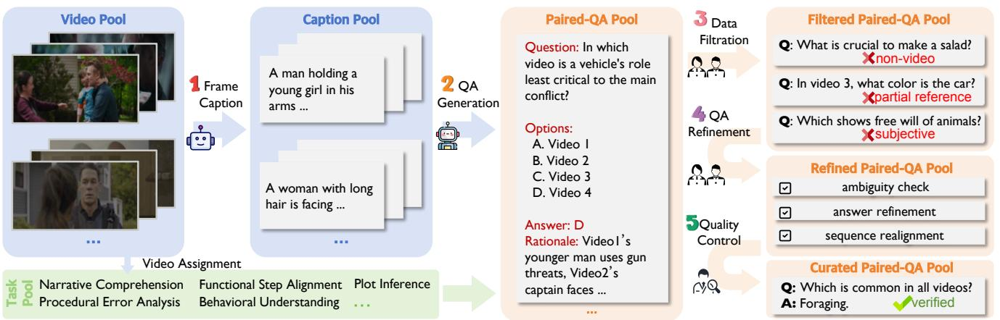
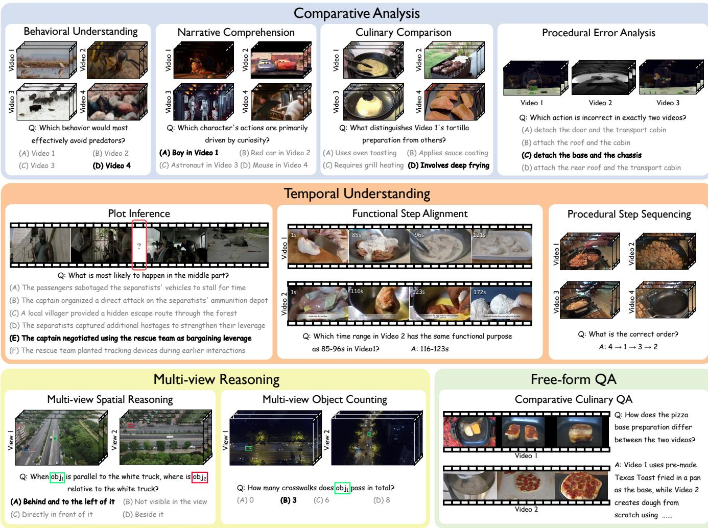
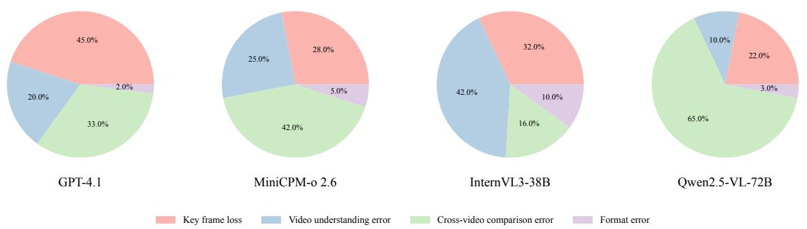

# 1. Bibliographic Information

## 1.1. Title
CrossVid: A Comprehensive Benchmark for Evaluating Cross-Video Reasoning in Multimodal Large Language Models

The title clearly states the paper's main contribution: the introduction of a new benchmark named `CrossVid`. It specifies that this benchmark is designed to evaluate a particular skill, `Cross-Video Reasoning (CVR)`, within a specific class of AI models, `Multimodal Large Language Models (MLLMs)`.

## 1.2. Authors
The authors are Jingyao Li, Jingyun Wang, Molin Tan, Haochen Wang, Cilin Yan, Likun Shi, Jiayin Cai, Xiaolong Jiang, and Yao Hu. All authors are affiliated with Xiaohongshu Inc., a major Chinese technology company known for its social media and e-commerce platform. This affiliation suggests the research is driven by practical industry needs for advanced video understanding capabilities.

## 1.3. Journal/Conference
The paper was submitted to arXiv, a popular open-access repository for electronic preprints of scientific papers. The specified publication date and some model versions (e.g., `Gemini-2.5-Pro`, `GPT-4.1`, `Qwen2.5-VL`) refer to future or hypothetical releases, which is a common practice in preprints to stay current with the fast-paced field of AI. As a preprint, this work has not yet undergone formal peer review for an official conference or journal publication. However, arXiv is a primary and highly influential dissemination channel in computer science.

## 1.4. Publication Year
The metadata indicates a publication year of 2025, suggesting this is a target or placeholder for a future official publication.

## 1.5. Abstract
The abstract introduces `Cross-Video Reasoning (CVR)` as a challenging task requiring the simultaneous understanding of multiple videos to compare and aggregate information. It points out that existing video benchmarks are insufficient, as they either focus on single videos or are limited to multi-view scenarios of the same scene. To address this gap, the paper presents `CrossVid`, the first comprehensive benchmark for CVR. `CrossVid` features a hierarchical task structure with four high-level dimensions and ten specific tasks. The dataset comprises 5,331 videos and 9,015 question-answering pairs in various formats. Experiments on 22 different MLLMs show that even the best-performing model, `Gemini-2.5-Pro`, only achieves 50.4% accuracy, highlighting the difficulty of CVR. The authors conclude that current models struggle to integrate information across videos, and `CrossVid` can serve as a crucial tool to guide future research in this area.

## 1.6. Original Source Link
- **Original Source Link:** https://arxiv.org/abs/2511.12263
- **PDF Link:** https://arxiv.org/pdf/2511.12263v2
- **Publication Status:** This is a preprint available on arXiv and has not yet been formally published in a peer-reviewed venue.

# 2. Executive Summary

## 2.1. Background & Motivation
- **Core Problem:** The ability of AI models to understand and reason about video content has advanced significantly. However, most evaluations focus on a model's ability to analyze a **single video** at a time. This is a critical limitation because many real-world scenarios require understanding relationships **across multiple videos**. For example, a user might want to compare two different tutorial videos to see which method is better, or a security system might need to synthesize information from multiple camera feeds to understand a complex event. This skill is termed `Cross-Video Reasoning (CVR)`.
- **Existing Gaps:** Prior to this work, there was no comprehensive benchmark to systematically evaluate CVR. Existing benchmarks fell into two categories:
    1.  **Single-Video Benchmarks:** The vast majority of datasets (`ActivityNet-QA`, `NExT-QA`) provide one video and ask a question about it. They cannot test a model's ability to compare or aggregate information.
    2.  **Limited Multi-Video Benchmarks:** Some recent datasets (`All-Angles Bench`, `Ego-Exo4D`) use multiple videos but are restricted to a narrow use case, typically `multi-view` scenarios where different videos show the exact same scene from different camera angles. They do not cover the broader diversity of CVR tasks, such as comparing different events, procedures, or narratives.
- **Innovative Idea:** The authors' key insight is to create the **first comprehensive benchmark**, `CrossVid`, that moves beyond the single-video and limited multi-view paradigms. `CrossVid` is specifically designed to evaluate a wide spectrum of CVR capabilities through a hierarchical task structure, diverse video sources, and multiple question formats, thereby reflecting the complexity of real-world video understanding.

## 2.2. Main Contributions / Findings
The paper makes several key contributions:

- **1. A Novel Comprehensive Benchmark (`CrossVid`):** The primary contribution is the `CrossVid` benchmark itself. It is a large-scale and diverse dataset designed for evaluating CVR. Its key features are:
    - **Scale:** 5,331 videos and 9,015 high-quality question-answer (QA) pairs.
    - **Hierarchical Structure:** Tasks are organized into 4 high-level dimensions (`Comparative Analysis`, `Temporal Understanding`, `Multi-view Reasoning`, `Free-form QA`) and 10 specific, fine-grained tasks (e.g., `Culinary Comparison`, `Plot Inference`).
    - **Diversity:** Includes single-choice, multiple-choice, and open-ended questions, with videos sourced from six different datasets covering a wide range of genres and durations.

- **2. Rigorous Construction Methodology:** The paper proposes a **semi-automated annotation pipeline** that combines the scalability of large models (`DeepSeek-R1` for QA generation) with the precision of human oversight. This multi-stage process includes dense frame captioning, guided QA generation, and meticulous manual filtering, refinement, and quality control, ensuring the final QA pairs are challenging and genuinely require cross-video reasoning.

- **3. Extensive Evaluation and Insights:** The authors conducted a comprehensive evaluation of 22 state-of-the-art MLLMs on `CrossVid`. This analysis yielded critical findings:
    - **CVR is a Major Challenge:** Current MLLMs are far from proficient at CVR. The best model, `Gemini-2.5-Pro`, scored only 50.4%, significantly below the human baseline of 89.2%. This demonstrates a clear performance gap.
    - **Model Architecture Matters:** Closed-source models (`GPT` series, `Gemini`) consistently outperform their open-source counterparts. Furthermore, models with explicit "thinking" or reasoning modules show a performance advantage, suggesting that complex reasoning benefits from dedicated architectural components.
    - **Identification of Failure Modes:** The analysis reveals that a core weakness of current MLLMs is their inability to effectively **integrate and compare evidence** distributed across multiple videos, even when they can understand each video in isolation.

# 3. Prerequisite Knowledge & Related Work

## 3.1. Foundational Concepts
To understand this paper, it's essential to be familiar with the following concepts:

- **Large Language Models (LLMs):** These are AI models, such as GPT-4 or LLaMA, trained on massive amounts of text data. Their primary capability is to understand, process, and generate human-like text. They form the "brain" or reasoning engine of the models discussed in the paper.
- **Multimodal Large Language Models (MLLMs):** MLLMs are an evolution of LLMs that can process information from multiple types of data (modalities) simultaneously, most commonly text and images/videos. A typical MLLM architecture consists of:
    1.  A **Visual Encoder:** A model (like a Vision Transformer or ViT) that converts visual input (frames from a video) into numerical representations (tokens).
    2.  A **Large Language Model:** The core reasoning component that processes both text tokens (from the user's question) and the visual tokens.
    3.  A **Projection Layer:** A small network that bridges the visual encoder and the LLM, aligning the visual tokens into a format that the LLM can understand.
        By combining these, an MLLM can "see" a video and answer questions about it in natural language.
- **Video Question Answering (VQA):** This is a benchmark task used to evaluate an AI's ability to comprehend video content. The model is given a video and a question (e.g., "What is the person doing?") and must provide a correct answer. `CrossVid` is a more advanced form of VQA that involves multiple videos per question.
- **Zero-Shot Learning:** This refers to a model's ability to perform a task without having received any specific training examples for that task. In this paper, the MLLMs are evaluated in a zero-shot setting, meaning they are tested on `CrossVid` directly without being fine-tuned on its training data. This tests their generalized reasoning abilities.
- **Chain-of-Thought (CoT) Prompting:** A technique used to improve the reasoning ability of LLMs. Instead of asking for a direct answer, the model is prompted to "think step-by-step" and generate a sequence of intermediate reasoning steps that lead to the final answer. This often helps the model break down complex problems and arrive at a more accurate solution.

## 3.2. Previous Works
The authors position `CrossVid` by comparing it to existing video understanding benchmarks. The following table, adapted from Table 1 in the paper, summarizes the landscape and highlights the gap `CrossVid` aims to fill.

<table>
<thead>
<tr>
<th>Benchmarks</th>
<th>#Videos</th>
<th>#QA pairs</th>
<th>Len. (s)</th>
<th>#Tasks</th>
<th>Anno.</th>
<th>Closed- ended</th>
<th>Open- ended</th>
<th>Multi- video</th>
<th>Multi- view</th>
</tr>
</thead>
<tbody>
<tr>
<td>TVQA (Lei et al. 2018)</td>
<td>2,179</td>
<td>15,253</td>
<td>11</td>
<td>3</td>
<td>M</td>
<td>✔</td>
<td>X</td>
<td>X</td>
<td>X</td>
</tr>
<tr>
<td>MVBench (Li et al. 2024b)</td>
<td>3,641</td>
<td>4,000</td>
<td>16</td>
<td>20</td>
<td>A</td>
<td>✔</td>
<td>X</td>
<td>X</td>
<td>X</td>
</tr>
<tr>
<td>ActivityNet-QA (Yu et al. 2019)</td>
<td>5,800</td>
<td>58,000</td>
<td>180</td>
<td>4</td>
<td>M</td>
<td>X</td>
<td>✔</td>
<td>×</td>
<td>X</td>
</tr>
<tr>
<td>NExT-QA (Xiao et al. 2021)</td>
<td>5,440</td>
<td>52,044</td>
<td>44</td>
<td>2</td>
<td>M</td>
<td>✔</td>
<td>✔</td>
<td>X</td>
<td>X</td>
</tr>
<tr>
<td>LongVideoBench (Wu et al. 2024)</td>
<td>3,763</td>
<td>6,678</td>
<td>473</td>
<td>17</td>
<td>M</td>
<td>✔</td>
<td>X</td>
<td>X</td>
<td>X</td>
</tr>
<tr>
<td>MMVU (Zhao et al. 2025)</td>
<td>1,529</td>
<td>3,000</td>
<td>51</td>
<td>27</td>
<td>M</td>
<td>✔</td>
<td>✔</td>
<td>x</td>
<td>X</td>
</tr>
<tr>
<td>Video-MME (Fu et al. 2025)</td>
<td>900</td>
<td>2,700</td>
<td>1,017</td>
<td>12</td>
<td>M</td>
<td>✔</td>
<td>X</td>
<td>X</td>
<td>X</td>
</tr>
<tr>
<td>MLVU (Zhou et al. 2024)</td>
<td>1,730</td>
<td>3,102</td>
<td>930</td>
<td>9</td>
<td>M+A</td>
<td>✔</td>
<td>✔</td>
<td>✔</td>
<td>X</td>
</tr>
<tr>
<td>Ego-Exo4D (Grauman et al. 2024)</td>
<td>5,035</td>
<td>-</td>
<td>156</td>
<td>4</td>
<td>M</td>
<td>X</td>
<td>X</td>
<td>✔</td>
<td>✔</td>
</tr>
<tr>
<td>EgoExoLearn (Huang et al. 2024)</td>
<td>747</td>
<td>-</td>
<td>-</td>
<td>4</td>
<td>M</td>
<td>✔</td>
<td>✔</td>
<td>✔</td>
<td>✔</td>
</tr>
<tr>
<td>All-Angles Bench (Yeh et al. 2025)</td>
<td>90 scenes</td>
<td>2,132</td>
<td>-</td>
<td>6</td>
<td>M</td>
<td>✔</td>
<td>✔</td>
<td>✔</td>
<td>✔</td>
</tr>
<tr>
<td><strong>CrossVid (Ours)</strong></td>
<td><strong>5,331</strong></td>
<td><strong>9,015</strong></td>
<td><strong>215</strong></td>
<td><strong>10</strong></td>
<td><strong>M+A</strong></td>
<td>✔</td>
<td>✔</td>
<td>✔</td>
<td>✔</td>
</tr>
</tbody>
</table>

*(Note: 'M' = Manual Annotation, 'A' = Automatic Annotation, '✔' = Supported, 'X' = Not Supported)*

From this comparison, we can see:
- **Single-Video Focus:** Most benchmarks like `TVQA` and `ActivityNet-QA` are marked with 'X' under `Multi-video`, confirming they operate on single videos.
- **Multi-View Limitation:** Benchmarks like `Ego-Exo4D` and `All-Angles Bench` are marked with '✔' for both `Multi-video` and `Multi-view`. This indicates their focus on understanding the same scene from different perspectives, which is a specific subset of CVR.
- **`CrossVid`'s Niche:** `CrossVid` is the first to be marked '✔' for `Multi-video` while not being limited to `Multi-view` scenarios. It also offers a balanced mix of closed-ended and open-ended questions, a large number of QA pairs, and a diverse set of 10 tasks, making it the most *comprehensive* benchmark for general CVR.

## 3.3. Technological Evolution
The field of video understanding has evolved through several stages:
1.  **Image Understanding:** Models first learned to classify and describe static images.
2.  **Short Video Understanding:** This extended to short video clips, focusing on action recognition (e.g., "playing basketball").
3.  **Long-form Video Understanding:** As models became more capable, benchmarks emerged to test comprehension of longer videos with complex narratives and temporal dependencies.
4.  **Multi-Modal Video Understanding:** Models began integrating video with other modalities like audio or text subtitles for richer comprehension.
5.  **Multi-View Understanding:** A recent trend focusing on fusing information from multiple cameras filming the same event to create a cohesive 3D or spatial understanding.

    `CrossVid` represents the next logical step in this evolution. It generalizes beyond the specific case of multi-view understanding to **general Cross-Video Reasoning**, where the videos may be semantically related (e.g., two different recipes for the same dish) but are not recordings of the same single event.

## 3.4. Differentiation Analysis
`CrossVid`'s core innovation lies in its **comprehensiveness and generality** for evaluating CVR. Compared to previous benchmarks, its key differentiators are:

- **Beyond Multi-View:** Unlike `All-Angles Bench`, `CrossVid` is not restricted to videos of the same scene. It includes tasks that require comparing completely different videos that are only semantically related, which is a much broader and more challenging problem.
- **Hierarchical and Diverse Tasks:** `CrossVid` introduces 10 distinct tasks organized into 4 dimensions. This structure is far more diverse than previous benchmarks and is designed to probe different facets of reasoning—comparative, temporal, spatial, and generative.
- **Hybrid Question Formats:** It includes single-choice, multiple-choice, and open-ended questions, allowing for a more holistic evaluation of a model's perception, reasoning, and generation capabilities.
- **Rigorous and Scalable Curation:** The semi-automated pipeline allows for the creation of a large-scale dataset while maintaining high quality through multiple stages of human verification, addressing a key challenge in benchmark creation.

# 4. Methodology
The core methodology of this paper is the design and construction of the `CrossVid` benchmark. The process is systematic and designed to produce high-quality, challenging QA pairs that genuinely test Cross-Video Reasoning.

## 4.1. Principles
The guiding principle behind `CrossVid` is to create a benchmark that forces MLLMs to move beyond simple perception within a single video. It aims to evaluate a model's ability to perform higher-order cognitive tasks by **integrating, comparing, and reasoning over information distributed across multiple related videos**. The tasks are designed such that answering correctly is impossible by looking at only one video.

## 4.2. Core Methodology In-depth (The CrossVid Construction Pipeline)
The authors developed a sophisticated semi-automated, multi-stage pipeline to create `CrossVid`. This process is visualized in Figure 4 of the paper and can be broken down into the following steps:

*该图像是一个示意图，展示了CrossVid基准的任务流程，包括视频池和标题池的生成、QA配对及筛选过程。图中详细描述了视频分配、数据滤波和质量控制的各个步骤，旨在评估多模态大语言模型在跨视频推理中的表现。*

### 4.2.1. Step 1: Video Curation
The foundation of the benchmark is a diverse set of videos. The authors curated 5,331 video clips from six publicly available datasets: `Animal Kingdom`, `MovieChat-1K`, `YouCook2`, `VisDrone`, `Charades`, and `Assembly101`. This selection ensures a wide variety of:
- **Content:** Wildlife, movies, cooking, drone footage, daily activities, and procedural assembly.
- **Visual Complexity:** From simple actions to complex cinematic scenes.
- **Temporal Characteristics:** Varying video lengths and action densities.
- **Inter-Video Correlation:** The selected videos allow for meaningful comparisons and aggregations.

### 4.2.2. Step 2: Hierarchical Task Design
Based on the curated videos, the authors designed a hierarchical structure of tasks to evaluate different aspects of CVR.

*该图像是一个综合分析图，展示了跨视频推理任务的不同方面，包括行为理解、叙事理解、时间理解和多视角推理。图中包含了多个视频片段及相应的问题，反映出在多模态大语言模型中的挑战和评估标准。*

This hierarchy consists of:
- **4 High-Level Dimensions:**
    1.  `Comparative Analysis`: Comparing attributes, actions, or narratives.
    2.  `Temporal Understanding`: Reasoning about time, sequence, and causality.
    3.  `Multi-view Reasoning`: Spatial reasoning from different perspectives.
    4.  `Free-form QA`: Generating detailed, open-ended comparative answers.
- **10 Specific Tasks:** Each dimension is broken down into specific tasks. For example, `Comparative Analysis` includes `Behavioral Understanding (BU)`, `Narrative Comprehension (NC)`, `Culinary Comparison (CC)`, and `Procedural Error Analysis (PEA)`. These tasks ensure a comprehensive and fine-grained evaluation.

### 4.2.3. Step 3: Semi-Automated Data Annotation
This is the most intricate part of the methodology, combining automated generation with rigorous human oversight.

1.  **Frame Captioning:**
    - To provide the generation model with a manageable summary of the video content, frames are first densely extracted.
    - These frames are then captioned using a powerful MLLM (`Qwen2.5-VL-72B`).
    - Crucially, metadata from the original datasets (e.g., plot summaries, action labels) is included in the prompt to the captioning model, enriching the captions with essential context.

2.  **QA Generation (Automated):**
    - Videos are manually assigned to the most suitable predefined tasks (e.g., cooking videos for temporal tasks).
    - Within each task, videos are clustered based on their original labels (e.g., same recipe in `YouCook2`). This ensures that videos grouped for a single question are semantically related and comparable.
    - An advanced LLM, `DeepSeek-R1`, is used to automatically generate QA pairs. It is prompted with the frame-level captions of a group of sampled videos.
    - The prompts for `DeepSeek-R1` are carefully engineered to ensure high-quality output. They instruct the model to:
        - Analyze relationships across all provided videos.
        - Generate questions that align with the specific reasoning skill of the task.
        - Provide a detailed explanation for its answer, which helps reduce model "hallucinations" and serves as a rationale for later human review.

3.  **Data Filtration (Manual):**
    - The automatically generated QA pairs undergo a coarse filtering stage by ten expert human annotators.
    - This three-step process removes:
        - Questions unrelated to video content.
        - Questions that can be answered by looking at only one video (e.g., "In video three, what color is the car?"). This is critical to ensure the benchmark tests *cross-video* reasoning.
        - Subjective or overly complex questions (e.g., philosophical questions).

4.  **QA Refinement (Manual):**
    - The retained QA pairs are further refined by annotators.
    - **Question Clarification:** Questions are rephrased to eliminate ambiguity.
    - **Independent Answering:** Annotators answer the questions themselves without looking at the model-generated answer to ensure the question is answerable and to generate a human-verified ground truth.
    - **Task-Specific Refinements:**
        - For multiple-choice questions, distractors (false options) are revised to be plausible yet clearly incorrect.
        - For the `Functional Step Sequencing (PSS)` task, a clever technique called **temporal realignment** is used. Clips are slightly shifted in time to create visual discontinuities, forcing the model to rely on semantic understanding of the procedure rather than low-level visual cues like camera angle continuity.
        - For open-ended questions, annotators verify that the standard answer covers all key points required by the question.

5.  **Quality Control:**
    - A final, independent group of experts reviews the refined QA pool to perform a last check for quality and consistency.
    - This entire process is facilitated by a custom annotation interface, ensuring efficiency and accuracy.

      Through this robust pipeline, the authors constructed the `CrossVid` benchmark, containing 9,015 high-quality QA pairs that are specifically designed to challenge the CVR capabilities of modern MLLMs.

# 5. Experimental Setup

## 5.1. Datasets
The primary dataset used for experiments is the newly proposed **`CrossVid`** benchmark itself.
- **Source:** Created by the authors using videos from 6 public datasets (`Animal Kingdom`, `MovieChat-1K`, `YouCook2`, `VisDrone`, `Charades`, `Assembly101`).
- **Scale:** 5,331 videos and 9,015 QA pairs.
- **Characteristics:** The benchmark is defined by its 10 hierarchical tasks, which span comparative, temporal, spatial, and generative reasoning. On average, each query requires a model to process and reason over approximately 770 seconds of video content.
- **Data Sample Example:** The paper provides example questions for each task in Table 7. For instance:
    - **Task:** `Culinary Comparison (CC)`
    - **Question Type:** Single-Choice
    - **Example Question:** "What distinguishes the final seasoning step in Video 4 compared to others?"
      This question requires the model to watch at least four videos, identify the "final seasoning step" in each, and then perform a comparison to find the unique characteristic in Video 4.

The choice of this new dataset is the entire point of the paper: to provide a means to validate CVR capabilities, which existing datasets cannot do effectively.

## 5.2. Evaluation Metrics
The paper uses different metrics tailored to the question format of each task.

### 5.2.1. Accuracy
- **Conceptual Definition:** This metric measures the percentage of questions a model answers correctly. It is used for tasks with definite answers, such as single-choice and multiple-choice questions.
- **Calculation:** For single-choice questions, the answer is correct if it matches the single ground truth option. For multiple-choice questions, the model's answer is only considered correct if it is an **exact match** to the set of ground truth options (e.g., if the correct answer is 'A and B', providing 'A' or 'A, B, and C' is incorrect).
- **Mathematical Formula:**
  \$
    \text{Accuracy} = \frac{\text{Number of Correctly Answered Questions}}{\text{Total Number of Questions}}
    \$

### 5.2.2. Intersection over Union (IoU)
- **Conceptual Definition:** This metric is specifically used for the `Functional Step Alignment (FSA)` task, where the model must identify a time interval in one video that corresponds to a given interval in another. IoU measures the overlap between the predicted time interval and the ground truth time interval. A higher IoU indicates a more accurate temporal localization.
- **Mathematical Formula:** The paper provides the exact formula for calculating IoU for temporal segments:
  \$
    \mathrm{IoU} = \frac{\max(0, \min(A_{end}, G_{end}) - \max(A_{start}, G_{start}))}{\max(A_{end}, G_{end}) - \min(A_{start}, G_{start})}
    \$
- **Symbol Explanation:**
    - $[A_{start}, A_{end}]$: The start and end timestamps of the time interval **predicted** by the model.
    - $[G_{start}, G_{end}]$: The start and end timestamps of the **ground truth** time interval.
    - The numerator calculates the length of the intersection (overlap) of the two intervals.
    - The denominator calculates the length of the union of the two intervals.

### 5.2.3. GPT-4.1-based Scoring
- **Conceptual Definition:** This metric is used for the open-ended `Comparative Culinary QA (CCQA)` task, where answers are free-form text. Since automatic exact-match evaluation is not possible, a powerful LLM (`GPT-4.1`) is used as a judge to score the quality of the model's generated answer against a standard answer and a set of key scoring points.
- **Calculation:** The scoring is a two-stage process:
    1.  **Coverage Score:** For each predefined scoring point, `GPT-4.1` checks if the model's answer covers that point (1 point if yes, 0 if no).
    2.  **Accuracy Score:** For the points that were covered, `GPT-4.1` then checks if the details in the model's answer exactly match the details in the standard answer (an additional 1 point if yes, 0 if no).
- **Mathematical Formula:**
  \$
    \text{Final Score} = \frac{\sum(\text{Coverage Points}) + \sum(\text{Accuracy Points})}{2 \times \text{Total Number of Scoring Points}}
    \$

## 5.3. Baselines
The paper evaluates a wide and representative set of 22 MLLMs to establish strong baselines on `CrossVid`. These models were chosen to cover different architectures, parameter sizes, and origins (closed-source vs. open-source).

- **Closed-Source Models:** These are proprietary models accessed via APIs.
    - `GPT-4.1`, `GPT-4o` (from OpenAI)
    - `Gemini-2.5-Pro` (from Google)
    - `Doubao-1.5-VL-pro` (from ByteDance)
- **Open-Source Models:** These are publicly available models. They are grouped by parameter size and architecture.
    - **Mixture of Experts (MoE):** `Kimi-VL-A3B-Thinking`, `ERNIE-4.5-VL-A3B`
    - **<10 Billion Parameters:** `Qwen2.5-VL-7B`, `InternVL3-8B`, `Phi-3.5-vision`, `MiMo-7B`
    - **~30 Billion Parameters:** `Qwen2.5-VL-32B`, `InternVL3-38B`
    - **~70 Billion Parameters:** `Qwen2.5-VL-72B`, `InternVL3-78B`, `LLaVA-Video-72B`

      These baselines are representative because they include the most powerful models available at the time of writing, as well as popular open-source alternatives across the size spectrum, providing a comprehensive view of the current state of the art.

# 6. Results & Analysis
The experimental results provide a clear picture of the current capabilities and limitations of MLLMs on Cross-Video Reasoning tasks.

## 6.1. Core Results Analysis
The main results are presented in Table 2, which shows the performance of all 22 evaluated MLLMs across the 10 tasks and 4 dimensions of `CrossVid`.

The following are the results from Table 2 of the original paper:

<table>
<thead>
<tr>
<th rowspan="2">Models</th>
<th rowspan="2">O.Avg</th>
<th colspan="4">Comparative Analysis</th>
<th colspan="4">Temporal Understanding</th>
<th colspan="3">Multi-view Reasoning</th>
<th rowspan="2">Free-form CCQA</th>
</tr>
<tr>
<th>BU</th>
<th>NC</th>
<th>CC</th>
<th>PEA</th>
<th>C.Avg</th>
<th>PI</th>
<th>FSA</th>
<th>PSS</th>
<th>T.Avg</th>
<th>MSR</th>
<th>MOC</th>
<th>M.Avg</th>
</tr>
</thead>
<tbody>
<tr>
<td>Human</td>
<td>89.2</td>
<td>85.6</td>
<td>92.3</td>
<td>90.7</td>
<td>83.9</td>
<td>88.1</td>
<td>91.6</td>
<td>85.2</td>
<td>89.9</td>
<td>88.9</td>
<td>93.2</td>
<td>94.2</td>
<td>93.7</td>
<td>85.2</td>
</tr>
<tr>
<td colspan="15"><strong>Closed-Source Models</strong></td>
</tr>
<tr>
<td>GPT-4.1 (2025)</td>
<td>45.2</td>
<td>46.2</td>
<td>34.6</td>
<td>58.5</td>
<td>51.2</td>
<td>47.6</td>
<td>70.9</td>
<td>8.6</td>
<td>60.5</td>
<td>46.7</td>
<td>38.6</td>
<td>38.2</td>
<td>38.4</td>
<td>44.6</td>
</tr>
<tr>
<td>GPT-4o (2024)</td>
<td>36.8</td>
<td>38.2</td>
<td>34.3</td>
<td>50.7</td>
<td>49.1</td>
<td>43.1</td>
<td>57.8</td>
<td>9.1</td>
<td>39.7</td>
<td>35.5</td>
<td>15.3</td>
<td>39.4</td>
<td>27.4</td>
<td>34.2</td>
</tr>
<tr>
<td>Doubao-1.5-VL-pro (2025a)</td>
<td>44.3</td>
<td>51.2</td>
<td>58.1</td>
<td>69.5</td>
<td>36.4</td>
<td>53.8</td>
<td>66.9</td>
<td>4.6</td>
<td>36.8</td>
<td>36.1</td>
<td>37.4</td>
<td>32.0</td>
<td>34.7</td>
<td>50.1</td>
</tr>
<tr>
<td>Gemini-2.5-Pro (2025)</td>
<td><strong>50.4</strong></td>
<td><strong>54.2</strong></td>
<td><strong>51.8</strong></td>
<td><strong>68.7</strong></td>
<td>44.1</td>
<td><strong>54.7</strong></td>
<td><strong>76.5</strong></td>
<td><strong>13.4</strong></td>
<td><strong>78.2</strong></td>
<td><strong>56.0</strong></td>
<td>32.0</td>
<td>25.3</td>
<td>28.7</td>
<td><strong>59.8</strong></td>
</tr>
<tr>
<td colspan="15"><strong>Open-Source Models ~ MoE</strong></td>
</tr>
<tr>
<td>Kimi-VL-A3B-Thinking (2025)</td>
<td>28.2</td>
<td>29.4</td>
<td>33.3</td>
<td>36.8</td>
<td>34.0</td>
<td>33.4</td>
<td>40.6</td>
<td>3.8</td>
<td>9.2</td>
<td>17.9</td>
<td>28.4</td>
<td>36.9</td>
<td>32.7</td>
<td>29.2</td>
</tr>
<tr>
<td>ERNIE-4.5-VL-A3B (2025)</td>
<td>24.8</td>
<td>12.6</td>
<td>28.2</td>
<td>24.2</td>
<td>36.4</td>
<td>25.4</td>
<td>52.6</td>
<td>4.0</td>
<td>2.4</td>
<td>19.7</td>
<td>29.6</td>
<td>35.3</td>
<td>32.5</td>
<td>22.5</td>
</tr>
<tr>
<td colspan="15"><strong>Open-Source Models &lt;10B</strong></td>
</tr>
<tr>
<td>Qwen2.5-VL-7B (2025)</td>
<td>18.3</td>
<td>19.6</td>
<td>19.0</td>
<td>23.4</td>
<td>15.0</td>
<td>19.3</td>
<td>58.6</td>
<td>1.2</td>
<td>0.3</td>
<td>20.0</td>
<td>11.8</td>
<td>21.7</td>
<td>16.8</td>
<td>12.0</td>
</tr>
<tr>
<td>InternVL3-8B (2025)</td>
<td>25.6</td>
<td>15.2</td>
<td>22.8</td>
<td>24.3</td>
<td>42.1</td>
<td>26.1</td>
<td>56.2</td>
<td>3.2</td>
<td>1.5</td>
<td>20.3</td>
<td><strong>34.0</strong></td>
<td><strong>47.3</strong></td>
<td><strong>40.7</strong></td>
<td>9.7</td>
</tr>
<tr>
<td>... (other models) ...</td>
<td>...</td>
<td>...</td>
<td>...</td>
<td>...</td>
<td>...</td>
<td>...</td>
<td>...</td>
<td>...</td>
<td>...</td>
<td>...</td>
<td>...</td>
<td>...</td>
<td>...</td>
<td>...</td>
</tr>
</tbody>
</table>

Analysis of these results leads to three primary observations:

1.  **CVR is Extremely Challenging for MLLMs:** There is a massive performance gap between the best MLLM and humans. `Gemini-2.5-Pro` achieves an overall average (`O.Avg`) of **50.4%**, while human performance is **89.2%**. This 38.8-point gap underscores that CVR is far from a solved problem. The gap is particularly stark in `Temporal Understanding` tasks. For instance, on `Functional Step Alignment (FSA)`, the best model (`Gemini-2.5-Pro`) scores only **13.4%**, while humans achieve **85.2%**. This indicates that models are extremely poor at aligning semantic steps across different videos.

2.  **Closed-Source Models Substantially Outperform Open-Source Counterparts:** The top four performing models are all closed-source (`Gemini-2.5-Pro`, `GPT-4.1`, `Doubao-1.5-VL-pro`, `GPT-4o`). The best open-source model, `GLM-4.1V-9B-Thinking`, scores 35.1%, which is significantly lower than the top closed-source models. This advantage is especially prominent on complex reasoning tasks, suggesting that the proprietary architectures and vast training data of closed-source models give them a distinct edge.

3.  **"Thinking"-Enabled Models Demonstrate Performance Gains:** Models explicitly designed with internal reasoning modules (often referred to as "thinking" models) tend to perform better. For example, `GLM-4.1V-9B-Thinking` (35.1%) and `MiMo-7B` (28.3%) are the top two performers in the <10B open-source category. The authors argue that this internal "thinking" mechanism helps models structure the multi-step reasoning process required for CVR, leading to better performance.

## 6.2. Ablation Studies / Parameter Analysis

### 6.2.1. Impact of Frame Number
To understand how the amount of visual information affects performance, the authors evaluated `Qwen2.5-VL-72B` with a varying number of input frames (32, 64, 128, 256).

The following are the results from Table 3 of the original paper:

| #Frames | O.Avg | C.Avg | T.Avg | M.Avg | CCQA |
| :--- | :--- | :--- | :--- | :--- | :--- |
| 32 | 33.8 | 37.0 | 33.8 | 35.1 | 18.9 |
| 64 | 36.9 | 39.8 | 37.4 | 35.9 | 25.9 |
| 128 | 39.1 | 45.7 | 34.5 | 36.4 | 32.0 |
| 256 | 39.5 | 47.5 | 33.9 | 34.9 | 34.0 |

- **More Frames Generally Help:** Performance generally improves as the number of frames increases. The overall accuracy (`O.Avg`) rises from 33.8% to 39.5%. The improvement is most significant for tasks requiring rich contextual detail, like `Comparative Analysis` (`C.Avg`) and especially the open-ended `CCQA`, which saw a **15.1%** jump. This is because more frames provide more visual evidence for detailed comparisons.
- **The "Noise" Counterpoint:** However, the authors astutely note that more frames are not always better. They provide an anecdote where increasing frames for a `Plot Inference` task introduced irrelevant "atmospheric" information that distracted the model from the core causal events, leading to an incorrect answer. This highlights a critical trade-off: while more frames increase information, they can also introduce noise. This suggests that intelligent **key frame selection** is a crucial area for future research.

### 6.2.2. Effectiveness of CoT Prompts
The authors investigated whether `Chain-of-Thought (CoT)` prompting could boost the performance of models without built-in "thinking" mechanisms.

The following are the results from Table 4 of the original paper:

<table>
<tr>
<td>Method</td>
<td>O.Avg</td>
<td>C.Avg</td>
<td>T.Avg</td>
<td>M.Avg</td>
<td>CCQA</td>
</tr>
<tr>
<td colspan="6"><strong>GPT-4.1</strong></td>
</tr>
<tr>
<td>w/o CoT</td>
<td>45.2</td>
<td>47.6</td>
<td>46.7</td>
<td>38.4</td>
<td>44.6</td>
</tr>
<tr>
<td>w/ CoT</td>
<td>44.9</td>
<td>46.7</td>
<td>48.2</td>
<td>40.4</td>
<td>36.7</td>
</tr>
<tr>
<td colspan="6"><strong>... (other models) ...</strong></td>
</tr>
<tr>
<td colspan="6"><strong>Qwen2.5-VL-72B</strong></td>
</tr>
<tr>
<td>w/o CoT</td>
<td>34.4</td>
<td>42.1</td>
<td>29.2</td>
<td>23.5</td>
<td>41.2</td>
</tr>
<tr>
<td>w/ CoT</td>
<td>39.5</td>
<td>47.5</td>
<td>33.9</td>
<td>34.9</td>
<td>34.0</td>
</tr>
</table>

- **Mixed but Positive Impact:** CoT prompting does not universally improve performance on all tasks or for all models. However, it shows notable gains on `Temporal Understanding` and `Multi-view Reasoning` tasks for several models.
- **Larger Models Benefit More:** The largest open-source model, `Qwen2.5-VL-72B`, showed the most significant overall gain (from 34.4% to 39.5%). This suggests that a model requires a certain level of capacity and instruction-following ability to effectively leverage the structured reasoning provided by a CoT prompt.

### 6.2.3. Error Analysis
A manual analysis of model errors revealed four primary failure modes:

*该图像是一个饼图，展示了四种多模态大语言模型（MLLM）在不同错误类型上的百分比，包括关键帧损失、视频理解错误、跨视频比较错误和格式错误。每个模型（GPT-4.1、MiniCPM-o 2.6、InternVL3-38B 和 Qwen2.5-VL-72B）对应的错误类型比例有所不同，反映了它们在视频理解任务中的表现差异。*

1.  **Key Frame Loss (e.g., Qwen2.5-VL-72B has 25% of this error):** Because multiple videos are input simultaneously, the number of frames sampled per video is limited. This can cause the model to miss crucial but brief events (e.g., a character coating foie gras with flour), leading to incorrect answers based on incomplete information.
2.  **Video Understanding Error (e.g., GPT-4.1 has 33% of this error):** The model understands the question but fails to correctly interpret the content of *one* of the videos. Since CVR requires a correct understanding of all inputs, this single point of failure causes the entire reasoning process to collapse.
3.  **Cross-Video Comparison Error (e.g., MiniCPM-o 2.6 has 35% of this error):** This is the most crucial finding. Models often demonstrate a correct understanding of each individual video but **fail at the final step of comparing or aggregating the information**. For example, a model might correctly identify a hug in all provided film clips but fail to reason about which hug contextually represents the "resolution of a crisis."
4.  **Format Error (e.g., InternVL3-38B has 32% of this error):** The model fails to adhere to the specific output format required by the prompt (e.g., providing a text description instead of a time interval), resulting in an unparsable or incorrect answer.

# 7. Conclusion & Reflections

## 7.1. Conclusion Summary
The paper successfully introduces `CrossVid`, the first large-scale, comprehensive benchmark for evaluating `Cross-Video Reasoning (CVR)` in Multimodal Large Language Models. By creating a diverse suite of 10 hierarchical tasks and 9,015 challenging QA pairs, the authors have filled a significant gap in the evaluation landscape of video understanding. The extensive experiments on 22 leading MLLMs reveal that CVR is a profound challenge for current models, with even the most advanced systems like `Gemini-2.5-Pro` performing far below human levels. The detailed error analysis pinpoints the core difficulty in integrating and comparing information across multiple video streams. The authors conclude that `CrossVid` is a valuable resource that can catalyze and guide future advancements in developing more robust and generalizable visual reasoning models.

## 7.2. Limitations & Future Work
While the authors do not explicitly list limitations of their own work, the paper's findings strongly imply several key directions for future research:

- **Improving Core CVR Capabilities:** The stark performance gap between models and humans highlights an urgent need for novel architectures and training methods specifically designed to handle CVR. This includes developing better mechanisms for information integration and comparison across modalities.
- **Enhanced Context Management:** The "key frame loss" and "noise" issues suggest that future models need more sophisticated video processing front-ends. Instead of uniform frame sampling, methods for adaptive keyframe selection that can identify and prioritize semantically important moments are crucial.
- **Boosting Explicit Reasoning:** The superior performance of "thinking"-enabled models suggests that incorporating more explicit, structured reasoning processes—whether through architectural design or advanced prompting techniques—is a promising path forward for tackling complex, multi-step reasoning tasks.
- **Fine-tuning on CVR Data:** The `CrossVid` benchmark itself can be used not just for evaluation but also as a fine-tuning dataset to directly teach models CVR skills.

## 7.3. Personal Insights & Critique
- **Significance and Inspiration:** This paper is an excellent example of progress in AI being driven not just by new models, but by better evaluation. By identifying a critical, under-explored capability (`CVR`) and systematically building a tool to measure it, the authors have created a clear target for the research community to aim for. The semi-automated annotation pipeline is a particularly insightful contribution, offering a practical template for creating high-quality, large-scale datasets in an era of powerful generative models.

- **Transferability:** The core concept of "cross-source reasoning" is highly transferable. The methodology used to build `CrossVid` could be adapted to create benchmarks for other domains, such as:
    - **Cross-Document QA:** Answering questions that require synthesizing information from multiple articles or reports.
    - **Cross-Audio Analysis:** Comparing speaker sentiment or content across different audio recordings.
    - **Cross-Modal Fact-Checking:** Verifying a claim by comparing a text description against evidence from multiple images and videos.

- **Potential Issues and Critique:**
    - **Inherent Bias in Generation Models:** The use of `DeepSeek-R1` for initial QA generation, while practical, may embed subtle biases or common failure modes of that specific model into the benchmark. While extensive manual review mitigates this, it cannot be eliminated entirely. The benchmark may inadvertently be easier for models with architectures similar to `DeepSeek-R1`.
    - **Evaluation with LLMs:** Using `GPT-4.1` to score open-ended answers is a common and necessary practice, but it is not a perfect substitute for human judgment. The evaluation itself is subject to the biases and limitations of the scoring model.
    - **Static Nature of Benchmarks:** Any benchmark is a static snapshot of a problem. As models become more powerful, they may learn to "game" the benchmark by exploiting statistical regularities rather than performing genuine reasoning. The diversity of tasks in `CrossVid` helps to make it more robust against this, but it remains a long-term challenge for the field.
    - **Speculative Model Versions:** The use of forward-looking model names like `Gemini-2.5-Pro` and `GPT-4.1` makes the results timely but also slightly speculative. This is a pragmatic choice in a fast-moving field but is worth noting.