# CrossVid：多模态大语言模型中跨视频推理评估的综合基准

晶瑶 $\mathbf { L i } ^ { 1 \ast }$ , 静云 王1 \*, 莫林 谈1\*, 昊辰 王', 慈林 阎1, 良坤 史', 佳音 蔡1 †, 萧龙 蒋1, 耀 胡1 1小红书有限公司，中国 {lijingyao, tanmolin, shilikun, laige} $@$ xiaohongshu.com, {clyanhh, yaoohu} $@$ gmail.com, 1411249598@qq.com, h.wang3@uva.nl, caijy18@tsinghua.org.cn

# 摘要

跨视频推理（CVR）在视频理解中提出了显著挑战，它需要对多个视频进行同时理解，以便在视频组之间聚合和比较信息。大多数现有的视频理解基准关注单视频分析，未能评估多模态大语言模型（MLLMs）在同时推理不同视频能力上的表现。最近的基准评估了MLLMs在捕捉同一场景不同视角的多视角视频中的能力。然而，它们的任务有限，阻碍了对MLLMs在多样化现实世界CVR场景中表现的全面评估。为此，我们推出了CrossVid，这是第一个旨在全面评估MLLMs在跨视频背景下时空推理能力的基准。首先，CrossVid涵盖了广泛的层次任务，包括四个高层次维度和十个具体任务，密切反映了现实世界视频理解的复杂多样性。其次，CrossVid提供了5,331个视频，以及9,015对具有挑战性的问题回答对，涵盖单选、多选和开放式问题格式。通过对各种开源和闭源的MLLMs进行广泛实验，我们观察到Gemini2.5-Pro在CrossVid上表现最佳，平均准确率达到了50.4%。值得注意的是，我们的深入案例研究表明，当前大多数MLLMs在CVR任务上表现不佳，主要是由于它们无法整合或比较分散在多个视频中的证据进行推理。这些洞见突显了CrossVid在指导未来提升MLLMs CVR能力方面的潜力。

# 数据集 — https://github.com/chuntianli666/Cross Vid

# 引言

随着多模态大语言模型（MLLMs）的快速发展（Bai et al. 2025；Hurst et al. 2024；Comanici et al. 2025），视频推理（Lin et al. 2023；Chen et al. 2024；Shu et al. 2025；Zhang, Li, and Bing 2023）作为评估MLLMs推理能力的重要试验平台应运而生。然而，目前大多数现有的基准（Fu et al. 2025；Xiao et al. 2021；Yu et al. 2019）主要集中于单视频分析，这严重限制了对MLLMs在跨多个视频的更复杂任务中推理能力的评估。

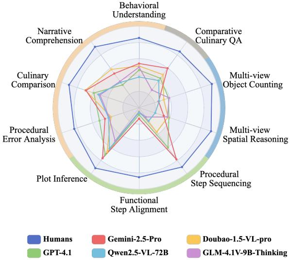  

Figure 1: Performance of MLLMs on CrossVid.

跨视频推理（CVR）是视频推理领域内一项具有挑战性但至关重要的任务。CVR旨在聚合和比较来自不同视频的信息，需要同时理解多个视频。近期的研究，All-Angles Bench（Yeh 等，2025），评估了多视角视频组上大规模语言模型（MLLMs）的表现，每个视频捕捉同一场景的不同视角。然而，All-Angles Bench 的任务仅限于显示相同场景的多视角视频，限制了对 MLLMs 在真实世界多样复杂场景中 CVR 能力的全面评估。为此，我们提出了 CrossVid，这是第一个旨在从之前的单查询、单视频范式进阶到单查询、多视频理解的视频推理基准，并全面评估 MLLMs 在 CVR 上的时空推理能力。CrossVid 特征广泛的分层任务，反映真实世界视频理解场景的多样性。它由 4 个高层维度组成，包括比较分析、时间理解、多视角推理和自由格式问答，共包含 10 个具体任务。CrossVid 包含 5,331 个视频和 9,015 对具有挑战性的问答对，覆盖单项选择题、复选择题和开放式问题格式。平均而言，每个查询需要 MLLMs 理解约 770 秒的视频内容。为了确保精准的标注，我们开发了半自动化标注流程，并聘请了 10 名专家标注员协助构建。

<table><tr><td>Benchmarks</td><td>#Videos</td><td>#QA pairs</td><td>Len. (s)</td><td>#Tasks</td><td>Anno.</td><td>Closed- ended</td><td>Open- ended</td><td>Multi- video</td><td>Multi- view</td></tr><tr><td>TVQA (Lei et al. 2018)</td><td>2,179</td><td>15,253</td><td>11</td><td>3</td><td>M</td><td></td><td>X</td><td>X</td><td>X</td></tr><tr><td>MVBench (Li et al. 2024b)</td><td>3,641</td><td>4,000</td><td>16</td><td>20</td><td>A</td><td></td><td>X</td><td>X</td><td>X</td></tr><tr><td>ActivityNet-QA (Yu et al. 2019)</td><td>5,800</td><td>58,000</td><td>180</td><td>4</td><td>M</td><td>X</td><td></td><td>×</td><td></td></tr><tr><td>NExT-QA (Xiao et al. 2021)</td><td>5,440</td><td>52,044</td><td>44</td><td>2</td><td>M</td><td></td><td></td><td>X</td><td></td></tr><tr><td>LongVideoBench (Wu et al. 2024)</td><td>3,763</td><td>6,678</td><td>473</td><td>17</td><td>M</td><td></td><td>X</td><td>X</td><td></td></tr><tr><td>MMVU (Zhao et al. 2025)</td><td>1,529</td><td>3,000</td><td>51</td><td>27</td><td>M</td><td></td><td></td><td>x</td><td></td></tr><tr><td>Video-MME (Fu et al. 2025)</td><td>900</td><td>2,700</td><td>1,017</td><td>12</td><td>M</td><td></td><td>X</td><td>X</td><td>2</td></tr><tr><td>MLVU (Zhou et al. 2024)</td><td>1,730</td><td>3,102</td><td>930</td><td>9</td><td>M+A</td><td></td><td></td><td></td><td>X</td></tr><tr><td>Ego-Exo4D (Grauman et al. 2024)</td><td>5,035</td><td>-</td><td>156</td><td>4</td><td>M</td><td>X</td><td>X</td><td></td><td></td></tr><tr><td>EgoExoLearn (Huang et al. 2024)</td><td>747</td><td>-</td><td>-</td><td>4</td><td>M</td><td></td><td></td><td></td><td></td></tr><tr><td>All-Angles Bench (Yeh et al. 2025)</td><td>90 scenes</td><td>2,132</td><td>-</td><td>6</td><td>M</td><td></td><td></td><td></td><td></td></tr><tr><td>CrossVid (Ours)</td><td>5,331</td><td>9,015</td><td>215</td><td>10</td><td>M+A</td><td></td><td></td><td></td><td></td></tr></table>

在 CrossVid 上进行了大量实验，涵盖了多种具有代表性的闭源（Hurst et al. 2024; Comanici et al. 2025）和开源 MLLMs（Bai et al. 2025; Zhu et al. 2025），参数范围从 7B 到 78B，架构多样。如图 1 所示，尽管当前的 MLLMs 在单视频任务上表现出色，但在 CVR 上仍然面临困境。值得注意的是，Gemini-2.5-Pro 达到了最佳平均准确率 50.4%。此外，我们根据实验结果提供了多个关键洞见，进一步验证了我们提出的 CrossVid 为 MLLMs 在视频推理方面的未来发展开辟了新途径。我们的详细案例研究和消融实验确认，尽管不断进展，MLLMs 在聚合和比较分布在多个视频中的证据方面仍然困难，这是现实世界 CVR 的基本能力。总之，我们的主要贡献为：• 我们提出了 CrossVid，这是第一个系统评估 MLLMs CVR 能力的基准。CrossVid 包括跨越四个高层维度和十个具体任务的分层任务。该数据集是在严格质量控制下，采用半自动注释流程构建。它包含 9,015 对高质量的问答对和 5,331 个视频，包括封闭式和开放式问题格式。• 我们对 22 个具有代表性的闭源和开源 MLLMs 进行了广泛的实验。我们的详细案例分析和消融研究提供了对 MLLMs 在 CVR 目前局限性的关键洞见，为未来在 MLLMs 视频理解方面的改善铺平了道路。

# 相关工作

# 视频理解大语言模型

大语言模型与视觉编码器的结合，经过在下游任务上的微调，已在视频理解领域取得显著进展（Zhang, Li, and Bing 2023; Lin et al. 2023; Zhang et al. 2024b）。以往的研究主要集中在单视频理解，通过关键帧选择（Tang et al. 2025; Gong et al. 2025）和词元压缩（Shu et al. 2025; Song et al. 2024）来完成视频字幕生成、动作识别和长视频理解等任务。值得注意的是，像 Qwen2.5-VL（Bai et al. 2025）这样的模型，已经显示出处理小时长视频和改善时间推理的能力。然而，尽管这些进展，现有的大多数开源大语言模型仍未经过全面的CVR训练（即，跨多个输入视频的联合推理）。一些近期工作（Reilly et al. 2025）开始探索跨视角理解，但并未推广到更广泛的多视频设置。

# 视频问答基准测试

视频问答（VQA）基准主要集中在评估模型理解和推理单个视频的能力。早期的工作如 TVQA（Lei et al. 2018）和 ActivityNet-QA（Yu et al. 2019）要求通过封闭或开放式问题理解短视频或长视频片段。为针对空间和时间推理，推出了 NExT-QA（Xiao et al. 2021）和 LongVideoBench（Wu et al. 2024）等数据集。一些最近的工作，如 MVBench（Li et al. 2024b）和 Video-MME（Fu et al. 2025），扩展了涵盖任务的多样性。更近期的工作开始针对多视角推理。例如，EgoExoLearn（Huang et al. 2024）在外中心视角和自中心视角间进行评估，而 All-Angles Bench（Yeh et al. 2025）则引入了多视角视频问答。然而，它们的规模和任务覆盖范围有限，主要集中在特定领域或视角上。

  
vervosViI vaaLabilicpaivnalysAIkU comprehension (NC), culinary comparison (CC), procedural error analysis (PEA), plot inference $\mathbf { ( P I ) }$ , functional step alignm (FSA), pale  (PSS), -vi pa (MSR) ule M comparative culinary QA (CCQA).

据我们所知，目前尚无大规模、系统标注的通用CVR基准。Cross Vid 是首个在多样化的CVR任务上对MLLMs进行全面基准测试的项目，为推动该领域未来的进展提供了重要资源。

# CrossVid 基准测试

在本节中，我们首先概述我们的 CrossVid 及其数据整理过程。然后，我们将介绍用于构建的半自动化标注流程。

# 概述

Cross Vid 是第一个大规模基准，用于系统评估大规模语言模型在视频理解任务（CVR）中的能力。该基准专门评估模型整合、比较和推理与一组相关视频信息的能力。视频集 CrossVid 收录了来自六个多样且公开可用数据集的 5,331 个视频片段，包括 Animal Kingdom (N g 等，2022)、MovieChat-1K (Song 等，2024)、YouCook2 (Zhou, Xu 和 Corso，2018)、VisDrone (Liu 等，2023)、Charades (Sigurdsson 等，2016) 和 Assembly101 (Sener 等，2022)。通过这些不同来源，CrossVid 涵盖了各种视频长度和不同程度的视觉复杂性。视频选择过程中，我们强调场景多样性、动作复杂性和视频间相关性，确保所生成的多视频组既具有挑战性，又适合 CVR 任务。基于策划的视频片段，我们进一步提出了 9,015 对高质量的问答对。CrossVid 中的每个条目由一组语义相关视频、一个面向 CVR 的特定任务查询和一个经过仔细验证的参考答案组成。如图 2 所示，Cross Vid 中的所有查询形成了具有 4 个高层维度的层次任务，包括比较分析、时间理解、多视角推理和自由形式问答。这 4 个高层维度进一步细分为 10 个不同的任务，如图 3a 所示。

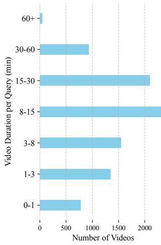  
(c) Distribution of total video duration involved in each query.

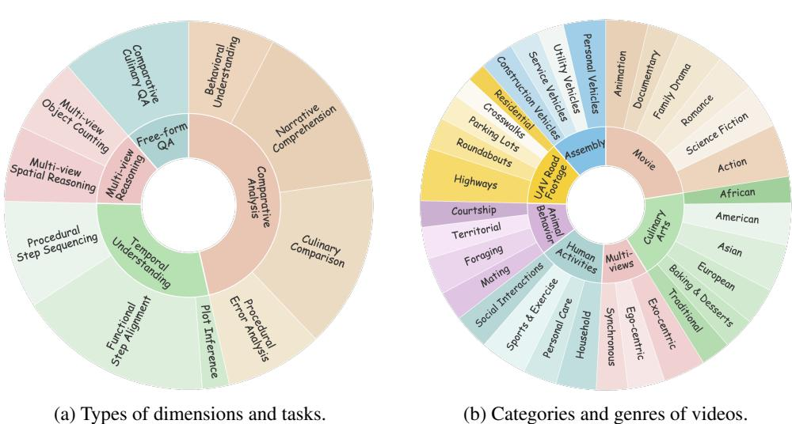  
wide range of video durations and video sources of 7 primary categories and 32 genres.

此外，CrossVid 包含图 3b 中的 32 种不同类型，充分捕捉了现实世界中遭遇的代表性 CVR 场景。此外，CrossVid 在每个查询中呈现了视频时长的层次分布，范围从 1 分钟到超过 1 小时，如图 3c 所示。有关 CrossVid 任务的更多统计分析和详细信息，请参见附录。与现有基准的比较 表 1 总结了现有 VQA 基准的特征。与之前的单视频理解基准相比，CrossVid 创新性地引入了多视频输入和跨视频理解。与当前的多视角基准相比，CrossVid 显著扩展了任务类型、问题格式和应用场景。因此，CrossVid 是第一个全面评估 MLLM 的 CVR 能力的基准，覆盖了广泛的任务和问题格式。

# 数据标注

我们设计了一个半自动化的多阶段流程来构建 CrossVid。整体过程如图 4 所示。帧描述 我们首先从源视频中密集提取帧，并利用 Qwen2.5-VL-72B（Bai 等，2025）为每个提取的帧生成简洁的描述。为了丰富描述的上下文信息，我们还在生成过程中融入了原始数据集中的元数据（例如，情节摘要、场景描述和动作标签）。问答生成 首先，我们手动为预定义任务分配最合适的视频。例如，烹饪视频固有地包含多个连续的步骤，使其适合时间理解任务。

有关分配过程的更多细节可以在附录中找到。随后，对于每个任务，视频根据原始数据集中的标签被聚类成不同的集合。共享相同标签的视频（例如，MovieChat-1K中的同一电影类型或YouCook2中的同一食谱）被归为一组。我们随后从同一集合中随机抽取每个问题所需数量的视频，并将其帧级别的字幕提供给DeepSeek-R1（Guo等，2025b），用于自动生成问答。我们严格从同一集合中检索视频，以确保视频之间具有强烈的语义相关性和可比性。对于每个任务，我们设计了一个由三个关键组件组成的定制提示：1）提示明确指示DeepSeek-R1分析所有给定视频之间的关系。2）提示引导DeepSeek-R1生成与任务的具体要求紧密相关的问答对（例如，行为理解任务可能会优先考虑比较行动模式和目标）。3）提示要求DeepSeek-R1提供详细的解释以支持其答案的正确性。这些提示减少了DeepSeek-R1在问答生成过程中的幻觉现象，提高了生成问答对的可靠性。此外，这确保生成的问答对具有挑战性，并要求在多个视频之间进行综合推理。 数据过滤 为确保数据质量，我们进行了严格的人工审查，由十名专家注释员进行。在这个粗过滤阶段，我们通过三个步骤依次排除不合适的问答对。首先，过滤掉与视频理解无关的问题。然后，排除仅引用特定查询视频的问题（例如，“在视频三中，车是什么颜色？”）。最后，丢弃主观或过于复杂的问题，例如需要哲学推理或领域专业知识的问题。 问答精细化 保留的问答对随后经过精细化处理，由三个步骤组成：1）注释员修订问题以消除模棱两可之处。2）每位注释员在不参考DeepSeek R1的输出或解释的情况下回答问题。3）根据注释员的回答，进一步进行任务特定的精细化处理。具体而言，对于单选和多选问题，既有的真值和其他错误选项都会被调整，以确保唯一的准确性。在时间理解中的功能步骤排序任务中，我们通过时间重新对齐解决潜在的捷径学习（依赖于相机角度的连续性），即每个前置片段提前1-5秒，而相应的偏移延迟后续片段。这种策略在剪辑边界之间制造了故意的不连续性，迫使模型通过语义内容推导时间关系，而不是依赖低级别的一致性。对于开放式问题，注释员检查评分点是否与生成的标准答案一致，并涵盖与问题相关的所有关键信息。

  
eit y w.-LBDeekR   paask-ect; (3) The QA pairs ndegogorous human qualiyreviw,ncudidaa flter, renemen, and qualiy o.

质量控制 在质量控制环节，独立的专家小组进一步评估经过精细化处理的配对问答池，并形成经过策划的池。此过程通过我们的设计界面进行，详细信息见附录。通过这一半自动化流程，生成了大量高质量的问答对。更重要的是，我们的策划过程确保每个问答对都基于有意义的视频间关系，并需要综合的计算机视觉回复。这符合我们跨视频的目标。

# 实验与分析

我们对现有的多模态大语言模型（MLLMs）在CrossVid上进行了全面评估。本节首先描述实验设置，随后详细分析模型性能。接着，我们将呈现消融研究和关键发现。

# 实验设置

我们评估了22个多模态大语言模型（MLLMs）在Cross Vid上的表现，包括封闭源模型（如GPT-4.1和Gemini-2.5-Pro）和多种开源模型（如Qwen2.5-VL、InternVL3），其参数规模从7亿到780亿不等。还包括其他架构，如专家混合模型（MoE）。对于视频预处理，我们将所有输入视频的帧均匀分配，并在每个视频内部均匀抽样帧。对于每对问答（QA），所有视频的帧和问题提示在一次推理中同时输入到MLLM中。我们采用零-shot策略，要求MLLMs直接给出答案。开源模型的推理按照其官方实现进行，而封闭源模型则通过其官方API访问。我们以准确率作为评估指标。有关实现和评估的更多细节，请参见附录。

# 主要结果

我们展示了 MLLMs 在 CrossVid 上的表现，包括每个任务的准确率、每个维度的平均准确率以及所有任务的整体平均值，见表2。基于这些数据，我们突出三条主要观察结果：1）CVR 对现有 MLLMs 来说具有挑战性。所有 MLLMs 的平均表现显著低于人类的表现，后者为 $8 9 . 2 \%$。即便是表现最好的 MLLM，Gemini-2.5-Pro，其整体平均准确率也仅为 $5 0 . 4 \%$。值得注意的是，在多视角推理这一专注于空间推理的任务中，MLLMs 的表现逊色于人类。具体来说，表现领先的 MLLM，InternVL3-8B，其平均准确率仅为 $4 0 . 7 \%$，而人类能够达到 $9 3 . 7 \%$。在时间理解方面，MLLM 和人类之间的差距更为明显。例如，在步骤对齐任务中，准确率最高的 Gemini-2.5-Pro 仅达到了 $1 3 . 4 \%$，而人类为 $8 5 . 2 \%$。这些揭示了现有 MLLMs 在 CVR 中对时间和空间理解的关键局限性。2）闭源 MLLMs 的表现显著优于开源对手。所有闭源 MLLMs 的整体平均准确率均高于开源 MLLMs，而在若干关键任务上，闭源 MLLMs 的优势更加明显。尤其是在时间理解方面，闭源 MLLMs 一直优于开源 MLLMs。得分最低的闭源 GPT4o 在多视角推理中也达到了平均准确率。每个任务的最佳结果以粗体标出。

<table><tr><td rowspan="2">Models</td><td rowspan="2">O.Avg</td><td rowspan="2"></td><td colspan="4">Comparative Analysis</td><td rowspan="2">Temporal Understanding</td><td colspan="3"></td><td colspan="3">Multi-view Reasoning</td><td rowspan="2">Free-form CCQA</td></tr><tr><td>BU NC</td><td>CC</td><td>PEA</td><td>C.Avg</td><td>PI</td><td>FSA</td><td>PSS</td><td>T.Avg</td><td>MSR MOC</td><td>M.Avg</td></tr><tr><td>Human</td><td>89.2</td><td>85.6 92.3</td><td></td><td>90.7</td><td>83.9</td><td>88.1</td><td>91.6 85.2</td><td></td><td>89.9</td><td>88.9</td><td>93.2 94.2</td><td>93.7</td><td></td><td>85.2</td></tr><tr><td>Closed-Source Models</td><td></td><td></td><td></td><td></td><td></td><td></td><td></td><td></td><td></td><td></td><td></td><td></td><td></td><td></td></tr><tr><td>GPT-4.1 (2025)</td><td>45.2</td><td>46.2 34.6 58.5 51.2</td><td></td><td></td><td></td><td>47.6</td><td>70.9</td><td>8.6</td><td>60.5</td><td>46.7</td><td>38.6</td><td>38.2</td><td>38.4</td><td>44.6</td></tr><tr><td>GPT-4o (2024)</td><td>36.8</td><td>38.2</td><td>34.3</td><td>50.7</td><td>49.1</td><td>43.1</td><td>57.8</td><td>9.1</td><td>39.7</td><td>35.5</td><td>15.3</td><td>39.4</td><td>27.4</td><td>34.2</td></tr><tr><td>Doubao-1.5-VL-pro (2025a)</td><td>44.3</td><td>51.2 58.1</td><td></td><td>69.5 36.4</td><td></td><td>53.8</td><td>66.9</td><td>4.6</td><td>36.8</td><td>36.1</td><td>37.4</td><td>32.0</td><td>34.7</td><td>50.1</td></tr><tr><td>Gemini-2.5-Pro (2025)</td><td>50.4</td><td>54.2 51.8</td><td></td><td>68.7</td><td>44.1</td><td>54.7</td><td>76.5 13.4</td><td></td><td>78.2</td><td>56.0</td><td>32.0</td><td>25.3</td><td>28.7</td><td>59.8</td></tr><tr><td>Open-Source Models ~ MoE</td><td></td><td></td><td></td><td></td><td></td><td></td><td></td><td></td><td></td><td></td><td></td><td></td><td></td><td></td></tr><tr><td>Kimi-VL-A3B-Thinking (2025)</td><td>28.2</td><td>29.4 33.3 36.8 34.0</td><td></td><td></td><td></td><td>33.4 40.6 3.8</td><td></td><td></td><td> 9.2</td><td>17.9</td><td>28.4 36.9</td><td></td><td>32.7</td><td>29.2</td></tr><tr><td>ERNIE-4.5-VL-A3B (2025)</td><td>24.8</td><td>12.6 28.2 24.2 36.4</td><td></td><td></td><td></td><td>25.4</td><td>52.6 4.0</td><td></td><td>2.4</td><td>19.7</td><td>29.6</td><td>35.3</td><td>32.5</td><td>22.5</td></tr><tr><td colspan="10">Open-Source Models &lt;10B</td><td></td><td></td><td></td><td></td><td></td></tr><tr><td>Qwen2.5-VL-7B (2025)</td><td>18.3</td><td>19.6</td><td>19.0</td><td>23.4</td><td>15.0</td><td>19.3</td><td>58.6</td><td>1.2</td><td>0.3</td><td>20.0</td><td>11.8</td><td>21.7</td><td>16.8</td><td></td><td>12.0</td></tr><tr><td>InternVL3-8B (2025)</td><td>25.6</td><td>15.2</td><td>22.8</td><td>24.3</td><td>42.1</td><td>26.1</td><td>56.2</td><td>3.2</td><td>1.5</td><td>20.3</td><td></td><td>34.0</td><td>47.3</td><td>40.7</td><td>9.7</td></tr><tr><td>LongVA-7B-DPO (2024a)</td><td>18.0</td><td>16.2</td><td>20.6</td><td>18.2</td><td>39.0</td><td>23.5</td><td>18.7</td><td>2.1</td><td>1.8</td><td>7.5</td><td></td><td>24.2</td><td>28.4</td><td>26.3</td><td>10.7</td></tr><tr><td>VideoLLaMA3-7B (2025)</td><td>15.3</td><td>14.7</td><td>19.5</td><td>22.2</td><td>26.6</td><td>20.8</td><td>11.6</td><td>5.1</td><td>3.5</td><td></td><td>6.7</td><td>18.7</td><td>20.8</td><td>19.8</td><td>9.8</td></tr><tr><td>Qwen2.5-Omni-7B (2025)</td><td>24.6</td><td>27.5</td><td>26.0</td><td>32.7</td><td>20.4</td><td>26.7</td><td>60.2</td><td>0.4</td><td>4.1</td><td></td><td>21.6</td><td>23.2</td><td>36.0</td><td>29.6</td><td>15.3</td></tr><tr><td>Phi-3.5-vision (2024)</td><td>21.5</td><td>18.3</td><td>22.0 21.8</td><td></td><td>41.5</td><td>25.9</td><td>46.2</td><td>1.2</td><td>4.1</td><td></td><td>17.2</td><td>28.4</td><td>26.7</td><td>27.6</td><td>4.3</td></tr><tr><td>MiniCPM-O 2.6 (2024)</td><td>25.6</td><td>20.3</td><td>21.8</td><td>20.1</td><td>42.6</td><td>26.2</td><td>72.1</td><td>2.9</td><td>4.1</td><td></td><td>26.4</td><td>27.1</td><td>35.7</td><td>31.4</td><td>9.0</td></tr><tr><td>MiMo-7B (2025)</td><td>28.3</td><td>22.3</td><td>30.6</td><td>39.2</td><td>32.8</td><td>31.2</td><td>54.6</td><td>2.8</td><td>11.6</td><td>23.0</td><td></td><td>25.8</td><td>41.3</td><td>33.6</td><td>22.0</td></tr><tr><td>Video-R1-7B (2025)</td><td>21.6</td><td>14.7</td><td>23.0</td><td>19.9</td><td>16.3</td><td>18.5</td><td>77.3</td><td>1.9</td><td>1.5</td><td>26.9</td><td></td><td>19.4</td><td>34.4</td><td>26.9</td><td>8.0</td></tr><tr><td>GLM-4.1V-9B-Thinking (2025)</td><td>35.1</td><td>49.8</td><td></td><td>39.9 50.6</td><td>38.6</td><td>44.7</td><td>50.2</td><td>5.1</td><td>14.1</td><td>23.1</td><td></td><td>36.7</td><td>38.9</td><td>37.8</td><td>26.9</td></tr><tr><td>Open-Source Models ~30B</td><td></td><td></td><td></td><td></td><td></td><td></td><td></td><td></td><td></td><td></td><td></td><td></td><td></td><td></td><td></td></tr><tr><td>Qwen2.5-VL-32B (2025)</td><td>33.7</td><td></td><td></td><td></td><td>31.4 39.5 48.6 33.7</td><td>38.3</td><td>65.7</td><td>5.1</td><td>8.7</td><td></td><td>26.5</td><td>23.7</td><td>39.6</td><td>31.7</td><td>41.2</td></tr><tr><td>InternVL3-38B (2025)</td><td>23.5</td><td></td><td></td><td></td><td>15.9 33.7 33.6 27.9</td><td>27.8</td><td></td><td>24.3 4.5</td><td>1.5</td><td></td><td>10.1</td><td>40.4</td><td>36.8</td><td>38.6</td><td>16.2</td></tr><tr><td colspan="10">Open-Source Models ~70B</td><td></td><td></td><td></td><td></td><td></td><td></td></tr><tr><td>Qwen2.5-VL-72B (2025)</td><td>34.4</td><td></td><td></td><td></td><td>37.7 38.5 52.6 39.6</td><td>42.1</td><td></td><td>61.8</td><td>5.9</td><td>20.0</td><td>29.2</td><td>20.9</td><td>26.0</td><td>23.5</td><td>41.2</td></tr><tr><td>InternVL3-78B (2025)</td><td>25.8</td><td>27.1</td><td>29.4</td><td>33.1</td><td>42.7</td><td>33.1</td><td>37.5 51.8</td><td>4.9 3.2</td><td>4.4 11.1</td><td></td><td>15.6 22.0</td><td>22.9 26.8</td><td>33.2 29.0</td><td>28.1 27.9</td><td>23.2 17.8</td></tr><tr><td>LLaVA-Video-72B (2024b) LLaVA-OV-72B (2024a)</td><td>27.5 27.5</td><td>22.1</td><td>26.5 26.5 34.0 48.7</td><td>23.3 29.2</td><td>37.0</td><td>33.9 27.9</td></table>

$35.5\%$，仍然比领先的开源模型 LLaVA-OV 高出 $6.2\%$。 3) 启用“思维”的模型显示出性能提升。在封闭源模型中，具有明确推理模块的模型（如 Gemini-2.5-Pro）始终获得最高的整体和每个任务准确率。在 10B 参数组中，排名前两的模型是启用思维的 GLM-4.1V-9B-Thinking $(35.1\%)$ 和 MiMo-7B $(28.3\%)$，分别比第三名高出 $9.5\%$ 和 $2.7\%$。因此，内部“思维”机制使模型能够更好地构建多步骤推理过程，从而促进在复杂跨视频任务上的性能提升。

# 消融研究

我们进行消融实验，以更好地理解大语言模型在转化率（CVR）上的表现，并提供更多见解。

# 帧数的影响

输入帧的数量决定了模型进行推理时可用的视觉信息量。为了评估其影响，我们在 CrossVid 上使用 32、64、128 和 256 个输入帧对 Qwen2.5-VL-72B 进行了评估。对于少于 256 帧的设置，帧是从完整的 256 帧中均匀采样的。结果在表 3 中报告。可以观察到，增加输入帧的数量通常会提高模型性能。这种改善在需要全面背景的任务中尤为明显，例如比较分析和开放式问答。对于 Qwen2.5-VL-72B，整体准确率随着帧数从 32 增加到 256 增加了 $5.7\%$ （从 $33.8\%$ 增加到 $39.5\%$），在开放式 CCQA 任务中，改善幅度甚至达到 $15.1\%$。随着帧数的增加，模型可以获取更丰富的视觉信息，这对于回答需要精确细节的跨视频问题至关重要。例如，在回答开放式问题以区分两个视频中的烹饪方法时，模型在 32 帧的情况下只能识别出表面的动作。当帧数增加到 64 时，模型能够区分具体的核心技术。在 256 帧时，模型的分析变得足够细致，以识别出次要成分。然而，过多的不相关帧可能会引入噪声，导致信息冗余，并使模型被不相关内容分散注意力。例如，在解决一部战争电影的情节推理问题时，模型在 32 和 64 帧等较低的帧数条件下能够正确识别关键事件（例如，部队车队和谈判场景）。然而，随着提供更多帧，不相关的环境信息（例如，受伤士兵的通用镜头）使模型偏离主要因果链，导致基于广泛军事规划关联做出错误答案。这些发现为未来 CVR 的进展提供了指导。 一方面，扩展模型的上下文窗口使其能够感知更多信息；另一方面，关键帧选择有助于过滤掉不相关线索，使模型集中于核心信息。

Table 3: Comparison results of performance under different numbers of input frames.   

<table><tr><td>#Frames</td><td>O.Avg</td><td>C.Avg</td><td>T.Avg</td><td>M.Avg</td><td>CCQA</td></tr><tr><td>32</td><td>33.8</td><td>37.0</td><td>33.8</td><td>35.1</td><td>18.9</td></tr><tr><td>64</td><td>36.9</td><td>39.8</td><td>37.4</td><td>35.9</td><td>25.9</td></tr><tr><td>128</td><td>39.1</td><td>45.7</td><td>34.5</td><td>36.4</td><td>32.0</td></tr><tr><td>256</td><td>39.5</td><td>47.5</td><td>33.9</td><td>34.9</td><td>34.0</td></tr></table>

# CoT提示的有效性

先前的研究结果表明，具备内部思考能力的多模态大语言模型（MLLMs）优于其对应的模型。为了评估思维链（CoT）在非思考型MLLMs上的有效性，我们设计了提示，明确要求执行一个三阶段过程：1）理解问题，2）分析每个输入视频的框架，3）在回答之前汇总所有视频的信息。提示的详细信息见附录。MLLMs被要求输出其推理过程的每一步。我们在GPT-4.1和三个不同参数规模组的开源MLLMs上进行了实验。我们保持每个MLLM的框架与之前直接回答策略相同。表4展示了使用和不使用CoT提示的性能对比。对于大多数MLLMs来说，CoT在时间理解和多视角推理任务上带来了性能提升。这表明，CoT有助于在时间和空间理解任务中促进跨视频的更系统推理。值得注意的是，CoT提示并不总是能提高每个任务的准确性，而参数更多的开源MLLMs则表现出更大的整体性能提升。这表明，较大的MLLMs更能够从基于提示的优化中获益。

# 错误分析

为了进一步检验当前多语言大模型的 CVR 能力并更好地理解其局限性，我们手动分析了其推理步骤中的错误，并识别出四种主要错误类型。各错误的百分比和详细示例已在附录中列出。(a) 关键帧丢失：与以前的单视频理解相比，我们的任务需要同时输入多个视频，这减少了每个视频的帧数。这可能导致核心信息的丢失。因此，多语言大模型可能无法获取回答问题所需的信息，从而提供错误答案。

Table 4: Comparison of performances with and without CoT prompting.   

<table><tr><td>Method</td><td>O.Avg</td><td>C.Avg</td><td>T.Avg</td><td>M.Avg</td><td>CCQA</td></tr><tr><td>GPT-4.1</td><td></td><td></td><td></td><td></td><td></td></tr><tr><td>w/o CoT</td><td>45.2</td><td>47.6</td><td>46.7</td><td>38.4</td><td>44.6</td></tr><tr><td>w/ CoT</td><td>44.9</td><td>46.7</td><td>48.2</td><td>40.4</td><td>36.7</td></tr><tr><td>MiniCPM-o 2.6</td><td></td><td></td><td></td><td></td><td></td></tr><tr><td>w/o CoT</td><td>25.6</td><td>26.2</td><td>26.4</td><td>31.4</td><td>9.0</td></tr><tr><td>w/ CoT</td><td>23.7</td><td>26.7</td><td>18.7</td><td>33.3</td><td>7.2</td></tr><tr><td>InternVL3-38B</td><td></td><td></td><td></td><td></td><td></td></tr><tr><td>w/o CoT</td><td>23.5</td><td>27.8</td><td>10.1</td><td>38.6</td><td>16.2</td></tr><tr><td>w/ CoT</td><td>24.4</td><td>26.3</td><td>16.7</td><td>35.2</td><td>18.0</td></tr><tr><td>Qwen2.5-VL-72B</td><td></td><td></td><td></td><td></td><td></td></tr><tr><td>w/o CoT</td><td>34.4</td><td>42.1</td><td>29.2</td><td>23.5</td><td>41.2</td></tr><tr><td>w/ CoT</td><td>39.5</td><td>47.5</td><td>33.9</td><td>34.9</td><td>34.0</td></tr></table>

(b) 视频理解错误：在此类型的错误中，尽管多模态大语言模型（MLLMs）能够捕捉每个视频的关键信息，但它们在跨视频理解方面可能仍然不足。由于对单个视频的分析可能因同时处理多个视频的要求而不够充分，未能理解任何单个视频会导致对多视频整体理解的错误。 (c) 跨视频比较错误：尽管MLLMs能够正确理解每个单独的视频，但它们在跨视频比较时可能仍会遇到困难。例如，当要求MLLM确定哪部电影中的拥抱代表危机解决时，MLLM成功识别了组内所有视频中的拥抱，但未能在上下文中推理和比较其意义。 (d) 格式错误：CrossVid包含需要特定输出格式的任务，例如在功能步骤对齐任务中包含起始和结束时间戳的时间区间。然而，一些MLLM可能未能准确遵循提示中描述的具体指示或约束，导致答案提取失败。

# 结论

我们提出了 CrossVid，这是第一个全面评估 MLLMs 在 CVR 上的基准数据集。CrossVid 通过半自动化流程和严格的多阶段质量控制构建而成，涵盖 4 个关键推理维度的 10 个多样化任务。我们对 22 个前沿 MLLMs 的实验评估揭示了 CVR 中的重大挑战，表现最好的模型（Gemini-2.5-Pro）仅在远低于人类水平的情况下取得适度性能。广泛的消融研究和错误分析提供了对当前模型局限性的深入洞察。我们希望 CrossVid 能成为推动多视频理解和稳健、可泛化视觉推理研究进展的重要资源。

# References

Abdin, M.; Aneja, J.; Behl, H.; Bubeck, S.; Eldan, R.; Gunasekar, S.; Harrison, M.; Hewett, R. J.; Javaheripi, M.; Kauffmann, P.; et al. 2024. Phi-4 technical report. arXiv preprint arXiv:2412.08905.   
Bai S.; Chen K.; Liu, X. Wag J. Ge W.Sog S. a, K.; Wang, P.; Wang, S.; Tang, J.; et al. 2025. Qwen2. 5-vl technical report. arXiv preprint arXiv:2502.13923.   
Chen, L.; Wei, X.; Li, J.; Dong, X.; Zhang, P.; Zang, Y.; Chen, Z.; Duan, H.; Tang, Z.; Yuan, L.; et al. 2024. Sharegpt4video: Improving video understanding and generation with better captions. Advances in Neural Information Processing Systems, 37: 1947219495.   
Comanici, G.; Bieber, E.; Schaekermann, M.; Pasupat, I.; Sacdeva, N.Dhillon, I. Blistein, M. Ram, O.;Zhang, D.Rosen, E.; et al. 2025.Gemini 2.5: Pushing the rontier with advanced reasoning, multimodality, long context, and next generation agentic capabilities. arXiv preprint arXiv:2507.06261.   
Contributors, L. 2023. LMDeploy: A Toolkit for Compressing, Deploying, and Serving LLM. https://github.com/ InternLM/lmdeploy.   
Contributors, P. 2017. PaddlePaddle: PArallel Distributed Deep LEarning: Machine Learning Framework from Industrial Practice. https://github.com/PaddlePaddle/Paddle. Feng, K.; Gong, K.; Li, B.; Guo, Z.; Wang, Y.; Peng, T.; Wu, J.; Zhang, X.; Wang, B.; and Yue, X. 2025. Videor1: Reinforcing video reasoning in mllms. arXiv preprint arXiv:2503.21776.   
Fu, C.; Dai, Y.; Luo, Y.; Li, L.; Ren, S.; Zha R.; Wan, Z.; Zhou, C.; Shen, Y.; Zhang, M.; et al. 2025.Videomme: The first-ever comprehensive evaluation benchmark of multi-modal llms in video analysis. In Proceedings of the Computer Vision and Pattern Recognition Conference, 2410824118.   
Gong, S.; Zhuge, Y.; Zhang, L.; Yang, Z.; Zhang, P.; and Lu, H. 2025. The devil is in temporal token: High quality video reasoning segmentation. In Proceedings of the Computer Vision and Pattern Recognition Conference, 2918329192. Grauman, K.; Westbury, A.; Torresani, L.; Kitani, K.; Malik, J.; Afouras, T.; Ashutosh, K.; Baiyya, V.; Bansal, S.; Boote, B.; et al. 2024. Ego-exo4d: Understanding skilled human activity from first-and third-person perspectives. In Proceedings of the IEEE/CVF Conference on Computer Vision and Pattern Recognition, 1938319400.   
Guo, D.; Wu, F.; Zhu, F.; Leng, F.; Shi, G.; Chen, H.; Fan, H.; Wang, J.; Jiang, J.; Wang, J.; et al. 2025a. Seed1. 5-vl technical report. arXiv preprint arXiv:2505.07062.   
Guo, D.; Yang, D.; Zhang, H.; Song, J.; Zhang, R.; Xu, R.; Zhu, Q.; Ma, S.; Wang, P.; Bi, X.; et al. 2025b. Deepseek-r1: Incentivizing reasoning capability in llms via reinforcement learning. arXiv preprint arXiv:2501.12948.   
Ho W.; Yu, W.; Gu, X.; Wang, G.; Gan, G.; Tang, H.;Cheng, J.; Qi, J.; Ji, J.; Pan, L.; et al. 2025.GLM4.1 V-Thinking: Towards Versatile Multimodal Reasoning with Scalable Reinforcement Learning. arXiv preprint arXiv:2507.01006. Huang, Y.; Chen, G.; Xu, J.; Zhang, M.; Yang, L.; Pei, B.; Zhang, H.; Dong, L.; Wang, Y.; Wang, L.; et al. 2024. Egoexolearn: A dataset for bridging asynchronous ego-and exo-centric view of procedural activities in real world. In Proceedings of the IEEE/CVF Conference on Computer Vision and Pattern Recognition, 2207222086.   
Hurst, A.; Lerer, A.; Goucher, A. P.; Perelman, A.; Ramesh, A.; Clark, A.; Ostrow, A.; Welihinda, A.; Hayes, A.; Radford, A.; et al. 2024.Gpt-4o system card. arXiv preprint arXiv:2410.21276.   
Kwon, W.; Li, Z.; Zhuang, S.; Sheng, Y.; Zheng, L.; Yu, C. H.; Gonzalez, J. E.; Zhang, H.; and Stoica, I. 2023. Efficient Memory Management for Large Language Model Serving with PagedAttention. In Proceedings of the ACM SIGOPS 29th Symposium on Operating Systems Principles. Lei, J.; Yu, L.; Bansal, M.; and Berg, T. L. 2018. Tvqa: Localized, compositional video question answering. arXiv preprint arXiv:1809.01696.   
Li B.; Zhang, Y.; Guo, .; Zhang, R.; Li, F; Zhang, H.; Zhang, K.; Zhang, P.; Li, Y.; Liu, Z.; et al. 2024a. Laiin: Easy isal task rani p arXiv:2408.03326.   
Y.;HeY; YY. Y Z; Xu, J.; Chen, G.; Luo, P.; et al. 2024b. Mvbench: A comprehensive multi-modal video understanding benchmark. In Proceedings of the IEEE/CVF Conference on Computer Vision and Pattern Recognition, 2219522206.   
Lin, B.; Ye, Y.; Zhu, B.; Cui, J.; Ning, M.; Jin, P.; and Yuan, L. 0.Video-llav: Learg nited visual - resentation by alignment before projection. arXiv preprint arXiv:2311.10122.   
Liu, Z.; Shang, Y.; Li, T.; Chen, G.; Wang, Y.; Hu, Q.; and Zhu, P. 2023. Robust multi-drone multi-target tracking to resolve target occlusion: A benchmark. IEEE Transactions on Multimedia, 25: 14621476.   
Ng, X. L.; Ong, K. E.; Zheng, Q.; Ni, Y.; Yeo, S. Y.; and Liu, J. 2022. Animal kingdom: A large and diverse dataset for animal behavior understanding. In Proceedings of the IEEE/CVF conference on computer vision and pattern recognition, 1902319034.   
Reilly, D.; Govind, M. K.; Xue, L.; and Das, S. 2025. From My View to Yours: Ego-Augmented Learning in Large Vision Language Models for Understanding Exocentric Daily Living Activities. arXiv preprint arXiv:2501.05711.   
Sener, F.; Chatterjee, D.; Shelepov, D.; He, K.; Singhania, D.; Wang, R.; and Yao, A. 2022. Assembly101: A largescale multi-view video dataset for understanding procedural activities. In Proceedings of the IEEE/CVF Conference on Computer Vision and Pattern Recognition, 2109621106. Shu, Y.; Liu, Z.; Zhang, P.; Qin, M.; Zhou, J.; Liang, Z.; Huang, T.; and Zhao, B. 2025. Video-xl: Extra-long vision language model for hour-scale video understanding. In Proceedings of the Computer Vision and Pattern Recognition Conference, 2616026169.   
Sigurdsson, G. A.; Varol, G.; Wang, X.; Laptev, I.; Farhadi, A.; and Gupta, A. 2016. Hollywood in Homes: Crowdsourcing Data Collection for Activity Understanding. ArXiv eprints.   
Song, E.; Chai, W.; Wang, G.; Zhang, Y.; Zhou, H.; Wu, F.; Chi, H.; Guo, X.; Ye, T.; Zhang, Y.; et al. 2024. Moviechat: From dense token to sparse memory for long video understanding. In Proceedings of the IEEE/CVF Conference on Computer Vision and Pattern Recognition, 1822118232. Tang, X.; Qiu, J.; Xie, L.; Tian, Y.; Jiao, J.; and Ye, Q. 2025. Adaptive keyframe sampling or long video nderstanding. In Proceedings of the Computer Vision and Pattern Recognition Conference, 2911829128.   
Team, B. E. 2025. ERNIE 4.5 Technical Report.   
Team, K.; Du, A.; Yin, B.; Xing, B.; Qu, B.; Wang, B.; Chen, C.; Zhang, C.; Du, C.; Wei, C.; et al. 2025. Kimi-vl technical report. arXiv preprint arXiv:2504.07491.   
Wu, H.; Li, D.; Chen, B.; and Li, J. 2024. Longvideobench: A benmar on-conx teavvunderstanding. Advances in Neural Information Processing Systems, 37: 2882828857.   
Xiao, J.; Shang, X.; Yao, A.; and Chua, T.-S. 2021. Nextqa: Next phase of question-answering to explaining temporal actions. In Proceedings of the IEEE/CVF conference on computer vision and pattern recognition, 97779786.   
Xii, L.; Xia, B.; Shen B.; Zhu, D.; Zhang, D. Wang, G.; Zhang, H.; Liu, H.; Xiao, J.; Dong, J.; et al. 2025. MiMo: Unlocking the Reasoning Potential of Language ModelFrom Pretraining to Posttraining. arXiv preprint arXiv:2505.07608.   
Xu, J.; Guo, Z.; He, J.; Hu, H.; He, T.; Bai, S.; Chen, K.; Wang, J.; Fan, Y.; Dang, K.; et al. 2025.Qwe2. 5-mi technical report. arXiv preprint arXiv:2503.20215.   
Yao, Y.; Yu, T.; Zhang, A.; Wang, C.; Cui, J.; Zhu, H.; Cai, T.; Li, H.; Zhao, W.; He, Z.; et al. 2024. Minicpmv: A gpt-4v level mllm on your phone. arXiv preprint arXiv:2408.01800.   
Yeh, C.-H.; Wang, C.; Tong, S.; Cheng, T.-Y.; Wang, R.; Chu, T.; Zhai, Y.; Chen, Y.; Gao, S.; and Ma, Y. 2025. Seeing from another perspective: Evaluating multi-view understanding in mllms. arXiv preprint arXiv:2504.15280.   
Yu, Z.; Xu, D.; Yu, J.; Yu, T.; Zhao, Z.; Zhuang, Y.; and Tao, D. 2019. Activitynet-qa: A dataset for understanding complex web videos via question answering. In Proceedings of the AAAI Conference on Artificial Intelligence, volume 33, 91279134.   
Zhang, B.; Li, K.; Cheng, Z.; Hu, Z.; Yuan, Y.; Chen, G.; Leng, S.; Jiang, Y.; Zhang, H.; Li, X.; et al. 2025. Videollama 3: Frontier multimodal foundation models for image and video understanding. arXiv preprint arXiv:2501.13106. Zhang, H.; Li, X.; and Bing, L. 2023. Video-llama: An instruction-tuned audio-visual language model for video understanding. arXiv preprint arXiv:2306.02858.   
Zhang, P.; Zhang, K.; Li, B.; Zeng, G.; Yang, J.; Zhang, Y.;Wang, Z. Tan, H.; Li, C.; and Liu, Z. 2024a.Long context transfer from language to vision. arXiv preprint arXiv:2406.16852. Zhang, Y.; Wu, J.; Li, W.; Li, B.; Ma, Z.; Liu, Z.; and Li, C. 2024b. Video instruction tuning with synthetic data. arXiv preprint arXiv:2410.02713.   
Zhao, Y.; Zhang, H.; Xie, L.; Hu, T.; Gan, G.; Long, Y.; Hu, Z.; Chen, W.; Li, C.; Xu, Z.; et al. 2025. Mmvu: Measuring expert-level multi-discipline video understanding. In Proceedings of the Computer Vision and Pattern Recognition Conference, 84758489.   
Zhou, J.; Shu, Y.; Zhao, B.; Wu, B.; Xiao, S.; Yang, X.; Xiong, Y.; Zhang, B.; Huang, T.; and Liu, Z. 2024. Mlvu: A comprehensive benchmark for multi-task long video understanding. arXiv e-prints, arXiv2406.   
Zhou, L.; Xu, C.; and Corso, J. 2018. Towards automatic learning of procedures from web instructional videos. In Proceedings of the AAAI conference on artificial intelligence, volume 32.   
Zhu, J.; Wang, W.; Chen, Z.; Liu, Z.; Ye, S.; Gu, L.; Tian, H.; Duan, Y.; Su, W.; Shao, J.; et al. 2025. Internvl3: Exploring advanced training and test-time recipes for open-source multimodal models. arXiv preprint arXiv:2504.10479.

# More Details about Cross Vid Statistical Details

In this section, we present more statistical details of our proposed CrossVid.

Video length for each query Though the number of videos involved in each query varies in CrossVid, we keep each query referring to a group of at least 2 videos, shown in Table 5. Each query requires MLLM to reason over a total of 770 seconds of video content.

Table 5: Distribution of queries containing different numbers of videos.   

<table><tr><td>#Videos in the query</td><td>Number of queries</td></tr><tr><td>2</td><td>4,531</td></tr><tr><td>3</td><td>1,665</td></tr><tr><td>4</td><td>2,416</td></tr><tr><td>&gt;4</td><td>403</td></tr><tr><td>Total</td><td>9,015</td></tr></table>

Task statistics CrossVid covers 10 distinct tasks. The source videos for tasks are curated from six publicly available datasets: Animal Kingdom, MovieChat-1K, YouCook2, VisDrone, Charades, and Assembly101. We manually assign suitable videos for each type of task, and one source video can be used in different queries. More details, including the number of QA pairs, the number of videos for each query, and the video source, are presented in Table 6.

Table 6: Number of QA pairs, number of videos in each QA pair, and video sources for each task.   

<table><tr><td>Task</td><td>#QA pairs</td><td>#Videos</td><td>Video sources</td></tr><tr><td>BU</td><td>848</td><td>3 or 4</td><td>Charades &amp; Animal Kingdom</td></tr><tr><td>NC</td><td>1,221</td><td>4</td><td>MovieChat-1K</td></tr><tr><td>CC</td><td>798</td><td>4</td><td>YouCook2</td></tr><tr><td>PEA</td><td>953</td><td>3</td><td>Assembly101</td></tr><tr><td>PI</td><td>251</td><td>2</td><td>MovieChat-1K</td></tr><tr><td>FSA</td><td>2,241</td><td>2</td><td>YouCook2</td></tr><tr><td>PSS</td><td>664</td><td>3~6</td><td>YouCook2</td></tr><tr><td>MSR</td><td>595</td><td>2</td><td>VisDrone</td></tr><tr><td>MOC</td><td>571</td><td>2</td><td>VisDrone</td></tr><tr><td>CCQA</td><td>873</td><td>2</td><td>YouCook2</td></tr></table>

# Task Definition

We give the description of the four dimensions and the detailed definition of each task in CrossVid. The question format and example question for each task are presented in Table 7.

Comparative Analysis This dimension evaluates the ability of MLLMs to extract task-relevant information from multiple videos and perform comparisons. It consists of the following four tasks:

Behavioral Understanding (BU): A set of videos depicting either wildlife behaviors or everyday human activities is provided. For animal behavior, the model needs to recognize specific actions and understand their aims and purposes. For human activities, the model is required to accurately identify whether each video contains the queried action.

Narrative Comprehension (NC): This task requires models to analyze four film clips with the same genre to contrast plot, characters, environment, and themes.

Culinary Comparison (CC): Given a group of videos showing the cooking of the same dishes, this task requires the model to compare ingredient processing, utensil usage, procedural sequence, and flavor across videos.

Procedural Error Analysis (PEA): Models are provided with videos recording the assembly of the same toy car, accompanied by the descriptions of a predefined set of possible errors. Models are required to identify the errors mentioned in the question and to further trace the reasons for the mistakes.

Temporal Understanding This dimension assesses the capability of models to perform temporal location and reasoning across multiple videos. It contains the following three tasks:

Plot Inference (PI): Given the beginning and ending segments of a film, the model is asked to infer the plot in the middle part. This task evaluates the ability to reason logical dependencies and causal relationships within a narrative context.

Functional Step Alignment (FSA): Two cooking videos are provided, and models are asked to locate segments in one video that correspond to a specified interval in the other. This task requires aligning corresponding steps across videos and understanding semantic equivalence.

Procedural Step Sequencing (PSS): A cooking video is segmented at the step level, and the clips are randomly shuffled. Models are required to reconstruct the correct temporal sequence. This task evaluates the causal reasoning and temporal inference capabilities.

Multi-view Reasoning This dimension provides models with two temporally synchronized road videos, each captured from a different aerial drone. It consists of two tasks that evaluate models' cross-perspective reasoning and spatial understanding capabilities.

Multi-view Spatial Reasoning (MSR): Models are queried about spatial relationships, such as relative distances and positions of objects at a specific moment, thereby evaluating multi-view spatial reasoning abilities.

Multi-view Object Counting (MOC): Models are required to count objects at a specific moment or over an interval. It requires multi-perspective information integration for precise counting.

Free-form QA This dimension evaluates the model's ability to perform comparative analysis and provide comprehensive, accurate answers to open-ended questions.

Comparative Culinary QA (CCQA): Two cooking videos with the same dishes are provided. Models are required to compare and identify differences in cooking procedures between the videos. This task assesses the capability to compare details.

, multiple-choice (MC), closed-ended generation (CG), and open-ended generation (OG).   

<table><tr><td>Task Qestion Format</td><td></td></tr><tr><td colspan="2">Comparative Analysis</td></tr><tr><td>BU</td><td>MC</td><td>Which cooling method in the following videos prevents water loss?</td></tr><tr><td>NC</td><td>SC</td><td>In which video is a vehicle&#x27;s role least critical to the main conflict?</td></tr><tr><td>CC</td><td>SC</td><td>What distinguishes the final seasoning step in Video 4 compared to others?</td></tr><tr><td>PEA</td><td>SC</td><td>Which action is incorrectly performed in exactly two videos?</td></tr><tr><td colspan="2">Temporal Understanding</td><td></td></tr><tr><td>PI</td><td>SC</td><td>What is most likely to happen in the middle part?</td></tr><tr><td>FSA</td><td>CG</td><td>Which step in Video 2 is functionally equivalent to the step shown between 57s and 68s in Video 1?</td></tr><tr><td colspan="2">PSS CG</td><td>What is the correct order of these video segments?</td></tr><tr><td>Multi-view Reasoning</td><td></td><td></td></tr><tr><td>MSR</td><td>SC</td><td>When obj1 completely leaves view B, where is obj2 located in view A&#x27;s frame?</td></tr><tr><td>MOC</td><td>SC</td><td>When obj1 is parallel to the red bus, how many cars are moving in view A?</td></tr><tr><td colspan="2">Free-form QA</td><td></td></tr><tr><td>CCQA</td><td>OG</td><td>How do the two videos differ in their methods of cooking the chickpeas for chana masala?</td></tr></table>

<table><tr><td>Models</td><td>#Frames</td><td>Imple.</td></tr><tr><td colspan="3">Closed-source Models</td></tr><tr><td>GPT-4.1</td><td>&lt; 50</td><td>API</td></tr><tr><td>GPT-40</td><td>&lt; 50</td><td>API</td></tr><tr><td>Doubao-1.5-VL-pro</td><td>256</td><td>API</td></tr><tr><td>Gemini-2.5-Pro</td><td>128</td><td>API</td></tr><tr><td colspan="3">Open-Source Models ~ MoE</td></tr><tr><td>Kimi-VL-A3B-Thinking</td><td>256</td><td>vLLM</td></tr><tr><td>ERNIE-4.5-VL-A3B</td><td>440</td><td>PaddlePaddle</td></tr><tr><td colspan="3">Open-source Models &lt;10B</td></tr><tr><td>Qwen2.5-VL-7B</td><td>256</td><td>vLLM</td></tr><tr><td>InternVL3-8B</td><td>128</td><td>LMDeploy</td></tr><tr><td>LongVA-7B-DPO</td><td>256</td><td>HF</td></tr><tr><td>VideoLLaMA3-7B</td><td>180</td><td>HF</td></tr><tr><td>Qwen2.5-Omni-7B</td><td>64</td><td>vLLM</td></tr><tr><td>Phi-3.5-vision</td><td>64</td><td>vLLM</td></tr><tr><td>MiniCPM-O 2.6</td><td>128</td><td>vLLM</td></tr><tr><td>MiMo-7B</td><td>256</td><td>vLLM</td></tr><tr><td>Video-R1-7B</td><td>256</td><td>vLLM</td></tr><tr><td>GLM-4.1V-9B-Thinking</td><td>256</td><td>vLLM</td></tr><tr><td colspan="3">Open-Source Models ~30B</td></tr><tr><td>Qwen2.5-VL-32B</td><td>256</td><td>vLLM</td></tr><tr><td>InternVL3-38B</td><td>128</td><td>LMDeploy</td></tr><tr><td colspan="3">Open-Source Models ~70B</td></tr><tr><td>Qwen2.5-VL-72B</td><td>256</td><td>vLLM</td></tr><tr><td>InternVL3-78B</td><td>128</td><td>LMDeploy</td></tr><tr><td>LLaVA-Video-72B</td><td>128</td><td>HF</td></tr><tr><td>LLaVA-OV-72B</td><td>24</td><td>vLLM</td></tr></table>

Table 8: Details of evaluated MLLMs, including the model name, the total number of input frames in each query (#Frames), and the implementation method (Imple.).

# More Details about Annotation Process QA Pair Generation

Frame Caption To generate frame captions, we first extract frames from the source video. For contextual coherence, we group the extracted frames temporally, with adjacent frames forming a group containing 2 to 8 frames. Specifically, if the metadata of the original dataset provides timestamps that segment the video (e.g., the time interval for each step in YouCook2), we group the frames accordingly within these intervals. Then, each group of frames is input to Qwen2.5- VL-72B for frame-level captioning. We design specific caption prompts for different types of videos to guide the model to focus on various details. For example, for cooking videos, it should focus more on ingredients, utensils, and actions. Metadata from the original dataset is also provided as input to assist in accurate understanding and captioning. Figure 5 demonstrates the captioning prompts for YouCook2.

QA Generation We employ Deepseek-R1 to automatically generate QA pairs. We provide the frame-level captions for each video. To ensure that the QA pairs are reasonable and challenging, we design task-specific prompts, guiding Deepseek-R1 to analyze the videos, generate QA, and output its rationale. Figures 7, 11, and 13 show the QA generation prompt for NC, FSA, and CCQA tasks.

# Manual Annotation

Multi-view Reasoning Annotation For both MSR and MOC tasks, we adopt a fully manual annotation approach to ensure the quality of the QA pairs. Since the objects in the videos are often small and the questions require precise spatial relationships between objects, relying solely on coarse captions cannot support fine-grained annotation.

The videos for these two tasks are sourced from the VisDrone dataset, which contains 44 pairs of synchronized drone-captured road scene videos, as well as per-frame position information (i.e., coordinates of the bounding boxes) for all objects in each view.

The annotation process is as follows. Firstly, for each group of videos in the VisDrone dataset, we randomly select

Analyze several frames of one step from an instructional cooking video clip and generate a precise description. Use the provided video's narrative of the current step (e.g., "making a bacon-egg sandwich") for contextual consistency. Core Requirements: Analyze temporal information across frames and generate a concise description covering: 1) Actions: Primary motion of the chef (e.g., "Rotating steak with tongs for cross-hatch sear marks") $^ +$ motion variations (grip angles, speed changes, pressure shifts) 2) Tool/Ingredient States: Active tools (e.g., "Cast iron skillet radiating visible heat waves") $^ +$ ingredient transformations (color/texture changes, physical alterations) 3) Sensory Indicators: Steam patterns, bubbling intensity, surface crystallization 4) Temporal markers: Clock/time-lapse of cooking phases (i.e., timing control) Execution Guidelines: 1) Mandatory Scanning: Analyze all frames sequentially and output a description as a whole. 2) Visual Priority: Prioritize actual frame content over the narrative if conflicts arise. 3) Terminology: Use precise culinary terms over generic phrases ("cooking stuff"). 4) Conciseness: Reduce redundant statements (e.g., environment) and use imperative sentences for conciseness. Keep the description within 140 words. Output format: Output the generated description text within <description></description> tags. Provided information: Recipe: {RECIPE} Current step: {STEP} Input frames:

five objects to form an object combination. For each group of videos, 100 object combinations are generated through random sampling. Next, using the per-frame bounding box information provided by the dataset, we mark these five objects in each combination with different colors on the video frames to facilitate the annotators' identification. Subsequently, annotators watch the marked videos and filter out the combinations where objects are hard to distinguish, including their colors, orientation, etc. Finally, for the retained object combinations, annotators manually generate the questions, options, and ground truth answers. The whole process is conducted under a detailed annotation guideline that we provide to them.

The annotation guidelines include detailed restrictions and example QA pairs. The guidelines for MSR and MOC tasks are shown in Figures 14 and 15, respectively.

# Manual Review

For the QA pairs of the remaining 8 tasks, which are generated automatically, rigorous manual review, including data filtration, refinement, and quality control, is performed. For each task, we design specific guidelines for human annotators, which are described as follows:

Behavioral Understanding: During filtration, questions are retained only if they are clear, objective, and require analysis across multiple videos. Those that feature strong answer cues, insufficient reasoning, or can be solved using information from a single video are discarded. In the refinement stage, annotators further revise questions to eliminate ambiguity, ensuring that each one demands meaningful behavioral comparison and multi-step reasoning based on the collective video set.

Narrative Comprehension: During filtration, only clear and objective questions that require reasoning across clips are retained, while subjective and ambiguous questions are removed. In the refinement, annotators ensure each singlechoice question has one clear, well-supported correct answer, and all false options are plausible, so that effective narrative understanding relies on cross-clip analysis.

Culinary Comparison: During filtration, only clear, factual, and objective questions that require watching the videos are retained. In the refinement, annotators ensure each question has one clear, unique answer based solely on observable video content.

Objective:

Create QA pairs to test cross-video understanding, human-activity comparative reasoning. - Input: Annotations for three video clips of their scene and captions. - Output: 2 multiple-choice QA pairs. The question should focus on comparing their activities/motions/scenes.

Requirements:

Ensure questions require understanding across multiple videos, rather than focusing on a single video

- Create questions that test spatial, temporal, or causal reasoning - Vary difficulty levels from simple observation to complex inference - Avoid questions answerable from background knowledge alone - Question types: similarity-finding or difference-spotting - Question about unusual or unique elements across the videos is acceptable

Question types to consider:

- Identify the common activity across multiple videos - Spot differences in how similar actions are performed Compare locations/environments where activities occur - Identify which videos contain a specific object or action - Determine temporal relationships between actions

Format requirements:

- The question should require analysis across all videos   
- Include 4 options containing 1-3 correct answers (output a list of correct answers) - Questions should involve comparison, contrast, or generalization   
- When asking "which" questions, use plural nouns in the question, even if there is only one correct option.   
e.g., "Which activities are xxx?", "Which actions are xxx?" - When asking "Which videos Xxx?", the options should be: A. Video 1 B. Video 2 C. Video 3 D. None of the above

Output format: Output a JsoN format QA pairs wrapped within $< Q \tt { A } > < / Q \tt { A } >$ tags.

Input videos: {INPUT}

Procedural Error Analysis: During filtration, only questions that focus on error identification and reasoning, and that require careful viewing of all relevant videos, are retained. In contrast, questions answerable solely through text or focused on overly minor details are removed. In refinement, annotators ensure questions are clearly worded with precise references to the relevant assembly steps.

Plot Inference: During filtration, questions that cannot be answered by textual cues alone and require logical reasoning based on both the beginning and ending video segments are retained. In refinement, annotators ensure that all options share a similar text length and description granularity.

Functional Step Alignment: During filtration, only questions in which the reference and target intervals exhibit strong functional, contextual, or causal alignment are retained. In refinement, annotators ensure that each aligned interval captures a distinct and coherent step. We accept higher-level conceptual equivalence, such as both being seasoning steps despite using different specific ingredients.

Procedural Step Sequencing: During filtration, only QA pairs whose video segments have a unique correct order are retained. Those containing parallelizable steps are discarded. In refinement, annotators realign the segments to avoid explicit guiding cues such as on-screen progress bars, step labels, and consistent camera angles.

Comparative Culinary QA: During filtration, only objective and factual questions that directly require cross-video comparison are retained. In refinement, annotators ensure that answers are accurate, fully address the question, and cover all relevant scoring points derived from the video content, with no omissions or unsupported elements.

To facilitate the manual review, we develop an interface shown in Figure 16a. Annotators can simultaneously watch the queried videos in a QA pair on the interface. The interface automatically allocates the QA pairs to each annotator and records whether the pair is discarded and the reasons. We also integrate the marker tools in the interface, facilitating precise annotation for MSR and MOC tasks, which is

Objective:

- Test cross-video understanding and comparative reasoning - Input: 4 CLASS clips (plot $^ +$ frame-level captions) - Output: 3 QA pairs

Requirements:

1. Integration Focus:   
- Compare character patterns, environments, plots, emotions, or themes across ALL 4   
clips Example: "How do rainy scenes affect characters' decisions in these stories?"

2. Human-like Question:

- Avoid complex vocabulary or abstract concepts   
- Ask questions as humanely as possible   
- Be imaginative in your questioning while keeping it grounded in reason

3. Design of Options:

- The phrasing of the questions and the design of options can be flexible   
- The options could be video numbers or text   
- Do not reveal too much information about each video 4. Answer Structure:   
- 4 clear options (A-D) $^ +$ explanation (why generate this QA, and why your answer is correct?)   
- type of the question: ["plot", "scene", "character", "theme", "emotion", "others"]   
5. Prohibited:   
- Philosophical/specialized knowledge   
- Trick questions   
- Partial film-specific questions (e.g., "In Video3 and Video4...")

Output:

Output a JSON containing your QA pairs, and wrap it within <QA></QA> tags. Input:   
{INPUT}

shown in Figure 16b.

# Experimental Details

In this section, we describe more experimental details, including the evaluation metric, MLLM selection, and the hyperparameters for the experiments.

# Evaluation Metrics

We use accuracy to reflect the performance of MLLMs.

For single-choice questions with only one correct option, the accuracy is calculated as the percentage of correctly answered questions.

For multiple-choice questions with one to three correct options, the model's response is correct only if it completely matches the ground truth options. For example, if the ground truth is "AB", then the answers "A" and "ABC" are incorrect. Similarly, the accuracy is calculated as the percentage of correctly answered questions.

For the PSS task, MLLMs are required to output the correct order of the video segments. The response from

MLLMs is correct only if the number of video segments matches the ground truth at the corresponding position.

For the FSA task, MLLMs are required to output a time interval with beginning and ending timestamps. The accuracy is calculated by the Intersection over Union (IoU), which can be expressed by:

$$
\mathrm { I o U } = \frac { \operatorname* { m a x } \left( 0 , \operatorname* { m i n } ( A _ { \mathrm { e n d } } , G _ { \mathrm { e n d } } ) - \operatorname* { m a x } ( A _ { \mathrm { s t a r t } } , G _ { \mathrm { s t a r t } } ) \right) } { \operatorname* { m a x } ( A _ { \mathrm { e n d } } , G _ { \mathrm { e n d } } ) - \operatorname* { m i n } ( A _ { \mathrm { s t a r t } } , G _ { \mathrm { s t a r t } } ) }
$$

where $[ A _ { \mathrm { s t a r t } } , A _ { \mathrm { e n d } } ]$ denotes the model's output and $[ G _ { \mathrm { s t a r t } } , \dot { G } _ { \mathrm { e n d } } ]$ denotes the ground truth time interval.

For the open-ended CCQA task, we employ GPT-4.1 to score the answer from the MLLM. We provide GPT-4.1 the MLLM's answer, the question, the scoring points, and the standard answer, and it is required to assess the response in two stages. First, for each scoring point provided in the QA pair, GPT-4.1 is required to check whether the model's answer covers the point; if so, it receives one point, otherwise zero. Then, for those scoring points regarded as covered, GPT-4.1 further evaluates whether its details exactly match those in the standard answer. If so, an additional point is added. Finally, the model's overall score is calculated as the sum of coverage and accuracy points, divided by twice the number of scoring points. The assessment prompt for GPT-4.1 is shown in Figure 17.

# Implementation Details

# Details of Experiment Settings

For closed-source MLLMs, experiments are conducted using their official APIs. For open-source MLLMs, we conduct experiments on 8 Nvidia H800 (80 GB) GPUs. All models are obtained from publicly available repositories. For inference, we utilize vLLM (Kwon et al. 2023), LMDeploy (Contributors 2023), or PaddlePaddle (Contributors 2017) to accelerate processing when supported; for models that are not supported, we revert to their standard HuggingFace implementations. During the inference, we keep the "temperature" to zero for reproducibility. We also set a large value like 8192 for "max_tokens" to prevent answer truncations.

For video preprocessing, we use the maximum acceptable number of frames as the total frame count for each model. For each inference, we evenly allocate the total frame count to each video. For each video, frames are sampled uniformly and resized so that the longer side is 360 pixels, maintaining the aspect ratio. The details of the evaluated MLLMs are shown in Table 8, where "HF" denotes the official implementation on HuggingFace.

The frames of all queried videos and the question prompt are fed to the MLLM together. The video frames are input in sequence, and before each video, a text prompt indicates the MLLM of the video number. We adopt a zero-shot strategy, and the MLLM is required to produce its answer directly. We use "You are a helpful video analyzer." as the system prompt.

For user prompts, we demonstrate the template inference prompts for single-choice questions, multiple-choice questions, the FSA task, the PSS task, and the open-ended CCQA task in Figures 18, 19, 20, 21, and 22, respectively. Particularly, for both MSR and MOC tasks, we refer to objects in the frame using $o b j _ { 1 }$ , obj2 ... in the question and options. Their coordinates in their first appearing frames of the referring view are provided, respectively. We use the resized bounding boxes provided in the original dataset as the coordinates. The inference prompt for MSR and MOC tasks is illustrated in Figure 23.

Details of $\mathbf { C o T }$ To evaluate the effectiveness of the Chainof-Thought (CoT) prompting, we revise the original prompts and explicitly instruct the MLLMs to generate their answers in three stages: 1) understand the question; 2) analyze the frames for each video; 3) provide the answer based on thorough analysis and double-check. We provide the CoT prompt in Figure 24.

# More Details about Error Analysis

We manually analyze the reasoning steps of the four model (GPT-4.1, MiniCPM-o 2.6, InternVL3-38B, and Qwen2.5- VL-72B) based on their responses under CoT prompting.

The percentage of the four error types (key frame loss, video understanding error, cross-video comparison error, and format error) for each MLLM is shown in Figure 25. It can be observed that MLLMs with more input frames have fewer key frame errors. Most MLLMs are able to understand the single video accurately; however, they still struggle with cross-video comparison when required to process multiple videos simultaneously.

For further analysis, we present visualized examples of the errors. Figure 26 shows an example of the key frame loss. The question requires the MLLM to judge whether the foie gras is coated with flour before the cooking step for each video. It can be clearly observed that in video 2, the foie gras is coated with flour before cooking; however, the frames of coating might be missing when uniformly sampling. Hence, Qwen2.5-VL-72B is unknown in this detail and produces the wrong answer.

Figure 27 shows an example of the video understanding error. The question requires the MLLM to distinguish the contextual meaning of the hugging in each video. Qwen2.5- VL-72B successfully captures the frames containing the hugging for each video, while it fails to correctly understand video 2 and thus produces the wrong answer.

Figure 28 shows an example of the cross-video comparison error. The question requires the MLLM to analyze the function of dim light in creating a suspenseful atmosphere. MiniCPM-o 2.6 analyzes the lighting and the atmosphere in each video. However, when aggregating clues across videos, the MLLM gives its answer based on simple comparisons.

Objective:

Create a QA dataset to test cross-video understanding and comparative reasoning -Input: 4 instructional cooking video clips (recipe $^ +$ key steps frame-level captions) - Output: 3 QA pairs

Requirements:

1. Integration Focus:   
- Compare ingredient processing, tool usage, procedural variations, step order   
differences, timing control, or flavour styles across ALL 4 clips   
- Example: "How do chefs handle oil temperature control when pan-searing steak across   
videos?"

2. Question:

- Avoid complex vocabulary or sentence structure   
- Ask questions as humanely as possible   
- Require comparative reasoning   
- Be imaginative in your questioning format while keeping it grounded in reason   
3. Design of Options:   
- The phrasing of the questions and the design of options can be flexible   
- The options could be video numbers or text   
3. Answer Structure:   
- 4 clear options (A-D) $^ +$ explanation (why generate this QA, and why your answer is   
correct?)   
- type of the question: ["ingredient", "tool", "procedure", "flavour", "timing",   
"others"]   
- make sure your answer is 100% correct

4. Prohibited:

- Philosophical/specialized knowledge   
- Trick/subjective questions   
- Partial film-specific questions (e.g., "In Video3 and Video4...")   
- Reveal too much information about the videos in question or the options

Output: Output a JSoN containing your QA pairs, and wrap it within <QA></QA> tags.

Input:   
recipe: {RECIPE}   
captions:   
{CAPTIONS}

Objective:

Create QA pairs to test cross-video understanding, step comparative reasoning, and error identification/analysis in procedural tasks. - Input: Annotations for three video clips (Video 1, 2, 3) showing assembly of the same toy car. Annotations include action segmentation (verb, objectl, object2) and an error label if an error occurs. - Output: Two single-choice QA pairs. The question should focus on identifying an error and its cause/type, requiring analysis across all videos.

Error types $^ +$ explanation:

1. Wrong order: This action is an ordering mistake.   
2. The previous one is a mistake: This action is also an ordering mistake, but is   
caused by the preceding ordering mistakes in the context.   
3. Shouldn't have happened: This action is unnecessary.   
4. Wrong position: The two parts are not attached in their correct position.

Reminder:

Steps to assemble the toy car might not be strictly fixed, but part of the action sequence has dependency constraints.

Perform these steps to generate QA pairs:

1. Figure out the assembling logic and the reason for mistakes in the three videos. 2. Formulate the Question, consider:   
- Comparative error identification for a specific action, e.g., "In which video is the first operation of assembling the wheels and chassis correct?"   
- Identification of common correct/error steps, e.g., "Which step is wrong in all three videos during the first operation?"   
- Cause of error identification, e.g., "Which step's error in the videos is caused by wrong action orders?"   
- Cross-contextual order dependency, e.g., "What is the correct order to xxx?"   
3. Other requirements:   
- Do not reveal too much information about the error type you are asking about in the question.   
- Reject partial video-specific questions (e.g., "In Videol and Video2..."). All videos should be mentioned   
Output format:   
You should output a JSON format QA pair and wrap it within <QA></QA> tags.   
Input format: Each row contains the action $^ +$ mistake label   
{INPUT}

Objective: Create a video QA pair to test cross-video understanding and inference capability.

nput: A video's genre, plot summary, and frame captions with timestamps.

Output: Video's temporal segmentation (beginning/middle/ending) and a single-choice QA air asking to infer the middle plot.

Perform these steps:

1. \*\*Structural Analysis\*\*   
Thoroughly analyze the plot progression and captions to divide the video into three   
segments that represent:

- Beginning (Setup/Initial Context) - Middle (Key Developments/Causal Pivot) - Ending (Resolution/Consequences)

2. \*\*Temporal Segmentation\*\*

Output exact time ranges (start-end in seconds) for each segment with these requirements:

Non-overlapping intervals   
- It is not necessary to cover the entire duration   
- The middle segment must contain crucial causal developments that logically connect   
beginning and ending, i.e., the plot of the middle segment has a singular logical   
consistency

3. $\star \star \mathsf { Q } \mathbb { A }$ Generation $\star \star$

Create one single-choice question and answer pair focusing on inferring the middle segment's pivotal content based on the surrounding context.   
Create 6 options containing one correct answer choice (original plot) and the other 5 plausible distractors.

Requirements:

Distractors are inferences based on the context of the beginning and ending plots The answer choice is the most reasonable inference with unique logical consistency Clues in the answer choice should be found in the surrounding segments All 6 options must have a similar text length and the description granularity Text length difference less than 3 characters for each option

)utput a JsoN-formatted response within $< Q \tt { { A } > < / Q \tt { { A } > } }$ tags

Input: {INPUT}

Objective:

- Create QA pairs to test cross-video temporal grounding and procedural alignment by comparing step similarity between two videos of the same recipe.

- Input: Two instructional cooking videos (Video A and Video B) with shared recipe steps, captions, and timestamps.

- Output: A question asking to identify the most relevant temporal segment in Video B corresponding to a reference segment from Video A.

Stage 1: Cross-Video Step Analysis

1. Align procedural steps:

- Identify shared recipe steps between the two videos (e.g., "chop onions," "simmer sauce").

- Map physical state transitions (raw+chopped+cooked) and tool dependencies (knife×pan+oven) for each step.

- Note differences in step order, duration, or parallel execution (e.g., Video A seasons before frying, Video B seasons while frying).

2. Define reference-target pairs:

Select a reference segment from video A (start/end timestamps) representing a critical step (e.g., "marinating meat").

- Identify functional equivalence in Video B (e.g., "seasoning meat" step, even if executed differently).

- Reference/target segments can be either a complete step or a substep in the videos.

Stage 2: QA Generation

1. Template:

- "In Video B, which temporal segment corresponds to the step in Video A's reference clip (ref-seg)? Focus on functional similarity (e.g., thermal process, ingredient state change)."

2. Variations:

- "Identify the earliest matching segment in Video B that achieves the same goal as Video A's reference clip (ref_seg)."

- "Which segment in Video B has the same causal role as the reference clip from Video A (ref_seg)?"

- Be imaginary in the questioning format.

3. Answer constraints:

- The correct answer must rely on procedural logic (e.g., "heating oil" must precede frying in both videos, even if timing differs).   
- Exclude solutions based on low-level cues (e.g., similar camera angles, text overlays).

4. Output:

Question (use "ref_seg" instead of actual clip timestamps) $^ +$ [start, end] timestamps of the reference clip from video A.

- Answer: [start, end] of the corresponding segment in video B.

Stage 3: Validation Criteria

1. Unambiguous grounding: The target segment in video B must have one logically dominant match based on functional equivalence (e.g., both clips achieve "caramelization of sugar").

2. Reconfirmation: Adjust the reference/target segments more precisely using the provided captions with timestamps

3. Reject invalid cases:

- If steps are interleaved or parallelized differently without a clear functional match (e.g., Video A mixes dry/wet ingredients separately, Video B mixes all at once). - If the reference clip's action is absent in video B.

Example:

Reference Clip (Video A): [70s-100s] "Dissolving yeast in warm water"   
Target Video (Video B): Full duration [0s-360s]   
Question: "In video B, which time segment achieves the same functional purpose as the   
ref-seg reference segment in video A?"   
Answer: [125s-155s] ("Activating yeast with sugar and warm milk") Output a JSoN-formatted response within $< Q \tt { { A } > < / Q \tt { { A } > } }$ tags. Input:   
{INPUT}

Objective:

- Create a QA pair to test cross-video understanding & procedural reasoning through cooking video restructuring and ordering tasks.   
- Input: one instructional cooking video clips (recipe $^ +$ key step descriptions $^ +$ frame-level captions with timestamps)   
- Output: rearranged video segments and a clip ordering question   
- Usage: I will randomly shuffle your arranged segments and use your question to ask for the correct chronological order.

Stage 1: Logical Video Restructuring   
1. Analyze procedural flow:   
- Identify temporal dependencies between steps and map physical state transitions   
(e.g., raw→chopped+cooked)   
- Preserve original execution order while merging adjacent operations to form substeps   
(e.g., "seasoning after stir-frying")   
- Remove overly leading durations (e.g., info text frame, frame with progress bar)   
3. Number of clips:   
- Final clips: 3-6 clips   
Stage 2: Ordering QA Generation   
1. Create a question:   
- Formulate question (e.g., "What is the correct chronological order to make [DIS   
NAME] based on essential cooking progression?")   
2. Ensure solution validity:   
- Ensure the order of the rearranged segments is uniquely logically correct   
- If parallelizable steps exist, consider:

1) Rearrange cooking steps, e.g., merging them into composite segments 2) Reframe the question to temporal sequence (e.g., "Order these steps by their earliest possible starting time when optimizing preparation efficiency.")

- 2D array containing the [start, end] for each merged segment

Stage 3: Validation Criteria   
1. To answer the question requires an understanding of material state changes, tool/action dependencies, thermal/physical processes, etc.   
2. Prohibit answering via shortcuts: on-screen text indicators, consistent camera angles/styles, etc.   
3. Reject ambiguous cases if multiple valid sequences exist or steps lack clear precondition relationships.

)utput a JSoN-formatted response within $< Q \tt { { A } > < / Q \tt { { A } > } }$ tags

Input: {INPUT}

Objective:

- Create a QA dataset to test cross-video understanding and comparative reasoning   
- Input: 2 instructional cooking video clips (Video A, Video B) with the same recipe   
and their key steps frame-level captions Output: 2 open-ended QA pairs with scoring criteria

Requirements:

1. Integration Focus:   
- Compare ONE of the following aspects across both clips: ingredient processing, tool   
usage, procedural variations, step order differences, or flavour styles   
- Example: "What are the key differences in how butter is incorporated into the dish   
between the two videos?"

2. Question:

- Avoid complex vocabulary or sentence structure   
- Ask questions as humanely as possible Require direct comparison of both videos Focus on observable actions/decisions (no subjective interpretations) Question format: Open-ended Video reference: "video A" & "video B"   
- Be imaginative in your questioning format while keeping it grounded in reason

3. Answer Structure:

- Single paragraph answer (3-5 sentences) summarizing comparative analysis - type of the question: ["ingredient", "tool", "procedure", "flavour", "others"] - Make sure your answer is correct

4. Scoring Points:

- 3-5 concise bullet points derived from key arguments in the answer - Each scoring point must represent an independent evidence dimension (aspect) without overlap

- Scoring points cover all aspects mentioned in the answer

5. Validation Rules:

Answers must be fully supported by video content Philosophical/specialized knowledge & trick/subjective questions Comparisons must address BoTH videos equally - Partial video-specific questions (e.g., "In Video A...")

Output:

Input:   
recipe: {RECIPE}   
captions:   
{INPUT}

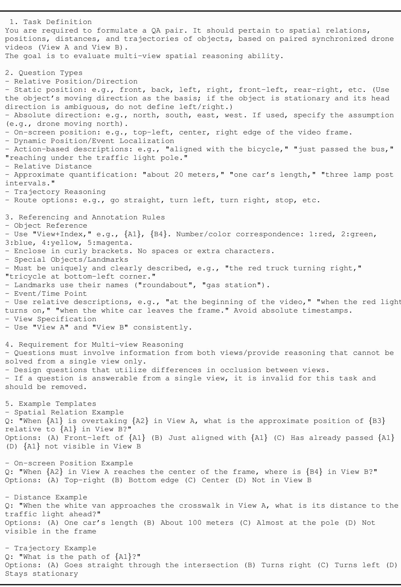  
Figure 14: Guidelines for MSR manual annotation.

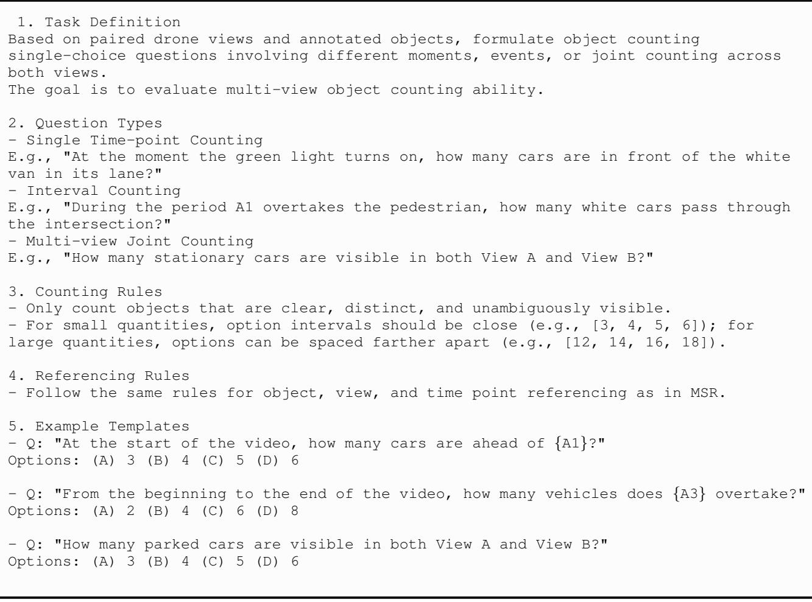  
Figure 15: Guidelines for MOC manual annotation.

(a) Annotation interface.

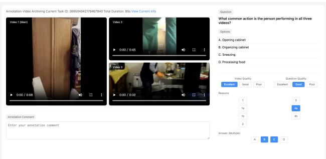  
Figure 16: The interface developed for manual annotation and review to construct CrossVid.

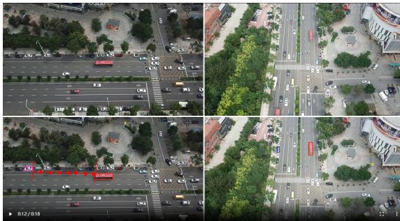  
(b) Marker tools for precise annotation.

You are asked to score the output of a model, given the following information:   
- Question: QUESTION   
Standard Answer: {ANSWER}   
- Scoring Points: {POINTS}   
- Model's Output: {ouTPUT} Please perform the following two-part scoring:   
Part 1: Coverage of Scoring Points   
- For each scoring point, determine whether it is covered by the model's output. - Mark as covered (true) only if the scoring point is addressed explicitly and clearly. - If the mention is vague, partial, or ambiguous, consider it not covered.

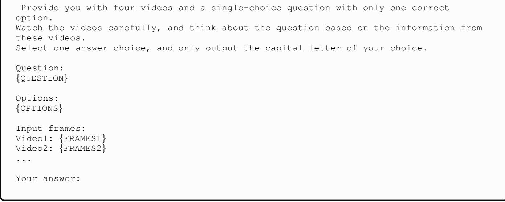  
Figure 17: Assessment prompt for CCQA.   
Figure 18: Inference prompt for single-choice questions.

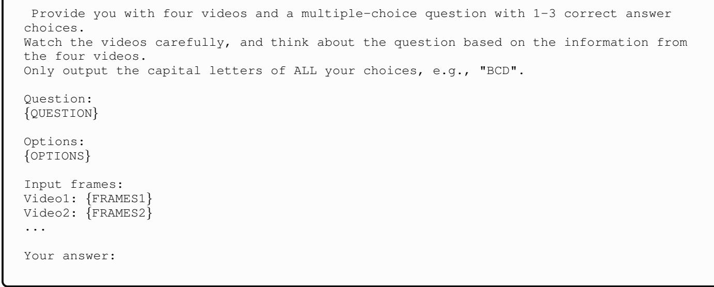  
Figure 19: Inference prompt for multiple-choice questions.

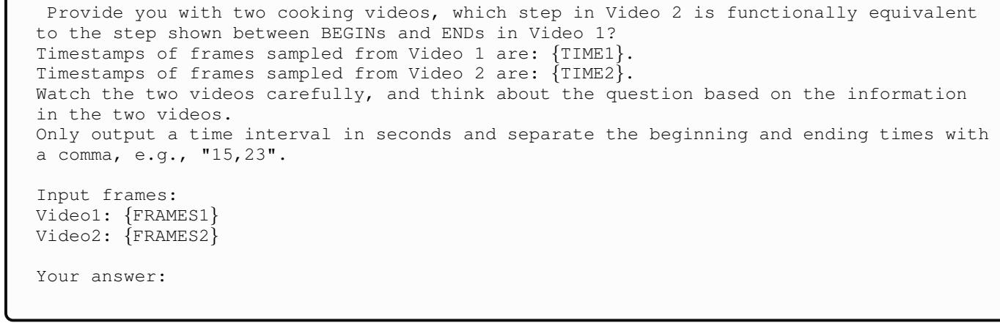  
Figure 20: Inference prompt for the FSA task.

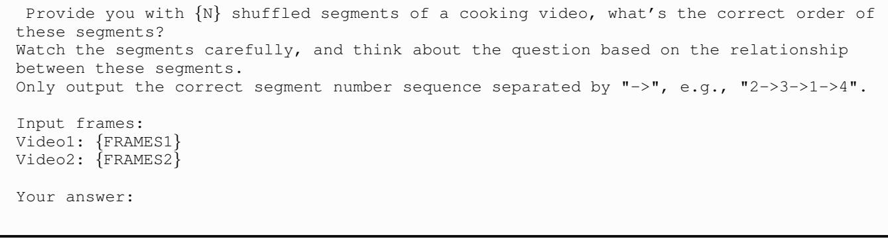  
Figure 21: Inference prompt for the PSS task.

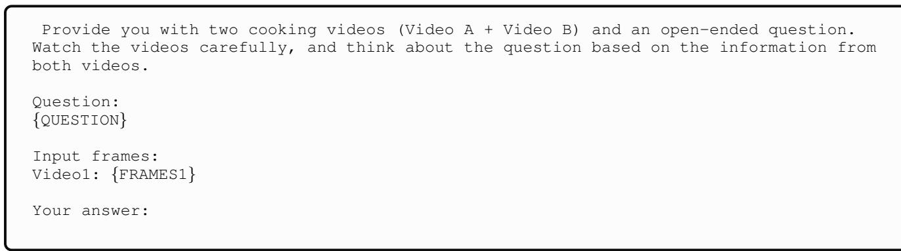  
Figure 22: Inference prompt for the open-ended CCQA task.

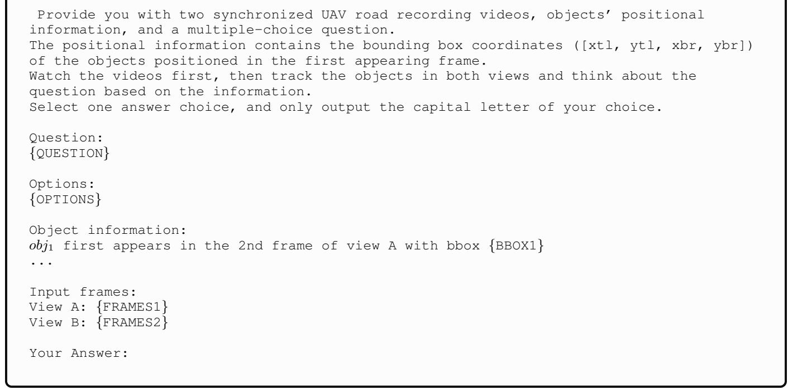  
Figure 23: Inference prompt for MSR and MOC task.

Provide you with four videos and a single-choice question with only one correct option.

Watch the videos carefully, and think about the question based on the information from these videos.

Follow these thinking steps to answer:

- Analyze the question and describe the key element in the question.   
- Carefully observe the frames from the provided videos and briefly describe the key   
information. Aggregate the information and analyze each option. Explain your reasoning.   
Based on your analysis, select the best answer. You should first output the above thinking steps within <think></think> tags.   
Then, output the capital letter of your answer choice within <answer></answer> tags.

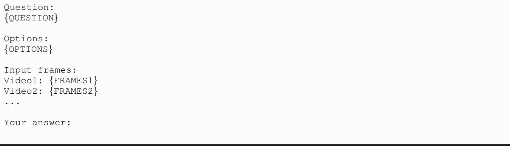  
Figure 24: CoT prompt for single-choice questions.

  
Figure 25: Percentage of each error type for each MLLM.

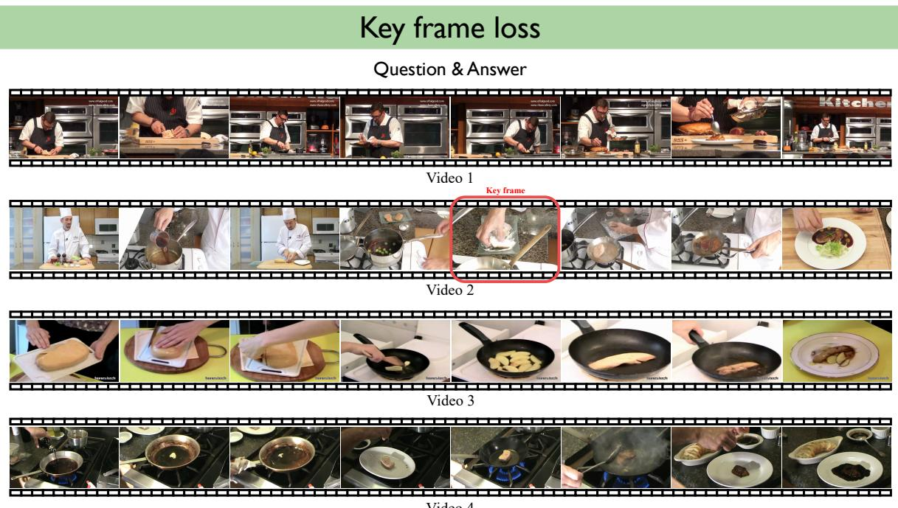  
Video 4

Question: In which video is the foie gras coated with flour before cooking?

A. Video 1 B. Video 2 C. Video 3 D. Video 4

# Error Answer

Qwen2.5-VL-72B answer: None

Qwen2.5-VL-72B response steps:

Stage1: Comprehend the question

T fe gras   four bee kp.

# Stage2: Analyze frames

flour coating involved.

# Stage3: Aggregate clues and answer

they all involve seasoning and direct cooking.

- Option A (Video 1): The video shows seasoning but no flour coating, so this option is contradicted.

T  .

Otn C(Vi ) The ido shows sicing and cokg without a four catng s this ti condid

- Option D (Video 4): The video shows cooking without a flour coating, so this option is also contradicted $| \mathrm { { n u } } .$ Based on your analysis, select the best answer.

# Error Reason

  
Figure 26: Example of the key frame loss.

Question: In which film does a hug mark the resolution of a crisis rather than just affection?

Video 1 B. Video 2 C. Video 3 D. Video

# Error Answer

Qwen2.5-VL-72B answer: D

Qwen2.5-VL-72B response steps:

# Stage1: Comprehend the question

T

# Stage2: Analyze frames

resolution of a crisis.

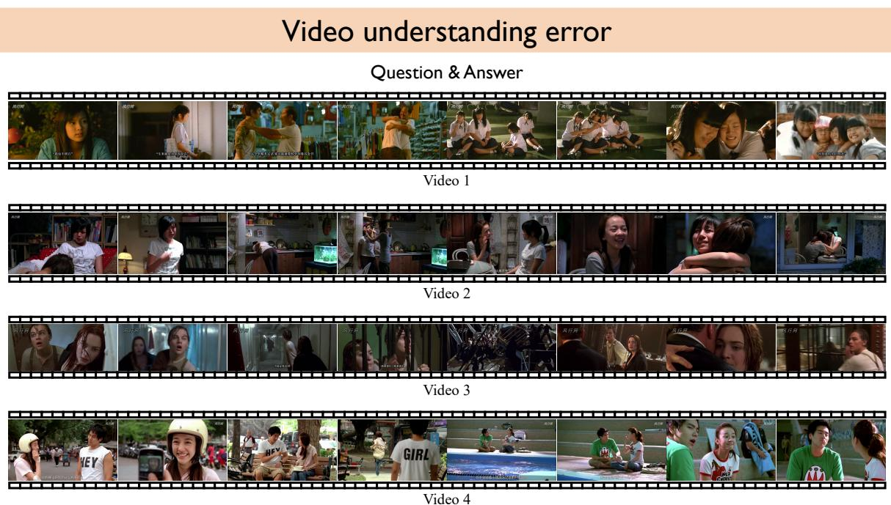  
Figure 27: Example of the video understanding error.

depicte, and any hugs shown seem to be expressions ofection  camaraderie rather than resolving  i.

# Stage3: Aggregate clues and answer

. Vido 4 The hugs in this video are casual and do not appear to resolve any crises.

# Error Reason

T c

# Cross-video comparison error

Question & Answer

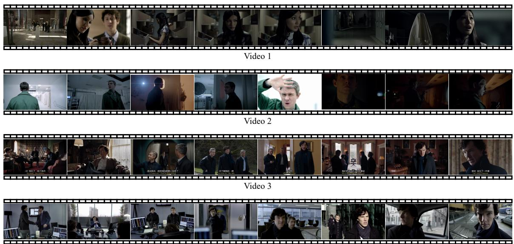

Video 4

Question: Which two films use dim lighting during key moments of discovery to create suspense?

A. Videos 1 and 2 B. Videos 2 and 3 C. Videos 3 and 4 D. Videos 1 and 4

# Error Answer

MiniCPM-o 2.6 answer: D

MiniCPM-0 2.6 response steps:

Stage1: Comprehend the question

T the provided clips from the four videos.

# Stage2: Analyze frames

the teapot and the person examining the items, are highlighted with dim lighting.   
the teapot. This dim lighting adds to the suspenseful atmosphere.   
prominent in this video.   
suspenseful atmosphere during key moments of discovery.

Stage3: Aggregate clues and answer

# Error Reason

I .

Figure 28: Example of the cross-video comparison error.