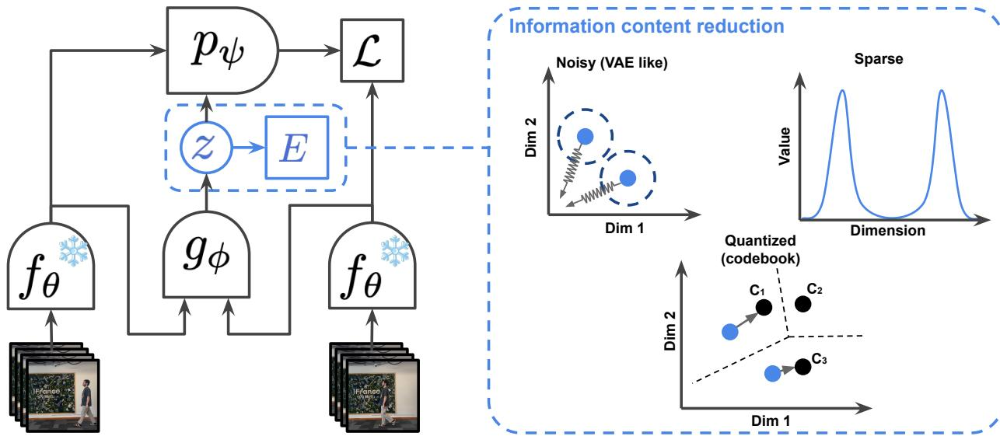
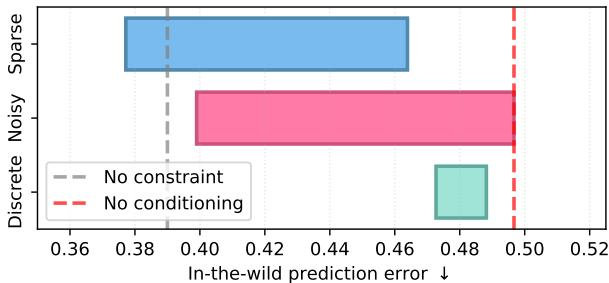
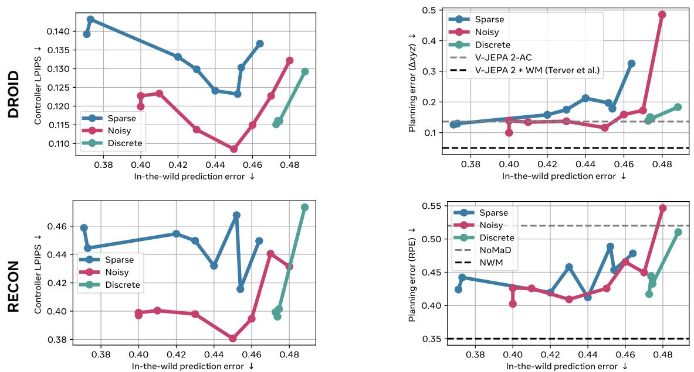
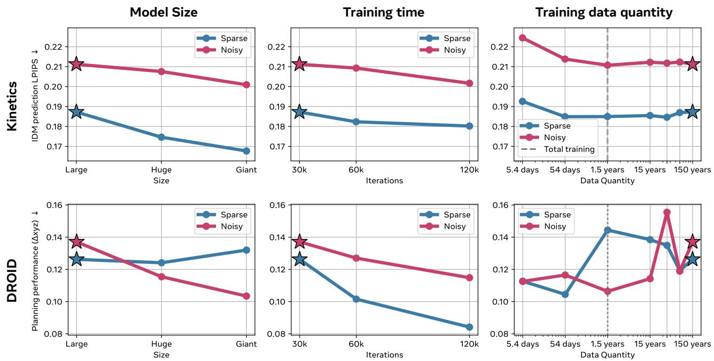

# 1. Bibliographic Information

## 1.1. Title
Learning Latent Action World Models In The Wild

## 1.2. Authors
The authors are Quentin Garrido, Tushar Nagarajan, Basile Terver, Nicolas Ballas, Yann LeCun, and Michael Rabbat. The affiliations listed are FAIR at Meta, Inria, and NYU. This team comprises prominent researchers in the field of artificial intelligence. Yann LeCun is a Turing Award laureate, a leading figure in deep learning, and the Chief AI Scientist at Meta. FAIR (Fundamental AI Research) at Meta is one of the world's leading AI research laboratories, known for significant contributions to computer vision, natural language processing, and self-supervised learning. The collective expertise of this group lends significant credibility to the work.

## 1.3. Journal/Conference
The paper is available on arXiv, which is a preprint server. This means it has been shared publicly before or during a formal peer-review process for a conference or journal. The futuristic publication date (2026-01-08) and paper ID (`2601.05230`) are placeholders, and the work should be considered contemporary research shared in a pre-publication stage. arXiv is the standard platform in the AI community for disseminating cutting-edge research quickly.

## 1.4. Publication Year
The provided publication date is a placeholder: January 8, 2026. Based on the content and references, the work is contemporary to the mid-2020s.

## 1.5. Abstract
The abstract outlines the paper's core objective: to develop agents that can reason and plan in the real world by predicting the consequences of their actions. While `world models` provide this capability, they usually depend on `action labels`, which are difficult to acquire at a large scale. The paper proposes learning `latent action models (LAMs)` from unlabeled "in-the-wild" videos, a significant step up from previous work on simpler domains like robotics simulations or video games. This diverse data introduces challenges such as environmental noise and the lack of a consistent "embodiment" (i.e., a consistent agent body) across videos.

The authors investigate architectural choices and find that **continuous, but constrained, latent actions** are more effective at capturing the complexity of real-world actions than the commonly used `vector quantization` (discrete actions). They discover that the model can learn and transfer complex environmental changes, like a human entering a room, across different videos. Due to the lack of a common embodiment, the learned latent actions tend to be spatially localized relative to the camera. Despite this, they successfully train a controller to map known actions to these latent actions, using the latent space as a universal interface. This allows them to solve planning tasks with performance comparable to models trained with explicit action labels. The work is presented as a step towards scaling latent action models to the real world.

## 1.6. Original Source Link
*   **Original Source Link:** `https://arxiv.org/abs/2601.05230`
*   **PDF Link:** `https://arxiv.org/pdf/2601.05230v1`
*   **Publication Status:** Preprint.

# 2. Executive Summary

## 2.1. Background & Motivation
*   **What is the core problem the paper aims to solve?**
    The central problem is the **data bottleneck in training world models**. World models, which are AI systems that learn an internal simulation of their environment to predict future outcomes, are crucial for planning and reasoning. However, they traditionally require vast amounts of data where each action is explicitly labeled (e.g., a video of a robot arm moving, paired with the exact motor commands). Sourcing and labeling such data at the scale of the internet is practically impossible.

*   **Why is this problem important in the current field? What specific challenges or gaps exist in prior research?**
    Solving this problem is key to building more general and scalable intelligent agents. The vast majority of video data available online is unlabeled. The ability to learn from this "in-the-wild" data would unlock unprecedented scale. Prior research on `Latent Action Models (LAMs)`—models that learn actions without labels—has made progress but has been confined to narrow, controlled domains like video games (e.g., Atari) or specific robotic manipulation tasks. These domains have two key simplifications that don't hold in the real world:
    1.  **Limited Action Diversity:** The range of possible actions is small and well-defined.
    2.  **Consistent Embodiment:** The agent (e.g., the game character, the robot arm) is the same across all data.
        The major gap is extending LAMs to handle the immense diversity, noise, and lack of consistent embodiment found in real-world videos (e.g., YouTube videos showing everything from cooking to dancing to driving).

*   **What is the paper's entry point or innovative idea?**
    The paper's innovative step is to directly confront the challenge of training LAMs on large-scale, uncurated, in-the-wild video data. Instead of avoiding the complexities of this data, the authors embrace them and investigate what architectural and methodological choices are necessary to make it work. Their central hypothesis is that it is possible to learn a meaningful and useful universal action space from this chaotic data, which can then be adapted for specific downstream tasks like robotic control.

## 2.2. Main Contributions / Findings
The paper makes several key contributions to the field of world modeling and representation learning:

1.  **Superiority of Continuous Latent Actions:** The authors conduct a systematic study on how to regularize latent actions in the context of in-the-wild videos. They find that continuous representations, constrained by either **sparsity** or **noise**, are far more effective at capturing complex, real-world actions than discrete `vector quantization`, a common choice in prior work.

2.  **Learning Actions Without a Common Embodiment:** A significant finding is that a consistent agent body across videos is not a prerequisite for learning meaningful actions. The model adapts by learning actions that represent **spatially-localized, camera-relative transformations**. For example, it learns "cause movement in the top-left quadrant of the frame" rather than "move the left arm."

3.  **Demonstration of Complex Action Transfer:** The paper qualitatively shows that the learned latent actions are general enough to be transferred between entirely different videos. For instance, the latent action corresponding to a person walking into a room in one video can be applied to another video to make a different object (e.g., a ball) move in a similar way.

4.  **A Universal Action Interface for Planning:** The most practical contribution is demonstrating that this learned latent action space can function as a **universal interface**. By training a small, lightweight "controller" network that maps known actions from a specific domain (e.g., robot motor commands) to the corresponding latent actions, the world model can be controlled for planning. This approach achieves performance on robotics and navigation tasks that is comparable to models trained directly on domain-specific, action-labeled data, despite the world model itself having never seen those labels.

# 3. Prerequisite Knowledge & Related Work

## 3.1. Foundational Concepts

*   **World Models:** A world model is a component of an intelligent agent's brain, either biological or artificial, that creates an internal, predictive model of its environment. It learns the "physics" and dynamics of its world. By using this internal model, the agent can simulate or "imagine" the future consequences of different potential actions without actually having to perform them. This is a powerful mechanism for planning, allowing the agent to choose the sequence of actions most likely to lead to a desired goal. A typical world model takes the current state of the world ($s_t$) and an action ($a_t$) as input and predicts the next state ($s_{t+1}$).

*   **Latent Action Models (LAMs):** LAMs are a class of world models designed to learn from data that lacks explicit action labels. The core idea is to treat the "action" as an unobserved, or latent, variable. The training process typically involves two key components that are learned jointly:
    1.  **Inverse Dynamics Model (IDM):** This model observes a transition from a past state ($s_t$) to a future state ($s_{t+1}$) and infers the latent action ($z_t$) that must have caused this change. It essentially answers the question: "What action explains the difference between what I saw and what I see now?"
    2.  **Forward Model:** This is the world model itself. It takes the past state ($s_t$) and the latent action ($z_t$) inferred by the IDM and tries to predict the future state ($s_{t+1}$).
        By forcing the action to be a compressed "bottleneck" of information between the past and future, the model is encouraged to learn abstract concepts of actions rather than just copying the next frame.

*   **Vector Quantization (VQ):** VQ is a technique for data compression and discretization. It involves representing a large set of continuous vectors (like the output of a neural network) with a much smaller, finite set of prototype vectors called a "codebook." For any given input vector, the VQ process finds the closest vector in the codebook and replaces the input with that codebook vector's index or the vector itself. In machine learning, this is used to create a discrete latent space, which acts as a very strong information bottleneck, forcing the model to learn efficient representations. This is the core mechanism in models like the VQ-VAE.

*   **Self-Supervised Learning (SSL):** SSL is a training paradigm where a model learns from the data itself, without requiring human-annotated labels. The learning process is framed as a "pretext task," where the model is asked to predict a part of the input data from other parts. For example, predicting a masked word in a sentence (like in BERT) or predicting the next frame in a video (as in this paper). The goal is to learn rich, general-purpose representations of the data that can then be fine-tuned for various downstream tasks. This paper's approach is a form of SSL.

## 3.2. Previous Works

*   **Action-Conditioned World Models:** The paper builds upon a rich history of world models that require action labels.
    *   **Dreamer (Hafner et al., 2019, 2023):** A highly influential series of models that learn a world model in a compact latent space and use it to train an agent's policy entirely through "imagination." Dreamer has achieved state-of-the-art performance in many reinforcement learning benchmarks, particularly in video game environments like Atari and DeepMind Control Suite. It relies on receiving action and reward signals from the environment.
    *   **Navigation World Models (NWM) (Bar et al., 2024):** A recent work focusing on navigation tasks. It demonstrates how world models can be used for planning in complex, 3D simulated environments. It also requires action labels (e.g., move forward, turn left).
    *   **UniSim (Yang et al., 2023):** A framework aiming to create a universal simulator that can handle various embodiments and tasks. It uses textual descriptions as a form of action conditioning, providing a more abstract way to control agents but still relying on a form of supervision.

*   **Latent Action Models (LAMs):** The paper directly extends the work on LAMs.
    *   **Genie (Bruce et al., 2024):** A prominent LAM that learns from unlabeled internet videos of platformer games (like Super Mario Bros.). It uses a discrete, `vector-quantized` latent action space and can generate new, playable game environments. Its success is notable but is confined to the specific domain of 2D video games.
    *   **UniVLA (Bu et al., 2025) & LAPA (Ye et al., 2025):** These works also learn latent actions, primarily from robotics and manipulation data. They often use `vector quantization` for the latent action space and focus on creating generalist agents that can perform various manipulation tasks. A key limitation is their reliance on curated, in-domain data.
    *   **AdaWorld (Gao et al., 2025):** This work is similar to the current paper in that it opts for a continuous latent action space, using a VAE-like regularization. However, its experimental validation is primarily on more structured robotics data.

*   **Foundation Models for Vision:**
    *   **V-JEPA 2 (Assran et al., 2025):** This paper uses V-JEPA 2 as its frozen video encoder. `JEPA` stands for Joint-Embedding Predictive Architecture. It is a self-supervised learning method that learns representations by predicting the representations of masked-out patches of an input (in this case, video clips) in an abstract feature space, rather than predicting the raw pixels. This encourages the model to learn semantic features and ignore low-level, noisy details, making the learned representations more robust and suitable for downstream tasks like prediction and planning.

## 3.3. Technological Evolution
The field has progressed along a clear trajectory:
1.  **Early World Models:** Initial concepts were developed for reinforcement learning, often in simple, grid-world-like environments with known dynamics and action spaces.
2.  **Deep Learning-based World Models:** With the rise of deep learning, models like `Dreamer` demonstrated the ability to learn complex world models from high-dimensional inputs (pixels) in simulated environments, but still required explicit action labels.
3.  **Emergence of Latent Action Models (LAMs):** Researchers began to tackle the action-label bottleneck by proposing LAMs. Early successes like `Genie` showed this was feasible in constrained domains like video games, often using discrete action spaces.
4.  **Scaling to the Real World:** The current paper represents the next logical step in this evolution. It pushes LAMs out of the "lab" (simulations, games, curated robotics data) and into the "wild" (unlabeled internet videos), forcing a re-evaluation of what types of action representations and regularization techniques are most effective in this complex and chaotic setting.

## 3.4. Differentiation Analysis
Compared to previous work, this paper's core innovations are:
*   **Data Domain:** The primary differentiator is the use of **large-scale, in-the-wild video data** (`YoutubeTemporal-1B`) for training. This is a far more challenging and diverse data source than the video games, simulations, or curated manipulation datasets used in prior LAM research.
*   **Action Representation:** The paper explicitly challenges the common practice of using `vector quantization` for latent actions. It demonstrates through comparative analysis that **continuous, constrained latent spaces (using sparsity or noise)** are better suited for the high diversity of actions found in natural videos.
*   **Focus on Generality and Transfer:** While other LAMs aim to learn actions for a specific embodiment, this paper investigates what can be learned in the **absence of a consistent embodiment**. This leads to the novel finding of camera-relative, spatially-localized actions and demonstrates their surprising generality by transferring them across disparate contexts.
*   **Practical Application as a Universal Interface:** The paper doesn't just analyze the learned representations; it provides a concrete method for making them useful. The "controller" approach bridges the gap between the abstract, learned action space and a specific, interpretable action space, demonstrating a practical pathway to using in-the-wild pre-training for downstream robotics tasks.

# 4. Methodology

## 4.1. Principles
The core principle of the methodology is to learn a world model from unlabeled videos by jointly training two components: an **Inverse Dynamics Model (IDM)** and a **Forward Model**. The IDM looks at the past ($s_t$) and future ($s_{t+1}$) to infer a latent action ($z_t$) that explains the transition. The Forward Model (the world model) then uses the past ($s_t$) and this inferred action ($z_t$) to predict the future ($s_{t+1}$).

A critical challenge in this setup is preventing the latent action $z_t$ from "cheating" by simply encoding a complete copy of the future state $s_{t+1}$. If this happens, the Forward Model's job becomes trivial, and no meaningful, abstract concept of "action" is learned. To prevent this, the paper introduces an **information bottleneck** on $z_t$. The main focus of the methodology is to explore and compare different ways to implement this bottleneck through **information regularization**.

The following diagram from the paper (Figure 2) illustrates the overall architecture.

*该图像是示意图，展示了潜在动作模型的结构及信息内容降维过程。图中显示了通过编码器 $E$ 将输入映射到潜在空间 $z$，并通过解码器 $p_\psi$ 进行重建的过程。右侧展示了不同降维效果的示例，包括噪声和稀疏性，以及量化的特征空间。此图表明在学习过程中，如何通过量化和降维提高潜在动作模型的表达能力。*

## 4.2. Core Methodology In-depth
The methodology can be broken down into the model architecture, the training process, and the specific regularization techniques applied to the latent actions.

### 4.2.1. Model Architecture and Data Flow
1.  **Video Encoding:** A video clip $V$ is first processed by a pre-trained, frozen video encoder, $f_{\theta}$. In this work, they use `V-JEPA 2-L`. This encoder converts each frame (or small group of frames) into a sequence of high-dimensional representations, $s_0, s_1, ..., s_{T-1}$. These representations operate in an abstract latent space, not in pixel space, which makes the subsequent prediction task more robust to irrelevant, low-level details.

2.  **Latent Action Inference (IDM):** The Inverse Dynamics Model, $g_{\phi}$, takes two consecutive state representations, $s_t$ and $s_{t+1}$, as input and outputs a latent action vector, $z_t$.
    \$
    z_t = g_{\phi}(s_t, s_{t+1})
    \$
    This vector $z_t$ is the model's hypothesis for the action that caused the world to transition from state $s_t$ to $s_{t+1}$.

3.  **Future Prediction (Forward Model):** The Forward Model, $p_{\psi}$, which is the world model, receives the history of states up to time $t$, denoted as $s_{0:t}$, and the latent action $z_t$ inferred by the IDM. Its task is to predict the next state, $\hat{s}_{t+1}$.
    \$
    \hat{s}_{t+1} = p_{\psi}(s_{0:t}, z_t)
    \$
    Architecturally, $p_{\psi}$ is implemented as a Vision Transformer (ViT-L). The conditioning on the latent action $z_t$ is performed using an `AdaLN-zero` mechanism, which modulates the activations within the transformer blocks.

### 4.2.2. Training Objective
The models $g_{\phi}$ and $p_{\psi}$ are trained jointly to minimize a loss function that has two components: a prediction loss and a regularization loss on the latent action. The overall prediction loss at a single timestep $t$ is:
\$
\mathcal{L}_t = \Vert s_{t+1} - p_{\psi}(s_{0:t}, z_t) \Vert_1 \quad \text{, with } z_t = g_{\phi}(s_t, s_{t+1})
\$
*   $s_{t+1}$: The ground-truth state representation of the next frame from the encoder.
*   $p_{\psi}(s_{0:t}, z_t)$: The predicted next state from the Forward Model.
*   $\Vert \cdot \Vert_1$: The L1 norm, which measures the element-wise absolute difference between the predicted and ground-truth vectors.

    This loss forces the Forward Model to make accurate predictions, but on its own, it doesn't prevent the cheating problem. The crucial component is the addition of a regularization loss, $\mathcal{L}_z(z_t)$, on the latent actions. The paper investigates three different forms for this regularization.

### 4.2.3. Information Regularization Techniques
The authors study three distinct mechanisms to constrain the information content of the latent actions $z_t$.

**1. Sparsity-based Regularization**
This is the most complex approach, inspired by `VICReg`. It aims to make the latent action vectors sparse (most elements are zero) while ensuring the non-zero elements are informative and disentangled. The regularization is a sum of two components:
\$
\mathcal{L}(Z) = VCM(Z) + \frac{1}{N} \sum_i E(Z_i)
\$
*   $Z$ is a batch of $N$ latent action vectors.
*   The first term, `E(z)`, is applied to each individual latent vector $z$:
    \$
    E(z) = \lambda_{l2} \max(\sqrt{D} - \|z\|_2^2, 0) + \lambda_{l1} \|z\|_1
    \$
    *   $\|z\|_1$: This is the standard L1 sparsity penalty, which encourages elements of $z$ to be exactly zero.
    *   $\max(\sqrt{D} - \|z\|_2^2, 0)$: This term prevents a trivial solution where the model makes all vectors zero to satisfy the L1 penalty. It encourages the L2 norm of the vector to be close to $\sqrt{D}$, where $D$ is the dimension of the latent action.
*   The second term, `VCM(Z)`, is applied across the batch of latent vectors and is composed of three parts to ensure the latent dimensions are well-behaved:
    \$
    VCM(Z) = \lambda_V \frac{1}{D} \sum_d \max(1 - \sqrt{\mathrm{Var}(Z_{\cdot, d})}, 0) + \lambda_C \frac{1}{D(D-1)} \sum_{i \neq j} \mathrm{Cov}(Z)_{i,j}^2 + \lambda_M \frac{1}{ND} \sum_{i,j} Z_{i,j}
    \$
    *   **Variance term (V):** This encourages the variance of each dimension of the latent action (across the batch) to be at least 1. This prevents dimensions from collapsing and becoming unused.
    *   **Covariance term (C):** This penalizes the covariance between different dimensions of the latent actions, encouraging them to be decorrelated and capture independent factors of variation.
    *   **Mean term (M):** This term adds a small penalty to the mean of the latent actions.

**2. Noise Addition (VAE-like)**
This approach regularizes the latent space by treating it as a probabilistic distribution, similar to a Variational Autoencoder (VAE). The IDM, instead of outputting a single vector $z_t$, outputs the parameters (mean $\mu$ and log-variance $\log\sigma^2$) of a Gaussian distribution $q(z_t | s_t, s_{t+1})$. A latent action is then sampled from this distribution. The regularization loss is the Kullback-Leibler (KL) divergence between this distribution and a standard normal prior ($\mathcal{N}(0, 1)$):
\$
\mathcal{L}(z_t) = -\beta D_{KL}\left( q(z_t | s_t, s_{t+1}) || \mathcal{N}(0, 1) \right)
\$
*   $D_{KL}$: The KL divergence measures how much one probability distribution differs from another.
*   $\mathcal{N}(0, 1)$: The standard normal distribution (mean 0, variance 1).
*   $\beta$: A hyperparameter that controls the strength of the regularization.
    This loss pushes the learned latent actions to be distributed like random noise, which effectively limits the amount of information they can carry.

**3. Discretization (Vector Quantization)**
This is the simplest and harshest form of regularization. The continuous vector output by the IDM is mapped to the single closest vector from a pre-defined, finite codebook of vectors.
\$
z_t = \text{Quantize}(g_{\phi}(s_t, s_{t+1}))
\$
This forces the model to represent all possible actions using only a small, discrete set of options, creating a very strong information bottleneck. The paper uses the specific quantization scheme from `UniVLA`.

# 5. Experimental Setup

## 5.1. Datasets
*   **Training Dataset:**
    *   **YoutubeTemporal-1B:** A massive-scale dataset consisting of one billion YouTube video clips. Its key characteristics are its immense size and diversity. The videos are "in-the-wild," meaning they are uncurated and cover a vast range of topics, environments, objects, and actions, with varying camera angles, lighting, and quality. This is the ideal dataset for testing the scalability and generality of the proposed model.

*   **Evaluation Datasets:**
    *   **Kinetics:** A large-scale, high-quality dataset of human action videos. It is used to evaluate how well the model captures human-centric actions.
    *   **RECON (Rapid Exploration for Open-world Navigation):** A dataset for egocentric navigation, where an agent moves through indoor environments. It is used to test the model's ability to understand and predict camera motion.
    *   **DROID (A Large-scale in-the-wild Robot Manipulation Dataset):** A dataset of a robot arm performing various manipulation tasks in real-world settings. This dataset is crucial for evaluating the model's applicability to robotics and planning, as it contains labeled actions that can be used to train the controller and measure planning performance.
    *   **SSv2 (Something-Something v2):** A dataset focused on fine-grained human-object interactions (e.g., "pushing something from left to right"). It tests the model's ability to understand subtle and precise actions.

        The choice of these datasets allows for a comprehensive evaluation: training on a massive, general dataset and testing on several specialized datasets that cover human action, navigation, and robotic control.

## 5.2. Evaluation Metrics
The paper uses several metrics to evaluate different aspects of the model's performance.

*   **LPIPS (Learned Perceptual Image Patch Similarity):**
    1.  **Conceptual Definition:** LPIPS is a metric designed to measure the perceptual similarity between two images, aiming to align better with human judgment than traditional metrics like L1 or Mean Squared Error (MSE). Instead of comparing raw pixel values, LPIPS compares the images in a "deep feature space." It feeds both images through a pre-trained deep neural network (like VGG or AlexNet) and measures the distance between their activations at different layers. Two images that are perceptually similar will produce similar feature activations.
    2.  **Mathematical Formula:**
        \$
        d(x, x_0) = \sum_l \frac{1}{H_l W_l} \sum_{h,w} \| w_l \odot (\hat{y}^l_{hw} - \hat{y}^l_{0hw}) \|_2^2
        \$
    3.  **Symbol Explanation:**
        *   $d(x, x_0)$: The LPIPS distance between image $x$ and reference image $x_0$.
        *   $l$: Index of the layer in the deep network.
        *   $\hat{y}^l, \hat{y}^l_0$: The feature activations from layer $l$ for images $x$ and $x_0$, respectively. They are unit-normalized in the channel dimension.
        *   $H_l, W_l$: The height and width of the feature map at layer $l$.
        *   $w_l$: A vector of weights used to scale the activations at layer $l$. These weights are learned to better match human perceptual judgments.
        *   $\odot$: Element-wise product.

*   **Δxyz (Distance to Goal for DROID):**
    1.  **Conceptual Definition:** This metric measures the final positional error in a robotic manipulation planning task. It calculates the difference between the total displacement achieved by the planned sequence of actions and the total displacement of the ground-truth action sequence needed to reach the goal.
    2.  **Mathematical Formula:**
        \$
        \Delta xyz = \left\| \sum_{i=t}^{t+H-1} a_i^{\mathrm{plan}} - \sum_{i=t}^{t+H-1} a_i^{\mathrm{gt}} \right\|_1
        \$
    3.  **Symbol Explanation:**
        *   $H$: The planning horizon (number of steps).
        *   $a_i^{\mathrm{plan}}$: The planned action vector at step $i$.
        *   $a_i^{\mathrm{gt}}$: The ground-truth action vector from the dataset at step $i$.
        *   $\| \cdot \|_1$: The L1 norm, summing the absolute differences along each spatial dimension (x, y, z).

*   **RPE (Relative Pose Error) & ATE (Absolute Trajectory Error) for RECON:**
    1.  **Conceptual Definition:** These are standard metrics for evaluating visual odometry or navigation systems.
        *   **ATE:** Measures the global consistency of a trajectory. It computes the direct difference between the estimated and ground-truth positions at each point in time, after aligning the entire trajectory. It is good for measuring overall drift.
        *   **RPE:** Measures the local accuracy of a trajectory. It computes the error in the relative motion (translation and rotation) between consecutive pairs of camera poses. It is good for measuring short-term motion estimation quality.
    2.  **Mathematical Formula (for RPE, translation part):**
        \$
        E_i = (Q_i^{-1} Q_{i+1})^{-1} (P_i^{-1} P_{i+1})
        \$
    3.  **Symbol Explanation:**
        *   $P_i \in SE(3)$: The ground-truth camera pose at time $i$.
        *   $Q_i \in SE(3)$: The estimated camera pose at time $i$.
        *   $P_i^{-1} P_{i+1}$: The ground-truth relative transformation from time $i$ to $i+1$.
        *   $Q_i^{-1} Q_{i+1}$: The estimated relative transformation.
        *   $E_i$: The error in the relative transformation at step $i$. RPE is typically reported as the root-mean-square error (RMSE) over all $E_i$.

## 5.3. Baselines
The primary comparison is **internal**, between the three proposed regularization methods (sparse, noisy, discrete) at varying levels of "capacity" (i.e., strength of regularization). However, for the downstream planning tasks, external baselines are used:

*   **V-JEPA 2-AC:** An action-conditioned world model that uses the same `V-JEPA 2` encoder but is trained on the DROID dataset with access to the ground-truth action labels. This serves as a direct comparison to see how much performance is lost by learning actions latently instead of using provided labels.
*   **V-JEPA 2 + WM (Terver et al., 2025):** The state-of-the-art model on the DROID planning task from a concurrent paper, serving as an upper-bound performance target.
*   **NWM (Bar et al., 2024):** A strong, action-conditioned world model specifically designed for navigation, used as a baseline for the RECON task.
*   **NoMaD (Sridhar et al., 2024):** A policy-based method for navigation, representing a different class of approaches (not world-model-based planning).

# 6. Results & Analysis

## 6.1. Core Results Analysis

### 6.1.1. Performance of Information Regularizations
The first key question is how well different regularization strategies can model the complex actions in wild videos. The results are evaluated by measuring the one-step prediction error when using the IDM (an "oracle" setting, as it uses the future frame to infer the action).

The following chart (Figure 4 from the original paper) shows the one-step prediction error on in-the-wild videos.

**Analysis:**
*   **Sparse and Noisy Methods are Flexible:** The blue bars (Sparsity) and pink bars (Noise) show a clear trend. As the regularization is relaxed (moving from "Low" to "High" capacity, which corresponds to weaker regularization), the prediction error decreases. This demonstrates that these continuous methods can flexibly trade off between information capacity and prediction accuracy. They can be tuned to capture more complex actions at the cost of a denser latent representation.
*   **Discrete (VQ) Method Struggles:** The green bars (Discrete) show very little change in performance and remain close to the deterministic baseline (no conditioning). This indicates that a fixed-size codebook struggles to capture the sheer diversity and complexity of actions present in natural videos. It acts as too harsh of an information bottleneck.
*   **Qualitative Evidence:** Figure 3 in the paper further supports this. When predicting a complex action like a person entering a room, the sparse and noisy models produce a clear prediction, while the discrete model predicts a blurry, indistinct shape, failing to capture the details of the action.

    **Takeaway:** Continuous latent actions (regularized by sparsity or noise) are superior to discrete actions for modeling the rich dynamics of in-the-wild videos.

### 6.1.2. Nature of the Learned Actions
This section investigates what the model actually learns. Is it cheating? Are the actions generalizable?

*   **Future Leakage:** To test if the model cheats by encoding the next frame in $z_t$, the authors create artificial scene cuts.
    The following are the results from Table 1 of the original paper:

    <table>
    <thead>
    <tr>
    <th>Latents</th>
    <th>Capacity</th>
    <th>w/o change</th>
    <th>w/ change</th>
    </tr>
    </thead>
    <tbody>
    <tr>
    <td rowspan="2">Sparse</td>
    <td>Low</td>
    <td>0.28</td>
    <td>0.66 (×2.3)</td>
    </tr>
    <tr>
    <td>High</td>
    <td>0.20</td>
    <td>0.50 (×2.4)</td>
    </tr>
    <tr>
    <td rowspan="2">Noisy</td>
    <td>Low</td>
    <td>0.33</td>
    <td>0.69 (×2.1)</td>
    </tr>
    <tr>
    <td>High</td>
    <td>0.21</td>
    <td>0.54 (×2.5)</td>
    </tr>
    <tr>
    <td rowspan="2">Discrete</td>
    <td>Low</td>
    <td>0.34</td>
    <td>0.69 (×2.0)</td>
    </tr>
    <tr>
    <td>High</td>
    <td>0.29</td>
    <td>0.68 (×2.3)</td>
    </tr>
    </tbody>
    </table>

    **Analysis:** For all models, the prediction error (LPIPS) more than doubles when a scene cut occurs. If the model were simply copying the next frame, the error would remain low. This significant spike in error strongly suggests that the model is not cheating and has learned a representation of *change* or *dynamics*, which is violated by an abrupt scene cut.

*   **Action Transferability (Cycle Consistency):** The authors test if an action inferred from Video A can be applied to Video B, and then re-inferred from B and applied back to A.
    The following are the results from Table 2 of the original paper:

    <table>
    <thead>
    <tr>
    <th rowspan="2">Latents</th>
    <th rowspan="2">Capacity</th>
    <th colspan="2">Kinetics</th>
    <th colspan="2">RECON</th>
    </tr>
    <tr>
    <th>Original</th>
    <th>Transfer</th>
    <th>Original</th>
    <th>Transfer</th>
    </tr>
    </thead>
    <tbody>
    <tr>
    <td rowspan="2">Sparse</td>
    <td>Low</td>
    <td>0.26</td>
    <td>0.31 (×1.20)</td>
    <td>0.24</td>
    <td>0.29 (×1.21)</td>
    </tr>
    <tr>
    <td>High</td>
    <td>0.19</td>
    <td>0.24 (×1.30)</td>
    <td>0.20</td>
    <td>0.23 (×1.14)</td>
    </tr>
    <tr>
    <td rowspan="2">Noisy</td>
    <td>Low</td>
    <td>0.30</td>
    <td>0.34 (×1.13)</td>
    <td>0.29</td>
    <td>0.33 (×1.15)</td>
    </tr>
    <tr>
    <td>High</td>
    <td>0.20</td>
    <td>0.26 (×1.34)</td>
    <td>0.20</td>
    <td>0.24 (×1.22)</td>
    </tr>
    <tr>
    <td rowspan="2">Discrete</td>
    <td>Low</td>
    <td>0.32</td>
    <td>0.33 (×1.03)</td>
    <td>0.32</td>
    <td>0.33 (×1.03)</td>
    </tr>
    <tr>
    <td>High</td>
    <td>0.27</td>
    <td>0.29 (×1.07)</td>
    <td>0.26</td>
    <td>0.27 (×1.05)</td>
    </tr>
    </tbody>
    </table>

    **Analysis:** The increase in prediction error after the cycle is very small (e.g., a factor of 1.03x to 1.34x), indicating that the latent actions are consistent and transferable. Interestingly, models with lower capacity (more constrained) transfer slightly better (smaller error increase), suggesting a trade-off between action complexity and generality.

*   **Learned Embodiment:** A key finding, illustrated qualitatively in Figures 7 and 8, is that due to the lack of a consistent agent body across the training data, the model learns actions that are **spatially localized and relative to the camera frame**. It learns transformations like "something moves in the top-left" rather than embodiment-specific actions like "raise the left hand." This camera-relative nature is what enables the surprising transfer of motion between a human and a ball (Figure 7).

    **Takeaway:** The model learns meaningful, generalizable, and camera-relative actions without cheating.

### 6.1.3. Application to Planning
The ultimate test is whether these learned latent actions are useful. The authors train a small controller to map known actions (from DROID and RECON datasets) to their latent action space and evaluate planning performance.

The following chart (Figure 11 from the original paper) summarizes the controller's rollout quality and the final planning performance on DROID and RECON.

**Analysis:**
*   **Performance is Not Monotonic with Capacity:** This is the most crucial insight from the planning experiments. The best planning performance (lowest $Δxyz$ or `RPE`) is **not** achieved by the models with the highest capacity (lowest in-the-wild prediction error). Instead, models with a **medium level of regularization** perform best.
*   **Interpretation:** This suggests a fundamental trade-off.
    *   **Low Capacity (Over-constrained):** The latent actions are too simple and cannot capture the necessary dynamics for precise control.
    *   **High Capacity (Under-constrained):** The latent actions may capture too much fine-grained, stochastic detail from the original videos (e.g., subtle lighting changes, background noise), making it difficult for a simple controller to consistently map deterministic robot commands to this complex space. They might also be "overfitting" to the future frame.
    *   **Medium Capacity (Balanced):** This setting strikes the right balance, capturing the essential dynamics of the action while remaining abstract and identifiable enough for a controller to learn a stable mapping.
*   **Competitive Performance:** The best models (particularly the noisy one with medium capacity) achieve planning performance on DROID ($Δxyz$ of 0.10) that is competitive with the action-conditioned baseline `V-JEPA 2-AC` (0.15) and approaches the state-of-the-art `V-JEPA 2 + WM` (0.05). This is a remarkable result, as the world model was trained without any action labels.

    **Takeaway:** Latent actions learned solely on natural videos can be effectively leveraged to solve robotics and navigation planning tasks, with performance rivaling models trained on in-domain, labeled data.

## 6.2. Ablation Studies / Parameter Analysis

### 6.2.1. Scaling Laws
The authors investigate how performance scales with model size, training time, and data size.

The following chart (Figure 12 from the original paper) shows these scaling trends.

**Analysis:**
*   **IDM Prediction Quality Scales Well:** The top row shows that for the task of predicting the next frame on in-the-wild videos (using the IDM), performance consistently improves with more data, longer training, and larger models. This indicates that the core world model benefits from scaling.
*   **Planning Performance Scaling is Nuanced:** The bottom row tells a more complex story for the DROID planning task.
    *   **Training Time:** More training steps consistently and significantly improve planning performance.
    *   **Model Size:** The effect is less pronounced. The noisy model benefits from a larger size, but the sparse model does not show a clear trend.
    *   **Data Size:** Surprisingly, increasing the amount of training data does not show a significant improvement in planning performance.
*   **Interpretation:** This suggests that the simple planning tasks used for evaluation may not be complex enough to require the full capabilities of the larger, more powerful world models. While scaling improves the model's general understanding of world dynamics, this improvement may not be fully reflected in tasks that only involve simple actions.

### 6.2.2. Impact of In-Domain Data
In Appendix D, the paper studies the effect of mixing in-domain data (DROID) during the world model's training phase. The results (Table S3) show that adding even a small amount of DROID data (10%) provides a significant boost to planning performance. When trained with 100% DROID data, the latent action model achieves planning performance almost identical to a model trained on the same data with action labels. This highlights the value of combining large-scale, general pre-training with smaller amounts of task-specific data.

# 7. Conclusion & Reflections

## 7.1. Conclusion Summary
This paper successfully demonstrates the feasibility and potential of learning `Latent Action World Models (LAMs)` directly from large-scale, uncurated, in-the-wild videos. The authors make several key findings:
*   They show that **continuous latent actions**, regularized with sparsity or noise, are more adept at capturing the rich dynamics of the real world than commonly used discrete `vector quantization`.
*   They discover that in the absence of a consistent embodiment, the model learns a generalizable action space of **spatially-localized, camera-relative transformations**.
*   They demonstrate that these learned actions are meaningful and can be used to transfer complex motions (like a person entering a room) between different video contexts.
*   Most importantly, they prove the practical utility of their approach by training a simple controller that maps known actions to their latent space. This allows their world model, trained without any action labels, to solve robotic manipulation and navigation tasks with performance comparable to supervised baselines.

    Overall, the work represents a significant step towards building more general and scalable world models by leveraging the vast amount of unlabeled video data available on the internet.

## 7.2. Limitations & Future Work
The authors acknowledge several limitations and suggest directions for future research:

*   **Variable Latent Information Content:** The current model uses a static regularization coefficient for all videos. However, some scenes are deterministic while others are highly complex. A future improvement would be to dynamically adjust the information constraint on the latent action based on the complexity of the observed transition.
*   **Sampling and Planning in Latent Action Space:** The paper relies on a "controller" to bridge the gap between known actions and the latent space. A more powerful and direct application would be to sample from or perform planning directly within the learned latent action space. This remains a challenging open problem, especially for continuous, non-Gaussian latent spaces like the sparse one.
*   **Shaping Representations with Single-Stage Training:** The world model is currently trained on top of a frozen, pre-trained video encoder (`V-JEPA 2`). While effective, these representations were not optimized specifically for prediction. A promising future direction is to perform single-stage training, where the encoder and the world model are trained jointly, allowing the latent actions to influence and shape the learned visual representations from the start.

## 7.3. Personal Insights & Critique
*   **Inspirations and Strengths:**
    *   This paper is an excellent example of tackling a hard, fundamental problem head-on. Moving from curated to in-the-wild data is a crucial step for the entire field of AI and robotics.
    *   The concept of a learned "universal action interface" is extremely powerful. It suggests a future where a single, massive world model pre-trained on internet video could serve as a foundation, which can then be quickly adapted to control any number of specific robots or agents with minimal in-domain data.
    *   The finding that a medium level of regularization yields the best planning performance is a fascinating and counter-intuitive result. It highlights the subtle trade-off between a model's raw predictive power and the identifiability or controllability of its latent variables, a common theme in representation learning.

*   **Potential Issues and Areas for Improvement:**
    *   **Camera-Relative Actions:** While the paper frames this as a strength that enables transfer, it could also be a fundamental limitation. For an agent that needs to reason about its own body and its interaction with the world in a stable, allocentric (world-centric) frame of reference, purely camera-relative actions might be insufficient. True embodiment may require learning to disentangle self-motion from world-motion.
    *   **Complexity of Planning Tasks:** The planning tasks used for evaluation (3-step manipulation, straight-line navigation) are relatively simple. It remains an open question how well this approach would scale to long-horizon, complex tasks that require intricate reasoning and planning. The scaling results hint that these simple tasks may not be challenging enough to showcase the full benefits of larger models.
    *   **The Controller as a Crutch:** While the controller is a clever practical solution, it still requires a small amount of labeled, in-domain data to train. The ultimate goal for LAMs is to enable control without *any* action labels, perhaps through goal-conditioning or other unsupervised methods for directing the agent. Planning directly in the latent space, as the authors note, is the key next step.