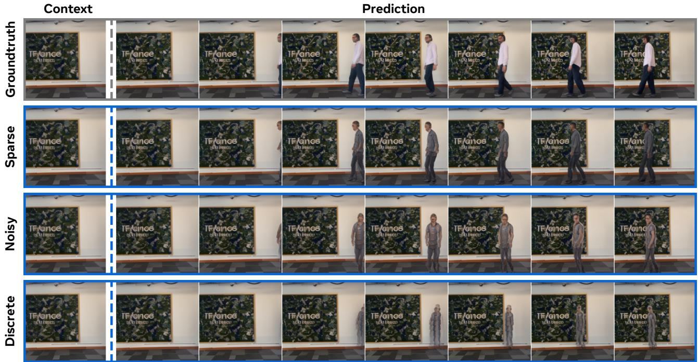
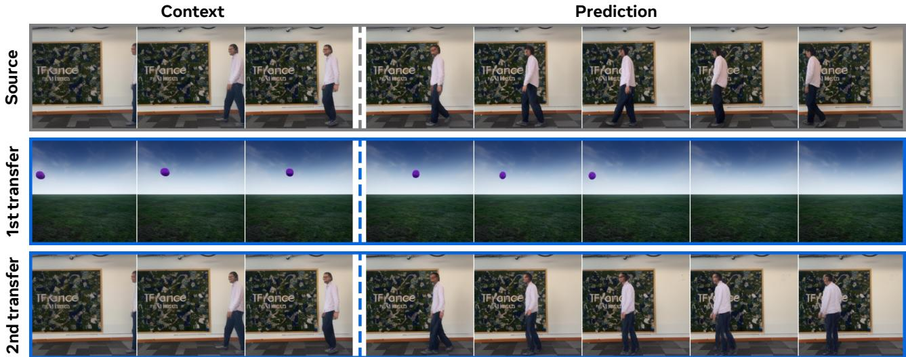
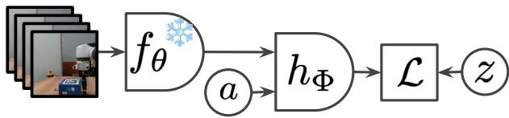

# 1. 论文基本信息

## 1.1. 标题
<strong>在野外学习潜在动作世界模型 (Learning Latent Action World Models In The Wild)</strong>

论文的核心主题是研究如何仅使用在自然、无约束环境（即“野外”）下拍摄的大规模视频数据，来学习一种能够理解并预测动作结果的“世界模型”，而无需任何人工标注的动作标签。其关键在于让模型自主发现一个“潜在的”动作空间。

## 1.2. 作者
- **作者团队:** Quentin Garrido, Tushar Nagarajan, Basile Terver, Nicolas Ballas, Yann LeCun, Michael Rabbat.
- **研究背景与隶属机构:**
    - 作者主要来自 **FAIR at Meta** (Meta AI 的基础人工智能研究团队)，其中 Yann LeCun 是深度学习领域的巨擘、图灵奖得主，也是 Meta 的首席 AI 科学家。
    - 其他合作者来自 **Inria** (法国国家信息与自动化研究所) 和 **NYU** (纽约大学)。
    - 强大的作者阵容和顶尖的研究机构背景表明，这项工作具有很高的学术水准和前沿性。

## 1.3. 发表期刊/会议
论文发布于 **arXiv**，这是一个预印本服务器。虽然文中虚构的发表时间是未来，但从其研究方向和作者背景来看，这类工作通常会投向机器学习或计算机视觉领域的顶级会议，如 **NeurIPS** (神经信息处理系统大会)、**ICML** (国际机器学习大会) 或 **ICLR** (国际学习表征会议)。这些会议在人工智能领域享有极高的声誉和影响力。

## 1.4. 发表年份
2026年 (根据原文信息，这是一个虚构的未来日期)。

## 1.5. 摘要
这篇论文旨在解决一个核心问题：现实世界的智能体需要预测其行为的后果，这通常通过“世界模型”来实现，但传统的世界模型大多需要明确的动作标签，而这类标签在大规模数据上难以获取。为此，本文探索了<strong>潜在动作模型 (Latent Action Models, LAMs)</strong>，这种模型仅从视频中就能学习到一个动作空间。

与以往工作专注于机器人模拟、视频游戏或特定操作数据不同，本文将研究范围扩展到了<strong>“在野外”</strong> (in-the-wild) 的视频。这种数据虽然能捕捉到更丰富的动作，但也带来了视频多样性导致的挑战，如环境噪声和跨视频缺乏统一的“具身”（即执行动作的主体，如机器人手臂或游戏角色）。

为了应对这些挑战，论文探讨了潜在动作应遵循的属性、相关的模型架构选择和评估方法。研究发现，**连续但受约束的潜在动作**能够有效捕捉野外视频中动作的复杂性，而常见的<strong>向量量化 (vector quantization)</strong> 方法则表现不佳。例如，模型能够学习并跨视频迁移由智能体（如人类）引起的环境变化（例如有人进入房间）。

由于缺乏统一的具身，模型主要学习到相对于相机位置的、<strong>空间局部化的 (spatially-localized)</strong> 潜在动作。尽管如此，研究者成功训练了一个<strong>控制器 (controller)</strong>，能将已知的具体动作映射到学习到的潜在动作上。这使得潜在动作可以作为一个<strong>通用接口 (universal interface)</strong>，用于解决规划任务，并且其性能与使用有动作标签数据训练的基线模型相当。

总而言之，本文的分析和实验为将潜在动作模型扩展到真实世界迈出了重要一步。

## 1.6. 原文链接
- **原文链接:** https://arxiv.org/abs/2601.05230
- **PDF 链接:** https://arxiv.org/pdf/2601.05230v1
- **发布状态:** 预印本 (Preprint)。这意味着该论文尚未经过同行评审，但已公开发布以征求学术界的反馈。

# 2. 整体概括

## 2.1. 研究背景与动机
- **核心问题:** 构建能够在真实世界中推理和规划的智能系统，其前提是系统必须能够预测自己行为的后果。<strong>世界模型 (World Models)</strong> 就是为此设计的，它能模拟世界的动态变化。然而，现有的大多数世界模型严重依赖<strong>动作标签 (action labels)</strong>，即需要明确告知模型在每一时刻执行了什么动作（如“向前走”、“拿起杯子”）。在现实世界中，绝大多数视频数据（如 YouTube 上的视频）是没有这种标签的，这极大地限制了世界模型的应用和扩展。

- <strong>重要性与挑战 (Gap):</strong> 为了摆脱对动作标签的依赖，<strong>潜在动作模型 (Latent Action Models, LAMs)</strong> 应运而生。其核心思想是让模型自己从视频中“发现”动作。但之前的 LAMs 研究大多局限于**狭窄的、任务导向的**数据源，例如：
    - 视频游戏 (Atari)
    - 机器人模拟或桌面操作
      这些数据中的动作类型单一（如上下左右移动、机械臂运动），且通常只有一个固定的<strong>具身 (embodiment)</strong>，即动作的执行者。

- **本文的切入点与创新思路:** 作者认为，要学习一个真正通用和可迁移的潜在动作世界模型，就必须转向更大规模、更多样化的<strong>“在野外”</strong> (in-the-wild) 视频数据。然而，这样做会引入一系列全新的挑战：
    1.  **动作定义模糊:** “野外”视频中的动作千变万化，从简单的相机移动，到复杂的外部智能体行为（如有人跳舞、汽车驶入画面），动作的“语义”远比游戏中复杂。
    2.  **环境噪声风险:** 模型可能会错误地将环境中的随机变化（如树叶晃动）也学习为“动作”。
    3.  **缺乏共同具身:** 视频中的动作执行者各不相同（人、动物、车辆等），模型无法依赖一个固定的身体来进行学习。

        本文的创新之处在于，**直面这些挑战，系统性地研究了在“野外”数据上训练 LAMs 的可行性、关键技术选择以及最终学到的动作空间的特性**。

## 2.2. 核心贡献/主要发现
论文的核心贡献可以总结为以下四点：

1.  **验证了在“野外”数据上学习 LAMs 的可行性，并找到了有效的正则化方法：** 论文通过实验证明，使用连续的潜在动作表示，并通过<strong>稀疏性 (Sparsity)</strong> 或<strong>噪声添加 (Noise addition)</strong> 进行信息约束，可以有效捕捉野外视频中的复杂动作。相比之下，先前工作中常用的<strong>离散化 (Discretization)</strong> 方法（如向量量化）在这种复杂场景下效果不佳。

2.  **揭示了“野外”数据中学到的动作特性：** 由于缺乏统一的具身，模型学到的潜在动作倾向于编码**相对于相机的、空间局部化的变换**。这意味着动作被理解为“在画面的某个区域发生了某种移动”，而不是“某个特定物体执行了某个动作”。

3.  **展示了学到的潜在动作的通用性和可迁移性：** 论文通过实验证明，学到的潜在动作具有很强的通用性。例如，可以将一个视频中“人进入房间”的潜在动作，应用到另一个视频中，让其中的某个物体也产生类似“进入”的效果。

4.  **证明了潜在动作作为通用接口的实用价值：** 论文展示了如何训练一个简单的<strong>控制器 (controller)</strong>，将特定任务的已知动作（如机器人手臂的移动指令）映射到模型学到的潜在动作空间中。通过这种方式，一个仅在“野外”视频上训练的世界模型，可以被用来解决具体的机器人操作和导航规划任务，且性能接近于那些在特定领域、使用动作标签训练的模型。**这极大地展示了该方法的现实应用潜力**。

# 3. 预备知识与相关工作

## 3.1. 基础概念
### 3.1.1. 世界模型 (World Model)
世界模型是一种能够学习环境动态的内部表征的神经网络模型。通俗地说，它试图在“脑海中”建立一个关于世界如何运作的模拟器。给定当前的状态和即将执行的动作，世界模型可以预测未来的状态。这个过程可以形式化地表示为：
$s_{t+1} = f(s_{t}, a_t)$
其中，$s_t$ 是在时间步 $t$ 的世界状态（通常是图像或视频帧的表示），$a_t$ 是在该时间步执行的动作，而 $s_{t+1}$ 则是模型预测的下一个状态。通过在“脑海中”进行推演，智能体可以在不与真实世界交互的情况下进行规划。

### 3.1.2. 潜在动作模型 (Latent Action Model, LAM)
当动作标签 $a_t$ 未知时，我们就无法直接训练上述的世界模型。LAM 的目标就是从无标签的视频中自动学习出一个动作空间。它通常由两个核心组件构成：
1.  <strong>逆向动力学模型 (Inverse Dynamics Model, IDM):</strong> 给定一对连续的状态（$s_t$ 和 $s_{t+1}$），IDM 的任务是推断出导致这一状态变化的“潜在动作” $z_t$。即 `z_t = g(s_t, s_{t+1})`。
2.  <strong>前向模型 (Forward Model):</strong> 这就是世界模型本身。它接收当前状态 $s_t$ 和由 IDM 推断出的潜在动作 $z_t$，来预测下一个状态 $s_{t+1}$。即 $s_{t+1} = f(s_t, z_t)$。
    这两个模型通常联合训练，目标是让预测的 $s_{t+1}$ 尽可能地接近真实的 $s_{t+1}$。

### 3.1.3. 信息泄露 (Information Leakage) 与正则化
在 LAM 的训练中，由于 IDM 可以“看到”未来 ($s_{t+1}$) 来推断动作 $z_t$，存在一个巨大的风险：$z_t$ 可能会“作弊”，直接把 $s_{t+1}$ 的所有信息都编码进去。这样一来，前向模型 $f$ 的任务就变得极其简单（只需从 $z_t$ 中解码出 $s_{t+1}$），但模型并没有学到任何关于“动作”和“因果关系”的知识。为了防止这种情况，必须对 $z_t$ 的信息容量进行<strong>正则化 (regularization)</strong>，强迫它只编码与“变化”相关的最少量信息。本文探讨了三种正则化方法：稀疏性、噪声和离散化。

### 3.1.4. 向量量化 (Vector Quantization, VQ)
向量量化是一种将连续的高维向量空间映射到离散的、有限集合中的技术。具体来说，它维护一个“码本” (codebook)，其中包含一组固定的向量（称为“码字”或“嵌入”）。当一个输入向量到来时，系统会找到码本中与它最接近的码字来替代它。在 LAM 的背景下，这意味着将连续的潜在动作向量 $z_t$ 强制转换为码本中的一个离散码字，从而极大地限制了其信息容量。

## 3.2. 前人工作
### 3.2.1. 世界模型 (World Models)
- **早期工作:** 该领域的研究由来已久，论文引用了 `Nguyen and Widrow (1990)` 和 `Sutton (1991)` 的早期思想。
- **现代发展:** 近年来，随着深度学习的发展，世界模型在游戏领域取得了巨大成功，如 `Ha and Schmidhuber (2018)` 的 **Recurrent World Models** 和 `Hafner et al. (2019, 2023)` 的 **Dreamer** 系列，它们在 Atari 等游戏环境中实现了超越性的表现。
- **向现实世界扩展:** 近期工作开始将世界模型应用于更复杂的模拟机器人环境（`Seo et al., 2023`）乃至真实世界（`Hu et al., 2023`）。这些工作通常需要处理不同具身和动作空间的问题，例如通过使用一个覆盖所有可能动作维度的超大动作空间，并用一个具身 `token` 来指定当前主体（`Hansen et al., 2023`）。然而，这种方法扩展性不佳。

### 3.2.2. 潜在动作模型 (Latent Action Models, LAMs)
- **核心思想:** LAMs 被提出作为解决上述动作空间统一性问题的方案之一。其核心是学习一个抽象、通用的潜在动作空间。
- **信息正则化方法:**
    - <strong>离散化 (Discretization):</strong> 这是最常见的方法，通过向量量化将动作空间离散化。代表性工作有 `LAPO (Schmidt and Jiang, 2024)`、`Genie (Bruce et al., 2024)` 和 `UniVLA (Bu et al., 2025)`。这种方法的动机有时来自于对目标任务动作空间的先验知识（例如，游戏中的动作是离散的）。
    - <strong>连续空间 (Continuous Space):</strong> 另一些工作选择在连续空间中学习潜在动作，并通过正则化来约束信息。例如，`CoMo (Yang et al., 2025)` 和 `AdaWorld (Gao et al., 2025)`。这种方法理论上更灵活。
- **训练范式:** 许多方法采用两阶段训练：首先训练 IDM，然后冻结 IDM 并用它生成的潜在动作来训练世界模型（`Yang et al., 2025`）。

## 3.3. 技术演进
世界模型的发展脉络大致如下：
1.  **早期概念:** 提出通过学习环境模型来进行规划。
2.  **游戏环境下的成功:** 在具有明确动作空间的模拟环境中（如 Atari），通过循环神经网络和潜在变量模型取得了巨大成功（Dreamer 系列）。
3.  **向多任务/多具身扩展:** 尝试在更复杂的机器人模拟中统一不同身体和动作空间，但面临动作空间定义和扩展性的挑战。
4.  **潜在动作模型的兴起:** 为了解决动作标签依赖和动作空间不统一的问题，研究者开始探索从无标签视频中学习潜在动作。
5.  **本文的定位:** 本文将 LAMs 的研究推向了一个更具挑战性但更接近现实的场景——**大规模、无约束的“野外”视频**，并系统地研究了在此场景下的关键挑战和解决方案。

## 3.4. 差异化分析
与之前的工作相比，本文的核心差异在于：

- **数据源的根本不同:** 先前工作主要使用<strong>领域内 (in-domain)</strong> 数据，如游戏或机器人操作视频。即使有些工作使用了“自然”视频（如 `Ego4D`），也通常只占一小部分（例如 5%）。而本文**完全依赖大规模的“野外”视频** (`YoutubeTemporal-1B`) 进行训练，这使得模型必须处理前所未有的动作多样性、噪声和具身变化。
- **研究重点的不同:** 先前工作更多关注于提出一个可行的 LAM 框架。而本文的重点是<strong>系统性地研究和分析在“野外”数据这一特定且充满挑战的条件下，各种技术选择（特别是信息正则化方法）的优劣</strong>，并深入剖析了学到的动作空间的特性（如相机相对性）。
- **训练范式的不同:** 本文采用**端到端联合训练**逆向动力学模型和前向模型，而不是常见的两阶段方法，这使得两个模块可以更好地协同学习。
- **最终应用的验证:** 本文不仅分析了学到的潜在动作，还通过训练一个控制器，成功地将其应用于**下游的机器人规划任务**，并取得了与有监督方法相当的性能。这为该方法的实用价值提供了强有力的证据。

# 4. 方法论

## 4.1. 方法原理
本文方法的核心思想是构建一个潜在动作世界模型，它由两个主要部分组成：<strong>逆向动力学模型 (Inverse Dynamics Model, IDM)</strong> 和 <strong>前向模型 (Forward Model)</strong>，两者被联合训练。

1.  <strong>IDM 的作用 (推断动作):</strong> 观察过去和现在的状态（即视频帧），推断出导致这一变化的潜在动作。这个过程引入了“因果泄露”，因为它看到了“结果”（即下一帧），但这对于从未标记数据中发现动作是必要的。
2.  <strong>前向模型的作用 (预测未来):</strong> 利用过去的状态和 IDM 推断出的潜在动作，来预测下一帧。
3.  <strong>核心挑战 (信息正则化):</strong> 关键在于如何约束这个潜在动作，使其只包含“动作”的本质信息，而不是简单地“作弊”并编码整个下一帧的内容。

    下图（原文 Figure 2）清晰地展示了这一框架。视频帧首先通过一个编码器 $E$ 转换为特征表示。然后，IDM ($g_\phi$) 根据当前帧和下一帧的表示推断出潜在动作 $z$。这个潜在动作 $z$ 经过正则化（如添加噪声、稀疏化或量化）后，与历史帧的表示一同输入到前向模型 ($p_\psi$) 中，以预测下一帧的表示。

    
    *该图像是示意图，展示了潜在动作模型的结构及信息内容降维过程。图中显示了通过编码器 $E$ 将输入映射到潜在空间 $z$，并通过解码器 $p_\psi$ 进行重建的过程。右侧展示了不同降维效果的示例，包括噪声和稀疏性，以及量化的特征空间。此图表明在学习过程中，如何通过量化和降维提高潜在动作模型的表达能力。*

## 4.2. 核心方法详解 (逐层深入)
### 4.2.1. 整体框架与损失函数
假设我们有一个视频，其中在时间步 $t$ 的状态表示为 $s_t$（由一个预训练的、冻结的编码器从视频帧中提取）。我们的目标是训练一个前向模型 $p_\psi$ 和一个逆向动力学模型 $g_\phi$。

1.  **推断潜在动作:** IDM $g_\phi$ 接收当前状态 $s_t$ 和下一状态 $s_{t+1}$，输出潜在动作 $z_t$：
    $$
    z_t = g_\phi(s_t, s_{t+1})
    $$

2.  **预测下一状态:** 前向模型 $p_\psi$ 接收历史状态 $s_{0:t}$ 和潜在动作 $z_t$，输出对下一状态的预测 $\hat{s}_{t+1}$。在训练时，这个过程通常使用<strong>教师强制 (teacher forcing)</strong>，即输入总是基于真实的历史状态。

3.  **计算预测损失:** 训练的主要目标是最小化预测状态与真实状态之间的差异。论文中使用 L1 损失：
    $$
    \mathcal{L}_t = \| s_{t+1} - p_\psi(s_{0:t}, z_t) \|_1
    $$
    其中 $z_t$ 是由 $g_\phi(s_t, s_{t+1})$ 计算得出的。

### 4.2.2. 潜在动作的信息正则化
为了防止信息泄露，论文对 $z_t$ 施加了正则化。这是本文方法论的核心，论文探讨了三种不同的机制：

#### 1. 稀疏性 (Sparsity)
这种方法旨在使潜在动作向量 $z$ 的大部分分量为零，只用少数几个非零值来编码动作信息。这借鉴了 `VICReg` 和 `JEPA` 中的正则化思想。总的正则化损失由两部分组成：

$$
\mathcal{L}(Z) = VCM(Z) + \frac{1}{N} \sum_i E(Z_i)
$$

其中，$Z$ 是一个批次 (batch) 中所有样本的潜在动作组成的矩阵，$N$ 是批次大小。

-   <strong>第一部分：`E(z)`，单个样本的能量函数</strong>
    此项鼓励每个潜在动作向量 $z$ 本身是稀疏的。
    $$
    E(z) = \lambda_{l2} \operatorname{max}\left(\sqrt{D} - \|z\|_2^2, 0\right) + \lambda_{l1} \|z\|_1
    $$
    -   $\|z\|_1$：这是 **L1 范数**，直接惩罚向量中非零元素的绝对值之和，是实现稀疏性的关键。$\lambda_{l1}$ 是其权重。
    -   $\operatorname{max}\left(\sqrt{D} - \|z\|_2^2, 0\right)$：这是一个辅助项，用于防止 L2 范数的坍塌。它惩罚那些 L2 范数小于 $\sqrt{D}$ 的向量（$D$ 是向量维度），鼓励向量的能量分布在整个向量上，而不是集中于一个维度然后通过 L1 惩罚变为0。

-   <strong>第二部分：`VCM(Z)`，批次级别的正则化</strong>
    此项在整个批次的样本上进行计算，确保潜在动作的各个维度被有效利用。
    $$
    VCM(Z) = \lambda_V \frac{1}{D} \sum_{d} \operatorname{max}\left(1 - \sqrt{\mathrm{Var}(Z_{\cdot, d})}, 0\right) + \lambda_C \frac{1}{D(D-1)} \sum_{i \neq j} \mathrm{Cov}(Z)_{i,j}^2 + \lambda_M \frac{1}{ND} \sum_{i,j} Z_{i,j}
    $$
    -   <strong>方差项 (Variance):</strong> $\operatorname{max}\left(1 - \sqrt{\mathrm{Var}(Z_{\cdot, d})}, 0\right)$ 惩罚那些在批次中方差小于 1 的维度。这确保了每个维度都在变化，携带信息，防止模型只使用少数几个维度。
    -   <strong>协方差项 (Covariance):</strong> $\sum_{i \neq j} \mathrm{Cov}(Z)_{i,j}^2$ 惩罚不同维度之间的相关性，鼓励它们编码<strong>正交 (orthogonal)</strong> 的、不相关的信息。
    -   <strong>均值项 (Mean):</strong> $\sum_{i,j} Z_{i,j}$ 推动所有潜在动作的均值趋向于零。

#### 2. 噪声添加 (Noise Addition)
这种方法类似于<strong>变分自编码器 (Variational Auto-Encoder, VAE)</strong>。IDM 不再输出一个确定的向量 $z_t$，而是输出一个高斯分布的参数（均值 $\mu_t$ 和方差 $\sigma_t^2$）。然后从这个分布中采样一个 $z_t$ 供前向模型使用。正则化项是该分布与标准正态分布 $\mathcal{N}(0, 1)$ 之间的 <strong>KL 散度 (Kullback-Leibler divergence)</strong>。

$$
\mathcal{L}(z_t) = - \beta D_{KL}\left(q(z_t | s_t, s_{t+1}) || \mathcal{N}(0, 1)\right)
$$

-   $q(z_t | s_t, s_{t+1})$：由 IDM 预测的后验分布，通常是 $\mathcal{N}(\mu_t, \sigma_t^2)$。
-   $D_{KL}(\cdot || \cdot)$：KL 散度衡量两个概率分布的差异。
-   $\beta$：一个超参数，控制正则化的强度。$\beta$ 越大，潜在动作分布越被推向一个无信息的标准正态分布，信息容量越低。

#### 3. 离散化 (Discretization)
这是作为基线对比的方法。它使用<strong>向量量化 (Vector Quantization, VQ)</strong> 将 IDM 输出的连续动作向量强制映射到一个从有限“码本”中选择的离散向量。这天然地形成了一个信息瓶颈。论文中采用了 `UniVLA` 中使用的 VQ 方案，包括对未使用码字的重置机制。

### 4.2.3. 模型架构细节
-   <strong>特征编码器 ($f_\theta$):</strong> 使用一个预训练好的、冻结的 **V-JEPA 2-L** 模型。这意味着论文不从头学习视觉特征，而是站在巨人的肩膀上，在一个高质量的视觉表示空间中进行预测。
-   <strong>前向模型 ($p_\psi$):</strong> 采用一个 **ViT-L (Vision Transformer - Large)** 架构。
-   **位置编码:** 使用 **RoPE (Rotary Position Embedding)**，这是一种在 Transformer 中更有效地编码序列位置信息的方法。
-   **动作条件注入:** 使用 **AdaLN-zero** 机制将潜在动作 $z_t$ 注入到前向模型中。AdaLN (Adaptive Layer Normalization) 是一种条件归一化技术，它允许条件信息（这里是 $z_t$）来调制 Transformer 块中归一化层的缩放和偏移参数，从而有效地引导生成过程。论文中对其进行了修改，使其能够进行<strong>逐帧 (frame-wise)</strong> 的条件注入。

# 5. 实验设置

## 5.1. 数据集
-   **训练数据集:**
    -   **YoutubeTemporal-1B:** 这是一个非常大规模的视频数据集，包含来自 YouTube 的十亿个视频片段。其特点是**多样性极高、无标注、无筛选**，完全符合“在野外”的定义。用它来训练，可以迫使模型学习到非常通用的动作表示。
-   **评估数据集:**
    -   **Kinetics:** 这是一个大规模的人类动作识别数据集，包含各种人类活动视频。它被用来评估模型在自然场景下的泛化能力和动作理解。
    -   **RECON (Rapid Exploration for Open-world Navigation):** 这是一个用于评估导航任务的数据集，通常包含第一人称视角的移动视频。它被用来测试模型在<strong>自我中心 (egocentric)</strong> 导航场景下的规划能力。
    -   **DROID (A large-scale in-the-wild robot manipulation dataset):** 这是一个大规模的真实世界机器人操作数据集，包含机器臂在各种场景下执行任务的视频和对应的动作数据。它被用来测试模型在<strong>外部中心 (exocentric)</strong> 机器人控制场景下的规划能力。

        下图（原文 Figure 1）直观地展示了不同数据集的动作多样性。传统的导航和操作数据只包含一小部分通用动作，而“在野外”的视频则覆盖了极其广泛的动作分布。

        
        *该图像是一个示意图，展示了不同数据来源（导航、操作和野外）中动作的出现频率随动作种类的变化。通过比较三种数据源，可以看出在野外数据中动作的多样性和复杂性明显更高。*

## 5.2. 评估指标
### 5.2.1. LPIPS (Learned Perceptual Image Patch Similarity)
-   **概念定义:** LPIPS 是一种衡量两张图像之间感知相似度的指标。与传统的像素级指标（如 L1 或 L2 损失）不同，LPIPS 更符合人类的视觉感知。它通过提取两张图像在深度神经网络（如 VGG 或 AlexNet）不同层级的特征，然后计算这些特征之间的加权距离来实现。如果两张图像在人类看来很相似，即使它们的像素值有轻微差异，LPIPS 得分也会很低（即距离近）。在本文中，它用于衡量生成视频帧与真实帧之间的视觉质量差异。
-   **数学公式:**
    $$
    d(x, x_0) = \sum_l \frac{1}{H_l W_l} \sum_{h,w} \| w_l \odot (\hat{y}_{hw}^l - \hat{y}_{0hw}^l) \|_2^2
    $$
-   **符号解释:**
    -   $d(x, x_0)$: 图像 $x$ 和 $x_0$ 之间的 LPIPS 距离。
    -   $l$: 表示网络的第 $l$ 个卷积层。
    -   $H_l, W_l$: 第 $l$ 层特征图的高度和宽度。
    -   $\hat{y}^l, \hat{y}_0^l$: 从图像 $x, x_0$ 的第 $l$ 层提取的特征图，经过归一化处理。
    -   $w_l$: 一个通道维度的权重向量，用于缩放不同通道的激活值。
    -   $\odot$: 逐元素相乘。

### 5.2.2. Δxyz
-   **概念定义:** 在 `DROID` 数据集的规划任务中，这个指标衡量的是在一段时间内，模型规划出的**累积位移**与真实**累积位移**之间的差距。它关注的是最终的位置误差，而不是每一步的动作误差，这对于评估以最终目标为导向的规划任务非常合适。
-   **数学公式:**
    $$
    \Delta xyz = \left\| \sum_{i=t}^{t+H-1} a_i^{\mathrm{plan}} - \sum_{i=t}^{t+H-1} a_i^{\mathrm{gt}} \right\|_1
    $$
-   **符号解释:**
    -   $H$: 规划的时域长度 (planning horizon)。
    -   $a_i^{\mathrm{plan}}$: 在时间步 $i$ 规划出的动作向量（通常是 x, y, z 方向的位移）。
    -   $a_i^{\mathrm{gt}}$: 在时间步 $i$ 的<strong>真值 (Ground Truth)</strong> 动作向量。
    -   $\| \cdot \|_1$: L1 范数，计算向量各元素绝对值之和。

### 5.2.3. RPE (Relative Pose Error)
-   **概念定义:** RPE 用于评估导航任务中的轨迹精度。它计算的是在每个时间间隔 $\Delta t$ 内，模型预测的位姿变化与真实位姿变化之间的差异。它关注的是轨迹的局部一致性，即“每一步走得对不对”。这对于评估里程计或运动估计非常重要。
-   **数学公式:** 对于时间步 $i$，位姿为 $P_i \in SE(3)$，RPE 定义为：
    $$
    E_i = (P_{i}^{\mathrm{gt}})^{-1} P_{i+1}^{\mathrm{gt}} ( (P_{i}^{\mathrm{est}})^{-1} P_{i+1}^{\mathrm{est}} )^{-1}
    $$
-   **符号解释:**
    -   $P_i^{\mathrm{gt}}$: 在时间步 $i$ 的真实位姿。
    -   $P_i^{\mathrm{est}}$: 在时间步 $i$ 的估计位姿。
    -   $(P_{i}^{\mathrm{gt}})^{-1} P_{i+1}^{\mathrm{gt}}$: 从时间步 $i$到 $i+1$ 的真实位姿变换。
    -   $(P_{i}^{\mathrm{est}})^{-1} P_{i+1}^{\mathrm{est}}$: 从时间步 $i$到 $i+1$ 的估计位姿变换。
    -   $E_i$: 两个位姿变换之间的误差。最终的 RPE 通常是所有 $E_i$ 的平移或旋转部分的均方根误差 (RMSE)。

## 5.3. 对比基线
-   **V-JEPA 2-AC:** 一个与本文模型结构相似，但在训练时**使用了已知动作标签**进行条件化的世界模型。它代表了有监督训练的性能基准，用于衡量本文的无监督方法与它的差距。
-   **V-JEPA 2 + WM (Terver et al., 2025):** 来自相关工作的最佳模型，作为规划任务性能的上限参考。
-   **NoMaD:** 一种基于策略学习的导航基线模型，不依赖于世界模型进行规划。
-   **NWM (Navigation World Models):** 一个专为导航任务设计的最先进的世界模型。

# 6. 实验结果与分析

## 6.1. 核心结果分析
### 6.1.1. 不同信息正则化方法的性能
论文首先探究了哪种正则化方法最适合捕捉“野外”视频中的复杂动作。

-   **定量分析:**
    下图（原文 Figure 4）展示了在使用 IDM 进行一步预测时的误差。横轴可以理解为潜在动作的<strong>信息容量 (capacity)</strong>，越往右表示正则化越弱，容量越高，预测误差越低。
    -   <strong>稀疏 (Sparse)</strong> 和 <strong>噪声 (Noisy)</strong> 方法（蓝色和粉色条）表现出良好的可调节性。通过调整正则化强度，它们的性能可以平滑地从接近确定性模型（无动作信息）变化到接近无约束模型。
    -   <strong>离散 (Discrete)</strong> 方法（绿色条）性能提升非常有限，即使增加码本大小，其性能也远不如连续方法，难以捕捉野外视频的复杂性。

        
        *该图像是一个图表，展示了不同条件下预测误差的比较。蓝色和粉色条形分别表示有约束和无约束的潜在动作性能，其中蓝色条形的预测误差较低，表明无条件的潜在动作在实际视频中性能更好。灰色虚线和红色虚线分别代表无约束和无条件的情况，进一步分析了复杂环境下的模型性能。*

-   **定性分析:**
    下图（原文 Figure 3）以“有人进入并移动”这一复杂动作为例，直观地展示了不同方法的差异。
    -   **稀疏**和**噪声**方法能够相当准确地预测出人形的出现和移动。值得注意的是，模型捕捉的是抽象的“移动”和“出现”信息，而不是具体的衬衫颜色等细节。
    -   **离散**方法只能生成一个模糊的、无法分辨的“斑块”进入画面，表明其表达能力不足。

        
        *该图像是一个示意图，展示了在不同情况下（真实、稀疏、嘈杂和离散）下的动作预测。每一行显示了上下文和对应的预测结果，帮助理解如何从视频中学习潜在动作模型。*

        **结论:** 连续但受约束的潜在动作（稀疏或噪声）是学习野外视频动作的更优选择。

### 6.1.2. 学到的潜在动作的特性
论文接着深入分析了学到的潜在动作是否真的有意义，还是模型在“作弊”。

-   **未来信息泄露分析:**
    实验通过人为制造场景切换（将一个视频的结尾和另一个视频的开头拼接）来测试模型是否作弊。如果模型只是将下一帧编码到潜在动作中，那么即使场景突变，它也应该能完美重建。
    以下是原文 Table 1 的结果：

    <table>
    <thead>
    <tr>
    <th>Latents</th>
    <th>Capacity</th>
    <th>w/o change</th>
    <th>w/ change</th>
    </tr>
    </thead>
    <tbody>
    <tr>
    <td rowspan="2">Sparse</td>
    <td>Low</td>
    <td>0.28</td>
    <td>0.66 (×2.3)</td>
    </tr>
    <tr>
    <td>High</td>
    <td>0.20</td>
    <td>0.50 (×2.4)</td>
    </tr>
    <tr>
    <td rowspan="2">Noisy</td>
    <td>Low</td>
    <td>0.33</td>
    <td>0.69 (×2.1)</td>
    </tr>
    <tr>
    <td>High</td>
    <td>0.21</td>
    <td>0.54 (×2.5)</td>
    </tr>
    <tr>
    <td rowspan="2">Discrete</td>
    <td>Low</td>
    <td>0.34</td>
    <td>0.69 (×2.0)</td>
    </tr>
    <tr>
    <td>High</td>
    <td>0.29</td>
    <td>0.68 (×2.3)</td>
    </tr>
    </tbody>
    </table>

    **分析:** 表中 `w/ change` 列的 LPIPS 误差远高于 `w/o change`（普遍高出 2 倍以上），这有力地证明了**模型没有作弊**。它无法凭空在潜在动作中编码一个完全不相关的未来帧。

-   **动作的可迁移性和一致性:**
    实验测试了将从视频 A 中推断出的动作应用到视频 B 上的能力。通过一个“动作循环一致性”测试（A->B->A），来衡量动作在迁移和重推断过程中的信息损失。
    以下是原文 Table 2 的结果：
    
    <table>
    <thead>
    <tr>
    <th rowspan="2">Latents</th>
    <th rowspan="2">Capacity</th>
    <th colspan="2">Kinetics</th>
    <th colspan="2">RECON</th>
    </tr>
    <tr>
    <th>Original</th>
    <th>Transfer</th>
    <th>Original</th>
    <th>Transfer</th>
    </tr>
    </thead>
    <tbody>
    <tr>
    <td rowspan="2">Sparse</td>
    <td>Low</td>
    <td>0.26</td>
    <td>0.31 (×1.20)</td>
    <td>0.24</td>
    <td>0.29 (×1.21)</td>
    </tr>
    <tr>
    <td>High</td>
    <td>0.19</td>
    <td>0.24 (×1.30)</td>
    <td>0.20</td>
    <td>0.23 (×1.14)</td>
    </tr>
    <tr>
    <td rowspan="2">Noisy</td>
    <td>Low</td>
    <td>0.30</td>
    <td>0.34 (×1.13)</td>
    <td>0.29</td>
    <td>0.33 (×1.15)</td>
    </tr>
    <tr>
    <td>High</td>
    <td>0.20</td>
    <td>0.26 (×1.34)</td>
    <td>0.20</td>
    <td>0.24 (×1.22)</td>
    </tr>
    <tr>
    <td rowspan="2">Discrete</td>
    <td>Low</td>
    <td>0.32</td>
    <td>0.33 (×1.03)</td>
    <td>0.32</td>
    <td>0.33 (×1.03)</td>
    </tr>
    <tr>
    <td>High</td>
    <td>0.27</td>
    <td>0.29 (×1.07)</td>
    <td>0.26</td>
    <td>0.27 (×1.05)</td>
    </tr>
    </tbody>
    </table>

    **分析:** 经过循环转移后，预测误差 (`Transfer`列) 仅有轻微增加，表明潜在动作是**可迁移、可重现的**。

-   **学到的具身是什么？**
    由于“野外”视频缺乏统一的具身，模型学到的是什么？下图（原文 Figure 7, 8）揭示了答案。学到的动作是**相对于相机的、空间局部化的变换**。例如，动作被理解为“在画面左侧区域发生向右的移动”，而不是“某个人向右移动”。这反而成了一种优势，因为它允许将一个人的动作迁移到一个球上，实现了抽象的“运动”概念的迁移。

    
    *该图像是一个示意图，展示了源视频与动作预测之间的关系。上方为上下文部分，包括源视频帧，下方展示了一次和两次转移后的预测结果。图中展示的一系列动作变化反映了如何从视频中学习潜在动作模型。*

### 6.1.3. 在规划任务中的应用
这是验证该方法实用价值的关键实验。作者训练了一个轻量级<strong>控制器 (controller)</strong>，将特定任务的已知动作（如机器人指令）映射到学到的潜在动作空间。

*该图像是示意图，展示了从视频帧提取信息并生成潜在动作的过程。图中包含了一系列视频帧，通过函数 $f_\theta$ 处理后，生成动作 $a$，接着通过另一个函数 $h_\Phi$ 进行进一步处理，最终输出损失 $L$ 和潜在表示 $z$。此结构旨在描绘如何将视频中的环境信息转化为有用的动作模型。*

-   **规划性能:**
    下图（原文 Figure 11）展示了在 `DROID` (机器人操作) 和 `RECON` (导航) 任务上的规划结果。
    -   <strong>左侧图 (Controller LPIPS):</strong> 控制器生成的<strong>推演 (rollout)</strong> 质量。
    -   <strong>右侧图 (Planning Error):</strong> 最终的规划任务误差（$Δxyz$ 或 `RPE`）。

        

        **分析:**
    1.  **性能接近有监督基线:** 在 `DROID` 任务上，使用本文方法的规划误差（最佳为 0.10）非常接近使用动作标签训练的 `V-JEPA 2-AC` 基线（0.15）。在 `RECON` 任务上，性能也超越了 `NoMaD` 等基线。这证明**仅从野外视频中学到的潜在动作空间，足以作为一个通用接口来解决具体的规划问题**。
    2.  **存在“最佳平衡点”:** 并非信息容量越高的潜在动作，规划性能就越好。从图中可以看出，无论是稀疏还是噪声方法，性能最好的通常是那些正则化程度适中（`Mid` capacity）的模型。过度约束会导致信息不足，而约束不足则可能引入噪声或使控制器难以学习精确映射。
    3.  **推演质量与规划性能不完全相关:** 一个有趣的发现是，产生最逼真推演的模型，并不总是规划性能最好的模型。这在世界模型研究中是一个常见现象，表明视觉保真度与规划所需的动态信息并非完全等价。

## 6.2. 消融实验/参数分析
### 6.2.1. 模型和数据规模的影响
论文在 Section 8 中探讨了模型大小、训练时长和数据量对性能的影响。

*该图像是一个包含多个图表的示意图，展示了在 Kinetics 和 DROID 数据集上模型大小、训练时间和数据量对性能的影响。图中的 IDMP 预测性能和规划性能趋势分别展示了稀疏与嘈杂情况下的变化。*

-   <strong>IDM 预测性能 (左图):</strong> 随着模型变大、训练更久、数据更多，模型在野外视频上的预测能力（IDM Performance）持续提升。
-   <strong>下游规划性能 (右图):</strong> 结果更为复杂。
    -   **训练时长**显著提升了规划性能。
    -   **模型大小**的影响不一，对噪声方法有帮助，但对稀疏方法不明显。
    -   **数据量**没有显示出明显的正相关趋势。

        **结论:** 简单地扩大模型和数据规模可以提升模型对“野外”视频的拟合能力，但这种提升不一定能直接转化为在简单下游规划任务上的性能增益。这可能意味着这些下游任务的动作相对简单，不需要模型具备捕捉所有野外复杂动态的能力。

# 7. 总结与思考

## 7.1. 结论总结
本文成功地证明了直接从大规模、无约束的“野外”自然视频中学习有效的潜在动作世界模型（LAMs）是可行的。主要结论如下：

1.  **方法论贡献:** 论文系统比较了不同的信息正则化方法，发现<strong>连续且受约束（通过稀疏性或噪声）的潜在动作</strong>比离散的向量量化方法更适合捕捉野外视频中的复杂动态。
2.  **理论发现:** 在缺乏统一具身的数据上训练，模型会学习到一种**相对于相机的、空间局部化的动作表示**。这种表示具有高度的通用性，能够捕捉抽象的运动概念并在不同物体间迁移。
3.  **实践价值:** 最关键的是，论文展示了学到的潜在动作空间可以作为一个**通用动作接口**。通过训练一个简单的控制器，一个仅在自然视频上训练的模型能够被用于解决机器人操作和导航等具体规划任务，其性能可与在领域内数据上进行有监督训练的基线相媲美。

    总而言之，这项工作为构建更通用、可扩展的世界模型开辟了一条有前景的道路，摆脱了对昂贵的动作标签数据的依赖。

## 7.2. 局限性与未来工作
论文作者也坦诚地指出了当前工作的局限性和未来的研究方向：

1.  **可变的潜在信息内容:** 当前模型对所有视频都使用固定的正则化强度。然而，不同视频的动作复杂性不同。未来的工作可以探索**根据视频复杂度动态调整正则化强度**的机制。
2.  **在潜在动作空间中采样和规划:** 本文主要通过控制器将已知动作映射到潜在空间。一个更直接的方法是**直接在潜在动作空间中进行采样和规划**。这需要解决如何有效从学习到的（可能复杂的）潜在分布中采样的问题，是一个具有挑战性的开放问题。
3.  **单阶段训练:** 当前工作使用了一个**冻结的**预训练视觉编码器。这个编码器并非为预测任务而设计，可能限制了模型的性能。未来的一个激动人心的方向是**将潜在动作学习融入到视觉编码器的预训练中**，实现编码器和世界模型的单阶段端到端训练。

## 7.3. 个人启发与批判
这篇论文给我带来了深刻的启发，同时也引发了一些批判性思考：

-   **启发:**
    1.  **无监督学习的巨大潜力:** 这项工作再次印证了利用海量无标签数据进行自监督学习的强大威力。它展示了从“观察”世界（看视频）到“理解”世界（学习动态模型）的可能性，而无需人类的强干预。
    2.  <strong>“通用接口”</strong>的思想: 将特定任务的动作映射到一个通用的、从数据中学习到的潜在动作空间，这个想法非常优雅。它为解决多任务、多形态智能体的控制问题提供了一个统一的框架。
    3.  <strong>“涌现”</strong>的特性: “相机相对的动作表示”这一发现非常有趣。它不是被设计出来的，而是在特定训练条件下（无统一具身）自然“涌现”出的解决方案。这提示我们，在设计模型时，数据本身的特性会深刻地塑造模型学到的内在机理。

-   **批判与思考:**
    1.  **相机相对动作的局限性:** 虽然论文将其视为一种优势，但这种表示在需要<strong>精确、以物体为中心 (object-centric) 的交互</strong>时可能会遇到困难。例如，要完成“拧开一个特定瓶盖”的任务，仅有“在画面中心区域发生旋转”的动作表示可能是不够的。如何将这种相机相对的动作与物体级别的理解结合起来，是一个值得探索的问题。
    2.  **控制器的角色:** 虽然控制器很简单，但它仍然是一个连接“已知”与“未知”的桥梁。对于更复杂的任务，这个控制器本身的学习难度和泛化能力可能会成为新的瓶颈。
    3.  **规划任务的简单性:** 实验中使用的规划任务（如移动手臂到目标位置、直线导航）相对简单。在需要长时序推理和复杂连锁动作的场景下（如搭积木、烹饪），当前的方法是否依然有效，还有待验证。
    4.  **可解释性与可控性:** 潜在动作空间虽然有效，但其内部结构是黑箱。我们很难直观地理解或编辑某个潜在动作向量的具体含义，这给精细控制带来了挑战。未来工作或许可以探索如何使这个潜在空间更具结构性和可解释性。