# 在自然环境中学习潜在行动世界模型

Quentin Garrido1, Tushar Nagarajan $^ 1$ , Basile Terver $^ { 1 , 2 }$ , Nicolas Ballas1, Yann LeCun $^ { 1 , 3 }$ , Michael Rabbat1 1Meta的FAIR，2Inria，$^ 3$ 纽约大学

能够在现实世界中推理和规划的智能体需要预见其行动后果的能力。虽然世界模型具有这种能力，但它们通常需要复杂的行动标签，这在大规模获取时会非常困难。这促使了潜在行动模型的学习，该模型能够仅从视频中学习行动空间。我们的工作解决了在实地视频上学习潜在行动世界模型的问题，扩展了现有研究的范围，这些研究集中于简单的机器人仿真、视频游戏或操控数据。虽然这使我们能够捕捉更丰富的动作，但也引入了源于视频多样性的一些挑战，例如环境噪声或缺乏跨视频的共同表现形式。为了解决一些挑战，我们讨论了动作应遵循的特性，以及相关的结构选择和评估。我们发现，连续但受限的潜在动作能够捕捉来自实地视频的动作复杂性，而这一点是常见的向量量化所无法实现的。例如，我们发现来自智能体的环境变化，比如人类进入房间，可以在视频之间进行转移。这突显了学习特定于实地视频的动作的能力。在缺乏跨视频共同表现形式的情况下，我们主要能够学习相对相机的空间上本地化的潜在动作。尽管如此，我们能够训练一个控制器，该控制器将已知动作映射到潜在动作，使我们能够将潜在动作用作通用接口，并使用我们的世界模型解决规划任务，表现与基于动作条件的基线相似。我们的分析和实验为将潜在行动模型推广到现实世界迈出了重要一步。相关联系：Quentin Garrido，garridoq@meta.com

# 1 引言

为了构建能够在现实世界中进行推理和规划的智能系统，我们必须构建可以预测未来的系统，特别是其行为后果（Friston, 2010；Clark, 2013；Bubic 等, 2010；LeCun, 2022；Sutton, 1991；Ha 和 Schmidhuber, 2018；Hafner 等, 2019；Nguyen 和 Widrow, 1990）。一旦智能体出现在场景中，预测未来就成为一种随机性工作，这可以通过可能的行为进行参数化。因此，建模这些可能的未来对于学习良好的世界模型是必要的，这些模型可用于解决规划问题。目前我们已有大量关于世界模型的文献，前提是我们拥有行为标签（Ha 和 Schmidhuber, 2018；Hafner 等, 2019, 2023；Hu 等, 2023；Bar 等, 2024；Agarwal 等, 2025；Assran 等, 2025）。对此类行为的访问是一个重要瓶颈：绝大多数可用的在线视频数据是未标注的（Zellers 等, 2022；Miech 等, 2019），并且包含多样的表现形式。这一差距激发了学习潜在行为模型（LAM）的想法（Bruce 等, 2024；Schmidt 和 Jiang,）。

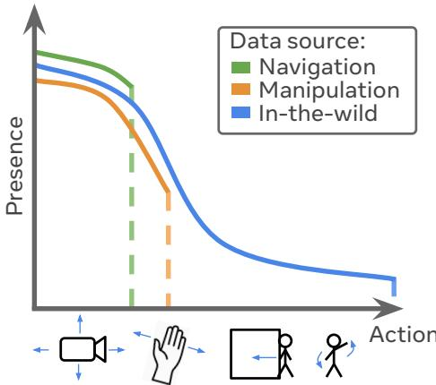  
Figure 1 Action diversity. Classically used navigation or manipulation data contains the most general actions, such as camera or hand movements. In-the-wild videos extend this to a much broader distribution of actions, with objects entering the scene or people dancing.

2024; Ye et al., 2025; Yang et al., 2025; Chen et al., 2024; Cui et al., 2024) 研究表明，仅凭视频能够发现动作空间，而无需动作标注或已知的具体体现。标准的方法是同时学习两个组件。首先，是一个逆动态模型（IDM），给定过去和未来的观测，预测一个潜在动作，以解释这两者之间的差异。其次，是一个前向模型，利用过去的观测和获得的潜在动作来预测未来。在训练完成之后，IDM可以作为一个VLA管道的一部分（Bu et al., 2025; Ye et al., 2025）或用于训练一个世界模型，同时使用被冻结的IDM（Gao et al., 2025）。所使用的未标记视频的类型对于学习到的动作空间至关重要，且往往是一个被低估的组成部分。大多数LAM研究依赖于狭窄的、与任务相关的领域，如视频游戏（Bruce et al., 2024）、桌面操作（Nikulin et al., 2025），或经过挑选的真实操作（Bu et al., 2025; Gao et al., 2025），这些领域可能产生针对单一体现的专业化动作空间，且转移或泛化能力有限。虽然一些研究使用了更“自然”的视频，例如Ego4D（Grauman et al., 2022），但这通常仅占训练数据的少数，例如Bu et al.（2025）和Gao et al.（2025）中分别为5%，远未充分利用自然环境中视频的丰富性。为了学习一个真正通用的、可转移的潜在动作世界模型，我们认为必须超越这些针对性的数据来源。像HowTo100M（Miech et al., 2019）或YoutubeTemporal-1B（Zellers et al., 2022）这样的自然环境中的视频来源提供了比通常研究的更丰富和通用的学习环境，如图1所示。然而，这也引入了一组新的研究挑战，我们在本研究中解决这些挑战，以展示LAM在大规模自然视频中的可行性。

首先，“动作”在真实环境视频中的意义并不像在已知动作空间的环境中那样明确。从隐喻上讲，动作的第一个维度或主成分可以是移动，这是视频源间的共同特性。从这一点出发，我们可以区分自我中心和外部中心的动作，前者是摄像机佩戴者的动作，后者是环境中其他智能体的动作。在真实环境视频中，除了摄像机佩戴者的动作，还有较强的外部智能体执行多样化动作的存在。更深入地分析动作分布，真实环境视频会包含独特的动作，例如汽车进入画面、人们跳舞、手指在指板上形成和弦等。这导致了我们想要建模的动作固有的丰富性。与视频游戏或操作视频相比，真实环境视频提供了一个动作的超集，这意味着仍然需要解决更经典的导航或操作任务。虽然以往工作的数据源主要包含隐喻上第一主成分的动作，但尝试建模更多样化的动作存在捕捉更多环境噪声（Nikulin et al., 2025）的风险，例如树上的叶子晃动。最后，真实环境视频中的智能体没有一致的体现形式，模型无法依附，这对学习到的潜在动作的迁移和下游适用性构成挑战。因此，我们的研究重点在于研究在大规模真实环境视频数据集上训练的潜在动作世界模型，探讨在这种设置下的固有挑战和潜在陷阱，并验证其可行性。我们的贡献如下： • 我们对如何调节潜在动作的信息内容进行了研究，重点关注真实环境自然视频。我们发现，虽然稀疏或嘈杂的潜在动作能够有效建模复杂动作，但离散动作难以适应。 • 我们表明，在学习潜在动作时，真实环境视频中缺乏共同的体现形式并不是一个问题。潜在动作将编码更多空间局部的变换。 • 我们通过在视频间迁移复杂动作来展示学习到的动作空间的普遍性。我们发现可以有效地在物体之间转移运动，或者执行诸如某人进入画面等动作。我们证明了我们学习到的潜在动作空间可以用作通用动作空间。通过训练一个小控制器将已知动作映射到潜在动作，我们的世界模型仅通过自然视频训练，可以被控制以解决机器人操作和导航任务，实现接近于基于领域特定、带标签动作数据训练的模型的规划性能。总体而言，我们的工作展示了仅使用自然真实环境视频学习潜在动作条件的世界模型的可行性。

# 2 相关工作

世界模型（Nguyen 和 Widrow，1990；Sutton，1991；Ha 和 Schmidhuber，2018）已成为一个非常活跃的研究领域。尽管已有大量工作应用于游戏数据（Alonso 等，2024；Hafner 等，2019, 2023），但最近对更复杂环境的应用，如模拟机器人环境（Seo 等，2023；Zhou 等，2024）或现实世界（Hu 等，2023；Agarwal 等，2025；Assran 等，2025）也蓬勃发展。由于具有众多可能的表现形式和动作空间，诸如 NWM（Bar 等，2024）专注于运动，PEVA（Bai 等，2025）专注于全身控制，或 UniSim（Yang 等，2023）能够通过文本控制处理多种表现形式的作品相继出现。这类模型的前景不仅在于生成视觉上吸引人的视频（Brooks 等，2024；Teng 等，2025；Agarwal 等，2025），更在于其在解决视觉规划任务中的应用。能够预测动作的后果可以帮助我们解决导航问题（Shah 等，2021）、在模拟中的机器人操控（Nasiriany 等，2024；Liu 等，2023；Yu 等，2020）或现实世界中的操控（Khazatsky 等，2024），甚至全身控制（Ma 等，2024）。此类模型甚至可以用于解决更为传统的视觉任务，如分割和深度预测（Baldassarre 等，2025；Karypidis 等，2024；Luc 等，2017）。获取能够跨表现形式泛化的模型的一个常见问题是如何定义一个共同的动作空间？一种解决方案是利用考虑的表现形式中的最大维度，并引入表现形式标记（Hansen 等，2023），但这并不容易扩展。这正是潜在动作模型（Schmidt 和 Jiang，2024；Bruce 等，2024）发挥作用的地方，因为它们的承诺之一是学习一个抽象的、通用的潜在动作空间。

  
Fur LatnactnwrmodelAcassial worlmode is nwe iactns epreene  laten ble. Thetens ahankmoeai jo e rmoT theirinformation content (and propensity to cheat), they are regularized using techniques such as noise addition, sparsification, or quantization.

潜在动作模型。潜在动作模型旨在从未标记的视频中学习动作。这通常通过学习一个逆动力学模型来实现，该模型预测过去和未来帧中的潜在动作，以及一个正向模型，该模型从过去和潜在动作中预测未来帧（Schmidt 和 Jiang, 2024）。这引入了信息的因果泄漏，一个主要挑战是确保潜在动作不会捕捉过多的信息，例如整个下一帧。常用的方法是对潜在动作进行离散化。这是 LAPO（Schmidt 和 Jiang, 2024）、Genie（Bruce 等, 2024）、LAPA（Ye 等, 2025）或 UniVLA（Bu 等, 2025）等方法的首选方式。例如，这可以通过对期望的动作空间的先验知识来激励（Bruce 等, 2024）。其他方法如 CoMo（Yang 等, 2025）或 AdaWorld（Gao 等, 2025）则选择连续空间，这本质上更加灵活。在这种情况下，可以添加正则化项以减少潜在动作的信息内容。此外，尽管许多方法使用现成的视觉编码器对帧进行编码，潜在动作仍然通常通过在像素空间中预测未来帧来学习（Chen 等, 2025；Yang 等, 2025；Ye 等，2025）。这使得潜在动作更加容易受到干扰（Nikulin 等, 2025），潜在动作学习编码背景噪声而非我们期望的动作。虽然一种解决方案是使用监督（Nikulin 等, 2025；Liang 等, 2025），但在抽象的潜在空间中工作并仔细设计潜在动作可以帮助避免其中的一些问题，正如我们在工作中所研究的那样。总体而言，尽管学习潜在动作明显适用于世界模型，但方法通常是考虑可变形状动作（VLA）进行开发（Bu 等, 2025；Ye 等, 2025）。即使这些方法在架构上与世界模型相似，其中正向模型/动作解码器可以视为世界模型，但它往往被忽视。即使训练了世界模型，通常也会使用两阶段的方法，其中世界模型在逆动力学模型之后进行训练（Yang 等, 2025）。与我们的工作同时进行，Wang 等（2025）提出通过重用预训练的视频生成模型作为世界模型来将正向模型视为世界模型。

# 3 问题设定

考虑一个视频 $V$，其中在每个时间步 $t$ 的世界状态为 $s_{t}$，我们希望建模世界的演化，即找到一个函数 $f$ 使得 $s_{t + 1} = f(s_{0 : t})$。然而，智能体的存在以及一般的随机性使得预测是非确定性的，因此这个公式是不足够的。我们可以通过一个包含相关信息的潜变量 $z_{t}$ 来建模预测的不确定性，使得 $s_{t + 1} = f(s_{0 : t}, z_{t})$。另一种建模不确定性的方法是，不直接考虑 $s_{t + 1}$，而是输出一个关于可能未来的分布 $p(s_{t + 1} | s_{0 : t})$，这在文本中（Radford et al., 2018）或量化表示（Hu et al., 2023; Agarwal et al., 2025）中是常见的做法。

尽管如此，将未来预测形式化为 $s _ { t + 1 } = f ( s _ { 0 : t } , z _ { t } )$ 是有吸引力的，因为我们可以将 $z _ { t }$ 的一部分解释为场景中的发生动作。这在为机器人学习世界模型时尤其成立，在简单环境中，除了智能体的动作 $a _ { t }$ 外不存在随机性。因此，我们有 $s _ { t + 1 } = f ( s _ { 0 : t } , a _ { t } )$。如果环境是随机的，我们将同时面临来自环境的噪声和动作，这就需要比之前更复杂的形式化，即希望有 $s _ { t + 1 } = f ( s _ { 0 : t } , a _ { t } , z _ { t } )$。这让人想起基于扩散的世界模型（Alonso et al., 2024；Bar et al., 2024）。潜在动作模型（Schmidt 和 Jiang, 2024）旨在建模场景中发生的动作，而不捕捉可能来自环境的外生噪声。为了实现这一点，大多数方法通过查看未来来推断 $z _ { t }$，从而引入了因果关系的泄漏。这通常通过逆动力学模型（IDM）完成，该模型以过去和未来的帧作为输入，并输出潜在动作 $\boldsymbol { z } _ { t } = g _ { \phi } ( s _ { t } , s _ { t + 1 } )$。由此，我们可以训练一个世界模型（也称为前向模型）$p _ { \psi }$，使用以下损失函数来估计 $s _ { t + 1 }$：

$$
\mathcal { L } _ { t } = \Vert s _ { t + 1 } - p _ { \psi } ( s _ { 0 : t } , z _ { t } ) \Vert _ { 1 } \mathrm { ~ , w i t h ~ } z _ { t } = g _ { \phi } ( s _ { t } , s _ { t + 1 } ) .
$$

这在干净的环境中效果很好（Hoque 等，2025；Yu 等，2020），因为随机性主要来自于由明确定义的智能体执行的动作。然而，在真实环境中的视频（Zellers 等，2022；Miech 等，2019）中，捕获外源噪声（例如树上摆动的叶子）的风险显著增加。因此，限制潜在动作的信息内容变得至关重要，必须在捕获复杂动作和捕获噪声之间取得平衡，甚至更糟的是，可能在潜在动作中编码整个下一个状态。一般来说，这种信息正则化旨在找到能够解释未来预测的最小潜在动作。在本研究中，我们关注三种不同的机制，每种机制各有利弊。稀疏性。第一种，也是实现起来可能最复杂的，是基于稀疏性的约束（Drozdov 等，2024）。在这里，我们希望潜在动作的 L1 范数尽可能低。由于可能出现的简单解会减少向量的 L2 范数，导致范数集中在几个维度上，或者过于集中于潜在分布的模式，因此增加了一些额外的正则化。正则化随后与

$$
\mathcal { L } ( Z ) = V C M ( Z ) + \frac { 1 } { N } \sum _ { i } E ( Z _ { i } ) ,
$$

$$
E ( z ) = \lambda _ { l 2 } \operatorname* { m a x } \left( \sqrt { D } - \| z \| _ { 2 } ^ { 2 } , 0 \right) + \lambda _ { l 1 } \| z \| _ { 1 }
$$

$$
\begin{array} { l } { { \displaystyle V C M ( Z ) = \lambda _ { V } \frac { 1 } { D } \sum _ { d } \operatorname* { m a x } \left( 1 - \sqrt { \mathrm { V a r } ( Z _ { \cdot , d } ) } , 0 \right) } } \\ { { \displaystyle ~ + \lambda _ { C } \frac { 1 } { D ( D - 1 ) } \sum _ { i \neq j } \mathrm { C o v } ( Z ) _ { i , j } ^ { 2 } } } \\ { { \displaystyle ~ + \lambda _ { M } \frac { 1 } { N D } \sum _ { i , j } Z _ { i , j } . } } \end{array}
$$

这种方差-协方差-均值（VCM）正则化受到VICReg（Bardes等，2021）的启发，确保信息的充分传播，并强制模型正确使用稀疏性约束。实际中，我们将系数设置为$\lambda _ { l 2 } = 1$，$\lambda _ { V } = 0 . 1$，$\lambda _ { C } = 0 . 0 0 1$，$\lambda _ { M } = 0 . 1$，并调整$\lambda _ { 1 }$以调节信息内容。

  
F uevmoeWh ar a t rptu discrete ones are not able to properly capture such action, even if some motions remains captured.

噪声添加。限制学习的潜在动作信息内容的另一种方法是向其添加噪声，同时确保其范数不增加并使噪声变得微不足道。这可以以与变分自编码器（VAE）类似的方式实现（Kingma 和 Welling，2014；Gao 等，2025）。这里的先验匹配项充当我们的正则化项，其中目标标准差添加噪声，而目标均值减少潜在动作的范数。

$$
\mathcal { L } ( z _ { t } ) = - \beta D _ { K L } \left( q ( z _ { t } | s _ { t } , s _ { t + 1 } ) | | \mathcal { N } ( 0 , 1 ) \right)
$$

离散化。最终的方法是对潜在动作进行离散化。为此，最常见的方法是向量量化（Van Den Oord等，2017）或其变体。这作为基线比较，用于说明以往研究中常用的正则化方法（Ye等，2025；Bu等，2025）。在实践中，我们使用与UniVLA相同的量化方案（Bu等，2025），采用经典的向量量化（Van Den Oord等，2017）以及对未使用代码的代码簿重置。所有这些操作可以在训练好的编码器的潜在空间中进行，其中$s_{t}$和$s_{t+1}$现在是从视频帧中获得的表示，这引导我们得出如图2所示的完整架构。

# 4 实验细节

我们现在转向一个更实际的实现。在我们的实验中，一个长度为 $T$ 的视频 $V$ 通过帧因果编码器 $f _ { \theta }$ 编码 - V-JEPA 2-L (Assran 等，2025)，生成表示 $s _ { 0 : T - 1 }$ 。该编码器在训练期间保持不变。然后，我们共同训练世界模型 $p _ { \psi } ( s _ { 0 : t } , z _ { t } )$ 和逆动力学模型 $g _ { \phi }$，使用上述预测损失和潜在动作正则化来预测 $s _ { t + 1 }$ 。

为了提高效率，我们使用教师强制方法训练模型（Williams 和 Zipser，1989；Vaswani 等，2017）。默认情况下，$p _ { \psi }$ 被实现为 ViTL（Dosovitskiy 等，2021），并使用 RoPE（Su 等，2021；Assran 等，2025）进行位置嵌入。为了使 $p _ { \psi }$ 在 $z$ 上进行条件化，我们使用 AdaLN-zero（Peebles 和 Xie，2023），并将其适配为逐帧条件化序列。我们的潜在行动 $z _ { t }$ 默认是128维连续向量。除非另有说明，所有模型在 YoutubeTemporal1B（Zellers 等，2022）上进行训练，每个剪辑为16帧，帧率为4 fps，训练30000次，批量大小为1024。我们使用 Muon 优化器（Jordan 等，2024），学习率为0.02，并使用 AdamW（Loshchilov 和

  
Figure 4 IDM performance. We report the one step prediction error on in-the-wild videos. Adjusting the capacity of sparsity and noise based latent actions allows for varying performance, while quantized ones struggle to adapt to the complexity.

Hutter，2019）学习率为$6.25 \times 10^{-4}$，经过$10\%$的线性预热后采用余弦退火。我们使用0.04作为权重衰减。为了视觉化目的，我们还使用训练好的ViT-L结合$L_{1}$损失和感知损失（Johnson等，2016；Zhang等，2018）来训练一个帧因果视频解码器。虽然生成不是我们工作的核心，但这是一种有用的工具，可以计算感知度量并检查模型的预测。具体协议详见补充A节。

# 5 信息正则化的性能

如前所述，我们希望捕捉到在观察到的真实视频中跨越广泛表现形式的丰富且复杂的动作。因此，我们首先要回答的第一个问题是，不同信息正则化技术如何适应这种复杂性？虽然我们将在手稿其余部分通过多种方式测量性能，关注不同的方面和属性，但我们首先在理想情况下检查预测质量。在这里，我们将测量模型在展开轨迹时的预测误差，使用逆动态模型（因此也使用未来帧）来推断动作。这将成为所有其他实验性能的上限。

我们将称一种正则化为“更好”，如果它能够导致多样化的可实现性能且不容易饱和。能够探索多种行为还使我们能够衡量潜在能力对下游性能的影响。正如我们在后面的部分中所展示的，使用逆动力学模型实现最低预测误差并不总是可取的，因为下游任务需要在复杂性与潜在动作的可识别性之间取得平衡。从图4中可以看出，稀疏且嘈杂的潜在动作能够在不受约束的潜在动作（使用整个连续空间）和确定性世界模型之间实现一系列性能。即使在最大稀疏性下，我们仍然有 $d = 1 2 8$ 个带有稀疏约束的潜在动作，当 $D _ { K L }$ 的权重 $\beta$ 增加时，嘈杂的潜在动作实际上变成噪声，相当于没有条件。然而，基于向量量化的方法在扩展其能力方面遇到困难，并且非常接近确定性基线。在接下来的工作中，我们将谈论这种“在实际环境中的预测误差”，即潜在动作的能力。由于训练中的其他一切都是相同的，因此预测误差的下降归因于潜在动作的能力。较低的预测误差表明更高能力的潜在动作，而较高的预测误差则指示较低能力的潜在动作。从更定性角度来看，在图3中，我们考察了一种在自然视频中存在的精确且相对复杂的动作：某人进入并在场景中移动。我们发现稀疏且嘈杂的潜在动作能够准确捕捉这一动作，而量化方法则显示出更像是一个模糊体进入场景。有趣的是，潜在动作中并未捕捉到确切的衬衫颜色，这突显了它捕捉到的信息比具体像素变化更为抽象。更多可视化内容请参见补充部分 F。

# 要点

基于向量量化的方法难以捕捉复杂动作。当赋予足够的能力时，噪声或稀疏的潜在动作能够捕捉到更复杂的动作。

# 6 我们学习什么样的动作？

虽然我们展示了一个理想的设置，即潜在动作由 IDM 推断，但模型可能会简单地作弊，将下一帧编码为潜在动作。或者我们可能会学习到无法应用于其他视频的潜在动作，这与我们希望其成为最小解释的目标相悖。因此，我们用简单直观的指标研究这两个问题。请参见图 5 以了解协议的说明。未来泄漏。为了测量潜在动作中泄漏了多少关于未来状态的信息，我们可以通过交换视频的结尾人工生成场景变化，并测量预测误差的增加程度。如果模型完美地将下一帧编码在潜在动作中，我们应该不会看到预测误差的急剧上升，因此这种缺乏急剧上升是作弊模型的一个必要（但不充分）条件。还有其他指标可以测量从 $s _ { t - 1 }$ 到 $s _ { t }$ 和从 $s _ { t + 1 }$ 到 $s _ { t }$ 的潜在动作之间对齐的程度（Yang et al., 2025），但只要我们没有完美的对齐，因此对帧的复制，其确切值仍然难以解释。

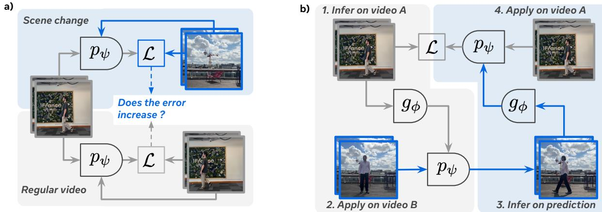  
FM prediction error increases when suc changes happen compared t the riginal video tell us how wel the model can o   b nsteWe atenactions deheappl henoherrand vidromhis pre, h eor wi dA The minati ot metri esue that hortcut are ot he sourc  the ran.

如表1所示，无论潜在动作的容量如何，我们发现预测误差相比基线水平增加了两倍以上。这表明，没有研究的模型能够通过编码下一帧数据来作弊。我们假设所使用数据集的复杂性使得模型更难学习这种解决方案。图6的视觉检查表明，尽管一些关于下一帧的信息在潜在动作中被捕获，但这只是微不足道的。然而，如我们在可转移性评估中所研究的，这在实践中并不是一个问题，仅仅是需要编码在帧内外出现的物体的结果。潜在动作的转移效果如何？接下来的实验是检验我们是否学习到了有意义的潜在动作，即我们是否可以将视频A中推断出的潜在动作应用到视频B上。从随机视频A和B中，我们在视频A上推断潜在动作，然后将其应用于视频B。如果潜在动作能够很好转移，我们应该能够再次推断它们。因此，我们在视频B上再次推断这些潜在动作，并将其应用于视频A。通过测量在视频A上使用原始潜在动作和循环推断潜在动作后的预测误差增加情况，我们可以看到潜在动作的转移效果如何。尽管这种转移在随机自然视频中并不明确，导致难以解释的绝对差距，但这仍然可以帮助我们对模型进行排序，并对这种转移获得直观的理解。

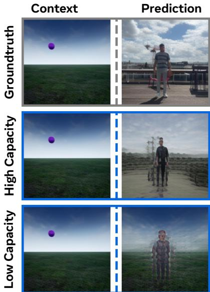  
Figure 6 Future leakage. In the presence of a scene cut, the only solution is for the latent action to encode the next frame. As capacity of the latent actions increase, more of the scene can be reconstructed, albeit with an extremely poor quality.

  
F mog he eWehen appl heacn i ba hic sto mot nlo startsmovi demratablatctiosWehen heatectnsnaheme video. We can e the man moving t the e agan, indicain that themotin was re-nfered coy.Hum videos recorded by the authors, flying ball video from (Riochet et al., 2022).

表1 场景变化下的预测误差增加。在 Kinetics（Kay 等，2017）数据集上，所有模型在场景变化时都表现出显著更高的误差。这表明潜在的动作不能简单地复制下一帧。我们报告了 LPIPS 值以便于解释。

<table><tr><td>Latents</td><td>Capacity w/o change</td><td>w/ change</td></tr><tr><td rowspan="2">Sparse</td><td>Low 0.28</td><td>0.66 (×2.3)</td></tr><tr><td>High 0.20</td><td>0.50 (×2.4)</td></tr><tr><td rowspan="2">Noisy</td><td>Low 0.33</td><td>0.69 (×2.1)</td></tr><tr><td>High 0.21</td><td>0.54 (×2.5)</td></tr><tr><td rowspan="2">Discrete</td><td>Low 0.34</td><td>0.69 (×2.0)</td></tr><tr><td>High 0.29</td><td>0.68 (×2.3)</td></tr></table>

我们可以在表 2 中看到，在 Kinetics（Kay 等人，2017）(人类活动视频) 和 RECON（Shah 等人，2021）(导航) 上，我们仅在这个潜在推理周期中获得了轻微的预测误差增加。虽然具有更高能力的潜在动作导致了更差的迁移，但它们的性能在迁移后仍高于其受限的对应物。正如之前未出现未来帧泄漏所表明的，这种迁移并不是源于复制下一个帧，这本来可以是一种获得完美性能的方法。表 2 动作周期一致性。动作在视频 1 上被推断，然后应用于视频 2。动作再次被推断并再次应用于视频 1。预测误差的轻微增加表明，动作可以可靠地被转移和重新推断。我们报告了 2 秒预测的 LPIPS 值，以便于解释。

<table><tr><td rowspan="3">Latents</td><td rowspan="3">Capacity</td><td colspan="2">Kinetics</td><td colspan="3">RECON</td></tr><tr><td>Original</td><td>Transfer</td><td>Original</td><td></td><td>Transfer</td></tr><tr><td rowspan="2">Sparse</td><td>Low</td><td>0.26</td><td>0.31 (×1.20)</td><td>0.24</td><td>0.29</td><td>(×1.21)</td></tr><tr><td>High</td><td>0.19</td><td>0.24 (×1.30)</td><td>0.20</td><td>0.23</td><td>(×1.14)</td></tr><tr><td rowspan="2">Noisy</td><td>Low</td><td>0.30</td><td>0.34 (×1.13)</td><td>0.29</td><td>0.33</td><td>(×1.15)</td></tr><tr><td>High</td><td>0.20</td><td>0.26 (×1.34)</td><td>0.20</td><td>0.24</td><td>(×1.22)</td></tr><tr><td rowspan="2">Discrete</td><td>Low</td><td>0.32</td><td>0.33 (×1.03)</td><td>0.32</td><td>0.33</td><td>(×1.03)</td></tr><tr><td>High</td><td>0.27</td><td>0.29 (×1.07)</td><td>0.26</td><td>0.27</td><td>(×1.05)</td></tr></table>

结果在图7中进行了定性分析，我们可以看到一个人类动作转移到飞球上的过程（展示了转移），然后成功地重新推断并应用于原始视频。有关更多可视化内容，请参见补充部分G。然而，尽管在我们不期望动作能够很好转移的数据上，例如随机自然视频，仍然取得如此良好的表现，这让我们思考我们正在学习什么类型的动作。为此，我们在下一段转向定性分析。潜在动作学习了哪种体现？查看图8，我们可以看到运动是局部化的，即转移的动作发生在移动的地方，这种运动是什么。由于自然视频中缺乏共同的体现，模型学习了相对相机应用的通用动作，这是跨视频唯一的共同点。

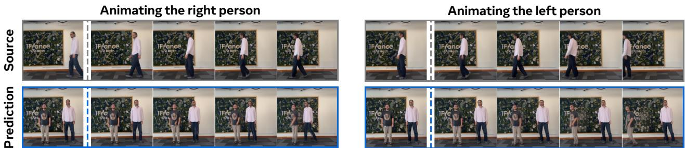

这种相对于相机的实现方式可以是一个优势，正如我们之前在图7中看到的。这种一般抽象使我们能够在完全不同的对象之间转移运动，如果运动仅针对语义相似的对象则无法实现。

# 要点

自然视频中缺乏明确的体现使得潜在动作捕捉到更多空间上局部的、相对于摄像机的变换。

# 7 利用潜在动作世界模型进行规划

潜在动作空间的一个应用是将其用作各种具体实现的通用接口。如果我们能够学习从“真实”动作到潜在动作的映射，就能以可解释的方式控制世界模型。这还使我们能够解决规划任务，正如我们将在本节中研究的那样。控制器训练。第一部分是训练一个模块，将真实动作（可选表示）转换为潜在动作。在仅使用动作的情况下，我们使用简单的多层感知机（MLP）；而在使用动作和过去表示的情况下，我们使用基于交叉注意力的适配器。有关详细架构和协议，请参见补充部分 A。然后，我们简单地训练该控制器模块，以 L2 损失预测潜在动作。我们在图 9 中说明了这一过程。由于学习到的潜在动作是相对于相机的，仅使用动作可能不足，因为目标潜在动作不仅会根据动作变化，还会根据相机位置变化。在实践中，我们发现当不使用过去的表示时，控制器会收敛到一个导致不移动的潜在动作。有关更多信息，请参见补充资料。

  
FcalyWepcal atio wvl We t properties. We are making the individual at a given position move to the let. Videos recorded by the authors.   
Figure 9 Controller training. We train a lightweight module to map known actions to latent actions. Representations of the past are used to help the prediction of the right latent actions.

第 H 节：可视化。推演质量。我们在 DROID（Khazatsky 等，2024）这一机器人操作数据集以及 RECON（Shah 等，2021）这一导航数据集上训练控制器。DROID 使我们能够在相机固定而智能体在场景中移动的数据上评估模型，而 NWM 则是在静态场景中，拍摄者是移动的一方。如图 10 中质的表现和图 11 左列中的量的结果所示，模型在使用控制器时能够实现高质量的预测。使用控制器获得的预测与 IDM 获得的预测非常相似，但采取的行动略显保守。然而，我们发现自然环境视频的预测误差与使用控制器时推演的质量之间缺乏相关性，即潜在行动的能力与推演质量之间的关系。对于稀疏和嘈杂的潜在行动，我们发现使用最受限或最不受限的设置都会导致次优状态，而更平衡的正则化能够产生最佳预测。这可以直观地解释为过于受限的潜在行动未包含足够的信息，而不够受限的潜在行动则包含过多未来信息。这与之前观察到的趋势一致，即更受限的潜在行动迁移效果更好，而自由度更大的潜在行动则能捕捉到更细致的运动。由于这里的动作空间相对简单，我们看到即使是离散的潜在行动效果也很好，支持了以前工作的这一选择（Bu 等，2025；Schmidt 和 Jiang，2024）。 详细结果请参考补充材料 C 节。

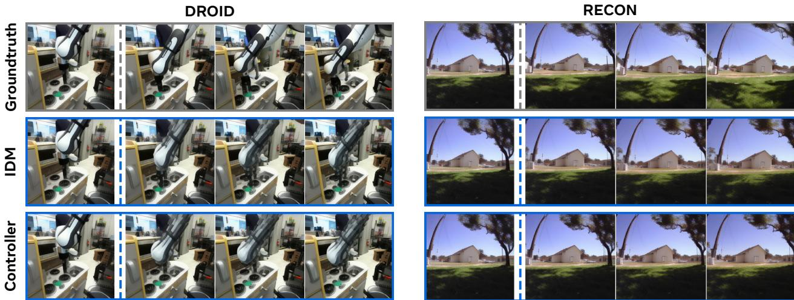  
i ID RO lateact prouc  heveyn moMovets epplcre heol wve pysial aperancederadesove time.T produc he rolinames are uplicate  mapneaction latent, something not seen during training.

规划性能。我们现在可以使用训练好的控制器，并根据现有协议在基于目标的规划任务上测量性能。给定初始观测 $s_{t}$ 和目标观测 $s_{g}$，我们寻求一系列动作，以最小化预测状态与目标状态之间的距离。

对于我们的 DROID 控制器，我们采用 Terver 等（2025）的协议，并使用在真实环境中录制的一组由 Franka Emika Panda 捕捉的视频。我们关注的轨迹目标是将手臂移动到特定目标位置。我们使用交叉熵方法（CEM）（Rubinstein，1997）进行 $H = 3$ 步的规划，并将我们的表现与 V-JEPA 2-AC 的表现进行比较，后者以类似于我们模型的方式进行训练，但使用已知动作，同时也与 Terver 等（2025）基于 V-JEPA 2 的最佳模型进行比较，以界定性能的上界。为了衡量表现，我们使用到目标的距离 $(\Delta x y z)$，得益于转换的组合性，这一距离可以很容易地计算出。有关详细协议，请参考补充部分 A。虽然性能仍低于专门设计的模型，但我们的模型能够实现与 V-JEPA 2-AC 相似的性能，证明我们学习到的潜在动作可以有效作为规划任务的接口。在这里，尽管更高容量的潜在动作可能产生更糟糕的推导，但却能实现最佳的规划性能。值得注意的是，当展开的结果相对较差时，嘈杂的潜在动作却能获得最佳的规划性能。关于在我们的管道中添加领域特定数据的影响，请参阅补充部分 D。在导航任务中，使用我们在 RECON 上训练的控制器，我们遵循 NWM（Bar 等，2024）的协议，使用 CEM 进行规划时评估性能。我们依赖于计划轨迹和真实轨迹之间的相对姿态误差（RPE）（Sturm 等，2012）作为我们的主要指标。我们在这里得出了类似的结论，模型的表现虽然达不到 NWM，但能够超越基于策略的基线，如 NoMaD（Sridhar 等，2024）。自我中心导航还增加了额外的信息在每个预测步骤进入画面的困难，使得生成干净的展开变得更加困难，降低了性能。有关更详细的规划结果，请参阅补充部分 C。尽管如此，我们发现展开的质量与规划性能之间并不是完美相关的。这是世界模型文献中的一个常见挑战（Zhang 等，2025）。总体而言，我们发现仅在野外视频上训练的模型能够学习有效可重用的潜在动作空间，以解决简单的规划问题，其中嘈杂的潜在动作表现最佳。

# 要点

仅通过自然视频学习的潜在动作可以用于解决规划任务，其性能与具有访问领域特定数据和标记动作的模型相当。

  
FCnoller d pan peen  DROIDnRECON bl ucfu e a  o p   o ve performing models are the ones where the latent actions form a middle ground in term of capacity.

  
e te moe z e, ttala ie me ai at any rhWen that l  l   a h o pask e he o. For data scaling, we note that our usual recipe sees on average every video twice, but we nly see a total of $1 \%$ of the talmTh e ar set. Stars indicate our default setup in the rest of the paper.

# 8 扩展模型和数据。

在本节中，我们探讨随着数据、模型规模和训练时间的增加，模型性能如何变化。对此研究，我们集中关注稀疏（$\lambda _ { l 1 } ~ = ~ 0 . 0 1$）和嘈杂的潜在动作（$\beta = 5 \times 1 0 ^ { - 5 }$）。同时考察这两种情况使我们能够在多样的环境中研究规模扩展趋势。从图12中可以看出，整体而言，随着模型规模、训练时间或训练数据的增加，我们在自然视频上使用IDM时能够获得更好的预测结果。然而，在DROID上进行的规划性能分析展示了一个更复杂的情况，其中训练时间显著改善性能，而模型规模主要对嘈杂的潜在动作产生影响，训练数据则未显示出明显的趋势。这一关于模型规模的复杂情况与之前的研究（Ye et al., 2025）一致，后者也发现进行规模扩展分析时性能的提升幅度较小。这些结果表明，虽然规模扩展可以通过提高潜在动作和/或前向模型的质量来改善潜在动作世界模型的质量，但在主要评估简单动作的下游任务中，这种改善可能并不总是明显，这一点在文献中常有使用。

# 9 限制与未来工作

可变潜在信息内容。我们工作的潜在动作信息约束基于静态系数。然而，每个视频的动作具有不同的复杂性，有时甚至是确定性的。因此，根据视频的复杂性调整约束将是一个有趣的方向。尽管这可能会对潜在动作空间的复杂性带来代价，但它将使得潜在动作的校准更加准确。在潜在动作空间中的采样和规划。虽然我们研究了推断于自然视频的潜在动作的转移以及它们作为控制接口的使用，但人们不禁要问，是否可以直接利用潜在动作。直接使用潜在动作可以让我们更准确地衡量其质量。这可以通过对潜在动作进行采样并分析预测，或通过直接在潜在动作空间中进行规划来实现。我们在补充部分B中提供了这些方面的一些初步分析，注意到大部分工作仍在前方。通过单阶段训练塑造表示。目前，世界模型是在冻结的表示上进行训练的。这个表示空间并未考虑预测，这会妨碍反向动力学训练以及预测的质量。由于我们在工作中使用的数据与V-JEPA 2的预训练分布相似，在V-JEPA 2的预训练中使用潜在动作可能会解锁单阶段编码器/世界模型训练。这是一个令人兴奋的未来工作方向。

# 10 结论

本研究展示了直接从大规模自然视频数据集中学习有效的潜在动作世界模型（LAMs）的可行性。我们成功应对了这一数据所带来的重大挑战，包括动作复杂性高、环境噪声以及缺乏共同体现。我们的信息正则化研究突出了连续潜在动作的优势，这些动作能够更有效地适应自然视频中存在的动作复杂性。虽然向量量化在实践中非常常见，但在这一规模下却难以适应。通过研究潜在动作中未来帧的泄漏，我们发现这一问题在实际环境中并不存在， 我们假设这是由于条件选择与数据复杂性的结合所致。我们进一步发现，尽管更高容量的潜在动作会降低可迁移性，但潜在动作依然能够被推断并一致地重新应用。这导致了在自然视频中，学习到的潜在动作相对于摄像头是空间局部化的，因为视频间缺乏共同体现。在定性上，学习到的潜在动作能够捕捉复杂的动作，例如一个人进入场景，甚至可以将运动从一个物体转移到另一个物体，如从人类转移到球体。最关键的是，我们展示了这种方法的实用性。通过训练一个简单的控制器，将状态和已知动作映射到学习的潜在动作，我们的世界模型——完全基于非实验室环境下的自然视频训练——能够控制解决机器人操作任务。它的规划性能与在领域内、标记有动作的数据上训练的基线相当。总体而言，我们的分析和实验展示了在未经整理的自然视频上训练潜在动作模型的可行性和潜力，这为更通用的世界模型迈出了坚实的一步。

# 11 致谢

我们要感谢Adrien Bardes接受在用于定性结果的视频中出镜，以及他参与的富有成效的讨论。我们还要感谢Amir Bar在实验规划方面提供的深刻讨论和建议。

# References

Niket Agarwal, Arslan Ali, Maciej Bala, Yogesh Balaji, Erik Barker, Tiffany Cai, Prithvijit Chattopadhyay, Yongxin Chen, Yin Cui, Yifan Ding, et al. Cosmos world foundation model platform for physical ai. arXiv preprint arXiv:2501.03575, 2025.

Eloi Alonso, Adam Jelley, Vincent Micheli, Anssi Kanervisto, Amos J Storkey, Tim Pearce, and François Fleuret. Diffusion for world modeling: Visual details matter in atari. Advances in Neural Information Processing Systems, 37:5875758791, 2024.

Brandon Amos et al. Tutorial on amortized optimization. Foundations and Trends®) in Machine Learning, 16(5): 592732, 2023.

Mido Assran, Adrien Bardes, David Fan, Quentin Garrido, Russell Howes, Matthew Muckley, Ammar Rizvi, Claire Roberts, Koustuv Sinha, Artem Zholus, et al. V-jepa 2: Self-supervised video models enable understanding, prediction and planning. arXiv preprint arXiv:2506.09985, 2025.

Yutong Bai, Danny Tran, Amir Bar, Yann LeCun, Trevor Darrell, and Jitendra Malik. Whole-body conditioned egocentric video prediction. arXiv preprint arXiv:2506.21552, 2025.

Federico Baldassarre, Marc Szafraniec, Basile Terver, Vasil Khalidov, Francisco Massa, Yann LeCun, Patrick Labatut, Maximilian Seitzer, and Piotr Bojanowski. Back to the features: Dino as a foundation for video world models. arXiv preprint arXiv:2507.19468, 2025.

Amir Bar, Gaoyue Zhou, Danny Tran, Trevor Darrell, and Yann LeCun. Navigation world models. arXiv preprint arXiv:2412.03572, 2024.

Adrien Bardes, Jean Ponce, and Yann LeCun. Vicreg: Variance-invariance-covariance regularization for selfsupervised learning. arXiv preprint arXiv:2105.04906, 2021.

Tim Brooks, Bill Peebles, Connor Holmes, Will DePue, Yufei Guo, Li Jing, David Schnurr, Joe Taylor, Troy Luhman, Eric Luhman, Clarence Ng, Ricky Wang, and Aditya Ramesh. Video generation models as world simulators, 2024.

Jake Bruce, Michael D Dennis, Ashley Edwards, Jack Parker-Holder, Yuge Shi, Edward Hughes, Matthew Lai, Aditi Mavalankar, Richie Steigerwald, Chris Apps, et al. Genie: Generative interactive environments. In Forty-first International Conference on Machine Learning, 2024.

Qingwen Bu, Yanting Yang, Jisong Cai, Shenyuan Gao, Guanghui Ren, Maoqing Yao, Ping Luo, and Hongyang Li. UniVLA: Learning to Act Anywhere with Taskcentric Latent Actions, May 2025. http://arxiv.org/ abs/2505.06111. arXiv:2505.06111 [cs].

Andreja Bubic, D Yves Von Cramon, and Ricarda I Schubotz. Prediction, cognition and the brain. Frontiers in human neuroscience, 4:1094, 2010.

Xiaoyu Chen, Junliang Guo, Tianyu He, Chuheng Zhang, Pushi Zhang, Derek Cathera Yang, Li Zhao, and Jiang Bian. IGOR: Image-GOal Representations are the Atomic Control Units for Foundation Models in Embodied AI, October 2024. http://arxiv.org/abs/2411. 00785. arXiv:2411.00785 [cs].

Yi Chen, Yuying Ge, Weiliang Tang, Yizhuo Li, Yixiao Ge, Mingyu Ding, Ying Shan, and Xihui Liu. Moto: Latent motion token as the bridging language for learning robot manipulation from videos. In Proceedings of the IEEE/CVF International Conference on Computer Vision, pages 1975219763, 2025.

Andy Clark. Whatever next? predictive brains, situated agents, and the future of cognitive science. Behavioral and brain sciences, 36(3):181204, 2013.

Zichen Jeff Cui, Hengkai Pan, Aadhithya Iyer, Siddhant Haldar, and Lerrel Pinto. DynaMo: In-Domain Dynamics Pretraining for Visuo-Motor Control, October 2024. http://arxiv.org/abs/2409.12192. arXiv:2409.12192 [cs].

Alexey Dosovitskiy, Lucas Beyer, Alexander Kolesnikov, Dirk Weissenborn, Xiaohua Zhai, Thomas Unterthiner, Mostafa Dehghani, Matthias Minderer, Georg Heigold, Sylvain Gelly, Jakob Uszkoreit, and Neil Houlsby. An image is worth 16x16 words: Transformers for image recognition at scale. In International Conference on Learning Representations, 2021.

Katrina Drozdov, Ravid Shwartz-Ziv, and Yann LeCun. Video representation learning with joint-embedding predictive architectures. arXiv preprint arXiv:2412.10925, 2024.

Karl Friston. The free-energy principle: a unified brain theory? Nature reviews neuroscience, 11(2):127138, 2010.

Shenyuan Gao, Siyuan Zhou, Yilun Du, Jun Zhang, and Chuang Gan. Adaworld: Learning adaptable world models with latent actions. arXiv preprint arXiv:2503.18938, 2025.

Raghav Goyal, Samira Ebrahimi Kahou, Vincent Michalski, Joanna Materzynska, Susanne Westphal, Heuna Kim, Valentin Haenel, Ingo Fruend, Peter Yianilos, Moritz Mueller-Freitag, et al. The" something something" video database for learning and evaluating visual common sense. Proceedings of the IEEE international conference on computer vision, pages 58425850, 2017.

Will Grathwohl, Kuan-Chieh Wang, Jörn-Henrik Jacobsen, David Duvenaud, Mohammad Norouzi, and Kevin Swersky. Your classifier is secretly an energy based model and you should treat it like one, 2020. https://arxiv.org/abs/1912.03263.

Kristen Grauman, Andrew Westbury, Eugene Byrne, Zachary Chavis, Antonino Furnari, Rohit Girdhar, Jackson Hamburger, Hao Jiang, Miao Liu, Xingyu Liu, et al. Ego4d: Around the world in 3,000 hours of egocentric video. In Proceedings of the IEEE/CVF conference on computer vision and pattern recognition, pages 1899519012, 2022.

David Ha and Jürgen Schmidhuber. Recurrent world models facilitate policy evolution. In Advances in Neural Information Processing Systems 31, pages 24512463, 2018.

Danijar Hafner, Timothy Lillicrap, Jimmy Ba, and Mohammad Norouzi. Dream to control: Learning behaviors by latent imagination. arXiv preprint arXiv:1912.01603, 2019.

Danijar Hafner, Jurgis Pasukonis, Jimmy Ba, and Timothy Lillicrap. Mastering diverse domains through world models. arXiv preprint arXiv:2301.04104, 2023.

Nicklas Hansen, Hao Su, and Xiaolong Wang. Td-mpc2: Scalable, robust world models for continuous control. arXiv preprint arXiv:2310.16828, 2023.

Ryan Hoque, Peide Huang, David J Yoon, Mouli Sivapurapu, and Jian Zhang. Egodex: Learning dexterous manipulation from large-scale egocentric video. arXiv preprint arXiv:2505.11709, 2025.

Anthony Hu, Lloyd Russell, Hudson Yeo, Zak Murez, George Fedoseev, Alex Kendall, Jamie Shotton, and Gianluca Corrado. Gaia-1: A generative world model for autonomous driving, 2023.

Justin Johnson, Alexandre Alahi, and Li Fei-Fei. Perceptual losses for real-time style transfer and superresolution. In European conference on computer vision, pages 694711. Springer, 2016.

Keller Jordan, Yuchen Jin, Vlado Boza, You Jiacheng, Franz Cesista, Laker Newhouse, and Jeremy Bernstein. Muon: An optimizer for hidden layers in neural networks, 2024. https://kellerjordan.github.io/posts/ muon/.

Efstathios Karypidis, Ioannis Kakogeorgiou, Spyros Gidaris, and Nikos Komodakis. Dino-foresight: Looking into the future with dino. arXiv preprint arXiv:2412.11673, 2024.

Will Kay, Joao Carreira, Karen Simonyan, Brian Zhang, Chloe Hillier, Sudheendra Vijayanarasimhan, Fabio Viola, Tim Green, Trevor Back, Paul Natsev, et al. The kinetics human action video dataset. arXiv preprint arXiv:1705.06950, 2017.

Alexander Khazatsky, Karl Pertsch, Suraj Nair, Ashwin Balakrishna, Sudeep Dasari, Siddharth Karamcheti, Soroush Nasiriany, Mohan Kumar Srirama, Lawrence Yunliang Chen, Kirsty Ellis, et al. Droid: A large-scale in-the-wild robot manipulation dataset. arXiv preprint arXiv:2403.12945, 2024.

Diederik P Kingma and Max Welling. Auto-encoding variational bayes. In International Conference on Learning Representations, 2014.

Yann LeCun. A path towards autonomous machine intelligence version 0.9. 2, 2022-06-27. Open Review, 62(1), 2022.

Yann LeCun, Sumit Chopra, Raia Hadsell, Marc'Aurelio Ranzato, and Fu-Jie Huang. A tutorial on energy-based learning. In Predicting Structured Data. 2006.

Anthony Liang, Pavel Czempin, Matthew Hong, Yutai Zhou, Erdem Biyik, and Stephen Tu. Clam: Continuous latent action models for robot learning from unlabeled demonstrations. arXiv preprint arXiv:2505.04999, 2025.

Bo Liu, Yifeng Zhu, Chongkai Gao, Yihao Feng, Qiang Liu, Yuke Zhu, and Peter Stone. Libero: Benchmarking knowledge transfer for lifelong robot learning. Advances in Neural Information Processing Systems, 36:44776 44791, 2023.

Ilya Loshchilov and Frank Hutter. Decoupled weight decay regularization. In International Conference on Learning Representations, 2019. https://openreview. net/forum?id=Bkg6RiCqY7.

Pauline Luc, Natalia Neverova, Camille Couprie, Jakob Verbeek, and Yann LeCun. Predicting deeper into the future of semantic segmentation. In Proceedings of the IEEE international conference on computer vision, pages 648657, 2017.

Lingni Ma, Yuting Ye, Fangzhou Hong, Vladimir Guzov, Yifeng Jiang, Rowan Postyeni, Luis Pesqueira, Alexander Gamino, Vijay Baiyya, Hyo Jin Kim, et al. Nymeria: A massive collection of multimodal egocentric daily motion in the wild. In European Conference on Computer Vision, pages 445465. Springer, 2024.

Leland McInnes, John Healy, and James Melville. Umap: Uniform manifold approximation and projection for dimension reduction. arXiv preprint arXiv:1802.03426, 2018.

Antoine Miech, Dimitri Zhukov, Jean-Baptiste Alayrac, Makarand Tapaswi, Ivan Laptev, and Josef Sivic. Howto100m: Learning a text-video embedding by watching hundred million narrated video clips. Proceedings of the IEEE/CVF Conference on Computer Vision and Pattern Recognition, pages 26302640, 2019.

Soroush Nasiriany, Abhiram Maddukuri, Lance Zhang, Adeet Parikh, Aaron Lo, Abhishek Joshi, Ajay Mandlekar, and Yuke Zhu. Robocasa: Large-scale simulation of everyday tasks for generalist robots. arXiv preprint arXiv:2406.02523, 2024.

Derrick Nguyen and Bernard Widrow. The truck backerupper: An example of self-learning in neural networks. In Advanced neural computers, pages 1119. Elsevier, 1990.

Alexander Nikulin, Ilya Zisman, Denis Tarasov, Nikita Lyubaykin, Andrei Polubarov, Igor Kiselev, and Vladislav Kurenkov. Latent action learning requires supervision in the presence of distractors. arXiv preprint arXiv:2502.00379, 2025.

William Peebles and Saining Xie. Scalable diffusion models with transformers. In Proceedings of the IEEE/CVF international conference on computer vision, pages 41954205, 2023.

Alec Radford, Karthik Narasimhan, Tim Salimans, Ilya Sutskever, et al. Improving language understanding by generative pre-training. 2018.

Ronan Riochet, Mario Ynocente Castro, Mathieu Bernard, Adam Lerer, Rob Fergus, Véronique Izard, and Emmanuel Dupoux. IntPhys 2019: A Benchmark for Visual Intuitive Physics Understanding. IEEE Transactions on Pattern Analysis and Machine Intelligence, 44(9):50165025, September 2022. ISSN 1939-3539. doi: 10.1109/TPAMI.2021.3083839.

Reuven Y Rubinstein. Optimization of computer simulation models with rare events. European Journal of Operational Research, 99(1):89112, 1997.

Dominik Schmidt and Minqi Jiang. Learning to Act without Actions, March 2024. http://arxiv.org/abs/ 2312.10812. arXiv:2312.10812 [cs].

Younggyo Seo, Danijar Hafner, Hao Liu, Fangchen Liu, Stephen James, Kimin Lee, and Pieter Abbeel. Masked world models for visual control. In Conference on Robot Learning, pages 13321344. PMLR, 2023.

Dhruv Shah, Benjamin Eysenbach, Nicholas Rhinehart, and Sergey Levine. Rapid exploration for open-world navigation with latent goal models. In 5th Annual Conference on Robot Learning, 2021. https://openreview. net/forum?id=d_SWJhyKfVw.

Jascha Sohl-Dickstein, Eric Weiss, Niru Maheswaranathan, and Surya Ganguli. Deep unsupervised learning using nonequilibrium thermodynamics. In Proceedings of the International Conference on Machine Learning, pages 22562265. pmlr, 2015.

Ajay Sridhar, Dhruv Shah, Catherine Glossop, and Sergey Levine. Nomad: Goal masked diffusion policies for navigation and exploration. In 2024 IEEE International Conference on Robotics and Automation (ICRA), pages 6370. IEEE, 2024.

Jürgen Sturm, Wolfram Burgard, and Daniel Cremers. Evaluating egomotion and structure-from-motion approaches using the tum rgb-d benchmark. In Proc. of the Workshop on Color-Depth Camera Fusion in Robotics at the IEEE/RJS International Conference on Intelligent Robot Systems (IROS), volume 13, page 6, 2012.

Jianlin Su, Yu Lu, Shengfeng Pan, Bo Wen, and Yunfeng Liu. Roformer: enhanced transformer with rotary position embedding. corr abs/2104.09864 (2021). arXiv preprint arXiv:2104.09864, 2021.

Yihong Sun, Hao Zhou, Liangzhe Yuan, Jennifer J Sun, Yandong Li, Xuhui Jia, Hartwig Adam, Bharath Hariharan, Long Zhao, and Ting Liu. Video creation by demonstration. arXiv preprint arXiv:2412.09551, 2024.

Richard S Sutton. Dyna, an integrated architecture for learning, planning, and reacting. ACM Sigart Bulletin, 2(4):160163, 1991.

Hansi Teng, Hongyu Jia, Lei Sun, Lingzhi Li, Maolin Li, Mingqiu Tang, Shuai Han, Tianning Zhang, WQ Zhang, Weifeng Luo, et al. Magi-1: Autoregressive video generation at scale. arXiv preprint arXiv:2505.13211, 2025.

Basile Terver, Tsung-Yen Yang, Jean Ponce, Adrien Bardes, and Yann LeCun. What drives success in physical planning with joint-embedding predictive world models? arXiv preprint arXiv:2512.24497, 2025.

Aaron Van Den Oord, Oriol Vinyals, et al. Neural discrete representation learning. Advances in neural information processing systems, 30, 2017.

Ashish Vaswani, Noam Shazeer, Niki Parmar, Jakob Uszkoreit, Llion Jones, Aidan N Gomez, Lukasz Kaiser, and Illia Polosukhin. Attention is all you need. Advances in neural information processing systems, 30, 2017.

Yucen Wang, Fengming Zhang, De-Chuan Zhan, Li Zhao, Kaixin Wang, and Jiang Bian. Co-evolving latent action world models, 2025. https://arxiv.org/abs/2510. 26433.

Max Welling and Yee Whye Teh. Bayesian learning via stochastic gradient langevin dynamics. In Proceedings of the 28th International Conference on International Conference on Machine Learning, ICML'11, page 681688, Madison, WI, USA, 2011. Omnipress. ISBN 9781450306195.

Ronald J Williams and David Zipser. A learning algorithm for continually running fully recurrent neural networks. Neural computation, 1(2):270280, 1989.

Jiange Yang, Yansong Shi, Haoyi Zhu, Mingyu Liu, Kaijing Ma, Yating Wang, Gangshan Wu, Tong He, and Limin Wang. Como: Learning continuous latent motion from internet videos for scalable robot learning. arXiv preprint arXiv:2505.17006, 2025.

Mengjiao Yang, Yilun Du, Kamyar Ghasemipour, Jonathan Tompson, Dale Schuurmans, and Pieter Abbeel. Learning interactive real-world simulators. arXiv preprint arXiv:2310.06114, 2023.

Seonghyeon Ye, Joel Jang, Byeongguk Jeon, Sejune Joo, Jianwei Yang, Baolin Peng, Ajay Mandlekar, Reuben Tan, Yu-Wei Chao, Bill Yuchen Lin, Lars Liden, Kimin Lee, Jianfeng Gao, Luke Zettlemoyer, Dieter Fox, and Minjoon Seo. Latent Action Pretraining from

Videos, May 2025. http://arxiv.org/abs/2410.11758.   
arXiv:2410.11758 [cs].

Tianhe Yu, Deirdre Quillen, Zhanpeng He, Ryan Julian, Karol Hausman, Chelsea Finn, and Sergey Levine. Meta-world: A benchmark and evaluation for multitask and meta reinforcement learning. In Conference on robot learning, pages 10941100. PMLR, 2020.

Rowan Zellers, Jiasen Lu, Ximing Lu, Youngjae Yu, Yanpeng Zhao, Mohammadreza Salehi, Aditya Kusupati, Jack Hessel, Ali Farhadi, and Yejin Choi. Merlot reserve: Neural script knowledge through vision and language and sound. In Proceedings of the IEEE/CVF Conference on Computer Vision and Pattern Recognition, pages 1637516387, 2022.

Jiahan Zhang, Muqing Jiang, Nanru Dai, Taiming Lu, Arda Uzunoglu, Shunchi Zhang, Yana Wei, Jiahao Wang, Vishal M Patel, Paul Pu Liang, et al. Worldin-world: World models in a closed-loop world. arXiv preprint arXiv:2510.18135, 2025.

Richard Zhang, Phillip Isola, Alexei A Efros, Eli Shechtman, and Oliver Wang. The unreasonable effectiveness of deep features as a perceptual metric. In Proceedings of the IEEE conference on computer vision and pattern recognition, pages 586595, 2018.

Gaoyue Zhou, Hengkai Pan, Yann LeCun, and Lerrel Pinto. Dino-wm: World models on pre-trained visual features enable zero-shot planning. arXiv preprint arXiv:2411.04983, 2024.

# Appendix

# A Training and evaluation protocols

Decoder training. Our decoder is trained using a ViT-L (Dosovitskiy et al., 2021) architecture, using RoPE (Su et al., 2021; Assran et al., 2025) positional embeddings. It reuses the architecture of the V-JEPA 2 encder (Assran et al., 2025), with an added linear layer t map from patch to pixels. The decoder proceses the full video sequence with a frame causal attention mask to only attend to past frames.

It is trained using a combination of $L _ { 1 }$ and perceptual loss (Johnson et al., 2016; Zhang et al., 2018). The decoder's weights are optimized using the Muon optimizer, with a learning rate of 0.02, AdamW learning rate of $3 \times 1 0 ^ { - 4 }$ and weight decay of .0.We train the moel with a batch size of 512, for 90 000 iterations, usng a linear learning rate warmup for 12 000 iterations, followed by a cosine annealing.

Latent action training. By default, our world model $p _ { \psi }$ uses a ViT-L (Dosovitskiy et al., 2021) architecture equipped with RoPE (Su et al., 2021; Assran et al., 2025) positional embeddings. We condition $p _ { \psi }$ on latent actions $z$ through an adapted AdaLN-zero (Peebles and Xie, 2023) mechanism that performs frame-wise conditioning, instead of the original sequence wise conditioning. Each latent action $z _ { t }$ is represented as a 128-dimensional continuous vector. We train the world model for next frame prediction using teacher forcing (Williams and Zipser, 1989; Vaswani et al., 2017) for computational efficiency.

We train on YoutubeTemporal-1B (Zellers et al., 2022) with batches of size 1024 for 30000 iterations. For optimization, we rely on the Muon optimizer (Jordan et al., 2024) with a learning rate 0.02 alongside AdamW (Loshchilov and Hutter, 2019) at a learning rate of $6 . 2 5 \times 1 0 ^ { - 4 }$ . The learning rate schedule begins with a linear warmup for the first $1 0 \%$ of training iterations, followed by cosine annealing. Weight decay is set to 0.04.

The training loss can be defined as

$$
\mathcal { L } _ { t } = \Vert s _ { t + 1 } - p _ { \psi } ( s _ { 0 : t } , z _ { t } ) \Vert _ { 1 } + \mathcal { L } _ { z } ( z _ { t } ) \mathrm { ~ , w i t h ~ } z _ { t } = g _ { \phi } ( s _ { t } , s _ { t + 1 } ) ,
$$

with $p _ { \psi }$ the world model, $s _ { 0 : t }$ is the sequence of past representations (encoded frames), $z _ { t }$ the latent action inferred by the inverse dynamics model $g _ { \phi }$ from consecutive representations $s _ { t }$ and $s _ { t + 1 }$ , and $\mathcal { L } _ { z }$ the regularization applied to the latent action.

Controller training. Our controllers consist of 2 self-attention blocks used to process the representation of the previous frame (we only look at the ultimate previous frame $s t - 1$ , not the whole past $s _ { 0 : t - 1 }$ ) followed by a cross-attention block between embedded real actions, and processed representations. Actions are embedded with a 3 layer MLP to a target embedding dimension chosen as the same as the encoder (1024 by default). The output singular token per timestep is then projected to the latent action dimension of 128 with a linear layer.

Since our latent action world models are trained with one latent action for two frames due to the video tokenization, weduplicateframes in the dataset tobtain a lear one-to-one mapping betwen real and ltnt actions.

The controller is then trained for 3000 iterations using the AdamW optimizer (Loshchilov and Hutter, 2019), with a learning rate of $1 \times 1 0 ^ { - 3 }$ , a weight decay of 0.04, $\beta _ { 1 } = 0 . 9$ and $\beta _ { 2 } = 0 . 9 9 9$ . The learning rate follwos a linear warmup for 300 iterations and then a cosine decay for the rest of the training. We use a batch size of 256 with 8 frames videos at 4fps (which gives us 16 frames after duplication).

Panig protocol for DRo. Our model is used for plannig using the protocol of Terver  al. (025), which is as follows. Let $s _ { t } = f _ { \theta } ( V _ { t } )$ denote the latent visual state obtained by encoding the frame $V _ { t }$ through the encoder $f _ { \theta }$ . Given an initial observation $s _ { t }$ and a goal observation $s _ { g }$ , we seek an action sequence $a _ { t : t + H - 1 } : = a _ { t } , \dotsc , a _ { t + H - 1 }$ that leads from $s _ { t }$ towards $s _ { g }$ over a planning horizon $H$ . In practice, we use $H = 3$

We define the planning cost of an action sequence as

$$
C ( s _ { t } , a _ { t : t + H - 1 } , s _ { g } ) = \| s _ { g } - \hat { s } _ { t + H } \| _ { 2 } ,
$$

where $s _ { g } = f _ { \theta } ( V _ { g } )$ is the encoded goal state, and the predicted latent visual states $\hat { s }$ are obtained by recursively unrolling the predictor:

$$
\begin{array} { r } { \hat { s } _ { t } = f _ { \theta } ( V _ { t } ) , \quad \hat { s } _ { i + 1 } = p _ { \psi } \big ( \hat { s } _ { i } , c \big ( { a } _ { i } , \hat { s } _ { i } \big ) \big ) , \quad i \in [ t , t + H - 1 ] , } \end{array}
$$

with $c$ denoting the controller that maps actions and latent visual states to latent actions.

We use the Cross-Entropy Method (CEM) (Rubinstein, 1997) to solve this optimization problem. CEM maintains a Gaussian distribution over action sequences, initialized with zero mean and unit variance. At each iteration, we sample $N = 3 0 0$ candidate action sequences from the current distribution, evaluate their costs using the world model, and refit the distribution to the top $K = 1 0$ elite samples. We perform $I = 1 5$ iterations of this procedure and select the first action of the best sequence for execution.

To evaluate planning performance, we run 64 independent episodes. For each episode, we randomly select one video from 16 validation videos and randomly sample a clip of $H + 1 = 4$ frames at 4 fps (matching training conditions). We then defined our error as the distance to the goal, defined as the $L _ { 1 }$ distance between the cumulative planned actions and the cumulative groundtruth actions from the dataset:

$$
\Delta x y z = \left\| \sum _ { i = t } ^ { t + H - 1 } a _ { i } ^ { \mathrm { p l a n } } - \sum _ { i = t } ^ { t + H - 1 } a _ { i } ^ { \mathrm { g t } } \right\| _ { 1 } ,
$$

where $a _ { i } ^ { \mathrm { p l a n } }$ $i$ and $a _ { i } ^ { \mathrm { g t } }$ t from $s _ { t }$ to $s _ { g }$ . This metric measures the difference in total displacement between the planned and groundtruth trajectories, which is well-suited for actions that are additive in time, since multiple (inifinitely many) paths can lead to the target. We report the error averaged across all 64 episodes.

Planning protocol for REcoN. We use a similar protocol as for DROID, following the exact one used by NWM (Bar et al, 2024) which we recall for clarity. For additional details, confer Bar et al. (2024). Here for the Cross Entropy Method, we use $N = 1 2 0$ candidate actions and only a singular iteration, which was found to be sufficient in NWM.

For eincy, trjor reassu as sraight ie whi allows us o plan ly a sigleactn that c be divided in the right number of time-steps. The planning horizon is here $H = 8$ which at 4fps represents 2 seconds in the future.

Once the trajectory is planned, we can compute the Absolute Trajectory Error (ATE) and Relative Pose Error (RPE) (Bar et al., 2024; Sturm et al., 2012) to measure the quality of the trajectory compared to the groundtruth ones. In practice we focus on RPE in the main body of our work, but ATE results are reportes in Supplementary Section C.

# B Sampling latent actions

Throughout this work, latent actions have either been used as-is for transfer experiments, or as an interface to control the learned world model with interpretable actions.Performing planning directly in latent action space is, to the best of our knowledge, an open problem that can be made worse depending on the geometry of the latent action space.

Latent action sampling is the first process to elucidate, which varies based on the choice of latent action reularizatio.For discretelatents, the task i straightorwar:samplefrom the codebook, possbly y or used codes. For noisy, VAE-like latents, the prior distribution $\mathcal { N } ( 0 , 1 )$ can be used. However, the strength of the regularization used during training will alter how closely this prior is matched, leading to suboptimal coverage of the latent action distribution. Sparse latents are perhaps the most challenging sampling-wise. Due to the definition of the latent action space being based on using an energy function, we have to resort to MCMC sampling techniques for EBMs (LeCun et al., 2006). A common approach is to leverage our knowledge of the energy function's gradient and use a sampler based on Stochastic Gradient Langevin Dynamics (SGLD) (Grathwohl et al., 2020; Welling and Teh, 2011). The sampling can be defined:

$$
z _ { 0 } \sim p ( z ) , \quad z _ { t + 1 } = z _ { t } - \frac { \alpha } { 2 } \frac { \partial E ( z _ { i } ) } { \partial z _ { i } } + \epsilon , \quad \mathrm { w i t h } \quad \epsilon \sim \mathcal { N } ( 0 , \alpha ) .
$$

Here $p$ can be a uniform distribution over the latent action space, or a Gaussian distribution for example. Similarly to using the prior distribution for noisy latents, when training a LAM we are not necessarily minimizing properly the energy function associated to our latents, which can lead to a misalignment between sampled latents and the ones inferred in practice.

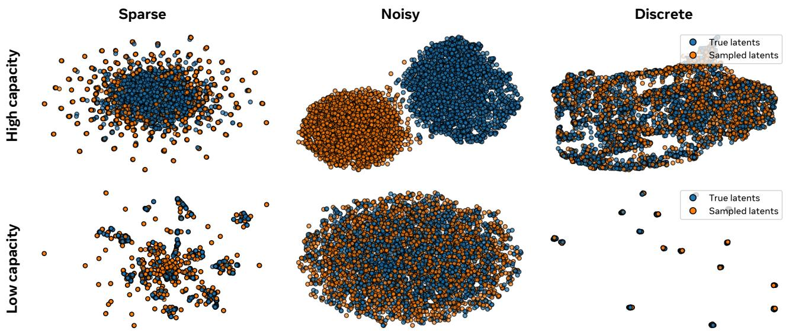  
a natural videos and sample the same amount randomly. Looking at 2D visualizations obtained with UMAP (McInnes aohenruati ruohepacy weheisovr sampled and true latents suggests that the sampling procedure works closer to intended.

As we can see in figure S, the aforementioned sampling strategies are able to sample similar latents to real ones when they have a low capacity. In that case, the models were trained with stronger constraints on the latent actions which can explain why the sampling is adequate However when the latents are less constrained, and thus have a higher capacity, the true and sampled latents are easily separable which suggests a poor sampling.

While this analysis is purely qualitative, it effectively demonstrates how sampling approaches start to break down when handling continuous latents. An interesting angle of attack to tackle this sampling problem could be to use learning based methods that make fewer assumptions about the latent action distribution, such as diffusion models (Sohl-Dickstein et al., 2015).

# C Detailed planning results

Tl urollings compared to the IDM (left). We then selectunseen videos and infr actions based on a goal image. We measure performance as the distance to the goal (right) .

<table><tr><td>Latents</td><td>Capacity</td><td>IDM</td><td>Controller</td></tr><tr><td rowspan="3">Sparse</td><td>Low</td><td>0.12</td><td>0.14 (×1.17)</td></tr><tr><td>Mid</td><td>0.10</td><td>0.12 (×1.20)</td></tr><tr><td>High</td><td>0.09</td><td>0.14 (×1.46)</td></tr><tr><td rowspan="3">Noisy</td><td>Low</td><td>0.13</td><td>0.13 (×1.00)</td></tr><tr><td>Mid</td><td>0.10</td><td>0.11 (×1.10)</td></tr><tr><td>High</td><td>0.09</td><td>0.12 (×1.27)</td></tr><tr><td rowspan="2">Discrete</td><td>Low</td><td>0.13</td><td>0.13 (×1.00)</td></tr><tr><td>High</td><td>0.11</td><td>0.12 (×1.02)</td></tr></table>

<table><tr><td>Latents</td><td>Capacity</td><td>∆xyz (m)</td></tr><tr><td rowspan="2">Sparse</td><td>Low</td><td>0.33</td></tr><tr><td>Mid</td><td>0.18</td></tr><tr><td rowspan="3">Noisy</td><td>High</td><td>0.13</td></tr><tr><td>Low</td><td>0.49</td></tr><tr><td>Mid</td><td>0.11</td></tr><tr><td rowspan="3">Discrete</td><td>High Low</td><td>0.10</td></tr><tr><td></td><td>0.18</td></tr><tr><td>High</td><td>0.14</td></tr><tr><td>V-JEPA 2-AC</td><td>N/A</td><td>0.15</td></tr><tr><td>V-JEPA 2 + WM</td><td>N/A</td><td>0.05</td></tr></table>

Tal urollings compared to the IDM (left). We then select unsen videos and iner actions based o a goal image. We measure performance as ATE and RPE (right).

<table><tr><td>Latents</td><td>Capacity</td><td>IDM</td><td>Controller</td></tr><tr><td rowspan="3">Sparse</td><td>Low</td><td>0.23</td><td>0.25 (×1.11)</td></tr><tr><td>Mid</td><td>0.19</td><td>0.23 (×1.16)</td></tr><tr><td>High</td><td>0.17</td><td>0.26 (×1.51)</td></tr><tr><td rowspan="3">Noisy</td><td>Low</td><td>0.24</td><td>0.24 (x0.99)</td></tr><tr><td>Mid</td><td>0.17</td><td>0.21 (×1.23)</td></tr><tr><td>High</td><td>0.17</td><td>0.22 (×1.29)</td></tr><tr><td rowspan="2">Discrete</td><td>Low</td><td>0.24</td><td>0.24 (×1.00)</td></tr><tr><td>High</td><td>0.20</td><td>0.21 (×1.06)</td></tr></table>

<table><tr><td>Latents</td><td>Capacity</td><td>ATE</td><td>RPE</td></tr><tr><td rowspan="2">Sparse</td><td>Low</td><td>1.68</td><td>0.48</td></tr><tr><td>Mid</td><td>1.45</td><td>0.41</td></tr><tr><td rowspan="4">Noisy</td><td>High</td><td>1.43</td><td>0.42</td></tr><tr><td>Low</td><td>2.06</td><td>0.55</td></tr><tr><td>Mid</td><td>1.49</td><td>0.41</td></tr><tr><td>High</td><td>1.40</td><td>0.40</td></tr><tr><td rowspan="2">Discrete</td><td>Low</td><td>1.81</td><td>0.51</td></tr><tr><td>High</td><td>1.48</td><td>0.42</td></tr><tr><td>NoMaD</td><td>N/A</td><td>1.93</td><td>0.52</td></tr><tr><td>NWM</td><td>N/A</td><td>1.13</td><td>0.35</td></tr></table>

# D Robot manipulation vs in-the-wild videos

In this section, we investigate how pretraining on DROID (Khazatsky et al., 2024) affects performance, both on qualitative examples and on planning performance.

Qualitative analysis. We start by comparing a model trained on YoutubeTemporal-1B with one trained solely on DROID using sparse latents with $\lambda _ { l 1 } = 0 . 0 1$ .Looking at qualitative results in Figure S2 on natural videos, we can see that a model trained exclusively on DROID struggles to model actions present inin-the-wild vidos. This is even true in this scenario where we are using the inverse dynamics model, which thus represents an ideal upper bound of capabilities. Interestingly, when the action corresponds to a person entering the room, we find that the model trained on DROID makes a robotic arm appear, as it is the only moving object seen during training. While this model struggles to open and close a hand, it is however capable of animating objets that are not seen during training, such as a human walking in the scene. Looking closely we can see that the exact leg movement is not captured well, but the overall translation movement is.

these results suggest that pretraining on a more diverse dataset is beneficial to capture morediverse actions, but that even when training on a more constrained datasets, actions that still generalize can be learned. This further supports the illustration in Figure 1.

Planning performance. While we have previously seen that we are able to achieve good planning performance by pretraining only on in-the-wild videos, one can wonder how much the addition of domain specific data influence performance. For this, we pretrain models with a mix of DROID and YoutubeTemporal-1B data, varying the weights of the dataset between O and $1 0 0 \%$ .

T and planning performance. Even a minor amount of data can yield a strong boost in performance.   

<table><tr><td>Model</td><td>DROID weight</td><td>0%</td><td>10%</td><td>25%</td><td>50%</td><td>75%</td><td>90%</td><td>100%</td></tr><tr><td>Sparse</td><td>Controller LPIPS Δ xyz</td><td>0.14 0.14</td><td>0.14 0.13</td><td>0.12 0.14</td><td>0.11 0.09</td><td>0.10 0.09</td><td>0.10 0.08</td><td>0.10 0.08</td></tr><tr><td>Noisy</td><td>Controller LPIPS Δ xyz</td><td>0.11 0.14</td><td>0.10 0.09</td><td>0.10 0.09</td><td>0.10 0.09</td><td>0.10 0.06</td><td>0.10 0.06</td><td>0.9 0.07</td></tr></table>

As we can see in Table S3, adding domain specific data can drastically help performance, even with as low as $1 0 \%$ in some settings. What is also interesting for our latent action model setup is that by training a latent action model with domain specific data, we can achieve very similar planning performance compared to a world model trained on the same data with access to action labels (0.06 vs 0.05 for the best model from Terver e al. (2025). Beyond our work, these results suggest that training a latent action model on the widest range of data possible may be optimal for a diverse set of applications.

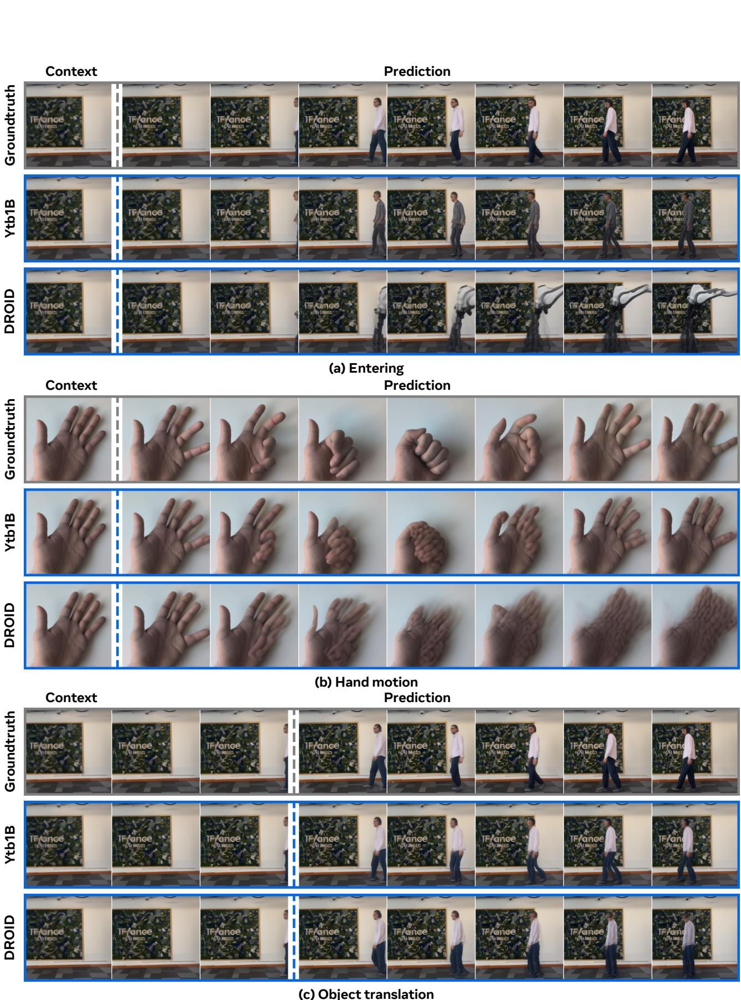  
T bo:je ranslationThe mode train DRstrugghun-centriaction uti distribution (entering, hand), while both models can handle simple object translation.

# E Qualitative Impact of regularization strength

While we previously quantifed the impact o latent action capacity, equivalently regularization strength, we now tur ourselves to more qualitative analyses.Throughout this section weconsider noisylatents, but similar conclusions hold across regularization families.

As we can see in Figure S3, when latent actions are overly constrained, the model is unable to make a human appear. As the constraint gets weaker, we start to see the person appearing, albeit with suboptimal appearance and motion. Continuing to weaken this regularization, we start to see a better outline of the person, and a higher fidelity in motion, especially for the leg movements.

In Figure S4 we study the impact of the regularization strength when transferring movements from a human to a ball. We can see that with a too strong regularization, the ball simply continues its trajectory. We essntially have deterministic world modelAs the regularization increases, the bal lows down moreli pew heaemotiWethen t o perfec einrait hishi the importance of adequate capacity to be able to identify interpretable actions.

While so far more capacity has been beneficial, we get a better understanding of what happens at lower constraints inFigure.Here we that whil itiallycapacity proves the cyc cnsisency actns, in some cases at higher capacity the motion is not applied to the whole human when re-inferred. This suggests a greater spatial localization of actions at higher capacity. We obtain more "precise" actions, at the cost of generality. This mirrors what is observed in planning evaluations, where the optimal latent actions spaces strike a balance between capacity and generality.

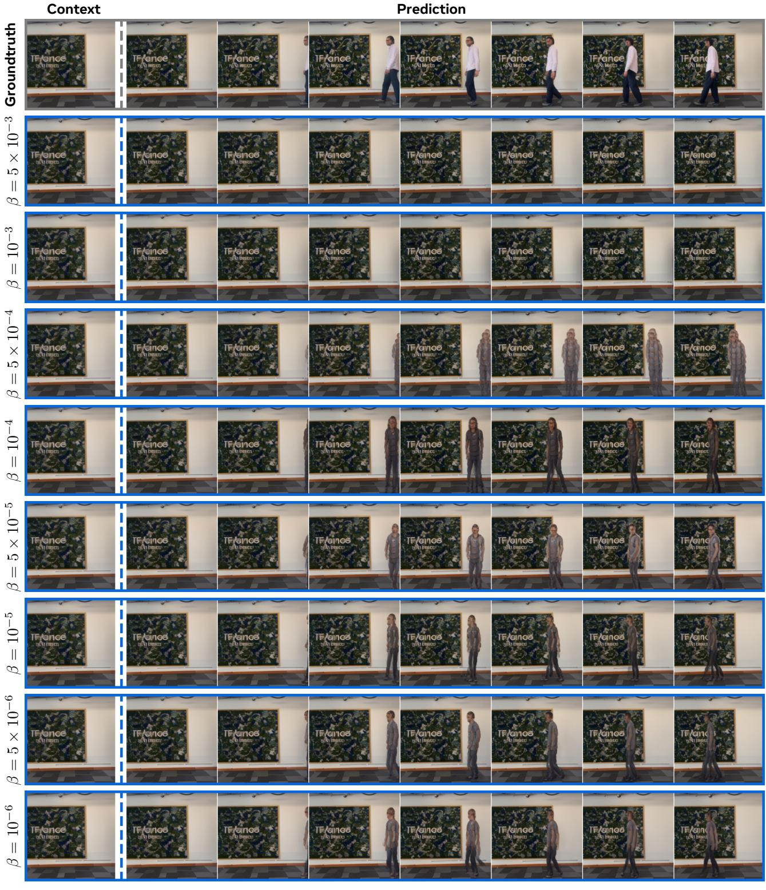  
tpa oe le en u plateaus after a certain point.

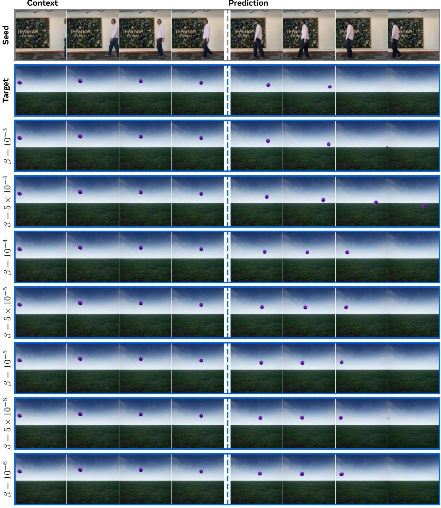  
the latents. More constrained latents either have no effect, or a weaker one.

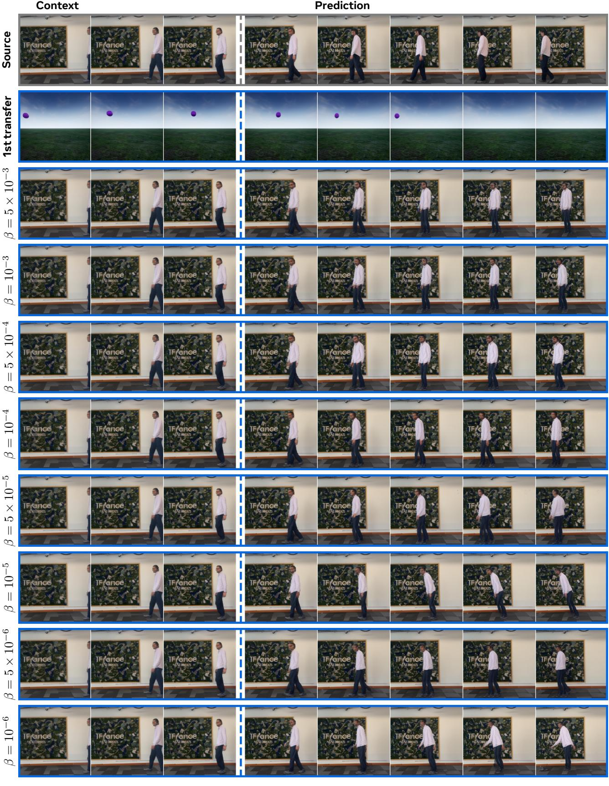  
transer.Ater  certain point,the movement becosmore lcalized an nly theupper by motion s cptur back.

# F Additional IDM rollouts.

In this section we take a look at more qualitative examples of rollouts performed with the inverse dynamics models. This allows us to establish an upper bound of the performance attainable by a given model with the caveat that models may use shortcut solutions. Similar to figure 3, we take a look at the least constrained latents for all regularizations. We focus on videos from SSv2 (Goyalet al., 2017) as a natural video dataset that are not seen during training.

As we can se ngures S6 andS7, latent actions constrained vianoiseaddition r sparsityare able to capture the actions happening in videos, but vector quantized ones struggle more. The latter is stil able to capture rough motion, but struggles with more precise one such as the rotation of the object at the top of figure S7. Overall all of these samples correlate our previous finding and demonstrate the usefulness of continuous regularized latent actions.

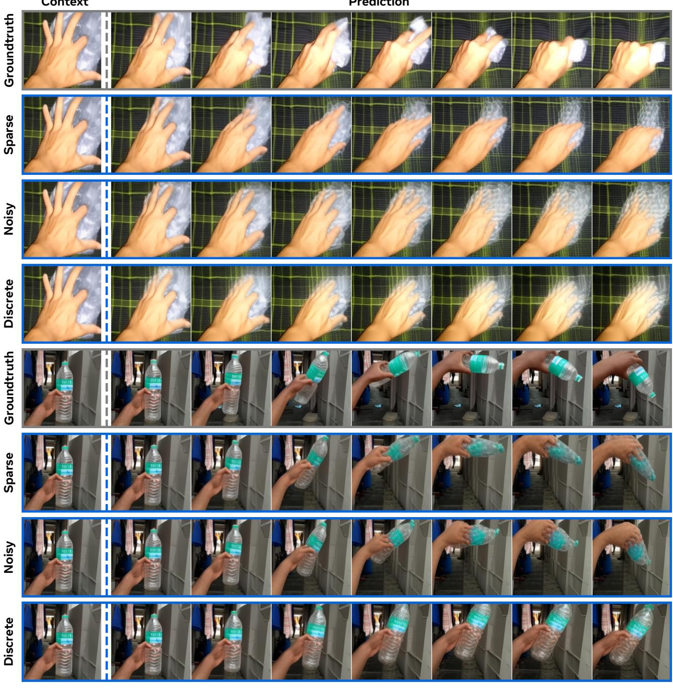  
Fu me pn using he .Wllusrathhgh ualyola w regularization on SSv2, using the inverse dynamics model.

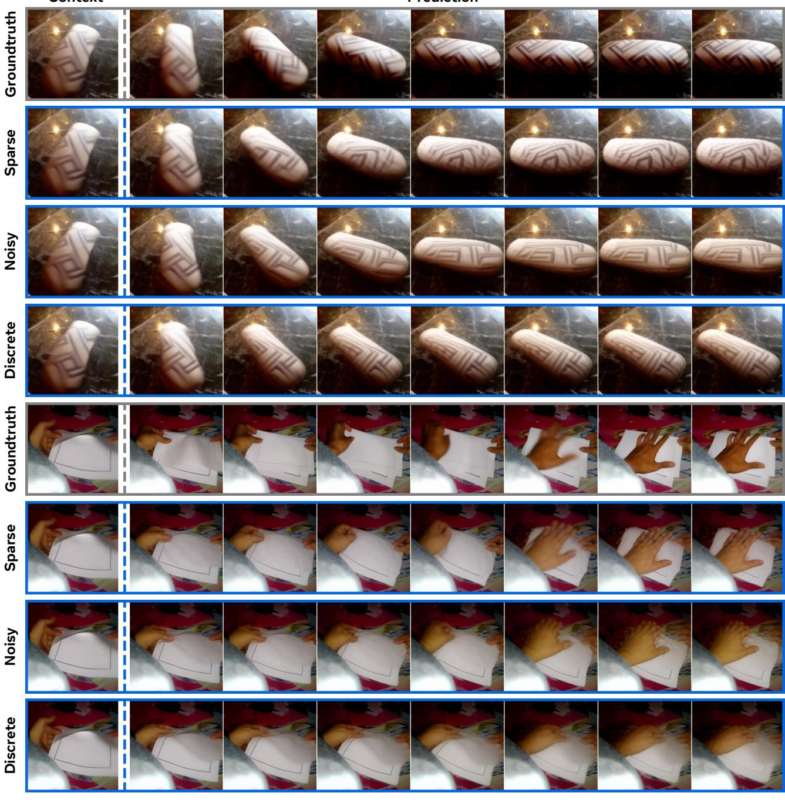  
F mle p usin he .Wlluraheh uloa w t regularization on SSv2, using the inverse dynamics model.

# G Additional human action transfer results.

In this section, wetake a lok at more action transer across scenarios. For this we consider different levls and families of regularization. We investigate four scenarios of action transfer: making someone appear and wak in a scene with someone present, two people raising their arms transferred to one person, someone entering the scene with someone else being static, someone walking in a scene. Figure S8 considers noisy latents with low capacity latents, Figure S9 noisy latents with high capacity latents, and Figure S10 sparse latents with high capacity. This last example has the overall highest capacity, as previously measured by prediction error.

We find that the action of someone entering an empty room is adequately transferred, but with different behavior based on capacity. With low capacity, the newly introduced person and the one already present both start moving. At higher capacities, we see that the already present person either moves with the new character once they overlap, or disappears. We however find that if the original video contained a person standing still (third pairs of row), then the person in the target video also remains still. This differencein behavior suggests that the model can distinguish humans from the background, and the latent actions affect them differently, which is a desired behavior. This is consistent with figure 6 where we see that the latent actions consider humans with higher priority than the background.

When transferring the motion of two person raising their right arm to a single one, we see that both arms become raised. The arms also follow the same movement as in the original video, in spite of the ambiguity o this transfer task. The arms however do not expand horizontally as much as in the original video, which we hypothesize is due to the locality of the action. This appears consistent across capacities.

Finally, when makng a stil persn walk to the le of the scene all capacitis create movement, but at higher capacity we can see the person turn and move, which is more natural than the translation observed at lower capacity. The person only starts this motion once the motion is performed at their current location, urther reinforcing the previously discussed locality.

Another positive results from these qualitativeexamples is that ther is no leakage from the background in ay video, suggesting again that models are not cheating by copying the future but learning valid latent actions.

Overall wee that actns an bedeqately ranerd acrs vides where theifulty efnigr embodiment of in-the-wild videos becomes a strength in ambiguous settings such as going from two to one person.

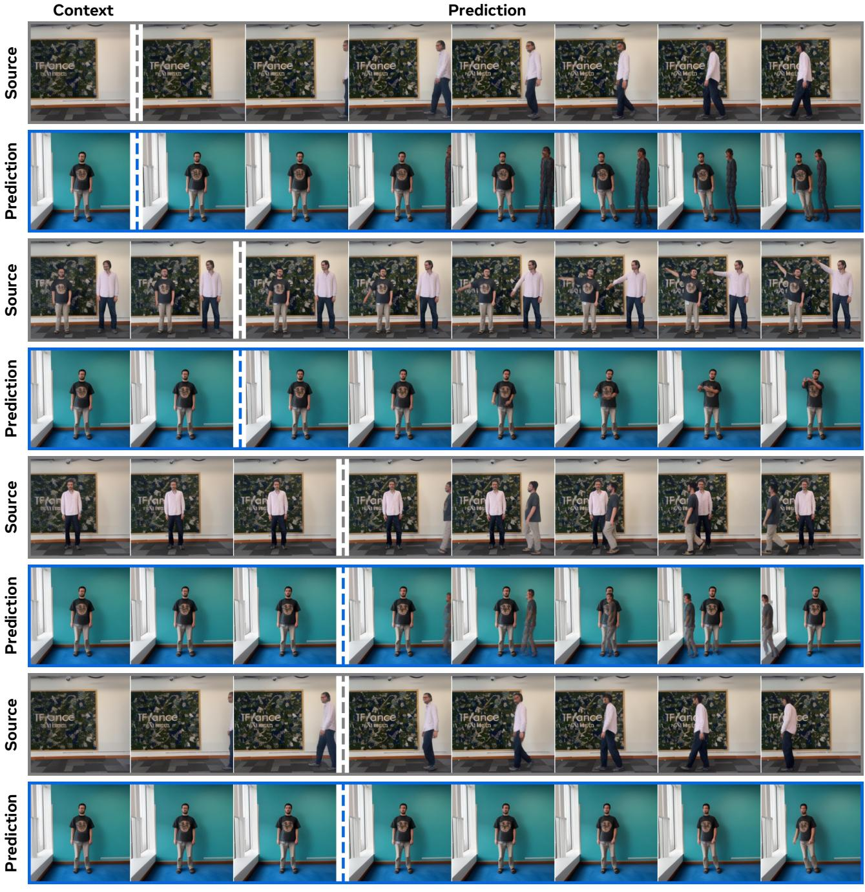  
Figure S8 Additional transfer results, noisy latents with $\beta = 1 0 ^ { - 4 }$ . First pair of rows, making someone enter an frame with somone econ pa os nsermovmet om epers.Thir pa o sm the frames wit a still person in common. Fourth pair o rows, animating someone already present i the room.

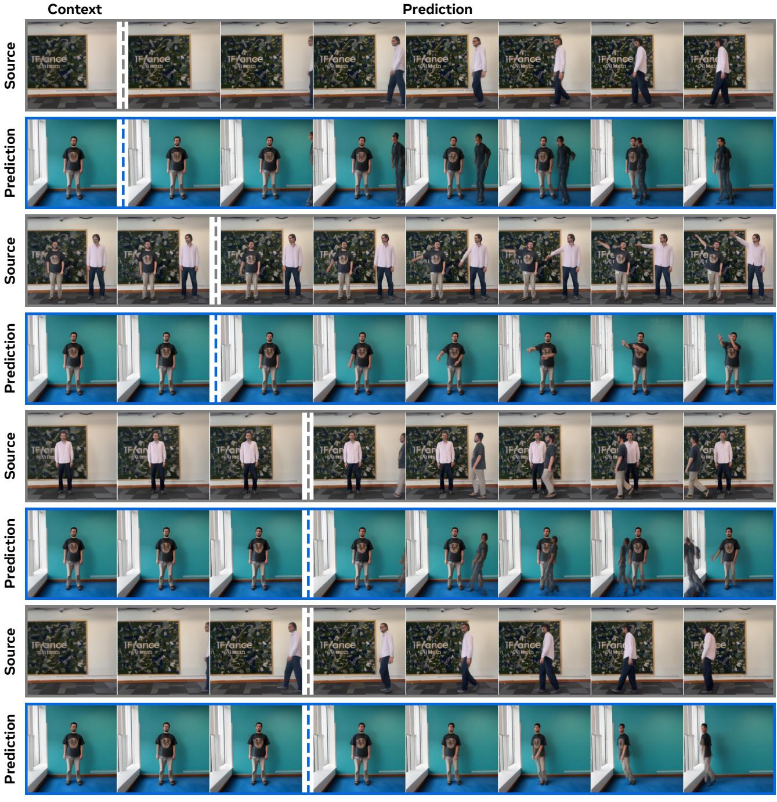  
Figure S9 Additional transfer results, noisy latents with $\beta = 1 0 ^ { - 6 }$ . First pair of rows, making someone enter an frame with sm on aos nemovet oe persThi pai os the frames with a stil person in common. Fourth pair of rows, animating someone already present in the room.

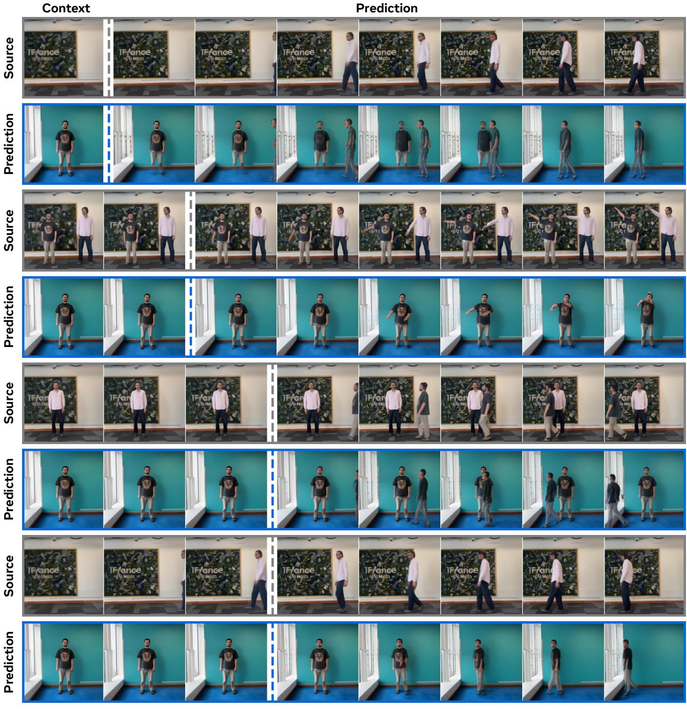  
Figure S10 Additional transfer results, sparse latents with $\lambda _ { l 1 } = 0 . 0 1$ . First pair of rows, making someone enter an frame Sn p oov o erh po entereame wi persmFur proniati lrey reen h.

# H Qualitative performance of the controllers

In this section, we take a look at rollouts produced by our learned controllers, to help understand behavior observed in practice.

We first take a look at random samples from the validation set of RECON and DROID, using our model with the lowest LPIPS value. As we can see in Figure S11 the model is able to accurately model movements from the camera wearer, with afew caveats. In the first video, we can ee that the tree is not accurately preced onc it enters the frame. This can be explained by the missing information from the beginning of the video and the model is only able to guess that the tree continues. In the second row, as the sun becomes occluded, the image gets darker. In the prediction of our model, we can see that the brightness remains high and the sun remains present in the corner of the frame, moving along with the camera. Nonetheless, we are able to accurately control the latent action world model using human interpretable actions.

On DROID in Figure S12 the model is again able to perform similar movements to the groundtruth but it struggles with making the robotic arm enter the frame. On the last row, we can see that no matter the action, nothing happens as the model did not see the arm in the video. This is a sensible failure mode. On the first row, we do see a movement of the visible part of the arm (mainly the gripper), but the rest of the arm does not appear. This again stems from a lack of information, combined with an unfamiliarity with the objects present in this video during training.

To further illustrate why the controller needs access to the representations, beyond previous intuition, we show some rollouts performed using a representation-less controller in Figure S13. Due to the different cameras possible for the videos, as well as our camera-relative latents we find that that the model is not able to successfully control the robotic arm. Instead, the arm remains static. This further demonstrates the importance of representations from the past in the contextualization of latent actions.

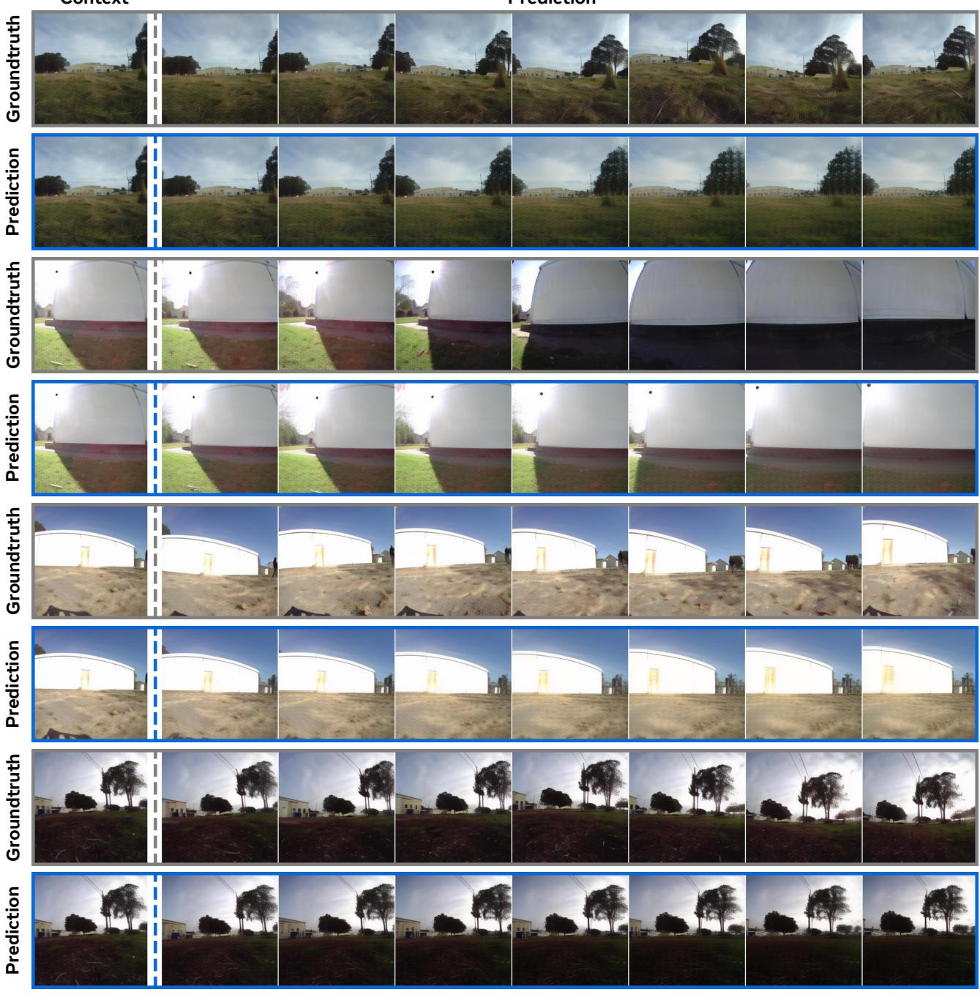  
precise control of the world model.

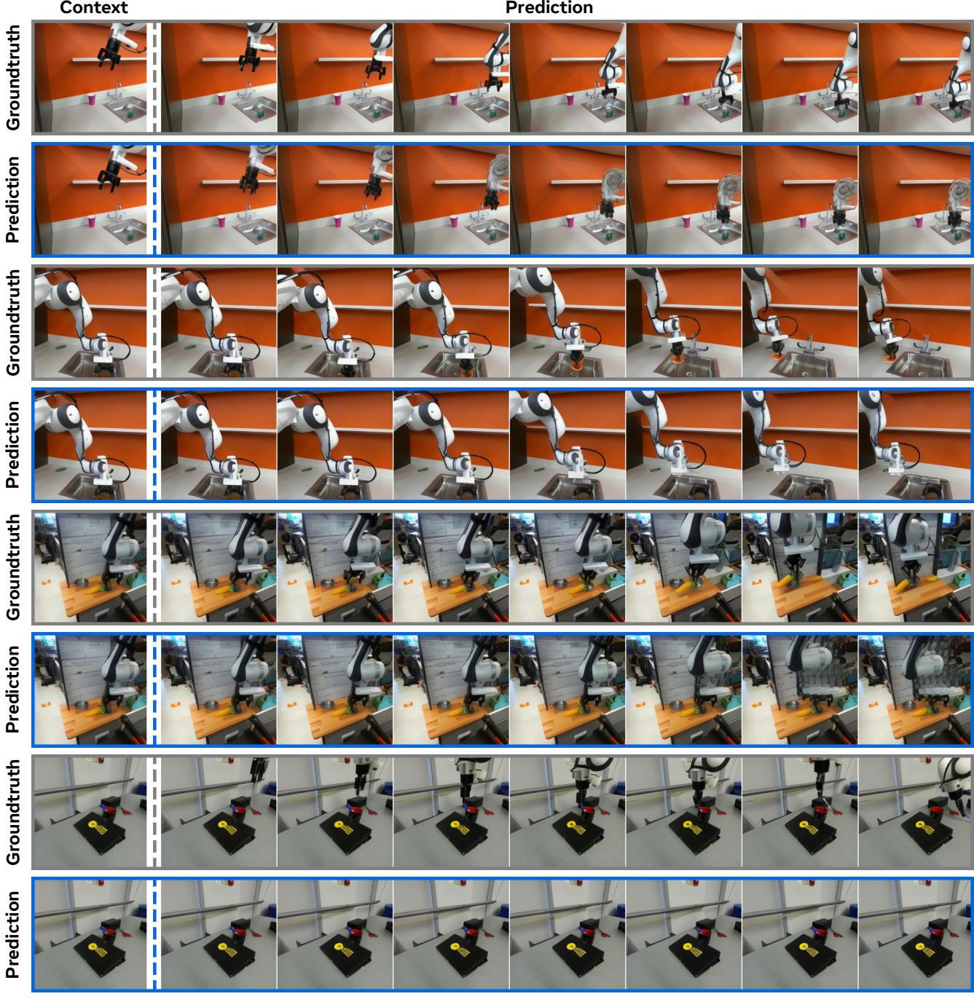  
pch ormo eheorWhe e and the model cannot make an arm appear.

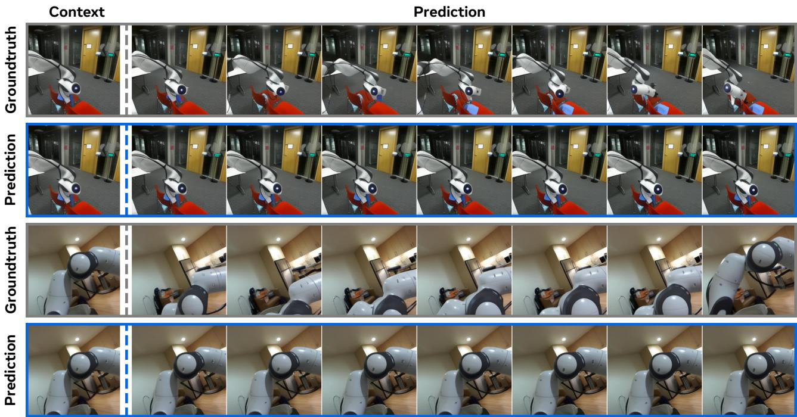  
F knowing the position of the arm or camera, the model resorts to producing no movements.