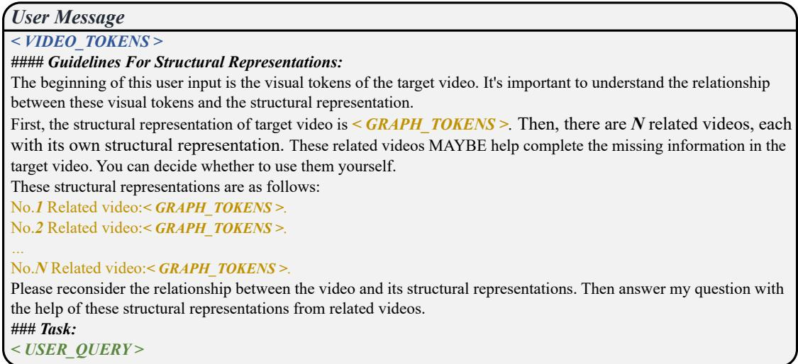
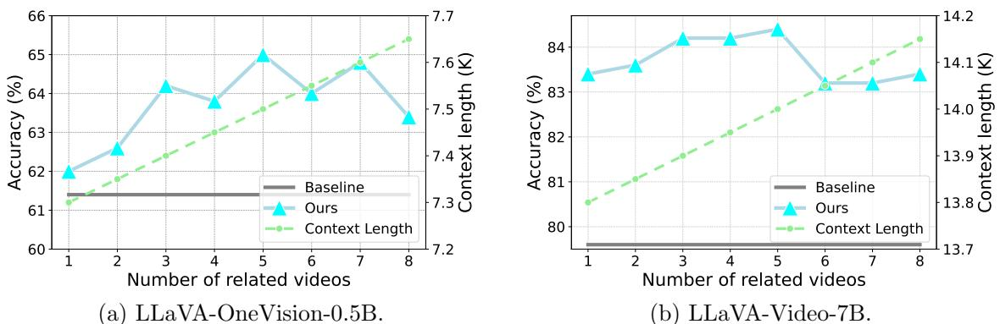
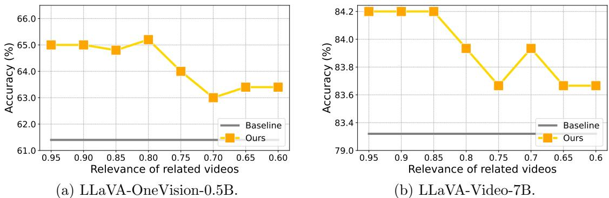
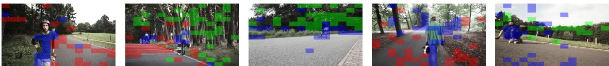
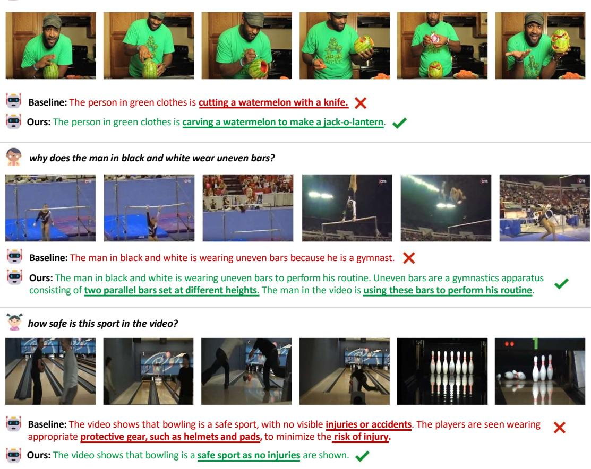

# 1. 论文基本信息

## 1.1. 标题
<strong>利用结构化多视频协作推理增强视频大语言模型 (Enhancing Video Large Language Models with Structured Multi-Video Collaborative Reasoning)</strong>

## 1.2. 作者
**Zhihao He** 等人。
主要作者和贡献者隶属于 <strong>上海交通大学 (Shanghai Jiao Tong University)</strong>、<strong>上海创新研究所 (Shanghai Innovation Institute)</strong> 和 <strong>复旦大学 (Fudan University)</strong>。通讯作者为 **Weiyao Lin** (wylin@sjtu.edu.cn)。

## 1.3. 发表期刊/会议
该论文发布在 **arXiv** 上，作为预印本。

## 1.4. 发表年份
2025年9月16日 (UTC)。

## 1.5. 摘要
尽管视频语言模型 (Video Large Language Model, `VLM`) 取得了长足发展，但当前对全面视频推理的追求仍受限于单个视频固有的时空不完整性，这导致了幻觉 (hallucinations) 和不准确性 (inaccuracies)。一种有前景的解决方案是通过多个相关视频来增强推理性能。然而，视频词元 (video tokens) 数量庞大且包含冗余信息，直接将相关视频数据输入到大语言模型 (Large Language Model, `LLM`) 中可能会适得其反，甚至降低响应质量。为解决这一挑战，本文提出了一个用于视频语言模型的多视频协作框架。为了实现高效灵活的视频表示，作者建立了一个<strong>视频结构化模块 (Video Structuring Module)</strong>，将视频的知识表示为时空图 (spatio-temporal graph)。基于结构化的视频表示，作者设计了<strong>图融合模块 (Graph Fusion Module)</strong>，将结构化知识和来自相关视频的有价值信息融合到增强的图节点词元 (augmented graph node tokens) 中。最后，作者构建了一个精细的多视频结构化提示 (multi-video structured prompt)，将图、视觉和文本词元 (textual tokens) 整合作为大语言模型的输入。大量的实验证明了该框架的有效性，展示了其作为推进视频语言模型的一个有前景的途径的潜力。代码将在 GitHub 上开源。

## 1.6. 原文链接
原文链接: https://arxiv.org/abs/2509.13161
PDF 链接: https://arxiv.org/pdf/2509.13161v2

# 2. 整体概括

## 2.1. 研究背景与动机
**研究背景:**
近年来，大语言模型 (LLM) 的显著发展催生了视频语言模型 (VLM) 的繁荣。VLM 结合了 LLM 强大的通用知识，在理解复杂视频内容方面展现出巨大潜力，有效弥合了视频与语言之间的语义鸿沟，促进了视觉感知与语言处理的细致整合。

<strong>核心问题与挑战 (Gap):</strong>
然而，实现可靠且全面的视频推理仍然是一个难以实现的目标。主要挑战在于：
*   <strong>时空不完整性 (Spatio-temporal incompleteness):</strong> 单个视频捕获的时空知识往往是不完整的。这可能是由于：
    *   **有限的视觉感知能力:** 稀疏采样、遮挡 (occlusion)、视角切换 (perspective switching) 等因素限制了模型从视频中获取完整视觉信息。
    *   **有限的理解能力:** 视频内容的复杂性以及有效的上下文长度 (effective context length) 有限，使得模型难以全面理解视频。
*   <strong>幻觉与不准确性 (Hallucinations and inaccuracies):</strong> 当 VLM 面临知识不完整时，它们倾向于依赖语言先验 (language prior)，这可能导致生成与视觉事实不符的虚假幻觉和错误答案。
*   **多视频协作的挑战:** 引入多个高度相关的视频可以弥补缺失的信息，从而提供更可靠的答案。然而，直接将多个视频的原始视觉特征拼接作为输入（如图 1(b) 所示），会导致以下问题：
    *   **词元数量庞大:** 视频词元数量众多且包含冗余信息，会带来“压倒性”的词元数量，增加 LLM 的计算和理解负担。
    *   <strong>“迷失在中间”</strong>效应 (Lost in the middle): 经验证据表明，当上下文过长时，LLM 倾向于只关注输入中的特定有限片段，从而忽略潜在的关键信息。
    *   <strong>高维度、冗余和混淆 (High dimensionality, redundancy, and obfuscation):</strong> 视频内容的这些特性与语言的结构化、清晰和基于规则的性质形成鲜明对比，使得多视频知识的综合和提炼变得尤为困难。

**论文的切入点/创新思路:**
本文提出了一种结构化的多视频协作推理框架，旨在通过**图结构表示**层面实现多视频信息的对齐和补全，而不是直接拼接原始视频词元。

下图（原文 Figure 1）展示了不同视频协作策略下的视频问答流程。

*该图像是一个示意图，展示了不同的视频协作策略下的视频问答流程。图中包含三种不同的管道：单视频推理（a）、直接多视频协作（b）和结构化多视频协作（c），后者通过结构化的知识图谱来整合信息，以提高推理效果。*

## 2.2. 核心贡献/主要发现
本文的主要贡献体现在以下三个方面：
*   <strong>提出了可行的结构化多视频协作推理框架 (Structured Multi-Video Collaborative Reasoning Framework):</strong> 该框架探索了一种有效利用多视频信息进行视频理解的方法，解决了传统多视频直接拼接策略带来的冗余和整合难题。
*   <strong>设计了视频结构化模块 (Video Structuring Module, `VSM`):</strong> 该模块能够将视频内容表示为数据高效的时空图 (spatio-temporal graph)。通过分析关键目标并提取其时空关系，VSM 为后续的多视频知识融合奠定了基础。
*   <strong>设计了图融合模块 (Graph Fusion Module, `GFM`):</strong> GFM 负责将结构化信息和来自相关视频的关键知识融合到 LLM 友好的图节点词元 (graph node tokens) 中。它利用图注意力网络 (Graph Attention Network, `GAT`) 和跨图注意力 (Cross-Graph Attention, `CGA`) 机制实现这一目标。
*   <strong>构建了精细的多视频结构化提示 (Structured Multi-Video Prompt):</strong> 该提示将融合后的图词元、目标视频的视觉词元和文本查询词元整合起来，作为大语言模型的输入，从而增强 VLM 的推理能力。
*   **实验验证了有效性与鲁棒性:** 大量实验证明了该框架在通过多视频结构化和协作提高推理的可靠性和准确性方面的有效性，并在各种视频问答基准上取得了显著性能提升。

    下图（原文 Figure 2）展示了视频问答示例，对比了单视频推理和多视频推理的效果。

    ![Fig. 2: Video question answering examples from video language models. Single-video reasoning (Left): In video-1, the environmental visual cues are hard for the model to perceive, leading to a 'sports team'hallucination based on only the textual query and linguistic priors. In Video 2, ice-related visuals are missing, and limited bartending knowledge causes the model to skip the question. Multi-video reasoning (Right): Introducing relevant videos allows the model to complete and summarize domain-specific knowledge (such as environmental protection or bartending in this case), leading to more reliable and accurate answers.](images/2.jpg)
    *该图像是视频问答示意图，展示了单视频推理与多视频推理的效果对比。左侧为单视频推理，模型因缺乏环境视觉线索而产生误判；右侧为多视频推理，通过引入相关视频，模型能更准确地补充领域知识，从而提高回答的可靠性。*

# 3. 预备知识与相关工作

## 3.1. 基础概念
*   <strong>大语言模型 (Large Language Models, `LLMs`):</strong> 经过海量文本数据训练的深度学习模型，能够理解、生成人类语言，并具备强大的通用知识和推理能力。它们是许多现代人工智能应用的基础。
*   <strong>视频语言模型 (Video Large Language Models, `VLMs`):</strong> 结合了 LLM 的语言能力和视觉编码器的视觉感知能力，旨在理解和推理视频内容。它们通常通过特征对齐 (feature alignment) 和视觉指令微调 (visual instruction tuning) 来实现视频和语言的整合。
*   <strong>词元 (Token):</strong> 在自然语言处理和大型语言模型中，文本或视觉输入会被分解成更小的单位，称为词元。这些词元可以是单词、子词或图像/视频中的视觉补丁 (visual patch)。
    *   <strong>视频词元 (Video Tokens):</strong> 从视频中提取的视觉特征表示，通常数量庞大，包含丰富的像素级或语义级信息。
    *   <strong>图词元 (Graph Tokens):</strong> 本文中特指从结构化视频图谱中提取的节点特征，这些特征经过融合，包含了视频对象、关系及跨视频知识的摘要信息。
    *   <strong>文本词元 (Text Tokens):</strong> 从文本输入（如问题、指令）中提取的语言特征表示。
*   <strong>时空不完整性 (Spatio-temporal Incompleteness):</strong> 指单个视频无法提供某个事件或场景的全部空间（如画面外发生的情况、遮挡）和时间（如事件开始前或结束后、重要中间环节缺失）信息，导致模型无法形成全面理解。
*   <strong>幻觉 (Hallucinations):</strong> 在 VLM 或 LLM 中，指模型生成的内容在视觉事实或真实世界知识上是虚构的、不准确的或无意义的，即使其语言表达看起来流畅自然。
*   <strong>图注意力网络 (Graph Attention Network, `GAT`):</strong> 一种基于图的神经网络结构，通过对图中每个节点的邻居节点分配不同的注意力权重来聚合信息，从而学习节点的表示。它允许模型根据邻居特征的重要性动态调整其关注点，而不仅仅是简单的平均或求和。
*   <strong>跨图注意力 (Cross-Graph Attention, `CGA`):</strong> 本文中提出的机制，用于在多个视频的图结构之间进行信息融合。它通过一种自注意力机制，结合自定义的位置编码，识别并融合不同视频图谱中最相关的结构化知识。
*   <strong>检索增强生成 (Retrieval-Augmented Generation, `RAG`):</strong> 一种提高 LLM 性能的技术。当 LLM 需要回答问题时，它首先从一个外部知识库中检索相关信息，然后将这些检索到的信息与原始问题一起作为输入，引导 LLM 生成更准确、更少幻觉的答案。

## 3.2. 前人工作
### 3.2.1. 视觉语言模型 (Vision Language Models)
视觉语言模型旨在通过学习视觉和语言的联合表示来弥合这两种模态之间的语义鸿沟。
*   <strong>特征对齐 (Feature Alignment) 与视觉指令微调 (Visual Instruction Tuning):</strong> 这是 VLM 的核心技术，通过将视觉特征映射到语言模型的嵌入空间，并利用指令数据对模型进行微调，使其能够理解开放世界场景中的图像和视频。
*   **常见架构:**
    *   **Q-former 架构:** 例如 `Video-LLaMA [3]` 和 `BLIP-2 [37]` 采用 `Q-former` 来将有价值的视觉信息提取成紧凑且 LLM 友好的视觉词元，用于对齐。
    *   **Perceiver Resampler 架构:** 例如 `Flamingo [38]` 和 `BLIP-3 [39]` 利用可扩展的 `perceiver resampler` 来获得可学习的视觉词元。
    *   **MLP-based Projector 架构:** 例如 `LLaVA [25]`、`Video-LLaVA [6]`、`LLaVA-OneVision [40]` 和 $Qwen2/2.5-VL [41, 42]$ 使用基于多层感知机 (`MLP`) 的投影器将视觉和文本输入映射到共享的特征空间。
*   **视觉词元数量的缩减:** 鉴于图像和视频输入中包含的复杂信息，许多研究 (例如 $[37, 43-45]$) 致力于减少视觉词元的数量，以减轻 LLM 的计算和理解负担。
*   **本文工作的差异:** 当前大多数 VLM 专注于单视频推理。本文则探索一种结构化的多视频推理框架，以有效解决多视频输入带来的冗余和整合挑战。

### 3.2.2. 多数据协作 (Multi-Data Collaboration)
尽管大多数深度学习任务遵循单数据处理流程，但多数据协作提供了一个通过多个样本之间的内部对应关系来提高性能的有前景的方向。
*   <strong>内容相关协作 (Content-related collaboration):</strong> 通过比较几个相关数据，帮助模型关注重要内容。
    *   <strong>共同分割 (Co-segmentation):</strong> 例如 `[30, 31]` 探索通过总结和共享相同的对象相关特征来分割不同场景中的同一对象。
    *   <strong>少样本分类/识别 (Few-shot Classification/Recognition):</strong> 例如少样本图像分类 `[46]`、动作识别 `[47, 48]` 和细粒度分类 `[49]` 方法通过多数据比较，关注关键差异以进行准确分类。
    *   <strong>检索增强生成 (Retrieval-Augmented Generation, `RAG`):</strong> 例如 `[33-35]` 是一种有前景的内容相关协作，它为 LLM 提供从检索到的相关数据中获取的支持信息。
*   <strong>任务相关协作 (Task-related collaboration):</strong> 模型通过观察执行相同任务的多个样本来学习完成任务的方式。
    *   <strong>多视频摘要 (Multi-video Summarization):</strong> 例如 `[32, 50, 51]` 研究旨在通过多数据互补和提炼从视频集合中生成摘要。
    *   <strong>语境学习 (In-Context Learning, `ICL`):</strong> 例如 `[52, 53]` 使用带有任务指导和答案的示例来向 LLM 演示如何完成任务。
*   **本文工作的差异:** 当前 VLM 中的多视频协作策略通常直接拼接多个输入，导致负担过重和协作困难。本文在这些进展的基础上，引入了多视频推理任务，并通过多视频协作实现关键时空信息的补偿和提炼。

## 3.3. 技术演进与差异化分析
视频理解领域的技术演进经历了从传统单模态特征提取到多模态融合，再到与 LLM 结合的 VLM。早期 VLM 专注于将视频内容映射到语言空间，但往往受限于单个视频的视角和内容，难以处理复杂的、跨越多个场景或时间线的推理任务。

本文的工作处于 VLM 技术发展的前沿，旨在解决单个视频推理的固有局限性。与现有 VLM（主要进行单视频推理，如图 1(a) 所示）以及直接拼接多视频特征的“笨重”方法（如图 1(b) 所示）相比，本文的创新点在于：
*   <strong>结构化表示 (Structured Representation):</strong> 不再直接处理原始的、高维的、冗余的视频词元，而是首先通过 <strong>视频结构化模块 (VSM)</strong> 将视频知识提炼成数据高效的时空图谱。这种结构化表示天然地减少了冗余，并突出了关键的对象和关系。
*   <strong>智能融合 (Intelligent Fusion):</strong> 通过 <strong>图融合模块 (GFM)</strong>，将目标视频和相关视频的结构化知识进行智能融合。这种融合不是简单的拼接，而是利用图注意力机制 (`HFGAT`) 捕获视频内部的时空关系，再通过跨图注意力 (`CGA`) 机制在不同视频之间进行选择性地知识传递和补全。
*   <strong>优化提示 (Optimized Prompt):</strong> 设计了专门的多视频结构化提示，将精炼后的图词元、目标视频的详细视觉词元和文本查询整合，以 LLM 友好的方式输入模型，从而在避免上下文过长问题的同时，有效利用多视频信息。

    这种结构化、智能融合和优化提示的组合，使得本文的方法能够更有效地克服单个视频的时空不完整性，并避免了直接多视频协作带来的计算和理解负担，从而实现更可靠和准确的视频推理。

# 4. 方法论

## 4.1. 方法原理
本文提出的多视频协作推理框架旨在通过利用多个相关视频的信息来增强视频语言模型 (VLM) 的推理能力。核心思想是克服单个视频固有的时空不完整性，同时避免直接拼接多视频原始数据所带来的巨大计算和理解负担。该框架通过**结构化表示**将视频知识提炼为时空图，然后**智能融合**这些图结构中的有价值信息，并最终通过**精心设计的提示**将其有效地馈送给大语言模型 (LLM)。其直觉在于，人类在理解复杂场景时，也会结合不同来源的信息（如不同视角的视频、相关事件的描述）来构建一个更全面的认知图谱。

## 4.2. 核心方法详解
我们的多视频协作推理框架如图 3 所示。首先，引入<strong>视频结构化模块 (Video Structuring Module, `VSM`)</strong> 以获得结构化的视频表示。基于获得的视频结构，设计<strong>图融合模块 (Graph Fusion Module, `GFM`)</strong> 以融合结构化视频表示并将有用的相关视频信息转换为生成的图词元。最后，根据我们设计的多视频推理提示，安排所有的图、视觉和文本词元，并将其发送到大语言模型进行问答。

下图（原文 Figure 3）展示了多视频协作推理框架。

![Fig. 3: Multi-video collaborative reasoning framework. Together with the target video, $N$ related videos are retrieved to facilitate the reasoning process. First, we design the Video Structuring Module to obtain the structured video representation. Then, the Graph Fusion Module fuses the structure information and the related videos' information to get the video graph tokens. Finally, according to the designed prompts, the graph tokens, visual tokens, and text tokens are arranged as input to the large language model for question answering.](images/3.jpg)
*该图像是示意图，展示了多视频协作推理框架。该框架通过视频结构模块生成视频知识的时空图表示，再通过图融合模块将结构信息与相关视频的信息融合，以便更好地构建输入至大型语言模型的提示。*

### 4.2.1. 多视频推理设置
本文采用多视频设置，其中一个目标视频 $V_0$ 伴随着 $N$ 个相关视频 $\{V_1, V_2, \ldots, V_N\}$。为了检索相关视频，它们的特征向量会提前构建，以实现高效的视频检索。关于视频向量化的不同方法将在后续讨论。最终，方法需要借助 $N$ 个检索到的视频来回答关于目标视频的问题。

### 4.2.2. 视频结构化模块 (Video Structuring Module, `VSM`)
高效的结构化视频表示为后续多视频知识的整合铺平了道路。给定视频及其配对的密集字幕，VSM 的流程如下：

*   <strong>步骤 1: 场景检测 (Scene Detection)。</strong>
    为了减少视频内的时间冗余，我们采用轻量级的基于内容的场景检测器 Autoshot [55] 将视频分割成不同的场景。从每个检测到的场景中，我们提取其**中间帧**作为关键帧 (keyframe)，这将作为后续视频结构化过程的输入。视频 $V_N$ 的 $M$ 个关键帧表示为 $\mathcal{F}_N = \{F_1, F_2, \ldots, F_M\}$。

*   <strong>步骤 2: 密集视频字幕生成 (Dense Video Captioning)。</strong>
    为了准备后续的结构化流程，我们需要提取详细且细粒度的文本概念。为此，我们利用一个视频大语言模型来生成输入视频的全面描述，使用设计的提示，如图 4 所示。

下图（原文 Figure 4）展示了视频字幕生成提示。

![Fig. 4: Video captioning prompts. We refer to the design outlined in \[54\] to create the prompts used to extract captions from videos. The prompts are divided into two parts: the system prompt and the user message. In the system prompt, we define the task of video captioning and provide corresponding guidelines along with a standardized output format. For the output format, the program randomly selects contents in green font as the normalized format for reference during each process of captioning. For the user message, we utilize $< V I D E O _ { - } T O K E N S >$ as the video tokens, and we provide a concise instruction to the model, then generate a detailed description for the video.](images/4.jpg)
*该图像是一个视频字幕生成的系统提示和用户消息示例，展示了如何分析视频帧中的叙事进程。系统提示包括任务说明和视频描述的指导原则，而用户消息则提供了具体的视频代币和详细描述的请求格式。这有助于生成高质量的视频描述。*

*   <strong>步骤 3: 文本场景图解析 (Textual Scene Graph Parsing)。</strong>
    然后，我们使用 SceneGraphParser [56] 从密集视频字幕中提取文本场景图 $\mathcal{G}^{\mathrm{Text}}$，将其内部的大语言模型替换为 Qwen3-30-A3B [57]。文本场景图包含多个三元组 (triplets) $\tau_i = \{s_i, p_i, o_i\}$，其中每个三元组 $\tau_i$ 表示视频中的第 $i$ 个交互或事件。这里，$s_i$、$p_i$ 和 $o_i$ 分别表示<strong>主语 (subject)</strong>、<strong>谓语 (predicate)</strong> 和<strong>宾语 (object)</strong>。每个三元组都格式化为“主语 - 谓语 - 宾语”，作为视频中捕获的关系和动态的基础表示。

*   <strong>步骤 4: 图信息过滤 (Graph Information Filtering)。</strong>
    为了提高数据质量，我们应用主动过滤机制来消除不相关或冗余的三元组。具体来说，我们使用一个图像级分类器来验证场景中是否存在来自三元组的相关宾语或主语。这是通过使用定制的提示（例如，“图像中存在与 {宾语/主语} 相关的对象。”用于正样本，“图像中不存在与 {宾语/主语} 相关的对象。”用于负样本）来制定一个简单的二元分类任务，并利用 SigLIP [58] 执行分类。
    *   根据分类结果，我们决定保留或丢弃宾语-主语对。
    *   如果宾语或主语中的任何一个在图像中独立存在，我们构建格式为 $\{s_i, *, s_i\}$ 或 $\{o_i, *, o_i\}$ 的三元组，以便在下一步中建立节点之间的自连接 (self-connections)。
    *   相反，如果宾语和主语都没有同时存在，则相应的三元组将被丢弃。
        这个过程产生了过滤后的三元组，表示为 $\hat{\mathcal{G}}^{\mathrm{Text}}$。

*   <strong>步骤 5: 视频图建立 (Video Graph Establishment)。</strong>
    基于过滤后的文本场景图 $\hat{\mathcal{G}}^{\mathrm{Text}}$ 和与每个三元组对应的关键帧 $\mathcal{F}_{\{0, \ldots, N\}}$，我们为目标视频和相关视频建立基于图的结构化视频表示。具体来说，该图由<strong>节点 (nodes)</strong>、<strong>帧内边 (intra-frame edges)</strong> 和<strong>帧间边 (inter-frame edges)</strong> 组成。
    *   <strong>节点 (Node):</strong> 代表视频中宾语或主语的特征。
        *   首先，我们利用 Qwen3-Embedding [59] 从 $\hat{\mathcal{G}}^{\mathrm{Text}}$ 中提取文本特征 $\mathbf{T}$，将文本转换为每个宾语和主语的特征表示。
        *   然后，我们引入<strong>池化注意力 (Pooling Attention)</strong>，基于文本特征和关键帧 $\mathcal{F}_{\{0, \ldots, N\}}$ 提取有效的视觉特征。
        *   最后，我们将这些视觉特征与原始文本特征进行自适应加权融合，以获得更鲁棒的节点级特征表示。
    *   <strong>帧内边 (Intra-frame Edge):</strong> 由每个三元组的谓语 (predicate) 表示，代表同一帧内宾语与宾语之间的空间和交互关系。从 $s_i$ 到 $o_i$ 形成一个有向链接。
    *   <strong>帧间边 (Inter-frame Edge):</strong> 连接不同帧中共享相同主语和宾语的对象，从而建模它们的时间关系。我们利用在步骤 4 中获得的过滤结果 $\hat{\mathcal{G}}^{\mathrm{Text}}$ 来链接前一帧的 $s_i^{t-1}, o_i^{t-1}$ 与当前帧的 $s_i^t, o_i^t$。此外，我们引入了帧间连接的双向链接，因为它增强了系统理解视频内容的能力 [61]。
        通过上述步骤，我们建立了目标视频及其相关视频的基于图的结构化视频表示，以供进一步协作。

### 4.2.3. 图融合模块 (Graph Fusion Module, `GFM`)
图融合模块 (GFM) 由一个<strong>三元组嵌入模块 (Triplet Embedding Module, `TEM`)</strong> 和一个用于图信息处理的多层堆叠架构组成。该架构的每一层都集成了两个基本组件：<strong>分层帧图注意力网络 (Hierarchical Frame Graph Attention Network, `HFGAT`)</strong> 和<strong>跨图注意力 (Cross-Graph Attention, `CGA`)</strong> 机制。

*   <strong>三元组嵌入模块 (Triplet Embedding Module, `TEM`)</strong>
    *   <strong>类别嵌入 (Class Embedding, `CE`):</strong>
        为了增强 GFM 区分目标视频图和相关视频图的能力，我们在 TEM 中引入了类别嵌入 (CE)。CE 定义如下：
        $$
        \begin{array} { r l } & { \mathrm { C E } _ { t a r } = \sigma ( \pmb { \alpha } ) , } \\ & { \mathrm { C E } _ { r e l } = 1 - \sigma ( \pmb { \alpha } ) , } \end{array}
        $$
        其中，$\pmb{\alpha} \in \mathbb{R}^d$ 表示一个跨帧共享的可学习参数，$\sigma$ 表示 Sigmoid 函数。计算出的类别嵌入直接应用于 GFM 的输入，其中 $\mathrm{CE}_{tar}$ 用于目标视频的文本特征 $\mathbf{T}_{tar}$，$\mathrm{CE}_{rel}$ 用于相关视频的文本特征 $\mathbf{T}_{rel}$。这种整合过程的公式如下：
        $$
        \begin{array} { r } { \mathbf { T } _ { t a r } = \mathbf { T } _ { t a r } + \mathbf { C } \mathbf { E } _ { t a r } , \quad } \\ { \mathbf { T } _ { r e l } = \mathbf { T } _ { r e l } + \mathbf { C } \mathbf { E } _ { r e l } , \quad } \\ { \mathbf { T } = [ \mathbf { T } _ { t a r } , \mathbf { T } _ { r e l } ] , \quad \quad } \end{array}
        $$
        其中 `[,]` 表示对来自目标视频和相关视频的三元组进行拼接操作。通过利用 `CE`，GFM 可以隐式地学习区分目标视频和相关视频。

    *   <strong>池化注意力 (Pooling Attention):</strong>
        为了有效地整合与三元组对应的关键帧的视觉信息，我们在 TEM 中整合了池化注意力，如下定义：
        $$
        \begin{array} { r l } & { \mathbf { Q } = \mathbf { T } \mathbf { W } _ { Q } \in \mathbb { R } ^ { 1 \times d } , } \\ & { \mathbf { K } = \mathbf { I } \mathbf { W } _ { K } \in \mathbb { R } ^ { ( H _ { p } \times W _ { p } ) \times d } , } \\ & { \mathbf { V } = \mathbf { I } \mathbf { W } _ { V } \in \mathbb { R } ^ { ( H _ { p } \times W _ { p } ) \times d } , } \\ & { \tilde { \mathbf { I } } = \mathrm { s o f t m a x } ( \mathbf { Q } \mathbf { K } ^ { \top } / \sqrt { d } ) \mathbf { V } \in \mathbb { R } ^ { 1 \times d } , } \end{array}
        $$
        其中 $\mathbf{W}_Q \in \mathbb{R}^{d \times d}$、$\mathbf{W}_K \in \mathbb{R}^{d \times d}$、$\mathbf{W}_V \in \mathbb{R}^{d \times d}$ 是与注意力机制 [60] 的查询 $\mathbf{Q}$、键 $\mathbf{K}$ 和值 $\mathbf{V}$ 相关的可学习权重矩阵。$\mathbf{I} \in \mathbb{R}^{(H_p \times W_p) \times d}$ 表示从 VLM 视觉编码器中提取的视觉特征，它使用多个词元表示一个关键帧。$(H_p \times W_p)$ 表示从视觉编码器提取后视觉特征的长度。通过应用池化注意力，我们以文本特征引导的方式聚合视觉特征，从而产生更鲁棒的特征表示。

    *   <strong>自适应加权融合 (Adaptive Weighted Fusion):</strong>
        随后，我们使用自适应权重 $\beta \in \mathbb{R}^d$ 融合从 Qwen3-Embedding [59] 提取的原始文本特征 $\mathbf{T}$ 和池化后的视觉特征 $\tilde{\mathbf{I}}$，定义如下：
        $$
        \hat { \mathbf { T } } = \sigma ( \beta ) \odot \mathbf { T } + ( 1 - \sigma ( \beta ) ) \odot \tilde { \mathbf { I } } ,
        $$
        其中 $\odot$ 表示哈达玛积 (Hadamard product，即元素级乘法)。这种融合操作自适应地平衡了文本和视觉特征的贡献，从而产生了最终的鲁棒表示 $\hat{\mathbf{T}}$。

*   **多层架构**
    然后，我们将处理过的三元组特征 $\hat{\mathbf{T}}$ 输入到一个多层架构中，以处理图信息。
    *   <strong>分层帧图注意力网络 (Hierarchical Frame Graph Attention Network, `HFGAT`):</strong>
        特征首先通过 `HFGAT`，它专门用于融合单个视频内的基于图的结构化数据。传统图注意力网络 (`GATs`) [36] 主要用于节点分类和关系预测等任务，其中节点之间的关系是明确定义的。相比之下，在帧间和帧内上下文中，这些关系通常是隐式的或缺失的。为了解决这个挑战，如 3.2 节所述，我们首先使用 VSM 将原始视觉模态数据转换为基于图的结构化表示。在构建的图中，节点代表主语或宾语的特征，这些特征最初从 3.2 节提取，随后由 TEM 处理。对于帧内边，我们利用基于三元组的关系，其中从 $s_i$ 到 $o_i$ 形成一个有向链接。对于帧间边，我们利用在 3.2 节步骤 4 中获得的过滤结果 $\hat{\mathcal{G}}^{\mathrm{Text}}$ 来链接前一帧的 $s_i^{t-1}, o_i^{t-1}$ 到当前帧的 $s_i^t, o_i^t$。此外，我们引入了帧间连接的双向链接，因为它增强了系统理解视频内容的能力 [61]。

    *   <strong>跨图注意力 (Cross-Graph Attention, `CGA`):</strong>
        一旦通过 HFGAT 从单个视频中提取了结构化特征，下一步就是识别并融合视频之间最相关的信息。为了实现这一点，我们引入了跨图注意力机制，通过具有自定义位置 ID 的自注意力机制实现。为了通过三元组特征促进多视频协作推理，我们确定了三个关键原则：
        1.  在一个三元组内，主语和宾语之间的关系是不可互换的。
        2.  在一个视频内，三元组之间的位置关系是无序的。
        3.  通过相关性排名检索到的多个视频之间，三元组的顺序是不可互换的。
            对于原则 1) 和 2)，来自 HFGAT 的结构化视频表示本质上捕获了单个视频内的位置编码，因为 HFGAT 根据相应视频图的连接关系聚合和传递表示之间的信息，从而隐式地在表示中编码位置信息。因此，我们的主要关注点是在确保遵循原则 1) 和 2) 的同时解决原则 3)。为了处理原则 3)，我们在每个视频内分配一致的位置 ID，并根据检索相关性动态调整跨检索视频的位置 ID。例如，来自目标视频的三元组特征总是被分配位置 ID 0，而相关视频的位置 ID 则根据其从检索相关性派生的排名动态确定。这些位置 ID 随后通过 RoPE [62] 整合，以在跨图注意力机制中有效编码位置信息。

    *   **其他设计细节:**
        此外，我们还为 HFGAT 和 CGA 组件应用了残差连接 (residual connections) 和预归一化 (pre-normalization)。具体来说，我们应用了 Vision Transformers (`ViT`) [58] 中常用的 LayerNorm [63] 进行预归一化。值得注意的是，我们在层中排除了前馈网络 (`FFN`)，以保留视觉编码器对齐视觉特征的不变性，从而最大程度地减少过度的特征漂移，并确保 GFM 输入和输出之间的线性 [64]。
    视频的基于图的结构化视频表示随后通过 GFM 处理以构建图词元，每个图词元对应于在与结构化信息融合后，主语或宾语的节点特征。

### 4.2.4. 结构化多视频提示 (Structured Multi-Video Prompt)
获得融合后的多视频图词元后，我们需要将图、视频和文本词元整合在一起，以创建 LLM 友好的输入。因此，我们提出了结构化多视频提示，如图 5 所示。我们的提示源自先前的视频语言模型的提示设计 [6]。
*   <strong>对于目标视频 (Target Video):</strong> 我们保留目标视频的视觉词元 `<VIDEO_TOKENS>`，以保留细粒度和详细的视觉信息。我们还附加其基于图的结构化数据 `<GRAPH_TOKENS>`，以指示关键对象和时空关系。
*   <strong>对于 $N$ 个相关视频 (Related Videos):</strong> 我们只保留简洁高效的基于图的结构化数据 `<GRAPH_TOKENS>`。
*   **提示引导:** 在此上下文中，我们进一步指示目标视频与相关视频之间的关系，以及 LLM 如何利用这些相关的多视频结构化数据。
    通过以这种方式构建提示，我们使视频语言模型能够以有效的方式利用多视频信息，从而增强模型推理和回答视频内容相关查询的能力。

下图（原文 Figure 5）展示了结构化多视频提示。

*该图像是示意图，展示了结构化多视频提示的集成方法，包括多模态标记及提示指导，形成适合大语言模型输入的格式。*

# 5. 实验设置

## 5.1. 数据集
*   **训练阶段:**
    *   我们基于 LLaVA-Video-178K 数据集 [54] 构建了一个包含结构化视频信息的训练数据集，用于 GFM 训练。
    *   按照 3.2 节概述的步骤进行预处理。对于 LLaVA-Video-178K 中已包含字幕的视频数据，我们保留原始字幕以简化预处理流程。
    *   **视频向量化和检索机制:** 我们利用 Qwen3-Embedding-8B [59] 从视频字幕中提取查询嵌入 (query embeddings)（用于检索）和文档嵌入 (document embeddings)（用于存储）。这是一种广泛用于检索任务 [59] 的方法。
        *   **文档嵌入:** 直接输入字幕生成。
        *   **查询嵌入:** 使用以下设计的提示生成，以准备嵌入模型的输入：
            $$
            Instruct: This is the caption of a video.
                        Please provide a search query to retrieve the caption representation of the other most relevant videos. \n
                        Query: {caption}.
            $$
    *   最终，我们构建了一个包含约 8.7 万个样本的训练数据集。与通常用于训练其他 VLM 的数据集相比，尽管规模相对较小（例如 8.7 万 vs. 936 万 [40]），但我们的方法仍能实现有效的性能提升，这凸显了其无缝集成到现有模型框架中，并通过紧凑数据集上的简单高效训练提供性能增益的能力。

*   **评估阶段:**
    *   我们使用以下视频问答基准测试我们的方法：ActivityNet-QA [65]、NExT-QA [66]、EgoSchema [67] 和 Video-MME [68]。
    *   这些基准涵盖了短视频和长视频理解任务，提供了对我们方法的全面评估。

*   <strong>消融研究 (Ablation Study):</strong>
    *   为了提高实验效率，我们使用原始训练数据集约 10% 的子集进行训练。
    *   在评估时，我们选择了 NExT-QA 和 EgoSchema 数据集的子集，每个包含约 0.5K 个样本。

## 5.2. 评估指标
本文主要关注视频问答任务，因此核心评估指标是<strong>准确率 (Accuracy)</strong>。
1.  <strong>概念定义 (Conceptual Definition):</strong> 准确率衡量模型在给定问题中给出正确答案的比例。它直接反映了模型在特定任务上性能好坏。
2.  <strong>数学公式 (Mathematical Formula):</strong>
    $$
    \text{Accuracy} = \frac{\text{Number of Correct Answers}}{\text{Total Number of Questions}} \times 100\%
    $$
3.  <strong>符号解释 (Symbol Explanation):</strong>
    *   `Number of Correct Answers`: 模型给出正确答案的数量。
    *   `Total Number of Questions`: 总的问题数量。

*   **ActivityNet-QA:** 对于开放式问答，我们遵循 Video-LLaVA [6] 的方法，使用 `ChatGPT-Assistant` 报告答案准确率。但由于原始评估流程中使用的 `gpt-3.5-turbo-0613` 模型已弃用，为了公平比较，我们选择使用开源大语言模型 `Qwen3-235B-A22B [57]` 重新评估结果。`Qwen3-235B-A22B` 更易于访问和使用，并且在语言能力上优于 `gpt-3.5-turbo` 系列。因此，为了确保基线比较的公平性和一致性，我们使用 `Qwen3-235B-A22B` 对 `LLaVA-OneVision-0.5B` 和 `LLaVA-Video-7B` 的 ActivityNet-QA 数据集结果进行重新评估。
*   **NExT-QA、EgoSchema、Video-MME:** 这些基准通常涉及多项选择题问答，其准确率计算方式与上述通用定义一致。

## 5.3. 对比基线
为了验证我们方法的有效性，我们将其与一系列先进的视频语言模型进行了比较，这些模型都基于单个视频进行问答：
*   **自研基线:**
    *   `LLaVA-OneVision-0.5B [40]`：一个基于 LLaVA 架构的小型视觉语言模型。
    *   `LLaVA-Video-7B [54]`：一个基于 LLaVA 架构的视频语言模型。
*   **其他先进 VLM:**
    *   `Video-LLaVA [6]`
    *   `LLaMA-VID [43]`
    *   `PLLaVA [70]`
    *   `VideoChat2 [71]`
    *   `LLaVA-NeXT-Video [72]`
    *   `Qwen2-VL [41]`
    *   `Qwen2.5-VL [42]`
    *   `VideoLLaMA2 [44]`
    *   `VideoLLaMA2.1 [44]`
    *   `VideoLLaMA3 [73]`
    *   `InternVL2 [74]`
    *   `InternVL2.5 [74]`
    *   `NVILA [45]`

        这些基线模型具有代表性，涵盖了不同参数规模和视觉编码策略的 VLM，它们代表了当前单视频推理领域的最先进水平。通过与这些模型的比较，可以清晰地展示我们多视频协作推理框架带来的性能优势。

## 5.4. 实现细节
我们的结构化多视频协作框架适用于通用的视频语言模型。为了验证我们方法的有效性，我们使用不同参数规模的模型在 A6000 48GB GPU 上进行实验，包括 `LLaVA-OneVision-0.5B [40]` 和 `LLaVA-Video-7B [54]`。

*   <strong>图融合模块 (GFM):</strong>
    *   隐藏状态大小 (hidden state size) 配置为与相应视觉编码器的输出维度匹配。
*   **训练策略:**
    *   VLM 使用预训练权重进行初始化，并通过在我们构建的数据集上进行训练，进一步增强其有效理解基于图的视频表示的能力。
    *   我们采用标准的**两阶段训练策略 [6, 64]** 来高效优化模型：
        *   <strong>第一阶段 (Stage 1):</strong> 冻结视觉编码器、投影器 (projector) 和语言模型，专注于训练 GFM，以将输入与语言模型对齐。
        *   <strong>第二阶段 (Stage 2):</strong> 解冻投影器和语言模型（同时保持视觉编码器冻结），并对语言模型应用 LoRA [69]，然后同时微调投影器、GFM 和语言模型。

            以下是原文 Table 1 的结果，展示了 VLM 在实验中的训练方案：

            <table>
            <thead>
            <tr>
            <th></th>
            <th>Stage-1</th>
            <th>Stage-2</th>
            </tr>
            </thead>
            <tbody>
            <tr>
            <td>Trainable</td>
            <td>GFM</td>
            <td>GFM, Projector, LLM</td>
            </tr>
            <tr>
            <td>Batch size</td>
            <td>128</td>
            <td>64</td>
            </tr>
            <tr>
            <td>Optimizer</td>
            <td>AdamW</td>
            <td>AdamW</td>
            </tr>
            <tr>
            <td>Warmup ratio</td>
            <td>0.03</td>
            <td>0.03</td>
            </tr>
            <tr>
            <td>Learning rate schedule</td>
            <td>Cosine decay</td>
            <td>Cosine decay</td>
            </tr>
            <tr>
            <td>LR: φgFM</td>
            <td>1e-3</td>
            <td>1e-4</td>
            </tr>
            <tr>
            <td>LR: φProj.</td>
            <td>-</td>
            <td>1e-5</td>
            </tr>
            <tr>
            <td>LR: φLLM</td>
            <td>-</td>
            <td>1e-5</td>
            </tr>
            </tbody>
            </table>

# 6. 实验结果与分析

## 6.1. 核心结果分析
我们在 ActivityNet-QA [65]、NExT-QA [66]、EgoSchema [67] 和 Video-MME [68] 等视频问答任务上评估了先进的视频语言模型，这些任务共同涵盖了多样化的视频理解任务。

以下是原文 Table 2 的结果，展示了不同大型视频语言模型在视频问答方面的性能。波浪线表示重新评估的结果。

<table>
<thead>
<tr>
<td rowspan="2" colspan="2">Model Task Duration</td>
<td rowspan="2" colspan="1">Params</td>
<td rowspan="2" colspan="1">Frames</td>
<td rowspan="2" colspan="1">ActivityNet-QA Open-Ended Short</td>
<td rowspan="2" colspan="1">NExT-QA Multi-Choice Short</td>
<td rowspan="2" colspan="1">EgoSchema Multi-Choice Long</td>
<td rowspan="2" colspan="1">Video-MME Multi-Choice Long</td>
<td rowspan="2" colspan="1">Average Acc. (%)</td>
</tr>
</thead>
<tbody>
<tr>
<td>Video-LLaVA [6]</td>
<td>7B</td>
<td>8</td>
<td>45.30</td>
<td>62.60</td>
<td>38.40</td>
<td>40.40</td>
<td>46.68</td>
</tr>
<tr>
<td>LLaMA-VID [43]</td>
<td>7B</td>
<td>1fps</td>
<td>47.40</td>
<td>-</td>
<td>38.50</td>
<td>-</td>
<td>-</td>
</tr>
<tr>
<td>PLLaVA [70]</td>
<td>7B</td>
<td>16</td>
<td>56.30</td>
<td>68.17</td>
<td>45.16</td>
<td>44.25</td>
<td>53.47</td>
</tr>
<tr>
<td>VideoChat2 [71]</td>
<td>7B</td>
<td>16</td>
<td>-</td>
<td>-</td>
<td>54.40</td>
<td>47.90</td>
<td>-</td>
</tr>
<tr>
<td>LLaVA-NeXT-Video [72]</td>
<td>7B</td>
<td>32</td>
<td>53.50</td>
<td>-</td>
<td>43.90</td>
<td>46.50</td>
<td>-</td>
</tr>
<tr>
<td>Qwen2-VL [41]</td>
<td>7B</td>
<td>2fps</td>
<td>57.40</td>
<td>77.20</td>
<td>66.70</td>
<td>63.30</td>
<td>66.15</td>
</tr>
<tr>
<td rowspan="2" colspan="1">Qwen2.5-VL [42]</td>
<td>3B</td>
<td>2fps</td>
<td>-</td>
<td>-</td>
<td>64.80</td>
<td>61.50</td>
<td>-</td>
</tr>
<tr>
<td>7B</td>
<td>2fps</td>
<td>-</td>
<td>-</td>
<td>65.00</td>
<td>65.10</td>
<td>-</td>
</tr>
<tr>
<td>VideoLLaMA2 [44]</td>
<td>7B</td>
<td>16</td>
<td>50.20</td>
<td>75.60</td>
<td>-</td>
<td>47.90</td>
<td>-</td>
</tr>
<tr>
<td>VideoLLaMA2.1 [44]</td>
<td>7B</td>
<td>16</td>
<td>53.00</td>
<td>75.60</td>
<td>53.10</td>
<td>54.90</td>
<td>59.15</td>
</tr>
<tr>
<td>VideoLLaMA3 [73]</td>
<td>2B</td>
<td>180</td>
<td>58.20</td>
<td>81.10</td>
<td>58.50</td>
<td>59.60</td>
<td>64.35</td>
</tr>
<tr>
<td>InternVL2 [74]</td>
<td>8B</td>
<td>16</td>
<td>-</td>
<td>-</td>
<td>55.00</td>
<td>54.00</td>
<td>-</td>
</tr>
<tr>
<td>InternVL2.5 [74]</td>
<td>8B</td>
<td>64</td>
<td>58.90</td>
<td>85.00</td>
<td>51.50</td>
<td>64.20</td>
<td>64.90</td>
</tr>
<tr>
<td>NVILA [45]</td>
<td>8B</td>
<td>256</td>
<td>60.90</td>
<td>82.20</td>
<td>54.30</td>
<td>64.20</td>
<td>65.40</td>
</tr>
<tr>
<td>LLaVA-OneVision [40]</td>
<td>0.5B</td>
<td>32</td>
<td>45.65</td>
<td>57.20</td>
<td>26.80</td>
<td>44.00</td>
<td>43.41</td>
</tr>
<tr>
<td>LLaVA-OneVision [40]+Ours</td>
<td>0.5B</td>
<td>32</td>
<td>46.46</td>
<td>58.71</td>
<td>28.38</td>
<td>43.74</td>
<td>44.32</td>
</tr>
<tr>
<td>LLaVA-Video [54]</td>
<td>7B</td>
<td>64</td>
<td>60.55</td>
<td>83.20</td>
<td>57.30</td>
<td>63.30</td>
<td>66.09</td>
</tr>
<tr>
<td>LLaVA-Video [54]+Ours</td>
<td>7B</td>
<td>64</td>
<td>61.25</td>
<td>84.00</td>
<td>61.76</td>
<td>64.37</td>
<td>67.84</td>
</tr>
</tbody>
</table>

实验结果（如 Table 2 所示）突出了我们方法相对于基线模型 `LLaVA-OneVision-0.5B` 和 `LLaVA-Video-7B` 的优越性。通过引入多视频协作推理的概念，我们的方法提高了各种任务的平均准确率，包括开放式问答 (Open-Ended)、多项选择问答 (Multi-Choice) 和涵盖不同视频时长的视频理解任务。这些结果表明，我们的方法能够在紧凑的数据集上高效训练，整合多视频知识，并提供更可靠的答案。
*   对于 `LLaVA-OneVision-0.5B`，我们的方法将其平均准确率从 43.41% 提升到 44.32%。
*   对于 `LLaVA-Video-7B`，我们的方法将其平均准确率从 66.09% 显著提升到 67.84%。特别是在 EgoSchema (长视频、多项选择) 任务上，准确率从 57.30% 提升到 61.76%，体现了长视频推理的优势。

## 6.2. 消融实验与参数分析

### 6.2.1. 针对所提组件的消融研究
我们的框架由两个核心组件组成：<strong>视频结构化 (Video Structuring)</strong> 和<strong>多视频协作 (Multi-video Collaboration)</strong>。

以下是原文 Table 3 的结果，展示了在 NExT-QA 上，使用基线模型 LLaVA-OneVision-0.5B [40] 对视频结构化和多视频融合组件的消融研究。

<table>
<thead>
<tr>
<th>Struct</th>
<th>Multi-video</th>
<th>context L</th>
<th>NExT-QA</th>
</tr>
</thead>
<tbody>
<tr>
<td rowspan="4"></td>
<td>single video</td>
<td>6.5K</td>
<td>61.4</td>
</tr>
<tr>
<td>multi-video tokens (32)</td>
<td>38K</td>
<td>OOM</td>
</tr>
<tr>
<td>multi-video tokens (8)</td>
<td>15K</td>
<td>51.8</td>
</tr>
<tr>
<td>multi-video captions</td>
<td>9.3K</td>
<td>61.8</td>
</tr>
<tr>
<td>✓</td>
<td>single video</td>
<td>7.3K</td>
<td>62.0</td>
</tr>
<tr>
<td>✓</td>
<td>graph fusion module</td>
<td>7.5K</td>
<td>65.2</td>
</tr>
</tbody>
</table>

以下是原文 Table 4 的结果，展示了在 NExT-QA 上，使用基线模型 LLaVA-Video-7B [54] 对视频结构化和多视频融合组件的消融研究。

<table>
<thead>
<tr>
<th>Struct</th>
<th>Multi-video</th>
<th>context L</th>
<th>NExT-QA</th>
</tr>
</thead>
<tbody>
<tr>
<td rowspan="4"></td>
<td>single video</td>
<td>13K</td>
<td>79.8</td>
</tr>
<tr>
<td>multi-video tokens (64)</td>
<td>73K</td>
<td>OOM</td>
</tr>
<tr>
<td>multi-video tokens (8)</td>
<td>22K</td>
<td>72.6</td>
</tr>
<tr>
<td>multi-video captions</td>
<td>16K</td>
<td>79.8</td>
</tr>
<tr>
<td>✓</td>
<td>single video</td>
<td>13.8K</td>
<td>83.6</td>
</tr>
<tr>
<td>✓</td>
<td>graph fusion module</td>
<td>14K</td>
<td>84.2</td>
</tr>
</tbody>
</table>

消融实验结果（Table 3 和 Table 4）表明：
*   **直接多视频融合策略的局限性:**
    *   `"multi-video tokens"`（直接拼接所有视频词元）策略，在默认帧数下，推理过程中会导致<strong>内存溢出 (Out-Of-Memory, `OOM`)</strong>。即使将相关视频的帧数减少到 8 帧（目标视频保持默认帧数），虽然避免了 OOM，但引入了过多的词元（LLaVA-OneVision-0.5B 达到 15K，LLaVA-Video-7B 达到 22K），反而导致性能显著下降（LLaVA-OneVision-0.5B 下降 9.6%，LLaVA-Video-7B 下降 7.2%）。这验证了直接拼接的“上下文过长”问题。
    *   `"multi-video captions"`（发送所有视频的字幕）策略对 LLaVA-OneVision-0.5B 带来轻微提升 (+0.4%)，但对 LLaVA-Video-7B 性能无变化。这说明简单的文本摘要不足以提供足够的结构化信息。
*   <strong>视频结构化模块 (`VSM`) 的有效性:</strong>
    *   当启用 `Video Structuring Module` 但仅进行单视频推理时（即使用 VSM 获得的结构化表示，但没有多视频融合），模型性能得到一致提升（LLaVA-OneVision-0.5B 提升 0.6%，LLaVA-Video-7B 提升 3.79%）。这表明结构化、更清晰的视频表示有助于 LLM 更好地理解内容。
*   <strong>图融合模块 (`GFM`) 的关键作用:</strong>
    *   在启用 VSM 的基础上，进一步应用多视频图融合策略 (`"graph fusion module"`)，带来了实质性的性能提升（LLaVA-OneVision-0.5B 提升 3.8%，LLaVA-Video-7B 提升 4.4%）。
    *   值得注意的是，这仅需在单视频处理的基础上额外增加 0.2K 的词元开销，极大地提高了效率。

### 6.2.2. 图融合模块 (`GFM`) 设计的消融研究
我们对 GFM 的设计进行了进一步的消融研究，GFM 包含三个组件：HF-GAT、CGA 和 TEM 中的池化注意力 (`Pooling Attention`)。此外，还考虑了 FFN 的使用。

以下是原文 Table 5 的结果，展示了 GFM 设计的消融研究。PA 指 Pooling Attention。

<table>
<thead>
<tr>
<th>HF-GAT</th>
<th>PA</th>
<th>CGA</th>
<th>FFN</th>
<th>NExT-QA</th>
<th>EgoSchema</th>
</tr>
</thead>
<tbody>
<tr>
<td></td>
<td></td>
<td></td>
<td></td>
<td>61.4</td>
<td>26.4</td>
</tr>
<tr>
<td>✓</td>
<td></td>
<td></td>
<td></td>
<td>64.2</td>
<td>28.0</td>
</tr>
<tr>
<td>✓</td>
<td>✓</td>
<td></td>
<td></td>
<td>64.4</td>
<td>28.2</td>
</tr>
<tr>
<td>✓</td>
<td>✓</td>
<td>✓</td>
<td></td>
<td>65.0</td>
<td>28.6</td>
</tr>
<tr>
<td>✓</td>
<td>✓</td>
<td>✓</td>
<td>✓</td>
<td>64.4</td>
<td>27.6</td>
</tr>
</tbody>
</table>

*   <strong>基线 (第一行):</strong> 仅将图结构特征词元直接发送到多模态投影层以获取图词元，性能为 NExT-QA 61.4%，EgoSchema 26.4%。
*   <strong>HF-GAT 的引入 (第二行):</strong> 引入 `HF-GAT` 来传播结构信息，使得性能在 NExT-QA 数据集上提高了 2.8%，在 EgoSchema 数据集上提高了 1.6%。这验证了 `HF-GAT` 融合视频内部结构化数据的有效性。
*   <strong>池化注意力 (PA) 的整合 (第三行):</strong> 在 TEM 中整合 `Pooling Attention` 以嵌入特定场景的结构信息，相比仅有 HF-GAT 的情况，带来了轻微的性能提升（NExT-QA 提高 0.2%，EgoSchema 提高 0.2%）。这表明结合视觉线索的文本结构信息更加丰富和鲁棒。
*   <strong>跨图注意力 (CGA) 的加入 (第四行):</strong> 进一步引入 `CGA`，将多视频知识融合到图词元中，导致性能进一步提升（NExT-QA 提高 0.6%，EgoSchema 提高 0.4%）。这验证了 `CGA` 在跨视频知识融合中的关键作用。
*   <strong>前馈网络 (FFN) 的影响 (第五行):</strong> 有趣的是，采用 `FFN` 并未提高推理准确率，反而略有下降。这进一步支持了 3.3 节中关于在 GFM 层中排除 FFN 的设计结论，即为了保持视觉编码器对齐特征的不变性，并最小化过度的特征漂移。

### 6.2.3. 相关视频内容讨论

*   **多个视频如何影响性能？**
    多视频数据有助于实现更全面的推理。我们讨论了相关视频数量的影响。

    下图（原文 Figure 6）展示了在不同相关视频数量下，NExT-QA 在不同模型上的准确率（%）和上下文长度（K）的比较分析。

    
    *该图像是图表，展示了在不同相关视频数量下，模型LLaVA-OneVision-0.5B和LLaVA-Video-7B的准确率（%）与上下文长度（K）的比较。图中包含基线、我们的模型表现和上下文长度的变化趋势。*

    如图 6 所示，随着检索视频数量从 1 增加到 8，准确率最初上升，在 5 个视频时达到峰值，然后逐渐下降。重要的是，这种准确率趋势伴随着总词元数量的边际增长。这表明存在一个最佳的相关视频数量，过多的视频可能会引入噪声或冗余，即使词元数量控制得当。

*   **视频相关性如何影响性能？**
    在上述实验中，我们安排了与目标视频最相关的视频进行迭代。本节中，我们通过不同较低相似度（通过检索特征之间的余弦相似度测量）重新安排检索到的视频，以评估视频相关性如何影响性能。

    下图（原文 Figure 7）展示了在不同相关视频关联性下，NExT-QA 在不同模型上的准确率（%）比较分析。

    
    *该图像是图表，展示了在不同相关视频的关联性下，LLava模型的准确性（%）比较分析。左侧为LLava-OneVision-0.5B，右侧为LLava-Video-7B，数据趋势表明我们的模型在多种相关性条件下的表现优于基线模型。*

    如图 7 所示，推理性能随着视频相关性的降低而下降，但性能仍然与基线相当。这说明我们的方法即使在相关性较低的视频存在时也能保持一定的鲁棒性。

*   **视频检索策略如何影响性能？**
    直观上，不同的检索策略是我们协作推理方法的潜在影响因素。因此，为了更详细的讨论，我们对三种视频检索策略进行了消融研究：
    *   <strong>基于视频向量的检索 (Video vector-based retrieval):</strong> 适用于大多数情况。它使用 SigLIP [58] 视觉编码器生成采样帧中类别词元 (class tokens) 的特征，然后计算平均特征作为每个视频的特征向量，并构建视频向量数据集。在推理时，根据特征向量之间最高的余弦相似度检索 $N$ 个相关视频。
    *   <strong>基于字幕向量的检索 (Caption vector-based retrieval):</strong> 适用于配备相应字幕的视频数据集。它使用文本编码器从每个视频的字幕中提取特征向量，并构建字幕向量数据集。在推理时，通过查找字幕特征向量之间最高的余弦相似度来检索 $N$ 个相关视频。
    *   <strong>受限检索 (Restricted retrieval):</strong> 适用于人工划分的视频数据集。具体来说，在推理时，检索过程仅限于测试集中的视频，检索方法遵循与基于字幕向量的检索相同的程序。

        以下是原文 Table 6 的结果，展示了不同视频检索策略的消融研究。

        <table>
        <thead>
        <tr>
        <th>Video Retrieval Strategy</th>
        <th>NExT-QA</th>
        <th>EgoSchema</th>
        </tr>
        </thead>
        <tbody>
        <tr>
        <td>video vector-based retrieval</td>
        <td>63.8</td>
        <td>27.6</td>
        </tr>
        <tr>
        <td>restricted retrieval</td>
        <td>63.6</td>
        <td>27.6</td>
        </tr>
        <tr>
        <td>caption vector-based retrieval</td>
        <td>65.0</td>
        <td>28.6</td>
        </tr>
        </tbody>
        </table>

我们实现了所有三种视频检索策略并在评估数据集上进行了测试。结果如 Table 6 所示，<strong>基于字幕向量的检索 (caption vector-based retrieval)</strong> 实现了最佳性能，这可归因于高质量的提示构建（参见 Fig. 4）和 Qwen3-Embedding [59] 出色的检索能力。因此，我们在本工作中采用了基于字幕向量的检索策略。尽管如此，其他策略也表现出具有竞争力的性能，这表明推理过程受检索策略选择的影响很小。总体而言，我们的框架在不同的视频检索策略下都表现出鲁棒的性能。

<strong>总结 (Conclusion):</strong> 使用更多相关的视频可以带来更好的性能，因为关键在于检索包含关键信息的视频。引入更多不相关或相关性较低的视频不可避免地会引入噪声，但我们的方法能够在一定程度上过滤掉不相关的信息。此外，我们的框架表现出卓越的鲁棒性，即使采用不同的视频检索策略也能保持强大的性能。

## 6.3. 可视化
我们通过 Fig. 8 可视化了多视频协作框架的推理过程。查询是“滑板手在视频中进行什么活动？” (`"What activities are the skateboarders performing in the video?"`)，这需要高级别的领域相关知识。基线模型未能提供详细的响应，只给出了一个通用描述。相比之下，我们的框架将视频表示为图结构化数据，保留了关键的时空信息。

下图（原文 Figure 8）展示了结构化多视频协作推理的可视化。

*该图像是示意图，展示了在不同场景中处理视频数据时的特征图层叠加情况。通过对视频帧应用色块标识，从而突出显示出关键特征，有助于提高视频语言模型的推理效果。*

在图 8 中：
*   <strong>色块 (Color patches):</strong> 对应于匹配颜色的三元组，通过池化注意力 (`Pooling Attention`) 突出显示了关键的感兴趣区域。这些区域强调了基于其相关三元组理解场景所需的最重要的视觉特征。
*   <strong>虚线 (Dashed lines):</strong> 说明了这些三元组之间的关系，展示了结构化视频表示如何根据跨不同帧和视频的关系信息进行聚合和传递。
*   <strong>跨图注意力 (Cross-Graph Attention, `CGA`):</strong> 如图 8 所示，来自相关视频的子图为当前视频的图贡献了有用的关系结构。通过融合来自相关视频的子图特征，我们的模型对复杂场景建立了连贯的理解，从而产生了准确而详细的响应。

### 6.3.1. 更多视频问答结果
我们还在 Fig. 9（原文图片标签为 10.jpg）中展示了更多视频问答结果，这些结果说明了我们的框架在提供准确、详细和上下文精确答案方面的优势，超越了基线方法。

下图（原文 Figure 10）展示了更多视频问答示例。

*该图像是视频问答示例的可视化展示。图中展示了两个相关的任务和基线答案与改进答案的对比，结合多张视频帧分析不同场景的理解与解读，为视频语言模型的研究提供了参考。*

例如：
*   我们的模型有效地整合了领域知识，以正确解释独特的活动，例如准确识别绿色衣服的人正在“雕刻西瓜制作南瓜灯” (`"carving a watermelon to make a jack-o-lantern"`)，而不是仅仅“用刀切西瓜” (`"cutting a watermelon with a knife"`)。
*   同样，它提供了关于使用高低杠的更详细和上下文感知的答案，将其识别为“两根不同高度的平行杠” (`"two parallel bars set at different heights"`) 并指出该男子正在“使用这些杠进行他的日常表演” (`"using these bars to perform his routine"`)。
*   此外，我们的框架可能在一定程度上缓解幻觉问题，如保龄球视频中的安全评估案例所示，它得出结论“保龄球是一项安全的运动，没有显示受伤” (`"bowling is a safe sport as no injuries are shown"`)，而不是生成虚构的细节。

    这些例子展示了我们结构化多视频协作推理框架的鲁棒性和可靠性，它通过在各种查询中提供精确、准确和上下文感知的答案，超越了基线。

# 7. 总结与思考

## 7.1. 结论总结
本文介绍了一个开创性的框架，通过结构化的多视频协作推理来增强视频大语言模型。首先，我们设计了<strong>视频结构化模块 (Video Structuring Module, `VSM`)</strong>，将视频建模为时空图 (spatio-temporal graph)。然后，<strong>图融合模块 (Graph Fusion Module, `GFM`)</strong> 将相关视频信息整合到增强的图词元 (graph tokens) 中，这些词元随后与视觉词元 (visual tokens) 和文本词元 (textual tokens) 结合，形成一个多视频结构化提示 (multi-video structured prompt) 作为语言模型的输入。大量的实验证明了我们方法在理解复杂视频内容和准确回答查询方面的有效性和鲁棒性。我们希望我们的工作能为可靠的视频理解提供见解，并激发更多的研究兴趣。

## 7.2. 局限性与未来工作
论文中没有明确指出自身方法的局限性，但从讨论部分可以推断出一些潜在的考量：
*   **噪声引入:** 虽然方法能够“在一定程度上”过滤不相关信息，但增加更多不相关或相关性较低的视频“不可避免地会引入噪声”。这暗示了在视频检索质量和如何更有效地处理噪声信息方面可能仍有改进空间。
*   **最佳相关视频数量:** 实验结果显示，相关视频数量在 5 个时达到性能峰值，之后略有下降。这意味着存在一个平衡点，过多的视频可能会带来边际效应递减甚至负面影响，如何自适应地确定或优化这个数量是一个开放问题。

    未来可能的研究方向：
*   **更精细的图结构构建:** 进一步优化 VSM 中的场景检测、密集字幕生成、场景图解析和过滤机制，以确保更高质量的图结构表示。
*   **更智能的图融合策略:** 探索更先进的图神经网络或注意力机制，以实现更深层次、更选择性的跨视频知识融合，尤其是在处理高噪声或低相关性视频时。
*   **自适应相关视频选择:** 研究能够动态判断并选择最佳数量及相关性视频的机制，以最大限度地利用多视频信息同时避免噪声。
*   **端到端学习:** 当前框架依赖多个外部模块（如场景检测器、字幕生成器），未来可以探索更端到端的学习方法，减少对独立模块的依赖。
*   **长尾场景和领域泛化:** 在更广泛和多样化的视频数据集上验证和改进框架，以提高其在长尾场景和不同领域中的泛化能力。

## 7.3. 个人启发与批判
**个人启发:**
*   **结构化是复杂多模态融合的关键:** 这篇论文的核心在于其“结构化”的理念。在处理视频这种高维、时序、冗余的模态时，直接的特征拼接往往效率低下且效果不佳。将视频知识提炼成图谱（对象、谓语、时空关系），不仅大大压缩了信息，而且以一种对 LLM 更友好的形式（关系型数据）呈现，有效规避了“上下文过长”问题，这是处理复杂多模态数据融合的普适性思路。
*   **RAG 范式在 VLM 中的成功应用:** 本文本质上是 RAG (Retrieval-Augmented Generation) 范式在 VLM 领域的创新应用。通过检索相关视频并从中提取结构化知识，模型能够获取更全面的上下文信息，从而提高推理的准确性和可靠性，减少幻觉。这表明 RAG 不仅适用于文本，也能有效扩展到多模态领域。
*   **分层融合与注意力机制的巧妙运用:** GFM 中的 HFGAT 负责单视频内部的时空关系建模，CGA 则负责跨视频的知识融合，这种分层且有针对性的注意力机制设计，能够高效地处理不同粒度的信息，值得在其他多模态任务中借鉴。
*   **对现有 VLM 架构的兼容性:** 框架能够适应通用的 VLM 架构（如 LLaVA-OneVision 和 LLaVA-Video），这表明其具有良好的可扩展性和应用前景，无需从头构建一个全新的 VLM。

**批判:**
*   **模块化带来的级联错误风险:** `VSM` 模块包含了场景检测、密集字幕生成、文本场景图解析和图信息过滤等多个串联步骤。每个步骤都依赖于上一步的输出。如果其中任何一个子模块的性能不佳（例如，字幕生成不够准确、场景图解析出错、过滤掉关键信息），都可能导致下游的图结构质量下降，从而影响最终的推理性能。论文没有深入探讨这种级联错误对整体框架鲁棒性的影响。
*   **对外部模型的依赖性过高:** `VSM` 的实现高度依赖于多个预训练的外部模型（Autoshot、Qwen3-30-A3B、SigLIP、Qwen3-Embedding）。虽然这有助于快速构建原型和验证概念，但也意味着整个框架的性能上限和泛化能力可能受限于这些外部模块的性能，且在部署时会增加额外的复杂性和资源消耗。
*   **图结构表示的粒度与抽象度:** 尽管时空图比原始视频词元更高效，但其表示的粒度（例如，三元组 `subject-predicate-object`）是否足以捕获所有复杂的视频推理需求？某些高度抽象或需要世界知识的推理可能无法仅通过视频内或视频间的简单对象关系来解决。
*   **缺乏对推理速度/延迟的详细分析:** 论文主要关注准确率和上下文长度，但对于 VSM 和 GFM 在推理时引入的额外计算开销和延迟没有详细说明。在实际应用中，尤其是在需要实时响应的场景，这可能是关键的性能指标。
*   **相关视频检索的准确性和效率：** 尽管论文评估了不同的检索策略，但检索到的相关视频的质量直接影响后续的融合效果。如果检索到的视频相关性差或包含大量误导信息，模型过滤噪声的能力将面临更大挑战。如何在大规模视频库中进行高效且精准的检索，并量化检索质量对最终性能的影响，是值得深入研究的问题。
*   <strong>“迷失在中间”</strong>效应的缓解程度： 论文通过结构化表示和选择性融合来缓解了长上下文问题，但上下文长度仍然存在（例如 14K 词元）。对于极长的视频序列或需要从海量相关视频中进行推理的场景，这种缓解是否足够有效，仍需进一步验证。