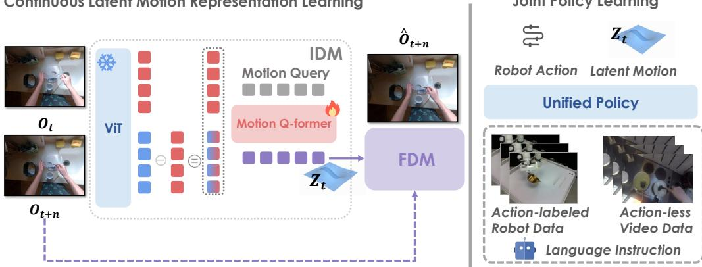
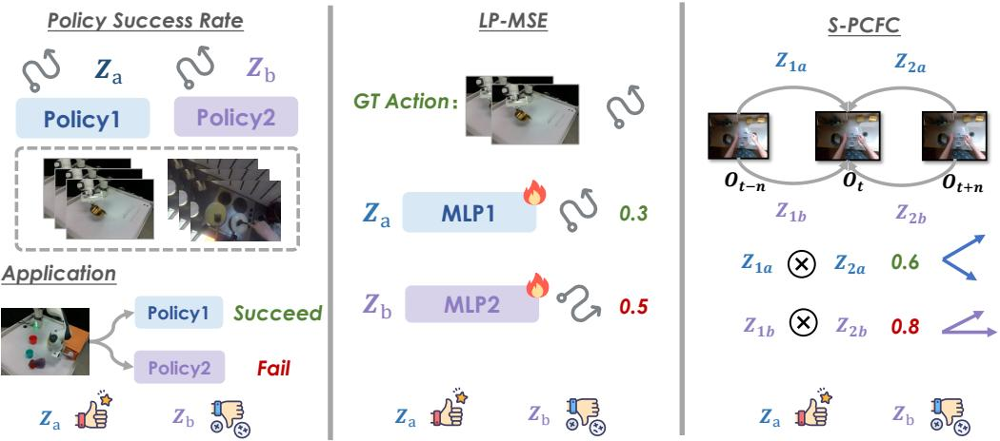
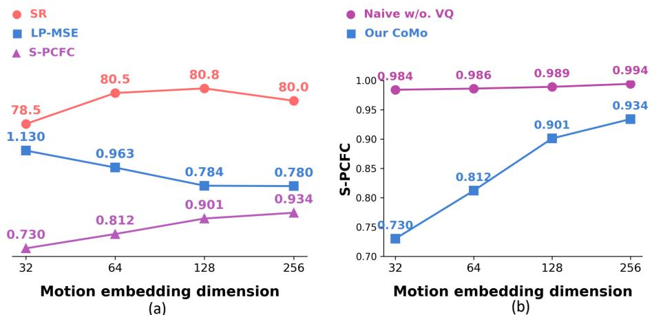
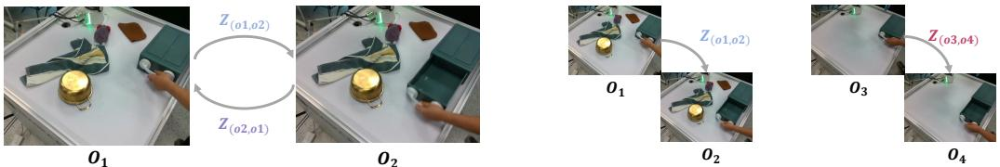
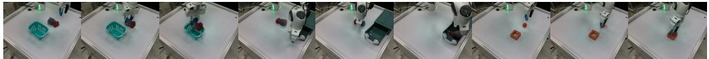
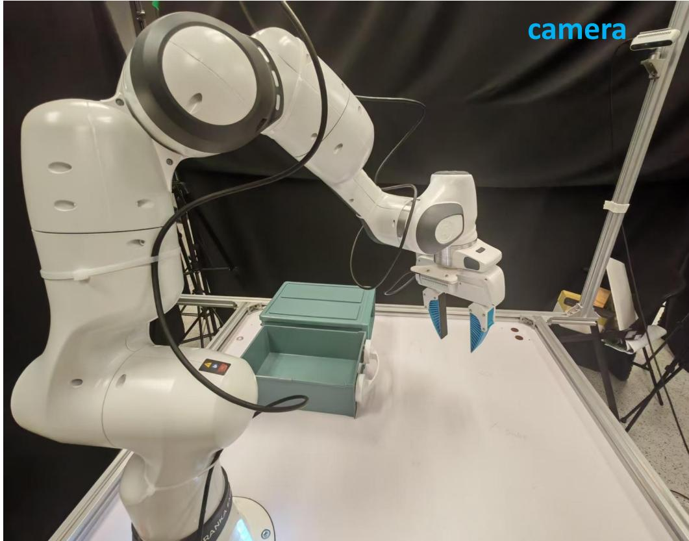
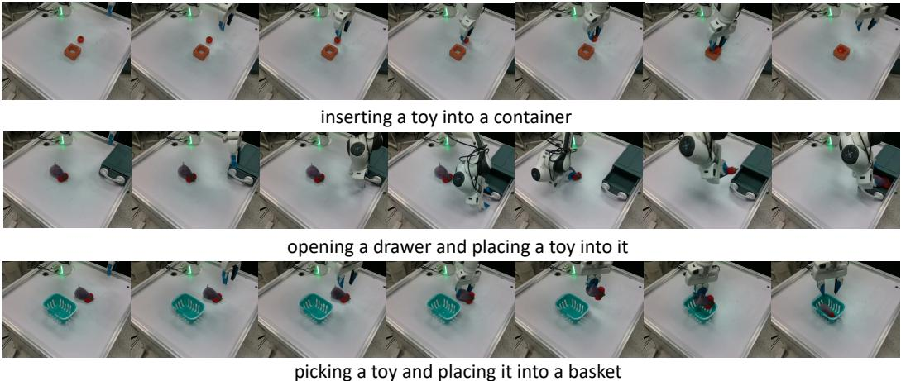

# CoMo：从互联网视频中学习连续潜在运动以实现可扩展的机器人学习

吉昂 $\mathbf { Y a n g ^ { 1 , 2 } }$ 颜松 $\mathbf { S h i ^ { 2 , 3 } }$ 郝怡 $\mathbf { Z } \mathbf { h } \mathbf { u } ^ { 2 , 3 }$ 明宇 刘2,4 开景 $\mathbf { M } \mathbf { a } ^ { 2 , 5 }$ 雅婷 王2,6 刚山 $\mathbf { W } \mathbf { u } ^ { 1 }$ 桐 $\mathbf { H e } ^ { 2 }$ 吕敏 王1,2\* 1南京大学, 2上海人工智能实验室 3中国科学技术大学, 4浙江大学 $^ { 5 } \mathrm { X i } ^ { \cdot }$ 交通大学, 6同济大学

# 摘要

从互联网视频学习潜在运动对于构建通用机器人至关重要。然而，现有的离散潜在动作方法存在信息丢失的问题，并且难以应对复杂且细致的动态。我们提出了CoMo，旨在从多样化的互联网规模视频中学习更具信息量的连续运动表示。CoMo采用早期时间特征差异机制，以防止模型崩溃并抑制静态外观噪声，有效避免了快速学习问题。此外，在信息瓶颈原理的指导下，我们限制潜在运动嵌入的维度，以在保留足够的与动作相关的信息与最小化与动作无关的外观噪声之间实现更好的平衡。此外，我们还引入了两个新的指标，以更稳健且经济地评估运动并指导运动学习方法的发展：（i）动作预测的线性探测均方误差，和（ii）过去到当前与未来到当前运动嵌入之间的余弦相似度。关键是，CoMo展现出强大的零-shot泛化能力，使其能够为以前未见过的视频领域生成连续的伪动作。这一能力促进了使用来自各种无动作视频数据集（如跨载体视频及尤其是人类示范视频）派生的伪动作进行的统一策略联合学习，可能与有限的标记机器人数据相结合。大量实验证明，与CoMo伪动作共同训练的策略在模拟和现实世界场景中在扩散和自回归架构下均表现出优越的性能。

# 1 引言

大规模互联网数据在计算机视觉和自然语言处理中的变革性影响促成了具有令人印象深刻的零-shot转移能力的通用模型。然而，机器人学习传统上受到数据稀缺、有限的多样性和高度异质性的限制。为了在机器人领域实现有效的扩展，一个有前景的方向是利用来自多种来源（包括互联网和人类示范）的丰富无动作视频数据。因此，最近的一个范式专注于从这些广泛的视频数据集中学习潜在的动作模型。这些方法通常采用在自监督框架中使用视频帧对的逆动力学编码器-前向动力学解码器架构。具体来说，它们通常使用矢量量化变分自编码器（VQ-VAE）目标对学习的运动表示进行量化，以生成未标记视频数据的伪动作标签。然而，现实世界中的运动（动作）本质上是连续的，具有复杂、细粒度且往往不确定的动力学。用离散的潜在动作表示这样的运动不可避免地会导致信息损失，并限制其对新运动模式的泛化。此外，底层的矢量量化技术往往会引入训练不稳定性，并面临可扩展性挑战。来自视觉生成和机器人学习的证据也表明，连续表示可以产生更优的性能。这引发了一个自然的问题：我们能否从无动作视频中学习连续的运动表示？以往工作偏好离散的潜在动作，通常使用小的码本（例如，具有代表性的工作LAPA使用了8），关键原因在于避免一个重大挑战：模型坍缩。在尝试直接学习连续运动时，模型非常容易受到“捷径学习”的影响。具体来说，编码器可能会优先捕捉未来帧的视觉外观，以便解码器重建像素，而非隔离底层的运动动态。这使得模型退化为一个未来帧预测器，削弱了其作为适合共同训练鲁棒机器人策略的动作预测机制的效用。为了解决这一核心问题，我们的工作CoMo引入了一种早期时间特征差异策略，灵感来源于动作识别中的时间差异网络。具体而言，我们去除了未来帧特征的直接编码，并在编码器输入前用当前帧和未来帧之间的特征差异进行替换，这有助于抑制静态外观信息，同时增强动态运动线索。这一设计显著提高了训练稳定性，并减轻了上述模型坍缩的问题。此外，为了确保这些学习到的连续运动表示能够作为有效且稳健的伪动作，进行统一的机器人数据联合训练，我们根据信息瓶颈原理仔细确定了适当的嵌入维度，寻求在捕捉足够运动细节和最小化背景噪声之间的平衡。

此外，评估学习得到的潜在运动质量面临独特的挑战。传统的重建误差指标存在局限，因为模型可能通过单纯编码未来的视觉外观而实现低误差——这是一种捷径学习形式，可能导致模型崩溃——而非捕捉潜在的运动动态。当目标是学习用于策略训练的潜在动作时，这尤其成问题。此外，纯策略成功率面临显著的资源成本和潜在的不稳定性。为了应对这一问题并实现对学习到的运动表征的更稳健且低成本的评估，我们引入了两个新的可复现指标：(i) 动作预测的线性探测均方误差（LP-MSE）。该指标评估学习到的运动嵌入中的动作相关信息。我们训练线性探测器使用这些嵌入预测真实动作并报告均方误差（MSE）。较低的MSE表示更丰富的特定动作内容。(ii) 过去到当前与未来到当前运动之间的余弦相似度（S-PCFC）。该指标量化了不良的静态、与动作无关的外观信息的保留。它测量的是相对于中心帧 $z { \big ( } o _ { t - n } , o _ { t } { \big ) }$（过去到当前）和 $z ( o _ { t + n } , o _ { t } )$（未来到当前）从时间上对称段生成的运动嵌入之间的相似度。高相似度表明静态上下文掩盖了定向运动，因此，较低的值更为理想。最后，CoMo能够为无动作的视频数据生成连续的伪动作标签。这一机制实现了丰富增强的伪标注视频数据与较小规模、传统标注的机器人动作数据的无缝结合。因此，共享的连续分布实现了策略模型的统一联合训练，避免了复杂的多阶段预训练和微调过程（如[75]所述）或显式的行动前规划管道（如[13]所述）。最后，大量的仿真和现实世界实验证明了我们提出的指标在指导运动学习方法发展中的有效性，并验证了使用CoMo提取的伪动作标签训练的策略有效减轻了模型崩溃，并在性能上优于那些使用离散潜在运动或简单连续变体的策略。总结而言，我们的主要贡献如下：• 我们提出了CoMo，用于从互联网视频中无监督学习更具信息性连续潜在运动表征，具有简单而有效的早期时间差机制，以防止模型崩溃并确保有意义的运动捕捉。• 我们引入了两个新的可复现指标，LP-MSE和S-PCFC，以实现对学习到的运动表征质量的更稳健、全面、低成本和针对性的评估。• 我们使用CoMo从多样的无动作视频生成连续的伪动作标签，使得在不同数据源间实现统一机器人策略的简单和无缝联合学习成为可能。• 大量的仿真和现实世界实验证明了使用CoMo提取的伪动作标签训练的策略的优越性能，包括扩散基础和自回归方法。

  

Figure 1: The CoMo framework. In the first stage, we self-supervisely learn inter-frame latent motion representations from Internet videos. In the second stage, we directly utilize the IDM trained in the first stage to extract pseudo action labels for action-less video data, ensuring joint learning of continuous robot action data and action-less video data under a unified policy architecture.

# 2 相关工作

从互联网数据学习机器人操控。机器人学习的可扩展性受到稀缺、有限多样性和异质性机器人数据的限制。通过大规模、无动作的互联网数据进行增强，为传授技能和物理基础知识提供了一条途径，从而提高机器人操控系统的泛化能力和数据效率。现有的方法通过视频数据预测信号，既可以作为隐式辅助任务以改善学习，也可以作为明确的策略执行指导。这些信号包括未来的视觉观测、可供性、物体掩膜、光流、人手姿态、奖励值、稀疏点轨迹，以及三维/四维表示。最近一种流行的框架利用无监督的VQ-VAE目标的逆动力学编码器-正动力学解码器架构，从无动作视频中提取离散潜在动作。这些潜在动作随后用于训练自回归视觉-语言-动作（VLA）策略，这些策略可以进行微调或用作真实机器人动作的潜在规划者。

机器人操控策略架构。早期的机器人操控研究集中在基于状态的强化学习上，而更近的方法利用视觉观察进行模仿学习。许多这些视觉模仿方法使用生成概率建模以捕捉复杂的多模态动作分布。在这些方法中，一些采用基于自回归的策略架构，受益于预训练的视觉-语言模型（VLMs）的泛化能力，但需要对机器人动作进行离散化。相对而言，其他方法则使用基于扩散的策略架构直接生成连续的机器人动作。有些方法还探索了基于点云的3D策略架构。近期研究表明，连续动作表示能够实现更细粒度的行为建模，通常能够获得更好的性能。因此，许多先进的方法结合了自回归的VLM主干和基于扩散的动作专家，从而同时受益于预训练的VLMs的强泛化能力和连续动作表示的表达能力。在此基础上，CoMo可以利用统一的策略架构共同学习连续的机器人动作和视频运动生成。

# 3 方法

# 3.1 使用时间特征差异学习连续潜在运动

我们首先描述我们学习连续潜在运动表示的 CoMo 框架。我们的 CoMo 采用标准的逆动力学编码器-前向动力学解码器范式，如图 1 左侧所示。随后，我们分别详细介绍增强运动的逆动力学编码器和前向动力学解码器的技术细节。

  

Figure 2: The Metrics for evaluating the quality of latent motion representations. Better latent motion representations typically lead to higher policy success rate and lower LP-MSE and S-PCFC.

运动增强逆动力学模型（ME-IDM）。我们的ME-IDM旨在提取时间敏感和背景无关的连续运动信息。给定当前帧$O _ { t }$和未来帧$O _ { t + n }$，我们使用共享的MAE [27]预训练的ViT [20]提取它们各自的词元级特征$F _ { t }$和$F _ { t + n }$。随后，为了增强运动线索并抑制静态背景，我们在$F _ { t }$和$F _ { t + n }$之间进行早期时间差操作，以获得词元级时间特征差异$D _ { t }$。为了进一步缓解在学习连续运动表示时的捷径学习问题，我们在编码器提取运动嵌入之前显式地移除未来帧特征$F _ { t + n }$。具体而言，我们仅将当前帧特征$F _ { t }$和时间特征差异$D _ { t }$进行拼接，形成组合表示$[ F _ { t } , D _ { t } ]$。随后，按照Moto-GPT [16]的方法，我们将一组可学习的查询嵌入与这种词元级组合表示拼接，并在标准多层Transformer层内进行全注意力交互（运动Q形式）。然后，我们从Transformer层的输出中提取查询特征作为我们的运动表示$Z _ { t }$。前向动力学模型（FDM）。基于从IDM获得的潜在运动表示$Z _ { t }$和当前帧视觉观察$O _ { t }$，前向动力学解码器旨在重建未来帧观察$O _ { t + n }$。具体而言，我们首先使用线性补丁嵌入层获取$O _ { t }$的低级补丁级嵌入。同时，我们进一步进行池化操作，以压缩运动表示$Z _ { t }$，然后将池化的运动特征添加到$O _ { t }$的低级补丁级嵌入中，得到$E ( O _ { t } , Z _ { t } )$。随后，若干个Transformer层处理组合特征。最后，输出特征通过卷积层处理得到$\hat { O } _ { t + n }$。CoMo框架通过联合最小化加权重建损失和感知损失进行训练，以确保预测未来帧的像素级准确性和感知保真度。

# 3.2 联合策略学习

在图1右侧所示的第一阶段IDM训练完成后，我们开始在统一策略模型中对无动作视频数据和连续机器人动作数据进行联合学习。具体而言，给定一个带动作标记的机器人数据集 $\mathcal { D } _ { R } = \{ \tau _ { 1 } , . . . , \tau _ { n } \}$，其中每个 $\tau _ { i }$ 代表一条包含配对的机器人观测和动作的轨迹，表示为 $\tau _ { i } =$ $[ ( o _ { 0 } , \dot { a } _ { 0 } ) , \dots , ( o _ { T } , \dot { a } _ { T } ) ]$，以及一个更大规模的无动作视频数据 $\scriptstyle { \mathcal { D } } _ { V }$，我们利用训练好的IDM为 $\scriptstyle { \mathcal { D } } _ { V }$ 提取连续的潜在运动嵌入。因此，$\scriptstyle { \mathcal { D } } _ { V }$ 中的每条轨迹可以增强为 $[ \big ( o _ { 0 } , z _ { 0 } \big ) , \dots , \big ( o _ { T } , z _ { T } \big ) ]$，其中 $z _ { t }$ 表示IDM在时间步 $t$ 推断的潜在运动。由于 $a$ 和 $z$ 都表现出连续的数据分布，我们可以无缝地使用组合数据集 $\mathcal { D } _ { R } \cup \mathcal { D } _ { V }$ 在统一生成策略模型中进行联合模仿学习。利用更大规模的数据集源的能力使我们的CoMo能够提供可扩展的机器人学习范式。在本研究中，我们开发了统一扩散基策略模型和自回归策略模型。更多细节可在实验部分和补充材料中找到。

# 3.3 LP-MSE 和 S-PCFC 指标

考虑到策略成功率可能受到许多其他因素的影响，包括高计算和数据成本，我们提出了两种可重复的指标，以更稳健、全面和经济的方式评估连续潜在运动表示的质量，如图 2 所示。动作预测的线性探测均方误差（LP-MSE）。给定一个带有动作标签的机器人数据集 $\scriptstyle { \mathcal { D } } _ { R }$，我们使用在第一阶段训练的 IDM 以离线方式直接提取每个时间步的潜在运动嵌入，从而生成潜在运动数据集 $\scriptstyle { \mathcal { D } } _ { Z }$。按照表示学习中广泛使用的标准线性探测 [2] 评估协议，我们训练一个线性 MLP，将潜在运动嵌入映射到相应的真实机器人动作，并报告预测结果的均方误差。这个过程可以正式描述如下：

$$
\begin{array} { c } { \hat { a } _ { t } = \mathbf { M L P } ( z _ { t } ) , } \\ { \mathbf { L P } \mathbf { - M S E } ( t ) = \mathbf { M S E } ( a _ { t } , \hat { a } _ { t } ) . } \end{array}
$$

过去到当前与未来到当前的运动之间的余弦相似度（S-PCFC）。虽然 LPMSE 可以部分反映学习到的潜在运动表示捕捉细粒度机器人运动的能力，但它仅在相同的潜在维度下适用于公平比较。从信息瓶颈的角度来看，潜在运动理想情况下应包含最小的与动作无关的噪声，例如静态背景信息。然而，LP-MSE 不能全面和公平地评估这一属性，尤其是在比较不同维度的运动表示时。因此，我们进一步提出了 S-PCFC 度量。具体而言，给定一个从视频片段中抽取的帧三元组 $\langle o _ { t - n } , o _ { t } , o _ { t + n } \rangle$，我们提取过去到当前的运动表示 $z { \big ( } o _ { t - n } , o _ { t } { \big ) }$ 和未来到当前的运动表示 $z ( o _ { t + n } , o _ { t } )$。然后，我们计算这两个表示之间的余弦相似度，其正式定义如下：

$$
\operatorname { S - P C F C } ( t ) = { \frac { z { \big ( } o _ { t - n } , o _ { t } { \big ) } ^ { \top } z { \big ( } o _ { t + n } , o _ { t } { \big ) } } { \left\| z { \big ( } o _ { t - n } , o _ { t } { \big ) } \right\| _ { 2 } \left\| z { \big ( } o _ { t + n } , o _ { t } { \big ) } \right\| _ { 2 } } } .
$$

值得注意的是，如果将未来帧的视觉特征直接用作连续的潜在运动，则 S-PCFC 值将为 1.0。这表明 S-PCFC 可以有效衡量潜在运动表征训练过程中的快捷学习程度。因此，当从大数据集中统计获得较低的 S-PCFC 值，并且保持在合理范围内时，通常表明运动表征的质量更高。

# 4 实验

我们使用LIBERO [42] 和 CLVIN [48] 基准进行实验，并使用Franka Emika Research 3机器人。我们的实验旨在研究以下问题：Q1：自监督的CoMo能否为没有动作的视频数据提取有效的伪动作标签，并使机器人数据的统一联合训练得以实现，从而提高策略性能？Q2：CoMo提取的潜在运动是否优于视频中的其他无监督预测信号？Q3：CoMo提取的连续潜在运动表示是否有效缓解模型崩溃，并且优于离散潜在动作和简单连续变体？Q4：CoMo提取的连续潜在运动嵌入维度是否易于扩展？

# 4.1 仿真实验

# 4.1.1 仿真基准和设置

在本节中，我们描述了在两个模拟基准上进行潜在运动学习与评估，以及统一策略学习与评估的实验设置。有关 CoMo 的架构细节和训练超参数，以及策略模型的架构、训练过程和评估协议的全面信息，请参见补充材料。

LIBERO。LIBERO [42] 被划分为五个类别：LIBERO-空间，LIBERO-物体，LIBERO-目标，LIBERO-长，以及 LIBERO-90。LIBERO-90 包含 90 个任务，而其他类别各包含 10 个任务。在我们的 LIBERO 实验中，我们为伪动作标签提取训练了两个 CoMo 模型。我们首先使用整个领域内的 LIBERO 数据集进行消融研究，该数据集包含来自两个相机视角的 13,000 个视频，涵盖 130 个任务。然后，为了评估 CoMo 的零-shot 跨领域转移能力，我们在互联网上共同训练该模型，通过均匀采样从 SAM-V [57]、EgoVid [66] 和 Droid [33] 中选取 120,000 个视频，这些视频涵盖了真实场景、以自我为中心的人类和机器人场景。关于统一策略的联合训练，我们采用 ATM [68] 的数据配置，其中每个任务提供 10 条机器人轨迹和 40 条视频轨迹，这些轨迹的伪动作标签由 CoMo 生成。关于策略架构，遵循之前的方法 [17, 45]，我们实现了一种基于扩散的策略，在真实机器人动作空间和连续潜在运动空间内进行联合去噪过程。对于策略评估，我们使用最终的训练轮次模型，并对每个任务进行 20 次试验，重复评估三遍以报告均值和标准偏差。此外，为了确保潜在运动表示学习的消融分析更加稳健和全面，我们进一步报告了 LP-MSE 和 S-PCFC 的结果。这些结果是从跨越四个 LIBERO 套件（LIBERO-空间、LIBERO-物体、LIBERO-目标、LIBERO-长）的 40 个任务中聚合的 2,000 个视频中得出的。

Table 1: The ablation experiments results on the LIBERO benchmark.   

<table><tr><td></td><td>Metric</td><td>O2-Fea</td><td>w/o. VQ</td><td>Pre-VQ</td><td>RGB-Diff</td><td>Fea-Diff (Ours)</td></tr><tr><td>Spatial</td><td>Success Rate ↑ LP-MSE ↓ S-PCFC ↓</td><td>81.0±3.0 1.208</td><td>81.7±1.2 1.189</td><td>76.0±0.8 3.055</td><td>82.7±4.1 0.891</td><td>80.3±1.2 0.881</td></tr><tr><td>Object</td><td>Success Rate ↑ LP-MSE ↓ S-PCFC ↓</td><td>1.000 95.7±0.5 0.896</td><td>0.988 93.0±2.2 0.865</td><td>0.821 89.3±1.2 2.363</td><td>0.786 92.3±1.2 0.604</td><td>0.892 95.0±0.0 0.662</td></tr><tr><td>Goal</td><td>Success Rate ↑ LP-MSE ↓ S-PCFC ↓</td><td>1.000 78.3±1.7 1.101 1.000</td><td>0.992 89.0±2.4 1.077 0.989</td><td>0.810 74.7±0.5 3.038 0.796</td><td>0.810 85.0±2.4 0.921</td><td>0.902 85.0±2.2 0.839</td></tr><tr><td>Long</td><td>Success Rate ↑ LP-MSE ↓ S-PCFC ↓</td><td>47.7±3.3 1.123 1.000</td><td>47.0±1.6 0.927 0.988</td><td>54.3±0.5 3.412 0.810</td><td>59.0±5.1 0.949 0.899</td><td>63.0±1.6 0.754 0.910</td></tr><tr><td>Avg.</td><td>Success Rate ↑ LP-MSE ↓ S-PCFC ↓</td><td>75.7 1.082 1.0</td><td>77.7 1.015 0.989</td><td>73.6 2.967 0.810</td><td>79.8 0.841</td><td>80.8 0.784 0.901</td></tr></table>

Table 2: The comparison results with other methods on the LIBERO benchmark. The $^ *$ indicates that we report the original paper results.   

<table><tr><td></td><td>Spatial</td><td>Object</td><td>Goal</td><td>Long</td><td>Avg.</td></tr><tr><td>DP (5× data)</td><td>92.0±3.3</td><td>96.3±0.9</td><td>93.0±2.2</td><td>75.3±2.0</td><td>89.2</td></tr><tr><td>DP</td><td>72.3±2.5</td><td>82.3±0.5</td><td>70.3±0.5</td><td>56.7±3.0</td><td>70.4</td></tr><tr><td>Diffusion-ATM* [68]</td><td>79.0±3.7</td><td>81.0±2.5</td><td>58.7±4.6</td><td>44.0±6.4</td><td>65.7</td></tr><tr><td>DP + GR2-like [14]</td><td>81.0±3.0</td><td>95.7±0.5</td><td>78.3±1.7</td><td>47.7±3.3</td><td>75.7</td></tr><tr><td>DP + CoMo</td><td>80.3±1.2</td><td>95.0±0.0</td><td>85.0±2.2</td><td>63.0±1.6</td><td>80.8</td></tr></table>

CALVIN。CALVIN基准建立在Franka Emika Panda机器人平台之上，旨在评估根据开放式语言指令完成长期任务。在每次试验中，机器人需要依次完成五个任务。该基准包括四个不同的环境（A、B、C、D），每个环境都有独特的物体布局和纹理，允许对泛化能力进行全面评估。我们在最具挑战性的ABC $\mathbf{D}$环境下进行实验，在环境A、B和C上进行训练，在D环境上进行评估。根据Moto-GPT的设置，我们使用环境A、B和C中所有无动作视频训练CoMo，并用$35\%$数据（包括$1.8\mathrm{k}$轨迹视频）及语言注释进行统一策略联合训练。在策略架构方面，为了在统一的自回归策略框架下联合预测连续的机器人动作和潜在运动，按照文献[16, 34]的做法，我们在自回归解码器的最后隐藏状态后添加两个额外的多层感知机网络，以联合预测机器人动作和潜在运动。关于策略评估，我们选择最后三轮的结果，并报告成功率的均值和标准差。

Table 3: The experiment results on the CALVIN benchmark.   

<table><tr><td></td><td>1</td><td>2</td><td>3</td><td>4</td><td>5</td><td>Avg. Len.</td></tr><tr><td>w/o. Motion</td><td>0.814±0.016</td><td>0.586±0.029</td><td>0.412±0.030</td><td>0.294±0.033</td><td>0.200±0.024</td><td>2.306±0.119</td></tr><tr><td>VQ</td><td>0.793±0.024</td><td>0.586±0.031</td><td>0.424±0.025</td><td>0.311±0.020</td><td>0.217±0.019</td><td>2.331±0.084</td></tr><tr><td>w/o. VQ</td><td>0.828±0.013</td><td>0.637±0.013</td><td>0.481±0.016</td><td>0.387±0.020</td><td>0.299±0.024</td><td>2.632±0.148</td></tr><tr><td>RGB-Diff</td><td>0.815±0.022</td><td>0.628±0.037</td><td>0.475±0.025</td><td>0.375±0.031</td><td>0.285±0.034</td><td>2.577±0.184</td></tr><tr><td>Fea-Diff</td><td>0.854±0.021</td><td>0.684±0.039</td><td>0.538±0.044</td><td>0.438±0.041</td><td>0.334±0.043</td><td>2.848±0.129</td></tr></table>

# 4.1.2 仿真实验结果与分析

为了全面探索不同的潜在运动表示学习方法，我们设计并实现了五个主要的消融变体：O2-Fea（将未来视觉特征作为潜在运动）、w/o. VQ（通过简单地移除向量量化获得的连续潜在运动）、vQ（通过应用向量量化获得的离散潜在运动，遵循之前的研究）、RGB-Diff（移除向量量化并使用RGB差异来抑制静态背景噪声）以及Fea-Diff（我们的CoMo）（移除向量量化并使用特征差异来抑制静态背景噪声）。关于VQ，考虑到扩散中的连续数据分布假设，以及遵循GR00T，我们利用预量化的嵌入作为扩散基础策略中的潜在运动，称为Pre-VQ。尽管这些嵌入是连续的，但训练期间施加的承诺损失促使它们近似离散分布。在我们的实验中，VQ和Pre-VQ均采用了大小为128的代码表。随后，我们呈现经验模拟结果来解决上述问题，并得出以下发现：结果1：表2中的结果表明，将通过CoMo提取的伪动作标签与额外的不带动作数据结合纳入扩散基础策略结构，可以将LIBERO上的平均成功率从70.4%提高到80.8%。与此同时，表3中的结果显示，我们的方法也可以将CLVIN的性能从2.306提高到2.848。发现1：CoMo能够为无动作视频数据提供有效且连续的伪动作标签，从而无缝地构建一个可以与无动作视频数据和连续机器人动作数据共同训练的统一策略架构。融合更丰富的数据源的能力使得策略性能更强大，使CoMo成为一个更具可扩展性和有效性的机器人学习范式。结果如表所示，我们提出了一种基于扩散的基线方法，用于联合预测机器人动作和未来帧视觉特征，称为$\mathsf { D P } + \mathsf { G R } 2$-like（这相当于O2-Fea）。结果表明，我们的CoMo在性能上提高了5.1（从75.7%提高到80.8%）。发现2：在视频数据的无监督预测信号比较中，由CoMo提取的连续潜在运动优于具有相同维度的未来帧视觉特征。

结果 3：我们强调以下结果：(i) 策略成功率：如表 1 所示，对于基于扩散的策略架构，CoMo 实现了平均成功率为 $8 0 . 8 \%$ ，始终优于其他所有方法。特别是，它比 Pre-VQ 提高了显著的 7.2（从 $7 3 . 6 \%$ 提升至 $8 0 . 8 \%$）。此外，表 4 的结果表明，当 CoMo 在更大规模的、超出领域的互联网视频上训练时，这一结论依然有效，政策成功率更是提高至 $8 1 . 8 \%$（从 $8 0 . 8 \%$ 到 $8 1 . 8 \%$）。与此同时，如表 3 所示，CoMo 在基于自回归的策略架构中也达到了最高性能。与使用离散潜在运动相比，结果从 2.331 提升至 2.848。(ii) LP-MSE：表 1 的结果还表明，CoMo 在 LP-MSE 指标上取得了最佳性能，相较于 Pre-VQ 具有显著优势（0.784 对比 2.967）。同样，表 4 的结果进一步表明，当训练扩展至互联网视频数据时这一结论依然成立。(iii) S-PCFC：对于 S-PCFC，表 1 和表 4 的结果共同显示，无论是在域数据还是超出域的互联网视频数据用于训练，离散潜在运动均实现了最佳性能。对于其他方法，简单地去除 VQ 仅达到接近 1.0 的结果（0.989）。在采用时间差机制进行静态背景抑制时，RGB 差异在域数据上表现更佳（0.814 对比 0.901），而特征差异在超出域的互联网视频数据上表现更好（0.873 对比 0.851）。

  

Figure 3: The latent motion embedding dimension scaling line chart. (a) Our CoMo achieves the highest success rate when the motion dimension is 128 (the better balance between LP-MSE and S-PCFC). (b) Our CoMo obtains a lower S-PCFC as the motion dimension decreases, whereas simply removing vector quantization does not (with severe shortcut learning problem).

发现三：根据以上结果，我们得出了以下发现和分析：（i）尽管提取离散潜在运动并明确施加向量量化约束可以有效缓解快捷学习问题，但这种方法会导致显著的信息损失。因此，被提取的运动难以捕捉机器人的细微操作和运动。因此，从无动作视频数据中提取更具信息量的连续潜在运动是更可取的。这不仅允许与连续机器人动作数据无缝集成，以在统一的基于扩散或自回归的策略架构内进行联合训练，还能带来更优越的策略性能。（ii）仅仅去除向量量化会导致严重的快捷学习问题，模型往往通过直接学习未来帧的视觉特征作为连续潜在运动而崩溃。相比之下，采用时间差分机制可以有效缓解这个问题。如图3(b)所示，对于CoMo，逐渐降低运动嵌入的维度有效降低了S-PCFC，而简单的无VQ方法则未能达到相同效果。关于RGB差分和特征差分的选择，前者更有效放大低级运动信号，但可能会干扰更抽象和复杂的运动信息。因此，在应用于更大规模的互联网视频数据时，特征差分表现出更好的可扩展性。（ii）在大规模互联网视频上训练的CoMo展现出强大的推广能力，能够直接零-shot转移到机器人场景中，生成连续伪动作标签而无需微调。此外，真实世界数据中更复杂的运动模式可以进一步缓解快捷学习问题（S-PCFC可以从0.901减少到0.851），从而提升策略性能（从$80.8\%$提升至$81.8\%$）。结果四：如图3(a)所示，增加潜在运动嵌入的维度最初会提高策略成功率，但进一步扩展将导致下降。这一趋势与之前研究中报告的观察结果[75]有所不同。值得注意的是，在逐步增加运动维度的过程中，S-PCFC显著改善（从0.730提高到0.940），而LPMSE指标在后期阶段保持相对稳定。例如，当运动维度从128增加到256时，LP-MSE仅略微下降，从0.784减少到0.780。

Table 4: The LIBERO experiment results of CoMo trained on larger-scale Internet videos without any fine-tuning.   

<table><tr><td></td><td colspan="2">| S.R. ↑ LP-MSE ↓ S-PCFC ↓</td></tr><tr><td>w/o. VQ</td><td>77.2</td><td>1.368 0.895</td></tr><tr><td>Pre-VQ</td><td>78.7</td><td>2.226 0.405</td></tr><tr><td>RGB-Diff</td><td>80.6 1.291</td><td>0.873</td></tr><tr><td>Fea-Diff (Ours)</td><td>81.8 1.177</td><td>0.851</td></tr></table>

结果发现：上述结果表明，连续潜在运动表示不能简单地进行扩展。从信息瓶颈理论的角度来看，增加运动嵌入的维度可能会促使模型提取更多静态外观信息。对于固定策略模型容量而言，这对低维机器人动作和潜在运动的联合预测是不利的。LP-MSE 和 S-PCFC 指标的变化进一步证实了这一点：尽管增加运动维度可能捕获更为全面的运动信息，但同时引入额外的背景噪声也会妨碍准确的动作回归。因此，在本研究中，我们将潜在运动表示的维度固定为 128。这确保模型在学习更具信息量的运动线索与减少静态非运动背景信息之间取得更好的平衡。

  

Figure 4: The Latent Motion. We report the cosine similarity of latent motion from action-less human videos, comparing time-reversed actions in the same environment (left) and consistent actions in different environments (right). The latter shows higher cosine similarity values than the former.

  

Figure 5: The Real-world task illustrations.

# 4.2 现实世界实验

Table 5: Real-world experiments.   

<table><tr><td></td><td>Pick Open</td><td>Insert</td></tr><tr><td>w/o. human videos</td><td>60.0 15.0</td><td>20.0</td></tr><tr><td>Pre-VQ</td><td>65.0 25.0</td><td>15.0</td></tr><tr><td>CoMo</td><td>75.0 30.0</td><td>25.0</td></tr></table>

真实世界设置。在现实世界的实验中，我们旨在验证训练于网络视频的 CoMo 是否能够直接从人类视频中提取隐含运动，以作为有效的伪动作标签。具体而言，我们利用 Franka 机器人执行三项任务：挑选一个玩具并放入篮子，打开抽屉并将玩具放入抽屉中，以及将玩具插入容器，如图 5 所示。对于每个任务，我们使用 20 个遥控轨迹和 20 个人类操作视频，其中我们通过在互联网视频上训练 CoMo 为后者构建伪动作标签。然后，我们使用这两个数据集训练一个统一的基于扩散的策略，并利用 20 次推演评估每个任务，结果见表 5。真实世界的结果与分析。结果证明 CoMo 有效促进了人类视频与带动作标签的机器人数据的联合学习，从而提升了策略性能，并且优于离散隐含运动方法。如图 4 所示，我们的 CoMo 学习到的隐含运动具有重要意义，能够对背景变化保持鲁棒性，具有时间敏感性，并且以技能为中心。因此，CoMo 可以为多样化的实施构建统一的动作表示，促进可扩展的跨实施学习。

# 5 结论

我们提出了CoMo，这是一个从互联网视频中进行连续潜在运动自监督学习的框架。通过使用简单的时间特征差异来替代编码器输入之前的未来帧特征，CoMo有效地缓解了捷径学习问题，从而使得为无动作视频数据构建有效的伪动作标签成为可能。这无缝地促进了在统一策略架构内对连续机器人动作和潜在运动的联合学习。此外，我们提出了LP-MSE和S-PCFC指标，以实现对运动表示质量的更强健且低成本的评估。大量实验结果证明了我们CoMo的有效性。

# 6 限制与讨论

尽管进行了广泛的模拟和真实世界实验，验证了 CoMo 在无动作视频中提取伪动作标签的有效性和通用性，并展示了其优于离散潜在运动和简单的连续变体，但仍然存在一些挑战和未来工作。如表 2 中的结果所示（89.2 vs. 80.8），潜在运动与实际机器人动作之间仍然存在差距。一个潜在的未来工作是引入额外的时间监督，以获得更具时间敏感性和技能中心的运动表示，欢迎在未来的研究中进行探讨。此外，我们希望我们提出的低成本且稳健的 LP-MSE 和 S-PCFC 指标将进一步促进该方向的探索和研究。

参考文献 [1] Josh Achiam, Steven Adler, Sandhini Agarwal, Lama Ahmad, Ilge Akkaya, Florencia Leoni Aleman, Diogo Almeida, Janko Altenschmidt, Sam Altman, Shyamal Anadkat 等. Gpt-4 技术报告. arXiv 预印本 arXiv:2303.08774, 2023. [2] Guillaume Alain 和 Yoshua Bengio. 使用线性分类器探针理解中间层. arXiv 预印本 arXiv:1610.01644, 2016. [3] OpenAI: Marcin Andrychowicz, Bowen Baker, Maciek Chociej, Rafal Jozefowicz, Bob McGrew, Jakub Pachocki, Arthur Petron, Matthias Plappert, Glenn Powell, Alex Ray 等. 学习灵巧的手内操控. IJRR, 39(1):320, 2020. [4] Shikhar Bahl, Russell Mendonca, Lili Chen, Unnat Jain 和 Deepak Pathak. 从人类视频中获得的功能作为机器人技术的多功能表示. 在 CVPR 会议上, 页码 13778-13790, 2023. [5] Homanga Bharadhwaj, Debidatta Dwibedi, Abhinav Gupta, Shubham Tulsiani, Carl Doersch, Ted Xiao, Dhruv Shah, Fei Xia, Dorsa Sadigh 和 Sean Kirmani. Gen2act: 在新场景中生成人类视频以启用可泛化的机器人操控. arXiv 预印本 arXiv:2409.16283, 2024. [6] Homanga Bharadhwaj, Abhinav Gupta, Vikash Kumar 和 Shubham Tulsiani. 通过翻译人类交互计划实现可泛化的零-shot 操控. 在 ICRA 会议上, 页码 6904-6911. IEEE, 2024. [7] Homanga Bharadhwaj, Roozbeh Mottaghi, Abhinav Gupta 和 Shubham Tulsiani. Track2act: 从互联网视频中预测点轨迹以启用多样的零-shot 机器人操控. arXiv 电子预印本, 页码 arXiv2405, 2024. [8] Johan Bjorck, Fernando Castañeda, Nikita Cherniadev, Xingye Da, Runyu Ding, Linxi Fan, Yu Fang, Dieter Fox, Fengyuan Hu, Spencer Huang 等. Gr00t n1: 一种适用于通用人形机器人的开放基础模型. arXiv 预印本 arXiv:2503.14734, 2025. [9] Kevin Black, Noah Brown, Danny Driess, Adnan Esmail, Michael Equi, Chelsea Finn, Niccolo Fusai, Lachy Groom, Karol Hausman, Brian Ichter 等. "pio: 一种用于通用机器人控制的视觉-语言-动作流模型. arXiv 预印本 arXiv:2410.24164, 2024. [10] Anthony Brohan, Noah Brown, Justice Carbajal, Yevgen Chebotar, Xi Chen, Krzysztof Choromanski, Tianli Ding, Danny Driess, Avinava Dubey, Chelsea Finn 等. Rt-2: 视觉-语言-动作模型将网络知识转移到机器人控制. arXiv 预印本 arXiv:2307.15818, 2023. [11] Anthony Brohan, Noah Brown, Justice Carbajal, Yevgen Chebotar, Joseph Dabis, Chelsea Finn, Keerthana Gopalakrishnan, Karol Hausman, Alex Herzog, Jasmine Hsu 等. Rt-1: 适用于大规模现实世界控制的机器人变换器. arXiv 预印本 arXiv:2212.06817, 2022. [12] Jake Bruce, Michael D Dennis, Ashley Edwards, Jack Parker-Holder, Yuge Shi, Edward Hughes, Matthew Lai, Aditi Mavalankar, Richie Steigerwald, Chris Apps 等. Genie: 生成性交互环境. 在 ICML 会议上, 2024. [13] Qingwen Bu, Jisong Cai, Li Chen, Xiuqi Cui, Yan Ding, Siyuan Feng, Shenyuan Gao, Xindong He, Xu Huang, Shu Jiang 等. Agibot world colosseo: 一种用于可扩展和智能具身系统的大规模操控平台. arXiv 预印本 arXiv:2503.06669, 2025. [14] Chi-Lam Cheang, Guangzeng Chen, Ya Jing, Tao Kong, Hang Li, Yifeng Li, Yuxiao Liu, Hongtao Wu, Jiafeng Xu, Yichu Yang 等. Gr-2: 一种具有网络规模知识的生成视频-语言-动作模型，用于机器人操控. arXiv 预印本 arXiv:2410.06158, 2024. [15] Xiaoyu Chen, Junliang Guo, Tianyu He, Chuheng Zhang, Pushi Zhang, Derek Cathera Yang, Li Zhao 和 Jiang Bian. Igor: 图像-目标表示是具身 AI 基础模型的原子控制单元. arXiv 预印本 arXiv:2411.00785, 2024. [16] Yi Chen, Yuying Ge, Yizhuo Li, Yixiao Ge, Mingyu Ding, Ying Shan 和 Xihui Liu. Moto: 潜在运动标记作为机器人操控的桥接语言. arXiv 预印本 arXiv:2412.04445, 2024. [17] Cheng Chi, Zhenjia Xu, Siyuan Feng, Eric Cousineau, Yilun Du, Benjamin Burchfiel, Russ Tedrake 和 Shuran Song. 扩散策略: 通过动作扩散进行视觉运动策略学习. 国际机器人研究杂志, 页码 02783649241273668, 2023. [18] Cheng Chi, Zhenjia Xu, Chuer Pan, Eric Cousineau, Benjamin Burchfiel, Siyuan Feng, Russ Tedrake 和 Shuran Song. 通用操控接口: 在没有野外机器人情况下的现场机器人教学. arXiv 预印本 arXiv:2402.10329, 2024. [19] Jacob Devlin, Ming-Wei Chang, Kenton Lee 和 Kristina Toutanova. BERT: 用于语言理解的深度双向变换器的预训练. 在第 2019 届北美计算语言学协会会议: 人类语言技术的论文集, 第 1 卷 (长短论文), 页码 4171-4186, 2019. [20] Alexey Dosovitskiy, Lucas Beyer, Alexander Kolesnikov, Dirk Weissenborn, Xiaohua Zhai, Thomas Unterthiner, Mostafa Dehghani, Matthias Minderer, Georg Heigold, Sylvain Gelly 等. 一张图像价值 16x16 个词: 适用于大规模图像识别的变换器. 在国际学习表征大会, 2021. [21] Yilun Du, Sherry Yang, Bo Dai, Hanjun Dai, Ofir Nachum, Josh Tenenbaum, Dale Schuurmans 和 Pieter Abbeel. 通过文本引导的视频生成学习通用策略. NeurIPS, 36:9156-9172, 2023. [22] Lijie Fan, Tianhong Li, Siyang Qin, Yuanzhen Li, Chen Sun, Michael Rubinstein, Deqing Sun, Kaiming He 和 Yonglong Tian. Fluid: 使用连续标记扩展自回归文本到图像生成模型. arXiv 预印本 arXiv:2410.13863, 2024. [23] Linxi Fan, Guanzhi Wang, Yunfan Jiang, Ajay Mandlekar, Yuncong Yang, Haoyi Zhu, Andrew Tang, De-An Huang, Yuke Zhu 和 Anima Anandkumar. Minedojo: 构建具有互联网规模知识的开放式具身智能体, 2022. [24] Hao-Shu Fang, Hongjie Fang, Zhenyu Tang, Jirong Liu, Chenxi Wang, Junbo Wang, Haoyi Zhu 和 Cewu Lu. Rh20t: 用于学习多样技能的一次性全面机器人数据集. arXiv 预印本 arXiv:2307.00595, 2023. [25] Jiayuan Gu, Sean Kirmani, Paul Wohlhart, Yao Lu, Montserrat Gonzalez Arenas, Kanishka Rao, Wenhao Yu, Chuyuan Fu, Keerthana Gopalakrishnan, Zhuo Xu 等. Rt-trajectory: 通过事后轨迹草图实现机器人任务的泛化. 在 ICLR 会议上, 2024. [26] Haoran He, Chenjia Bai, Ling Pan, Weinan Zhang, Bin Zhao 和 Xuelong Li. 通过离散扩散进行大规模无动作视频预训练以实现高效的策略学习. arXiv 电子预印本, 页码 arXiv2402, 2024. [27] Kaiming He, Xinlei Chen, Saining Xie, Yanghao Li, Piotr Dollár 和 Ross Girshick. 掩蔽自编码器是可扩展的视觉学习者. 在 IEEE/CVF 计算机视觉与模式识别会议的论文集中, 页码 16000-16009, 2022. [28] Jonathan Ho, Ajay Jain 和 Pieter Abbeel. 去噪扩散概率模型. 神经信息处理系统进展, 33:6840-6851, 2020. [29] 物理智能, Kevin Black, Noah Brown, James Darpinian, Karan Dhabalia, Danny Driess, Adnan Esmail, Michael Equi, Chelsea Finn, Niccolo Fusai 等. "pi0.5: 一种具有开放世界泛化能力的视觉-语言-动作模型. arXiv 预印本 arXiv:2504.16054, 2025. [30] Eric Jang, Alex Irpan, Mohi Khansari, Daniel Kappler, Frederik Ebert, Corey Lynch, Sergey In CoRL, 页码 991-1002. PMLR, 2022. [31] Yueru Jia, Jiaming Liu, Sixiang Chen, Chenyang Gu, Zhilue Wang, Longzan Luo, Lily Lee, Pengwei Wang, Zhongyuan Wang, Renrui Zhang 等. Lift3d 基础策略: 提升 2D 大规模预训练模型以实现稳健的 3D 机器人操控. arXiv 预印本 arXiv:2411.18623, 2024. [32] Shirin Joshi, Sulabh Kumra 和 Ferat Sahin. 使用深度强化学习进行机器人抓取. 在 CASE 会议上, 页码 1461-1466. IEEE, 2020. [33] Alexander Khazatsky, Karl Pertsch, Suraj Nair, Ashwin Balakrishna, Sudeep Dasari, Siddharth Karamcheti, Soroush Nasiriany, Mohan Kumar Srirama, Lawrence Yunliang Chen, Kirsty Ellis 等. Droid: 大规模野外机器人操控数据集. arXiv 预印本 arXiv:2403.12945, 2024. [34] Moo Jin Kim, Chelsea Finn 和 Percy Liang. 微调视觉-语言-动作模型: 优化速度和成功率. arXiv 预印本 arXiv:2502.19645, 2025. [35] Moo Jin Kim, Karl Pertsch, Siddharth Karamcheti, Ted Xiao, Ashwin Balakrishna, Suraj Nair, Rafael Rafailov, Ethan Foster, Grace Lam, Pannag Sanketi 等. Openvla: 一种开源的视觉-语言-动作模型. arXiv 预印本 arXiv:2406.09246, 2024. [36] Diederik P Kingma. Adam: 一种用于随机优化的方法. arXiv 预印本 arXiv:1412.6980, 2014. [37] Alexander Kirillov, Eric Mintun, Nikhila Ravi, Hanzi Mao, Chloe Rolland, Laura Gustafson, Tete Xiao, Spencer Whitehead, Alexander C Berg, Wan-Yen Lo 等. 任何分割. 在 IEEE/CVF 计算机视觉国际会议的论文集中, 页码 4015-4026, 2023. [38] Po-Chen Ko, Jiayuan Mao, Yilun Du, Shao-Hua Sun 和 Joshua B Tenenbaum. 学习从无动作视频中进行动作通过密集对应. 在第十二届国际学习表征会议上, 2023. [39] Qixiu Li, Yaobo Liang, Zeyu Wang, Lin Luo, Xi Chen, Mozheng Liao, Fangyun Wei, Yu Deng, Sicheng Xu, Yizhong Zhang 等. Cogact: 一种基础视觉-语言-动作模型，用于协同认知和机器人操控中的动作. arXiv 预印本 arXiv:2411.19650, 2024. [40] Tianhong Li, Yonglong Tian, He Li, Mingyang Deng 和 Kaiming He. Neurips. 神经信息处理系统进展, 37:5642-5645, 2024. [41] Yaron Lipman, Ricky TQ Chen, Heli Ben-Hamu, Maximilian Nickel 和 Matt Le. 流匹配生成建模. arXiv 预印本 arXiv:2210.02747, 2022. [42] Bo Liu, Yifeng Zhu, Chongkai Gao, Yihao Feng, Qiang Liu, Yuke Zhu 和 Peter Stone. Libero: 终身学习机器人知识迁移的基准. 神经信息处理系统进展, 36:4477-44791, 2023. [43] Jiaming Liu, Hao Chen, Pengju An, Zhuoyang Liu, Renrui Zhang, Chenyang Gu, Xiaoqi Li, Ziyu Guo, Sixiang Chen, Mengzhen Liu 等. Hybridvla: 在统一的视觉-语言-动作模型中进行协同扩散和自回归. arXiv 预印本 arXiv:2503.10631, 2025. [44] Qiang Liu. 整流流: 一种保持边际的最优传输方法. arXiv 预印本 arXiv:2209.14577, 2022. [45] Songming Liu, Lingxuan Wu, Bangguo Li, Hengkai Tan, Huayu Chen, Zhengyi Wang, Ke Xu, Hang Su 和 Jun Zhu. Rdt-1b: 一种用于双手操控的扩散基础模型. arXiv 预印本 arXiv:2410.07864, 2024. [46] Cheng Lu, Yuhao Zhou, Fan Bao, Jianfei Chen, Chongxuan Li 和 Jun Zhu. Dpmsolver++: 扩散概率模型的引导采样快速求解器. arXiv 预印本 arXiv:2211.01095, 2022. [47] Robert McCarthy, Daniel CH Tan, Dominik Schmidt, Fernando Acero, Nathan Her, Yilun Du, Thomas G Thuruthel 和 Zhibin Li. 朝着从互联网视频中学习通用机器人: 一项调查. arXiv 预印本 arXiv:2404.19664, 2024. [48] Oier Mees, Lukas Hermann, Erick Rosete-Beas 和 Wolfram Burgard. Calvin: 一种针对长时间机器人操控任务的语言条件策略学习基准. IEEE 机器人与自动化信函, 7(3):7327-7334, 2022. [49] Russell Mendonca, Shikhar Bahl 和 Deepak Pathak. 从人类视频中构建的结构化世界模型. arXiv 预印本 arXiv:2308.10901, 2023. [50] Soroush Nasiriany, Sean Kirmani, Tianli Ding, Laura Smith, Yuke Zhu, Danny Driess, Dorsa Sadigh 和 Ted Xiao. Rt-affordance: 功能是机器人操控的多功能中介表示. arXiv 预印本 arXiv:2411.02704, 2024. [51] Maxime Oquab, Timothée Darcet, Théo Moutakanni, Huy Vo, Marc Szafraniec, Vasil Khalidov, Pierre Fernandez, Daniel Haziza, Francisco Massa, Alaaeldin El-Nouby 等. Dinov2: 在没有监督的情况下学习稳健的视觉特征. arXiv 预印本 arXiv:2304.07193, 2023. [52] Abby O'Neill, Abdul Rehman, Abhiram Maddukuri, Abhishek Gupta, Abhishek Padalkar, Abraham Lee, Acorn Pooley, Agrim Gupta, Ajay Mandlekar, Ajinkya Jain 等. 开放 x 具身: 机器人学习数据集和 rt-x 模型: 开放 x-具身合作 0. 在 2024 年 IEEE 国际机器人与自动化会议 (ICRA) 上, 页码 6892-6903. IEEE, 2024. [53] William Peebles 和 Saining Xie. 用变换器扩展的可扩散模型. 在 IEEE/CVF 计算机视觉国际会议的论文集中, 页码 4195-4205, 2023. [54] Dean A Pomerleau. 自主导航的人工神经网络高效训练. 神经计算, 3(1):88-97, 1991. [55] Alec Radord, Karhi Naraan, Tim Salans, Iya Sutskever 等. 通过生成性预训练改善理解. 2018. [56] Colin Raffel, Noam Shazeer, Adam Roberts, Katherine Lee, Sharan Narang, Michael Matena, Yanqi Zhou, Wei Li 和 Peter J Liu.

探索使用统一文本到文本变换器的迁移学习的极限。《机器学习研究期刊》，21(140)：167，2020年。[57] Nikhila Ravi, Valentin Gabeur, Yuan-Ting Hu, Ronghang Hu, Chaitanya Ryali, Tengyu Ma, Haitham Khedr, Roman Rädle, Chloe Rolland, Laura Gustafson等。SAM：在图像和视频中分割任何事物。arXiv预印本 arXiv:2408.00714，2024年。[58] Dominik Schmidt 和 Minqi Jiang。学习在没有动作的情况下进行行动。arXiv预印本 arXiv:2312.10812，2023年。[59] Fengyuan Shi, Zhuoyan Luo, Yixiao Ge, Yujiu Yang, Ying Shan，以及 Limin Wang。驯化可扩展视觉标记器以进行自回归图像生成。arXiv预印本 arXiv:2412.02692，2024年。[60] Yue Su, Xinyu Zhan, Hongjie Fang, Yong-Lu Li, Cewu Lu 和 Lixin Yang。动作之前的运动：将物体运动扩散作为操控条件。arXiv预印本 arXiv:2411.09658，2024年。[61] Aether Team，Haoyi Zhu，Yifan Wang，Jianjun Zhou，Wenzheng Chang，Yang Zhou，Zizun Li，Junyi Chen，Chunhua Shen，Jiangmiao Pang等。Aether：几何感知的统一世界建模。arXiv预印本 arXiv:2503.18945，2025年。[62] Faraz Torabi, Garrett Warnell 和 Peter Stone。基于观察的行为克隆。在第二十七届国际人工智能联合会议录。《IJCAI》，2018年。[63] Aaron Van Den Oord, Oriol Vinyals 等。神经离散表示学习。神经信息处理系统的进展，30，2017年。[64] Chen Wang, Linxi Fan, Jiankai Sun, Ruohan Zhang, Li Fei-Fei, Danfei Xu, Yuke Zhu 和 Anima Anandkumar。Mimicplay：通过观看人类游戏进行长时间模仿学习。在 CoRL，2023年。[65] Limin Wang, Zhan Tong, Bin Ji 和 Gangshan Wu。TDN：用于高效动作识别的时间差网络。在IEEE/CVF计算机视觉与模式识别会议录，第1895-1904页，2021年。[66] Xiaofeng Wang, Kang Zhao, Feng Liu, Jiayu Wang, Guosheng Zhao, Xiaoyi Bao, Zheng Zhu, Yingya Zhang 和 Xingang Wang。Egovid-5m：用于自我中心视频生成的大规模视频动作数据集。arXiv预印本 arXiv:2411.08380，2024年。[67] Yuqing Wang, Zhijie Lin, Yao Teng, Yuanzhi Zhu, Shuhuai Ren, Jiashi Feng 和 Xihui Liu。为自回归视觉生成桥接连续和离散词元。arXiv预印本 arXiv:2503.16430，2025年。[68] Chuan Wen, Xingyu Lin, John So, Kai Chen, Qi Dou, Yang Gao 和 Pieter Abbeel。任何点轨迹建模用于策略学习。arXiv预印本 arXiv:2401.00025，2023年。[69] Junjie Wen, Yichen Zhu, Jinming Li, Minjie Zhu, Zhibin Tang, Kun Wu, Zhiyuan Xu, Ning Liu, Ran Cheng, Chaomin Shen等。TinyVLA：快速、数据高效的视觉-语言-动作模型用于机器人操作。RAL，2025年。[70] Mengda Xu, Zhenjia Xu, Yinghao Xu, Cheng Chi, Gordon Wetzstein, Manuela Veloso 和 Shuran Song。流作为跨域操控接口。在 CoRL，2024年。[71] Jiange Yang, Bei Liu, Jianlong Fu, Bocheng Pan, Gangshan Wu 和 Limin Wang。机器人的时空预测预训练。arXiv预印本 arXiv:2403.05304，2024年。[72] Jiange Yang, Wenhui Tan, Chuhao Jin, Keling Yao, Bei Liu, Jianlong Fu, Ruihua Song, Gangshan Wu 和 Limin Wang。将基础模型转移到可泛化的机器人操控。将在2025年IEEE/CVF计算机视觉应用冬季会议（WACV）上发表，第1999-2010页。IEEE，2025年。[73] Jiange Yang, Haoyi Zhu, Yating Wang, Gangshan Wu, Tong He 和 Limin Wang。Tra-MoE：从多个领域学习轨迹预测模型以进行自适应策略条件。arXiv预印本 arXiv:2411.14519，2024年。[74] Rujia Yang, Geng Chen, Chuan Wen 和 Yang Gao。FP3：用于机器人操控的3D基础策略。arXiv预印本 arXiv:2503.08950，2025年。[75] Seonghyeon Ye, Joel Jang, Byeongguk Jeon, Sejune Joo, Jianwei Yang, Baolin Peng, Ajay Mandlekar, Reuben Tan, Yu-Wei Chao, Bill Yuchen Lin等。来自视频的潜在动作预训练。arXiv预印本 arXiv:2410.11758，2024年。[76] Yanjie Ze, Gu Zhang, Kangning Zhang, Chenyuan Hu, Muhan Wang 和 Huazhe Xu。3D扩散策略：通过简单的3D表示实现可泛化的视觉运动策略学习。arXiv预印本 arXiv:2403.03954，2024年。[77] Borui Zhang, Wenzhao Zheng, Jie Zhou 和 Jiwen Lu。通过最优运输防止向量量化中的局部陷阱。arXiv预印本 arXiv:2412.15195，2024年。[78] Tony Z Zhao, Vikash Kumar, Sergey Levine 和 Chelsea Finn。利用低成本硬件学习细粒度的双手操作。arXiv预印本 arXiv:2304.13705，2023年。[79] Haoyi Zhu, Yating Wang, Di Huang, Weicai Ye, Wanli Ouyang 和 Tong He。点云至关重要：重新思考不同观察空间对机器人学习的影响。神经信息处理系统的进展，37：7779-977830，2024年。[80] Haoyi Zhu, Honghui Yang, Yating Wang, Jiange Yang, Limin Wang 和 Tong He。SPA：3D空间意识使有效的具身表示成为可能。arXiv预印本 arXiv:2410.08208，2024年。

# 附录

# A.1 现实世界实验细节

在本节中，我们详细说明了我们的实际实验的具体细节。具体来说，我们的实验设置如图6所示，包括一个单一的Franka Emika Research 3机器人臂，配备UMI夹持器，并使用静态放置的RealSense D435摄像头（分辨率为$640 \times 480$）。为了进行遥操作数据收集，我们使用了一款3D鼠标。机器人系统运作频率为$20 \mathrm{Hz}$（适当降低自原生的$100 \mathrm{Hz}$控制频率，以平衡训练效率和运动连续性），其动作定义为SE(3)空间中相对末端执行器位姿的变化（3D位置变化加上四元数方向变化）。我们评估的三个任务——将玩具拾取并放入篮子中、打开抽屉并将玩具放入其中、以及将玩具插入容器——分别要求机器人臂执行基本的拾取-放置、长时间范围的开放式拾取-放置和精细的插入技能。在评估期间，机器人臂的初始位姿设置为固定的家位置。与之交互的物体的初始位姿有显著变化。一个特例是长时间范围的开放式拾取-放置任务，在此任务中，为了减少在打开和关闭过程中显著滑动，在抽屉底部涂抹了粘合剂。因此，在此任务中，抽屉的放置位姿略有扰动，横向和纵向方向的扰动范围大约为$8 \mathrm{cm}$。对于我们的实际实验策略，我们采用了基于扩散的策略结构。具体细节可以通过S A获取。最后，我们结合收集到的机器人数据和标注为我们互联网训练的CoMo（CoMo-Internet）的人类视频数据，展示了几个实际执行示例，如图7所示。

  

Figure 6: The real-world Franka robot arm experiments hardware platform.

  

Figure 7: The real-world tasks evaluation demonstrations.

# A.2 CoMo 细节

在本节中，我们描述了CoMo的具体细节。利用不同的训练数据，我们训练了三个版本的CoMo：CoMo-Internet（使用采样的SAM-V、EgoVid和Droid）、CoMo-LIBERO（使用整个LIBERO数据集）以及CoMo-CALVIN（使用环境A、B和C的完整CALVIN数据）进行不同模拟环境和真实场景下的消融研究，并验证CoMo的零样本跨域迁移能力。我们使用与Tab. 6中详细说明的相似培训超参数进行训练。值得注意的是，为了与Moto-GPT中的离散基线进行更公平的比较，我们对CoMo-CALVIN进行了更长时间的训练。对于不同的数据集，我们设置了不同的帧间隔，以确保它们保持大致相似的帧率。遵循Moto-GPT，CoMo采用一组可学习的运动查询来捕捉两个帧之间的潜在运动表示。具体而言，我们的CoMo包含一个运动增强逆动力学编码器（ME-IDM）和一个 forward 动力学解码器模型（FDM）。为了解决捷径学习问题和模型崩溃，与以前的工作相比，CoMo在IDM编码器输入之前早期移除了未来帧的视觉特征，并仅利用当前帧与未来帧之间的特征差异以及当前帧的视觉特征作为输入，以抑制静态背景并增强运动。最后，在Tab. 6中，我们进一步报告了CoMo的额外架构细节。值得注意的是，我们的CoMo-CALVIN采用了更高的运动嵌入维度，以便与Moto-GPT中的离散基线进行更公平的比较。

# A.3 基于扩散的策略细节

在本节中，我们详细介绍了我们的统一扩散基础策略。我们主要针对LIBERO [42]进行扩散基础策略的实现，包括模拟和真实世界实验。具体而言，我们通过从视频数据中联合学习统一策略，同时使用通过CoMo构建的连续伪动作标签和连续机器人动作数据。

在表7中，我们报告了基于扩散的策略的训练和架构细节。具体而言，我们分别使用BERT [19] 和ViT [20] 来提取语言指令和视觉观察特征。按照RDT-1B [45] 的方法，我们利用更具可扩展性的DiT [53] 块作为主干网络。提取的语言和视觉特征通过DiT块中的交叉注意力层被作为条件整合。为了在统一的策略模型中进行无动作视频数据和机器人数据的联合学习，我们构建了两组MLP网络，将连续的潜在运动和机器人动作映射到共享嵌入空间，然后再映射回各自的原始空间。在训练阶段，我们采用DDPM调度器，并在1000个步骤的扩散过程中实施滑动余弦调度方案（具体为squaredcos cap v2变体）。相对而言，在推理阶段，我们结合类似的滑动余弦调度器，利用DPM-Solver $^ { + + }$ [46]，但取样预算大幅减少至5个步骤。最后，为了捕捉动作的时间依赖性并确保策略执行期间的实时动态适应性，我们在训练和推理阶段都设置了8的动作/运动块大小。

Table 6: The training and architectural hyperparameters for our CoMo learning.   

<table><tr><td colspan="2">Hyperparameter Value</td></tr><tr><td colspan="2">CoMo training</td></tr><tr><td>Optimizer</td><td>AdamW [36]</td></tr><tr><td>Base learning rate</td><td>0.0001</td></tr><tr><td>Optimizer momentum</td><td>β1, β2 = 0.9, 0.99</td></tr><tr><td>Effective batch size</td><td>256</td></tr><tr><td>Total training steps</td><td>50,000 (150,000 on CALVIN)</td></tr><tr><td>Frame interval on LIBERO [42]</td><td>10</td></tr><tr><td>Frame interval on CALVIN [48]</td><td>5</td></tr><tr><td>Frame interval on SAM-V [57]</td><td>10</td></tr><tr><td>Frame interval on EgoVid [66]</td><td>10</td></tr><tr><td>Frame interval on Droid [33]</td><td>20</td></tr><tr><td colspan="2">Motion-Enhanced Inverse dynamics Model</td></tr><tr><td>Feature extractor</td><td>MAE-pretrained [27] ViT-Large [20]</td></tr><tr><td>Codebook size of discrete baseline</td><td>128</td></tr><tr><td>Number of motion queries</td><td>8</td></tr><tr><td>Latent motion embedding dimensionality</td><td>16 (32 on CALVIN)</td></tr><tr><td>#layers</td><td>4</td></tr><tr><td>#MHSA heads</td><td>12</td></tr><tr><td>Hidden dim</td><td>768</td></tr><tr><td colspan="2">Forward dynamics Model</td></tr><tr><td>#layers</td><td>12</td></tr><tr><td>#MHSA heads</td><td>12</td></tr><tr><td>Hidden dim</td><td>768</td></tr></table>

# A.4 基于自回归的策略细节

在本节中，我们详细介绍了基于自回归的策略的具体内容，如表8所示。我们主要在CALVIN [48] 仿真环境实验中实现该策略。具体而言，我们分别使用T5 [56] 和ViT [20] 来提取词元级文本和视觉特征。遵循 [16, 34]，我们采用GPT风格的自回归主干，并在输出层添加两个额外的MLP网络，以分别预测连续的机器人动作和潜在运动。具体来说，对于运动预测，我们以2为块大小进行潜在运动的自回归预测。对于动作预测，我们根据一组可学习的动作查询词元，以5为块大小并行解码动作。此外，为了与Moto-GPT [16] 中的离散基线进行公平比较，我们首先使用不含动作的视频数据进行一轮预训练，然后对机器人动作数据和不含动作的视频数据进行联合训练。表格展示了我们基于扩散的方法学习的训练和架构超参数。

<table><tr><td>Hyperparameter</td><td>Value</td></tr><tr><td>Diffusion-based policy training</td><td></td></tr><tr><td>Optimizer</td><td>AdamW [36]</td></tr><tr><td>Base learning rate</td><td>0.0005</td></tr><tr><td>Effective batch size</td><td>256</td></tr><tr><td>Total training epochs</td><td>100</td></tr><tr><td></td><td>Diffusion-based policy architecture</td></tr><tr><td>Vision feature extractor</td><td>DINOv2 [51]-pretrained ViT-Base [20]</td></tr><tr><td>Language feature extractor</td><td>BERT [19]</td></tr><tr><td>#layers</td><td>12</td></tr><tr><td>#MHSA heads</td><td>16</td></tr><tr><td>Hidden dim</td><td>768</td></tr><tr><td>Action / motion chunk size</td><td>8</td></tr><tr><td>Action projector</td><td>(7, 768)</td></tr><tr><td>Latent motion projector</td><td>(128, 768)</td></tr><tr><td>Action head</td><td>(768, 7)</td></tr><tr><td>Latent motion head</td><td>(768, 128)</td></tr><tr><td colspan="2">Noise scheduler</td></tr><tr><td>Type</td><td>DDPM [28]</td></tr><tr><td>Prediction type</td><td>sample</td></tr><tr><td>Training step number</td><td>1000</td></tr><tr><td>Sampling step number</td><td>5</td></tr><tr><td>Solver</td><td>DPM-Solver++ [46]</td></tr></table>

Table 8: The training and architectural hyperparameters for our autoregressive-based policy learning.   

<table><tr><td>Hyperparameter</td><td>Value</td></tr><tr><td>Autoregressive-based policy training</td><td></td></tr><tr><td>Optimizer</td><td>AdamW [36]</td></tr><tr><td>Base learning rate</td><td>0.0005</td></tr><tr><td>weight decay</td><td>0.0001</td></tr><tr><td>Effective batch size</td><td>512</td></tr><tr><td>Total training epochs</td><td>20</td></tr><tr><td></td><td>Autoregressive-based policy architecture</td></tr><tr><td>Vision feature extractor</td><td>MAE [27]-pretrained ViT-Base [20]</td></tr><tr><td>Language feature extractor</td><td>T5 [56]</td></tr><tr><td>#layers</td><td>12</td></tr><tr><td>#MHSA heads</td><td>12</td></tr><tr><td>Hidden dim</td><td>768</td></tr><tr><td>Action chunk size</td><td>5</td></tr><tr><td>Motion chunk size</td><td>2</td></tr></table>