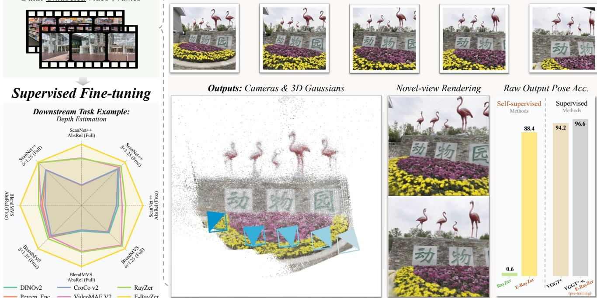
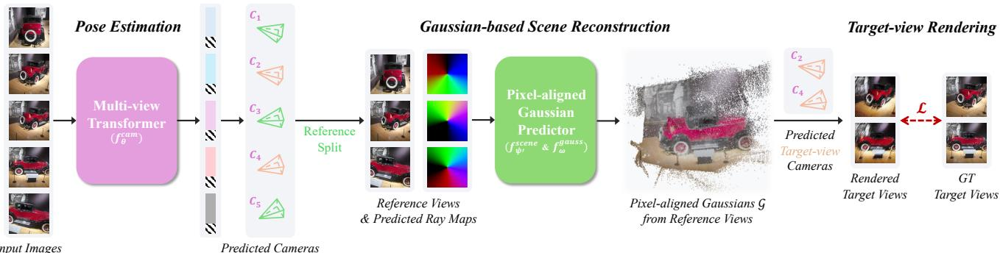

# 1. Bibliographic Information

## 1.1. Title
E-RayZer: Self-supervised 3D Reconstruction as Spatial Visual Pre-training

## 1.2. Authors
Qitao Zhao (Carnegie Mellon University), Hao Tan (Adobe Research), Qianqian Wang (Adobe Research), Sai Bi (Adobe Research), Kai Zhang (Adobe Research), Kalyan Sunkavalli (Adobe Research), Shubham Tulsiani (Carnegie Mellon University), and Hanwen Jiang (Harvard University).

## 1.3. Journal/Conference
This paper was published at **CVPR 2025**. CVPR (Conference on Computer Vision and Pattern Recognition) is widely regarded as one of the most prestigious and influential venues in the field of computer vision and artificial intelligence.

## 1.4. Publication Year
2025 (Published UTC: 2025-12-11)

## 1.5. Abstract
The paper introduces `E-RayZer`, a self-supervised large 3D vision model designed to learn 3D-aware representations directly from unlabeled multi-view images. While previous self-supervised models like `RayZer` inferred 3D geometry indirectly via latent-space view synthesis, `E-RayZer` operates directly in 3D space using **Explicit** geometry (3D Gaussians). By performing self-supervised 3D reconstruction, the model avoids "shortcuts" (like simple frame interpolation) and produces geometrically grounded representations. To enable stable training at scale, the authors introduce a fine-grained learning curriculum based on **visual overlap**. The model outperforms prior self-supervised methods in camera pose estimation and matches supervised models like `VGGT`. It establishes a new paradigm for 3D-aware visual pre-training, benefiting various downstream tasks like depth and flow estimation.

## 1.6. Original Source Link
*   **PDF Link:** [https://arxiv.org/pdf/2512.10950v1](https://arxiv.org/pdf/2512.10950v1)
*   **Project Page:** [qitaozhao.github.io/E-RayZer](https://qitaozhao.github.io/E-RayZer)
*   **Status:** Preprint/Published at CVPR 2025.

    ---

# 2. Executive Summary

## 2.1. Background & Motivation
In recent years, self-supervised learning has transformed natural language processing (e.g., GPT) and 2D vision (e.g., DINO). However, learning **3D-aware** representations—understanding the spatial structure of the world from images—remains a major challenge. 

Current 3D models typically rely on **fully supervised learning**, using 3D labels generated by traditional algorithms like `COLMAP` (Structure-from-Motion). This approach is problematic because `COLMAP` is slow, often fails on complex scenes, and doesn't scale well to the massive amounts of raw video available on the internet. 

The core problem `E-RayZer` aims to solve is: **How can we learn 3D geometry and camera movement from raw images without any human-provided or algorithm-generated 3D labels?**

The innovative entry point of this paper is the transition from **Implicit** to **Explicit** 3D modeling. Its predecessor, `RayZer`, learned to synthesize new views in a "black box" latent space. While it could generate pretty images, it didn't truly "understand" the 3D structure. `E-RayZer` forces the model to reconstruct actual 3D objects (using 3D Gaussians) as an intermediate step, ensuring the learned representations are physically meaningful.

The following figure (Figure 1 from the original paper) provides an example of the model performing feedforward 3D reconstruction from sparse-view images:

*该图像是一个示意图，展示了E-RayZer模型在自监督3D重建中的应用，包括多个视图图像和模型输出，如相机位置和3D高斯点。图中提供了不同方法的输出精确度对比，强调E-RayZer在下游任务（如深度估计）中性能的优势。*

## 2.2. Main Contributions / Findings
1.  **First Self-Supervised Feedforward 3DGS Model:** `E-RayZer` is the first model to predict **3D Gaussian Splatting (3DGS)** parameters from scratch without any 3D annotations or pre-trained 3D priors.
2.  **Explicit 3D Awareness:** By using explicit geometry, the model significantly improves camera pose estimation accuracy compared to previous implicit methods.
3.  **Visual Overlap Curriculum:** The authors propose a training strategy that starts with "easy" samples (high visual overlap) and moves to "hard" samples (low overlap), which is essential for making explicit 3D reconstruction converge during training.
4.  **Superior Pre-training:** Features learned by `E-RayZer` outperform established models like `DINOv3` and `VideoMAE V2` when applied to 3D downstream tasks like depth estimation and optical flow.

    ---

# 3. Prerequisite Knowledge & Related Work

## 3.1. Foundational Concepts

### 3.1.1. Self-Supervised Learning (SSL)
`Self-supervised learning` is a method where the data itself provides the supervision. For example, in text, a model might hide a word and try to predict it. In `E-RayZer`, the model is given a few images of a scene, builds a 3D model, and then tries to "render" what the scene would look like from a different angle. The difference between the rendered image and the actual image (which the model already has but didn't look at during reconstruction) provides the training signal.

### 3.1.2. 3D Gaussian Splatting (3DGS)
`3D Gaussian Splatting` is a recent 3D representation technique. Instead of using a mesh (triangles) or a voxel grid (3D pixels), it represents a scene as millions of tiny, transparent, 3D "blobs" (Gaussians). Each blob has a position, orientation, color, scale, and opacity.
*   **Why use it?** It allows for extremely fast, differentiable rendering, meaning you can calculate exactly how changing a Gaussian's position affects the final image.

### 3.1.3. Camera Poses: Intrinsics and Extrinsics
To reconstruct a 3D scene, a model must know where the cameras are.
*   **Extrinsics ($T$):** The 3D position and rotation of the camera in the world.
*   **Intrinsics ($K$):** Parameters of the camera lens, such as focal length and principal point (the "zoom" and "center" of the image).

### 3.1.4. Photometric Loss
The `photometric loss` measures the pixel-wise difference between two images.
\$
\mathcal{L}_{photo} = \mathrm{MSE}(I, \hat{I}) + \lambda \cdot \mathrm{Perceptual}(I, \hat{I})
\$
*   **MSE (Mean Squared Error):** Average squared difference in pixel values.
*   **Perceptual Loss:** Uses a pre-trained neural network to compare high-level features (textures, shapes) rather than just raw pixels.

## 3.2. Technological Evolution
1.  **Traditional SfM (e.g., COLMAP):** Uses hand-crafted geometric features to match pixels and estimate 3D. Accurate but slow and fragile.
2.  **Supervised Learning (e.g., VGGT, DUSt3R):** Trains neural networks to predict 3D, but requires `COLMAP` labels for training.
3.  **Implicit SSL (e.g., RayZer):** Uses a "latent renderer." High-quality image generation but poor geometric accuracy.
4.  **Explicit SSL (E-RayZer):** The current stage. Uses physical rendering rules and explicit 3D geometry to ensure the model learns true spatial relationships.

    ---

# 4. Methodology

## 4.1. Principles
The core intuition of `E-RayZer` is that **geometry acts as a regularizer**. If a model is forced to create a 3D object that can be viewed from any angle, it cannot "cheat" by just interpolating between frames. It must learn the actual shapes and distances within the scene.

## 4.2. Core Methodology In-depth

The architecture of `E-RayZer` consists of two primary modules: the `Camera Estimator` and the `Gaussian-based Scene Reconstructor`. The following figure (Figure 2 from the paper) illustrates the overall pipeline:

*该图像是示意图，展示了E-RayZer模型的多视图图像处理流程，包括姿态估计、多视图变换器、基于高斯的场景重建和目标视图渲染。关键步骤如姿态估计通过 $F_{mv}$ 进行，预测目标视图摄像机和生成渲染图像。整体过程显现了该模型在自我监督3D重建的应用。*

### Step 1: Input Splitting
Given a set of $V$ unlabeled images $\mathcal{T}$, the model splits them into:
*   **Reference Set ($\mathcal{T}_{ref}$):** Used to build the 3D scene.
*   **Target Set ($\mathcal{T}_{tgt}$):** Used as the ground truth to check the model's work.

### Step 2: Multi-view Camera Estimation
The model uses a transformer $f_{\theta}^{cam}$ to predict the camera parameters for all images.
\$
(\mathbf{K}, \mathbf{T}) = f_{\theta}^{cam}(\mathcal{T})
\$
where:
*   $\mathbf{K} \in \mathbb{R}^{3 \times 3}$ is the shared camera intrinsics.
*   `\mathbf{T}_i = [\mathbf{R}_i | \mathbf{t}_i] \in SE(3)` is the extrinsics (rotation and translation) for the $i$-th frame.

    These parameters are used to generate a **Plücker ray map** $\mathbf{R}_i^{plk}$. A Plücker ray represents a line in 3D space using its direction and its moment (cross product of position and direction). This allows the model to process camera information in a format that is compatible with image pixels.

### Step 3: Scene Representation Encoding
The model takes the reference images $\mathcal{T}_{ref}$ and their associated rays $\mathbf{R}_{ref}^{plk}$ and passes them through a transformer $f_{\psi'}^{scene}$ to aggregate information across views:
\$
\mathbf{s}_{ref} = f_{\psi'}^{scene}\left(\mathrm{Linear}(\mathcal{T}_{ref}, \mathbf{R}_{ref}^{plk})\right)
\$
Here, $\mathbf{s}_{ref}$ represents latent tokens (compressed information) about the scene's 3D structure.

### Step 4: Explicit 3D Gaussian Reconstruction
Unlike `RayZer`, which stops at latent tokens, `E-RayZer` uses a lightweight decoder $f_{\omega}^{gauss}$ to transform these tokens into actual 3D Gaussian parameters:
\$
\mathcal{G}_{ref} = f_{\omega}^{gauss}(\mathbf{s}_{ref})
\$
The predicted 3D Gaussians $\mathcal{G}_{ref}$ are a set of points $g_i$ defined as:
\$
g_i = (d_i, \mathbf{q}_i, \mathbf{C}_i, \mathbf{s}_i, \alpha_i)
\$
*   $d_i \in \mathbb{R}$: The distance (depth) along the camera ray.
*   $\mathbf{q}_i \in \mathbb{R}^4$: Orientation as a quaternion.
*   $\mathbf{C}_i$: Spherical harmonic coefficients representing color/appearance.
*   $\mathbf{s}_i \in \mathbb{R}^3$: The scale of the Gaussian.
*   $\alpha_i \in \mathbb{R}$: The opacity (transparency).

### Step 5: Differentiable Rendering
Now, the model takes the 3D Gaussians $\mathcal{G}_{ref}$ and the predicted target cameras $\mathcal{C}_{tgt} = \{(\mathbf{K}, \mathbf{T}_i) | i \in \mathcal{T}_{tgt}\}$ and renders them using the standard 3DGS rendering equation $\pi$:
\$
\hat{\mathcal{T}}_{tgt} = \pi(\mathcal{G}_{ref}, \mathcal{C}_{tgt})
\$
Because this process is differentiable, the model can adjust the Gaussians or the camera poses to make the rendered image $\hat{\mathcal{T}}_{tgt}$ look more like the real image $\mathcal{T}_{tgt}$.

### Step 6: Self-supervised Training Loss
The entire system is trained using the photometric loss defined in Equation 1:
\$
\mathcal{L} = \sum_{(I, \hat{I}) \in (\mathcal{T}_{tgt}, \hat{\mathcal{T}}_{tgt})} \left( \mathrm{MSE}(I, \hat{I}) + \lambda \cdot \mathrm{Percep}(I, \hat{I}) \right)
\$

## 4.3. Sequence Curriculum Based on Visual Overlap
Training a model to predict 3D from scratch is difficult because if the camera pose is slightly wrong, the 3D reconstruction becomes a mess. To solve this, `E-RayZer` uses a curriculum.

The authors define **Visual Overlap** `o(i, j)` between two frames. If the overlap is 1.0, the images are identical. If 0.0, they see completely different things.
*   **Semantic Overlap:** Computed using `DINOv2` features.
    $o_{sem}(i, j) = \cos(\phi_{DINO}(I_i), \phi_{DINO}(I_j))$
*   **Geometric Overlap:** Computed using covisibility (how many 3D points are visible in both frames).

    The training starts with a high overlap limit `o(s)` that decreases over time $s \in [0, 1]$:
\$
o(s) = s \cdot o_{min} + (1 - s) \cdot o_{max}
\$
This allows the model to learn "easy" camera movements first before tackling large, complex motions. Figure 3 illustrates this concept:

![Figure 3. Different Visual Overlaps under the Same Frame Interval. Two sequences from DL3DV \[33\] share the same frame interval yet exhibit drastically different levels of visual overlap. Our proposed semantic and geometric overlap metrics more accurately capture the true difficulty (or camera motion) of each sequence.](images/3.jpg)
*该图像是示意图，展示了两个来自DL3DV的数据序列在相同帧间隔下的视觉重叠差异。上方序列A显示更大的视觉重叠（0.91和0.93），下方序列B则显示较小的视觉重叠（0.40和0.74），并伴随不同的相机运动。右侧是可见性图，标记了不同的视觉重叠程度和相机运动。*

---

# 5. Experimental Setup

## 5.1. Datasets
*   **DL3DV-10K:** A large-scale dataset for 3D vision with diverse indoor/outdoor scenes.
*   **RealEstate10K:** Video sequences of indoor home tours.
*   **ScanNet++:** High-fidelity indoor 3D scenes (used for testing generalization).
*   **WildRGB-D:** In-the-wild handheld camera sequences.
*   **7-dataset Mix:** A massive combination of CO3Dv2, MVImgNet, ARKitScenes, etc.

## 5.2. Evaluation Metrics

### 5.2.1. Relative Pose Accuracy (RPA)
*   **Conceptual Definition:** Measures how close the predicted camera rotation and translation are to the ground truth.
*   **Formula:** $\mathrm{RPA}@X^{\circ}$ is the percentage of frames where the angular error is less than $X$ degrees.
*   **Symbol Explanation:** $X$ is the threshold (e.g., $5^{\circ}, 15^{\circ}, 30^{\circ}$).

### 5.2.2. Peak Signal-to-Noise Ratio (PSNR)
*   **Conceptual Definition:** Quantifies the quality of the rendered image compared to the original. Higher is better.
*   **Formula:** 
    \$
    \mathrm{PSNR} = 10 \cdot \log_{10}\left(\frac{\mathrm{MAX}_I^2}{\mathrm{MSE}}\right)
    \$
*   **Symbol Explanation:** $\mathrm{MAX}_I$ is the maximum possible pixel value (usually 1.0 or 255); $\mathrm{MSE}$ is the mean squared error between images.

### 5.2.3. Absolute Relative Error (AbsRel)
*   **Conceptual Definition:** Measures the average error in depth estimation relative to the true depth.
*   **Formula:**
    \$
    \mathrm{AbsRel} = \frac{1}{N} \sum \frac{|d_{true} - d_{pred}|}{d_{true}}
    \$
*   **Symbol Explanation:** $d_{true}$ is ground truth depth; $d_{pred}$ is predicted depth; $N$ is the number of pixels.

## 5.3. Baselines
*   **RayZer:** The implicit self-supervised predecessor.
*   **SPFSplat:** A self-supervised method that relies on a pre-trained supervised model (`MASt3R`) for initialization.
*   **VGGT:** A state-of-the-art **supervised** transformer model for geometry.

    ---

# 6. Results & Analysis

## 6.1. Core Results Analysis
The key finding is that `E-RayZer` dramatically outperforms `RayZer` in pose estimation. While `RayZer` can generate good images, its predicted camera positions are often garbage because it uses "shortcuts." `E-RayZer`'s explicit 3D requirement forces the camera poses to be geometrically correct.

The following table (Table 1 from the paper) shows the performance comparison:

<table>
<thead>
<tr>
<th rowspan="2">Method</th>
<th rowspan="2">Self-supervised?</th>
<th rowspan="2">Training Data</th>
<th colspan="4">WildRGB-D</th>
<th colspan="4">ScanNet++</th>
<th colspan="4">DL3DV</th>
</tr>
<tr>
<th>PSNR↑</th>
<th>@5°↑</th>
<th>@15°↑</th>
<th>@30°↑</th>
<th>PSNR↑</th>
<th>@5°↑</th>
<th>@15°↑</th>
<th>@30°↑</th>
<th>PSNR↑</th>
<th>@5°↑</th>
<th>@15°↑</th>
<th>@30°↑</th>
</tr>
</thead>
<tbody>
<tr>
<td>SPFSplat [19]</td>
<td>X (MASt3R ini.)</td>
<td>RE10K (+ extra)</td>
<td>16.7</td>
<td>31.5</td>
<td>58.0</td>
<td>69.8</td>
<td>14.0</td>
<td>2.5</td>
<td>11.8</td>
<td>30.3</td>
<td>15.1</td>
<td>19.5</td>
<td>40.6</td>
<td>50.5</td>
</tr>
<tr>
<td>E-RayZer (ours)</td>
<td>√</td>
<td>RE10K</td>
<td>21.0</td>
<td>40.3</td>
<td>89.4</td>
<td>96.5</td>
<td>17.5</td>
<td>1.1</td>
<td>13.3</td>
<td>37.3</td>
<td>17.3</td>
<td>21.2</td>
<td>55.0</td>
<td>72.7</td>
</tr>
<tr>
<td>RayZer [23]</td>
<td>√</td>
<td>DL3DV</td>
<td>25.9</td>
<td>0.0</td>
<td>0.2</td>
<td>6.5</td>
<td>20.5</td>
<td>0.0</td>
<td>0.7</td>
<td>6.2</td>
<td>21.4</td>
<td>0.0</td>
<td>0.6</td>
<td>6.2</td>
</tr>
<tr>
<td>E-RayZer (ours)</td>
<td>√</td>
<td>DL3DV</td>
<td>24.3</td>
<td>84.5</td>
<td>98.4</td>
<td>99.3</td>
<td>20.1</td>
<td>7.7</td>
<td>33.6</td>
<td>63.0</td>
<td>20.3</td>
<td>72.0</td>
<td>88.4</td>
<td>93.5</td>
</tr>
</tbody>
</table>

### Analysis of Table 1:
*   **RayZer vs. E-RayZer:** Look at the `@5°` pose accuracy on DL3DV. RayZer is **0.0**, while E-RayZer is **72.0**. This proves that implicit models fail to learn real geometry, whereas `E-RayZer` succeeds.
*   **Generalization:** On $ScanNet++$ (data the model never saw during training), `E-RayZer` still maintains reasonable pose accuracy (`@30°` = 63.0), whereas baselines struggle.

## 6.2. Comparison with Supervised Models
Surprisingly, `E-RayZer` (no labels) performs similarly to `VGGT` (lots of labels). Table 2 demonstrates this:

<table>
<thead>
<tr>
<th rowspan="2">Method</th>
<th colspan="2">In-domain DL3DV</th>
<th colspan="4">Out-of-domain</th>
</tr>
<tr>
<th>@5°</th>
<th>@15°</th>
<th>WildRGB-D @5°</th>
<th>WildRGB-D @15°</th>
<th>ScanNet++ @5°</th>
<th>ScanNet++ @15°</th>
</tr>
</thead>
<tbody>
<tr>
<td>E-RayZer (ours)</td>
<td>72.0</td>
<td>88.4</td>
<td>51.1</td>
<td>82.3</td>
<td>7.7</td>
<td>33.6</td>
</tr>
<tr>
<td>VGGT* (Supervised)</td>
<td>79.6</td>
<td>94.2</td>
<td>32.5</td>
<td>76.2</td>
<td>6.7</td>
<td>39.8</td>
</tr>
<tr>
<td>E-RayZer → VGGT*</td>
<td>87.3</td>
<td>96.6</td>
<td>56.2</td>
<td>91.4</td>
<td>14.3</td>
<td>53.8</td>
</tr>
</tbody>
</table>

**Key takeaway:** Pre-training `VGGT` with `E-RayZer` weights (`E-RayZer → VGGT*`) leads to the best results, showing that self-supervision on raw data captures knowledge that supervised labels miss.

## 6.3. Downstream Task Probing
The authors froze the `E-RayZer` encoder and only trained a small "head" for new tasks. This checks if the encoder learned "useful" 3D features. In Table 3, `E-RayZer` outperforms `DINOv3` and `VideoMAE V2` in depth and pose estimation.

---

# 7. Conclusion & Reflections

## 7.1. Conclusion Summary
`E-RayZer` marks a significant milestone in 3D vision. It proves that we don't need expensive, slow `COLMAP` labels to train powerful 3D models. By integrating **Explicit 3D Gaussian Splatting** into a self-supervised pipeline and using a **Visual Overlap Curriculum**, the model learns to understand the 3D world just by looking at images. It outperforms previous self-supervised models and provides a superior foundation for any downstream task involving spatial understanding.

## 7.2. Limitations & Future Work
1.  **Static Scenes:** Like most 3DGS methods, `E-RayZer` assumes the world is static. If something moves in the video (like a person walking), the 3D reconstruction might fail.
2.  **Computational Cost:** Training large transformers on multi-view images is expensive and requires significant GPU memory (A100 GPUs were used).
3.  **Future Directions:** Scaling to even larger "internet-scale" video data and extending the model to handle dynamic objects.

## 7.3. Personal Insights & Critique
The transition from "latent synthesis" to "explicit reconstruction" is a brilliant move. In AI, we often try to make models "end-to-end" black boxes, but `E-RayZer` shows that adding a **geometric bottleneck** (forcing the model to build a 3D object) actually makes the model smarter, not more limited.

One area for improvement: the "Semantic Overlap" curriculum relies on `DINOv2`. While `DINOv2` is self-supervised, it's still a dependency. A truly "pure" `E-RayZer` would ideally derive its own difficulty metric without an external model. However, the current results are highly convincing and suggest that 3D vision is entering its "Foundation Model" era.