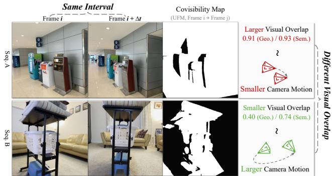
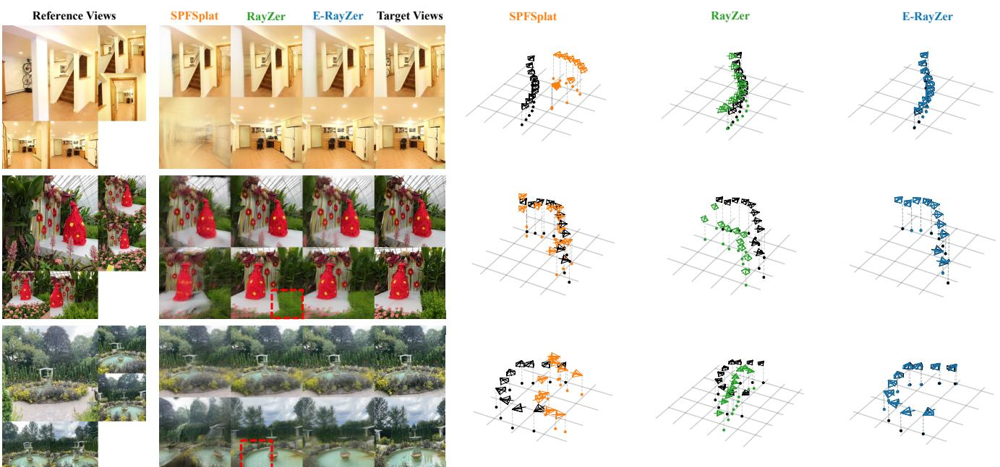
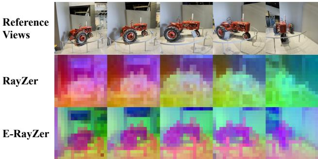
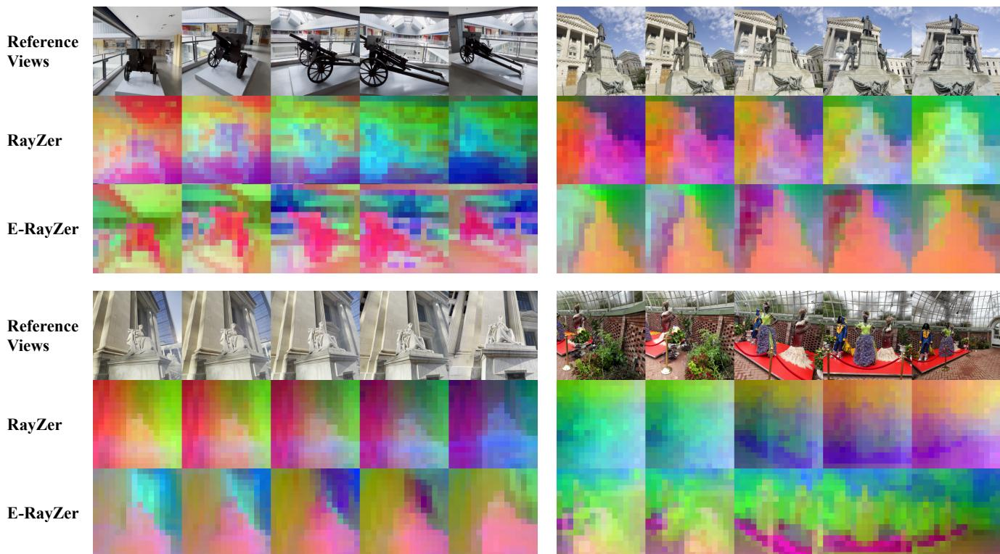
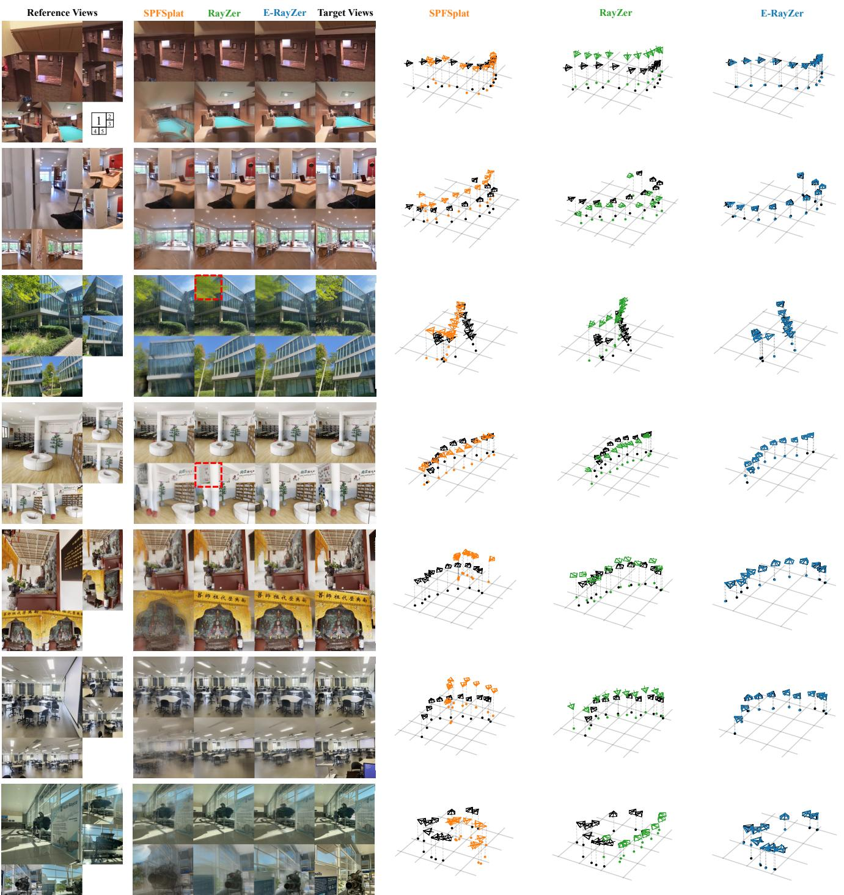

# E-RayZer：自监督三维重建作为空间视觉预训练

赵启涛1 唐浩2 王倩倩3 薄凯$\mathrm { B i ^ { 2 } }$ 张凯2 卡里扬·桑卡瓦利2 舒巴姆·图尔西亚尼1\* 姜汉文2\* 卡内基梅隆大学 Adobe研究院 哈佛大学 平等指导 项目与代码：qitaozhao.github.io/E-RayZer

# 自监督学习

# 任务：前馈式3D重建（推理示例）

数据：未标注的视频帧 输入：稀疏视图图像

# 摘要

自监督预训练已彻底改变了语言、单个二维图像和视频的基础模型，但在从多视角图像学习三维感知表示方面仍然缺乏探索。本文提出了 $E$ -RayZer，一种自监督的大型三维视觉模型，能够直接从未标记图像中学习真正的三维感知表示。与之前的自监督方法（如 RayZer）通过潜在空间视图合成间接推断三维不同，$E$ -RayZer 直接在三维空间中操作，执行基于显式几何的自监督三维重建。这种形式消除了捷径解决方案，并产生几何上扎实的表示。为了确保收敛性和可扩展性，我们引入了一种新颖的细粒度学习课程，该课程从易样本到难样本组织训练，并以完全无监督的方式协调异构数据源。实验表明，$E$ -RayZer 在姿态估计上显著优于 RayZer，并与完全监督重建模型（如 VGGT）相当，甚至在某些情况下超过它们。此外，在转移到三维下游任务时，其学习到的表示优于领先的视觉预训练模型（例如，DINOv3、CroCo v2、VideoMAE V2 和 RayZer），确立了 $E$ -RayZer 成为三维感知视觉预训练的新范式。

# 1. 引言

自监督预训练构成了前沿模型的基础，使它们能够在大量未标记数据上学习有意义的表示。该范式已被证明在文本、二维图像和视频领域是有效的，大型模型能够捕捉语言语义、视觉概念和时间动态。然而，我们认为仍有一个至关重要的组成部分缺失——从未标记的多视角图像中学习3D感知表示，因其在感知和与我们生活的3D物理世界互动中是基本的。然而，当前的3D视觉模型大多依赖于不同的途径：采用COLMAP估算的3D伪标签进行全监督学习，这种方法固有地低效、不完美，最终也不可扩展。为了前进，我们需要一个自监督预训练框架，能够从丰富的原始视觉观测中学习3D感知表示。

在本文中，我们提出了E-RayZer，这是首个真正自监督的3D高斯点云重建模型，从无标注数据中学习3D感知表示，从而为$3D$空间视觉预训练建立了新的范例（见图1）。与其前身RayZer [23]不同，后者仅通过在潜在空间中学习自监督视图合成的代理任务展现了表面上的3D感知，E-RayZer则直接在3D空间中操作，学习自监督的3D重建。具体而言，E-RayZer从输入中预测相机参数和3D高斯分布[29]，并在物理渲染规则的约束下重新渲染，实现光度自监督。通过将表示与明确的场景几何相结合，E-RayZer学习到的特征真正具备3D感知能力，避免了RayZer中使用帧插值等捷径解决方案（见第3.1节）。这种设计不仅产生了比RayZer更具几何基础和可解释性的相机空间，还生成了真正具备3D感知的潜在表示，极大地促进了下游3D视觉任务的发展。尽管使用显式的3D高斯分布带来了明显的优势，但也带来了重大的训练挑战。如RayZer中所述（表7），使用显式3D进行训练会导致不收敛。为了解决这一关键挑战，我们提出了一种细颗粒度的学习课程，基于输入视图之间视觉重叠的概念。为了稳定训练，我们首先使用视觉重叠高的样本，使姿态估计器能够从预测近于恒等姿态开始初始化，并逐渐减少重叠以促进对3D的整体理解。在扩展到异构训练资源时，视觉重叠提供了一种自然且统一的度量，能够自适应地对齐相机运动分布，提高数据的一致性。值得注意的是，我们以无监督的方式近似视觉重叠，使得该框架完全不依赖于任何3D标注。我们系统地研究了E-RayZer在不同训练数据规模上的性能。我们强调了关键结论，并总结我们的贡献如下： • E-RayZer是首个自监督的前馈3D高斯点云重建模型，从零3D标注开始训练。 • 在下游3D任务中，E-RayZer超越了以往的视觉表示学习模型，如DINOv3 [47]、CroCo v2 [62]、VideoMAE V2 [57]、感知编码器[7]（见表3-4），确立了E-RayZer作为空间视觉预训练的强大范例。 • 与以往的自监督3D视觉模型相比，E-RayZer展示了更强的3D理解能力，体现在其显著提高的无监督相机姿态估计精度（见表1）和3D下游任务微调结果（见表3）。 • 与最先进的监督模型相比，如VGGT [55]，E-RayZer表现出相当甚至更优的性能（见表2），并展现了相似的扩展模式（见表5），尽管采用的是完全自监督的方法。

# 2. 相关工作

监督姿态估计与三维重建。早期基于学习的方法通过图像对估计相对相机姿态[3, 4, 9, 41]，而后来的方法则探索了多视角推理，处理多个输入[21, 22, 32, 48, 54, 74, 75]。给定姿态图像，可以通过直接回归[21, 72, 76]或基于优化的模式寻求与扩散模型[78, 82]来重建三维表示。最近的研究通过预测像素对齐的点图统一了姿态估计和三维重建[12, 55, 58, 60, 79]，在稀疏输入下表现出强大的鲁棒性，并能很好地泛化到不同领域[52]。然而，这种监督模型的训练仍然依赖相机姿态和密集深度标注，这些通常来自传统的结构从运动（SfM）系统（如COLMAP [44]），并且可能不准确，从而限制了监督模型的性能。最近的研究还探讨了使用光度损失预测三维高斯[29]，作为（部分）监督。然而，这些方法仍然实际上依赖于三维标注，因为它们在训练中依赖于真实内参[18, 26, 68]和/或目标视图的相机姿态[26, 49, 68]，或者需要来自三维监督模型的初始化和/或正则化[19, 24, 49]。相反，E-RayZer 可以从零开始训练而不需要任何三维监督，因此是真正的自监督，并且能够获得更好的性能。

自监督新视图合成。为了减轻对三维监督的依赖，另一项研究通过新视图合成研究直接从二维图像中学习场景表示。早期工作从单一视角预测场景特征，并将目标视图作为监督进行渲染。最近，RUST、RayZer等方法采用基于学习的来自多视角输入的潜在渲染。然而，这些方法显示出有限的三维意识，例如，RayZer在一个不可解释的姿态空间中学习视图插值。我们在RayZer的基础上进行改进，但采用显式的三维表示（即三维高斯），更细粒度的学习课程和大规模的训练。我们表明，显式三维建模能够导致更具几何基础的表示，将其确立为一个有前景的预训练框架，适用于需要三维理解的下游任务。视觉预训练用于表示学习。先前的工作在通过图像-语言关联学习全局图像语义方面取得了显著进展，通过对比和填充损失学习二维空间先验，以及通过捕捉视频级自监督的时间相关性。然而，尽管其在稀缺的监督情况下对三维相关任务有强大的潜力，学习具备三维意识和几何基础的表示仍然未被充分探索。最近的努力通过潜在空间的新视图合成的代理任务探索三维意识，但这些方法在多大程度上强制执行真实的三维理解仍然模糊。在本工作中，E-RayZer通过显式三维建模解决了这一问题，并引入了一个能够有效扩展的学习课程，使得所学习的表示具备三维基础并具有良好的泛化能力。

# 3. 方法

从未标记的多视角图像集，E-RayZer 学习在自我监督下预测相机（姿态与内参）和显式的三维场景几何结构。E-RayZer 的内部自我监督表示可以进一步应用于下游任务，展示了 E-RayZer 作为一个三维感知视觉预训练框架的潜力。接下来，我们首先回顾隐式前身 RayZer [23]，并讨论其局限性（第 3.1 节）。在解决这些问题的同时基于 RayZer 的核心设计，引入显式三维建模的 $E$ RayZer（第 3.2 节）。最后，我们提出了一种基于帧之间视觉重叠的序列级课程学习策略，以提升性能和可扩展性（第 3.3 节）。

# 3.1. 基础知识：带有隐式 3D 的 RayZer

RayZer 将所有输入图像拆分为两个不重叠的子集：一个用于潜在场景推断的“观测”参考集 $ ( \mathcal { T } _ { \mathrm { r e f } } )$ 和一个用于提供自监督的“隐藏”目标集 $ ( \mathcal { T } _ { \mathrm { t g t } } )$。RayZer 使用目标视图 $ ( \mathcal { T } _ { \mathrm { t g t } } )$ 的预测相机来渲染从参考视图 $ ( \mathcal { T } _ { \mathrm { r e f } } )$ 预测的场景，并应用光度损失作为自监督：

$$
\mathcal { L } = \Sigma _ { ( I , \hat { I } ) \in ( \mathcal { T } _ { \mathrm { t g t } } , \hat { \mathcal { T } } _ { \mathrm { t g t } } ) } \left( \mathrm { M S E } ( I , \hat { I } ) + \lambda \cdot \mathrm { P e r c e p } ( I , \hat { I } ) \right) ,
$$

其中 Percep 表示感知损失 [25]。RayZer 利用变换器进行姿态估计、潜在（隐式）场景重建和渲染。它首先使用多重视图 $f _ { \theta } ^ { \mathrm { c a m } }$ 预测所有输入图像 $\bar { \boldsymbol { \mathcal { T } } } \in \mathbb { R } ^ { V \times H \times W \times 3 }$ 的相机内部参数和外部参数：

$$
( \mathbf { K } , \mathbf { T } ) = f _ { \pmb { \theta } } ^ { \mathrm { c a m } } ( \mathcal { T } ) , \quad \mathbf { T } _ { i } = [ \mathbf { R } _ { i } | \mathbf { t } _ { i } ] \in S E ( 3 ) ,
$$

其中 $\mathbf { K } \in \mathbb { R } ^ { 3 \times 3 }$ 是所有视图共享的内参，$\mathbf { T \in } \mathbb { R } ^ { V \times 4 \times 4 }$ 表示外参，$i = 1 , \ldots , V$ 索引输入图像。每个相机 $( \mathbf { K } , \mathbf { T } _ { i } )$ 被转换为像素对齐的 Plücker 射线图 $\mathbf { R } _ { i } ^ { \mathrm { p l k } }$ [37, 75]。为了推断潜在场景表示，RayZer 将图像和射线的拼接（沿特征维度）进行标记化，针对 $\mathcal { T } _ { \mathrm { r e f } }$ 更新一组可学习的场景标记 $\mathbf { z } _ { \mathrm { 0 } } ^ { \mathrm { s c e n e } }$，通过变换器 $f _ { \psi } ^ { \mathrm { s c e n e } }$ 进行处理：

$$
\begin{array} { r } { \mathbf { z } _ { \mathrm { r e f } } ^ { \mathrm { s c e n e } } = f _ { \psi } ^ { \mathrm { s c e n e } } \big ( \mathbf { z } _ { 0 } ^ { \mathrm { s c e n e } } , \mathrm { L i n e a r } ( \mathcal { T } _ { \mathrm { r e f } } , \ : \mathbf { R } _ { \mathrm { r e f } } ^ { \mathrm { p l k } } ) \big ) , } \end{array}
$$

其中，Linear $( \cdot )$ 表示用于融合和标记 RGB 和光线信息的块状线性投影。得到的 $\mathbf { z } _ { \mathrm { r e f } } ^ { \mathrm { s c e n e } }$ 在渲染过程中，自预测的目标视图 Plücker 光线图同样被标记并与场景表示 $\mathbf { z } _ { \mathrm { r e f } } ^ { \mathrm { s c e n e } }$ 连接（沿着标记维度）。这些目标视图光线标记通过变换器 $f _ { \phi } ^ { \mathrm { r e n d } }$ 进行细化，并最终解码为 RGB 图像，如下所示：

$$
\hat { \mathcal { T } } _ { \mathrm { t g t } } = f _ { \phi } ^ { \mathrm { r e n d } } \big ( \mathbf { z } _ { \mathrm { r e f } } ^ { \mathrm { s c e n e } } , \mathrm { L i n e a r } ( \mathbf { R } _ { \mathrm { t g t } } ^ { \mathrm { p l k } } ) \big ) .
$$

然后，RayZer 应用光照自监督（公式 1）。RayZer 隐式三维的局限性。RayZer 实现了高保真新视图合成。然而，RayZer 的潜在场景重建 $f _ { \psi } ^ { \mathrm { s c e n e } }$ 和渲染 $f _ { \phi } ^ { \mathrm { r e n d } }$ 模块是从头联合学习的，它们只需保持相互兼容，但并不保证在物理或空间上有意义。这个问题在 RayZer 纯基于变换器的架构中进一步加剧，该架构几乎没有三维归纳偏置，因此具有过度灵活性以学习不良的捷径解决方案。正如其不完美的相机姿态分布所证明的，RayZer 依赖于真实三维理解和视频插值先验的混合，以实现高质量合成。虽然这种设计足以满足新视图合成的需求，但也限制了 RayZer 作为空间预训练框架，在学习真正具备三维意识的表征方面的潜力。

# 3.2. E-RayZer: 明确的 3D 自监督方法

我们的见解。我们认为，3D 归纳偏差对 3D 表示学习仍然至关重要，但必须以保持学习可扩展性的方式正确引入。

  
sag totwo ts.ERayZer predic explic  Gaussns s eeeprentafom e eferencvw $( \mathcal { T } _ { \mathrm { r e f } } )$ , and renders the scene using self-predicted target-view $( \mathcal { T } _ { \mathrm { t g t } } )$ cameras. Finally, E-RayZer is trained with self-supervised photometric losses on target views.

因此，我们提出通过模型设计注入轻量级的三维归纳偏置，同时保持训练完全自监督，以实现三维意识和可扩展性之间更好的平衡。具体而言，E-RayZer 用显式的三维几何（即三维高斯）取代了 RayZer 的潜在场景表示，为学习基于几何的姿势估计、场景重建和潜在表示提供几何正则化。

概述。如图 2 所示，E-RayZer 首先为所有图像预测相机参数，然后从参考视图子集 $( \mathcal { T } _ { \mathrm { r e f } } )$ 推断像素对齐的 3D 高斯分布 $\mathcal { G } _ { \mathrm { r e f } }$。接下来，E-RayZer 通过在自预测的 ${ \mathcal { T } } _ { \mathrm { t g t } }$ 相机下渲染从 $\mathcal { T } _ { \mathrm { r e f } }$ 预测的 3D 高斯分布，来预测目标视图子集 $( \mathcal { T } _ { \mathrm { t g t } } )$。由于 3D 高斯分布支持封闭形式的可微渲染，因此在 RayZer 中使用的潜在渲染解码器（在公式 4 中为 $f _ { \phi } ^ { \mathrm { r e n d } }$）不再需要。我们将在详细阐述细节的同时描述与 RayZer 的关键区别。基于高斯的场景重建。E-RayZer 首先以与 RayZer 类似的方式预测所有视图的相机（除了后面将详细介绍的模型架构的差异）。然后，E-RayZer 直接将“姿态”参考视图转换为像素对齐的 3D 高斯分布。我们首先将姿态参考视图编码为潜在标记：

$$
{ \bf s } _ { \mathrm { r e f } } = f _ { \psi ^ { \prime } } ^ { \mathrm { s c e n e } } \big ( \mathrm { L i n e a r } ( \mathcal { T } _ { \mathrm { r e f } } , { \bf R } _ { \mathrm { r e f } } ^ { \mathrm { p l k } } ) \big )
$$

其中 $\mathbf { s } _ { \mathrm { r e f } } \in \mathbb { R } ^ { K _ { \mathrm { r e f } } h w \times C }$ 表示经过多视图聚合后的参考视图的更新图像词元。具体来说，$K _ { \mathrm { r e f }}$ 是 $\mathcal { T } _ { \mathrm { r e f } }$ 中的视图数量，$h = H / p$ 和 $w = W / p$ 是使用补丁大小 $p$ 的高度和宽度维度上的词元数量，而 $C$ 是潜在空间的通道维度。注意，公式 5 中全局注意力的复杂度为 $\mathcal { O } ( ( K _ { \mathrm { r e f } } h w ) ^ { 2 } )$，而 RayZer（公式 3）的复杂度则为 $\mathcal { O } ( ( K _ { \mathrm { r e f } } h w + n _ { \mathbf { z } } ) ^ { 2 } )$，其中 $n _ { \mathbf { z }}$ 是 RayZer 的场景词元集的大小。接着，我们使用轻量级解码器将更新后的图像词元 $\mathbf { S } _ { \mathrm { r e f } }$ 转换为沿着每个相机光线的每像素 3D 高斯参数，公式如下：

$$
\begin{array} { r l } & { \mathcal { G } _ { \mathrm { r e f } } = f _ { \omega } ^ { \mathrm { g a u s s } } ( \mathbf { s } _ { \mathrm { r e f } } ) , \quad \mathrm { w h e r e } } \\ & { \mathcal { G } _ { \mathrm { r e f } } = \big \{ g _ { i } = ( d _ { i } , \mathbf { q } _ { i } , \mathbf { C } _ { i } , \mathbf { s } _ { i } , \alpha _ { i } ) \big \} _ { i = 1 } ^ { K _ { \mathrm { r e f } } \times H \times W } . } \end{array}
$$

这些参数包括沿光线的距离 $d _ { i } \in \mathbb { R }$、表示方向的四元数 $\mathbf { q } _ { i } \in \mathbb { R } ^ { 4 }$、球谐系数 $\mathbf { C } _ { i } \in \mathbb { R } ^ { ( d _ { \mathrm { S H } } + 1 ) ^ { 2 } \times 3 }$、尺度 $\mathbf { s } _ { i } \in \mathbb { R } ^ { 3 }$ 和不透明度 $\alpha _ { i } \in \mathbb { R }$。预测的3D高斯函数共同表示场景几何。然后，我们使用E-RayZer自预测的目标视角相机，记作 $\mathcal { C } _ { \mathrm { t g t } } = \{ ( \mathbf { K } , \mathbf { T } _ { i } ) \ | \ i \in \mathcal { T } _ { \mathrm { t g t } } \}$，来渲染3D高斯函数 $\mathcal { G } _ { \mathrm { r e f } }$，获得目标视角的预测，如下所示：

$$
\begin{array} { r } { \hat { \mathcal { T } } _ { \mathrm { t g t } } = \pi ( \mathcal { G } _ { \mathrm { r e f } } , \mathcal { C } _ { \mathrm { t g t } } ) , } \end{array}
$$

其中 $\pi$ 表示 3D 高斯的可微渲染方程。请注意，我们修改了 gsplat [70] 以支持对相机内参 $\mathbf{K}$ 的梯度反向传播。与 RayZer 相比，这种设计通过消除对基于变换器的渲染器的学习需求，提高了渲染效率和 3D 认知。最后，我们在渲染目标视图上应用光度损失，如方程 1 所示。避免不理想的视图插值。如第 3.1 节所讨论，RayZer 往往学习到不理想的帧插值线索作为捷径解决方案。我们识别出其主要原因是使用图像索引嵌入将图像标记与相应的相机标记关联，用于相机估计，这为学习插值提供了强线索。在 E-RayZer 中，我们完全移除了图像索引嵌入。我们采用了 VGGT 风格的 [55] 多视图变换器，具有交替的局部-全局注意力，其中局部注意力边界自然定义了关联关系。与原始 VGGT 不同，E-RayZer 执行成对的姿态预测：来自标准视图和目标视图的相机标记被串联以回归它们的相对相机姿态。因此，E-RayZer 不需要针对标准视图和非标准视图的不同相机注册标记。该架构设计应用于用于相机估计的变换器 $(f_{\theta}^{\mathrm{cam}})$ 和 $(f_{\psi^{\prime}}^{\mathrm{scene}})$。

  
Figure 3. Different Visual Overlaps under the Same Frame Interval. Two sequences from DL3DV [33] share the same frame interval yet exhibit drastically different levels of visual overlap. Our proposed semantic and geometric overlap metrics more accurately capture the true difficulty (or camera motion) of each sequence.

# 3.3. 基于视觉重叠的序列课程

由于 E-RayZer 利用显式场景表示，因此从零开始训练时收敛较为困难。为稳定训练，我们提出了一种基于输入视图之间视觉重叠概念的学习课程，提供了对训练数据难度的细粒度控制。该课程还自适应地对齐来自不同数据源的数据分布，使得 E-RayZer 在异构训练资源上更加可扩展。我们强调，E-RayZer 的学习课程与基于固定帧索引间隔的 RayZer 的学习课程在根本上是不同的。如图 3 所示，RayZer 的基于间隔的采样仅提供了对视觉重叠的不准确和不灵活的近似，且是硬编码的，因此无法扩展到异构资源。接下来，我们描述构建学习课程的两个关键步骤：数据标注和采样。然后，我们引入两种视觉重叠标注工具的变体：一种几何版本，计算实际的共可见性；另一种语义版本，作为其无监督近似。标注。对于每个训练序列 $u$（来自任何数据资源），我们通过对每个间隔 $\Delta t$ 均匀采样一小组帧三元组来计算间隔轮廓，形式为 $\mathcal { T } _ { u } ( \Delta t ) = \{ ( i , i + \Delta t , i + 2 \Delta t ) \}$，并计算每个三元组的两个成对重叠 $o ( \cdot , \cdot )$ 的平均值：

$$
o _ { \mathrm { t r i } } ( i , \Delta t ) ~ = ~ { \textstyle \frac { 1 } { 2 } } \Big ( o ( i , i + \Delta t ) + o ( i + \Delta t , i + 2 \Delta t ) \Big ) .
$$

对所有采样的三元组计算 $o _ { \mathrm { t r i } } ( i , \Delta t )$ 的平均值，得到每个序列的轮廓 $O _ { u } ( \Delta t )$，该轮廓表征了重叠程度（因而也表征了困难度）随帧索引间距的变化。训练时间采样。给定课程进度 $s \in [ 0 , 1 ]$，我们采用视觉重叠的下限 $\begin{array} { r l } { o ( s ) } & { { } = } \end{array}$ $s o _ { \operatorname* { m i n } } + ( 1 - s ) o _ { \operatorname* { m a x } }$，以确保其在训练过程中逐渐降低。然后，通过查找预先计算的表 $\{ ( \Delta t _ { k } , O _ { u } ( \Delta t _ { k } ) ) \}$ 并在最近条目之间线性插值，获得序列特定的间距 $\Delta t _ { u } ( s )$。最后，序列长度遵循 $t = ( V - 1 ) \Delta t _ { u } ( s )$。实例化。我们用两种替代方案来实例化 $o$——几何重叠（UFM [77] 的共可见性，使用 3D 注释进行训练）和语义重叠（DINOv2 [36] 的余弦相似度，使用自监督进行训练）：

$$
\begin{array} { r l } & { o _ { \mathrm { s e m } } ( i , j ) = \cos \big ( \phi _ { \mathrm { D I N O } } ( I _ { i } ) , \phi _ { \mathrm { D I N O } } ( I _ { j } ) \big ) , } \\ & { o _ { \mathrm { g e o } } ( i , j ) = \mathrm { C o v } _ { \mathrm { U F M } } ( I _ { i } , I _ { j } ) . } \end{array}
$$

在第4.4节中，我们展示了语义课程和几何课程均优于RayZer的基于区间的课程，并且这两种变体的表现相似。

# 4. 实验

我们首先在第4.1节描述实验设置。然后，我们从两个方面评估E-RayZer：作为用于姿态估计和3D重建的自监督模型（第4.2节），以及作为下游任务的空间视觉预训练框架（第4.3节）。最后，我们分析E-RayZer的关键设计选择（第4.4节）。

# 4.1. 实验设置

实现细节。E-RayZer通过10张输入图像进行训练，其中5张用作参考视图，5张用作目标视图。在训练过程中，我们遵循视觉重叠评分的线性衰减：几何重叠调度下为$1.0$到$0.5$，语义重叠调度下为$1.0$到$0.75$。为了公平比较，我们将RayZer与E-RayZer对齐，采用更优的模型架构和新的训练课程。对于其他基准，我们使用官方检查点，并在相应的子章节中提供具体的实现细节。更多细节见补充材料。指标。对于姿态估计，我们报告相对姿态准确度（RPA），在$5^{\circ}$、$15^{\circ}$和$30^{\circ}$的阈值下，这共同反映了旋转和位移的准确度。对于新视图合成，我们使用标准的PSNR。对于深度估计，我们评估绝对相对误差（AbsRel）和$\delta < 1.25$，遵循Depth Anything [66]。对于成对光流预测，我们报告平均端点误差（EPE）和在1px、2px和5px阈值下的异常光流预测比例，遵循UFM [77]。数据集。训练。我们提供了E-RayZer在单数据集和多数据集设置下训练的结果。单数据集变体仅在RealEstate10K [43]或DL3DV [33]上进行训练，而多数据集变体则在七个数据集的混合上进行训练：DL3DV [33]、CO3Dv2 [40]、RealEstate10K [81]、MVImgNet [73]、ARKitScenes [6]、WildRGB-D [64]和ACID [34]，涵盖了多样的室内和室外序列。评估。我们主要在WildRGB-D、DL3DV测试集以及超出分布（OOD）的ScanNet$^{++}$ [71]上评估姿态估计和新视图合成。为了评估所学表示的泛化能力（第4.3节），我们在OOD的ScanNet++和BlendedMVS [67]上进行姿态和深度估计评估，并在StaticThings3D [45]上进行成对光流预测评估。

  
u

rSeuiMet 在 NVS 上的 PSNR 和 $\mathrm { R P A } _ { \uparrow } @ 5 ^ { \circ } / 15 ^ { \circ } / 30 ^ { \circ }$ 用于姿态估计。RayZer [23] 和 E-RayZer 是从 FSpa AS 完全自监督训练的方法。

<table><tr><td rowspan="2">Method</td><td rowspan="2">Self-supervised?</td><td rowspan="2">Training Data</td><td colspan="4">WildRGB-D [64]</td><td colspan="4">ScanNet++ [71]</td><td colspan="4">DL3DV [33]</td></tr><tr><td>PSNR↑</td><td>@5°↑</td><td>@15°↑</td><td>@30°↑</td><td>PSNR↑</td><td>@5°↑</td><td>@15°</td><td>@30↑</td><td>PSNR↑</td><td>@5°↑</td><td>@15°</td><td>@30°</td></tr><tr><td>SPFSplat [19]</td><td>X (MASt3R ini.)</td><td>RE10K [81] (+ extra)</td><td>16.7</td><td>31.5</td><td>58.0</td><td>69.8</td><td>14.0</td><td>2.5</td><td>11.8</td><td>30.3</td><td>15.1</td><td>19.5</td><td>40.6</td><td>50.5</td></tr><tr><td>E-RayZer (ours)</td><td>√</td><td>RE0K [81]</td><td>21.0</td><td>40.3</td><td>89.4</td><td>96.5</td><td>17.5</td><td>1.1</td><td>13.3</td><td>37.3</td><td>17.3</td><td>21.2</td><td>55.0</td><td>72.7</td></tr><tr><td>RayZer [23]</td><td>√</td><td>DL3DV [33]</td><td>25.9</td><td>0.0</td><td>0.2</td><td>6.5</td><td>20.5</td><td>0.0</td><td>0.7</td><td>6.2</td><td>21.4</td><td>0.0</td><td>0.6</td><td>6.2</td></tr><tr><td>E-RayZer (ours)</td><td>√</td><td></td><td>24.3</td><td>84.5</td><td>98.4</td><td>99.3</td><td>20.1</td><td>7.7</td><td>33.6</td><td>63.0</td><td>20.3</td><td>72.0</td><td>88.4</td><td>93.5</td></tr><tr><td>RayZer [23]</td><td>√</td><td>7 datasets</td><td>26.7</td><td>0.2</td><td>9.3</td><td>43.6</td><td>21.5</td><td>0.0</td><td>0.9</td><td>9.0</td><td>20.8</td><td>0.0</td><td>1.9</td><td>17.0</td></tr><tr><td>E-RayZer (ours)</td><td>√</td><td></td><td>24.9</td><td>90.8</td><td>98.6</td><td>99.3</td><td>20.7</td><td>5.7</td><td>34.8</td><td>63.7</td><td>19.7</td><td>59.9</td><td>82.9</td><td>90.2</td></tr></table>

# 4.2. 姿态估计与新视角合成

基线和设置。我们与SPFSplat [19]和RayZer [23]进行比较。值得注意的是，SPFSplat是从监督学习的MASt3R [31]模型初始化的，因此并不是真正的自监督；而E-RayZer和RayZer则是在自监督下从头开始训练的。我们评估所有图像的姿态准确性，并评估用预测相机姿态渲染的目标视图的新视图合成质量。结果。正如表1所示，E-RayZer在大多数指标上始终优于SPFSplat [19]，尽管它是真正的自监督。此外，E-RayZer在所有设置下的姿态估计显著超越RayZer [23]，并实现了可比的新视图合成质量。结果表明，E-RayZer的显式3D建模策略导致更具几何意义的姿态表示，而RayZer的隐式方法过于优化以获得高质量视图合成，并不真正具备3D感知，使得姿态空间的可解释性降低。这些数字也通过图4中的视觉结果得到了验证。

# 4.3. E-RayZer 作为自监督预训练

我们验证了 E-RayZer 作为一个自监督空间视觉预训练框架的有效性。首先，我们展示了其性能与监督学习的 VGGT 相当，并且 E-RayZer 的预训练进一步提升了 VGGT 的效果（第 4.3.1 节）。然后，我们在下游任务中探讨学习到的特征，以验证 E-RayZer 的表示质量（第 4.3.2 节）。

# 4.3.1. E-RayZer 优势监督模型

基线和设置。我们与最先进的监督模型 VGGT [55] 进行了比较。请注意，我们使用与 E-RayZer 相同的数据和架构对其进行训练，以便进行严格比较，标记为 VGGT\*。E-RayZer 与监督模型 VGGT\* 可媲美。表 2 的前两行显示 E-RayZer 在多个领域外数据集（例如 WildRGBD [64]、CamLand [27] 和 BlendedMVS [67]）上超越了 $\mathrm { V G G T ^ { * } }$。此外，Ta Spei GG []sRayZe pre-raiveGG et n pr o $\mathrm { R P A } _ { \uparrow } @ 5 ^ { \circ } / 1 5 ^ { \circ }$。 自监督或监督。$\mathrm { V G G T ^ { * } }$ 表示我们的重实现，结合了 E-RayZer 的成对摄像头头部。结果从红色到黄色进行颜色排序，我们强调了我们自监督的 E-RayZer 超越监督的 $\mathrm { V G G T ^ { * } }$ 的结果。有关更多结果，请参见表 8。

<table><tr><td rowspan="3">Method</td><td colspan="2">In-domain D3DV [40]</td><td colspan="10">Out-of-domain (Zero-shot Generalization)</td><td rowspan="2" colspan="3"></td></tr><tr><td></td><td></td><td>RE10K [81]</td><td></td><td>CO3Dv2 [40]</td><td></td><td>WildRGB-D [64]</td><td>7-Scenes [46]</td><td></td><td>CamLand [27]</td><td>BlendedMVS [67]</td><td>NAVI [20]</td><td>ScanNet++ [71]</td></tr><tr><td>@5o</td><td>@15°</td><td>@5°</td><td>@15</td><td>@5°</td><td>@15°</td><td>@5o</td><td>@15°</td><td>@5°</td><td>@15° @5°</td><td>@15°</td><td>@5°</td><td>@15°</td><td>@5o</td><td>@15° @5o</td><td>@15°</td></tr><tr><td>E-RayZer (ours)</td><td>72.0</td><td>88.4</td><td>83.0</td><td>96.8 19.1</td><td>61.8</td><td>51.1</td><td>82.3</td><td>38.8</td><td>78.0</td><td>18.1</td><td>62.9</td><td>22.9</td><td>46.8 20.7</td><td>57.8</td><td>7.7</td><td>33.6</td></tr><tr><td>VGGT*</td><td>79.6</td><td>94.2</td><td>80.4</td><td>97.9 16.0</td><td>64.3</td><td>32.5</td><td>76.2</td><td>34.7</td><td>83.6</td><td>11.1</td><td>49.8</td><td>17.0</td><td>42.8 14.3</td><td>54.5</td><td>6.7</td><td>39.8</td></tr><tr><td>E-RayZer→VGGT*</td><td>87.3</td><td>96.6</td><td>85.3</td><td>98.4</td><td>25.3 72.2</td><td>56.2</td><td>91.4</td><td>43.8</td><td>82.8</td><td>30.2</td><td>75.6</td><td>29.2</td><td>52.2 26.9</td><td>64.3</td><td>14.3</td><td>53.8</td></tr></table>

Table 3. Probing 3D Spatial Awareness of Learned Representations on Multi-view Depth and Pose Estimation. We evaluate the learned representations via both frozen-backbone and fully supervised finetuning on $\mathrm { S c a n N e t + + }$ [71] and BlendedMVS [67], which are not included in pre-training for any model. The best results are shown in bold, and the second-best are underlined. The experiments only use the encoders of RayZer [23] and E-RayZer.   

<table><tr><td colspan="2">Method</td><td colspan="2">Depth</td><td colspan="2">Camera Pose</td></tr><tr><td colspan="2"></td><td>AbsRel↓</td><td>δ&lt;1.25↑</td><td>RPA@5↑</td><td>RPA@15°↑</td></tr><tr><td rowspan="12">Rrzenn 20</td><td>DINOv2 [36]</td><td>0.193</td><td>74.9</td><td>0.8</td><td>9.5</td></tr><tr><td>DINOv3 [47]</td><td>0.201</td><td>73.2</td><td>0.4</td><td>10.0</td></tr><tr><td>Percep. Encoder [7]</td><td>0.203</td><td>73.2</td><td>0.5</td><td>8.5</td></tr><tr><td>CroCo v2 [62]</td><td>0.203</td><td>73.0</td><td>1.4</td><td>15.1</td></tr><tr><td>VideoMAE V2 [57]</td><td>0.175</td><td>76.3</td><td>0.1</td><td>6.6</td></tr><tr><td>RayZer [23]</td><td>0.161</td><td>79.3</td><td>4.7</td><td>27.4</td></tr><tr><td>E-RayZer (ours) DINOv2 [36]</td><td>0.116</td><td>87.1</td><td>13.8</td><td>49.5</td></tr><tr><td>urun-d</td><td>0.178</td><td>78.2</td><td>3.3</td><td>19.6</td></tr><tr><td>DINOv3 [47]</td><td>0.176</td><td>78.7</td><td>4.0</td><td>22.3</td></tr><tr><td>Percep. Encoder [7]</td><td>0.181</td><td>77.8</td><td>2.9</td><td>20.0</td></tr><tr><td>CroCo v2 [62]</td><td>0.177</td><td>78.2</td><td>3.8</td><td>20.8</td></tr><tr><td>VideoMAE V2 [57]</td><td>0.076</td><td>93.9</td><td>12.8</td><td>51.4</td></tr><tr><td>RayZer [23] E-RayZer (ours)</td><td></td><td>0.077</td><td>93.9</td><td>21.5</td><td>60.6</td></tr><tr><td rowspan="6">Rrrnn</td><td></td><td>0.059</td><td>95.1</td><td>22.7</td><td>64.3</td></tr><tr><td>DINOv2 [36] DINOv3 [47]</td><td>0.366 0.397</td><td>50.5</td><td>1.1 1.2</td><td>8.0</td></tr><tr><td>Percep. Encoder [7]</td><td>0.385</td><td>49.1 49.9</td><td>1.2</td><td>6.8 6.2</td></tr><tr><td>CroCo v2 [62]</td><td>0.412</td><td>47.7</td><td>1.6</td><td>12.6</td></tr><tr><td>VideoMAE V2 [57]</td><td>0.371</td><td>49.4</td><td>1.0</td><td>6.2</td></tr><tr><td>RayZer [23]</td><td>0.351</td><td>52.6</td><td>16.7</td><td></td></tr><tr><td rowspan="7">20 urun-d</td><td>E-RayZer (ours)</td><td>0.245</td><td>68.3</td><td>26.5</td><td>34.5 45.8</td></tr><tr><td>DINOv2 [36]</td><td></td><td></td><td></td><td></td></tr><tr><td>DINOv3 [47]</td><td>0.353 0.349</td><td>52.5 52.1</td><td>1.8 1.7</td><td>12.8 15.3</td></tr><tr><td>Percp. Encoder [7]</td><td>0.370</td><td>50.3</td><td>2.1</td><td>11.6</td></tr><tr><td>CroCo v2 [62]</td><td>0.369</td><td>51.2</td><td>2.8</td><td>15.9</td></tr><tr><td>VideoMAE V2 [57]</td><td>0.197</td><td>75.9</td><td>17.3</td><td>45.5</td></tr><tr><td>RayZer [23]</td><td>0.194</td><td>77.7</td><td>26.1</td><td>50.2</td></tr><tr><td>E-RayZer (ours)</td><td></td><td>0.148</td><td>82.8</td><td>36.2</td><td>58.8</td></tr></table>

Table 4. Probing 2.5D Spatial Awareness of Learned Representations on Pairwise Flow Estimation. We evaluate on StaticThings3D [45], an out-of-distribution synthetic dataset. All models are fully finetuned under flow supervision. The best results are shown in bold, and the second-best are underlined.   

<table><tr><td rowspan="2">Method</td><td>Error</td><td colspan="3">Outlier Ratio</td></tr><tr><td>EPE↓</td><td>@1px↓</td><td>@2px↓</td><td>@5px↓</td></tr><tr><td>CroCo v2 [62]</td><td>1.273</td><td>17.7</td><td>8.7</td><td>3.8</td></tr><tr><td>VideoMAE V2 [57]</td><td>2.028</td><td>42.7</td><td>22.1</td><td>6.9</td></tr><tr><td>RayZer [23]</td><td>1.105</td><td>13.4</td><td>6.6</td><td>2.8</td></tr><tr><td>E-RayZer (ours)</td><td>1.254</td><td>16.9</td><td>7.8</td><td>3.1</td></tr></table>

E-RayZer 在 RPA $@ 5 ^ { \circ }$ 这一更严格的指标上几乎始终实现更高的准确性，表明其在姿态预测中的更好精度。结果展示了 E-RayZer 作为一种自监督方法的强大性能，且在训练过程中未使用任何 3D 注释。预训练的有效性。正如表 2 中最后两行所示，使用 E-RayZer 权重初始化 VGGT\* 相较于从头开始训练带来了显著改善，确认了 E-RayZer 作为视觉几何学习有效预训练框架的作用。结果还表明，我们的自监督和监督方法所学到的知识高度互补（它们是在相同数据上训练的，但预训练仍然有帮助），显示了空间视觉预训练的巨大潜力。

# 4.3.2. 在下游任务中探测表示

基线与设置。为了进一步评估空间意识，我们对E-RayZer的特征表示进行了探测和比较，比较对象为广泛使用的视觉编码器：DINO系列 [36, 47]、CroCo v2 [62]、VideoMAE V2 [57]、感知编码器 [7] 以及RayZer [23]。我们仅使用主干网络，并从零开始训练预测头。我们在下游任务中比较了冻结主干和完全微调设置下的性能，包括：• 多视图深度和姿态估计（3D任务）。对于深度估计，我们在主干网络上应用DPT头 [39]。对于姿态估计，我们将VGGT的 [55] 相机头附加到每个主干网络上，使用类标记或平均补丁特征作为相机标记。这些标记通过transformer层在视图之间进行聚合，从而使单视图模型也能对多视图几何进行推理。我们注意到RayZer和E-RayZer在预训练阶段的相机估计头未被使用。• 配对光流估计（2.5D任务）。我们考虑编码双目几何的主干网络，包括CroCo v2 [62]、VideoMAE V2 [57]、RayZer [23]和E-RayZer。我们遵循UFM [77]的设置。3D下游任务的结果。表3显示，E-RayZer在所有数据集和设置中取得了最佳性能，展现出其特征表示的强大3D意识。在冻结主干设置下，E-RayZer显著超越所有基线。在完全微调下，E-RayZer在所有指标上进一步提升，远超RayZer [23] 和VideoMAE V2 [57]。始终强劲的结果突显了其几何基础表示的泛化能力，显示了其作为预训练框架的潜力。

Table 5. Ablation on Data Mixing and Scaling. We compare our E-RayZer with supervised $\mathrm { V G G T ^ { * } }$ [55] on varying training data settings.   

<table><tr><td rowspan="2">Training Data</td><td rowspan="2">Method</td><td colspan="4">NAVI [20]</td><td colspan="4">CO3Dv2 [40]</td><td colspan="4">ScanNet++ [71]</td><td colspan="4">DL3DV [33]</td></tr><tr><td>PSNR↑</td><td>@5°</td><td>@15°</td><td>@30°</td><td>PSNR↑</td><td>@5o</td><td>@15°</td><td>@30°</td><td>PSNR↑</td><td>@5°</td><td>@15</td><td>@30°</td><td>PSNR↑</td><td>@5o</td><td>@15°</td><td>@30°</td></tr><tr><td rowspan="2">RE10K [81]</td><td>VGGT*</td><td>I</td><td>0.4</td><td>8.4</td><td>22.5</td><td>I</td><td>0.1</td><td>3.7</td><td>15.5</td><td>I</td><td>0.6</td><td>10.0</td><td>30.7</td><td>I</td><td>17.8</td><td>50.9</td><td>69.4</td></tr><tr><td>E-RayZer</td><td>17.2</td><td>1.8</td><td>16.9</td><td>34.0</td><td>19.1</td><td>0.6</td><td>8.3</td><td>26.0</td><td>17.5</td><td>1.1</td><td>13.3</td><td>37.3</td><td>17.3</td><td>21.2</td><td>55.00</td><td>72.7</td></tr><tr><td rowspan="2">DL3DV [33]</td><td>VGGT*</td><td>I</td><td>14.3</td><td>54.5</td><td>75.7</td><td>I</td><td>16.0</td><td>64.3</td><td>82.1</td><td>I</td><td>6.7</td><td>39.8</td><td>71.5</td><td>I</td><td>79.6</td><td>94.2</td><td>97.1</td></tr><tr><td>E-RayZer</td><td>20.5</td><td>20.7</td><td>57.8</td><td>69.6</td><td>22.9</td><td>19.1</td><td>61.8</td><td>78.8</td><td>20.1</td><td>7.7</td><td>33.6</td><td>63.0</td><td>20.3</td><td>72.0</td><td>88.4</td><td>93.5</td></tr><tr><td rowspan="2">7-dataset Mix</td><td>VGGT*</td><td>I</td><td>28.8</td><td>67.3</td><td>84.4</td><td>1</td><td>43.4</td><td>83.5</td><td>91.8</td><td>1</td><td>13.1</td><td>54.8</td><td>78.5</td><td>1</td><td>66.1</td><td>88.9</td><td>95.6</td></tr><tr><td>E-RayZer</td><td>20.6</td><td>24.6</td><td>56.1</td><td>69.2</td><td>24.3</td><td>30.3</td><td>74.2</td><td>83.7</td><td>20.7</td><td>5.7</td><td>34.8</td><td>63.7</td><td>19.7</td><td>59.9</td><td>82.9</td><td>90.2</td></tr></table>

  
Figure 5. Comparison with RayZer [23] on Learned Features, visualized with their top-3 PCA components. The feature maps produced by E-RayZer exhibit more pronounced and spatially consistent patterns aligned with the main scene structures (e.g., the tractor, the surrounding curved metal railing, and the wall).

成对流动估计结果。表4显示，E-RayZer在成对流动预测上取得了具有竞争力的表现，紧随RayZer [23]，尽管并未直接针对优化图像对应关系的任务进行训练（例如，CroCo v2 [62]中的遮罩图像建模和VideoMAE V2 [57]，或RayZer中的视图插值）。与E-RayZer相比，RayZer由于其隐式的三维公式，在低级运动估计上略具优势。然而，E-RayZer的性能超过了其他基线，证明其显式的三维表示学习能够捕捉到有意义的空间对应关系，即便是在2.5D任务中。可视化。图5展示了RayZer和E-RayZer的多视图特征。我们观察到，E-RayZer的特征更清晰地捕捉到了主要的三维场景结构，并在不同视图之间保持一致。

# 4.4. 消融实验

数据混合/缩放。我们研究了自监督的 E-RayZer 和监督的 VGGT\*（第 4.3.1 节）在不同数据规模和质量下的表现。在表 5 中，E-RayZer 和 VGGT\* 展现了相似的缩放行为：在具有更广泛分布的数据上进行训练可提高模型的泛化能力（例如，基于 7 个数据集训练的模型优于仅基于 DL3DV 训练的模型）。然而，减少特定领域的采样频率会略微降低其对应测试集的性能（例如，基于 7 个数据集的模型在 DL3DV 上的表现不如仅基于 DL3DV 训练的模型），这一趋势在以往的研究中也被一致观察到 [14, 65, 69]。此外，数据质量也起着关键作用，因为在 DL3DV 上的训练结果优于在 RE10K 上的训练结果。

Table 6. Ablation on Curriculum Learning. We compare four curriculum strategies when training E-RayZer on DL3DV (top) and a seven-dataset mixture (bottom). The proposed visualoverlap-based curriculum consistently outperforms baselines.   

<table><tr><td></td><td>Curriculum Variant</td><td>PSNR↑</td><td>RPA@5↑</td><td>RPA@15°↑</td><td>RPA@30°↑</td></tr><tr><td></td><td>No Curriculum</td><td>16.1</td><td>4.0</td><td>27.8</td><td>47.2</td></tr><tr><td></td><td>Frame Interval</td><td>19.8</td><td>56.1</td><td>79.3</td><td>86.0</td></tr><tr><td></td><td>Semantic Overlap</td><td>20.4</td><td>73.2</td><td>88.7</td><td>93.7</td></tr><tr><td></td><td>Geometric Overlap</td><td>20.3</td><td>72.0</td><td>88.4</td><td>93.5</td></tr><tr><td>Teest</td><td>No Curriculum</td><td>15.9</td><td>2.1</td><td>21.6</td><td>40.7</td></tr><tr><td></td><td>Frame Interval</td><td>19.1</td><td>43.8</td><td>72.1</td><td>82.9</td></tr><tr><td></td><td>Semantic Overlap</td><td>19.7</td><td>58.7</td><td>81.0</td><td>89.8</td></tr><tr><td></td><td>Geometric Overlap</td><td>19.7</td><td>59.9</td><td>82.9</td><td>90.2</td></tr></table>

此外，自监督模型（E-RayZer）的性能与监督的VGGT*相当（虽然在大规模数据训练时VGGT*占优），这表明仅靠大规模的自监督学习可以实现几何基础的3D理解。这个结果强调了数据的多样性和质量，而非显式的3D监督，才是真正推动大型3D视觉模型可扩展性的因素。这些结果共同突显了自监督3D学习在扩展到互联网规模数据时的巨大潜力，并为未来的数据选择和管理策略提供了宝贵的指导。课程学习。在表6中，我们与两个基线进行比较：（1）无课程和（2）基于帧间隔的课程，其中为每个数据集指定帧间隔。在两种训练方案（即仅使用DL3DV和七个数据集的混合）中，所提出的视觉重叠课程始终优于这两个基线，且两种变体表现相当。这些结果表明，我们的细粒度课程策略显著提高了自监督姿态估计和重建的效果，同时消除了对每个训练数据集的手动调整需求，并有利于可扩展性。

# 5. 结论

我们提出了 E-RayZer，一个多视角三维模型，通过自监督的三维重建学习几何基础表示。E-RayZer 相较于之前的无监督方法表现更好，甚至与有监督方法相媲美。大量实验结果表明 E-RayZer 的预训练对有监督模型和其他三维下游任务有益，确立了其作为可扩展的三维感知视觉预训练框架的地位。致谢。本工作部分完成于赵奇涛在 Adobe Research 的实习期间。该工作还得到了智能高级研究项目活动 (IARPA) 的支持，通过内政部/内政商业中心 (DOI/IBC) 合同编号 140D0423C0074。美国政府被授权为了政府目的复制和分发政府版印刷本，尽管其中可能有任何版权注释。免责声明：此处所包含的观点和结论仅代表作者，不应被解释为必然代表 IARPA、DOI/IBC 或美国政府的官方政策或认可。

# E-RayZer：自监督三维重建作为空间视觉预训练

# 附加材料

# 概述

本补充材料组织如下： • A节：附加实施细节。 • B节：监督微调的详细信息。 • C节：课程学习消融的附加细节。 • D节：使用姿态监督训练的E-RayZer分析。 • E节：E-RayZer作为VGGT\*模型预训练的附加结果，并与RayZer [23]进行比较。 • F节：训练数据的进一步分析。 • G节：与基线方法的扩展定性比较。

# A. 额外的实现细节

本节包括更多实现细节。训练。E-RayZer 在 8 个 A100 GPU 上训练，全球批量大小为 192 （每个 GPU 24），共 152K 次迭代。在前 86K 次迭代中，学习课程根据不同指标线性进展，即几何（默认）和语义视觉重叠，以及第 4.4 节中描述的帧间隔。我们的学习率（LR）计划包括 3K 次迭代的线性预热（最高 LR 为 4e-4），随后进行余弦衰减。我们使用 AdamW 优化器，$\beta _ { 1 } { = } 0 . 9$，$\beta _ { 2 } { = } 0 . 9 5$，并在 1.0 处应用梯度裁剪。如果梯度范数在裁剪之前超过 5.0，我们进一步跳过优化步骤。对于我们的 7 数据集模型（第 4.1 节），我们在多个数据集的混合中训练，采样比例如下：DL3DV [33]：1.0，CO3Dv2 [40]：0.25，RealEstate10K [81]：0.5，MVImgNet [73]：0.25，ARKitScenes [6]：0.5，WildRGB-D [64]：0.25，和 ACID [34]：0.5。这些比例遵循一个简单的启发式：我们降低以对象为中心的数据集的权重，并为 DL3DV 分配稍大的权重，因为它提供了最多样化和高质量的样本。监督微调实验也在 8 个 A100 GPU 上进行，但全球批量大小较小，为 96。微调阶段进行 50K 次迭代。架构。E-RayZer 使用 16 的补丁大小和 256 的图像分辨率。如第 3.2 节所述，我们用 VGGT 的 [55] 局部-全局交替变换层替换 RayZer 的 [23] 原始全局注意力，分别用于姿态估计 $( f _ { \theta } ^ { \mathrm { c a m } } )$ 和场景重建 $( f _ { \psi ^ { \prime } } ^ { \mathrm { s c e n e } } )$。两个模块都使用 8 层，每层由一个全局注意力层和一个帧注意力层组成。我们的特征维度为 768，使用 12 个注意力头。对于图像和 Plücker 光线图的词元化，以及 Gaussian 解码器 $( f _ { \omega } ^ { \mathrm { g a u s s } } )$ ，我们仅使用单个线性层。为了与 RayZer 进行公平比较，本文中使用的所有 RayZer 模型均采用我们提出的课程和改进的架构进行训练。

评估。对于姿态估计和新视图合成，我们为每个数据集的测试序列使用固定的序列长度，按照相等的时间间隔采样视图。遵循RayZer的做法，我们确保每个序列的首尾图像始终包含在参考集内。序列长度如下：WildRGBD [64]：96（表1）和192（表2），ScanNet+ $^ { - + }$ [71]：48，DL3DV [33]：96，RealEstate10K [81]：256，CO3Dv2 [40]：96，7-Scenes [46]：256，剑桥地标 [28]：96，BlendedMVS [67]：24，以及 NAVI [20]：24。对于StaticThings3D [45]上的（训练和）成对流动预测评估，我们采用DUSt3R [60] GitHub库提供的预先计算的图像对。

# B. 监督微调的更多细节

在此，我们提供第4.3节中有关监督微调实验的更多细节。

使用 E-RayZer 进行有监督微调。E-RayZer 的主干网络不区分输入中的第一视图和其他视图，因为它采用了一种成对姿态估计策略（见第 3.2 节）。相比之下，有监督姿态估计通常假设一个第一视图坐标框架（例如，DUSt3R [60] 和 VGGT [55]）。为了将这种归纳偏差融入我们的主干网络，我们引入了一个额外的相机标记，专用于第一张图像（除了现有的学习相机标记），并从头开始进行训练。相机标记由 E-RayZer 的姿态估计模块 $( f _ { \theta } ^ { \mathrm { c a m } } )$ 处理，随后传递给 VGGT 的相机头进行有监督姿态估计。对于深度估计和成对光流预测，DPT 头以高斯基础场景重建模块生成的中间特征图 $( f _ { \psi ^ { \prime } } ^ { \mathrm { s c e n e } } )$ 为输入。对于 E-RayZer 和所有其他基线，DPT 头使用从等间距的 transformer 层提取的四个特征图。请注意，我们的高斯基础场景重建模块以预测的参考视图 Plücker 光线图作为输入，但仅在姿态和深度估计实验中，预测的相机姿态是有监督的。对于成对光流预测，姿态头生成的预测姿态保持无监督，以确保与其他基线的公平比较。其他基线的细节。对于使用不同空间或时间块大小的基线（例如，E-RayZer 的时间批大小为 1，而 VideoMAE V2 [57] 使用 2），我们首先调整输入的大小或重复输入，以使输出标记的数量与我们的模型相匹配。对于这些方法，我们一般采用其官方 GitHub 存储库中提供的“基础”模型检查点，因为它们大致与我们模型的计算预算相匹配。Tpri seuperiBaseieove ynthensstaeor NVS 和 $\mathrm { R P A } _ { \uparrow } @ 5 ^ { \circ } / 1 5 ^ { \circ } / 3 0 ^ { \circ }$ 用于姿态估计。尽管姿态监督基线在粗略姿态准确性 $( \mathrm { R P A } _ { \uparrow } @ 1 5 ^ { \circ } / 3 0 ^ { \circ } )$ 上通常优于自监督模型，但其新视图合成质量始终较低。

<table><tr><td rowspan="2">Method</td><td rowspan="2">Training Data</td><td colspan="4">NAVI [20]</td><td colspan="4">ScanNet++ [71]</td><td colspan="4">DL3DV [33]</td></tr><tr><td>PSNR↑</td><td>@5°↑</td><td>@15°↑</td><td>@30°</td><td>PSNR↑</td><td>@5°↑</td><td>@15°↑</td><td>@30°</td><td>PSNR↑</td><td>@5°</td><td>@15°↑</td><td>@30°↑</td></tr><tr><td>Pose-sup. Baseline E-RayZer (ours)</td><td rowspan="2">DL3DV [33]</td><td>13.4</td><td>12.8</td><td>51.1</td><td>72.5</td><td>16.7</td><td>4.4</td><td>33.7</td><td>64.5</td><td>15.0</td><td>78.1</td><td>94.7</td><td>97.8</td></tr><tr><td></td><td>20.5</td><td>20.7</td><td>57.8</td><td>69.6</td><td>20.1</td><td>7.7</td><td>33.6</td><td>63.0</td><td>20.3</td><td>72.0</td><td>88.4</td><td>93.5</td></tr><tr><td rowspan="2">Pose-sup. Baseline E-RayZer (ours)</td><td rowspan="2">7 datasets</td><td>13.5</td><td>18.9</td><td>61.6</td><td>80.6</td><td>17.3</td><td>6.4</td><td>35.7</td><td>67.4</td><td>14.9</td><td>53.0</td><td>85.0</td><td>93.2</td></tr><tr><td>20.6</td><td>24.6</td><td>56.1</td><td>69.2</td><td>20.7</td><td>5.7</td><td>34.8</td><td>63.7</td><td>19.7</td><td>59.9</td><td>82.9</td><td>90.2</td></tr></table>

在相同数据上进行评估（即，DL3DV 或 7 数据集混合）。我们报告姿态精度 $\mathrm { R P A } _ { \uparrow } @ 5 ^ { \circ } / 1 5 ^ { \circ }$ 。模型根据颜色从红到黄进行标记。E-RayZer 提供比 RayZer 更强的预训练。

<table><tr><td rowspan="2" colspan="2">Method</td><td colspan="2">DL3DV [33] @5°</td><td colspan="2">RE10K [81] @5</td><td colspan="2">CO3Dv2 [40]</td><td colspan="2">WildRGB-D [64]</td><td colspan="2">7-Scenes [46]</td><td colspan="2">CamLand [27]</td><td colspan="2">BlendedMVS [67]</td><td colspan="2">NAVI [20]</td><td colspan="2">ScanNet++ [71]</td></tr><tr><td></td><td>@15°</td><td></td><td>@15°</td><td>@5°</td><td>@15°</td><td>@5°</td><td>@15°</td><td>@5o</td><td>@15°</td><td>@5°</td><td>@15°</td><td>@5°</td><td>@15°</td><td>@5°</td><td>@15°</td><td>@5°</td><td>@15°</td></tr><tr><td rowspan="6">0</td><td>RayZer [23]</td><td>0.0</td><td>0.6</td><td>0.0</td><td>0.2</td><td>0.0</td><td>0.6</td><td>0.0</td><td>0.0</td><td>0.0</td><td>0.2</td><td>0.0</td><td>0.3</td><td>0.0</td><td>0.5</td><td>0.0</td><td>0.6</td><td>0.0</td><td>0.7</td></tr><tr><td>E-RayZer (ours)</td><td>72.0</td><td>88.4</td><td>83.0</td><td>96.8</td><td>19.1</td><td>61.8</td><td>51.1</td><td>82.3</td><td>38.8</td><td>78.0</td><td>18.1</td><td>62.9</td><td>22.9</td><td>46.8</td><td>20.7</td><td>57.8</td><td>7.7</td><td>33.6</td></tr><tr><td>VGGT*</td><td>79.6</td><td>94.2</td><td>80.4</td><td>97.9</td><td>16.0</td><td>64.3</td><td>32.5</td><td>76.2</td><td>34.7</td><td>83.6</td><td>11.1</td><td>49.8</td><td>17.0</td><td>42.8</td><td>14.3</td><td>54.5</td><td>6.7</td><td>39.8</td></tr><tr><td>RayZer→VGGT*</td><td>84.4</td><td>95.3</td><td>85.7</td><td>98.4</td><td>24.9</td><td>71.2</td><td>43.9</td><td>86.4</td><td>38.0</td><td>83.6</td><td>27.3</td><td>73.0</td><td>24.0</td><td>45.8</td><td>25.5</td><td>58.3</td><td>12.2</td><td>49.6</td></tr><tr><td>E-RayZer→VGGT*</td><td>87.3</td><td>96.6</td><td>85.3</td><td>98.4</td><td>25.3</td><td>72.2</td><td>56.2</td><td>91.4</td><td>43.8</td><td>82.8</td><td>30.2</td><td>75.6</td><td>29.2</td><td>52.2</td><td>26.9</td><td>64.3</td><td>14.3</td><td>53.8</td></tr><tr><td>RayZer [23]</td><td>0.0</td><td>1.9</td><td>0.0</td><td>0.9</td><td>0.0</td><td>1.6</td><td>0.0</td><td>1.1</td><td>0.0</td><td>2.0</td><td>0.0</td><td>0.6</td><td>0.0</td><td>1.6</td><td>0.0</td><td>1.6</td><td>0.0</td><td>0.9</td></tr><tr><td rowspan="4">20</td><td>E-RayZer (ours)</td><td>59.9</td><td>82.9</td><td>84.1</td><td>97.5</td><td>30.3</td><td>74.2</td><td>63.1</td><td>85.3</td><td>26.0</td><td>76.5</td><td>9.8</td><td>47.3</td><td>22.3</td><td>45.5</td><td>24.6</td><td>56.1</td><td>5.7</td><td>34.8</td></tr><tr><td>VGGT*</td><td>66.1</td><td>88.9</td><td>85.2</td><td>98.5</td><td>43.4</td><td>83.5</td><td>76.8</td><td>96.0</td><td>31.1</td><td>78.0</td><td>22.9</td><td>66.3</td><td>19.0</td><td>49.9</td><td>28.8</td><td>67.3</td><td>13.1</td><td>54.8</td></tr><tr><td>RayZer→VGGT*</td><td>72.8</td><td>91.7</td><td>88.1</td><td>98.6</td><td>53.8</td><td>85.1</td><td>81.5</td><td>96.3</td><td>37.7</td><td>84.9</td><td>28.3</td><td>65.7</td><td>24.3</td><td>52.7</td><td>34.6</td><td>70.4</td><td>15.0</td><td>58.7</td></tr><tr><td>E-RayZer→VGGT*</td><td>78.8</td><td>92.8</td><td>91.0</td><td>99.1</td><td>58.9</td><td>86.3</td><td>86.4</td><td>96.7</td><td>42.7</td><td>88.3</td><td>35.2</td><td>64.4</td><td>31.5</td><td>57.7</td><td>41.5</td><td>73.7</td><td>22.0</td><td>65.2</td></tr></table>

# C. 课程消融的附加细节

我们介绍了一种姿态监督的基线，其姿态估计模块使用真实标注的相机姿态进行训练（通常通过运行结构光束法系统获得）。在这个基线中，基于高斯的场景重建模块仍然通过光度损失进行优化；然而，来自该损失的梯度不会回传到姿态估计模块。结果见表 7。

# D. 姿态监督基线

在本节中，我们提供了表6中所使用基线设置的附加细节。我们将基于视觉重叠的课程与两种基线策略进行比较：（1）无课程基线，其中我们不逐步增加训练样本的难度。具体而言，几何视觉重叠分数在整个训练过程中保持在[0.5, 1.0]的范围内不变，没有任何线性衰减。因此，模型从一开始就遇到具有挑战性的样本（例如，宽基线视图）。（2）基于帧间隔的课程，其中几何重叠分数转换为在训练过程中线性增加的帧间隔。为了为每个数据集构建间隔计划，我们预先采样了10K个几何重叠分数在[0.5, 1.0]范围内的序列，并将最大帧间隔设置为这些序列的第95百分位数。该启发式方法隐式定义了特定于数据集的超参数，否则需要手动调整。我们观察到，虽然姿态监督基线通常在粗姿态准确度$\mathrm { R P A } @ 1 5 ^ { \circ } / 3 0 ^ { \circ } )$上优于E-RayZer，但在新视图合成中始终实现较低的PSNR。我们将这种较弱的新视图合成性能归因于预测姿态与高斯预测之间的失配。为了监督姿态估计，真实的相机姿态被归一化到预定的比例（例如1.0），姿态估计模块学习在该比例下预测相机姿态。然而，高斯预测模块不一定遵循相同的比例。在实践中，我们观察到许多训练实例中渲染的高斯分布落在图像平面之外，几乎没有提供有用的光度监督。相比之下，通过我们的课程设计，E-RayZer能够联合学习姿态估计和高斯预测，使两个组件能够自动对齐到相同的比例。这避免了比例失配的问题，导致训练更加稳定，并增强了新视图合成性能。总之，这项实验进一步确认了我们自监督3D重建框架在相机姿态估计和新视图合成中的好处。试验和数据质量发挥了关键作用。

<table><tr><td rowspan="2">Training Data</td><td rowspan="2"># Seq.</td><td colspan="4">NAVI [20]</td><td colspan="4">CO3Dv2 [40]</td><td colspan="4">ScanNet++ [71]</td><td colspan="4">DL3DV [33]</td></tr><tr><td>PSNR↑</td><td>@5°</td><td>@15°</td><td>@30°</td><td>PSNR</td><td>@5o</td><td>@15°</td><td>@30°</td><td>PSNR↑</td><td>@5o</td><td>@15°</td><td>@30°</td><td>PSNR↑</td><td>@5o</td><td>@15°</td><td>@30°</td></tr><tr><td>RE10K [81]</td><td>66K</td><td>17.2</td><td>1.8</td><td>16.9</td><td>34.0</td><td>19.1</td><td>0.6</td><td>8.3</td><td>26.0</td><td>17.5</td><td>1.1</td><td>13.3</td><td>37.3</td><td>17.3</td><td>21.2</td><td>55.0</td><td>72.7</td></tr><tr><td>SpatialiD [56]</td><td>100K</td><td>17.9</td><td>0.7</td><td>11.2</td><td>26.4</td><td>19.9</td><td>0.2</td><td>5.7</td><td>20.9</td><td>18.0</td><td>0.3</td><td>6.7</td><td>26.0</td><td>17.2</td><td>11.4</td><td>36.6</td><td>56.0</td></tr><tr><td>DL3DV [33]</td><td>10K</td><td>20.5</td><td>20.7</td><td>57.8</td><td>69.6</td><td>22.9</td><td>19.1</td><td>61.8</td><td>78.8</td><td>20.1</td><td>7.7</td><td>33.6</td><td>63.0</td><td>20.3</td><td>72.0</td><td>88.4</td><td>93.5</td></tr><tr><td>7-dataset Mix</td><td>352K</td><td>20.6</td><td>24.6</td><td>56.1</td><td>69.2</td><td>24.3</td><td>30.3</td><td>74.2</td><td>83.7</td><td>20.7</td><td>5.7</td><td>34.8</td><td>63.7</td><td>119.7</td><td>59.9</td><td>82.9</td><td>90.2</td></tr></table>

  
F scene structure, whereas RayZer's features show noticeable color shifts across frames.

# E. 预训练的附加结果

我们提供了额外的结果，其中E-RayZer被用作$\mathrm { V G G T ^ { * } }$的预训练主干（我们对VGGT [55]的重实现，已与我们的架构和训练数据匹配）。我们将E-RayZer与RayZer [23]作为替代的预训练方法进行比较，并在多个数据集上评估姿态精度。表8总结了在两种训练配置下的结果：仅使用DL3DV [33]和使用七个数据集的混合。请注意，预训练和监督微调是在相同的数据上进行的（即DL3DV或7个数据集的混合）。在这两种设置中，使用E-RayZer初始化的VGGT\*在大多数指标上优于其RayZer初始化的对手，表明E-RayZer学习到的表示为下游的监督姿态估计提供了更强大且更具迁移性的预训练。

# F. 训练数据的进一步分析

我们进一步分析了不同训练数据集对模型性能的影响。与表5相比，表9额外包含了ERayZer在SpatialVID [56]的静态子集上的结果，SpatialVID是一个大型的真实场景视频数据集，并报告了每个设置中使用的训练序列数量。我们观察到，更多的训练序列并不一定会带来更高的性能。例如，在100K SpatialVID序列上训练的模型性能与使用66K序列的RealEstate10K [81]模型相当，但明显不及仅包含10K序列的DL3DV [33]模型。我们推测，这种差距源于真实场景数据的噪声特性：SpatialVID序列主要来自互联网视频，我们的训练子集是根据其粗略的动态比率标签选择的。此外，SpatialVID往往具有简单或接近静态的相机运动。相比之下，DL3DV经过精心策划，没有移动物体，包含高质量的视频序列，并具有多样的相机轨迹。这些结果支持了我们之前对数据质量的观察，并强调了在大规模真实场景中进行自监督学习时数据策划的重要性。我们还发现，混合数据集能够改善分布覆盖，从而提高泛化能力。例如，在对象中心的CO3Dv2 [40]上进行训练的混合数据模型相较于仅在非对象中心数据集上进行训练的模型表现更好。最后，我们注意到所有实验均在固定计算预算下进行（即152K次迭代，全球批量大小为192）。在这个控制环境中，我们的结果一致表明，数据的多样性和质量比训练自监督模型的数量更为重要。我们相信，收集多样化和高质量的数据仍然是一个关键挑战，并且是未来工作的一个有希望的方向。

# G. 更多定性比较

学习到的特征表示。在图6中，我们提供了额外的定性结果，比较了E-RayZer与RayZer [23]的学习特征表示。与图5中的观察一致，E-RayZer生成的特征图在不同视角之间表现出更稳定和一致的模式，而RayZer的特征图在帧之间常常显示出明显的颜色偏移。这些结果表明，E-RayZer学习的特征表示在几何上更具基础性。姿态估计和新视图合成。在图7中，我们进行了与基线的额外定性比较。与SPFSplat [19]相比，E-RayZer始终实现了更好的姿态准确性和更高质量的新视图合成，尽管完全从零开始训练，而未依赖于如MASt3R [31]等预训练先验。RayZer [23]通常生成高质量的新视图；然而，它在不确定区域常常显示出网格状伪影（用红色边框高亮）。此外，RayZer预测的姿态在物理上与场景不对齐，而E-RayZer学习到的相机姿态在几何上是有依据的。

# References

[1] Jean-Baptiste Alayrac, Jeff Donahue, Pauline Luc, Antoine Miech, Iain Barr, Yana Hasson, Karel Lenc, Arthur Mensch, Katherine Millican, Malcolm Reynolds, et al. Flamingo: a visual language model for few-shot learning. In NeurIPS, 2022. 3   
[2] Mido Assran, Adrien Bardes, David Fan, Quentin Garrido, Russell Howes, Matthew Muckley, Ammar Rizvi, Claire Roberts, Koustuv Sinha, Artem Zholus, et al. V-jepa 2: Selfsupervised video models enable understanding, prediction and planning. arXiv preprint arXiv:2506.09985, 2025. 2   
[3] Vassileios Balntas, Shuda Li, and Victor Prisacariu. Relocnet: Continuous metric learning relocalisation using neural nets. In ECCV, 2018. 2   
[4] Mohamed El Banani, Jason J Corso, and David F Fouhey. Novel object viewpoint estimation through reconstruction alignment. In CVPR, 2020. 2   
[5] Adrien Bardes, Quentin Garrido, Jean Ponce, Xinlei Chen, Michael Rabbat, Yann LeCun, Mahmoud Assran, and Nicolas Ballas. Revisiting feature prediction for learning visual representations from video. arXiv preprint arXiv:2404.08471, 2024. 3   
[6] Gilad Baruch, Zhuoyuan Chen, Afshin Dehghan, Tal Dimry, Yuri Feigin, Peter Fu, Thomas Gebauer, Brandon Joffe, Daniel Kurz, Arik Schwartz, et al. Arkitscenes: A diverse real-world datast or 3d indoor scene understanding using mobile rgb-d data. In NeurIPS D&B, 2021. 5, 1   
[7] Daniel Bolya, Po-Yao Huang, Peize Sun, Jang Hyun Cho, Andrea Madotto, Chen Wei, Tengyu Ma, Jiale Zhi, Jathushan Rajasegaran, Hanoona Rasheed, et al. Perception encoder: The best visual embeddings are not at the output of the network. arXiv preprint arXiv:2504.13181, 2025. 1, 2, 7   
[8] Tom Brown, Benjamin Mann, Nick Ryder, Melanie Subbiah, Jared D Kaplan, Prafulla Dhariwal, Arvind Neelakantan, Pranav Shyam, Girish Sastry, Amanda Askell, et al. Language models are few-shot learners. In NeurIPS, 2020. 2   
[9] Ruojin Cai, Bharath Hariharan, Noah Snavely, and Hadar Averbuch-Elor. Extreme rotation estimation using dense correlation volumes. In CVPR, 2021. 2   
10] Mathilde Caron, Hugo Touvron, Ishan Misra, Hervé Jégou, Julien Mairal, Piotr Bojanowski, and Armand Joulin. Emerging properties in self-supervised vision transformers. In ICCV, 2021. 3   
11] Jacob Devlin, Ming-Wei Chang, Kenton Lee, and Kristina Toutanova. Bert: Pre-training of deep bidirectional transformers for language understanding. In NAACL, 2019. 2   
12] Bardienus Duisterhof, Lojze Zust, Philippe Weinzaepfel, Vincent Leroy, Yohann Cabon, and Jerome Revaud. Mast3rsfm: a fully-integrated solution for unconstrained structurefrom-motion. In 3DV, 2025. 2, 6   
13] Christoph Feichtenhofer, Yanghao Li, Kaiming He, et al. Masked autoencoders as spatiotemporal learners. In NeurIPS, 2022. 3   
14] Negar Foroutan, Paul Teiletche, Ayush Kumar Tarun, and Antoine Bosselut. Revisiting multilingual data mixtures in language model pretraining. arXiv preprint arXiv:2510.25947, 2025. 8

  
u

[15] Yang Fu, Ishan Misra, and Xiaolong Wang. Mononerf: Learning generalizable nerfs from monocular videos without camera poses. In ICML, 2023. 3

[16] Kaiming He, Haoqi Fan, Yuxin Wu, Saining Xie, and Ross Girshick. Momentum contrast for unsupervised visual representation learning. In CVPR, 2020. 3

[17] Kaiming He, Xinlei Chen, Saining Xie, Yanghao Li, Piotr Dollár, and Ross Girshick. Masked autoencoders are scalable vision learners. In CVPR, 2022. 2, 3   
[18] Sunghwan Hong, Jaewoo Jung, Heeseong Shin, Jisang Han, Jiaolong Yang, Chong Luo, and Seungryong Kim. Pf3plat: Pose-free feed-forward 3d gaussian splatting for novel view synthesis. In ICML, 2025. 2, 6   
[19] Ranran Huang and Krystian Mikolajczyk. No pose at all: Self-supervised pose-free 3d gaussian splatting from sparse views. In ICCV, 2025. 2, 6, 4   
[20] Varun Jampani, Kevis-Kokitsi Maninis, Andreas Engelhardt, Arjun Karpur, Karen Truong, Kyle Sargent, Stefan Popov, André Araujo, Ricardo Martin Brualla, Kaushal Patel, et al. Navi: Category-agnostic image collections with high-quality 3d shape and pose annotations. In NeurIPS, 2023. 7, 8, 1, 2, 3   
[21] Hanwen Jiang, Zhenyu Jiang, Kristen Grauman, and Yuke Zhu. Few-view object reconstruction with unknown categories and camera poses. In 3DV, 2024. 2   
[22] Hanwen Jiang, Zhenyu Jiang, Yue Zhao, and Qixing Huang. LEAP: Liberate sparse-view 3d modeling from camera poses. In ICLR, 2024. 2   
[23] Hanwen Jiang, Hao Tan, Peng Wang, Haian Jin, Yue Zhao, Sai Bi, Kai Zhang, Fujun Luan, Kalyan Sunkavalli, Qixing Huang, et al. Rayzer: A self-supervised large view synthesis model. In ICCV, 2025. 1, 2, 3, 4, 6, 7, 8, 5   
[24] Lihan Jiang, Yucheng Mao, Linning Xu, Tao Lu, Kerui Ren, Yichen Jin, Xudong Xu, Mulin Yu, Jiangmiao Pang, Feng Zhao, et al. Anysplat: Feed-forward 3d gaussian splatting from unconstrained views. In ACM SIGGRAPH Asia, 2025. 2   
[25] Justin Johnson, Alexandre Alahi, and Li Fei-Fei. Perceptual losses for real-time style transfer and super-resolution. In ECCV, 2016. 3   
[26] Gyeongjin Kang, Jisang Yoo, Jihyeon Park, Seungtae Nam, Hyeono Im, Sangheon Shin, Sanpi Kim, and Eunbyug Park. Selfsplat: Pose-free and 3d prior-free generalizable 3d gaussian splatting. In CVPR, 2025. 2   
[27] Alex Kendall and Roberto Cipolla. Geometric loss functions for camera pose regression with deep learning. In CVPR, 2017. 7, 2   
[28] Alex Kendall, Matthew Grimes, and Roberto Cipolla. Posenet: A convolutional network for real-time 6-dof camera relocalization. In ICCV, 2015. 1   
[29] Bernhard Kerbl, Georgios Kopanas, Thomas Leimkühler, and George Drettakis. 3d gaussian splatting for real-time radiance field rendering. In ACM ToG, 2023. 2, 3, 4   
[30] Zihang Lai, Sifei Liu, Alexei A Efros, and Xiaolong Wang. Video autoencoder: self-supervised disentanglement of static 3d structure and motion. In ICCV, 2021. 3   
[31] Vincent Leroy, Yohann Cabon, and Jérôme Revaud. Grounding image matching in 3d with mast3r. In ECCV, 2024. 6, 4   
[32] Amy Lin, Jason Y Zhang, Deva Ramanan, and Shubham Tulsiani. Relpose $^ { + + }$ Recovering 6d poses from sparse-view obcervations, In 3DV, 2024, 2 [33] Lu Ling, Yichen Sheng, Zhi Tu, Wentian Zhao, Cheng Xin, Kun Wan, Lantao Yu, Qianyu Guo, Zixun Yu, Yawen Lu, et al. Dl3dv-10k: A large-scale scene dataset for deep learning-based 3d vision. In CVPR, 2024. 5, 6, 7, 8, 1, 2, 3,   
4 [34] Andrew Liu, Richard Tucker, Varun Jampani, Ameesh Makadia, Noah Snavely, and Angjoo Kanazawa. Infinite nature: Perpetual view generation of natural scenes from a single image. In ICCV, 2021. 5, 1 [35] Thomas W Mitchel, Hyunwoo Ryu, and Vincent Sitzmann. True self-supervised novel view synthesis is transferable. arXiv preprint arXiv:2510.13063, 2025. 3 [36] Maxime Oquab, Timothée Darcet, Théo Moutakanni, Huy Vo, Marc Szafraniec, Vasil Khalidov, Pierre Fernandez, Daniel Haziza, Francisco Massa, Alaaeldin El-Nouby, et al. Dinov2: Learning robust visual features without supervision. In TMLR, 2024. 2, 5, 7 [37] Julius Plucker. Xvii. on a new geometry of space. In Philosophical Transactions of the Royal Society of London, 1865.   
3 [38] Alec Radford, Jong Wook Kim, Chris Hallacy, Aditya Ramesh, Gabriel Goh, Sandhini Agarwal, Girish Sastry, Amanda Askell, Pamela Mishkin, Jack Clark, et al. Learning transferable visual models from natural language supervision. In ICML, 2021. 3 [39] René Ranftl, Alexey Bochkovskiy, and Vladlen Koltun. Vision transformers for dense prediction. In ICCV, 2021. 7 [40] Jeremy Reizenstein, Roman Shapovalov, Philipp Henzler, Luca Sbordone, Patrick Labatut, and David Novotny. Common objects in 3d: Large-scale learning and evaluation of real-life 3d category reconstruction. In ICCV, 2021. 5, 7, 8,   
1, 2, 3, 4 [41] Chris Rockwell, Justin Johnson, and David F Fouhey. The   
8-point algorithm as an inductive bias for relative pose prediction by vits. In 3DV, 2022. 2 [42] Mehdi SM Sajjadi, Aravindh Mahendran, Thomas Kipf, Etienne Pot, Daniel Duckworth, Mario Lui, and Klaus Greff. Rust: Latent neural scene representations from unposed imagery. In CVPR, 2023. 3 [43] Kyle Sargent, Zizhang Li, Tanmay Shah, Charles Herrmann, Hong-Xing Yu, Yunzhi Zhang, Eric Ryan Chan, Dmitry Lagun, Li Fei-Fei, Deqing Sun, et al. Zeronvs: Zero-shot 360- degree view synthesis from a single real image. In CVPR,   
2024.5 [44] Johannes L Schonberger and Jan-Michael Frahm. Structurefrom-motion revisited. In CVPR, 2016. 2 [45] Philipp Schröppel, Jan Bechtold, Artemij Amiranashvili, and Thomas Brox. A benchmark and a baseline for robust multiview depth estimation. In 3DV, 2022. 6, 7, 1 [46] Jamie Shotton, Ben Glocker, Christopher Zach, Shahram Izadi, Antonio Criminisi, and Andrew Fitzgibbon. Scene coordinate regression forests for camera relocalization in rgb-d images. In CVPR, 2013. 7, 1, 2 [47] Oriane Siméoni, Huy V Vo, Maximilian Seitzer, Federico Baldassarre, Maxime Oquab, Cijo Jose, Vasil Khalidov, Marc Szafraniec, Seungeun Yi, Michaël Ramamonjisoa, et al. Dinov3. arXiv preprint arXiv:2508.10104, 2025. 1,   
2.7   
[48] Samarth Sinha, Jason Y Zhang, Andrea Tagliasacchi, Igor Gilitschenski, and David B Lindell. Sparsepose: Sparseview camera pose regression and refinement. In CVPR, 2023. 2   
[49] Brandon Smart, Chuanxia Zheng, Iro Laina, and Victor Adrian Prisacariu. Splatt3r: Zero-shot gaussian splatting from uncalibrated image pairs, 2024. arXiv preprint arXiv:2408.13912. 2   
[50] Zhan Tong, Yibing Song, Jue Wang, and Limin Wang. Videomae: Masked autoencoders are data-efficient learners for self-supervised video pre-training. In NeurIPS, 2022. 2, 3   
[51] Michael Tschannen, Manoj Kumar, Andreas Steiner, Xiaohua Zhai, Neil Houlsby, and Lucas Beyer. Image captioners are scalable vision learners too. In NeurIPS, 2023. 3   
[52] Khiem Vuong, Anurag Ghosh, Deva Ramanan, Srinivasa Narasimhan, and Shubham Tulsiani. Aerialmegadepth: Learning aerial-ground reconstruction and view synthesis. In CVPR, 2025. 2   
[53] Haoru Wang, Kai Ye, Yangyan Li, Wenzheng Chen, and Baoquan Chen. The less you depend, the more you learn: Synthesizing novel views from sparse, unposed images without any 3d knowledge. arXiv preprint arXiv:2506.09885, 2025. 3   
[54] Jianyuan Wang, Christian Rupprecht, and David Novotny. Posediffusion: Solving pose estimation via diffusion-aided bundle adjustment. In ICCV, 2023. 2   
[55] Jianyuan Wang, Minghao Chen, Nikita Karaev, Andrea Vedaldi, Christian Rupprecht, and David Novotny. Vggt: Visual geometry grounded transformer. In CVPR, 2025. 2, 4, 6, 7, 8, 1, 3   
[56] Jiahao Wang, Yufeng Yuan, Rujie Zheng, Youtian Lin, Jian Gao, Lin-Zhuo Chen, Yajie Bao, Yi Zhang, Chang Zeng, Yanxi Zhou, et al. Spatialvid: A large-scale video dataset with spatial annotations, 2025. arXiv preprint arXiv:2509.09676. 3   
[57] Limin Wang, Bingkun Huang, Zhiyu Zhao, Zhan Tong, Yinan He, Yi Wang, Yali Wang, and Yu Qiao. Videomae v2: Scaling video masked autoencoders with dual masking. In CVPR, 2023. 1, 2, 7, 8   
[58] Qianqian Wang, Yifei Zhang, Aleksander Holynski, Alexei A Efros, and Angjoo Kanazawa. Continuous 3d perception model with persistent state. In CVPR, 2025. 2   
[59] Ruoyu Wang, Yi Ma, and Shenghua Gao. Recollection from pensieve: Novel view synthesis via learning from uncalibrated videos. arXiv preprint arXiv:2505.13440, 2025. 3   
[60] Shuzhe Wang, Vincent Leroy, Yohann Cabon, Boris Chidlovskii, and Jerome Revaud. Dust3r: Geometric 3d vision made easy. In CVPR, 2024. 2, 1   
[61] Philippe Weinzaepfel, Vincent Leroy, Thomas Lucas, Romain Brégier, Yohann Cabon, Vaibhav Arora, Leonid Antsfeld, Boris Chidlovskii, Gabriela Csurka, and Jérôme Revaud. Croco: Self-supervised pre-training for 3d vision tasks by cross-view completion. In NeurIPS, 2022. 3   
[62] Philippe Weinzaepfel, Thomas Lucas, Vincent Leroy, Yohann Cabon, Vaibhav Arora, Romain Brégier, Gabriela Csurka, Leonid Antsfeld, Boris Chidlovskii, and Jérôme Revaud. Croco v2: Improved cross-view completion pretraining for stereo matching and optical flow. In ICCV, 2023. 1, 2, 3, 7, 8   
[63] Olivia Wiles, Georgia Gkioxari, Richard Szeliski, and Justin Johnson. Synsin: End-to-end view synthesis from a single image. In CVPR, 2020. 3   
[64] Hongchi Xia, Yang Fu, Sifei Liu, and Xiaolong Wang. Rgbd from rgb-d videos. In CVPR, 2024. 5, 6, 7, 1, 2   
[65] Sang Michael Xie, Hieu Pham, Xuanyi Dong, Nan Du, Hanxiao Liu, Yifeng Lu, Percy S Liang, Quoc V Le, Tengyu Ma, and Adams Wei Yu. Doremi: Optimizing data mixtures speeds up language model pretraining. In NeurIPS, 2023. 8   
[66] Lihe Yang, Bingyi Kang, Zilong Huang, Xiaogang Xu, Jiashi Feng, and Hengshuang Zhao. Depth anything: Unleashing the power of large-scale unlabeled data. In CVPR, 2024. 5   
[67] Yao Yao, Zixin Luo, Shiwei Li, Jingyang Zhang, Yufan Ren, Lei Zhou, Tian Fang, and Long Quan. Blendedmvs: A largescale dataset for generalized multi-view stereo networks. In CVPR, 2020. 6, 7, 1, 2   
[68] Botao Ye, Sifei Liu, Haofei Xu, Xueting Li, Marc Pollefeys, Ming-Hsuan Yang, and Songyou Peng. No pose, no problem: Surprisingly simple 3d gaussian splats from sparse unposed images. In ICLR, 2025. 2   
[69] Jiasheng Ye, Peiju Liu, Tianxiang Sun, Jun Zhan, Yunhua Zhou, and Xipeng Qiu. Data mixing laws: Optimizing data mixtures by predicting language modeling performance. arXiv preprint arXiv:2403.16952, 2024. 8   
[70] Vickie Ye, Ruilong Li, Justin Kerr, Matias Turkulainen, Brent Yi, Zhuoyang Pan, Otto Seiskari, Jianbo Ye, Jeffrey Hu, Matthew Tancik, et al. gsplat: An open-source library for gaussian splatting. In Journal of Machine Learning Research, 2025. 4   
[71] Chandan Yeshwanth, Yueh-Cheng Liu, Matthias NieBner, and Angela Dai. Scannet++: A high-fidelity dataset of 3d indoor scenes. In ICCV, 2023. 6, 7, 8, 1, 2, 3   
[72] Alex Yu, Vickie Ye, Matthew Tancik, and Angjoo Kanazawa. pixelnerf: Neural radiance fields from one or few images. In CVPR, 2021. 2   
[73] Xianggang Yu, Mutian Xu, Yidan Zhang, Haolin Liu, Chongjie Ye, Yushuang Wu, Zizheng Yan, Chenming Zhu, Zhangyang Xiong, Tianyou Liang, et al. Mvimgnet: A largescale dataset of multi-view images. In CVPR, 2023. 5, 1   
[74] Jason Y Zhang, Deva Ramanan, and Shubham Tulsiani. Relpose: Predicting probabilistic relative rotation for single objects in the wild. In ECCV, 2022. 2   
[75] Jason Y. Zhang, Amy Lin, Moneish Kumar, Tzu-Hsuan Yang, Deva Ramanan, and Shubham Tulsiani. Cameras as rays: Sparse-view pose estimation via ray diffusion. In ICLR, 2024. 2, 3   
[76] Kai Zhang, Sai Bi, Hao Tan, Yuanbo Xiangli, Nanxuan Zhao, Kalyan Sunkavalli, and Zexiang Xu. Gs-lrm: Large reconstruction model for 3d gaussian splatting. In ECCV, 2024. 2   
[77] Yuchen Zhang, Nikhil Keetha, Chenwei Lyu, Bhuvan Jhamb, y Hu, Deva Ramanan, et al. Ufm: A simple path towards unified dense correspondence with flow. In NeurIPS, 2025. 5, 7   
[78] Qitao Zhao and Shubham Tulsiani. Sparse-view pose estimation and reconstruction via analysis by generative synthesis. In NeurIPS, 2024. 2   
[79] Qitao Zhao, Amy Lin, Jeff Tan, Jason Y Zhang, Deva Ramanan, and Shubham Tulsiani. Diffusionsfm: Predicting structure and motion via ray origin and endpoint diffusion. In CVPR, 2025. 2   
[80] Tinghui Zhou, Matthew Brown, Noah Snavely, and David G Lowe. Unsupervised learning of depth and ego-motion from video. In CVPR, 2017. 3   
[81] Tinghui Zhou, Richard Tucker, John Flynn, Graham Fyffe, and Noah Snavely. Stereo magnification: Learning view synthesis using multiplane images. In ACM SIGGRAPH, 2018. 5, 6, 7, 8, 1, 2, 3, 4   
[82] Zhizhuo Zhou and Shubham Tulsiani. Sparsefusion: Distilling view-conditioned diffusion for 3d reconstruction. In CVPR, 2023. 2