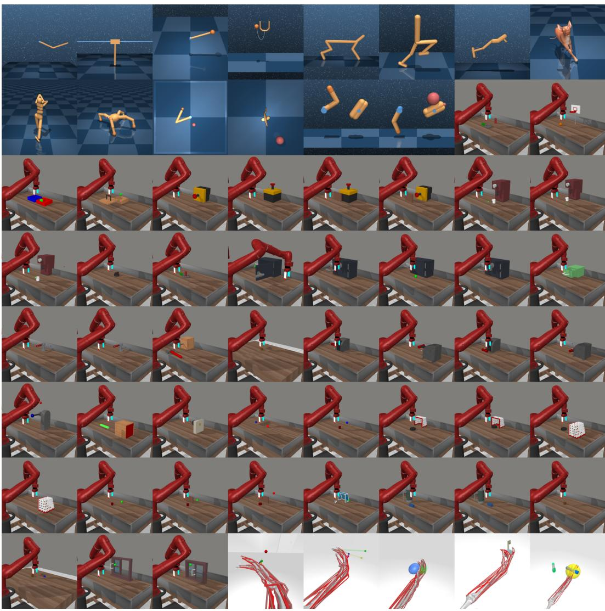
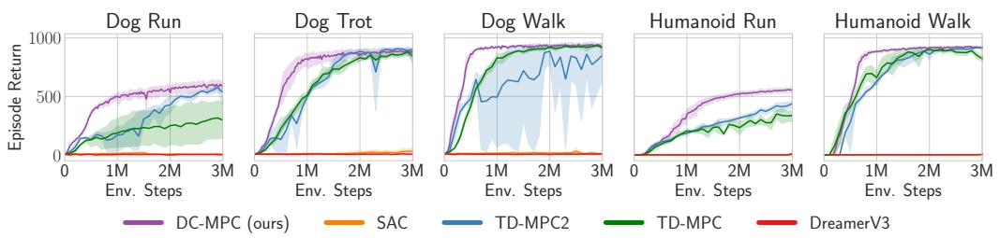
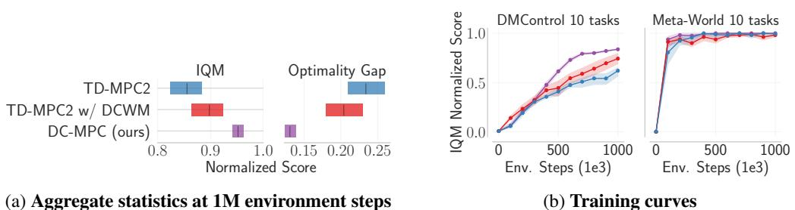
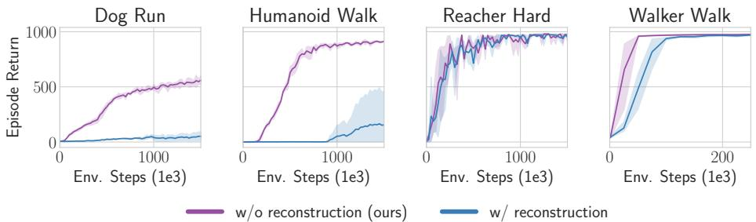

# 1. 论文基本信息

## 1.1. 标题

<strong>离散码本世界模型用于连续控制 (Discrete Codebook World Models for Continuous Control)</strong>

该标题直接点明了论文的核心技术：
*   <strong>世界模型 (World Models):</strong> 这是一种在强化学习中使用的模型，它学习环境的动态变化规律，如同一个内部的模拟器。
*   <strong>连续控制 (Continuous Control):</strong> 指的是智能体（例如机器人手臂）可以在一个连续范围内选择动作（如精确的角度或力度），这比只有几个离散选项（如“上、下、左、右”）的任务更具挑战性。
*   <strong>离散码本 (Discrete Codebook):</strong> 这是本文的创新核心。它没有使用传统的连续值来表示环境状态，而是将状态映射到一个预定义的、由离散“码字”组成的“码本”中。这是一种新颖的离散化表示方法。

    综合来看，标题表明本文提出了一种新方法，通过使用离散码本构建世界模型，来解决复杂的连续控制问题。

## 1.2. 作者

*   Mohammadreza Nakhaei, Kalle Kujanpää, Yi Zhao, Arno Solin, Joni Pajarinen: Aalto University
*   Aidan Scannell: University of Edinburgh
*   Kevin Sebastian Luck: Vrije Universiteit Amsterdam

    这些作者隶属于芬兰阿尔托大学、英国爱丁堡大学和荷兰阿姆斯特丹自由大学，这些都是在人工智能和机器学习领域享有盛誉的顶尖研究机构。这表明该研究团队具有坚实的学术背景。

## 1.3. 发表期刊/会议

本文是一篇预印本 (Pre-print) 论文，发布在 **arXiv** 平台上。arXiv 是一个公开的学术论文预发布平台，研究者们在论文被正式会议或期刊接收前，会在这里分享他们的最新成果。

从论文的研究主题、实验质量和写作风格来看，它极有可能是为 ICLR、NeurIPS、ICML 这类顶级人工智能会议准备的。

## 1.4. 发表年份

*   <strong>arXiv 提交时间 (UTC):</strong> 2025-03-01T22:58:44.000Z
*   **arXiv ID:** `2503.00653v1`

    这表示该论文版本于 2025 年 3 月提交。这是一个未来的日期，可能是提交系统中的元数据占位符或笔误，通常 `2503` 指的是 2025 年 3 月。考虑到当前时间，这篇论文代表了非常前沿的研究动态。

## 1.5. 摘要

论文首先介绍了<strong>世界模型 (World Models)</strong> 在强化学习中的作用，即作为内部模拟器帮助智能体进行规划。接着，论文指出了当前研究的一个矛盾点：
1.  **离散潜空间模型**（如 `DreamerV3`）在离散动作和视觉任务中表现优异，但在基于状态的连续控制任务中表现不佳。
2.  **连续潜空间模型**（如 `TD-MPC2`）在基于状态的连续控制任务中取得了巨大成功。

    这引出了本文的核心研究问题：离散潜空间是否真的不适合连续控制？作者的回答是否定的。论文通过研究证明：
*   **离散优于连续:** 对潜空间进行离散建模比连续建模更有优势。
*   **码本编码更优:** 使用<strong>码本编码 (codebook encodings)</strong> 来表示离散状态，比其他离散化方法（如 `one-hot` 编码或 `label` 编码）更有效。

    基于这些发现，论文提出了 **DCWM (Discrete Codebook World Model)**，一个具有离散随机潜空间的世界模型，其潜状态是码本中的码字。将 DCWM 与决策时规划结合，得到了最终的强化学习算法 **DC-MPC (Discrete Codebook Model Predictive Control)**。实验结果表明，DC-MPC 在连续控制基准测试中，与 `TD-MPC2` 和 `DreamerV3` 等最先进的算法相比，具有很强的竞争力。

## 1.6. 原文链接

*   **arXiv 摘要页:** https://arxiv.org/abs/2503.00653
*   **PDF 链接:** https://arxiv.org/pdf/2503.00653v1
*   **项目网站:** www.aidanscannell.com/dcmpc

# 2. 整体概括

## 2.1. 研究背景与动机

当前，在基于模型的强化学习（Model-Based RL）领域，如何为连续控制任务构建一个高效的世界模型是一个核心挑战。

*   **核心问题:** 智能体如何学习一个关于世界如何运作的内部模型，以便在不与真实世界交互的情况下“想象”和“规划”未来，从而做出更好的决策？
*   <strong>现有挑战与空白 (Gap):</strong>
    1.  **表示分歧:** 对于世界模型的“潜空间”（即对环境状态的内部压缩表示），存在两种主流方法：**连续潜空间**和**离散潜空间**。
    2.  **性能矛盾:** 在高难度的**连续控制**任务（如机器人行走）中，使用**连续潜空间**的 `TD-MPC2` 算法性能远超使用**离散潜空间**的 `DreamerV3` 算法。这似乎暗示离散表示不适合连续控制。
    3.  **未解之谜:** `DreamerV3` 的性能不佳，究竟是因为“离散化”这个思想本身有问题，还是因为它使用的具体离散化方法——`one-hot` 编码——不够好？此外，`DreamerV3` 依赖于图像重构，而 `TD-MPC2` 则不依赖，这也可能是性能差异的原因。

*   **本文切入点/创新思路:**
    作者没有直接否定离散潜空间，而是提出了一个大胆的假设：**问题不在于离散化本身，而在于如何离散化**。他们认为，一种更先进的离散表示方法——<strong>码本编码 (codebook encoding)</strong>，可以结合离散表示的优点（如避免误差累积、使用更高效的分类学习范式），同时克服传统离散表示（如`one-hot`）的缺点，从而在连续控制任务中取得优异表现。

## 2.2. 核心贡献/主要发现

论文的核心贡献清晰地列在引言部分，可以总结为三点：

1.  <strong>(C1) 证明离散优于连续：</strong> 在连续控制的背景下，论文通过实验证明，使用<strong>分类 (classification)</strong> 学习离散潜空间，比使用<strong>回归 (regression)</strong> 学习连续潜空间效果更好。这直接挑战了 `TD-MPC2` 所代表的主流范式。

2.  <strong>(C2) 证明码本编码的优越性：</strong> 论文证明了使用<strong>码本编码 (codebook encodings)</strong> 来构建离散潜状态，相比于 $DreamerV2/V3$ 使用的 `one-hot` 编码和简单的 `label` 编码，是一种更有效的表示方法。

3.  <strong>(C3) 提出新模型 DCWM 和 DC-MPC：</strong> 基于以上发现，论文提出了 **DCWM (Discrete Codebook World Model)** 及其对应的规划算法 **DC-MPC**。该模型在 DeepMind Control suite（高难度运动控制）和 Meta-World（机器人操作）等多个标准测试平台上，取得了与最先进算法相当甚至超越的性能。

# 3. 预备知识与相关工作

## 3.1. 基础概念

为了理解本文，我们需要了解以下几个基础概念：

*   <strong>强化学习 (Reinforcement Learning, RL):</strong> 一个机器学习分支，研究智能体 (`agent`) 如何在环境中 (`environment`) 采取动作 (`action`) 以最大化累积奖励 (`reward`)。智能体的决策逻辑被称为策略 (`policy`)。
*   <strong>模型驱动强化学习 (Model-Based RL):</strong> 与直接学习策略的模型无关 (`model-free`) 方法不同，该方法首先尝试学习一个环境的模型（即<strong>世界模型 (World Model)</strong>）。这个模型可以预测在当前状态 (`state`) 下执行某个动作后，环境会进入哪个新状态并给出多少奖励。有了这个模型，智能体就可以在“脑内”进行模拟和规划，从而提高学习效率。
*   <strong>潜空间 (Latent Space):</strong> 现实世界的观测（如图像、传感器数据）维度很高且包含大量冗余信息。潜空间是一个低维度的、压缩的表示空间。模型（如自编码器）将高维观测编码 (`encode`) 到潜空间中一个点（潜变量），这个潜变量捕获了观测的核心信息。
*   **离散 vs. 连续潜空间:**
    *   <strong>连续 (Continuous):</strong> 潜变量可以是某个范围内的任意实数值，如 $[0.3, -1.2, 5.4]$。
    *   <strong>离散 (Discrete):</strong> 潜变量只能从一个有限的集合中取值，如 `{A, B, C}`。
*   <strong>编码方式 (Encodings):</strong>
    *   <strong>标签编码 (Label Encoding):</strong> 将类别直接映射为整数，如 `{A: 1, B: 2, C: 3}`。缺点是引入了虚假的序数关系（即 $C > B > A$），这在类别没有内在顺序时是有害的。
    *   <strong>独热编码 (One-hot Encoding):</strong> 为每个类别创建一个向量，只有对应类别的位置为 1，其余为 0。如 `{A: [1,0,0], B: [0,1,0], C: [0,0,1]}`。优点是消除了序数关系，但当类别数量巨大时，维度会变得非常高，且表示稀疏。
    *   <strong>码本编码 (Codebook Encoding):</strong> 为每个类别分配一个低维、稠密的实数向量（码字），如 ${A: [-0.5, -0.5], B: [0, 0], C: [0.5, 0.5]}$。这种方式既可以像标签编码一样保留序数关系（如果码字被设计成有顺序的话），又比 `one-hot` 编码维度低、表示稠密。本文使用的码本编码能够保留多维度的序数关系。

## 3.2. 前人工作

*   <strong>Dreamer 系列 (V1, V2, V3):</strong> 这是基于世界模型的强化学习领域的里程碑式工作。
    *   `DreamerV1` 使用**连续潜空间**。
    *   `DreamerV2` 和 `V3` 转向了**离散潜空间**，使用 `one-hot` 编码表示状态，并取得了巨大成功。
    *   一个关键特点是，它们都依赖于<strong>观测重构 (observation reconstruction)</strong> 来学习世界模型，即模型需要能够根据潜状态生成回原始的图像。论文指出，这在连续控制任务中可能是有害的。
*   **TD-MPC / TD-MPC2:** 这是目前在连续控制任务中最先进的算法之一。
    *   它们使用**连续潜空间**。
    *   它们不使用观测重构，而是采用<strong>潜状态一致性损失 (latent-state consistency loss)</strong>，即模型被训练来预测下一个状态的潜表示，而非重构整个观测。
    *   `TD-MPC2` 的成功使得“连续潜空间 + 一致性损失”成为连续控制的主流范式。
*   <strong>矢量量化 (Vector Quantization, VQ):</strong> 如 `VQ-VAE` 所示，这是一种学习离散表示的经典方法。它通过学习一个码本，将连续的编码器输出映射到码本中最接近的码字。本文的方法与之相关，但采用了更简单的 **FSQ (Finite Scalar Quantization)**，它使用一个固定的、无需学习的码本，简化了训练过程。

## 3.3. 技术演进

1.  <strong>早期 (如 DreamerV1):</strong> 连续潜空间 + 观测重构。
2.  **DreamerV2/V3 演进:** 转向 **离散潜空间** (`one-hot`) + 观测重构，在许多任务上取得突破。
3.  **TD-MPC2 演进:** 坚持**连续潜空间**，但放弃观测重构，转向 **潜状态一致性损失**，在连续控制上超越 `DreamerV3`。
4.  **本文工作:** 结合了 $DreamerV2/V3$ 和 `TD-MPC2` 的思想。它采用 **离散潜空间**（继承自 `Dreamer`），但使用更先进的 **码本编码**，并采用 **潜状态一致性损失**（继承自 `TD-MPC2`）进行训练。

## 3.4. 差异化分析

| 特征 | `DreamerV3` | `TD-MPC2` | <strong>DC-MPC (本文)</strong> |
| :--- | :--- | :--- | :--- |
| **潜空间类型** | **离散** | **连续** | **离散** |
| **离散表示法** | `One-hot` 编码 | 不适用 | <strong>码本编码 (Codebook)</strong> |
| **核心学习损失** | 观测重构 | **潜状态一致性** | **潜状态一致性** |
| **动态模型** | 确定性（在分类空间） | 确定性（在连续空间） | <strong>随机性 (Stochastic)</strong> |
| **动态模型训练** | 分类损失 | 回归损失 (MSE) | <strong>分类损失 (Cross-Entropy)</strong> |

本文的核心创新在于，它识别出 `TD-MPC2` 的**潜状态一致性损失**和 `DreamerV2` 的**离散潜空间**各自的优点，并首次将它们与更高效的**码本编码**结合起来，创造出一个新的、更适合连续控制任务的SOTA（最先进的）模型。

# 4. 方法论

本节详细拆解论文提出的 **DC-MPC** 算法。它主要由两部分构成：世界模型 **DCWM** 的学习，以及利用该模型进行决策的 **MPC** 规划。

## 4.1. 方法原理

DC-MPC的核心思想是构建一个能够预测未来的世界模型（DCWM），但这个模型的内部状态表示是离散的。具体来说，它将来自环境的连续观测（如机器人的关节角度和速度）编码成一个码本中的特定“码字”。然后，模型学习在给定当前码字和智能体动作的情况下，预测下一个码字的概率分布。这种基于离散码字的预测允许模型使用**分类**（而不是回归）来学习环境动态，作者认为这种方式更鲁棒、更高效。学习完成后，智能体利用这个离散世界模型在“脑内”进行多步推演（规划），以找到当前最优的动作。

下图（原文 Figure 1）直观展示了 DCWM 的训练流程。

![Figure 1: World model training DCWM is a world model with a discrete latent space where each latent state is a discrete code $^ c$ () from a codebook $\\mathcal { C }$ Observations $^ o$ are first mapped through the encoder and then quantized $( \\circledast )$ into one of the discrete codes. We model probabilistic latent transition dynamics $p _ { \\phi } ( \\pmb { c } ^ { \\prime } | \\pmb { c } , \\pmb { a } )$ as a classifier such that it captures a potentially multimodal distribution over the next state $c ^ { \\prime }$ given the previous state $^ c$ and action $^ { a }$ During training, multi-step predictions are made using straight-through (ST) Gumbel-softmax sampling such that gradients backpropagate through time to the encoder. Given this discrete formulation, we train the latent space using a classification objective, i.e. cross-entropy loss. Making the latent representation stochastic and discrete with a codebook contributes to the very high sample efficiency of DC-MPC.](images/1.jpg)
*该图像是示意图，展示了 DCWM（离散码本世界模型）的训练过程。图中显示了从观察 $O_t$ 和 $O_{t+1}$ 经过编码器处理后生成的潜在代码 $c_t$ 和 $c_{t+1}$。利用动态建模 $p_\phi(c_{t+1} | c_t, a_t)$ 进行状态预测，并通过交叉熵损失进行训练。采用 ST Gumbel-softmax 采样方法，使得潜在表示具有随机性和离散性，提高样本效率。*

观测 $o_t$ 首先被编码并<strong>量化 (quantized)</strong> 为一个离散码字 $c_t$。然后，动态模型 $p_\phi(c'|c, a)$ 预测下一个码字的概率分布。这个过程利用了<strong>直通 Gumbel-softmax 采样 (Straight-through Gumbel-softmax sampling)</strong>，允许梯度在训练中通过离散的采样步骤进行反向传播。

## 4.2. 核心方法详解 (逐层深入)

### 4.2.1. DCWM: 离散码本世界模型

DCWM 由六个神经网络组件构成：

1.  <strong>编码器 (Encoder) $e_\theta$</strong>: 将高维观测 $o$ 映射到一个连续的潜向量 $x$。
    $$
    x = e_\theta(\boldsymbol{o}) \in \mathbb{R}^{b \times d}
    $$
    *   $o$: 环境观测。
    *   $x$: 编码器输出的连续潜向量。
    *   $b$: 通道数 (number of channels)，一个超参数。
    *   $d$: 潜空间维度 (latent dimension)，一个超参数。

2.  <strong>量化器 (Quantizer) $f(\cdot)$</strong>: 将连续潜向量 $x$ 映射到一个离散的码字 $c$。这通过<strong>有限标量量化 (Finite Scalar Quantization, FSQ)</strong> 实现。
    $$
    c = f(\boldsymbol{x}) \in \mathcal{C}
    $$
    *   $c$: 量化后的离散码字，是码本 $\mathcal{C}$ 中的一个元素。
    *   $\mathcal{C}$: 一个固定的、预定义的码本。

        FSQ 的具体实现如下。首先定义每通道的量化级别 $\mathcal{L} = \{L_1, L_2, ..., L_b\}$，$L_i$ 是第 $i$ 个通道的离散值数量。然后对每个通道应用以下函数：
    $$
    f : \boldsymbol{x}, \boldsymbol{\mathcal{L}}, i \to \mathrm{round}\left( \left\lfloor \frac{L_i}{2} \right\rfloor \cdot \tanh(\boldsymbol{x}_{i, :}) \right) \tag{7}
    $$
    *   $\boldsymbol{x}_{i, :}$: 编码器输出 $x$ 的第 $i$ 个通道。
    *   $\tanh(\cdot)$: 将输入压缩到 $[-1, 1]$ 范围。
    *   $\lfloor L_i/2 \rfloor$: 确定量化范围。例如，如果 $L_i=5$，则该值为 2，$\tanh$ 的输出乘以 2 后在 $[-2, 2]$ 之间。
    *   $\mathrm{round}(\cdot)$: 四舍五入到最近的整数。对于 $L_i=5$，可能的结果是 ${-2, -1, 0, 1, 2}$。
    *   这个过程对每个通道独立进行，最终得到一个由 $b$ 个整数符号组成的码字向量 $c$。整个码本 $\mathcal{C}$ 的大小为 $|\mathcal{C}| = \prod_{i=1}^{b} L_i$。

        由于 `round` 函数不可导，训练时使用<strong>直通估计器 (Straight-Through Estimator, STE)</strong> 来近似梯度。

    下图（原文 Figure 2）展示了一个 $b=3$ 的码本结构。它是一个三维超立方体，每个轴根据 $L_i$ 被离散化为若干个点。

    ![Figure 2: Illustration of Codebook $( \\mathcal { C } )$ FSQ's codebook is a $b$ -dimensional hypercube (left). This figure illustrates a $b { = } 3$ -dimensional codebook, where each axis of the 3-dimensional hypercube (left) corresponds to one dimension of the codebook (right). The $i ^ { \\mathrm { { t h } } }$ dimension of the hypercube is discretized into `L _ { i }` values, e.g., the $x$ and $y \\cdot$ -axis are discretized into `L _ { 0 } = L _ { 1 } = 5` and the $z$ -axis into $L _ { 3 } = 4$ . Code symbols (here integers) are normalized to the range $\[ - 1 , 1 \]$ .](images/2.jpg)
    *该图像是一个示意图，展示了一个$b=3$维的代码本（Codebook）`ext{C}`。每个坐标轴分别表示不同的维度，$x$和$y$轴被离散化为$L_{0}=L_{1}=5$个值，$z$轴为$L_{3}=4$个值。代码符号（整数）被规范化到区间$[-1, 1]$。*

3.  <strong>动态模型 (Dynamics Model) $p_\phi$</strong>: 这是一个**分类器**，预测在给定当前码字 $c$ 和动作 $a$ 的情况下，下一个码字 $c'$ 的概率分布。
    $$
    c' \sim \mathrm{Categorical}(p_1, \dots, p_{|\mathcal{C}|}) \quad \text{with } p_i = p_\phi(c' = c^{(i)} | c, \boldsymbol{a})
    $$
    *   $c^{(i)}$: 码本 $\mathcal{C}$ 中的第 $i$ 个码字。
    *   $p_i$: 下一个状态是 $c^{(i)}$ 的概率。这个概率分布是通过一个神经网络 $d_\phi(c, a)$ 输出的 `logits` 再经过 `softmax` 函数得到的。

4.  <strong>奖励预测器 (Reward Predictor) $R_\xi$</strong>: 预测在状态 $c$ 下执行动作 $a$ 能获得的奖励 $r$。
    $$
    r = R_\xi(c, \boldsymbol{a}) \in \mathbb{R}
    $$

5.  <strong>Q值函数 (Q-functions) $q_\psi$</strong>: 预测在状态 $c$ 下执行动作 $a$ 的未来累积奖励的期望值。采用 REDQ 的思想，使用一个 Q 函数<strong>集成 (ensemble)</strong> (例如 $N_q=5$ 个)来减少过高估计偏差。
    $$
    q = q_\psi(c, \boldsymbol{a}) \in \mathbb{R}^{N_q}
    $$

6.  <strong>策略 (Policy) $\pi_\eta$</strong>: 在给定状态 $c$ 时，输出一个动作 $a$。
    $$
    a = \pi_\eta(\boldsymbol{c})
    $$

### 4.2.2. 世界模型训练

编码器 $e_\theta$、动态模型 $p_\phi$ 和奖励预测器 $R_\xi$ 是联合训练的，目标是最小化以下损失函数：
$$
\mathcal{L}(\theta, \phi, \xi; \mathcal{D}) = \mathbb{E}_{(o, a, o', r)_{0:H} \sim \mathcal{D}} \left[ \sum_{h=0}^{H} \gamma^h \left( \underbrace{\mathrm{CE}\big( p_\phi(\hat{c}_{h+1} | \hat{c}_h, a_h), c_{h+1} \big)}_{\text{Latent-state consistency}} + \underbrace{\big\| R_\xi(\hat{c}_h, a_h) - r_h \big\|_2^2}_{\text{Reward prediction}} \right) \right] \tag{8}
$$
其中涉及的变量生成方式为：
$$
\underbrace{\hat{c}_0 = f(e_\theta(\boldsymbol{o}_0))}_{\text{First latent state}} \quad \underbrace{\hat{c}_{h+1} \sim p_\phi(\hat{c}_{h+1} | \hat{c}_h, a_h)}_{\text{Stochastic dynamics}} \quad \underbrace{c_h = \mathrm{sg}(f(e_\theta(\boldsymbol{o}_h)))}_{\text{Target latent code}}
$$
*   **训练流程拆解:**
    1.  从经验回放池 $\mathcal{D}$ 中采样一段轨迹 `(o, a, o', r)_{0:H}`。
    2.  将初始观测 $o_0$ 通过编码器和量化器得到第一个预测潜状态 $\hat{c}_0$。
    3.  对于后续的每一步 $h=0, \dots, H-1$：
        a.  使用动态模型 $p_\phi(\cdot | \hat{c}_h, a_h)$ 预测下一个潜状态的**概率分布**。
        b.  **通过 ST Gumbel-Softmax 从该分布中采样得到下一个预测状态 $\hat{c}_{h+1}$**。这是关键一步，它引入了随机性，同时允许梯度回传。
        c.  计算奖励预测损失：$|R_\xi(\hat{c}_h, a_h) - r_h|^2$。
        d.  获取**目标潜状态** $c_{h+1}$：将真实的下一时刻观测 $o_{h+1}$ 通过编码器和量化器得到，并使用 `sg` (stop-gradient) 阻止梯度流向目标网络。
        e.  计算潜状态一致性损失：使用<strong>交叉熵 (Cross-Entropy, CE)</strong> 损失来衡量预测分布 $p_\phi(\cdot|\hat{c}_h, a_h)$ 与目标 $c_{h+1}$ 之间的差距。
    4.  将所有步的损失加权求和，通过<strong>时间反向传播 (BPTT)</strong> 更新模型参数 $\theta, \phi, \xi$。

### 4.2.3. 策略和价值学习

策略 $\pi_\eta$ 和 Q 函数 $q_\psi$ 在学习好的潜空间中进行训练，采用的是一种改进的 TD3 算法（结合了 N-步回报和 REDQ）。

*   <strong>Q函数 (Critic) 更新:</strong> 最小化以下损失：
    $$
    \mathcal{L}_q(\psi; \mathcal{D}) = \mathbb{E}_{(o, a, o', r)_{n=1}^N \sim \mathcal{D}} \left[ \frac{1}{N_q} \sum_{k=1}^{N_q} (q_{\psi_k}(\underbrace{f(e_\theta(o_t))}_{c_t}, a_t) - y)^2 \right] \tag{9}
    $$
    其中，目标值 $y$ 的计算方式为：
    $$
    y = \sum_{n=0}^{N-1} \gamma^n r_{t+n} + \gamma^N \min_{k \in \mathcal{M}} q_{\bar{\psi}_k} (\underbrace{f(e_\theta(o_{t+N}))}_{c_{t+N}}, a_{t+N}), \quad \text{with } a_{t+n} = \pi_{\bar{\eta}}(c_{t+n}) + \epsilon_{t+n}
    $$
    *   这里使用了 **N-步回报** $\sum \gamma^n r_{t+n}$。
    *   $\mathcal{M}$ 是从 $N_q$ 个 Q 函数中随机抽取的两个。
    *   $\min_{k \in \mathcal{M}} q_{\bar{\psi}_k}(\dots)$ 体现了 TD3 的 Clipped Double Q-learning 思想，用以抑制 Q 值过高估计。
    *   $\bar{\psi}$ 和 $\bar{\eta}$ 是目标网络 (target networks) 的参数，通过对主网络参数进行平滑平均来更新。

*   <strong>策略 (Actor) 更新:</strong> 目标是最大化 Q 值，损失函数为：
    $$
    \mathcal{L}_\pi(\eta; \mathcal{D}) = - \mathbb{E}_{o_t \sim \mathcal{D}} \left[ \frac{1}{|\mathcal{M}|} \sum_{\psi_k \in \mathcal{M}} q_{\psi_k} \bigl( \underbrace{f(e_\theta(o_t))}_{c_t}, \pi_\eta(\underbrace{f(e_\theta(o_t))}_{c_t}) \bigr) \right] \tag{10}
    $$
    *   策略网络被更新以输出能够从 Critic 集成中获得更高平均 Q 值的动作。

### 4.2.4. 决策时规划

在每个环境步骤，DC-MPC 使用<strong>模型预测控制 (Model Predictive Control, MPC)</strong> 进行决策，具体的轨迹优化算法是 **MPPI (Model Predictive Path Integral)**。

*   **目标:** 寻找一个 $H$ 步的动作序列 $a_{0:H}$，以最大化以下目标函数：
    $$
    J(a_{0:H}, o) = \sum_{h=0}^{H-1} \gamma^h R_\xi(\hat{c}_h, a_h) + \gamma^H \frac{1}{|\mathcal{M}|} \sum_{\psi_k \in \mathcal{M}} q_{\psi_k}(\hat{c}_H, a_H) \tag{11}
    $$
    *   这个目标函数由两部分组成：(1) 在规划时域 $H$ 内的**累积预测奖励**；(2) 在时域末端用 Q 函数估计的**未来价值**（也叫终端价值）。

*   **规划中的动态演化:**
    $$
    \text{s.t.} \quad \hat{c}_0 = f(e_\theta(o)) \quad \text{and} \quad \hat{c}_{h+1} = \sum_{i=1}^{|\mathcal{C}|} \mathrm{Pr}(\hat{c}_{h+1} = c^{(i)} | \hat{c}_h, a_h) c^{(i)}
    $$
    *   **关键区别:** 在规划时，为了降低随机性、使规划更稳定，模型不再从动态模型中**采样**下一个状态，而是计算**期望状态**。期望状态是码本中所有码字根据其出现概率的加权平均。尽管结果可能不是一个有效的码字，但由于码本编码具有序数结构，这种插值是有效且有意义的。

*   **MPPI 流程:** 这是一个迭代的、基于采样的优化过程。
    1.  从一个高斯分布中采样大量候选动作序列。
    2.  使用世界模型 DCWM 对每个序列进行“想象”，并用公式 (11) 计算其得分。
    3.  根据得分对动作序列进行加权平均，更新高斯分布的均值和方差。
    4.  重复以上步骤数次。
    5.  最终，执行优化后得到的最佳动作序列的第一个动作，然后进入下一个环境步骤，重新开始规划。

# 5. 实验设置

## 5.1. 数据集

实验在三个广泛使用的连续控制基准测试平台上进行：

*   **DeepMind Control Suite (DMControl):** 包含一系列基于物理模拟的运动控制任务，如 `Cheetah Run` (猎豹快跑)、`Walker Walk` (双足机器人行走)，以及极具挑战性的高维任务 `Humanoid Walk` (人形机器人行走) 和 `Dog` (四足狗机器人)。这些任务的观测空间和动作空间维度各不相同。
*   **Meta-World:** 一个专注于多任务和元强化学习的机器人操作任务套件。任务包括 `Button Press` (按按钮)、`Door Open` (开门)、`Pick Place` (拾取和放置)等。这些任务共享相似的机器人臂和工作空间。
*   **MyoSuite:** 一个用于肌肉骨骼运动控制的模拟套件，包含高维度的灵巧手操作任务，如 `Hand Key Turn` (转动钥匙)、`Hand Pen Twirl` (转笔)等。

    下图（原文 Figure 21）展示了这些任务的可视化示例。

    
    *该图像是任务可视化示意图，展示了 DMControl、Meta-World 和 MyoSuite 等任务的不同场景，通过一系列步骤呈现了操作过程和对象交互。*

选择这些多样化的数据集能够全面评估算法在不同类型的连续控制问题（运动、操作、高维复杂动力学）上的性能和泛化能力。

## 5.2. 评估指标

论文使用了强化学习领域的标准评估指标。

*   <strong>Episode Return (回合回报):</strong>
    1.  **概念定义:** 智能体在一个完整的回合（从开始到结束或达到最大步数）中所获得的所有奖励的总和。它直接衡量智能体在该回合中的表现好坏。值越高，表示表现越好。
    2.  **数学公式:**
        $$
        \text{Return} = \sum_{t=0}^{T-1} r_t
        $$
    3.  **符号解释:**
        *   $T$: 回合的长度。
        *   $r_t$: 在时间步 $t$ 获得的奖励。

*   <strong>Success Rate (成功率):</strong>
    1.  **概念定义:** 主要用于评估具有明确成功/失败标准的目标导向任务（如 Meta-World 中的任务）。它衡量在一系列评估回合中，智能体成功完成任务的回合所占的百分比。
    2.  **数学公式:**
        $$
        \text{Success Rate} = \frac{\text{Number of successful episodes}}{\text{Total number of evaluation episodes}} \times 100\%
        $$
    3.  **符号解释:**
        *   `successful episodes`: 成功完成任务的回合数量。
        *   `evaluation episodes`: 用于评估的总回合数量。

*   <strong>Interquartile Mean (IQM, 四分位均值):</strong>
    1.  **概念定义:** 一种鲁棒的统计平均方法。它首先去除数据中最高和最低的 25%（即第一和第四个四分位数），然后计算剩余 50% 数据的平均值。在强化学习中，由于算法性能的随机性很大，多次实验的结果可能会有极端值（异常好或异常差），IQM 能有效减少这些极端值对总体性能评估的影响，比普通均值更稳定。
    2.  **数学公式:**
        设有一组排序后的数据 $X = \{x_1, x_2, \dots, x_n\}$，则
        $$
        \text{IQM}(X) = \frac{2}{n} \sum_{i=\lfloor n/4 \rfloor + 1}^{\lceil 3n/4 \rceil} x_i
        $$
    3.  **符号解释:**
        *   $n$: 数据点的总数。
        *   $x_i$: 排序后第 $i$ 个数据点。
        *   $\lfloor \cdot \rfloor, \lceil \cdot \rceil$: 向下和向上取整。

## 5.3. 对比基线

论文将 DC-MPC 与以下四个代表性的算法进行了比较：

*   **DreamerV3:** 最先进的基于**离散潜空间** (`one-hot`) 和**观测重构**的世界模型。是验证本文离散表示优越性的关键对比对象。
*   **TD-MPC2:** 最先进的基于**连续潜空间**和**潜状态一致性**的世界模型，也是本文在连续控制任务上的主要竞争对手。
*   **TD-MPC:** TD-MPC2 的前身，作为一个性能较强的基线。
*   **SAC (Soft Actor-Critic):** 一种非常流行且性能强大的<strong>模型无关 (model-free)</strong> 算法。将模型驱动的 DC-MPC 与 SAC 比较，可以展示出世界模型带来的样本效率优势。

# 6. 实验结果与分析

论文通过一系列精心设计的实验来回答其提出的四个研究问题（RQ1-RQ4）。

## 6.1. 核心结果分析

### 6.1.1. RQ1 & RQ2: 潜空间设计的重要性 (离散 vs 连续, 分类 vs 回归)

下图（原文 Figure 3）的消融实验结果直接回答了这两个问题。

![Figure 3: Latent space ablation Evaluation of (i) discrete (Discrete) vs continuous (Continuous) latent spaces, (ii) using cross-entropy (CE) vs mean squared error (MSE) for the latent-state consistency loss, and (ii) formulating a deterministic (det) vs stochastic (stoch) dynamics model. Discretizing the latent space (red) improves sample efficiency over the continuous latent space (orange) and formulating stochastic dynamics and training with cross-entropy (purple) improves performance further.](images/3.jpg)
*该图像是图表，展示了在500,000个环境步骤下的聚合统计数据及训练曲线。左侧统计显示了不同方法的归一化得分，右侧则是DMControl和MetaWorld 10任务的训练曲线，表明离散编码模型在训练效率上优于连续模型。*

*   **离散 vs. 连续:** 比较 $Discrete+MSE$ (红色) 和 `Continuous` (橙色)。在两个任务集上，离散表示的样本效率都明显更高。这初步验证了<strong>离散潜空间在连续控制中是有优势的 (C1)</strong>。
*   **分类 vs. 回归 & 随机 vs. 确定:** 比较 $Discrete+CE+stoch$ (紫色，即完整 DC-MPC) 和 $Discrete+MSE+det$ (红色)。紫色曲线性能显著优于红色曲线。这表明，在离散空间中，使用<strong>随机动态模型 (stochastic dynamics)</strong> 并通过<strong>分类损失 (cross-entropy, CE)</strong> 进行训练，比使用确定性动态模型和回归损失 (MSE) 更有效。这进一步强化了 C1。

    综合来看，**一个离散的、随机的、并使用分类损失训练的潜空间是性能的关键**。

### 6.1.2. RQ3: 码本编码的优越性

下图（原文 Figure 4）比较了不同离散编码方式对性能的影响。

![Figure 4: Discrete encodings ablation DC-MPC with its discrete codebook encoding (purple) outperforms using DC-MPC with one-hot encoding (red) and label encoding (blue), in terms of both sample efficiency (left) and computational efficiency (right). Dynamics model used codes $p _ { \\phi } ( \\mathbf { c } ^ { \\prime } \\mid \\mathbf { c } , \\mathbf { a } )$ whilst reward $R _ { \\xi } ( { \\bf e } , { \\bf a } )$ , critic $\\bar { Q _ { \\psi } } ( { \\bf e } , { \\bf a } )$ and prior policy $\\pi _ { \\eta } ( \\mathbf { e } )$ used the respective encoding e.](images/4.jpg)
*该图像是一个示意图，展示了不同编码方式在连续控制任务中的表现，包括“Dog Run”和“Humanoid Walk”两种任务。图中比较了具有离散代码本编码（紫色）、一热编码（红色）和标签编码（蓝色）的DC-MPC算法在样本效率和计算效率上的成绩。可以看到，“Codes”方法在各个任务中都表现出明显的优势，特别是在环境步骤和时间的不同场景下，复合编码方式的性能更优。*

*   <strong>样本效率 (左侧图):</strong> `Codes` (紫色，码本编码) 的学习速度和最终性能在所有任务上都优于或等于 `One-hot` (红色) 和 `Label` (蓝色)。特别是在 `Humanoid Walk` 这种复杂任务中，`Label` 编码完全失败，`One-hot` 编码也远不如 `Codes`。
*   <strong>计算效率 (右侧图):</strong> `Codes` (紫色) 和 `Label` (蓝色) 的训练时间远少于 `One-hot` (红色)。这是因为 `one-hot` 编码导致输入网络的向量维度急剧增加，大大增加了计算开销。

    **结论：** 码本编码在样本效率和计算效率上都取得了最佳平衡，验证了<strong>码本编码是比 `one-hot` 或 `label` 编码更优越的表示方法 (C2)</strong>。其优势在于能够以低维度、稠密的方式有效捕捉状态的**多维序数关系**。

### 6.1.3. RQ4: 与最先进算法的性能对比

下图（原文 Figure 5）展示了 DC-MPC 与各基线在三个基准测试平台上的总体性能。

*该图像是图表，展示了在 DMControl、Meta-World 和 MyoSuite 三个任务集上，不同算法的训练曲线。DC-MPC 的表现与 TD-MPC2 相当，且在所有任务上优于 DreamerV3、SAC 和 TD-MPC。图中展示了均值（实线）和 $95\\%$ 的置信区间（阴影部分）。*

*   **总体表现:** DC-MPC (紫色) 的性能曲线通常与最强的基线 TD-MPC2 (蓝色) 并驾齐驱，甚至在某些情况下略有超越。同时，它**显著优于** DreamerV3 (红色)、SAC (橙色) 和 TD-MPC (绿色)。

    下图（原文 Figure 13）在高维运动任务中的表现尤为突出。

    
    *该图像是图表，展示了在复杂高维运动任务中，DC-MPC（紫色）在不同环境步骤下相比于TD-MPC2（蓝色）和DreamerV3（红色）的表现，DC-MPC显著优于其他算法。*

*   **高维任务优势:** 在 `Dog` 和 `Humanoid` 这类观测和动作空间维度都极高的复杂任务中，DC-MPC 的性能**显著超越**了所有基线，包括 TD-MPC2。这表明，本文提出的离散码本表示法在处理高维状态空间时具有特别的优势，可能是因为它能更有效地进行状态抽象和压缩。

    这些结果强有力地证明了 <strong>DC-MPC 是一个具有强大竞争力的 SOTA 算法 (C3)</strong>。

## 6.2. 消融实验/参数分析

论文还进行了一系列深入的消融实验，以验证各个设计选择的合理性。

*   **将 DCWM 植入 TD-MPC2:**
    下图（原文 Figure 6）展示了一个非常有趣的实验：将 TD-MPC2 的连续潜空间替换为本文提出的离散码本世界模型 (DCWM)。

    
    *该图像是图表，展示了在1M环境步数下TD-MPC2与DCWM结合后的性能表现与DC-MPC的对比。左侧为聚合统计，右侧显示DMControl和Meta-World的训练曲线。结果表明，将DCWM引入TD-MPC2显著提升了性能。*

    结果显示，`TD-MPC2 + DCWM` (红色) 的性能优于原始的 `TD-MPC2` (蓝色)。这强有力地佐证了论文的核心论点：**离散码本潜空间本身就是一种更优越的设计**，其优势可以迁移到其他算法框架中。

*   **观测重构的负面影响:**
    `DreamerV3` 在连续控制任务中表现不佳，一个可能的猜测是其依赖于观测重构。下图（原文 Figure 20）验证了这一点。

    
    *该图像是图表，展示了不同任务中加入观察重构对DC-MPC性能的影响。四个子图分别为：Dog Run、Humanoid Walk、Reacher Hard 和 Walker Walk，以及环境步数与回报关系。添加重构的模型（蓝色）在多数任务中表现逊色于不添加重构的模型（紫色）。*

    当在 DC-MPC 中加入观测重构损失后（蓝色曲线），其性能在所有任务中都出现了**显著下降**，尤其是在 `Dog Run` 和 `Humanoid Walk` 中几乎无法学习。这解释了为什么将 DCWM 植入 DreamerV3 框架（原文 Figure 19）没有带来提升——因为 DreamerV3 的瓶颈在于其基于重构的学习范式，而非离散表示本身。

*   **对码本大小和潜空间维度的敏感性:**
    *   <strong>码本大小 (Figure 7):</strong> 实验表明，算法对码本大小不特别敏感，但过大的码本会减慢学习速度。
    *   <strong>潜空间维度 (Figure 8):</strong> 算法对潜空间维度 $d$ 同样鲁棒，但维度过小（如 $d=128$）会在 `Humanoid Walk` 等复杂任务中影响性能。

        这些实验结果共同构建了一个完整的论证链条，清晰地揭示了 DC-MPC 成功的关键因素。

# 7. 总结与思考

## 7.1. 结论总结

本文提出了一种用于连续控制的、基于离散码本的世界模型 **DC-MPC**。通过严谨的实验和消融分析，论文得出了以下关键结论：

1.  **离散表示在连续控制中是可行的且有优势的**，前提是使用正确的表示方法和学习范式。
2.  <strong>码本编码 (Codebook Encoding)</strong> 是一种比 `one-hot` 或 `label` 编码更高效、更强大的离散表示方法，因为它能以低维稠密的方式捕捉状态的序数结构。
3.  **结合了潜状态一致性损失和分类训练的离散世界模型**，其性能优于传统的基于回归的连续模型和基于重构的离散模型。
4.  最终提出的 **DC-MPC** 算法在多个高难度的连续控制基准上达到了<strong>最先进 (state-of-the-art)</strong> 的性能，尤其在处理高维状态空间时表现突出。

    这项工作为世界模型的设计开辟了一个有趣的新方向，即在连续控制领域重新审视和发展离散潜空间表示。

## 7.2. 局限性与未来工作

作者在论文中坦诚地指出了当前工作的一些局限性，并展望了未来的研究方向：

*   **局限性:**
    *   **超参数敏感:** 当前版本的 DC-MPC 并非对所有任务都使用单一的超参数集。例如，探索噪声的衰减策略和 N-步回报的长度 $N$ 需要针对部分任务进行调整。这影响了算法的通用性和易用性。

*   **未来工作:**
    *   **提升鲁棒性:** 引入更自适应的机制，如 $\lambda$-returns，来替代固定的 N-步回报，或动态调整 MPPI 的温度参数，以减少对超参数的依赖。
    *   **更智能的探索:** 当前的探索依赖于简单的噪声注入。未来可以引入基于<strong>认知不确定性 (epistemic uncertainty)</strong> 的探索机制，让智能体主动探索模型最不确定的状态区域。
    *   <strong>探索不同骨干网络 (backbone):</strong> 将 DCWM 的思想与更先进的神经网络架构（如 `Transformers` 和 `Diffusion Models`）相结合。
    *   **可扩展性与通用智能体:** 探究 DC-MPC 是否能有效扩展到更大规模的模型和数据，并应用于构建能够处理多种不同任务和形态的<strong>通用智能体 (generalist agent)</strong>。

## 7.3. 个人启发与批判

这篇论文给我带来了深刻的启发，同时也引发了一些思考：

*   **启发:**
    1.  **"旧瓶装新酒"的创新:** 本文的成功并不在于发明了某个全新的、革命性的组件，而在于对现有技术的深刻洞察和巧妙重组。它将 `Dreamer` 的离散思想和 `TD-MPC2` 的训练范式结合，并用 `FSQ` 这种更合适的工具进行升级，最终在一个“离散表示不被看好”的领域取得了突破。这体现了做研究的一种重要思路：**深入理解现有方法的优缺点，并进行创造性的“杂交”**。
    2.  **表示是核心:** 论文再次强调了“表示学习”在强化学习中的核心地位。一个好的状态表示能够极大地简化后续的动态预测和策略学习问题。离散码本提供了一种在连续和完全离散之间的优美折中。
    3.  **实验设计的典范:** 论文的实验设计非常严谨、层层递进。从核心思想的验证，到不同组件的消融，再到与其他框架的“嫁接”实验，整个论证过程清晰有力，令人信服。

*   **批判性思考:**
    1.  **码本设计的局限性:** 本文使用的 FSQ 码本是固定的、非学习的。虽然这简化了训练，但也可能限制了表示的灵活性。一个自适应的、可学习的码本（如 VQ-VAE）理论上可能更强大，尽管作者在附录中指出 VQ 需要更多针对环境的调整。如何设计一个既灵活又易于训练的离散码本，是一个值得探索的方向。
    2.  **对确定性环境的随机建模:** 论文中的实验环境（如 DMControl）大多是确定性的，但 DC-MPC 却使用了随机动态模型并从中受益。作者推测这可能与训练时使用的 ST Gumbel-Softmax 采样有关。这种“在确定性问题中引入随机性以改善学习”的现象非常有趣，其背后的理论原理值得更深入的探究。它可能起到了一种正则化的作用，防止模型对某些特定转变过拟合。
    3.  **计算成本:** 虽然码本编码比 `one-hot` 高效，但与 `TD-MPC2` 的连续表示相比，动态模型需要为码本中的每一个码字（$|\mathcal{C}|$个）都预测一个概率，这在码本非常大时可能会成为计算瓶颈。虽然作者使用的码本大小（15）不大，但在更复杂的任务中是否需要更大的码本，以及其带来的计算开销如何，是需要进一步评估的。