# 离散代码本世界模型用于连续控制

穆罕默德·雷扎·纳哈伊\* 阿尔托大学 艾登·斯坎内尔† 爱丁堡大学 aidan.scannell@ed.ac.uk 卡莱·库亚宁\* 阿尔托大学 赵懿 阿尔托大学 凯文·塞巴斯蒂安·拉克 阿姆斯特丹自由大学 阿诺·索林 阿尔托大学 约尼·帕亚里宁 阿尔托大学

# 摘要

在强化学习（RL）中，世界模型充当内部模拟器，使智能体能够预测环境动态和未来结果，从而做出明智的决策。尽管先前采用离散潜空间的方法，如DreamerV3，在离散动作设置和视觉控制任务中展示了强劲的表现，但它们在基于状态的连续控制中的比较性能仍然未被充分探讨。相比之下，采用连续潜空间的方法，如TD-MPC2，在基于状态的连续控制基准测试中取得了显著成功。在本文中，我们展示了模型化离散潜状态相较于连续潜状态的优势，并且离散码本编码相比于其它编码方法（如独热编码和标签编码）更适合于连续控制。基于这些见解，我们引入了DCWM：离散码本世界模型，这是一种自监督的世界模型，具有离散和随机的潜空间，其中潜状态是来自于码本的编码。我们将DCWM与决策时间规划结合，形成我们的基于模型的RL算法，命名为DC-MPC：离散码本模型预测控制，该算法在连续控制基准测试中与包括TD-MPC2和DreamerV3在内的最新最先进算法表现竞争力。请查看我们的项目网站 www.aidanscannell.com/dcmpc。

# 1 引言

在基于模型的强化学习中，世界模型（Ha & Schmidhuber, 2018）被引入以数据驱动的方式模拟或预测环境的动态。配备世界模型的智能体可以通过在模型中“模拟”可能的行动并“想象”结果来对其环境进行预测。这使得智能体能够根据（学习到的）奖励函数进行规划和预期结果，并额外具备在真实世界采取行动之前设想转移和结果的能力，从而提高样本效率。

其中一个最先进的世界模型，DreamerV2/V3（Hafner等，2022；2023），在各种任务中表现出色，通过在世界模型中“想象”未来状态的序列并利用它们来改进其策略。有趣的是，DreamerV2/V3 引入了一种离散潜空间，采用独热编码的形式，相较于其前身 DreamerV1（Hafner等，2019a）具有显著优势。这表明离散潜空间可能在某些方面优于连续潜空间。这可能是因为离散潜空间有助于避免在多步时间跨度内的累积误差，或使策略和价值学习能够利用离散变量处理的优势，从而提高效率和互操作性。在生成建模的背景下，离散代码本已成为多种成功方法的核心（Chang等，2023；Esser等，2021；Ramesh等，2021）。然而，在连续控制的背景下，TD-MPC2（Hansen等，2023）使用连续潜空间，并显著超越了 DreamerV3。尽管 TD-MPC2 和 DreamerV2/V3 之间存在多种差异，但在本文中，我们特别感兴趣的是探讨离散潜空间是否能为连续控制带来优势。

最近，Farebrother 等人（2024）展示了使用分类训练价值函数相比于使用回归训练可能拥有优势。这些优势可能源于 $(i)$ 分类在训练过程中考虑了不确定性（通过交叉熵损失），$(ii)$ 类别分布是多模态的，因此在训练过程中可以考虑多个模式，或者 $(iii)$ 在离散空间中学习更为高效。在世界模型的背景下，自然会问，使用 $(i)$ 离散与连续潜在空间和 $(ii)$ 建模确定性与随机转移动态时，可以获得什么样的好处。此外，在考虑随机潜在转移动态时，使用 $(i)$ 单峰分布（例如在连续潜在空间中的高斯分布）与 $(ii)$ 多峰分布（例如在离散潜在空间中的类别分布）建模的效果是什么。本文在基于模型的强化学习的世界模型背景下探讨这些观点，即通过分类学习离散潜在空间是否比通过回归学习连续潜在空间更具优势。贡献主要包括： (C1) 在连续控制的背景下，我们展示了使用分类学习离散潜在空间确实比使用回归学习连续潜在空间更具优势。 (C2) 我们表明，使用码本编码构造离散潜在状态相比于其他替代方法（如一热编码（如 DreamerV2/V3）和标签编码）具有优势。 (C3) 基于我们的见解，我们引入了离散码本世界模型（DCWM）：一种具有离散潜在空间的世界模型，其中每个潜在状态都是来自码本的离散编码。它在 DeepMind Control 套件（Tassa 等人，2018）中的困难运动任务和 Meta-World（Yu 等人，2019）中的操作任务中表现出色。

# 2 相关工作

在本节中，我们回顾了基于模型的强化学习中的世界模型。我们介绍了两种竞争性的方法来学习潜在空间：(i) 使用观测重构的方法和 (ii) 使用潜在状态时间一致性目标的方法。然后，我们比较了使用回归学习连续潜在空间的方法和使用分类学习离散潜在空间的方法。

世界模型 基于模型的强化学习通常被认为比基于无模型的方法更具样本效率。这是因为它学习一个模型，可以在其中推理世界，而不仅仅是尝试学习一个策略或价值函数来最大化回报（Ha & Schmidhuber, 2018）。世界模型可用于规划（Allen & Koomen, 1983；Basye et al., 1992）。一个突出的想法是优化观察和奖励序列的证据下界，以学习在学习的变分自编码器（VAE，Kingma & Welling (2014)；Igl et al. (2018)）的潜在空间中操作的世界模型。这些模型依赖于最大化条件观察似然 $p ( \pmb { o } _ { t } | \pmb { z } _ { t } )$，即重建目标。该模型的潜在空间随后可以用于两种方式的策略学习：在世界模型的想象中进行离线规划，例如 Dreamer（Hafner et al., 2019a），或用于决策时规划（Rubinstein, 1997；Hafner et al., 2019b；Schrittwieser et al., 2020）。

潜在状态一致性 使用重建损失来学习潜在状态表示是件不可靠的事情（Lutter et al., 2021），并且在各种基准上可能对基于模型的方法性能产生不利影响（Kostrikov et al., 2020; Yarats et al., 2021a）。为此，TD-MPC（Hansen et al., 2022）及其后继版本TD-MPC2（Hansen et al., 2023）使用一致性损失来学习用于使用模型预测路径积分（MPPI）控制的规划表示，并结合通过时间差分方法学习的奖励和价值函数（Williams et al., 2015）。值得注意的是，许多先前的工作使用自监督潜在状态一致性目标的变体来学习潜在状态表示（Schwarzer et al., 2020; Wang et al., 2022; Ghugare et al., 2022; LeCun; Georgiev et al., 2024; Scannell et al., 2024b; Zhao et al., 2023; Scannell et al., 2024a）。考虑到在连续控制任务中成功学习表示而不需要观察重建，我们主要集中在这一类方法，即使用潜在状态一致性损失的方法。离散潜在空间 DreamerV1（Hafner et al., 2019a）、DreamerV2（Hafner et al., 2022）和DreamerV3（Hafner et al., 2023）是世界模型方法，通过想象的过渡从其世界模型中学习策略。它们在学习世界模型时利用观察重建，并在各种任务中表现良好。然而，它们在连续控制任务中明显不及TD-MPC2，该方法不进行观察重建。特别有趣的是，DreamerV2/V3引入了一种离散潜在空间，以独热编码的形式，并通过分类目标进行训练，显著提升了性能。相较之下，

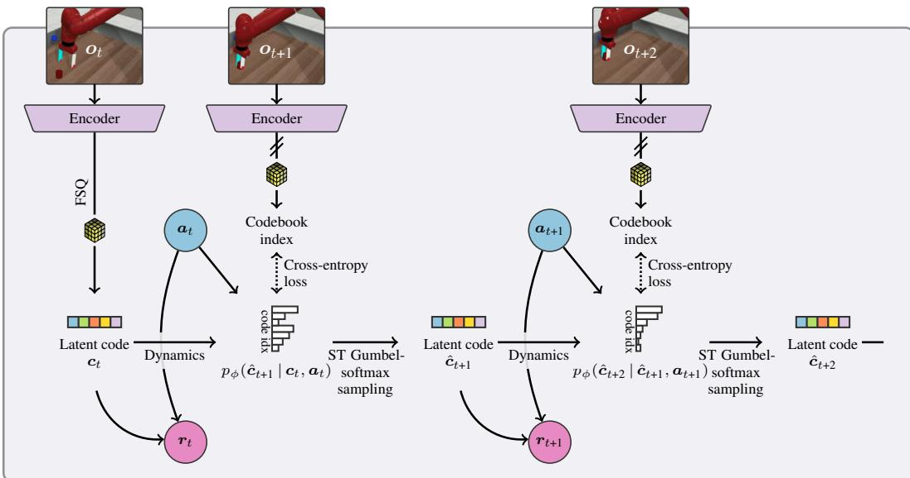  

Figure 1: World model training DCWM is a world model with a discrete latent space where each latent state is a discrete code $^ c$ () from a codebook $\mathcal { C }$ Observations $^ o$ are first mapped through the encoder and then quantized $( \circledast )$ into one of the discrete codes. We model probabilistic latent transition dynamics $p _ { \phi } ( \pmb { c } ^ { \prime } | \pmb { c } , \pmb { a } )$ as a classifier such that it captures a potentially multimodal distribution over the next state $c ^ { \prime }$ given the previous state $^ c$ and action $^ { a }$ During training, multi-step predictions are made using straight-through (ST) Gumbel-softmax sampling such that gradients backpropagate through time to the encoder. Given this discrete formulation, we train the latent space using a classification objective, i.e. cross-entropy loss. Making the latent representation stochastic and discrete with a codebook contributes to the very high sample efficiency of DC-MPC.

TD-MPC2通过均方误差回归学习连续潜在空间。在本文中，我们关注于通过分类学习离散潜在空间，然而，与DreamerV2/V3相比，我们希望避免观测重构，因为在连续控制中其表现不佳（见图20），而是通过自监督潜在状态一致性损失来学习潜在空间。

# 3 初步概念

在本节中，我们回顾不同类型的离散编码，并比较它们的优缺点。首先，我们假设有三个离散类别：$A$, $B$, 和 $C$。 • 独热编码 给定类别 $A$, $B$, 和 $C$，独热编码的形式为 $e(A) = [1, 0, 0]$，$e(B) = [0, 1, 0]$，和 $e(C) = [0, 0, 1]$。 • 标签编码 给定类别 $A$, $B$, 和 $C$，标签编码的结果为 $e(A) = 1$，$e(B) = 2$，和 $e(C) = 3$。 • 码本编码 给定类别 $A$, $B$, 和 $C$，码本编码可能为 $e(A) = [-0.5, -0.5]$，$e(B) = [0, 0]$，和 $e(C) = [0.5, 0.5]$。

顺序关系 如果我们有一个顺序关系 $A < B < C$，标签和码本编码可以确保 $| e ( A ) - \bar { e } ( B ) | < | e ( A ) - e ( C ) |$，其中 $e ( \cdot )$ 是编码函数。在这种情况下，全球排序在码本的两个维度上得以保留。值得注意的是，码本编码灵活到足以在多个维度中建模顺序关系。例如，以下代码向量在其两个维度上呈现相反的排序 $e ( E ) = [ 0 . 5 , - 0 . 5 ]$，$e ( F ) = [ 0 , \bar { 0 } ]$，$e ( G ) = [ - 0 . 5 , 0 . 5 ]$，这增加了建模的灵活性。然而，一次性编码导致对于所有不同对 $| e ( A ) - e ( B ) | = | e ( A ) - e ( C ) | = { \sqrt { 2 } }$，从而消除了任何排序概念。虽然在某些场景中，这可能是有利的，例如，当建模不同类别如水果时，但这意味着它们无法捕捉连续数据中的固有排序。 稀疏性和维度 一次性编码的另一个缺点是它们会产生稀疏数据（即，包含许多零值的数据），这可能对神经网络训练产生负面影响。相比之下，标签和码本编码产生密集数据（即，许多非零值）。最后，值得注意的是，一次性编码具有高维度，尤其是在类别很多的情况下。这使得它们在使用大量类别时占用大量内存并且训练速度较慢。在这项工作中，我们展示了来自量化的离散码本编码（Mentzer et al., 2024）在学习连续控制的离散潜在空间时，相比一次性编码和标签编码具有优势。这是因为它们在多个维度中保持顺序关系，同时更简单、维度更低且内存需求更少。

# 4 方法

在本节中，我们详细介绍了我们的算法，称为离散代码簿模型预测控制（DC-MPC），这是一种基于模型的强化学习算法，它（i）利用离散潜在空间学习世界模型，称为离散代码簿世界模型（DCWM），然后（ii）使用MPPI进行决策时间规划。本文的主要贡献在于通过量化构建离散潜在空间，使得潜在状态是来自代码簿的代码。这使我们能够以自监督的方式通过分类训练潜在表示。有关DCWM的概述请参见图1，世界模型训练的详细信息请参见算法1，MPPI规划过程的详细信息请参见算法2。

我们考虑马尔可夫决策过程（MDPs，Bellman（1957））$\mathcal{M} = (\mathcal{O}, \mathcal{A}, \mathcal{P}, \mathcal{R}, \gamma)$，其中智能体在时间步$t$接收到观察$\mathbf{\sigma}_{o_{t}} \in \mathcal{O}$，执行动作$\mathbf{a}_{t} \in \mathcal{A}$，然后获得下一个观察$\mathbf{\sigma}_{\mathbf{\sigma}_{t+1}} \sim \mathcal{P}(\cdot \mid \mathbf{\sigma}_{\mathbf{\sigma}_{t}}, \mathbf{\sigma}_{\mathbf{\lambda}_{t}})$和奖励$r_{t} = \mathcal{R}(o_{t}, \mathbf{a}_{t})$。折扣因子用$\gamma \in [0, 1)$表示。

# 4.1 世界模型

学习离散潜在空间的世界模型（例如 DreamerV2）在多种领域中证明了其强大性。然而，与使用连续潜在空间的算法（如 TD-MPC2 和 TCRL (Zhao et al., 2023)）相比，这些方法在连续控制任务中的表现一般较差。与 DreamerV2 中使用一热编码来表示离散潜在空间不同，DC-MPC 旨在构建一种更具表现力的表示，适用于连续控制。更具体而言，DC-MPC 将离散潜在状态表示为通过有限标量量化（FSQ，Mentzer et al. (2024)）获得的离散代码本中的代码。世界模型因此可以从离散表示的优势中受益，例如高效性和分类训练，同时在连续控制任务中表现良好。DC-MPC 具有六个主要组件：

$$
\begin{array} { r l r } & { x = e _ { \theta } ( \pmb { o } ) \in \mathbb { R } ^ { | \mathcal { L } | \times d } } \\ & { c = f ( \pmb { x } ) \in \mathcal { C } } \\ & { c ^ { \prime } \sim \mathrm { C a t e g o r i c a l } \left( p _ { 1 } , \dots , p _ { | \mathcal { C } | } \right) } & { \mathrm { w i t h } p _ { i } = p _ { \phi } ( c ^ { \prime } = c ^ { ( i ) } | c , \pmb { a } ) } \\ & { r = R _ { \xi } ( c , \pmb { a } ) \in \mathbb { R } } \\ & { q = \ P _ { \psi } ( c , \pmb { a } ) \in \mathbb { R } ^ { N _ { q } } } \\ & { a = \pi _ { \eta } ( \pmb { c } ) } \end{array}
$$

编码器 $e _ { \theta } ( \cdot )$ 首先将观测值 $^ o$ 映射到连续潜在向量 $\pmb { x } \in \mathbb { R } ^ { b \times d }$，其中通道数 $b$ 和潜在维度 $d$ 是超参数。这个连续潜在向量 $_ { \textbf { \em x } }$ 然后通过有限标量量化（FSQ，Mentzer 等，2024）被量化为来自（固定）代码本 $\mathcal { C }$ 的离散潜在编码 $c \in { \mathcal { C } }$。由于我们有一个离散潜在空间，我们建立转移动态，以建模在给定前一个潜在状态 $^ c$ 和动作 $\textbf { \em a }$ 的情况下，下一潜在状态 $c ^ { \prime }$ 的分布。也就是说，我们在潜在空间中建模随机转移动态。我们将下一潜在状态 $c ^ { \prime }$ 取值为第 $i ^ { \mathrm { { t h } } }$ 个编码 $\boldsymbol { c } ^ { ( i ) }$ 的概率表示为 $p _ { i } = p _ { \phi } ( \pmb { c } ^ { \prime } = \pmb { c } ^ { ( i ) } | \pmb { c } , \pmb { a } )$。这导致下一潜在状态遵循一个分类分布 $\pmb { c } ^ { \prime } \sim \mathrm { C a t e g o r i c a l } \left( p _ { 1 } , \dots , p _ { | { \cal C } | } \right)$。我们使用 MLP 预测 logits $l = \{ l _ { 1 } , \dots , l _ { | { \mathcal { C } } | } \} = d _ { \phi } ( \pmb { c } , \pmb { a } ) \in \mathbb { R } ^ { | { \mathcal { C } } | }$。注意，logits 是神经网络（NN）最后一层的原始输出，代表下一潜在状态 $c ^ { \prime }$ 取值为代码本 $\mathcal { C }$ 中每个离散编码的未归一化概率。第 $i ^ { t h }$ 个编码的 logit 由 $l _ { i } = [ d _ { \phi } ( \pmb { c } , \pmb { a } ) ] _ { i } \in \mathbb { R }$ 给出，$\{ p _ { i } \} _ { i = 1 } ^ { | c | }$ 表示下一潜在状态取每个离散编码的概率，即 $p _ { i } = \mathrm { s o f t m a x } _ { i } ( l )$。DC-MPC 利用离散编码 $^ c$ 作为其潜在状态进行未来预测和决策。量化潜在空间 DCWM 使用一个离散化潜在空间，其中世界状态作为来自代码本 $\mathcal { C }$ 的离散编码进行编码。我们使用潜在量化来强制数据压缩并鼓励组织（Hsu 等，2023）。然而，我们采用有限标量量化（FSQ，Mentzer 等，2024）而不是字典学习（van den Oord 等，2017）来实现这一点。因此，我们的代码本是固定的，并且省略了两个代码本学习损失项，这稳定了早期训练。在这一部分中，我们将概述利用代码本的离散化方法。首先，假设编码器的输出是一个张量 $\mathbf { x } \in \mathbb { R } ^ { b \times d }$，其中 $d$ 为维度，$b$ 为通道数。

每个潜在维度都被量化为一个编码字典 $\mathcal{C}$，即我们有 $d$ 个独立的编码字典，每个潜在维度对应一个。我们的第一步是定义每个维度的编码字典大小，即定义量化级别的有序集合 ${\mathcal{L}} = \{ L_{1}, L_{2}, \cdots, L_{b} \}$。每个量化级别 $L_{i}$ 对应于第 $i$ 个通道，例如 $L_{1}$ 定义第一个通道中的离散值数量，$L_{2}$ 为第二个，以此类推。简而言之，量化级别例如 $L_{i} = 11$ 意味着我们将第 $i$ 个通道中的每个维度离散化为 11 个不同的值/符号。我们使用整数作为符号，这意味着通道 $i$ 中维度 $d$ 的编码将是集合 $\{ -5, -4, \cdots, 0, \cdots, 4, 5 \}$ 中的一个符号。实际上，为了快速从连续值转换为编码，我们使用类似 FSQ 的离散化方案，并将该函数应用于每个通道，利用编码器的输出 $\textbf{ x }$ 和通道量化级别 $L_{i}$。这种方法生成的编码字典具有 $\begin{array}{r} | \mathcal{C} | = \prod_{i=1}^{b} L_{i} \end{array}$ 个独特的编码，每个编码由 $b$ 个符号组成，即一个 $b$ 维向量。

$$
f : { \boldsymbol { x } } , { \boldsymbol { \mathcal { L } } } , i \to \mathrm { r o u n d } \left( \left\lfloor { \frac { L _ { i } } { 2 } } \right\rfloor \cdot \operatorname { t a n h } ( { \boldsymbol { x } } _ { i , : } ) \right) ,
$$

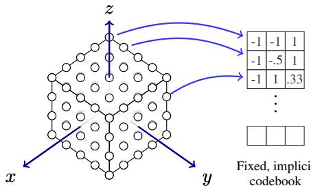  

Figure 2: Illustration of Codebook $( \mathcal { C } )$ FSQ's codebook is a $b$ -dimensional hypercube (left). This figure illustrates a $b { = } 3$ -dimensional codebook, where each axis of the 3-dimensional hypercube (left) corresponds to one dimension of the codebook (right). The $i ^ { \mathrm { { t h } } }$ dimension of the hypercube is discretized into $L _ { i }$ values, e.g., the $x$ and $y \cdot$ -axis are discretized into $L _ { 0 } = L _ { 1 } = 5$ and the $z$ -axis into $L _ { 3 } = 4$ . Code symbols (here integers) are normalized to the range $[ - 1 , 1 ]$ .

直观上，这导致在每个维度 $d$ 中对 $b$ 维空间进行沃罗诺伊划分，其中空间中的任意点通过公式 (7) 被分配给一个等距放置的质心。请参见图 2 以获取可视化效果。实际上，这导致对潜在嵌入空间进行高效且快速的离散化。

在实践中，方程 (7) 是不可微分的。为了利用标准深度学习库来解决这个问题，我们使用了直通梯度估计 (STE) 方法，定义为 $round_st \operatorname { \rho } ( \mathbf { x } ) : x \to x + \mathrm { s g } ( \mathrm { r o u n d } ( { \pmb x } ) - \bar { { \pmb x } } )$，其中函数 $\operatorname { s g } ( \cdot )$ 会阻止梯度流动。此外，我们在离散化步骤后将编码标准化到 $[ - 1 , 1 ]$ 的范围内，因为 Mentzer 等人 (2024) 报告称这样可以提高性能。这种方法的超参数包括通道数 $b$ 和每个通道的码符号数 $L _ { i }$，即量化级别。在我们的实验中，我们发现量化级别 $\mathcal { L } = \{ 5 , 3 \}$（即 $b = 2$ 个通道）是足够的。

世界模型训练 我们通过时间反向传播（BPTT）联合训练世界模型组件 $e _ { \theta } , d _ { \phi } , R _ { \xi }$，其目标如下，其中 $H$ 表示多步预测的时间范围，$\gamma$ 是折扣因子。第一个预测的潜在编码 $\hat { \mathbf { c } } _ { 0 }$ 是通过将观测 $o _ { 0 }$ 传递给编码器并量化输出后获得的。在随后的时间步中，动态模型预测下一个潜在编码的概率质量函数 $p _ { \phi } ( \hat { c } _ { h + 1 } \mid \hat { c } _ { h } , { \pmb a } _ { h } )$。鉴于这个概率动态模型，我们必须考虑如何在潜在空间中进行 $H$ 步预测。实际上，我们通过采样传播不确定性，并使用直接连接（ST）Gumbel-softmax 技巧（Jang et al., 2017; Maddison et al., 2017），使得梯度可以通过样本反向传播到编码器。请注意，梯度必须在第一次使用编码器获得第一个潜在编码 $\hat { \mathbf { c } } _ { 0 }$ 的第一时间步回传，因为目标编码 $^ c$ 是通过将下一个观测 $\mathbf { o } ^ { \prime }$ 传递给编码器并使用停止梯度操作符 sg 获得的。然后，我们使用交叉熵（CE）损失来训练我们的动态 "分类器"。最后，我们注意到我们的奖励模型 $R _ { \xi }$ 是与编码器 $e _ { \theta }$ 和动态模型 $p _ { \phi }$ 联合训练的，以确保世界模型能够准确预测潜在空间中的奖励。

$$
\begin{array} { r } { z ( \theta , \phi , \xi ; \mathcal { D } ) = \mathbb { E } _ { ( o , a , o ^ { \prime } , r ) _ { 0 : H } \sim \mathcal { D } } \left[ \displaystyle \sum _ { h = 0 } ^ { H } \gamma ^ { h } \Big ( \mathrm { C E } \big ( \underbrace { p _ { \phi } \big ( \hat { c } _ { h + 1 } \big | \hat { c } _ { h } , a _ { h } \big ) , c _ { h + 1 } } _ { \mathrm { I \ a t e n \ - s t a t e r \it c o n s i s t i t r a v e } } \big ) + \underbrace { \big | R _ { \xi } \big ( \hat { c } _ { h } , a _ { h } \big ) - r _ { h } \big | | _ { 2 } ^ { 2 } } _ { \mathrm { R e w a r k \it n o n - c l i c i t i o n } } \Big ) \right] } \end{array}
$$

$$
\underbrace { \hat { c } _ { 0 } = f ( e _ { \theta } ( \boldsymbol { o } _ { 0 } ) ) } _ { \mathrm { F i r s t l a t e n t s t a t e } } \underbrace { \hat { c } _ { h + 1 } \sim p _ { \phi } ( \hat { c } _ { h + 1 } \mid \hat { c } _ { h } , a _ { h } ) } _ { \mathrm { S t o c h a s t i c d y n a m i c s } } \underbrace { c _ { h } = \mathrm { s g } ( f ( e _ { \theta } ( \boldsymbol { o } _ { h } ) ) ) } _ { \mathrm { T a r g e t l a t e n t c o d e } } ,
$$

策略和价值学习 我们使用演员-评论家强化学习方法TD3（Fujimoto等，2018）在潜在空间中学习策略$\pi _ { \eta } ( \pmb { c } )$和动作-价值函数${ \pmb q } _ { \psi } ( { \pmb c } , { \pmb a } )$。然而，我们遵循Yarats等（2021b）；Zhao等（2023）的做法，使用$N$步回报来增强损失。与TD3的主要区别在于，我们不是使用原始观测$^ o$，而是通过编码器映射它们$\pmb { c } = f ( e _ { \theta } ( \pmb { o } ) )$，并在离散潜在空间$^ c$中学习演员/评论家。我们还通过遵循REDQ（Chen等，2021）来减少TD目标中的偏差，并学习一个$N _ { q } = 5$评论家的集合，与TD-MPC2中的做法类似。在计算TD目标时，我们随机抽样两个评论家，并使用这两个中的最小值。让我们用$\mathcal { M }$表示这两个随机抽样评论家的索引。然后通过最小化以下目标来更新评论家：

$$
\begin{array} { r l r } {  { \mathcal { L } _ { q } ( \psi ; \mathcal { D } ) = \mathbb { E } _ { ( o , a , o ^ { \prime } , r ) _ { n = 1 } ^ { N } \sim \mathcal { D } } [ \frac { 1 } { N _ { q } } \sum _ { k = 1 } ^ { N _ { q } } ( q _ { \psi _ { k } } ( \underbrace { f ( e _ { \theta } ( o _ { t } ) ) } _ { c _ { t } } , a _ { t } ) - y ) ^ { 2 } ] , } } \\ & { } & { \quad y = \displaystyle \sum _ { n = 0 } ^ { N - 1 } \gamma ^ { n } r _ { t + n } + \gamma ^ { N } \operatorname* { m i n } _ { k \in \mathcal { M } } q _ { \bar { \psi } _ { k } } \big ( \underbrace { f ( e _ { \theta } ( o _ { t + N } ) ) } _ { c _ { t + N } } , a _ { t + N } \big ) , \quad \mathrm { w i t h ~ } a _ { t + n } = \pi _ { \bar { \eta } } ( c _ { t + n } ) + \epsilon _ { t + n } . } \end{array}
$$

在这里，我们通过添加裁剪后的高斯噪声 $\epsilon _ { t + n } \sim \mathrm { c l i p } \left( \mathcal { N } ( 0 , \sigma ^ { 2 } ) , - c , c \right)$ 来实现策略平滑，以此对动作进行调整：$\begin{array} { r } { \pmb { a } _ { t + n } = \pi _ { \bar { \eta } } ( \pmb { c } _ { t + n } ) + \epsilon _ { t + n } } \end{array}$。然后我们使用目标动作价值函数 $\mathbf { \Delta } \mathbf { q } _ { \bar { \psi } }$ 和目标策略 $\pi _ { \bar { \eta } }$ 来计算 TD 目标 $y$。请注意，目标网络使用指数移动平均，即 $[ \bar { \psi } , \bar { \eta } ] ( 1 - \tau ) [ \bar { \psi } , \bar { \eta } ] + [ \psi , \eta ]$。我们遵循 REDQ 的方法，通过最小化来学习演员。

$$
\mathcal { L } _ { \pi } ( \eta ; \mathcal { D } ) = - \mathbb { E } _ { o _ { t } \sim \mathcal { D } } \biggl [ \frac { 1 } { | \mathcal { M } | } \sum _ { \psi _ { k \in \mathcal { M } } } q _ { \psi _ { k } } \bigl ( \underbrace { f ( e _ { \theta } ( o _ { t } ) ) } _ { c _ { t } } , \pi _ { \eta } \bigl ( \underbrace { f ( e _ { \theta } ( o _ { t } ) ) } _ { c _ { t } } \bigr ) \bigr ) \biggr ] .
$$

即，我们训练智能体以最大化两个子采样评判者的平均动作值。摘要虽然这个世界模型与 TD-MPC2 有一些相似之处，但也有一些重要的区别。首先，潜在空间被表示为离散编码本，这使得 DCMPC 能够使用交叉熵损失训练动态模型。重要的是，交叉熵损失在训练和推理过程中考虑了对预测潜在编码的（可能是多模态的）分布。相比之下，TD-MPC2 考虑确定性动态并使用均方误差回归。有趣的是，我们的实验表明，我们的随机动态模型在确定性环境中提供了优势。其次，DC-MPC 在训练编码器时不使用价值预测。相反，我们遵循 Zhao 等人（2023）的观点，即价值预测并不是获得良好潜在表示所必需的，因此，单独训练动作价值函数。重要的是，我们的离散潜在空间被参数化为来自编码本的一组离散编码。值得强调的是，我们的编码本编码保留了观察之间的序关系。这与 DreamerV2（Hafner 等，2022）使用的一热编码形成对比。有关不同离散编码的比较，请参见第 3 节。我们假设这将在离散空间中表示连续状态向量时提供显著的改进。

# 4.2 决策时规划

DC-MPC 继承了 TD-MPC2，并利用世界模型进行决策时的规划。它使用 MPC 来获得闭环控制器，并使用（修改过的）MPPI 作为基础轨迹优化算法。MPPI 是一种基于采样的轨迹优化方法，且不需要梯度。有关详细信息，请参见算法 2。在每个环境步骤中，我们估计对角多元高斯的参数 $\mu _ { 0 : H } ^ { * } , \sigma _ { 0 : H } ^ { * }$。

$H$ 步行动序列最大化以下目标，其中 $H$ 是规划时间窗口，$\gamma$ 是折扣因子。MPPI 以迭代方式解决方程 (11)。它首先通过采样候选行动序列并使用目标 ${ \cal J } ( a _ { 0 : H } , o )$ 对其进行评估。然后基于加权平均更新 $\mu _ { 0 : H } , \sigma _ { 0 : H } ^ { 2 }$。经过几次迭代后，我们选择一个行动轨迹并在环境中应用其第一个动作 $\mathbf { } _ { \mathbf { 0 } } ^ { a _ { 0 } ^ { ( i ^ { * } ) } }$。注意，在训练过程中，我们通过添加高斯噪声来促进探索。重要的是，方程 (11) 使用行动价值函数 ${ \pmb q } _ { \psi } ( { \pmb c } , { \pmb a } )$ 来引导规划时间窗口，使其估计完整的强化学习目标。DC-MPC 遵循 TD-MPC2，并通过来自先前策略 $\pi _ { \eta }$ 的 $N _ { \pi }$ 个行动序列来热启动规划过程，我们将 $\mu _ { 0 : H } , \sigma _ { 0 : H } ^ { 2 }$ 作为前一个时间步骤解决方案的向后延移。有关更多详细信息，请参见附录 A 和算法 2。

$$
\begin{array} { r l } & { \mu _ { 0 : H } ^ { * } , \sigma _ { 0 : H } ^ { * } = \underset { \mu _ { 0 : H } , \sigma _ { 0 : H } } { \mathrm { a r g \operatorname* { m a x } } } \mathbb { E } _ { a _ { 0 : H } \sim \mathcal { N } \left( \mu _ { 0 : H } , \mathrm { d i a g } ( \sigma _ { 0 : H } ^ { 2 } ) \right) } \left[ J ( a _ { 0 : H } , o ) \right] } \\ & { J ( a _ { 0 : H } , o ) = \displaystyle \sum _ { h = 0 } ^ { H - 1 } \gamma ^ { h } R _ { \xi } ( \hat { c } _ { h } , a _ { h } ) + \gamma ^ { H } \frac { 1 } { | \mathcal { M } | } \displaystyle \sum _ { \psi _ { h } \in \mathcal { M } } q _ { \psi _ { k } } ( \hat { c } _ { H } , a _ { H } ) } \\ & { \mathrm { s . t . } \quad \hat { c } _ { 0 } = f ( e _ { \theta } ( o ) ) \quad \mathrm { a n d } \quad \hat { c } _ { h + 1 } = \displaystyle \sum _ { i = 1 } ^ { | \mathcal { C } | } \mathrm { P r } ( \hat { c } _ { h + 1 } = c ^ { ( i ) } \mid \hat { c } _ { h } , a _ { h } ) c ^ { ( i ) } , } \end{array}
$$

请注意，在规划时，我们不对转移动态 $p ( \pmb { c } _ { h + 1 } \mid \pmb { c } _ { h } , \pmb { a } _ { h } )$ 进行采样，因为这会引入不必要的随机性。相反，我们取预期代码，这是对代码本中代码的加权求和。尽管离散变量的期望值不一定取有效的离散值，但我们发现它在我们的设定中是有效的。这可能是因为我们的离散代码存在一种顺序，使得期望值在代码本中的代码之间简单插值。

# 5 实验

在本节中，我们在DeepMind Control Suite (DMControl) (Tassa et al., 2018)、Meta-World (Yu et al., 2019) 和MyoSuite (Vittorio et al., 2022)中，对DC-MPC在多种连续控制任务中的表现进行了实验评估，比较了多个基准和消融实验。我们的实验旨在回答以下研究问题：RQ1 DC-MPC的离散潜在空间是否相较于连续潜在空间有优势？RQ2 学习潜在空间时，哪一点最为重要：（i）分类损失，（ii）离散码本，（iii）随机动力学或$(i \nu)$多模态动力学？RQ3 DC-MPC的码本在动力学/价值/策略学习上是否相比于其他离散编码方式（如$(i)$ 一热编码（类似于DreamerV2）和$(ii)$ 标签编码）具有优势？RQ4 DC-MPC与最先进的利用潜在状态嵌入的模型驱动强化学习算法相比如何，特别是在困难的DMControl和Meta-World任务中？实验设置我们将DC-MPC与两个最先进的模型驱动强化学习基准进行了比较，分别是DreamerV3 (Hafner et al., 2023)，其潜在状态采用离散的一热编码，以及TD-MPC2 (Hansen et al., 2023)，其使用连续潜在空间。我们还与无模型强化学习基准软演员-评论家(SAC) (Haarnoja et al., 2018)以及原版的TD-MPC (Hansen et al., 2022)进行了比较。我们提出的方法使用了维度为$d = 5 1 2$、通道数为$b = 2$的潜在空间，每个维度有15个码符，通过使用FSQ级别$\mathcal { L } = \{ L _ { 1 } = 5 , L _ { 2 } = 3 \}$。

# 5.1 不同潜在空间的比较

我们首先评估不同潜在动态公式如何影响性能。我们寻求回答以下问题：（i）离散潜在空间是否比连续潜在空间更具优势？（ii）使用分类（交叉熵）进行训练是否比均方误差回归更有利？（iii）建模随机（以及可能的多模态）转移动态是否具有优势？

在我们的实验中，我们考虑了连续和离散的潜在空间，以调查离散化世界模型潜在空间的影响。在图 3 和图 9 中，离散潜在空间的实验标记为“Discrete”（红色、绿色和紫色），而连续潜在空间标记为“Continuous”（橙色）。我们还使用 TD-MPC2 中的简单归一化方法对 DC-MPC 进行评估，该方法限制了潜在空间，标记为“SimNorm”（蓝色）。标记为“MSE”的实验采用均方误差回归进行训练，而标记为“CE”的实验则使用交叉熵分类损失进行训练。标记为“Discrete $ {\mathrm { + C E + }}$ det”的实验使用 FSQ 得到离散潜在空间，并使用交叉熵损失进行训练，其中 logits 是动态预测与代码本中每个代码之间的均方误差。这项实验使我们能够测试 DC-MPC 性能提升是否源于使用交叉熵损失进行训练，还是由动态的随机性所致。在图 9 中，标记为“log-lik.”的实验通过最大化对数似然进行训练，即“FSQ-log-lik.”（紫色）的交叉熵，“Gaussian+log-lik.”（蓝色）的高斯对数概率，以及“GMM+log-lik.”（绿色）的高斯混合对数概率。

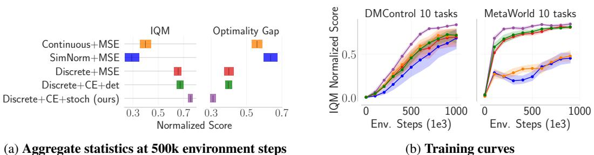  

Figure 3: Latent space ablation Evaluation of (i) discrete (Discrete) vs continuous (Continuous) latent spaces, (ii) using cross-entropy (CE) vs mean squared error (MSE) for the latent-state consistency loss, and (ii) formulating a deterministic (det) vs stochastic (stoch) dynamics model. Discretizing the latent space (red) improves sample efficiency over the continuous latent space (orange) and formulating stochastic dynamics and training with cross-entropy (purple) improves performance further.

离散与连续潜在空间 在样本效率方面，使用离散潜在空间（红色和紫色）的实验显著优于使用连续潜在空间的实验。这表明我们的离散编码本提供了显著的优势。 分类与回归 有趣的是，使用均方误差回归（红色）训练确定性离散潜在空间的表现不如使用分类（紫色）训练随机离散潜在空间。然而，我们使用分类训练确定性离散潜在空间的实验（绿色）确认了这种优势源于潜在空间的随机性。这表明在训练期间进行多步骤动态预测时使用直接通过的Gumbel-softmax采样（Jang等，2017）可以提升表现。我们将TD-MPC2扩展到使用DC-MPC的离散随机潜在空间的结果（图6）支持这一结论。 确定性与随机性 鉴于建模随机潜在空间并使用最大对数似然训练对离散潜在空间是有益的，我们现在测试这是否适用于连续潜在空间。为此，我们构建了两个随机连续潜在空间，并在图9中进行比较。第一个模型是单峰高斯分布（蓝色），而第二个模型是多峰高斯混合模型（GMM）（绿色）。有趣的是，这些随机过渡模型在比较其确定性对应物（橙色）时，有时会提高DMControl任务的样本效率。然而，它们在Meta-World任务上的表现却大幅下降。我们的方法（紫色）具有离散潜在空间，通过最大对数似然（即交叉熵）进行训练，并在训练期间建模潜在过渡动态的（潜在的多模态）分布。这些因素，加上使用ST Gumbel-softmax采样，提供了相比于连续潜在空间更好的样本效率。

# 5.2 潜在空间编码的影响

我们的世界模型包括用于动态 $p _ { \phi } ( \mathbf { c } ^ { \prime } | \mathbf { c } , \mathbf { a } )$、奖励 $R _ { \xi } ( { \bf c } , { \bf a } )$、评论员 $Q _ { \psi } ( \mathbf { c } , \mathbf { a } )$ 和先验策略 $\pi _ { \eta } ( \mathbf { c } )$ 的神经网络，这些网络都根据离散的代码本编码 $\mathbf { c } = \mathbf { e } _ { \mathrm { c o d e s } }$ 进行预测，其中 (i) 标签编码 $e _ { \mathrm { l a b e l } } = i \in \{ 1 , \dots , | { \mathcal { C } } | \}$ 和 (ii) 独热编码 $e _ { \mathrm { o n e - h o t } } = \pmb { v } \in \{ 0 , 1 \} ^ { | \mathcal { C } | }$，且满足 $\textstyle \sum _ { i = 1 } ^ { | { \mathcal { C } } | } v _ { i } = 1$。在这些实验中，我们没有修改动态 $p _ { \phi } ( \mathbf { c } ^ { \prime } | \mathbf { c } , \mathbf { a } )$，也就是说，动态继续使用代码本编码 $c$ 进行预测，而没有使用独热或标签编码。这是因为当我们将代码本编码替换为独热或标签编码时，导致训练曲线（环境步数与回合回报）平稳且无法解决任务。这表明我们的自监督世界模型设置中需要使用代码本编码。尽管如此，我们在更改其他组件的编码时评估了性能。

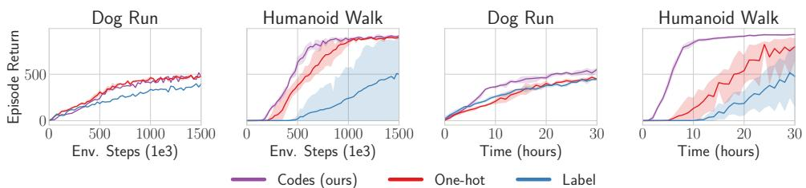  

Figure 4: Discrete encodings ablation DC-MPC with its discrete codebook encoding (purple) outperforms using DC-MPC with one-hot encoding (red) and label encoding (blue), in terms of both sample efficiency (left) and computational efficiency (right). Dynamics model used codes $p _ { \phi } ( \mathbf { c } ^ { \prime } \mid \mathbf { c } , \mathbf { a } )$ whilst reward $R _ { \xi } ( { \bf e } , { \bf a } )$ , critic $\bar { Q _ { \psi } } ( { \bf e } , { \bf a } )$ and prior policy $\pi _ { \eta } ( \mathbf { e } )$ used the respective encoding e.

我们评估了以下实验配置：代码（紫色）：所有组件使用代码：动态模型 $p _ { \phi } ( \mathbf { c } ^ { \prime } | \mathbf { c } , \bar { \mathbf { a } } )$，奖励 $R _ { \xi } ( { \bf c } , { \bf a } )$，评论家 $Q _ { \psi } ( \mathbf { c } , \mathbf { a } )$ 和先前策略 $\pi _ { \eta } ( \mathbf { c } )$。标签（蓝色）：动态模型使用代码 $p _ { \phi } ( \mathbf { c } ^ { \prime } | \mathbf { c } , \bar { \mathbf { a } } )$，而奖励 $R _ { \xi } ( { \bf e } _ { \mathrm { l a b e l } } , { \bf a } )$，评论家 $Q _ { \psi } ( \mathbf { e } _ { \mathrm { l a b e l } } , \mathbf { a } )$ 和先前策略 $\pi _ { \eta } ( \mathbf { e } _ { \mathrm { l a b e l } } )$ 使用从代码本中索引 $i$ 获得的标签 $\mathbf { e } _ { \mathrm { l a b e l } }$。独热编码（红色）：动态模型使用代码 $p _ { \phi } ( \mathbf { c } ^ { \prime } | \mathbf { c } , \mathbf { a } )$，而奖励 $R _ { \xi } ( { \bf e } _ { \mathrm { o n e - h o t } } , { \bf a } )$，评论家 $Q _ { \psi } ( \mathbf { e } _ { \mathrm { o n e - h o t } } , \mathbf { a } )$ 和先前策略 $\pi _ { \eta } ( \mathbf { e } _ { \mathrm { o n e - h o t } } )$ 使用标签编码的独热表示 $\mathbf { e _ { \mathrm { { o n e - h o t } } } }$。

标签编码（蓝色）在类人步态任务中学习困难，且通常比其他编码的样本效率低。这可能是因为标签编码的表达能力不足，无法建模我们代码本的多维序数结构。让我们通过一个简单的例子来解释。我们的代码本具有 $b = 2$ 个通道，因此两种不同的编码可能呈现为 $e _ { \mathrm { c o d e s } } ( A ) = [ 0 . 5 , - 0 . 5 ]$ 和 $e _ { \mathrm { c o d e s } } ( B ) = [ 0 , 0 . 5 ]$。因此，我们的代码本编码能够建模其两个通道中的序数结构，即 $e _ { \mathrm { c o d e s } } ( A ) _ { 1 } > e _ { \mathrm { c o d e s } } ( B ) _ { 1 }$ 而 $e _ { \mathrm { c o d e s } } ( A ) _ { 2 } \stackrel { - } { < } e _ { \mathrm { c o d e s } } ( B ) _ { 2 }$。相应的标签编码将此编码为 $e _ { \mathrm { l a b e l } } ( A ) = 1$ 和 $e _ { \mathrm { l a b e l } } ( B ) = 2$，这不正确地暗示 $B > A$。简而言之，标签编码无法建模代码本 $\mathcal { C }$ 的多维序数结构。相比之下，一热编码（红色）在样本效率方面与代码本编码匹配，除了类人步态任务。然而，一热编码为奖励、值和策略网络引入了极大的输入维度，这显著减慢了训练速度。有关此情况的更多细节，请参见第3节。

# 5.3 DC-MPC 性能

在图5、14、16和18中，我们将DC-MPC与TD-MPC2、DreamerV3、TD-MPC和SAC的整体表现进行了比较，涉及30个DMControl、45个Meta-World和5个MyoSuite任务，每个任务有3个种子。DMControl中的一些任务特别高维。例如，Dog任务的观测空间为$\mathcal { O } \in \mathbb { R } ^ { 2 2 3 }$，动作空间为$\mathcal { A } \in \mathbb { R } ^ { 3 8 }$，而Humanoid任务的观测空间为$\bar { \boldsymbol { \mathcal { O } } } \in \mathbb { R } ^ { 6 7 }$，动作空间为$\mathcal { A } \in \mathbb { R } ^ { 2 4 }$。图13显示，与基线相比，DC-MPC在高维的Dog和Humanoid环境中表现优异。我们假设我们的离散化表示在简化高维空间中的转移动态学习方面特别有益，从而使得DC-MPC在这些任务中具有很高的样本效率。同样，我们发现DC-MPC在Meta-World任务套件中的模拟操作任务中优于DreamerV3（图5、15和16）。我们还看到，DC-MPC的表现普遍与TD-MPC2相匹配。从全局水平比较结果（图5），我们可以发现我们提出的方法在所有基准测试中均表现良好。

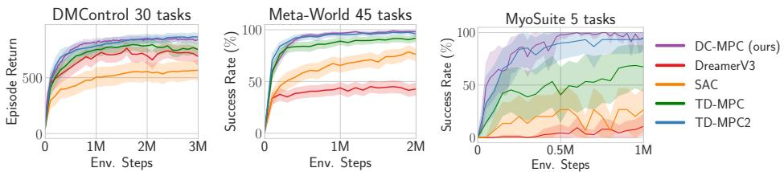  

Figure 5: Aggregate training curves in DMControl, Meta-World, & MyoSuite DC-MPC generally matches TD-MPC2 whilst outperforming DreamerV3, SAC and TD-MPC across all tasks. We plot the mean (solid line) and the $9 \hat { 5 } \%$ confidence intervals (shaded) across 3 seeds per task.

  

Figure 6: TD-MPC2 with DCWM Adding DC-MPC's discrete and stochastic latent space to TD-MPC2 improves performance. See Apps. B and B.10 for more details.

需要注意的是，TD-MPC2与DC-MPC在算法上有多个差异，这意味着它们之间的直接比较不仅受到潜在空间设计的影响。例如，它 (i) 使用软演员评论家 (SAC) 来学习先验策略（帮助稀疏奖励任务中的探索），(ii) 与世界模型联合学习价值函数，以及 (iii) 在对数变换空间中用离散回归形式化奖励和价值函数。在图 6 中，我们展示了将DCWM的随机离散代码本潜在空间纳入TD-MPC2（红色）相比于常规TD-MPC2的改进。有关这些实验的更多细节，请参阅附录 B 和 B.10，在附录 B.9 中，我们使用DreamerV3进行了相同的实验。DreamerV3在更困难的任务中的表现较差，因此我们没有看到使用DCWM的任何好处。然而，我们确定其较差表现源于使用观察重建。进一步实验在附录 B.1 和 B.3 中，我们分别评估了DC-MPC对代码本大小 $| {\mathcal{C}} |$ 和潜在维度 $d$ 的敏感性，在附录 B.3 中，我们展示了随机连续潜在空间似乎不提供与随机离散潜在空间相同的好处，在附录 B.4 中，我们消融了FSQ，表明其性能与向量量化 (VQ) 相当或更优，且更为简洁，而在附录 B.5 中，我们展示了使用REDQ的评论家集成相比于标准双Q方法的好处。

# 6 结论

我们提出了DC-MPC，这是一种世界模型，使用编码本编码和基于交叉熵的自监督损失学习离散和随机的潜在空间，旨在用于基于模型的强化学习。DC-MPC在连续控制任务中表现出色，包括Meta-World以及复杂的DMControl人形机器人和犬类任务，其性能超越或匹配了最先进基线的表现。我们的结果表明，在进行多步动态预测时，使用直通Gumbel-softmax采样对世界模型学习是有益的，这适用于DC-MPC以及我们修改TD-MPC2潜在空间的实验。总之，我们展示了采用编码本编码的离散潜在空间相较于标准的连续潜在嵌入或经典的离散空间（如标签编码和独热编码）的优势。这些发现为未来研究世界模型的离散嵌入开辟了一个新的有趣方向。

局限性与未来工作 由于我们的目标是评估潜在空间设计，因此未将使 DC-MPC 在一组超参数上运行作为优先事项，并且我们对某些任务的噪声调度和 $N$ 步回报进行了调整。在未来的工作中，使 DC-MPC 对超参数具有鲁棒性将是有趣的。例如，建模由于从有限数据中学习而产生的潜在转移动态相关的认知不确定性，并利用它为 DC-MPC 配备更有原则的探索机制，如 Chua et al. (2018); Scannell et al. (2024c); Daxberger et al. (2021)，并去除特定任务的噪声调度，也将是非常有趣的。此外，调查我们的结果是否适用于不同的世界模型主干（Deng et al., 2023; NVIDIA et al., 2025），例如转换器（Vaswani et al., 2017; Robine et al., 2022; Zhang et al., 2023; Micheli et al., 2022; Bar et al., 2024）和扩散模型（Ho et al., 2020; Alonso et al., 2024）也将是一个有趣的研究方向。最后，研究 DC-MPC 的扩展能力（Kaplan et al., 2020; Henighan et al., 2020; Hoffmann et al., 2022）以及它是否是通用（即多体）世界建模的有效设置（Reed et al., 2022; Zhao et al., 2025）也将是值得探索的。

# 鸣谢

Aidan Scannell 和 Kalle Kujanpää 获得了芬兰研究委员会的资助，来自旗舰计划：芬兰人工智能中心（FCAI）。Arno Solin 和 Yi Zhao 感谢芬兰研究委员会的资助（资助编号 339730 和 357301），Mohammadreza Nakhaei 感谢芬兰商业部的资助（BIOND4.0 数据驱动的生物过程控制）。Kevin Sebastian Luck 获得项目 TeNet 的支持，该项目旨在实现快速且能效高的机器人控制，文件编号为 NGF.1609.241.015，属于国家增长基金 AiNed XS Europe 24-2 的研究项目，由荷兰研究委员会（NWO）资助。我们感谢芬兰 CSC 科学信息技术中心授予本项目使用 LUMI 超级计算机的权限，该计算机由欧洲高性能计算联合体拥有，并通过芬兰 CSC 和 LUMI 财团托管。我们感谢阿尔托大学科学信息技术项目提供的计算资源。

# REFERENCES

Rishabh Agarwal, Max Schwarzer, Pablo Samuel Castro, Aaron C Courville, and Marc Bellemare. Deep Reinforcement Learning at the Edge of the Statistical Precipice. In Advances in Neural Information Processing Systems, volume 34, pp. 2930429320. Curran Associates, Inc., 2021.

James F Allen and Johannes A Koomen. Planning using a temporal world model. In Proceedings of the Eighth international joint conference on Artificial intelligence-Volume 2, pp. 741747, 1983.

Eloi Alonso, Adam Jelley, Vincent Micheli, Anssi Kanervisto, Amos Storkey, Tim Pearce, and François Fleuret. Diffusion for World Modeling: Visual Details Matter in Atari. In The Thirtyeighth Annual Conference on Neural Information Processing Systems, November 2024.

Jimmy Lei Ba, Jamie Ryan Kiros, and Geoffrey E. Hinton. Layer Normalization. arXiv preprint arXiv:1607.06450, 2016.

Amir Bar, Gaoyue Zhou, Danny Tran, Trevor Darrell, and Yann LeCun. Navigation World Models. arXiv preprint arXiv:2412.03572, 2024.

Kenneth Basye, Thomas Dean, Jak Kirman, and Moises Lejter. A decision-theoretic approach to planning, perception, and control. IEEE Expert, 7(4):5865, 1992.

Richard Bellman. A Markovian Decision Process. Journal of Mathematics and Mechanics, 6(5): 679684, 1957. ISSN 0095-9057.

John T. Betts. Survey of Numerical Methods for Trajectory Optimization. Journal of Guidance, Control, and Dynamics, 21(2):193207, March 1998. doi: 10.2514/2.4231.

Huiwen Chang, Han Zhang, Jarred Barber, Aaron Maschinot, Jose Lezama, Lu Jiang, Ming-Hsuan Yang, Kevin Patrick Murphy, William T. Freeman, Michael Rubinstein, Yuanzhen Li, and Dilip Krishnan. Muse: Text-To-Image Generation via Masked Generative Transformers. In Proceedings of the 40th International Conference on Machine Learning, pp. 40554075. PMLR, July 2023.

Xinyue Chen, Che Wang, Zijian Zhou, and Keith Ross. Randomized Ensembled Double Q-Learning: Learning Fast Without a Model. In International Conference on Learning Representations, 2021.

Kurtland Chua, Roberto Calandra, Rowan McAllister, and Sergey Levine. Deep Reinforcement Learning in a Handful of Trials using Probabilistic Dynamics Models. In Advances in Neural Information Processing Systems, volume 31, 2018.

Erik Daxberger, Agustinus Kristiadi, Alexander Immer, Runa Eschenhagen, Matthias Bauer, and Philipp Hennig. Laplace Redux - Effortless Bayesian Deep Learning. In Advances in Neural Information Processing Systems, volume 34, pp. 2008920103. Curran Associates, Inc., 2021.

Fei Deng, Junyeong Park, and Sungjin Ahn. Facing Off World Model Backbones: RNNs, Transformers, and S4. In Advances in Neural Information Processing Systems, volume 36, pp. 7290472930, December 2023.

Patrick Esser, Robin Rombach, and Bjorn Ommer. Taming Transformers for High-Resolution Image Synthesis. In Proceedings of the IEEE/CVF Conference on Computer Vision and Pattern Recognition, pp. 1287312883, 2021.

Jesse Farebrother, Jordi Orbay, Quan Vuong, Adrien Ali Taiga, Yevgen Chebotar, Ted Xiao, Alex Irpan, Sergey Levine, Pablo Samuel Castro, Aleksandra Faust, Aviral Kumar, and Rishabh Agarwal. Stop Regressing: Training Value Functions via Classification for Scalable Deep RL, March 2024.

Scott Fujimoto, Herke Hoof, and David Meger. Addressing Function Approximation Error in ActorCritic Methods. In Proceedings of the 35th International Conference on Machine Learning, pp. 15871596. PMLR, July 2018.

Ignat Georgiev, Varun Giridhar, Nicklas Hansen, and Animesh Garg. PWM: Policy Learning with Large World Models. arXiv preprint 2407.02466, 2024.

Raj Ghugare, Homanga Bharadhwaj, Benjamin Eysenbach, Sergey Levine, and Russ Salakhutdinov. Simplifying Model-based RL: Learning Representations, Latent-space Models, and Policies with One Objective. In The Eleventh International Conference on Learning Representations, September 2022.

David Ha and Jürgen Schmidhuber. Recurrent World Models Facilitate Policy Evolution. In Advances in Neural Information Processing Systems, volume 31. Curran Associates, Inc., 2018.

Tuomas Haarnoja, Aurick Zhou, Pieter Abbeel, and Sergey Levine. Soft Actor-Critic: Off-Policy Maximum Entropy Deep Reinforcement Learning with a Stochastic Actor. In International Conference on Machine Learning, pp. 18611870. PMLR, July 2018.

Danijar Hafner, Timothy Lillicrap, Jimmy Ba, and Mohammad Norouzi. Dream to control: Learning behaviors by latent imagination. arXiv preprint arXiv:1912.01603, 2019a.

Danijar Hafner, Timothy Lillicrap, Ian Fischer, Ruben Villegas, David Ha, Honglak Lee, and James Davidson. Learning Latent Dynamics for Planning from Pixels. In International Conference on Machine Learning, pp. 25552565. PMLR, May 2019b.

Danijar Hafner, Timothy P. Lillicrap, Mohammad Norouzi, and Jimmy Ba. Mastering Atari with Discrete World Models. In International Conference on Learning Representations, February 2022.

Danijar Hafner, Jurgis Pasukonis, Jimmy Ba, and Timothy Lillicrap. Mastering diverse domains through world models. arXiv preprint arXiv:2301.04104, 2023.

Nicklas Hansen, Hao Su, and Xiaolong Wang. TD-MPC2: Scalable, Robust World Models for Continuous Control. In The Twelfth International Conference on Learning Representations, October 2023.

Nicklas A. Hansen, Hao Su, and Xiaolong Wang. Temporal Difference Learning for Model Predictive Control. In Proceedings of the 39th International Conference on Machine Learning, pp. 83878406. PMLR, June 2022.

Tom Henighan, Jared Kaplan, Mor Katz, Mark Chen, Christopher Hesse, Jacob Jackson, Heewoo Jun, Tom B. Brown, Prafulla Dhariwal, Scott Gray, Chris Hallacy, Benjamin Mann, Alec Radford, Aditya Ramesh, Nick Ryder, Daniel M. Ziegler, John Schulman, Dario Amodei, and Sam McCandlish. Scaling Laws for Autoregressive Generative Modeling, November 2020.

Jonathan Ho, Ajay Jain, and Pieter Abbeel. Denoising Diffusion Probabilistic Models. In Advances in Neural Information Processing Systems, volume 33, pp. 68406851. Curran Associates, Inc., 2020.

Jordan Hoffmann, Sebastian Borgeaud, Arthur Mensch, Elena Buchatskaya, Trevor Cai, Eliza Rutherford, Diego de Las Casas, Lisa Anne Hendricks, Johannes Welbl, Aidan Clark, Tom Hennigan, Eric Noland, Katie Millican, George van den Driessche, Bogdan Damoc, Aurelia Guy, Simon Osindero, Karen Simonyan, Erich Elsen, Jack W. Rae, Oriol Vinyals, and Laurent Sifre. Training Compute-Optimal Large Language Models, March 2022.

Kyle Hsu, William Dorrell, James Whittington, Jiajun Wu, and Chelsea Finn. Disentanglement via Latent Quantization. Advances in Neural Information Processing Systems, 36:4546345488, December 2023.

Maximilian Igl, Luisa Zintgraf, Tuan Anh Le, Frank Wood, and Shimon Whiteson. Deep variational reinforcement learning for pomdps. In International Conference on Machine Learning, pp. 2117- 2126. PMLR, 2018.

Eric Jang, Shixiang Gu, and Ben Poole. Categorical reparameterization with gumbel-softmax. In International Conference on Learning Representations, 2017.

Jared Kaplan, Sam McCandlish, Tom Henighan, Tom B. Brown, Benjamin Chess, Rewon Child, Scott Gray, Alec Radford, Jeffrey Wu, and Dario Amodei. Scaling Laws for Neural Language Models. arXiv preprint arXiv:2001.08361, 2020.

Diederik P. Kingma and Jimmy Ba. Adam: A method for stochastic optimization. In International Conference on Learning Representations, 2015.

Diederik P. Kingma and M. Welling. Auto-Encoding Variational Bayes. In International Conference on Learning Representations, 2014.

Ilya Kostrikov, Denis Yarats, and Rob Fergus. Image augmentation is all you need: Regularizing deep reinforcement learning from pixels. arXiv preprint arXiv:2004.13649, 2020.

Yann LeCun. A Path Towards Autonomous Machine Intelligence Version 0.9.2, 2022-06-27.

Michael Lutter, Leonard Hasenclever, Arunkumar Byravan, Gabriel Dulac-Arnold, Piotr Trochim, Nicolas Heess, Josh Merel, and Yuval Tassa. Learning dynamics models for model predictive agents. arXiv preprint arXiv:2109.14311, 2021.

Haoyu Ma, Jialong Wu, Ningya Feng, Chenjun Xiao, Dong Li, Jianye Hao, Jianmin Wang, and Mingsheng Long. HarmonyDream: Task Harmonization Inside World Models. In Proceedings of the 41st International Conference on Machine Learning, pp. 3398334007. PMLR, July 2024.

Chris J. Maddison, Andriy Mnih, and Yee Whye Teh. The concrete distribution: A continuous relaxation of discrete random variables. In International Conference on Learning Representations, 2017.

Fabian Mentzer, David Minnen, Eirikur Agustsson, and Michael Tschannen. Finite Scalar Quantization: VQ-VAE Made Simple. In International Conference on Learning Representations, 2024.

Vincent Micheli, Eloi Alonso, and François Fleuret. Transformers are Sample-Efficient World Models. In The Eleventh International Conference on Learning Representations, September 2022.

Diganta Misra. Mish: A self regularized non-monotonic activation function. arXiv preprint arXiv:1908.08681, 2019.

VIDIA, :, Niket Agarwal, Arslan Ali, Maciej Bala, Yogesh Balaji, Erik Barker, Tiffany Cai, Prithvijit Chattopadhyay, Yongxin Chen, Yin Cui, Yifan Ding, Daniel Dworakowski, Jiaojiao Fan, Michele Fenzi, Francesco Ferroni, Sanja Fidler, Dieter Fox, Songwei Ge, Yunhao Ge, Jinwei Gu, Siddharth Gururani, Ethan He, Jiahui Huang, Jacob Huffman, Pooya Jannaty, Jingyi Jin, Seung Wook Kim, Gergely Klár, Grace Lam, Shiyi Lan, Laura Leal-Taixe, Anqi Li, Zhaoshuo Li, Chen-Hsuan Lin, Tsung-Yi Lin, Huan Ling, Ming-Yu Liu, Xian Liu, Alice Luo, Qianli Ma, Hanzi Mao, Kaichun Mo, Arsalan Mousavian, Seungjun Nah, Sriharsha Niverty, David Page, Despoina Paschalidou, Zeeshan Patel, Lindsey Pavao, Morteza Ramezanali, Fitsum Reda, Xiaowei Ren, Vasanth Rao Naik Sabavat, Ed Schmerling, Stella Shi, Bartosz Stefaniak, Shitao Tang, Lyne Tchapmi, Przemek Tredak, Wei-Cheng Tseng, Jibin Varghese, Hao Wang, Haoxiang Wang, Heng Wang, Ting-Chun Wang, Fangyin Wei, Xinyue Wei, Jay Zhangjie Wu, Jiashu Xu, Wei Yang, Lin Yen-Chen, Xiaohui Zeng, Yu Zeng, Jing Zhang, Qinsheng Zhang, Yuxuan Zhang, Qingqing Zhao, and Artur Zolkowski. Cosmos world foundation model platform for physical ai. arXiv preprint arXiv:2501.03575, 2025.

Adam Paszke, Sam Gross, Francisco Massa, Adam Lerer, James Bradbury, Gregory Chanan, Trevor Killeen, Zeming Lin, Natalia Gimelshein, Luca Antiga, Alban Desmaison, Andreas Kopf, Edward Yang, Zachary DeVito, Martin Raison, Alykhan Tejani, Sasank Chilamkurthy, Benoit Steiner, Lu Fang, Junjie Bai, and Soumith Chintala. PyTorch: An Imperative Style, High-Performance Deep Learning Library. In Advances in Neural Information Processing Systems, volume 32. Curran Associates, Inc., 2019.

Aditya Ramesh, Mikhail Pavlov, Gabriel Goh, Scott Gray, Chelsea Voss, Alec Radford, Mark Chen, and Ilya Sutskever. Zero-Shot Text-to-Image Generation. In Proceedings of the 38th International Conference on Machine Learning, pp. 88218831. PMLR, July 2021.

Scott Reed, Konrad Zolna, Emilio Parisotto, Sergio Gomez Colmenarejo, Alexander Novikov, Gabriel Barth-Maron, Mai Gimenez, Yury Sulsky, Jackie Kay, Jost Tobias Springenberg, et al. A Generalist Agent. Transactions on Machine Learning Research (TMLR), 2022.

Jan Robine, Marc Höftmann, Tobias Uelwer, and Stefan Harmeling. Transformer-based World Models Are Happy With 100k Interactions. In The Eleventh International Conference on Learning Representations, September 2022.

Reuven Y Rubinstein. Optimization of computer simulation models with rare events. European Journal of Operational Research, 99(1):89112, 1997.

Aidan Scannell, Carl Henrik Ek, and Arthur Richards. Trajectory Optimisation in Learned Multimodal Dynamical Systems Via Latent-ODE Collocation. In Proceedings of the IEEE International Conference on Robotics and Automation. IEEE, 2021.

Aidan Scannell, Kalle Kujanpää, Yi Zhao, Mohammadreza Nakhaeinezhadfard, Arno Solin, and Joni Pajarinen. Quantized Representations Prevent Dimensional Collapse in Self-predictive RL. In ICML 2024 Workshop: Aligning Reinforcement Learning Experimentalists and Theorists, July 2024a.

Aidan Scannell, Kalle Kujanpää, Yi Zhao, Mohammadreza Nakhaei, Arno Solin, and Joni Pajarinen. iQRL - Implicitly Quantized Representations for Sample-efficient Reinforcement Learning. arXiv preprint arXiv:2406.02696, 2024b.

Aidan Scannell, Riccardo Mereu, Paul Edmund Chang, Ella Tamir, Joni Pajarinen, and Arno Solin. Function-space parameterization of neural networks for sequential learning. In The Twelfth International Conference on Learning Representations, 2024c.

Julian Schrittwieser, Ioannis Antonoglou, Thomas Hubert, Karen Simonyan, Laurent Sifre, Simon Schmitt, Arthur Guez, Edward Lockhart, Demis Hassabis, Thore Graepel, Timothy Lillicrap, and David Silver. Mastering Atari, Go, Chess and Shogi by Planning with a Learned Model. Nature, 588(7839):604609, December 2020. ISSN 0028-0836, 1476-4687. doi: 10.1038/ s41586-020-03051-4.

Max Schwarzer, Ankesh Anand, Rishab Goel, R. Devon Hjelm, Aaron Courville, and Philip Bachman. Data-Efficient Reinforcement Learning with Self-Predictive Representations. In International Conference on Learning Representations, October 2020.

R.S. Sutton and A.G. Barto. Reinforcement Learning, Second Edition: An Introduction. Adaptive Computation and Machine Learning Series. MIT Press, 2018. ISBN 978-0-262-35270-3.

Yuval Tassa, Yotam Doron, Alistair Muldal, Tom Erez, Yazhe Li, Diego de Las Casas, David Budden, Abbas Abdolmaleki, Josh Merel, Andrew Lefrancq, et al. Deepmind control suite. arXiv preprint arXiv:1801.00690, 2018.

Aaron van den Oord, Oriol Vinyals, and koray kavukcuoglu. Neural Discrete Representation Learning. In Advances in Neural Information Processing Systems, volume 30. Curran Associates, Inc., 2017.

Ashish Vaswani, Noam Shazeer, Niki Parmar, Jakob Uszkoreit, Llion Jones, Aidan N Gomez,  ukasz Kaiser, and Illia Polosukhin. Attention is All you Need. In Advances in Neural Information Processing Systems, volume 30. Curran Associates, Inc., 2017.

Caggiano Vittorio, Wang Huawei, Durandau Guillaume, Sartori Massimo, and Kumar Vikash. Myosuite  a contact-rich simulation suite for musculoskeletal motor control. arXiv preprint arXiv:2205.13600, 2022.

Tongzhou Wang, Simon Du, Antonio Torralba, Phillip Isola, Amy Zhang, and Yuandong Tian. Denoised MDPs: Learning World Models Better Than the World Itself. In Proceedings of the 39th International Conference on Machine Learning, pp. 2259122612. PMLR, June 2022.

Grady Williams, Andrew Aldrich, and Evangelos Theodorou. Model predictive path integral control using covariance variable importance sampling. arXiv preprint arXiv:1509.01149, 2015.

Denis Yarats, Rob Fergus, Alessandro Lazaric, and Lerrel Pinto. Mastering visual continuous control: Improved data-augmented reinforcement learning. arXiv preprint arXiv:2107.09645, 2021a.

Denis Yarats, Rob Fergus, Alessandro Lazaric, and Lerrel Pinto. Mastering Visual Continuous Control: Improved Data-Augmented Reinforcement Learning. In International Conference on Learning Representations, October 2021b.

Tiane Yu, Deirdre Quillen, Zhanpeng He, Ryan Julian, Karol Hausman, Chelsea Finn, and Sergey Levine. Meta-world: A benchmark and evaluation for multi-task and meta reinforcement learning In Conference on Robot Learning (CoRL), 2019.

Weipu Zhang, Gang Wang, Jian Sun, Yetian Yuan, and Gao Huang. STORM: Efficient Stochastic Transformer based World Models for Reinforcement Learning. In Advances in Neural Information Processing Systems, volume 36, pp. 2714727166, December 2023.

Yi Zhao, Wenshuai Zhao, Rinu Boney, Juho Kannala, and Joni Pajarinen. Simplified Temporal Consistency Reinforcement Learning. In Proceedings of the 4Oth International Conference on Machine Learning, pp. 4222742246. PMLR, July 2023.

Yi Zhao, Aidan Scannell, Yuxin Hou, Tianyu Cui, Le Chen, Arno Solin, Juho Kannala, and Joni Pajarinen. Generalist world model pre-training for efficient reinforcement learning. arxiv preprint arXiv:2502.19544, 2025.

# APPENDICES

This appendix is organized as follows. In App. A we provide further details on our method. App. B provides further experimental results, including evaluating DC-MPC's sensitivity to the codebook size in App. B.1, its sensitivity to latent dimension in App. B.2, further details on the latent space ablation in App. B.3, a comparison of DC-MPC using VQ instead of FSQ in App. B.4, a comparison of DC-MPC's ensemble REDQ critic approach vs the standard double Q approach in App. B.5, full DeepMind control suite results in App. B.6, Meta-World results in App. B.7, MyoSuite results in App. B.8, evaluation of DreamerV3 using DC-MPC's latent space in App. B.9 and an evaluation of TD-MPC2 using DC-MPC's latent space in App. B.10. In App. C, we provide further implementation details, including default hyperparameters, hardware, etc. In App. D, we provide further details of the baselines and in App. E we detail the different DeepMind control, Meta-World and MyoSuite tasks used throughout the paper.

A METHOD DETAILS 18   
B FurTher Results 20   
B.1 SensitivIty to Codebook Size $| { \mathcal { C } } |$ 21   
B.2 Sensitivity to Latent Dimension d 22   
B.3 AbLation Of Latent SpacE 23   
B.4 Ablation Of FSQ vs Vector Quantization (VQ) 24   
B.5 ABLatioN OF REDQ CRitic vS StanDaRD DoubLE Q AppRoaCH 25   
B.6 DeepMind Control Results 26   
B.7 Meta-WorlD Manipulation Results 28   
B.8 MYoSuitE MusculoskELetal Results 30   
B.9 Does DcWm Improve DreamerV3? 31   
B.10 IMPROVING TD-MPC2 WITH DC-MPC 32   
C IMPLEMENTATIoN DETAILS 33   
D BASELINES 36   
E TASKS 37

A METHOd DETAILS

Alg. 1 outlines DC-MPC's training procedure.

# Algorithm 1 DC-MPC's training

<table><tr><td>Input: Encoder eθ, dynamics dφ, reward Rξ, critics {qψi }i=1, 1 network update rate 7, episode length T, replay buffer D = {}</td><td colspan="3">}Nq , policy πη, learning rate α, target</td></tr><tr><td>for 1 : Nrandom episodes do</td><td></td><td></td><td></td></tr><tr><td></td><td></td><td></td><td> Collect data using random policy</td></tr><tr><td>end for</td><td></td><td></td><td></td></tr><tr><td>for 1 : Nepisodes do</td><td></td><td></td><td></td></tr><tr><td></td><td></td><td></td><td></td></tr><tr><td>D ← D ∪ {ot, at, ot+1, rt}T=0</td><td></td><td></td><td> Collect data using DC-MPC</td></tr><tr><td>for i = 1 to T do</td><td></td><td></td><td></td></tr><tr><td>[θ, φ, ξ] ← [θ, φ, ξ] + α (L(θ, φ, ξ; D))</td><td></td><td></td><td> Update world model, Eq. (8)</td></tr><tr><td></td><td></td><td></td><td></td></tr><tr><td>ψ ← ψ + α (Lq(ψ; D))</td><td></td><td></td><td> Update critic, Eq. (9)</td></tr><tr><td>if i % 2 == 0 then</td><td></td><td></td><td></td></tr><tr><td>η ← η + α (Lπ(η; D))</td><td></td><td></td><td></td></tr><tr><td></td><td></td><td> Update actor less frequently than critic, Eq. (10)</td><td></td></tr><tr><td>end if</td><td></td><td></td><td></td></tr><tr><td>[ψ, η] ← (1 − τ )[ψ, η] + τ [ψ, η]</td><td></td><td></td><td></td></tr><tr><td></td><td></td><td></td><td> Update target networks</td></tr><tr><td>end for</td><td></td><td></td><td></td></tr><tr><td></td><td></td><td></td><td></td></tr><tr><td>end for</td><td></td><td></td><td></td></tr><tr><td></td><td></td><td></td><td></td></tr><tr><td></td><td></td><td></td><td></td></tr><tr><td></td><td></td><td></td><td></td></tr><tr><td></td><td></td><td></td><td></td></tr><tr><td></td><td></td><td></td><td></td></tr><tr><td></td><td></td><td></td><td></td></tr><tr><td></td><td></td><td></td><td></td></tr><tr><td></td><td></td><td></td><td></td></tr><tr><td></td><td></td><td></td><td></td></tr><tr><td></td><td></td><td></td><td></td></tr><tr><td></td><td></td><td></td><td></td></tr><tr><td></td><td></td><td></td><td></td></tr><tr><td></td><td></td><td></td><td></td></tr><tr><td></td><td></td><td></td><td></td></tr><tr><td></td><td></td><td></td><td></td></tr><tr><td></td><td></td><td></td><td></td></tr><tr><td></td><td></td><td></td><td></td></tr><tr><td></td><td></td><td></td><td></td></tr><tr><td></td><td></td><td></td><td></td></tr><tr><td></td><td></td><td></td><td></td></tr><tr><td></td><td></td><td></td><td></td></tr><tr><td></td><td></td><td></td><td></td></tr><tr><td></td><td></td><td></td><td></td></tr><tr><td></td><td></td><td></td></tr><tr><td></td><td></td><td></td></tr><tr><td></td><td></td><td></td></tr><tr><td></td><td></td><td></td></tr><tr><td></td><td></td><td></td></tr><tr><td></td><td></td><td></td></tr><tr><td></td><td></td><td></td></tr><tr><td></td><td></td><td></td></tr><tr><td></td><td></td><td></td></tr><tr><td></td><td></td><td></td></tr></table>

Alg. 2 outlines how we perform trajectory optimization using MPPI (Williams et al., 2015), closely following the formulation of MPPI by Hansen et al. (2022), with two key modifications. First, during each rollout, we use the expected next latent state, i.e. a weighted sum over the codes in the codebook. Note that this contrasts our world model training where we sample from the transition dynamics $\mathnormal { p } ( \pmb { c } _ { h + 1 } | \pmb { c } _ { h } , \pmb { c } _ { h } )$ . This approach reduces the variance in state transitions, which results in more stable trajectory evaluations. Second, we do not add noise sampled from the standard deviation $\sigma _ { 0 } ^ { 2 }$ returned from MPPI. Instead, we promote exploration by adding noise sampled from a separate noise schedule.This method, inspired by TD3 (Fujimoto et al., 2018), strikes a better balance between exploration and exploitation, leading to more stable training performance.

It is worth noting that MPPI resembles the CEM-based planner in Chua et al. (2018), however, instead of simply fitting a Gaussian to the top $K$ action samples at each iteration, MPPI uses weighted importance sampling, which weights all samples by their empirical return estimates. However, we follow Hansen et al. (2022) and use a hybrid approach, which selects the top $K$ action samples (like CEM) but then use weighted importance sampling (like MPPI). At each iteration, we calculate the mean and variance of the action trajectory as follows,

$$
\pmb { \mu } _ { 0 : H } = \mathrm { f i t \_ m e a n } \Big ( \big \{ \left( \pmb { a } _ { 0 : H } ^ { ( i ) } , \Phi ^ { ( i ) } \right) \big \} _ { i = 0 } ^ { K } \Big ) = \sum _ { i = 1 } ^ { K } \frac { \Omega ^ { ( i ) } } { \sum _ { j = 1 } ^ { K } \Omega ^ { ( j ) } } \ \pmb { a } _ { 0 : H } ^ { ( i ) }
$$

$$
\sigma _ { 0 : H } ^ { 2 } = \mathrm { f i t } _ { - } \mathrm { v a r } \left( \big \{ \left( { \pmb a } _ { 0 : H } ^ { ( i ) } , \Phi ^ { ( i ) } \right) \big \} _ { i = 0 } ^ { K } \right) = \frac { \sum _ { i = 1 } ^ { K } \Omega ^ { ( i ) } \left( { \pmb a } _ { 0 : H } ^ { ( i ) } - { \pmb \mu } _ { 0 : H } \right) ^ { 2 } } { \sum _ { i = 1 } ^ { K } \Omega ^ { ( i ) } }
$$

where $\Omega ^ { ( i ) }$ is the exponentiated normalized empirical return estimate given by $\begin{array} { r l } { \Omega ^ { ( i ) } } & { { } = } \end{array}$ $\exp \left( \tau _ { \mathrm { M P P I } } \left( \Phi ^ { ( i ) } - \operatorname* { m a x } \left( \{ \Phi ^ { ( 0 ) } , \dots , \Phi ^ { ( N _ { p } + N _ { \pi } ) } \} \right) \right) \right)$ . Note that $\tau _ { \mathrm { M P P I } }$ is the (inverse) temperature parameter and $\Phi ^ { ( i ) }$ os t $K$ atio nor tbee m ac action trajectory $\{ \pmb { a } _ { 0 : H } ^ { ( i ) } \} _ { i \in \{ i _ { 1 } ^ { * } , \dots , i _ { K } ^ { * } \} }$ $\pmb { a } _ { 0 : H } ^ { ( i ) }$ After $J$ (default $\{ \Omega ^ { ( i ) } \} _ { i \in \{ i _ { 1 } ^ { * } , \dots , i _ { K } ^ { * } \} }$ .We then apply the first action a(i (i\*) in the environment.

—appendices continue on next page—

Input: current observation $^ o$ , planning horizon $H$ , iterations $J$ , population size $N _ { p }$ , prior popula  
tion size $N _ { \pi }$ , number of elites $K$ , exploration noise std $\sigma _ { \mathrm { n o i s e } }$   
$\boldsymbol { c } _ { 0 } \gets \boldsymbol { e } _ { \theta } ( \boldsymbol { o } )$ $\triangleright$ Encode observation into discrete code   
In ntialize ${ \mu _ { 0 : H } ^ { 0 } }$ , $( \sigma _ { 0 : H } ^ { 2 } ) ^ { 0 }$ with the lu omhe ast mee i b   
for each iteration $j = 1 , \dotsc , J$ do Sample $N _ { p }$ action trajectories of length $H$ from $\{ a _ { h } \sim \mathcal { N } ( { \pmb \mu } _ { h } ^ { j - 1 } , ( { \pmb \sigma } _ { h } ^ { 2 } ) ^ { j - 1 } ) \} _ { h = 0 } ^ { H } \qquad \mathrm { ~ \triangleright ~ S a m p l e ~ }$   
action candidates Sample $N _ { \pi }$ action trajectories of length $H$ using $\pi _ { \eta }$ and $d _ { \phi }$ $\triangleright$ Prior policy samples   
for all $N _ { p } + N _ { \pi }$ action sequences $\left\{ \tau ^ { ( i ) } = \left( \boldsymbol { a } _ { 0 } ^ { ( i ) } , \ldots , \boldsymbol { a } _ { H } ^ { ( i ) } \right) \right\} _ { i = 1 } ^ { N _ { p } + N _ { \pi } }$ do $\triangleright$ Trajectory evaluation $\Phi ^ { ( i ) }  0$ for step $h = 0 , \ldots , H - 1$ do   
end for . $\begin{array} { r l r } { \Phi ^ { ( i ) } \gets \Phi ^ { , \tau } \cdots \gamma ^ { - k } } & { \quad \textrm { s C o m p u t e i m m e d i a t e ~ r e w a r d } } \\ { \Phi ^ { ( i ) } \gets \Phi ^ { ( i ) } + \gamma ^ { h } R _ { \xi } ( \hat { c } _ { h } , \boldsymbol { a } _ { h } ^ { ( i ) } ) } & { \quad \textrm { s C o m p u t e i m m e d i a t e ~ r e w a r d } } \\ { \hat { c } _ { h + 1 } = \sum _ { k = 1 } ^ { | \mathcal { C } | } \operatorname* { P r } ( \hat { c } _ { h + 1 } = c ^ { ( k ) } | \hat { c } _ { h } , \boldsymbol { a } _ { h } ^ { ( i ) } ) c ^ { ( k ) } } & { \quad } \\ { \mathbf { e n d ~ f o r } } & { \cdot \mathbf { \sigma } \cdot \mathbf { \sigma } \cdot \mathbf { \sigma } \cdot \mathbf { \sigma } \mathbf { { \sigma } } ^ { ( i ) } + \gamma ^ { H } \frac { 1 } { N _ { q } } \sum _ { k = 1 } ^ { N _ { q } } q _ { \psi _ { k } } ( c _ { H } , \boldsymbol { a } _ { H } ^ { ( i ) } ) } & { \textrm { s B o o t s t r a p w i t h e n s e m b l e o f ~ Q - f u n c t i o n s } } \\ { \mathbf { e n d ~ f o r } } & { \quad } & { \textrm { s B o c t t o n - g c l i e s = } } \\ { \Phi ^ { ( i ) } \cdot \dots \mathbf { \sigma } \cdot \mathbf { \sigma } \cdot \mathbf { \sigma } \mathbf { \sigma } ^ { ( i _ { k } ^ { * } ) } = \operatorname { t o p k } ( \left\{ \Phi ^ { ( 0 ) } , \dots , \Phi ^ { ( N _ { p } + N _ { \pi } ) } \right\} ) } & { \quad \textrm { s U o t i m e a n o f a c i o n ~ d i s t . } } \\ { \mu _ { 0 : H } + \mathrm { f i t . } \operatorname* { m e a n } \left( \left\{ \left( \boldsymbol { a } _ { 0 : H } ^ { ( i ) } , \Phi ^ { ( i ) } \right) \right\} _ { i \in \{ i _ { 1 } ^ { * } , \dots , i _ { k } ^ { * } \} } \right) }  \end{array}$   
$i ^ { * } \sim$ Categorical (softmax({Φ(iτ), . ., \$(ik)})) Sample action index according to scores   
return a() +  ith ∼ N(0, σ2e) Final output with exploration noise

-appendices continue on next page

# B FUrTHER RESULTS

In this section, we include further results and ablations.

Aggregate metrics In Figs. 14, 16 and 18, we compare the aggregate performance of DC-MPC against TD-MPC, TD-MPC2, DreamerV3, and SAC, in 30 DMControl tasks, 45 Meta-World tasks, and 5 MyoSuite tasks respectively, with 3 seeds per task. Following Agarwal et al. (2021), we report the median, interquartile mean (IQM), mean, and optimality gap at 1M environment steps, with error bars representing $9 5 \%$ stratified bootstrap confidence intervals. For DMControl, we use min-max normalization as the maximum possible return in an episode is 1000 whilst the minimum is 0, i.e. Normalized Retu $\mathrm { { r n } = \mathrm { { R e t u r n } / ( 1 0 0 0 - 0 ) } }$ . For Meta-World, we report the success rate which does not require normalization as it is already between 0 and 1.

In Figs. 3 and 6 we report aggregate metrics over 10 DMControl and 10 Meta-World tasks. The tasks are as follows:

DMControl 10: Acrobot Swingup, Dog Run, Dog Walk, Dog Stand, Dog Trot, Humanoid Stand, Humanoid Walk, Humanoid Run, Reacher Hard, Walker Walk. •Meta-World 10: Button Press, Door Open, Drawer Close, Drawer Open, Peg Insert Side, Pick Place, Push, Reach, Window Open, Window Close.

-appendices continue on next page

# B.1 SENSITIVITY TO CODEBOOK SIZE $| { \mathcal { C } } |$

In this section, we evaluate how the size of the codebook $| { \mathcal { C } } |$ influences training. We indirectly configure different codebook sizes via the FSQ levels $\mathcal { L } = \{ L _ { 1 } , \ldots , L _ { b } \}$ hyperparameter. This is $\begin{array} { r } { | \mathcal { C } | = \prod _ { i = 1 } ^ { b } L _ { i } } \end{array}$   
curves for different codebook sizes. The algorithm's performance is not particularly sensitive to the codebook size. A codebook that is too large can result in slower learning. The best codebook size varies between environments.

Given that a codebook has a particular size, we can gain insights into how quickly DC-MPC's encoder starts to activate all of the codebook. The connection between the codebook size and the activeness of the codebook is intuitive: the bottom row of Fig. 7 shows that the smaller the codebook, the larger the active proportion.

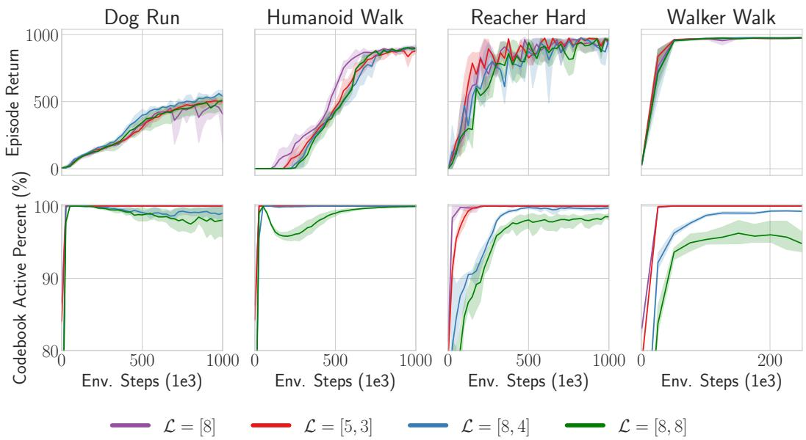  
Figure 7: Sensitivity to codebook size We compare how the codebook size affects the performance of DC-MPC (top) and the percentage of the codebook that is active during training (bottom). In general, smaller codebooks become fully active faster than larger codebooks. We plot the mean and the $9 5 \%$ confidence intervals (shaded) across 3 random seeds for all environments.

-appendices continue on next page

# B.2 SeNsitivity to LatEnT DiMension $d$

This section investigates how the latent dimension $d$ affects the behavior and performance of DCMPC in four different environments. In the top row of Fig. 8, we see that the performance of our algorithm is robust to the latent dimension $d$ , although a latent dimension too small can result in inferior performance, especially in the more difficult environments. The bottom row of Fig. 8 demonstrates that DC-MPC learns to use the complete codebook irrespective of the latent dimension.

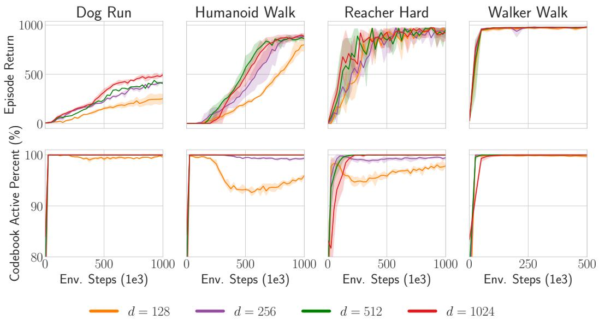  
Figure 8: Sensitivity to latent dim $d$ We compare how the latent dimension $d$ affects the performance of DC-MPC (top) and the percentage of the codebook that is active during training (bottom). In general, our algorithm is robust to the latent dimension of the representation, although in more difficult environments, such as Humanoid Walk, a $d$ too small can harm the agent's performance. We plot the mean and the $9 5 \%$ confidence intervals (shaded) across 3 random seeds for all environments.

# B.3 ABLatioN OF LaTEnT SPaCE

In this section, we provide further details on the comparison of different latent spaces experiments in Sec. 5.1. To validate our method, we test the importance of quantizing the latent space and training the world model with classification instead of regression. In Fig. 9, we compare DC-MPC to world models with different latent spaces formulations, which we now detail.

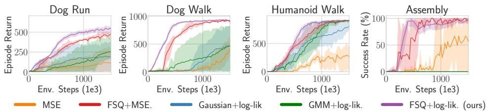  
Figure 9: Latent space comparison Comparison of different latent space formulations. Continuous and deterministic latent space trained with MSE regression (orange), deterministic and discrete trained with MSE (red), continuous and unimodal Gaussian latent space trained with maximum log-likelihood (blue), continuous and multimodal GMM trained with maximum log-likelihood (green), and discrete trained with classification (purple). Discretizing the latent space with FSQ (red) improves sample efficiency and making the dynamics stochastic and training with classification (purple) improves performance further.

MSE (orange) First, we consider a continuous latent space with deterministic transition dynamics trained by minimizing the mean squared error between predicted next latent states and target next latent states.

$\mathbf { F S Q + M S E }$ (red) Next, we consider quantization of the latent space and training based on mean squared error regression. This experiment allows us to analyze the importance of quantization.

Gaussian+log-lik. (blue) To consider stochastic continuous dynamics, we configure the transition dynamics to model a Gaussian distribution over predictions of the next state. During training, we sample from the Gaussian distribution using the reparameterization trick. The world model is then trained to maximize the log-likelihood of the next latent state targets. This allows us to investigate if modeling stochastic transition dynamics offers benefits when using continuous latent spaces.

GMM+log-lik. (green) To consider continuous multimodal transitions, we consider a Gaussian mixture with three components. During training, we sample a Gaussian from the mixture with the ST Gumbel-softmax trick and then we sample from the selected Gaussian using the reparameterization trick. The world model is then trained to maximize the log-likelihood of next latent state targets.

-appendices continue on next page

# B.4 ABLatioN OF FSQ vs VEctoR QuantizatioN (VQ)

To understand how the choice of using FSQ for discretization contributes to the performance of our algorithm, we tried replacing the FSQ layer with a standard Vector Quantization layer. We evaluated the methods in Walker Walk, Dog Run, Humanoid Walk, and Reacher Hard. We used standard hyperparameters, $\beta = 0 . 2 5$ , and an EMA-updated codebook with a size of 256 and either 256 (dog) or 128 (other tasks) channels per dimension. We did not change other hyperparameters from DC-MPC. However, we found that to approach the performance of standard FSQ, VQ needs environment-dependent adjusting of the planning procedure. In Humanoid Walk, the performance of FSQ aligns closely with the VQ with a weighted sum over the codes in the codebook for planning (expected code) but significantly outperforms sampled VQ. Conversely, standard sampling is superior in Reacher Hard, which is unsurprising, as the discrete codes in VQ have not been ordered like in FSQ. The necessary environment-specific adjustments for VQ undermine its general applicability compared to FSQ.

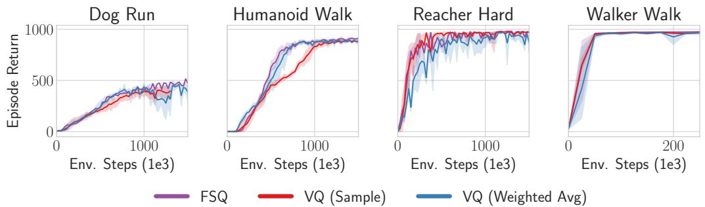  
Figure 10: Ablation of FSQ vs VQ FSQ does not require the extra loss terms required by VQ and it generally performs equal to or better and VQ.

-appendices continue on next page

# B.5 ABLATION OF REDQ CRITIC vS STANDARD DOUBLE Q APPROACH

In this section, we compare the ensemble of Q-functions approach, used by DC-MPC, REDQ (Chen et al., 2021) and TD-MPC2 (Hansen et al., 2023), to the standard double Q approach (Fujimoto et al., 2018). In Fig. 11, we evaluate how our default ensemble size of $N _ { q } = 5$ (purple) compares with the standard double Q approach, which is obtained by setting the ensemble size to $N _ { q } = 2$ (blue). Note that we always sample two critics so the $N _ { q } = 2$ result reduces to the standard double Q approach. Fig. 11 shows that DC-MPC works fairly well with both approaches but the ensemble approach offers benefits in the harder Dog Run and Humanoid Walk tasks.

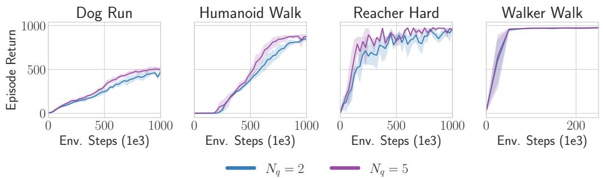  
Figure 11: Ablation of REDQ critic vs standard double Q DC-MPC uses a Q ensemble, similar to REDQ, of size $N _ { q } = 5$ (purple) and sub samples two critics when calculating the mean or minimum Q-value. We compare this approach to the standard double $\mathrm { Q }$ approach by setting $N _ { q } = 2$ (blue) and we see that the ensemble approach offers a slight benefit in the harder Dog Run and Humanoid Walk.

-appendices continue on next page —appendices continue on next page-appendices continue on next page

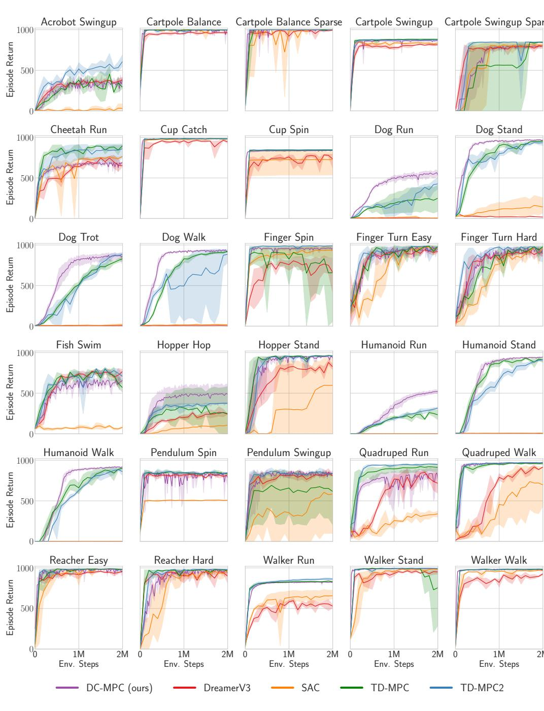  
Figure 12: DeepMind Control results. DC-MPC performs well across a variety of DMC tasks. We plot the mean (solid line) and the $9 5 \%$ confidence intervals (shaded) across 5 seeds (DC-MPC) or 3 seeds (TD-MPC2/TD-MPC/DreamerV3/SAC), where each seed averages over 10 evaluation episodes.

  
Figure 13: High-dimensional locomotion DC-MPC (purple) significantly outperforms TD-MPC2 (blue) and DreamerV3 (red) in the complex, high-dimensional locomotion tasks from DMControl.

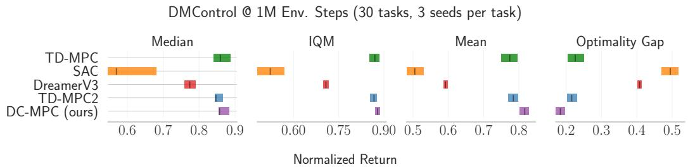  
Figure 14: DMControl aggregate results DC-MPC generally outperforms TD-MPC2 and DreamerV3 in DMControl tasks. This is due to DC-MPC's strong performance in the hard Dog and Humanoid tasks. Error bars represent $9 5 \%$ stratified bootstrap confidence intervals.

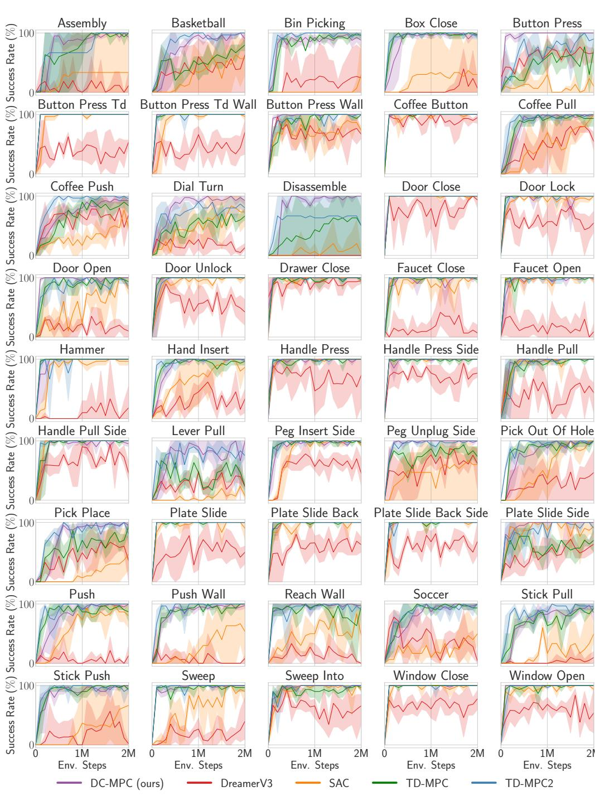  
Figure 15: Meta-World manipulation results DC-MPC performs well across Meta-World tasks. We plot the mean (solid line) and the $9 5 \%$ confidence intervals (shaded) across 3 seeds, where each seed averages over 10 evaluation episodes.

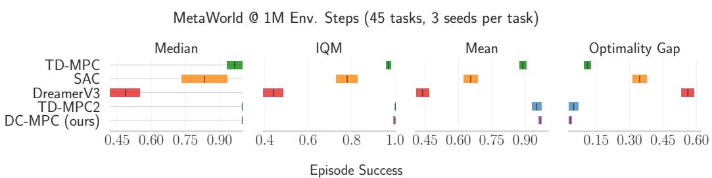  
Figure 16: Meta-World results DC-MPC performs well in Meta-World, generally matching TDMPC2, whilst significantly outperforming DreamerV3 and SAC. Error bars represent $9 5 \%$ stratified bootstrap confidence intervals.

# B.8 MYoSuitE MuscuLosKELetaL REsults

In this section, we evaluate DC-MPC in five musculoskeletal tasks from MyoSuite.

In these experiments, we followed Hafner et al. (2023); Hansen et al. (2023) and scaled the rewards using symlog $( \cdot )$ ,

$$
\mathrm { s y m l o g } ( x ) = \mathrm { s i g n } ( x ) \mathrm { l n } ( | x | + 1 ) .
$$

This compresses large and small rewards whilst preserving the input sign as it is a symmetric function. Note that we simply transform the rewards with symlog and learn both the reward function and $Q$ -functions using these transformed rewards. We use $N = 1$ -step returns in Hand Key Turn, Hand Obj Hold and Hand Pen Twirl and we use $N = 5$ -step returns in Hand Pose and Hand Reach. In Hand Pose we also had to adjust the temperature from 0.5 to 0.2. In future work, it would be interesting to investigate if using $\lambda$ -returns  which uses a weighted-sum of $N$ -step returns  can make DC-MPC robust to the $N$ -step hyperparameter. Further to this, it would be interesting to explore methods for dynamically tuning the MPPI (inverse) temperature $\tau _ { \mathrm { M P P I } }$ .

In Fig. 17 we show the training curves for the individual tasks. Fig. 18 then reports aggregate metrics at 1M environment steps over three random seeds in the five tasks. On average, DC-MPC performs well, generally matching TD-MPC2 at 1M environment steps and outperforming the other baselines.

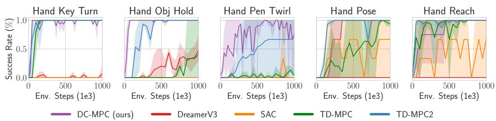  
Figure 17: MyoSuite training curves We plot the mean (solid line) and the $9 5 \%$ confidence intervals (shaded) across 3 seeds, where each seed averages over 10 evaluation episodes.

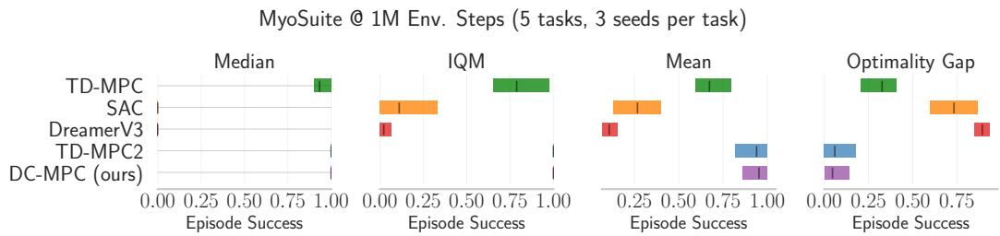  
Figure 18: MyoSuite results DC-MPC performs similarly to TD-MPC2 in MyoSuite. Error bars represent $9 5 \%$ stratified bootstrap confidence intervals.

# B.9 DOES DCWM IMpRove DREamerV3?

In this section, we seek to evaluate what happens when we replace DreamerV3's one-hot discrete encoding with the codebook encoding used in DC-MPC. Fig. 19 shows that in the easy Reacher Hard and Walker Walk environments, FSQ (blue) and one-hot (orange) perform similarly. However, in the difficult Dog Run and Humanoid Walk tasks, no discrete encoding can enable DreamerV3 to perform as well as DC-MPC (purple). We hypothesize that DreamerV3's poor performance in the Dog Run and Humanoid Walk tasks results from its decoder struggling to reconstruct the observations.

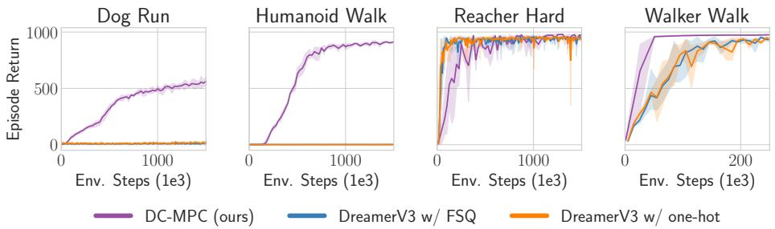  
Figure 19: DreamerV3 with FSQ Replacing DreamerV3's one-hot encoding (orange) with DCMPC's codebook encoding (blue) does not improve performance. Moreover, DreamerV3 is not able to learn in the hard Dog Run and Humanoid Walk tasks and is significantly outperformed by DC-MPC (purple).

Learning to minimize the observation reconstruction error has been widely applied in model-based RL (Sutton & Barto, 2018; Ha & Schmidhuber, 2018; Hafner et al., 2019b), and an observation decoder has been a component of many of the most successful RL algorithms to date (Hafner et al., 2023). However, recent work in representation learning for RL (Zhao et al., 2023) and model-based RL (Hansen et al., 2022) has shown that incorporating a reconstruction term into the representation loss can hurt the performance, as learning to reconstruct the observations is inefficient due to the observations containing irrelevant details that are uncontrollable by the agent and do not affect the task.

To provide a thorough analysis of DC-MPC, we include results where we add a reconstruction term to our world model loss in Eq. (8):

$$
\begin{array} { r } { \mathcal { L } _ { o } = \mathbb { E } _ { o _ { t } \sim \mathcal { D } } [ \| \hat { \pmb { o } } _ { t } - \pmb { o } _ { t } \| _ { 2 } ^ { 2 } ] , \quad \hat { \pmb { o } } _ { t } = h _ { \kappa } ( \pmb { c } _ { t } ) , } \end{array}
$$

where $h _ { \kappa }$ is a learned observation decoder that takes the latent code as the input and outputs the reconstructed observation. The decoder $h _ { \kappa }$ is a standard MLP. We perform reconstruction at each time step i  oio. e sult  o a   ets d cn and in some tasks, such as the difficult Dog Run and Humanoid Walk tasks, including the reconstruction term has a significant detrimental effect on the performance, and can even prevent learning completely. Our results support the observations of Zhao et al. (2023) and Hansen et al. (2022) about the lack of need for a reconstruction loss in continuous control tasks. However, it is worth noting that we weighted all loss terms equally whilst the results in Ma et al. (2024) suggest that the observation reconstruction, temporal consistency, and reward prediction loss terms need to be carefully balanced.

  
Figure 20: Reconstruction harms performance Adding observation reconstruction to DC-MPC (blue) harms the performance of DC-MPC across a mixture of easy and hard DMControl tasks.

# B.10 IMPROVING TD-MPC2 WITH DC-MPC

In this section, we investigate using DC-MPC's latent space inside TD-MPC2. Note that TD-MPC2's latent space is continuous and trained with MSE regression. It also uses simplical normalization (SimNorm) to make its latent space bounded. In these experiments, we removed SimNorm and replaced it with our discrete and stochastic latent space, and then trained using cross-entropy for the consistency loss. In particular, we made the following changes to the TD-MPC2 codebase: (i) removed SimNorm, (ii) added FSQ to the encoder, (ii) modified the dynamics to predict the logits instead of the next latent state, (iv) modified the dynamics to use ST Gumbel-softmax sampling for multi-step predictions during training and our weighted average approach during planning, and (v) changed the world model's loss coefficients for consistency, value, and, reward, to all be 1.

In Fig. 6, we report aggregate metrics over 3 random seeds in 10 DMControl tasks and 10 Meta-World tasks. Fig. 6 (left) shows the IQM and optimality gap at 1M environment steps over the 20 tasks. It shows that adding DC-MPC's discrete and stochastic latent space to TD-MPC2 offers some improvement. Fig. 6 (right) shows the aggregate training curves (IQM over 10 tasks) for DMControl and Meta-World, respectively. The results show that using DCWM inside TD-MPC2 offers some benefits in the 10 DMControl tasks, whilst in the 10 Meta-World tasks, the performance of all methods seems about equal. This suggests that, in the context of continuous control, discrete and stochastic latent spaces are advantageous for world models. This is an interesting result which we believe motivates further research into discrete and stochastic latent spaces for world models.

-appendices continue on next page

# C IMPLEMENTATION DETAILS

Architecture We implemented DC-MPC with PyTorch (Paszke et al., 2019) and used the AdamW optimizer (Kingma & Ba, 2015) for training the models. All components (encoder, dynamics, reward, actor and critic) are implemented as MLPs. Following Hansen et al. (2023) we let all intermediate layers be linear layers followed by LayerNorm (Ba et al., 2016). We use Mish activation functions throughout. Below we summarize the DC-MPC architecture for our base model.

)CMPC( (model): WorldModel( (_fsq): FSQ(levels $\beta =$ [5, 3]) (_encoder): ModuleDict( (state): Sequential( (0): NormedLinear(in_features $=$ obs_dim, out_features $_ { : = 2 5 6 }$ , act=Mish) (1): Linear(in_features=256, out_features=latent_dim\*num_channels) ) ) (_trans): Sequential( (0): NormedLinear(in_features $: =$ (latent_dim\*num_channels)+act_dim, out_features $_ { : = 5 1 2 }$ , act=Mish) (1): NormedLinear(in_features $= 5 1 2$ , out_features $= 5 1 2$ , act=Mish) (2): Linear(in_features $_ { 5 } = 5 1 2$ , out_features $= \dot { . }$ latent_dim $^ { \star }$ codebook_size) ) (_reward): Sequential( (0): NormedLinear(in_features $=$ (latent_dim $\mathbf { \nabla } _ { \cdot } \star$ num_channels)+act_dim, out_features $= 5 1 2$ , act=Mish) (1): NormedLinear(in_features $_ { : = 5 1 2 }$ , out_features $= 5 1 2$ , act=Mish) (2): Linear(in_feature: $_ { 3 } = 5 1 2$ , out_features $: = 1$ ) ) ) (_pi): Sequential( (0): NormedLinear(in_features $= 1$ atent_dim\*num_channels, out_features $= 5 1 2$ , act=Mish) (1): NormedLinear(in_features=512, out_features=512, act=Mish) (2): Linear(in_features $_ { : = 5 1 2 }$ , out_features=act_dim) ) (_Qs): Vectorized ModuleList( (0-4): 5 x Sequential( (0): NormedLinear(in_features $=$ (latent_dim $^ { \star }$ num_channels)+act_dim, out_features $_ { 5 3 1 2 }$ , act $=$ Mish) (1): NormedLinear(in_features $= 5 1 2$ , out_features $= 5 1 2$ , act=Mish) (2): Linear(in_features $= 5 1 2$ , out_features $^ { = 1 }$ ) ) ) (_pi_tar): Sequential( (0): NormedLinear(in_features $= 1$ atent_dim $^ { \star }$ num_channels, out_features $_ { 5 } = 5 1 2$ , act=Mish) (1): NormedLinear(in_features $= 5 1 2$ , out_features $_ { 5 } = 5 1 2$ , act=Mish) (2): Linear(in_features $_ { : = 5 1 2 }$ , out_features=act_dim) ) (Qs_tar): Vectorized ModuleList( (0-4): 5 x Sequential( (0): NormedLinear(in_features $=$ (latent_dim $\cdot ^ { \star }$ num_channels) $^ +$ act_dim, out_features $_ { : = 5 1 2 }$ , act=Mish) (1): NormedLinear(in_features $_ { : = 5 1 2 }$ , out_features $= 5 1 2$ , act=Mish) (2): Linear(in_features $_ { 5 } = 5 1 2$ , out_features $^ { = 1 }$ ) )

where obs_dim is the dimensionality of the observation space, act_dim is the dimensionality of the action space, latent_dim is the number of the latent dimensions $d$ (default 512), num_channels is the number of channels per latent dimension $b$ (default 2), and codebook_size is the codebook size $| { \mathcal { C } } |$ (default 15).

Statistical significance We used five seeds for DC-MPC and three seeds for TDMPC2/DreamerV3/SAC/TD-MPC in the main figures, at least three seeds for all ablations, and plotted the $95 \%$ confidence intervals as the shaded area, which corresponds to approximately two standard errors of the mean. However, in Figs. 3 and 6 we follow Agarwal et al. (2021) and plot the interquartile mean (IQM) with the shaded area representing $9 5 \%$ stratified bootstrap confidence intervals.

Hardware We used NVIDIA A100s and AMD Instinct MI250X GPUs to run our experiments. All our experiments have been run on a single GPU with a single-digit number of CPU workers.

Open-source code For full details of the implementation, model architectures, and training, please check the code, which is available in the submitted supplementary material and available on github at https://github.com/aidanscannell/dcmpc.

—appendices continue on next page—

Hyperparameters Table 1 lists all of the hyperparameters for training DC-MPC which were used for the main experiments and the ablations.

Table 1: DC-MPC hyperparameters We kept most hyperparameters fixed across tasks. However we set task-specific exploration noise schedules and $N$ -step returns.   

<table><tr><td>HYPERPARAMETER</td><td>VALuE</td><td>DESCRIPTION</td></tr><tr><td>TRAINING</td><td></td><td></td></tr><tr><td>ACTION REPEAT</td><td>2 (1 IN MYOSUITE)</td><td></td></tr><tr><td>MAX EPISODE LENGTH (T )</td><td>500 in DMCONTROL 100 in MetA-WOrLD</td><td>ACTION REPEAT MAKES THIS 1000 ACTION REPEAT MAKES THIS 200</td></tr><tr><td></td><td>100 in MyoSuItE</td><td></td></tr><tr><td>NUM. EVAL EPISODES RANDoM EPISODES (NRANDOM EpISODES)</td><td>10 10</td><td>NUM. RANDOM EPISOdES AT START</td></tr><tr><td>MPPI PLANNING</td><td></td><td></td></tr><tr><td>PLANNING HORIZON</td><td></td><td rowspan="6"></td></tr><tr><td>PLANNING ITERATIONS (J)</td><td>3 6</td></tr><tr><td></td><td></td></tr><tr><td>POPULATION SIZE (Np) PRiOR POPUlatioN SIZE (Nπ)</td><td>512 24</td></tr><tr><td>NUmber of ELIteS (K)</td><td></td></tr><tr><td>Minimum STD</td><td>64 0.05</td></tr><tr><td>MAXIMUM STD</td><td>2</td><td></td></tr><tr><td>(INVERSE) TEMPERATURE (7MPPI)</td><td>0.5</td><td></td></tr><tr><td>TD3</td><td></td><td></td></tr><tr><td>ACTOR UPDATE FREQ.</td><td>2</td><td>UPDATE ACTOR LESS THAN CRITIC</td></tr><tr><td>Batch size</td><td>512</td><td></td></tr><tr><td></td><td>106</td><td></td></tr><tr><td>BUFfeR SIZE</td><td>0.99</td><td></td></tr><tr><td>Discount factor (γ)</td><td></td><td>DMCONTROL</td></tr><tr><td>ExpLoraTIoN NOISE</td><td>Linear(1.0, 0.1, 50) (EASY) Linear(1.0, 0.1, 150) (MEDIUM)</td><td>DMCONTROL</td></tr><tr><td>LEARNING RATE</td><td>Linear(1.0, 0.1, 500) (HARD) Linear(1.0, 0.1, 250)</td><td>DMCONTROL Meta-World &amp; MyoSuite</td></tr><tr><td>MLP DIMS</td><td>3 × 10−4 [512, 512]</td><td>FOR ACTOR/CRITIC/DYNAMICS/REWARD</td></tr><tr><td>MOMeNTUM COEF. (τ )</td><td>0.005</td><td></td></tr><tr><td>Num. Q-functions (Nq)</td><td>5</td><td></td></tr><tr><td>NUm. Q-functionS to SamPLE</td><td>2</td><td></td></tr><tr><td>Noise CLIP (c)</td><td>0.3</td><td></td></tr><tr><td>N-STEP TD</td><td>1 oR 3 iN DMConTROL</td><td></td></tr><tr><td></td><td>3 iN Meta-WOrlLD</td><td></td></tr><tr><td>POLICY NOISE</td><td>1 OR 5 In MYOSuITE</td><td></td></tr><tr><td>UPDATE-TO-DATA (UTD) RATIO</td><td>0.2</td><td></td></tr><tr><td>WORLD MODEL</td><td>1</td><td></td></tr><tr><td></td><td></td><td></td></tr><tr><td>Discount factor (γ)</td><td>0.9</td><td></td></tr><tr><td>EncodeR LEarNinG RaTE</td><td>10-4</td><td></td></tr><tr><td>Encoder Mlp dims</td><td></td><td></td></tr><tr><td></td><td>[256]</td><td></td></tr><tr><td>FSQ LEVELS</td><td>[5, 3]</td><td>GIVES |C| = 5 × 3 = 15 ≈ 24</td></tr><tr><td>HOrIzoN (H)</td><td>5</td><td>FOR WORLD MODEL TRAINING</td></tr><tr><td>LATENT DIMENSION (d)</td><td>512</td><td></td></tr><tr><td></td><td>1024 (HUMaNoiD/DOG)</td><td></td></tr></table>

-appendices continue on next page

# D BASELINES

In this section, we provide further details of the baselines we compare against.

•DreamerV3 (Hafner et al., 2023) is a reinforcement learning algorithm that uses a world model to predict outcomes, a critic to judge their value, and an actor to choose actions to maximize value. It uses symlog loss for training and operates on model states from imagination data. The critic is a categorical distribution with exponentially spaced bins, and the actor is trained with entropy regularization and return normalization. The world model is only used for training and there is no decision-time planning. In contrast, DC-MPC learns a deterministic encoder with a discrete latent space and stochastic dynamics in the world model. We report the results of DreamerV3 from the TD-MPC2 official repository 2.

•Temporal Difference Model Predictive Control 2 (TD-MPC2, Hansen et al. (2023)) is a decoder-free model-based reinforcement learning algorithm with a focus on scalability and sample efficiency. It includes an encoder, latent transition dynamics, a reward predictor, a terminal value (critic), and a policy prior (actor). In contrast to DreamerV3, it utilizes a deterministic encoder and transition dynamics implemented with MLPs, layer normalization (Ba et al., 2016) and Mish (Misra, 2019) activations. To avoid exploding gradients and representation collapse, the latent space is normalized with projection followed by a softmax operation. All components except the policy prior are trained jointly based on predicting the latent embedding, reward prediction, and value prediction, while reward and value predictions are based on discrete regression in log-transformed space. Similarly, we use a deterministic encoder, but we train the transition dynamics with a cross-entropy loss function, which considers multi-modality and uncertainties, and we decouple representation learning from value learning. We report the results from the TD-MPC2 official repository

•Temporal Difference Model Predictive Control (TD-MPC, Hansen et al. (2022)) is the first version of TD-MPC2. It is also a decoder-free model-based RL algorithm consisting of an encoder, latent transition dynamics, reward predictor, terminal value (critic), and policy prior (actor). In contrast to TD-MPC2, it does not apply simplical normalization (SimNorm) to its latent state, it trains the reward and value prediction using the MSE loss instead of the crossentropy loss, and it uses SAC as the underlying RL algorithm. We refer the reader to the TDMPC paper for further details. We report the results from the TD-MPC2 official repository 4.

Soft Actor-Critic (SAC, Haarnoja et al. (2018) is an off-policy model-free RL algorithm based on the maximum entropy RL framework. That is, it attempts to succeed at the task whilst acting as randomly as possible. It is worth highlighting that TD-MPC2 uses SAC as it's underlying model-free RL algorithm. We report the results from the TD-MPC2 official repository 5.

# E TASKS

We evaluate our method in 30 tasks from the DeepMind Control suite (Tassa et al., 2018), 45 tasks from Meta-World (Yu et al., 2019) and 5 tasks from MyoSuite (Vittorio et al., 2022). Tables 2 to 4 provide details of the environments we used, including the dimensionality of the observation and action spaces.

Table 2: DMControl We consider a total of 30 continuous control tasks from DMControl.   

<table><tr><td>TASK</td><td>OBseRVAtIoN DIM</td><td>ACTION DIM</td><td>SPARSE?</td></tr><tr><td>AcroboT SwIngup</td><td>6</td><td>1</td><td>N</td></tr><tr><td>CARTPoLE BALaNcE</td><td>5</td><td>1</td><td>N</td></tr><tr><td>CarPoLe BaLaNce SPaRsE</td><td>5</td><td>1</td><td>Y</td></tr><tr><td>CartpoLe SwIngup</td><td>5</td><td>1</td><td>N</td></tr><tr><td>CARTPoLE SwIngUP SPARsE</td><td>5</td><td>1</td><td>Y</td></tr><tr><td>Cheetah Run</td><td>17</td><td>6</td><td>N</td></tr><tr><td>Cup Catch</td><td>8</td><td>2</td><td>Y</td></tr><tr><td>CUP SPIN</td><td>8</td><td>2</td><td>N</td></tr><tr><td>Dog Run</td><td>223</td><td>38</td><td>N</td></tr><tr><td>Dog StANd</td><td>223</td><td>38</td><td>N</td></tr><tr><td>Dog Trot</td><td>223</td><td>38</td><td>N</td></tr><tr><td>Dog Walk</td><td>223</td><td>38</td><td>N</td></tr><tr><td>FINGER SPIN</td><td>9</td><td>2</td><td>Y</td></tr><tr><td>Finger Turn Easy</td><td>12</td><td>2</td><td>Y</td></tr><tr><td>Finger Turn Hard</td><td>12</td><td>2</td><td>Y</td></tr><tr><td>FISh SwIm</td><td>24</td><td>5</td><td>N</td></tr><tr><td>HOPPER HOP</td><td>15</td><td>4</td><td>N</td></tr><tr><td>HOPPER STAND</td><td>15</td><td>4</td><td>N</td></tr><tr><td>Humanoid Run</td><td>67</td><td>24</td><td>N</td></tr><tr><td>Humanoid Stand</td><td>67</td><td>24</td><td>N</td></tr><tr><td>HUmanoid Walk</td><td>67</td><td>24</td><td>N</td></tr><tr><td>Pendulum SPin</td><td>3</td><td>1</td><td>N</td></tr><tr><td>Pendulum Swingup</td><td>3</td><td>1</td><td>N</td></tr><tr><td>QUADRUPED RUn</td><td>78</td><td>12</td><td>N</td></tr><tr><td>QUADRUPED WALK</td><td>78</td><td>12</td><td>N</td></tr><tr><td>Reacher Easy</td><td>6</td><td>2</td><td>Y</td></tr><tr><td>REachER HARd</td><td>6</td><td>2</td><td>Y</td></tr><tr><td>Walker Run</td><td>24</td><td>6</td><td>N</td></tr><tr><td>Walker Stand</td><td>24</td><td>6</td><td>N</td></tr><tr><td>Walker Walk</td><td>24</td><td>6</td><td>N</td></tr></table>

-appendices continue on next page

Table 3: Meta-World We consider a total of 45 continuous control tasks from Meta-World. This benchmark is designed for multitask research so all tasks share similar embodiment, observation space, and action space.   

<table><tr><td colspan="4"></td></tr><tr><td>TASK</td><td>OBSERVATION DIM</td><td>ACTION DIM</td><td>SPARSE?</td></tr><tr><td>ASsEMBLY</td><td>39</td><td>4</td><td>N</td></tr><tr><td>BASKETBALL</td><td>39</td><td>4</td><td>N</td></tr><tr><td>Bin Picking</td><td>39</td><td>4</td><td>N</td></tr><tr><td>BoX CLOse</td><td>39</td><td>4</td><td>N</td></tr><tr><td>Button Press</td><td>39</td><td>4</td><td>N</td></tr><tr><td>Button Press Topdown</td><td>39</td><td>4</td><td>N</td></tr><tr><td>Button Press Topdown Wall</td><td>39</td><td>4</td><td>N</td></tr><tr><td>Button Press Wall</td><td>39</td><td>4</td><td>N</td></tr><tr><td>Coffee Button</td><td>39</td><td>4</td><td>N</td></tr><tr><td>Coffee Push</td><td>39</td><td>4</td><td>N</td></tr><tr><td>Coffee Pull</td><td>39</td><td>4</td><td>N</td></tr><tr><td>Dial Turn</td><td>39</td><td>4</td><td>N</td></tr><tr><td>DisassEMBLE</td><td>39</td><td>4</td><td>N</td></tr><tr><td>Door Close</td><td>39</td><td>4</td><td>N</td></tr><tr><td>Door Lock</td><td>39</td><td>4</td><td>N</td></tr><tr><td>Door OPeN</td><td>39</td><td>4</td><td>N</td></tr><tr><td>Door Unlock</td><td>39</td><td>4</td><td>N</td></tr><tr><td>Drawer Close</td><td>39</td><td>4</td><td>N</td></tr><tr><td>Faucet ClOSe Faucet OPEN</td><td>39</td><td>4</td><td>N</td></tr><tr><td></td><td>39</td><td>4</td><td>N</td></tr><tr><td>HAmmER Hand Insert</td><td>39</td><td>4</td><td>N</td></tr><tr><td>Handle Press</td><td>39</td><td>4</td><td>N</td></tr><tr><td>Handle Press Side</td><td>39</td><td>4</td><td>N</td></tr><tr><td>Handle Pull</td><td>39</td><td>4</td><td>N</td></tr><tr><td>Handle Pull Side</td><td>39</td><td>4</td><td>N</td></tr><tr><td>Lever Pull</td><td>39</td><td>4</td><td>N</td></tr><tr><td>Peg Insert Side</td><td>39</td><td>4</td><td>N</td></tr><tr><td>Peg Unplug SiDE</td><td>39</td><td>4</td><td>N</td></tr><tr><td>Pick Out Of Hole</td><td>39</td><td>4</td><td>N</td></tr><tr><td>PICK PLACE</td><td>39</td><td>4</td><td>N</td></tr><tr><td>PLate SLIDE</td><td>39</td><td>4</td><td>N</td></tr><tr><td>PLatE SLide Back</td><td>39</td><td>4</td><td>N</td></tr><tr><td>PLate Slide Back SidE</td><td>39</td><td>4</td><td>N</td></tr><tr><td>PLate SLidE SidE</td><td>39</td><td>4</td><td>N N</td></tr><tr><td>PUSH</td><td>39 39</td><td>4</td><td>N</td></tr><tr><td>Push Wall</td><td>39</td><td>4 4</td><td>N</td></tr><tr><td>Reach Wall</td><td>39</td><td>4</td><td>N</td></tr><tr><td>SOCCER</td><td>39</td><td>4</td><td>N</td></tr><tr><td>Stick Pull</td><td>39</td><td>4</td><td>N</td></tr><tr><td>Stick Push</td><td>39</td><td>4</td><td>N</td></tr><tr><td>SWEEP</td><td></td><td></td><td>N</td></tr><tr><td></td><td>39</td><td>4</td><td></td></tr><tr><td>SWEEP Into Window Close</td><td>39 39</td><td>4 4</td><td>N N</td></tr><tr><td></td><td>39</td><td>4</td><td>N</td></tr><tr><td>Window Open</td><td></td><td></td><td></td></tr></table>

Table 4: MyoSuite We consider a total of 5 continuous control tasks from MyoSuite. This benchmark is designed for high-dimensional muscoloskeletal motor control which involves complex object manipulation with a dexterous hand.   

<table><tr><td>TASK</td><td>OBSERVATION DIM</td><td>ACTION DIM</td><td>SPARSE?</td></tr><tr><td>Key Turn</td><td>93</td><td>39</td><td>N</td></tr><tr><td>OBJEct HoLD</td><td>91</td><td>39</td><td>N</td></tr><tr><td>PeN TwIrL</td><td>83</td><td>39</td><td>N</td></tr><tr><td>POSE</td><td>108</td><td>39</td><td>N</td></tr><tr><td>REACH</td><td>115</td><td>39</td><td>N</td></tr></table>

  
Figure 21: Tasks visualizations Visualization of the DMControl, Meta-World, and MyoSuite tasks used throughout the paper.