# 在多个仿真世界中扩展可指导智能体

SMA团队：1Maria Abi Raad，Arun Ahuja，Catarina Barros，Frederic Besse，Andrew Bolt，Adrian Bolton，Bethanie Browniel，Gavin Buttimore，Max Cant，Sarah Chakera，Stephanie C.Y. Chan，Jeff Clune1,3，Adrian Colister，Vikki Copeman2，Alex Cullum，Ishita Dasgupta，Dario de Cesare，Julia Di Trapani，Yani Donchev，Emma Dunleavy，Martin Engelcke，Ryan Faulkner，Frankie Garcia，Charles Gbadamosi，Zhitao Gong，Lucy Gonzales，Karol Gregor，Kshitij Gupta2，Arne Olav Hallingstad，Tim Harley，Sam Haves，Felix Hill，Ed Hirst，Drew A. Hudson，Jony Hudson，Steph Hughes-Fitt，Danilo J. Rezende，Mimi Jasarevic，Laura Kampis，Rosemary Ke，Thomas Keck，Junkyung Kim，Oscar Knagg，Kavya Kopparapu，Rory Lawton，Andrew Lampinen，Shane Legg，Alexander Lerchner，Marjorie Limont，Yulan Liu，Maria Loks-Thompson，Joseph Marino，Kathryn Martin Cussons2，Loic Matthey，Siobhan Mcloughlin，Piermaria Mendolicchio，Hamza Merzic，Anna Mitenkova，Alexandre Moufarek，Valeria Oliveira，Yanko Oliveira，Hannah Openshaw，Renke Pan，Aneesh Pappu，Alex Platono，Ollie Purkiss，David Reichert，John Reid，Pierre Harvey Richemond，Tyson Roberts，Giles Ruscoe，Jaume Sanchez Elias，Tasha Sandars2，Daniel P. Sawyer，Tim Scholtes，Guy Simmons，Daniel Slater，Hubert Soyer，Heiko Strathmann，Peter Stys，Allison C. Tam，Denis Teplyashin，Tayfun Terzi，Davide Vercelli，Bojan Vujatovic，Marcus Wainwright，Jane X. Wang，Zhengdong Wang，Daan Wierstra2，Duncan Williams，Nathaniel Wong，Sarah York，Nick Young 在 Google DeepMind 任职期间完成。3不列颠哥伦比亚大学

构建能够在任何三维环境中遵循任意语言指令的具身人工智能系统是创建通用人工智能的关键挑战。实现这一目标需要学习将语言与感知和具身行动相结合，从而完成复杂任务。可扩展、可指令的多世界智能体（SIMA）项目通过训练智能体在各种虚拟三维环境中遵循自由形式的指令来解决这一问题，这些环境包括经过精心策划的研究环境以及开放式商业视频游戏。我们的目标是开发一个可指令的智能体，使其能够在任何模拟的三维环境中完成任何人类能够完成的任务。我们的方法侧重于语言驱动的一般性，并施加最小的假设。我们的智能体通过一种通用的人类界面实时与环境互动：输入为图像观察和语言指令，输出为键盘和鼠标操作。这种通用方法具有挑战性，但它使智能体能够在许多视觉复杂和语义丰富的环境中将语言与实际操作相结合，同时也使我们能够轻松地在新环境中运行智能体。本文描述了我们的动机和目标、我们所取得的初步进展以及在多个多样化研究环境和各种商业视频游戏中的 promising 初步结果。关键词：智能体、具身性、基础模型、语言、视频游戏、三维环境

# 1. 引言

尽管大型语言模型具有令人印象深刻的能力（Brown等，2020；Hoffmann等，2022；OpenAI，2023；Anil等，2023；Gemini团队等，2023），但将它们与我们所居住的具身世界连接起来仍然具有挑战性。现代AI可以编写计算机程序（Li等，2022）或以超人类水平下棋（Silver等，2018），但AI在感知和行动方面的能力仍远低于人类水平。仅在语言能力方面，AI的表现优于具身感知和行为，这突显了一个众所周知的悖论：对于AI来说更容易的事情，对人类反而更难，反之亦然（Moravec，1988）。

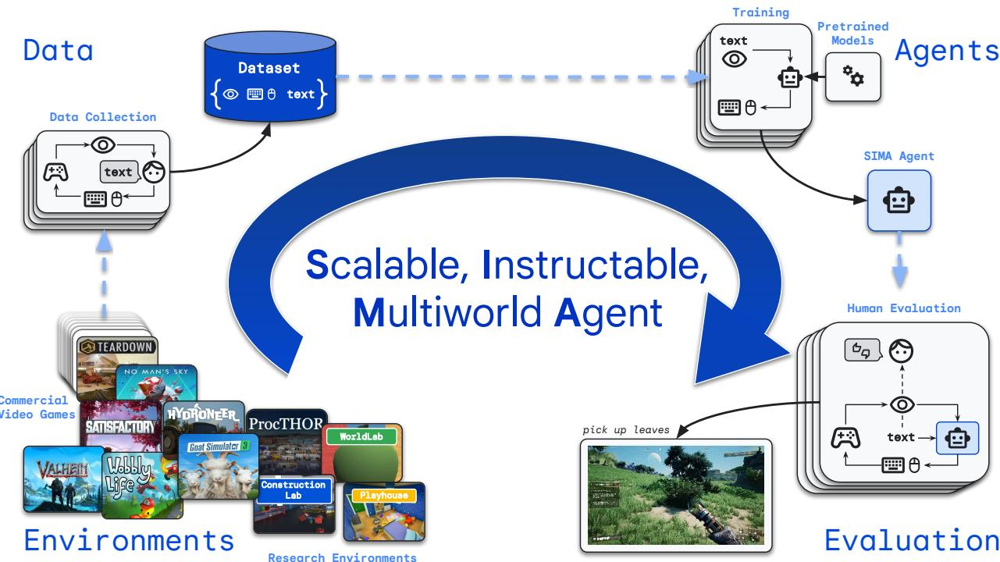  
Figure 1 | Overview of SIMA. In SIMA, we collect a large and diverse dataset of gameplay from both curated research environments and commercial video games. This dataset is used to train agents to follow open-ended language instructions via pixel inputs and keyboard-and-mouse action outputs. Agents are then evaluated in terms of their behavior across a broad range of skills.

然而，语言在其所传达的关于世界的抽象概念中最为实用。语言抽象可以促进高效学习和概括（Hill et al., 2020; Colas et al., 2020; Lampinen et al., 2022; Tam et al., 2022; Hu and Clune, 2023）。一旦学会，语言可以解锁关于具体情境和任务的规划、推理（例如，Huang et al., 2022; Brohan et al., 2023b; Driess et al., 2023; Kim et al., 2023）和交流（Zeng et al., 2022）。反过来，在丰富的环境中将语言与现实紧密结合，可以使系统对于语言本身的理解更具系统性和可推广性（Hill et al., 2019）。因此，若干问题应运而生：我们如何弥合语言符号与其外部指称之间的鸿沟（参见，Harnad, 1990）？我们如何将语言所提供的抽象性和概括性与具体感知和行动连接起来，并且如何以安全和可扩展的方式实现这一点？在此，我们从这些问题以及已解决和正在进行的相关研究项目（如，Hermann et al., 2017; Abramson et al., 2020; Brohan et al., 2023a,b; Driess et al., 2023; Wang et al., 2023b; Tan et al., 2024）中汲取灵感，试图将语言与大规模的具体行为连接起来。弥合这一差距是发展通用具身人工智能的核心挑战。

可扩展、可指导的多世界智能体（SIMA）项目旨在构建一个能够根据任意语言指令在任何虚拟3D环境中通过键盘和鼠标操作进行行动的系统——从定制的研究环境到广泛的商业视频游戏。关于创建可以与视频游戏或模拟3D环境交互的智能体的研究历史悠久（例如，Mnih 等，2015；Berner 等，2019；Vinyals 等，2019；Baker 等，2022），甚至可以在有限范围的环境中跟随语言指令（例如，Abramson 等，2020；Lifshitz 等，2023）。然而，在SIMA中，我们受到大型语言模型的启发，其培训广泛的数据分布是推进通用人工智能的最有效方法（例如，Brown 等，2020；Hoffmann 等，2022；OpenAI，2023；Anil 等，2023；Gemini Team 等，2023）。因此，与之前的工作（例如Abramson 等，2020；Vinyals 等，2019；Berner 等，2019；Lifshitz 等，2023）相比，我们尝试以尽可能一般和可扩展的方式，通过仅仅假设与人类以相同方式与环境交互来解决这个问题。为此，我们做出了一些设计决策，既使我们的方法更具一般性，也带来了更多挑战： •我们融入了许多丰富、视觉复杂、开放式的视频游戏，这些游戏场景中包含数百个物体和大量可能的交互。 这些环境是异步的（例如，Berner 等，2019；Vinyals 等，2019）；与许多研究环境不同，它们不会在智能体计算其下一个动作时停止并等待。 •每个商业视频游戏的实例需要在GPU上运行；因此，我们不能像在强化学习中常做的那样为每个实验运行数百或数千个智能体（参见Espeholt 等，2018）。 •智能体接收与人类玩家相同的屏幕观察，而无法获取内部游戏状态、奖励或任何其他特权信息（参见Berner 等，2019；Vinyals 等，2019）。 •为了与环境进行交互，智能体使用与人类相同的键盘和鼠标控制（例如，Baker 等，2022；Humphreys 等，2022；Lifshitz 等，2023），而不是手工设计的动作空间或高层API。 •我们专注于遵循语言指令（例如，Abramson 等，2020），而不仅仅是为了最大化胜率或生成合理行为而玩游戏（参见Berner 等，2019；Vinyals 等，2019）。 •我们使用开放式自然语言训练和测试智能体，而不是简化的语法或命令集（例如，Abramson 等，2020）。这些设计选择使得学习问题更具挑战性，但其一般性使得扩展到新环境变得更容易：智能体在不同环境中使用相同的接口，而不需要为每个新游戏定制控制和观察空间的设计。此外，由于智能体-环境接口与人类兼容，这使得智能体有潜力实现人类能够完成的任何事情，并允许直接从人类行为中进行模仿学习。这个将语言指令转换为具体行为的一般接口还可以使智能体在从未见过的游戏中零-shot转移之前学到的技能。在通用虚拟环境中进行研究使我们能够在广泛且具有挑战性的情境中测试我们的智能体——这些环境中的经验教训更可能适用于具有丰富视觉感知和控制的现实世界应用，如机器人技术——而无需现实世界测试的风险和成本：如果智能体在视频游戏中坠毁了一艘宇宙飞船，我们可以直接重新启动游戏。

在SIMA项目中，我们创建了一个智能体，根据用户生成的语言指令执行短期任务；这些指令也可以由语言模型生成（例如，Jiang et al., 2019；Driess et al., 2023；Wang et al., 2023b；Hu et al., 2023；Ajay et al., 2023）。我们拥有超过十个3D环境的组合，包括研究环境和商业视频游戏。在研究环境中，我们使用真实状态评估智能体，而商业视频游戏则未设计用于报告任意语言任务的完成情况。因此，我们开发了多种方法来评估视频游戏中的表现，包括使用光学字符识别（OCR）来检测屏幕上描述任务完成的文本，以及对智能体行为录制视频的人类评估。在本技术报告的其余部分，我们将描述高层次的方法（如图1所示）和我们朝着SIMA最终目标的初步进展：开发一个可指令的智能体，能够在任何模拟的3D环境中完成任何人类能够完成的任务。

# 2. 相关工作

SIMA 基于使用游戏作为人工智能研究平台的悠久历史。例如，西洋双陆棋为早期深度强化学习方法提供了初步的试验场（Tesauro 等，1995），而后续的研究在复杂棋类游戏如围棋中甚至达到了超人类表现（Silver 等，2016，2018）。

视频游戏 在过去十年中，视频游戏为聚焦于在丰富环境中执行视觉运动控制的具身智能体研究提供了日益重要的背景。研究人员使用了许多视频游戏环境，涵盖了从Atari（Bellemare等，2013）到DoTA（Berner等，2019）和星际争霸I（Vinyals等，2019）的广泛范围。然而，在SIMA中，我们将重点限制在与3D物理具身最接近的游戏上，特别是在玩家以第一人称或肩上视角的伪第一人称视角与3D世界互动的游戏。这一重点排除了许多以前用于研究的游戏，例如上述列出的那些。然而，对于第一人称具身视频游戏作为人工智能研究平台的关注已显著增加（Johnson等，2016；Tessler等，2017；Guss等，2019；Pearce和Zhu，2022；Hafner等，2023；Durante等，2024；Tan等，2024）。这些视频游戏AI项目推动了许多创新技术的发展，例如通过使用逆动态模型标注视频中的估计玩家键盘和鼠标动作进行学习（Pearce和Zhu，2022；Baker等，2022）。最近，提供API访问环境的游戏作为基于环境的预训练大语言模型的平台（Wang等，2023a），一些研究甚至考虑通过低级控制器的直接感知和动作将语言模型嵌入到游戏中（Wang等，2023b）。然而，SIMA并没有集中于单一游戏或环境，而是考虑了一系列多样化的游戏，以训练智能体在更广泛的内容上。

研究环境 其他研究集中于为研究设计的定制化、受控环境。这些环境中的许多关注于特定领域的真实世界知识。例如，AI2-THOR (Kolve 等, 2017)、VirtualHome (Puig 等, 2018)、ProcTHOR (Deitke 等, 2022)、AI Habitat (Savva 等, 2019；Szot 等, 2021；Puig 等, 2023)、ALFRED (Shridhar 等, 2020) 和 Behavior (Srivastava 等, 2021) 模拟在自然场景中表现的具身智能体。CARLA (Dosovitskiy 等, 2017) 提供了一个自动驾驶模拟器。MuJoCo (Todorov 等, 2012)、PyBullet (Coumans 和 Bai, 2016) 和 Isaac Gym (Makoviychuk 等, 2021) 提供高质量的物理模拟器，用于学习低级控制，并被用于机器人操作的基准测试，如 Meta-World (Yu 等, 2020) 和 Ravens (Zeng 等, 2021)。Albrecht 等 (2022) 提出了一个统一的环境，涵盖通过生态灵感互动所赋予的多种技能。Playhouse (Abramson 等, 2020；DeepMind 互动智能体团队等, 2021；Abramson 等, 2022a) 和 WorldLab (例如 Gulcehre 等, 2019) 环境是使用 Unity 构建的（见 Ward 等, 2020）。开放式学习团队等 (2021) 和自适应智能体团队等 (2023) 也使用 Unity 来实例化具有共享基本原理的程序生成任务的广泛分布。为了本工作中的结果，我们还使用 Playhouse、WorldLab 和 ProcTHOR。此外，我们引入了一个新的环境，称为建造实验室。

机器人技术是体现智能研究的关键领域。各种机器人项目已利用仿真进行训练，以便高效地转移到现实世界的机器人部署中（Höfer et al., 2021），尽管通常仅限于单一的受限环境。近期的研究则更侧重于环境的通用性，包括跨多个任务和体现扩展机器人学习数据集（Brohan et al., 2022, 2023a；Stone et al., 2023；Padalkar et al., 2023），从而创建类似于SIMA智能体的视觉-语言-行动（VLA）模型。关于在新体现中进行泛化或快速适应的挑战与在机制不同的新3D环境或计算机游戏中行动有一些相似之处。此外，各种近期研究还通过预训练的（视觉）语言模型作为低级指令条件机器人控制策略的规划器（Brohan et al., 2023b；Driess et al., 2023；Vemprala et al., 2023；Hu et al., 2023）。我们的方法与许多通过机器人技术实现语言落地的研究有相似的理念。然而，SIMA避免了昂贵的硬件要求、资源密集的数据收集以及现实世界评估环境多样性的实用限制。相反，SIMA通过利用多种仿真环境和商业视频游戏，朝着体现人工智能的方向取得进展，以获得我们推测在有效扩展体现智能体时所需的广度和丰富性——并希望通过获得的经验教训（甚至可能是智能体本身）能够为未来的机器人体现带来益处。 学习环境模型 一些研究试图利用学习到的环境模型在这些学习仿真中训练智能体（例如，Ha和Schmidhuber，2018；Hafner et al., 2020, 2023；Yang et al., 2023）。然而，这些方法通常难以扩展到需要在较长时间内自我一致的多样化视觉复杂环境。尽管如此，学习不完美的模型仍然具有价值。在SIMA中，我们基于视频模型（Villegas et al., 2022），对游戏环境进行微调。然而，我们仅使用视频模型的内部状态表示，而不是显式的推演，这与其他使用生成模型作为学习状态表示的目标函数的方法相一致（例如，Gregor et al., 2019；Zolna et al., 2024）。

语言的基础 另一类研究——与上述研究有所重叠——关注在模拟3D环境中将语言与実体动作相结合，研究通过在受控环境中使用半自然合成语言训练的智能体（Hermann等，2017；Hil等，2019），或通过模仿人类在虚拟房屋中的互动来学习更广泛的跟随自然语言指令的能力（Abramson等，2020；DeepMind互动智能体团队等，2021；Abramson等，2022a，b）。此外，一系列近期的工作开发将语言与具体动作相连接的智能体，通常作为语言模型控制的层次结构的一部分（Jiang等，2019；Driess等，2023；Wang等，2023b；Hu等，2023；Ajay等，2023）。我们同样受到启发，认为语言是指导智能体的理想界面，但将我们的研究范围扩展超出单一受控环境的有限优势。从这个意义上讲，SIMA与几项近期工作的重叠更大（Reed等，2022；Huang等，2023；Durante等，2024），这些工作也探讨训练单一模型执行涉及动作、视觉和语言的广泛任务。然而，SIMA在以下几个方面是独特的：一是从语言优先的视角出发，所有训练经验都是以语言驱动的；二是采用统一的人类化界面，在环境间使用语言和视觉进行键盘和鼠标控制；三是探索丰富多样且兼容人类的视觉环境，具备广泛复杂技能的优势。

语言支持有根据的学习，而有根据的学习又支持语言。SIMA的一项主要动机是学习语言和理解环境之间相互促进的理念。多项研究发现，即使在解决任务时语言并不是必需的，学习语言也能帮助智能体学习可泛化的表征和抽象，或者更高效地学习。语言抽象可以加速有根据的学习，例如通过提供更好的状态抽象来加速基于新奇度的强化学习探索（Tam et al., 2022; Mu et al., 2022），或将已知目标组合成新的目标（Colas et al., 2020; Nottingham et al., 2023）。此外，学习预测自然语言解释（Lampinen et al., 2022）、描述（Kumar et al., 2022）或计划（Hu and Clune, 2023）可以帮助智能体更高效地学习，并更好地泛化知识。语言可能是增强智能体能力的强大工具（Colas et al., 2022）。相反，丰富的有根据的学习也可以支持语言学习。由于人类语言使用与我们对有根据情境的理解深度融合（McClelland et al., 2020），理解人类语言的细微差别可能会受益于这种扎根。此外，实证证据表明，扎根可以支持甚至基本的泛化类型——Hill et al.（2019）指出，扎根于更丰富、更具体现环境的智能体表现出更系统的组合泛化。这些发现激励了这样的可能性：学习语言及其扎根不仅会改善有根据的行动，还会提高系统对语言本身的理解。

# 3. 方法

SIMA 项目的独特之处在于我们专注于在多种视觉和机械复杂的模拟环境中进行语言条件行为，这些环境提供了一系列丰富的技能。在本节中，我们提供我们方法的高层次概述：我们的环境、数据、智能体和评估。

# 3.1. 环境

SIMA旨在将语言与丰富的3D环境相结合（见图2）。因此，我们选择了提供广泛开放式互动的3D具身环境——这些环境为丰富而深入的语言互动提供了可能性。我们关注的环境要么是a) 第一人称视角，要么是b) 第三人称视角，摄像机位于玩家肩膀上方。为了实现体验的多样性和深度，我们使用了多种商业视频游戏，以及一些专门为智能体研究创建的环境。每种类型的环境提供了不同的优势，从开放式的多样化体验到对智能体技能的针对性评估。我们刻意构建了一个涵盖广泛场景的游戏组合——从半现实环境中的常规任务，到在物理特性夸张的世界中扮演一只顽皮的山羊，再到探索神话世界或科幻宇宙。下面，我们按类别和字母顺序简要描述了迄今为止在SIMA中使用的环境。

# 3.1.1. 商业视频游戏

商业视频游戏提供令人兴奋的开放世界，充满视觉丰富性和复杂交互的潜力。在SIMA，我们与游戏开发者合作，这些开发者的游戏为训练智能体提供了基础，我们也在继续与新的开发者建立关系——有关我们当前合作伙伴的完整列表，请参见我们的致谢部分。我们专注于各种开放世界或沙盒游戏，这些游戏包含多样化的技能，同时避免包含极端暴力或偏见等有害内容的游戏。我们还寻求各种不同的世界和故事，但重点关注那些展现出深厚有趣机制的游戏。因此，我们的游戏组合提供了从飞行飞船到开采矿物或制作盔甲等一系列独特挑战的感知和行动，此外还有更常见的核心特征，如导航或收集资源。游戏通常还包含超出典型具身研究环境技能范围的交互，如菜单使用和更类似于计算机控制基准测试中的界面（例如，Humphreys等，2022；Koh等，2024）。在本报告的结果中，我们关注这些游戏中的单人交互。我们在安全的Google Cloud环境中运行每个游戏的实例，使用硬件加速渲染到虚拟显示器。该显示器被流式传输到浏览器中供人类玩家游戏，或在评估过程中流式传输到远程智能体客户端进程。为了在每个游戏中实例化可重复的评估或数据收集场景，我们构建了专家游戏的存档数据集，并使用脚本化流程自动化安装游戏文件、启动游戏、导航其主菜单和加载特定存档的过程。我们现在提供我们使用的游戏的简要描述。 《山羊模拟器3》: 一款第三人称游戏，玩家扮演一只山羊，在一个具有夸张物理特性的世界中。玩家可以完成任务，大多数任务涉及制造混乱。山羊能够舔、顶撞、攀爬、驾驶，装备多种视觉和功能物品，并执行其他各种动作。在游戏的过程中，山羊解锁新的能力，例如飞行能力。 《水力采矿者》: 一款第一人称挖矿和建基地沙盒游戏，玩家的任务是挖掘金矿和其他资源以获得利润并增强他们的采矿操作。为此，他们必须构建和升级自己的设备，增加复杂性和自动化程度，直到拥有一个完全自动化的采矿系统。玩家还可以完成非玩家角色的任务，制作定制物品并获得额外资金。《水力采矿者》要求玩家进行仔细的规划和资源管理。 《无人深空》: 一款第一人称或第三人称生存游戏，玩家寻求探索一个充满程序生成星球的银河。这涉及在星球之间飞行以收集资源、进行交易、建造基地，并在危险环境中生存。《无人深空》包含大量视觉多样性，给智能体感知带来了重要挑战，同时也提供丰富的交互和技能。 《满意建设》: 一款第一人称开放世界探索和工厂建设游戏，玩家试图在外星球上建造一座太空电梯。这需要建立越来越复杂的生产链以提取自然资源并将其转化为工业商品、工具和结构，同时在一个大型开放环境中的敌对区域中导航。 《拆解》: 一款第一人称沙盒解谜游戏，位于一个完全可破坏的体素世界中，玩家的任务是完成抢劫以获得金钱，获取更好的工具，并进行更高风险的抢劫。每次抢劫都是在各种地点中的独特场景，玩家必须评估情况，规划任务的执行，避免触发警报，并在计时器到期前逃离。《拆解》涉及规划并利用环境来保证任务的精确和迅速完成。 《瓦尔海姆》: 一款第三人称生存和沙盒游戏，世界受北欧神话启发。玩家必须探索各种生物群落，收集资源，狩猎动物，建造庇护所，制作装备，航海并击败神话中的怪物以在游戏中进展，同时生存于饥饿和寒冷等挑战。 《摇摆生活》: 一款第三人称开放世界沙盒游戏，玩家可以探索世界，解锁秘密，并完成各种工作以赚取金钱和购买物品，最终买下自己的房子。玩家必须在应对角色的布娃娃物理特性和与时间赛跑的同时完成这些工作。这些工作需要时机掌握、规划和精确操作。世界广阔多样，具有多种互动对象。

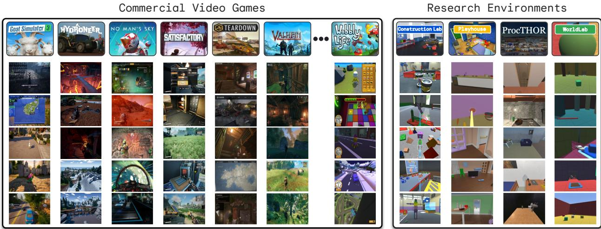  
Figure 2 | Environments. We use over ten 3D environments in SIMA, consisting of commercial video games and research environments. The diversity of these environments is seen in their wide range of visual observations and environmental affordances. Yet, because these are all 3D environments, basic aspects of 3D embodied interaction, such as navigation, are shared. Commercial video games offer a higher degree of rich interactions and visual fidelity, while research environments serve as a useful testbed for probing agent capabilities.

# 3.1.2. 研究环境

与商业视频游戏相比，人工智能研究环境通常更具可控性，能够灌输和仔细评估特定技能，并对任务完成情况进行更快速可靠的评估。与我们产品组合中的许多游戏不同，这些研究环境还往往具有更真实的类似现实世界的——虽然依然简化的——物理交互。我们借鉴了多个先前的研究环境，并开发了一个新的环境——构造实验室——该环境包含了我们其他环境未能充分捕捉的重要挑战。构造实验室：一个新的研究环境，智能体需要从互联的建筑块中构建新颖的物品和雕塑，包括攀登的坡道、跨越的桥梁和动态装置。构造实验室侧重于认知能力，如物体操控和对物理世界的直观理解。游乐场：一个在多个先前工作中使用的环境（Abramson 等，2020；DeepMind 互动智能体团队等，2021；Abramson 等，2022a），由程序生成的房屋环境及各种物体组成。我们通过改善图形效果和丰富交互，增强了该环境，包括烹饪或绘画等技能。ProcTHOR：一个由程序生成的房间环境，包含现实内容，如办公室和图书馆，由 Deitke 等（2022）介绍。尽管这个环境中存在基准任务集，之前的工作并未使用键盘和鼠标动作，因此我们主要将该环境用于数据收集而非评估。WorldLab：一个在前期工作中使用的环境（如 Gulcehre 等，2019），进一步专门化以测试具身智能体，使用有限的直观机械原理，如传感器和门，并主要依赖于对多种物体的模拟物理。

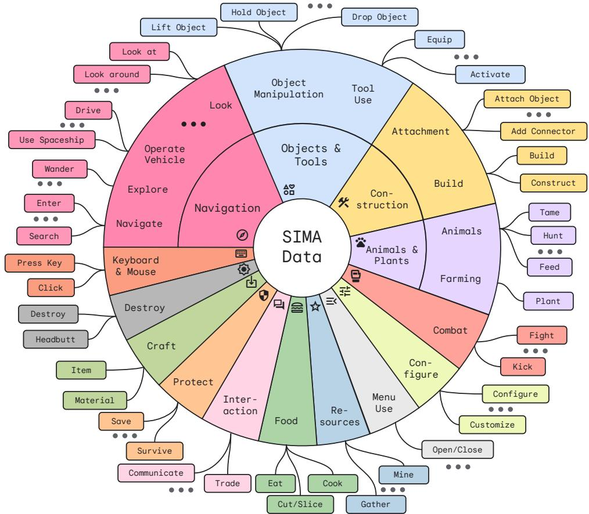  
Figure 3 | Instructions Across SIMA Data. The SIMA dataset includes a broad range of text instructions that can be roughly clustered into a hierarchy. Due to the common 3D embodied nature of the environments that we consider, many generic tasks, such as navigation and object manipulation, are present in multiple environments. Categories were derived from a data-driven hierarchical clustering analysis of the human-generated text instructions within a fixed, pretrained word embedding space. Note that the area of each cluster in the wheel in Figure 3 does not correspond to the exact number of instructions from that cluster in the dataset.

# 3.2. 数据

我们的方法依赖于通过行为克隆在大规模上训练智能体，即在由人类生成的数据上进行观察到动作的监督学习。因此，我们的主要工作重点致力于收集并整合人类专家的游戏数据。这包括视频、语言指令和对话、记录的动作以及各种注释，例如成功或失败的描述或标记。这些数据构成了一个丰富的多模态数据集，涵盖了超过10个仿真环境中的具身交互，未来还会有更多。我们的数据可以用于增强和利用现有的训练数据（如 Abramson 等，2020），或对预训练模型进行微调，以赋予其更丰富的情境理解。该数据集涵盖了广泛的指令任务：图3展示了通过对数据中存在的文本指令进行分层聚类而得到的指令聚集，聚类是在固定的、预训练的词嵌入空间中进行的。然而，仅仅大规模收集数据并不足以训练成功的智能体。数据质量过程对于确保语言与行为之间准确且无混淆的映射至关重要，这带来了各种技术挑战。我们认真设计数据收集过程，包括对原始数据进行预处理和过滤，以突出重要技能并有效地训练我们的智能体。

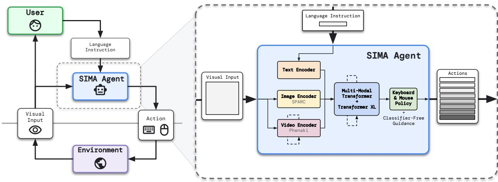  
Figure 4 | Setup & SIMA Agent Architecture. The SIMA agent receives language instructions from a user and image observations from the environment, and maps them to keyboard-and-mouse actions.

数据收集 我们使用多种方法收集数据，包括让单个玩家自由发挥，并在事后对这些轨迹进行标注。我们还进行双人设置-解题者收集（Abramson等，2020；DeepMind互动智能体团队等，2021），其中一位玩家在选定场景中指示另一位玩家应做什么，同时共享单人视角，以匹配单人收集的数据。我们所有的数据收集均由与谷歌签约的参与者进行。我们的数据收集协议的所有细节，包括补偿标准，均经过独立人类行为研究委员会的伦理和隐私审查和批准。所有参与者在完成任务之前均提供了知情同意，并获得了时间的报酬。预处理、过滤和加权 在训练之前，我们执行多种离线预处理步骤，包括调整数据以适应智能体输入，使用各种启发式方法过滤掉低质量数据，以及在不同环境和收集之间重新组合和加权数据，以优先考虑最有效的学习体验。

# 3.3. 智能体

SIMA 智能体将视觉观察和语言指令映射为键盘和鼠标操作（图 4）。考虑到这一任务的复杂性——例如输入和输出空间的高维性，以及在长时间尺度上可能的指令范围——我们主要集中训练智能体执行那些可以在大约 10 秒内完成的指令。将任务分解为更简单的子任务使其能够在不同环境和设置中复用，只要用户提供适当的指令序列。我们的智能体架构基于之前的相关工作（Abramson 等人，2020, 2022a），但对我们的更一般目标进行了多种改动和调整。首先，我们的智能体不仅包含从头训练的组件，还包括几个预训练模型——如在细粒度图像-文本对齐上训练的模型 SPARC（Bica 等人，2024）和视频预测模型 Phenaki（Villegas 等人，2022）——我们分别通过行为克隆和视频预测对其进行进一步微调。在初步实验中，我们发现这些模型提供了互补的益处。将这些预训练模型与微调和从头训练相结合，使智能体能够利用互联网级别的预训练，同时专注于它所遇到的环境和控制任务的特定方面。更具体地说，我们的智能体（图 4）利用从头训练的变换器，它与不同的预训练视觉组件、编码的语言指令以及一个关注过去记忆状态的 Transformer-XL（Dai 等人，2019）交叉注意，以构建状态表示。生成的状态表示作为输入提供给策略网络，生成 8 个动作序列的键盘和鼠标操作。我们使用行为克隆训练该智能体，同时设定一个辅助目标来预测目标完成情况。我们使用无分类器引导（CFG; Ho 和 Salimans, 2022; Lifshitz 等人，2023）来改善训练智能体在环境中运行时的语言条件能力。CFG 最初是为增强扩散模型中的文本条件而提出的（Ho 和 Salimans，2022），但在语言模型（Sanchez 等人，2023）和语言条件智能体（Lifshitz 等人，2023）中也证明了其效用。也就是说，我们计算策略 $\pi$ ，分别在有无语言条件下，并将策略 logits 向两者之间差异的方向移动。

$$
\pi _ { C F G } = \pi \left( \mathrm { i m a g e } , \mathrm { l a n g u a g e } \right) + \lambda \left( \pi \left( \mathrm { i m a g e } , \mathrm { l a n g u a g e } \right) - \pi \left( \mathrm { i m a g e } , \cdot \right) \right) .
$$

# 3.4. 评估方法

我们在SIMA中对通用性的关注带来了评估方面的挑战。虽然研究环境可能提供自动化的方法来评估语言指令任务是否成功完成，但这种成功标准可能并不通用。也就是说，语言指令可能与环境记录的目标状态不对应（例如，用户可能指示“堆一堆石头以标记这个地方”或“看看能否跳过这个峡谷”）。在商业视频游戏中评估智能体面临重大的额外挑战。视频游戏评估无法依赖于对环境状态的特权信息的访问。此外，在未设计为可重复基准的环境中，难以将智能体恢复到完全相同的状态，并且在商业视频游戏中加载每个任务的速度和成本远比在研究环境中慢得多。因此，实现跨环境的快速、稳定和可靠的可比评估是具有挑战性的。因此，我们使用一系列不同类型的评估，这些评估在效率、成本、准确性和覆盖面上提供不同的权衡。此外，确保我们的评估真正评估语言条件性，而不是环境可供性，需要谨慎。例如，如果一个任务包含一把刀、一块砧板和一个胡萝卜，智能体可能在不依赖语言指令的情况下确认目标（“在砧板上切胡萝卜”）。因此，任务设置需要提供多样化的行动，理想情况下测试从一个初始状态出发的多个指令，以适当地评估智能体的行动是否受到语言驱动。 行动日志概率 一种简单的方法是根据智能体在保留评估数据上的行动预测来评估智能体。然而，符合之前的发现（Abramson et al., 2022b；Baker et al., 2022），我们观察到智能体在评估数据上的行动日志概率与智能体在最基本技能之外的表现最多呈现微弱相关。因此，需要在线评估，让智能体与环境进行交互，以详细了解智能体的表现。 静态视觉输入 类似于在保留数据上预测行动，我们可以提供静态视觉输入和语言指令，以执行特定的有效行动（例如，“跳”），以直接评估简单反应与特定键盘和/或鼠标动作的对应关系。我们在商业视频游戏环境中使用了这种形式的评估，因为它们的优点是不需要实际加载游戏。尽管这些评估可以为早期信号提供有用的指示，但它们并不能可靠地预测在长时间任务上的成功。

真实标注数据 我们内部开发的研究环境（建设实验室、游乐场和世界实验室）能够提供关于语言跟随任务是否成功完成的真实标注评估。这些任务可以依赖于智能体的状态（“向前移动”）和周围环境（“抬起绿色立方体”），以及更复杂的互动（“将连接点附加到大块的顶部”或“用刀切胡萝卜”）。这些任务能够有效地测试一系列特定技能，并提供任务成功的高度可靠信号。此外，我们设计任务设置和评估时，要成为精确性强有力的测试；例如，许多任务包括干扰对象，如果智能体与干扰对象互动而不是指令目标，则该回合被标记为立即失败——即使智能体可能在之后完成实际任务。我们还包括其他类型的评估，例如指示智能体完成一个目标，然后用另一个目标进行干扰，以评估其是否能适当地切换——这确保了智能体对命令的变化有足够的响应性。我们研究环境任务的一个子集用于在训练期间提供智能体进展的快速评估信号。

光学字符识别（OCR） 我们的一些商业视频游戏环境提供屏幕文本，指示任务或任务的完成，甚至是收集资源或进入游戏特定区域等低层次动作的结果。通过在预定义的评估场景中使用OCR检测屏幕文本，有时结合检测特定的键盘和鼠标动作，我们可以廉价评估智能体是否成功执行特定任务。这种自动评估形式也避免了人类评估的主观性。我们特别在两个游戏中使用OCR评估，分别是《无人深空》和《维尔海姆》，这两个游戏都有大量的屏幕文本。例如，在《无人深空》中，我们开发了“开采碳/盐/铁”等评估任务，或“使用分析视镜”，或“打开外骨骼菜单”。类似地，在《维尔海姆》中，我们有“收集木材/石头/树莓”、“使用工作台”或“烹饪食物”等任务。然而，通常情况下，OCR评估仅限于以游戏特定文本提示完成的任务，而不是可以用语言指令指定的任意任务，我们期望通用智能体能够解决这些任务。其他视频游戏也显著较少屏幕文本，这使得可以用OCR评估这些游戏的行为范围非常窄。 人类评估 在许多情况下，我们无法自动推导出任务成功的信号时，我们便转向人类进行评估。虽然这是我们最通用的评估方法，但也是最慢且最昂贵的。我们使用游戏专家作为人类评审，即他们在这些特定游戏上至少玩了16小时，通常会持续几周的时间。我们要求他们审查记录的智能体视频，从不同的评审（通常为5位）那里收集同一视频的多个评分，以确保评估的可靠性。我们还鼓励严格的评估：我们指示评审在智能体首先执行无关动作的情况下将一个回合标记为失败，即使智能体最终成功完成了指示的任务。

我们通过识别英语中常见动词的列表来策划人类评估任务，并将其与在我们的智能体游戏和交互测试中自然产生的动词列表相结合。我们将此动词列表作为在所有视频游戏环境中进行评估的基础。我们将每个任务（保存状态和指令对）分配给一个最具代表性的技能类别（例如，“制作物品”），尽管大多数任务需要广泛的隐性技能才能成功（例如，制作通常需要使用菜单）。最终的评估集提供了一个长期挑战，涵盖从简单的与游戏无关的任务（如“向左转”）到测试专门游戏知识的任务（如“比较反物质和反物质住房的制作成本”），再到利用更广泛语义知识的任务（例如“从正在铲草的人员那里取走叉子”）。将我们的评估框架建立在自然语言的分布上，使我们能够在常见和对抗场景中测试我们的智能体，从而衡量我们朝着长远目标的进展，即开发可以在任何模拟3D环境中完成任何人类能够做到的事情的可指导智能体。

在下面的结果中（第4节），我们主要报告基于真实标注数据的研究环境评估分数以及基于OCR与人工评估结合的商业视频游戏环境评估分数。在我们拥有评估的7个环境中，我们共有1,485个独特任务，涵盖9个技能类别，从运动（“向前走”、“抬头看”、“跳跃”）到导航（“前往HUB终端”、“去你的飞船”），资源收集（“收集碳”、“采摘覆盆子”），物体管理（“使用分析瞄准器”、“切土豆”）等更多领域。（作为参考，MineDojo（Fan等，2022），一项研究MineCraft中语言条件智能体的相关工作，使用了1,581个独特任务，涵盖4个技能类别：生存、收获、无需技术和战斗）。鉴于我们当前评估的多样性和覆盖范围，它们提供了对我们期望的智能体基础语言条件技能的合理评估。然而，仍然需要进一步开发更具可扩展性、普遍性和可靠性的评估，特别是当我们朝着更复杂和开放式任务迈进时。

# 3.4.1. 延迟缓解措施

我们的智能体在多个实时运行的环境中进行评估，这些环境与智能体是异步的。这可能会对智能体生成的动作的及时执行带来挑战。由于动作计算和观察与动作在网络上传输引入了延迟（Bratko et al., 1995）。我们在行为克隆过程中考虑了这种延迟，通过预测相对于智能体视觉输入时间上有偏移的动作，并在评估过程中通过适当的观察和动作缓冲来镜像这一偏移。我们还通过在TPU加速器上适当调度动作计算、在跨时间步长的设备上缓存神经网络状态，以及仔细选择批量大小和其他实现细节来最小化延迟。

# 3.5. 责任

我们遵循结构化的方法进行负责任的模型开发，以识别、衡量和管理可预见的伦理和安全挑战。这些挑战依据学术文献综述、与内部伦理团队的互动，以及开发全面的伦理评估而信息化，文档记录关键风险及其缓解策略。我们确保我们的研究项目遵循谷歌人工智能原则。SIMA经过仔细评估和审查，以确保其社会效益大于风险，并纳入适当的风险缓解措施。

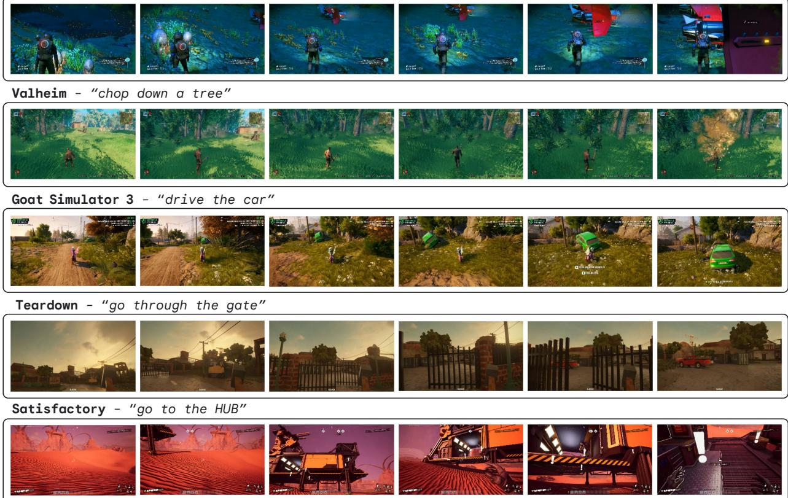  
No Man's Sky - "go to the spaceship"   
Figure 5 | Agent Trajectories. The SIMA agent is capable of performing a range of language-instructed tasks across diverse 3D virtual environments. Here, we provide several representative, visually salient examples of the agent's capabilities that demonstrate basic navigation and tool use skills.

利益 SIMA 是一个前沿研究计划，重点研究如何在模拟环境中开发可指令智能体。该研究为未来人类与人工智能的合作提供了有趣的机会；与大型语言模型不同，SIMA 能够理解自然语言指令以及动态交互的 3D 环境。这为与人工智能智能体的工作提供了新的范式，并为与人工智能的激动人心的新沉浸式 3D 体验提供了潜力。最后，模拟环境相比于其他人工智能部署为研究提供了更安全的替代方案。 风险 除了这些好处，我们还反思了与在视频游戏数据上训练相关的潜在风险。这些风险包括与在包含暴力、露骨或其他有害行为的游戏上训练智能体相关的风险。我们还考虑了代表性伤害的影响，因为智能体可能会从游戏环境中的刻板印象描绘或行为中学习。除了这些风险外，SIMA 的未来假设部署也存在下游风险，可能是由于故意恶意使用或无意的行为。 我们通过全面的方法来应对这些风险，包括：内容的谨慎策划。我们避免了许多科学有趣但暴力的环境游戏。我们还与伦理和安全团队共同制定了行为“红线”；带有违反这些红线内容的游戏不会被使用。 对 SIMA 的安全性能进行持续评估。确保 SIMA 的部署和协议透明，并且目前仍然处于受控的封闭环境中。最终，鉴于精心挑选的训练数据和受限的部署环境，我们有信心在最大化利益的同时，最小化伦理风险。

# 4. 初步结果

在本节中，我们报告了SIMA智能体的初步评估结果。在展示了SIMA智能体能力的几个定性示例之后，我们首先考虑SIMA智能体的定量表现，并按环境和技能类别分类。接着，我们将这些结果与几个基线和消融实验进行比较，从而评估智能体的泛化能力和我们设计选择的有效性。最后，我们研究了一 subset 的评估任务，以便通过额外的比较来估算人类水平的表现。定性示例 为了提供智能体整体能力的印象，图5展示了我们商业视频游戏环境中智能体的一些代表性示例。尽管环境在视觉上各不相同，智能体仍能够执行这些任务，展示基本的导航和工具使用技能。即使在指示目标不在视野中时（如“前往太空船”和“前往HUB”），智能体仍能找到目标。有关进一步的定性示例，请参阅附带的网站。

# 4.1. 在不同环境和技能下的表现

在图6中，我们报告了SIMA智能体在七个具有定量评估的环境中的平均表现。平均值是通过每个任务多个回合（在研究环境中，每个任务一个回合，视频游戏中）的表现、每个环境多个任务的表现以及三次使用不同随机种子的训练结果计算得出的。误差条表示该环境内各任务和三次不同随机种子的训练运行的$9 5 \%$置信区间（CIs）。我们注意到，开发有意义的评估任务本身就是一个持续努力的过程，本研究中的定量结果仅反映目前评估的特定行为范围。总体而言，结果表明SIMA智能体能够在多个环境中完成一系列任务，但仍然有很大的改进空间。Playhouse和WorldLab的表现较好，因为它们相对简单的研究环境。对于更复杂的商业视频游戏环境，成绩显然有所降低。值得注意的是，Construction Lab的表现也较差，突显了该研究环境及其评估任务的相对困难。这使得SIMA平台能够作为一个有用的测试平台，以便进一步开发能够将语言与感知和行动相连接的智能体。

为了更好地理解SIMA智能体在越来越多样化的模拟环境中的表现，我们开发了一个基于自然语言的评估框架，用于添加和聚类评估任务，具体细节见我们的评估方法。由于这些技能聚类源自我们的评估任务而不是训练数据，因此它们与图3中的聚类类似但有所不同。如图7所示，不同技能类别的表现各异，包括“移动”或“游戏进程”等技能聚类内的变化。需要注意的是，即使是看似简单的技能聚类也可能涉及非平凡的游戏互动，例如一些“观察”任务包含像操纵飞船（“观察一颗行星”）或根据周围地形进行定位（“向下看”）的技能。虽然根据这些额外的互动和所用技能的环境机制会有许多细微差别，但通常来说，需要更精确的动作或空间理解的技能（如“战斗”、“使用工具”、“建筑”）往往更具挑战性。

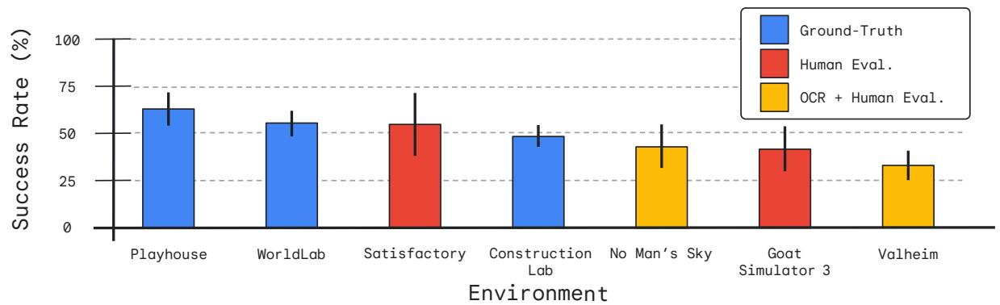  
Figure 6 | Average Success Rate of the SIMA Agent by Environment. Agents achieve notable success, but are far from perfect; their success rates vary by environment. Colors indicate the evaluation method(s) used to assess performance for that environment. (Note that humans would also find some of these tasks challenging, and thus human-level performance would not be $1 0 0 \%$ , see Section 4.3.)

# 4.2. 评估环境泛化与消融实验

我们将主要的 SIMA 智能体与各种基线和消融实验进行比较，既包括整体（图 8），也按环境细分（图 9）。我们报告的所有环境中的智能体包括： - SIMA：我们的主要 SIMA 智能体，训练于除 Hydroneer 和 Wobbly Life 外的所有环境，这两个环境用于定性零-shot 评估。 - Zero-shot：与主要智能体训练方式相似的独立 SIMA 智能体，但仅在 $N - 1$ 个环境上进行训练，并在保留的环境上进行零-shot 评估——即，在该环境上没有进行任何 BC 训练。这些智能体在受控环境中评估我们智能体的迁移能力。（注意这些智能体使用与主要 SIMA 智能体相同的预训练编码器，这些编码器是在我们部分环境的数据上进行微调的；因此，在某些情况下，预训练编码器可能已经使用了来自保留环境的视觉输入进行调整，尽管智能体没有在该环境中训练。然而，编码器没有在 Goat Simulator 3 的数据上微调，因此该情况下的迁移结果未受混淆。） - 无预训练消融：一个移除了 SIMA 智能体中的预训练编码器的智能体。我们用从头开始训练的 ResNet 视觉模型替代这些模型（如 Abramson 等人，2022a），因为在初步实验中我们发现通过智能体训练训练 SPARC/Phenaki 编码器导致性能较差。与该智能体进行比较可以测试预训练模型对智能体性能的益处。 - 无语言消融：一个在训练和评估过程中缺乏语言输入的智能体。与该智能体进行比较显示我们的智能体性能在多大程度上可以通过简单的与语言无关的行为先验来解释。 - 环境专业化：我们还针对每个环境训练一个专家智能体，仅使用对应于该环境的数据进行训练，但仍然包含更广泛的预训练编码器。我们通过在每个环境上对专家智能体的性能进行规范化，以衡量使用我们的方法和我们在该环境中具有的数据可以实现的性能。

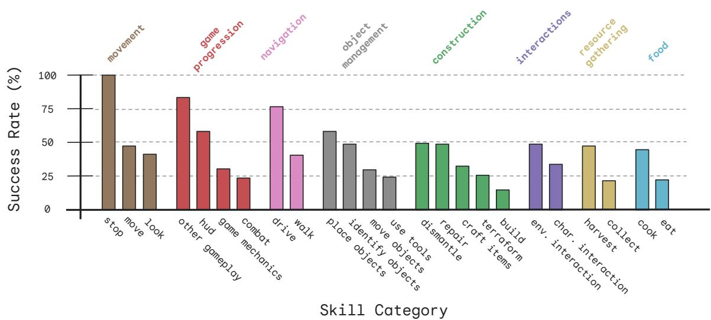  
Figure 7 | Average Success Rate of the SIMA Agent by Skill Category. Agents exhibit varying degrees of performance across the diverse skills that we evaluate, performing some skills reliably and others with more limited success. Skill categories are grouped into clusters (color), which are derived from our evaluation tasks.

请注意，由于比较智能体的数量，我们仅为每个智能体运行了一个种子，而不是主SIMA智能体使用的三个种子。每个智能体在经过120万步训练后进行评估。图8和图9中的柱状图表示平均性能（相对于环境专用智能体进行了归一化）；误差条为任务和种子（在多个种子可用的情况下）的参数化 $95\%$ 置信区间。

图8展示了我们的结果摘要，而图9显示了环境下的结果。SIMA总体上优于环境专门化智能体，平均提升$6 7 \%$（针对环境专门化智能体性能），从而证明了环境之间的积极迁移。我们通过对SIMA智能体和环境专门化智能体在每个领域内的每任务性能之间的均值差异进行置换检验来统计量化这个好处；在每种情况下，SIMA显著优于环境专门化智能体（各环境的$p$值分别为：0.001, 0.002, 0.036, 0.0002, 0.008, 0.004, 和0.0002）。此外，SIMA的表现远超基线。SIMA整体上显著优于无预训练的基线（置换检验$p < 0 . 0 0 1$），从而显示互联网规模的知识支持有根学习——尽管这种好处的大小和显著性在不同环境中有所不同（置换检验$p$值分别为0.0002, 0.14, 0.041, 0.0002, 0.244, 0.052, 0.032）。最后，没有语言的消融实验表现非常差（所有置换检验$p < 0 . 0 0 1$）。重要的是，这不仅表明我们的智能体确实在使用语言，而且我们的评估任务有效地设计用来测试这一能力，而不是通过简单执行合理行为来解决。

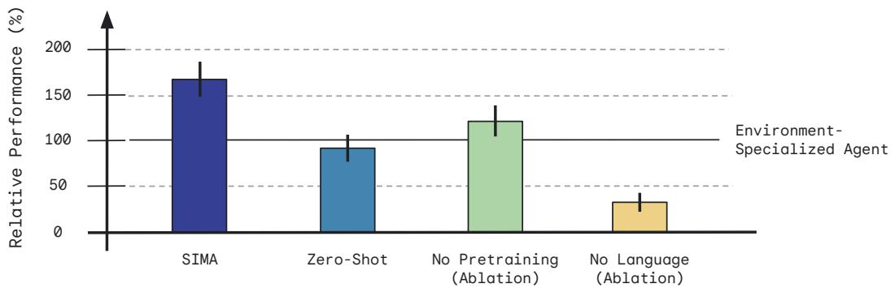  
Figure 8 | Aggregate Relative Performance. Bars indicate the performance of the SIMA agent as well as the baselines and ablations relative to the performance of the environment-specialized agents, aggregated equally across environments. The SIMA agent outperforms ablations that do not incorporate internet pretraining and substantially outperforms an ablation without language. The solid line shows environment-specialized relative performance, which by normalization is $1 0 0 \%$ .

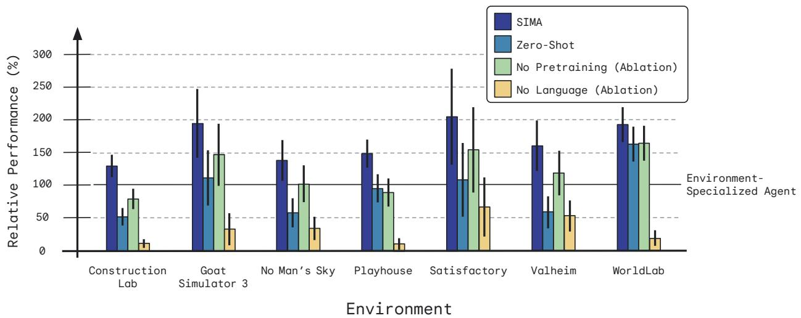  
Figure 9 | Per-Environment Relative Performance. Bars indicate the performance of the SIMA agent as well as the baselines and ablations relative to the performance of the environment-specialized agents. While performance varies across the environments, the general pattern of results is largely preserved. Even when trained while holding out an environment and evaluated zero-shot on the unseen environment, our agent can achieve non-trivial performance—almost always outperforming the no-language ablation, and in some cases even matching or exceeding environment-specialized agent performance. The solid line shows the relative performance of an environment-specialized agent, which by normalization is $1 0 0 \%$ .

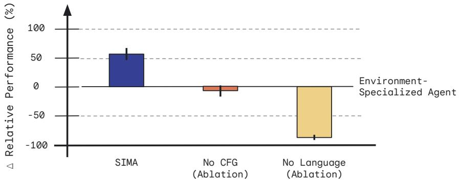  
Figure 10 | Evaluating the Benefit of Classifier-Free Guidance. Comparing the SIMA agent to an ablation without classifier-free guidance (CFG), CFG substantially improves language conditionality. However, even without CFG, the agent still exhibits language-conditional behavior, outperforming the No Language ablation. Note that this evaluation was performed only on a subset of our research environments: Construction Lab, Playhouse, and WorldLab.

零-shot 评估结果也令人鼓舞。即使在未经过训练就需执行的环境中，智能体在一般任务上表现出强劲的性能，尽管当然在特定环境技能的实现上有所欠缺。零-shot 智能体能够执行许多游戏中普遍存在的通用导航技能（例如“下山”），并展现出一些更复杂的能力，如通过颜色抓取物体，因为颜色在各个游戏中是一致的，并且大多数游戏都使用左键鼠标来抓取或与物体交互，这一规律也是一致的。重要的是，即使在 Goat Simulator 3 环境中，即便智能体没有接受视觉微调，零-shot 智能体的表现仍与环境专用智能体相当——这表明迁移不仅仅是由视觉组件驱动的。需要注意的是，即使零-shot 智能体与环境专用智能体的数值表现相似，它们通常在不同的技能上表现良好——环境专用智能体在游戏特定交互中表现良好，但在零-shot 智能体能够执行的许多游戏中所支持的通用技能上表现较弱。需要指出的是，在 WorldLab 环境中，零-shot 性能尤其强劲，原因有三。首先，该环境的评估任务包含相对较大比例的领域通用技能，例如通过颜色识别物体，因为我们将其用作快速测试智能体能力的手段。其次，该环境使用相同的基础引擎，并与其他内部研究环境共享一些实现细节，这可能支持行为的迁移，尽管它们的视觉风格、资产库、物理机制和环境特性各不相同。此外，环境专用智能体的性能在此环境中可能稍弱，因为其训练与测试之间存在非平凡的分布变化。这是因为我们的一些数据来自前期版本的环境，而这些版本在动态和任务分布上存在差异。跨多个环境训练的智能体可能对这种分布变化更具鲁棒性。 无分类器引导 最后，图 10 比较了具有与不具有无分类器引导（CFG; Lifshitz 等，2023）的智能体在我们的研究环境子集（Construction Lab、Playhouse 和 WorldLab）上的表现。没有 CFG（$\lambda = 0$）的情况下，SIMA 智能体的表现显著较差。然而，无 CFG 智能体仍表现出高程度的语言条件性，显著优于无语言基线。这些结果展示了 CFG 的好处，突显出推理时间干预对智能体可控性的影响。

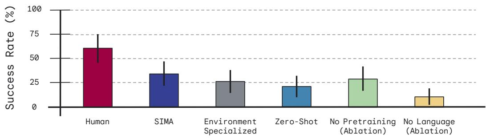  
Figure 11 | Comparison with Human Performance on No Man's Sky. Evaluating on a subset of tasks from No Man's Sky, human game experts outperform all agents. Yet, humans only achieve $6 0 \%$ success on this evaluation. This highlights the difficulty of the tasks considered in this project.

# 4.3. 人类比较

为了提供额外的基线比较，我们评估了我们的智能体在《无人深空》中的一组额外任务上的表现，这些任务旨在测试一系列特定技能在多样化环境中的应用。这些任务的难度各异，从简单的指令（“向前走”）到更复杂的指令（“使用分析仪识别新动物”）。执行这些任务的玩家是参与我们数据收集并对游戏有经验的玩家。我们使用与评估智能体相同的评审和评估设置来评估人类表现；评审并不知道他们是在评估人类表现而不是智能体。

结果总结如图11所示，误差条表示参数的95%置信区间。人类玩家在这些任务上的成功率仅为60%，这表明我们在本项目中考虑的任务具有一定的难度，以及我们的评估标准相当严格。例如，一些人类的失败似乎是由于在完成任务之前参与了不必要的行为，比如在被指示“充电采矿光束”时，最初打开并与星际飞船菜单互动，或在被告知“开采氧气”后进入分析模式。尽管这些评估相当具有挑战性，SIMA智能体的表现仍达到34%的成功率，远远超过无语言基线的11%成功率。我们指出，由于在人类评审对更模糊的任务上存在分歧，100%的成功率可能并不一定可实现。尽管如此，仍需做出相当大的进展以匹配人类表现。这突显了整个SIMA设置在评估具身智能体中的基础语言交互时提供了一个挑战性而又信息丰富的指标的实用性。

# 5. 展望未来

SIMA仍在持续进展中。在本技术报告中，我们描述了我们的目标和理念，并展示了一些初步结果，显示我们的智能体能够在各种丰富的3D环境中，将语言指令转化为行为。我们观察到在不同环境中表现出显著的性能和早期的迁移迹象，以及基础技能在未见环境中的零样本迁移。然而，许多技能和任务仍然难以实现。在未来的工作中，我们的目标是：a) 通过持续扩展我们的游戏、环境和数据集组合，扩大到更多环境和数据集；b) 提高智能体的鲁棒性和可控性；c) 利用越来越高质量的预训练模型（Gemini Team等，2023）；以及d) 开展更全面和严格控制的评估。我们相信，通过这样做，我们将使SIMA成为一个理想的平台，以在复杂环境中安全地进行语言和预训练模型的前沿研究，从而帮助解决AGI的一个基本挑战。我们的研究还有潜力丰富未来基础模型的学习体验和部署环境；我们的一项目标是将大型语言模型的抽象能力与具身环境相结合。我们希望SIMA能帮助我们学习如何在大规模上克服将语言与感知和行动联系起来的基本挑战，并期待在未来分享我们研究的更多细节。

# 致谢

我们感谢以下游戏开发者与我们在该项目中的合作：Coffee Stain、Foulball Hangover、Hello Games、Keen Software House、Rubberband Games、Saber Interactive / Tuxedo Labs 以及 Strange Loop Games。我们还感谢 Bica 等人（2024）在将 SPARC 集成到 SIMA 智能体中的帮助，以及 Zolna 等人（2024）和 Scott Reed 在将 Phenaki 集成到 SIMA 智能体中的帮助。感谢 Matthew McGil、Nicholas Roy、Avraham Ruderman、Daniel Tanis 和 Frank Perbet 在研究环境任务开发方面的支持。我们感谢 Alistair Muldal 在之前工作中提供的数据和基础设施方面的帮助。我们还感谢 Timothy Lillicrap 对 SIMA 概念的早期输入以及来自之前工作的见解。感谢 Tom Ward、Joe Stanton、David Barker 和 George Thomas 在 Google Cloud 基础设施中运行游戏二进制文件的基础设施和支持。最后，感谢我们的参与团队，他们生成了游戏玩法和语言标注数据，并对我们的智能体进行了人工评估，没有他们，这项工作将不可能完成。

# References

Josh Abramson, Arun Ahuja, Iain Barr Arthur Brussee, Federico Carnevale, Mary Cassin, Rachita Chhaparia, Stephen Clark, Bogdan Damoc, Andrew Dudzik, et al. Imitating Interactive Intelligence. arXiv preprint arXiv:2012.05672, 2020.

Josh Abramson, Arun Ahuja, Federico Carnevale, Petko Georgiev, Alex Goldin, Alden Hung, Jessica Landon, Jirka Lhotka, Timothy Lillicrap, Alistair Muldal, et al. Improving Multimodal Interactive Agents with Reinforcement Learning from Human Feedback. arXiv preprint arXiv:2211.11602, 2022a.

Josh Abramson, Arun Ahuja, Federico Carnevale, Petko Georgiev, Alex Goldin, Alden Hung, Jessica Landon, Timothy Lillicrap, Alistair Muldal, Blake Richards, et al. Evaluating Multimodal Interactive Agents. arXiv preprint arXiv:2205.13274, 2022b.

Adaptive Agent Team, Jakob Bauer, Kate Baumli, Satinder Baveja, Feryal Behbahani, Avishkar Bhoopchand, Nathalie Bradley-Schmieg, Michael Chang, Natalie Clay, Adrian Collister, et al. HumanTimescale Adaptation in an Open-Ended Task Space. In International Conference on Machine Learning, 2023.

Anurag Ajay, Seungwook Han, Yilun Du, Shuang Li, Abhi Gupta, Tommi Jaakkola, Josh Tenenbaum, Leslie Kaelbling, Akash Srivastava, and Pulkit Agrawal. Compositional Foundation Models for Hierarchical Planning. In Advances in Neural Information Processing Systems, 2023.

Joshua Albrecht, Abraham Fetterman, Bryden Fogelman, Ellie Kitanidis, Bartosz Wróblewski, Nicole Seo, Michael Rosenthal, Maksis Knutins, Zack Polizzi, James Simon, et al. Avalon: A Benchmark for RL Generalization Using Procedurally Generated Worlds. In Advances in Neural Information Processing Systems, 2022.

Rohan Anil, Andrew M Dai, Orhan Firat, Melvin Johnson, Dmitry Lepikhin, Alexandre Passos, Siamak Shakeri, Emanuel Taropa, Paige Bailey, Zhifeng Chen, et al. PaLM 2 Technical Report. arXiv preprint arXiv:2305.10403, 2023.

Bowen Baker, Ilge Akkaya, Peter Zhokov, Joost Huizinga, Jie Tang, Adrien Ecoffet, Brandon Houghton, Raul Sampedro, and Jeff Clune. Video PreTraining (VPT): Learning to Act by Watching Unlabeled Online Videos. In Advances in Neural Information Processing Systems, 2022.

Marc G Bellemare, Yavar Naddaf, Joel Veness, and Michael Bowling. The Arcade Learning Environment: An Evaluation Platform for General Agents. Journal of Artificial Intelligence Research, 47:253279, 2013.

Christopher Berner, Greg Brockman, Brooke Chan, Vicki Cheung, Przemyslaw Debiak, Christy Dennison, David Farhi, Quirin Fischer, Shariq Hashme, Chris Hesse, et al. Dota 2 with Large Scale Deep Reinforcement Learning. arXiv preprint arXiv:1912.06680, 2019.

Ioana Bica, Anastasija Ili, Matthias Bauer, Goker Erdogan, Matko Bonjak, Christos Kaplanis, Alexey A. Gritsenko, Matthias Minderer, Charles Blundell, Razvan Pascanu, and Jovana Mitrovi. Improving fine-grained understanding in image-text pre-training. arXiv preprint arXiv:2401.09865, 2024.

Ivan Bratko, Tanja Urbani, and Claude Sammut. Behavioural Cloning: Phenomena, Results and Problems. IFAC Proceedings Volumes, 28(21):143149, 1995.

Anthony Brohan, Noah Brown, Justice Carbajal, Yevgen Chebotar, Joseph Dabis, Chelsea Finn, Keerthana Gopalakrishnan, Karol Hausman, Alex Herzog, Jasmine Hsu, et al. RT-1: Robotics Transformer for Real-World Control at Scale. arXiv preprint arXiv:2212.06817, 2022.

Anthony Brohan, Noah Brown, Justice Carbajal, Yevgen Chebotar, Xi Chen, Krzysztof Choromanski, Tianli Ding, Danny Driess, Avinava Dubey, Chelsea Finn, et al. RT-2: Vision-Language-Action Models Transfer Web Knowledge to Robotic Control. arXiv preprint arXiv:2307.15818, 2023a.

Anthony Brohan, Yevgen Chebotar, Chelsea Finn, Karol Hausman, Alexander Herzog, Daniel Ho, Julian Ibarz, Alex Irpan, Eric Jang, Ryan Julian, et al. Do As I Can, Not As I Say: Grounding Language in Robotic Affordances. In Conference on Robot Learning, 2023b.

Tom Brown, Benjamin Mann, Nick Ryder, Melanie Subbiah, Jared D Kaplan, Prafulla Dhariwal, Arvind Neelakantan, Pranav Shyam, Girish Sastry, Amanda Askell, et al. Language Models are Few-Shot Learners. In Advances in Neural Information Processing Systems, 2020.

CéiColas, Tristan Karch, Nicolas Lair, Jean-Miche Dussoux, Cément Moulin-Frier, Peter Dominey, and Pierre-Yves Oudeyer. Language as a Cognitive Tool to Imagine Goals in Curiosity-Driven Exploration. In Advances in Neural Information Processing Systems, 2020.

Cédric Colas, Tristan Karch, Clément Moulin-Frier, and Pierre-Yves Oudeyer. Language and culture internalization for human-like autotelic AI. Nature Machine Intelligence, 4(12):10681076, 2022.

Erwin Coumans and Yunfei Bai. PyBullet, a Python module for physics simulation for games, robotics and machine learning. http://pybullet. org, 2016.

Zihang Dai, Zhilin Yang, Yiming Yang, Jaime G Carbonell, Quoc Le, and Ruslan Salakhutdinov. Transformer-XL: Attentive Language Models beyond a Fixed-Length Context. In Association for Computational Linguistics, 2019.

DeepMind Interactive Agents Team, Josh Abramson, Arun Ahuja, Arthur Brussee, Federico Carnevale, Mary Cassin, Felix Fischer, Petko Georgiev, Alex Goldin, Mansi Gupta, et al. Creating Multimodal Interactive Agents with Imitation and Self-Supervised Learning. arXiv preprint arXiv:2112.03763, 2021.

Matt Deitke, Ei VanderBilt, Alvaro Herrasti, Luca Weihs, Kiana Ehsani, Jordi Salvador, Winson Han Eric Kolve, Aniruddha Kembhavi, and Roozbeh Mottaghi. ProcTHOR: Large-Scale Embodied AI Using Procedural Generation. In Advances in Neural Information Processing Systems, 2022.

Alexey Dosovitskiy, German Ros, Felipe Codevilla, Antonio Lopez, and Vladlen Koltun. CARLA: An Open Urban Driving Simulator. In Conference on Robot Learning, 2017.

Danny Driess, Fei Xia, Mehdi SM Sajjadi, Corey Lynch, Aakanksha Chowdhery, Brian Ichter, Ayzaan Wahid, Jonathan Tompson, Quan Vuong, Tianhe Yu, et al. PaLM-E: An Embodied Multimodal Language Model. arXiv preprint arXiv:2303.03378, 2023.

Zane Durante, Bidipta Sarkar, Ran Gong, Rohan Taori, Yusuke Noda, Paul Tang, Ehsan Adeli, Shrinidhi Kowshika Lakshmikanth, Kevin Schulman, Arnold Milstein, et al. An Interactive Agent Foundation Model. arXiv preprint arXiv:2402.05929, 2024.

Lasse Espeholt, Hubert Soyer, Remi Munos, Karen Simonyan, Vlad Mnih, Tom Ward, Yotam Doron, Vlad Firoiu, Tim Harley, Iain Dunning, et al. IMPALA: Scalable Distributed Deep-RL with Importance Weighted Actor-Learner Architectures. In International Conference on Machine Learning, 2018.

Linxi Fan, Guanzhi Wang, Yunfan Jiang, Ajay Mandlekar, Yuncong Yang, Hoyi Zhu, Andrew Tang, De-An Huang, Yuke Zhu, and Anima Anandkumar. MineDojo: Building Open-Ended Embodied Agents with Internet-Scale Knowledge. In Advances in Neural Information Processing Systems, 2022.

Gemini Team, Rohan Anil, Sebastian Borgeaud, Yonghui Wu, Jean-Baptiste Alayrac, Jiahui Yu, Radu Soricut, Johan Schalkwyk, Andrew M Dai, Anja Hauth, et al. Gemini: A Family of Highly Capable Multimodal Models. arXiv preprint arXiv:2312.11805, 2023.

Karol Gregor, Danilo Jimenez Rezende, Frederic Besse, Yan Wu, Hamza Merzic, and Aaron van den Oord. Shaping Belief States with Generative Environment Models for RL. In Advances in Neural Information Processing Systems, 2019.

Caglar Gulcehre, Tom Le Paine, Bobak Shahriari, Misha Denil, Matt Hoffman, Hubert Soyer, Richard Tanburn, Steven Kapturowski, Neil Rabinowitz, Duncan Williams, et al. Making Efficient Use of Demonstrations to Solve Hard Exploration Problems. In International Conference on Learning Representations, 2019.

William H Guss, Brandon Houghton, Nicholay Topin, Phillip Wang, Cayden Codel, Manuela Veloso, and Ruslan Salakhutdinov. MineRL: A Large-Scale Dataset of Minecraft Demonstrations. In International Joint Conference on Artificial Intelligence, 2019.

David Ha and Jürgen Schmidhuber. Recurrent World Models Facilitate Policy Evolution. In Advances in Neural Information Processing Systems, 2018.

Danijar Hafner, Timothy P Lillicrap, Mohammad Norouzi, and Jimmy Ba. Mastering Atari with Discrete World Models. In International Conference on Learning Representations, 2020.

Danijar Hafner, Jurgis Pasukonis, Jimmy Ba, and Timothy Lillicrap. Mastering Diverse Domains through World Models. arXiv preprint arXiv:2301.04104, 2023.

Stevan Harnad. The Symbol Grounding Problem. Physica D: Nonlinear Phenomena, 42(1-3):335346, 1990.

Karl Moritz Hermann, Felix Hill, Simon Green, Fumin Wang, Ryan Faulkner, Hubert Soyer, David Szepesvari, Wojciech Marian Czarnecki, Max Jaderberg, Denis Teplyashin, et al. Grounded Language Learning in a Simulated 3D World. arXiv preprint arXiv:1706.06551, 2017.

Felix Hill Andrew Lampinen, Rosalia Schneider, Stephen Clark, Matthew Botvinick, James L McClelland, and Adam Santoro. Environmental drivers of systematicity and generalization in a situated agent. In International Conference on Learning Representations, 2019.

Felix Hil, Olivier Tieleman, Tamara von Glehn, Nathaniel Wong, Hamza Merzic, and Stephen Clark. Grounded Language Learning Fast and Slow. In International Conference on Learning Representations, 2020.

Jonathan Ho and Tim Salimans. Classifier-Free Diffusion Guidance. arXiv preprint arXiv:2207.12598, 2022.

Sebastian Höfer, Kostas Bekris, Ankur Handa, Juan Camilo Gamboa, Melissa Mozifian, Florian Golemo, Chris Atkeson, Dieter Fox, Ken Goldberg, John Leonard, et al. Sim2Real in Robotics and Automation: Applications and Challenges. IEEE Transactions on Automation Science and Engineering, 18(2): 398400, 2021.

Jordan Hoffmann, Sebastian Borgeaud, Arthur Mensch, Elena Buchatskaya, Trevor Cai, Eliza Rutherford, Diego de Las Casas, Lisa Anne Hendricks, Johannes Welbl, Aidan Clark, et al.Training Compute-Optimal Large Language Models. arXiv preprint arXiv:2203.15556, 2022.

Shengran Hu and Jeff Clune. Thought Cloning: Learning to Think while Acting by Imitating Human Thinking. arXiv preprint arXiv:2306.00323, 2023.

Yingdong Hu, Fanqi Lin, Tong Zhang, Li Yi, and Yang Gao. Look Before You Leap: Unveiling the Power of GPT-4V in Robotic Vision-Language Planning. arXiv preprint arXiv:2311.17842, 2023.

Jiangyong Huang, Silong Yong, Xiaojian Ma, Xiongkun Linghu, Puhao Li, Yan Wang, Qing Li, SongChun Zhu, Baoxiong Jia, and Siyuan Huang. An Embodied Generalist Agent in 3D World. arXiv preprint arXiv:2311.12871, 2023.

Wenlong Huang, Pieter Abbeel, Deepak Pathak, and Igor Mordatch. Language Models as Zero-Shot Planners: Extracting Actionable Knowledge for Embodied Agents. In International Conference on Machine Learning, 2022.

Peter C Humphreys, David Raposo, Tobias Pohlen, Gregory Thornton, Rachita Chhaparia, Alistair Muldal, Josh Abramson, Petko Georgiev, Adam Santoro, and Timothy Lillicrap. A data-driven approach for learning to control computers. In International Conference on Machine Learning, 2022.

Yiding Jiang, Shixiang Shane Gu, Kevin P Murphy, and Chelsea Finn. Language as an Abstraction for Hierarchical Deep Reinforcement Learning. In Advances in Neural Information Processing Systems, 2019.

Matthew Johnson, Katja Hofmann, Tim Hutton, and David Bignell. The Malmo Platform for Artificial Intelligence Experimentation. In International Joint Conference on Artificial Intelligence, 2016.

Geunwoo Kim, Pierre Baldi, and Stephen McAleer. Language Models can Solve Computer Tasks. In Advances in Neural Information Processing Systems, 2023.

Jing Yu Koh, Robert Lo, Lawrence Jang, Vikram Duvvur, Ming Chong Lim, Po-Yu Huang, Graham Neubig, Shuyan Zhou, Ruslan Salakhutdinov, and Daniel Fried. VisualWebArena: Evaluating Multimodal Agents on Realistic Visual Web Tasks. arXiv preprint arXiv:2401.13649, 2024.

Eric Kolve, Roozbeh Mottaghi, Winson Han, Eli VanderBilt, Luca Weihs, Alvaro Herrasti, Matt Deitke, Kiana Ehsani, Daniel Gordon, Yuke Zhu, et al. AI2-THOR: An Interactive 3D Environment for Visual AI. arXiv preprint arXiv:1712.05474, 2017.

Sreejan Kumar, Carlos G Correa, Ishita Dasgupta, Raja Marjieh, Michael Y Hu, Robert Hawkins, Jonathan D Cohen, Karthik Narasimhan, Tom Griffths, et al. Using Natural Language and Program Abstractions to Instill Human Inductive Biases in Machines. In Advances in Neural Information Processing Systems, 2022.

Andrew K Lampinen, Nicholas Roy, Ishita Dasgupta, Stephanie CY Chan, Allison Tam, James Mcclelland, Chen Yan, Adam Santoro, Neil C Rabinowitz, Jane Wang, et al. Tell me why! Explanations support learning relational and causal structure. In International Conference on Machine Learning, 2022.

Yujia Li, David Choi, Junyoung Chung, Nate Kushman, Julian Schrittwieser, Rémi Leblond, Tom Eccles, James Keeling, Felix Gimeno, Agustin Dal Lago, et al. Competition-Level Code Generation with AlphaCode. Science, 378(6624):10921097, 2022.

Shalev Lifshitz, Keiran Paster, Harris Chan, Jimmy Ba, and Sheila McIlraith. STEVE-1: A Generative Model for Text-to-Behavior in Minecraft. arXiv preprint arXiv:2306.00937, 2023.

Viktor Makoviychuk, Lukasz Wawrzyniak, Yunrong Guo, Michelle Lu, Kier Storey, Miles Macklin, David Hoeller, Nikita Rudin, Arthur Allshire, Ankur Handa, et al. Isaac Gym: High Performance GU Based Physics Simulation For Robot Learning. In Advances in Neural Information Processing Systems, 2021.

Jame L McClelland, Felix Hill, MajaRudolph, Jason Baldridge, and Hinrich Schüze. Placing language in an integrated understanding system: Next steps toward human-level performance in neural language models. Proceedings of the National Academy of Sciences, 117(42):2596625974, 2020.

Volodymyr Mnih, Koray Kavukcuoglu, David Silver, Andrei A Rusu, Joel Veness, Marc G Bellemare, Alex Graves, Martin Riedmiller, Andreas K Fidjeland, Georg Ostrovski, et al. Human-level control through deep reinforcement learning. Nature, 518(7540):529533, 2015.

Hans Moravec. Mind Children: The Future of Robot and Human Intelligence. Harvard University Press, 1988.

Jesse Mu, Victor Zhong, Roberta Raileanu, Minqi Jiang, Noah Goodman, Tim Rocktäschel, and Edward Grefenstette. Improving Intrinsic Exploration with Language Abstractions. In Advances in Neural Information Processing Systems, 2022.

Kolby Nottingham, Prithviraj Ammanabrolu, Alane Suhr, Yejin Choi, Hannaneh Hajishirzi, Sameer Singh, and Roy Fox. Do Embodied Agents Dream of Pixelated Sheep: Embodied Decision Making using Language Guided World Modelling. arXiv preprint arXiv:2301.12050, 2023.

Open Ended Learning Team, Adam Stooke, Anuj Mahajan, Catarina Barros, Charlie Deck, Jakob Bauer, Jakub Sygnowski, Maja Trebacz, Max Jaderberg, Michael Mathieu, e al. Open-Ended Learning Leads to Generally Capable Agents. arXiv preprint arXiv:2107.12808, 2021.

OpenAI. GPT-4 Technical Report. arXiv preprint arXiv:2303.08774, 2023.

Abhishek Padalkar, Acorn Pooley, Ajinkya Jain, Alex Bewley, Alex Herzog, Alex Irpan, Alexander Khazatsky, Anant Rai, Anikait Singh, Anthony Brohan, et al. Open X-Embodiment: Robotic Learning Datasets and RT-X Models. arXiv preprint arXiv:2310.08864, 2023.

Tim Pearce and Jun Zhu. Counter-Strike Deathmatch with Large-Scale Behavioural Cloning. In IEEE Conference on Games, 2022.

Xavier Puig, Kevin Ra, Marko Boben, Jiaman Li, Tingwu Wang, Sanja Fidler, and Antonio Torralba. VirtualHome: Simulating Household Activities via Programs. In Computer Vision and Pattern Recognition, 2018.

Xavier Puig, Eric Undersander, Andrew Szot, Mikael Dallaire Cote, Tsung-Yen Yang, Ruslan Partsey, Ruta Desai, Alexander William Clegg, Michal Hlavac, So Yeon Min, Vladimír Vondru, Theophile Gervet, Vincent-Pierre Berges, John M. Turner, Oleksandr Maksymets, Zsolt Kira, Mrinal Kalakrishnan, Jitendra Malik, Devendra Singh Chaplot, Unnat Jain, Dhruv Batra, Akshara Rai, and Roozbeh Mottaghi. Habitat 3.0: A Co-Habitat for Humans, Avatars and Robots. arXiv preprint arXiv:2310.13724, 2023.

Scott Reed, Konrad Zolna, Emilio Parisotto, Sergio Gómez Colmenarejo, Alexander Novikov, Gabriel Barth-maron, Mai Giménez, Yury Sulsky, Jackie Kay, Jost Tobias Springenberg, et al. A Generalist Agent. Transactions on Machine Learning Research, 2022.

Guillaume Sanchez, Honglu Fan, Alexander Spangher, Elad Levi, Pawan Sasanka Ammanamanchi, and Stella Biderman. Stay on topic with Classifier-Free Guidance. arXiv preprint arXiv:2306.17806, 2023.

Manolis Savva, Abhishek Kadian, Oleksandr Maksymets, Yili Zhao, Erik Wijmans, Bhavana Jain, Julian Straub, Jia Liu, Vladlen Koltun, Jitendra Malik, et al. Habitat: A Platform for Embodied AI Research. In International Conference on Computer Vision, 2019.

Mohit Shridhar, Jesse Thomason, Daniel Gordon, Yonatan Bisk, Winson Han, Roozbeh Mottaghi, Luke Zettlemoyer, and Dieter Fox. ALFRED: A Benchmark for Interpreting Grounded Instructions for Everyday Tasks. In Computer Vision and Pattern Recognition, 2020.

David Silver, Aja Huang, Chris J Maddison, Arthur Guez, Laurent Sifre, George Van Den Driessche, Julian Schrittwieser, Ioannis Antonoglou, Veda Panneershelvam, Marc Lanctot, et al. Mastering the game of Go with deep neural networks and tree search. Nature, 529(7587):484, 2016.

David Silver, Thomas Hubert, Julian Schrittwieser, Ioannis Antonoglou, Matthew Lai, Arthur Guez, Marc Lanctot, Laurent Sifre, Dharshan Kumaran, Thore Graepel, et al. A general reinforcement learning algorithm that masters chess, shogi, and Go through self-play. Science, 362(6419): 11401144, 2018.

Sanjana Srivastava, Chengshu Li, Michael Lingelbach, Roberto Martín-Martín, Fei Xia, Kent Vainio, Zheng Lian, Cem Gokmen, Shyamal Buch, Karen Liu, Silvio Savarese, Hyowon Gweon, Jiajun Wu, and Li Fei-Fei. BEHAVIOR: Benchmark for Everyday Household Activities in Virtual, Interactive, and Ecological Environments. In Conference in Robot Learning, 2021.

Austin Stone, Ted Xiao, Yao Lu, Keerthana Gopalakrishnan, Kuang-Huei Lee, Quan Vuong, Paul Wr  Zhe   o u Pre-trained Vision-Language Models. arXiv preprint arXiv:2303.00905, 2023.

Andrew Szot, Alexander Clegg, Eric Undersander, Erik Wijmans, Yili Zhao, John Turner, Noah Maestre, Mustafa Mukadam, Devendra Singh Chaplot, Oleksandr Maksymets, et al. Habitat 2.0: Training Home Assistants to Rearrange their Habitat. In Advances in Neural Information Processing Systems, 2021.

Allison Tam, Neil Rabinowitz, Andrew Lampinen, Nicholas A Roy, Stephanie Chan, DJ Strouse, Jane Wang, Andrea Banino, and Felix Hill. Semantic Exploration from Language Abstractions and Pretrained Representations. In Advances in Neural Information Processing Systems, 2022.

Weihao Tan, Ziluo Ding, Wentao Zhang, Boyu Li, Bohan Zhou, Junpeng Yue, Haochong Xia, Jiechuan Jiang, Longtao Zheng, Xinrun Xu, et al. Towards General Computer Control: A Multimodal Agent for Red Dead Redemption II as a Case Study. arXiv preprint arXiv:2403.03186, 2024.

Gerald Tesauro et al. Temporal Difference Learning and TD-Gammon. Communications of the ACM, 38(3):5868, 1995.

Chen Tessler, Shahar Givony, Tom Zahavy, Daniel Mankowitz, and Shie Mannor. A Deep Hierarchical Approach to Lifelong Learning in Minecraft. In Proceedings of the AAAI Conference on Artificial Intelligence, 2017.

Emanuel Todorov, Tom Erez, and Yuval Tassa. MuJoCo: A physics engine for model-based control. In IEEE International Conference on Intelligent Robots and Systems, 2012.

Sai Vemprala, Rogerio Bonatti, Arthur Bucker, and Ashish Kapoor. ChatGPT for Robotics: Design Principles and Model Abilities. arXiv preprint arXiv:2306.17582, 2023.

Ruben Villegas, Mohammad Babaeizadeh, Pieter-Jan Kindermans, Hernan Moraldo, Han Zhang, Mohammad Taghi Saffar, Santiago Castro, Julius Kunze, and Dumitru Erhan. Phenaki: Variable Length Video Generation from Open Domain Textual Descriptions. In International Conference on Learning Representations, 2022.

Oriol Vinyals, Igor Babuschkin, Wojciech M Czarnecki, Michaël Mathieu, Andrew Dudzik, Junyoung Chung, David H Choi, Richard Powell, Timo Ewalds, Petko Georgiev, et al. Grandmaster level in StarCraft II using multi-agent reinforcement learning. Nature, 575(7782):350354, 2019.

Guanzhi Wang, Yuqi Xie, Yunfan Jiang, Ajay Mandlekar, Chaowei Xiao, Yuke Zhu, Linxi Fan, and Anima Anandkumar. Voyager: An Open-Ended Embodied Agent with Large Language Models. arXiv preprint arXiv:2305.16291, 2023a.

Zihao Wang, Shaofei Cai, Anji Liu, Yonggang Jin, Jinbing Hou, Bowei Zhang, Haowei Lin, Zhaofeng He, Zilong Zheng, Yaodong Yang, et al. JARVIS-1: Open-World Multi-task Agents with MemoryAugmented Multimodal Language Models. arXiv preprint arXiv:2311.05997, 2023b.

Tom Ward, Andrew Bolt, Nik Hemmings, Simon Carter, Manuel Sanchez, Ricardo Barreira, Seb Noury, Keith Anderson, Jay Lemmon, Jonathan Coe, Piotr Trochim, Tom Handley, and Adrian Bolton. Using Unity to Help Solve Intelligence. arXiv preprint arXiv:2011.09294, 2020.

Mengjiao Yang, Yilun Du, Kamyar Ghasemipour, Jonathan Tompson, Dale Schuurmans, and Pieter Abbeel. Learning Interactive Real-World Simulators. arXiv preprint arXiv:2310.06114, 2023.

Tianhe Yu, Deirdre Quillen, Zhanpeng He, Ryan Julian, Karol Hausman, Chelsea Finn, and Sergey Levine. Meta-World: A Benchmark and Evaluation for Multi-Task and Meta Reinforcement Learning. In Conference on Robot Learning, 2020.

Andy Zeng, Pete Florence, Jonathan Tompson, Stefan Welker, Jonathan Chien, Maria Attarian, Travis Arong, Ian Krasin, Dan Duog, Viks Sindwani, e al. Tanorte Netorks: Rearnn the Visual World for Robotic Manipulation. In Conference on Robot Learning, 2021.

Andy Zeng, Maria Attarian, Krzysztof Marcin Choromanski, Adrian Wong, Stefan Welker, Federico Tombari, Aveek Purohit, Michael S Ryoo, Vikas Sindhwani, Johnny Lee, et al. Socratic Models: Composing Zero-Shot Multimodal Reasoning with Language. In International Conference on Learning Representations, 2022.

Konrad Zolna, Serkan Cabi, Yutian Chen, Eric Lau, Claudio Fantacci, Jurgis Pasukonis, Jost Tobias Springenberg, and Sergio Gomez Colmenarejo. GATS: Gather-Attend-Scatter. arXiv preprint arXiv:2401.08525, 2024.

# Author contributions

In this section, we summarize author contributions by project area, role in the area, and then alphabetically per role. A role key is provided at the end.

# Agents & models

Leads: Andrew Lampinen Hubert Soyer

Partial Leads: Danilo J. Rezende Thomas Keck Alexander Lerchner Tim Scholtes

Past Leads: Arun Ahuja Ishita Dasgupta

Core Contributors:   
Jeff Clune   
Martin Engelcke   
Ryan Faulkner   
Karol Gregor   
Rosemary Ke   
Kavya Kopparapu   
Yulan Liu   
Joseph Marino   
Hamza Merzic   
Anna Mitenkova   
Aneesh Pappu   
John Reid   
Daniel P. Sawyer   
Daniel Slater   
Heiko Strathmann   
Allison Tam   
Bojan Vujatovic   
Zhengdong Wang   
Contributors:   
Stephanie Chan   
Kshitij Gupta   
Drew A. Hudson   
Jony Hudson   
Junkyung Kim   
Loic Matthey   
Pierre Harvey Richemond   
Denis Teplyashin

# Data

Leads: Tayfun Terzi Jane Wang

Core Contributors: Junkyung Kim Oscar Knagg Renke Pan

Contributors: Zhitao Gong Jony Hudson Andrew Lampinen Anna Mitenkova Yani Donchev Davide Vercelli John Reid

# Environments: external

Leads:   
Frederic Besse   
Tim Harley   
Piermaria Mendolicchio   
Core Contributors:   
Sarah Chakera   
Vikki Copeman   
Yani Donchev   
Arne Olav Hallingstad   
Maria Loks-Thompson   
Tyson Roberts   
Peter Stys

Contributors: Charles Gbadamosi Davide Vercelli Duncan Williams

Environments: internal

Leads: David Reichert

Past Leads: Alex Cullum

Core Contributors: Andrew Bolt Bethanie Brownfield Sarah Chakera Dario de Cesare

Charles Gbadamosi   
Mimi Jasarevic   
Laura Kampis   
Marjorie Limont   
Piermaria Mendolicchio   
Yanko Oliveira   
Alex Platonov   
Ollie Purkiss   
Giles Ruscoe   
Tasha Sandars   
Guy Simmons   
Nathaniel Wong   
Nick Young   
Contributors:   
Catarina Barros   
Gavin Buttimore   
Adrian Collister   
Julia Di Trapani   
Emma Dunleavy   
Sam Haves   
Rory Lawton   
Siobhan Mcloughlin   
Valeria Oliveira   
Haroon Qureshi   
Davide Vercelli   
Marcus Wainwright   
Sarah York

Advisors: Adrian Bolton Max Cant

# Evaluation

Leads: Laura Kampis

Partial Leads: Tim Harley Andrew Lampinen

Core Contributors: Martin Engelcke Loic Matthey Tim Scholtes Daniel Slater Davide Vercelli

Contributors: Bethanie Brownfield Sarah Chakera

Anna Mitenkova   
David Reichert   
John Reid   
Jaume Sanchez Elias   
Peter Stys   
Jane Wang

# Partnerships & legal

Leads:   
Maria Abi Raad   
Ed Hirst   
Alexandre Moufarek

Core Contributors: Kathryn Martin Cussons Piermaria Mendolicchio

# Project

Concept: Frederic Besse Tim Harley Shane Legg

Project Leads: Frederic Besse Tim Harley Hannah Openshaw

Past Project Leads: Felix Hill Shane Legg

Technical Leads: Thomas Keck Tayfun Terzi

Core Contributors: Lucy Gonzales Steph Hughes-Fitt

Product Manager: Alexandre Moufarek

Advisors: Jeff Clune Daan Wierstra

# Writing & design

Leads: Andrew Lampinen Joseph Marino

Core Contributors: Martin Engelcke Tim Harley   
Laura Kampis   
Yulan Liu   
Daniel P. Sawyer Jane Wang   
Zhengdong Wang

Contributors: Frederic Besse Max Cant Jeff Clune Frankie Garcia David Reichert

#

Lead: Responsible for the project area for the whole duration of the project.

Partial or Past Lead: Responsible for the project area for a part of the project duration.

Core Contributor: Contributed to the project area for an extended period of time.

Contributor: Contributed to the project area for a shorter period of time.

Advisor: Provided advice, feedback, and guidance to the project area.

Project Lead: Responsible for all aspects of the project for the whole duration of the project.

Past Project Lead: Responsible for all aspects of the project for a part of the project duration.

Technical Lead: Responsible for the technical direction of the project.