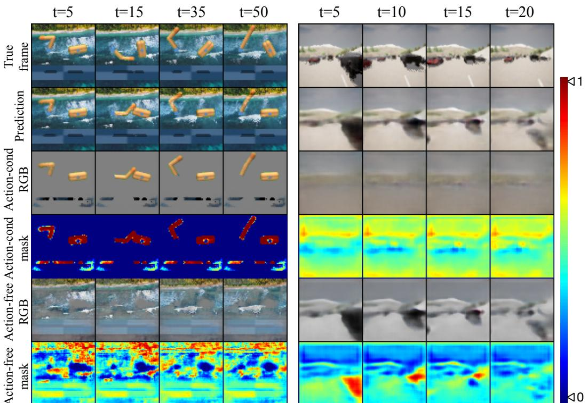

# 1. 论文基本信息

## 1.1. 标题
<strong>Iso-Dream: 在世界模型中隔离和利用不可控的视觉动态 (Iso-Dream: Isolating and Leveraging Noncontrollable Visual Dynamics in World Models)</strong>

论文标题精确地概括了其核心思想：
*   <strong>世界模型 (World Models):</strong> 指明了研究的领域，即模型基强化学习中的一种特定方法，旨在让智能体在内部学习一个环境的模拟器。
*   <strong>视觉动态 (Visual Dynamics):</strong> 表明研究对象是基于高维视觉输入（如图像、视频）的环境变化规律。
*   <strong>不可控的 (Noncontrollable):</strong> 这是问题的核心。在真实世界中，许多视觉变化（如其他车辆的移动、背景中风吹草动）是智能体自身动作无法控制的。
*   <strong>隔离 (Isolating) 和 利用 (Leveraging):</strong> 揭示了论文提出的两大策略。首先，要将智能体可控的动态与不可控的动态分离开；其次，要主动利用对不可控动态的预测来做出更优的决策。

## 1.2. 作者
*   **作者:** Minting Pan, Xiangming Zhu, Yunbo Wang, Xiaokang Yang
*   **隶属机构:** 作者均来自上海交通大学，并与 MoE Key Lab of Artificial Intelligence (人工智能教育部重点实验室) 和 AI Institute (人工智能研究院) 相关联。这表明该研究团队在人工智能领域，特别是计算机视觉和机器学习方面，具有深厚的学术背景。

## 1.3. 发表期刊/会议
该论文是一篇预印本 (preprint)，发布于 arXiv。arXiv 是一个开放获取的学术论文发布平台，研究者们通常在论文正式提交给期刊或会议评审之前或期间，将预印本上传至此，以快速分享研究成果。虽然论文中引用了 `ICLR 2020` 的 `Dreamer`，但本篇论文本身并未在文中注明其最终发表的会议或期刊。

## 1.4. 发表年份
*   <strong>发布于 (UTC):</strong> 2022-05-27T08:07:39.000Z

## 1.5. 摘要
论文摘要清晰地阐述了研究的完整流程：
*   **问题:** 现有的世界模型在处理包含**不可控动态**（即不受智能体动作信号影响的环境变化，如自动驾驶场景中的其他车辆）的视觉场景时会遇到困难。
*   **方法:** 论文提出了一种名为 `Iso-Dream` 的新型强化学习方法，它在 `Dream-to-Control` 框架的基础上进行了两方面改进：
    1.  **隔离动态:** 通过优化<strong>逆动力学 (inverse dynamics)</strong>，`Iso-Dream` 鼓励世界模型在两个隔离的状态转移分支上，分别学习**可控**和**不可控**的时空变化源。
    2.  **利用动态:** 在解耦后的潜在表征上优化智能体的行为。具体来说，为了估计状态价值，模型会将**不可控状态**推演到未来，并将其与**当前的可控状态**关联起来。
*   **优势:** 这种动态源的隔离极大地有利于智能体的<strong>长远决策 (long-horizon decision-making)</strong>，例如，自动驾驶汽车可以通过预测其他车辆的动向来规避潜在风险。
*   **结果:** 实验表明，`Iso-Dream` 在多种视觉控制和预测任务中，能有效解耦混合动态，并且性能显著优于现有方法。

## 1.6. 原文链接
*   **arXiv 链接:** https://arxiv.org/abs/2205.13817
*   **PDF 链接:** https://arxiv.org/pdf/2205.13817v3

    ---

# 2. 整体概括

## 2.1. 研究背景与动机
在现实世界中，尤其是对于像自动驾驶汽车或机器人这样的具身智能体 (embodied agent) 而言，环境是复杂且动态的。智能体通过摄像头等传感器接收到的视觉信息流，通常包含由多种因素驱动的变化：
1.  <strong>可控动态 (Controllable Dynamics):</strong> 由智能体自身动作直接引发的变化。例如，自动驾驶汽车踩油门，汽车会加速；打方向盘，视野会改变。
2.  <strong>不可控动态 (Noncontrollable Dynamics):</strong> 独立于智能体动作的环境变化。例如，路上的其他车辆、行人、天气变化、甚至是背景中摇曳的树木。

    **核心问题：** 传统的模型基强化学习 (MBRL) 方法，特别是世界模型，通常将所有视觉变化视为一个整体来建模。它们试图学习一个单一的函数 `next_state = f(current_state, action)`。当环境中存在大量不可控动态时，这个模型会变得难以学习，因为模型需要同时解释由 `action` 引起的变化和与 `action` 无关的变化。这种纠缠不清的表示会导致：
*   **泛化能力差:** 模型可能将不可控的背景噪声（如视频背景）与智能体的任务错误地关联起来，导致在新的、未见过的环境中表现不佳。
*   **短视决策:** 如果模型无法清晰地预测不可控因素（如其他车辆的轨迹），智能体就只能做出被动反应，而无法进行主动的、有预见性的规划来规避未来的风险。

    **创新思路/切入点:** `Iso-Dream` 的作者们认为，与其让模型自己去“悟”，不如在模型结构和学习目标上就<strong>显式地 (explicitly)</strong> 强制模型将这两种动态分离开。他们提出的解决方案是：
1.  **结构上分离：** 设计两个并行的状态转移模块，一个负责处理与动作相关的可控动态，另一个负责处理与动作无关的不可控动态。
2.  **目标上引导：** 引入逆动力学作为学习信号，强制可控分支专注于学习与动作强相关的状态变化。
3.  **决策上融合：** 在做出决策时，不仅要看当前的可控状态，还要“向前看”，即利用不可控分支对未来环境变化的预测。

## 2.2. 核心贡献/主要发现
这篇论文的主要贡献可以总结为以下两点：

1.  **提出了一种新的世界模型表示学习方法，用于解耦可控与不可控动态：**
    *   通过一个**三分支架构**（可控、不可控、静态）和**逆动力学**优化目标，`Iso-Dream` 能够从复杂的视觉输入中学习到分离的、模块化的状态表示。这提高了模型在含噪声或非平稳环境中的鲁棒性。

2.  **提出了一种新的基于解耦表征的行为学习算法，以实现更具前瞻性的决策：**
    *   智能体在做决策时，不只依赖于当前状态，而是通过一个<strong>未来状态注意力机制 (future state attention mechanism)</strong>，将**当前的可控状态**与**未来多个时间步的不可控状态预测**相结合。这使得智能体能够“预见”环境的自主变化并提前规划，极大地提升了在长远规划任务（如自动驾驶）中的性能。

        论文的关键发现是，**显式地分离并利用不可控动态，能够显著提升模型基强化学习智能体在复杂、动态视觉环境中的性能和决策质量**。

---

# 3. 预备知识与相关工作

## 3.1. 基础概念
为了理解 `Iso-Dream`，我们需要先了解以下几个核心概念：

*   <strong>强化学习 (Reinforcement Learning, RL):</strong> 一种机器学习范式。其核心是一个<strong>智能体 (agent)</strong> 在一个<strong>环境 (environment)</strong> 中进行学习。在每个时间步，智能体观察当前<strong>状态 (state)</strong>，选择一个<strong>动作 (action)</strong>，环境会根据这个动作转移到一个新的状态，并反馈给智能体一个<strong>奖励 (reward)</strong>。智能体的目标是学习一个<strong>策略 (policy)</strong>（即一个从状态到动作的映射），以最大化其在整个过程中获得的累积奖励。

*   <strong>模型基强化学习 (Model-Based RL, MBRL):</strong> 与直接学习策略的<strong>无模型 (model-free)</strong> 方法不同，MBRL 的核心思想是先学习一个关于环境的**模型**，这个模型被称为<strong>世界模型 (world model)</strong>。这个模型能够预测：给定当前状态和动作，环境的下一个状态会是什么，以及会获得多少奖励。有了这个模型，智能体就可以在“脑海”里进行模拟和规划（即在模型生成的想象轨迹中学习），而无需与真实环境进行大量交互，从而大大提高数据利用效率。

*   **Dreamer / Dream-to-Control:** `Dreamer` 是 MBRL 领域的一个里程碑式工作。它的核心框架 `Dream-to-Control` 指的是：
    1.  **学习世界模型:** 从与真实环境交互收集的经验（观测、动作、奖励序列）中，学习一个潜变量世界模型（通常是 `RSSM`）。这个模型在低维的<strong>潜在空间 (latent space)</strong> 中运行，而不是高维的像素空间。
    2.  <strong>在梦中学习行为 (Learn Behaviors by Latent Imagination):</strong> 一旦世界模型训练好，智能体的策略（`Actor`）和价值函数（`Critic`）的训练就**完全在世界模型生成的“梦境”中进行**。智能体在潜在空间中“想象”出成千上万条未来的轨迹，并基于这些想象轨迹来更新自己的策略，而不需要再与真实环境交互。`Iso-Dream` 正是建立在这个框架之上的。

*   <strong>逆动力学 (Inverse Dynamics):</strong> 动力学（或称前向动力学）解决的问题是“给定状态 $s_t$ 和动作 $a_t$，预测下一个状态 $s_{t+1}$”。而逆动力学则相反，它解决的问题是“给定状态 $s_t$ 和下一个状态 $s_{t+1}$，推断出导致这一转变的动作是什么”。在 `Iso-Dream` 中，逆动力学被用作一种辅助学习目标，来确保可控分支学习到的状态表示 $s$ 确实包含了与动作 $a$ 相关的信息。如果模型能从 $s_t$ 和 $s_{t+1}$ 的变化中准确地反推出 $a_t$，就说明 $s$ 确实捕捉到了可控的动态。

*   <strong>变分推断 (Variational Inference) 与 ELBO:</strong> 当模型的某些变量（如潜在状态）是不可观测的随机变量时，直接计算其后验概率往往非常困难。变分推断通过引入一个更简单的、可学习的分布（称为变分分布）来近似这个真实的后验分布。优化的目标是最大化<strong>证据下界 (Evidence Lower Bound, ELBO)</strong>，这样做既能使近似分布逼近真实后验，又能优化模型参数。在 `Dreamer` 和 `Iso-Dream` 中，世界模型的学习就采用了这种基于变分推断的优化方法，其损失函数中包含图像重建项和 KL 散度项，这正是 ELBO 的典型形式。

## 3.2. 前人工作
`Iso-Dream` 的工作建立在以下几个关键研究方向之上：

*   **视觉 MBRL:**
    *   **World Models (Ha & Schmidhuber, 2018):** 首次提出将 VAE 和 RNN 结合，先在无监督的情况下学习环境的压缩潜在表示，然后在这个潜在空间中训练一个非常简单的控制器。
    *   **PlaNet (Hafner et al., 2019):** 提出了<strong>循环状态空间模型 (Recurrent State-Space Model, RSSM)</strong>，这是一个更强大的潜在动态模型，能够同时处理确定性和随机性的状态转移。`PlaNet` 在此基础上使用规划算法来选择动作。
    *   **Dreamer / DreamerV2 (Hafner et al., 2020, 2020):** `Dreamer` 改进了 `PlaNet`，用一个 `Actor-Critic` 算法完全在 `RSSM` 生成的潜在想象中学习策略，实现了端到端的学习。`DreamerV2` 进一步将其扩展到离散动作空间，并在 Atari 游戏上取得了巨大成功。**`Iso-Dream` 直接继承并扩展了 `Dreamer` 的框架。**

*   <strong>动态解耦 (Dynamics Disentanglement):</strong>
    *   **PhyDNet (Le Guen & Thome, 2020):** 在视频预测任务中，提出用两个并行的模块来解耦物理动态（用偏微分方程描述）和未知的互补信息。`Iso-Dream` 的双分支结构思想与之类似，但解耦的维度是**可控性**，并且目标是服务于强化学习决策，而不仅仅是视频预测。

*   **信息瓶颈与表示学习:**
    *   **InfoPower (Bharadhwaj et al., 2022):** 另一个同期（均在 2022 年）的工作，也试图解决视觉 MBRL 中的信息过载问题。它通过最大化“赋权” (empowerment) 来优先处理与任务功能相关的信息。
    *   `Iso-Dream` 与 `InfoPower` 的区别在于：
        1.  `Iso-Dream` **显式地**将动态分为可控和不可控两部分并分别建模，而 `InfoPower` 是通过信息论目标来隐式地筛选信息。
        2.  `Iso-Dream` 提出了独特的**未来状态注意力机制**来利用不可控动态的预测，这是 `InfoPower` 所没有的。

## 3.3. 技术演进
`Iso-Dream` 位于模型基强化学习技术演进脉络中的前沿位置：

1.  **早期 MBRL:** 学习像素空间或物理参数的显式模型，难以扩展到复杂视觉场景。
2.  **潜在动态模型:** `World Models` 和 `PlaNet` 的出现，标志着转向在学习到的**潜在空间**中对环境进行建模，这极大地提高了处理高维视觉输入的能力。核心组件是 `RSSM`。
3.  **基于想象的策略学习:** `Dreamer` 系列工作证明，完全可以在潜在模型生成的“梦境”中高效地学习出高性能的策略，摆脱了对复杂规划算法的依赖。
4.  **表示的解耦与利用:** 随着环境变得越来越复杂，`Dreamer` 的单一潜在状态表示也遇到了瓶颈。`Iso-Dream` 和 `InfoPower` 等工作代表了新的方向：不再满足于一个“大一统”的潜在状态，而是追求对潜在表示进行<strong>有意义的分解 (meaningful decomposition)</strong>，例如按可控性进行解耦，并设计相应的机制来更精细地利用这些解耦后的信息，以应对更复杂的现实挑战。

## 3.4. 差异化分析
与最相关的工作 `DreamerV2` 相比，`Iso-Dream` 的核心创新在于：

| 特性 | DreamerV2 | Iso-Dream (本文) | 创新点与优势 |
| :--- | :--- | :--- | :--- |
| **状态表示** | 单一的潜在状态 $s$，混合了所有动态信息。 | **解耦的潜在状态**：可控状态 $s$ 和不可控状态 $z$。 | 能够更鲁棒地处理环境中的噪声和无关动态。 |
| **模型结构** | 单一的 `RSSM` 模型。 | **多分支世界模型**：一个动作条件分支 (for $s$) 和一个无动作分支 (for $z$)。 | 结构上保证了两种动态的分离学习。 |
| **学习目标** | 标准的 `ELBO` 损失。 | 增加了**逆动力学损失**。 | 强制可控分支学习与动作强相关的特征，是实现成功解耦的关键。 |
| **决策依据** | 策略基于当前潜在状态 $s_t$。 | 策略基于融合了**未来**不可控状态的增强状态 $e_t$。 | 使得决策更具前瞻性，能够预判并应对环境的自主变化。 |

---

# 4. 方法论

`Iso-Dream` 的方法论可以分为两个主要部分：**1) 表示学习**，即如何学习解耦的世界模型；**2) 行为学习**，即如何利用解耦后的表示来优化智能体的策略。

该方法的整体架构如下图所示：

*该图像是Iso-Dream世界模型及行为学习算法的示意图。 (a) 世界模型包含三个分支，明确区分可控、不可控和静态组件，其中动作条件分支通过建模逆动态来学习可控状态转移。 (b) 代理通过未来状态关注机制在世界模型的想象中优化行为。*

上图 (a) 展示了世界模型的表示学习过程，其核心是三分支结构和逆动力学。上图 (b) 展示了行为学习过程，其核心是未来状态注意力机制。

## 4.1. 方法原理
`Iso-Dream` 的核心直觉是，现实世界的动态变化 $u$ 可以被分解为两部分：一部分是智能体可以通过动作 $a$ 控制的状态 $s$，另一部分是独立于动作、自身演化的不可控状态 $z$。

基于这个假设，模型的目标是学习以下概率关系：
$$
u_{1:T} \sim (s, z)_{1:T}, \quad s_{t+1} \sim p(s_{t+1} | s_t, a_t), \quad z_{t+1} \sim p(z_{t+1} | z_t)
$$
其中，可控状态 $s$ 的转移依赖于前一时刻的状态和智能体的动作 $a_t$，而不可控状态 $z$ 的转移只依赖于其自身的前一时刻状态。

## 4.2. 核心方法详解 (逐层深入)

### 4.2.1. 表示学习：解耦的世界模型
`Iso-Dream` 的世界模型是一个包含三个分支的变分自编码器（VAE）架构，用于从观测图像序列 $o_{1:T}$ 中学习潜在动态。

<strong>1. 三分支结构 (Three-Branch Architecture)</strong>

*   <strong>可控分支 (Action-conditioned Branch):</strong>
    *   该分支负责建模可控动态 $p(s_{t+1} | s_t, a_t)$。它采用了与 `Dreamer` 类似的 `RSSM` 结构。
    *   在每个时间步 $t$，一个循环神经网络 $GRU_s$ 根据上一时刻的隐藏状态 $h_{t-1}$、潜在状态 $s_{t-1}$ 和动作 $a_{t-1}$，更新其确定性隐藏状态 $h_t$。
    *   基于 $h_t$，模型预测出一个<strong>先验 (prior)</strong> 潜在状态 $\tilde{s}_t$。
    *   公式表达为：
        $$
        \begin{array}{rl}
        & p(\tilde{s}_t | s_{<t}, a_{<t}) = p(\tilde{s}_t | h_t), \quad \mathrm{where} \ h_t = \mathtt{GRU}_s(h_{t-1}, s_{t-1}, a_{t-1}),
        \end{array}
        $$

*   <strong>不可控分支 (Action-free Branch):</strong>
    *   该分支负责建模不可控动态 $p(z_{t+1} | z_t)$。其结构与可控分支类似，但**完全不接收动作信号** $a$。
    *   另一个循环神经网络 $GRU_z$ 根据上一时刻的隐藏状态 $h'_{t-1}$ 和潜在状态 $z_{t-1}$，更新其隐藏状态 `h'_t`。
    *   基于 `h'_t`，模型预测出一个先验的不可控潜在状态 $\tilde{z}_t$。
    *   公式表达为：
        $$
        \begin{array}{rl}
        & p(\tilde{z}_t | z_{<t}) = p(\tilde{z}_t | h'_t), \quad \mathrm{where} \ h'_t = \mathtt{GRU}_z(h'_{t-1}, z_{t-1}).
        \end{array}
        $$

*   <strong>静态分支 (Static Branch):</strong>
    *   该分支用于捕捉场景中不随时间变化的部分，如静止的背景。它通过对序列的前 $K$ 帧图像进行编码和解码来提取一个时间上恒定的背景表示 $\hat{o}^b$。

**2. 状态推断与逆动力学**

*   <strong>后验状态 (Posterior States):</strong> 当模型接收到当前时刻的真实观测 $o_t$ 时，它会结合先验信息（来自 `GRU` 的 $h_t$ 和 `h'_t`）和观测信息来推断出更准确的<strong>后验 (posterior)</strong> 潜在状态 $s_t$ 和 $z_t$。这是通过特定的编码器网络完成的：$s_t \sim q(s_t | h_t, o_t)$ 和 $z_t \sim q(z_t | h'_t, o_t)$。

*   <strong>逆动力学 (Inverse Dynamics):</strong> 这是实现解耦的**关键**。`Iso-Dream` 引入了一个 `Inverse Cell`（一个简单的多层感知机 `MLP`），它的任务是根据可控分支上相邻两个时间步的后验状态 $s_{t-1}$ 和 $s_t$，来反推出智能体执行的动作 $\tilde{a}_{t-1}$。
    $$
    \tilde{\boldsymbol{a}}_{t-1} = \mathtt{MLP}\big(\boldsymbol{s}_{t-1}, \boldsymbol{s}_{t}\big)
    $$
    *   **符号解释:**
        *   $\tilde{\boldsymbol{a}}_{t-1}$: 模型预测出的在 `t-1` 时刻的动作。
        *   $\boldsymbol{s}_{t-1}, \boldsymbol{s}_{t}$: 可控分支在 `t-1` 和 $t$ 时刻的后验潜在状态。
    *   **目的:** 通过训练这个 `MLP` 来最小化预测动作 $\tilde{a}_{t-1}$ 和真实动作 $a_{t-1}$ 之间的差距（例如 L2 损失），模型就被“强迫”将所有与动作 $a$ 相关的信息都编码到状态 $s$ 中。因为如果 $s$ 的变化与 $a$ 无关，那么 `MLP` 就无法从中推断出 $a$。这样一来，与动作无关的动态信息就被“挤”到了不可控分支 $z$ 中。

**3. 图像重建与整体损失函数**

*   **图像重建:** 最终的图像 $\hat{o}_t$ 是由三个分支的输出加权组合而成的。模型会生成两个动态掩码 (mask) $M_t^s$ 和 $M_t^z$，来决定图像的每个区域应该由可控部分 $\hat{o}_t^s$、不可控部分 $\hat{o}_t^z$ 还是静态背景 $\hat{o}^b$ 来重构。
    $$
    \hat{o}_{t} = M_{t}^{s} \odot \hat{o}_{t}^{s} + M_{t}^{z} \odot \hat{o}_{t}^{z} + (1 - M_{t}^{s} - M_{t}^{z}) \odot \hat{o}^{b}, \quad \mathrm{where~} \hat{o}^{b} = \mathtt{Dec}_{\varphi_3}\big(\mathrm{Enc}_{\theta, \phi_3}\big(o_{1:K}\big)\big)\big).
    $$
    *   **符号解释:**
        *   $\hat{o}_t$: 重建的图像。
        *   $M_t^s, M_t^z$: 可控和不可控部分的掩码。
        *   $\odot$: 逐元素相乘。
        *   $\hat{o}_t^s, \hat{o}_t^z, \hat{o}^b$: 分别由可控状态、不可控状态和静态信息解码得到的图像内容。

*   <strong>整体损失函数 (Loss Function):</strong> 世界模型的训练目标是最大化证据下界（ELBO），等价于最小化以下损失函数 $\mathcal{L}$：
    $$
    \begin{array}{rl}
    & \mathcal{L} = \mathrm{E} \bigg\{ \displaystyle \sum_{t=1}^{T} \underbrace{- \ln p(o_t | h_t, s_t, h'_t, z_t)}_{\text{image loss}} \underbrace{- \ln p(r_t | h_t, s_t, h'_t, z_t)}_{\text{reward loss}} \underbrace{- \ln p(\gamma_t | h_t, s_t, h'_t, z_t)}_{\text{discount loss}} \\
    & \quad \quad + \underbrace{\alpha \ell_2(a_t, \tilde{a}_t)}_{\text{action loss}} + \underbrace{\beta_1 \mathrm{KL}[q(s_t | h_t, o_t) | p(s_t | h_t)] + \beta_2 \mathrm{KL}[q(z_t | h'_t, o_t) | p(z_t | h'_t)]}_{\text{KL divergence}} \bigg\}.
    \end{array}
    $$
    *   **损失项解释:**
        *   `image loss`: 图像重建损失，确保潜在状态能还原原始观测。
        *   `reward loss`, `discount loss`: 奖励和折扣因子的预测损失。
        *   **`action loss`**: **逆动力学损失**，是实现解耦的关键。
        *   `KL divergence`: KL 散度项，是变分推断的正则化项，约束后验分布 $q$ 不能离先验分布 $p$太远。$\beta_1, \beta_2$ 是权重超参数。

### 4.2.2. 行为学习：利用解耦的想象
一旦世界模型训练好，`Iso-Dream` 就会在模型生成的潜在“梦境”中训练智能体的策略（`Actor`）和价值函数（`Critic`）。这里的核心创新是**未来状态注意力机制**。

<strong>1. 未来状态注意力 (Future State Attention)</strong>

*   **动机:** 在像自动驾驶这样的任务中，一个好的司机不仅要根据自己的状态做决策，还要预测旁边车道车辆的未来动向。`Iso-Dream` 将这一思想模型化。
*   **机制:** 在想象的任意时间步 $t$，智能体不仅拥有当前的可控状态 $\tilde{s}_t$，它还会使用**不可控分支**向前“空想” $\tau$ 步，得到一个未来的不可控状态序列 $\tilde{z}_{t:t+\tau}$。然后，通过一个注意力机制，将 $\tilde{s}_t$ 与 $\tilde{z}_{t:t+\tau}$ 融合，得到一个更具“远见”的增强状态表示 $e_t$。
*   **公式:**
    $$
    e_t = \mathrm{softmax}\big(\tilde{s}_t \tilde{z}_{t:t+\tau}^{T}\big) \tilde{z}_{t:t+\tau} + \tilde{s}_t.
    $$
    *   **符号解释:**
        *   $\tilde{s}_t$: 当前想象的可控状态 (作为查询 Query)。
        *   $\tilde{z}_{t:t+\tau}$: 未来 $\tau$ 步想象的不可控状态序列 (作为键 Key 和值 Value)。
        *   $\mathrm{softmax}(\cdot)$: 注意力权重计算。
        *   $e_t$: 融合了未来信息的增强状态表示。
    *   **直观理解:** 这一步计算了当前可控状态 $\tilde{s}_t$ 与未来每个不可控状态 $\tilde{z}_{t+i}$ 的相关性，并根据相关性对未来的不可控状态进行加权求和，最后将结果加到当前可控状态上。这使得 $e_t$ 不仅包含了“我”现在在哪，还包含了“环境”将要发生什么。

**2. Actor-Critic 更新**

*   与 `Dreamer` 不同，`Iso-Dream` 的 `Actor` (策略网络) 和 `Critic` (价值网络) 都是基于这个增强状态 $e_t$ 来构建的，而不是原始的 $\tilde{s}_t$。
    $$
    \begin{array}{ll}
    \mathrm{Action\ model:} & a_t \sim \pi(a_t | e_t) \\
    \mathrm{Value\ model:} & v_{\xi}(e_t) \approx \mathbb{E}_{\pi(\cdot | e_t)} \sum_{k=t}^{t+L} \gamma^{k-t} r_k
    \end{array}
    $$
    *   这意味着智能体在选择动作 $a_t$ 和评估当前状态的价值 $v_{\xi}(e_t)$ 时，已经考虑了未来 $\tau$ 步内环境可能发生的自主变化。

### 4.2.3. 算法流程总结
`Iso-Dream` 的整体训练流程在 `Algorithm 1` 中被详细描述，可以概括为以下交替进行的三个阶段：

1.  **环境交互:** 智能体使用当前策略与真实环境交互，收集经验数据 $(o_t, a_t, r_t)$ 存入回放缓冲区 $\mathcal{B}$。在这一步，智能体也会使用未来状态注意力来做出更优的决策。
2.  **表示学习:** 从 $\mathcal{B}$ 中采样数据，使用公式 (6) 的损失函数更新世界模型（包括三个分支和逆动力学模块）的参数。
3.  **行为学习:** 在更新后的世界模型的潜在空间中进行“想象”：
    *   从真实经验的某个状态开始。
    *   使用不可控分支模型预测未来 $L+\tau$ 步的不可控状态序列 $\{\tilde{z}\}$。
    *   对于每个想象步 $j=t, \dots, t+L$：
        a. 使用公式 (7) 的未来状态注意力，计算增强状态 $e_j$。
        b. 使用策略网络 $\pi(a_j|e_j)$ 采样一个动作 $a_j$。
        c. 使用可控分支模型 $p(\tilde{s}_{j+1}|\tilde{s}_j, a_j)$ 预测下一个可控状态 $\tilde{s}_{j+1}$。
    *   基于这些想象出的轨迹，更新 `Actor` 和 `Critic` 网络的参数。
4.  **循环:** 重复以上步骤。

    ---

# 5. 实验设置

## 5.1. 数据集
论文在多个环境中验证了 `Iso-Dream` 的有效性，涵盖了从有噪声的简单控制任务到复杂的自动驾驶和机器人操作。

*   <strong>DeepMind Control Suite (DMC) [修改版]:</strong>
    *   **描述:** 这是一个广泛用于连续控制任务的物理模拟环境。论文使用的是 `DMControl Generalization Benchmark` 中的版本，其特殊之处在于**背景被替换为随机的自然视频** (如 `video_easy`)。
    *   **特点:** 动态的视频背景构成了与控制任务完全无关的**不可控动态**。智能体的目标是学会忽略这些视觉干扰，专注于控制机械臂或机器人（如 `Walker`, `Cheetah`）完成任务。
    *   **选择原因:** 这个环境非常适合验证 `Iso-Dream` **隔离**并**忽略**无关动态的能力。
    *   **样本示例:** 下图左侧展示了 DMC 环境中的预测结果，可以看到背景是动态的海浪。

        
        *该图像是Iso-Dream在DMC（左）和CARLA（右）基准上的视频预测结果。图中显示了各种时间步（t=5, t=15, t=35, t=50和t=10, t=15, t=20）的真实和预测帧，展示了可控和不可控组件的分离效果。*

*   **CARLA (CARLA: an open urban driving simulator):**
    *   **描述:** 一个开源、逼真的自动驾驶模拟器。实验设置在一个高速公路上，有 30 辆其他车辆在行驶。
    *   **特点:** 智能体（自驾车）需要尽可能远地行驶而不发生碰撞。其他车辆的运动是智能体无法直接控制但又必须密切关注的**不可控动态**。
    *   **选择原因:** 这是验证 `Iso-Dream` **利用**对不可控动态的预测来做出前瞻性决策的理想场景。
    *   **样本示例:** 上图右侧展示了 CARLA 环境的预测结果，其中包含其他车辆。

*   **BAIR Robot Pushing & RoboNet:**
    *   **描述:** 这两个是真实世界机器人收集的**动作条件视频预测**数据集。`BAIR` 数据集包含一个机械臂在桌面上推各种物体的视频。`RoboNet` 包含更多样化的机器人和交互场景。
    *   **特点:** 论文进一步增加了任务难度，在原始视频上**人工添加了弹跳的小球**，作为额外的、可预测但不可控的动态。
    *   **选择原因:** 这两个数据集用于纯粹地评估 `Iso-Dream` 世界模型的**解耦和预测能力**，排除了强化学习策略的影响，可以更直观地看到模型是否学会了分离机械臂的运动（可控）和弹球的运动（不可控）。
    *   **样本示例:** 下图展示了在 BAIR 数据集上的预测结果，可以看到模型分别预测了机械臂和弹球的运动。

        
        *该图像是视频预测结果的展示，包含BAIR机器人推送数据集中的真实帧和Iso-Dream模型生成的帧。不同时间步的预测结果显示了可控和不可控表示的粗略定位，具体包括动作自由分支和动作条件分支的对比。*

## 5.2. 评估指标
论文根据任务类型的不同，使用了两类评估指标。

### 5.2.1. 强化学习任务 (DMC, CARLA)
*   <strong>Episode Return (回合奖励/得分):</strong>
    1.  <strong>概念定义 (Conceptual Definition):</strong> 指智能体在完成一个完整的任务序列（从开始到结束，称为一个 `episode`）所获得的**奖励总和**。这是强化学习中最直接、最核心的性能评价指标。分数越高，代表智能体的策略越好，因为它能更有效地完成任务目标（如跑得更远、保持平衡等）。
    2.  <strong>数学公式 (Mathematical Formula):</strong>
        $G_t = \sum_{k=t+1}^{T} R_k$
    3.  <strong>符号解释 (Symbol Explanation):</strong>
        *   $G_t$: 从时间步 $t$ 开始的总回报。在评估时，通常关心从 $t=0$ 开始的整个回合的总回报 $G_0$。
        *   $T$: 一个回合的结束时间步。
        *   $R_k$: 在时间步 $k$ 获得的即时奖励。

### 5.2.2. 视频预测任务 (BAIR, RoboNet)
*   <strong>峰值信噪比 (Peak Signal-to-Noise Ratio, PSNR):</strong>
    1.  <strong>概念定义 (Conceptual Definition):</strong> PSNR 是衡量图像质量的常用指标，它通过计算预测图像与真实图像之间像素级别的误差（均方误差 MSE）来评估重建质量。PSNR 值越高，表示预测图像与真实图像越接近，失真越小。它是一个基于误差敏感的指标。
    2.  <strong>数学公式 (Mathematical Formula):</strong>
        $$
        \mathrm{PSNR} = 10 \cdot \log_{10}\left(\frac{\mathrm{MAX}_I^2}{\mathrm{MSE}}\right)
        $$
        其中，`\mathrm{MSE} = \frac{1}{mn}\sum_{i=0}^{m-1}\sum_{j=0}^{n-1} [I(i,j) - K(i,j)]^2`。
    3.  <strong>符号解释 (Symbol Explanation):</strong>
        *   $\mathrm{MAX}_I$: 图像像素值的最大可能值（例如，对于 8 位灰度图是 255）。
        *   $\mathrm{MSE}$: 真实图像 $I$ 和预测图像 $K$ 之间的均方误差。
        *   `m, n`: 图像的高度和宽度。

*   <strong>结构相似性指数 (Structural Similarity Index Measure, SSIM):</strong>
    1.  <strong>概念定义 (Conceptual Definition):</strong> 与 PSNR 不同，SSIM 是一种衡量图像结构相似性的指标，它更符合人类的视觉感知。SSIM 从亮度、对比度和结构三个方面来比较两张图像的相似度。SSIM 的取值范围是 [-1, 1]，值越接近 1，表示两张图像越相似。
    2.  <strong>数学公式 (Mathematical Formula):</strong>
        $$
        \mathrm{SSIM}(x, y) = \frac{(2\mu_x\mu_y + c_1)(2\sigma_{xy} + c_2)}{(\mu_x^2 + \mu_y^2 + c_1)(\sigma_x^2 + \sigma_y^2 + c_2)}
        $$
    3.  <strong>符号解释 (Symbol Explanation):</strong>
        *   `x, y`: 要比较的两个图像块。
        *   $\mu_x, \mu_y$: 图像块 `x, y` 的平均值。
        *   $\sigma_x^2, \sigma_y^2$: 图像块 `x, y` 的方差。
        *   $\sigma_{xy}$: 图像块 `x, y` 的协方差。
        *   $c_1, c_2$: 用于维持稳定性的常数。

## 5.3. 对比基线
论文将 `Iso-Dream` 与一系列有代表性的基线模型进行了比较：

*   <strong>视觉控制任务 (DMC, CARLA):</strong>
    *   <strong>模型基 (Model-Based):</strong>
        *   `DreamerV2`: 最直接的对比对象，是 `Iso-Dream` 所基于和改进的框架。
    *   <strong>无模型 (Model-Free):</strong>
        *   `CURL`: 一种基于**对比学习**的表示学习方法，用于无模型强化学习。
        *   `SVEA`: 一种在 Q-learning 中使用**数据增强**来提升性能的方法。
        *   `SAC`: 一种先进的、基于最大熵的<strong>离策略 (off-policy)</strong> Actor-Critic 算法。
        *   `DBC`: 一种通过学习**不依赖于重建**的表示来忽略任务无关细节的方法。

*   <strong>视频预测任务 (BAIR, RoboNet):</strong>
    *   `SVG`: 一种经典的**随机视频生成**模型。
    *   `SA-ConvLSTM`: 一种结合了**自注意力机制**和 `ConvLSTM` 的时空预测模型。
    *   `PhyDNet`: 一个同样采用**双分支架构**来解耦动态的视频预测模型，是 `Iso-Dream` 世界模型部分的一个强有力对比。

        ---

# 6. 实验结果与分析

## 6.1. 核心结果分析
实验结果有力地支持了 `Iso-Dream` 的设计理念和有效性。

### 6.1.1. DMC 实验：成功隔离无关动态
在带有动态视频背景的 DMC 任务中，`Iso-Dream` 旨在隔离并忽略背景噪声。

**定量结果:**
以下是原文 Table 1 的结果：

<table><tr><td>TASK</td><td>SVEA</td><td>CURL</td><td>DBC*</td><td>DreameRV2</td><td>Iso-Dream</td></tr><tr><td>WAlkeR WALK</td><td>826 ± 65</td><td>443 ± 206</td><td>32 ± 7</td><td>655 ± 47</td><td>911 ± 50</td></tr><tr><td>CHEETAH RUN</td><td>178 ± 64</td><td>269 ± 24</td><td>15 ± 5</td><td>475 ± 159</td><td>659 ± 62</td></tr><tr><td>FINGER SPIN</td><td>562 ± 22</td><td>280 ± 50</td><td>1 ± 2</td><td>755 ± 92</td><td>800 ± 59</td></tr><tr><td>HOPPER STAND</td><td>6 ± 8</td><td>451 ± 250</td><td>5 ± 9</td><td>260 ± 366</td><td>746 ± 312</td></tr></table>

*   **分析:** 从表格中可以清晰地看到，`Iso-Dream` 在所有四个任务上的得分均**显著高于**包括 `DreamerV2` 在内的所有基线模型。这表明，通过将动态背景（不可控）和机器人本身（可控）的动态分离，`Iso-Dream` 学会了更鲁棒的、不受视觉噪声干扰的策略。`DreamerV2` 由于其单一的状态表示，可能将部分背景动态错误地编码到其世界模型中，从而影响了策略学习。

**定性结果:**
下图（原文 Figure 3 左）展示了模型在 DMC 上的预测和解耦效果。

*该图像是Iso-Dream在DMC（左）和CARLA（右）基准上的视频预测结果。图中显示了各种时间步（t=5, t=15, t=35, t=50和t=10, t=15, t=20）的真实和预测帧，展示了可控和不可控组件的分离效果。*

*   **分析:** 图中 `action-free branch` 及其对应的 `mask` 清晰地捕捉到了背景海浪的动态，而 `action-cond branch` 则专注于机器人本身的形态。这直观地证明了 `Iso-Dream` 的世界模型成功地将可控和不可控的视觉动态解耦到了不同的表示分支上。

### 6.1.2. CARLA 实验：成功利用未来预测
在 CARLA 自动驾驶任务中，关键在于预测并应对其他车辆的移动。

**定量结果:**
下图（原文 Figure 4a）展示了 CARLA 任务的学习曲线。

*该图像是图表，展示了在CARLA驾驶任务上不同方法的性能对比（a）和Iso-Dream的消融研究（b）。在（a）中，Iso-Dream明显优于DreamerV2。在（b）中，显示了优化逆动态、滚动非可控状态和时间不变建模对表现的影响。*

*   **分析:** `Iso-Dream` (蓝线) 的性能**远超**所有基线方法，特别是其直接的对比对象 `DreamerV2` (紫色线)。这说明仅仅解耦动态还不够，**主动利用对未来的预测**是取得成功的关键。`Iso-Dream` 的智能体通过未来状态注意力机制，“预见”了其他车辆的动向，从而能够做出更安全、更高效的前瞻性决策，例如提前变道以避免未来的拥堵或碰撞。

### 6.1.3. BAIR & RoboNet 实验：验证世界模型的预测和解耦能力
在添加了弹跳球的视频预测任务上，实验旨在评估世界模型本身的质量。

**定量结果:**
以下是原文 Table 2 的结果：

<table><tr><td rowspan="2">MODEL</td><td colspan="2">BAIR</td><td colspan="2">RoboNET</td></tr><tr><td>PSNR ↑</td><td>SSIM↑</td><td>PSNR ↑</td><td>SSIM↑</td></tr><tr><td>SVG [10]</td><td>18.12</td><td>0.712</td><td>19.86</td><td>0.708</td></tr><tr><td>SA-CONvLSTM [35]</td><td>18.28</td><td>0.677</td><td>19.30</td><td>0.638</td></tr><tr><td>PhyDNet [19]</td><td>18.91</td><td>0.743</td><td>20.89</td><td>0.727</td></tr><tr><td>Iso-Dream</td><td>19.51</td><td>0.768</td><td>21.71</td><td>0.769</td></tr></table>

*   **分析:** `Iso-Dream` 在 PSNR 和 SSIM 这两个视频预测质量指标上均取得了最佳成绩，优于包括同样采用双分支解耦思想的 `PhyDNet` 在内的所有模型。这表明 `Iso-Dream` 的世界模型架构（特别是逆动力学的设计）在学习和解耦视觉动态方面具有更强的能力，能够生成更准确、更长期的未来预测。

**定性结果:**
下图（原文 Figure 5）展示了在 BAIR 上的解耦效果。

*该图像是视频预测结果的展示，包含BAIR机器人推送数据集中的真实帧和Iso-Dream模型生成的帧。不同时间步的预测结果显示了可控和不可控表示的粗略定位，具体包括动作自由分支和动作条件分支的对比。*

*   **分析:** 图像清晰地显示，`action-free branch` 捕捉到了弹跳球的运动，而 `action-cond branch` 则集中于由动作驱动的机械臂的运动。这再次直观地证明了模型解耦的有效性。

## 6.2. 消融实验/参数分析
消融实验旨在验证 `Iso-Dream` 各个新组件的必要性。

<strong>CARLA 任务的消融实验 (原文 Figure 4b):</strong>

*该图像是图表，展示了在CARLA驾驶任务上不同方法的性能对比（a）和Iso-Dream的消融研究（b）。在（a）中，Iso-Dream明显优于DreamerV2。在（b）中，显示了优化逆动态、滚动非可控状态和时间不变建模对表现的影响。*

*   <strong>w/o Inverse Dynamics (橙线 vs. 蓝线):</strong> 移除了逆动力学损失后，性能大幅下降。这**证明了逆动力学是成功解耦可控与不可控动态的关键**，没有它的引导，两个分支的表示就会混杂在一起。
*   <strong>w/o Rollout (绿线 vs. 蓝线):</strong> 移除了对不可控状态的未来推演（即不使用未来状态注意力，仅用当前状态），性能同样显著下降。这**证明了利用未来预测对于前瞻性决策至关重要**。
*   <strong>w/o Static branch (红线 vs. 蓝线):</strong> 移除静态背景分支后，性能下降约 15%。这表明**分离出静态背景也能为主模型减轻负担**，使其更专注于动态部分，从而提升性能。

<strong>BAIR 视频预测任务的消融实验 (原文 Table 3):</strong>
以下是原文 Table 3 的结果：

<table><tr><td>MODEL</td><td>PReDict 18 FRamES PSNR ↑</td><td>SSIM ↑</td><td>Predict 28 Frames PSNR ↑ SSIM ↑</td></tr><tr><td>Iso-Dream w/o action-free Branch</td><td>20.47</td><td>0.795</td><td>18.51 0.690</td></tr><tr><td>Iso-Dream w/o Inverse CeLL</td><td>21.42</td><td>0.829</td><td>19.34 0.759</td></tr><tr><td>Iso-Dream</td><td>21.43</td><td>0.832</td><td>19.51 0.768</td></tr></table>

*   **分析:**
    *   移除 `action-free branch`（即退化为单分支模型）后，长程预测（28 帧）的性能大幅下降。这证明了**模块化的双分支结构对于长程预测是有效的**。
    *   移除 `Inverse Cell`（逆动力学）后，性能也有所下降。这再次印证了**逆动力学对于学习更确定性的、解耦的表示是有益的**。

        ---

# 7. 总结与思考

## 7.1. 结论总结
`Iso-Dream` 提出了一种新颖的、用于视觉控制的模型基强化学习框架，成功地解决了真实世界中普遍存在的**可控与不可控动态混合**的难题。

*   **核心贡献:**
    1.  通过**多分支架构**和**逆动力学**，`Iso-Dream` 学习到了解耦的、模块化的世界模型表示，能够有效**隔离**出可控和不可控的视觉动态。
    2.  通过创新的**未来状态注意力机制**，智能体能够主动**利用**对未来不可控动态的预测，来做出更具前瞻性的、更安全有效的决策。

*   **主要发现:** 实验结果雄辩地证明，这种“隔离”与“利用”相结合的策略，不仅能让智能体在充满噪声和干扰的环境中保持鲁棒性（如 DMC），还能在需要长远规划的复杂交互场景中（如 CARLA）取得突破性的性能提升。

## 7.2. 局限性与未来工作
论文作者坦诚地指出了该方法存在的两个主要局限性：

1.  **计算效率:** 相比 `DreamerV2`，`Iso-Dream` 在行为学习阶段需要对不可控状态进行额外的推演 (`rollout`)，这增加了每次训练迭代的计算开销和时间。尽管论文指出其样本效率更高（达到同样性能所需的真实环境交互次数更少），但训练所需的“墙上时间” (wall-clock time) 可能会更长。
2.  **对先验知识的依赖:** 论文提到，在初步实验中，他们发现不同环境对网络架构有不同的要求，需要根据对环境的先验知识进行一些特定的调整。例如，在 DMC 任务中，背景是纯粹的噪声，因此不可控分支在行为学习中被完全丢弃；而在 CARLA 任务中，其他车辆的动态则需要被紧密集成到决策过程中。这在一定程度上削弱了方法的通用性，理想的系统应该能够更自动地适应不同类型的环境。

    未来的工作可以围绕这两点展开，例如研究更高效的注意力机制或推演策略来降低计算成本，或者探索元学习等方法让模型自动适应不同环境的动态特性。

## 7.3. 个人启发与批判
这篇论文给我带来了深刻的启发，同时也引发了一些批判性思考。

*   **个人启发:**
    *   **分解问题的力量:** `Iso-Dream` 的成功再次印证了“分而治之”是解决复杂问题的有效策略。它没有试图用一个庞大而单一的模型去硬解所有问题，而是有意识地将问题分解为可控和不可控两个子问题，并为每个子问题设计了专门的解决方案。这种思想在许多其他 AI 领域都具有借鉴意义。
    *   <strong>“预见未来”</strong>的重要性: 未来状态注意力机制是一个非常优雅和强大的设计。它将智能体从一个被动的反应者（基于当前状态做决策）提升为一个主动的规划者（基于对未来的预测做决策）。这个思想可以被广泛应用到任何需要与动态环境交互的系统中，如机器人协作、金融交易、游戏 AI 等。
    *   **辅助任务的价值:** 逆动力学在这里作为一种辅助任务 (auxiliary task)，其目的不是为了自身的预测准确率，而是为了塑造主任务（表示学习）的特征空间。这提示我们，在设计深度学习模型时，巧妙地引入有意义的辅助任务，可以成为一种非常有效的归纳偏置 (inductive bias)，引导模型学到我们想要的表示。

*   **批判性思考:**
    *   <strong>“可控”</strong>与“不可控”的二元划分是否过于绝对？ 在现实中，很多事物的可控性是模糊和连续的。例如，在 CARLA 中，自车的移动会改变摄像头的视角，从而影响到画面中的所有像素，从这个角度看，几乎没有什么是“纯粹”不可控的。论文通过学习掩码 $M$ 来部分解决这个问题，但这仍然是一个简化的模型。一个更根本的问题是，模型如何处理那些**部分可控**或**间接可控**的动态？
    *   **可解释性与因果推断:** 虽然 `Iso-Dream` 成功地在功能上解耦了动态，但它是否学到了真正的因果关系？例如，模型是否理解“因为我打了方向盘，所以视野中的道路边缘向左移动了”，还是仅仅学到了两者在统计上的相关性？这是一个更深层次的问题，`Iso-Dream` 的框架为探索基于模型的因果强化学习提供了一个很好的起点，但其本身还未完全触及。
    *   **泛化到更复杂的动态:** 论文中的不可控动态（如匀速行驶的车辆、循环播放的视频背景、固定规律的弹球）相对简单和可预测。在面对更混沌、更具突发性的不可控动态（如突然冲出的行人、复杂的交通拥堵模式）时，当前基于 `GRU` 的线性推演模型是否依然有效，值得进一步验证。