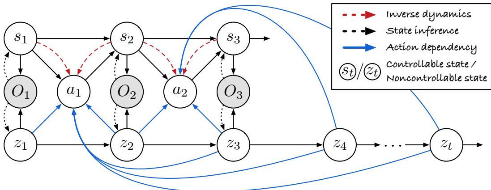
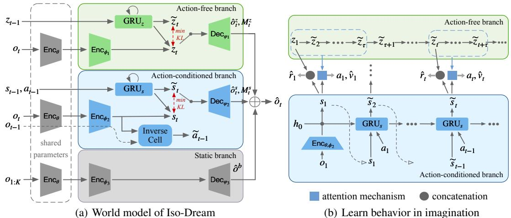
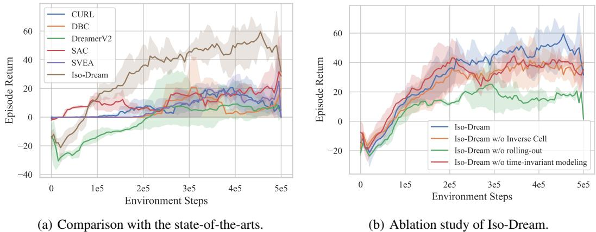
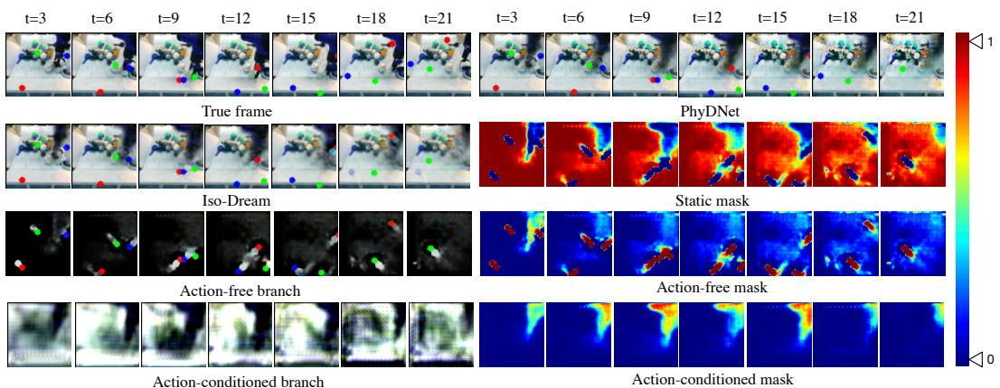
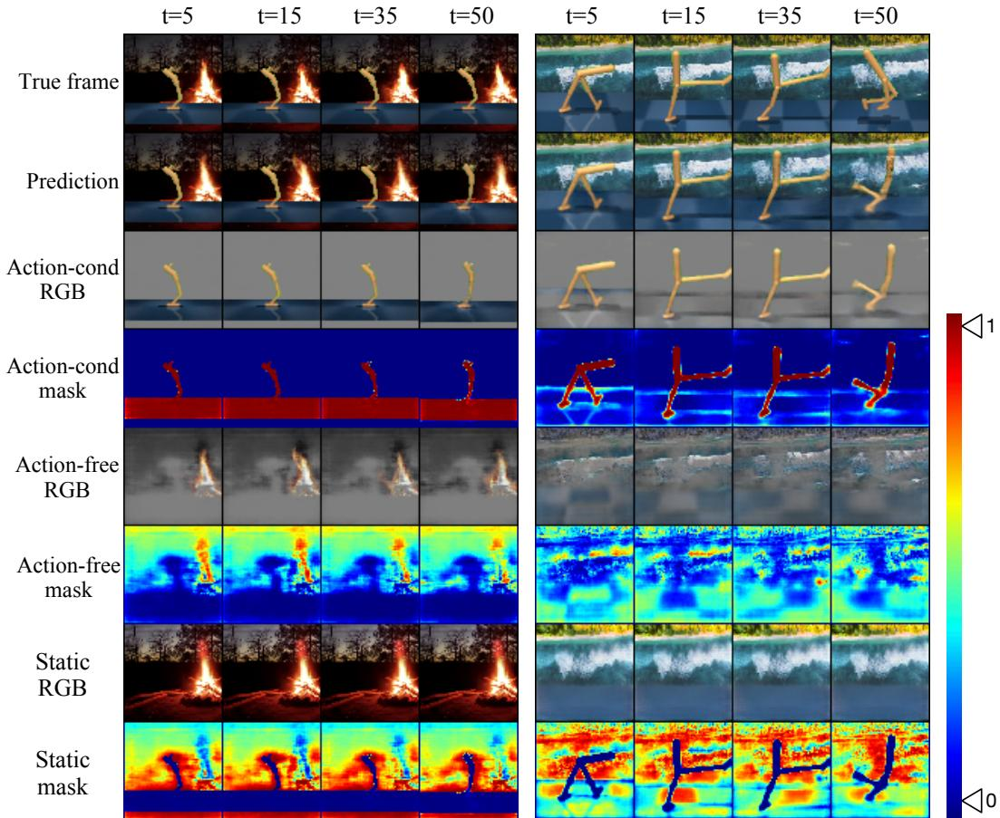
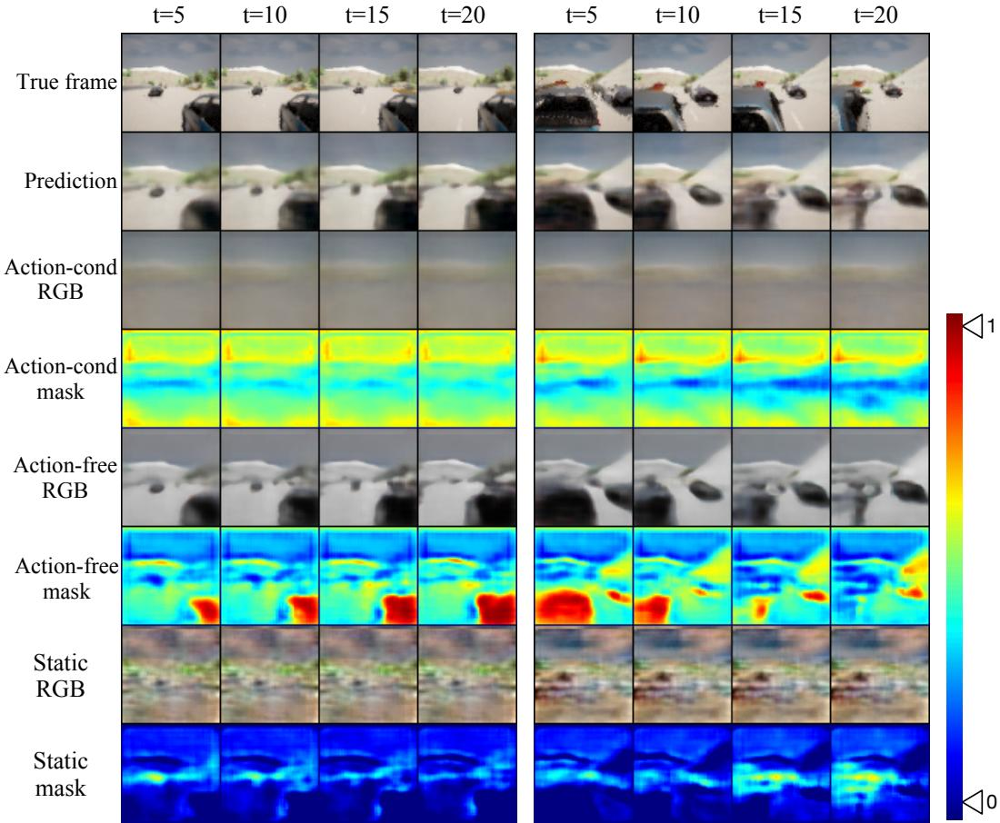
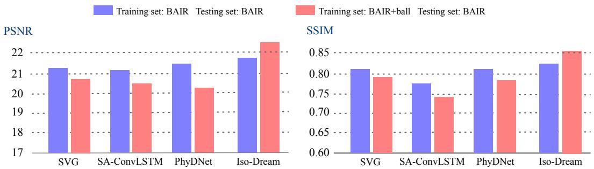

# Iso-Dream: Isolating and Leveraging Noncontrollable Visual Dynamics in World Models

Minting Pan\* Xiangming Zhu\* Yunbo Wang† Xiaokang Yang MoE Key Lab of Artificial Intelligence, AI Institute, Shanghai Jiao Tong University {panmt53, xmzhu76, yunbow, xkyang}@sjtu.edu.cn

# Abstract

World models learn the consequences of actions in vision-based interactive systems. However, in practical scenarios such as autonomous driving, there commonly exists noncontrollable dynamics independent of the action signals, making it difficult to learn effective world models. To tackle this problem, we present a novel reinforcement learning approach named Iso-Dream, which improves the Dream-to-Control framework [22] in two aspects. First, by optimizing the inverse dynamics, we encourage the world model to learn controllable and noncontrollable sources of spatiotemporal changes on isolated state transition branches. Second, we optimize the behavior of the agent on the decoupled latent imaginations of the world model. Specifically, to estimate state values, we roll-out the noncontrollable states into the future and associate them with the current controllable state. In this way, the isolation of dynamics sources can greatly benefit long-horizon decisionmaking of the agent, such as a self-driving car that can avoid potential risks by anticipating the movement of other vehicles. Experiments show that Iso-Dream is effective in decoupling the mixed dynamics and remarkably outperforms existing approaches in a wide range of visual control and prediction domains.

# 1 Introduction

Humans can infer and predict real-world dynamics by simply observing and interacting with the environment. Inspired by this, many cutting-edge AI agents use self-supervised learning [38, 20, 12] or reinforcement learning [39, 22, 42] techniques to acquire knowledge from their surroundings. Among them, world models [20] have received widespread attention in the field of robot visual control, and led the recent progress in model-based reinforcement learning (MBRL) [22, 42, 24, 30]. A typical approach [22] is to use the trajectories of observations and control signals collected by an RL agent to learn a differentiable simulator of the environment, namely the world model, and then update the RL agent by optimizing the behaviors on the latent imaginations of the world model. However, since the observation sequence is high-dimensional, non-stationary, and often driven by multiple sources of physical dynamics, how to learn effective world models in complex visual scenes remains an open problem. In realistic scenarios such as autonomous driving, we can generally divide spatiotemporal dynamics in the system into controllable parts that perfectly respond to action signals, and parts beyond the control of the agent, such as the movement of other vehicles and other external changes. The isolation of controllable and noncontrollable states can improve MBRL in two aspects: Modular representation improves the generalization of the agent to non-stationary environments with noises, such as the time-varying background in our modified DeepMind Control Suite.

  

Figure 1: Probabilistic graph of Iso-Dream. It learns to decouple complex visual dynamics into controllable states $\left( { { s _ { t } } } \right)$ and noncontrollable states $\left( { z _ { t } } \right)$ by optimizing the inverse dynamics (Red dashed arrows). On top of the disentangled states, it performs model-based reinforcement learning by explicitly considering the predicted noncontrollable component of future dynamics (Blue arrows).

More importantly, it improves long-horizon RL tasks that can greatly benefit from decisions based on predictions of future noncontrollable dynamics. For example, in autonomous driving, potential risks can be better avoided by predicting the movement of other vehicles. We present Iso-Dream, a novel MBRL framework that learns to decouple and leverage the controllable and noncontrollable state transitions. Accordingly, it improves the original Dreamer [22] from two perspectives: (i) a new form of world model representations and (ii) a new actor-critic algorithm to derive the behavior from the world model. As shown in Figure 1, the foundation of decoupling the world model is to separate the mixed latent states into an action-conditioned branch and an action-free branch, which can individually transit different sources of visual dynamics. The components are jointly trained to maximize the variational lower bounds. To further isolate the controllable states, the action-conditioned branch is also optimized with inverse dynamics, that is, to reason about the actions that have driven the state transitions between adjacent time steps. Another contribution of Iso-Dream is to find that disentangling physical dynamics can greatly benefit the downstream decision-making tasks by more accurately foreseeing the inherent changes in the environment. Intuitively, humans can decide how to interact with the environment at each moment based on their anticipation of future changes in the surroundings. To make more forward-looking decisions, as shown by the blue arrows in Figure 1, the policy network integrates the current controllable state and multiple steps of predicted noncontrollable states through an attention mechanism. It enables the agent to thoroughly consider possible future interactions with the environment. We evaluate Iso-Dream in the following domains: The modified DeepMind Control Suite with noisy video background; The CARLA autonomous driving environment in which other vehicles can be naturally viewed as noncontrollable components; The real-world BAIR robot dataset and the RoboNet dataset that are helpful to validate the effectiveness of the world model for disentanglement. On all benchmarks, Iso-Dream remarkably outperforms the existing approaches by large margins.

# 2 Related Work

Action-conditioned video prediction. A straightforward deep learning solution to visual control problems is to learn action-conditioned video prediction models [38, 14, 8, 53] and then perform Monte-Carlo importance sampling and optimization algorithms, such as the cross-entropy methods, over available behaviors [15, 12, 29]. Hot topics in video prediction mainly includes long-term and high-fidelity future frames generation [44, 43, 51, 5, 52, 50, 54, 41, 40, 36, 56, 28, 2], dynamics uncertainty modeling [1, 10, 48, 31, 7, 16, 55], object-centric scene decomposition [47, 27, 18, 58, 3], and space-time disentanglement [49, 27, 19, 6]. The corresponding technical improvements mainly involve the use of more effective neural architectures, novel probabilistic modeling methods, and specific forms of video representation. The disentanglement methods are closely related to the world model in Iso-Dream. They commonly separate visual dynamics into content and motion vectors, or long-term and short-term states. In contrast, Iso-Dream is designed to learns a decoupled world model based on controllability, which contributes more to the downstream behavior learning process.

Visual MBRL. In visual control tasks, the agents have to learn the action policy directly from high-dimensional observations. They can be roughly grouped into two categories, that is, model-free methods [34, 57, 32, 33, 25] and model-based methods [15, 39, 20, 23, 22, 30, 42, 59, 4]. Among them, the MBRL approaches explicitly model the state transitions and generally yield higher sample efficiency than the model-free methods. Ha and Schmidhuber [20] proposed the World Models that first learn compressed latent states of the environment in a self-supervised manner, and then train the agent on the latent states generated by the world model. Following the two-stage training procedure, PlaNet [23] uses an action-conditioned, recurrent state-space model (RSSM) as the world model, and optimizes the action policy on the recurrent states with the cross-entropy methods. In Dreamer [22] and DreamerV2 [24], agents learn behaviors by optimizing the expected values over the predicted latent states in RSSM. InfoPower [4] prioritizes functional-related information from visual observations to obtain a more robust representation for MBRL. Notably, Iso-Dream is very different from InfoPower in two aspects. First, we explicitly model the state transitions of controllable and noncontrollable dynamics, so that it is possible to choose whether to take the noncontrollable states into behavior learning according to the prior knowledge of a specific domain. Second, we propose a new behavior learning method that greatly benefits from the decoupled world model, so that we can preview possible future states of noncontrollable patterns before making decisions at this moment.

# 3 Method

In this section, we first present basic assumptions and the general framework of Iso-Dream for decoupling and leveraging controllable and noncontrollable dynamics for visual control (Section 3.1). For representation learning, we introduce the three-branch world model and its training objectives of inverse dynamics (Section 3.2). For behavior learning, we present an actor-critic method that is trained on the imaginations of the decoupled world model latent states, so that the agent may consider possible future states of noncontrollable dynamics (Section 3.3). Finally, we discuss how Iso-Dream is deployed to interact with the environment (Section 3.4).

# 3.1 Basic Assumptions of Iso-Dream

As shown in Figure 1, when the agent receives a sequence of visual observations $O 1 { : } T$ , the underlying spatiotemporal dynamics can be defined as $u _ { 1 : T }$ . Our goal is to understand the inner relationships of different dynamics by decoupling $u _ { 1 : T }$ into controllable latent states $s _ { 1 : T }$ and noncontrollable latent states $z _ { 1 : T }$ that vary in spacetime, such that:

$$
u _ { 1 : T } \sim ( s , z ) _ { 1 : T } , \quad s _ { t + 1 } \sim p ( s _ { t + 1 } \mid s _ { t } , a _ { t } ) , \quad z _ { t + 1 } \sim p ( z _ { t + 1 } \mid z _ { t } ) ,
$$

where $a _ { t }$ is the action signal. To achieve long-term prediction, we isolate $s _ { t }$ and $z _ { t }$ to each other and model their state transitions of $p ( s _ { t + 1 } \mid s _ { t } , \bar { a _ { t } } )$ and $\mathbf { \bar { \rho } } _ { p \left( z _ { t + 1 } \mid z _ { t } \right) }$ respectively. According to our prior knowledge of the environment, we can optionally choose whether to roll out the noncontrollable states and consider them during behavior learning. For tasks where the noncontrollable components can be viewed as time-varying noise, we simply derive the action policy by $a _ { t } \sim \pi ( a _ { t } \mid s _ { t } )$ . The isolation of controllable states improves the generalization of the agent to non-stationary systems. For tasks like autonomous driving, the behaviors are derived by where we calculate the relationships between $s _ { t }$ and the imagined noncontrollable states over time horizon $\tau$ . It assumes that, in specific long-horizon tasks, the agent can greatly benefit from predicting the consequences of external noncontrollable forces.

$$
a _ { t } \sim \pi ( a _ { t } \mid s _ { t } , z _ { t : t + \tau } ) ,
$$

# 3.2 Representation Learning of Controllable and Noncontrollable Dynamics

Inspired by previous approaches [37, 17] showing that modular structures are effective for disentanglement learning, we leverage a three-branch architecture to decouple $u _ { t }$ into controllable dynamics state $s _ { t }$ , noncontrollable dynamics state $z _ { t }$ , and time-invariant representation of the background. As shown in Figure 2(a), the action-conditioned branch models $p ( s _ { t + 1 } \mid s _ { t } , a _ { t } )$ . It follows the RSSM architecture from PlaNet [23] to use a recurrent neural network $\mathtt { G R U } _ { s } ( \cdot )$ , the deterministic hidden state $h _ { t }$ , and the stochastic state $s _ { t }$ to form the transition model, where the GRU keeps the historical information of the controllable dynamics. The action-free branch models $p ( z _ { t + 1 } \mid z _ { t } )$ with similar network structures. The transition models with separate parameters can be written as follows:

$$
\begin{array} { r l } & { p ( \widetilde { s } _ { t } \mid s _ { < t } , a _ { < t } ) = p ( \widetilde { s } _ { t } \mid h _ { t } ) , \quad \mathrm { w h e r e } h _ { t } = \mathtt { G R U } _ { s } ( h _ { t - 1 } , s _ { t - 1 } , a _ { t - 1 } ) , } \\ & { \qquad p ( \widetilde { z } _ { t } \mid z _ { < t } ) = p ( \widetilde { z } _ { t } \mid h _ { t } ^ { \prime } ) , \quad \mathrm { w h e r e } h _ { t } ^ { \prime } = \mathtt { G R U } _ { z } ( h _ { t - 1 } ^ { \prime } , z _ { t - 1 } ) . } \end{array}
$$

  

Figure 2: The overall architecture of the world model and the behavior learning algorithm in IsoDream. (a) World model with three branches to explicitly disentangle controllable, noncontrollable, and static components from visual data, where the action-conditioned branch learns controllable state transitions by modeling inverse dynamics. (b) The agent optimizes the behaviors in imaginations of the world model through a future state attention mechanism.

We here use $\tilde { s } _ { t }$ and $\tilde { z } _ { t }$ to denote the prior representations. We optimize the transition models with posterior representations that are derived from $s _ { t } \sim q ( s _ { t } \mid h _ { t } , o _ { t } )$ and $z _ { t } \sim q ( z _ { t } \mid h _ { t } ^ { \prime } , o _ { t } )$ We learn $\backslash \dot { o } _ { t } \in \mathbb { R } ^ { 3 \times H \times W }$ by a shared encoder $\mathtt { E n c } _ { \theta }$ and subsequent branch-specific encoders $\mathtt { E n c } _ { \phi _ { 1 } }$ and $\mathtt { E n c } _ { \phi _ { 2 } }$ . To enhance the disentanglement representation learning corresponding to the control signals, we introduce the training objective of inverse dynamics. Accordingly, we design an Inverse Cell of a 2-layer MLP to infer the actions that lead to certain transitions of the controllable states:

$$
\tilde { \boldsymbol { a } } _ { t - 1 } = \mathtt { M L P } \big ( \boldsymbol { s } _ { t - 1 } , \boldsymbol { s } _ { t } \big ) ,
$$

where the inputs are the posterior representations in the action-conditioned branch. By learning to regress the true behavior $a _ { t - 1 }$ , the Inverse Cell facilitates the action-conditioned branch to isolate the representation of the controllable dynamics. To avoid the training collapse where the actionconditioned branch captures most of the useful information, while the action-free branch learns almost nothing, in the process of image reconstruction, we respectively use the prior state $\tilde { s } _ { t }$ and the posterior state $z _ { t }$ to generate the controllable visual component $\hat { \sigma } _ { t } ^ { s } \in \bar { \mathbb { R } } ^ { 3 \times H \times W }$ with mask $M _ { t } ^ { s } \in \dot { \mathbb { R } ^ { 1 \times H \times W } }$ h collabl mpn $\hat { o } _ { t } ^ { z } \in \mathbb { R } ^ { 3 \times H \times W }$ with $\backslash \backslash M _ { t } ^ { z } \in \mathbb { R } ^ { 1 \times H \times W }$ By further integrating the time-invariant information extracted from the first $K$ frames, we have

$$
\hat { o } _ { t } = M _ { t } ^ { s } \odot \hat { o } _ { t } ^ { s } + M _ { t } ^ { z } \odot \hat { o } _ { t } ^ { z } + ( 1 - M _ { t } ^ { s } - M _ { t } ^ { z } ) \odot \hat { o } ^ { b } , \quad \mathrm { w h e r e ~ } \hat { o } ^ { b } = \mathtt { D e c } _ { \varphi _ { 3 } } \big ( \mathrm { E n c } _ { \theta , \phi _ { 3 } } \big ( o _ { 1 : K } \big ) \big ) \big ) .
$$

For reward modeling, we have two options with the action-free branch. In one case, the noncontrollable dynamics can be considered as noises that are not related to the task, and therefore $z _ { t }$ is no longer useful during imagination. In other words, the policy and the predicted reward are only related to the controllable states. In the other case, future noncontrollable states would affect how the agent makes decisions, and we consider the action-free components during behavior learning. For this, we learn alternative reward models $p ( r _ { t } \mid s _ { t } )$ or $p ( r _ { t } \mid s _ { t } , { \bar { z } } _ { t } )$ in forms of MLPs. For a sequence of $( o _ { t } , a _ { t } , r _ { t } ) _ { t = 1 } ^ { T }$ sampled from the replay buffer during training, the world model can be optimized using the following loss functions, where $\alpha$ $\beta _ { 1 }$ , and $\beta _ { 2 }$ are hyper-parameters:

$$
\begin{array} { r l } & { \mathcal { L } = \mathrm { E } \{ \displaystyle \sum _ { t = 1 } ^ { T } \frac { - \ln p \left( o _ { t } \mid h _ { t } , s _ { t } , h _ { t } ^ { \prime } , z _ { t } \right) } { \mathrm { i n a g e l o s s } } \frac { - \ln p \left( r _ { t } \mid h _ { t } , s _ { t } , h _ { t } ^ { \prime } , z _ { t } \right) } { \mathrm { r e w a r d l o g ~ l o s s } } \frac { - \ln p \left( \gamma _ { t } \mid h _ { t } , s _ { t } , h _ { t } ^ { \prime } , z _ { t } \right) } { \mathrm { d i s c o u n t l o g l o s s } } } \\ & { \quad \quad + \underbrace { \alpha \ell _ { 2 } ( a _ { t } , \tilde { a } _ { t } ) } _ { \mathrm { a c t i o n ~ l o s s } } + \underbrace { \beta _ { 1 } \mathrm { K L } [ q ( s _ { t } \mid h _ { t } , o _ { t } ) \mid p ( s _ { t } \mid h _ { t } ) ] + \beta _ { 2 } \mathrm { K L } [ q ( z _ { t } \mid h _ { t } ^ { \prime } , o _ { t } ) \mid p ( z _ { t } \mid h _ { t } ^ { \prime } ) ] } _ { \mathrm { K L 4 i v e r g e n c e } } \} . } \end{array}
$$

Aunu 1; i-Dcam (mmmt. Uu mumal t ao  & pm uement) 1 Hyperparameters: $L$ : Imagination horizon; $\tau$ : Window size for future state attention 2Initialize the replay buffer $\boldsymbol { B }$ with random episodes. 3 while not converged do 4 for update step $c = 1 \ldots C$ do 5 Draw data sequences $\left\{ \left( o _ { t } , a _ { t } , r _ { t } \right) \right\} _ { t = 1 } ^ { T } \sim \mathcal { B }$ . 6 // Representation learning 7 Compute world model loss using Eq. (6) and update model parameters. 8 // Behavior learning 9 Roll-out tla $\left\{ \tilde { z } _ { i } \right\} _ { i = t + 1 } ^ { t + L + \tau }$ from $z _ { t }$ 10 for time step $j = i \ldots i + L$ do 11 Compute latent state $e _ { j } \sim$ Attention $( \tilde { s } _ { j } , \tilde { z } _ { j : j + \tau } )$ using Eq. (7). 12 Imagine an action $a _ { j } \sim \pi ( a _ { j } | e _ { j } )$ . 13 Predict the next controllable state $\tilde { s } _ { j + 1 } \sim p ( \tilde { s } _ { j } , a _ { j } )$ using the action-conditioned branch alone. 14 end 15 Update the policy and value models in Eq. (8) using estimated rewards and values. 16 end 17 // Environment interaction 18 $o _ { 1 } $ env.reset() 19 for time step $t = 1 \dots T$ do 20 Calculate the posterior representation $s _ { t } \sim q \left( s _ { t } \mid h _ { t } , o _ { t } \right) , z _ { t } \sim q \left( z _ { t } \mid h _ { t } ^ { \prime } , o _ { t } \right)$ . 21 Roll-out the noncontrollable states $\tilde { z } _ { t + 1 : t + \tau }$ from $z _ { t }$ through the action-free branch alone. 22 Generate $a _ { t } \sim \pi ( a _ { t } \mid s _ { t } , z _ { t } , { \tilde { z } } _ { t + 1 : t + \tau } )$ using future state attention in Eq. (7). 23 $r _ { t } , o _ { t + 1 } \gets \mathsf { e n v }$ .step $( a _ { t } )$ 24 end 25 Add experience to the replay buffer $\boldsymbol { B } \gets \boldsymbol { B } \cup \{ ( o _ { t } , a _ { t } , r _ { t } ) _ { t = 1 } ^ { T } \}$ . 26 end The world model training approach can be partly customized for different environments. In situations where noncontrollable states are indeed involved in behavior learning, minimizing the ELBO objective can maintain the semantics of $\tilde { z } _ { t }$ Oerwise i the action-ree feature are only used t prevet noy distractions from affecting the training process of Iso-Dream, rather than being used for behavior learning, we can simply train the action-free branch with the reconstruction loss alone.

# 3.3 Behavior Learning in Decoupled Imaginations

Thanks to the decoupled world model, we can optimize the agent behaviors to adaptively consider the relations between available actions and possible future states of the noncontrollable dynamics. A practical example is autonomous driving, where the motion of other vehicles can be naturally viewed as noncontrollable but predictable components. As shown in Figure 2(b), we here propose an improved actor-critic learning algorithm that $I$ ) allows the action-free branch to foresee the future ahead of the action-conditioned branch, and 2) exploits the predicted future information of noncontrollable dynamics to make more forward-looking decisions. Suppose we are making decisions at time step $t$ in the imagination period. A straightforward solution from the original Dreamer method is to learn an action model and a value model based on the isolated controllable state $\tilde { s } _ { t } \in \mathbb { R } ^ { 1 \times d }$ However, we notice that by employing an attention mechanism, we can $\tilde { z } _ { t : t + \tau } \in \mathbb { R } ^ { \tau \times d }$ ,where $\tau$ is the length of a sliding window from now on. Future state attention: $e _ { t } = \mathrm { s o f t m a x } \big ( \tilde { s } _ { t } \tilde { z } _ { t : t + \tau } ^ { T } \big ) \tilde { z } _ { t : t + \tau } + \tilde { s } _ { t } .$ In this way, $\tilde { s } _ { t }$ evolves to a more "visionary" representation $e _ { t } \in \mathbb { R } ^ { 1 \times d }$ .We update the action model and the value model in Dreamer [22] as follows:

$$
\mathrm { A c t i o n \ m o d e l : } \quad a _ { t } \sim \pi ( a _ { t } \mid e _ { t } ) , \quad \mathrm { V a l u e \ m o d e l : } \quad v _ { \xi } ( e _ { t } ) \approx \mathbb { E } _ { \pi ( \cdot \mid e _ { t } ) } \sum _ { k = t } ^ { t + L } \gamma ^ { k - t } r _ { k } ,
$$

where $L$ is the imagination time horizon. As shown in Alg. 1, during imagination, we first use the action-free transition model to obtain sequences of noncontrollable states of length $L + \tau$ , denoted bys $\{ \tilde { z } _ { i } \} _ { i = t } ^ { i + L + \tau }$ $a _ { j }$ fro hin $e _ { j }$ $a _ { j }$ latent imagination and predicts the next controllable state $s _ { j + 1 }$ . We follow DreamerV2 [24] to train the action model to maximize the $\lambda$ -return [45], and train the value model to regress the $\lambda$ -return3.

Table 1: Performance of visual control tasks in the DMC Suite. The agents are trained and evaluated in environments with video_easy dynamic background. We report the mean and std of final performance over 3 seeds and 5 trajectories. $\ast _ { \mathrm { W e } }$ use a different setup from that in the paper of DBC.   

<table><tr><td>TASK</td><td>SVEA</td><td>CURL</td><td>DBC*</td><td>DreameRV2</td><td>Iso-Dream</td></tr><tr><td>WAlkeR WALK</td><td>826 ± 65</td><td>443 ± 206</td><td>32 ± 7</td><td>655 ± 47</td><td>911 ± 50</td></tr><tr><td>CHEETAH RUN</td><td>178 ± 64</td><td>269 ± 24</td><td>15 ± 5</td><td>475 ± 159</td><td>659 ± 62</td></tr><tr><td>FINGER SPIN</td><td>562 ± 22</td><td>280 ± 50</td><td>1 ± 2</td><td>755 ± 92</td><td>800 ± 59</td></tr><tr><td>HOPPER STAND</td><td>6 ± 8</td><td>451 ± 250</td><td>5 ± 9</td><td>260 ± 366</td><td>746 ± 312</td></tr></table>

# 3.4 Policy Deployment by Rolling-out Noncontrollable Dynamics

As discussed above, in the cases that noncontrollable dynamics are irrelevant to the control task, when interacting with the environment, we only use the state of controllable dynamics to generate the policy at each time step $t$ . However, for the situation where noncontrollable dynamics should be closely related to the behavior of the agent, as shown in Lines 21-22 in Alg. 1, the action-free branch consecutively predicts the next $\tau - 1$ noncontrollable states $\tilde { z } _ { t + 1 : t + \tau }$ starting from the current posterior state $z _ { t }$ . Similar to Eq. (7) in the process of behavior learning, we here use the learned future state attention network to adaptively integrate $s _ { t } , z _ { t }$ and $\tilde { z } _ { t + 1 : t + \tau }$ Based on the integrated feature $e _ { t }$ , the Iso-Dream agent draws $a _ { t }$ from the action model to interact with the environment.

# 4 Experiments

# 4.1 Experimental Setup

Benchmarks. We quantitatively and qualitatively evaluate Iso-Dream on two reinforcement learning environments, i.e., DeepMind Control Suite [46] and CARLA [11], and two real-world datasets for action-conditioned video prediction, i.e., BAIR robot pushing [13] and RoboNet [9]. The video prediction experiments can provide more intuitive visualizations of disentanglement learning. Compared methods. For the visual control tasks, we compare our approach with five baselines, including both model-based and model-free methods, i.e., DreamerV2 [24], CURL [34], SVEA [25], SAC [21], and DBC [59]. For action-conditioned video prediction, we mainly compare our decoupled world model with three approaches, i.e., SVG [10], SA-ConvLSTM [35] and PhyDNet [19].

# 4.2 DeepMind Control Suite

Implementation details. In order to verify the enhancement of Iso-Dream by disentangling different components under complex visual dynamics, we evaluate Iso-Dream on environments from DMC Generalization Benchmark. Instead of training on original DeepMind Control Suite environments, agents are trained and tested both with natural video backgrounds (i.e. video_easy environments). In this environment, since the background is randomly replaced by a real-world video, the noncontrollable motion of the background can affect the procedure of dynamics learning and behavior learning of agents. Therefore, to obtain a better decision policy and avoid the disruption from noisy backgrounds, the agent may decouple noncontrollable representation (i.e., dynamic background) and controllable representation in spacetime, and only use controllable representation for control. To this end, we simply train the action-free branch with only reconstruction loss and discard it in imagination and policy deployment. We evaluate our model with baselines in 4 tasks from four different domains. The number of environment steps is limited to $5 0 0 \mathrm { k }$ . Quantitative results. To evaluate the performance, we train and test the agents in environments with video backgrounds. As shown in Table 1, Iso-Dream exceeds the performance of DreamerV2 and other baselines in all tasks, indicating that the three-branch structure can effectively learn task-related visual representations and alleviate complex background interference in visual data.

  

Figure 3: Video prediction results on the DMC (left) and CARLA (right) benchmarks of Iso-Dream. For each sequence, we use the first 5 images as context frames. Iso-Dream successfully disentangles controllable and noncontrollable components.

Qualitative results. We leverage Iso-Dream to complete video prediction tasks in video_easy environments. The sequence of frames and actions are randomly collected during test episodes. The first 5 frames are given to the model and the next 45 frames are predicted only based on action inputs. To show the qualitative results, we visualize the masks and visual decoupled components from the action-conditioned and action-free branches. The overall visualization is shown in Figure 3(left). From this prediction result, we can find that Iso-Dream has the ability to predict long-term sequence and disentangle controllable and noncontrollable dynamics from images in video_easy environments. As shown in the third and fourth row of action-conditioned branch output in Figure 3, the controllable representation has been successfully isolated and matches its mask. Besides, in this visualization, the action-free component in this background video is the motion of sea waves, which is captured by the fifth and sixth row of action-free branch outputs.

# 4.3 CARLA Autonomous Driving Environment

Implementation details. In the autonomous driving task, We use a camera with 60 degree view on the roof of the ego-vehicle, which obtains images of $6 4 \times 6 4$ pixels. Following the setting in the DBC [59], in order to encourage highway progression and penalise collisions, the reward is formulated as: $r _ { t } = v _ { e g o } ^ { T } \hat { u } _ { h } \cdot \Delta t - \bar { \xi } _ { 1 } \cdot \mathbb { I } - \bar { \xi } _ { 2 } \cdot \hat { | } s t e e r |$ , where $v _ { e g o }$ projected onto the highway's unit vector $\hat { u } _ { h }$ , and multiplied by time discretization $\Delta t = 0 . 0 5$ to measure highway progression in meters. Impulse $\mathbb { I } \in \bar { \mathbb { R } } ^ { + }$ is caused by collisions, and a steering penalty $s t e e r \in [ - 1 , 1 ]$ facilitates lane-keeping. The hyper-parameters $\xi _ { 1 }$ and $\xi _ { 2 }$ are set to $1 0 ^ { - 4 }$ and 1, respectively. We use $\beta _ { 1 } = 1$ , $\beta _ { 2 } = 1$ and $\alpha = 1$ in Eq. (6) and $\tau = 5$ in Eq. (7).

Quantitative results. As shown in Figure 4(a), Iso-Dream has significant advantages compared to other baselines and outperforms DreamerV2 by a large margin. Furthermore, we conduct ablation studies to confirm the validity of inverse dynamics and the rolling-out strategy of noncontrollable states. Figure $4 ( \mathbf { b } )$ shows that the performance drops when Inverse Cell is removed, indicating the importance of modeling inverse dynamics to isolate controllable and noncontrollable components from the whole dynamics. In order to verify the effectiveness of the proposed attention mechanism, we conduct experiments to evaluate Iso-Dream where policy networks directly concatenate the current controllable state and the noncontrollable state as input. Comparing the blue curve and green curve, we observe that rolling-out noncontrollable states in the action-free branch can significantly improve the agent's decision-making results. The red curve shows that the performance of Iso-Dream degrades by about $1 5 \%$ in the absence of a separate network branch that captures the static information.

  

Figure 4: Performance with 3 seeds on the CARLA driving task. (a) Comparison of existing methods, in which Iso-Dream outperforms DreamerV2 by a large margin. (b) Ablation studies that can show the respective impact of optimizing the inverse dynamics (orange), rolling out noncontrollable states (green), and modeling the time-invariant information with a separate network branch (red).

Table 2: Video prediction results on BAIR and RoboNet datasets with bouncing balls. We use the first 2 frames as input to predict the next 28 frames on BAIR and the next 18 frames on RoboNet.   

<table><tr><td rowspan="2">MODEL</td><td colspan="2">BAIR</td><td colspan="2">RoboNET</td></tr><tr><td>PSNR ↑</td><td>SSIM↑</td><td>PSNR ↑</td><td>SSIM↑</td></tr><tr><td>SVG [10]</td><td>18.12</td><td>0.712</td><td>19.86</td><td>0.708</td></tr><tr><td>SA-CONvLSTM [35]</td><td>18.28</td><td>0.677</td><td>19.30</td><td>0.638</td></tr><tr><td>PhyDNet [19]</td><td>18.91</td><td>0.743</td><td>20.89</td><td>0.727</td></tr><tr><td>Iso-Dream</td><td>19.51</td><td>0.768</td><td>21.71</td><td>0.769</td></tr></table>

Qualitative results. Reconstruction results of predictions in CARLA environment are shown in Figure 3(right column). In CARLA, we observe that the agent actions potentially affect all pixel values in the observation, as the camera on the main car (i.e., the agent) moves. Therefore, we view the visual dynamics of other vehicles as a combination of controllable and noncontrollable states. Accordingly, our model can determine which component is dominant by learning attention masks (values between 0 and 1) across the action-conditioned and action-free branches. The "action-free masks" present hot spots around other vehicles, while the attention values in corresponding areas on the "action-cond masks" are still greater than 0. The agent can avoid collisions by rolling-out noncontrollable components to preview possible future states of other vehicles. We include more showcases with different numbers of vehicles in the supplementary materials.

# 4.4 BAIR & RoboNet for Action-Conditioned Video Prediction

Implementation details. In order to evaluate the effectiveness of our world model in a more complex environment, we test the video prediction ability of the proposed structure on BAIR and RoboNet dataset. Moreover, we add predictable visual dynamics unrelated to the control signals to the raw observations, i.e., bouncing balls of the same size and speed. In the training phase, we train the model to predict 10 frames into the future from 2 observations. For testing, we use the first 2 frames as input to predict the next 28 frames in the BAIR dataset, and the next 18 frames in the RoboNet dataset. Allinputs for training and testing are resized to $6 4 \times 6 4$ Considering the simplicity and predictability of bouncing balls, in the action-free branch, we use a similar structure as in the DMC experiment. Moreover, we replace the GRU cell with two layers of ST-LSTM unit [52] in both branches. The optimization objective consists of image reconstruction loss and action reconstruction loss of Inverse Cell. SSIM and PSNR are adopted as evaluation metrics.

  

Figure 5: Showcases of video prediction results on the BAIR robot pushing dataset. We display every 3 frames in the prediction horizon. The generated masks show that each branch of Iso-Dream captures coarse localisation of controllable representations and noncontrollable representations.

Quantitative results. Table 2 gives the quantitative results on BAIR and RoboNet datasets with bouncing balls in the training and testing phase. Compared with other models, Iso-Dream shows the competitive performance in two datasets. For PSNR, Iso-Dream improves SVG by $7 . 7 \%$ in BAIR and ${ \bar { 9 } } . 3 \%$ in RoboNet. Compared with PhyDNet, which also disentangles features in two branches, Iso-Dream achieves better performance in both PSNR and SSIM. It shows that our Iso-Dream has a stronger ability of disentanglement learning to achieve long-term prediction. Qualitative results. We visualize a sequence of predicted frames on BAIR with bouncing balls in Figure 5. Specifically, the output of two branches and corresponding masks are provided. We can see from these demonstrations that the world model of Iso-Dream is more accurate in modeling future dynamics for long-term prediction. It shows the fact that the action-free branch learns noncontrollable dynamics, while the action-conditioned branch learns controllable dynamics related to input action.

# 5 Conclusions

In this paper, we proposed an MBRL framework named Iso-Dream, which mainly tackles the difficulty of vision-based prediction and control in the presence of complex visual dynamics. Our approach has two novel contributions to world model representation learning and corresponding MBRL algorithms. First, it learns to decouple controllable and noncontrollable latent state transitions via modular network structures and inverse dynamics. Further, it makes long-horizon decisions by rolling-out the noncontrollable dynamics into the future and learning their influences on current behavior. Iso-Dream achieves competitive results on the CARLA autonomous driving task, where other vehicles can be naturally viewed as noncontrollable components, indicating that with the help of decoupled latent states, the agent can make more forward-looking decisions by previewing possible future states in the action-free network branch. Besides, Iso-Dream was shown to effectively improve the visual control task in a modified DeepMind Control Suite, as well as the visual prediction task on the BAIR robot pushing dataset and the RoboNet dataset. One limitation of Iso-Dream is the computational efficiency. Compared with DreamerV2, it requires longer training time per episode due to more intensive state transitions in behavior learning. But fortunately, from Figure 4(a), Iso-Dream is more sample-efficient than existing MBRL methods. Another limitation is the special treatment for different environments. In our preliminary experiments, we attempted to use the same model architecture for all test benchmarks. However, we observed that different benchmarks have specific requirements on the network structure, which we found should be dependent on our prior knowledge of the environments.

# Acknowledgements

This work was supported by the Natural Science Foundation of China (U19B2035, 62106144), Shanghai Municipal Science and Technology Major Project (2021SHZDZX0102), and Shanghai Sailing Program (21Z510202133).

# References

[1] Mohammad Babaeizadeh, Chelsea Finn, Dumitru Erhan, Roy H Campbell, and Sergey Levine. Stochastic variational video prediction. In ICLR, 2018.   
[2] Nadine Behrmann, Jurgen Gall, and Mehdi Noroozi. Unsupervised video representation learning by bidirectional feature prediction. In WACV, pages 16701679, 2021.   
[3] Xinzhu Bei, Yanchao Yang, and Stefano Soatto. Learning semantic-aware dynamics for video prediction. In CVPR, pages 902912, 2021.   
[4] Homanga Bharadhwaj, Mohammad Babaeizadeh, Dumitru Erhan, and Sergey Levine. Information prioritization through empowerment in visual model-based RL. In ICLR, 2022.   
[5] Prateep Bhattacharjee and Sukhendu Das. Temporal coherency based criteria for predicting video frames using deep multi-stage generative adversarial networks. In NeurIPS, pages 42714280, 2017.   
[6] Navaneeth Bodla, Gaurav Shrivastava, Rama Chellappa, and Abhinav Shrivastava. Hierarchical video prediction using relational layouts for human-object interactions. In CVPR, 2021.   
[7] Lluis Castrejon, Nicolas Ballas, and Aaron Courville. Improved conditional VRNNs for video prediction. In ICCV, pages 76087617, 2019.   
[8] Silvia Chiappa, Sébastien Racaniere, Daan Wierstra, and Shakir Mohamed. Recurrent environment simulators. In ICLR, 2017.   
[9] Sudeep Dasari, Frederik Ebert, Stephen Tian, Suraj Nair, Bernadette Bucher, Karl Schmeckpeper, Siddarth Singh, Sergey Levine, and Chelsea Fin. Robonet: Large-scale multi-robot learning. arXiv preprint arXiv:1910.11215, 2019.   
[10] Emily Denton and Rob Fergus. Stochastic video generation with a learned prior. In ICML, pages 11741183. PMLR, 2018.   
[11] Alexey Dosovitskiy, Germán Ros, Felipe Codevilla, Antonio M. López, and Vladlen Koltun. CARLA: an open urban driving simulator. In CoRL, volume 78, pages 116. PMLR, 2017.   
[12] Frederik Ebert, Chelsea Finn, Sudeep Dasari, Annie Xie, Alex Lee, and Sergey Levine. Visual foresight: Model-based deep reinforcement learning for vision-based robotic control. arXiv preprint arXiv:1812.00568, 2018.   
[13] Frederik Ebert, Chelsea Finn, Alex X Lee, and Sergey Levine. Self-supervised visual planning with temporal skip connections. In CoRL, pages 344356, 2017.   
[14] Chelsea Finn, Ian Goodfellow, and Sergey Levine. Unsupervised learning for physical interaction through video prediction. In NeurIPS, pages 6472, 2016.   
[15] Chelsea Finn and Sergey Levine. Deep visual foresight for planning robot motion. In ICRA, pages 27862793. IEEE, 2017.   
[16 Jean-Yves Francehi, Edouard Delasalles, Mickaë Chen, ylvain Lamprier, and Patrick Gallinari. tochastic latent residual video prediction. In ICML, pages 32333246, 2020.   
[17] Anirudh Goyal, Alex Lamb, Jordan Hoffmann, Shagun Sodhani, Sergey Levine, Yoshua Bengio, and Bernhard Schölkopf. Recurrent independent mechanisms. In ICLR, 2021.   
[18] Klaus Greff, Raphaël Lopez Kaufman, Rishabh Kabra, Nick Watters, Christopher Burgess, Daniel Zoran, Loic Matthey, Matthew Botvinick, and Alexander Lerchner. Multi-object representation learning with iterative variational inference. In ICML, pages 24242433, 2019.   
[19] Vincent Le Guen and Nicolas Thome. Disentangling physical dynamics from unknown factors for unsupervised video prediction. In CVPR, pages 1147411484, 2020.   
[20] David Ha and Jürgen Schmidhuber. Recurrent world models facilitate policy evolution. In NeurIPS, 2018.   
[21] Tuomas Haarnoja, Aurick Zhou, Kristian Hartikainen, George Tucker, Sehoon Ha, Jie Tan, Vikash Kumar, Henry Zhu, Abhishek Gupta, Pieter Abbeel, et al. Soft actor-critic algorithms and applications. arXiv preprint arXiv:1812.05905, 2018.   
[2 a Hafr, Timoy Lil, Ji Ba, nd Moha oozi Dre  cnto: L behaviors by latent imagination. In ICLR, 2020.   
[23] Danijar Hafner, Timothy Lillicrap, Ian Fischer, Ruben Villegas, David Ha, Honglak Lee, and James Davidson. Learning latent dynamics for planning from pixels. In ICML, pages 25552565. PMLR, 2019.   
[24] Danijar Hafner, Timothy Lillicrap, Mohammad Norouzi, and Jimmy Ba. Mastering atari with discrete world models. arXiv preprint arXiv:2010.02193, 2020.   
[25] Nicklas Hansen, Hao Su, and Xiaolong Wang. Stabilizing deep q-learning with convnets and vision transformers under data augmentation. In NeurIPS, 2021.   
[26] Nicklas Hansen and Xiaolong Wang. Generalization in reinforcement learning by soft data augmentation. In ICRA, 2021.   
[27Jun-Ting Hsieh, Bingbin Liu, De-An Huang, Li F Fei-Fei, and Juan Carlos Niebles. Learning to decompose and disentangle representations for video prediction. In NeurIPS, pages 517526, 2018.   
[28] Beibei Jin, Yu Hu, Qiankun Tang, Jingyu Niu, Zhiping Shi, Yinhe Han, and Xiaowei Li. Exploring spatial-temporal multi-frequency analysis for high-fidelity and temporal-consistency video prediction. In CVPR, pages 45544563, 2020.   
[29] Minju Jung, Takazumi Matsumoto, and Jun Tani.Goal-directed behavior under variational predictive coding: Dynamic organization of visual attention and working memory. In IROS, pages 10401047. IEEE, 2019.   
[30] Lukasz Kaiser, Mohammad Babaeizadeh, Piotr Milos, Blazej Osinski, Roy H Campbell, Konrad Czechowski, Dumitru Erhan, Chelsea Finn, Piotr Kozakowski, Sergey Levine, et al. Model-based reinforcement learning for Atari. In ICLR, 2020.   
[31] Taesup Kim, Sungjin Ahn, and Yoshua Bengio. Variational temporal abstraction. In NeurIPS, volume 32, pages 1157011579, 2019.   
[32] Ilya Kostrikov, Denis Yarats, and Rob Fergus. Image augmentation is all you need: Regularizing deep reinforcement learning from pixels. arXiv preprint arXiv:2004.13649, 2020.   
[33] Michael Laskin, Kimin Lee, Adam Stooke, Lerrel Pinto, Pieter Abbeel, and Aravind Srinivas. Reinforcement learning with augmented data. arXiv preprint arXiv:2004.14990, 2020.   
[34] Michael Laskin, Aravind Srinivas, and Pieter Abbeel. CURL: contrastive unsupervised representations fr rinormet learnng. In ICML, volume 119 of Procding of Machine Learin Research, pges 56395650. PMLR, 2020.   
[35] Zhihui Lin, Maomao Li, Zhuobin Zheng, Yangyang Cheng, and Chun Yuan. Self-attention convlstm for spatiotemporal prediction. In AAAI, volume 34, pages 1153111538, 2020.   
[36] Wenqian Liu, Abhishek Sharma, Octavia Camps, and Mario Sznaier. Dyan: A dynamical atoms-based network for video prediction. In ECCV, pages 170185, 2018.   
[37] Francesco Locatello, Dirk Weissenborn, Thomas Unterthiner, Aravindh Mahendran, Georg Heigold, Jakob e ik   o Neural Information Processing Systems, 33:1152511538, 2020.   
[38] Junhyuk Oh, Xiaoxiao Guo, Honglak Lee, Richard Lewis, and Satinder Singh. Action-conditional video prediction using deep networks in atari games. arXiv preprint arXiv:1507.08750, 2015.   
[39] Junhyuk Oh, Satinder Singh, and Honglak Lee. Value prediction network. In NeurIPS, 2017.   
[40] Marc Oliu, JaverSelv, and Sergio Escalera. Foldedrecurrent neural networks orfuture video preicion. In ECCV, pages 716731, 2018.   
[41] Fitsum A Reda, Guilin Liu, Kevin JShih, Robert Kirby, Jon Barker, David Tarjan, Andrew Tao, and Bryan Catanzaro. Sdc-net: Video prediction using spatially-displaced convolution. In ECCV, pages 718733, 2018.   
[42] Ramanan Sekar, Oleh Rybkin, Kostas Daniilidis, Pieter Abbeel, Danijar Hafner, and Deepak Pathak. Planning to explore via self-supervised world models. In ICML, pages 85838592, 2020.   
[43] Xingjian Shi, Zhourong Chen, Hao Wang, Dit-Yan Yeung, Wai-Kin Wong, and Wang-chun Woo. Convolual TM network A macie ear aprac or prepitation owstin. In Neur, page 802810, 2015.   
[44] Nitish Sivastava, Ean Mnsiov, nd Ruslan Salakhudiv. Unsupevis eari  video rerenations using lstms. In ICML, pages 843852. PMLR, 2015.   
[45] Richard S Sutton and Andrew G Barto. Reinforcement learning: An introduction. MIT press, 2018.   
[46] Yuval Tassa, Yotam Doron, Alistair Muldal, Tom Erez, Yazhe Li, Diego de Las Casas, David Budden, Abbas Abdolmaleki, Josh Merel, Andrew Lefrancq, et al. Deepmind control suite.arXiv preprint arXiv:1801.00690, 2018.   
[4Sjoerd van Steenkiste, Michael Chang, Klaus Gre and Jürgen Schmidhuber. Relational neural expecaton maximization: Unsupervised discovery of objects and their interactions. In ICLR, 2018.   
[48] Ruben Villegas, Arkanath Pathak, Harini Kannan, Dumitru Erhan, Quoc V Le, and Honglak Lee. High fidelity video prediction with large stochastic recurrent neural networks. In NeurIPS, pages 8191, 2019.   
[49] Ruben Villegas, Jimei Yang, Seunghoon Hong, Xunyu Lin, and Honglak Lee. Decomposing motion and content for natural video sequence prediction. In ICLR, 2017.   
[50] Ruben Villegas, Jimei Yang, Yuliang Zou, Sungryul Sohn, Xunyu Lin, and Honglak Lee. Learning to generate long-term future via hierarchical prediction. In ICML, pages 35603569, 2017.   
[51] Carl Vondrick, Hamed Pirsiavash, and Antonio Torralba. Generating videos with scene dynamics. In NeurIPS, pages 613621, 2016.   
[52] Yunbo Wang, Mingsheng Long, Jianmin Wang, Zhifeng Gao, and Philip S Yu. Predrnn: Recurrent neural networks for predictive learning using spatiotemporal Istms. In NeurIPS, pages 879888, 2017.   
[53] Yunbo Wang, Haixu Wu, Jianjin Zhang, Zhifeng Gao, Jianmin Wang, Philip S Yu, and Mingsheng Log. Predrnn: A recurrent neural network for spatiotemporal predictive learning. arXi preprint arXiv:2103.09504, 2021.   
[54] Nevan Wichers, Ruben Villegas, Dumitru Erhan, and Honglak Lee. Hierarchical long-term video prediction without supervision. In ICML, pages 60386046, 2018.   
[55] Bohan Wu, Suraj Nair, Roberto Martin-Martin, Li Fei-Fei, and Chelsea Finn. Greedy hierarchical variational autoencoders for large-scale video prediction. In CVPR, pages 23182328, 2021.   
[56] Jingwei Xu, Bingbing Ni, ZefanLi, Shuo Cheng, and Xiaokang Yang. Structure preserving video prediction. In CVPR, pages 14601469, 2018.   
[57] Denis Yarats, Amy Zhang, Ilya Kostrikov, Brandon Amos, Joelle Pineau, and Rob Fergus. Improving sample efficiency in model-free reinforcement learning from images. In AAAI, pages 1067410681, 2021.   
[58] Polina Zablotskaia, Edoardo A Dominici, Leonid Sigal, and Andreas M Lehrmann. Unsupervised video decomposition using spatio-temporal iterative inference. arXiv preprint arXiv:2006.14727, 2020.   
[59] Amy Zhang, Rowan McAllister, Roberto Calandra, Yarin Gal, and Sergey Levine. Learning invariant representations for reinforcement learning without reconstruction. In ICLR, 2021.

# A Benchmarks

We quantitatively and qualitatively evaluate Iso-Dream on the following two environments for visual control and two real-world datasets for action-conditioned video prediction. •DeepMind control suite [46]: A set of stable, well-tested continuous control tasks that are easy to use and modify. For vision-based control, we use a modified version of the DeepMind control suite in DMControl Generalization Benchmark [26] to evaluate Iso-Dream. In this environment, agents are trained to complete different tasks with random natural video as backgrounds, namely video_easy and video_hard benchmarks. We use 4 tasks to test our Iso-Dream, i.e., Finger Spin, Cheetah Run, Walker Walk, Hopper Stand. •CARLA [11]: An open-source simulator with more complex and realistic visual observations for autonomous driving research. In our experiments, we evaluate Iso-Dream in a first-person highway driving task in "Town04". The agent's goal is to drive as far as possible in 1000 time steps without colliding with the 30 other moving vehicles or barriers. •BAIR robot pushing [13]: An action-conditioned video prediction dataset composed of hours of self-supervised learning with the robotic arm Sawyer. In each video, a random moving robotic arm pushes a variety of objects on similar tables with a static background. Each video also has recorded actions taken by the robotic arm which correspond to the commanded gripper pose. RoboNet [9]: A large-scale dataset contains action-conditioned videos of seven robotic arms interacting with a variety of objects from four different research laboratories, i.e., Berkeley, Google, Penn, and Stanford.

# B Compared Methods

For visual MBRL, we compare our method with the following baselines and existing approaches: •DreamerV2 [24]: A model-based RL method that learns directly from latent variables in world models. The latent representation enables agents to imagine thousands of trajectories in parallel. •CURL [34]: A model-free RL method that extracts high-level features from raw pixels using contrastive learning, maximizing agreement between augmented versions of the same observation. •SVEA [25]: A framework for data augmentation in deep Q-learning algorithms that improves stability and generalization on off-policy RL.   
SAC [21] A model-free actor-critic method that optimizes a stochastic policy in an off-policy way. •DBC [59]: It learns a bisimulation metric representation without reconstruction loss, which are invariant to different task-irrelevant details in the observation. For video prediction, we compare the proposed world model with the following approaches: •SVG [10]: This model introduces random variables into latent space, which ensures that the future trajectory is inherently random. •SA-ConvLSTM [35]: Based on the self-attention mechanism, this model uses the self-attention memory to capture long-term spatial dependency. •PhyDNet [19]: This model uses a two-branch architecture to disentangle PDE dynamics from unknown complementary information.

# C Additional Visualization in DMC and CARLA

DeepMind Control suite. In Figure 6, more showcases on the DeepMind Control are presented with different noisy backgrounds. We show the visualization of the masks and decoupled components from three branches of Iso-Dream. CARLA autonomous driving simulator. In Figure 7, we visualize the video prediction results on the CARLA environment with different numbers of vehicles. We train Iso-Dream with 30 vehicles and test with 10 vehicles and 20 vehicles respectively.

  

Figure 6: Video prediction results with different noisy backgrounds on the DMC. For each sequence, we use the first 5 images as context frames.

# D Additional Results on the BAIR Robot Pushing Dataset

Figure 8 shows an interesting result of the different training sets (i.e., BAIR, BAIR $+$ bouncing balls) and the same testing set (i.e., BAIR). Iso-Dream is the only approach that achieves improvements when training on noisy data with bouncing balls, as shown in Figure 8(red bars). In this training setup, it performs best on the standard test set without balls. Iso-Dream is built on a more efficient architecture than the baseline models. It provides a general framework that can be easily extended to other backbones. Ablation study. In Table 3, the first row shows the results of removing the action-free branch in the world model of Iso-Dream. The performance has decreased from 21.43 to 20.47 and from 19.51 to 18.51 in PSNR for predicting the next 18 frames and next 28 frames respectively, indicating that modular network structures are effective for predictive learning by decoupling the controllable and noncontrollable representations. Comparing the second row and third row in the Table 3, we observe that modeling inverse dynamics can improve the performance by learning more deterministic state transitions given particular actions in the action-conditioned branch.

# E Network Architectures for Different Environments

The networks and hyper-parameters used for different environments are shown in Table 4.

  

Figure 7: Video prediction results with 10 vehicles (left) and 20 vehicles (right) on the CARLA environment. For each sequence, we use the first 5 images as context frames.

  

Figure 8: The results of models trained on BAIR (blue) and BAIR $^ +$ bouncing balls (red), and tested on BAIR. We use the first 2 frames as input to predict the next 18 frames. The horizontal axis represents the different models, and the vertical axes represent test results of PSNR and SSIM.

Table 3: Ablation study for each component of Iso-Dream for video prediction on BAIR with bouncing balls. Lines 1-2 show the results of removing the action-free branch and Inverse cell, respectively. We use the first 2 frames as input to predict the next 18 frames and the next 28 frames.   

<table><tr><td>MODEL</td><td>PReDict 18 FRamES PSNR ↑</td><td>SSIM ↑</td><td>Predict 28 Frames PSNR ↑ SSIM ↑</td></tr><tr><td>Iso-Dream w/o action-free Branch</td><td>20.47</td><td>0.795</td><td>18.51 0.690</td></tr><tr><td>Iso-Dream w/o Inverse CeLL</td><td>21.42</td><td>0.829</td><td>19.34 0.759</td></tr><tr><td>Iso-Dream</td><td>21.43</td><td>0.832</td><td>19.51 0.768</td></tr></table>

Table 4: An overview of layers and hyper-parameters used for three environments.   

<table><tr><td rowspan=1 colspan=1>Name</td><td rowspan=1 colspan=1>DMC</td><td rowspan=1 colspan=1>CARLA</td><td rowspan=1 colspan=1>BARI / RoboNet</td></tr><tr><td rowspan=1 colspan=1>Encθ</td><td rowspan=1 colspan=1>conv3-32</td><td rowspan=1 colspan=1>conv3-32</td><td rowspan=1 colspan=1>conv3-64</td></tr><tr><td rowspan=1 colspan=4>Action-conditioned branch</td></tr><tr><td rowspan=1 colspan=1>Encφ1</td><td rowspan=1 colspan=1>conv3-64</td><td rowspan=1 colspan=1>conv3-64</td><td rowspan=1 colspan=1>conv3-64</td></tr><tr><td rowspan=1 colspan=1>GRUs</td><td rowspan=1 colspan=1>hidden size = 200</td><td rowspan=1 colspan=1>hidden size = 200</td><td rowspan=1 colspan=1>-</td></tr><tr><td rowspan=1 colspan=1>ST-LSTM</td><td rowspan=1 colspan=1>-</td><td rowspan=1 colspan=1>-</td><td rowspan=1 colspan=1>hidden size = 64</td></tr><tr><td rowspan=1 colspan=1>Dec1</td><td rowspan=1 colspan=1>conv3-4</td><td rowspan=1 colspan=1>conv3-4</td><td rowspan=1 colspan=1>conv3-4</td></tr><tr><td rowspan=1 colspan=1>α</td><td rowspan=1 colspan=1>1</td><td rowspan=1 colspan=1>1</td><td rowspan=1 colspan=1>0.0001</td></tr><tr><td rowspan=1 colspan=1>β1</td><td rowspan=1 colspan=1>1</td><td rowspan=1 colspan=1>1</td><td rowspan=1 colspan=1>-</td></tr><tr><td rowspan=1 colspan=3>Action-free branch</td><td rowspan=1 colspan=1></td></tr><tr><td rowspan=1 colspan=1>Encφ2</td><td rowspan=1 colspan=1>conv3-64</td><td rowspan=1 colspan=1>conv3-64</td><td rowspan=1 colspan=1>conv3-64</td></tr><tr><td rowspan=1 colspan=1>GRUz</td><td rowspan=1 colspan=1>hidden size = 200</td><td rowspan=1 colspan=1>hidden size = 200</td><td rowspan=1 colspan=1>-</td></tr><tr><td rowspan=1 colspan=1>ST-LSTM</td><td rowspan=1 colspan=1>-</td><td rowspan=1 colspan=1>-</td><td rowspan=1 colspan=1>hidden size = 64</td></tr><tr><td rowspan=1 colspan=1>Decφ2</td><td rowspan=1 colspan=1>conv3-4</td><td rowspan=1 colspan=1>conv3-4</td><td rowspan=1 colspan=1>conv3-4</td></tr><tr><td rowspan=1 colspan=1>β2</td><td rowspan=1 colspan=1>-</td><td rowspan=1 colspan=1>1</td><td rowspan=1 colspan=1>-</td></tr><tr><td rowspan=1 colspan=4>Static branch</td></tr><tr><td rowspan=1 colspan=1>Encφ3</td><td rowspan=1 colspan=1>conv3-64</td><td rowspan=1 colspan=1>conv3-64</td><td rowspan=1 colspan=1>-</td></tr><tr><td rowspan=1 colspan=1>Dec3</td><td rowspan=1 colspan=1>conv3-3</td><td rowspan=1 colspan=1>conv3-3</td><td rowspan=1 colspan=1>-</td></tr></table>