# villa-X：提升视觉-语言-动作模型中的潜在动作建模

陈小雨，魏航兴\*，张谱诗，张楚恒，王凯欣，郭彦江，万如意，肖小昭，贾 1微软研究院，2清华大学，3武汉大学，4香港科技大学，南京大学

视觉-语言-动作（VLA）模型已经成为学习能够遵循语言指令并泛化到新场景的机器人操控策略的热门范式。最近的研究开始探索将潜在动作（在两个帧之间运动的抽象表示）纳入VLA的预训练中。在本文中，我们介绍了villa-X，一个新颖的视觉-语言-潜在-动作（ViLLA）框架，推动了潜在动作建模以学习可泛化的机器人操控策略。我们的方法改善了潜在动作的学习方式以及它们在VLA预训练中的整合方式。我们证明了villa-X可以以零样本的方式生成潜在动作计划，即使对于未见的实现和开放词汇的符号理解。这一能力使得villa-X能够在SIMPLER的各种仿真任务以及涉及夹持器和灵巧手操作的两个真实机器人设置上实现卓越的性能。这些结果确立了villa-X作为学习可泛化机器人操控策略的原则性和可扩展的范式。我们相信它为未来的研究提供了坚实的基础。关键词：潜在动作，视觉-语言-动作模型 代码：https://github.com/microsoft/villa-x 网站：https://aka.ms/villa-x

# 1 引言

潜在动作学习已成为视觉-语言-动作（VLA）模型预训练的一个有前景的方法，使其能够从机器人数据和人类视频数据中学习。在这些方法的核心是潜在动作模型（LAM），其旨在将连续帧之间的运动语义捕捉到紧凑的潜在词元中。这些词元被称为潜在动作，作为伪动作标签，使得机器人策略训练得到丰富，通过在丰富且无动作的数据上实现模仿学习。

尽管前景可观，但核心挑战仍在于改善潜在行为如何增强机器人策略学习。这激发了我们对两个关键问题的研究：如何更好地学习潜在行为，以及如何更有效地将其整合到VLA预训练中？在本文中，我们介绍了villa-x，一种新颖的视觉-语言-潜在行为（ViLLA）框架，推进了潜在行为建模的两个关键方面。在潜在行为学习部分，现有的潜在行为模型通常基于视觉信号压缩潜在行为，如图1(a)所示。然而，尽管视觉变化通常与机器人物理动态一致，但某些动作，例如末端效应器旋转或夹持器运动，在像素变化中是微妙的，但对控制至关重要。基于视觉的模型往往对这些动作关注较少，这一局限性在最近的研究中也得到了指出。因此，学习到的潜在行为在物理上仍然缺乏基础，阻碍了有效的知识转移。为了解决这一问题，我们超越了纯视觉信号，利用结构线索进行物理基础处理。具体而言，我们在潜在行为模型（LAM）中集成了一个本体感知前向动力学模型（proprio FDM）作为辅助解码器，如图1(b)所示。该模块通过将体现上下文作为输入，预测未来的机器人本体感知状态和行为，以帮助区分异构数据。因此，潜在行为通过关注与智能体物理动态一致的视觉变化而变得更具基础性。这使得潜在行为成为连接视觉与控制的更有效桥梁，最终改善了知识转移。该框架具有普遍适应性，可以扩展到其他线索，例如末端效应器关键点检测或人手姿态估计，这将留待未来工作。为了更好地利用学习到的潜在行为，我们为VLA预训练引入了一种新颖的整合策略。villa-X在一个由两个组件组成的联合扩散框架内建模潜在行为和机器人行为：潜在行为专家（ACT-latent）和机器人行为专家（ACT-robot），如图2所示。在这个框架内，注意机制将机器人行为生成与潜在行为生成进行了条件关联。与现有方法相比，该框架促进了信息更有效和结构化的转移。

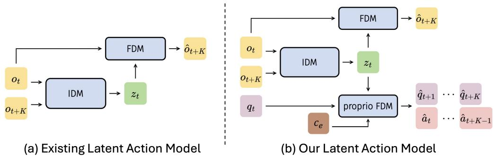  

Figure 1: (a) A standard Latent Action Model (LAM) learns a latent action $z _ { t }$ primarily through visual reconstruction, predicting a future frame $\hat { o } _ { t + K }$ from the current frame $o _ { t }$ and latent action $z _ { t }$ (b) Our proposed model enhances this by adding a proprio-FDM. This auxiliary module predicts future robot states $\widehat { q } _ { t + 1 : t + K }$ and actions $\hat { a } _ { t : t + K - 1 }$ conditioned on an embodiment context $c _ { e , \tiny { \mathscr { C } } }$ enabling the latent actions to be better grounded in physical dynamics.

我们在多种环境中对 villa-X 进行了全面评估。实验结果得出了两个关键发现。首先，广泛的消融研究确认我们提出的潜在动作模型和策略架构的改进优于现有方法。其次，我们展示了通过规模化预训练，潜在动作专家有效地进行未来规划，并对未见的体现和开放词汇符号图标实现零-shot 泛化。总体而言，villa-X 在各种任务中达到了最先进的性能，包括 SIMPLER 中大量仿真任务和两个真实世界设置，涉及多种机器人平台，配备夹持器和灵巧手操纵器。这为该领域未来的研究奠定了坚实的基础。总的来说，我们的主要贡献如下：• 我们通过引入额外的自我动力学习模型（FDM），改善潜在动作学习，使潜在动作与底层机器人状态和动作对齐，从而基于物理动态进行有效的建模。• 我们提出通过策略模型中的联合扩散共同学习潜在动作专家和机器人动作专家，将机器人动作预测条件化于潜在动作，以充分挖掘它们的潜力。 通过规模化的预训练，我们的潜在动作专家发展了强大的零-shot 泛化能力。这使得知识能够在多种仿真环境和真实世界机器人任务中有效转移，从而带来更优越的性能。

# 2 相关工作

视觉-语言-动作模型 视觉-语言-动作（VLA）模型利用预训练的视觉-语言模型（VLM）通过视觉和语言线索生成机器人动作。这些模型可以直接重用VLM进行动作预测，或者使用动作专家将VLM输出映射到机器人动作。虽然在像Open XEmbodiment这样的规模庞大的数据集上进行训练可以增强VLA的泛化能力，但由于机器人设置和配置的多样性，跨身体间泛化仍然是一大挑战。利用带有伪标签的无标记轨迹数据，如潜在动作、语言子目标或视觉子目标，有助于克服这些挑战。我们的方法通过增强潜在动作的建模以及将其整合到VLA的预训练中，推动了潜在动作框架的发展。

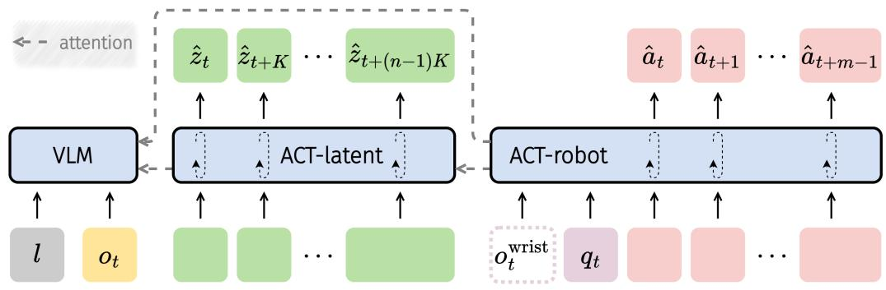  

Figure 2: Architecture of ACT: A hierarchical policy that predicts latent action plans and conditions robot action generation on them, incorporating embodiment context and attention masking.

对潜在动作的建模用于 VLA 预训练 最近对潜在动作的探索始于 LAPO 和 Genie，主要集中在视频游戏领域。Dynamo 采用了类似的架构，使用逆向和前向动力学模型来塑造状态表示。

在机器人学习领域，方法开始将潜在动作纳入VLA预训练 [1, 7, 9, 10, 38, 50, 66, 68]。LAPA [68] 提出了从视频中学习的方案，利用人类或机器人视频数据训练其潜在动作和视觉-语言模型（VLM）。与此同时，IGOR [9] 从混合的人类和机器人视频中学习潜在动作，标志着潜在动作在人与机器人之间成功转移的首次尝试。Moto-GPT [10] 同时微调潜在动作和机器人动作标签。GR00T [50] 将潜在动作视为一种独特的表现形式，而Go-1 [1] 则根据离散潜在词元生成机器人动作。UniVLA [7] 提出了一个两阶段的训练流程，用于学习以任务为中心的潜在动作。像Liang等人 [38] 和Yang等人 [66] 提出的较新研究探讨了连续潜在动作。[69] 对学习到的潜在动作进行了分析，而LAOM [49] 则利用监督学习潜在动作，从而使其在MuJoCo环境中对干扰因素具有鲁棒性。相比之下，我们的方法通过联合扩散过程共同建模潜在动作和机器人动作，将机器人动作生成条件于潜在动作，以实现更有效和结构化的信息传递。我们的方法在几个关键方面改进了先前的工作：它提供了比LAPA [68] 和 GR00T [50] 更紧密的集成；它纳入了即时视觉上下文，而Moto-GPT [10]则没有；它避免了Go-1 [1] 中出现的教师强迫一致性问题。这些优势共同促进了在测试时更强的推理能力。

# 3 方法

我们的方法，villa $\cdot \mathtt{X}$，学习一个基于物理的潜在动作空间，并利用它来训练一个 VLA 策略。该框架包含两个部分：(i) 潜在动作模型（LAM）从一对观察中推断潜在动作，并通过额外的自我感知监督将这些潜在动作与机器人动态对齐。(ii) ACTor 模块（ACT）基于一个预训练的视觉-语言主干网络，联合建模潜在动作和机器人动作的序列，以改善规划和控制。训练过程分为三个阶段：(i) 在多样化数据集上进行 LAM 预训练，(ii) 通过联合潜在机器人建模进行 ACT 预训练，以及 (iii) 特定于实体的微调。

# 3.1 潜在行动模型（LAM）

潜在动作提供了紧凑的中间表示，使得可以利用丰富的人类视频，并改善跨体生成的泛化能力[10, 68]。之前的研究通常通过两个模块学习潜在动作的量化代码本：逆动力学模型（IDM）和视觉前向动力学模型（FDM）。IDM 从帧对 $\left( o _ { t } , o _ { t + K } \right)$ 预测一个潜在标记 $z _ { t }$ ，而 FDM 则从 $\left( o _ { t } , z _ { t } \right)$ 重建未来观察 $\hat { o } _ { t + K }$ ：

$$
\boldsymbol z _ { t } = \mathrm { I D M } ( \boldsymbol o _ { t } , \boldsymbol o _ { t + K } ) , \quad \hat { \boldsymbol o } _ { t + K } = \mathrm { F D M } ( \boldsymbol o _ { t } , \boldsymbol z _ { t } ) .
$$

该目标确保视觉变化的一致性，但忽略了物理动态，当机器人状态可用时，产生的潜变量缺乏足够的基础。为了应对这一问题，我们引入了一个额外的本体前向动力学模型（proprio-FDM），该模型基于当前状态 $q _ { t }$ 和潜变量 $z _ { t }$ 预测未来 $K$ 步的机器人状态和动作。

$$
\begin{array} { r } { ( \hat { q } _ { t + 1 } , . . . , \hat { q } _ { t + K } , \hat { a } _ { t + 1 } , . . . , \hat { a } _ { t + K } ) = \mathrm { p r o p r i o - F D M } ( q _ { t } , z _ { t } , c _ { e } ) , } \end{array}
$$

其中 $c _ { e }$ 表示下面描述的体现上下文。联合优化视觉和本体感知预测鼓励潜在词元突出物理动态与视觉变化。澄清异质体现。大规模数据集混合了形态和控制频率不同的体现。简单地将本体-FDM 条件化为 $\left( q _ { t } , z _ { t } \right)$ 可能会导致潜在表示中编码体现特定的特征。我们引入了一个上下文向量 $c _ { e }$，包括：

$$
c _ { e } = f ( \mathrm { d a t a s e t I D } , \mathrm { c o n t r o l ~ f r e q u e n c y } ) ,
$$

数据集 ID 被映射到可学习的嵌入，频率通过经过 MLP 的正弦特征进行编码。这些嵌入与 $q _ { t }$ 连接，使得 proprio-FDM 能够分离特定于体现的动态，同时保持跨数据集的潜在动作一致性。因此，完整的 LAM 同时优化图像重建损失、感知预测损失和向量量化承诺。对于缺乏 proprio 标签的人类视频，省略了 proprio 项。最后，我们采用来自 VQ 代码簿中心的连续向量作为我们的潜在动作。有关进一步实现细节，请参阅附录 A。总之，我们的 LAM 扩展了先前的潜在动作模型，不仅限于压缩视觉变化，该框架是通用的，替代结构线索，如末端执行器关键点检测或人手姿态估计，可以替换低级状态，这一点我们留待未来探索。

# 3.2 智能体模块 (ACT)

我们的ACT模块通过显式建模提示动作$( z _ { t : t + ( n - 1 ) K } ^ { K } = ( z _ { t } , z _ { t + K } , . . . , z _ { t + ( n - 1 ) K } ) )$和机器人动作$( a _ { t : t + m - 1 } = ( a _ { t } , a _ { t + 1 } , . . . , a _ { t + m - 1 } ) )$，扩展了传统的视觉-语言-行动(VLA)方法，使用联合扩散过程。我们将策略分解为两个条件分布：

$$
\begin{array} { r l } & { \pi ( a _ { t : t + m - 1 } , z _ { t : t + ( n - 1 ) K } ^ { K } \mid o _ { t } , l , q _ { t } , c _ { e } ) = \underbrace { \pi _ { \mathrm { r o b o t } } \big ( a _ { t : t + m - 1 } \mid z _ { t : t + ( n - 1 ) K } ^ { K } , o _ { t } , l , q _ { t } , c _ { e } \big ) } _ { \mathrm { A C T - r o b o t } } } \\ & { \quad \quad \quad \cdot \underbrace { \pi _ { \mathrm { l a t e n t } } \big ( z _ { t : t + ( n - 1 ) K } ^ { K } \mid o _ { t } , l \big ) } _ { \mathrm { A C T - r o s t } } . } \end{array}
$$

其中 $o_{t}$ 是观察，$l$ 是语言指令，$q_{t}$ 是本体状态，$c_{e}$ 是体现上下文。此外，低级策略可以选择性地结合可用的腕部摄像头输入。这样的显式建模和因式分解优于先前的方法，例如 LAPA [68]，该方法仅依赖于通过预训练权重初始化的潜在动作。相比之下，我们的方法将潜在动作视为一种独特的中级表示，连接高级视觉和语言提示与低级机器人动作，从而实现潜在动作与机器人动作之间更有效和结构化的信息传递。架构。ACT（图 2）由三个专家组成，具有块状因果注意力掩蔽：VLM：将视觉-语言输入编码为高级特征。• ACT-latent：潜在动作专家，预测中级规划的潜在动作词元，依赖于 VLM 特征。• ACT-robot：机器人动作专家，生成低级动作块，依赖于 VLM 特征、预测的潜在动作及包括本体状态和体现上下文在内的额外控制特定输入。注意力掩蔽策略。ACT 的一个关键方面是我们如何保持对潜在词元的强有力依赖，而不让策略学习简单的捷径。受到 Moto [10] 和 RDT [41] 的启发，我们采用了随机掩蔽策略。在训练过程中，我们随机掩蔽机器人动作到潜在动作的注意力。在 $50\%$ 的情况下，所有机器人到潜在的注意力均被掩蔽；否则，$50\%$ 的注意力流向潜在动作，从而提高鲁棒性。我们发现这种设计在实际应用中至关重要。联合扩散 $a_{t:t+m-1}$，对于示例 $z_{t:t+(n-1)K}^{K}$，将未来 $x_{t}$ 表示为 $O_{t}$ 。目标是训练一个网络 $v_{\tau}^{\breve{\theta}}$，以最小化流匹配损失：

$$
L _ { \tau } ( \theta ) = \mathbb { E } _ { p ( x _ { t } \mid O _ { t } ) , q ( x _ { t } ^ { \tau } \mid x _ { t } ) } \left\| v _ { \tau } ^ { \theta } ( x _ { t } ^ { \tau } , O _ { t } ) - u ( x _ { t } ^ { \tau } \mid x _ { t } ) \right\| ^ { 2 }
$$

其中 $\tau \in [ 0 , 1 ]$ 表示流匹配的时间步。在实际操作中，首先采样随机噪声 $\epsilon \sim N ( 0 , I )$ 以创建一个带噪目标 $x _ { t } ^ { \tau } = \tau x _ { t } + ( \bar { 1 } - \tau ) \epsilon$。网络 $v _ { \tau } ^ { \theta } ( x _ { t } ^ { \tau } , O _ { t } )$ 然后被训练以预测去噪向量场 $u ( x _ { t } ^ { \tau } \mid x _ { t } ) = \epsilon - x _ { t }$。在训练过程中，我们从beta分布中采样 $\tau$。值得注意的是，方程 4 中的显式分解是通过块级因果注意力实现的。

# 4 实验

在这一部分，我们旨在通过实验回答以下问题：我们改进的LAM是否学习到更高质量的潜在动作？•演员模块能否有效利用预训练的潜在动作？ 通过扩展预训练，潜在演员模块是否能够有效规划未来并在符号图标中对未见的体现和开放词汇概念进行零-shot泛化？ villa-X在模拟基准和现实世界机器人任务中与现有的VLA基线相比如何？

# 4.1 我们改进后的 LAM 是否能够学习到更高质量的潜在动作？

在本小节中，我们评估我们改进的潜在动作建模是否提高了学习到的潜在动作的质量。我们潜在动作模型的关键组成部分是引入了本体 FDM 模块。为了评估它的影响，我们将我们的模型（记为 ${ \tt w } / { \tt p p }$）与不包含本体 FDM 模块的变体（记为 wo/pp）进行比较。探测 首先，潜在动作的核心期望是它们应携带对预测低级机器人动作有用的信息。为了测试这一点，我们进行了一项探测实验。具体来说，在训练潜在动作模型后，我们将其冻结，并训练一个简单的三层 MLP 来预测每个潜在动作对应的机器人动作。探测是在 LIBERO 数据集 [39] 上进行的，该数据集未用于训练潜在动作模型。我们在 LIBERO 的训练集中训练 MLP，并在验证集中使用 L1 损失进行评估。我们关注的是预测动作与真实标注数据之间的匹配程度。在 LIBERO 中，机器人动作空间有八个维度：三个用于位置，四个用于旋转，一个用于夹持器。我们并不通过对各个维度的误差进行平均来评估，而是专注于所有动作维度中的最大 L1 误差，因为我们希望避免在动作的任何单一方面出现较大的偏差。对于每个模型变体 $\mathtt { ( w / p p }$ 和 $\boldsymbol { \mathsf { w o } } / \boldsymbol { \mathsf { p p } }$)，我们计算最大 L1 误差低于特定阈值的验证样本数量。通过调整这个阈值，我们统计每个误差区间内的样本数量。一个更好的模型应产生更多低误差的样本。

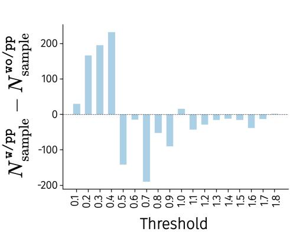  

Figure 3: Probing experiment results.

Table 1: Evaluation results on SIMPLER for different variants of our villa-X(top group) and alternative approaches for incorporating latent actions (bottom group). "Ours" refers to the $\mathtt { w } / \mathtt { p p }$ described in the main text.   

<table><tr><td rowspan="2">Method</td><td colspan="4">Google robot</td><td colspan="5">WidowX robot</td></tr><tr><td>Pick</td><td>Move</td><td>Drawer</td><td>Avg.</td><td>Carrot</td><td>Eggplant</td><td>Spoon</td><td>Cube</td><td>Avg.</td></tr><tr><td>Ours</td><td>81.7</td><td>55.4</td><td>38.4</td><td>58.5</td><td>24.2</td><td>71.7</td><td>48.3</td><td>19.2</td><td>40.8</td></tr><tr><td>wo/pp</td><td>77.0</td><td>52.7</td><td>42.6</td><td>57.4</td><td>22.5</td><td>57.5</td><td>43.3</td><td>5.9</td><td>32.3</td></tr><tr><td>wO/LAM</td><td>42.1</td><td>24.6</td><td>38.4</td><td>35.0</td><td>25.8</td><td>60.8</td><td>36.7</td><td>9.2</td><td>33.1</td></tr><tr><td>LAPA-style</td><td>64.7</td><td>28.8</td><td>38.0</td><td>43.8</td><td>0.8</td><td>0.0</td><td>2.5</td><td>0.8</td><td>1.0</td></tr><tr><td>Go-1-style</td><td>29.0</td><td>38.0</td><td>31.3</td><td>32.8</td><td>5.8</td><td>50.8</td><td>1.7</td><td>1.0</td><td>14.8</td></tr></table>

对于每个错误区间，我们计算了 $\mathtt { w } / \mathtt { p p }$ 和 $\boldsymbol { \mathrm { { w o } } } / \boldsymbol { \mathrm { { p p } } }$ 变体之间样本数量的差异，并在图 3 中展示了结果。$\mathtt { w } / \mathtt { p p }$ 变体产生了更多具有较小错误的样本，而 $\boldsymbol { \mathrm { { w o } } } / \boldsymbol { \mathrm { { p p } } }$ 变体在高错误区间中有更多样本。这证明了自适应FDM模块在捕捉机器人动作信息方面的有效性。我们进一步可视化学习到的潜在动作，并对 LAM 进行更多消融实验。更多细节请参见附录 D。

策略预训练接下来，我们比较了不同变体的LAM $\mathtt { ( w / p p }$ 和 $\mathtt { w o / p p ) }$ 生成的潜在动作如何影响策略预训练。与主要实验不同，我们在这一部分中预训练模型，使用 $10\%$ Fractal [5] 数据、 $10\%$ Bridge V2 [17] 数据和 $100\%$ Something-Something V2 [19] 数据的混合，以减少计算成本，同时保持一个有限机器人数据可用于训练VLA模型的设置。所得到的策略在SIMPLER环境 [32] 中进行评估，该环境是一个专门设计的仿真基准，用以减小仿真与现实机器人环境之间的差距。它包含两个平台：具有三项操作任务的Google机器人和具有四项任务的WidowX机器人。我们在视觉匹配设置下评估我们的方法。结果总结在表1中。我们观察到 $\mathtt { w } / \mathtt { p p }$ 明显优于 $\mathtt { w o } / \mathtt { p p }$，证明了结合本体感知FDM模块的有效性。此外，我们还包括一个不使用潜在动作的基线（标记为 $\mathtt { w o / LAM }$），该基线仅用于预测机器人动作。 $\mathtt { w o / LAM }$ 的表现显著较差，表明使用潜在动作进行预训练是必不可少的。

# 4.2 演员模块能否有效利用预训练的潜在动作？

基于高质量的由预训练LAM生成的潜在动作，我们研究了我们的设计是否能够有效利用这些潜在动作来预训练机器人控制策略。我们将我们的方法与两种最近的方法进行了比较，这两种方法同样利用潜在动作，但方式不同：LAPA [68] 和 GO-1 [1]。为了隔离潜在动作整合方式的影响，我们基于我们的架构实现了LAPA风格和GO-1风格的模型，以便进行公平比较。对于LAPA风格模型，我们遵循两阶段的预训练协议：首先训练VLM预测潜在动作，然后用机器人动作预测头替换潜在动作预测头，并继续在带有机器人动作标签的数据上进行训练。对于GO-1风格模型，我们实现了一个单独的潜在规划器，该规划器自回归地预测潜在动作。机器人动作预测组件在我们的主要设计中基本保持不变。根据上一小节中的实验设置，我们在相同的数据集混合上训练所有模型，然后在SIMPLER环境 [32] 中评估生成的策略。结果如表1所示。与其他两种方法相比，我们的方法表现显著更高，验证了我们设计在将潜在动作融入VLA预训练中的有效性。有关策略设计的更多消融研究请参见附录F。

# 4.3 潜在演员模块的零-shot泛化

为了评估 ACT-latent 在规划中的零样本泛化能力，我们进行了一项现实世界可视化实验，重点关注其处理新形态和理解新颖开放词汇符号的能力。对于形态泛化，我们使用了一款 Realman 机器人手臂，这是一种在训练期间从未见过的新形态。为了评估开放词汇泛化，我们设计了一套符号卡，测试模型理解通常在标准机器人数据集中缺失的概念的能力。

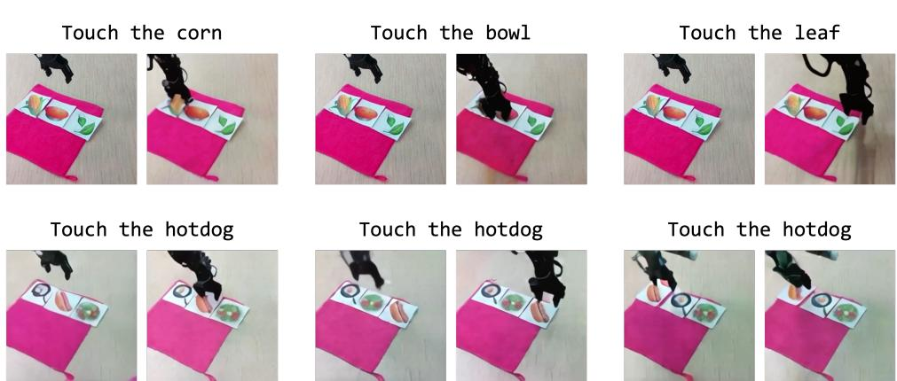  

Figure 4: Visualization of zero-shot latent plans on an unsen embodiment. Each pair of images shows the starting frame (left) and the ending frame (right), with the instruction displayed above.

评估过程如下：给定一张起始图像和一个语言指令（例如，“触摸玉米”），ACT-latent 首先生成一系列潜在动作。然后，使用单独训练的世界模型将该序列渲染为视频，从而验证计划的有效性。如图 4 所示，渲染的轨迹确认模型成功生成了遵循指令的潜在计划。这些结果突出了我们方法的两个关键能力：体现泛化：ACT-latent 成功识别并控制这个未见过的机器人手臂，表明其学习到的知识具有体现无关性，并可以轻松转移到新的机器人平台上。•开放词汇理解：模型与符号概念的正确互动能力表明 villa-X 在预训练后保留了原始视觉语言模型（VLM）的一般视觉语言能力。更多可视化内容可以在附录 E 中找到。为了评估 villa-X 如何有效利用这些知识，我们将在接下来的部分中测量其在各种控制任务上的成功率。

# 4.4 在模拟中评估 villa-X

基准和实验设置 我们使用上述描述的SIMPLER基准。在本节中，我们与几类先前的工作进行比较： •视觉-语言-动作（VLA）模型：RT-1-X [12]、Octo-base [52]、OpenVLA [29]、RoboVLMs [34]、$\pi _ { 0 }$ [4]、$\pi _ { 0 }$ -FAST [54]、OpenVLA-OFT [30]，这些模型仅从混合机器人数据集中学习策略。 •联合策略学习和世界建模方法：GR00T-N1.5 [51]，该方法将模型与目标未来嵌入对齐。视觉轨迹方法：TraceVLA [71]、Magma [67]，这些方法通过从视频中提取的视觉轨迹学习规划。 •基于潜在动作的方法：MoTo [10]和LAPA [68]，这些方法通过推断潜在动作进一步利用未标记的视频。除非另有说明 $( \ast )$，所有模型遵循两阶段的预训练-微调协议，包括在大规模混合数据上的通用预训练阶段，然后在特定体现的数据集上进行微调。我们还包括一个消融实验（我们的模型不含潜在）去除我们的潜在动作专家，同时保持所有其他组件不变。基准分数引用自其原始出版物或其他相关文献，缺失的条目标记为N/A。

Table 2: Comparison on SIMPLER of vil1a-X and existing methods. Methods marked with $^ *$ are evaludataset.   

<table><tr><td rowspan="2">Method</td><td colspan="4">Google Robot</td><td colspan="5">WidowX Robot</td></tr><tr><td>Pick</td><td>Move</td><td>Drawer</td><td>Avg.</td><td>Carrot</td><td>Eggplant</td><td>Spoon</td><td>Cube</td><td>Avg..</td></tr><tr><td>RT-1-X *</td><td>56.7</td><td>31.7</td><td>59.7</td><td>49.4</td><td>4.2</td><td>0.0</td><td>0.0</td><td>0.0</td><td>1.1</td></tr><tr><td>Octo-base *</td><td>17.0</td><td>4.2</td><td>22.7</td><td>14.6</td><td>8.3</td><td>43.1</td><td>12.5</td><td>0.0</td><td>16.0</td></tr><tr><td>OpenVLA *</td><td>16.3</td><td>46.2</td><td>35.6</td><td>32.7</td><td>0.0</td><td>4.1</td><td>0.0</td><td>0.0</td><td>1.0</td></tr><tr><td>RoboVLMs *</td><td>72.7</td><td>66.3</td><td>26.8</td><td>55.3</td><td>25.0</td><td>0.0</td><td>20.8</td><td>8.3</td><td>13.5</td></tr><tr><td>RoboVLMs</td><td>77.3</td><td>61.7</td><td>43.5</td><td>60.8</td><td>20.8</td><td>79.2</td><td>45.8</td><td>4.2</td><td>37.5</td></tr><tr><td>π0</td><td>72.7</td><td>65.3</td><td>38.3</td><td>58.7</td><td>0.0</td><td>62.5</td><td>29.1</td><td>16.6</td><td>27.1</td></tr><tr><td>π0-FAST</td><td>75.3</td><td>67.5</td><td>42.9</td><td>61.9</td><td>21.9</td><td>66.6</td><td>29.1</td><td>10.8</td><td>32.1</td></tr><tr><td>OpenVLA-OFT</td><td>72.3</td><td>69.6</td><td>47.2</td><td>63.0</td><td>4.2</td><td>N/A</td><td>12.5</td><td>8.3</td><td>N/A</td></tr><tr><td>GRO0T-N1.5</td><td>69.3</td><td>68.7</td><td>35.8</td><td>57.9</td><td>54.3</td><td>61.3</td><td>75.3</td><td>57.0</td><td>62.0</td></tr><tr><td>TraceVLA</td><td>45.0</td><td>63.8</td><td>63.1</td><td>57.3</td><td>16.6</td><td>65.0</td><td>12.5</td><td>16.6</td><td>27.7</td></tr><tr><td>Magma</td><td>75.0</td><td>53.0</td><td>58.9</td><td>62.3</td><td>29.2</td><td>91.7</td><td>37.5</td><td>20.8</td><td>44.8</td></tr><tr><td>MoTo</td><td>74.0</td><td>60.4</td><td>43.1</td><td>59.2</td><td>N/A</td><td>N/A</td><td>N/A</td><td>N/A</td><td>N/A</td></tr><tr><td>LAPA</td><td>N/A</td><td>N/A</td><td>N/A</td><td>N/A</td><td>45.8</td><td>58.3</td><td>70.8</td><td>54.2</td><td>57.3</td></tr><tr><td>Ours w/o latent</td><td>56.3</td><td>25.8</td><td>27.3</td><td>36.5</td><td>31.3</td><td>74.6</td><td>61.7</td><td>28.3</td><td>49.0</td></tr><tr><td>Ours</td><td>98.7</td><td>75.0</td><td>59.3</td><td>77.7</td><td>46.3</td><td>64.6</td><td>77.9</td><td>61.3</td><td>62.5</td></tr></table>

实验结果 表2 总结了两个平台的成功率。我们的完整模型在Google机器人上达到了最高的平均成功率（77.7%）和在WidowX机器人上（62.5%）。这一改进相较于无法利用未标记视频的VLA方法，展示了将人类视频纳入策略学习的好处。此外，我们的方法优于其他视频学习和潜在动作方法，表明我们特定的利用视频数据的机制更为有效。最后，我们的完整模型与“villaX w/o latent”消融实验之间的差距确认了潜在动作专家在实现这些增益方面是不可或缺的。

# 4.5 在实际机器人上评估 villa-X

为了评估在真实世界中的泛化能力，我们在两个平台上部署了 villaX：一个配备夹具的 Realman 机械臂和一个带有 12 自由度 XHand 的 XArm，见图 5。我们使用的是 6 自由度的 Realman RM 75 机械臂，搭配 1 自由度的 Inspire 夹具，进行微调和评估五个任务：Pick-n（将方块放入碗中）、Pick-ut（将方块从碗中取出）、Stack（将方块堆叠到另一个方块上）、Unstack（将方块从另一个方块上拆下）和 Push（将方块推到指定位置）。微调集包含 375 条遥控轨迹（每个任务 75 条）；物体布局和桌子位置固定，而物体位置则有所变化。我们进行了两个评估组：在任务评估中，我们保持与数据收集相同的桌子设置；在泛化评估中，我们改变了方块和桌布的颜色。对于每个任务，我们进行了 10 次试验，物体位置各异；不同策略下的位置和光照条件保持一致。如表 4 所示，villaX 在这两种设置下均优于所有基线。

Xarm 机器人臂与 Xhand 灵巧手 在灵巧手平台上，我们使用 Xhand，一个具有 12 自由度的灵巧手，配备五根灵活的手指，安装在一个 7 自由度的 Xarm 机器人臂上。我们在 Xhand 数据集上进行了微调，该数据集包含 4,000 条轨迹，涵盖 13 个任务类别。由于在预训练过程中未使用灵巧手数据，因此该评估能够测试体现迁移能力。我们选择了五个代表性任务——抓取与放置、立方体堆叠、杯子竖直放置、倒水和弹球。结果在表 3 中总结，分为（i）已见任务，其中对象被随机替换或添加了额外的干扰物，以及（ii）未见任务，使用未见的对象或背景。抓取与放置任务评估了 50 次运行，立方体堆叠评估了 20 次运行，其他任务评估了 10 次运行。表 3 显示我们的方法优于现有基线。

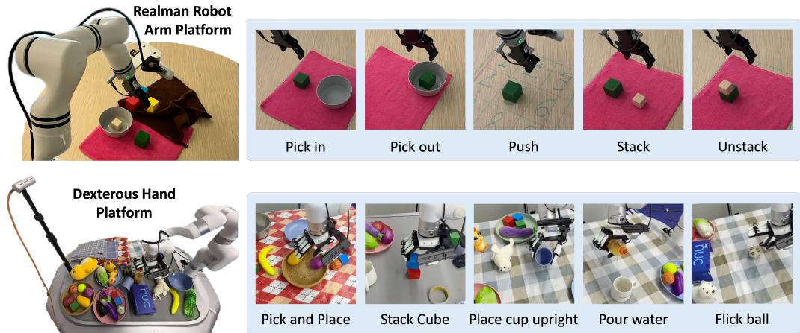  

Figure 5: Real-world robot evaluation platforms: (top) Realman robot arm platform with a gripper and (bottom) Xarm robot arm with Xhand dexterous hand. Platform setups are shown on the left, with corresponding evaluation tasks on the right.

Table 3: Evaluation on Xarm robot arm of villa-X and existing methods.   

<table><tr><td rowspan="2">Method</td><td colspan="2">Pick &amp; Place</td><td colspan="2">Stack Cube</td><td colspan="2">Place Cup Upright</td><td colspan="2">Pour Water</td><td colspan="2">Flick Ball</td></tr><tr><td>seen</td><td>unseen</td><td>seen</td><td>unseen</td><td>seen</td><td>unseen</td><td>seen</td><td>unseen</td><td>seen</td><td>unseen</td></tr><tr><td>GR-1</td><td>56</td><td>40</td><td>15</td><td>5</td><td>0</td><td>0</td><td>0</td><td>0</td><td>40</td><td>10</td></tr><tr><td>GROOT</td><td>44</td><td>28</td><td>20</td><td>0</td><td>20</td><td>0</td><td>0</td><td>0</td><td>30</td><td>0</td></tr><tr><td>Ours w/o latent</td><td>72</td><td>60</td><td>70</td><td>40</td><td>40</td><td>30</td><td>40</td><td>10</td><td>50</td><td>30</td></tr><tr><td>Ours</td><td>84</td><td>68</td><td>75</td><td>50</td><td>60</td><td>30</td><td>60</td><td>30</td><td>50</td><td>40</td></tr></table>

Table 4: Evaluation on Realman robot arm of villa-X and existing methods.   

<table><tr><td>Method</td><td>Pick in</td><td>Pick out</td><td>Push</td><td>Stack</td><td>Unstack</td><td>Change block color</td><td>Change table cover</td></tr><tr><td>GROOT</td><td>30</td><td>70</td><td>10</td><td>10</td><td>60</td><td>50</td><td>30</td></tr><tr><td>Ours w/o latent</td><td>40</td><td>80</td><td>30</td><td>60</td><td>70</td><td>40</td><td>30</td></tr><tr><td>Ours</td><td>30</td><td>100</td><td>50</td><td>50</td><td>100</td><td>60</td><td>60</td></tr></table>

# 5 结论、局限性与未来工作

在本文中，我们提出了 villa-X，这是一种新颖的视觉-语言-潜在-动作（ViLLA）框架，旨在改进潜在动作的学习及其在 VLA 预训练中的融入。我们的实验表明，增强的潜在动作模型学习到的潜在动作质量更高，而改进的策略模型更有效地利用这些学习到的潜在动作。学习到的潜在动作专家甚至可以在未见过的表现形式上实现零-shot 泛化，显示出强大的泛化能力。总体而言，我们的方法在模拟环境和现实机器人任务中表现出优越的性能。一个局限性是，尽管所提出的潜在专家在通过视觉和本体状态规划进行未来规划方面有效，但在本工作中尚未得到充分探索。例如，未来的研究可以利用基础视觉-语言模型的先验知识来学习一个评判者，从而允许潜在专家生成多个样本，并拒绝那些未遵循语言指令的规划轨迹。我们将这一方面留作未来的工作，以进一步提升 ViLLA 框架的能力。

# References

[1] AgiBot-World-Contributors, Bu, Q., Cai, J, Chen, L., Cui, X., Ding, Y., Feng, S., Gao, S., He, X., H X. i S. JiY. Jig, C. Li, H. Li, J. Liu C. Liu Y. Lu Y. Luo, J., Luo, P. MY., Ni, Y.Pan, Y. g, J. Qio, Y. Ren, G.Rn, C. San J. S, Y. Shi C. Shi M. Shi M.i, C.Sg, J. W, H. W, W. Wei, D., Xie, C. Xu, G. Yan, J. Yan, C. Yag, L. Yn, S. , M., Zeng, J., Zhang, C., Zhang, Q., Zhao, B., Zhao, C., Zhao, J., and Zhu, J. Agibot world colosseo: A large-scale manipulation platform for scalable and intelligent embodied systems. arXiv preprint arXiv: 2503.06669, 2025.

[2] Belkhale, S., Cui, Y., and Sadigh, D. Hydra: Hybrid robot actions for imitation learning. arxiv, 2023.

[3] Beyer, L., Steiner, A., Pinto, A. S., Kolesnikov, A., Wang, X. Salz, D., Neumann, M., Alabdulmohsin, I., Tschannen, M., Bugliarello, E., Unterthiner, T., Keysers, D., Koppula, S., Liu, F., Grycner, A., Gritsenko, A., Houlsby, N., Kumar, M., Rong, K., Eisenschlos, J., Kabra, R., Bauer, M., Bonjak, M., Chen, X., Minderer, M. Voigtlaender, P., Bica, I., Balazevic, I., Puigcerver, J., Papalampidi, P. Henaff, O., Xiong, X., Soricut, R. Harmsen, J., and Zhai, X. Paligemma: A versatile 3b vlm for transfer, 2024. URL https://arxiv.org/abs/2407.07726.

[4] Black, K., Brown, N., Driess, D., Esmail, A., Equi, M., Finn, C., Fusai, N., Groom, L., Hausman, K., Ichter, B., Jakubczak, S. Jones, T., Ke, L., Levine, S., Li-Bell, A., Mothukuri, M. Nair, S., Pertsch, K., Shi, L. X. Taer, J.Vuog, Q. Wallig, A., Wag, H., an Zhiy U. $\pi _ { 0 }$ A vision-languageaction flow model for general robot control. arXiv preprint arXiv: 2410.24164, 2024.

[5] Brohan, A., Brown, N., Carbaal, J. Chebotar, Y., Dabis, J., Finn, C., Gopalakrishnan, K., Hausman, K. Her, A., Hsu, J. bar J., Icher, B. rpan, A., Jako,T.Jh, S.Joshi N. J.JuianR Kalashnikov, D., Kuang Y., Leal, ., Lee, K.-H. Levine, S., Lu, Y., Malla, U., Manjunath, D., Mordatch, I., Nachum, O., Parada, C., Peralta, J., Perez, E., Pertsch, K., Quiambao, J., Rao, K., Ryoo, M., Salazar, G Sanki, P.R. Sayed K. Sigh, J. Ske, S. Sone, A. Tan C. Tran, H. Vacke, V.V S. Vuong, Q., Xia, F., Xiao, T., Xu, P. Xu, S., Yu, T., and Zitkovich, B. Rt-1: Robotic transormer for real-world control at scale. Robotics: Science and Systems, 2022. doi: 10.48550/arXiv.2212.06817.

[6] Bruce, J., Dennis, M. D., Edwards, A., Parker-Holder, J., Shi, Y., Hughes, E., Lai, M., Mavalankar, A., Steigerwald, R., Apps, C., et al. Genie: Generative interactive environments. In Forty-first International Conference on Machine Learning, 2024.

[7] Bu, Q., Yang, Y., Cai, J., Gao, S. Ren, G., Yao, M., Luo, P., and Li, H. Univla: Learning to act anywhere with task-centric latent actions, 2025. URL https : //arxiv . org/abs/2505. 06111.

[8] Chen, L. Y., Adebola, S., and Goldberg, K. Berkeley UR5 demonstration dataset. https : / /sites google.com/view/berkeley-ur5/home.

[9] Chen, X., Guo, J., He, T., Zhang, C., Zhang, P., Yang, D. C., Zhao, L., and Bian, J. Igor: Image-goal representations are the atomic control units for foundation models in embodied ai. arXiv preprint arXiv:2411.00785, 2024.

[10] Chen, Y., Ge, Y., Li, Y., Ge, Y., Ding, M., Shan, Y., and Liu, X. Moto: Latent motion token as the bridging language for robot manipulation. arXiv preprint arXiv: 2412.04445, 2024.

[11] Chi, C., Xu, Z., Feng, S., Cousineau, E., Du, Y., Burchfiel, B., Tedrake, R., and Song, S. Diffusion policy: Visuomotor policy learning via action diffusion. The International Journal of Robotics Research, pp. 02783649241273668, 2023.

12]Collaboration, O. X.-E., O'Neill, A., Rehman, A., Maddukuri, A., Gupta, A., Padalkar, A., Lee, A., Pooley, A., Gupta, A., Mandlekar, A., Jain, A., Tung, A., Bewley, A., Herzog, A., Irpan, A., Khazatsky, A., Rai, A., Gupta, A., Wang, A., Kolobov, A., Singh, A., Garg, A., Kembhavi, A., Xie, A., Brohan, A., Raffin, A., Sharma, A., Yavary, A., Jain, A., Balakrishna, A., Wahid, A., Burgess-Limerick, B., Kim, B., Schölkopf, B. Wulfe, B., Ichter, B., Lu, C., Xu, C., Le, C., Finn, C., Wang, C., Xu, C., Chi, C., Huang, C., Chan, C., Agia, C., Pan, C., Fu, C., Devin, C., Xu, D., Morton, D., Driess, D., Chen, D., Pathak, D., Shah, D., Büchler, D., Jayaraman, D., Kalashnikov, D., Sadigh, D., Johns, E., Foster, E. Liu, F. Ceola, F., Xia, F. Zhao, F. Frujeri, F. V. Stulp, F. Zhou, G. Sukhatme, G. S. Salhotra, G., Yan, G., Feng, G., Schiavi, G., Berseth, G., Kahn, G., Yang, G., Wang, G., Su, H., Fang, H.-S., Shi, H., Bao, H., Amor, H. B., Christensen, H. I., Furuta, H., Walke, H., Fang, H., Ha, H., Mordatch, I.,

Radoavovic, ., Leal, I., Liang, J. Abou-Chakra, J., Kim, J., Drake, J., Peters, J., Schder, J., Hs, J., J.  J. Wu, J ao, J. Hu, J. Wu, J. Wu, J un, J. uo, J. u, J. Tan, J, Oh, JWu, J. Lu, J.,Yang, J. Malik, J. Silvéio, J., Heja, J., Ber, J. T, J.,Yang, J., Salvor, J. Li, J. J., Han, J., Wang, K., Rao, K., Pertsch, K., Hausman, K., Go, K., Gopalakrishnan, K., Goldberg, K., Byrne, K., Oslund, K., Kawaharazuka, K., Black, K., Lin, K., Zhang, K., Ehsani, K., Lekkala, K., Ellis, K., Rana, K., Srinivasan, K., Fang, K. Singh, K. P., Zeng, K.-H., Hatch, K., Hsu, K.,Itti, L., Chen, L Y., Pinto, L., Fei-Fei, L, Tan, L., Fan, L. J. Ott, L., Lee, L., Weihs, L. Chen, M., Lepert, M. Memmel M., Ta, M., It, M. Caso, M.G. So, M. Du, M., Ahn, M. Yip M. C. Zh M., , M., Heo, M., Srirama, M. K., Sharma, M., Kim, M. J., Kanazawa, N., Hansen, N., Heess, N., Joshi, N. J. Suenderhauf, N., Liu, N., Palo, N. D., Shafiullah, N. M. M., Mees, O., Kroemer, O., Bastani, O. Sanketi, P. R., Miller, P. T., Yin, P., Wohlhart, P., Xu, P. Fagan, P. D., Mitrano, P., Sermanet, P., Abbeel, P., Sundaresan, P., Chen, Q., Vuong, Q., Rafailov, R., Tian, R., Doshi, R., Martin-Martin, R., Baijal, R., Scalise, R., Hendrix, R., Lin, R., Qian, R., Zhang, R., Mendonca, R., Shah, R., Hoque, R., Julian, R., Bustamante, S., Kirmani, S., Levine, S., Lin, S., Moore, S. Bahl, S., Dass, S., Sonawani, S., Song, S., Xu, S., Haldar, S., Karamcheti, S., Adebola, S., Guist, S., Nasiriany, S., Schaal, S., Welker, S. Tian, S., Ramamoorthy, S., Dasari, S., Belkhale, S., Park, S., Nair, S., Mirchandani, S., Osa, T., Gupta, T., Harada, T., Matsushima, T. Xiao, T. Kollar, T., Yu, T., Ding, T., Davchev, T. Zhao, T. Z., Armstrong, T. Darrell, T. Chu, T., Jain, V., Vanhoucke, V., Zhan, W. Zhou, W. Burgard, W.Chen, X. Chen, X., Wang, X., Zhu, X., Geng, X., Liu, X., Liaei, X., Li, X., Pan, Y. Lu, Y., Ma, Y. J., Kim, Y. Cr, Y. Z Y. Zhu, Y. Wu,Y. Xu, Y. Wa,Y. Bisk Y. Do,Y. Cho, Y. Lee, Y.iY., C Y. Wu,Y.H. TaY. Zhu Y. ZY.Jia Y., Li Y. Li Y. I Y.M Y. MZ., Xu, Z., Cui, Z. J., Zhang, Z., Fu, Z., and Lin, Z. Open X-Embodiment: Robotic learning datasets and RT-X models. https://arxiv.org/abs/2310.08864, 2023.   
[13] Cui, Z. J., Wang, Y., Shafiullah, N. M. M., and Pinto, L. From play to policy: Conditional behavior generation from uncurated robot data. arXiv preprint arXiv:2210.10047, 2022.   
.  H. for visuo-motor control. In Globersons, A., Mackey, L., Belgrave, D., Fan, A., Paquet, U., Tomczak, J. M., and Zhang, C. (eds.), Advances in Neural Information Processing Systems 38: Annual Conference on Neural Information Processing Systems 2024, NeurIPS 2024, Vancouver, BC, Canada, December 10 - 15, 2024, 2024. URL http://papers.nips.cc/paper_files/paper/2024/hash/ 3b8db54b629e00537b59cbc6612026d7-Abstract-Conference.html.   
[15] Damen, D., Doughty, H., Farinella, G. M., Fidler, S., Furnari, A., Kazakos, E., Moltisanti, D., Muro, J. Perrett, T., Price, W., et al. The epic-kitchens dataset: Collection, challenges and baselines. IEEE Transactions on Pattern Analysis and Machine Intelligence, 43(11):41254141, 2020.   
[6 Dass, S., Yapeter, J., Zhang, J., Zhang, J., Pertsch, K., Nikolaidis, S., and Lim, J. J. CLVR jacoply dataset,2023. URL https://github.com/clvrai/clvr_jaco_play_dataset.   
[7]Ebert, F., Yang, Y., Schmeckpeper, K., Bucher, B. Georgakis, G., Danilidis, K., Finn, C., and Levine, S. Bridge data: Boosting generalization of robotic skills with cross-domain datasets. arXiv preprint arXiv:2109.13396, 2021.   
[8 Fang, H.-S., Fang, H., Tang, Z., Liu, J. Wang, J., Zhu, H., and Lu, C. Rh20t: A robotic ataset for learning diverse skil in ne-hot. In R 03 Workshop on Learning or ask and Motion Plai, 2023.   
[19] Goyal, R., Ebrahimi Kahou, S., Michalski, V., Materzynska, J., Westphal, S., Kim, H., Haenel, V., Fruend, I., Yianilos, P., Mueller-Freitag, M., Hoppe, F., Thurau, C., Bax, I., and Memisevic, R. The "something something" video database for learning and evaluating visual common sense. In Proceedings of the IEEE International Conference on Computer Vision (ICCV), Oct 2017.   
[20] Goyal, R., Kahou, S. E., Michalski, V., Materzyska, J., Westphal, S., Kim, H., Haenel, V., Fruend, I, . something" video database for learning and evaluating visual common sense, 2017. URL https : //arxiv.org/abs/1706.04261.   
[1] Grauman, K., Westbury, A., Byrne, E., Chavis, Z., urari, A., Girdhar, R., Hamburger, J., Jia, H., L M. Li X. ar M. N, . Rvic, I.n S. K. yn F Sh J

Wray, M. Xu, M. Xu, E. Z., Zhao, C. Bansal, S. Batra, D., Cartillier, V. Crane, S. Do, T. Doulaty, M., Erapalli, A., Feichtenhofer, C., Fragomeni, A., Fu, Q., Fuegen, C., Gebreselasie, A., Gonzalez, C., Hillis, J., Huang, X., Huang, Y., Jia, W., Khoo, W., Kolar, J., Kottur, S., Kumar, A., Landini, F., Li, C., Li, Y., Li, Z., Mangalam, K., Modhugu, R., Munro, J., Murrell, T., Nishiyasu, T., Price, W., Puentes, P. R., Ramazanova, M., Sari, L., Somasundaram, K., Southerland, A., Sugano, Y., Tao, R., Vo, M., Wan, Y., Wu, X., Yagi, T. Zhu, Y., Arbelaez, P. Crandall, D. Damen, D., Farinella, G. M., Ghanem, B. Ithapu, V. K., Jawahar, C. V., Joo, H., Kitani, K., Li, H., Newcombe, R., Oliva, A., Park, H. S., Rehg, J. M., Sato, Y. Shi, J. Shou, M. Z., Torralba, A., Torreani, L., Yan, M., and Malik, J. Ego4d: Arud the World in 3,000 Hours of Egocentric Video. In IEEE/CVF Computer Vision and Pattern Recognition (CVPR), 2022.

[2] Grauman, K., Westbury, A., Byrne, E., Chavis, Z., Furnari, A., Girdhar, R., Hamburger, J., Jiang, H., L, M., Liu, X., et al. Ego4d: Arod the world in 3,0hours of entriideo. In Proi o the IEEE/CVF Conference on Computer Vision and Pattern Recognition, pp. 1899519012, 2022.

[23] He, K., Zhang, X., Ren, S., and Sun, J. Deep residual learning for image recognition, 2015. URL https://arxiv.org/abs/1512.03385.

[24] Heo, M., Lee, Y., Lee, D., and Lim, J. J. Furniturebench: Reproducible real-world benchmark for long-horizon complex manipulation. In Robotics: Science and Systems, 2023.

[25] Hu, Y., Guo, Y., Wang, P., Chen, X., Wang, Y.-J., Zhang, J., Sreenath, K., Lu, C., and Chen, J.Vieo prediction policy: A generalist robot policy with predictive visual representations. arXiv preprint arXiv:2412.14803, 2024.

[26] Jang, E., Irpan, A., Khansari, M., Kappler, D., Ebert, F., Lynch, C., Levine, S., and Finn, C. Bc-z: Zero-shot task generalization with roboticimitation learning. In Conference onRobot Learning, pp. 9911002. PMLR, 2022.

[ Kalasnikov, D., Iran, A.,Pastr, P. ar, J., Herz, A. Jang, E. Quillen, D. Holly, E. Kaihnan, M., Vanhoucke, V., et al. Qt-opt: Scalable deep reinforcement learning for vision-based robotic manipulation. In CoRL, pp. 651673, 2018.

[28] Khazatsky, A., Pertsch, K., Nair, S., Balakrishna, A., Dasari, S., Karamcheti, S., Nasiriany, S., Srirma, M.K. Chen, L. Y. Ellis, K., Fagan, P. D., Heja, J. Ikia, M. Lepert, M. Ma, Y. J. Mille, P. T. Wu, J., Belkhale, S., Dass, S., Ha, H., Jain, A., Lee, A., Lee, Y., Memmel, M., Park, S., Radosavovic, I., Wang, K., Zhan, A., Black, K., Chi, C., Hatch, K. B., Lin, S., Lu, J., Mercat, J., Rehman, A., Sanketi, P. R., Sharma, A., Simpson, C., Vuong, Q., Walke, H. R., Wulfe, B., Xiao, T., Yang, J. H., Yavary, A., Zhao, T. Z., Agia, C., Baijal, R., Castro, M. G., Chen, D., Chen, Q., Chung, T., Drake, J., Foster, E. P., Gao, J., Herrera, D. A., Heo, M., Hsu, K., Hu, J., Jackson, D., Le, C., Li, Y., Lin, K., Lin, R., Ma, Z., Maddukuri, A., Mirchandani, S., Morton, D., Nguyen, T., O'Neill, A., Scalise, R., Seale, D., Son, V., Tan, S. Tran, E. W, A. E. Wu, Y. Xie, A.Yg, J. Yin, P. Zhg, Y. Bi O. Be, Bohg, J., Goldberg, K., Gupta, A., Gupta, A., Jayaraman, D., Lim, J. J., Malik, J., Martín-Martín, R., Ramamoorthy, S., Sadigh, D., Song, S., Wu, J., Yip, M. C., Zhu, Y., Kollar, T., Levine, S., and Fin, C. Droid: A large-scale in-the-wild robot manipulation dataset. 2024.

[29] Kim, M. J., Pertsch, K., Karamcheti, S., Xiao, T., Balakrishna, A., Nair, S., Rafailov, R., Foster, E, Lam, G., Sanketi, P., et al. Openvla: An open-source vision-language-action model. arXiv preprint arXiv:2406.09246, 2024.

[30] Kim, M. J. Finn, C., and Liang, P. Fine-tuning vision-language-action models: Optimizing speed and success. arXiv preprint arXiv:2502.19645, 2025.

[31] Li, Q., Liang, Y., Wang, Z., Luo, L., Chen, X., Liao, M. Wei, F., Deng, Y., Xu, S., Zhag, Y., et al. Cogact: A foundational vision-language-action model for synergizing cognition and action in robotic manipulation. arXiv preprint arXiv:2411.19650, 2024.

[2] Li, X., Hsu, K. Gu, J., Mees, O., Pertsch, K., Walke, H. R. Fu, C. Luwat, I., Sieh, I., Kirani, S., Levine, S., Wu, J., Finn, C., Su, H. Vuong, Q., and Xiao, T. Evaluating real-world robot manipulation policies in simulation. In Agrawal, P., Kroemer, O., and Burgard, W. (eds.), Conference on Robot Learning, 6-9 November 2024, Munich, Germany, volume 270 of Proceedings of Machine Learning Research, pp. 37053728. PMLR,2024. URL https://proceedings.mlr.press/v270/1i25c.html.

[3] Li, X., Hsu, K. Gu, J., Pertsch, K., Mees, O., Walke, H. R., Fu, C., Luwat, I., Sieh, I., Kirani, S., Levine, S., Wu, J., Finn, C., Su, H., Vuong, Q., and Xiao, T. Evaluating real-world robot manipulation policies in simulation. arXiv preprint arXiv:2405.05941, 2024.   
[34] Li, X., Li, P., Liu, M., Wang, D., Liu, J., Kang, B., Ma, X., Kong, T., Zha, H. and Liu, H. Tards galistrobot policWhatmatte  uildiisn-anguageacinmodels.Xip arXiv:2412.14058, 2024.   
[5] Li, X., Liu, M., Zha, H., Yu, C., Xu, J., Wu, H., Che, C., Jig, Y., Zha, W., Liu, H., Li, H, and Kong, T. Vision-language foundation models as effective robot imitators. In The Twelfth International Conference on Learning Representations, ICLR 2024, Vienna, Austria, May 7-11, 2024. OpenReview.net, 2024. URL https://openreview.net/forum?id $=$ lFYjOoibGR.   
[36] Li, Y., Liu, M., and Rehg, J. M. In the eye of beholder: Joint learning of gaze and actions in first person video. In Proceedings of the European conference on computer vision (ECCV), pp. 619635, 2018.   
[37] Li, Y., Cao, Z., Liang, A., Liang, B., Chen, L., Zhao, H., and Feng, C. Egocntric prediction of action target in 3d. In Proceedings of the IEEE/CVF Conference on Computer Vision and Pattern Recognition (CVPR), June 2022.   
[38] Liang, A., Czempin, P., Hong, M., Zhou, Y., Biyik, E., and Tu, S. Clam: Continuous latent action models for robot learning from unlabeled demonstrations. arXiv preprint arXiv:2505.0499, 2025.   
B. Y o, C. F Y. , Q uY  L transfer for lifelong robot learning. arXiv preprint arXiv:2306.03310, 2023.   
0  H.  . L  .  Z,   : Hautonomy and learning during deployment. In Robotics: Science and Systems (RSS), 2023.   
[1] Liu, S., Wu, L., Li, B., Tan, H., Chen, H., Wang, Z., Xu, K. Su, H., and Zhu, J. Rdt-1b: a diffon foundation model for bimanual manipulation. arXiv preprint arXiv: 2410.07864, 2024.   
[2] Liu, Y., Liu, Y., Jia, C. Lyu, K., Wan, W. She, H., Lia, B., Fu, Z., Wag, H., and Yi, L. H: A 4d egocentric dataset for category-level human-object interaction. In Proceedings of the IEEE/CVF Conference on Computer Vision and Pattern Recognition (CVPR), pp. 2101321022, June 2022.   
[3] Luo, J., Xu, C., Liu, F. Tan, L., Lin, Z. Wu, J., Abbeel, P., and Levine, S.Fmb: a uncial manipulation benchmark for generalizable robotic learning. arXiv preprint arXiv:2401.08553, 2024.   
[44] Lynch, C., Wahid, A., Tmpson, J., Ding, T., Betker, J., Baruch, R., Armstrong, T., and Florence, P. Interactive language: Talking to robots in real time. IEEE Robotics and Automation Letters, 2023.   
[45] Mees, O., Borja-Diaz, J., and Burgard, W. Grounding language with visual affordances over unstructured data. In Proceedings of the IEEE International Conference on Robotics and Automation (ICRA), London, UK, 2023.   
[46] Mendonca, R., Bahl, S., and Pathak, D. Structured world models from human videos. CoRL, 2023.   
[47] Mu, Y., Zhang, Q., Hu, M., Wang, W., Ding, M., Jin, J., Wang, B., Dai, J., Qiao, Y., and Luo, P. Embodiedgpt: Vision-language pre-training via embodied chain of thought. Advances in Neural Information Processing Systems, 36:2508125094, 2023.   
[48] Nasiriany, S., Gao, T., Mandlekar, A., and Zhu, Y. Learning and retrieval from prior data for skill-based imitation learning. In Conference on Robot Learning (CoRL), 2022.   
[49] Nikulin, A., Zisman, I., Tarasov, D., Lyubaykin, N., Polubarov, A., Kiselev, I., and Kurenkov, VLatent action learning requires supervision in the presence of distractors, 2025.URL https : //arxiv.org/abs/2502.00379.   
[50] NVIDIA, :, jorck, J., Castañeda, F., Cherniadev, N., Da, X., Ding, R., Fan, L. J., Fang, Y., Fox, D., Hu, F., Huang, S. Jang, J., Jiang Z. Kautz, J., Kualia, K., Lao, L., Li, Z., Lin, Z., Lin, K., Liu G, Lon, E. Mae, L Mkar, A. Nan, A. Nay, S., Reed, S. Tan, Y. L Wa G Wa Z. a J., Wa Q. Xia J., Xie, Y. Xu, Y. Xu, Z., Ye, S., Yu, Z. Za A., Zh H., Zhao, Y., Zheng, R., and Zhu, Y. Gr00t n1: An open foundation model for generalist humanoid robots. arXiv preprint arXiv: 2503.14734, 2025.

[51] NVIDIA, :, Bjorck, J., Castañeda, F., Cherniadev, N., Da, X., Ding, R., Fan, L. J., Fang, Y., Fox, D., Hu, F., Huang, S., Jang, J., Jiang, Z., Kautz, J., Kdalia, K., Lao, L. Li, Z., Lin, Z., Lin, K. Liu, G., Llontop, E., Magne, L., Mandlekar, A., Narayan, A., Nasiriany, S., Reed, S., Tan, Y. L., Wang, G., Wan, Z., Wang, J., Wang, Q., Xiang, J., Xie, Y., Xu, Y., Xu, Z., Ye, S., Yu, Z., Zhang, A., Zhan, H., Zhao, Y., Zheng, R., and Zhu, Y. Gr00t n1: An open foundation model for generalist humanoid robots, 2025. URL https://arxiv.org/abs/2503. 14734.

[52] Octo Model Team, Ghosh, D., Walke, H., Pertsch, K., Black, K., Mees, O., Dasari, S., Hejna, J., Xu, C. Luo, J., Krean, T. Tan, Y.Chen, L.Y. Snketi, P.Vu, Q., Xiao, T. Sadigh, D., Fin C. and Levine, S. Octo: An open-source generalist robot policy. In Proceedings of Robotics: Science and Systems, Delft, Netherlands, 2024.

[3] Pei, B. H, Y., Xu, J., hen, G. He, Y., ag, L. Wag Y. Xie, W., Qiao, Y. Wu, F,  W, L. Modeling fine-grained hand-object dynamics for egocentric video representation learning, 2025. URL https://arxiv.org/abs/2503.00986.

[54] Pertsch, K., Staowic, K., Ichter, B. Driess, D., Nair, S.Vng, Q., Mees, O., Finn, C., ndLevie, S Fast: Efficient action tokenization for vision-language-action models.arXivpreprint arXiv:2501.09747, 2025.

[55] Qu, D., Song, H., Chen, Q., Yao, Y., Ye, X., Ding, Y., Wang, Z., Gu, J., Zhao, B., Wang, D., and Li, X. Spatialvla: Exploring spatial representations for visual-language-action model, 2025. URL https://arxiv.org/abs/2501.15830.

[56] Quere, G. Hagengruber, A., Iskandar, M., Bustamante, S., Leidner, D. Stulp, F., and Vogel, J. Shared Control Templates for Assistive Robotics. In 2020 IEEE International Conference on Robotics and Automation (ICRA), pp. 7, Paris, France, 2020.

[57] Ren, A. Z. open-pi-zero: Re-implementation of $\pi _ { 0 }$ visionlanguage—action model, 2025. URL https://github.com/allenzren/open-pi-zero.

[58] Rosete-Beas, E., Mees, O., Kalweit, G., Boedecker, J., and Burgard, W. Latent plans for task agnostic offline reinforcement learning. In Proceedings of the 6th Conference on Robot Learning (CoRL), 2022.

[59] Schmidt, D. and Jiang, M. Learning to act without actions. arXiv preprint arXiv:2312.10812, 2023.

...  . HY robots home, 2023.

[61] Walke, H., Black, K., Lee, A., Kim, M. J., Du, M., Zheng, C., Zhao, T., Hansen-Estruch, P. Vu, Q., He, A., Myers, V., Fang, K., Finn, C., and Levine, S. Bridgedata v2: A dataset for robot learning at scale. In Conference on Robot Learning (CoRL), 2023.

[62] Wang, J., Zhang, Q., Chao, Y.-W., Wen, B., Guo, X., and Xiang, Y. Ho-cap: A capture system and dataset for 3d reconstruction and pose tracking of hand-object interaction, 2024. URL https : //arxiv.org/abs/2406.06843.

[63] Wang, L., Chen, X., Zhao, J., and He, K. Scaling proprioceptive-visual learning with heterogeneous pre-trained transformers. In Globerson, A., Mackey, L., Belgrave, D., Fan, A., Paquet, U., Tomczak, J., and Zhang, C. (eds.), Advances in Neural Information Processing Systems, volume 37, pp. 124420 124450. Curran Associates, Inc., 2024. URL https://proceedings.neurips.cc/paper_files/ paper/2024/file/e0f393e7980a24fd12fa6f15adfa25fb-Paper-Conference.pdf.

[64] Wang, X., Kwon, T. Rad, M., Pan, B., Chakraborty, I., Andrist, S., Bohus, D., Feniello, A., Tekin, B., Frujeri, F. V., Joshi, N., and Pollefeys, M. Holoassist: an egocentric human interaction dataset for interactive ai assistants in the real world. In Proceedings of the IEEE/CVF International Conference on Computer Vision (ICCV), pp. 2027020281, October 2023.

[65] Xu, M., Dai, W., Liu, C., Gao, X., Lin, W., Qi, G.-J., and Xiong, H. Spatial-temporal transformer networks for traffic flow forecasting. arXiv preprint arXiv: 2001.02908, 2020.

[ Yag, J., Shi, Y., Zhu, H., Liu,M., Ma, K. Wa, Y. Wu, G., He, T.,  Wag, L.C L continuous latent motion from internet videos for scalable robot learning, 2025. URL https: //arxiv.org/abs/2505.17006.

[Y J. Tan, R. Wu, Q. Z, R.Png B. L, Y. Gu, Y. Cai, M. Ye, S.Jag, J., etalM: A foundation model for multimodal ai agents. In Proceedings of the Computer Vision and Pattern Recognition Conference, pp. 1420314214, 2025.   
[8] Ye, S., Jang, J., Jeon, B., Joo, S., Yag, J., Peng, B., Malekr, A., Tan, R. Chao, Y.-W. Lin B Y., Liden, L., Lee, K., Gao, J., Zettlemoyer, L., Fox, D., and Seo, M. Latent action pretraining from videos. arXiv preprint arXiv: 2410.11758, 2024.   
[9] Zhang, C., Pearce, T., Zhang, P., Wang, K., Chen, X., Shen, W., Zhao, L., and Bian, J. What do latent action models actually learn?, 2025. URL https : //arxiv . org/abs/2506 . 15691.   
[70] Zhao, Q., Lu, Y., Kim, M. J., Fu, Z., Zha, Z., Wu, Y., Li, Z., Ma, Q., Han, S., Fin, C., Ha, A., Liu, M.-Y., Xiang, D., Wetzstein, G., and Lin, T.-Y. Cot-vla: Visual chain-of-thought reasoning for vision-language-action models. arXiv preprint arXiv: 2503.22020, 2025.   
[71] Zheng, R., Liang, Y., Huang, S., Gao, J., DauméII, H., Kolobov, A., Huang, F., and Yang, J. Tracvl: Visual trace prompting enhances spatial-temporal awareness for generalist robotic policies. arXiv preprint arXiv:2412.10345, 2024.

# A Additional Implementation Details for LAM

In this appendix, we provide extended information on the architecture, training protocols, and inference behavior for our Latent Action Model (LAM).

# A.1 Architecture Overview

Our LAM comprises four main modules:

(i)SpatialTemporal Transformer (ST-Transformer) Inverse Dynamics Model (IDM): Takes a video clip (by default, $8 \times 2 2 4 \times 2 2 4 )$ as input. We employ patch embedding with a patch size of 14 and stack 12 ST-blocks [65], each with a hidden dimension of 768 and 32 attention heads.   
(ii) Vector Quantization (VQ) Module: Maps the continuous IDM outputs to discrete latent tokens, each associated with a codebook entry. We set the codebook size to 32. While the model internally uses discrete token indices during training, the continuous codebook centers are used in downstream modules.   
(iii) Image Reconstruction Forward Dynamics Model (FDM): A 12-layer Vision Transformer (ViT)-base network that takes the current frame $o _ { t }$ and a latent action $z _ { t }$ to predict $\hat { o } _ { t + K }$ .   
(iv) Proprioceptive Forward Dynamics Model (proprio-FDM): A 2-layer MLP with dual output heads to predict future robot states $\hat { q } _ { t + i }$ and low-level robot actions $\hat { a } _ { t + i }$ This module takes the current robot state $q _ { t } ,$ the latent $z _ { t } ,$ and an embodiment context vector $\pmb { c } _ { e }$ .

Rather than predicting a single latent action per pair of frames, the ST-Transformer-based IDM processes a sequence of $T _ { \mathrm { L A M } }$ frames, resulting in $T _ { \mathrm { L A M } } - 1$ latent tokens. We use $T _ { \mathrm { L A M } } = 8$ By reconstructing future frames with the FDM and future states/actions with the proprio-FDM, the model learns a latent representation that is both visually and physically grounded.

# A.2 Training Details

We train our LAM on a combination of human egocentric data (e.g., Ego4D [21]) and robot trajectories (e.g., OpenX [12]). Samples lacking low-level robot annotations (e.g., human videos) exclude the proprioFDM branch, using only the visual FDM objective.

Hyperparameters. We use a batch size of 512 and a learning rate of $1 . 5 \times 1 0 ^ { - 4 } \ : \mathrm { ~ . ~ }$ , with a 2000-step linear warmup. Training lasts approximately 4 days on 128 NVIDIA A100 GPUs. Both the visual FDM and proprio-FDM share the same weighting in the overall loss. Throughout training, each latent token is discretized via the VQ module but is represented by its continuous codebook center in subsequent network components.

# A.3 Inference Behavior and Diagnostics

During inference, only the IDM is required to extract latent tokens from consecutive frames. The FDM and proprio-FDM are typically retained for diagnostic and visualization purposes, allowing us to examine whether the learned latent tokens accurately capture future frame content, robot states, and actions. This reconstruction-based analysis aids in understanding and debugging the physical grounding of the latent representation.

# B Additional Implementation Details for Actor Module

Our VLA model comprises three components. First, the visionlanguage encoder is based on PaliGemma [3], a 3B-parameter VLM pretrained with $2 2 4 \times 2 2 4$ images and 128-token text inputs. Second and third, the latent-action expert and the robot-action expert are each implemented as 18-layer Transformer networks, mirroring PaliGemma's design, with a hidden dimension of 1,024 and 8 attention heads. For the latent action sequence, we select a sequence length of $N = 6$ , and for the robot actions, we select a sequence length of $M = 4$ .

We extend our policy head with a variant of HPT [63], assigning each embodiment its own pair of stateand action-projection layers while sharing all other parameters. Visual features from the wrist camera are extracted by a pretrained ResNet-18 [23] and fused into the main model via a shared cross-attention head that maps the ResNet features into 16 tokens. During training, wrist-view inputs are randomly masked $5 0 \%$ of the time. We also observed that the latent-action representation can be overly exploited by the robot-action expert, so we regularize this with two complementary dropout schemes. First, we add a $5 0 \%$ attention-weight dropout on the latent-action stream. For the remaining tokens, we randomly mask $5 0 \%$ latent action tokens. This combined masking strategy encourages the model to learn robust, generalizable policy that will balance the predicted latent actions as well as the input image and instruction. During training, we sample $\tau$ from different beta distributions for latent actions and robot actions, which biases the timesteps for latent actions towards the noisier regime. Each expert contains approximately 300 M parameters and is trained from scratch. We train all components jointly using a learning rate of $5 e - 5$ with a 200-step linear warmup. We clip gradients to a maximum norm of 1.0 to ensure stable optimization. The pretraining takes 4 days on 64 NVIDIA A100 GPUs.

# C Dataset

# C.1 Data Mixture

We curated a data mixture by combining both robot data and action-free human videos for our pretraining phase. For robot data, we draw primarily from OpenX [12] mixture and AgiBot [1]. For OpenX dataset, our base data mixture is created primarily based on [29, 52]. In total, we use 1.6M trajectories with 223.5M frames of robot data. For human videos, we use a mixture of Eg04D [21], EgoPAT3D [37], EGTEA Gaze $^ +$ [36], EPIC-KITCHENS [15], HO-Cap [62], HOI4D [42], HoloAssist [64], RH20T [18], Something Something V2 [20]. Altogether, this yields 3.6M clips of human videos. During LAM pretraining, we exclusively utilize the primary third-person camera view. For policy pretraining, we optionally incorporate the wrist-mounted view (when available), applying a $5 0 \%$ dropout. A full breakdown of our data mixture is listed in Table 5.

# C.2 Data Preprocessing

For data cleaning, we adopt EgoHOD [53], a curated subset of Ego4D [21], and further filter the videos based on visual quality to ensure high-quality inputs for training. For both robot data and human videos, we apply random adjustments to brightness, contrast, saturation, and hue as data augmentation. In the case of robot data, we represent both proprioceptive states and actions using euler angles.

# D LAM visualization and More Ablations

# D.1 Image Pairs with Similar Latent Actions

Figure 6 visualizes image pairs sharing the same latent action, demonstrating that these pairs correspond to similar underlying robot behaviors.

The results demonstrate that similar latent actions represent the similar robot behaviors and low-level actions, in regardless of which embodiment (including human and different robots) is executing such action. This results support that villa-x learns cross-embodiment prior knowledge for manipulations with latent actions.

# D.2 Transfer Video Demonstrations into Robot Actions through LAM and Propric FDM

To further demonstrate the transfer ability of our LAM, we extract latent actions from videos of task demonstrations, map them to robot actions using the proprio FDM, and execute the resulting robot actions in the SIMPLER simulator.

The results are presented in Figure 7 and Figure 8. In each figure, the top row shows the video demonstrations used by LAM to extract latent actions, while the bottom row displays the corresponding SIMPLER simulation results, where real actions decoded from the latent actions using proprioceptive FDM are

<table><tr><td>Dataset</td><td>Mix Ratio (%)</td></tr><tr><td>RT-1 Robot Action [5]</td><td>9.70</td></tr><tr><td>AgiBot World Beta [1]</td><td>20.0</td></tr><tr><td>Kuka [27]</td><td>1.97</td></tr><tr><td>Bridge [17, 61]</td><td>5.47</td></tr><tr><td>Taco Play [45, 58]</td><td>0.76</td></tr><tr><td>Jaco Play [16]</td><td>0.12</td></tr><tr><td>Berkely Autolab UR5 [8]</td><td>0.31</td></tr><tr><td>Language Table [44]</td><td>0.11</td></tr><tr><td>Stanford Hydra Dataset [2]</td><td>1.61</td></tr><tr><td>NYU Franka Play Dataset [13]</td><td>0.22</td></tr><tr><td>Furniture Bench Dataset [24]</td><td>0.63</td></tr><tr><td>Austin Sailor Dataset [48]</td><td>0.57</td></tr><tr><td>Austin Sirius Dataset [40]</td><td>0.45</td></tr><tr><td>BC-Z [26]</td><td>3.47</td></tr><tr><td>DLR EDAN Shared Control [56]</td><td>0.01</td></tr><tr><td>CMU Stretch [46]</td><td>0.04</td></tr><tr><td>FMB Dataset [43]</td><td>0.73</td></tr><tr><td>DobbE [60]</td><td>0.37</td></tr><tr><td>DROID [28]</td><td>3.46</td></tr><tr><td>Ego4D [22, 53]</td><td>21.46</td></tr><tr><td>EgoPAT3D [37]</td><td>0.94</td></tr><tr><td>EGTEA Gaze+ [36]</td><td>0.89</td></tr><tr><td>EPIC-KITCHENS [15]</td><td>6.95</td></tr><tr><td>HO-Cap [62]</td><td>0.63</td></tr><tr><td>HOI4D [42]</td><td>1.99</td></tr><tr><td>HoloAssist [64]</td><td>4.77</td></tr><tr><td>RH20T [18]</td><td>5.56</td></tr><tr><td>Something-Something V2 [19]</td><td>6.82</td></tr></table>

Table 5: Our training data mixture used during the pretraining phase.

eteSpecically,Figureillustrate robot-o-robottranser andFigureillustratshuman-toro transfer. The simulated motions closely reproduce the original demonstrations, indicating that latent actions learned by villa-X are both aligned with and grounded in the robot's actions.

# D.3 More Ablations on LAM

To validate the contribution of the embodiment context in our proprio-FDM, we further conducted an ablation study comparing our full method ("Ours") against a version without the context ("Ours w/o context"). Both models were trained on 10

(1) Performance on validation dataset: We measured the reconstruction loss of visual FDM and proprio FDM on the validation set:   
Table 6: Performance comparison on the validation set.   

<table><tr><td>Method</td><td>Visual FDM loss (↓)</td><td>Proprio FDM loss (↓)</td></tr><tr><td>Ours w/o context</td><td>0.068</td><td>0.078</td></tr><tr><td>Ours</td><td>0.057</td><td>0.070</td></tr><tr><td>Relative improvement</td><td>16.2%</td><td>10.3%</td></tr></table>

(2) Zero-Shot Generalization to a Novel Embodiment: We evaluated the model on our dataset collected onour Realman obotarm dataset (rom Section 4.4), an embodim cmpletely ns durig ta. We then conducted the action probing experiment described in Section 4.1 by inferring latent actions with IDM and training a new MLP to predict robot actions from the latent actions.

The results from both experiments demonstrate that the embodiment context improves performance and aids generalization to novel embodiments. We hypothesize that while the visual FDM provides general transferability by aligning latent actions with visual changes, the proprio-FDM grounds these latent actions in robot physical dynamics. However, due to data heterogeneity (e.g., different action definitions / controllers, as discussed previously), the model requires the embodiment context to disambiguate different embodiments and learn a more consistent, grounded latent action space.

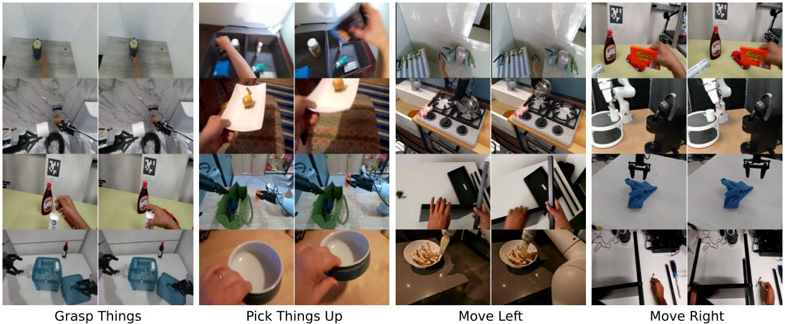  
Figure 6: Visualization of image pairs with similar latent actions.

Table 7: Zero-shot generalization to an unseen embodiment.   

<table><tr><td>Method</td><td>Probing loss (↓)</td><td></td><td></td><td>Probing loss (xyz) (↓) Probing loss (rot) (↓) Probing loss (gripper) (↓)</td></tr><tr><td>Ours w/o context</td><td>0.165</td><td>0.0675</td><td>0.00861</td><td>0.928</td></tr><tr><td>Ours</td><td>0.152</td><td>0.0574</td><td>0.00619</td><td>0.873</td></tr><tr><td>Relative improvement</td><td>7.9%</td><td>15.0%</td><td>28.1%</td><td>5.9%</td></tr></table>

# E Latent Action Expert Visualization

In this experiment, we demonstrate the performance of the latent expert by passing its prediction through the image reconstruction FDM that takes the latent action as inputs and predicts the future observations, which forms a simulated environment for the iteratively executing the latent expert.

Starting from a single initial image, the latent expert and image reconstruction FDM jointly generate different behaviors in videos that follow diverse instructions using only latent actions. We experiment with initial images from RT-1 and Bridge dataset, and show the image clips of generated videos in Figure 9 and Figure 10 with different language instructions. The results show that the latent expert properly follows the language instructions for task solving, where the latent expert properly recognizes the target objects and predict latent actions that move towards the target object.

# F More Ablations on policy model

We primarily conducted ablation studies on two main components: (1) the attention mask and (2) the embodiment context. Our experiments follow the same setting as Table 1 in the main paper. The ablation reul belwhow at boh the tenn mask  edimen cntex ar effecive npi performance on two robot platforms: Google Robot and WidowX Robot.

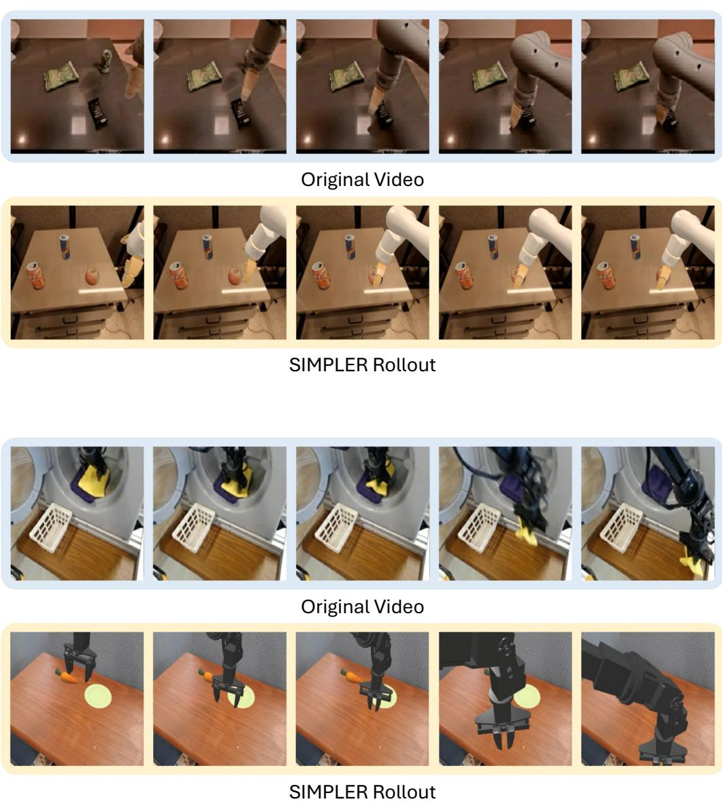  
Figure 7: Transfer robot video demonstrations into robot actions through LAM and proprio FDM in SIMPLER simulator. Upper: the SIMPLER rollout closely reproduce the motion of moving downwards, Bottom: the SIMPLER rollout closely reproduce the motion of moving right.

# G Simulation Evaluation Details

# G.1 SIMPLER Benchmark

We evaluate on all eight SIMPLER [33] tasks in the visual matching setting, which include two robot platforms: Google Robot and WidowX.

For Google Robot, the tasks are: (1) pick coke can (including horizontal, vertical and standing can configurations); (2) move an object near a target object; (3) open / close top, middle or bottom drawer; and (4) place apple in a closed drawer, which includes two subtasks: first open top drawer, and then place the apple into the top drawer. On the widowX setup, the tasks consist o: (1) put a carrot on the plate; () put an eggplant on the basket; (3) put a spoon on the towel; () stack a green cube on a yeow one.

We follow the standard evaluation protocol to test by randomizing both configurations of the environments. For the Google Robot tasks, we execute 300 trials of "Pick Coke Can", 240 of "Move Near", 216 of "Open/Close Drawer", and 108 of "Place Apple in Closed Drawer". For each WidowX task, we use 24 unique configurations. To ensure statistical significance, we test each configuration 10 times, yielding 240rollouts per task. Reported results (Table 2) are the average success rates across these trials. Please

Table 8: Ablation study results for the policy model. The first columns (Pick, Move, Drawer, Place) refer to the Google Robot, and the last columns (Carrot, Eggplant, Spoon, Cube) refer to the WidowX Robot. All numbers are success rates $( \% )$ .   

<table><tr><td>Method</td><td>Pick</td><td>Move</td><td>Drawer</td><td>Avg.</td><td>Carrot</td><td>Eggplant</td><td>Spoon</td><td>Cube</td><td>Avg.</td></tr><tr><td>Ours</td><td>81.7</td><td>55.4</td><td>38.4</td><td>58.5</td><td>24.2</td><td>71.7</td><td>48.3</td><td>19.2</td><td>40.8</td></tr><tr><td>Ours w/o mask</td><td>80.3</td><td>30.6</td><td>48.8</td><td>53.2</td><td>18.3</td><td>52.5</td><td>38.3</td><td>26.7</td><td>34.0</td></tr><tr><td>Ours w/o context</td><td>86.6</td><td>21.3</td><td>39.3</td><td>49.1</td><td>28.3</td><td>67.5</td><td>25.8</td><td>32.5</td><td>38.5</td></tr></table>

refer to SIMPLER [33] for more details.

For a fair comparison, we adopt the published performance metrics for RT-1-X [12], Octo-base [52], OpenVLA [29], RoboVLMs [34], MoTo [10], and LAPA [68] directly from their respective papers. In the case of GR00T [51], we use the official pretrained checkpoint and performe fine-tuning on the RT-1/Bridge dataset following the authors' published guidelines accordingly.

# H LIBERO Benchmark

T L  []  on eo problems for robotic manipulation, consisting of four task suites: LIBERO-Spatial evaluates the model's performance under novel layouts with the same task and object types, LIBERO-Goal evaluates the model's performance under novel tasks with the same object types and layouts, LIBERO-Object evaluae ode's peromnde noe c ty h  me ask nd youts, -Lo evaluates the model's performance under diverse set of objects, layouts and backgrounds. Each task suite contains 10tasks with 50human demonstrations per task for fne-tunn.

Baselines and Experimental Setup We compare with the following existing models: Diffusion Policy [11] trained from scratch, Octo [52], OpenVLA [29], $\pi _ { 0 }$ [4], $\pi _ { 0 }$ FAST [54], TraceVLA [71] and SpatialVLA [55]. For $\pi _ { 0 } ,$ we use the open source version [57] and the same training set as our model. All models follow a two-stage pretraining-finetuning protocol. We finetune villa-X and villa-X w/o latent on the demonstration data of the each task suite separately, and test on the LIBERO simulator for 10 tasks and 20 trials per task on each task suite.

Experimental Results Table 9 summarizes the success rates on each task suite of LIBERO. Our model achieves better performance than existing methods in allthe four task suites. Also, our model with latent action achieves higher performance on allthe four task suites and average performance, confirming that the proposed latent action expert improves the manipulation performance.

Table 9: Evaluation on 4 LIBERO task suites of villa-X and existing methods.   

<table><tr><td>Method</td><td>Spatial</td><td>Object</td><td>Goal</td><td>Long</td><td>Average</td></tr><tr><td>Diffusion Policy [11]</td><td>78.3</td><td>92.5</td><td>68.3</td><td>50.5</td><td>72.4</td></tr><tr><td>Octo-base [52]</td><td>78.9</td><td>85.7</td><td>84.6</td><td>51.1</td><td>75.1</td></tr><tr><td>OpenVLA [29]</td><td>84.7</td><td>88.4</td><td>79.2</td><td>53.7</td><td>76.5</td></tr><tr><td>π0 (reimplement [57])</td><td>88.0</td><td>88.5</td><td>87.0</td><td>61.0</td><td>81.1</td></tr><tr><td>π0-FAST [54]</td><td>96.4</td><td>96.8</td><td>88.6</td><td>60.2</td><td>85.5</td></tr><tr><td>TraceVLA [71]</td><td>84.6</td><td>85.2</td><td>75.1</td><td>54.1</td><td>74.8</td></tr><tr><td>SpatialVLA [55]</td><td>88.2</td><td>89.9</td><td>78.6</td><td>55.5</td><td>78.1</td></tr><tr><td>Ours w /o latent</td><td>86.0</td><td>86.5</td><td>85.0</td><td>70.0</td><td>81.9</td></tr><tr><td>Ours</td><td>97.5</td><td>97.0</td><td>91.5</td><td>74.5</td><td>90.1</td></tr></table>

# I Real-world Robot Platforms Evaluation Details

# I.1 Realman robot arm

The Realman robot arm setup is shown in Figure 5 (upper). We mount the gripper for Inspire Robot to the Realman RM75 robot arm. We use two camera views, including a primary view camera with the same view point as the images (used to demonstrate different tasks) shown in Figure 5 (upper) and a wrist camera. For fine-tuning of our models, we reinitialize the linear state encoder, action encoder, and action decoder, and tune the full parameters (except for the vision encoder). We fine-tune all the models for 60k gradient steps.

We collect data on the following five tasks with their task instructions:

Put-in: "Pick the green block from the table into the blue bowl"   
Put-out: "Pick the green block from the blue bowl onto the table"   
Push: "Push the green block to position $X ^ { \prime \prime }$ where $^ { \prime \prime } \mathrm { X } ^ { \prime \prime }$ indicates the nine positions written on the table.   
Stack: "Stack the wooden block onto the green block"   
Unstack: "Unstack the wooden block from the green block"

We collect 375 trajectories (75 trajectories for each task) for fine-tuning. The trajectories are collected at 10Hz. We post-process these trajectories to remove static frames with zero action, resulting in 120 steps on average in one trajectory.

We evaluate the fine-tuned model on seven groups with 10 trials for each group. The first five groups contain the tasks the same as data collection. The last two groups are designed to evaluate the generalization ability of the models. For the "change block color" group, we repeat the previous five tasks but change the green block into blue and red ones. For the "change table cover" group, we change the table cover from red to brown and blue ones.

The visualization example of each task for our model can be found in Figure 11.

# I.2 XHand dexterous hand

The Xhand setup is shown in Figure 5 (lower). The 12-dof Xhand is mounted on a 7-dof XArm robot arm. The  mv, icdi ai 3 m, n   me. Dur-, we reinitialize linear encoder and decoder modules for both state and action to accommodate the hand's higher dimensionality.

We use the dataset collected in [25] as our finetuning dataset, which comprises roughly 4,000 trajectories spanning 13 task categories and over 50 unique objects. For evaluation, we focus on five representative XHand tasks as depicted in Figure 5, namely pick-and-place, cube stacking, upright cup placement, water pouring, and ball flicking. Each task is assessed under "seen" and "unseen" conditions: in the seen setting, the same objects and backgrounds encountered during training are used, albeit with randomized tabletop positions and optional distractors; in the unseen setting, either the target objects or the scene background (or both) were never encountered during finetuning, totaling more than 20 novel objects. During evaluation, we conducted 50 evaluation runs for the pick-and-place task, 20 runs for cube stacking, and 10 runs for each of the remaining tasks. The visualization example of each task can be found in Figure 12 and Figure 13.

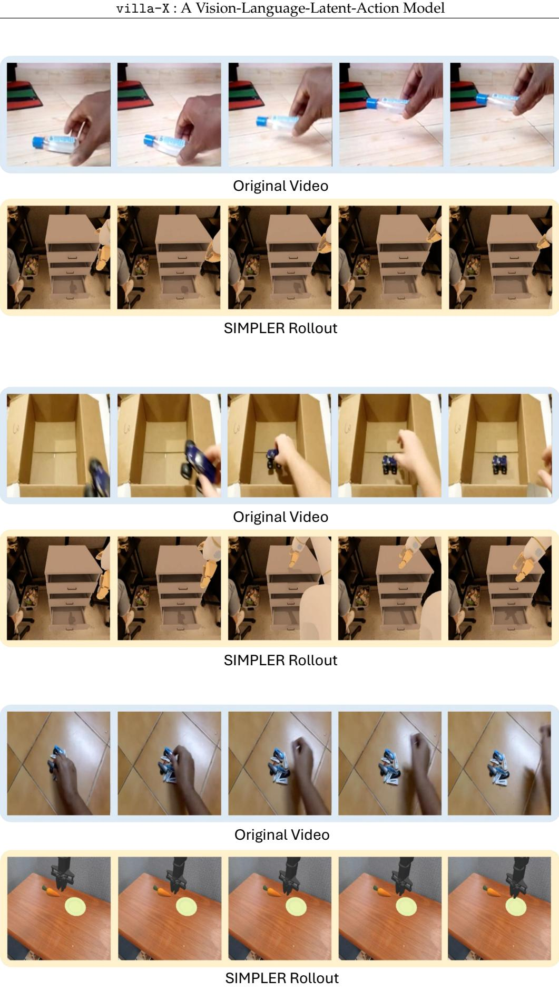  
Figure 8: Transfer human video demonstrations into robot actions through LAM and proprio FDM in SIMPLER simulator. Upper: the SIMPLER rollout closely reproduce the motion of moving right; Middle: the SIMPLER rollout closely reproduce the motion of moving forward and backward; Bottom: the SIMPLER rollout closely reproduce the motion of moving right.

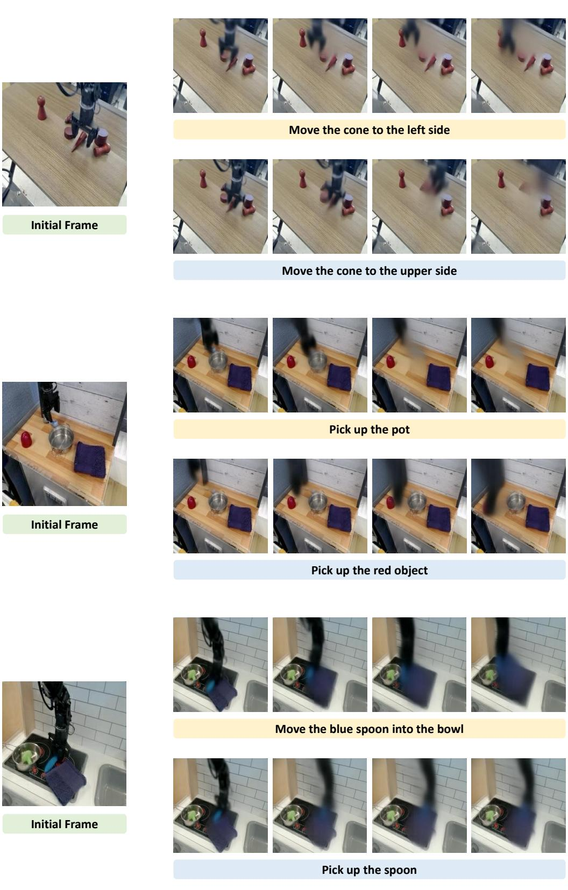  
Figure 9: Generated image sequence jointly by the latent expert and the world model via latent actions, following different instructions from the same initial image (Part I).

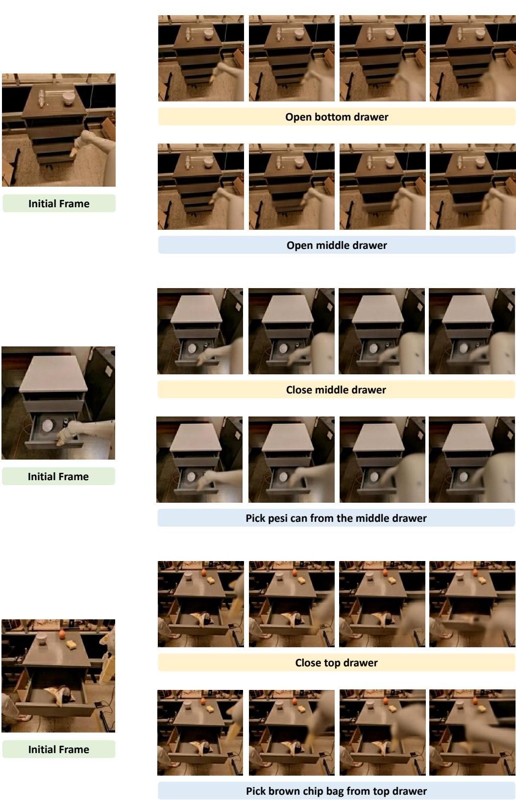  
Figure 10: Generated image sequence jointly by the latent expert and the world model via latent actions, following different instructions from the same initial image (Part II).

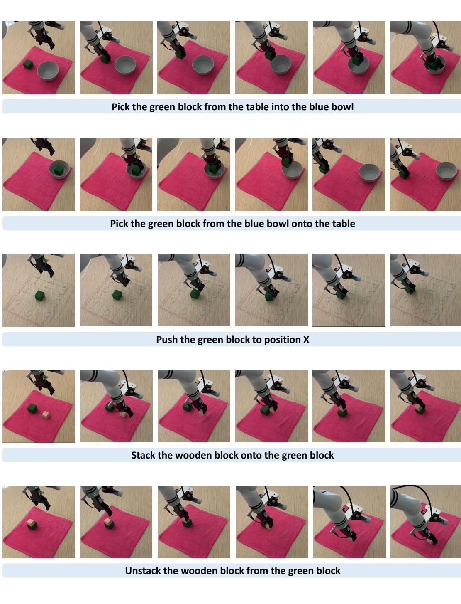  
Figure 11: Realman evaluation trajectory examples.

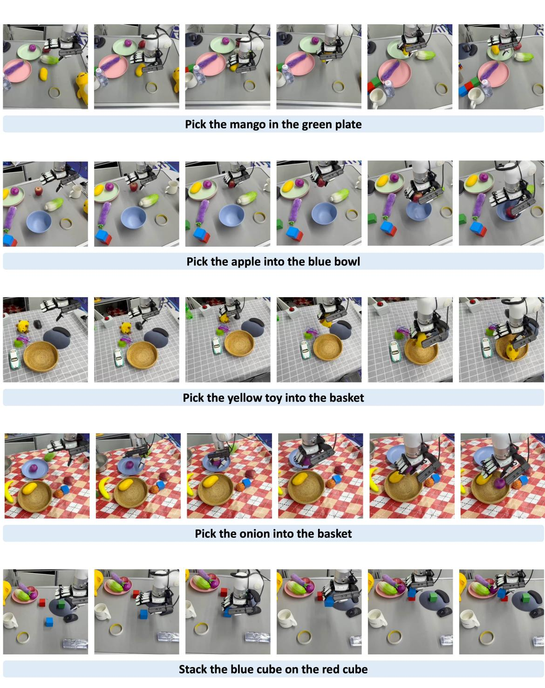  
Figure 12: Xhand evaluation trajectory examples (part I).

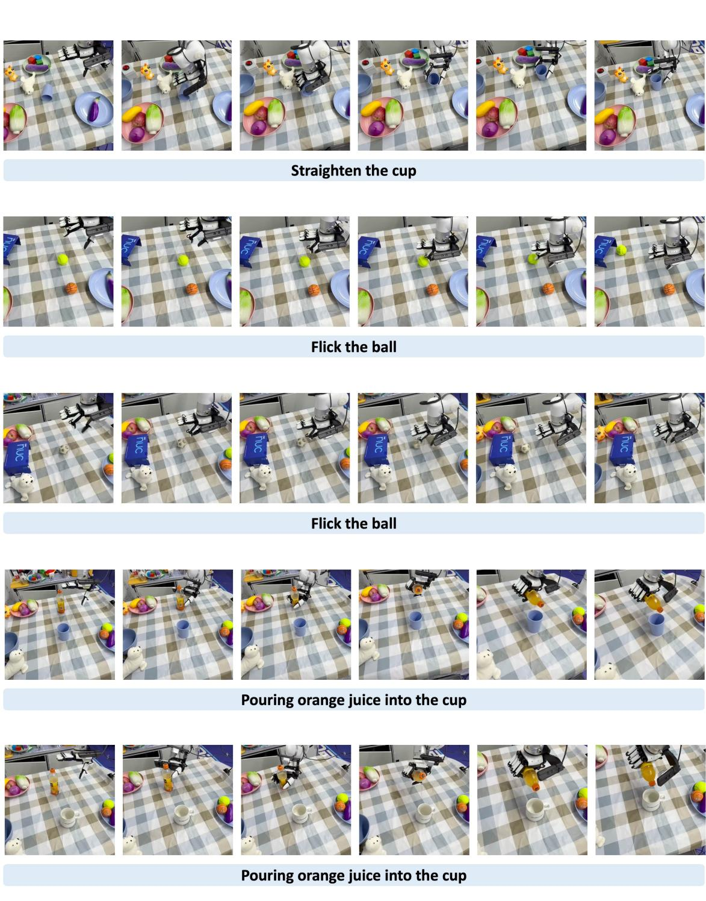  
Figure 13: Xhand evaluation trajectory examples (part II).