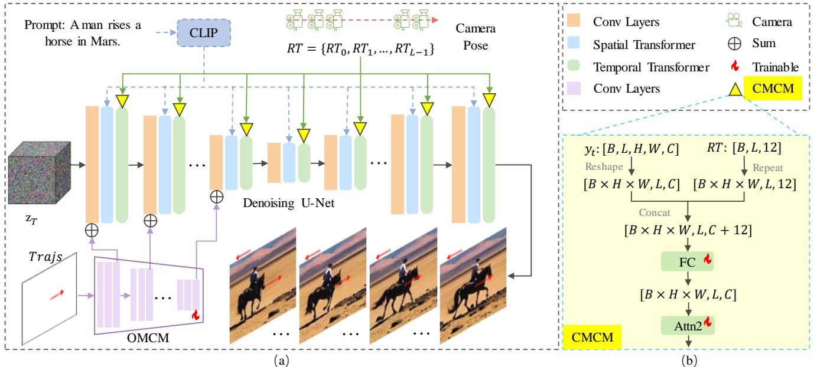
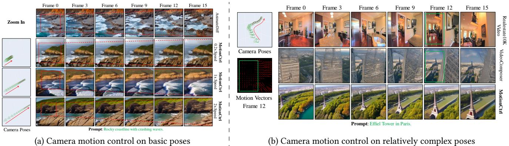
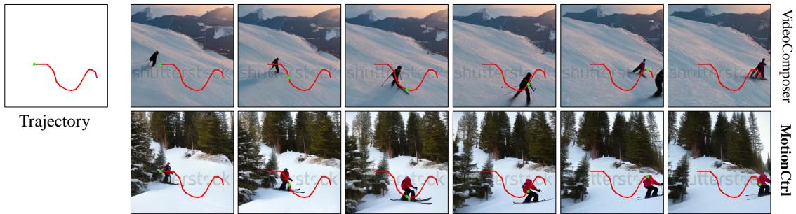

# 1. Bibliographic Information

## 1.1. Title
MotionCtrl: A Unified and Flexible Motion Controller for Video Generation

## 1.2. Authors
The paper is authored by a team of researchers from various prestigious institutions and corporate labs:
*   Zhouxia Wang (S-Lab, Nanyang Technological University)
*   Ziyang Yuan (Tsinghua University)
*   Xintao Wang (ARC Lab, Tencent PCG) - *Corresponding author, a prominent researcher in computer vision, particularly in image/video restoration and generation.*
*   Yaowei Li (Peking University)
*   Tianshui Chen (Guangdong University of Technology)
*   Menghan Xia (Tencent AI Lab)
*   Ping Luo (University of Hong Kong)
*   Ying Shan (ARC Lab, Tencent PCG)

    The collaboration between top universities in Asia and a leading industry research lab (Tencent) indicates a strong combination of academic rigor and practical application focus.

## 1.3. Journal/Conference
The paper was published in the **Special Interest Group on Computer Graphics and Interactive Techniques Conference Conference Papers '24 (SIGGRAPH Conference Papers '24)**.

SIGGRAPH is widely regarded as the premier and most influential international conference in the field of computer graphics and interactive techniques. Acceptance into SIGGRAPH signifies a high level of innovation, technical quality, and impact.

## 1.4. Publication Year
The paper was accepted for publication in 2024, with the preprint first appearing on arXiv in December 2023.

## 1.5. Abstract
The abstract introduces the core problem in video generation: the need for accurate and independent control over both camera motion (global scene movement) and object motion (local object movement). Existing methods are criticized for focusing on only one type of motion or failing to distinguish between them, which limits control and diversity. The paper proposes **MotionCtrl**, a unified and flexible controller designed to solve this problem. MotionCtrl's architecture and training are carefully designed to handle the distinct properties of each motion type and to work with imperfect training data. The key advantages highlighted are:
1.  Effective and independent control of camera and object motion, allowing for fine-grained and diverse combinations.
2.  Use of appearance-free conditions (camera poses and trajectories) that do not negatively impact the visual appearance of generated objects.
3.  A generalizable model that can adapt to a wide range of motions without retraining.
    The abstract concludes by stating that extensive experiments demonstrate MotionCtrl's superiority over existing methods.

## 1.6. Original Source Link
*   **Original Source (arXiv):** https://arxiv.org/abs/2312.03641
*   **PDF Link:** https://arxiv.org/pdf/2312.03641v2
*   **Publication Status:** This is a preprint of a paper accepted at the SIGGRAPH 2024 conference.

    ---

# 2. Executive Summary

## 2.1. Background & Motivation
*   **Core Problem:** High-quality video generation requires not just plausible content but also controllable motion. Motions in a video can be broadly categorized into two types: **camera motion** (e.g., panning, zooming, rotating the entire scene) and **object motion** (e.g., a person walking, a car driving within the scene). Most existing video generation models offer limited and entangled control over these motions.
*   **Existing Gaps:**
    1.  **Lack of Disentanglement:** Methods like `VideoComposer` use a single condition, such as dense motion vectors, to control all movement. This conflates camera and object motion, making it impossible to, for example, have a character walk to the right while the camera pans to the left.
    2.  **Limited Generality:** Some methods like `AnimateDiff` use separate, specialized models (e.g., LoRAs) for a predefined set of simple camera movements (pan left, zoom in, etc.). They cannot handle complex, novel camera paths or control object motion.
    3.  **Appearance Contamination:** Control signals like dense motion vectors can inadvertently encode the shape or appearance of objects from a source video, leading to visual artifacts in the generated video (e.g., generating an Eiffel Tower with the outline of a door from the reference video).
*   **Innovative Idea:** The paper's central idea is to **disentangle** the control of camera and object motion by designing a unified architecture with two specialized modules. Camera motion, being a global transformation across time, is controlled using camera poses and injected into the model's temporal processing units. Object motion, being a local movement in space over time, is controlled using sparse trajectories and injected into the model's spatial processing units. This separation allows for independent, combined, and fine-grained motion control.

## 2.2. Main Contributions / Findings
*   **Primary Contributions:**
    1.  **MotionCtrl Framework:** A novel, unified, and flexible controller for video generation models. It features two distinct modules: the **Camera Motion Control Module (CMCM)** and the **Object Motion Control Module (OMCM)**, enabling independent or joint control over camera and object movements.
    2.  **Disentangled Architecture Design:** A principled approach where camera motion is handled by the model's temporal transformers and object motion by its convolutional layers. This aligns the control mechanism with the inherent properties of each motion type.
    3.  **Pragmatic Training Strategy:** A multi-step training process that overcomes the lack of a single, perfectly annotated dataset (i.e., videos with captions, camera poses, *and* object trajectories). The modules are trained sequentially using two separately augmented datasets.
    4.  **Appearance-Free Motion Conditioning:** By using camera poses (rotation/translation matrices) and sparse trajectories (coordinate sequences), MotionCtrl avoids the visual artifacts associated with appearance-dependent conditions like motion vectors.

*   **Key Findings:**
    *   MotionCtrl successfully achieves fine-grained, independent control. For example, it can generate a video of a rose swaying according to a specific trajectory while the camera simultaneously zooms out according to a given camera path.
    *   The model demonstrates superior performance over state-of-the-art methods like `AnimateDiff` and `VideoComposer` in both quantitative metrics (measuring control accuracy and video quality) and qualitative results.
    *   The proposed model is generalizable, meaning a single trained `MotionCtrl` can handle a wide variety of camera paths and object trajectories without needing to be fine-tuned for each specific motion.

        ---

# 3. Prerequisite Knowledge & Related Work

## 3.1. Foundational Concepts

### 3.1.1. Diffusion Models
Diffusion Models are a class of generative models that have become state-of-the-art in generating high-quality images and videos. They work in two main stages:
1.  **Forward Process (Noising):** This is a fixed process where a small amount of Gaussian noise is gradually added to a real data sample (e.g., an image) over a series of time steps, $T$. After many steps, the original data is transformed into pure, random noise.
2.  **Reverse Process (Denoising):** This is the generative part. A neural network, typically a U-Net, is trained to reverse the noising process. It takes a noisy input and a time step $t$ and learns to predict the noise that was added at that step. By repeatedly predicting and subtracting this noise, the model can generate a clean data sample starting from pure random noise.

### 3.1.2. Latent Diffusion Models (LDMs)
Training diffusion models directly on high-resolution images or videos is computationally very expensive. Latent Diffusion Models (LDMs), popularized by Stable Diffusion, solve this by performing the diffusion process in a smaller, compressed **latent space**.
1.  An **autoencoder** (consisting of an encoder and a decoder) is pre-trained. The encoder compresses a high-resolution video into a low-dimensional latent representation. The decoder reconstructs the video from this latent representation.
2.  The diffusion model (the U-Net) is then trained entirely within this latent space. This is much more efficient because the latent space is significantly smaller than the pixel space.
3.  During generation, the model denoises a random tensor in the latent space and then uses the decoder to transform the final clean latent into a full-resolution video. The paper's base model, `LVDM`, is a Latent *Video* Diffusion Model.

### 3.1.3. U-Net Architecture in Video Generation
The denoising network in video diffusion models is typically a U-Net, which has an encoder-decoder structure with skip connections. For video, this U-Net is adapted to handle temporal information:
*   **Convolutional Layers:** Handle spatial feature extraction within each frame.
*   **Spatial Transformers:** Use self-attention mechanisms to understand relationships between different parts of a single frame (e.g., "the dog is *on top of* the sofa").
*   **Temporal Transformers:** Use self-attention across frames to understand temporal relationships and motion (e.g., how the dog moves from frame 1 to frame 2). These are crucial for creating coherent motion.

### 3.1.4. Adapter Modules
Adapters are small, lightweight neural network modules that are inserted into a large, pre-trained model. Instead of fine-tuning the entire multi-billion parameter model, only the small adapter modules are trained. This is highly efficient and allows for adding new capabilities (like conditional control) to a powerful base model without compromising its original abilities. `MotionCtrl`'s `CMCM` and `OMCM` function like adapters.

## 3.2. Previous Works

### 3.2.1. Latent Video Diffusion Model (LVDM)
`LVDM` is the foundational text-to-video generation model upon which `MotionCtrl` is built. It extends the LDM concept to video by incorporating temporal layers into its U-Net architecture. As the paper's preliminary section explains, its denoising U-Net, denoted $\epsilon_{\theta}$, is trained to predict the noise $\epsilon$ added to a latent video $z_0$ at time step $t$, conditioned on a text prompt $c$. The core optimization objective is the noise-prediction loss:
$$
\mathcal { L } = \mathbb { E } _ { z _ { 0 } , c , \epsilon \sim \mathcal { N } ( 0 , I ) , t } \left[ \| \epsilon - \epsilon _ { \theta } ( z _ { t } , t , c ) \| _ { 2 } ^ { 2 } \right]
$$
where $z_t$ is the noisy latent at step $t$.

### 3.2.2. AnimateDiff
`AnimateDiff` is a popular method for adding motion to personalized text-to-image models. It primarily focuses on camera motion control. Its key limitation, as highlighted by the `MotionCtrl` paper, is that it requires training separate, specialized `LoRA` models for a small set of predefined basic camera motions (e.g., one model for "pan left," another for "zoom in"). This approach is not generalizable to arbitrary or complex camera paths and does not address object motion control.

### 3.2.3. VideoComposer
`VideoComposer` is a more general motion control method that conditions video generation on `motion vectors`. Motion vectors (often derived from optical flow) describe the pixel-level movement between consecutive frames. However, this approach has two major drawbacks:
1.  **Entanglement:** Motion vectors capture all movement, making no distinction between camera-induced background motion and foreground object motion.
2.  **Appearance Leakage:** As dense motion vectors are spatially aligned with the video, they can inadvertently encode the shape and structure of objects from the reference video, causing ghosting or shape artifacts in the generated output. The paper provides a compelling example in Figure 4, where `VideoComposer` generates an Eiffel Tower that is unnaturally shaped like a door from the reference video.

## 3.3. Technological Evolution
The field of video generation has evolved rapidly:
1.  **Early Methods:** Primarily used Generative Adversarial Networks (GANs) and Variational Autoencoders (VAEs). These models often struggled with generating high-resolution, long, or coherent videos.
2.  **Rise of Diffusion Models:** Following their success in image generation, diffusion models were adapted for video, leading to significant improvements in quality and coherence (e.g., `Imagen Video`, `Make-A-Video`).
3.  **Efficiency through Latent Space:** Models like `LVDM` and `Stable Video Diffusion` made high-quality video generation more accessible by operating in the latent space.
4.  **Controllable Generation:** The focus then shifted from pure text-to-video generation to controllable synthesis. Early control methods focused on specific aspects, like preserving a subject's identity (`Tune-A-Video`) or controlling simple camera motions (`AnimateDiff`).
5.  **Fine-Grained Motion Control:** `MotionCtrl` represents the next step in this evolution, aiming for a more fundamental and disentangled control over the core components of video motion: camera and object movement.

## 3.4. Differentiation Analysis
Compared to previous works, `MotionCtrl`'s primary innovation lies in its **principled disentanglement of motion control**:

| Method | Control Signal | Motion Disentanglement | Generality | Appearance-Free |
| :--- | :--- | :--- | :--- | :--- |
| **AnimateDiff** | Pre-defined motion type (e.g., "zoom") | No (only camera) | Low (requires separate models) | Yes |
| **VideoComposer** | Dense Motion Vectors | No (entangled) | High | No (prone to artifacts) |
| **DragNUWA** | Trajectories from Optical Flow | No (entangled) | High | Partially |
| **MotionCtrl (Ours)** | **Camera Poses** & **Object Trajectories** | **Yes (explicitly separated)** | **High (single model)** | **Yes** |

The core difference is that `MotionCtrl` does not just use a more general control signal; it uses **two distinct signals** specifically tailored to the two fundamental types of motion and injects them into different parts of the model architecture that align with their respective properties (temporal for global camera motion, spatial for local object motion).

---

# 4. Methodology

## 4.1. Principles
The core principle of `MotionCtrl` is that camera motion and object motion are fundamentally different phenomena and should be controlled by separate mechanisms that respect their inherent properties.
*   **Camera Motion** is a **global transformation** that affects the entire scene consistently across time. Therefore, it is best controlled by conditioning the **temporal modules** of the video generation model. The paper uses camera poses (rotation and translation) as a pure, appearance-free representation of this global motion.
*   **Object Motion** is a **local transformation** of a specific object within the scene's spatial dimensions over time. Therefore, it is best controlled by conditioning the **spatial modules** (convolutional layers) of the model, indicating *where* the object should be in each frame. Sparse trajectories are used as a user-friendly and appearance-free signal for this purpose.

    The following figure from the paper illustrates the overall architecture of `MotionCtrl`, showing how it integrates with the base `LVDM`.

    
    *该图像是示意图，展示了MotionCtrl中用于视频生成的统一和灵活运动控制器的架构。图中体现了不同模块的关系及传递过程，包括CLIP、去噪U-Net和CAM特征融合等。同时，公式 $RT = {RT_0, RT_1, u}$ 描述了相机姿态与轨迹的关系。*

## 4.2. Core Methodology In-depth
`MotionCtrl` builds upon a Latent Video Diffusion Model (`LVDM`), which uses a U-Net architecture for denoising in the latent space. The methodology introduces two new modules, `CMCM` and `OMCM`, and a specialized training strategy.

### 4.2.1. Base LVDM and Objective
The underlying model is `LVDM`, which is trained with the standard noise-prediction loss. This objective trains the U-Net denoiser $\epsilon_{\theta}$ to predict the noise $\epsilon$ that was added to a clean latent video $z_0$ to create a noisy version $z_t$.

The noise-prediction loss is formulated as:
$$
\mathcal { L } = \mathbb { E } _ { z _ { 0 } , c , \epsilon \sim \mathcal { N } ( 0 , I ) , t } \left[ \| \epsilon - \epsilon _ { \theta } ( z _ { t } , t , c ) \| _ { 2 } ^ { 2 } \right]
$$
**Symbol Explanation:**
*   $z_0$: The initial clean latent representation of a video, obtained from a VAE encoder.
*   $c$: The conditional information, typically a text prompt.
*   $\epsilon$: A random noise sample drawn from a standard normal distribution $\mathcal{N}(0, I)$.
*   $t$: A discrete time step from the diffusion process, ranging from `1` to $T$.
*   $z_t$: The noisy latent at time step $t$, created by mixing $z_0$ and $\epsilon$ according to a predefined noise schedule $\bar{\alpha}_t$:
    $$
    z _ { t } = \sqrt { \bar { \alpha _ { t } } } z _ { 0 } + \sqrt { 1 - \bar { \alpha _ { t } } } \epsilon
    $$
*   $\epsilon_{\theta}(z_t, t, c)$: The denoising U-Net, which takes the noisy latent $z_t$, the time step $t$, and the condition $c$ as input, and outputs a prediction of the noise $\epsilon$.

### 4.2.2. Camera Motion Control Module (CMCM)
The `CMCM` is designed to control global camera motion.

*   **Input Condition:** A sequence of camera poses, $RT = \{RT_0, RT_1, \dots, RT_{L-1}\}$, where $L$ is the number of video frames. Each camera pose $RT_i$ is represented by its $3 \times 3$ rotation matrix and $3 \times 1$ translation vector, which are flattened into a 12-dimensional vector. Thus, the full input tensor is $RT \in \mathbb{R}^{L \times 12}$.

*   **Architectural Integration:** `CMCM` injects this camera pose information into the **temporal transformers** of the `LVDM`'s U-Net. This choice is deliberate, as temporal transformers are responsible for modeling relationships across frames.
    *   Specifically, the paper targets the *second* self-attention module within each temporal transformer block to minimize disruption to the pre-trained model's generative capabilities.
    *   The camera pose tensor `RT` is first expanded spatially to match the dimensions of the intermediate feature map from the first self-attention module, $\bar{y_t} \in \mathbb{R}^{H \times W \times L \times C}$.
    *   The expanded pose tensor is concatenated with $\bar{y_t}$ along the channel dimension.
    *   A fully connected (linear) layer then projects the concatenated tensor back to the original channel dimension $C$.
    *   This conditioned feature map is then fed into the second self-attention module, allowing the model to generate frame transitions that are consistent with the specified camera path.

### 4.2.3. Object Motion Control Module (OMCM)
The `OMCM` is designed to control the movement of specific objects within the scene.

*   **Input Condition:** A set of sparse object trajectories, `Trajs`. A trajectory is a sequence of 2D coordinates specifying an object's position in each frame. The paper represents this not as absolute coordinates but as a map of **relative movements (velocities)** for better learning. For a trajectory passing through $(x_i, y_i)$ at frame $i$, the representation at that point is $(u, v) = (x_i - x_{i-1}, y_i - y_{i-1})$. All other spatial locations in the frame are set to (0, 0). This results in a tensor `Trajs` of shape $\mathbb{R}^{L \times \hat{H} \times \hat{W} \times 2}$, where $\hat{H}$ and $\hat{W}$ are the spatial dimensions of the latent space.

*   **Architectural Integration:** Inspired by `T2I-Adapter`, `OMCM` injects trajectory information into the **convolutional layers** of the U-Net's **encoder**.
    *   The `OMCM` itself is a small convolutional network. It takes the `Trajs` tensor as input and processes it through several convolutional and downsampling layers to produce multi-scale feature maps.
    *   These feature maps are then added element-wise to the outputs of the corresponding convolutional layers in the U-Net encoder. This provides the denoising network with strong spatial cues about where the moving object is expected to be at each stage of the generation process.

        The following figure from the paper illustrates how sparse trajectories are processed for training.

        ![Figure 3: Trajectories for Object Motion Control. ParticleSfM \[Zhao et al. 2022\] is employed to extract object movement trajectories from video clips, effectively disentangling object motion from camera-induced movement. To circumvent the issues of dense trajectories, which can encode object shapes and are challenging to design at inference, we train the OMCM using sparse trajectories sampled from the dense ones. These sparse trajectories, being too scattered for effective learning, are subsequently refined with a Gaussian filter.](images/3.jpg)
        *该图像是示意图，展示了如何提取物体运动轨迹。图(a)显示了提取物体运动轨迹的过程，图(b)随机选择了稀疏轨迹，图(c)则应用了高斯滤波器来精炼轨迹，最终的结果呈现在图(d)中。*

### 4.2.4. Training Strategy and Data Construction
A key challenge is the absence of a large-scale dataset containing videos with high-quality annotations for captions, camera poses, and object trajectories simultaneously. `MotionCtrl` addresses this with a pragmatic, multi-step training strategy.

1.  **Step 1: Train CMCM**
    *   **Dataset:** `Realestate10K`, which contains videos with camera poses.
    *   **Data Augmentation:** Since `Realestate10K` lacks text captions, the authors use **Blip2** (a powerful image captioning model) to generate descriptive captions for each video clip. This creates the `augmented-Realestate10K` dataset.
    *   **Training Process:** The base `LVDM` is frozen. Only the `CMCM` module and the second self-attention layers in the temporal transformers are trained. This efficiently teaches the model camera control while preserving its powerful generative priors.

2.  **Step 2: Train OMCM**
    *   **Dataset:** `WebVid`, a large-scale dataset of videos with captions.
    *   **Data Augmentation:** Since `WebVid` lacks motion annotations, the authors use **ParticleSfM**, a structure-from-motion algorithm, to extract dense object movement trajectories from the videos, creating the `augmented-WebVid` dataset.
    *   **Training Process:** The base `LVDM` and the already-trained `CMCM` are now frozen. Only the `OMCM` module is trained. This training is further divided into two sub-steps to bridge the gap between the dense trajectories available from data mining and the desired sparse user input:
        *   **Pre-training on Dense Trajectories:** The `OMCM` is first trained on the dense trajectories extracted by `ParticleSfM`. This provides rich motion information to bootstrap the learning process.
        *   **Fine-tuning on Sparse Trajectories:** The `OMCM` is then fine-tuned on sparse trajectories, which are created by randomly sampling a few trajectories from the dense set. To make these sparse signals more learnable, they are blurred using a Gaussian filter. This step adapts the model to the expected user input format at inference time.

            By training the modules sequentially, `MotionCtrl` can be trained effectively without requiring a "perfect" dataset, making the approach practical and scalable.

---

# 5. Experimental Setup

## 5.1. Datasets
The experiments use custom-built evaluation datasets to test the specific capabilities of `MotionCtrl`.

*   **Camera Motion Control Evaluation Dataset:** This dataset comprises 407 samples designed to test a range of camera movements. It includes:
    *   **Basic Poses:** 8 fundamental camera movements (pan left/right/up/down, zoom in/out, clockwise/anticlockwise rotation) applied to 10 different text prompts.
    *   **Complex Poses:** More elaborate camera paths extracted from real-world videos from three sources: the `Realestate10K` test set, `WebVid`, and `HD-VILA`.
*   **Object Motion Control Evaluation Dataset:** This dataset contains 283 samples constructed with 74 diverse, handcrafted trajectories and 77 different text prompts. This setup allows for testing many-to-many mappings (e.g., one trajectory with multiple objects, or one object with multiple trajectories).

## 5.2. Evaluation Metrics
The paper uses a combination of standard video generation metrics and custom metrics to evaluate performance.

### 5.2.1. Fréchet Inception Distance (FID)
*   **Conceptual Definition:** FID measures the visual quality and fidelity of generated images by comparing the distribution of generated images to the distribution of real images. It computes the "distance" between these two distributions in a feature space defined by a pre-trained InceptionV3 network. A lower FID score indicates that the generated images are more similar to real images, signifying higher quality.
*   **Mathematical Formula:**
    $$
    \text{FID}(x, g) = \left\| \mu_x - \mu_g \right\|_2^2 + \text{Tr}\left(\Sigma_x + \Sigma_g - 2(\Sigma_x \Sigma_g)^{1/2}\right)
    $$
*   **Symbol Explanation:**
    *   $\mu_x, \mu_g$: The mean of the feature vectors for real ($x$) and generated ($g$) images, respectively.
    *   $\Sigma_x, \Sigma_g$: The covariance matrices of the feature vectors for real and generated images.
    *   $\text{Tr}(\cdot)$: The trace of a matrix (sum of diagonal elements).

### 5.2.2. Fréchet Video Distance (FVD)
*   **Conceptual Definition:** FVD is an extension of FID for videos. It evaluates both the per-frame image quality and the temporal coherence (realism of motion) of generated videos. It extracts features from both real and generated videos using a pre-trained 3D vision model and computes the Fréchet distance between their feature distributions. A lower FVD score indicates better video quality and more realistic motion.
*   **Mathematical Formula:** The formula is identical to FID's, but the features are extracted from a video classifier instead of an image classifier.

### 5.2.3. CLIP Similarity (CLIPSIM)
*   **Conceptual Definition:** CLIPSIM measures the semantic alignment between the generated video content and the input text prompt. It uses the pre-trained CLIP (Contrastive Language-Image Pre-Training) model, which can embed both images and text into a shared feature space. The metric calculates the cosine similarity between the CLIP embeddings of the generated video frames and the CLIP embedding of the text prompt. A higher CLIPSIM score indicates that the video content is a better match for the text description.
*   **Mathematical Formula:**
    $$
    \text{CLIPSIM}(V, T) = \frac{1}{L} \sum_{i=1}^{L} \text{cosine\_similarity}(E_I(V_i), E_T(T))
    $$
*   **Symbol Explanation:**
    *   $V$: The generated video with $L$ frames.
    *   $V_i$: The $i$-th frame of the video.
    *   $T$: The input text prompt.
    *   $E_I(\cdot), E_T(\cdot)$: The CLIP image and text encoders, respectively.

### 5.2.4. Custom Motion Control Metrics
To directly measure motion control accuracy, the authors propose two metrics:
*   **CamMC (Camera Motion Control):** Defined as the Euclidean distance between the ground-truth camera poses and the camera poses extracted from the generated video using `ParticleSfM`. A **lower** CamMC score means more accurate camera motion control.
*   **ObjMC (Object Motion Control):** Defined as the Euclidean distance between the ground-truth object trajectories and the trajectories extracted from the generated video. A **lower** ObjMC score means more accurate object motion control.

## 5.3. Baselines
The primary methods `MotionCtrl` is compared against are:
*   **AnimateDiff:** A leading method for camera motion control via specialized LoRA models. It is used for comparison on basic camera poses.
*   **VideoComposer:** A strong baseline for general motion control that uses motion vectors as input. It is used for comparison on both complex camera motion and object motion.

    ---

# 6. Results & Analysis

## 6.1. Core Results Analysis
The main quantitative comparisons are presented in Table 1 of the paper, which evaluates `MotionCtrl` against `AnimateDiff` and `VideoComposer`.

The following are the results from Table 1 of the original paper:

| Method | AnimateDiff | VideoComposer | MotionCtrl |
| :--- | :--- | :--- | :--- |
| **CamMC ↓ (Basic Poses)** | 0.0548 | - | **0.0289** |
| **CamMC ↓ (Complex Poses)** | - | 0.0950 | **0.0735** |
| **ObjMC ↓** | - | 36.8351 | **28.877** |
| **CLIPSIM ↑** | 0.2144 | 0.2214 | **0.2319** |
| **FID ↓** | 157.73 | 130.97 | **124.09** |
| **FVD ↓** | 1815.88 | 1004.99 | **852.15** |

**Analysis of Core Results:**
*   **Camera Motion Control (CamMC):** `MotionCtrl` significantly outperforms both baselines. It nearly halves the error of `AnimateDiff` on basic poses and is substantially more accurate than `VideoComposer` on complex poses. The qualitative results in Figure 4 show *why*: `VideoComposer`'s motion vectors capture unwanted shape details, leading to artifacts, while `MotionCtrl`'s appearance-free camera poses produce natural results.

    The following figure from the paper (Figure 4) provides a qualitative comparison for camera motion control.

    
    *该图像是图表，展示了 MotionCtrl 在基本和复杂姿态下对相机运动的控制效果。左侧展示了在简单位姿下的帧变化，右侧展示了在复杂位姿下的相机运动控制示例，包括不同框架的内容与提示。 相机位姿与运动向量在图中标出。*

*   **Object Motion Control (ObjMC):** `MotionCtrl` achieves a much lower error score than `VideoComposer`, indicating its generated objects follow the specified trajectories more faithfully. Figure 5 visually confirms this, showing the object in the `MotionCtrl` video staying closer to the target path.

    The following figure from the paper (Figure 5) provides a qualitative comparison for object motion control.

    
    *该图像是示意图，展示了MotionCtrl和VideoComposer在视频生成中控制运动轨迹的效果。上方展示了两种不同方法下的摄像头轨迹，下面则显示了对应的生成视频片段，明显体现了运动控制的细节差异。*

*   **Video Quality and Text Alignment (FID, FVD, CLIPSIM):** `MotionCtrl` consistently achieves the best scores across all three metrics. This is a crucial finding: it demonstrates that the proposed control modules not only provide superior motion control but also **improve the overall quality and text-relevance** of the generated videos, rather than degrading them.

## 6.2. Ablation Studies / Parameter Analysis

### 6.2.1. Integrated Position of CMCM
This study investigates the best place within the U-Net to inject the camera pose information. The authors compared their proposed method (injecting into the Temporal Transformer) with several alternatives.

The following are the results from Table 2 of the original paper:

| Method | CamMC ↓ | CLIPSIM ↑ | FID ↓ | FVD ↓ |
| :--- | :--- | :--- | :--- | :--- |
| LVDM [He et al. 2022] | 0.9010 | 0.2359 | 130.62 | 1007.63 |
| Time Embedding | 0.0887 | 0.2361 | 132.74 | 1461.36 |
| Spatial Cross-Attention | 0.0857 | 0.2357 | 153.86 | 1306.78 |
| Spatial Self-Attention | 0.0902 | 0.2384 | 146.37 | 1303.58 |
| **Temporal Transformer** | **0.0289** | 0.2355 | 132.36 | 1005.24 |

**Analysis:** The results are unambiguous. Injecting camera pose information into any of the spatial modules or the time embedding fails to provide effective control; their `CamMC` scores are very high. Only the **Temporal Transformer** injection leads to a dramatic drop in `CamMC` error (from ~0.9 to 0.0289). This strongly validates the authors' core hypothesis that global camera motion, a temporal phenomenon, must be controlled via the model's temporal processing units.

### 6.2.2. Training OMCM with Dense vs. Sparse Trajectories
This study evaluates the effectiveness of the two-stage training strategy for the `OMCM` (pre-training on dense trajectories, then fine-tuning on sparse ones).

The following are the results from Table 3 of the original paper:

| Method | ObjMC ↓ | CLIPSIM ↑ | FID ↓ | FVD ↓ |
| :--- | :--- | :--- | :--- | :--- |
| Dense | 54.4114 | 0.2352 | 175.8622 | 2227.87 |
| Sparse | 34.6937 | 0.2365 | 158.5553 | 2385.39 |
| **Dense + Sparse** | **25.1198** | 0.2342 | 149.2754 | 2001.57 |

**Analysis:**
*   Training only on dense trajectories performs poorly (`ObjMC` of 54.4) because there is a mismatch with the sparse input used during inference.
*   Training only on sparse trajectories is better but still suboptimal (`ObjMC` of 34.7), likely because the sparse signal alone is too weak for the model to learn effectively from scratch.
*   The proposed **Dense + Sparse** strategy achieves the best `ObjMC` score by a large margin (25.1). This shows the benefit of first learning rich motion priors from dense data and then adapting to the specific, sparse input format.

    ---

# 7. Conclusion & Reflections

## 7.1. Conclusion Summary
The paper successfully introduces **MotionCtrl**, a unified and flexible controller that significantly advances the state of controllable video generation. By thoughtfully disentangling camera and object motion, the authors have created a system that allows for independent and combined control in a fine-grained manner. The key takeaways are:
*   The architectural design, which maps global camera motion to temporal transformers and local object motion to convolutional layers, is both intuitive and highly effective.
*   The use of appearance-free control signals (camera poses and trajectories) overcomes critical limitations of prior work, preventing visual artifacts and leading to more natural-looking videos.
*   A pragmatic multi-step training strategy enables the model to be trained on existing, imperfectly annotated datasets, making the approach practical and scalable.
*   Extensive experiments demonstrate that `MotionCtrl` not only provides superior motion control but also maintains or even improves overall video quality compared to state-of-the-art methods.

## 7.2. Limitations & Future Work
The authors acknowledge a key limitation: while `MotionCtrl` can control both motion types, achieving a natural and harmonious result when **both the camera motion and the object motion are highly complex** is challenging and has a relatively low success rate. This suggests that the model sometimes struggles to reconcile two intricate and potentially conflicting motion commands simultaneously. Future work could focus on improving the model's ability to handle these complex joint-motion scenarios, perhaps through more sophisticated conditioning mechanisms or training objectives that explicitly model the interaction between camera and object movements.

## 7.3. Personal Insights & Critique
*   **Strengths:**
    *   **Problem Formulation:** The paper's strength begins with its clear and insightful formulation of the problem. Distinguishing between camera and object motion is a fundamental step toward true video controllability, and the authors' approach is principled and well-motivated.
    *   **Elegant Solution:** The solution is elegant. Instead of a complex, monolithic architecture, it uses lightweight, adapter-like modules that integrate cleanly into a powerful pre-trained model. The mapping of control signals to specific model components (temporal vs. spatial) is a standout design choice.
    *   **Practicality:** The data augmentation and training strategy demonstrate a keen awareness of real-world research constraints. This pragmatic approach makes the method more accessible and replicable than one that would require a new, massive, perfectly-annotated dataset.

*   **Potential Issues and Areas for Improvement:**
    *   **Evaluation Dependency:** The motion control metrics (`CamMC`, `ObjMC`) rely on `ParticleSfM` to extract motion from the generated videos. Since `ParticleSfM` was also used to *generate* the training data for `OMCM`, there is a potential for a "teach-to-the-test" scenario. The model might be learning to produce videos that are easy for `ParticleSfM` to parse, which may not perfectly correlate with true motion accuracy as perceived by a human. Using an independent motion estimation tool for evaluation would strengthen the results.
    *   **Scalability to More Complex Interactions:** The current framework treats object motion via independent trajectories. It is unclear how it would scale to scenarios with multiple interacting objects or objects whose motion is physically constrained by the environment. Future work could explore richer representations than simple trajectories, such as interaction graphs or physics-based constraints.
    *   **Caption Quality:** The quality of the camera motion control is dependent on the `Realestate10K` dataset, while the captioning quality for that data relies on `Blip2`. Any biases or systematic errors in the generated captions could subtly influence the model's understanding of how motion and semantics relate.