# Advancing Open-source World Models

Robbyant Team We present LingBot-World, an open-sourced world simulator stemming from video generation. Positioned as a top-tier world model, LingBot-World offers the following features. (1) It maintains high fidelity and robust dynamics in a broad spectrum of environments, including realism, scientic contexts, cartoon styles, and beyond. (2) It enables a minute-level horizon while preserving contextual consistency over time, which is alo known as "ong-ter memory"(3) It supports real-time interactivity, achieving a latency of under 1 second when producing 16 frames per second. We provide public access to the code and model in an effort to narrow the divide between open-source and closed-source technologies.We believe our release will empower the community with practical applications across areas like content creation, gaming, and robot learning. Website: https://technology.robbyant.com/lingbot-world Github: https://github.com/robbyant/lingbot-world Checkpoints: https://huggingface.co/robbyant/lingbot-world Robbyant

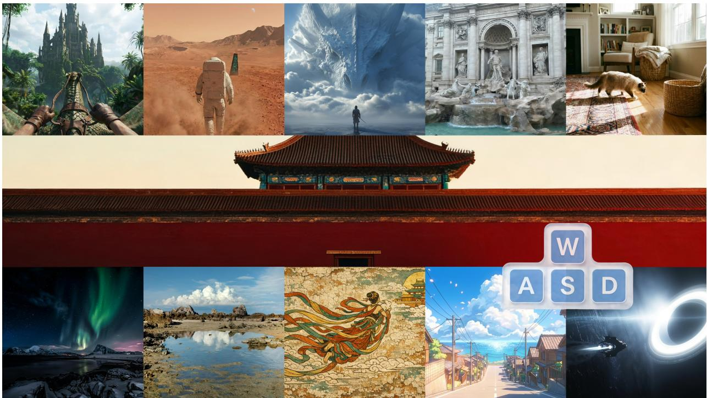  
FiurInteractive worl sulation acros divrs envients.Thegur howcases elecsmp controllability, allowing users to navigate and interact with these dynamic environments seamlessly.

# 1 Introduction

T prs  rilnteligcpab  tndi  la he hysl wo [41, 4] h bee considered a "holy grai"in computer vision and machine learningWe are currently witnessing a pard i  eoensa--a ] e -or uai [,,Whi ate-her idoe , 0] haveahievearkableideliy  nderi hor viallycherent cips, he dmy i n ocrih ap ake taltnst oeti pass otg ui r models capable of synthesizing persistent, interactive, and logically consistent environments. However, the transition from vido generation to word simulation [, 27,78, 80, 89] faces snificant challge. F aagent' decisins nd theevioents reacion is notoiusly iffiult tle [, 8Send mai — anr h h l pivalakoeie creating a divide that hinders broader community innovation. In this report, we present LingBot-World, a comprehensive, open-source framework designed to shatter these bazoLWoe; s olisste ee arnirl wor nen hemal-iiBoW founded upon three strategic pillars that distinguish our model from existing solutions: A scalable data engine with hierarchical semanticsWe address the data bottleneck by constructing ayri e hatges iveatsur incld-worotegameengerian ynthe fromUnrealgirucially, olvheack aicntrol raw datatrucie captioning strategy [15, 16, 82]. By generating distinct narrative, scene-static, and dense temporal captions, we effectively disentangle motion control from static scene generation, alowing the model to learn precise action-contingent dynamics. Amuli-tagevoltnaryrai ipeliW propo proressivrai rat vol vido generator into an interactive simulator, including three stages: pre-training, middle-training, and posttraiInstag robus enealvieo pri talishevi re-raig por hg-delye eation In stage , mie-rain, e ply ixtureexperts Mitecture [7, 19, 36,] incorporate word knowledge and enable actn controllabily, focusing on "ong-term memory" and maintai environmental consistency over extended horizons. In stage II, we optimize the model for real-time inference. Throug causal attention adaptation and ew-ste distillation [44, 59, 65], he bidirectional diffusion model is post-trained into an efficient autoregressive system [10, 30] with sub-second latency. Versatile applications for embodied AI. Beyond visual synthesis, LingBot-World serves as a practical testbed for downstreams [1, 6, 20, 26, 29, 57, 58, 78, 92]. It supports promptable world events, allowing users to of action agents and enables consistent 3D reconstruction from generated videos [34, 50, 83], validating its geometric integrity. To contextualize our contribution, Tab. 1 compares LingBot-World with recent interactive world models. While systems lik Geni 3 [5] and Mirage 2 [73] have made srides, they oten compromise on dynamicdegree r eman clssorioWisuishepabilyat andhnaidgreal-time whl beipen-sourByleshecdeanmode w, wimniew wavovatin poweriheiy  uil he exeratirtalrls. By open-sourcing LingBot-World, including our model weights and inference codebase, we aim to ignite a new w generation of infinite, playable, and interactive virtual worlds. Ta   vos lha   

<table><tr><td></td><td>Matrix-Game 2.0 [27]</td><td>Yume-1.5 [45]</td><td>HY-World 1.5 [68] Mirage 2 [73]</td><td></td><td>Genie 3 [5]</td><td>Ours</td></tr><tr><td>Domain</td><td>Game</td><td>General</td><td>General</td><td>General</td><td>General</td><td>General</td></tr><tr><td>Generation Horizon</td><td>Short</td><td>Short</td><td>Medium</td><td>Long</td><td>Long</td><td>Long</td></tr><tr><td>Dynamic Degree</td><td>Low</td><td>Low</td><td>Low</td><td>Medium</td><td>Medium</td><td>High</td></tr><tr><td>Resolution</td><td>480p</td><td>480p</td><td>720p</td><td>480p</td><td>720p</td><td>720p</td></tr><tr><td>Real-time</td><td>✓</td><td>X</td><td>√</td><td>√</td><td>√</td><td></td></tr><tr><td>Open-source</td><td>✓</td><td>√</td><td>√</td><td>X</td><td>X</td><td></td></tr></table>

# 2 Data Engine

Constructing a world model capable of robustly handling novel viewpoints, complex dynamics, and long-horizon synergisticcomponents:(i)data acquisition, (ii) data profiling, and (ii) data captioning. Tobuild thefoundation f this system, ur data acquisition phase employs ahybridcollection stratey deed [] . Second, tcapture precise action-contingent dynamics, weharvest game datawhereRGBframes aresricly paird u Unrel E 18 ytaa is-buis ee renderi workfowha gnerat coisonee randizyet plauslecmeractriyieldiRGB aligned with ground-truth camera intrinsics and extrinsics. The high-level idea is depicted in Fig. 2. Aqea oilniztheive, wideos chmapar am Eat i athe [   b   s e totid [,.  iz-el LM) [,0] v curate the filtered dataset. Fo neheat t aly  e r using a vision-language model (VLM) [42, 75].We implement a hierarchical annotation strategy that produces thre stict yer desciptionnsurulanularnderstandin theidecontentThice comprehensivenarrativ caption that weaves environment and camera movement into a global sory, a scensi capo thatocue purely  heevioment, and densetemporal captins that ereraine tmel accounts of specific events.

# 2.1 Data Acquisition

# 2.1.1 General Video Curator

G o datecton iial [, ,Wedeveo  eneal videcratrdese eranretrive i ao peTh ec ype alknsptoveo human and animal ego-centric perspectives to third-person camera angles.

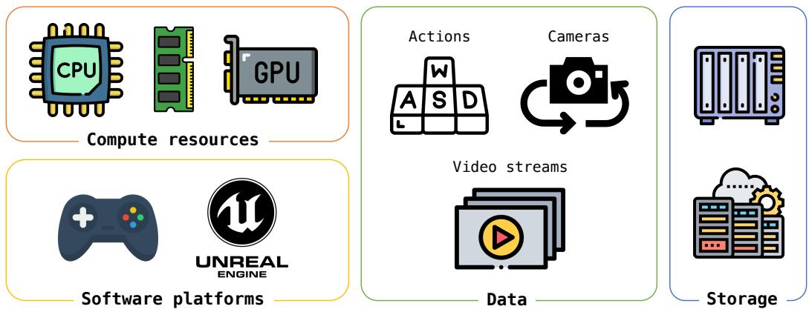  
isual observations that are temporally aligned with action signals and camera states.

# 2.1.2 Game Data Acquisition

Wedevelop dedicated game data acquisition platformengineered or high-fidelitycapturean syncronizat visl data ae acins, nd ovemet [9] To nsure  ristvisual baselne,heispyvt iscgure to excude teraceoverays, esuricnsistent visal qualiy apropriate codsUsero iste -preseamps ntzatn uh designed camera trajectories are recorded to ensure reliable geometric information. To ensure our game data covers a diverse range of behaviors and environmental complexities, we establish a standardized collection strategy divided into four primary categories: Navigation: Covers general movement through the virtual world. Free navigation: Enabling stochastic exploration across random trajectories; Loop roaming: Recording closed-loop paths or multi-point round trips;   
Transition navigatiotargeting hig-variance scne changes, such as exitin buildings or switching between distinct interior environments. tseeiFocuse  eraiebservationThis involvescarefully examini cee detail in bo and dynamic environments, as wel as orbiting around landmark objects to capture multi-view consistency. •Long-tail scenarios: Targets rare but critical data distributions often missing from standard ones. Stationary observation: Capturing data from a fixed position without translational movement, including 360-degree rotation to map static surroundings and fixed-angle staring to record dynamic elements (e.g., crowds or traffic) evolving over time. Backward navigation: Retreating while maintaining situational awareness. Worlinteactioapte cusal agenteviot elatinshis ranfroocalizectns  c up items, opening doors) to impactful events triggering significant state changes (e.g., combat, destruction).

# 2.1.3 Synthetic Rendering Pipeline

Ohnl 8 alb  e andal p iv—ee areuentyiatby plis paes su s orarmotns nuent hedenses trajectories required for spatial memory. To realize these capabilities, we develop a streamlined automated workflow. The process begins by randomly th stutatic erate cm tracty by he mplingfo ndmi er ev iortemotion prirs.ac generate trajectoryundergoes rgorous collisiondetection.Fnally, he co trajectory is processed for video rendering alongside the export of synchronized ground truth camera poses. Topouahi orkow  aalos ajy aea nodes designed to balance stochastic diversity with behavioral authenticity. Procedural path generation: This mode autonomously synthesizes complex camera movements to maximize environmental exploration, focusing on two primary algorithmic strategies: Geometric pattern synthesis: The system generates structured trajectories, including randomized rectangular paths of varying scales and multi-turn $3 6 0 ^ { \circ }$ rotations at diverse angular velocities. These patterns provide comprehensive panoramic context and reinforce long-term spatial consistency through repetitive environmental coverage. Multi-point interpolation: This strategy samples random spatial waypoints with reciprocal look-back transitions, which specifically strengthens relational spatial memory. •Real-world trajectory import: This mode maps paths captured from physical devices directly into Unreal Engine. I incorporates authentichuman browsing behaviors, such as repeatedly scanning a room o revisitin eo l changes) to reflect the stochasticity and temporal complexity characteristic of actual user interaction.

# 2.2 Data Profiling

Foaseao peennalyxtrul metadata or each vidoThis proces operate n thre dstinct level  granularity as illustrate inFig. 3.

# 2.2.1 Basic Filtering & Temporal Segment ehetaGiha tanreh insoluiequaeraSubseuenty wetilheicori provied  Ko [2] ae  [ o sThi coherence and consistency of each segment, ensuring a high-quality video source for downstream processing.

# 2.2.2 Semantic Analysis

Avanci  mantianalyis weplteal visi-angugemodel LM) textrac prehensiv oteu ai en ype n peeiv rs-perhipernThe descriptors provide a robust basis for precise data selection in downstream processing. To address the lack of geometric information in raw videos, we further utilize MegaSAM [37] to generate camea khu a lm 3D structural priors required for training. U  o    . Bylybays i-eveeptatt robust foundation for the subsequent training phases.

# 2.3 Data Captioning

Wo desg  specalizoati atyhat beyon impl gWe eate re tic cte captions for each video, catering to different granularities of semantic control and motion decoupling:

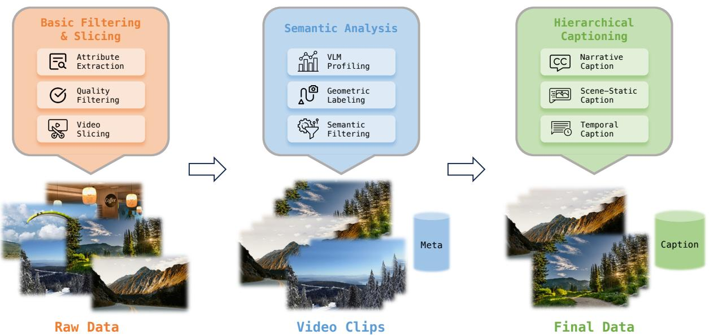  
y subsequent hierarchical captioning generation.

Comprehensive narrative caption: This type provides a holisticand detailed description o the entire video, intertwining the visual environment with the camer's trajectory nd temporal evolution It serves as agobal semantic prompt.

Example: The videounfolds as atranquil, frst-person explorationofa meticulously designedEast Asian-style cortyar  temple interrThe joure begins b pacin se ricly paint woden screns dep pinhelalah as therr pans  i the depth of the interior, showcasing a towering striped column, softly glowin lanterns, and a majestic white stat restinon an ornate pedestal, all bathed in war, ambint light.The perspectiv then shi rihtward guiding the viewer along a colonnaded walkway with textured stone walls toward imposing red doors studded with gol which serv both ocal poinand a potenialhreshold t theutsi worlCntideeethe cameranavigate  quieter ide corridor wherelantern-i windows castgentlllmination on the cracke sone flohancing the enseage srenitdeliberate turn brings theviewer backtmir he central sa ocemorets presence emphasized bythedramaic play  light and shadow on the grounFinally, the camer retraces its path returning to the grand doors and then bac to the initial screens, completin a circulartour thatinvite contemplationfthearchitecture's symmetry detail, and peaceul atmosphere—all captured through smooth, unhurried movements that emphasize immersion and visual discovery. SstatcaptinctecleThiapt excusiveh tae n details, deliberately omitting descriptions of camera movement or character actions. This design is crucial for decoupling motion control from scene generation in world models. Example: The video presents a first-person perspective of someone wandering through a serene, ornately decorated courtyard or temple complex with traditional East Asian architectural elements. The environment feature txte toewallintricatel paintwooen screens, large reddoors wi golde studs, ndcra statueon  pedestal, all under so, ambent lghtingthat casts lon hadows across thecracked stone pavement The atosphere is calmand sill wih oothercaracters rovinje present phasizinghe quiebeuy and detailed craftsmanship of the surroundings. Dense temporal caption: This typeoffers fnegrained, time-aligned descriptions by segmenting the vide into interals n taivet h a r poal  .

[ { "start_time": 0.0, "end_time": 5.0, "Event": "Approaching decorative screen", "caption": "The camera moves forward toward a set of ornate wooder screens featuring painted phoenixes, positioned at the entrance to a raised area with steps. To the left, stacks of green and red cylindrical objects are visible inside the structure." }, { "start_time": 5.0, "end_time": 10.0, "Event": "Panning left to reveal interior", "caption": "The camera pans left, revealing more of the interior space, including a tall, striped column, hanging lanterns, and a glimpse of a large white statue on a decorated pedestal in the background." }, { "start_time": 10.0, "end_time": 15.0, "Event": "Moving toward large doors", "caption": "The camera turns right and moves along a corridor with textured stone walls and wooden pillars, approaching a pair of large, imposing red doors adorned with golden circular patterns and black metal studs." }, { "start_time": 30.0, "end_time": 35.0, "Event": "Revisiting decorative screen", "caption": "The camera returns to the initial position facing the ornate wooden screens with phoenix paintings, providing a symmetrical bookend to the exploration loop." } Coletivlyhishiil iwrsu hat veiis pai wi intent.

# 3 LingBot-World

# 3.1 Formulation

W agent actions. Let $\mathcal { V } = \{ x _ { 1 } , x _ { 2 } , . . . , x _ { T } \}$ denote equence ideames, wh $\boldsymbol { x } _ { t } \in \mathbb { R } ^ { H \times W \times C }$ represents the state at time step $t$ Let $\mathcal { A } = \{ a _ { 1 } , a _ { 2 } , \ldots , a _ { T } \}$ denote the corresponding sequence of control signals (actions). The goal of LingBot-World is to learn a parametric model $\theta$ that approximates the transition dynamics of the e cje maximizing the likelihood of future states given the history frames and the current control signals:

$$
\operatorname* { m a x } _ { \theta } \mathbb { E } \left[ \log p _ { \theta } ( x _ { t : t + L } \mid x _ { < t } , a _ { t : t + L } ) \right] ,
$$

where $L \geq 1$ represents the prediction horizon. To bridge the gap between a standard video generator and an efficient, ila ouvou a progressive stages: foundation, knowledge injection, and interaction readiness.

# 3.1.1 Stage I: Pre-Training — Establishing the General Video Prior

In tl a we dehedital isuti  atual enta the general prir over visal ynami.T thi end we leverage a basevideo generator pretrainedon largeale open-domain video data, which endows LingBot-World with strong spatiotemporal coherence and open-domain semantinderstandin This pretrainemodenablesheynthesihig-deliyjctextures nd cht ce alvislana"setc ath hanc specific physical rules.

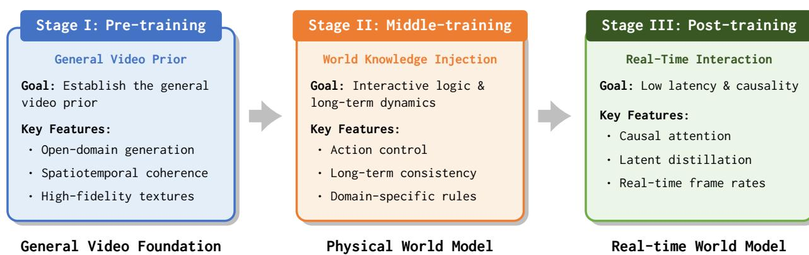  
causal attention and few-step distillation to achieve low latency and strict causality.

# 3.1. Stage I: Middle-Training — Injecting World Knowledge & Long-Term Dynamics

In  , setting $t = 0$ aligns with the bidirectional paradigm, allowing the model to first capture global temporal dependencies isW e o e or  W specializedat engine tincorporate action control, temporal consistency, and domain-specirules.The key improvements introduced in this stage are as follows: Long-term consistency:To enhance the memory capacity, the model is trained on extendedvideo sequences. By observing long-term contextual frames, LingBot-World learns to mitigate the forgetting" problem durin video generation, ensuring that the generated visual worlremains coherent over minutes o gameplay rather than just seconds. Actn controllabiliy:Tointrduciteractive apacity wencorporate user-efineactn ignal it the model through adaptive normalization [77, 84]. Conditioned on these explicit action inputs, LingBot-World generates a visual world that is no longer driven by stochastic noise but follows user-specifed instructions. Remark:At this stage, the model operates as a holistic world simulator, capable of generating high-fidelity futuretrajectori conditine o actios,thoug it rel nbidirectional attention, which is computatially heavy for real-time rollout.

# 3.1.3 Stage I: Post-Training — Causal Architecture Adaptation & Few-Step Distillation

Thea aor ral wormoeuessit apab interactive generation. By generalizing Eq. (1) to $t \geq 0$ and conditioning on past context $x _ { < t }$ , our formulation seamlessly shi he ual para ablnghee--steee eireotcWhil heag Ie captureeworynaicratey sanarietioalifusnmoelarectatnaly proibiv deplent ue toralttentionnmulsteitrativnisWedreheitaios : Cal architectureadaptation:We replacefull emporal atentin wih bloc cusal attention, co local bidirectional dependencies within chunks and global causality across chunks.The model, initializ from the igh-noise expert (Stage I), is traine with a mixe-timestep protocol tobride expert specialization. This enables efficient autoregressive generation via KV caching while preserving temporal coherence. -step distillationWe employ distribution matching distillation (D)augmented with sel-rollout traig and adversarial optimization [39, 86, 87]. This dual approach distill a few-step generator that maintains actionconditioned dynamics and visual fidelity across extended rollouts without significant drift.

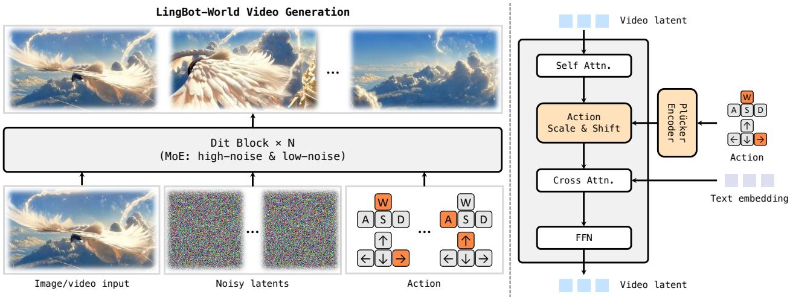  
eoWorao eiWo and shifngfactorsFinaycross-atention laye is appled tocndition theideolatent n tex embedins.

# 3.2 Pre-Training

The goal  the pre-trainig stage is tnd a pre-trained model and provides strong video prior or subsequent stages enabling LingBotWorl togenerate diverse, coherent, and high-fidelity videosRecent advances in word m [ , 6],   G [], v hei fro powerful videndatimodelsThe iddatmode [ , , , ] can provide ro l of interactive physics and controllable visual world generation.To this end, we adopt the 14B-parameter Wan2.2 -ieode [ s -aimoe whi prulareitptu spatiotemporal consistency and generating high-fidelity video content.

# 3.3 Middle-Training

In taia e oenal wo generate  coherent and interactive visual worldWhile the pretrained model demonstrates strong performanc teorally exten iuheiaagThi aonsre pyt. First, ndamental wor odeltaie tcquirong-tertporal onsisen nergent spatlmey, eug thestability the nerate worl e33.Secnd we netune this undamental worl melt ul n e3.Thir ihe wormoe i aaly ei el plel (S3.3.).Throug this mide-rain age, LingBot-Worl gadual learns long-term tmporal consten, spatial memory, and precise action-conditioned dynamics, bridging the gap between random video generation and interactive, controllable world modeling.

# 3.3.1 Fundamental World Model

As shown in Fig., LingBot-Worldtakes an mage r avideo, noisy latents, and user-defined actions as iut to W consistency and spatial memory. The training strategies are as follows: Mixture-of-experts (MoE) architecture. Following the Wan2.2 image-to-video diffusion model [77], which has demonstrated the effectiveness of MoE [51] architecture, LingBot-Worl inherits its MoE desin to prove model perorance whil keierence cost nearlnchang Sincdifferent denoiin tag erve theiown le, LioWordopts tw-exper dsailre toheiffusin prosshigh-noiexpe aivatery poliseeraie spatl anemporal details.Eac exper contai primately pareer, reult toe  r hipevae.h inference-time computation and GPU memory consumption comparable to a dense 14B model. Progressive curriculum training.To enable LingBot-World to achieve long-term video consistency and spatial tait wormoenroetelate eimo by ao uThen prresivel extend heraiur oon  0 con, a . Furee esse hioden aTh motivated byhebservation that long-vide enerationrequires reatermphasis n hig-noisetmestepswhic e e tnh  - generation. Mui-asraonooWorwihhebil prec wor states omia conditions wedopuli-askrain paradicororatingbothmage-to-videoandvide-to-video (i h eapolatio beyon servemotion by predicfutureame fromhistorial sequens By joit otzi theysk ee aonsnc lizrsiv conditions, allowing robust prediction of future world states from arbitrary starting points in time.

# 3.3.2 Action-Conditioned World Model

Aai woetabli el aoy e o simulator by injecting user-defined action signals. Action representation. To enable precise control over the generated environment, we employ a hybrid action a rahat c  moa  cbr   D. Spely weepremotatus Pübedi hi provigmeereentat forntius transoatiosSmulaneusy, disceterctions e encoe s mulot vctorsThe moalit eusecnatenatio lonheanl dmesiThishybrierentati nsure heo handle both smooth view changes and distinct logical state transitions. Action injectin mechanism.Toincororate heeactn sgals intohe diffusion process wihout disrupthe pre-trained visual priors, we utilize an adaptive layer normalization (AdaLN) mechanism [84]. The fused action onnth  cThie aluae namicaly gidinedenois proce eraiame ha cnstent i e e actions. Fineuig paradigmWedopt a parameter-efcit etui stratey preerve he enerativ qualihe fnmeta mopeea blockh e-imetal worey fineune he newly added action adapterlayers (including the actio embeding projections and AdaLN paraeters). Thi ds ive yyoivais Itefetivlyietange een viaty e dal ualecude synthesis abilities while learning to follow control signals.

# 3.3.3 Parallelism Infrastructure

Training LingBot-World, a 28B-parameter fundamental world model, on one-minute video sequences is highly demandng iterm  GUmemoryThis  due the mnaion  thelaremodel size, longtoken n, an mtenvea  dua me t he Tverme hehallenge plmen  parallelisatructueat efcnty ribute uta memory across multiple GPUs. Fully sharded data parallel 2 (FSDP2). To support effcient training of 28B-parameter LingBot-World, we employ FSDP2 [91] olbl  pralisFDP2 ply fu ar hee wheeac GPU hol exced single-GPU memory limits. Moreover, by overlapping communication with computation and leveraging other s ve he-uals o size and GPU counts increase. Context parallel (CP). To mitigate the memory bottleneck arising from long token length, we adopt Ulysses [32] for context paralel stratey.Ulysses irdu sequece parallelism by partitning the put tesor al the tmorl ecdes n striutheiccrsmulUs.Durtetca e atuh locally compute attention over i sequence shardBy sharding the sequence dimension in this way, the perGPU molaaioW to process long sequences in parallel.

# 3.4 Post-Training

I  i ea oapahu difsn forcg mechanism (Sec3..1) [12 Scond we emplo ew-step distillaion ugmented with long-hozn . Tu prriz preserorcpetencsWeainaicuratectn-condinynamoden sustained visual fidelity across extended temporal sequences without accumulative drift.

# 3.4.1 Causal Architecture Adaptation

ModelinitializationRecall that urmidle-traiemode is amixtureo-expets mage-to-vieodiffusiomode ct ulernoepe n o xe ee eliz o eT from ourmiddle-trained model provides inherent advantages throug progressive curriculum learning.Themodel aku angalizabloluvaspealvala  ha aptth expert yields superior action-conditioned dynamics modeling compared to the low-noise counterpart. AriuptaiWapt a a oiv vitorks [1, 60Specialy eeplaull biialaltte i bloc le essieqmets [0,8Wihi  tol u, te attebireionally capturangmporal dependenci ndmaintinocal consistency cross eboriramesAcross chunks, tteti is reualy  tha ken heu n ke hm i elnatiutureramedependencis.Thishybrittentin patte enablesnboundeutoregressive wl lu geratn hrou key-valu cchiWereuse cache repreentais o previous cunks an compuatn only for newly generated tokens, substantially reducing computational overhead at each generation step.

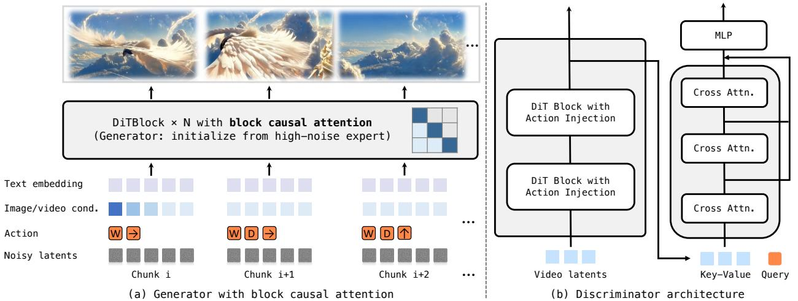  
head $D ( \cdot )$ ttketosoto to mitigate accumulative drift during distribution matching distillation.

Training protocol. During training, we process sequences of $N$ noisy video frames partitioned into $L$ chunks, where e chunk is asne andependent noiee ollowinheifusonorci paraim [, 8]Te tai h ioena ic target timesteps $\{ t _ { 1 } , \ldots , t _ { m } \}$ that serve as distillation targets in subsequent stages. These timesteps are chosen to span t whic was excusivey traine n highnois conditions wment te trainng wi cn ramesupervisin y ite  [ ]Tiab eode eceateial nT is formulated as follows, where $G _ { \theta }$ is the student network, $p ( x )$ denotes the distribution of video data, and $a$ is the action condition.

$$
\mathcal { L } = \mathbb { E } _ { x ^ { i } \in p ( x ) , t \in \{ t _ { 1 } , \ldots , t _ { m } \} } \left\| \boldsymbol { G } _ { \theta } ( x _ { t } ^ { i } , t , a ) - x _ { 0 } ^ { i } \right\| ^ { 2 } ,
$$

# 3.4.2 Few-Step Distillation with Long-Horizon Training

W aculate beyondtheraihorizon ue dstriutn misath betweainnderencns. T al pensior training with advanced distribution matching techniques. SF [04 ha ra or ol-alca r deve bu vye fo ratntactlatorsThipa su hat hemo  ha tu hhat aurlly  urressaan ustantal u olo aear gradients only through the most recent $K$ generation steps while maintaining the full context for forward computation, balancing training efficiency with long-term dependency learning. Distribution matching and adversarial optimization.We apply distribution atchingdistilltion (DMD) coined versarltizain [8, 7] trove same qualiyn poal consseyWeu heide MoE teacher model as our real score unction and initialize the fake score model using the same MoE teaerfor full-step score matching. For action-conditioned generation, the gradient with respect to student parameters $\theta$ is:

$$
\nabla _ { \theta } \mathbb { E } _ { t } \big [ D _ { \mathrm { K L } } \big ( p _ { \theta , t } \| p _ { \mathrm { d a t a } , t } \big ) \big ] = - \mathbb { E } _ { t , \hat { x } _ { t } \sim q _ { t \mid 0 } ( \hat { x } _ { t } \mid \bar { x } ) , \bar { x } \sim p _ { \theta } ( \bar { x } \mid a ) } \left[ \big ( s _ { \mathrm { r e a l } } \big ( \hat { x } _ { t } , t , a \big ) - s _ { \mathrm { f a k e } } \big ( \hat { x } _ { t } , t , a \big ) \big ) \frac { \partial \hat { x } } { \partial \theta } \right] ,
$$

where ${ p } _ { \theta , t }$ is the student distribution at timestep $t$ $p _ { \mathrm { d a t a } , t }$ is the data distribution at $t , \tilde { x }$ are the clean samples generated by the student, $\hat { x } _ { t }$ are the noisy version obtained via forward diffusion, $a$ is the action condition, $s _ { \mathrm { r e a l } }$ and $s _ { \mathrm { f a k e } }$ are the aa o ue el ndeorkpetiyThi dien i alent e tractable optimization objective:

$$
\mathcal { L } _ { \mathrm { { D M D } } } ( \theta ) = \mathbb { E } _ { t , \hat { x } _ { t } , \hat { x } , a } \left[ \frac { 1 } { 2 } \left\| \hat { x } - \mathrm { s g } [ \hat { x } - ( \mu _ { \mathrm { r e a l } } ( \hat { x } _ { t } , t , a ) - \mu _ { \mathrm { f a k e } } ^ { \phi } ( \hat { x } _ { t } , t , a ) ) ] \right\| ^ { 2 } \right] ,
$$

where $\mu _ { \mathrm { f a k e } } ^ { \phi }$ $\phi$ and $\mathrm { s g } [ \cdot ]$ denoes h dno u $\mu _ { \mathrm { f a k e } } ^ { \phi }$ diffusion loss on student-generated videos, while the real score network $\mu _ { \mathrm { r e a l } }$ is kept fixed. Following [86], we adopt a $\mu _ { \mathrm { f a k e } } ^ { \phi }$ $\mu _ { \mathrm { f a k e } } ^ { \phi }$ closely tracks the student's evolving output distribution, improving training stability and distillation quality. However, a performance gap remains between the distilled generator and the teacher model after DMD training; F lonoisemodel ie the mpoet rsonsible or nedetails and high-requecy nthesi.Second werepace the sk vn pe  r qualMont Mai aoorh r alavi [ehe theisiator earnsstuislvidonthesize.Bycoporatupeisinom la theis hi realism and perceptual quality. Concretely, we attach a classification head $D ( \cdot )$ to the fake score network in DMD. The architecture of the head follows the design in APT [39]. The adversarial objectives are:

$$
\begin{array} { r l } & { \mathcal { L } _ { G } = \mathbb { E } _ { p ( \tilde { x } ) } [ f ( 1 - D ( \mu _ { \mathrm { f a k e } } ( \tilde { x } _ { t } , t , a ) ) ) ] , } \\ & { \mathcal { L } _ { D } = \mathbb { E } _ { p ( x ) } [ f ( D ( \mu _ { \mathrm { f a k e } } ( x _ { t } , t , a ) ) ) ] - \mathbb { E } _ { p ( \tilde { x } ) } [ f ( 1 - D ( \mu _ { \mathrm { f a k e } } ( \tilde { x } _ { t } , t , a ) ) ) ] , } \end{array}
$$

where $p ( x )$ and $p ( \tilde { x } )$ denote the distributions of real and synthesized videos, respectively. $\mu _ { \mathrm { f a k e } }$ is the fake score network, $t$ denotes the current denoising timestep in self-forcing [30], and $f ( \cdot )$ is the softplus function. Notably, the adversarial loss is used only to update the discriminator head $D$ , while the fake score network $\mu _ { \mathrm { f a k e } }$ is updated solely with the DMD l. Ino    u R [  e Mi in eWith thi umenteversaraljecive weustantalyrove al qualy wh prei action-following ability and maintaining temporal consistency over long horizons.

# 4 Evaluation

# 4.1 Qualitative Analysis

# 4.1.1 Diverse Results

Wvazablato traineodel LiBoWorBaseandhe post-raodel LinBotWorFasros ivers

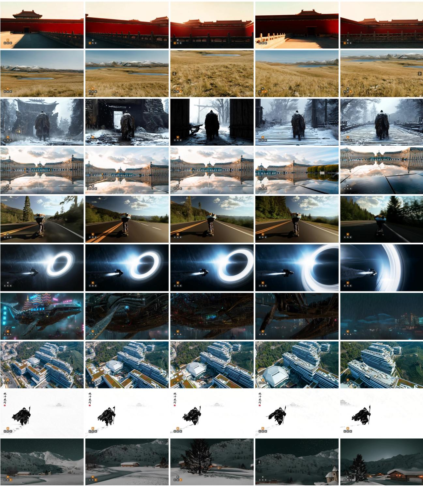  
Figure 7. Qualitative results of LingBot-World-Base .

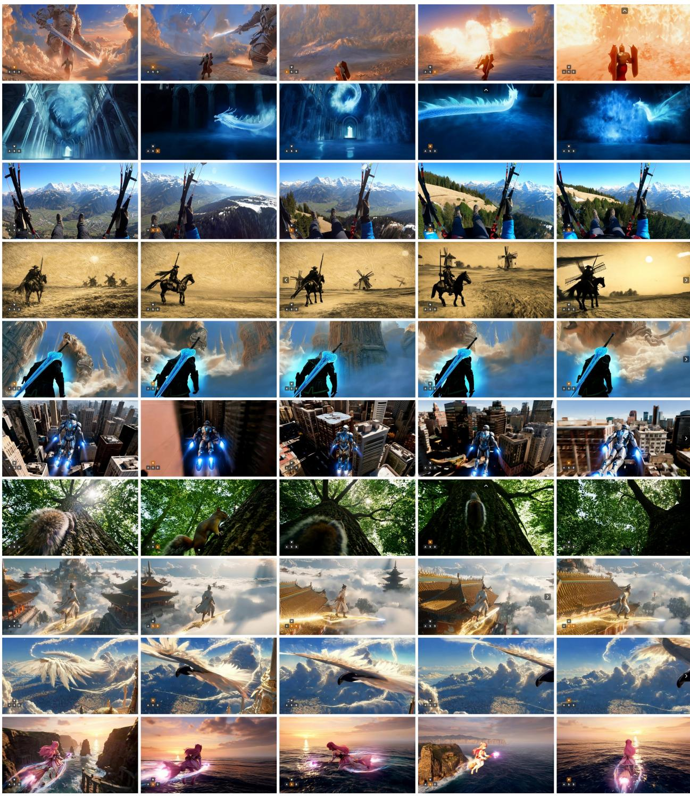  
Figure 8. Qualitative results of LingBot-World-Base .

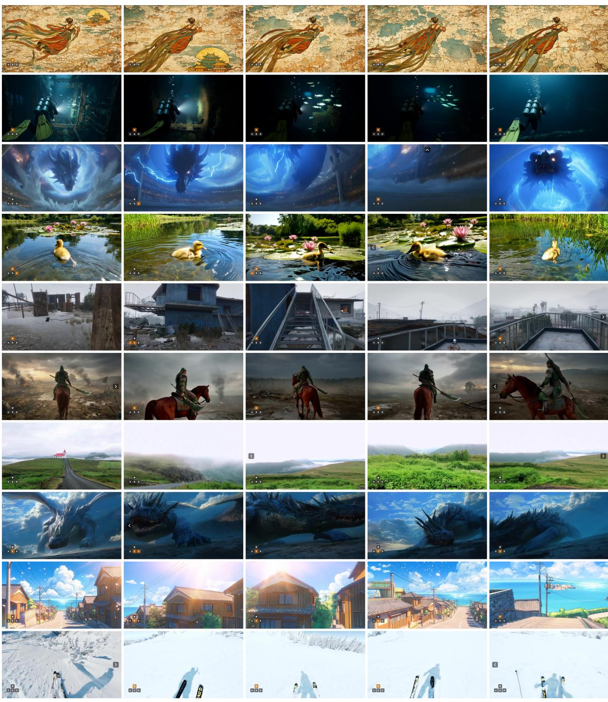  
Figure 9. Qualitative results of LingBot-World-Base .

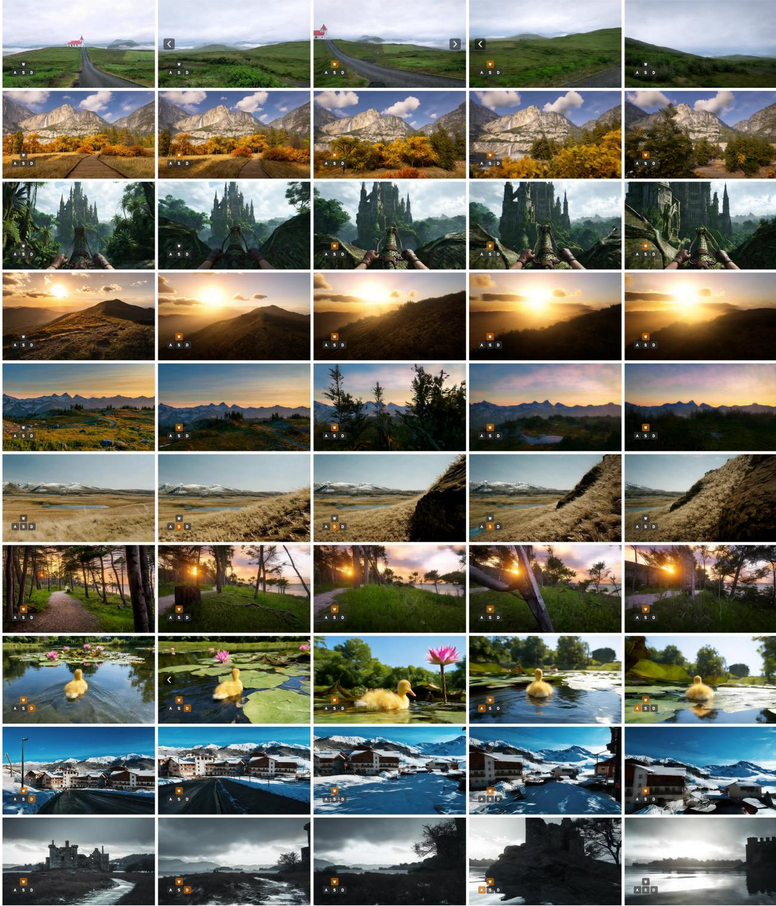  
Figure 10. Qualitative results of LingBot-World-Fast .

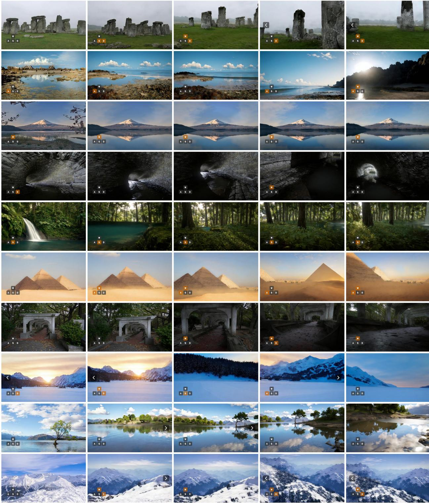  
Figure 11. Qualitative results of LingBot-World-Fast .

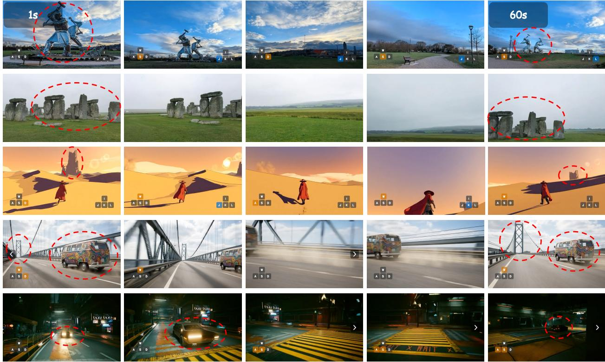  
c out of view (row 5).

Fis.7 to 9 visualize the results from LingBot-World-Base, where each row displays keyframes sampled over time. F hel iBoWohaiven o proper n compe spatl conurations.The transitin betwe rame rmas ooth and licly consistent, highlighting the model's ability to capture fine-grained environmental dynamics. Building upon this, we further analyze LingBot-World-Fast, our real-time variant, which achieves 16 fps throughput when processing $4 8 0 \mathrm { p }$ videos on a system with one GPU node. Although the acceleration process introduces e ulhel al W t that it achieves an optimal balance between inference speed and generation quality.

# 4.1.2 Emergent Memory Capability

A ky property LiBoWotheee bilaintaossteiho eyi xpl 3D eta uc  Guss at [s o  hers te row  i, e mode pre he e dration up to 60 seconds. This aligns with prior observations [5, 46] that videomodels possess implict memoy for up hai iaspcs rmornamiI aualyode compex on-inam ow moving pedestrians that are notoriously difficult for traditional static 3D representations to capture. Beyond merey nderiisibynamics, themodeleve merges whthe capabilityreason about he volu ao eu l

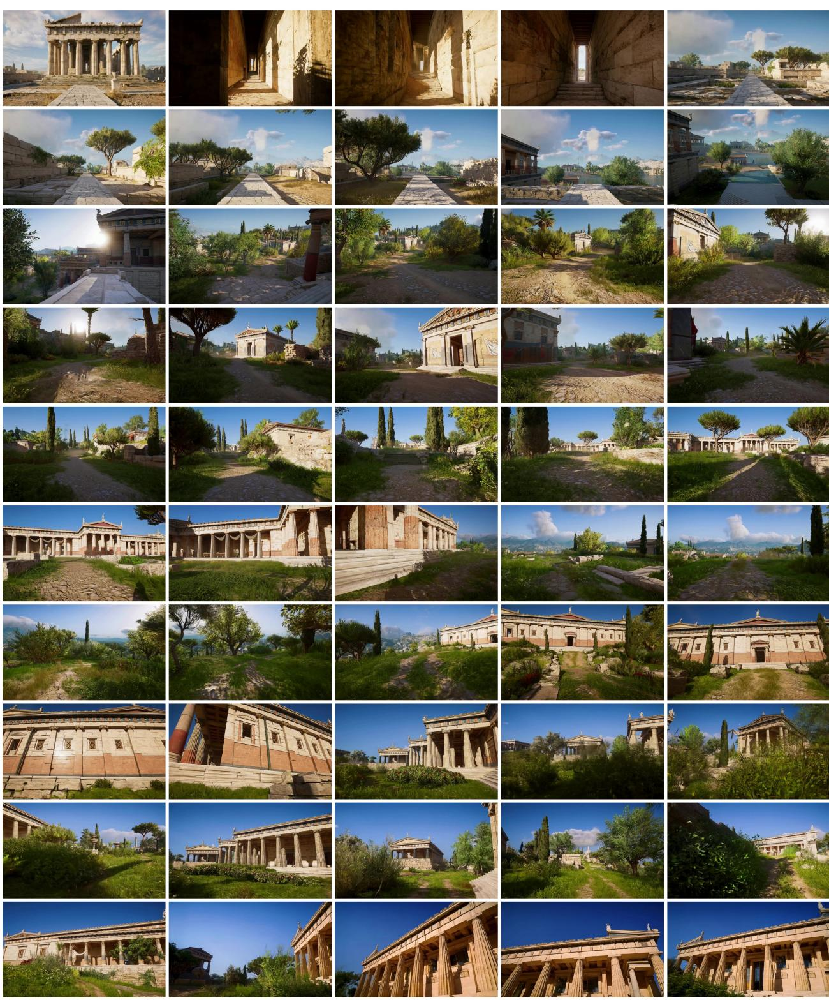  
FuUoabe extending up to 10 minutes in duration.

Ta e   .

<table><tr><td>Model</td><td>Imaging Quality</td><td>Aesthetic Quality</td><td>Dynamic Degree</td><td>Motion Smooth</td><td>Temporal Flickering</td><td>Overall Consistency</td></tr><tr><td>Yume-1.5 [45]</td><td>0.5838</td><td>0.5185</td><td>0.7612</td><td>0.9709</td><td>0.9545</td><td>0.1994</td></tr><tr><td>HY-World 1.5 [68]</td><td>0.6512</td><td>0.5487</td><td>0.7217</td><td>0.9897</td><td>0.9773</td><td>0.2016</td></tr><tr><td>Ours</td><td>0.6683</td><td>0.5660</td><td>0.8857</td><td>0.9895</td><td>0.9648</td><td>0.2178</td></tr></table>

pa spatio-temporal consistency of the real world rather than just memorizing pixels.

# 4.1.3 Exploring the Generation Boundary

As emstrateFi we puhhendariporalcherencidntheiOurmodei p e l qualu n temporal dependencies.

# 4.2 Quantitative Analysis

For qtiaivaluatn, cserha valti proo r womoel asnt the proposed method is based on video generative models, we conduct a comprehensive analysis using VBench [31] on a curated test set comprising 100 generated videos, each exceeding 30 seconds in duration. We compare our LinBot-World against two state-of-the-art video world models: Yume-1.5 [45] and HY-World 1.5 [68]. As shown for an immersive user experience during interactive world roaming. Crucally or  teractive world mode, ur modelexhibs niant vantageynaidegre i a score of 0.8857 compared to 0.7612 for Yume-1.5 and 0.7217 for HY-World 1.. This substantial margin suggests tha urodepaat ns noceotons, asephe prompts throughout long-term generation. Foreul al coparable he dbaseH-Wor .This nsue hat  eate vid i uide i interactiv envrnment but alsomaintains superir visual qualityand consistenc compare t existapre.

# 5 Applications

Our autoregressiveramework transforms video generation intoannteractivsmulation by conditionin yh o oaua n ts  csThul ebil ae he ve arreasksIhic ware p nabur ( prptableworl events wheresrs emanally control gobalandloalynami vitext(actin t, whcleverage he sulator autoous exploratin polics; and ( 3 reonstructionwhi vliatehe emergent geometric consistency and long-term spatial memory of our generated environments.

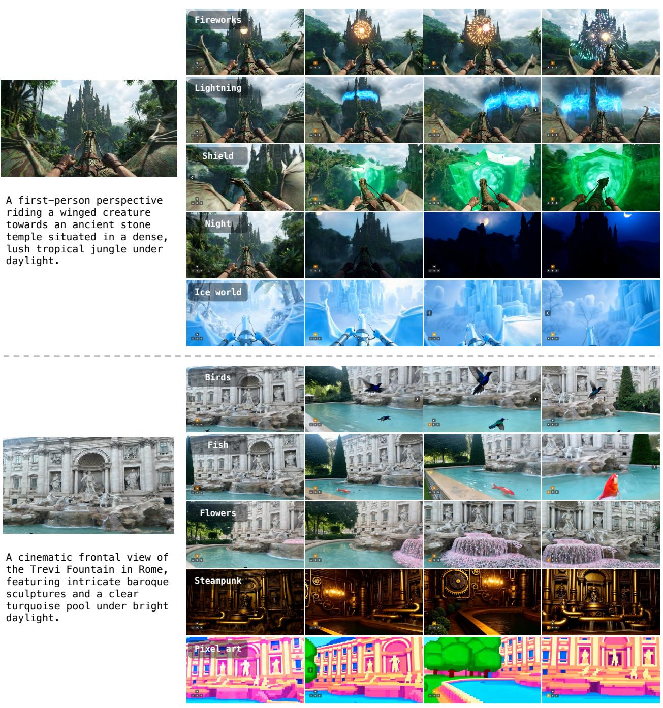  
interventions (e.g., "fireworks", "fish"), all while maintaining physical and temporal coherence.

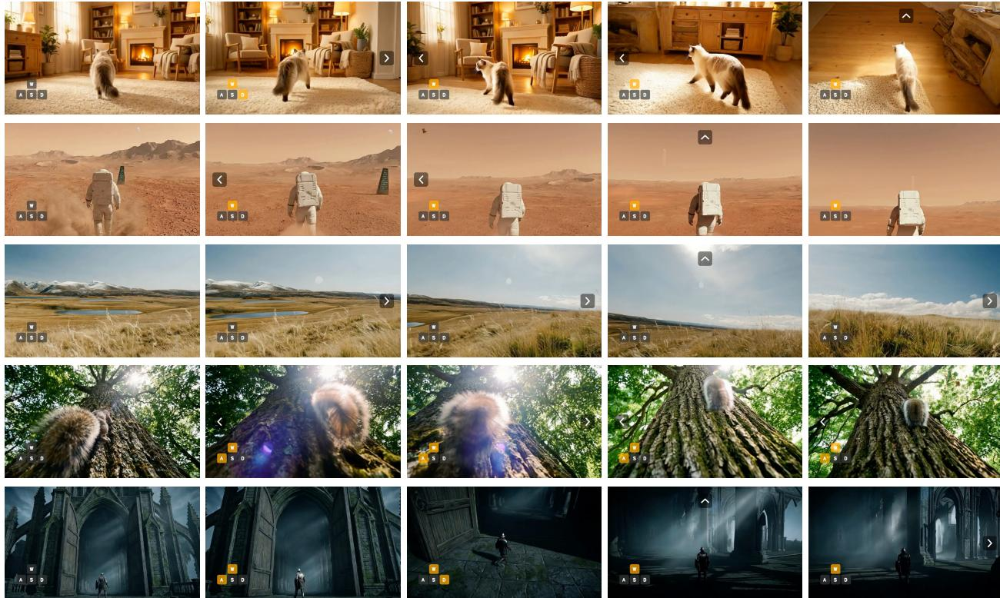  
generation.

# 5.1 Promptable World Events

Inspvvahtivo where the simulation unfolds differently based on interaction.To this end, we demonstrate poromptable world iihpabilyor erat po oteii pntv pb prompts. This steerability opens up two critical capabilities.

# 5.1.1 Global Events

Global events eeholimodifcations  the smulatio vionment, ncludi weather condiions, l, an sylis enderLeveragi he ex-condialnature ur base modeland thevarint  Ditt [3], we s hhrTh ct het yslseasae mi   suree  y y the underlying geometry and motion dynamics.

# 5.1.2 Local Events

Leet vole renejeentnthe es how os fonaiOuroel mlesscoporate ncmets the volvi e sri hysically aht It

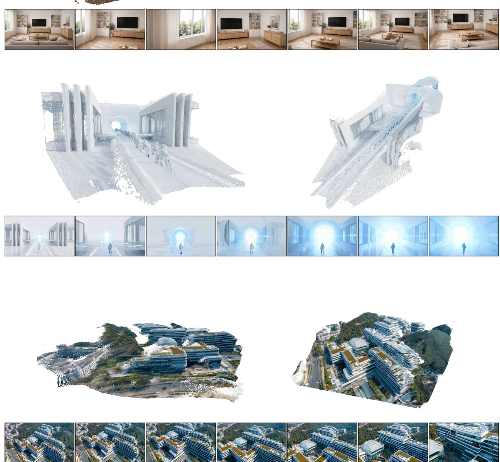  
outdoor scenarios demonstrate high spatial consistency and geometric fidelity across diverse environments.

# 5.2 Action Agent

Be-diwomode diave atra t thainers motionynamirom igisual bservations anncentivize virment exploration,nablime effective use of the dataset. Formally, we fne-tune the Qwen3-VL-2B [75] backbone  mage-action pairs.Each trainig example consistsf a visual observation followed by a sequence of action chunks $( a _ { 0 } , a _ { 1 } , \ldots )$ , where each $a _ { i }$ specifies the subsequent action i actions. In our setup, the agent outputs the actions for the next 10 seconds, including discrete keyboar controls W, A, S ) orlocomotion and discretize mous drections (, J, K, L) or amea rotatons.The predicte actis are then converte intomotion trajectoris and passed to the world model to generate the corresponding videorollout. Visualizations of the generated result are shown in Fig. 15.

# 5.3 3D Reconstruction

Benetromh-qualrgcaleon-horiain LiBoWrhib  eent pabil 3D spa consistencyand lon-ter spatialmemoryAs shown n Fig16, by leveragin large-scale 3Dreconsrucin foatoe [38 ], werteonvert eratvie t-qualie pois. T aae for downstream bodie inteiencetrainingSuc mergent 3D consistency efectively alleviates the cross-viw inconsistency commonly observe in conventional video generation models, thereby enabling superior scenefidlity and geometric accuracy.

# 6 Conclusion and Discussion

# 6.1 Summary: A New Open-Source Frontier

In this report, we present acomrehensivframework that establishes a new open-sourceontieror word model, ivey riihe ap betwe videneration acasulaioOurntrbutis cover h aniven -ooTe appliationsmsratiemode pabileeuients pecnstent wor and supporting 3D environment reconstruction.

# 6.2 Limitations hedvanceents, evel hallengeemaichieviullymersivean persisten virtul wrl

Memory stabilityurrentl themodememory  mere abiliyderiverohe contet wndahe than an explicit storage module.Consequently, it lacks stability, leading to inconsistencies during long-term simulation. Computational cost: The inference cost remains high. Running the model requires enterprise-grade GPUs, making it inaccessible to consumer-level hardware. Limit acti spaceThe rang contollable actn is currenty restritThe mode pririy ane navigation and basic movements, lacking a diverse repertoire of complex interactions. Interaction precisioFinegrainecontrol remains diffcult.Specifically, interacting with  specare e he grounding. •Generation length & drifting: The coherent generation length is insuffcient for extended gameplay. As the vioenc, he suffo is hehe  ay os structure. ea satTheuuporteg perspe n  o for multi-agent interactions.

# 6.3 Next Steps

Lookiahedweaim todress theemitatons throug atargeeradmap.Our primary gals tiy e a vls enable longer video generation, paving the way for infinite-time gameplay and more robust simulations.

# 7 Contributors

Base Model: Zelin Gao\*, Qiuyu Wang\*, Yinghao Xu, Shuailei Ma Post Training: Yanhong Zeng\*, Jiapeng Zhu\* Games Data: Ka Leong Cheng\*, Yihang Chen, Jie Liu, Yansong Cheng, Yao Yao Rendering Data: Yixuan $\mathrm { L i ^ { * } }$ , Jiayi Zhu Data Pipeline: Hanlin Wang\*, Yihao Meng, Kecheng Zheng Applications: Qingyan Bai, Jingye Chen, Zehong Shen, Yue Yu Project Sponsor: Xing Zhu, Yujun Shen Project Lead: Hao Ouyang $^ *$ denotes the leaders of each sub-module.

# Acknowledgments

We thank Yu Chen, Zikun Dai, Xiaoyue Duan, Biao Gong, Zhengyu He, Liangxiao Hu, Ting Huang, Bo Jiang, Tao J Haoo Li, Yanan Li YanLin, Fei Lu,Tina Lu,Yu Lu, Ja Qian, Yipeun, J Tian, Yanmeng Wang, Yuanyuan Wang, Yunnan Wang, Leyi Xu, Min Yao, Yufeng Yuan, Han Zhang, Qihang Zhang, SahanZaSuZhoTZhouistlphialyas meorhaluis and assistance.

# References [oo world modeling: Visual details matter in atari. In Adv. Neural Inform. Process. Syst., 2024.

[2issBarDavin, u GrRusHo o acy, aRobet osia rtZols S GeartaRobr Hogan ane, oaalob as  o Ma Sarahanr, FaziskaMeiYn Lun MichelRabbat, andNicolas BalsV-eSel-upeisvi models enable understanding, prediction and planning. arXiv preprint arXiv:2506.09985, 2025.

[3] Qinn Bai, Quyu Wag, Hao Ouyang, Yue u, Hanin Wng, Wen Wang, K Log Cheg, ShuailiMa, Yng Zeng, dataset. arXiv preprint arXiv:2510.15742, 2025.   
o retrieval. In Int. Conf. Comput. Vis., 2021.   
kB BeB HolheAksaer Holynski Jr rorisosKaplanisMarit,MaGiankoOlive Jac u  e    i B JrBerbeDvB kBuavu SaBio, Boan DaocVibhaDasagi Maxi Gaze har GadaosiWoyu Han,E Hirst, hyaaKachra, Lucier, Kristia Kjems, EvaKnoepel, VikaKoriaki, JeicaLo, CongLu, ZebMerig, Alex Moufarek, HeaNandwai Vi Fr    o Hen   o S i      H y Won Keyang Xu, Cristohr Yew, Nick Young Vadim Zubov, Douglas Eck, DumitErhan, Koray Kavukcuglu Demis Hassabis, ZoubinGharaman Raia Hadsel ron vnen Oord InbarMosser Adri Bolton, Satiner Singh, and Tim Rocktäschel. Genie 3: A new frontier for world models, 2025.   
r n re  e . Pattern Recog., 2025.   
rBarTalHilhe, vr Her Ro  h ZaaEhra, uur i  i Oliv W n    I os. Lumiere: A space-time diffusion model for video generation. In SIGGRAPH Asia, 2024.   
[8d Blattan,TimDockoSumh Kual Dan Mendevith, MacKilan DoLorez, YamLvi, Zion oaa models to large datasets. arXiv preprint arXiv:2311.15127, 2023.   
Bie  o il,  uo Ji a JT Luan Clarence, Ricky Wan, andAdityRamesh.Vidoeeraion model as worl simulators.OeAI Blo, 2024   
[k, c-oliH, Ric Sterwal hri ps  lGenGenerativeteaciveviets. InInt.oMach. Lar   
/ Breakthrough/PySceneDetect, 2018.   
[2 Bhen, D ros, Ylu u, ax o, uss ake, nd . : Next-token prediction meets full-sequence diffusion. In Adv. Neural Inform. Process. Syst., 2024.   
[u  i J T i   
n  hu HZhe Zhe, Chengeng Ma, Weimig Xiong, Wei Wang, Nuo Pang, Kang Kang, Zhihg Xu, Yuzhe Jin, Yupeg Liang, Yubi Song, Zhao B u i u ebai Ze n  ndYahu Zhouyreels-:I-ef generative model. arXiv preprint arXiv:2504.13074, 2025.   
n Xi       e H  , au  ahuLiFeZhaand JiaqiWhartvidpiviodand with better captions. In Adv. Neural Inform. Process. Syst., 2024.   
[ei D H uon, Hsin-Ying Lee, Jian Ren, Ming-Hsuan Yang, et al. Panda-70m: Captioning $7 0 \mathrm { m }$ videos with multiple cross-modality teachers. In IEEE Conf. Comput. Vis. Pattern Recog., 2024.   
HG , y  i aT Conf. Comput. Vis., 2018.   
[18] Epic Games. Unreal Engine. https://www.unrealengine.com/, 2023. Accessed: 2026-01-25.   
[B hz efficient sparsity. JMLR, 2022.   
[0  , 2025.   
[o    u e Bengio. Generative adversarial nets. In Adv. Neural Inform. Process. Syst., 2014.   
[yyr ZaRhr , Hao Jian, Miao Liu, Xingyu Liu,Miguel Martin, Tushar agaraja, ijaRadsavovic Sntosh KumarRamakian, FinRyan, Jayant Shar, Michael Wray, Mengeg Xu, EricZhongong Xu, Chen Zhao, Siddhat Bansal, DhruBaa, F,Abra Gebreelasie ristGonzal Jme Hills, XuhuHuan Yei Huang Wenqi JiaWesho Jachy Kol SatiKottr nuuar, FederiLand hai, YangaLi, ZheLi, KarieaMaal Rv M Jauo Tur Tkish ili ol  Me  Le Sari Kira Smadara, Audrey Southrland Yusuke Sgano, RuijTao, Min o,Yuchen Wan, Xindi Wu,Tauma Ya Zi ZhaoYuy Zhu Pablob Daviana DmamGovMarriearis, Beha ihap, r Hany Jooi itaHai  Rieu Hyurk  Ji a u 2022.   
video generation with diffusion models. In Eur. Conf. Comput. Vis., 2024.   
[24] David Ha and Jürgen Schmidhuber. World models. arXiv preprint arXiv:1803.10122, 2018.   
[ C isi B  a, oe, n, y rVculaB Ze Realtime video latent diffusion. arXiv preprint arXiv:2501.00103, 2024.   
[ preprint arXiv:2301.04104, 2023.   
[Xie, Zu  Zha  FBJi R Bi Xu,HaoXia Guo GonzeWu, Wi  Xuc o anLuY L d  Zo. Ma.000   
[c o ur u, oui iYolGo i a, memory. arXiv preprint arXiv:2512.04040, 2025.   
robotic manipulation with language models. arXiv preprint arXiv:2307.05973, 2023.   
0 uH   e  o e autoregressive video diffusion. arXiv preprint arXiv:2506.08009, 2025.   
Zi He, Ju, a  haTu,, NataY XienWDhu Ziwe benchmark suite for video generative models. In IEEE Conf. Comput. Vis. Pattern Recog., 2024.   
[2] SmdeJacobs, Masao anak, Chei Zhag, Mi Zhang Suaen Leon ong, Smyam Rajhand, and YHe . arXiv preprint arXiv:2309.14509, 2023.   
In Int. Conf. Comput. Vis., 2015.   
a field rendering. ACM Trans. Graph., 2023.   
[35] Yann LeCun. A path towards autonomous machine intelligence version 0.9. 2, 2022-06-27. Open Review, 2022.   
iyou n   z, ZhGhSa  ol i cal ca  u har arXiv:2006.16668, 2020.   
Zei RiTuckeoole,QWan LinVicke, e Ho, nNa SavelegSMccuae, Fas nRobu runMotioCsual naiVidos In  o Comput. Vis. Pattern Recog., 2025.   
: Recovering the visual space from any views. arXiv preprint arXiv:2511.10647, 2025.   
video generation. In Int. Conf. Mach. Learn., 2025.   
[0] Shanhu Ln, Cu ng, Hao He, Jae Jang, Yuxi Ren, Xin Xia, Yang Zhao, Xueg Xiao, and Lu J. AsiaiX09   
[ Xg Q ZoK Zha Z Zha  Wg, Zh u,Lu Xi Wii i ioo n  Se Ra uo, Q i: Learning embodied intelligence from physical simulators and world models. arXiv preprint arXiv:2507.00917, 2025.   
[ H , We BZhB K o  J T  H, YunCe e Han Xu ZhXi hoRuaDee ao i understanding. arXiv preprint arXiv:2403.05525, 2024.   
[3 u, Zeg Hoo Ha Oya, y Wag Lheg a Zhu, He o, Zi Xie matching distillation. arXiv preprint arXiv:2512.04678, 2025.   
[ T LH J H h images with few-step inference. arXiv preprint arXiv:2310.04378, 2023.   
[5 XiMao Zhe   XiXu, iig, Tn He, Jg u Qo, di. Yume-1.5: A text-controlled interactive world generation model. arXiv preprint arXiv:2512.22096, 2025.   
[Me Huu, QyuWa WnW Loe, Ha hen, Zh o oulo arXiv:2510.20822, 2025.   
[ Lr ce d er  Soi Whice  GAs ceg. Conf. Mach. Learn., 2018.   
ian uT u assistants. In Int. Conf. Learn. Represent., 2023.   
[49]Microsof.Direc shadercompilerhttps://ithub.com/microsoftDirectXShaderCompiler,2017.Acessed: 026- 25. scenes as neural radiance fields for view synthesis. Communications of the ACM, 2021.   
arXiv:2503.07137, 2025.   
[52] NVIDIA. Cosmos world foundation model platform for physical ai. arXiv preprint arXiv:2501.03575, 2025.   
[53] NVIDIA. World simulation with video foundation models for physical ai. arXiv preprint arXiv:2511.00062, 2025.   
[54] OpenAI. GPT-4 technical report. arXiv preprint arXiv:2303.08774, 2023.   
[5WiliPeeblesn Sai Xi. calale  oe wh ts. I It.out. is 3.   
o JoWoi HaGa o G y, supervision. In Int. Conf. Mach. Learn., 2021.   
[7 XRe, Y u, Ta o, Ryo, he Hu br T en, Tb, Jay Zhanie Wu, Runjan Chen, Seung Wook Kim, Jun Gao, Laura Leal-Taixe, Mike Chen, Sanja Fidler, and Huan LCosos-drivedreamsScalabe ynthe drivi dat eeratn wh wor foundtion models.ai p arXiv:2506.09042, 2025.   
uo controllable multi-view generative world model for autonomous driving. arXiv preprint arXiv:2503.20523, 2025.   
H, 2022.   
[60] Sand.ai. Magi-1: Autoregressive video generation at scale. arXiv preprint arXiv:2505.13211, 2025.   
with graph neural networks. In IEEE Conf. Comput. Vis. Pattern Recog., 2020.   
J 2016.   
[ BiXi..   
[r ak   Xi   , Har  o a ukText preprint arXiv:2209.14792, 2022.   
[ aei v:3..   
[ h01 a wild. arXiv preprint arXiv:1212.0402, 2012.   
Int. Conf. Multimedia, 2024.   
[8Wn, Ha Za HW JWu,Zeha W gWa Ju ZhaT WnWoryTa -er liv or arXiv preprint arXiv:2512.14614, 2025.   
[ QLuHu-Insoltv  wooeXi erXiv:11. 2025.   
[G TeG ulli  rXi:1.180, 3.   
oHei arXiv:2412.03603, 2024.   
[72] Meituan LongCat Team. Longcat-video technical report. arXiv preprint arXiv:2510.22200, 2025.   
[73] Mirage Team. Mirage 2. https://www.mirage2.org/. Accessed: 2026-01-26.   
2025.   
[75] Qwen Team. Qwen3-vl technical report. arXiv preprint arXiv:2511.21631, 2025.   
2025.   
[Wan Team. Wan: Open and advance large-scal video generative models. arXiv preprint arXiv:2503.20314, 2025.   
arXiv:2408.14837, 2024.   
[H Ho  uLohea, B e  Ze Xiuu She  e h  s oi events with reference images, trajectories, and text. arXiv preprint arXiv:2512.16924, 2025.   
[Ruhn JoZh Z XiXiLo Ha Zhua Xuondaca annotations. arXiv preprint arXiv:2509.09676, 2025.   
[ Ja , Mio hen, Nikarv,ndVedalruppret, nd David Novoy:Visal geometry grounded transformer. In IEEE Conf. Comput. Vis. Pattern Recog., 2025.   
[ i e  T, F WnZa3e conditions and video content. In IEEE Conf. Comput. Vis. Pattern Recog., 2025.   
3d gaussians for generative dynamics. In IEEE Conf. Comput. Vis. Pattern Recog., 2024.   
[u In Adv. Neural Inform. Process. Syst., 2019.   
[a WH RuhuYic i YXi WMu ie, , YL SHanhLivXeiv:. 2025.   
[ distribution matching distillation for fast image synthesis. In Adv. Neural Inform. Process. Syst., 2024.   
diffusion with distribution matching distillation. In IEEE Conf. Comput. Vis. Pattern Recog., 2024.   
[   e uH bidirectional to fast autoregressive video diffusion models. In IEEE Conf. Comput. Vis. Pattern Recog., 2025.   
[   B  hu,  o , and Yahui Zhou. Matrix-game: Interactive world foundation model. arXiv preprint arXiv:2506.18701, 2025.   
[0 u uu Yuan. Waver: Wave your way to lifelike video generation. arXiv preprint arXiv:2508.15761, 2025.   
[ Zhaod u,Rar Lauo i-ChiHuMn u Lss ri HahoyOtt, S alBuG uc , anShenLyor :eee caliuhar data parallearXi preiarXiv:304.1 3.   
u lRtVisi-anueactoderansr weoweebocntro In onRobo Lear 03.