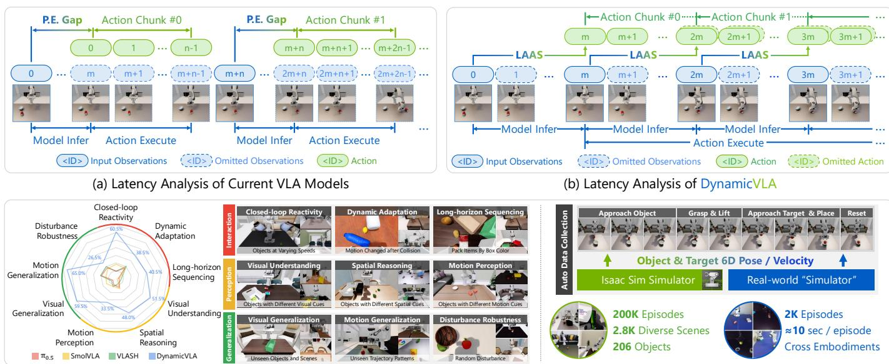
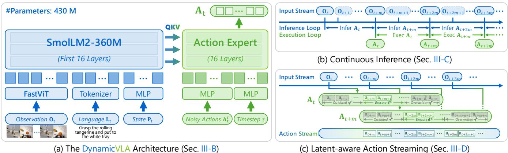
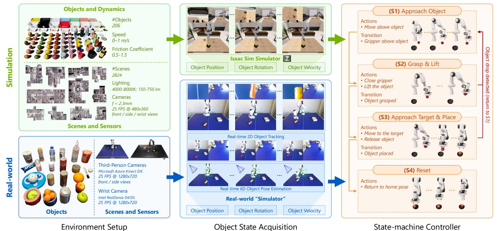
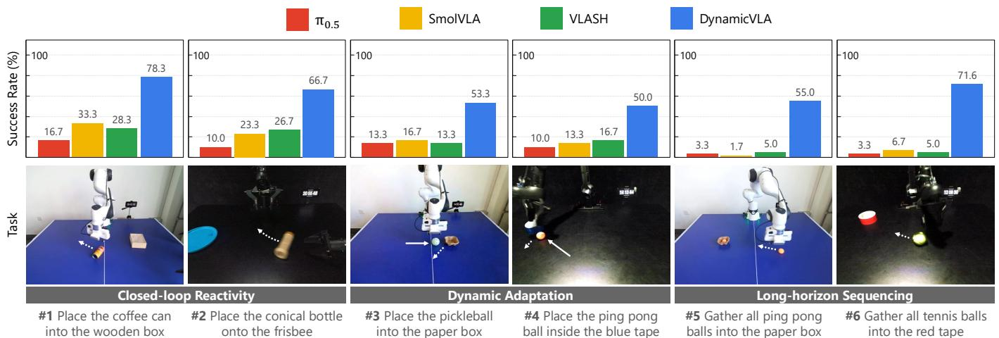
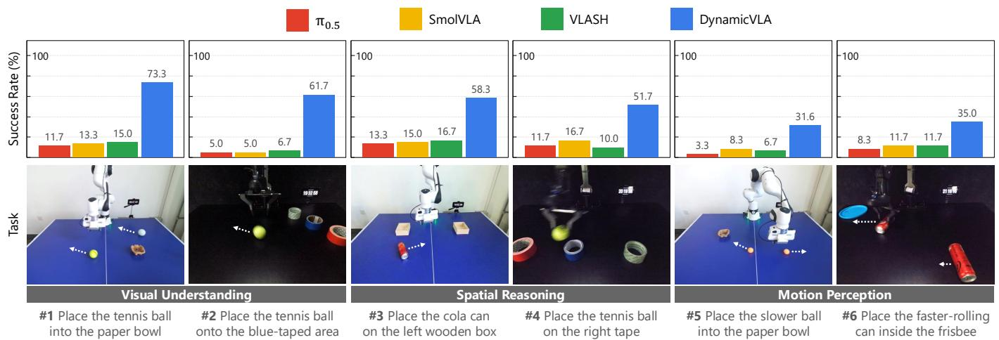
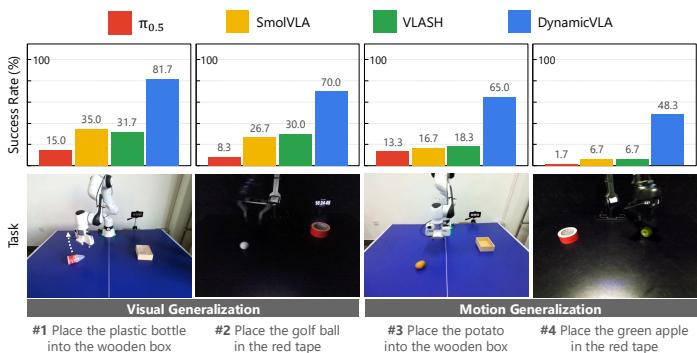

# DynamicVLA：用于动态物体操控的视觉-语言-行动模型

谢浩哲\* 温蓓晨\* 郑家瑞 陈照熙 洪方舟 廖海文 刘子维 S-Lab，南洋理工大学 https://haozhexie.com/project/dynamic-vla

  
(c) Dynamic Object Manipulation (DOM) Benchmark   
iiessuro ate-wacte AASn Iasula while it auto data collection pipeline enables effiient gathering of 200K synthetic and 2K real-world episodes.

摘要—操控动态物体仍然是视觉-语言-动作（VLA）模型面临的一项挑战，尽管在静态操控方面表现出强大的泛化能力，但在需要快速感知、时间预判和持续控制的动态场景中却显得乏力。我们提出了DynamicVLA，一个动态物体操控框架，通过三项关键设计集成了时间推理和闭环适应：1）一个紧凑的0.4B VLA，使用卷积视觉编码器进行空间高效、结构保真编码，能够实现快速的多模态推理；2）连续推理，允许重叠的推理和执行，以降低延迟并及时适应物体运动；3）潜变量感知的动作流，强制执行时间对齐的动作执行，从而弥合感知与执行之间的差距。为了填补动态操控数据的基础，我们引入了动态物体操控（DOM）基准，该基准从零开始构建，配备一个自动数据收集管道，可以高效收集200K个合成事件，涵盖2.8K个场景和206个物体，并且无需遥控快速收集2K个真实事件。大量评估表明，在响应速度、感知和泛化能力方面显著提高，确立了DynamicVLA作为统一的动态物体操控框架，适用于各种表现形式。

# I. 引言

动态物体操控是机器人技术中的一个基础但尚未深入探索的前沿领域。现实世界的交互通常涉及运动中的物体，例如递送、重新定位或稳定物品，这要求机器人在快速变化的条件下进行感知、预测和行动。即使是微小的延迟也可能导致任务失败，使得动态操控成为一个比静态抓取更具挑战性的问题。迄今为止，机器人在移动目标上进行了评估，例如投掷、足球和乒乓球，依赖于反应控制和仅在结构化环境中有效的手工制作感知管道。近期的工作，如DBC-TFP和GEM，将操控扩展到移动物体，但仍然限于可预测的、像输送带一样的运动。同时，包括RDT2、RTVLA和VLASH在内的并行VLA模型展示了与快速移动目标的实时交互，但这些任务能够容忍时序和空间误差。例如，一个球拍可以在一个较大的区域内回击球，因此交互并不需要动态物体操控所需的精确6自由度控制。然而，涉及不确定运动、精确接触和紧密感知-动作对齐的开放式动态操控在很大程度上仍未得到解决。尽管VLA模型在静态操控上表现出强大的性能，其中物体状态在推理过程中保持固定，但在这些环境中，延迟仅起到次要作用。早期的VLA依赖于3B7B视觉-语言主干，尽管推理较慢，仍然获得了很高的成功率。更近期的设计通过减少模型规模和增加吞吐量来提高效率，同时维持相当的性能。然而，如图1a所示，动态操控提出了更严格的要求，因为推理延迟使感知与动作不同步，并要求模型预测未来物体运动，这是先前的VLA未能解决的能力。为了解决这些问题，我们提出了DynamicVLA，这是一个用于动态物体操控的框架，通过三个关键设计集成了时间推理和闭环适应：1) 一个 compact 0.4B参数的VLA，采用卷积视觉编码器实现高效的空间压缩和更强的结构保持，使动态操控环境下的推理速度更快、体积更小；2) 连续推理，一种管道执行方案，重叠预测和动作执行以消除块间等待，并在动态物体运动下维持连续的动作流；3) 潜在感知的动作流机制，一个感知延迟敏感的执行机制，通过丢弃过时的动作并在每个时间步优先考虑最近的预测，恢复时间对齐，确保尽管有推理延迟，仍能实现时间一致的控制。由于现有的机器人数据集主要捕捉静态场景，并未为动态物体操控提供规模化基础，我们构建了动态物体操控（DOM）基准，使用全自动数据收集管道，在多个机器人实体（包括Franka Emika Panda和AgileX PiPER）上进行了验证。在仿真中，Isaac Sim和我们的任务驱动状态机控制器使用实时的6D物体位姿和速度驱动机器人操控移动物体，生成了200K的试验集，涵盖2.8K多样化的仿真准备的3D场景和206个物体。远程操作在现实世界的动态操控中基本无效，因为快速移动的物体通常超出人类的反应极限。为了解决这个问题，我们构建了一个现实世界的“模拟器”管道，通过双RGB视图进行3D物体跟踪，以估算6D位姿和推断速度，然后驱动相同的状态机控制器执行自主试验，只有在必要时人类才会启动物体运动。我们在动态操控任务、多个机器人实体以及模拟和现实环境中广泛评估了DynamicVLA，使用DOM基准和16个真实机器人任务。我们的评估考察了模型在实时响应、对物体运动突发变化的适应、对外观、运动和空间描述的感知基础，以及对未见物体、新场景和新运动模式的泛化能力的限制。总而言之，这项工作的贡献包括一个针对动态操控的紧凑型0.4B参数VLA，以及两个模块，使实时闭环控制成为可能。连续推理重叠了推理和执行，以消除块间等待，而潜在感知的动作流则确保感知与动作之间的时间对齐。我们进一步引入DOM基准，通过自动化管道在仿真和现实世界中提供大规模动态操控数据，涵盖多个机器人实体。

# II. 相关工作

视觉-语言-动作模型。受到大型语言模型（LLMs）和视觉语言模型（VLMs）成功的启发，视觉-语言-动作（VLA）模型通过生成动作扩展了VLMs。基于变压器的方法使用变压器模型状态-动作-奖励序列。基于LLM/VLM的方法将VLA任务视为动作生成的序列到序列问题。基于扩散的方法将策略建模为去噪扩散模型。LLM和扩散模型的方法结合了LLM用于表示和扩散模型用于动作生成。使用逆运动学方法的视频生成生成运动序列并将其转换为动作。然而，现有的VLA模型常常遭遇推理速度慢的问题，限制了它们在需要精确或快速执行的场景中的使用。机器人学习数据集。现实世界的数据集提供高保真度的互动，但成本高且难以扩展，而模拟数据集提供可扩展性，但受到模拟到真实的差距的影响。大多数基准测试专注于简单的桌面操作（例如，拾取和放置、推），任务多样性有限，尽管近期工作探索了长时间跨度、语言条件和触觉丰富的设置。生成模型引入了互动元素，但仍受限于伪影、低帧率和内存。尽管在标准化和多体现学习方面取得了进展，当前数据集缺乏动态物体，限制了其在具有独立运动环境中的适用性。机器人动态操控。机器人操控主要在静态环境中进行研究，现有的移动物体的方法仍然任务特定或依赖可预测的运动。诸如DBC-TFP和GEM等方法主要在结构化的、传送带式的场景中操作。并行的VLA方法，如RDT-2、RTVLA和VLASH，展示了与快速移动目标的实时交互，但这些交互允许较大的接触余量且不涉及精确的6自由度操控。因此，在不确定运动和精细接触约束下的通用动态操控仍然未被充分探索。

# III. 动态VLA模型

# A. 问题表述

我们研究动态物体操控，其中机器人必须操控在感知、推理和执行过程中状态不断变化的物体。在时间步$t$，VLA模型$\mathcal { M }$接收一个时序窗口的视觉观察$\mathbf { O } _ { t } = \{ \mathbf { o } _ { t - k } , \dots , \mathbf { o } _ { t } \}$、语言指令$\mathbf { L } _ { t }$以及其本体状态$\mathbf { P } _ { t }$，并预测一个动作序列$\mathbf { A } _ { t } = \{ \mathbf { a } _ { t } , \dots , \mathbf { a } _ { t + n } \}$，即$\mathbf { A } _ { t } = \mathcal { M } ( \mathbf { O } _ { t } , \mathbf { L } _ { t } , \mathbf { P } _ { t } )$。

  
F. Overv naLA.A.B-parerLA hitu coupletweht acon wi t

物理环境包含一个潜在的对象状态 $\mathbf { s } _ { t }$，描述了对象的六维位姿和运动。关键是，在推理过程中对象的运动并不会暂停：当模型对 $\mathbf { O } _ { t }$ 进行推理时，对象从 $\mathbf { s } _ { t }$ 转变为 $\mathbf { s } _ { t + m }$，其中 $m$ 表示推理延迟，这可能导致感知与执行之间的潜在不一致。

# B. 动态VLA架构

由于推理延迟直接限制了动态操控中物体运动的范围，我们设计了一个紧凑的0.4B VLA模型，以实现快速且空间高效的多模态推理，如图2a所示。视觉语言主干网络。我们采用SmolLM2-360M作为语言主干，最终得到一个整体非常小的模型体积。与依赖基于变换器的视觉编码器的现有视觉语言模型不同，我们使用卷积视觉编码器FastViT，它在处理多帧视觉输入时能够高效地进行空间压缩，并避免了令牌数目随输入规模呈二次增长。遵循SmolVLA，我们将语言主干截取至前16个变换器层，显著降低了推理延迟，同时对多模态推理的影响很小。

基于扩散的动作专家。动作专家 ${ \mathcal { E } } _ { \theta }$ 预测条件基于 VLM 主干网络产生的多模态特征的动作块 ${ \bf A } _ { t }$。遵循扩散风格的动作建模 [23, 12]，我们将 ${ \mathcal { E } } _ { \theta }$ 实现为条件流匹配变换器 [6]，并使用目标进行训练，其中上标 $\tau \in [ 0 , 1 ]$ 表示流匹配的时间步。 $q ( \mathbf { A } _ { t } ^ { \tau } | \mathbf { A } _ { t } ) = \mathbf { \Delta } \mathcal { N } ( \tau \mathbf { A } _ { t } , ( 1 \mathrm { ~ - ~ } \tau ) \mathbf { I } ) .$ $\mathbf { f } _ { t }$ 表示从 $\mathbf { O } _ { t }$ 中提取的 VLM 特征，而 $\mathbf { A } _ { t } ^ { \tau } = \tau \mathbf { A } _ { t } + ( 1 - \tau ) \epsilon$，其中 $\epsilon \sim \mathcal { N } ( 0 , \bf { I } )$。在此目标下，$\mathcal { E } _ { \theta } ( \mathbf { A } _ { t } ^ { \tau } , \mathbf { O } _ { t } )$ 学习匹配去噪向量场 $\mathbf { u } ( \mathbf { A } _ { t } ^ { \tau } \mid \mathbf { A } _ { t } ) = \epsilon - \mathbf { A } _ { t }$。

$$
\ell ^ { \tau } ( \theta ) = \mathbb { E } _ { p ( \mathbf { A } _ { t } \mid \mathbf { f } _ { t } ) , q ( \mathbf { A } _ { t } ^ { \tau } \mid \mathbf { A } _ { t } ) } \left[ \left\| \mathcal { E } _ { \theta } ( \mathbf { A } _ { t } ^ { \tau } , \mathbf { O } _ { t } ) - \mathbf { u } ( \mathbf { A } _ { t } ^ { \tau } \mid \mathbf { A } _ { t } ) \right\| \right]
$$

多模态融合与投影。我们采用轻量级线性投影来对齐模块间的表示，包括 1) 将机器人状态嵌入多模态特征空间，2) 将动作表示适配至基于扩散的动作专家，3) 匹配 VLM 主干网络与动作专家之间的输出维度。

# $C .$ 连续推理

在时间步 $t$，VLA 模型 $\mathcal{M}$ 预测一个动作序列 $\mathbf{A}_t = \{ \mathbf{a}_t, \dots, \mathbf{a}_{t+n} \}$。在现有的 VLA 模型中 [18, 6, 15]，只有在之前预测的动作序列 $\mathbf{A}_t$ 完全执行后，才会触发新的推理。这使得推理和执行相互串行，造成跨块等待，直到下一个动作序列可用，这在动态物体运动下降低了响应能力。在连续推理模式下，推理周期在前一个推理完成后立刻被触发，与之前预测的动作序列是否已经耗尽无关，如图 2b 所示。设 $m$ 表示推理延迟，即推理周期开始与完成之间的时间步数。因此，推理在时间步 $t, t + m, t + 2m, \ldots$ 处完成，其中 $m$ 在不同周期中可能会变化；为清晰起见，我们在公式中假设 $m$ 为常数。在执行过程中，来自 $\mathbf{A}_t$ 的动作持续执行，同时下一个动作序列 $\mathbf{A}_{t+m}$ 正在被推理。我们假设 $n > m$，这样新动作序列在当前序列的执行完成之前就变得可用。因此，执行不会因推理完成而阻塞，消除了跨块等待。

# $D$ 潜在感知动作流

如图2c所示，推理延迟$m$在预测动作与不断变化的环境之间引入了时间错位，这表现为两种方式：1) 感知-执行间隙：当在时间$t$发起推理以预测${ \bf A } _ { t }$时，预测的动作仅在$t + m$时可用，此时观察已演变为$\mathbf { O } _ { t + m }$。因此，动作$\left\{ \mathbf { a } _ { t } , \ldots , \mathbf { a } _ { t + m - 1 } \right\}$与当前观察不再对齐。

  
FAuSuRel-or atollec Sealor et vu te a heoulaorr taab-ulaeue Crar ursgeonoe hestatep as plaen re bea.

2) 重叠动作块之间的冲突：连续推理允许在执行 ${ \bf A } _ { t }$ 完成之前生成新的动作序列 $\mathbf { A } _ { t + m }$，导致同一执行时间步存在多个候选动作。潜在意识动作流通过显式执行策略解决了这两个问题。具体而言，与时间步 $t + m$ 之前对应的 ${ \bf A } _ { t }$ 中的动作被丢弃为过时动作，执行继续进行子序列 $\{ \mathbf { a } _ { t + m } , \ldots , \mathbf { a } _ { t + n } \}$。对于 ${ \bf A } _ { t }$ 和 $\mathbf { A } _ { t + m }$ 重叠的时间步，优先选择更新序列 $\mathbf { A } _ { t + m }$ 中的动作，覆盖 ${ \bf A } _ { t }$ 中的动作，使得执行能够及时适应最新的环境状态，特别是在动态物体运动的情况下。

# IV. 动态物体操作基准测试

# A. 概述

动态物体操作（DOM）是首个专门针对动态物体操作的大规模基准，解决了评估机器人策略在移动物体上的标准化数据集不足的问题。DOM通过在仿真和现实世界中完全自动化的流水线提供可扩展的数据收集，产生了20万个合成实验和2000个现实世界实验，在快速物体运动下，由于人的反应极限，远程操作效果不佳。该基准沿着结构化的交互、感知和泛化维度组织动态操作场景，使得算法和机器人实体之间的评估保持一致且可比较。

# B. 基准维度

如图1c所示，DOM 评估动态操作能力主要涵盖三个维度：交互性。该维度评估策略在应对不断变化的物体运动方面的有效性。1) 闭环反应性，衡量机器人对以不同速度移动的物体调整的迅速程度；2) 动态适应性，要求策略能够处理运动中的突发变化，例如方向转换或意外干扰；3) 长时间序列，评估策略在延续交互过程中是否维持连贯行为并优先考虑随运动事件展开的动作。感知。该维度评估策略在动态环境中对视觉和语言线索的感知和扎根能力。1) 视觉理解，衡量区分形状、纹理或材料相似物体的能力；2) 空间推理，检查策略是否能够推断混乱或变化场景中物体的位置及相对排列；3) 运动感知，评估策略对物体运动线索（如速度和方向）的准确解释程度。泛化。该维度评估策略在新的物体、场景和运动模式下的鲁棒性转移能力。1) 视觉泛化，衡量对未见形状、外观和场景布局的适应性；2) 运动泛化，评估策略是否能够处理新的速度范围、改变的摩擦条件和与训练期间观测到的轨迹模式不同的轨迹模式；3) 干扰鲁棒性，测试在外部扰动（如意外推挤、碰撞或传感器噪声）下维持稳定行为的能力。

# C. 模拟数据收集

我们的仿真框架旨在实现两个核心目标：1）快速扩展动态操作数据以进行 VLA 策略的预训练；2）生成一个可重复且标准化的基准，支持未来工作的公平和一致评估。如图 3 所示，我们在 Isaac Sim [31] 中构建了一个高吞吐量的管道，统一场景和物体采样、多视角感知、实时物体状态获取和闭环控制。对象与动态。我们包括来自 Objeverse [11] 的 206 种日常物体，涵盖水果、蔬菜、容器及其他家居物品，并进行纹理增强以提高视觉多样性。物体的速度范围从 0.75 $\mathrm { m / s }$（其中一些保持静止）采样，摩擦系数范围从 0.5 到 1.5。在工作空间中放置多个物体，允许在运动过程中进行自然交互。

场景与传感器。我们从3D-FRONT [13] 中生成了$2.8 \mathrm{K}$种多样的3D场景，经过精心策划，确保干净平坦的桌面，并去除自遮挡或不现实的物体摆放。每个场景配备三台相机：两台置于距离机器人$1 \textrm{m}$的第三人称视角相机（前方高度$0.6 \mathrm{m}$，左侧高度$0.35 \mathrm{m}$）以及一台手腕-mounted相机。所有相机以25 FPS的频率捕获$480 \times 360$分辨率的RGB帧，使用与Azure Kinect内部参数对齐的$2.3 \mathrm{mm}$焦距。我们通过从$4000\mathrm{K}$到$8000\mathrm{K}$的颜色温度、从150到750流明的光强度，以及从$x \in [-50, 50] \mathrm{m}$、$y \in [-50, 50] \mathrm{m}$、$z \in [10, 20] \mathrm{m}$中抽样光源位置来随机化场景照明。物体状态获取。模拟器在每个回合中保持真实的6D物体状态。Isaac Sim随机化物理参数，并通过物理引擎传播物体运动，从中提取每个物体在$25 \mathrm{Hz}$下的位置、旋转以及线性/角速度。生成的无噪声轨迹为控制器提供实时运动提示，以便进行短期预测和状态转变。此接口在真实环境管道中得以复现，以确保在不同实体间的一致行为。状态机控制器。状态机消耗实时6D物体姿态、速度以及静态目标物体的6D姿态，并执行四阶段闭环例程：1) 靠近物体：预测短期内物体运动（约0.23秒），并将末端执行器置于预测位置上方$10 \mathrm{cm}$并持续更新。2) 瞄准与提起：下降、稳定残余运动，并在提起前确保抓取。3) 靠近目标与放置：朝向由目标物体的6D几何体推导出的放置姿态移动，准确放置物体。4) 重置：返回家位以开始下一个回合。此设计生成反应式的、基于预测的轨迹，能够大规模生成现实动态操控场景。

# D. 真实世界数据收集

遥操作广泛用于收集演示，但在动态操作中表现不佳：人类反应速度太慢，无法追踪快速移动的物体，即使使用同态接口。同时，现实世界缺乏真实标注的6D物体状态，使得模拟器的闭环流程无法直接复制。为了解决这两个问题，我们构建了一个真实世界的“模拟器”——一个高频感知和状态估计系统，利用普通的RGB-D传感器近似模拟器风格的物体状态，并实现快速（每集约为10秒）无遥操作的大规模动态操控数据收集，该过程在Franka和PiPER上运行一致，以确保多样化主体的一致覆盖。环境设置。我们使用25个物理家居物品，包括容器、食品、瓶子和工具，每集包含多个物体，包括拾取/放置目标和自然干扰物。场景由两个同步的第三人称RGB摄像头（Azure Kinect DK）从前方和侧面视角捕获，并配备一台腕部安装的RealSense D435i，匹配模拟几何，并为状态估计提供同步、标定的RGB流。物体状态获取。为了复制模拟器的状态接口，我们构建了一个“实时”模拟器，输出6D物体姿态和速度。EfficientTAM [51] 从同步的第三人称摄像头提供每视图的物体掩码，通过几何三角测量步骤恢复3D重心。线性和角速度通过在短时间窗口内拟合运动获得，生成平滑、低延迟的6D状态流，与控制器的要求兼容。状态机控制器。模拟中使用的相同四级控制器在真实世界中保持不变，消耗估计的6D物体状态和目标姿态。

# V. 实验

我们的实验评估了在实时约束下的动态对象操控中的 DynamicVLA。我们将 DynamicVLA 与多种动态操控场景下的代表性 VLA 基线进行了基准测试，涵盖了交互、感知和泛化挑战。此外，我们分析了关键系统组件的影响以及模型容量与推理效率之间的权衡。具体而言，我们研究了以下研究问题：1) DynamicVLA 在与快速移动对象交互并在长时间范围内保持稳定的闭环行为方面表现如何？2) 在动态操控过程中，DynamicVLA 如何可靠地解释外观、空间和运动线索？3) DynamicVLA 对未见对象、新颖 3D 场景和未见运动模式的泛化能力如何？4) 关键组件如何影响性能，并且在模型容量与推理效率之间产生了什么权衡？表 I：动态对象操控仿真基准结果。报告了整体平均成功率 (SR，$\%$) 的平均成功率，路径长度 (Path Len，米) 和任务完成时间 (Time，秒)。每种方法在 1,800 次试验中评估（10 个场景 $\times ~ 9$ 个维度 $\times ~ 2 0$ 次试验）。所有基线模型均使用官方实现和发布的预训练权重在 DOM 数据集上进行了微调。最佳结果以粗体突出显示。

<table><tr><td rowspan="2">Methods</td><td colspan="3">Interaction</td><td colspan="3">Perception</td><td colspan="3">Generalization</td><td colspan="3">Average</td></tr><tr><td>CR</td><td>DA</td><td>LS</td><td>VU</td><td>SR</td><td>MP</td><td>VG</td><td>MG</td><td>DR</td><td>SR ↑</td><td>Path Len ↓</td><td>Time ↓</td></tr><tr><td>Diffusion Policy [9]</td><td>0.50</td><td>0.50</td><td>0.00</td><td>1.00</td><td>0.00</td><td>0.00</td><td>1.00</td><td>0.50</td><td>0.00</td><td>0.38</td><td>1.34</td><td>10.89</td></tr><tr><td>OpenVLA-OFT [18]</td><td>3.50</td><td>0.50</td><td>0.50</td><td>0.00</td><td>1.50</td><td>0.50</td><td>3.50</td><td>2.00</td><td>0.00</td><td>1.33</td><td>1.08</td><td>10.83</td></tr><tr><td>$π0 [6]</td><td>7.50</td><td>12.00</td><td>3.00</td><td>5.50</td><td>10.50</td><td>7.50</td><td>5.50</td><td>12.50</td><td>9.00</td><td>8.11</td><td>1.19</td><td>10.55</td></tr><tr><td>π0.5 [15]</td><td>9.50</td><td>17.50</td><td>3.50</td><td>5.00</td><td>12.50</td><td>9.00</td><td>5.00</td><td>19.50</td><td>18.00</td><td>11.06</td><td>1.28</td><td>10.62</td></tr><tr><td>SmolVLA [38]</td><td>18.50</td><td>17.50</td><td>5.50</td><td>1.50</td><td>14.50</td><td>11.50</td><td>14.50</td><td>13.50</td><td>17.00</td><td>12.67</td><td>1.30</td><td>10.65</td></tr><tr><td>GROOT-N1.5 [5]</td><td>10.50</td><td>12.00</td><td>4.00</td><td>9.50</td><td>13.50</td><td>14.00</td><td>14.50</td><td>19.50</td><td>20.00</td><td>13.05</td><td>1.29</td><td>10.56</td></tr><tr><td>VLA-Adapter-Pro [46]</td><td>21.00</td><td>15.50</td><td>6.00</td><td>6.50</td><td>16.50</td><td>10.50</td><td>15.00</td><td>18.50</td><td>13.00</td><td>13.61</td><td>1.51</td><td>9.98</td></tr><tr><td>VLASH [39]</td><td>9.00</td><td>20.50</td><td>7.50</td><td>6.50</td><td>7.50</td><td>12.00</td><td>7.00</td><td>21.00</td><td>20.00</td><td>12.33</td><td>1.27</td><td>10.60</td></tr><tr><td>DynamicVLA</td><td>60.50</td><td>38.50</td><td>40.50</td><td>51.50</td><td>48.00</td><td>33.50</td><td>59.50</td><td>65.00</td><td>26.50</td><td>47.06</td><td>2.50</td><td>8.53</td></tr></table>

感知；VG：视觉生成；MG：运动泛化；DR：干扰鲁棒性

# A. 评估协议

实验设置。DynamicVLA 在动态物体操控（DOM）基准上进行了模拟和现实世界环境的评估（见第 IV 节）。实验在三种环境中进行：使用 Franka Emika Panda 手臂的 Isaac Sim、真实世界的 Franka 手臂，以及真实世界的 AgileX PiPER 手臂，涵盖了模拟和物理实现。为了在动态环境中进行公平比较，采用一台次级机器人手臂沿固定发射轨迹标准化物体运动。尽管由于物理噪声初始速度有所不同，但运动模式在各次试验中保持可比。每个真实世界实验重复 20 次，并计算平均结果。所有方法在每个环境中都在相同条件下进行评估。基线。在模拟环境中，我们评估了 Diffusion Policy [9]、OpenVLA-OFT [18]、$\pi _ { 0 }$ [6]、$\pi _ { 0 . 5 }$ [15]、SmolVLA [38]、GR00T-N1.5 [5]、VLA-Adapter-Pro [46] 和 VLASH [39]，涵盖了通用 VLA、轻量级适应性模型和延迟感知设计。在真实世界实验中，我们在相同的物理设置下评估了 $\pi _ { 0 . 5 }$、SmolVLA 和 VLASH。所有基线均从公开可用的预训练权重初始化，并使用一致的微调协议适应 DOM 基准。评估指标。所有方法使用三个指标进行评估：1）成功率，即在没有物体掉落或超时的情况下完成指定操控的试验占比；2）路径长，即执行过程中末端执行器轨迹的总长度；3）任务完成时间，即从物体运动开始到任务终止（包括成功完成、超时或物体掉落）的经过时间。在模拟中，我们报告所有三个指标。在真实世界实验中，我们报告成功率。所有指标在多个试验中取平均。执行约束。为了确保安全的现实世界操作，我们限制机器人工作空间在预定义的界限内。如果预测的末端执行器位置超过预定义的安全阈值，机器人将中止当前尝试并返回安全的家位，同时该试验被标记为失败。

# B. 动态交互与反应性

我们分析了DOM基准测试的交互维度，该测试评估动态物体操控中的闭环反应性、动态适应性和长时间序列。这些设置的难度逐渐增加，从对速度变化的运动做出反应，到从突发事件驱动的变化中恢复，最后是在多个移动物体上持续协调的扩展交互。在所有三个交互设置（表I，交互—CR/DA/LS）中，之前的VLA在动态运动下的成功率始终较低，而DynamicVLA保持了稳健的性能。具体来说，DynamicVLA在所有交互设置中分别达到了$60.5\% / 38.5\% / 40.5\%$的成功率，超越了最强对比基线$+188.1\% / +87.8\% / +440.0\%$。这一趋势在真实世界实验中也保持了一致（图4），基线方法因反应延迟、动作执行滞后或协调丧失而频繁失败，而DynamicVLA在严格的时间约束下更可靠地重新对齐感知和动作。

# C. 多模态时空推理

我们评估了DOM基准测试的感知维度，该维度探讨了动态操作下的视觉-语言推理。该维度的难度逐渐增加，从视觉识别到空间推理，最后到运动感知，每个阶段对底层的视觉语言模型(VLM)提出了更高的要求。如表I（感知-VU/SR/MP）所示，随着任务在这一进程中的转换，性能持续下降。尽管许多视觉语言应用（VLA）在静态操作中表现良好，但在动态场景下它们的表现明显下降，尤其是在空间和运动推理方面，随着时空关系的不断演变，需要及时准确的解释。这一限制因严格的实时和模型大小限制而进一步加剧：为了满足交互延迟要求，轻量级的VLA必须在VLM能力上做出妥协，使得以感知为重的动态任务尤其具有挑战性。这一趋势在现实世界实验中得到了持续反映（图5），其中最佳基线由于频繁的时空错位导致成功率下降（11.7%），而DynamicVLA的成功率达到了51.9%。

  
.Real-wor Inteacvalio. Wc ereeivAmdel e-orynaanu tsk with object motion generated by a secondary robot arm.

  
Real-wor ercepinvluatinpaeretaAmel   ornaanu tsk with object motion generated by a secondary robot arm.

# D. 对未知前沿的泛化

我们考察了DOM基准的泛化维度，该维度评估策略在训练条件之外对分布转变的鲁棒性。此维度包括三个互补方面，针对外观变化、未见运动模式和环境扰动。如表I所示（泛化VG/MG/DR），之前的视觉语言模型在外观、运动和环境扰动的分布转变下成功率较低，而DynamicVLA实现了更高的整体性能。在真实世界实验中（图6），外观和运动变换也观察到类似的趋势。相较之下，即使对DynamicVLA来说，环境扰动的鲁棒性仍然充满挑战。该设置涉及超出理想物理假设的更强扰动。因此，我们省略了真实世界的结果，因为这种扰动难以可靠再现，并且在物理环境中（例如，表面不规则性）的普遍性难以控制。

# E. 消融研究

为了评估DynamicVLA中设计选择的影响，我们进行了一系列消融研究，重点分析模型容量、视觉编码和执行机制。所有变体在相同的训练协议和评估指标下在DOM基准上进行了评估，结果汇总在表II中。主干网络容量。为了评估语言模型容量的影响，我们比较了不同大小（135M、360M和1.7B）的SmolLM2 [3]主干网络，在相同的架构和执行设置下。增加模型大小能够提高表征能力，但也会产生更高的推理延迟，从而降低闭环响应性，并导致动态场景下的成功率降低。相反，减小模型大小可以提高推理速度，但限制推理能力，从而导致不理想的行动预测。如表II所示（[4]、[5]和[7]），360M模型在推理效率和模型容量之间达到了最佳平衡，且在动态物体操作中实现了最高的整体性能。表II：关键设计选择的消融。通过报告在DOM基准上成功率（SR）、路径长度（PL）和任务完成时间（Time）来评估LLM主干网络大小（Size）、使用FastViT作为视觉编码器（FViT）、连续推理（CI）和潜在意识行动流（LAAS）的影响。最后一行对应DynamicVLA模型配置。

<table><tr><td>Size</td><td>FViT</td><td></td><td>CI LAAS</td><td>SR (%) ↑</td><td>PL (m) ↓</td><td>Time (s) ↓</td></tr><tr><td>[1]</td><td>360M</td><td></td><td></td><td>30.27</td><td>2.77</td><td>9.86</td></tr><tr><td>[2] 360M</td><td></td><td></td><td>X J</td><td>36.11</td><td>1.77</td><td>9.51</td></tr><tr><td>[3] 360M</td><td>V</td><td>××&gt;</td><td>X</td><td>39.72</td><td>2.61</td><td>8.84</td></tr><tr><td>[4] 135M</td><td></td><td></td><td>✓</td><td>26.67</td><td>1.82</td><td>9.95</td></tr><tr><td>[5] 1.7B</td><td>V</td><td></td><td></td><td>24.33</td><td>1.77</td><td>9.91</td></tr><tr><td> 360M</td><td>×</td><td></td><td></td><td>28.89</td><td>1.86</td><td>9.89</td></tr><tr><td>[7] 360M</td><td>✓</td><td>V</td><td>✓</td><td>47.06</td><td>2.50</td><td>8.53</td></tr></table>

  
Fig. 6: Real-world Generation Evaluation. We compare representative VLA models on four real-world dynamic manipulation tasks across Franka and PiPER, averaging success rates over 20 trials for each of three paired motionposition configurations, with object motion generated by a secondary robot arm.

视觉编码器。我们通过用基于变压器的视觉编码器替换卷积FastViT编码器来消融视觉编码器的选择，该变压器编码器采用与SmolVLM [29] 中相同的配置实现，同时保持所有其他组件不变。如表II所示（[6] 和 [7]），FastViT通过减少词元化降低编码延迟，同时保持结构上忠实的视觉表示，优于基于变压器的编码器。连续推理。为了证明连续推理（CI）的有效性，我们在保持所有其他组件不变的情况下禁用它（表II，[2] 和 [7]）。在没有CI的情况下，推理仅在上一个动作块完全执行后触发，会引入块间等待，从而降低响应能力，并在动态操作任务中导致成功率降低和完成时间延长。潜在感知动作流。我们进一步分析在连续推理下潜在感知动作流（LAAS）的贡献，通过在保留CI的情况下禁用LAAS（表II，[3] 和 [7]）。尽管启用了连续动作生成，但在推理延迟下仅依靠CI仍然不足，因为预测动作与不断变化的环境之间的时间不对齐会降低性能。LAAS通过舍弃过时的动作并优先考虑最新的预测来解决此问题，强制执行时间上的对齐执行，并在动态场景中提高稳定性。比较[1]和[7]显示，当同时禁用CI和LAAS时，性能下降更为严重，这表明它们在动态操作中发挥着互补作用。

# VI. 讨论与未来工作

本研究表明，对于采用VLA模型进行动态物体操作，主要失败模式并非感知歧义，而是观察与动作执行之间的时间错位——这一因素在静态操作中大多被忽视。为了解决这种错位，我们设计了DynamicVLA，具有三项创新：1）一个支持高频推理的紧凑型0.4B主干网络；2）连续推理，以重叠推理和执行，实现及时适应；3）潜在感知动作流，强制执行时间对齐的动作。为了解决大规模动态操作数据稀缺的问题，我们开发了一个自动化的模拟和现实世界数据收集管道，通过状态机控制器驱动机器人手臂，分别使用来自模拟引擎和现实世界“模拟器”接口的物体状态。这些元素显著减少了感知与执行之间的差距，并产生了比传统VLA模型更灵敏的行为。展望未来，目前研究的几个局限性指向未来工作的有希望方向：更高效的VLA架构。虽然DynamicVLA强调了动态操作中延迟感知设计的重要性，但实时约束本质上在多模态理解与响应能力之间存在权衡。动态任务紧密结合感知、推理和执行，要求架构和推理方案在严格的延迟预算下保持理解能力。超越短期动态。我们目前的公式强调短期到中期的反应性交互，这暴露了由延迟引起的失败，但未能捕捉较长期的动态行为。未来的工作应将动态操作扩展到具有持续物体运动的多阶段任务，结合规划、记忆和任务分解，同时保持与语言条件和实时执行约束的兼容性。超越刚体动力学。我们的数据管道假设刚体状态估计，而许多动态任务涉及非刚性或流体动力学，状态持续演变，难以在模拟和现实世界中表现。将VLA模型和数据管道扩展到此类环境仍然是一项未解的挑战。

# 感谢致辞

我们感谢新加坡国立大学的David Hsu教授和哈尔滨工业大学的Shengping Zhang教授对本工作的支持，以及提供访问用于本工作的Franka Emika Panda机器人。本研究得到了新加坡教育部的学术研究基金第二层级（MOE-T2EP20221-0012，MOE-T2EP20223-0002）的资助，并得到了南洋理工大学S-Lab及行业合作伙伴的现金和实物贡献。

# REFERENCES

[1] DeepSeek AI. DeepSeek-R1: Incentivizing reasoning capability in LLMs via reinforcement learning. arXiv, 2501.12948, 2025.   
[2] Iretiayo Akinola, Jie Xu, Jan Carius, Dieter Fox, and Yashraj Narang. TacSL: A library for visuotactile sensor simulation and learning. IEEE T-RO, 41:26452661, 2025.   
[3] Loubna Ben Allal, Anton Lozhkov, Elie Bakouch, Gabriel Martín Blázquez, Guilherme Penedo, Lewis Tunstall, Andrés Marafioti, Hynek Kydlícek, Agustín Piqueres Lajarín, Vaibhav Srivastav, Joshua Lochner, Caleb Fahlgren, Xuan-Son Nguyen, Clémentine Fourrier, Ben Burtenshaw, Hugo Larcher, Haojun Zhao, Cyril Zakka, Mathieu Morlon, Colin Raffel, Leandro von Werra, and Thomas Wolf. SmolLM2: when smol goes big - datacentric training of a small language model. arXiv 2502.02737, 2025.   
[4] Shuanghao Bai, Wenxuan Song, Jiayi Chen, Yuheng Ji, Zhide Zhong, Jin Yang, Han Zhao, Wanqi Zhou, Wei Zhao, Zhe Li, Pengxiang Ding, Cheng Chi, Haoang Li, Chang Xu, Xiaolong Zheng, Donglin Wang, Shanghang Zhang, and Badong Chen. Towards a unified understanding of robot manipulation: A comprehensive survey. arXiv 2510.10903, 2025.   
[5] Johan Bjorck, Fernando Castañeda, Nikita Cherniadev, Xingye Da, Runyu Ding, Linxi, Yu Fang, Dieter Fox, Fengyuan Hu, and Spencer Huang et al. GR0oT N1: an open foundation model for generalist humanoid robots. arXiv 2503.14734, 2025.   
[6] Kevin Black, Noah Brown, Danny Driess, Adnan Esmail, Michael Equi, Chelsea Finn, Niccolo Fusai, Lachy oom,  an  ch $\pi _ { 0 }$ . A Vision-Language-Action flow model for general robot control. In RSS, 2025.   
[7] Anthony Brohan, Noah Brown, Justice Carbajal, Yevgen Chebotar, Joseph Dabis, Chelsea Finn, Keerthana Gopalakrishnan, Karol Hausman, Alexander Herzog, and Jasmine Hsu et al. RT-1: robotics transformer for realworld control at scale. In RSS, 2023.   
[8] Minwoo Byeon, Beomhee Park, Haecheon Kim, Sungjun Lee, Woonhyuk Baek, and Saehoon Kim. COYO-700M: image-text pair dataset. https://github.com/kakaobrain/ coyo-dataset, 2022.   
[9] Cheng Chi, Siyuan Feng, Yilun Du, Zhenjia Xu, Eric Cousineau, Benjamin Burchfiel, and Shuran Song. Diffusion policy: Visuomotor policy learning via action diffusion. In RSS, 2023.   
[10] David B. D'Ambrosio, Saminda Abeyruwan, Laura Graesser, Atil Iscen, Heni Ben Amor, Alex Bewley, Barney J. Reed, Krista Reymann, Leila Takayama, and Yuval Tassa et al. Achieving human level competitive robot table tennis. arXiv, 2408.03906, 2024.   
[11] Matt Deitke, Dustin Schwenk, Jordi Salvador, Luca Weihs, Oscar Michel, Eli VanderBilt, Ludwig Schmidt, Kiana Ehsani, Aniruddha Kembhavi, and Ali Farhadi. Objaverse: A universe of annotated 3D objects. In CVPR, 2023.   
[12] Patrick Esser, Sumith Kulal, Andreas Blattmann, Rahim Entezari, Jonas Müller, Harry Saini, Yam Levi, Dominik Lorenz, Axel Sauer, Frederic Boesel, Dustin Podell, Tim Dockhorn, Zion English, and Robin Rombach. Scaling rectified flow transformers for high-resolution image synthesis. In ICML, 2024.   
[13] Huan Fu, Bowen Cai, Lin Gao, Lingxiao Zhang, Jiaming Wang, Cao Li, Qixun Zeng, Chengyue Sun, Rongfei Jia, Binqiang Zhao, and Hao Zhang. 3D-FRONT: 3D furnished rooms with layouts and semantics. In ICCV, 2021.   
[14] Dibya Ghosh, Homer Rich Walke, Karl Pertsch, Kevin Black, Oier Mees, Sudeep Dasari, Joey Hejna, Tobias Kreiman, Charles Xu, Jianlan Luo, You Liang Tan, Lawrence Yunliang Chen, Quan Vuong, Ted Xiao, Pannag R. Sanketi, Dorsa Sadigh, Chelsea Finn, and Sergey Levine. Octo: An open-source generalist robot policy. In RSS, 2024.   
[15] Physical Intelligence. $\pi _ { 0 . 5 }$ : a Vision-Language-Action model with open-world generalization. In CoRL, 2025.   
[16] Yunfan Jiang, Agrim Gupta, Zichen Zhang, Guanzhi Wang, Yongqiang Dou, Yanjun Chen, Li Fei-Fei, Anima Anandkumar, Yuke Zhu, and Linxi Fan. VIMA: general robot manipulation with multimodal prompts. arXiv 2210.03094, 2022.   
[17] Moo Jin Kim, Karl Pertsch, Siddharth Karamcheti, Ted Xiao, Ashwin Balakrishna, Suraj Nair, Rafael Rafailov, Ethan Paul Foster, Grace Lam, Pannag Sanketi, Quan Vuong, Thomas Kollar, Benjamin Burchfiel, Russ Tedrake, Dorsa Sadigh, Sergey Levine, Percy Liang, and Chelsea Finn. OpenVLA: An open-source VisionLanguage-Action model. arXiv, 2406.09246, 2024.   
[18] Moo Jin Kim, Chelsea Finn, and Percy Liang. Fine-tuning Vision-Language-Action models: Optimizing speed and success. In RSS, 2025.   
[19] Hiroaki Kitano, Minoru Asada, Yasuo Kuniyoshi, Itsuki Noda, and Eiichi Osawa. RoboCup: the robot world cup initiative. In International Conference on Autonomous Agents, 1997.   
[20] Chengshu Li, Ruohan Zhang, Josiah Wong, Cem Gokmen, Sanjana Srivastava, Roberto Martín-Martín, Chen Wang, Gabrael Levine, Wensi Ai, and Benjamin Jose Martinez et al. BEHAVIOR-1K: A human-centered, embodied AI benchmark with 1 000 evervdav activities and realistic simulation. arXiv, 2403.09227, 2024.   
[21] Xuanlin Li, Kyle Hsu, Jiayuan Gu, Oier Mees, Karl Pertsch, Homer Rich Walke, Chuyuan Fu, Ishikaa Lunawat, Isabel Sieh, Sean Kirmani, Sergey Levine, Jiajun Wu, Chelsea Finn, Hao Su, Quan Vuong, and Ted Xiao. Evaluating real-world robot manipulation policies in simulation. In CoRL, 2024.   
[22] Zhuoling Li, Xiaoyang Wu, Zhenhua Xu, and Hengshuang Zhao. Train once, deploy anywhere: Realize data-efficient dynamic object manipulation. arXiv, 2508.14042, 2025.   
[23] Yaron Lipman, Ricky T. Q. Chen, Heli Ben-Hamu, Maximilian Nickel, and Matthew Le. Flow matching for generative modeling. In ICLR, 2023.   
[24] Bo Liu, Yifeng Zhu, Chongkai Gao, Yihao Feng, Qiang Liu, Yuke Zhu, and Peter Stone. LIBERO: benchmarking knowledge transfer for lifelong robot learning. In NeurIPS, 2023.   
[25] Haotian Liu, Chunyuan Li, Qingyang Wu, and Yong Jae Lee. Visual instruction tuning. In NeurIPS, 2023.   
[26] Haotian Liu, Chunyuan Li, Yuheng Li, and Yong Jae Le. Improved baselines with visual instruction tning. In CVPR, 2024.   
[27] Yunchao Ma, Yizhuang Zhou, Yunhuan Yang, Tiancai Wang, and Haoqiang Fan. Running VLAs at real-time speed. arXiv 2510.26742, 2025.   
[28] Ajay Mandlekar, Yuke Zhu, Animesh Garg, Jonathan Booher, Max Spero, Albert Tung, Julian Gao, John Emmons, Anchit Gupta, Emre Orbay, Silvio Savarese, and Li Fei-Fei. ROBOTURK: A crowdsourcing platform for robotic skill learning through imitation. In CoRL, 2018.   
[29] Andrés Marafioti, Orr Zohar, Miquel Farré, Merve Noyan, Elie Bakouch, Pedro Cuenca, Cyril Zakka, Loubna Ben Allal, Anton Lozhkov, Nouamane Tazi, Vaibhav Srivastav, Joshua Lochner, Hugo Larcher, Mathieu Morlon, Lewis Tunstall, Leandro von Werra, and Thomas Wolf. SmolVLM: redefining small and efficient multimodal models. arXiv 2504.05299, 2025.   
[30] Oier Mees, Lukás Hermann, Erick Rosete-Beas, and Wolfram Burgard. CALVIN: A benchmark for languageconditioned policy learning for long-horizon robot manipulation tasks. IEEE RA-L, 7(3):73277334, 2022.   
[31] Mayank Mittal, Pascal Roth, James Tigue, Antoine Richard, Octi Zhang, Peter Du, Antonio Serrano-Muñoz, Xinjie Yao, René Zurbrügg, and Nikita Rudin et al. Isaac Lab: A gpu-accelerated simulation framework for multimodal robot learning. arXiv 2511.04831, 2025.   
[32] Percy Liang Moo Jin Kim, Chelsea Finn. Fine-tuning Vision-Language-Action models: Optimizing speed and success. In RSS, 2025.   
[33] Yao Mu, Tianxing Chen, Zanxin Chen, Shijia Peng, Zhiqian Lan, Zeyu Gao, Zhixuan Liang, Qiaojun Yu, Yude Zou, Mingkun Xu, Lunkai Lin, Zhiqiang Xie, Mingyu Ding, and Ping Luo. RoboTwin: dual-arm robot benchmark with generative digital twins. In CVPR. 2025.   
[34] Soroush Nasiriany, Abhiram Maddukuri, Lance Zhang, Adeet Parikh, Aaron Lo, Abhishek Joshi, Ajay Mandlekar, and Yuke Zhu. RoboCasa: Large-scale simulation of everyday tasks for generalist robots. In RSS, 2024.   
[35] Abby O'Neill, Abdul Rehman, Abhiram Maddukuri, Abhishek Gupta, Abhishek Padalkar, Abraham Lee, Acorn Pooley, Agrim Gupta, Ajay Mandlekar, and Ajinkya Jain et al. Open X-Embodiment: robotic learning datasets and RT-X models. In ICRA, 2024.   
[36] OpenAI. GPT-4 technical report. arXiv, 2303.08774, 2023.   
[37] Zhongwei Ren, Yunchao Wei, Xun Guo, Yao Zhao, Bingyi Kang, Jiashi Feng, and Xiaojie Jin. VideoWorld: Exploring knowledge learning from unlabeled videos. In CVPR, 2025.   
[38] Mustafa Shukor, Dana Aubakirova, Francesco Capuano, Pepijn Kooijmans, Steven Palma, Adil Zouitine, Michel Aractingi, Caroline Pascal, Martino Russi, Andrés Marafioti, Simon Alibert, Matthieu Cord, Thomas Wolf, and Rémi Cadène. SmolVLA: A Vision-LanguageAction model for affordable and efficient robotics. arXiv 2506.01844, 2025.   
[39] Jiaming Tang, Yufei Sun, Yilong Zhao, Shang Yang, Yujun Lin, Zhuoyang Zhang, James Hou, Yao Lu, Zhijian Liu, and Song Han. VLASH: real-time VLAs via futurestate-aware asynchronous inference. arXiv 2512.01031, 2025.   
[40] Llama Team. The llama 3 herd of models. arXiv, 2407.21783, 2024.   
[41] Qwen Team. Qwen2.5-1M technical report. arXiv, 2501.15383, 2025.   
[42] Qwen Team. Qwen2.5-VL technical report. arXiv, 2502.13923, 2025.   
[43] RDT Team. RDT2: enabling zero-shot cross-embodiment generalization by scaling up UMI data, September 2025. URL https://github.com/thu-ml/RDT2.   
[44] Pavan Kumar Anasosalu Vasu, James Gabriel, Jeff Zhu, Oncel Tuzel, and Anurag Ranjan. FastViT: A fast hybrid vision transformer using structural reparameterization. In ICCV, 2023.   
[45] Homer Rich Walke, Kevin Black, Tony Z. Zhao, Quan Vuong, Chongyi Zheng, Philippe Hansen-Estruch, Andre Wang He, Vivek Myers, Moo Jin Kim, Max Du, Abraham Lee, Kuan Fang, Chelsea Finn, and Sergey Levine. BridgeData V2: A dataset for robot learning at scale. In CoRL, 2023.   
[46] Yihao Wang, Pengxiang Ding, Lingxiao Li, Can Cui, Zirui Ge, Xinyang Tong, Wenxuan Song, Han Zhao, Wei Zhao, Pengxu Hou, Siteng Huang, Yifan Tang, Wenhui Wang, Ru Zhang, Jianyi Liu, and Donglin Wang. VLAAdapter: an effective paradigm for tiny-scale VisionLanguage-Action model. arXiv 2509.09372, 2025.   
[47] Yufei Wang, Zhou Xian, Feng Chen, Tsun-Hsuan Wang, Yian Wang, Katerina Fragkiadaki, Zackory Erickson, David Held, and Chuang Gan. RoboGen: Towards unleashing infinite data for automated robot learning via gUlanv batI. II 1, LUL.   
[48] Beichen Wen, Haozhe Xie, Zhaoxi Chen, Fangzhou Hong, and Ziwei Liu. 3D scene generation: A survey. arXiv 2505.05474, 2025.   
[49] Hongtao Wu, Ya Jing, Chilam Cheang, Guangzeng Chen, Jiafeng Xu, Xinghang Li, Minghuan Liu, Hang Li, and Tao Kong. Unleashing large-scale video generative pretraining for visual robot manipulation. In ICLR, 2024.   
[50] Kun Wu, Chengkai Hou, Jiaming Liu, Zhengping Che, Xiaozhu Ju, Zhuqin Yang, Meng Li, Yinuo Zhao, Zhiyuan Xu, and Guang Yang et al. RoboMIND: benchmark on multi-embodiment intelligence normative data for robot manipulation. In RSS, 2025.   
[51] Yunyang Xiong, Chong Zhou, Xiaoyu Xiang, Lemeng Wu, Chenchen Zhu, Zechun Liu, Saksham Suri, Balakrishnan Varadarajan, Ramya Akula, Forrest N. Iandola, Raghuraman Krishnamoorthi, Bilge Soran, and Vikas Chandra. Efficient track anything. arXiv 2411.18933, 2024.   
[52] Jie Xu, Sangwoon Kim, Tao Chen, Alberto Rodriguez Garcia, Pulkit Agrawal, Wojciech Matusik, and Shinjiro Sueda. Efficient tactile simulation with differentiability for robotic manipulation. In CoRL, volume 205, pages 14881498, 2022.   
[53] Sherry Yang, Yilun Du, Seyed Kamyar Seyed Dale Schuurmans, and Pieter Abbeel. Learning interactive real-world simulators. In ICLR, 2024.   
[54] Andy Zeng, Shuran Song, Johnny Lee, Alberto Rodriguez, and Thomas A. Funkhouser. TossingBot: learning to throw arbitrary objects with residual physics. IEEE T-RO, 36(4):13071319, 2020.   
[55] Shiduo Zhang, Zhe Xu, Peiju Liu, Xiaopeng Yu, Yuan Li, Qinghui Gao, Zhaoye Fei, Zhangyue Yin, Zuxuan Wu, Yu-Gang Jiang, and Xipeng Qiu. VLABench: A large-scale benchmark for language-conditioned robotics manipulation with long-horizon reasoning tasks. arXiv 2412.18194, 2024.   
[56] Yifan Zhang, Ruiping Wang, and Xilin Chen. Dynamic behavior cloning with temporal feature prediction: Enhancing robotic arm manipulation in moving object tasks. IEEE RA-L, 10(6):52095216, 2025.   
[57] Tony Z. Zhao, Vikash Kumar, Sergey Levine, and Chelsea Finn. Learning fine-grained bimanual manipulation with low-cost hardware. In RSS, 2023.   
[58] Kaizhi Zheng, Xiaotong Chen, Odest Chadwicke Jenkins, and Xin Eric Wang. VLMbench: A compositional benchmark for vision-and-language manipulation. In NeurIPS, 2022.   
[59] Yifan Zhong, Fengshuo Bai, Shaofei Cai, Xuchuan Huang, Zhang Chen, Xiaowei Zhang, Yuanei Wang, Shaoyang Guo, Tianrui Guan, Ka Nam Lui, Zhiquan Qi, Yitao Liang, Yuanpei Chen, and Yaodong Yang. A survey on Vision-Language-Action models: An action tokenization perspective. arXiv 2507.01925, 2025.   
[60] Brianna Zitkovich, Tianhe Yu, Sichun Xu, Peng Xu, Ted

Xiao, Fei Xia, Jialin Wu, Paul Wohlhart, Stefan Welker, and Ayzaan Wahid et al. RT-2: Vision-Language-Action models transfer web knowledge to robotic control. In CoRL, 2023.

# APPENDIX

# A. Model Architecture Details

VLM Backbone. The RGB images in the temporal observation window $\mathbf { O } _ { t }$ are concatenated and encoded by FastViT [44] using a hierarchical multi-stage design. Each input image is resized to $3 8 4 \times 3 8 4$ , and the encoder progressively increases channel width across stages (96, 192, 384, 768, 1536) with corresponding block depths $( 2 , 1 2 , 2 4 , 4 , 2 )$ . FastViT applies aggressive spatial compression via a large initial patch size of 64 and strided downsampling, using RepMixer-style token mixing in early stages and attention in later ones. The encoder outputs 36 visual tokens of fixed dimension 960, aligned with the language embedding space, achieving substantial token reduction while preserving manipulation-relevant spatial structure. In addition to visual inputs, the robot proprioceptive state $\mathbf { P } _ { t }$ is incorporated as an explicit conditioning signal. The 32-dimensional state vector, containing Cartesian position and orientation with zero padding for unused entries, is linearly projected into the language embedding space and represented as a single 960-dimensional state token. Language instructions $\mathbf { L } _ { t }$ are tokenized into a variable number of language tokens depending on prompt length. All visual, language, and state tokens are concatenated and processed jointly by the language backbone. Multimodal reasoning is performed by SmolLM2- 360M [29], where only the first 16 transformer layers are used to reduce inference latency, following the practice adopted in SmolVLA [38]. The backbone outputs key-value representations for all processed tokens, which are cached and reused across inference cycles.

Action Expert. Action generation is handled by a dedicated diffusion-based action expert, instantiated as a lightweight transformer copied from the language backbone and truncated to the first 16 layers. The expert predicts an action chunk with horizon $n = 2 0$ , which is sufficient under Continuous Inference while keeping inference latency low. Each action is a 32-dimensional vector representing end-effector pose and gripper state (with zero padding), and the noisy action input has shape $( n , 3 2 )$ during training and pure noise during inference. The action expert uses a reduced hidden dimension of 720 $( 0 . 7 5 ~ \times$ the language embedding size) to lower computation. Noisy action tokens are projected into this space and combined with diffusion timestep embeddings, and denoising updates are generated by querying the cached keyvalue representations, without re-encoding perceptual inputs.

TABLE III: Ablation on Temporal Visual Context. The temporal observation window is varied by enabling different visual frames at time steps $\{ t - 3 , t - 2 , t - 1 , t \}$ ,while keeping the model architecture, inference frequency, and execution pipeline fixed. Note that SR, PL, T.Time, and I.Time represent the success rate $( \mathrm { i n } ~ \% )$ , path length (in meters), task completion time (in seconds), and inference time (in seconds, measured on an NVIDIA RTX A6000 GPU), respectively.

<table><tr><td>−3</td><td>t-2</td><td>−1</td><td>t</td><td>SR ↑</td><td>PL ↓</td><td>T.Time ↓</td><td>I.Time ↓</td></tr><tr><td>2</td><td>*x</td><td></td><td></td><td>38.22</td><td>2.27</td><td>9.52</td><td>0.225</td></tr><tr><td></td><td></td><td></td><td></td><td>43.39</td><td>2.34</td><td>8.77</td><td>0.226</td></tr><tr><td></td><td></td><td></td><td></td><td>47.06</td><td>2.50</td><td>8.53</td><td>0.226</td></tr><tr><td></td><td></td><td></td><td></td><td>46.89</td><td>2.49</td><td>8.51</td><td>0.226</td></tr><tr><td></td><td>√</td><td>x&gt;××&gt;</td><td></td><td>47.11</td><td>2.49</td><td>8.46</td><td>0.228</td></tr><tr><td></td><td></td><td>L</td><td>2</td><td>47.06</td><td>2.47</td><td>8.53</td><td>0.229</td></tr></table>

provides temporally evolving multi-view visual observations, from which the model uses a wrist-mounted camera on the end-effector and a fixed third-person camera facing the manipulator. To capture short-term dynamics, the temporal observation window is instantiated as $\mathbf { O } _ { t } = \{ \mathbf { o } _ { t - 2 } , \mathbf { o } _ { t } \}$ Using two views per timestep, this results in four images per input step, which are concatenated channel-wise and processed jointly by the vision encoder. In this stage, DynamicVLA is optimized using minibatches formed by randomly sampling episode timesteps from shuffled manipulation demonstrations. For each minibatch, the model is trained on tuples $( \mathbf { O } _ { t } , \mathbf { L } _ { t } , \mathbf { P } _ { t } )$ ,while the action expert is trained to denoise a noisy action chunk $\mathbf { A } _ { t } ^ { \tau }$ under the objective defined in Eq. 1.

Post-training stage. In the post-training stage, the model is fine-tuned on robot-specific real-world demonstrations using the same objective as in mid-training, enabling adaptation to new embodiments and sensing configurations.

# C. Implementation Details

Training. DynamicVLA is trained on 32 NVIDIA A100 GPUs with a batch size of 40 per GPU. We use the AdamW optimizer with a learning rate of $1 \times 1 0 ^ { - 4 }$ , $\beta$ coefficients (0.9, 0.95), $\epsilon =$ $1 \times 1 0 ^ { - 8 }$ , and weight decay of $1 \times 1 0 ^ { - 1 0 }$ .A cosine learning rate schedule with 1000 warm-up steps is employed. The models are trained for approximately two weeks, with three stages as 2 days for pre-training, 10 days for mid-training, and 2 days for post-training.

Inference. DynamicVLA requires 1.8GB of GPU memory and runs at approximately ${ 8 8 } \mathrm { H z }$ on an NVIDIA RTX A6000 GPU.

# B. The Training Scheme

Pre-training Stage. The visionlanguage backbone combines a convolutional visual encoder (FastViT) and a compact language model (SmolLM2-360M), both initialized from their respective pretrained weights. To align visual and linguistic representations, we first perform large-scale visionlanguage pre-training using 150M English imagetext pairs sampled from COYO-700M [8].

Mid-training Stage. After visionlanguage pre-training, the full VLA model is trained on the synthetic Dynamic Object Manipulation (DOM) dataset (Sec. IV). Each episode

# D. More Discussion

Temporal Visual Context. We conduct an ablation study to analyze the impact of temporal visual context by varying the composition of the observation window $\mathbf { O } _ { t }$ within the same DynamicVLA architecture. As described in Sec. III, our default setting feeds the model $\mathcal { M }$ with a sparse temporal window $\mathbf { O } _ { t } = \left\{ \mathbf { o } _ { t - 2 } , \mathbf { o } _ { t } \right\}$ , which is designed to facilitate implicit object velocity perception. As summarized in Table III, different temporal configurations lead to negligible differences in inference latency and parameter count. We observe that using a single-frame input $\left\{ \mathbf { o } _ { t } \right\}$ results in a clear drop in task

TABLE IV: Ablation on LLM Depth. Different LLM depths are evaluated by retaining the first $l$ transformer layers. Note that SR, PL, T.Time, I.Time, and #Param denote success rate $( \% )$ , path length (meters), task completion time (seconds), inference time (seconds, measured on an NVIDIA RTX A6000 GPU), and parameter count (in millions), respectively.   

<table><tr><td>#Layers</td><td>SR ↑</td><td>PL ↓</td><td>T.Time ↓</td><td>I.Time ↓</td><td>#Param ↓</td></tr><tr><td>8</td><td>44.17</td><td>2.33</td><td>8.92</td><td>0.127</td><td>303</td></tr><tr><td>16</td><td>47.06</td><td>2.50</td><td>8.53</td><td>0.226</td><td>430</td></tr><tr><td>24</td><td>48.44</td><td>2.63</td><td>8.43</td><td>0.317</td><td>558</td></tr><tr><td>32</td><td>42.11</td><td>2.69</td><td>8.39</td><td>0.373</td><td>685</td></tr></table>

TABLE V: Cross-Model Analysis of CI and LAAS. CI and LAAS are integrated into existing VLA models without backbone modification or retraining. Note that SR, PL, and Time represent the success rate (in $\%$ ), path length (in meters), and task completion time (in seconds), respectively. † indicates inference-time integration of CI and LAAS.

<table><tr><td>Method</td><td>SR (%) ↑</td><td>PL (m) ↓</td><td>Time (s) ↓</td></tr><tr><td>π0.5† [15]</td><td>15.89</td><td>1.57</td><td>9.95</td></tr><tr><td>SmolVLA† [38]</td><td>25.56</td><td>1.65</td><td>9.77</td></tr><tr><td>DynamicVLA</td><td>47.06</td><td>2.50</td><td>8.53</td></tr></table>

success rate, as a single observation lacks the temporal cues necessary for estimating object motion and dynamics. However, expanding the temporal window beyond two frames does not yield further noticeable gains, indicating diminishing returns from additional visual redundancy. Moreover, compared to $\left\{ \mathbf { o } _ { t - 2 } , \mathbf { o } _ { t } \right\}$ , the setting $\left\{ \mathbf { o } _ { t - 1 } , \mathbf { o } _ { t } \right\}$ achieves lower success rates, suggesting that a larger temporal interval provides more informative motion cues for velocity estimation. Overall, these results demonstrate that sparse but sufficiently spaced temporal context is critical for effective dynamic manipulation, even without increasing inference frequency.

Depth of LLM Backbone. Following the backbone truncation strategy [38], we reduce inference latency by retaining only the first $l$ transformer layers of the LLM during inference. To examine whether this design choice remains effective in the DynamicVLA setting, we evaluate multiple backbone depths $( l ~ = ~ 8 , 1 6 , 2 4 )$ and compare them against the full model $( l ~ = ~ 3 2 )$ . As shown in Table IV, increasing the backbone depth leads to a modest increase in inference latency. However, this additional latency can be largely amortized by Contiguous Inference and Latent-aware Action Streaming, and does not translate into a noticeable improvement in task success rate. In contrast, aggressively truncating the backbone significantly improves inference speed, but at the cost of reduced model capacity, resulting in a substantial degradation in success rate. Overall, this ablation confirms that a 16-layer backbone strikes the optimal balance between efficiency and robustness.

Cross-Model Analysis of CI and LAAS To evaluate the generality of the proposed execution mechanisms, Continuous Inference (CI) and Latent-aware Action Streaming (LAAS) are integrated into existing VLA models, including SmolVLA and $\pi _ { 0 . 5 }$ , without altering their backbone architectures. As shown in Table V, consistent performance improvements are observed on SmolVLA, indicating that CI and LAAS effectively enhance closed-loop responsiveness under moderate inference latency. In contrast, $\pi _ { 0 . 5 }$ exhibits only marginal gains, as its substantially larger backbone incurs high inference latency, which limits the effectiveness of overlapping inference and temporally aligned execution. Overall, these results suggest that CI and LAAS are broadly applicable execution mechanisms, while their practical benefits are constrained by the underlying inference latency of the model.

# E. Detailed Evaluation Setup

In this section, we provide comprehensive details of the realworld evaluation setups used in our experiments, including task specifications and object configurations. Each task is executed under standardized conditions to ensure repeatability and fair comparison across different policies. Specifically, objects are launched by a secondary robot arm following a fixed trajectory, and evaluation is conducted across three predefined paired motionposition configurations, each combining an initial motion profile with a corresponding target container position.

# Real-world Interaction Evaluation (Sec. V-B)

Place the coffee can into the wooden box. The robot must track and grasp a rolling Nescafé coffee can and place it into a wooden box. This task evaluates closedloop reactivity to continuously moving targets. Place the conical bottle onto the frisbee. The robot must grasp a conical roasted sesame bottle whose rolling motion follows a curved trajectory and place it onto a blue frisbee. This task evaluates closed-loop reactivity under non-linear object motion. Place the pickleball into the paper box. The robot must grasp a moving pickleball and place it into a paper box, where the ball is designed to collide with the box and undergo trajectory deflection. This task evaluates adaptive manipulation under contact-induced motion changes.   
•Place the ping pong ball inside the blue tape. The robot must grasp a moving ping pong ball and place it within a blue-taped region, where impacts with the tape are designed to deflect the ball's trajectory. This task evaluates adaptive placement under perturbed object motion. Gather all ping pong balls into the paper box. The robot must continuously collect ping pong balls that repeatedly appear on the tabletop and place them into a paper box. This task evaluates long-horizon task sequencing under sustained dynamic inputs. Gather all tennis balls into the red tape. The robot must continuously collect tennis balls that repeatedly appear on the tabletop and return them to a red-taped region. This task evaluates long-horizon planning and execution in dynamic environments.

# Real-world Perception Evaluation (Sec. V-C)

Place the tennis ball into the paper bowl. The robot must identify and grasp the moving tennis ball among multiple simultaneously thrown objects (a tennis ball and a pickleball), and place it into a paper bowl. This task evaluates object-level visual understanding for identifying and manipulating the correct target under dynamic motion.

• Place the tennis ball onto the blue-taped area. The robot is required to catch a rolling tennis ball and place it precisely within the region marked by blue tape, among multiple visually similar tape markings (red, blue, and transparent). This task evaluates visually grounded target understanding and precise placement under continuous object motion.

Place the cola can on the left wooden box. The robot must grasp a moving cola can and place it on a wooden box located to its left, evaluating its ability to handle spatial placement under varying object motions. This task evaluates spatial understanding for target localization and placement relative to the robot's viewpoint.

•Place the tennis ball on the right tape. The robot must grasp a moving tennis ball and place it on a tape located to its right, evaluating spatial awareness and placement precision. This task evaluates spatial understanding for interpreting directionally specified targets and executing accurate placement.

Place the slower ball into the paper bowl. The robot must grasp the ping pong ball specified by its lower moving speed and place it into the paper bowl. This task evaluates motion-based target understanding, where the target is specified by its movement direction.

Place the faster-rolling can inside the frisbee. The robot must grasp the cola can specified by its higher rolling speed and place it inside the blue frisbee. This task evaluates motion-based target understanding, where the target is specified by its relative motion speed.

# Real-world Generalization Evaluation (Sec. V-D)

•Place the plastic bottle into the wooden box. The robot must grasp a rolling plastic bottle with an unseen appearance and a regular curved trajectory, and place it into a wooden box. This task evaluates visual generalization to unseen object appearances under dynamic motion.

Place the golf ball in the red tape. The robot must grasp a rolling golf ball with an unseen appearance and place it within a red-taped region. This task evaluates visual generalization to unseen object instances during dynamic manipulation.

• Place the potato into the wooden box. The robot must grasp a moving potato whose motion follows irregular patterns and place it into a wooden box. This task evaluates motion generalization to irregular object dynamics.

•Place the green apple in the red tape. The robot must grasp a moving green apple whose motion exhibits irregular and unpredictable patterns, and place it onto a redtaped region. This task evaluates motion generalization to irregular object trajectories.