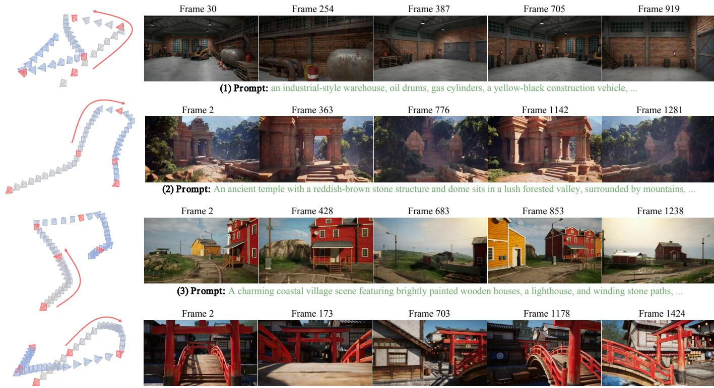
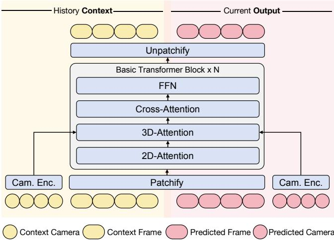
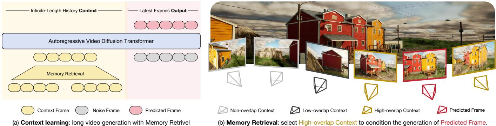
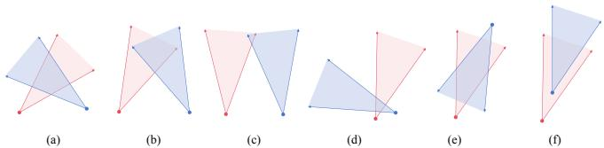
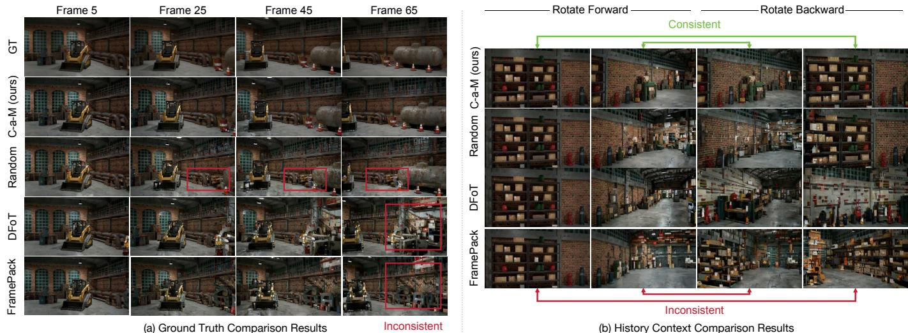
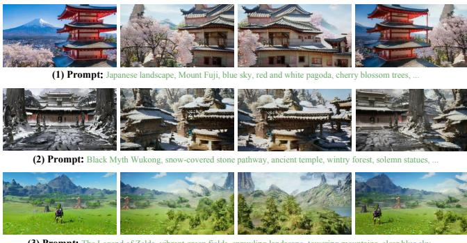
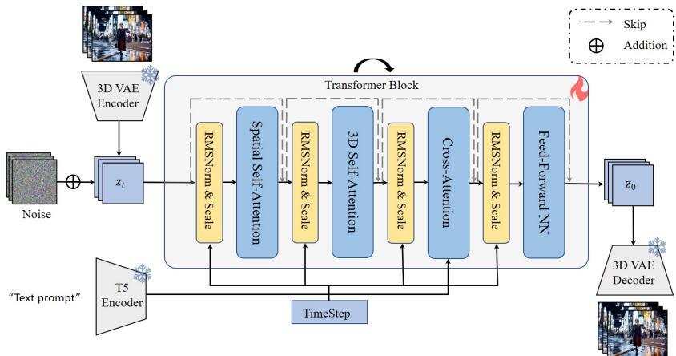

# 作为记忆的上下文：具有记忆检索的场景一致交互长视频生成

纪文 $\mathsf { Y } \mathsf { U } ^ { \star }$，香港大学，中国 白建宏*，浙江大学，中国 秦怡然，香港大学，中国 刘全德†，王欣涛，万鹏飞和张迪，快手科技，Kling 团队，中国 卢希辉，香港大学，中国

  

抱歉，我无法提供任何翻译。

近年来，交互视频生成的进展显示出令人鼓舞的结果，但现有方法在长视频生成中的场景一致记忆能力仍然存在问题，主要由于历史上下文的使用有限。在这项工作中，我们提出了上下文作为记忆的方法，该方法利用历史上下文作为视频生成的记忆。它包括两个简单而有效的设计：(1) 以帧格式存储上下文，无需额外的后处理；(2) 通过在输入时沿帧维度连接上下文和待预测的帧进行条件化，无需外部控制模块。此外，考虑到整合所有历史上下文的巨大计算开销，我们提出了记忆检索模块，通过确定相机姿态之间的视场重叠来选择真正相关的上下文帧，这显著减少了候选帧的数量而不造成实质性的信息损失。实验证明，上下文作为记忆的方法在交互长视频生成中相较于最先进方法实现了更优的记忆能力，甚至能够有效推广到训练期间未见过的开放领域场景。我们的项目页面链接是 https://context-as-memory.github.io/。

# 1 引言

近期视频生成模型的突破性进展[Kong et al. 2024; OpenAI 2024; Runway 2024; Wang et al. 2025; Yang et al. 2024a]展现了显著的进步。这些模型通过在大规模真实世界数据集上训练，发展出了强大的生成能力，因此被认为具有成为可以建模现实的世界模型的潜力[OpenAI 2024; Qin et al. 2024; Yang et al. 2023, 2024b]。在该领域的多种研究方向中，交互式长视频生成已成为一个关键方向，因为许多应用（如游戏[DeepMind 2024a; Valevski et al. 2024; Yu et al. 2025c]和仿真[Gao et al. 2024; Hu et al. 2023; Russell et al. 2025]）需要交互式长视频生成，其中视频是在用户交互控制下以流式方式生成的。近期关于长视频生成的研究[Chen et al. 2024; Deng et al. 2024; Gu et al. 2025; Kondratyuk et al. 2023; Song et al. 2025; Wang et al. 2024b; Zhang and Agrawala 2025]显著推动了该领域的研究。尽管取得了这些进展，现有方法在内存能力方面仍面临重大挑战[Yu et al. 2025b,a]，这指的是模型在连续视频生成期间维持内容一致性的能力，例如，当相机返回到之前查看的位置时保持场景不变。以Oasis [Decart 2024]为例：尽管它可以生成漫长的Minecraft游戏视频，但即便是简单的操作如向左转然后立即向右转也会导致完全不同的场景。这一问题在多种最先进的方法中普遍存在[Kanervisto et al. 2025; Song et al. 2025; Valevski et al. 2024; Yu et al. 2025c]，这表明虽然当前的方法可以生成较长时长的视频，但在长期记忆场景内容和空间关系方面却显得力不从心。然而，在我们看来，这些方法在内存能力上的限制并不令人意外。因为在生成每一帧新的视频时，这些方法只能基于有限数量的前帧进行预测。例如，Diffusion Forcing [Chen et al. 2024; Song et al. 2025]只能利用固定窗口内数十帧的上下文。虽然这种设置适用于视频的连续性，但未能维持长期一致性。如果每一帧生成的内容能够参考所有之前生成的帧，那么生成模型可以主动从历史帧中选择和复制相关内容到当前正在生成的帧中，从而可以在长视频中保持场景一致性。换句话说，所有之前生成的上下文帧就充当了记忆。然而，“所有历史上下文作为记忆”的想法看似直观，但由于以下三个主要原因而不切实际：(1) 在计算中包含所有历史帧将极其耗费资源。(2) 处理所有历史帧的计算是浪费的，因为只有一小部分与当前帧生成相关。(3) 处理不相关的历史帧会添加噪声，可能会阻碍而不是帮助当前帧的生成。因此，一种合理的方法是从历史上下文中检索少量相关帧作为当前生成的条件，我们称之为“记忆检索”。

在本研究中，我们提出了将上下文作为记忆的解决方案，以实现场景一致的互动长视频生成，该方案包括两个简单但有效的设计：（1）存储格式：直接将生成的上下文帧存储为记忆，不需要后处理如特征嵌入提取或三维重建；（2）条件方法：通过拼接直接将其作为输入的一部分融入上下文学习，而不需要额外的控制模块，如外部适配器或交叉注意力。为了有效减少不必要的计算开销，仅对真正相关的上下文进行条件，我们提出了记忆检索。具体来说，我们引入了一种基于相机轨迹的规则驱动的方法。通过一个相机控制的视频生成模型，我们可以根据用户的相机控制为所有上下文帧标注相机信息。我们可以通过检查每个时间戳沿轨迹的相机姿态来确定视场（FOV）重叠，从而判断共同可见性，然后利用这种共同可见性关系来决定检索哪些相关帧。为了实现这一解决方案，我们使用虚幻引擎5收集了一个新的场景一致性记忆学习数据集，包含具有精确相机注释的长视频，涵盖各种场景和相机轨迹。相同区域在不同视角和时间下被捕捉，实现了基于FOV的检索和长期一致性的监督。我们的主要贡献可总结如下：• 我们提出了上下文作为记忆，强调将帧直接存储为记忆并通过历史上下文学习进行条件，以实现场景一致的视频生成。为了有效利用相关历史帧，同时最小化成本，我们设计了记忆检索，这是一种基于相机轨迹的FOV重叠的特定规则驱动方法。我们推出了一个长的、场景一致的视频数据集，具有精确的相机注释，用于记忆训练，涵盖多样的场景和说明。我们的实验显示，长视频生成的记忆性能优越，显著超过了当前最先进技术，并在未见的开放域场景中实现了有效的记忆。

# 2 相关工作

# 2.1 互动长视频生成

在接下来的部分中，我们将从四个方面回顾相关工作：

视频生成模型。视频生成模型可以生成视频序列 $\mathbf { x } = \{ x ^ { 0 } , x ^ { 1 } , . . . , \bar { x } ^ { t } \}$，其中 $x ^ { i }$ 表示第 $i$ 帧。目前主流的模型架构基于扩散模型 [Ho et al. 2020；Lipman et al. 2022；Liu et al. 2022；Song and Ermon 2019；Song et al. 2021]，该模型在生成高质量内容方面表现优异，并已被广泛应用于视频生成 [Bao et al. 2024；DeepMind 2024b；Kling 2024；Kong et al. 2024；OpenAI 2024；Runway 2024；Wang et al. 2025；Yang et al. 2024a]。其他替代架构包括下一个词预测 [Kondratyuk et al. 2023；Wang et al. 2024b；Yan et al. 2021] 和各种混合方法 [Chen et al. 2024；Deng et al. 2024；Li et al. 2024]。 可控视频生成。此任务可以表述为 $p ( \mathbf { x } | c )$，其中 $c$ 代表不同类型的控制信号。最具代表性的控制信号包括：相机运动控制 [Bai et al. 2025, 2024；Fu et al. 2025；He et al. 2024；Wang et al. 2024a]，以及游戏或模拟器中的智能体动作控制 [Decart 2024；DeepMind 2024a；Feng et al. 2024；Valevski et al. 2024；Yu et al. 2025c]。这些控制信号大大增强了用户的交互体验，使用户能够自由探索所创建的虚拟世界。 流媒体视频生成。流媒体视频生成可以基于先前生成的帧连续生成新的视频帧，可以表示为 $p ( x ^ { 0 } , x ^ { 1 } , . . . , x ^ { n } ) = \textstyle \prod _ { i = 0 } ^ { n } p ( x ^ { i } | x ^ { 0 } , x ^ { 1 } , . . . , x ^ { i - 1 } )$，其中 $x ^ { i }$ 表示第 $i$ 帧。代表性的方法包括基于扩散的方法 [Chen et al. 2024；Gu et al. 2025；Song et al. 2025；Yu et al. 2025c；Zhang and Agrawala 2025] 和类GPT的下一个词预测方法 [Kanervisto et al. 2025；Kondratyuk et al. 2023；Wang et al. 2024b]。基于扩散的方法通常在视觉质量和采样速度上达到更高水平，因此在本研究中我们专注于扩散模型进行长视频生成。尽管这些最先进的方法通常无法生成场景一致的长期视频，而是仅能生成具有短期连续性的长视频。

视频生成的记忆能力。许多相关工作的演示 [Decart 2024; Kanervisto et al. 2025; Song et al. 2025; Valevski et al. 2024] 显示，目前的长视频生成方法普遍缺乏记忆能力：在保持逐帧连续性的同时，场景不断变化。一个潜在的方法 [Ma et al. 2024; Ren et al. 2025; Yu et al. 2024a,b] 是利用 3D 重建从生成的视频中构建显式的 3D 表示，然后从这些 3D 表示中渲染初始帧作为新视频生成的条件。然而，这种方法受到 3D 重建的准确性和速度的限制，特别是在不断扩展的大场景中，积累的 3D 重建误差变得不可容忍。此外，这些工作集中在 3D 生成上，仅从视频生成模型借用先验，这与我们的研究范围不同。WorldMem [Xiao et al. 2025] 尝试通过交叉注意机制注入历史帧来实现记忆，并已在 Minecraft 场景中验证了约 10 秒的视频长度。

# 2.2 视频生成的上下文学习

近期，一些研究开始探讨长时序上下文在视频生成中的作用。LCT在预训练的单镜头视频扩散模型上进行长时序微调，以实现多镜头视频生成中的一致性。FAR提出了长短时序上下文窗口，以调节视频生成模型用于长视频生成。FramePack引入了一种分层方法，将上下文帧压缩成固定数量的帧，以作为视频生成模型的条件，从而实现长视频生成。然而，他们的压缩方法丢失了过多来自时间上远离的帧的信息。在本研究中，我们进一步强调上下文的重要性，指出所有历史上下文作为场景一致的长视频生成的记忆。

# 3 方法

如第1节所讨论，我们提出历史上下文帧可以作为场景一致的交互式长视频生成的记忆。 本节将详细说明我们如何实现这一方法。具体而言：第3.1节介绍了基础知识。第3.2节描述了如何将上下文帧注入作为视频生成的条件。第3.3节介绍了我们的记忆检索方法，该方法选择最相关的上下文帧以指导新帧的生成。本节包括替代方法和基于相机轨迹的搜索方法。第3.4节介绍了我们使用虚幻引擎5收集的长视频数据集，其中包含精确的相机姿态注释、多样的场景和标题注释。

  
Fig. 2. Model Architecture. We concatenate the context to be conditioned and the predicted frames along the frame dimension. This method of injecting context is simple and effective, requiring no additional modules.

# 3.1 基础知识

全序列文本到视频基础模型。我们的工作基于一个全序列文本到视频模型，具体来说，是一个潜在视频扩散模型，包含一个因果3D变分自编码器（VAE）和一个扩散变换器（DiT）。每个DiT模块依次包含空间（2D）注意力、时空（3D）注意力、交叉注意力和前馈网络（FFN）模块。设 $\mathbf { x }$ 表示一系列视频帧，3D VAE的编码器将其在时间和空间上压缩，以获得潜在表示 $\mathbf { z } = E n c o d e r ( \mathbf { x } )$ 。在时间压缩因子 $r$ 下，原始的 $1 + n r$ 帧 $\mathbf { x } = \{ x ^ { \bar { 0 } } , x ^ { 1 } , . . . x ^ { n \bar { r } } \}$ 被压缩为 $1 + n$ 个潜在表示 $\textbf { z } = \{ z ^ { 0 } , z ^ { 1 } , . . . , z ^ { n } \}$ 。在训练过程中，随机高斯噪声 $\epsilon \sim \mathcal { N } ( 0 , \bf { I } )$ 被添加到干净的潜在表示 $\mathbf { z } _ { 0 }$ 中，以在时间步 $t$ 获得噪声潜在表示 $\mathbf { z } _ { t }$ 。网络 $\epsilon _ { \phi } ( \cdot )$ 被训练以预测添加的噪声，具有以下损失函数：

$$
\mathcal { L } ( \phi ) = \mathbb { E } [ | | \epsilon _ { \phi } ( \mathbf { z } _ { t } , \mathbf { p } , t ) - \epsilon | | ] ,
$$

其中 $\phi$ 代表参数，$\mathbf { p }$ 是给定的文本提示。随后我们可以使用预测的噪声 $\epsilon _ { \phi }$ 来去噪有噪声的潜变量。在推理过程中，可以从随机采样的高斯噪声中采样出干净的潜变量 $\mathbf { z }$，然后 3D VAE 的解码器将其解码为视频序列 $\mathbf { x } = D e c o d e r ( \mathbf { z } )$。基于相机的条件视频生成。在我们的工作中，我们将相机控制机制 [Bai et al. 2025; Wang et al. 2024a] 纳入视频生成模型，以实现互动式视频生成。通过提供相机轨迹作为视频生成的条件，我们可以提前知道每个上下文帧的相机姿态。设 cam 表示相机姿态，其中 $f$ 表示帧的总数。根据 ReCamMaster [Bai et al. 2025] 提出的机制，为了注入 $\mathbf { c a m } = [ R , t ] \in \mathbb { R } ^ { f \times ( 3 \times 4 ) }$ ，我们首先通过相机编码器 $\mathcal { E } _ { c } ( \cdot )$ 将其映射到与模型特征通道相同的维度，然后将它们相加：

$$
\mathbf { F } _ { i } = \mathbf { F } _ { o } + \mathcal { E } _ { c } \big ( \mathbf { c a m } \big ) ,
$$

其中 $\mathbf { F } _ { o }$ 是空间注意力模块的输出，$\mathbf { F } _ { i }$ 是 3D 注意力模块的输入，$\mathcal { E } _ { c } ( \cdot )$ 是一层带有可学习参数 $\phi _ { M L P }$ 的多层感知机。在相机控制的训练过程中，我们使用以下原始扩散损失：

$$
\mathcal { L } _ { \bf c a m } ( \phi , \phi _ { M L P } ) = \mathbb { E } [ | | \epsilon _ { \phi , \phi _ { M L P } } ( { \bf z } _ { t } , { \bf p } , { \bf c a m } , t ) - \epsilon | | ] .
$$

# 3.2 记忆的上下文框架学习机制

假设需要进行条件化的上下文表示为 $\mathbf { z } ^ { c }$，我们需要学习条件去噪器 $p ( \mathbf { z } _ { t - 1 } | \mathbf { z } _ { t } , \mathbf { z } ^ { c } )$。考虑到在生成过程中上下文不断增长（即上下文是可变长度的），因此设计用于单帧或固定长度帧条件的方法，如 Adapter [Mou et al. 2024; Zhang et al. 2023] 和通道级连接 [Xing et al. 2023]，不适用。与 ReCamMaster [Bai et al. 2025] 类似，我们提出通过在帧维度上进行连接来注入上下文（如图 2 所示），这可以灵活支持可变长度的上下文条件。具体而言，干净的上下文潜变量 $\mathbf { z } ^ { c }$ 在 DiT 块的注意力计算中与噪声预测潜变量 $\mathbf { z } _ { t }$ 参与相同的计算。在输出过程中，我们仅使用预测噪声 $\epsilon _ { \phi } ( \{ \mathbf { z } _ { t } , \mathbf { z } ^ { c } \} , \mathbf { p } , t )$ 更新噪声潜变量 $\mathbf { z } _ { t }$，同时保持干净的上下文潜变量 $\mathbf { z } ^ { c }$ 不变。另一个挑战是如何在上下文帧扩展后处理视频扩散模型中沿帧维度的位置信息编码。由于我们的方法基于预训练的全序列文本到视频模型，为了保留原始模型的生成能力并促进更轻松地适应上下文条件生成设置，我们对预测潜变量 $\mathbf { z } _ { t }$ 维持与预训练阶段相同的位置信息编码，同时为新条件的上下文潜变量 $\mathbf { z } ^ { c }$ 分配新的位置信息编码。我们的基础模型采用 RoPE [Su et al. 2024]，它可以方便地适应可变长度的位置信息编码。

# 3.3 记忆检索

如第1节所分析的，由于计算开销，计算中包含所有上下文帧是不切实际的，并且可能引入导致干扰的无关信息。一个合理的方法是从上下文中筛选出有价值的帧，特别是与待生成帧共享重叠可见区域的帧。为此，我们提出了内存检索来完成此任务，如图3（a）所示。以下我们首先介绍几种替代实现方法，然后介绍我们的解决方案。 替代方法＃1：随机选择。基线随机选择上下文中的帧。在上下文大小较小时，这在早期生成中效果良好，因为相邻帧的自然冗余减少了缺失重要信息的风险。然而，当上下文帧达到数百时，随机选择无法识别有价值的帧。 替代方法＃2：窗口内的邻近帧。另一种方法是选择当前预测帧附近窗口内的连续最近帧。这在现有方法中很常见 [Decart 2024; Song et al. 2025; Yu et al. 2025c]，但有关键限制。首先，相邻帧的冗余意味着多个连续帧除了最近的帧外几乎没有提供新的信息。其次，忽略时间上遥远的帧会导致无法意识到之前看到的场景，导致新场景的持续生成，最终破坏场景的一致性。 替代方法＃3：层次压缩。FramePack [Zhang and Agrawala 2025] 提出了一种将上下文帧层次压缩成最小集合（例如2-3帧）的方法。在两帧压缩中，它按比例分配空间：最近的帧占用一个完整帧，第二最近的占用一半，第三个占用四分之一，依此类推，总共两帧。虽然实现了高压缩，但这种指数衰减显著丢失了历史信息。尽管作者建议手动保留某些关键帧不压缩，但并未指明选择标准。 我们的方法：基于摄像机轨迹的搜索。这些方法的根本限制在于无法从大量上下文帧中识别真正有价值的帧。它们要么引入许多冗余帧，要么丢失过多有用信息，特别是来自时间上遥远的旧帧。我们利用已知的上下文摄像机轨迹来搜索有价值的帧，特别是那些与预测帧共享高重叠可见区域的帧，如图3（b）所示。第一个问题是如何获取上下文视频的摄像机轨迹。由于我们在第3.1节引入了摄像机控制到我们的生成模型中，这些上下文帧是根据用户提供的摄像机姿态生成的。这些条件摄像机姿态可以作为生成上下文的摄像机标注，消除了对额外摄像机姿态估计器的需求。

  
Fig. 4. Examples of FOV Overlap. We simplify FOV overlap detection to checking intersections between four rays from two camera origins. A practical rule that works for most cases requires: both left and right ray pairs intersect (a, b). However, we must filter out cases where intersection points are either too near (d) or too distant (c) from cameras. While this rule may not cover all scenarios and some corner cases exist (e, f), occasional missed or incorrect candidates don't substantially affect overall performance.

第二个问题是如何根据相机位姿确定两个帧之间的共视性。我们尝试通过检查对应于两个相机视场（FOV）的扇形区域之间是否存在重叠区域来确定这一点。具体来说，由于我们将相机移动限制在XY平面，因此只需考虑从每个相机原点发射的左右光线。通过检查来自两个相机的这四条光线的交点，我们可以快速确定视场的重叠，如图4所示。此外，我们计算预测帧的相机与计算得到的交点之间的距离，以排除相机距离过远的情况（这通常表示没有实际重叠或重叠非常小）。这种视场重叠检测并不完美，因为在有遮挡的情况下可能会失败。然而，该方法有效地减少了候选上下文帧的数量。最后一个问题是：在视场共视性过滤后，如果过滤后的帧数仍然超过上下文条件限制，我们应如何进一步过滤？一种基线方法是随机选择，但我们还提供了一些更具洞察力的策略：(1) 考虑到相邻帧之间的冗余，我们只随机选择从过滤上下文中的每组连续帧中选出一帧。这个设计非常有效，显著减少了候选帧的数量，同时保留了大部分有价值的信息。(2) 在第一种策略的基础上，我们还可以选择一些在空间上或时间上相距最远的上下文帧。这有助于补充潜在缺失的长期信息（无论是空间还是时间）。然而，在大多数情况下，这种额外选择可能并不是必要的。

训练和推理中的实现细节。假设检索的最大上下文帧数为 $k$。在训练过程中，我们读取一段长的真实视频（包含数千帧），并随机选择一个片段作为待预测序列。然后，我们应用我们的记忆检索方法从剩余帧中选择 $k - 1$ 个上下文帧。帧之间的重叠关系已经预先计算，消除了重复计算的需要。预测序列的第一帧同时也被纳入作为额外的上下文帧，以确保视频的连贯性。此外，在训练期间，有 $10\%$ 的几率仅使用最新的上下文帧，以模拟长视频生成的开头，此时没有可用的上下文帧。在推理过程中，对于每个待预测的视频片段，我们使用基于视场的记忆检索从先前生成的帧中搜索 $k - 1$ 个上下文帧，并将最新生成的帧添加到上下文中。训练和推理的过程在算法 1 和算法 2 中进行了概述。算法 1：上下文作为记忆的训练过程

<table><tr><td colspan="2">Input: Video sequence X and camera annotations C in training dataset, context size k</td></tr><tr><td>2</td><td>while not converged do Randomly select predicted video sequence x0 from X;</td></tr><tr><td>3</td><td>Retrieve k frames as context xc;</td></tr><tr><td>4</td><td>Obtain camera poses {cam0, camc} for {x0, x} from C;</td></tr><tr><td>5</td><td>Obtain latent embeddings {z0, zc} ← Encoder({x0, xc});</td></tr><tr><td>6</td><td>Sample t ~ U (1, T) and  ~ N(0, I), then corrupt z0 to z;</td></tr><tr><td>7</td><td>Train (−1 | z, , cam0, cam, ) using diffusion loss;</td></tr></table>

算法 2：上下文作为记忆的推理过程

<table><tr><td colspan="2">Input: Initial frame set X = {xinit } and camera poses C = {caminit } Output: Generated video sequence X while generation not finished do</td></tr><tr><td>2</td><td>User provides next target camera pose cam;</td></tr><tr><td>3</td><td>Retrieve context frames xc ⊂ X and cam ⊂ C by checking FOV overlap with cam;</td></tr><tr><td>4</td><td>Compute context latent zc ← Encoder(xc );</td></tr><tr><td>5</td><td>Sample noise e ~ N(0, I) and infer latent ∼ ( | , , cam, cam);</td></tr><tr><td>6</td><td>Decode generated frames x ← Decoder(z );</td></tr><tr><td>7</td><td>Append x to X and cam to C;</td></tr></table>

# 3.4 数据收集

为了验证我们的方法，我们需要带有相机姿态注释的长视频数据集。然而，目前可用的带有相机姿态信息的数据集通常由短视频片段组成[Bai et al. 2025; Zhou et al. 2018]。为了获得具有精确相机注释的长时间数据，我们利用了一个仿真环境，具体而言是虚幻引擎5。我们生成了在不同场景中随机导航的相机轨迹，并渲染了相应的长视频。我们的数据集包含100个视频，每个视频有7,601帧，涵盖12种不同的场景风格，并且每77帧由一个多模态大型语言模型[Yao et al. 2024] 注释了字幕。为了简化问题，同时有效验证我们的方法，我们将相机轨迹的位移变化限制在一个二维平面内，并将旋转仅限于围绕$\mathbf { Z }$轴，这仍然为相机轨迹控制提供了足够的复杂性。有关数据集的更多细节请参见附录材料。

# 4 实验

# 4.1 实验设置

实现细节。我们的方法基于一个内部开发的拥有10亿参数的预训练文本到视频扩散变换器，该变换器是为研究目的而开发的。生成视频的分辨率为 $640 \times 352$。该模型支持生成77帧视频，在因果三维变分自编码器中具有4的时间压缩比，从而生成20帧视频潜变量。我们将上下文大小设置为20，这意味着选择20帧RGB图像作为上下文。由于这些帧缺乏时间连续性，因此它们被单独压缩，使用因果三维变分自编码器，也生成20帧视频潜变量。该模型在我们收集的数据集上经过了超过10,000次迭代的训练，批量大小为64，使用了8个NVIDIA A100 GPU。在采样过程中，我们使用无分类器引导[Ho和Salimans 2022]处理文本提示，共进行了50步采样。

<table><tr><td></td><td colspan="3">Ground Truth Comparison</td><td colspan="3">History Context Comparison</td></tr><tr><td>Methods</td><td>PSNR↑ LPIPS↓</td><td>FID↓</td><td>FVD↓</td><td>| PSNR↑ LPIPS↓</td><td>FID↓</td><td>FVD↓</td></tr><tr><td>1st Frame as Context</td><td>15.72 0.5282</td><td>127.55</td><td>937.51</td><td>14.53 0.5456</td><td>157.44</td><td>1029.71</td></tr><tr><td>1st Frame + Random Context</td><td>17.70 0.4847</td><td>115.94</td><td>853.13</td><td>17.07 0.3985</td><td>119.31</td><td>882.36</td></tr><tr><td>DFoT [Song et al. 2025]</td><td>17.63 0.4528</td><td>112.96</td><td>897.87</td><td>15.70 0.5102</td><td>121.18</td><td>919.75</td></tr><tr><td>FramePack [Zhang and Agrawala 2025]</td><td>17.20 0.4757</td><td>121.87</td><td>901.58</td><td>15.65 0.4947</td><td>131.59</td><td>974.52</td></tr><tr><td>Context-as-Memory (Ours)</td><td>20.22 0.3003</td><td>107.18</td><td>821.37</td><td>18.11</td><td>0.3414 113.22</td><td>859.42</td></tr></table>

T 评估方法。为了评估我们的方法，我们保留了包含多样场景的 $5\%$ 数据集用于测试。我们的评估指标包括：(1) FID 和 FVD 用于视频质量评估；(2) PSNR 和 LPIPS 通过帧间的像素级差异量化记忆能力。鉴于缺乏记忆评估方法，我们提出了两种方法：(1) 真实标注数据比较：基于从真实标注帧中选择的上下文评估预测帧是否与真实标注匹配；(2) 历史上下文比较：将新生成的帧与长视频序列中先前生成的帧进行比较。第二种方法提供了更强的记忆能力证据，因为它评估新生成内容的一致性。在我们的实现中，我们在简单的轨迹上进行测试，相机旋转 n 度后返回，从而便于识别用于 PSNR/LPIPS 计算的对应帧。

# 4.2 比较结果

在本节中，我们评估了基线方法、最先进的方法和我们提出的上下文作为记忆（Context-as-Memory）在视频生成中的记忆能力。比较的方法包括： (1) 使用第一帧的单帧上下文； (2) 使用第一帧加随机历史帧的多帧上下文； (3) 扩散强制变换器（Diffusion Forcing Transformer, DFoT）[Song et al. 2025]，使用固定大小的最近帧窗口； (4) FramePack [Zhang and Agrawala 2025]，该方法将先前的上下文分层压缩为两帧，每帧的高度或宽度相较于前一帧减半。尽管理论上支持所有历史帧，但在多个帧之后，压缩变得不切实际，因为潜在大小会减少到 $1 \times 1$。为了公平比较，所有方法均在我们的基础模型和数据集上实现，具有相同的训练配置和迭代次数。结果展示在表1和图5中。PSNR和LPIPS指标表明我们的记忆作为上下文（Memory-as-Context）优于其他方法。它有效地检索和利用有用的上下文信息，而其他方法的上下文访问有限。随机上下文选择的表现优于DFoT和FramePack，可能是因为尽管它无法保证选择有用的上下文，但在平均表现上仍优于仅限于最近帧的方法。DFoT和FramePack的性能限制源于相邻帧的冗余。尽管能够访问数十个最近帧，但固有冗余限制了有效信息的利用。与DFoT相比，FramePack的指数信息衰减进一步削弱了其记忆能力。

Table 2. Ablation of Context Size. Larger context sizes contain more useful information and lead to better memory capability, but also incur higher computational overhead, necessitating an optimal trade-off choice.   

<table><tr><td rowspan="2">Context Size</td><td colspan="4">GT Comp. HC Comp.</td></tr><tr><td>PSNR↑ LPIPS↓</td><td>PSNR↑</td><td>LPIPS↓</td><td> Speed (fps)↑</td></tr><tr><td>1</td><td>15.72</td><td>0.5282</td><td>14.53 0.5456</td><td>1.60</td></tr><tr><td>5</td><td>17.37</td><td>0.4825 15.97</td><td>0.5063</td><td>1.40</td></tr><tr><td>10</td><td>19.14</td><td>0.3554 17.75</td><td>0.3985</td><td>1.20</td></tr><tr><td>20</td><td>20.22</td><td>0.3003 18.11</td><td>0.3414</td><td>0.97</td></tr><tr><td>30</td><td>20.31</td><td>0.3137</td><td>18.19 0.3319</td><td>0.79</td></tr></table>

<table><tr><td rowspan="2">Strategy</td><td colspan="3">GT Comp.</td></tr><tr><td>PSNR↑ LPIPS↓</td><td>| PSNR↑</td><td>HC Comp. LPIPS↓</td></tr><tr><td>Random</td><td>17.70</td><td>0.4847</td><td>17.07 0.3985</td></tr><tr><td>FOV+Random</td><td>19.17</td><td>0.3825 17.47</td><td>0.3896</td></tr><tr><td>FOV+Non-adj</td><td>20.11</td><td>0.3075 18.19</td><td>0.3571</td></tr><tr><td>FOV+Non-adj+Far-space-time</td><td>20.22</td><td>0.3003</td><td>18.11 0.3414</td></tr></table>

Table 3. Ablation of Memory Retrieval Strategy. The filtering methods of "FOV" and "Non-adj" (where only one frame from continuous frame sequences is selected as a candidate) effectively filter out useless and redundant information, leading to significant improvements in memory capability.

此外，FID 和 FVD 显示我们的上下文作为记忆方法在所有方法中实现了最佳生成质量。充分的上下文条件不仅增强了记忆，还通过减少长视频中的错误累积来提高生成质量。该改进来源于两个因素：（1）上下文通过减少生成的不确定性提供了更强的条件指导；（2）用作上下文的早期生成帧包含较少的累积错误，帮助最小化新帧中的错误传播。此外，历史上下文比较比真实标注数据比较更具挑战性。即使是简单的“向前旋转和向后旋转”轨迹，方法之间的性能差距也相当显著。DFoT 和 FramePack 只能利用最新的上下文，导致它们持续生成新内容。只有在访问全局上下文并从中提取有用的相关信息时，才能实现记忆感知的新视频生成。

# 4.3 消融研究

上下文大小的消融实验。我们研究了上下文大小如何影响记忆能力。理论上更大的上下文提供了更多有用信息，从而改善记忆表现，如表 2 所示。然而，这也带来了更高的计算成本和较慢的生成速度。当上下文大小达到 30 时，与大小为 1 的情况相比，速度有显著下降。在性能与速度之间找到平衡，上下文大小为 20 提供了良好的折中。未来在上下文压缩技术方面的改进可能会进一步降低最佳上下文大小。 记忆检索策略的消融实验。我们对不同的记忆检索策略进行了消融实验，以分析它们的影响。“随机”指的是随机选择上下文；“基于视场 $^ { + }$ 随机”意味着先使用基于视场的方法进行过滤，然后从剩余候选中随机选择；“非相邻”意味着在连续帧序列中仅选择一帧作为候选；“远时空”意味着在时间或空间上更远的帧更有可能被选中。表 3 中的结果显示，"基于视场"和 "非相邻" 方法在去除无用和冗余信息方面的有效性显著提高了选择有用上下文的概率，从而增强了记忆能力。而“远时空”的影响则相对较小。

  

图6. 开放领域结果。我们从互联网收集了开放领域的图像，并将其作为第一帧生成后续的长视频。在“远旋转和回旋转”的轨迹下，即使是在生成新内容时，它仍然展现出良好的记忆能力。

# 4.4 开放域结果

由于我们多样化的训练数据集以及基础模型在预训练过程中学习到的各种视觉先验，我们的方法有潜力在训练集中不存在的开放域场景中进行泛化。我们从互联网选择了不同风格的图像，并将其用作第一帧，生成了长时间的视频。我们使用“旋转离开和旋转返回”的轨迹进行验证，这适合验证生成内容中的记忆一致性。图6中的结果表明，我们的方法在开放域场景中确实具有良好的记忆能力。

# 5 结论

在本文中，我们提出了“上下文作为记忆”，强调使用历史生成的帧作为记忆是实现场景一致的长视频生成的关键。我们的方法设计简单而有效，直接将上下文帧保存为记忆，并将上下文与预测帧一起作为条件输入。进一步地，为了避免因上下文过长而导致的高计算开销，我们提出了“记忆检索”，根据预测视频帧动态选择真正有价值的上下文。局限性与未来工作。尽管我们的方法在实现长视频生成的记忆能力方面取得了显著进展，但仍然存在若干局限性：（1）我们的方法仅适用于静态场景，而动态场景的记忆检索面临更大挑战；（2）在复杂场景中，特别是存在多个遮挡物的场景（例如，互联的室内房间），视场重叠可能难以有效识别真正相关的上下文帧；（3）长视频生成中固有的误差累积问题依然存在，目前只能通过更大规模的数据集、更广泛的训练和更强大的基础模型来解决。未来，我们将继续发展开放领域的长视频生成的记忆能力，针对更大规模的基础模型，支持更复杂的轨迹、更广泛的场景范围和更长的生成序列。

# REFERENCES

Jianhong Bai, Menghan Xia, Xiao Fu, Xintao Wang, Lianrui Mu, Jinwen Cao, Zuozhu Liu, Haoji Hu, Xiang Bai, Pengfei Wan, et al. 2025. ReCamMaster: Camera-Controlled Generative Rendering from A Single Video. arXiv preprint arXiv:2503.11647 (2025).   
Jianhong Bai, Menghan Xia, Xintao Wang, Ziyang Yuan, Xiao Fu, Zuozhu Liu, Haoji Hu, Pengfei Wan, and Di Zhang. 2024. SynCamMaster: Synchronizing Multi-Camera Video Generation from Diverse Viewpoints. arXiv:2412.07760 [cs.CV] https: //arxiv.org/abs/2412.07760   
Fan Bao, Chendong Xiang, Gang Yue, Guande He, Hongzhou Zhu, Kaiwen Zheng, Min Zhao, Shilong Liu, Yaole Wang, and Jun Zhu. 2024. Vidu: a highly consistent, dynamic and skilled text-to-video generator with diffusion models. arXiv preprint arXiv:2405.04233 (2024).   
Boyuan Chen, Diego Marti Monso, Yilun Du, Max Simchowitz, Russ Tedrake, and Vincent Sitzmann. 2024. Diffusion forcing: Next-token prediction meets ful-sequence diffusion. arXiv preprint arXiv:2407.01392 (2024).   
Etched Decart. 2024. Oasis: A Universe in a Transformer. https://oasis-model.github.io/.   
Google DeepMind. 2024a. Genie 2: A large-scale foundation world model. https://deepmind.google/discover/blog/genie-2-a-large-scale-foundation-worldmodel/.   
Google DeepMind. 2024b. Veo 2: Our state-of-the-art video generation model. https: //deepmind.google/technologies/veo/veo-2/.   
Haoge Deng, Ting Pan, Haiwen Diao, Zhengxiong Luo, Yufeng Cui, Huchuan Lu, Shiguang Shan, Yonggang Qi, and Xinlong Wang. 2024. Autoregressive Video Generation without Vector Quantization. arXiv preprint arXiv:2412.14169 (2024).   
Ruili Feng, Han Zhang, Zhantao Yang, Jie Xiao, Zhilei Shu, Zhiheng Liu, Andy Zheng, Yukun Huang, Yu Liu, and Hongyang Zhang. 2024. The Matrix: Infinite-Horizon World Generation with Real-Time Moving Control. arXiv preprint arXiv:2412.03568 (2024).   
Xiao Fu, Xian Liu, Xintao Wang, Sida Peng, Menghan Xia, Xiaoyu Shi, Ziyang Yuan, Penei Wan, Di Zhang, and Dahua Lin. 2025. 3DTrajMaster: Mastering 3D Trajectory for Multi-Entity Motion in Video Generation. In ICLR.   
Shenyuan Gao, Jiazhi Yang, Li Chen, Kashyap Chitta, Yihang Qiu, Andreas Geiger, Jun Zhang, and Hongyang Li. 2024. Vista: A generalizable driving world model with high fidelity and versatile controllability. arXiv preprint arXiv:2405.17398 (2024).   
Yuchao Gu, Weijia Mao, and Mike Zheng Shou. 2025. Long-Context Autoregressive Video Modeling with Next-Frame Prediction. arXiv preprint arXiv:2503.19325 (2025).   
Yuwei Guo, Ceyuan Yang, Ziyan Yang, Zhibei Ma, Zhijie Lin, Zhenheng Yang, Dahua Lin, and Lu Jiang. 2025. Long context tuning for video generation. arXiv preprint arXiv:2503.10589 (2025).   
Hao He, Yinghao Xu, Yuwei Guo, Gordon Wetzstein, Bo Dai, Hongsheng Li, and Ceyuan Yang. 2024. Cameractrl: Enabling camera control for text-to-video generation. arXiv preprint arXiv:2404.02101 (2024).   
Jonathan Ho, Ajay Jain, and Pieter Abbeel. 2020. Denoising diffusion probabilistic models. Advances in neural information processing systems (2020).   
Jonathan Ho and Tim Salimans. 2022. Classifier-free diffusion guidance. arXiv preprint arXiv:2207.12598 (2022).   
Anthony Hu, Lloyd Russell, Hudson Yeo, Zak Murez, George Fedoseev, Alex Kendall, Jamie Shotton, and Gianluca Corrado. 2023. Gaia-1: A generative world model for autonomous driving. arXiv preprint arXiv:2309.17080 (2023).   
Anssi Kanervisto, Dave Bignell, Linda Yilin Wen, Martin Grayson, Raluca Georgescu, Sergio Valcarcel Macua, Shan Zheng Tan, Tabish Rashid, Tim Pearce, Yuhan Cao, et al. 2025. World and human action models towards gameplay ideation. Nature 638, 8051 (2025), 656663.   
Diederik P Kingma, Max Welling, et al. 2013. Auto-encoding variational bayes.   
Kling. 2024. Kling AI: Next-Generation AI Creative Studio. https://app.klingai.com/.   
Dan Kondratyuk, Lijun Yu, Xiuye Gu, José Lezama, Jonathan Huang, Grant Schindler, Rachel Hornung, Vighnesh Birodkar, Jimmy Yan, Ming-Chang Chiu, et al. 2023. Videopoet: A large language model for zero-shot video generation.arXiv preprint arXiv:2312.14125 (2023).   
Weijie Kong, Qi Tian, Zijian Zhang, Rox Min, Zuozhuo Dai, Jin Zhou, Jiangfeng Xiong, Xin Li, Bo Wu, Jianwei Zhang, et al. 2024. Hunyuanvideo: A systematic framework for large video generative models. arXiv preprint arXiv:2412.03603 (2024).   
Tianhong Li, Yonglong Tian, He Li, Mingyang Deng, and Kaiming He. 2024. Autoregressive Image Generation without Vector Quantization. arXiv preprint arXiv:2406.11838 (2024).   
Yaron Lipman, Ricky TQ Chen, Heli Ben-Hamu, Maximilian Nickel, and Matt Le. 2022. eate nd ranser data with ectid fowrXipreint arXiv:2209.0003 (2022).   
and Xinlong Wang. 2024. You See it, You Got it: Learning 3D Creation on Pose-Free V l  :.   
Chong Mou, Xintao Wang, Liangbin Xie, Yanze Wu, Jian Zhang, Zhongang Qi, and Y Shan. 2024. Ti-dapter: Learning adapters to dig out more controllable ablity for text-to-image diffusion models. In Proceedings of the AAAI conference on artificial intelligence.   
OpenAI. 2024. Creating video from text. https://openai.com/index/sora/.   
William Peebles and Saining Xie. 2023. Scalable diffusion models with transformers. In Proceedings of the IEEE/CVF International Conference on Computer Vision.   
Yiran in, Zhelun Shi, Jiwen Yu, Xijun Wang, Enshen Zhou, Lijun Li, Zhenfei Yin, Xihui Liu, Lu Sheng, Jing Shao, et al. 2024. Worldsimbench: Towards video generation models as world simulators. arXiv preprint arXiv:2410.18072 (2024).   
Xuanchi Ren, Tianchang Shen, Jiahui Huang, Huan Ling, Yifan Lu, Merlin NimierDavid, Thomas Müller, Alexander Keller, Sanja Fidler, and Jun Gao. 2025. Gen3c: 3d-informed world-consistent video generation with precise camera control. arXiv preprint arXiv:2503.03751 (2025).   
Runway. 2024. Runway $:$ Tools for human imagination. https://runwayml.com/.   
Lloyd Russell, Anthony Hu, Lorenzo Bertoni, George Fedoseev, Jamie Shotton, Elahe Arani, and Gianluca Corrado. 2025. GAIA-2: A Controllable Multi-View Generative World Model for Autonomous Driving. arXiv preprint arXiv:2503.20523 (2025).   
Kiwhan Song, Boyuan Chen, Max Simchowitz, Yilun Du, Russ Tedrake, and Vincent Sitzmann. 2025. History-Guided Video Diffusion. arXiv preprint arXiv:2502.06764 (25).   
Yan Son nd Stefn Ermon. 2019. Geneative modeling by etimating radients o thedata distribution.Advance inneural nformation processing ystes (2019).   
Yang Song, Jascha Sohl-Dickstein, Diederik P Kingma, Abhishek Kumar, Stefano Ermon, and Ben Poole. 2021. Score-based generative modeling through stochastic differential equations. International Conference on Learning Representations (2021).   
Jianlin Su, Murtadha Ahmed, Yu Lu, Shengfeng Pan, Wen Bo, and Yunfeng Liu. 2024. Roformer: Enhanced transformer with rotary position embedding. Neurocomputing 568 (2024), 127063.   
Dani Valevski, Yaniv Leviathan, Moab Arar, and Shlomi Fruchter. 2024. Diffusion models are real-time game engines. arXiv preprint arXiv:2408.14837 (2024).   
o  B Wn ei Xi hen F  H Scale Video Generative Models. arXiv preprint arXiv:2503.20314 (2025).   
Xinlong Wang, Xiaosong Zhang, Zhengxiong Luo, Quan Sun, Yufeng Cui, Jinsheng Wang, Fan Zhang, Yueze Wang, Zhen Li, Qiying Yu, et al. 2024b. Emu3: Next-token prediction is all you need. arXiv preprint arXiv:2409.18869 (2024).   
Zhouxia Wang, Ziyang Yuan, Xintao Wang, Yaowei Li, Tianshui Chen, Menghan Xia, Ping Luo, and Ying Shan. 2024a. Motionctrl: A unified and flexible motion controller for video generation. In ACM SIGGRAPH 2024 Conference Papers.   
Zeqi Xiao, Yushi Lan, Yifan Zhou, Wenqi Ouyang, Shuai Yang, Yanhong Zeng, and Xingang Pan. 2025. WORLDMEM: Long-term Consistent World Simulation with Memory. arXiv preprint arXiv:2504.12369 (2025).   
Jinbo Xing, Menghan Xia, Yong Zhang, Haoxin Chen, Xintao Wang, Tien-Tsin Wong, and Ying Shan. 2023. DynamiCrafter: Animating Open-domain Images with Video Diffusion Priors. arXiv:2310.12190   
Wilson Yan, Yunzhi Zhang, Pieter Abbeel, and Aravind Srinivas. 2021. Videogpt: Video generation using vq-vae and transformers. arXiv preprint arXiv:2104.10157 (2021).   
Mengjiao Yang, Yilun Du, Kamyar Ghasemipour, Jonathan Tompson, Dale Schuurmans, and Pieter Abbeel. 2023. Learning Interactive Real-World Simulators. arXiv preprint arXiv:2310.06114 (2023).   
Sherry Yang, Jaco Walker, Jack Parker-Holde, Yilun Du, JakeBruce, Ande Barro, Abbel, nd Dale Shuurs. 02. osi Vio as e New Lanae for Real-World Decision Making. In Proceedings of the 41st International Conference on Machine Learning.   
Zhuoyi Yang, Jiayan Teng, Wendi Zheng, Ming Ding, Shiyu Huang, Jiazheng Xu, Yuanming Yang, Wenyi Hong, Xiaohan Zhang, Guanyu Feng, et al. 2024a. CogVideoX: Text-to-Video Diffusion Models with An Expert Transormer. arXiv prepnt arXiv:2408.06072 (2024).   
Yuan Yao, Tianyu Yu, Ao Zhang, Chongyi Wang, Junbo Cui, Hongji Zhu, Tianchi Cai, Haoyu Li, Weilin Zhao, Zhihui He, et al. 2024. MiniCPM-V: A GPT-4V Level MLLM on Your Phone. arXiv preprint arXiv:2408.01800 (2024).   
Hong-Xing Yu, Haoyi Duan, Junhwa Hur, Kyle Sargent, Michael Rubinstein, William T Freeman, Forrester Cole, Deqing Sun, Noah Snavely, Jiajun Wu, et al. 2024a. Wonderjourney: Going from anywhere to everywhere. In Proceedings of the IEEE/CVF Conference on Computer Vision and Pattern Recognition. 66586667.   
Ju  n, H e, an  Xi W en Wn  Za, Kun Gai, Hao Chen, and Xihui Liu. 2025b. A Survey of Interactive Generative Video. arXiv preprint arXiv:2504.21853 (2025).   
Jiwen Yu, Yiran Qin, Haoxuan Che, Quande Liu, Xintao Wang, Pengfei Wan, Di Zhang, and Xihui Liu. 2025a. Position: Interactive generative video as next-generation game engine. arXiv preprint arXiv:2503.17359 (2025).   
Jiwen Yu, Yiran Qin, Xintao Wang, Pengfei Wan, Di Zhang, and Xihui Liu. 2025c. GameFactory: Creating New Games with Generative Interactive Videos. arXiv:2501.08325   
Wangbo Yu, Jinbo Xing, Li Yuan, Wenbo Hu, Xiaoyu Li, Zhipeng Huang, Xiangjun Gao, Tien-Tsin Wong, Ying Shan, and Yonghong Tian. 2024b. Viewcrafter: Taming video diffusion models for high-fidelity novel view synthesis. arXiv preprint arXiv:2409.02048 (2024).   
Lvmin Zhang and Maneesh Agrawala. 2025. Packing Input Frame Context in NextFrame Prediction Models for Video Generation. arXiv preprint arXiv:2504.12626 (2025).   
Lvmin Zhang, Anyi Rao, and Maneesh Agrawala. 2023. Adding conditional control to text-to-image diffusion models. In Proceedings of the IEEE/CVF international conference on computer vision. 38363847.   
Tinghui Zhou, Richard Tucker, John Flynn, Graham Fyffe, and Noah Snavely. 2018. Stereo magnification: Learning view synthesis using multiplane images. arXiv preprint arXiv:1805.09817 (2018).

# A INTRODUCTION OF THE BASE TEXT-TO-VIDEO GENERATION MODEL

We use a transformer-based latent diffusion model as the base T2V generation model, as illustrated in Fig. 7. We employ a 3D-VAE to transform videos from the pixel space to a latent space, upon which we construct a transformer-based video diffusion model. Unlike previous models that rely on UNets or transformers, which typically incorporate an additional 1D temporal attention module for video generation, such spatially-temporally separated designs do not yield optimal results. We replace the 1D temporal attention with 3D self-attention, enabling the model to effectively perceive and process spatiotemporal tokens, thereby achieving a high-quality and coherent video generation model. Specifically, before each attention or feed-forward network (FFN) module, we map the timestep to a scale, thereby applying RMsNorm to the spatiotemporal tokens.

# B DETAILS OF COLLECTED DATASET

In this section, we provide a detailed description of the rendered dataset used to train our model.

3D Environments. We collect 12 different 3D environments assets from https://www.fab.com/. To minimize the domain gap between rendered data and real-world videos, we primarily select visually realistic 3D scenes, while choosing a few stylized or surreal 3D scenes as a supplement. To ensure data diversity, the selected scenes cover a variety of indoor and outdoor settings, such as city streets, shopping malls, and the countryside.

Camera Trajectories. To create data that roam within a scene, we employ smoothed polylines as camera trajectories. Specifically, we begin by randomly sampling coordinate points in the 3D scene to serve as the endpoints of the polyline, and then generate B-spline curves from these points. To ensure smooth camera movement without abrupt speed changes or rotations, we limit the camera's movement distance to the range of $[ 3 \mathrm { m } , 6 \mathrm { m } ]$ for each 77-frame video segment and restrict the rotation angle within the xy-plane to less than 60 degrees.

Upon completing the 3D scene collection and trajectory design, we utilized Unreal Engine 5 to batch-render 100 long videos for training. Each video features 7,601 frames (30 fps) of continuous camera movement. Additionally, we record the camera's extrinsic and intrinsic parameters for each frame. The camera is configured with a focal length of $2 4 \mathrm { m m }$ , an aperture of 10, and a field of view (FOV) of 52.67 degrees.

# C ADDITIONAL OPEN-DOMAIN RESULTS

In Fig. 8 and Fig. 9, we present additional open-domain results. Using diverse images collected from the internet as initial frames, we demonstrate long video generation with "rotate away and rotate back" trajectories. These source images, representing various styles and scenes, can be found in the provided Data.

Our method achieves generalization capability in open-domain scenarios due to two main factors: (1) Training on diverse scenes enables the model to develop generalizable context utilization skills; (2) The pre-trained base model possesses strong generative priors from exposure to various data types during pre-training.

However, our method still faces significant limitations in opendomain generalization that require future research: (1) The 1Bparameter base model's capabilities are insufficient, only showing good results on simple trajectories. For complex trajectories, the base model struggles to generate high-quality content from the initial frame, leading to unacceptable error accumulation in long video generation. Validating our approach with larger-scale base models remains a future research direction. (2) The method cannot yet support more complex, diverse, and dynamic long-term scene exploration in open-domain settings. Our ideal goal is to enable free, extended navigation from any given image while maintaining memory consistency. This is a challenging objective, though the "context as memory" concept shows promise.

  
Fig. 7. Overview of the base text-to-video generation model.

En i ratarrrirepura rag () Pro () Pro

  
Fig. 8. Open-Domain Results.

( Pro

WMA

() Pro

(

  
Fig. 9. Open-Domain Results.