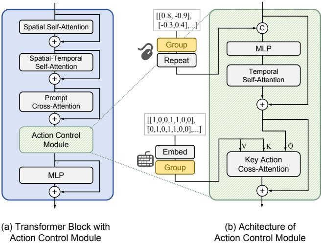
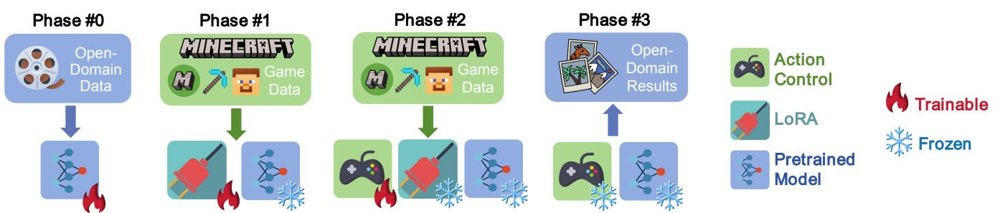
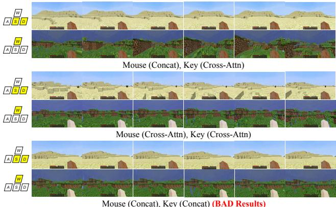
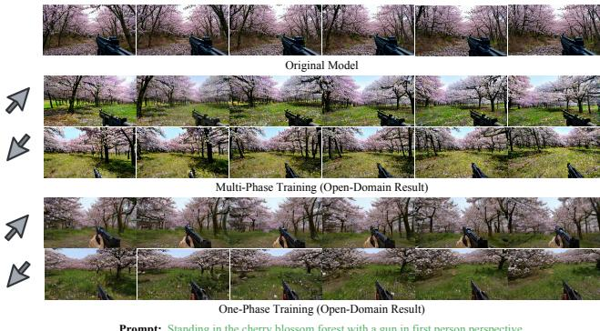
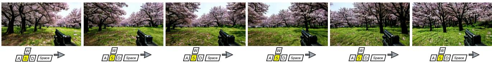
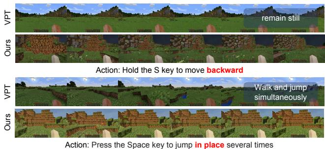
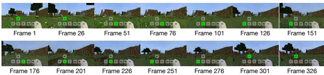

# 1. 論文基本信息

## 1.1. 标题
GameFactory: Creating New Games with Generative Interactive Videos
(GameFactory：通过生成式交互视频创造新游戏)

## 1.2. 作者
*   Jiwen Yu (香港大学)
*   Yiran Qin (香港大学)
*   Xintao Wang (快手科技)
*   Pengfei Wan (快手科技)
*   Di Zhang (快手科技)
*   Xihui Liu (香港大学)

    作者团队来自学术界（香港大学）和工业界（快手科技），表明这项研究结合了前沿的学术探索和强大的工程实践能力。

## 1.3. 发表期刊/会议
这是一篇提交至 arXiv 的预印本论文。arXiv 是一个开放获取的学术论文预印本平台，在计算机科学和人工智能领域被广泛用于快速分享最新的研究成果。虽然未经同行评审，但它是领域内交流最新进展的重要渠道。

## 1.4. 发表年份
2025年 (根据 arXiv 提交信息)

## 1.5. 摘要
生成式视频技术有潜力通过自主创造新内容来彻底改变游戏开发。本文提出了 **GameFactory**，一个用于**动作可控**且**场景可泛化**的游戏视频生成框架。首先，为了解决动作可控性这一基础挑战，作者引入了 `GF-Minecraft` 数据集，这是一个无人类偏见的、带有动作标注的游戏视频数据集，并开发了一个<strong>动作控制模块 (action control module)</strong>，能够精确控制键盘和鼠标输入。该框架进一步支持<strong>自回归生成 (autoregressive generation)</strong>，以创建无限长度的交互式视频。更重要的是，GameFactory 解决了现有方法普遍忽视的关键挑战：**场景可泛化的动作控制**。为了能够创造出超越固定风格和场景的全新多样化游戏，该框架利用了预训练视频扩散模型的<strong>开放域生成先验 (open-domain generative priors)</strong>。为了弥合开放域先验与小规模游戏数据集之间的领域差距，作者提出了一种<strong>多阶段训练策略 (multi-phase training strategy)</strong>，并配合一个<strong>领域适配器 (domain adapter)</strong>，将游戏风格学习与动作控制解耦。这种解耦确保了动作控制的学习不再受限于特定的游戏风格，从而实现了场景可泛化的动作控制。实验结果表明，GameFactory 能有效生成开放域的、动作可控的游戏视频，代表了在人工智能驱动的游戏生成领域迈出的重要一步。

## 1.6. 原文链接
*   **原文链接:** https://arxiv.org/abs/2501.08325
*   **PDF 链接:** https://arxiv.org/pdf/2501.08325v4
*   **发布状态:** 预印本 (Preprint)

    ---

# 2. 整体概括

## 2.1. 研究背景与动机
当前，基于视频生成模型的<strong>生成式游戏引擎 (generative game engines)</strong> 被认为是一个极具前景的研究方向，它有望颠覆传统游戏开发流程，实现内容的自动化和无限生成。然而，现有的研究工作大多存在一个核心局限：<strong>游戏特定性 (game-specific)</strong>。这些模型（如针对《DOOM》、《CS:GO》、《我的世界》等游戏开发的模型）虽然能在特定游戏内生成可交互的视频，但它们的生成能力和动作控制逻辑被牢牢地“焊死”在了训练数据的游戏风格和场景中。它们无法生成训练数据之外的、全新风格的游戏世界。

这一局限性构成了当前研究的核心<strong>空白 (Gap)</strong>：<strong>如何实现场景可泛化 (scene-generalizable) 的动作控制？</strong> 也就是说，如何让模型学会通用的“移动”、“跳跃”、“视角转动”等动作逻辑，并将这些逻辑应用到任意风格的场景中，无论是樱花森林、文艺复兴宫殿还是未来科幻城市。

本文的<strong>切入点 (Innovation)</strong> 正是解决这一问题。作者认为，强行收集覆盖所有可能游戏场景的、带有动作标注的视频数据是不现实的。一个更可行的方法是利用在海量互联网视频上预训练的<strong>大型视频生成模型 (e.g., Sora-like models)</strong>，因为它们已经具备了生成任意开放域场景的强大<strong>先验知识 (priors)</strong>。因此，核心挑战就转变为：<strong>如何在不破坏模型开放域生成能力的前提下，仅用少量特定游戏（如 Minecraft）的带标注数据，教会模型通用的动作控制能力？</strong> 直接微调会导致模型“忘记”开放域知识，只会生成 Minecraft 风格的视频，这种现象被称为<strong>灾难性遗忘 (catastrophic forgetting)</strong> 或 <strong>风格坍塌 (style collapse)</strong>。GameFactory 的核心思路就是通过一种巧妙的解耦训练策略来解决这个问题。

## 2.2. 核心贡献/主要发现
本文的主要贡献可以概括为以下三点：

1.  **提出了 GameFactory 框架：** 这是一个专为实现**动作可控**且**场景可泛化**的视频生成而设计的完整框架。其最终目标是超越现有游戏，创造出无限多样的全新交互式游戏体验。

2.  **构建了关键技术组件和数据集：**
    *   **GF-Minecraft 数据集：** 这是一个精心构建的、带有动作标注的《我的世界》游戏视频数据集。其关键特点是**无人类偏见**（通过程序化生成动作序列，避免了人类玩家的习惯性操作）、场景多样、并配有文本描述，为学习通用动作控制提供了高质量数据。
    *   **动作控制与长视频生成机制：** 设计了针对离散键盘输入和连续鼠标输入的精细控制模块，并实现了<strong>自回归 (autoregressive)</strong> 生成机制，使得模型能够生成无限长度的视频流，这是可玩游戏的基础。

3.  **提出了创新的解耦训练策略：** 为了实现场景泛化，作者提出了一个<strong>领域适配器 (domain adapter)</strong> 和<strong>多阶段解耦训练策略 (multi-phase decoupled training strategy)</strong>。这一策略是本文的**核心创新**，它将**游戏风格的学习**（例如 Minecraft 的像素画风）与**动作控制逻辑的学习**分离开来。通过这种方式，模型学到的动作控制能力不再与 Minecraft 风格绑定，可以被即插即用地应用到由预训练模型生成的任何开放域场景中。

    ---

# 3. 预备知识与相关工作

## 3.1. 基础概念

### 3.1.1. 视频扩散模型 (Video Diffusion Models)
扩散模型是一类强大的生成模型。其核心思想分为两个过程：
*   <strong>前向过程 (Forward Process):</strong> 对一张干净的图像或视频帧，逐步、多次地添加少量高斯噪声，直到它最终变成完全随机的噪声。这个过程是固定的，不需要学习。
*   <strong>反向过程 (Reverse Process):</strong> 训练一个深度神经网络（通常是 U-Net 或 Transformer 架构），让它学会在给定噪声水平（时间步 $t$）的情况下，预测并移除添加到数据中的噪声。通过从纯噪声开始，迭代地执行这个去噪步骤，模型最终可以生成一张全新的、干净的图像或视频帧。

    <strong>潜在扩散模型 (Latent Diffusion Models, LDM)</strong> 是对扩散模型的一种优化。为了降低计算复杂度，LDM 不直接在像素空间上操作，而是先用一个<strong>变分自编码器 (Variational Autoencoder, VAE)</strong> 将高分辨率的视频帧压缩到一个低维的<strong>潜在空间 (latent space)</strong> 中，然后在潜在空间上执行扩散和去噪过程，最后再用 VAE 的解码器将生成的潜在表示还原为高分辨率视频。本文的 GameFactory 正是基于这种架构。

### 3.1.2. Transformer 与注意力机制 (Attention Mechanism)
Transformer 是一种最初用于自然语言处理的神经网络架构，由于其强大的序列建模能力，现在也被广泛应用于计算机视觉，特别是视频生成。其核心是<strong>注意力机制 (Attention Mechanism)</strong>。

<strong>自注意力 (Self-Attention)</strong> 允许模型在处理一个序列（如视频帧序列或文本词元序列）时，计算序列中每个元素与其他所有元素之间的相关性权重。这使得模型能够捕捉长距离依赖关系。

<strong>交叉注意力 (Cross-Attention)</strong> 则用于融合两种不同模态的信息。它允许一个序列（例如视频特征）作为<strong>查询 (Query)</strong>，从另一个序列（例如文本描述或动作指令）中提取相关信息，该序列作为<strong>键 (Key)</strong> 和<strong>值 (Value)</strong>。这是实现文本到视频生成或动作控制的关键。其计算公式如下：

$$
\mathrm{Attention}(Q, K, V) = \mathrm{softmax}\left(\frac{QK^T}{\sqrt{d_k}}\right)V
$$

**符号解释:**
*   $Q$: 查询 (Query) 矩阵，代表当前需要关注的信息。
*   $K$: 键 (Key) 矩阵，代表可供查询的信息索引。
*   $V$: 值 (Value) 矩阵，代表可供查询的信息内容。
*   $d_k$: 键向量的维度。除以 $\sqrt{d_k}$ 是为了进行缩放，防止梯度消失。
*   $\mathrm{softmax}$: 归一化函数，将查询与键的点积相似度得分转换成权重。

### 3.1.3. LoRA (Low-Rank Adaptation)
LoRA 是一种<strong>参数高效微调 (Parameter-Efficient Fine-Tuning, PEFT)</strong> 技术。在微调大型预训练模型时，我们通常不希望更新模型所有的数十亿参数，因为这既耗时又耗存储，还容易导致灾难性遗忘。LoRA 的做法是：保持原始模型的权重 $W_0$ <strong>冻结 (frozen)</strong>，并在模型的特定层（通常是 Transformer 的权重矩阵）旁边注入两个可训练的、低秩的**适配器矩阵** $A$ 和 $B$。在微调时，只训练 $A$ 和 $B$。模型的前向传播变为 $h = W_0x + BAx$。由于 $A$ 和 $B$ 的秩 $r$ 远小于原始权重的维度，因此需要训练的参数量大大减少。在本文中，LoRA 被用作<strong>领域适配器 (domain adapter)</strong> 来学习 Minecraft 的特定游戏风格。

## 3.2. 前人工作
作者在第2节回顾了相关领域的研究，主要分为三类：

*   **视频扩散模型:** 近年来，基于 Transformer 的视频扩散模型（如 Sora、Open-Sora 等）在生成质量和时长上取得了巨大突破，被认为有潜力模拟真实世界的物理规律，成为<strong>世界模型 (world models)</strong>。
*   **可控视频生成:** 为了增强对生成视频的控制，研究者们引入了文本之外的控制信号，如图像、摄像头姿态（`MotionCtrl`、`CameraCtrl`）等，以实现更精细的视频编辑和生成。
*   **游戏视频生成:** 早期的工作使用 GAN 等模型，但受限于生成能力。近期，基于扩散模型的工作在特定游戏中取得了进展，如 `DIAMOND` (Atari)、`GameNGen` (DOOM)、`Oasis` (Minecraft) 等。然而，这些工作普遍存在对特定游戏或数据集的<strong>过拟合 (overfitting)</strong> 问题，缺乏<strong>场景泛化 (scene generalization)</strong> 能力。虽然最新的工作如 `Genie 2` 和 `Matrix` 在控制泛化方面有所探索，但前者依赖于大规模的动作标注数据收集，后者则在相对简单的赛车游戏场景和动作空间中验证，仍有提升空间。

## 3.3. 差异化分析
GameFactory 与之前工作的核心区别在于其**目标和实现手段**：

*   **目标不同:** 之前的工作大多旨在成为特定游戏的“模拟器”或“引擎”，而 GameFactory 的目标是成为一个**通用的、场景可泛化**的“游戏工厂”，能够创造出全新的游戏。
*   **手段不同:** 为了实现这一目标，GameFactory 没有试图收集海量多样化的游戏数据，而是巧妙地利用了**预训练开放域视频模型**的强大生成先验。其核心创新——**风格-动作解耦**的多阶段训练策略，是解决“学习动作”与“保持泛化”之间矛盾的关键，这是之前工作没有系统性解决的问题。

    ---

# 4. 方法论
本部分详细拆解 GameFactory 的技术实现，该框架的构建分为两个主要步骤：首先是实现一个基础的、在特定游戏（Minecraft）中动作可控的视频生成模型；其次是将其动作控制能力泛化到开放域场景。

## 4.1. 方法原理
GameFactory 的核心思想是<strong>解耦 (decoupling)</strong>。它认识到，一个可交互的生成式游戏包含两个核心要素：<strong>视觉风格 (visual style)</strong> 和<strong>动作逻辑 (action logic)</strong>。传统微调方法将这两者耦合在一起学习，导致动作逻辑与特定游戏的视觉风格（如 Minecraft 的像素风）绑定。GameFactory 的方法则是将这两者分离开，用不同的模块和训练阶段来学习，从而获得一个与风格无关的、通用的动作控制模块，可以应用到任何视觉场景中。

## 4.2. 核心方法详解 (逐层深入)

### 4.2.1. 基础模型与公式
GameFactory 采用一个基于 Transformer 的<strong>潜在视频扩散模型 (latent video diffusion model)</strong> 作为其主干网络。整个过程可以概括为：
1.  使用编码器 $E(\cdot)$ 将视频 $\mathbf{X}$ 压缩到潜在空间，得到潜在表示 $\mathbf{Z} = E(\mathbf{X})$。
2.  在训练过程中，向干净的潜在表示 $\mathbf{Z}_0$ 添加噪声 $\epsilon$，得到带噪的 $\mathbf{Z}_t$。
3.  训练模型 $\epsilon_{\phi}$ 来预测噪声，其目标是最小化预测噪声与真实噪声之间的差异。当引入动作控制时，损失函数变为：
    $$
    \mathcal { L } _ { \mathbf { a } } ( \phi ) = \mathbb { E } [ || \epsilon _ { \phi } ( \mathbf { Z } _ { t } , \mathbf { p } , \mathbf { A } , t ) - \epsilon || _ { 2 } ^ { 2 } ]
    $$
    **符号解释:**
    *   $\phi$: 模型的所有可训练参数。
    *   $\epsilon_{\phi}$: 以 $\phi$ 为参数的去噪网络（即 Transformer 模型）。
    *   $\mathbf{Z}_t$: 在时间步 $t$ 的带噪潜在表示。
    *   $\mathbf{p}$: 输入的文本提示 (prompt)。
    *   $\mathbf{A}$: 动作序列，例如键盘和鼠标的输入。
    *   $t$: 扩散过程的时间步。
    *   $\epsilon$: 添加到 $\mathbf{Z}_0$ 上的真实高斯噪声。
    *   $\mathbb{E}[\cdot]$: 表示期望值，即在所有数据、噪声和时间步上的平均。
    *   $||\cdot||_2^2$: L2 范数的平方，即均方误差损失。
4.  在推理时，从一个纯噪声 $\mathbf{Z}_T$ 开始，模型反复预测并去除噪声，最终得到去噪后的潜在表示 $\mathbf{Z}_0$，再通过解码器 $D(\cdot)$ 将其还原为视频 $\mathbf{X} = D(\mathbf{Z}_0)$。

### 4.2.2. 第1步：实现特定游戏内的动作控制 (Action-Controlled Video Generation)

#### 4.2.2.1. GF-Minecraft 数据集
为了训练动作控制能力，作者首先构建了 `GF-Minecraft` 数据集。该数据集通过在 Minecraft 环境中执行预定义的程序化动作序列来收集，具有三大优势：
*   **可访问性：** Minecraft 提供了丰富的 API，便于大规模、低成本地收集带动作标注的数据。
*   **无偏见的动作：** 与记录人类玩家操作的数据集（如 VPT）不同，该数据集通过分解原子动作（如前进、后退、跳跃等）并确保其均衡分布，消除了人类玩家的行为偏见（例如，人类很少长时间倒退或原地跳跃）。
*   **多样化的场景与文本描述：** 数据采集覆盖了不同的天气、时间和场景，并使用多模态大模型 `MiniCPM` 为视频片段自动生成文本描述。

#### 4.2.2.2. 动作控制模块 (Action Control Module)
该模块被注入到主干 Transformer 模型的每个块中，用于处理离散的键盘输入 $\mathbf{K}$ 和连续的鼠标输入 $\mathbf{M}$。

下图（原文 Figure 3）展示了动作控制模块的架构及其与 Transformer 块的集成方式。

<strong>1. 解决粒度不匹配问题：滑窗分组 (Grouping Actions with a Sliding Window)</strong>
由于 VAE 的时间压缩（压缩率 $r$），视频潜在表示的帧数 ($n+1$) 少于动作序列的帧数 (`rn`)，导致两者无法直接对齐。作者的解决方案是<strong>分组 (Grouping)</strong>。
下图（原文 Figure 4）形象地解释了这一过程。

*该图像是示意图，展示了视频帧、压缩视频潜变量与动作之间的关系。由于时间压缩（压缩比 $r = 4$），潜变量数量与动作数量不匹配，导致融合时的细粒度不匹配。图中展示了如何通过分组对齐这些序列以实现融合，同时指出第 $i$ 个潜变量能够与前一个窗口内的动作组融合（窗口大小 $w = 3$），以考虑延迟动作效果，例如 'jump' 键影响接下来的多个帧。*

对于第 $i$ 个潜在特征 $\mathbf{f}^i$，模型会考虑一个时间窗口内的所有相关动作，即从 $r \times (i - w + 1)$ 到 `ri` 之间的动作（$w$ 是窗口大小）。这种设计不仅解决了对齐问题，还能捕捉动作的**延迟效应**（例如，“跳跃”指令会影响后续多个帧的画面）。

<strong>2. 鼠标移动控制 (连续信号)</strong>
对于连续的鼠标移动信号 $\mathbf{M}$，模块采用<strong>拼接 (Concatenation)</strong> 的方式进行融合。
*   将分组后的鼠标动作 $\mathbf{M}_{group}$ 变形并复制，使其维度与 Transformer 中的中间特征 $\mathbf{F}$ 匹配。
*   将两者在<strong>通道维度 (channel dimension)</strong> 上进行拼接。
*   将拼接后的特征送入一个 MLP 层和时间自注意力层进行进一步学习。

<strong>3. 键盘动作控制 (离散信号)</strong>
对于离散的键盘按键信号 $\mathbf{K}$，模块采用<strong>交叉注意力 (Cross-Attention)</strong> 机制进行融合。
*   首先将离散的键盘动作（如 'W', 'Space'）转换为嵌入向量 (embedding)。
*   将分组后的键盘动作嵌入 $\mathbf{K}_{group}$ 作为交叉注意力层中的<strong>键 (Key)</strong> 和<strong>值 (Value)</strong>。
*   将 Transformer 的中间特征 $\mathbf{F}$ 作为<strong>查询 (Query)</strong>。
    这种方式类似于文本到视频模型中融合文本信息，模型可以根据当前视频的上下文（Query），主动地“关注”最相关的动作指令（Key/Value）。

#### 4.2.2.3. 自回归长视频生成 (Autoregressive Generation)
为了生成可无限游玩的长视频，作者提出了一种高效的自回归生成方法。

下图（原文 Figure 5）展示了其训练和推理过程。

*该图像是示意图，展示了自回归视频生成的过程。在（a）训练阶段，图示说明了噪声和真实潜在视频帧的处理；而在（b）推理阶段，模型通过历史视频潜在信息进行自回归生成。此过程允许根据前 $k + 1$ 帧条件生成剩余的 $N - k$ 帧。图中还提及了视频扩散模型和训练损失的计算。*

*   <strong>训练阶段 (a):</strong> 在一个包含 $N+1$ 帧的训练样本中，随机选择前 $k+1$ 帧作为<strong>条件 (condition)</strong>，不对它们添加噪声。只对后续的 `N-k` 帧添加噪声，并让模型预测这些噪声。**关键在于，损失函数只计算这 `N-k` 帧的预测误差**。这教会了模型在给定历史帧的情况下预测未来帧。
*   <strong>推理阶段 (b):</strong> 首先生成初始的 $N+1$ 帧视频。然后，将最后生成的 $k+1$ 帧作为新的条件，再次调用模型生成接下来的 `N-k` 帧。不断重复这个“取最新、生未来”的过程，就可以实现无限长度的视频生成。相比于一次只生成一帧的方法，这种一次生成多帧的策略效率更高。

### 4.2.3. 第2步：实现开放域的场景泛化 (Open-Domain Game Scene Generalization)
这是本文的核心创新所在，通过风格-动作解耦和多阶段训练实现。

#### 4.2.3.1. 风格-动作解耦与领域适配器
为了防止动作控制能力与 Minecraft 风格绑定，作者引入了一个独立的<strong>领域适配器 (domain adapter)</strong>，专门用于学习游戏特定的视觉风格。该适配器使用 **LoRA** 技术实现。这样，主干模型负责开放域生成，动作控制模块负责学习通用动作逻辑，而 LoRA 适配器则负责捕捉 Minecraft 风格。

#### 4.2.3.2. 多阶段训练策略
为了有效地训练这些解耦的组件，作者设计了如下的多阶段训练流程。

下图（原文 Figure 6）清晰地展示了这一策略。

*该图像是一个示意图，展示了GameFactory框架的多阶段训练过程，包含四个阶段：开放域数据、Minecraft游戏数据、行动控制以及开放域结果。每个阶段分别阐述了数据输入、模型训练与产生的结果，呈现出通过解耦实现场景通用的行动控制的流程。*

*   <strong>阶段 #0: 模型预训练 (Model Pretraining)</strong>
    这一阶段是基础，使用一个已经在海量开放域视频数据上预训练好的、强大的视频扩散模型。这个模型拥有丰富的生成先验知识。

*   <strong>阶段 #1: 微调 LoRA 以适应游戏视频 (Tune LoRA to Fit Game Videos)</strong>
    在此阶段，冻结预训练模型的大部分参数，只在 `GF-Minecraft` 数据集上训练 **LoRA 适配器**。目标是让 LoRA 模块学习并吸收 Minecraft 的所有视觉风格信息。

*   <strong>阶段 #2: 微调动作控制模块 (Tune Action Control Module)</strong>
    在此阶段，**同时冻结**预训练模型参数和在阶段 #1 中训练好的 **LoRA 参数**。然后，在 `GF-Minecraft` 数据集（包含视频和动作标签）上，**只训练动作控制模块**。
    **核心直觉是：** 由于视觉风格已经由 LoRA 模块“接管”，此时扩散模型的训练损失将主要来自于视频内容与动作指令之间的不匹配。因此，优化过程会迫使动作控制模块去学习“输入某个动作，视频应该如何变化”的通用物理和动态规律，而不是去拟合 Minecraft 的像素画风。

*   <strong>阶段 #3: 在开放域上进行推理 (Inference on Open Domain)</strong>
    在推理阶段，为了生成一个全新风格的游戏（例如，在樱花林中行走），组合如下模块：
    1.  <strong>原始的预训练模型 (来自阶段 #0)</strong>
    2.  <strong>训练好的动作控制模块 (来自阶段 #2)</strong>
        **关键一步是：丢弃在阶段 #1 中训练的 LoRA 适配器**。因为 LoRA 包含了 Minecraft 的风格信息，丢弃它就等于剥离了特定游戏的风格。而由于解耦训练，动作控制模块学到的能力是通用的，因此可以成功地应用在原始预训练模型生成的任何开放域场景上，实现场景可泛化的交互式视频生成。

---

# 5. 实验设置

## 5.1. 数据集
*   **训练数据集:** `GF-Minecraft`。如前所述，这是一个作者自己构建的、包含 70 小时游戏时长的带动作标注和文本描述的《我的世界》视频数据集，其关键特点是动作分布无人类偏见。
*   **对比数据集:** `VPT (Video PreTraining)` 数据集。这是一个记录了人类真实玩《我的世界》视频的数据集，其中包含了人类玩家的行为偏见。作者用它来验证其无偏见数据集的优越性。
*   **测试集:** 从 `GF-Minecraft` 数据集中保留 5% 作为测试集，并进一步划分为三个子集用于消融研究：
    *   `only-key`: 只包含键盘动作。
    *   `mouse-small`: 包含小范围的鼠标移动。
    *   `mouse-large`: 包含大范围的鼠标移动。

## 5.2. 评估指标
论文使用了多项指标来从不同维度评估生成视频的质量和可控性。

*   <strong>Flow (光流均方误差)</strong>
    1.  **概念定义:** 光流 (Optical Flow) 描述了视频中像素在连续帧之间的运动。该指标通过计算生成视频的光流与参考（真实）视频的光流之间的<strong>均方误差 (Mean Square Error, MSE)</strong> 来衡量动作跟随的准确性。光流越接近，说明生成视频中的物体运动和视角变化越符合预期。**该指标值越低越好**。
    2.  **数学公式:**
        $$
        \text{Flow} = \frac{1}{H \times W \times T} \sum_{t=1}^{T} \sum_{i=1}^{H} \sum_{j=1}^{W} || \mathbf{f}_{gen}(i,j,t) - \mathbf{f}_{ref}(i,j,t) ||_2^2
        $$
    3.  **符号解释:**
        *   `H, W`: 视频帧的高度和宽度。
        *   $T$: 视频帧数。
        *   $\mathbf{f}_{gen}(i,j,t)$: 生成视频在第 $t$ 帧、坐标 `(i,j)` 处的光流向量。
        *   $\mathbf{f}_{ref}(i,j,t)$: 参考视频在第 $t$ 帧、坐标 `(i,j)` 处的光流向量。

*   <strong>Cam (相机位姿欧氏距离)</strong>
    1.  **概念定义:** 该指标评估生成视频的相机运动轨迹与参考视频的匹配程度。它首先使用一个名为 `GLOMAP` 的运动恢复结构 (Structure-from-Motion) 工具从视频中提取相机位姿（位置和方向），然后计算生成视频和参考视频相机位姿之间的<strong>欧氏距离 (Euclidean distance)</strong>。**该指标值越低越好**。
    2.  **数学公式:**
        $$
        \text{Cam} = \frac{1}{T} \sum_{t=1}^{T} || \mathbf{p}_{gen}(t) - \mathbf{p}_{ref}(t) ||_2
        $$
    3.  **符号解释:**
        *   $T$: 视频帧数。
        *   $\mathbf{p}_{gen}(t)$: 从生成视频提取的第 $t$ 帧的相机位姿向量。
        *   $\mathbf{p}_{ref}(t)$: 从参考视频提取的第 $t$ 帧的相机位姿向量。

*   <strong>CLIP Score (CLIP 分数)</strong>
    1.  **概念定义:** 该指标用于评估生成视频的**语义内容**与给定的<strong>文本提示 (prompt)</strong> 的相关性。它使用预训练的 CLIP (Contrastive Language-Image Pre-Training) 模型分别提取视频帧的图像特征和文本提示的文本特征，然后计算两者之间的余弦相似度。**该指标值越高越好**。
    2.  **数学公式:**
        $$
        \text{CLIP Score} = \mathbb{E}[\cos(\text{CLIP}_I(\text{Frame}), \text{CLIP}_T(\text{Prompt}))]
        $$
    3.  **符号解释:**
        *   $\text{CLIP}_I(\cdot)$: CLIP 的图像编码器。
        *   $\text{CLIP}_T(\cdot)$: CLIP 的文本编码器。
        *   $\cos(\cdot, \cdot)$: 余弦相似度。
        *   $\mathbb{E}[\cdot]$: 对视频中所有帧计算的平均值。

*   **FID (Fréchet Inception Distance)** 和 **FVD (Fréchet Video Distance)**
    1.  **概念定义:** FID 和 FVD 是衡量生成样本分布与真实样本分布之间距离的指标，用于评估生成视频的**视觉质量**和**真实性**。FID 在图像级别操作，而 FVD 进一步考虑了时间连贯性。它们通过一个预训练网络（如 InceptionV3）提取特征，并将两组特征分布建模为多维高斯分布，然后计算这两个分布之间的 Fréchet 距离。**这两个指标都是值越低越好**。
    2.  <strong>数学公式 (FID):</strong>
        $$
        \text{FID}(g, r) = ||\mu_g - \mu_r||_2^2 + \text{Tr}(\Sigma_g + \Sigma_r - 2(\Sigma_g \Sigma_r)^{1/2})
        $$
    3.  **符号解释:**
        *   `g, r`: 分别代表生成数据分布和真实数据分布。
        *   $\mu_g, \mu_r$: 特征向量的均值。
        *   $\Sigma_g, \Sigma_r$: 特征向量的协方差矩阵。
        *   $\text{Tr}(\cdot)$: 矩阵的迹（主对角线元素之和）。

*   <strong>Dom (领域相似度)</strong>
    1.  **概念定义:** 这是作者自定义的一个指标，用于衡量经过微调后的模型生成的视频与**原始预训练模型**生成的视频在 CLIP 特征空间中的相似度。这个指标用于量化场景泛化实验中的**风格保持**程度。**该指标值越高，说明模型越好地保持了原始的开放域生成能力**。

## 5.3. 对比基线
由于任务的独特性和设置的差异，本文没有与外部的 SOTA 模型进行直接的量化比较。实验主要围绕内部的<strong>消融研究 (ablation studies)</strong> 和对比分析展开：
1.  **动作控制模块设计对比：** 比较使用<strong>交叉注意力 (Cross-Attention)</strong> 和<strong>拼接 (Concatenation)</strong> 来处理键盘和鼠标输入的性能差异。
2.  **训练策略对比：** 比较本文提出的<strong>多阶段训练策略 (Multi-Phase)</strong> 与直接在游戏数据上联合训练所有模块的<strong>单阶段训练策略 (One-Phase)</strong> 在场景泛化上的效果。
3.  **数据集对比：** 比较在作者构建的无偏见数据集 `GF-Minecraft` 上训练的模型与在含人类偏见的 `VPT` 数据集上训练的模型的性能。

    ---

# 6. 实验结果与分析

## 6.1. 核心结果分析
实验结果有力地支持了 GameFactory 框架的有效性，主要体现在动作可控性、场景泛化能力以及数据集的优越性上。

### 6.1.1. 动作可控性 (Ablation Study)
作者对动作控制模块的设计进行了消融实验，以确定处理离散键盘和连续鼠标信号的最佳方式。

以下是原文 Table 2 的结果：

<table>
<thead>
<tr>
<th colspan="2">Control Module</th>
<th colspan="5">Only-Key</th>
<th colspan="5">Mouse-Small</th>
<th colspan="5">Mouse-Large</th>
</tr>
<tr>
<th>Key</th>
<th>Mouse</th>
<th>Cam↓</th>
<th>Flow↓</th>
<th>CLIP↑</th>
<th>FID↓</th>
<th>FVD↓</th>
<th>Cam↓</th>
<th>Flow↓</th>
<th>CLIP↑</th>
<th>FID↓</th>
<th>FVD↓</th>
<th>Cam↓</th>
<th>Flow↓</th>
<th>CLIP↑</th>
<th>FID↓</th>
<th>FVD↓</th>
</tr>
</thead>
<tbody>
<tr>
<td>Cross-Attn</td>
<td>Cross-Attn</td>
<td>0.0527</td>
<td>8.67</td>
<td>0.3313</td>
<td>107.13</td>
<td>814.05</td>
<td>0.0798</td>
<td>20.46</td>
<td>0.3137</td>
<td>125.67</td>
<td>1203.29</td>
<td>0.1362</td>
<td>325.18</td>
<td>0.3103</td>
<td>167.37</td>
<td>1383.92</td>
</tr>
<tr>
<td>Concat</td>
<td>Concat</td>
<td>0.0853</td>
<td>22.37</td>
<td>0.3277</td>
<td>103.89</td>
<td>786.50</td>
<td>0.0756</td>
<td>19.18</td>
<td>0.3159</td>
<td>133.42</td>
<td>1151.71</td>
<td>0.1179</td>
<td>258.93</td>
<td>0.3123</td>
<td>145.74</td>
<td>1405.47</td>
</tr>
<tr>
<td><strong>Cross-Attn</strong></td>
<td><strong>Concat</strong></td>
<td><strong>0.0439</strong></td>
<td><strong>7.79</strong></td>
<td><strong>0.3292</strong></td>
<td><strong>105.28</strong></td>
<td><strong>795.03</strong></td>
<td><strong>0.0685</strong></td>
<td><strong>18.64</strong></td>
<td><strong>0.3184</strong></td>
<td><strong>127.84</strong></td>
<td><strong>1032.98</strong></td>
<td><strong>0.1021</strong></td>
<td><strong>249.54</strong></td>
<td><strong>0.3107</strong></td>
<td><strong>139.91</strong></td>
<td><strong>1420.89</strong></td>
</tr>
</tbody>
</table>

**分析：**
*   **最佳组合：** 结果显示，<strong>为键盘（离散信号）使用交叉注意力，为鼠标（连续信号）使用拼接</strong> 的组合（表格最后一行）在 `Cam` 和 `Flow` 指标上取得了最佳性能。
*   **原因解释：** 作者推测，交叉注意力基于相似度计算，非常适合处理类别化的信号（如按键），这与文本控制的原理相似。而对于连续的鼠标移动，其**数值大小**非常重要，拼接能够直接保留这些数值信息，而交叉注意力的相似度计算可能会削弱数值大小的影响。
*   **生成质量：** `CLIP`、`FID`、`FVD` 等衡量生成质量的指标在不同方法间差异不大，这恰好验证了多阶段训练策略的有效性——风格和质量的学习主要在阶段 #1 完成，与动作控制模块的设计解耦。

    下图（原文 Figure 7）直观展示了使用拼接（Concat）控制键盘时，模型无法很好地跟随指令。

    
    *该图像是示意图，展示了不同输入控制方法下生成的视频效果。图中包括四个区块，分别对比了使用“Mouse”和“Key”控制的不同组合（如“Concat”和“Cross-Attn”）所产生的场景。这些场景显示了在动作控制中产生的多种结果，其中标记为“BAD Results”的区块突出了较差的效果，为研究者提供了可视化的比较依据。*

### 6.1.2. 场景泛化能力
这是本文最重要的实验。作者比较了<strong>多阶段训练 (Multi-Phase)</strong> 和<strong>单阶段训练 (One-Phase)</strong> 在开放域场景生成上的表现。

以下是原文 Table 3 的结果：

<table>
<thead>
<tr>
<th>Strategy</th>
<th>Domain</th>
<th>Cam↓</th>
<th>Flow↓</th>
<th>Dom↑</th>
<th>CLIP↑</th>
<th>FID↓</th>
<th>FVD↓</th>
</tr>
</thead>
<tbody>
<tr>
<td>Multi-Phase</td>
<td>In-</td>
<td>0.0839</td>
<td>43.48</td>
<td>-</td>
<td>-</td>
<td>-</td>
<td>-</td>
</tr>
<tr>
<td><strong>Multi-Phase</strong></td>
<td><strong>Open-</strong></td>
<td><strong>0.0997</strong></td>
<td><strong>54.13</strong></td>
<td><strong>0.7565</strong></td>
<td><strong>0.3181</strong></td>
<td><strong>121.18</strong></td>
<td><strong>1256.94</strong></td>
</tr>
<tr>
<td>One-Phase</td>
<td>Open-</td>
<td>0.1134</td>
<td>76.02</td>
<td>0.7345</td>
<td>0.3111</td>
<td>167.79</td>
<td>1323.58</td>
</tr>
</tbody>
</table>

**分析：**
*   **动作跟随性能：** 在开放域（Open-）测试中，多阶段策略的 `Cam` 和 `Flow` 指标显著优于单阶段策略，且更接近在领域内（In-）测试的基线水平，表明其动作控制能力更好地泛化到了新场景。
*   **领域保持与生成质量：** 多阶段策略的 `Dom` 指标更高，说明其生成的视频风格更接近原始的开放域模型。同时，其 `CLIP`、`FID`、`FVD` 指标也全面占优，意味着生成质量更高，语义更相关。

    下图（原文 Figure 8）的视觉对比非常明显：单阶段训练的模型出现了严重的<strong>风格泄漏 (style leakage)</strong>，生成的樱花林场景带上了 Minecraft 的像素块状伪影。而多阶段训练的模型则完美地保持了原始模型的画风。

    
    *该图像是一个示意图，展示了原始模型和经过多相位训练及单相位训练的开放领域结果。图中包括樱花森林场景，展示不同训练方法在动作控制和场景生成上的表现。*

下图（原文 Figure 1）展示了更多令人惊艳的开放域生成结果，证明了 GameFactory 创造全新交互式游戏世界的潜力。

*该图像是示意图，展示了GameFactory框架中的互动视频生成过程。上方展示了在不同场景下，玩家通过按键操作（W、A、S、D及空格）控制角色的动态画面，底部则描述了相应的操作指令，以实现有效的场景控制和动作生成。*

### 6.1.3. GF-Minecraft 数据集评估
作者通过与含有**人类偏见**的 `VPT` 数据集进行对比，证明了其自建数据集的优越性。

以下是原文 Table 5，展示了两个数据集中按键使用的比例差异：

<table>
<thead>
<tr>
<th>Dataset</th>
<th>W</th>
<th>A</th>
<th>S</th>
<th>D</th>
<th>Space</th>
<th>Shift</th>
<th>Ctrl</th>
</tr>
</thead>
<tbody>
<tr>
<td>VPT [3]</td>
<td>50.11%</td>
<td>4.03%</td>
<td>0.32%</td>
<td>3.45%</td>
<td>20.37%</td>
<td>0.14%</td>
<td>19.58%</td>
</tr>
<tr>
<td>Ours</td>
<td>13.56%</td>
<td>13.56%</td>
<td>13.56%</td>
<td>13.56%</td>
<td>15.25%</td>
<td>15.25%</td>
<td>15.25%</td>
</tr>
</tbody>
</table>

**分析：** `VPT` 数据集的按键分布极不均衡，例如前进键 (W) 的使用频率是后退键 (S) 的100多倍，这符合人类玩家的习惯。而 `GF-Minecraft` (Ours) 的分布则非常均衡。

以下是原文 Table 4，比较了在两个数据集上训练的模型的动作控制性能：

<table>
<thead>
<tr>
<th>Dataset</th>
<th>Cam↓</th>
<th>Flow↓</th>
<th>CLIP↑</th>
<th>FID↓</th>
<th>FVD↓</th>
</tr>
</thead>
<tbody>
<tr>
<td>VPT [3]</td>
<td>0.1324</td>
<td>107.67</td>
<td>0.3174</td>
<td>156.69</td>
<td>1233.15</td>
</tr>
<tr>
<td><strong>GF-Minecraft (ours)</strong></td>
<td><strong>0.0839</strong></td>
<td><strong>43.48</strong></td>
<td><strong>0.3135</strong></td>
<td><strong>125.85</strong></td>
<td><strong>1047.59</strong></td>
</tr>
</tbody>
</table>

**分析：** 在 `GF-Minecraft` 上训练的模型在动作跟随指标 `Cam` 和 `Flow` 上远超在 `VPT` 上训练的模型。

下图（原文 Figure 9）直观地展示了这种差异。当被指令执行人类不常做的动作（如原地跳跃或后退）时，VPT 训练的模型会失败（例如，原地跳跃变成了向前跳，后退则变成了原地不动），而 `GF-Minecraft` 训练的模型则能正确执行。

*该图像是图表，展示了在不同动作控制方法（VPT与本文方法）的对比效果。图中包含两个动作示例：“按住S键向后移动”和“按空格键原地跳跃”。每组展示了不同方法在执行这些动作时生成的场景效果，突出展示了本文方法在动作控制的优势和表现。*

## 6.2. 消融实验/参数分析
除了上述核心对比实验，作者还对长视频生成的训练方式进行了消融。

以下是原文 Table 6 的结果：

<table>
<thead>
<tr>
<th>Loss Scope</th>
<th>Cam↓</th>
<th>Flow↓</th>
<th>CLIP↑</th>
<th>FID↓</th>
<th>FVD↓</th>
</tr>
</thead>
<tbody>
<tr>
<td>All frames</td>
<td>0.1547</td>
<td>148.73</td>
<td>0.2965</td>
<td>176.07</td>
<td>1592.43</td>
</tr>
<tr>
<td><strong>Only predicted frames</strong></td>
<td><strong>0.0924</strong></td>
<td><strong>85.45</strong></td>
<td><strong>0.3190</strong></td>
<td><strong>136.95</strong></td>
<td><strong>1154.45</strong></td>
</tr>
</tbody>
</table>

**分析：** 结果表明，在训练自回归模型时，**只对需要预测的未来帧计算损失** 的效果远好于对所有帧计算损失。这符合直觉，因为模型不需要从已经作为条件的、无噪声的帧中学习去噪，这样做反而会引入无关的干扰。

下图（原文 Figure 10）展示了模型成功生成超过300帧的长视频。

*该图像是示意图，展示了生成的长视频中的关键帧。上半部分显示从第1帧到第151帧的关键画面，底部则展示第176帧到第326帧的画面，体现了动作控制的演变和场景变化。*

---

# 7. 总结与思考

## 7.1. 结论总结
本文成功提出了 GameFactory，一个旨在通过生成式交互视频创造新游戏的创新框架。它解决了当前生成式游戏引擎研究中的一个核心瓶颈——**场景泛化能力**。
*   **核心贡献：** 通过引入<strong>领域适配器 (LoRA)</strong> 和精心设计的**多阶段解耦训练策略**，GameFactory 成功地将**游戏风格学习**与**通用动作控制学习**分离开来。这使得模型学到的动作控制能力不再局限于特定的训练游戏（如 Minecraft），而是可以被灵活地应用到由大型预训练模型生成的任何开放域场景中。
*   **辅助贡献：** 为了支持这一框架，作者还构建了一个高质量的、无人类偏见的动作标注数据集 `GF-Minecraft`，并设计了精细的动作控制模块和高效的自回归长视频生成机制。
*   **意义：** GameFactory 的研究代表了向真正意义上的“AI 游戏生成”迈出的重要一步，它展示了一条在不牺牲开放域生成能力的前提下，为生成模型赋予通用交互能力的有效路径，为未来实现可任意想象、即时生成的游戏世界奠定了坚实的技术基础。

## 7.2. 局限性与未来工作
尽管 GameFactory 取得了显著进展，但作者也承认，通往一个完全成熟的生成式游戏引擎的道路依然漫长，并指出了未来的研究方向：
*   **复杂游戏逻辑：** 目前的交互主要停留在导航和视角控制层面。实现更复杂的游戏玩法，如设计多样的关卡、任务目标、玩家反馈系统、游戏内物体交互与操纵等，是未来的巨大挑战。
*   **长时记忆与一致性：** 虽然可以生成长视频，但如何保持长期的上下文记忆和世界状态的一致性（例如，一个被玩家改变的物体在很长一段时间后仍保持改变后的状态）仍是一个开放性问题。
*   **实时生成：** 当前的扩散模型生成速度较慢，远未达到实时交互的要求。如何实现低延迟、高帧率的实时游戏生成是其实际应用的关键瓶颈。

## 7.3. 个人启发与批判
这篇论文带来了深刻的启发，同时也存在一些值得思考的方面。

**启发：**
1.  **解耦思想的威力：** 本文最核心的启发在于其**解耦**的思想。在复杂的机器学习任务中，将一个耦合的目标（例如，生成 Minecraft 风格的、可交互的视频）分解为多个独立的子目标（学习风格 + 学习动作），并用不同的模块和训练策略去分别优化，是一种非常强大和通用的解决问题的范式。这种思想可以被迁移到许多其他领域，例如可控内容生成、风格迁移、机器人技能学习等。
2.  **善用先验知识：** 与其从零开始或试图收集“完美”的大而全数据集，不如思考如何站在“巨人”（大型预训练模型）的肩膀上。本文巧妙利用了开放域视频模型的生成先验，并将问题转化为如何“注入”新的能力而不破坏原有能力，这是一个极具实践价值的思路。
3.  **数据质量的重要性：** `GF-Minecraft` 的构建过程强调了数据偏见对模型行为的巨大影响。通过程序化生成来构建无偏见数据集，确保模型学习到的是普适规律而非特定模式，这一点对于训练通用智能体和世界模型至关重要。

**批判与思考：**
1.  <strong>“游戏”</strong>的定义： 尽管成果令人印象深刻，但目前生成的“游戏”更像是可交互的“动态场景”或“漫游模拟器”。一个真正的游戏需要有明确的规则、目标、状态和物理引擎。GameFactory 在模拟视觉和动态上表现出色，但尚未触及更深层次的游戏逻辑和物理一致性。例如，视频中的碰撞检测似乎是视觉上的“停止”，而非基于物理引擎的真实反馈。
2.  **评估的局限性：** 论文的评估主要依赖于与参考视频的指标对比和视觉定性评估。对于一个“游戏”而言，更重要的评估标准应该是“可玩性”、“趣味性”和“交互的合理性”，这些目前还缺乏有效的量化评估方法。
3.  **泛化能力的边界：** 尽管模型可以在任意场景中执行“前进”、“跳跃”等动作，但这些动作的语义在不同场景下是否总是一致？例如，在水中“跳跃”和在陆地上“跳跃”应该有完全不同的视觉和物理表现。模型是否能真正理解场景并做出适应性调整，还是仅仅在执行一种“视觉上的模板化操作”，这一点还有待更深入的探索。

    总而言之，GameFactory 是一项开创性的工作，它不仅提出了一个强大的框架，更重要的是，它为解决通用人工智能中一个核心矛盾——**学习新技能与保持旧知识**——提供了一个优雅且有效的解决方案。它为我们描绘了一个激动人心的未来：任何人都可以通过简单的描述和交互，创造出属于自己的、独一无二的游戏世界。