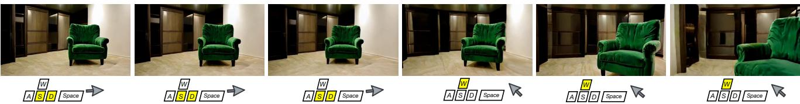
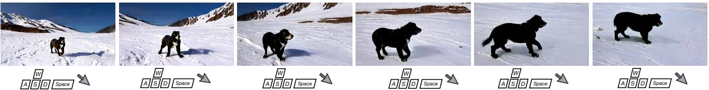
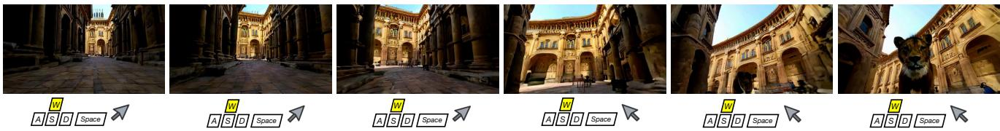
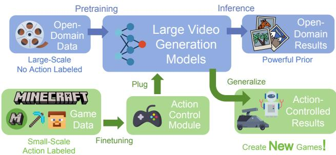
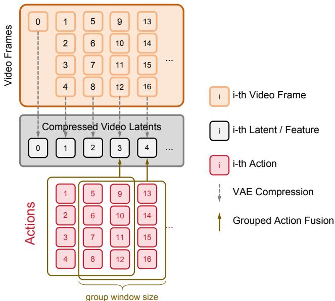
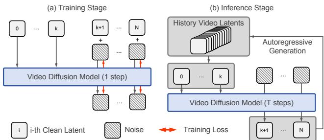
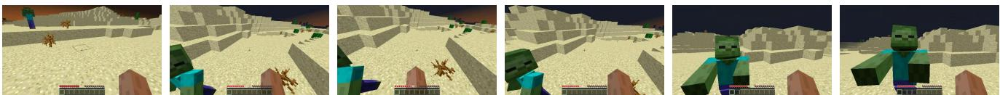
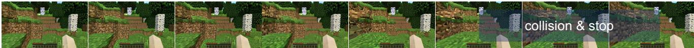
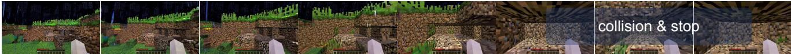
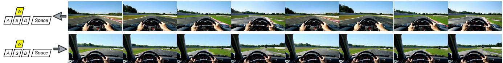

# G=meFactory: 使用生成互动视频创建新游戏

余杰文1\*† 秦怡然1\* 王新涛2‡ 万鹏飞2 张迪2 刘西辉1‡ 1 香港大学 2 快手科技 https://yujiwen.github.io/gamefactory/

  
ompt:Standhecherry losforest w u rst person perspeiv.

  
() Prompt:An emerald green velvet accent chair sits prominently in the center of a minimalist room.

  
:arg Sit Berwak ey cshevas s-covepns e

  
)Prompt: In a Renaissance palace, from a first person perspective, one can see a lion in front.   
c .

# 摘要

生成视频有潜力通过自主创建新内容革命化游戏开发。本文提出了GameFactory，一个用于动作可控场景泛化游戏视频生成的框架。我们首先通过引入GF-Minecraft，这是一个无人工偏见的动作标注游戏视频数据集，来解决动作可控性的基本挑战，并开发了一个动作控制模块，使对键盘和鼠标输入的精确控制成为可能。我们进一步扩展以支持自回归生成，从而实现无限长度的互动视频。更重要的是，GameFactory应对了场景泛化动作控制的关键挑战，而大多数现有方法未能解决这一问题。为了能够创建完全新颖和多样化的游戏，超越固定风格和场景，我们利用了来自预训练视频扩散模型的开放域生成先验。为了缩小开放域先验与小规模游戏数据集之间的领域差距，我们提出了一种多阶段训练策略，采用领域适配器将游戏风格学习与动作控制解耦。这一解耦确保动作控制的学习不再受限于特定的游戏风格，从而实现场景泛化的动作控制。实验结果表明，GameFactory有效生成了开放域的动作可控游戏视频，代表了AI驱动游戏生成的重要进展。

  
Figure 2. A schematic of our GameFactory creating new games based on pre-trained large video generation models. The upper blue section shows the generative capabilities of the pretrained model in an open-domain, while the lower green section demonstrates how the action control module, learned from a small amount of game data, can be plugged in to create new games.

# 1. 引言

视频扩散模型在视频生成方面展现出了令人印象深刻的能力。这些模型有潜力成为生成性游戏引擎的有力候选者，这将彻底改变游戏开发，不仅通过自动内容创作显著减少传统游戏行业的人工工作，还能为玩家生成无限的游戏内容进行探索。鉴于这一有前景的方向，探索如何构建合格的生成性游戏引擎显得尤为重要。生成性游戏引擎通常被实现为具有动作可控性的视频生成模型，使其能够对用户输入（如键盘和鼠标交互）做出响应。目前的研究工作主要集中在特定游戏上，如《DOOM》、《Atari》、《CS:GO》、《超级马里奥兄弟》和《我的世界》，或者使用有限的特定游戏数据集。这种特定游戏的方法缺乏场景泛化能力，阻碍了模型创造超越现有游戏内容的能力，限制了其开发新游戏的潜力。因此，场景泛化仍然是推动生成性游戏引擎发展的一个关键挑战。

为了在游戏视频中实现场景泛化，收集大规模的动作标注视频数据集将是最直接的方法。拥有足够覆盖所有可能场景的数据，可以使任意游戏场景生成成为可能。然而，这种动作标注的成本 prohibitively 高，并且对于开放域视频来说并不实际。相比之下，互联网上开放域视频非常丰富，基于这些视频训练的视频生成模型包含丰富的生成先验。利用这些场景生成先验提供了更可行的场景泛化路径（见图2的上部分）。这一观察促使我们提出一个问题：利用在大规模开放域视频上预训练的视频生成模型，结合小规模动作标注的游戏视频，我们能否赋予场景可泛化视频生成以动作控制能力？这是一个非平凡的问题，因为直接用动作标注的游戏视频对预训练视频生成模型进行微调将导致场景泛化能力下降（即模型将退化到特定的游戏视频领域）。在本工作中，我们提出了GameFactory，一个用于动作控制和场景泛化的游戏视频生成框架。为了实现动作控制的视频生成，我们首先收集一个动作标注的游戏视频数据集GFMinecraft。该数据集 sourced 于Minecraft平台，具有公正的动作分布、多样的场景以及文本注释（第4.1节）。其次，我们为连续鼠标移动和离散键盘输入分别设计了动作控制机制。这些动作控制模块可以无缝地注入到预训练的视频扩散模型中，而不影响预训练模型的视频生成能力（第4.2节）。最后，我们通过允许不同帧之间的噪声水平变化，将模型扩展至自回归长视频生成，持续基于之前生成的帧生成新的视频帧（第4.3节）。然而，直接在Minecraft数据上微调预训练模型不仅赋予其动作控制能力，还可能将特定的Minecraft风格嵌入到生成的游戏中，从而损害模型的开放域泛化能力。为解决该挑战，我们的核心思想是通过不同的模块和参数将游戏风格和动作控制的学习解耦，从而在不影响生成开放域视频的动作可控性的前提下，移除游戏风格（第5.1节）。具体而言，我们提出了一个领域适配器来适配Minecraft风格，结合多阶段解耦训练策略（第5.2节）。总结而言，我们的关键贡献包括： • 我们提出了GameFactory，用于动作控制和场景可泛化的视频生成，使得超越现有游戏的多样化互动游戏生成成为可能。 • 我们引入了GF-Minecraft，一个特征为公正动作分布、多样场景和文本描述的动作标注游戏视频数据集。我们还设计了专门的动作控制机制和自回归长视频生成机制。 • 我们提出了一个领域适配器，结合多阶段解耦训练策略，实现了将游戏风格与动作控制分开，使开放域视频生成的同时保持动作可控性。

# 2. 相关工作

# 2.1. 视频扩散模型

随着扩散模型的兴起，视觉生成领域取得了显著进展，涵盖了图像生成和视频生成。特别是在视频生成方面，近期的进展已从U-Net架构转向基于Transformer的架构，使得视频扩散模型能够生成高度真实、时长较长的视频。这些生成视频的质量使人们相信视频扩散模型具备理解和模拟现实物理规则的能力，暗示其在自动驾驶和机器人等领域作为世界模型的潜在应用。

# 2.2. 可控视频生成

仅仅依靠文本描述在文本到视频模型中往往提供有限的控制，导致输出结果模糊。为了增强控制力，一些方法引入了额外的控制信号。例如，方法如 [16, 30, 44] 将图像作为视频生成器的控制信号，改善了视频质量和时间关系建模。Direct-a-Video [48] 使用相机嵌入器来调整相机姿态，但其仅依赖三个相机参数的做法限制了控制能力，仅能实现基本的运动，如向左平移。相较之下，MotionCtrl [43] 和 CameraCtrl [17] 提供了对生成视频中相机姿态更复杂和细致的控制。

# 2.3. 游戏视频生成

早期的研究 [24, 25, 2729] 开始探索使用生成模型（如 GAN）进行游戏生成，但主要受到这些模型生成能力的限制。最近，由于视频生成模型的前景可期，研究人员开始探索它们在游戏生成中的应用 [2, 6, 7, 11, 12, 14, 23, 42, 47]。Genie [6] 提出了一个基于视频生成的可玩世界基础模型。DIAMOND [2]、GameNGen [42]、Oasis [11] 和 PlayGen [47] 利用扩散基础的世界建模为特定游戏如 Atari [2]、CS:GO [2]、DOOM [42, 47]、Minecraft [11] 和超级马里奥兄弟 [47] 提供支持。GameGenX [7] 引入了 OGameData 用于游戏视频生成和控制。然而，这些研究存在对特定游戏或数据集的过拟合，表现出有限的场景泛化能力。最近的工作如 Genie 2 [12] 和 Matrix [14] 在游戏视频生成中的控制泛化方面取得了有价值的进展。虽然 Genie 2 通过大量标注行动数据的收集展示了令人印象深刻的结果，而 Matrix 在赛车游戏中显示出良好的泛化能力，但在实现更广泛的场景泛化和更多样化的行动控制方面仍有改进的空间。相比之下，我们提出的 GameFactory 通过利用预训练的视频模型先验和易获取且低成本的游戏数据集 GFMinecraft 来解决场景泛化问题，实验验证了其在多样化开放世界场景和更复杂的动作空间（包括前/后/左/右移动、跳跃以及加速/减速）中的有效性。

# 3. 前言

我们采用基于变压器的潜在视频扩散模型作为主干。设 $\mathbf { X }$ 表示一个视频序列。为了减少建模复杂性，编码器 $E ( \cdot )$ 将视频在空间和时间上压缩为潜在表示 ${ \bf Z } = E ( { \bf X } )$。在时间压缩比为 $r$ 时，一个 $( 1 + r n )$ 帧的视频被压缩为 $( 1 + n )$ 潜在帧。将第 $i$ 帧表示为 $\mathbf { x } ^ { i }$，将第 $i$ 潜在帧表示为 $\mathbf { z } ^ { i }$，我们有 $\mathbf { X } ~ = ~ [ \mathbf { x } ^ { 0 } , \mathbf { x } ^ { 1 } , . . . , \mathbf { x } ^ { r n } ]$ 和 $\mathbf { Z } = [ \mathbf { z } ^ { 0 } , \mathbf { z } ^ { 1 } , . . . , \mathbf { z } ^ { n } ]$。在训练过程中，干净的潜在 $\mathbf { Z } _ { 0 }$ 被添加噪声，以获取在时间步 $t$ 的噪声潜在 $\mathbf { Z } _ { t }$，其中 $\epsilon$ 是添加的随机噪声。当考虑动作控制时，动作为 $\mathbf { A } = [ \mathbf { a } ^ { 1 } , \mathbf { a } ^ { 2 } , . . . , \mathbf { a } ^ { r n } ]$，其中 $\mathbf { a } ^ { i }$ 表示在时间步 $( i - 1 )$ 采取的动作，以从 $\mathbf { x } ^ { i - 1 }$ 转移到 $\mathbf { x } ^ { i }$。对应的动作条件损失函数为：

$$
\begin{array} { r } { \mathcal { L } _ { \mathbf { a } } ( \phi ) = \mathbb { E } [ | | \epsilon _ { \phi } ( \mathbf { Z } _ { t } , \mathbf { p } , \mathbf { A } , t ) - \epsilon | | _ { 2 } ^ { 2 } ] , } \end{array}
$$

其中 $\phi$ 表示模型参数，$\mathbf { p }$ 是提示输入。在推理过程中，我们可以从嘈杂的潜在变量 $\mathbf { Z } _ { T }$ 中采样干净的潜在变量 $\mathbf { Z } _ { 0 }$。然后，预测的潜在变量 $\mathbf { Z } _ { 0 }$ 通过 $D ( \cdot )$ 解码回视频 $\mathbf { X }$ : ${ \bf X } = D ( { \bf Z } _ { 0 } )$。

# 4. 动作控制的视频生成

本节介绍了实现一个动作控制的视频生成模型，这是第5节的基础。第4.1节描述了我们收集的游戏视频数据集及其优势；第4.2节介绍了如何实现响应玩家动作的动作控制模块；第4.3节呈现了自回归长视频生成的方法，这是创建可玩的游戏的关键。

# 4.1. GF-Minecraft 数据集

为了使我们的可控动作视频生成模型能够模拟真实的游戏引擎，训练数据应满足三个关键要求：（1）易于获取，并可自定义动作输入以实现经济高效的数据收集；（2）动作序列不受人类偏见影响，允许极端和低概率的动作组合，支持任意动作输入；（3）多样的游戏场景及其对应的文本描述，以学习场景特定的物理动态。现有的数据集如 VPT [3] 是从人类游戏视频中收集的，固有地包含人类行为偏见，并且缺乏场景的文本描述。为了解决这些局限性，我们引入了 GF-Minecraft 数据集，其中“GF”代表我们的方法 GameFactory，而“Minecraft”则指游戏名称。我们的数据集的优势总结如下，详细信息请参见补充材料：

  
Figure 3. (a) Integration of Action Control Module into transformer blocks of the video diffusion model. (b) Different control mechanisms for continuous mouse and discrete keyboard inputs.

将Minecraft作为可访问的数据源。我们利用Minecraft作为数据收集平台，因为其全面的API捕获详细的环境快照，使得大规模的数据收集和动作标注成为可能。该游戏还提供了广泛的场景、可导航的区域、多样的动作空间和开放世界环境。通过执行预定义的动作序列，我们收集了70小时的游戏视频，形成了GF-Minecraft数据集。 收集无偏见的动作视频。现有的Minecraft数据集，如VPT [3]，是从真实的人类游戏中收集的，导致动作分布存在偏见，偏向于常见的人类行为。基于这些数据集训练的模型忽略了稀有的动作组合，例如向后移动、原地跳跃或在执行鼠标移动时静止不动。为了消除这种偏见，我们将键盘和鼠标输入分解为原子动作，并确保其均衡分布。我们还随机化每个原子动作的帧持续时间，以避免时间偏见。 包含文本描述的多样场景。为了增强数据集的多样性，我们在不同的场景、天气条件和时间段捕捉视频。我们对视频进行分段，并使用高效的多模态大型语言模型MiniCPM [51]为其添加文本描述。

# 4.2. 动作控制模块

我们在视频扩散模型的变换器模块中加入动作控制模块，以实现可控动作生成。变换器模块的架构如图3 (a)所示，动作控制模块的结构如图3 (b)所示。假设输入动作包括连续的鼠标移动动作 $\textbf { M } \in \mathbb { R } ^ { r n \times d _ { 1 } }$ 和离散的键盘动作 $\mathbf { K } \in \mathbb { R } ^ { r n \times d _ { 2 } }$。变换器中的中间特征记为 $\mathbf { F } \in \mathbb { R } ^ { ( n + 1 ) \times l \times c }$。视频帧的总数为 $( 1 + r n )$，压缩为 $( 1 + n )$ 个潜在帧，其中 $r$ 表示时间压缩比。$d _ { 1 }$ 和 $d _ { 2 }$ 分别表示动作的维度数，$l$ 是词元序列的长度，$c$ 是特征通道的数量。

  
Figure 4. Due to temporal compression (compression ratio $r = 4$ ), the number of latent features differs from the number of actions, causing granularity mismatch during fusion. Grouping aligns these sequences for fusion. Additionally, the $i$ -th latent feature can fuse with action groups within a previous window (window size $w = 3$ ), accounting for delayed action effects (e.g., 'jump' key affects several subsequent frames).

使用滑动窗口对动作进行分组。由于时间压缩比率 $r$，动作数量 $( r n )$ 与特征数量 $( n + 1 )$ 不同，从而导致动作-特征融合的粒度不匹配。如图4所示，我们通过使用大小为 $w$ 的滑动窗口对动作进行分组。对于第 $i$ 个特征 $\mathbf { f } ^ { i }$，我们考虑范围在 $[ \mathbf { a } ^ { r \times ( i - w + 1 ) } , . . . , \mathbf { a } ^ { r i } ]$ 内的动作。该窗口设计捕捉了延迟的动作效果，例如跳跃指令如何影响多个后续帧。对于超出范围的索引，使用边界动作作为填充。对于鼠标移动 $\mathbf { M }$，分组后的动作为 $\mathbf { M } _ { g r o u p } \in$ $\mathbb { R } ^ { ( n + 1 ) \times r w \times d _ { 1 } }$。至于键盘动作 $\mathbf { K }$，我们首先学习动作的嵌入并添加位置编码。之后，我们对动作嵌入执行分组操作以获得 $\mathbf { K } _ { g r o u p } \in \bar { \mathbb { R } } ^ { ( n + 1 ) \times r w \times c }$。

鼠标移动控制。为了将分组鼠标动作 $\mathbf { M } _ { g r o u p }$ 与特征 $\mathbf { F }$ 进行融合，我们首先将其从 $\mathbb { R } ^ { ( n + 1 ) \times r \Breve { w } \times d _ { 1 } ^ { * } }$ 重塑为 $\mathbb { R } ^ { ( n + 1 ) \times 1 \times r w d _ { 1 } }$。然后我们在词元序列长度的维度上重复它，以获得 $\mathbf { M } _ { r e p e a t } \in \mathbb { R } ^ { ( n + 1 ) \times l \times r w d _ { 1 } }$，并沿着通道维度将其与 $\mathbf { F }$ 进行连接，以获得 $\mathbf { F } _ { f u s e d } \in \mathbb { R } ^ { ( n + 1 ) \times l \times ( c + r w d _ { 1 } ) }$。随后，对 $\mathbf { F } _ { f u s e d }$ 进行进一步学习，通过一层 MLP 和一层时间自注意力层。

  
Figure 5. Illustration of autoregressive video generation. The frames from index 0 to $k$ serve as conditional frames, while the remaining $N - k$ frames are for prediction, with $k$ randomly selected. (a) Training stage: Loss computation and optimization focus only on the noise of predicted frames. (b) Inference stage: The model iteratively selects the latest $k + 1$ frames as conditions to generate $N - k$ new frames, enabling autoregressive generation.

键盘动作控制。对于离散键盘控制，我们在分组的动作嵌入 $\mathbf { K } _ { g r o u p } \in \mathbb { R } ^ { ( n + 1 ) \times r w \times c }$ 和 $\mathbf { \bar { F } } \in \mathbf { \bar { \mathbb { R } } } ^ { ( n + 1 ) \times l \times c }$ 之间执行交叉注意力计算，类似于文本和 $\mathbf { F }$ 之间的计算。具体来说，$\mathbf { K } _ { g r o u p }$ 在注意力中作为键和值，而 $\mathbf { F }$ 则作为查询。

# 4.3. 自回归生成长时间可控的游戏视频

第3节介绍的当前视频生成方法仅限于固定长度的输出，这对于需要连续视频流的实际游戏应用来说是不够的。为了解决这个问题，我们开发了一种自回归的方法，该方法基于先前的输出在每一步生成多个帧，从而实现高效的长视频生成。尽管视频扩散变换器 [26, 31, 33, 52] 提供了更高的生成质量，但它通常以全序列的方式运行。受扩散强制 [8] 的启发，我们对视频扩散变换器进行了修改，以实现自回归生成。具体而言，与标准扩散模型要求帧之间的噪声水平相同不同，我们的方法允许不同的噪声水平，其中后面的帧可以有更多噪声，同时依赖于前面噪声较少的帧。这种多变的噪声调度确保先生成早期帧，使后续帧能够以自回归的方式依赖于它们。

如图5(a)所示，在使用$N + 1$帧潜变量（从0到$N$）进行训练时，我们随机选择前$k + 1$帧作为条件而不添加噪声，同时仅对其余的$N - k$帧添加噪声以进行噪声预测训练。尽管前$k + 1$帧被输入到模型中，但由于它们被假定为已生成，因此其预测的噪声输出不被利用。为了提高训练效率，我们只计算需要预测的$N - k$帧的训练损失。至于推理，如图5(b)所示，在完成前$N + 1$帧潜变量的全序列生成后，我们可以通过选择来自历史视频潜变量的最近$k + 1$帧作为后续生成的条件，自回归地生成新的$N - k$帧，并将其合并到历史视频潜变量中。这个过程可以重复进行，以实现无限长度的视频生成。与传统的下一帧生成方法[8, 11, 42]不同，我们的方法支持一步生成多个帧，大大减少了长视频生成的时间。

# 5. 开放领域游戏场景泛化

本节介绍了如何将学习到的动作控制能力推广到开放域场景。如第1节所分析的，尽管预训练的视频模型为开放域生成提供了丰富的生成先验，但直接用游戏数据微调它们会导致不必要的风格偏差：输出在学习动作控制的同时继承了训练数据的视觉风格。为了解决这一问题，我们提出了一种具有领域适配器的风格-动作解耦模型（第5.1节）和一种多阶段训练策略（第5.2节）。

# 5.1. 通过领域适配器实现风格与动作的解耦

为了防止动作控制能力与特定游戏风格相绑定，我们的关键见解是通过不同的模块和参数将游戏风格的学习与动作控制解耦。具体而言，在使用提议的动作控制模块学习动作可控性时，我们采用一个独立的领域适配器来捕捉游戏特定的视觉风格。该领域适配器使用 LoRA [21] 实现，能够高效学习特定风格，并且可以随时插拔而不影响原始模型的开放域生成先验。为了有效训练这些解耦合的组件，我们需要一个精心设计的训练策略，以确保风格适应和动作控制学习保持独立，通过在不同的训练阶段进行学习。我们将在下一节详细介绍这种多阶段训练方法。

# 5.2. 多阶段训练策略

如图6所示，我们的训练过程分为阶段#0（模型预训练）和以下阶段：阶段#1：调整LoRA以适应游戏视频。我们使用LoRA微调预训练的视频扩散模型，以使其适应特定的游戏视频，同时保留大部分原始参数。这将生成一个专门针对目标游戏领域的模型。在这一阶段更好的风格适应性使得下一阶段可以纯粹专注于动作控制，减少风格控制的纠缠。阶段#2：调整动作控制模块。我们冻结预训练参数和LoRA，仅使用游戏视频和动作信号训练动作控制模块。由于阶段#1已经通过LoRA处理了风格适应，训练损失现在不再过多关注风格学习。这使得模型可以集中于动作控制学习，因为它成为最小化扩散损失的主要贡献者。这种分离实现了与风格无关的控制，可以推广到开放领域场景。

  
dm eraodecup ylarig om actin control, hase 1 leas gamespecyl wha $\# 2$ focuses on style-independent action control. This design preserves the open-domain capabilities from Phase $\# \mathbf { 0 }$ , enabling generalization in Phase #3.   
T tenial paperhatvaliatempe ctspacndutextensierosoe-m.

<table><tr><td rowspan=1 colspan=1></td><td rowspan=1 colspan=1>DIAMOND [2]</td><td rowspan=1 colspan=2>GameNGen [42]GameGenX [7]</td><td rowspan=1 colspan=1>Oasis [11]</td><td rowspan=1 colspan=1>Matrix [14]</td><td rowspan=1 colspan=1>Genie 2 [12]</td><td rowspan=1 colspan=1>GameFactory</td></tr><tr><td rowspan=1 colspan=1>Release Time</td><td rowspan=1 colspan=1>NeurIPS 2024</td><td rowspan=1 colspan=1>ICLR 2025</td><td rowspan=1 colspan=1>ICLR 2025</td><td rowspan=1 colspan=1>2024.10.31</td><td rowspan=1 colspan=1>2024.12.4</td><td rowspan=1 colspan=1>2024.12.4</td><td rowspan=1 colspan=1>-</td></tr><tr><td rowspan=1 colspan=1>Game Sources</td><td rowspan=1 colspan=1>Atari, CS:GO</td><td rowspan=1 colspan=1>DOOM</td><td rowspan=1 colspan=1>AAA Games</td><td rowspan=1 colspan=1>Minecraft</td><td rowspan=1 colspan=1>AAA Games</td><td rowspan=1 colspan=1>Unknown</td><td rowspan=1 colspan=1>Minecraft</td></tr><tr><td rowspan=1 colspan=1>Resolution</td><td rowspan=1 colspan=1>280 × 150</td><td rowspan=1 colspan=1>240p</td><td rowspan=1 colspan=1>720p</td><td rowspan=1 colspan=1>640 × 360</td><td rowspan=1 colspan=1>720p</td><td rowspan=1 colspan=1>720p</td><td rowspan=1 colspan=1>640 × 360</td></tr><tr><td rowspan=1 colspan=1>Control Granularity</td><td rowspan=1 colspan=1>Frame-level</td><td rowspan=1 colspan=1>Frame-level</td><td rowspan=1 colspan=1>Video-level</td><td rowspan=1 colspan=1>Frame-level</td><td rowspan=1 colspan=1>Frame-level</td><td rowspan=1 colspan=1>Frame-level</td><td rowspan=1 colspan=1>Frame-level</td></tr><tr><td rowspan=1 colspan=1>Technical Paper</td><td rowspan=1 colspan=1>V</td><td rowspan=1 colspan=1>V</td><td rowspan=1 colspan=1>V</td><td rowspan=1 colspan=1>×</td><td rowspan=1 colspan=1>V</td><td rowspan=1 colspan=1>X</td><td rowspan=1 colspan=1>V</td></tr><tr><td rowspan=1 colspan=1>Testable Model</td><td rowspan=1 colspan=1>V</td><td rowspan=1 colspan=1>X</td><td rowspan=1 colspan=1>X</td><td rowspan=1 colspan=1>X</td><td rowspan=1 colspan=1>X</td><td rowspan=1 colspan=1>X</td><td rowspan=1 colspan=1>-</td></tr><tr><td rowspan=1 colspan=1>Available Dataset</td><td rowspan=1 colspan=1>×</td><td rowspan=1 colspan=1>X</td><td rowspan=1 colspan=1>V</td><td rowspan=1 colspan=1>×</td><td rowspan=1 colspan=1>X</td><td rowspan=1 colspan=1>×</td><td rowspan=1 colspan=1>V</td></tr><tr><td rowspan=1 colspan=1>Action Space</td><td rowspan=1 colspan=1>18 Keys</td><td rowspan=1 colspan=1>Key</td><td rowspan=1 colspan=1>Instruction</td><td rowspan=1 colspan=1>Key + Mouse</td><td rowspan=1 colspan=1>4 Keys</td><td rowspan=1 colspan=1>Key+Mouse</td><td rowspan=1 colspan=1>7 Keys+Mouse</td></tr><tr><td rowspan=1 colspan=1>Scene Generalizable</td><td rowspan=1 colspan=1>X</td><td rowspan=1 colspan=1>X</td><td rowspan=1 colspan=1>X</td><td rowspan=1 colspan=1>X</td><td rowspan=1 colspan=1>V</td><td rowspan=1 colspan=1>V</td><td rowspan=1 colspan=1>v</td></tr></table>

阶段 #3：开放领域推理。在推理过程中，我们去除用于游戏风格适配的 LoRA 权重，仅保留动作控制模块的参数。得益于前几个阶段的解耦，动作控制模块现在可以独立于特定的游戏风格工作，从而实现跨开放领域场景的受控游戏视频生成。

# 6. 实验

# 6.1. 实现细节

预训练模型设置。我们的实验基于一个内部的1B规模变压器文本到视频扩散模型，该模型为研究目的而设，源自一个更大的预训练视频扩散模型，并在开放域中具有强大的生成先验。游戏视频的分辨率为$3 6 0 \times 6 4 0$。变分自编码器的时间压缩率为$r = 4$。训练和推理设置。每个微调或训练阶段需要在8个A100 GPU上进行约两到四天的训练，批量大小为64。LoRA微调的超参数可以参考为$r a n k = 1 2 8$，学习率为1e-4。动作控制模块的训练学习率为1e-5。我们仅对文本提示的条件输入应用无分类器引导，并使用DDIM采样，采样步骤为50。评估设置。我们将收集到的分段数据集中保留$5 \%$作为测试集，排除它用于训练，并选择三个子集进行消融研究：(1) onlykey：仅包含键盘动作，旨在测试模型跟随离散动作的能力；(2) mouse-small：包括小规模连续鼠标移动；(3) mouse-large：包括大规模连续鼠标移动。此外，对于定性实验，我们支持自定义输入动作组合，使我们能够测试复杂或罕见的动作组合。我们使用以下评估指标：(1) Flow：计算生成视频的光流以反映其动态，通过测量与参考视频光流的均方误差来评估动作跟随能力；(2) Cam：com模块使用交叉注意力进行离散动作控制，对连续动作控制进行连接。

<table><tr><td colspan="2">Control Module</td><td colspan="4">Only-Key</td><td colspan="6">Mouse-Small</td><td colspan="5">Mouse-Large</td></tr><tr><td>Key</td><td>Mouse</td><td>Cam↓</td><td>Flow↓</td><td>CLIP↑</td><td>FID↓</td><td>FVD↓</td><td>Cam↓</td><td>Flow↓</td><td>CLIP↑</td><td>FID↓</td><td>FVD↓</td><td>Cam↓</td><td>Flow↓</td><td>CLIP↑</td><td>FID↓</td><td>FVD↓</td></tr><tr><td>Cross-Attn</td><td>Cross-Attn</td><td>0.0527</td><td>8.67</td><td>0.3313</td><td>107.13</td><td>814.05</td><td>0.0798</td><td>20.46</td><td>0.3137</td><td>125.67</td><td>1203.29</td><td>0.1362</td><td>325.18</td><td>0.3103</td><td>167.37</td><td>1383.92</td></tr><tr><td>Concat</td><td>Concat</td><td>0.0853</td><td>22.37</td><td>0.3277</td><td>103.89</td><td>786.50</td><td>0.0756</td><td>19.18</td><td>0.3159</td><td>133.42</td><td>1151.71</td><td>0.1179</td><td>258.93</td><td>0.3123</td><td>145.74</td><td>1405.47</td></tr><tr><td>Cross-Attn</td><td>Concat</td><td>0.0439</td><td>7.79</td><td>0.3292</td><td>105.28</td><td>795.03</td><td>0.0685</td><td>18.64</td><td>0.3184</td><td>127.84</td><td>1032.98</td><td>0.1021</td><td>249.54 0.3107</td><td></td><td>139.91</td><td>1420.89</td></tr></table>

Figure 7. Qualitative comparison of key input control performance. The yellow buttons indicate pressed keys.   
Table 3. Quantitative results of evaluation on scene generalization.   

<table><tr><td>Strategy</td><td>Domain</td><td>Cam↓</td><td>Flow↓</td><td>Dom↑</td><td>CLIP↑</td><td>FID↓</td><td>FVD↓</td></tr><tr><td>Multi-Phase</td><td>In-</td><td>0.0839</td><td>43.48</td><td>-</td><td>-</td><td>-</td><td>-</td></tr><tr><td>Multi-Phase</td><td>Open-</td><td>0.0997</td><td>54.13</td><td>0.7565</td><td>0.3181</td><td>121.18</td><td>1256.94</td></tr><tr><td>One-Phase</td><td>Open-</td><td>0.1134</td><td>76.02</td><td>0.7345</td><td>0.3111</td><td>167.79</td><td>1323.58</td></tr></table>

计算从预测视频中提取的相机姿态与从参考视频中提取的相机姿态之间的欧几里得距离，其中两组相机姿态均使用 GLOMAP [32] 获得；（3）CLIP：计算 CLIP [37] 空间中的特征相似性，以评估与给定文本提示的语义相关性；（4）FID、FVD：测量生成视频与参考视频之间的分布差异，从而提供生成质量的评估。与相关工作的比较。如表 1 所示，鉴于游戏数据集的多样化来源、不同的视频分辨率以及各方法之间不同的控制水平，建立统一的比较基准具有挑战性。关于我们主要的贡献——场景可泛化的动作控制，唯一能够完成此任务的技术论文 [14] 在一个简单的动作空间（左转、右转、赛车游戏中的加速）上验证了他们的方法。相比之下，我们在一个更全面的动作空间（前/后/左/右移动、跳跃、加速/减速、鼠标移动）上验证了我们的方法，并在补充材料中提供了广泛的结果。

# 6.2. 行动可控性

消融研究。我们对连续鼠标移动和离散键盘控制的控制机制进行了消融研究，比较了两种典型的方法：交叉注意力和连接。结果如表 2 和图 7 所示。在离散键盘输入中，交叉注意力的表现优于连接。如图 7 所示，将动作控制信号与输入连接会导致较差的动作跟随性能。这表明，基于类别的信号控制受益于基于相似性的交叉注意力，这在基于文本的控制中经常使用。相比之下，在连续鼠标移动方面，连接的效果优于交叉注意力。这可能是由于交叉注意力的相似性计算，倾向于降低控制信号幅度的影响，从而影响最终结果。此外，Cam 和 Flow 的值显示，鼠标移动对视觉输出的影响大于键盘输入，尤其是在鼠标大测试集中，移动幅度更大。在 CLIP 的指标中，FID 和 FVD 之间的方法差异很小。这主要是因为我们的多阶段训练策略将视觉风格学习解耦为第 1 阶段，其中所有方法的风格学习是一致的。因此，评估语义一致性和生成质量的指标在不同方法间表现相似。

  

Figure 8. Qualitative comparison of multi-phase training with onephase training for scene generalization. The arrows represent the direction of mouse movements.

# 6.3. 场景泛化

在一般化场景中创建新游戏。在图1中，我们展示了在开放域场景中生成的多种新游戏视频。这些成果激发了一个未来，在这个未来，生成游戏引擎将作为一种新的游戏形式出现，允许玩家或游戏创作者以最低的成本生成和互动任何他们能想象的内容。

<table><tr><td>Dataset</td><td>Cam↓</td><td>Flow↓</td><td>CLIP↑</td><td>FID↓</td><td>FVD↓</td></tr><tr><td>VPT [3]</td><td>0.1324</td><td>107.67</td><td>0.3174</td><td>156.69</td><td>1233.15</td></tr><tr><td>GF-Minecraft (ours)</td><td>0.0839</td><td>43.48</td><td>0.3135</td><td>125.85</td><td>1047.59</td></tr></table>

Table 4. Comparison with Minecraft dataset with human bias   
Table 5. The proportion of key inputs across different datasets.   

<table><tr><td>Dataset</td><td>W</td><td>A</td><td>S</td><td>D</td><td>Space</td><td>Shift</td><td>Ctrl</td></tr><tr><td>VPT [3]</td><td>50.11%</td><td>4.03%</td><td>0.32%</td><td>3.45%</td><td>20.37%</td><td>0.14%</td><td>19.58%</td></tr><tr><td>Ours</td><td>13.56%</td><td>13.56%</td><td>13.56%</td><td>13.56%</td><td>15.25%</td><td>15.25%</td><td>15.25%</td></tr></table>

  
Figure 9. Compare the dataset on actions that are less commonly used by human players to test the effect of human bias in dataset.

比较结果。如表3所示，我们使用Cam和Flow指标在领域内评估行为跟随能力作为基线。结果表明，与单阶段方法相比，我们的多阶段训练策略在行为跟随性能上更接近基线。此外，多阶段策略在文本对齐和生成质量指标方面表现优越，包括CLIP、FID和FVD。Dom指标测量原始模型与微调模型生成的视频在CLIP空间中的相似性，表明多阶段训练模型保持了更接近原始模型的领域。这在图8中得到了直观确认，多阶段策略保持了原始模型的生成领域而没有风格泄漏。此外，单阶段方法造成生成视频质量下降，并出现明显的伪影。

# 6.4. GF-Minecraft 数据集的评估

在4.1节中，我们介绍了GF-Minecraft数据集，该数据集通过确保原子动作的均匀分布来消除人为偏见。这一设计使得在GF-Minecraft上训练的模型能够有效响应人类玩家很少执行的动作。我们将我们的数据集与VPT [3] 数据集进行比较，后者包含人类游戏的录音和内在的人为偏见。具体而言，我们从VPT的Find Cave数据集中选择了视频片段，因为它与我们的设定密切匹配，主要排除了物品管理和方块修改操作。表5比较了两个数据集中键盘输入的使用比例。VPT数据集显示出高度偏斜的分布。例如，向前移动键（W）的出现频率超过向后移动键（S）100倍以上，反映了典型的人类游戏模式。表4通过领域内评估比较了在两个数据集上训练的模型的动作控制能力，清楚地显示了GF-Minecraft数据集在动作跟随性能上的明显优势。图9展示了两个典型示例：原地跳跃和向后移动（这两种动作在人类玩家中很少执行）。在GF-Minecraft上训练的模型成功地跟随了这些动作，而VPT训练的模型未能正确执行。具体而言，当被指令原地跳跃时，VPT模型错误地将向前移动与跳跃结合在一起，而当指令向后移动时，它则简单地保持静止。

Table 6. Ablation study on loss scope for long video generation.   

<table><tr><td>Loss Scope</td><td>|Cam↓</td><td>Flow↓</td><td>CLIP↑</td><td>FID↓</td><td>FVD↓</td></tr><tr><td>All frames</td><td>0.1547</td><td>148.73</td><td>0.2965</td><td>176.07</td><td>1592.43</td></tr><tr><td>Only predicted frames</td><td>0.0924</td><td>85.45</td><td>0.3190</td><td>136.95</td><td>1154.45</td></tr></table>

  
Figure 10. Demonstration of key frames in generated long video.

# 6.5. 长视频生成的评估

在表6中，我们比较了长视频生成训练中计算损失函数的不同范围：对所有帧计算损失与仅对需要预测的帧计算损失。结果表明，仅对需要预测的帧计算损失可以获得更好的性能。这一改进可以归因于消除了来自先前生成帧的噪声干扰，因为从这些噪声中学习对未来视频生成是无关的。如图5所示，我们的模型成功生成了超过300帧长度的长视频。更多长视频生成的示例可以在补充材料中找到。

# 7. 结论

在本文中，我们提出了GameFactory，一个利用生成性互动视频创建新游戏的框架，旨在解决现有研究中的重要空白，特别是在场景泛化方面。生成游戏引擎的研究仍面临许多挑战，包括多样化关卡和游戏玩法的设计、玩家反馈系统、游戏内物体操作、长时上下文记忆以及实时游戏生成。GameFactory标志着我们在这一领域的首次尝试，我们旨在继续努力，朝着实现一个功能齐全的生成游戏引擎的目标迈进。

# References

[1] Anurag Ajay, Seungwook Han, Yilun Du, Shuang Li, Abhi Gupta, Tommi Jaakkola, Josh Tenenbaum, Leslie Kaelbling, Akash Srivastava, and Pulkit Agrawal. Compositional foundation models for hierarchical planning. Advances in Neural Information Processing Systems, 36, 2024. 14   
[2] Eloi Alonso, Adam Jelley, Vincent Micheli, Anssi Kanervisto, Amos Storkey, Tim Pearce, and François Fleuret. Diffusion for world modeling: Visual details matter in atari. In Thirty-eighth Conference on Neural Information Processing Systems, 2024. 2, 3, 6   
[3] Bowen Baker, Ilge Akkaya, Peter Zhokov, Joost Huizinga, Jie Tang, Adrien Ecoffet, Brandon Houghton, Raul Sampedro, and Jeff Clune. Video pretraining (VPT): Learning to act by watching unlabeled online videos. In Advances in Neural Information Processing Systems, 2022. 3, 4, 8   
[4] Amir Bar, Gaoyue Zhou, Danny Tran, Trevor Darrell, and Yann LeCun. Navigation world models. arXiv preprint arXiv:2412.03572, 2024. 13   
[5] Andreas Blattmann, Tim Dockhorn, Sumith Kulal, Daniel Mendelevitch, Maciej Kilian, Dominik Lorenz, Yam Levi, Zion English, Vikram Voleti, Adam Letts, et al. Stable video diffusion: Scaling latent video diffusion models to large datasets. arXiv preprint arXiv:2311.15127, 2023. 3   
[6] Jake Bruce, Michael D Dennis, Ashley Edwards, Jack Parker-Holder, Yuge Shi, Edward Hughes, Matthew Lai, Aditi Mavalankar, Richie Steigerwald, Chris Apps, et al. Genie: Generative interactive environments. In Forty-first International Conference on Machine Learning, 2024. 2, 3   
[7] Haoxuan Che, Xuanhua He, Quande Liu, Cheng Jin, and Hao Chen. Gamegen-x: Interactive open-world game video generation. In International Conference on Learning Representations, 2025. 2, 3, 6   
[8] Boyuan Chen, Diego Marti Monso, Yilun Du, Max Simchowitz, Russ Tedrake, and Vincent Sitzmann. Diffusion forcing: Next-token prediction meets full-sequence diffusion, 2024. 5   
[9] Haoxin Chen, Yong Zhang, Xiaodong Cun, Menghan Xia, Xintao Wang, Chao Weng, and Ying Shan. Videocrafter2: Overcoming data limitations for high-quality video diffusion models, 2024. 3   
10] Junsong Chen, Jincheng Yu, Chongjian Ge, Lewei Yao, Enze Xie, Yue Wu, Zhongdao Wang, James Kwok, Ping Luo, Huchuan Lu, et al. Pixart- $\alpha$ : Fast training of diffusion transformer for photorealistic text-to-image synthesis. arXiv preprint arXiv:2310.00426, 2023. 3   
11 Etched Decart. Oasis: A universe in a transformer. https : //oasis-model.github.io/,2024. 2,3,5,6   
12] Google DeepMind. Genie 2: A large-scale foundation world model. https://deepmind.google/discover/blog/genie2-a-large-scale-foundation-world-model/, 2024. 2, 3, 6   
13] Linxi Fan, Guanzhi Wang, Yunfan Jiang, Ajay Mandlekar, Yuncong Yang, Haoyi Zhu, Andrew Tang, De-An Huang, Yuke Zhu, and Anima Anandkumar. Minedojo: Building open-ended embodied agents with internet-scale knowledge. In Thirty-sixth Conference on Neural Information   
2, 12 [14] Ruili Feng, Han Zhang, Zhantao Yang, Jie Xiao, Zhilei Shu, Zhiheng Liu, Andy Zheng, Yukun Huang, Yu Liu, and Hongyang Zhang. The matrix: Infinite-horizon world generation with real-time moving control. arXiv preprint arXiv:2412.03568, 2024. 3, 6, 7 [15] Shenyuan Gao, Jiazhi Yang, Li Chen, Kashyap Chitta, Yihang Qiu, Andreas Geiger, Jun Zhang, and Hongyang Li. Vista: A generalizable driving world model with high fidelity and versatile controllability. arXiv preprint arXiv:2405.17398, 2024. 13 [16] Yuwei Guo, Ceyuan Yang, Anyi Rao, Maneesh Agrawala, Dahua Lin, and Bo Dai. Sparsectrl: Adding sparse controls to text-to-video diffusion models. In European Conference on Computer Vision, pages 330348. Springer, 2025. 3 [17] Hao He, Yinghao Xu, Yuwei Guo, Gordon Wetzstein, Bo Dai, Hongsheng Li, and Ceyuan Yang. Cameractrl: Enabling camera control for text-to-video generation. arXiv preprint arXiv:2404.02101, 2024. 3 [18] Jonathan Ho and Tim Salimans. Classifier-free diffusion guidance. arXiv preprint arXiv:2207.12598, 2022. 6 [19] Jonathan Ho, Ajay Jain, and Pieter Abbeel. Denoising diffusion probabilistic models. Advances in neural information processing systems, 2020. 3 [20] Anthony Hu, Lloyd Russell, Hudson Yeo, Zak Murez, George Fedoseev, Alex Kendall, Jamie Shotton, and Gianluca Corrado. Gaia-1: A generative world model for autonomous driving. arXiv preprint arXiv:2309.17080, 2023.   
13 [21] Edward J Hu, Yelong Shen, Phillip Wallis, Zeyuan AllenZhu, Yuanzhi Li, Shean Wang, Lu Wang, and Weizhu Chen. LoRA: Low-rank adaptation of large language models. In International Conference on Learning Representations,   
2022. 5 [22] Jiangyong Huang, Silong Yong, Xiaojian Ma, Xiongkun Linghu, Puhao Li, Yan Wang, Qing Li, Song-Chun Zhu, Baoxiong Jia, and Siyuan Huang. An embodied generalist agent in 3d world. arXiv preprint arXiv:2311.12871, 2023.   
14 [23] Anssi Kanervisto, Dave Bignell, Linda Yilin Wen, Martin Grayson, Raluca Georgescu, Sergio Valcarcel Macua, Shan Zheng Tan, Tabish Rashid, Tim Pearce, Yuhan Cao, et al. World and human action models towards gameplay ideation. Nature, 638(8051):656663, 2025. 3 [24] Seung Wook Kim, Yuhao Zhou, Jonah Philion, Antonio Torralba, and Sanja Fidler. Learning to simulate dynamic environments with gamegan. In Proceedings of the IEEE/CVF Conference on Computer Vision and Pattern Recognition, pages 12311240, 2020. 3 [25] Seung Wook Kim, Jonah Philion, Antonio Torralba, and Sanja Fidler. Drivegan: Towards a controllable highquality neural simulation. In Proceedings of the IEEE/CVF Conference on Computer Vision and Pattern Recognition,   
2021. 3 [26] PKU-Yuan Lab and Tuzhan AI etc. Open-sora-plan. https://github.com/PKU-YuanGroup/OpenSora-Plan,2024. 2,3, 5   
[27] Wili Menapace, Stephane Lathuiliere, Sergey Tulyakov, Aliaksandr Siarohin, and Elisa Ricci. Playable video generation. In Proceedings of the IEEE/CVF Conference on Computer Vision and Pattern Recognition, pages 10061 10070, 2021. 3   
[28] Willi Menapace, Stéphane Lathuilière, Aliaksandr Siarohin, Christian Theobalt, Sergey Tulyakov, Vladislav Golyanik, and Elisa Ricci. Playable environments: Video manipulation in space and time. In Proceedings of the IEEE/CVF Conference on Computer Vision and Pattern Recognition, pages 35843593, 2022.   
[29] Willi Menapace, Aliaksandr Siarohin, Stéphane Lathuilière, Panos Achlioptas, Vladislav Golyanik, Sergey Tulyakov, and Elisa Ricci. Promptable game models: Text-guided game simulation via masked diffusion models. ACM Transactions on Graphics, 2024. 3   
[30] Haomiao Ni, Changhao Shi, Kai Li, Sharon X Huang, and Martin Renqiang Min. Conditional image-to-video generation with latent flow diffusion models. In Proceedings of the IEEE/CVF conference on computer vision and pattern recognition, pages 1844418455, 2023. 3   
[31] OpenAI. Creating video from text. https: / /openai. com/index/sora/,2024. 2, 3, 5   
[32] Linfei Pan, Dániel Baráth, Marc Pollefeys, and Johannes L Schönberger. Global structure-from-motion revisited. In European Conference on Computer Vision, 2024. 7   
[33] William Peebles and Saining Xie. Scalable diffusion models with transformers. In Proceedings of the IEEE/CVF International Conference on Computer Vision, 2023. 3, 5   
[34] Dustin Podell, Zion English, Kyle Lacey, Andreas Blattmann, Tim Dockhorn, Jonas Müller, Joe Penna, and Robin Rombach. Sdxl: Improving latent diffusion models for high-resolution image synthesis. arXiv preprint arXiv:2307.01952, 2023. 3   
[35] Yiran Qin, Zhelun Shi, Jiwen Yu, Xijun Wang, Enshen Zhou, Lijun Li, Zhenfei Yin, Xihui Liu, Lu Sheng, Jing Shao, et al. Worldsimbench: Towards video generation models as world simulators. arXiv preprint arXiv:2410.18072, 2024. 13   
[36] Yiran Qin, Enshen Zhou, Qichang Liu, Zhenfei Yin, Lu Sheng, Ruimao Zhang, Yu Qiao, and Jing Shao. Mp5: A multi-modal open-ended embodied system in minecraft via active perception. In Proceedings of the IEEE/CVF Conference on Computer Vision and Pattern Recognition, pages 1630716316, 2024. 14   
[37] Alec Radford, Jong Wook Kim, Chris Hallacy, Aditya Ramesh, Gabriel Goh, Sandhini Agarwal, Girish Sastry, Amanda Askell, Pamela Mishkin, Jack Clark, et al. Learning transferable visual models from natural language supervision. In International conference on machine learning, 2021. 7   
[38] Robin Rombach, Andreas Blattmann, Dominik Lorenz, Patrick Esser, and Björn Ommer. High-resolution image synthesis with latent diffusion models. In Proceedings of the IEEE/CVF conference on computer vision and pattern recognition, 2022. 3   
[39] Jiaming Song, Chenlin Meng, and Stefano Ermon. Denoising diffusion implicit models. arXiv:2010.02502, 2020. 6   
[40] Yang Song and Stefano Ermon. Generative modeling by estimating gradients of the data distribution. Advances in neural information processing systems, 2019. 3   
[41] Yang Song, Jascha Sohl-Dickstein, Diederik P Kingma, Abhishek Kumar, Stefano Ermon, and Ben Poole. Scorebased generative modeling through stochastic differential equations. International Conference on Learning Representations, 2021. 3   
[42] Dani Valevski, Yaniv Leviathan, Moab Arar, and Shlomi Fruchter. Diffusion models are real-time game engines. arXiv preprint arXiv:2408.14837, 2024. 2, 3, 5, 6   
[43] Zhouxia Wang, Ziyang Yuan, Xintao Wang, Yaowei Li, Tianshui Chen, Menghan Xia, Ping Luo, and Ying Shan. Motionctrl: A unified and flexible motion controller for video generation. In ACM SIGGRAPH 2024 Conference Papers, 2024. 3   
[44] Jinbo Xing, Menghan Xia, Yong Zhang, Haoxin Chen, Xintao Wang, Tien-Tsin Wong, and Ying Shan. Dynamicrafter: Animating open-domain images with video diffusion priors, 2023. 3   
[45] Mengjiao Yang, Yilun Du, Kamyar Ghasemipour, Jonathan Tompson, Dale Schuurmans, and Pieter Abbeel. Learning interactive real-world simulators. arXiv preprint arXiv:2310.06114, 2023. 3   
[46] Mengjiao Yang, Yilun Du, Kamyar Ghasemipour, Jonathan Tompson, Dale Schuurmans, and Pieter Abbeel. Learning interactive real-world simulators. arXiv preprint arXiv:2310.06114, 2023. 13   
[47] Mingyu Yang, Junyou Li, Zhongbin Fang, Sheng Chen, Yangbin Yu, Qiang Fu, Wei Yang, and Deheng Ye. Playable game generation. arXiv preprint arXiv:2412.00887, 2024. 2, 3   
[48] Shiyuan Yang, Liang Hou, Haibin Huang, Chongyang Ma, Pengfei Wan, Di Zhang, Xiaodong Chen, and Jing Liao. Direct-a-video: Customized video generation with userdirected camera movement and object motion. In ACM SIGGRAPH 2024 Conference Papers, pages 112, 2024. 3   
[49] Sherry Yang, Jacob C Walker, Jack Parker-Holder, Yilun Du, Jake Bruce, Andre Barreto, Pieter Abbeel, and Dale Schuurmans. Position: Video as the new language for real-world decision making. In Proceedings of the 41st International Conference on Machine Learning, 2024. 3   
[50] Zhuoyi Yang, Jiayan Teng, Wendi Zheng, Ming Ding, Shiyu Huang, Jiazheng Xu, Yuanming Yang, Wenyi Hong, Xiaohan Zhang, Guanyu Feng, et al. Cogvideox: Text-to-video diffusion models with an expert transformer. arXiv preprint arXiv:2408.06072, 2024. 2, 3   
[51] Yuan Yao, Tianyu Yu, Ao Zhang, Chongyi Wang, Junbo Cui, Hongji Zhu, Tianchi Cai, Haoyu Li, Weilin Zhao, Zhihui He, et al. Minicpm-v: A gpt-4v level mllm on your phone. arXiv preprint arXiv:2408.01800, 2024. 4, 12   
[52] Zangwei Zheng, Xiangyu Peng, Tianji Yang, Chenhui Shen, Shenggui Li, Hongxin Liu, Yukun Zhou, Tianyi Li, and Yang You. Open-sora: Democratizing efficient video production for all. https://github.com/hpcaitech/OpenSora. 2024. 2. 3.5

[53] Fangqi Zhu, Hongtao Wu, Song Guo, Yuxiao Liu, Chilam Cheang, and Tao Kong. Irasim: Learning interactive realrobot action simulators. arXiv preprint arXiv:2406.14540, 2024. 13

Aditional result  act control inMinecraft and open-domai enaris an be found ur homepagea: /yujiwen.github.io/gamefactory/.

# Appendix A. Details of Minecraft Dataset

# A.1. Basic Information

For aclnM] Mso wht tiz cr hMiD to execute the action sequences and collect corresponding observations.

Tr  u  , in the generation of 2,000 video clips with action annotations, each containing 2,000 frames.

# A.2. Data PreProcessing

A eeSiv $k$ frames from the ul video toorm new video clips. amplig continues until th totalnumber sampled frames es $n$ times the total frame count of the original video. In our experimental setup, $k = 8 1$ , which is slightly larger than the generation length of the video diffusion model (77), and $n = 3$ ; (2) Text Annotation: We use the open-source multimodal large language i [   iexhe d t are shown in Fig. 11.

Q: Describe the scenery and objects in the Minecraft video.   
Tz rT c blothe pn In eziurr i houT depicted within these frames.

# A.3. Details of Action Space

he he sa e [] wh as ervb , ii pres, mooveets, sus keyreses ndmouovent  cono Th speciic binary actions used in our setup are listed in Tab 7. Interface $_ 1$ to Interface $^ 5$ represent different MineDojo interfaces, the cumulative offset relative to the first frame, and this absolute offset is used as input to the model.

# Appendix B. Supplementary Experimental Results

# B.1. Interaction in generative Minecraft videos.

Foelys

I.   

<table><tr><td rowspan=1 colspan=1>Behavior</td><td rowspan=1 colspan=1>Control Signal</td><td rowspan=1 colspan=1>Action Interface</td></tr><tr><td rowspan=1 colspan=1>forward</td><td rowspan=1 colspan=1>W key</td><td rowspan=1 colspan=1>Interface1</td></tr><tr><td rowspan=1 colspan=1>back</td><td rowspan=1 colspan=1>S key</td><td rowspan=1 colspan=1>Interface1</td></tr><tr><td rowspan=1 colspan=1>left</td><td rowspan=1 colspan=1>A key</td><td rowspan=1 colspan=1>Interface2</td></tr><tr><td rowspan=1 colspan=1>right</td><td rowspan=1 colspan=1>D key</td><td rowspan=1 colspan=1>Interface2</td></tr><tr><td rowspan=1 colspan=1>jump</td><td rowspan=1 colspan=1>space key</td><td rowspan=1 colspan=1>Interface3</td></tr><tr><td rowspan=1 colspan=1>sneak</td><td rowspan=1 colspan=1>shift key</td><td rowspan=1 colspan=1>Interface3</td></tr><tr><td rowspan=1 colspan=1>sprint</td><td rowspan=1 colspan=1>ctrl key</td><td rowspan=1 colspan=1>Interface3</td></tr><tr><td rowspan=1 colspan=1>vertical perspective movement</td><td rowspan=1 colspan=1>mouse movement(yaw)</td><td rowspan=1 colspan=1>Interface4</td></tr><tr><td rowspan=1 colspan=1>horizontal perspective movement</td><td rowspan=1 colspan=1>mouse movement(pitch)</td><td rowspan=1 colspan=1>Interface5</td></tr></table>

  
Move left and encounter an obstacle

  
Move forward and hit a wall   
text below each video frame is a descriptive label of the content, not a text prompt provided to the model.

o t

# B.2. More Inspiration from Examples of Racing Games

I hth  m To t pe he cu ap pr-raimode hetnlmien-mtusriatOurxploatieiz within generative game engines may hold valuable insights for other fields as well.

# Appendix C. Potential of Generalizable World Model

We propose that he GameFactory we have developed is not merely a tool or ceating ne gmes but a Generlizable WoMeblal ysl lcalbaealles 0 a [ic iahcacn-bea generalizable world model has two key applications from different perspectives:

e of diverse unlimited action-annotated data that closely approximates real-world complexity.

  
:  o

and pitch angle adjustments, automatically diminish.

It   et   orsk y t ttezb overcoming the challenges of sim-to-real transfer.