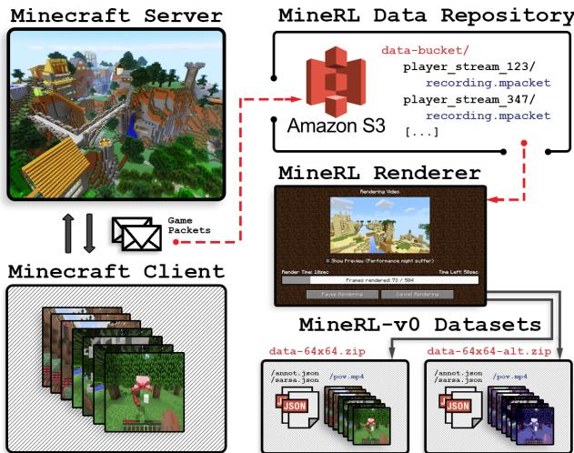
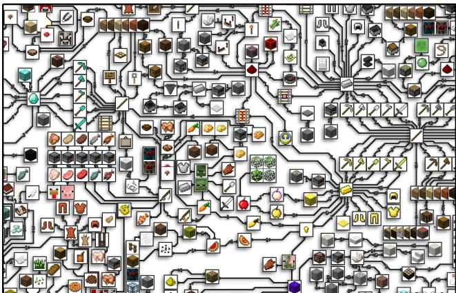
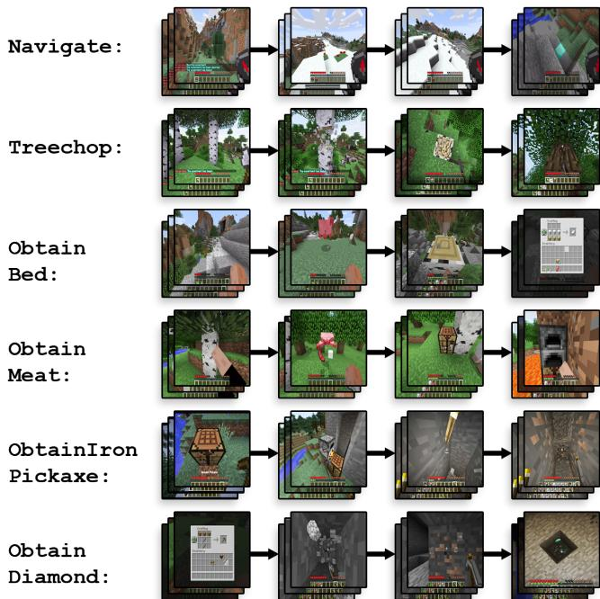
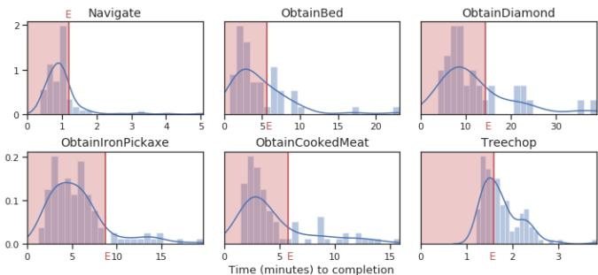
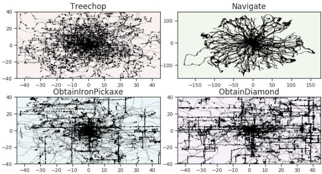
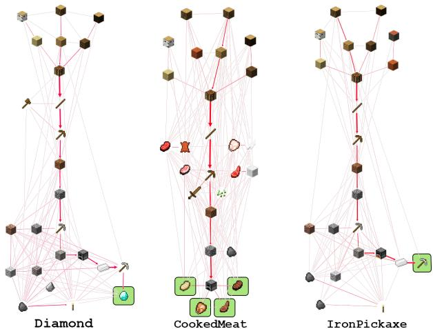
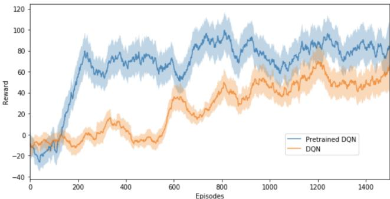

# MineRL：大规模Minecraft演示数据集

威廉·H·古斯\*†，布兰登·霍顿\*，尼科莱·托平，菲利普·王，凯登·科德尔，曼努埃拉·维洛索，鲁斯兰·萨拉库丁诺夫 卡内基梅隆大学，美国宾夕法尼亚州匹兹堡 15289 {wguss, bhoughton, ntopin, pkwang, ccodel, mmv, rsalakhu}@cs.cmu.edu

# 摘要

标准深度强化学习方法的样本低效性阻碍了它们在许多现实问题中的应用。利用人类示范的方法需要较少的样本，但相关研究相对较少。如计算机视觉和自然语言处理领域所示，大规模数据集有能力通过为新方法提供实验和基准测试平台来促进研究。然而，现有与强化学习模拟器兼容的数据集在规模、结构和质量上都不够充分，无法支持基于人类示例的方法的进一步发展和评估。因此，我们引入了一个全面的大规模人类示范数据集：MineRL。该数据集包含超过6000万个自动标注的状态-动作对，涵盖Minecraft中的各种相关任务，这是一个动态的、三维的、开放世界环境。我们提出了一种新颖的数据收集方案，允许持续引入新任务并收集适合多种方法的完整状态信息。我们展示了MineRL数据集的层次性、多样性和规模。此外，我们展示了Minecraft领域的挑战，以及MineRL在开发解决其中关键研究挑战的技术方面的潜力。

# 1 引言

随着深度强化学习（DRL）方法应用于越来越困难的问题，训练所需的样本数量也在增加。例如，Atari 2600 游戏 [Bellemare et al., 2013] 被用于评估 DQN [Mnih et al., 2015]、A3C [Mnih et al., 2016] 和 Rainbow DQN，这些方法需要从 44 万到超过 200 万帧（约 200 到超过 900 小时）才能达到人类水平的表现 [Hessel et al., 2018]。在更复杂的领域中：OpenAI Five 利用超过 11000 年的 Dota 2 游戏数据 [OpenAI, 2018]，AlphaGoZero 在围棋中使用了 490 万局的自我对弈 [Silver et al., 2017]，而 AlphaStar 则使用了 200 年的星际争霸 II 游戏数据 [DeepMind, 2018]。

  

Figure 1: A diagram of the MineRL data collection platform. Our system renders demonstrations from packet-level data, so the game state and rendering parameters can be changed.

这种固有的样本效率低下使得标准深度强化学习方法无法在不利用数据增强技术、领域对齐方法或精心设计的真实环境来满足所需试验数量的情况下应用于现实问题。最近，利用轨迹示例的技术，如模仿学习和贝叶斯强化学习方法，已成功应用于较旧的基准测试和样本来源于成本高昂的真实环境的问题。然而，这些技术仍然对于大量复杂的现实世界领域来说，样本效率不足。如[Kurin等，2017]所指出，机器学习的多个子领域因数据集的引入和高效的大规模数据收集方案而得以催化，例如Switchboard和ImageNet。尽管强化学习社区已创建了广泛的基准模拟器，但目前针对具有广泛结构约束和任务领域的大规模标注人类示范数据集仍然缺乏。

  

Figure 2: A subset of the Minecraft item hierarchy (totaling 371 unique items). Each node is a unique Minecraft item, block, or nonplayer character, and a directed edge between two nodes denotes that one is a prerequisite for another. Each item presents is own unique set of challenges, so coverage of the full hierarchy by one player takes several hundred hours.

因此，我们引入了 MineRL，这是一个大规模数据集，包含超过 6000 万个状态-动作对的人类示范，涵盖了 Minecraft 中一系列相关任务。为了捕捉 Minecraft 中游戏玩法和玩家互动的多样性，MineRL 包括六个任务，带来了多种研究挑战，包括开放世界多智能体互动、长期规划、视觉、控制和导航，以及显式和隐式的子任务层级。我们在现有的 Minecraft 模拟器中提供了这些任务的顺序决策环境实现。此外，我们还引入了一种新颖的平台和方法论，以便持续收集 Minecraft 中的人类示范。当用户在我们公开的游戏服务器上玩游戏时，我们记录数据包级信息，这使得每个玩家的视角和操作可以完美重建。该平台支持向 MineRL 数据集添加新任务，并进行自动注释，以补充当前和未来在 Minecraft 中应用的方法。示范视频和有关数据集的更多详细信息可以在 http://minerl.io 找到。

# 2 环境：Minecraft

# 2.1 描述

Minecraft 是一个引人注目的领域，用于基于强化学习和模仿学习的方法开发，因为它所呈现的独特挑战：Minecraft 是一款 3D 第一人称开放世界游戏，围绕资源收集和结构及物品创造展开。它可以在单人模式或多人模式下进行，在这种模式中，所有玩家都存在于同一个世界中并相互影响。游戏通常分为多个会话进行，每位玩家的总时长可达数十小时。值得注意的是，程序生成的世界由离散的方块组成，允许进行修改；在游戏过程中，玩家通过收集资源（例如从树上获取木材）和建造结构（如栖身之所和储存设施）改变周围环境。作为一款开放世界游戏，Minecraft 没有单一可定义的目标。相反，玩家制定自己的子目标，从而形成多种自然层级。尽管这些层级可以被利用，但它们的规模和复杂性为 Minecraft 带来了固有的难度。其中一个层级是物品收集：对于 Minecraft 中的大量目标，玩家必须制作特定的工具、材料和物品，而这些都需要收集一套严格的前置物品。这些依赖关系的汇总形成了一个大规模任务层级（见图 2）。除了获取物品外，隐含的层级还在游戏的其他方面出现。例如，玩家（1）建造结构以保护自己和储存的资源免受自然发生的敌人攻击，以及（2）探索世界以寻找自然资源，常常与非玩家角色进行战斗。这两种游戏元素都具有较长的时间跨度，并且由于情况依赖的需求（例如耕作某种生存所需的资源，进而促进探索以获得另一个资源，依此类推）而展现出灵活的层级。

# 2.2 现有兴趣

随着 Malmo [Johnson et al., 2016] 的发展，这一 Minecraft 模拟器引起了广泛的研究兴趣：[Shu et al., 2017]，[Tessler et al., 2017] 和 [Oh et al., 2016] 利用 Minecraft 的巨大层次性和表现力作为模拟器，在语言基础的可解释多任务选项提取、层次化终身学习和主动感知等方面取得了重大进展。然而，现有的研究大多使用 Minecraft 中的玩具任务，通常限制于 2D 运动、离散位置或人为限制的地图，这些与人类玩家通常面临的内在复杂性并不一致。这些限制反映了该领域的挑战以及当前方法无法应对完全具身的人类状态和行动空间，以及在最佳人类策略中所表现的复杂性。这种无能为力通过在 Minecraft 类域上开发的大量工作进一步得以证明，这些工作特别捕捉了 Minecraft 特征的受限子集 [Salge et al., 2014]，[Andreas et al., 2017]，[Liu et al., 2017]。弥合这些受限 Minecraft 环境与人类所遇到的完整领域之间的差距，是 MineRL 开发的重要推动力。为此，MineRL-v0 捕捉了 Minecraft 的核心特征，这些特征促使其被用作研究领域，包括其层次性和大量内在子任务的家族。与此同时，MineRL-v0 提供了进行当前和未来研究所必需的人类先验知识和丰富的自动生成的元数据，以便于对完整的 Minecraft 领域进行探索。

# 3 方法：MineRL 数据收集平台

分类和自然语言数据集在像Mechanical Turk这样的数据收集平台的存在下受益匪浅，但相较之下，游戏数据的收集通常需要为每个游戏实施一个新的平台和用户获取方案。为此，我们介绍了第一个端到端平台，用于收集Minecraft中的玩家轨迹，从而使得MineRL-v0数据集的构建成为可能。如图1所示，我们的平台由以下几个部分组成：(1) 一个公共游戏服务器和网站，在这里我们获得了记录Minecraft玩家自然游戏轨迹的许可；(2) 一个自定义的Minecraft客户端插件，该插件记录客户端与服务器之间的所有数据包级通信，以便我们可以在修改游戏状态和图形的情况下重新模拟和重新渲染人类演示；(3) 一个数据处理管道，使我们能够生成自动标注的任务演示数据集。数据获取。Minecraft玩家可以在标准Minecraft服务器列表中找到MineRL服务器。玩家首先使用我们的网页提供IRB同意，允许匿名记录他们的游戏过程。然后，他们下载一个插件，该插件将用户的客户端与服务器之间的游戏数据包记录并流式传输到MineRL数据库。当在我们的服务器上游戏时，用户选择一个独立的任务来完成，并根据所获得的奖励数量获得相应的游戏内货币。在生存游戏模式下（没有已知的奖励函数），玩家仅根据游戏持续时间获得奖励，以避免施加人工奖励函数。我们在Malmo中实现了这些独立任务。数据管道。我们的数据管道使得随着MineRL数据集发布的结构化信息的持续扩展成为可能；它允许我们重新模拟、修改并将记录的轨迹增强为几种算法可消费的格式。该管道作为核心Minecraft游戏代码的扩展，同时将每个记录的数据包从MineRL数据库同步重新发送到使用我们自定义API的Minecraft客户端，以实现自动标注和游戏状态修改。该API使我们能够根据从现有Minecraft模拟器访问的游戏状态的任何方面添加注释。

可扩展性。我们的目标是利用我们的平台提供一套全面的、多任务的数据集（超越 MineRL-v0），这些数据集与强化学习环境相配对，涵盖自然语言、具身推理、分层规划和多智能体合作。服务器的模块化设计使我们能够为越来越多的独立任务获取数据。此外，游戏内经济和服务器社区促使用户群体保持持续参与，使我们能够以不断增长的速度收集数据，而无需承担额外成本。数据管道的模块化、仿真器兼容性和可配置性也允许创建新的数据集，以补充利用人类示范的新技术。例如，通过在不同约束下反复重新渲染数据，可以进行大规模的泛化研究：改变光照、摄像机位置（具身与非具身）和其他视频渲染条件；在观察、奖励和行动中引入人工噪声；以及游戏层级的重组（交换游戏物品的功能和语义）。

# 4 结果：MineRL-v0

在本节中，我们将介绍并分析 MineRL-v0 数据集。首先，我们将提供有关数据集的详细信息，包括其大小、格式和包装。然后，我们将通过详细列出所包含的任务类别，指出该初始版本的广泛适用性，接着分析数据质量、覆盖范围和层次性。为了框定 MineRL-v0 数据集的实用性，在第 5 节中，我们将展示相对于现成方法，我们任务的难度，以及通过使用 MineRL-v0 的基本模仿学习技术所取得的性能提升。

  

Figure 3: Images of various stages of the six stand-alone tasks (Survial gameplay not shown).

# 4.1 数据集详细信息

规模。MineRL-v0 数据集包含超过500小时的录制人类示范数据，涵盖数据收集平台上的六种不同任务。发布的数据由四个不同版本的 数据集组成，分别以不同的分辨率（64×64和192×256）和纹理（默认Minecraft和简化版）进行渲染。每个版本的状态-动作对总量均超过6000万个，低分辨率数据集的大小为130 GB，中分辨率数据集的大小为734 GB。形式。每个轨迹是一组连续的状态-动作对，每隔Minecraft游戏时钟（每秒20个游戏时钟）进行采样。每个状态由玩家视角的RGB视频帧和该时刻游戏状态的全面特征集合构成：玩家库存、物品收集事件、目标距离、玩家属性（生命值、等级、成就）以及当前打开的GUI的详细信息。在每个时刻记录的动作包括：客户端上所有的键盘按键、视角的俯仰和偏航变化（由鼠标移动引起）、所有玩家GUI的点击和交互事件、发送的聊天信息，以及诸如物品合成等聚合动作。附加注释。人类轨迹伴随着大量自动生成的注释。对于所有独立任务，我们记录众多指标来指示示范的质量，例如时间戳奖励、无操作次数、死亡次数和总分。此外，轨迹元数据包括层次标记的时间戳标记；例如，何时建造房屋状结构，或完成砍伐树木等特定目标。

  

Figure 4: Normalized histograms of the lengths of human demonstration on various MineRL tasks. The red E denotes the upper threshold for expert play on each task.

打包。每个版本的数据集都被打包为一个Zip档案，包含每个任务家族的一个文件夹和每个演示的一个子文件夹。在每个轨迹文件夹中，状态和动作存储为一个H.264压缩的MP4视频，展示玩家的视角，最大比特率为18Mb/s，并且包含一个JSON文件，包含所有非视觉特征的游戏状态，以及对应于视频每一帧的玩家动作。此外，对于特定的任务配置（动作和状态空间的简化），我们提供由状态-动作-奖励元组以向量形式组成的Numpy .npz文件，促进数据集的可获取性。打包的数据及其相关文档可从http://minerl.io下载。

# 4.2 任务

最初的 MineRL-v0 数据集由六个独立任务组成，这些任务旨在代表Minecraft中反映广泛研究的挑战的困难方面：层级性、长期规划和复杂的定向。在所有任务中，智能体可以使用与人类玩家相同的动作和观察集，具体如第4.1节所述。所有任务都有时间限制，该限制是观察的一部分。以下是每个任务的详细信息。 导航。在导航任务中，智能体必须在程序生成的、非凸地形上移动到一个随机目标位置，该地形具有可变的材料类型和几何形状。这是Minecraft中许多任务的一个子任务。除了标准观察外，智能体还可以访问一个“指南针”观察，该观察指向距离起始位置64个方块（米）的固定地点。目标与此位置之间有一个小的随机水平偏移，并且可能略低于地面水平，因此智能体必须通过基于视觉特征的搜索找到最终目标。提供的奖励函数有两个变体：稀疏型（到达目标时奖励$^ { + 1 }$，此时剧集终止），和密集型（奖励与向目标移动的距离成正比）。 砍树。砍树任务模拟获取木材以生产进一步的物品。木材是Minecraft中的关键资源，因为它是所有工具的前提（如图2和图6中的木棍所示）。智能体在一个森林生物群落中开始（靠近许多树木），并持有一把铁斧以砍伐树木。每获取一个单位木材，智能体会获得$+ 1$的奖励，且当智能体获取到64个单位后，剧集终止。

  

Figure 5: Plots of the XY positions of players in Treechop, Navigate, ObtainIronPickaxe, and ObtainDiamond overlaid so each player's individual, random initial location is $( 0 , 0 )$ .

获取物品。我们包含了四个相关任务，要求智能体在物品层次结构中获取更高层次的物品：获取铁镐、获取钻石、获取熟肉和获取床。智能体总是从一个随机位置开始，没有携带任何物品；这与人类玩家在Minecraft中的起始条件相符。不同的任务变体对应于不同的、经常使用的物品：铁镐、钻石、熟肉（每种动物来源四个变体），以及床（每种染料颜色三个变体）。铁镐是获取关键材料所需的工具。钻石是Minecraft高层次玩法的核心，大部分游戏过程围绕其发现展开。熟肉用于恢复耐力，而床则是睡觉所需的。总的来说，这些物品代表了玩家为了生存和进入游戏更远区域所需获取的物品。智能体在获取所需物品时获得$+1$奖励，此时回合结束。生存模式。除了具体设计任务的数据外，我们还提供生存数据，这是大多数玩家使用的标准开放式游戏模式。玩家从随机位置开始，没有任何物品，他们制定自己的高层次目标，并获取物品以完成这些目标。来自此任务的数据可用于学习人类在开放玩法中遵循的复杂奖励功能及其对应的策略。这些数据还可以用于训练尝试完成其他结构化任务的智能体，或进一步提取策略草图，如[Andreas等人，2017]所述。

# 4.3 分析

# 人类表现

数据集中大多数人类演示均清晰地属于专家水平的游戏。图4显示了完成每个独立任务所需时间在不同玩家之间的分布。每个直方图中的红色区域表示与专家水平游戏相对应的时间范围，该范围是根据至少拥有五年Minecraft经验的玩家完成任务的平均时间计算得出的。大量的专家样本和丰富的演示性能标注使得许多标准模仿学习技术的应用成为可能，这些技术假设基础策略是最优的。此外，初学者和中级水平的轨迹为进一步开发利用不完美演示的技术提供了机会。

# 覆盖率

MineRL-v0 对 Minecraft 提供了近乎完整的覆盖。在生存游戏模式下，371 个获取不同物品的子任务中，大多数任务已被玩家示范了数百到数万次。此外，某些子任务需要花费数小时才能完成，涉及长时间的挖矿、建造、探索和与敌人作战。由于存在大量的任务级注释，该数据集可以用于大规模的选项提取和技能获取，从而扩展 [Shu et al., 2017] 和 [Andreas et al., 2017] 的工作。此外，Obt a in $<$ Item> 任务的丰富标签层次可以用于构建提取选项的可解释性和质量指标。除了物品覆盖率外，MineRL 数据收集平台结构设计旨在促进游戏条件的广泛表示。目前的数据集由来自 1,002 个独特玩家会话的多样化示范组成。在生存游戏模式下，记录的轨迹共覆盖 24,393,057 平方米的游戏内容，其中一平方米对应一个 Minecraft 块。在所有其他任务中，每个示范发生在随机初始化的游戏世界中，因此我们为每个任务收集了大量独特的、不相干的轨迹：在图 5 中，我们展示了玩家在完成每个任务过程中自上而下的位置，其中起始状态为 $(0, 0)$。每个玩家不仅在不同的游戏世界中行动，而且在每个任务中也探索了大范围区域。

# 层次性

如图2所示的项目图所示，Minecraft 具有深层的层次结构，而 MineRL 数据收集平台旨在显式和隐式地捕捉这些层次结构。作为一个主要示例，$\mathrm{O b-}$tain $<$ Item> 独立任务隔离了在物品层次结构中难度较大但重叠的核心路径。由于 MineRL-v0 中提供的子任务标签，我们可以检查和量化这些任务重叠的程度。通过物品优先频率图，我们可以直接衡量层次结构的程度，这些图中节点对应于在任务中获得的物品，定向边对应于玩家在目标节点物品之前立即获得源节点物品的次数。

这些图表提供了人类元策略的统计视图，以及其子策略在不同任务之间转移的程度。图6展示了从MineRL轨迹构建的优先频率图，涉及ObtainDiamond、ObtainCookedMeat和ObtainIronPickaxe任务。检查结果显示，获取钻石的策略包含获取木材、火把和铁矿的子策略。这些子策略在ObtainIronPickaxe任务中也是必需的，但在ObtainCookedMeat任务中仅部分使用。这些重叠的子策略的影响可以在图5中看到：在具有重叠层次的任务中（如ObtainIronPickaxe和ObtainDiamond），玩家的移动方式相似，而在重叠较少的任务中则表现不同。此外，这些图表描绘了一个任务内人类元策略的分布图：尽管存在必要的图遍历模式（例如木石镐），但根据情况，玩家在早期物品不可用时，会通过较长路径获取通常在物品优先图中后期找到的物品，从而调整他们的策略。这反过来使得在开发分布式层次强化学习方法时能够使用MineRL-v0。

  

Figure 6: Item precedence frequency graphs for ObtainDiamond (left), ObtainCookedMeat (middle), and ObtainIronPickaxe (right). The thickness of each line indicates the number of times a player collected item $A$ then subsequently item $B$ .

# 5 实验

# 5.1 实验配置

为了展示Minecraft的难度，我们在最简单的任务（Treechop和Navigate (Sparse)）以及一个具有额外奖励的简化任务（Navigate (Dense)）上评估了三种强化学习方法和一种行为克隆方法的表现。具体而言，我们评估了（1）对抗双重深度Q网络（Dueling Double Deep Q-networks，DQN）[Mnih等，2015]，这是一种基于离线策略的Q学习方法；（2）预训练DQN（PreDQN），这是在MineRL-v0的专家演示的基础上进行额外预训练并初始化重放缓冲区的DQN；（3）优势演员评论家（Advantage Actor Critic，A2C）[Mnih等，2016]，这是一种基于在线策略的策略梯度方法；以及（4）行为克隆（Behavioral Cloning，BC），这是一种利用标准分类技术从演示中学习策略的方法。为了确保实验的可重复性和对这些方法的准确评估，我们基于OpenAI的基准实现[Dhariwal等，2017]进行构建。观测数据被转换为灰度并调整为$64 \times 64$。由于Minecraft中存在数千种动作组合以及基准算法的局限性，我们将动作空间简化为10个离散动作。然而，行为克隆没有这样的限制，并且在不简化动作空间的情况下表现相似。为了使用预训练DQN和行为克隆的人工演示，我们用我们的10个动作原语近似每个动作。我们对每种强化学习方法进行了1500个回合的训练（大约1200万帧）。为了训练行为克隆，我们使用来自各自任务系列的专家轨迹，并训练到策略性能达到最大值为止。

Table 1: Results in Treechop, Navigate (S)parse, and Navigate (D)ense, over the best 100 contiguous episodes. $\pm$ denotes standard deviation. Note: humans achieve the maximum score for all tasks shown.   

<table><tr><td></td><td>Treechop</td><td>Navigate (S)</td><td>Navigate(D)</td></tr><tr><td>DQN</td><td>3.73 ± 0.61</td><td>0.00 ± 0.00</td><td>55.59 ± 11.38</td></tr><tr><td>A2C</td><td>2.61 ± 0.50</td><td>0.00 ± 0.00</td><td>-0.97 ± 3.23</td></tr><tr><td>BC</td><td>43.9 ± 31.46</td><td>4.23 ± 4.15</td><td>5.57 ± 6.00</td></tr><tr><td>PreDQN</td><td>4.16 ± 0.82</td><td>6.00 ± 4.65</td><td>94.96 ± 13.42</td></tr><tr><td>Human</td><td>64.00 ± 0.00</td><td>100.00 ± 0.00</td><td>164.00 ± 0.00</td></tr><tr><td>Random</td><td>3.81 ± 0.57</td><td>1.00 ± 1.95</td><td>-4.37 ± 5.10</td></tr></table>

# 5.2 评估与讨论

我们通过在训练过程中以100个回合窗口获得的最高平均奖励来比较算法。我们还报告了随机策略和第50百分位数的人类表现的性能。结果总结在表1中。在所有任务中，学习到的智能体的表现明显低于人类表现。Treechop表现出最大的差异：人类的得分为64，而强化学习智能体的得分不到4。这表明我们的任务相当困难，特别是考虑到$\mathrm{O b -} $tain $<$ Item>任务在Treechop任务基础上发展而来，要求完成多个附加子目标$\left( \geq 3 \right)$。我们假设，困难的一个主要来源是环境固有的长时间跨度信用分配问题。例如，智能体在水中导航时很难学习，因为在智能体因溺水而死亡之前需要经历许多过渡。鉴于这些困难，我们的数据在提高性能和样本效率方面非常有用：在所有任务中，利用人类数据的方法表现更好。如图7所示，专家演示能够在每个回合中获得更高的奖励，并且使用更少的样本达到高性能。专家演示在随机探索不太可能获得任何奖励的环境中（如Navigate (Sparse)）尤其有帮助。

# 6 相关工作

一些领域以前通过模仿学习和人类示范数据集得到了解决。这些领域包括使用Atari Grand Challenge数据集的Atari域[Kurin et al., 2017]以及使用按需数据集的Super Tux Kart域[Ross et al., 2011]。与Minecraft不同，这些都是简单领域：它们具有浅层依赖层次，并且不是开放世界。由于动作空间和状态空间较小，这些领域通过模仿学习使用相对较少的样本得到了解决（在[Kurin et al., 2017]中的五个游戏中使用970万个帧，以及在[Ross et al., 2011]中使用2万个帧）。相比之下，我们提供6000万个自动标注的状态-动作对，但未能达到人类表现。

  

Figure 7: Performance graphs over time with DQN and pretrained DQN on Navigate (Dense).

现有的挑战性未解决领域的数据集主要用于现实世界任务，其中模拟器的缺乏限制了开发的速度。例如，KITTI数据集 [Geiger et al., 2013] 是一个包含3小时现实世界交通3D信息的数据集。类似地，Dex-Net [Mahler et al., 2019] 是一个包含五百万次抓取及其对应3D点云的机器人操作数据集。与这些数据集不同，MineRL可以直接与模拟器Malmo兼容，从而允许在数据收集的相同领域进行训练，并与不是基于模仿学习的方法进行比较。此外，MineRL相对于领域难度的规模比KITTI和Dex-Net数据集更大。唯一一个具有现有模拟器和大规模数据集的复杂未解决领域是星际争霸 II。然而，星际争霸 II 不是开放世界的，因此无法用于评估设计用于3D环境中具身任务的方法。目前最大的数据显示集是StarData [Lin et al., 2017]。与MineRL不同，StarData包含未标记的标准游戏提取轨迹。相较之下，MineRL包括越来越多的相关任务，代表整体Minecraft任务层次结构的不同组成部分。此外，MineRL还包含丰富的自动生成注释，包括子任务完成情况、玩家技能水平以及扩展这些标签的API。综合来看，这些特点使得利用和评估利用层次结构的技术成为可能。

# 7 结论与未来工作

MineRL-v0 目前包含 6000 万个状态-动作对，这些对是在开放世界的模拟器配对环境中通过程序化标注的人类演示生成的。目前的数据涵盖六个任务，但没有一个任务可以使用标准深度强化学习方法完全解决。我们的平台允许不断收集现有和新任务的演示。因此，我们在一个社区可访问的网站 http://minerl.io 上托管 MineRL-v0，并收集有关添加新注释和任务的反馈。随着我们扩展 MineRL，我们期望它对包括逆强化学习、层次学习和终身学习在内的多种方法越来越有用。我们希望 MineRL 能成为顺序决策研究的核心资源，推动 AI 的多个分支朝着开发能够解决更广泛现实世界环境的方法这一共同目标迈进。

# 致谢

我们要感谢 Greg Yang、Devendra Chaplot、Lucy Cheung、Stephanie Milani、Miranda Chen、Yiwen Yuan、Cheri Guss、Steve Shalongo、Jim Guss、Sauce 和 Bridget Hickey 的深入对话和支持。

# References

[Andreas et al., 2017] Jacob Andreas, Dan Klein, and Sergey Levine. Modular multitask reinforcement learning with policy sketches. In Proceedings of the 34th ICML-Volume 70, pages 166175. JMLR. org, 2017.   
[Andrychowicz et al., 2018] Marcin Andrychowicz, Bowen Baker, Maciek Chociej, Rafal Jozefowicz, Bob McGrew, Jakub Pachocki, Arthur Petron, Matthias Plappert, Glenn Powell, Alex Ray, et al. Learning dexterous in-hand manipulation. arXiv preprint arXiv:1808.00177, 2018.   
[Bellemare et al., 2013] Marc G Bellemare, Yavar Naddaf, Joel Veness, and Michael Bowling. The arcade learning environment: An evaluation platform for general agents. JAIR, 47:253279, 2013.   
[DeepMind, 2018] DeepMind. Alphastar: Mastering the real-time strategy game starcraft ii, 2018.   
[Deng et al., 2009] Jia Deng, Wei Dong, Richard Socher, Li-Jia Li, Kai Li, and Li Fei-Fei. Imagenet: A large-scale hierarchical image database. 2009.   
[Dhariwal e al., 017] rafulla Dharial, Christopher Hese, Oleg Klimov, Alex Nichol, Matthias Plappert, Alec Radford, John Schulman, Szymon Sidor, Yuhuai Wu, and Peter Zhokhov. Openai baselines, 2017.   
[Geiger et al., 2013] Andreas Geiger, Philip Lenz, Christoph Stiller, and Raquel Urtasun. Vision meets robotics: The kitti dataset. IJRR, 32(11):12311237, 2013.   
[Godfrey et al., 1992] John J Godfrey, Edward C Holliman, and Jane McDaniel. Switchboard: Telephone speech corpus for research and development. In Acoustics, Speech, and Signal Processing, 1992. ICASSP-92., 1992 IEEE International Conference on, volume 1, pages 517520. IEEE, 1992.   
[Hessel et al., 2018] Matteo Hessel, Joseph Modayil, Hado Van Hasselt, Tom Schaul, Georg Ostrovski, Will Dabney, Dan Horgan, Bilal Piot, Mohammad Azar, and David Silver. Rainbow: Combining improvements in deep reinforcement learning. In Thirty-Second AAAI Conference on Artificial Intelligence, 2018.   
[Johnson et al., 2016] Matthew Johnson, Katja Hofmann, Tim Hutton, and David Bignell. The malmo platform for artificial intelligence experimentation. In IJCAI, pages 42464247, 2016.   
[Kurin et al., 2017] Vitaly Kurin, Sebastian Nowozin, Katja Hofmann, Lucas Beyer, and Bastian Leibe. The atari grand challenge dataset. arXiv preprint arXiv:1705.10998, 2017.   
[Levine et al., 2018] Sergey Levine, Peter Pastor, Alex Krizhevsky, Julian Ibarz, and Deirdre Quillen. Learning hand-eye coordination for robotic grasping with deep learning and large-scale data collection. IJRR, 37(4-5):421436, 2018.   
[Lin et al., 2017] Zeming Lin, Jonas Gehring, Vasil Khalidov, and Gabriel Synnaeve. Stardata: A starcraft ai research dataset. In Thirteenth AIDE Conference, 2017.   
[Liu et al., 2017] Jerry Liu, Fisher Yu, and Thomas Funkhouser. Interactive 3d modeling with a generative adversarial network. In 2017 IC3DV, pages 126134. IEEE, 2017.   
[Mahler et al., 2019] Jeffrey Mahler, Matthew Matl, Vishal Satish, Michael Danielczuk, Bill DeRose, Stephen McKinley, and Ken Goldberg. Learning ambidextrous robot grasping policies. Science Robotics, 4(26):eaau4984, 2019.   
[Mnih et al., 2015] Volodymyr Mnih, Koray Kavukcuoglu, David Silver, Andrei A Rusu, Joel Veness, Marc G Bellemare, Alex Graves, Martin Riedmiller, Andreas K Fidjeland, Georg Ostrovski, et al. Human-level control through deep reinforcement learning. Nature, 518(7540):529, 2015.   
[Mnih et al., 2016] Volodymyr Mnih, Adria Puigdomenech Badia, Mehdi Mirza, Alex Graves, Timothy Lillicrap, Tim Harley, David Silver, and Koray Kavukcuoglu. Asynchronous methods for deep reinforcement learning. In ICML, pages 19281937, 2016.   
[Oh et al., 2016] Junhyuk Oh, Valliappa Chockalingam, Satinder Singh, and Honglak Lee. Control of memory, active perception, and action in minecraft. arXiv preprint arXiv:1605.09128, 2016.   
[OpenAI, 2018] OpenAI. Openai five, Sep 2018.   
[Ross et al., 2011] Stéphane Ross, Geoffrey Gordon, and Drew Bagnell. A reduction of imitation learning and structured prediction to no-regret online learning. In Proceedings of the 14th ICIAS, pages 627635, 2011.   
[Salge et al., 2014] Christoph Salge, Cornelius Glackin, and Daniel Polani. Changing the environment based on empowerment as intrinsic motivation. Entropy, 16(5):27892819, 2014.   
[Shu et al., 2017] Tianmin Shu, Caiming Xiong, and Richard Socher. Hierarchical and interpretable skill acquisition in multitask reinforcement learning. arXiv preprint arXiv:1712.07294, 2017.   
[Silver et al., 2017] David Silver, Julian Schrittwieser, Karen Simonyan, Ioannis Antonoglou, Aja Huang, Arthur Guez, Thomas Hubert, Lucas Baker, Matthew Lai, Adrian Bolton, et al. Mastering the game of go without human knowledge. Nature, 550(7676):354, 2017.   
[Tessler et al., 2017] Chen Tessler, Shahar Givony, Tom Zahavy, Daniel J Mankowitz, and Shie Mannor. A deep hierarchical approach to lifelong learning in minecraft. In Thirty-First AAAI, 2017.   
[Tobin et al., 2017] Josh Tobin, Rachel Fong, Alex Ray, Jonas Schneider, Wojciech Zaremba, and Pieter Abbeel. Domain randomization for transferring deep neural networks from simulation to the real world. In Intelligent Robots and Systems (IROS), 2017 IEEE/RSJ International Conference on, pages $2 3 -$ 30. IEEE, 2017.   
[Wang et al., 2018] Ting-Chun Wang, Ming-Yu Liu, Jun-Yan Zhu, Andrew Tao, Jan Kautz, and Bryan Catanzaro. High-resolution image synthesis and semantic manipulation with conditional gans. In Proceedings of the IEEE Conference on Computer Vision and Pattern Recognition, pages 87988807, 2018.