# 通过训练智能体探索学习生成交互环境

# 纳瑟尔·卡泽米1*

Nedko Savov1\*† Danda Pani Paudel1 1 INSAIT，索非亚大学“圣克里门特·奥赫里德斯基” {firstname.lastname}@insait.ai

# 摘要

世界模型在解释和模拟复杂环境的规则和行为方面的重要性日益增加。Genie是一个最近提出的模型，擅长从视觉多样的环境中学习，但依赖于成本高昂的人类收集数据。我们观察到，他们使用随机智能体的替代方法对环境的探索过于有限。我们建议通过采用强化学习驱动的智能体进行数据生成来改进该模型。这种方法生成多样化的数据集，增强了模型在各种场景和环境中进行适应和表现良好的能力。在本文中，我们首先构建、评估并发布了模型GenieRedux——一个对Genie的完整复现。此外，我们介绍了GenieRedux-G，一个变体，利用智能体的现成可用动作在验证过程中消除动作预测的不确定性。我们的评估，包括对Coinrun案例研究的复现，表明GenieRedux-G在视觉逼真度和可控性方面优于使用训练智能体探索的结果。所提出的方法可重现、可扩展，并可适应新类型的环境。我们的代码库可在https://github.com/insaitinstitute/GenieRedux获取。

# 1 引言

最近，世界模型作为理解复杂环境中规则、意义和行动后果的工具应运而生。世界模型从协助强化学习智能体的粗略想象模型发展而来，如 Chiappa 等（2017），Ha 和 Schmidhuber（2018），Hafner 等（2019），Hafner 等（2023），Sekar 等（2020），到基于动作的独立现实视频生成模型，如 Micheli 等（2022），Chen 等（2022），Yang 等（2024），Robine 等（2023）。例如，Menapace 等（2021），Yang 等（2023），Bruce 等（2024），Hu 等（2023）等工作模拟现实世界环境。值得注意的是，Bruce 等（2024）提出了 Genie - 一种能够从视觉上不同但行为相同的多种环境中学习的模型，特别是平台游戏。这使得模型能够将学习到的逐帧运动控制应用于新的未见图像。此外，Genie 还结合了一个潜在动作模型，预测动作并使模型能够在无动作数据上进行训练。我们认识到，使用多种环境是朝着可泛化世界模型迈出的重要一步。然而，Genie 的方法是使用人类在环境中探索的演示 - 他们通过收集和清洗平台游戏的在线通关视频获得了大规模数据集。这样的数据集构建困难，并且切换到另一种环境类型需要另一次昂贵的人为动作数据收集或录制。作为人类演示的替代方案，作者仅提供了一个小规模案例研究，其中使用随机智能体从虚拟环境中获取数据。然而，随机智能体无法在环境中取得进展和进行深入探索。这导致模型在看到的环境起始场景上过拟合。我们建议不使用随机智能体，而是使用在环境中经过强化学习训练的智能体来生成更多样化的数据。在这些多样化的数据上进行训练克服了上述过拟合问题。需要注意的是，使用训练过的智能体收集数据的成本显著低于通过人类演示的方式。

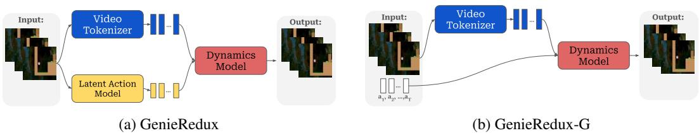  

Figure 1: Architecture of our models. GenieRedux shares the architecture of Genie; GenieRedux-G takes agent actions as input instead of predicting them.

在本研究中，我们首先重现了Genie模型（Bruce et al.，2024），因为Genie的官方代码库不可用。我们发布的模型命名为GenieRedux。由于训练后的智能体提供了智能体动作，我们使用了一种模型变体，命名为GenieRedux-G，其中下一个帧的预测是基于智能体动作而不是基于潜在动作模型的预测。这使我们能够评估所提议的环境探索，同时消除任何动作预测噪声。架构如图1所示。我们展示了我们的模型在视觉保真度和可控性方面表现良好。我们实现了Coinrun案例研究（Cobbe et al.，2019），这是由Bruce et al.（2024）提出的，使用随机智能体和训练过的智能体进行对比，并显示后者能够在环境中更好地应对多种情况。我们的设置易于重现，并且在扩展到不同类型的训练环境时具有良好扩展性。我们的贡献如下： • 实现和发布GenieRedux和GenieRedux-G - 基于Bruce et al.（2024）的Pytorch开源模型。 • 通过训练智能体探索生成多样化数据，并利用这些数据训练世界模型，提高视觉保真度和可控性。将世界模型的条件设置为这些数据及其可用的智能体动作（GenieRedux-G），而不是模型内的预测，从而提升性能。 • 对所有相关组件进行视频保真度和可控性研究。

# 2 方法论

GenieRedux由三个组件组成，如图1所示。视频标记器将输入帧序列编码为时空词元。潜在动作模型将输入帧序列编码为时空词元。动态模型基于帧词元和动作预测下一帧。我们严格遵循Genie的规范来实现这些组件。ST-ViViT。所有组件都使用Spatiotemporal Transformer（STTN）架构（Xu et al. 2020），采用ST-Block来捕捉空间和时间模式，使用单独的注意力层以提高效率。因果时间注意力允许同时进行多次未来预测。ST-ViViT是一个编码器-解码器模型，具有VQ-VAE目标（Van Den Oord et al. 2017）以生成离散词元，灵感来源于C-ViViT（Villegas et al. 2022），但具有更高效的ST-Block。编码器交替使用空间和时间注意力，解码器则对应地进行镜像。使用位置编码生成器（PEG）（Chu et al. 2021）进行空间和时间注意力，而时间注意力则使用带线性偏置的注意力（ALiBi）（Press et al. 2021）。GenieRedux。视频标记器是一个ST-ViViT自编码器，而潜在动作模型（LAM）是一个ST-ViViT编码器-解码器，通过为最后两个帧之间的动作生成一个词元来预测下一帧（编码器处有一个线性层）。我们提供两种动态模型变体：GenieRedux，遵循Genie，通过将LAM编码的动作与标记帧相加；还有GenieRedux-G，使用帧词元与独热编码的智能体动作的连接，这些动作易于获取，并消除了对训练智能体探索评估的LAM预测不确定性评估。架构如图1所示。

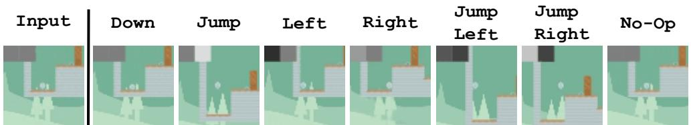  

Figure 2: GenieRedux-G-TA Control Demonstration. GenieRedux-G-TA is able to consistently perform all environment actions. Here we demonstrate all of them as generated by the model.

动态模型由一个 ST-ViViT 编码器组成，后接一个 MaskGIT 架构（Chang et al. 2022），该架构在训练过程中根据针对 Genie 描述的计划，从标记器的代码本中预测随机掩蔽输入词元的索引。实验设置。我们使用 Genie 的案例研究设置，在 Coinrun 环境中进行随机探索（Cobbe et al. 2019），包含 7 个动作。我们在随机困难关卡中获得了一个包含 $8 8 \mathrm { k }$ 集的数据显示集（$10 \%$ 用于验证），每个关卡最多 500 帧，并有一个单独的测试集，包含 1000 集，我们称之为基本测试集。随机智能体在关卡开始时的进展有限。此外，我们根据 Cobbe et al. (2019) 在简单的 Coinrun 关卡上训练了一个使用近端策略优化的 CNN 智能体。使用训练好的智能体，我们收集了 $1 0 \mathrm { k }$ 集（$10 \%$ 用于验证）和一个独立的 1000 集测试集，命名为多样测试集。这些集的内容多样性远高于随机探索所得。训练。我们所有的模型在 $6 4 \mathrm { x } 6 4$ 的分辨率下，序列大小为 16，补丁大小为 4 进行训练。在评估中，我们使用序列大小为 10。我们首先训练标记器。然后，我们同时训练 LAM 和动态模型，使用框架词元和预测动作针对 GenieRedux，或者使用真实智能体动作（不包括 LAM）针对 GenieRedux-G。随机探索数据集用于获取 GenieRedux-Base 和 GenieRedux-G-Base 基线模型。然后我们在训练好的智能体数据集上微调标记器和 LAM，并微调动态模型以创建 GenieRedux-TA 和 GenieRedux-G-TA 模型。更多细节见附录 A。

# 3 实验

基线评估。在这个实验中，我们按照 Bruce 等人（2024）的建议，使用随机智能体重复原始案例研究，并在基本测试集上评估我们对 GenieRedux-Base 和 GenieRedux-G-Base 模型及其组件的实现。我们在表1中展示了视觉保真度结果。我们注意到，在 Genie 的原始案例研究中并没有报告评分。然而，我们将我们的分词器的 38.25 PSNR 与他们附录 C.2 中报告的 35.7 PSNR 进行了比较。我们的 LAM 能够学习环境动作，导致 GenieReduxBase 的视觉保真度，验证了我们实现的正确性。但是，GenieRedux-G-Base 展现出更优的视觉保真度、可控性及随时间推演动作的能力（见附录 B），因为它避免了 LAM 的不确定性。请注意，动态评估 consiste 于在给定单张图片和要执行的动作的情况下，预测未来 10 张图像。单步预测使用 25 次 MaskGIT 迭代。训练智能体探索模型评估。在这个实验中，我们评估使用训练智能体探索训练的模型，而不是随机智能体 - GenieRedux-TA 和 GenieRedux-G-TA。评估集为基本测试集，以匹配经典案例研究。视觉保真度结果见表2。分词器-TA 与基础模型相比显著提升了视觉保真度。LAM-TA 的视觉保真度降低，但不会影响 GenieRedux-TA，因为其性能与基础模型持平，这表明预测的动作质量良好（见附录 C）。与此同时，未受 LAM 不确定性影响的 GenieRedux-G-TA，展示了显著更好的视觉质量，并能够持续执行所有环境动作和推进动作，如图4所示（更多信息见附录 E）。所有动作在图2中展示。

Table 1: Visual Fidelity of baseline models.   

<table><tr><td rowspan="2">Model</td><td colspan="3">Basic Test Set</td></tr><tr><td>FID↓</td><td>PSNR↑</td><td>SSIM↑</td></tr><tr><td>Tokenizer-Base</td><td>18.14</td><td>38.25</td><td>0.96</td></tr><tr><td>LAM-Base</td><td>37.01</td><td>33.97</td><td>0.92</td></tr><tr><td>GenieRedux-Base</td><td>21.88</td><td>25.51</td><td>0.77</td></tr><tr><td>GenieRedux-G-Base</td><td>18.88</td><td>33.41</td><td>0.92</td></tr></table>

Table 2: Visual Fidelity of TA models.   

<table><tr><td rowspan="2">Model</td><td colspan="3">Basic Test Set</td></tr><tr><td>FID↓</td><td>PSNR↑</td><td>SSIM↑</td></tr><tr><td>Tokenizer-TA</td><td>12.10</td><td>39.53</td><td>0.97</td></tr><tr><td>LAM-TA</td><td>47.73</td><td>28.24</td><td>0.85</td></tr><tr><td>GenieRedux-TA</td><td>13.26</td><td>25.47</td><td>0.82</td></tr><tr><td>GenieRedux-G-TA</td><td>13.01</td><td>32.09</td><td>0.94</td></tr></table>

Table 3: Visual Fidelity Evaluation of GenieRedux, GenieRedux-G and their tokenizer, trained with random agent exploration (-Base), compared to training with trained agent exploration (-TA). Evaluation is done on Diverse Test Set.   

<table><tr><td rowspan="2">Model</td><td colspan="4">Diverse Test Set</td></tr><tr><td>FID↓</td><td>PSNR↑</td><td>SSIM↑</td><td>∆tPSNR↑</td></tr><tr><td>Tokenizer-Base</td><td>19.13</td><td>35.85</td><td>0.94</td><td></td></tr><tr><td>Tokenizer-TA</td><td>11.63</td><td>40.62</td><td>0.97</td><td></td></tr><tr><td>GenieRedux-Base</td><td>23.97</td><td>23.82</td><td>0.73</td><td>-</td></tr><tr><td>GenieRedux-G-Base</td><td>19.51</td><td>31.66</td><td>0.90</td><td>0.70</td></tr><tr><td>GenieRedux-TA</td><td>12.57</td><td>31.97</td><td>0.90</td><td>-</td></tr><tr><td>GenieRedux-G-TA</td><td>12.40</td><td>34.44</td><td>0.92</td><td>1.89</td></tr></table>

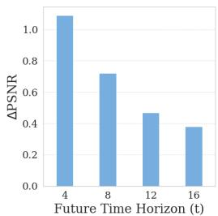  

Figure 3: GenieReduxG-TA Controllability Across Horizons.

训练与随机探索的比较。在这里，我们比较了所有模型在多样化测试集中的各种场景。表 3 显示，两个训练智能体的探索模型在视觉保真度方面均优于随机探索模型。此外，训练智能体的探索在可控性上也有显著提升，体现为 $\Delta _ { t } \mathrm { P S N R }$ 指标，该指标在 Bruce 等（2024）中定义。最佳模型 GenieRedux-G-TA 的表现也在图 2 中得到了验证。与 Jafar 的比较。我们与 Jafar Willi 等（2024）的 Genie 实现进行了比较（在 JAX 中）。我们按照说明获得并训练了他们的模型。我们使用 Jafar 的模型参数训练 GenieReduxBase，并像他们一样在训练中将 LAM 与 Dynamics 分开。后者显著恶化了 GenieRedux-Base 的动作表示。尽管如此，GenieReduxBase 在视觉保真度指标上显示出显著的改善，达到了 17.91 PSNR（46.12 FID），而 Jafar 的为 12.66 PSNR（154.12 FID）。GenieRedux-Base 没有表现出 Jafar 的伪影或报告中的“挖洞”行为（更多信息见附录 D）。此外，我们观察到 Jafar 缺乏因果性，这一点令人担忧。预测视域评估。我们在图 3 中评估最佳模型的可控性（在 $5 0 \mathrm { k }$ 次迭代下）随着预测视域的变化。正如预期，预测随着时间的推移变得更加具有挑战性。由于运动信息不足，第一次预测也很困难——我们在 $t = 1$ 时得到了 $0 . 4 \ \Delta _ { t } \mathrm { P S N R }$。为了解决这个问题，我们为模型提供了 4 帧和动作（预测 10），观察到我们的最佳模型（GenieRedux-G-TA）从表 3 的 34.79 PSNR（12.75 FID）提升至多样化测试集的 38.31 PSNR（12.29 FID）。

# 4 结论

在这项工作中，我们重新审视了 Bruce 等人（2024）的 Genie——尽管取得了良好的结果，我们注意到它依赖于高成本的人类数据和有限的随机智能体探索。我们通过证明基于强化学习的探索提供了一种可扩展且有效的替代方案，解决了这些局限性，从而提高了复杂环境中世界模型的泛化能力和效率。

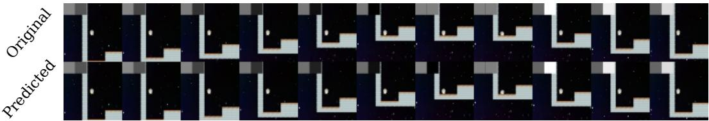  

Figure 4: GenieRedux-G-TA Qualitative Result. We give a single frame and actions from the test set and we generate 10 frames. In this example our model first successfully progresses the motion of falling. Then, it performs a jump. Ground truth frames are at the top; generated - at the bottom.

# 5 致谢

本研究部分得到了保加利亚教育和科学部的资助（支持INSAIT，这是保加利亚国家研究基础设施路线图的一部分）。

# References

Bruce, J., Dennis, M. D., Edwards, A., Parker-Holder, J., Shi, Y., Hughes, E., Lai, M., Mavalankar, A., Steigerwald, R., Apps, C., et al. (2024). Genie: Generative interactive environments. In Forty-first International Conference on Machine Learning.   
Chang, H., Zhang, H., Jiang, L., Liu, C., and Freeman, W. T. (2022). Maskgit: Masked generative image transformer. In Proceedings of the IEEE/CVF Conference on Computer Vision and Pattern Recognition, pages 1131511325.   
Chen, C., Wu, Y.-F., Yoon, J., and Ahn, S. (2022). Transdreamer: Reinforcement learning with transformer world models. arXiv preprint arXiv:2202.09481.   
Chiappa, S., Racaniere, S., Wierstra, D., and Mohamed, S. (2017). Recurrent environment simulators. arXiv preprint arXiv:1704.02254.   
Chu, X., Tian, Z., Zhang, B., Wang, X., and Shen, C. (2021). Conditional positional encodings for vision transformers. arXiv preprint arXiv:2102.10882.   
Cobbe, K., Klimov, O., Hesse, C., Kim, T., and Schulman, J. (2019). Quantifying generalization in reinforcement learning. In International conference on machine learning, pages 12821289. PMLR.   
Ha, D. and Schmidhuber, J. (2018). World models. arXiv preprint arXiv:1803.10122.   
Hafr, D., Lirap, T. Fischer, I. Villeas, R., Ha, D., Lee, H., an Davison, J. 019) Lea latet dynamics for planning from pixels. In International conference on machine learning, pages 25552565. PMLR.   
Hafner, D., Pasukonis, J., Ba, J., and Lillicrap, T. (2023). Mastering diverse domains through world models. arXiv preprint arXiv:2301.04104.   
Hu, A., Russell, L., Yeo, H., Murez, Z., Fedoseev, G., Kendall, A., Shotton, J., and Corrado, G. (2023). Gaia-1: A generative world model for autonomous driving. arXiv preprint arXiv:2309.17080.   
Menapace, W., Lathuiliere, S., Tulyakov, S., Siarohin, A., and Ricci, E. (2021). Playable video generation. In Proceedings of the IEEE/CVF Conference on Computer Vision and Pattern Recognition, pages 10061-10070.   
Micheli, V., Alonso, E., and Fleuret, F. (2022). Transformers are sample-efficient world models. arXiv preprint arXiv:2209.00588.   
Press, O., Smith, N. A., and Lewis, M. (2021). Train short, test long: Attention with linear biases enables input length extrapolation. arXiv preprint arXiv:2108.12409.   
Robine, J., Höftmann, M., Uelwer, T., and Harmeling, S. (2023). Transformer-based world models are happy with 100k interactions. arXiv preprint arXiv:2303.07109.   
Sekar, R., Rybkin, O., Daniilidis, K., Abbeel, P., Hafner, D., and Pathak, D. (2020). Planning to explore via self-supervised world models. In International conference on machine learning, pages 85838592. PMLR.   
Van Den Oord, A., Vinyals, O., et al. (2017). Neural discrete representation learning. Advances in neural information processing systems, 30.   
Villegas, R., Babaeizadeh, M., Kindermans, P.-J., Moraldo, H., Zhang, H., Saffar, M. T., Castro, S., Kunze, J., and Erhan, D. (2022). Phenaki: Variable length video generation from open domain textual descriptions. In International Conference on Learning Representations.   
Willi, T., Jackson, M. T., and Foerster, J. N. (2024). Jafar: An open-source genie reimplemention in jax. In First Workshop on Controllable Video Generation $@$ ICML 2024.   
Xu, M., Dai, W., Liu, C., Gao, X., Lin, W., Qi, G.-J., and Xiong, H. (2020). Spatial-temporal transformer networks for traffic flow forecasting. arXiv preprint arXiv:2001.02908.   
Yang, S., Walker, J., Parker-Holder, J., Du, Y., Bruce, J., Barreto, A., Abbeel, P., and Schuurmans, D. (2024). Video as the new language for real-world decision making. arXiv preprint arXiv:2402.17139.   
Yang, Z., Chen, Y., Wang, J., Manivasagam, S., Ma, W.-C., Yang, A. J., and Urtasun, R. (2023). Unisim: A neural closed-loop sensor simulator. In Proceedings of the IEEE/CVF Conference on Computer Vision and Pattern Recognition, pages 13891399.

# A Appendix: Training Setup

The architecture and training parameters of the tokenizer, LAM and dynamics model are shown respectively on Tab. 4, Tab. 5, Tab. 6.

We train the tokenizer on 6 A100 GPUs for 100k iterations - 4 days. We finetune it on the trained exploration data for 150k iterations - 2 days. We train GenieRedux and GenieRedux-G models on 8 A100 GPUs for 150k iterations - 4 days.

For training the agent for exploration, we enable velocity maps on Coinrun. These maps need to also be enabled for the agent during data collection. When evaluating models trained on different datasets, to be fair, we exclude the velocity map regions by setting their pixels to black.

Throughout the training, we use a batch size of 84 and a patch size of 4 for all components. We use the Adam Optimizer with a linear warm-up and cosine annealing strategy.

Table 4: Tokenizer hyperparameters   

<table><tr><td>Component</td><td>Parameter</td><td>Value</td></tr><tr><td rowspan="3">Encoder</td><td>num_layers</td><td>8</td></tr><tr><td>d_model</td><td>512</td></tr><tr><td>num_heads</td><td>8</td></tr><tr><td rowspan="4">Decoder</td><td>num_layers</td><td>8</td></tr><tr><td>d_model</td><td>512</td></tr><tr><td>num_heads</td><td>8</td></tr><tr><td>num_codes</td><td>1024</td></tr><tr><td>Codebook</td><td>latent_dim</td><td>32</td></tr></table>

Table 5: LAM hyperparameters   

<table><tr><td>Component</td><td>Parameter</td><td>Value</td></tr><tr><td rowspan="3">Encoder</td><td>num_layers</td><td>8</td></tr><tr><td>d_model</td><td>512</td></tr><tr><td>num_heads</td><td>8</td></tr><tr><td rowspan="3">Decoder</td><td>num_layers</td><td>8</td></tr><tr><td>d_model</td><td>512</td></tr><tr><td>num_heads</td><td>8</td></tr><tr><td>Codebook</td><td>num_codes</td><td>7</td></tr><tr><td></td><td>latent_dim</td><td>32</td></tr></table>

Table 6: Dynamics hyperparameters   

<table><tr><td>Component</td><td>Parameter</td><td>Value</td></tr><tr><td>Architecture</td><td>num_layers</td><td>12</td></tr><tr><td rowspan="4">Sampling</td><td>d_model</td><td>512</td></tr><tr><td>num_heads</td><td>8</td></tr><tr><td>temperature</td><td>1.0</td></tr><tr><td>maskgit_steps</td><td>25</td></tr></table>

Table 7: Optimizer Hyperparameters   

<table><tr><td>Parameter</td><td>Value</td></tr><tr><td>max_lr</td><td>1 × 10−4</td></tr><tr><td>min_lr</td><td>5 × 10-5</td></tr><tr><td>β1</td><td>0.9</td></tr><tr><td>β2</td><td>0.99</td></tr><tr><td>weight_decay</td><td>1 × 10−4</td></tr><tr><td>linear_warmup_start_factor</td><td>0.5</td></tr><tr><td>warmup_steps</td><td>5000</td></tr></table>

# B Appendix: GenieRedux-G-Base Qualitative Evaluation

On Fig. 5 we show quantitative results demonstrating that GenieRedux-G-Base can perform motion progression and action execution.

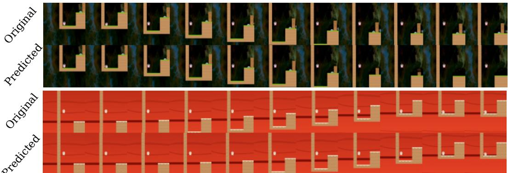  
Figure 5: GenieRedux-Base Quantitative Evaluation. We present a few sequences from the test set with predictions from GenieRedux-Base. On the example at the top we show a successful jump action. On the example at the bottom we show a successful motion progression.

# C Appendix: GenieRedux-TA Qualitative Evaluation

On Fig. 6 we demonstrate that GenieRedux-TA is able to execute actions and complete motion. On Fig. 7 we show that the model is capable of executing all actions of the environment.

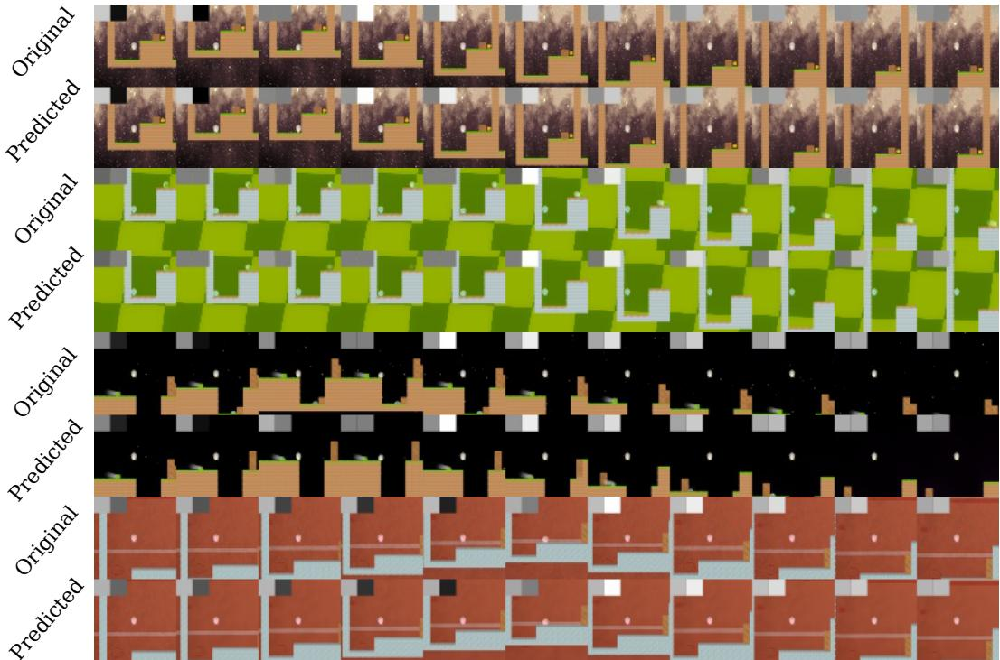  
Figure 6: GenieRedux-TA Qualitative Compatison. We present a few samples from the test set with various actions. We demonstrate that GenieRedux-G-TA performs the actions correctly.

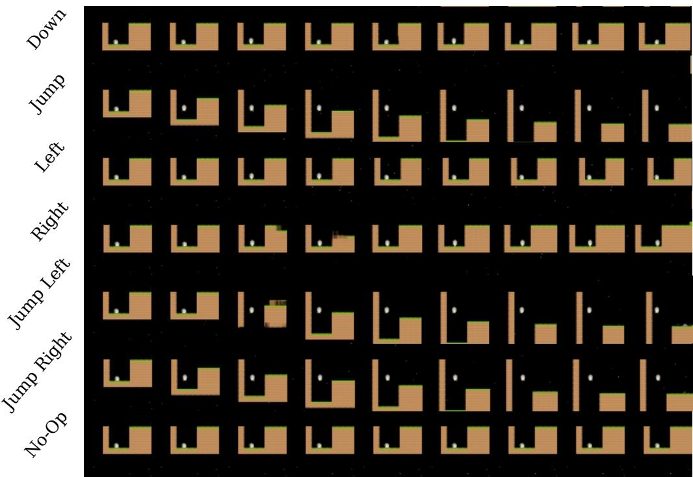  
Figure 7: GenieRedux-TA Controllability. We show predictions for all environment actions of GenieRedux-TA.

# D Appendix: Jafar Qualitative Comparison

On Fig. 8 we show Jafar's reconstruction of 10 frames into the future, given the first frame and a sequence of actions. The results are on the validation set after training. We observe an abundance of artifacts. We note that if we provide the images instead of providing the first frame we get much less artifacts. This seems to hint that Jafar relies on future images to make predictions for the current frame, which might be an inherent problem of the model not being causal.

We additionally report to the numbers reported in the main text, test set results for Jafar - 0.48 SSIM and for GenieRedux(with Jafar parameters) - 0.62 SSIM.

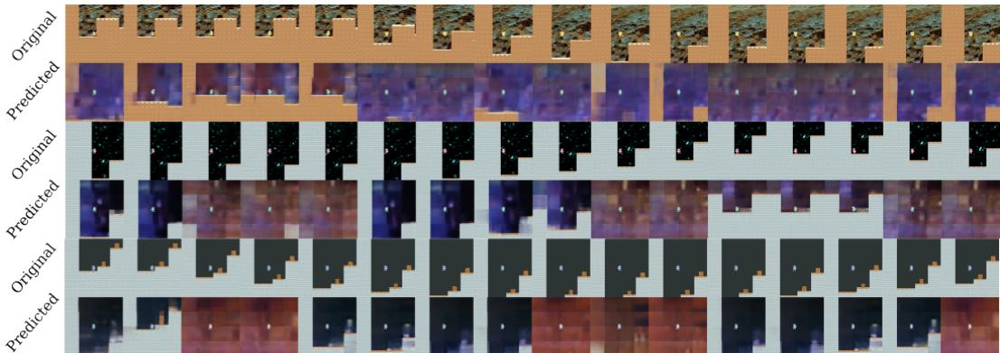  
Figure 8: Jafar Qualitative Results. The results are on the validation set. We give only a single image and actions and predict 15 frames in the future.

In addition we show the version of GenieRedux that we trained to match Jafar on Fig. 9. While it can be noticed that the model prefers inaction when encountering actions, it successfully progresses motion - e.g. moving a character through the air. We also notice fairly good visual quality.

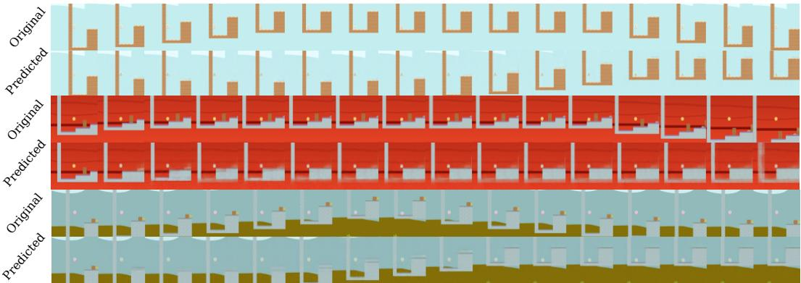  
Figure 9: GenieRedux with Jafar's Parameters Qualitative Results. We show 15 frames into the future given actions and an initial frame of our model.

# E Appendix: Additional GenieRedux-G-TA Qualitative Results

We provide additional visuals of our best performing GenieRedux-G-TA on Fig. 10. We see that our model performs well under different actions and scenarios.

Next, we discuss the limitations of GenieRedux-G-TA and we visualize the known cases on Fig. 11. One possible failure case occurs whenever the environment state or the actions suggest a major exploration of the environment will unfold - for example, when falling down from mid-jump. As the agent is only given a single frame and cannot possibly know the layout of the level, it attempts to reconstruct something that is not guaranteed to be the actual level. Often, the agent exhibits uncertainty in these cases, as shown in the results.

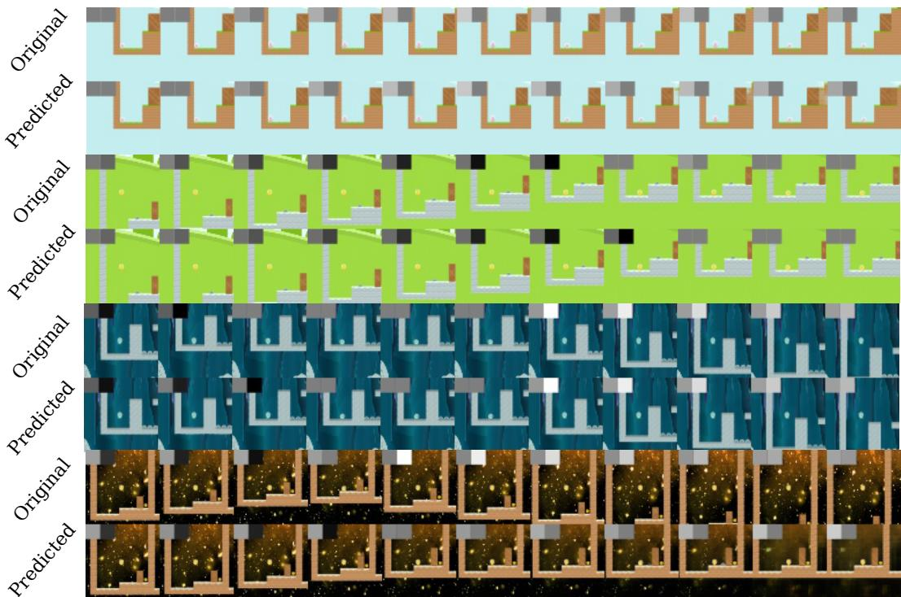  
Figure 10: GenieRedux-G-TA Extra Qualitative Results. More sampled sequences from the test set, showing good match with the ground truth when enacting actions.

Another possible weakness occurs whenever on the first frame a motion is already in progress - for example, in progress of jumping. In that case the model observes a single frame with the agent in the air and has no information about which direction the agent is heading - going up or going down. In that case the model could exhibit uncertainty in the form of artifacts suggesting that the agent is both landing and jumping up, or alternatively not perform an action at all. This is a state that the agent often recovers from in a few steps. Still, we find that it can be avoided by providing more input frames to the model that can give motion information.

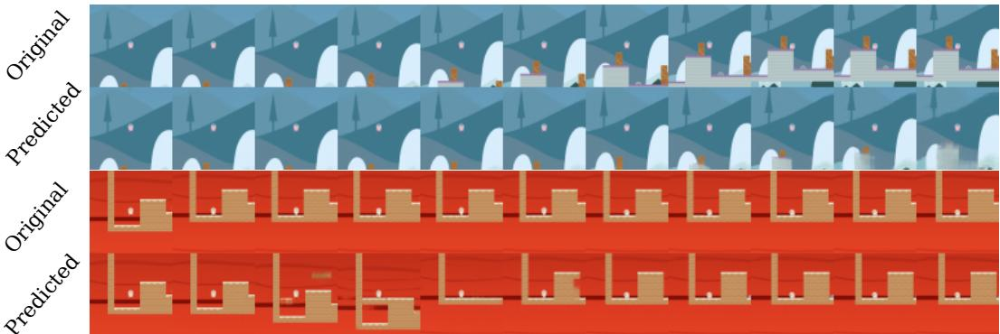  
Figure 11: GenieRedux-G-TA Limitations. Two failure cases of GenieRedux-G-TA - whenever a sizeable new unknown part of the environment is revealed; whenever an in-progress motion is ambiguous.