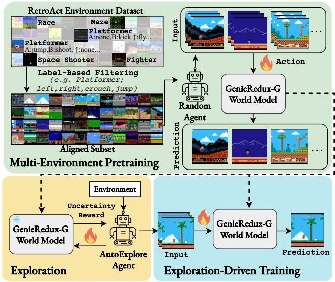
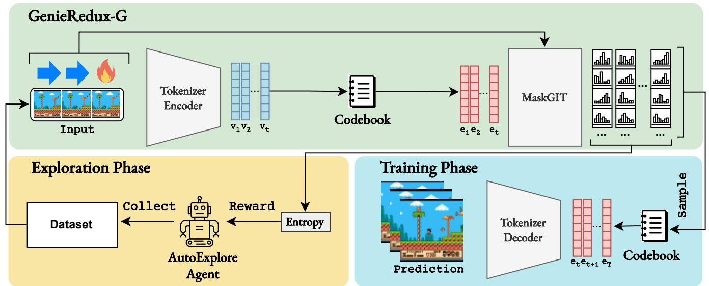
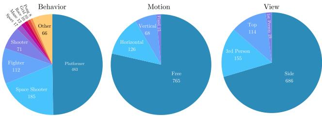
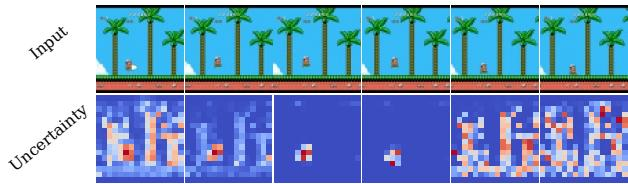

# 1. Bibliographic Information

## 1.1. Title
**Exploration-Driven Generative Interactive Environments**

## 1.2. Authors
Nedko Savov, Naser Kazemi, Mohammad Mahdi, Danda Pani Paudel, Xi Wang, and Luc Van Gool. The authors are primarily affiliated with **INSAIT** (Institute for Computer Science, Artificial Intelligence and Technology) at Sofia University, with co-authors from **ETH Zurich** and **TU Munich**. Their expertise spans computer vision, world models, and reinforcement learning.

## 1.3. Journal/Conference
This paper was published as a preprint on **arXiv** on April 3, 2025. Given the affiliations and the focus on generative world models, it is targeted at top-tier venues like **ICLR** (International Conference on Learning Representations) or **CVPR** (Conference on Computer Vision and Pattern Recognition).

## 1.4. Publication Year
**2025**

## 1.5. Abstract
The paper addresses the high cost of collecting large-scale video datasets with expert action demonstrations for training **world models** (AI systems that simulate environments). The authors propose a framework that uses inexpensive, automatically collected interaction data from virtual environments. They introduce:
1.  **RetroAct:** A curated dataset of 974 virtual game environments with behavior and control annotations.
2.  **GenieRedux & GenieRedux-G:** Open-source implementations and enhancements of the "Genie" world model.
3.  **AutoExplore Agent:** An exploration agent that seeks out "uncertain" areas of an environment to collect diverse data, independent of specific game rewards.
    The results show that models fine-tuned on data from the `AutoExplore Agent` achieve significantly higher visual fidelity and controllability compared to those trained on random actions.

## 1.6. Original Source Link
*   **Original Source:** [https://arxiv.org/abs/2504.02515](https://arxiv.org/abs/2504.02515)
*   **PDF Link:** [https://arxiv.org/pdf/2504.02515v1](https://arxiv.org/pdf/2504.02515v1)
*   **Code & Data:** [https://github.com/insait-institute/GenieRedux](https://github.com/insait-institute/GenieRedux)

    ---

# 2. Executive Summary

## 2.1. Background & Motivation
A **world model** is essentially a "digital twin" of an environment (like a video game or a real-world street) that can predict what happens next based on a player's actions. Recent models like Google DeepMind's `Genie` can generate interactive videos, but they require massive amounts of video data where humans or expert bots demonstrate actions. 

**The Core Problem:** Collecting these "expert" demonstrations is incredibly slow and expensive. If you want a model to learn a new game, you usually have to record hours of high-quality gameplay.

**Innovation Entry Point:** The authors ask: *Can we train a world model using only a "dumb" agent that explores on its own?* They propose that instead of following a game’s goal (like collecting coins), an agent should follow "curiosity"—specifically, searching for parts of the environment where the current world model is most confused (uncertain).

## 2.2. Main Contributions / Findings
*   **Open Implementation:** They provide `GenieRedux`, the first open-source, high-fidelity implementation of the `Genie` architecture, enabling the research community to build upon this technology.
*   **RetroAct Dataset:** They annotated nearly 1,000 retro games to create a large-scale training ground for multi-environment learning.
*   **Uncertainty-Driven Exploration:** They developed the `AutoExplore Agent`, which uses the world model's own "entropy" (uncertainty) as a reward signal. It finds new visual states (like jumping over an obstacle) that a random agent might never discover.
*   **Key Finding:** Models fine-tuned with `AutoExplore` data improved visual quality by up to **7.4 PSNR** (a metric for image clarity) and improved controllability significantly over standard random agents.

    ---

# 3. Prerequisite Knowledge & Related Work

## 3.1. Foundational Concepts
To understand this paper, a beginner should be familiar with these concepts:
*   **World Models:** AI that learns a "mental model" of how the world works. If provided with a picture of a character and the action "Jump," the model predicts a video of the character jumping.
*   **Tokenizer:** Just as text is broken into words, images are broken into "tokens" (small visual patches). A `Tokenizer` converts pixels into a discrete code (like a vocabulary) and back.
*   **Entropy:** In information theory, entropy measures uncertainty. If a model predicts that 10 different things are equally likely to happen, its entropy is high. If it's certain about one outcome, entropy is low.
*   **Reinforcement Learning (RL):** A training method where an "agent" learns to make decisions by receiving rewards for certain behaviors.

## 3.2. Previous Works
The paper builds directly on **Genie (Bruce et al., 2024)**. Genie was the first large-scale model to show it could learn "action-controllable" video generation from unlabelled Internet videos. However, Genie relied on a `Latent Action Model (LAM)` to guess what actions were happening in those videos.

The authors also reference **Plan2Explore (Sekar et al., 2020)**, which used a similar concept of "exploring to learn a world model," but focused on simpler, non-visual tasks. This paper scales that concept to complex, high-resolution generative transformers.

## 3.3. Technological Evolution
1.  **Stage 1 (VAE/RNN):** Early world models used simple encoders and Recurrent Neural Networks to predict "blurry" futures.
2.  **Stage 2 (Transformers/Diffusion):** Models started using **Transformers** (like GPT) to predict sequences of image tokens, leading to much sharper, more realistic video.
3.  **Stage 3 (This Paper):** Moving away from human-curated data toward **autonomous exploration**, where the AI "invents" its own training data by being curious.

    ---

# 4. Methodology

## 4.1. Principles
The framework follows a two-stage process. First, a **multi-environment world model** is pretrained on a large variety of games using simple random actions to learn basic physics and visuals. Second, for a specific game, the **AutoExplore Agent** collects "hard" data by trying to confuse the model, and the model is fine-tuned on this new, difficult data.

The following figure (Figure 1 from the original paper) shows the system architecture:

*该图像是示意图，展示了我们提出的世界模型训练框架。该框架包括基于随机代理数据的预训练多环境世界模型和新的AutoExplore代理，后者通过探索环境提供多样化的数据进行微调。*

## 4.2. Core Methodology In-depth (Layer by Layer)

### 4.2.1. GenieRedux Architecture
The model consists of three main parts:
1.  **Video Tokenizer:** It uses a **Spatial Temporal Transformer (STTN)**. It takes a sequence of frames $I_1, ..., I_N$ and encodes them into tokens $e_1, ..., e_N$. 
2.  **Latent Action Model (LAM):** In the base version, this component "guesses" the actions between frames.
3.  **Dynamics Module:** A transformer that predicts the next set of tokens based on past tokens and the chosen action.

### 4.2.2. GenieRedux-G Enhancements
In `GenieRedux-G`, the authors replace the "guessed" actions with **Ground Truth actions** (actual button presses). They also introduce a novel loss function to make the model more robust.

**The Token Distance Cross-Entropy (TDCE) Loss:**
Standard Cross-Entropy loss treats every "wrong" guess as equally bad. However, in a visual codebook, some tokens look very similar to the correct one. The authors propose:
$TDCE(x, y) = (y^T K) \cdot softmax(x) + CE(x, y)$
*   $x \in \mathcal{R}^{N_E}$: The model's prediction (logits).
*   $y \in \mathcal{R}^{N_E}$: The "ground truth" (the correct token).
*   $K \in \mathcal{R}^{N_E \times N_E}$: A precomputed table containing the **cosine distances** between all possible tokens in the codebook.
*   $CE(\cdot)$: The standard Cross-Entropy Loss.
    **Explanation:** If the model picks a token that is visually similar to the correct one (small distance in $K$), it is penalized less than if it picks a completely different-looking token.

### 4.2.3. The AutoExplore Agent
This agent doesn't care about "winning" the game. Its reward is based on the **Uncertainty** ($u_t$) of the world model.

The uncertainty per token $u_t$ is calculated using the entropy of the prediction distribution:
`u_t = \frac{2 \cdot \sum_i^{N_T} x_i \cdot \log(x_i)}{N_e}`
*   $x_i$: The probability the model assigns to token $i$ in the codebook.
*   $N_e$: The total number of tokens in the codebook (e.g., 1024).

    The agent's **Reward Function** $R(I_c)$ focuses on the most confusing parts of the image (the top 25% highest uncertainty tokens):
$S_{25\%} = \{ u \in S \mid u \geq Q_{75}(S) \}$
$R(I_c) = \frac{1}{|S_{25\%}|} \sum_{u \in S_{25\%}} u$
*   $Q_{75}$: The 75th percentile of uncertainties.
*   $S$: The set of all token uncertainties in the predicted frame.
    **Intuition:** This rewards the agent for moving the character into situations the model hasn't mastered yet (e.g., encountering a new enemy or a complex background).

The following figure (Figure 2 from the original paper) summarizes the agent loop:

*该图像是一个示意图，展示了 GenieRedux-G 的探索阶段和训练阶段的流程。探索阶段通过 AutoExplore Agent 收集数据，而训练阶段则利用 Tokenizer 编码器和解码器进行预测。*

---

# 5. Experimental Setup

## 5.1. Datasets
*   **RetroAct:** A new dataset created by the authors. They took 974 games from `Stable Retro`, annotated them for "Motion Style" (e.g., Platformer), "Camera View" (e.g., Side-view), and "Control Axis."
*   **Platformers-200:** A subset of 200 platformer games used for pretraining (`4.6` million images).
*   **Platformers-50:** A curated subset of 50 games with identical control mappings (Left, Right, Jump, etc.) for fine-tuning.
*   **CoinRun:** A standard procedural environment used to validate the implementation against the original DeepMind Genie paper.

    The following figure (Figure 3 from the original paper) shows the data characteristics:

    
    *该图像是一个图表，展示了在RetroAct中虚拟环境的行为、运动和视角的分类。图表通过三个圆饼图分别显示不同类别的环境数量，表明行为中‘平台跳跃’和‘空间射击’的数量较多，而在运动类别中，‘自由’型环境占比最大，视角方面则以‘侧视’为主。*

## 5.2. Evaluation Metrics
The authors use four primary metrics:
1.  **PSNR (Peak Signal-to-Noise Ratio):** Measures image reconstruction quality. Higher is better.
    `PSNR = 10 \cdot \log_{10}\left(\frac{MAX_I^2}{MSE}\right)`
    *   $MAX_I$: Maximum possible pixel value (e.g., 255).
    *   `MSE`: Mean Squared Error between the predicted and real image.
2.  **FID (Fréchet Inception Distance):** Measures how "realistic" the generated images look by comparing distributions of features. Lower is better.
3.  **SSIM (Structural Similarity Index):** Measures how well the "structure" and "texture" of the image are preserved. Range [0, 1], higher is better.
4.  **$\Delta_t PSNR$ (Controllability Metric):**
    `\Delta_t PSNR = PSNR(x_t, \hat{x}_t) - PSNR(x_t, \hat{x}_t')`
    *   $\hat{x}_t$: Frame predicted using the **correct** action.
    *   $\hat{x}_t'$: Frame predicted using a **random** action.
        **Explanation:** If the model is truly controllable, the prediction using the correct action should be much more accurate than one using a random action.

## 5.3. Baselines
*   **Random Agent:** A baseline where the training data is collected by pressing buttons randomly.
*   **GenieRedux:** The authors' basic implementation of the original Genie.
*   **Jafar:** A concurrent JAX-based implementation of Genie used for qualitative comparison.

    ---

# 6. Results & Analysis

## 6.1. Core Results Analysis
The most significant result is the improvement gained by the `AutoExplore Agent`. In the game **Adventure Island II**, the model trained on exploration data achieved a PSNR of **30.60** compared to **27.04** for the random agent. This proves that "curious" exploration yields much better training data than random button mashing.

## 6.2. Data Presentation (Tables)
The following are the results from Table 5 of the original paper, comparing Random and Exploration strategies across three environments:

<table>
<thead>
<tr>
<th>Environment</th>
<th>Strategy</th>
<th>Model</th>
<th>FID↓</th>
<th>PSNR↑</th>
<th>SSIM↑</th>
<th>ΔPSNR↑</th>
</tr>
</thead>
<tbody>
<tr>
<td rowspan="4">Adventure Island II</td>
<td>Random</td>
<td>GenieRedux-G-50-ft</td>
<td>42.34</td>
<td>27.04</td>
<td>0.81</td>
<td>1.19</td>
</tr>
<tr>
<td>Exploration</td>
<td>GenieRedux-G-50-ft</td>
<td>12.77</td>
<td>30.60</td>
<td>0.90</td>
<td>1.47</td>
</tr>
<tr>
<td>Random Autoregressive</td>
<td>GenieRedux-G-50-ft</td>
<td>41.55</td>
<td>27.82</td>
<td>0.83</td>
<td>1.24</td>
</tr>
<tr>
<td>Exploration Autoregressive</td>
<td>GenieRedux-G-50-ft</td>
<td>11.33</td>
<td>33.61</td>
<td>0.94</td>
<td>2.09</td>
</tr>
<tr>
<td rowspan="2">Super Mario Bros</td>
<td>Random Autoregressive</td>
<td>GenieRedux-G-50-ft</td>
<td>30.84</td>
<td>34.85</td>
<td>0.95</td>
<td>0.57</td>
</tr>
<tr>
<td>Exploration Autoregressive</td>
<td>GenieRedux-G-50-ft</td>
<td>9.33</td>
<td>37.77</td>
<td>0.97</td>
<td>0.76</td>
</tr>
</tbody>
</table>

## 6.3. Tokenizer Representation Study
The authors found that their model naturally learns a "static" token that represents parts of the background that don't change. When they visualize uncertainty (entropy), it is almost always concentrated on the moving character or newly revealed parts of the screen.

As seen in Figure 6:

*该图像是图表，展示了一个示例序列的输入帧和相应的动态不确定性。上方是输入帧，下方则显示了在运动区域内预测的每个图像的不确定性，颜色深浅表示不确定性的程度。*

The red/yellow regions (high uncertainty) track the character's movement, confirming that the `AutoExplore Agent` is indeed being "drawn" toward movement and new visual information.

---

# 7. Conclusion & Reflections

## 7.1. Conclusion Summary
The paper successfully demonstrates that **expert demonstrations are not strictly necessary** to build high-quality interactive world models. By leveraging a large-scale dataset of diverse environments (`RetroAct`) and an agent driven by **model uncertainty** (`AutoExplore`), the authors created a system that can adapt to new games autonomously. Their open-source `GenieRedux-G` model provides a strong baseline for future research in interactive video generation.

## 7.2. Limitations & Future Work
*   **Initial Frame Ambiguity:** If provided with only one starting frame, the model sometimes struggles to know if a character is currently in the middle of a jump or falling. Providing more history (e.g., 4 frames) fixes this but increases computational cost.
*   **Generalization to Unseen Visuals:** While the model generalizes well across platformers, it still shows "artifacts" (visual glitches) when faced with a game style it has never seen before.
*   **Computational Cost:** Training these models requires significant GPU resources (A100 GPUs), which might still be a barrier for some researchers.

## 7.3. Personal Insights & Critique
**Strength:** The use of **uncertainty as a reward** is a very elegant "closed-loop" solution. The agent helps the model learn, and the model's confusion helps the agent explore. 

**Critique:** One potential issue is the "noisy-TV" problem common in curiosity-based RL. If a part of the game is truly random (like static on a TV or a flickering light), the model will *always* be uncertain there, and the agent might get "stuck" watching the noise forever because it provides infinite reward. The authors' focus on the "top 25% uncertainty" and the "static background token" helps mitigate this, but it remains a theoretical challenge for more complex, noisy environments.

**Transferability:** This method could be revolutionary for **Robotics**. Instead of a human guiding a robot arm to pick up an object, the robot could "play" in a simulator and focus only on the movements it finds most difficult to predict, drastically speeding up learning.