# Exploration-Driven Generative Interactive Environments

Nedko Savov1, Naser Kazemil Mohammad Mahdi1 Danda Pani Paudel1 Xi Wang1,2,3 Luc Van Gool1 1 INSAIT, Sofia University "St. Kliment Ohridski" 2 ETH Zurich 3 TU Munich

# Abstract

Modern world models require costly and timeconsuming collection of large video datasets with action demonstrations by people or by environment-specific agents. To simplify training, we focus on using many virtual environments for inexpensive, automatically collected interaction data. Genie [5], a recent multi-environment world model, demonstrates simulation abilities of many environments with shared behavior. Unfortunately, training their model requires expensive demonstrations. Therefore, we propose a training framework merely using a random agent in virtual environments. While the model trained in this manner exhibits good controls, it is limited by the random exploration possibilities. To address this limitation, we propose AutoExplore Agent - an exploration agent that entirely relies on the uncertainty of the world model, delivering diverse data from which it can learn the best. Our agent is fully independent of environment-specific rewards and thus adapts easily to new environments. With this approach, the pretrained multi-environment model can quickly adapt to new environments achieving video fidelity and controllability improvement. In order to obtain automatically large-scale interaction datasets for pretraining, we group environments with similar behavior and controls. To this end, we annotate the behavior and controls of 974 virtual environments - a dataset that we name RetroAct. For building our model, we first create an open implementation of Genie - GenieRedux and apply enhancements and adaptations in our version GenieRedux-G. Our code and data are available at https://github.com/insait-institute/GenieRedux.

# 1. Introduction

Learning from interactive environments allows us to understand and represent the rules, the possible actions, and the consequences that govern them. As an alternative to laboriously hand-coded synthetic simulators, world models have emerged as deep learning tools for realistic environment modeling entirely from observations, commonly images of the observed environment [1, 5, 37, 65].

  
Figure 1. Our proposed world model training framework. It consists of a pretrained multi-environment world model on random agent data, and a new AutoExplore Agent that explores an environment and delivers diverse data for fine-tuning.

Previous work such as [19, 23, 33] uses light world models to support goal-driven agents with goal-specific state representations. The focus is on coarse future predictions, not on their high visual quality. In contrast, the objective of recent world models is to achieve high-quality future predictions given past observations and actions. Such recent models are able to offer realistic action execution and even real-time interaction with people [1, 58]. This has become possible with the rise of diffusion, transformers [14, 59], and state space models [17], and by borrowing architectural choices from video generation pipelines [51, 60]. Typically, these generative models are designed to closely match a single selected environment. One of the state-of-the-art models, Genie, distinguishes itself by being trained on many visually diverse environments with similar dynamics, thus demonstrating generalization across new visuals. Building these high-quality statistical simulators requires diverse observations of the environment as well as of the actions to simulate. Some obtain this data by costly video dataset collection and curation with human demonstrations of the actions [1, 5, 63]. If actions are unavailable, an extra component is designed to predict them, which can introduce uncertainty compared to ground truth labels [5, 37]. Extension to new environments with new types of actions in this setting is difficult as it requires again an expensive data collection process. Others, such as [58] have explored retrieving data with an environment-specific agent, in their case - the game Doom.

In this work, we propose a framework for accessible and effort-free training of world models in multiple environments. To this end, we first build Ret roAct- an annotated and curated large dataset of retro game environments (based on the environments of Stable Retro [48]). We group them based on behavior labels and control descriptions. This grouping allows us to generate large-scale interaction datasets across environments with similar behaviors. Next, we pretrain a multi-environment world model GenieRedux - our open implementation of Genie [5], using a random agent. Unlike [66], which reports the agent's improved behavior from pretraining, we aim to improve the world model. For this, we adapt GenieRedux to virtual environments and implement architectural and training procedure enhancements, resulting in the GenieRedux-G model. We observe that just by training GenieRedux-G on random interactions from subsets of 200 environments and 50 environments with mapped controls, automatically collected from RetroAct, we are able to obtain control behavior (0.450 ∆PSNR in 50 environments) and reasonable visual fidelity (26.36 PSNR in 50 environments).

As random actions are limited in their ability to explore the environment, we develop a method to obtain more diverse interaction data to improve the control behavior and visual fidelity of our model. To this end, inspired by [53], we develop our own environment-independent reward function, allowing an agent to explore different environments, entirely without relying on predefined environment rewards. While they aim at a high-performing goal-driven agent, we base our design on improving the underlying large world model for the simulation of environments in terms of higher visual fidelity and improved controllability. For graphical illustrations, see Fig. 1. The objective of our explorationdriven agent is to maximize the world model's uncertainty, estimated by the classification entropy available in the observation prediction stage of GenieRedux-G. Once the diverse data is obtained, we fine-tune GenieRedux-G. We show that this method leads to significant visual (up to 7.4 PSNR) and control (up to $1 . 4 \Delta \mathrm { P S N R } )$ improvements, compared to random agent pretraining. Our contributions are as follows: •A framework for training world models with cheap data collection - by training an exploration agent based on our world's model uncertainty. • The implementation and release of GenieRedux and GenieRedux-G - open Pytorch models based on [5]. • Architectural and loss changes to the model leading to fidelity improvements, based on our tokenizer representation study. • Preparing a large scale environment dataset for multienvironment world model training.

# 2. Related Work

World models. Initially built as rough imagination models assisting reinforcement learning (RL) agents [10, 19, 21, 24, 53], world models have evolved into independent realistic video generation models conditioned on actions [9, 39, 50, 64]. They facilitate task-specific agent training by providing predictive representations of the environment. Inspired by [20], Ha and Schmidhuber [18] use a VAE to encode visual observations into latent states, with an MDNRNN predicting future states based on prior states, actions, and VAE outputs to facilitate policy learning. DreamerV2 [22] introduce an RL agent, achieving human-level performance in Atari. It encodes images with a CNN and computes posterior and prior stochastic states using recurrent states. Unlike our work, though, it does not assess the agent's impact on world model improvement nor generalize task rewards across different environments. World models also aim to generate realistic video conditioned on actions [27, 37, 65]. Genie [5] trains a video tokenizer and a Latent Action Model (LAM) for dynamic nextframe generation. GAIA-1 [27] tackle autonomous driving in unstructured settings by encoding multi-modal inputs into a unified representation and predicting image tokens based on prior inputs, using an autoregressive transformer. Menapace et al. [37] employ an encoder-decoder architecture in which the predicted action labels act as a bottleneck, allowing a user to control the generated video by a discrete action. The key gap in these works is automatic data collection, which is addressed in our approach. Efficient exploration. The importance of efficient exploration in RL is highlighted by [28]. Early methods enhanced exploration by adding noise [16, 34] or using entropy regularization [40], but they have action space limitations and often fail with complex dynamics, where varied actions do not always drive meaningful exploration. A more direct approach uses heterogeneous actors [26, 29, 52] with diverse exploration strategies to enhance environment exploration. Bayesian methods [54, 57] have also been introduced to create acquisition functions for uncertainty-driven exploration [2, 38, 4144], but often struggle to generalize to high-dimensional inputs like images.

  
agent. The reward is solely based on the classification uncertainty of our model.

Recent exploration methods emphasize state novelty [3, 7, 11, 35, 36, 45, 55, 67], focusing on encouraging agents to assess novelty only after visiting states. In contrast, our approach, inspired by [7, 47, 53], uses model disagreement to proactively guide agents to states with the highest potential without environment target-driven reward. [6, 46] propose exploration agents driven by uncertainty in state transition and simple feature extractors. Instead, we propose an exploration agent designed to improve a world model that does not model states. Plan2Explore [53] enables agents to seek novel states using a reward that maximizes the state entropy of an RSSM model. While Plan2Explore improves goal-driven agents with their framework, we improve a modern transformer world model with a novel explorationbased reward using token uncertainty. Rather than relying on world models, EX2 [15] learns a classifier to distinguish visited states, providing intrinsic rewards for states that are difficult for the classifier to differentiate. KL-divergence-based approaches [3032], guide exploration by comparing distributions. For example, SMM [32] computes the KL divergence between the policyinduced state distribution and a uniform target. Tao et al. [56] propose an intrinsic reward based on the distance between a state and its nearest neighbors in a low-dimensional feature space. However, low-dimensionality leads to information loss, restricting full state space exploration — an issue we address by the use of a world model.

# 3. RetroAct Dataset

We first tackle the problem of accessible training of multienvironment world models by building a framework for cheaply acquiring multi-environment interaction data. In particular, we aim to collect interactions of similar actions in many environments. Instead of relying on expensive human interaction, we obtain and curate a collection of virtual environments. As a source, we use the Stable Retro framework by [48], which is a collection of retro games across multiple platforms, with an accompanying starting state. We make no use of the defined rewards. We obtain almost all the supported games (974).

  
Figure 3. RetroAct Annotation. Description of environments in Ret roAct by annotated attribute. Better viewed zoomed.

This raw set contains an environment mix of very different visuals and behaviors. However, in our setting of learning from similar dynamics, it is required to establish correspondence between the environments' behaviors. We perform annotation where for each environment three aspects are classified. The motion style classifies the general style of what and how is moved by the controls, closely relating to game genre; the camera viewpoint; the control axis describing in which direction the player can be moved. The label distributions are shown in Fig. 3. In Tab. 1 we compare our RetroAct with other related datasets. RetroAct distinguishes itself by providing behavior and control annotations, while maintaining a high number of environments. It is discovered that the most prevalent type of environment in our set is the platformer - 483 titles. As the largest subset, we filter only these games for further use, as it is required to have many environments exhibiting similar controls. Five motion actions are defined for our model - moving left, right, up, down and jump. Each game has its own mapping of buttons to actions. Therefore, we generate a short clip of each of the 5 selected actions for each of the 483 titles and build an annotation tool to observe and annotate the executed action. Eventually, we annotated 2,925 behavior and 2,898 control labels.

Table 1. Comparison of RetroAct dataset to others.   

<table><tr><td>Dataset</td><td>Type</td><td>#Environments</td><td>Diverse Behaviors</td><td>Open</td><td>Behavior Annotation</td><td>Control Annotation</td></tr><tr><td>Coinrun [13]</td><td>Environments</td><td>1</td><td>X</td><td>√</td><td>X</td><td>×</td></tr><tr><td>ALE [4]</td><td>Environments</td><td>57</td><td>✓</td><td>✓</td><td>X</td><td>X</td></tr><tr><td>Stable Retro [48]</td><td>Environments</td><td>1003</td><td>✓</td><td>✓</td><td>X</td><td>X</td></tr><tr><td>Platformers [5]</td><td>Videos</td><td>Unknown</td><td>✓</td><td>X</td><td>X</td><td>X</td></tr><tr><td>RetroAct(Ours)</td><td>Environments</td><td>974</td><td>✓</td><td>✓</td><td>✓</td><td>✓</td></tr></table>

After experimenting, we observed that models require more training with a higher number of environments, so we defined two subsets of our large set to handle computational cost: a subset consisting of the first 200 games of 483 behavior-filtered games for pretraining, and another subset of 50 randomly selected action-consistent games using RetroAct's action labels for fine-tuning.

We collect a large scale dataset by launching a random agent in all of the environments, collecting actions and observations. From the 200-game set we build Plat formers-2 00 - a dataset with 10,000 episodes (50 episodes per game) with 500 frames each at most, resulting in $4 . 6 \mathrm { m l n }$ images. From the 50-game set we obtain Platformers $\mathord { \mathrm { ~ \textrm ~ { ~ ~ } ~ } } \mathord { - } 5 0 \mathrm { ~ \textrm ~ { ~ } ~ } - 5 0 0 0$ episodes (100 per game) of length at most 1000, resulting in $4 . 8 \mathrm { m l n }$ images. In our protocol, we take $1 \%$ of the sessions of each environment as a validation set. We show that using a random agent is already sufficient to learn a level of controllability and later build on top with an exploration agent of our design. To validate our GenieRedux implementation, we implement the CoinRun case study in [5]. Using the protocol from above, we obtain a dataset of $1 0 \mathrm { k }$ episodes with a maximum length of 500, resulting in $4 \mathrm { m l n }$ images.

# 4. Multi-Environment World Model

Given virtual environments, our first goal is to automatically obtain a dataset of image sequences $I _ { 1 } , . . . , I _ { N }$ and corresponding actions $a _ { 1 } , . . . , a _ { N - 1 }$ . Given a sequence $I _ { 1 } , . . . , I _ { N }$ and past and future actions $a _ { 1 } , . . . , a _ { N + T - 1 }$ , our world model aims to predict the future $T$ frames $I _ { N + 1 } , . . . , I _ { T }$ , corresponding to the actions executed. GenieRedux. As Genie [5] is not made available by the authors, we create an open implementation and call it GenieRedux. We validate our implementation quantitatively and qualitatively in Sec. 5 and Sup.Mat F. It consists of three components. A video

Tokenizer encodes input frame sequences into spatiotemporal tokens: $e _ { 1 } , . . . , e _ { N } \ = \ T _ { e n c } ( I _ { 1 } , . . . , I _ { N } )$ , and decodes back to images: ${ { I } _ { 1 } } , . . . , { { I } _ { N } } = { { T } _ { d e c } } ( { { e } _ { 1 } } , . . . , { { e } _ { N } } )$ . A Latent Action Model encodes input frame sequences into spatio-temporal tokens: $\begin{array} { r l } { a _ { 1 } , . . . , a _ { N - 1 } } & { { } = } \end{array}$ $L A M _ { e n c } ( I _ { 1 } , . . . , I _ { N - 1 } )$ , and decodes them to reconstruct future prediction $I _ { 2 } , . . . , I _ { N } = L A M _ { d e c } ( a _ { 1 } , . . . , a _ { N - 1 } )$ . A Dynamics module predicts the next frames based on partially masked frame tokens and actions: $I _ { 2 } , . . . , I _ { N + T - 1 } =$ $D ( e _ { 1 } , . . . , e _ { N } , . . . , e _ { N + T - 1 } ; a _ { 1 } , . . . , a _ { N + T - 1 } )$ , where in inference $e _ { N } , . . , e _ { N + T - 1 }$ are masked. We adhere closely to Genie's specifications for implementing these components. All components use the causal Spatial Temporal Transformer (STTN) [62]. We use Position Encoding Generator (PEG) [12] for spatial and temporal attention, and Attention with Linear Biases (ALiBi) [49] for temporal attention. We train our models with a sequence size of 16 frames and resolution of $6 4 \mathrm { x } 6 4$ to address computational limitations. We train a U-Net-based superresolution network on 50K data samples to upscale the output to $2 5 6 \times 2 5 6$ . (Sup.Mat. B) GenieRedux-G. Building upon the base model, we offer a variant - GenieRedux-G, which is adapted to virtual environments and contains architectural and training improvements. While GenieRedux uses an indispensable LAM model to obtain the actions, we discard it, as ground truth actions are available from our agent. Instead, the onehot actions are concatenated to each layer of the Dynamics module for conditioning. In this way, we avoid the uncertainty of a prediction. The Dynamics module consists of an ST-ViViT encoder, followed by a MaskGIT architecture [8], which predicts indices from the tokenizer's codebook for randomly masked input tokens during training, according to a schedule. As standard cross-entropy is used, token classification has the drawback to penalize equally any prediction different from the ground truth. However, close tokens in the codebook result in significantly fewer changes than far tokens, as also shown in Sec. 5. To enable this concept of a distance between tokens in the classification of $N _ { E }$ tokens, we design a Token Distance Cross-Entropy (TDCE) Loss:

$$
T D C E ( x , y ) = ( y ^ { T } K ) \cdot s o f t m a x ( x ) + C E ( x , y )
$$

Here $\boldsymbol { x } \in \mathcal { R } ^ { N _ { E } }$ is the prediction logits, $y \in \mathcal { R } ^ { N _ { E } }$ is the ground truth one-hot class. $K \in \mathcal { R } ^ { N _ { E } \times N _ { E } }$ is a precomputed table at the start of training of the cosine distances between all tokens ; $C E ( . )$ denotes standard Cross-Entropy Loss. When an incorrect token class is given probability, it is penalized based on its distance to the ground truth class. MaskGIT's design is to take as input learnable embeddings, indexed by the tokens predicted by the Tokenizer. They are randomly initialized, and therefore contain none of the content of the tokens. Given that that the encoding itself and the distance between tokens can contribute to Dynamic module's performance, we add a skip connection by adding the embedding to the token itself, which improves visual fidelity and controllability of the model. AutoExplore Agent We extend our framework with an exploration agent that obtains data by going deeper into the environments. We name it AutoExplore Agent. The reward of the agent is entirely based on the world model performance and operates without any environment rewards. Therefore, it can be trained in various environments without tuning to their specifics or relying on a reward definition.

The design of our reward is based on the fact that GenieRedux-G employs classification for token prediction. Each token is predicted by sampling from a categorical distribution over the codebook. We first obtain all $N _ { T }$ token prediction distributions by running GenieRedux-G-50 5 steps back from the current observation $I _ { c }$ for which we want to estimate the reward. We provide 2 images $I _ { c - 4 } , I _ { c - 3 }$ , predict 3 images - $I _ { c - 2 } , . . . , I _ { c }$ , and take the distributions of the predicted tokens of $I _ { c }$ to obtain $x =$ $[ x _ { 1 } , . . . , x _ { t } , . . . , x _ { N _ { T } } ]$ . We evaluate the uncertainty per predicted token $u _ { t }$ by calculating the entropy over the categorical distribution and normalize it in the range [0, 2]:

$$
u _ { t } = \frac { 2 \cdot \sum _ { i } ^ { N _ { T } } x _ { i } \cdot l o g ( x _ { i } ) } { N _ { e } }
$$

Studying the properties of the Tokenizer representation, we find that a prevalent token is learned representing static parts of the environment. Only the changing parts generate high uncertainty and, therefore, we take the subset $S _ { t o p }$ of $2 5 \%$ highest uncertainties of the entire set of uncertainties $S \ = \ \{ u _ { t } \}$ . The reward, shown in Eq. 3, establishes the agent's goal to collect data that maximizes uncertainty of the world model.

$$
\begin{array} { r } { S _ { 2 5 \% } = \{ u \in S \mid u \geq Q _ { 7 5 } ( S ) \} } \\ { R ( I _ { c } ) = \frac { 1 } { | S _ { 2 5 \% } | } \underset { u \in S _ { 2 5 \% } } { \sum } u } \end{array}
$$

Our agent is an actor-critic, trained with the Policy Gradient method. For the agent architecture, we follow [39]. It consists of a CNN encoder followed by an LSTM. As standard in RL, 4 frames are stacked, max-pooled, and the result is the input to the agent for a single time step. Exploration-driven World Model Training. We initially pretrain GenieRedux-G on Platformers $- 2 0 0$ and fine-tune on Plat formers-50 to obtain the model GenieRedux-G-50. Then, we train AutoExplore Agent by using GenieRedux-G-50, using it as a source of reward. The details of training the agent are presented in Sup.Mat A.3. Running the trained exploratory agent on a selected environment, we obtain a new diverse dataset with action demonstrations under unseen scenes. We first fine-tune the decoder of the Tokenizer for 1,000 iterations to adapt to the new unseen scenes. The Dynamic module of GenieReduxG is then fine-tuned on the new data to achieve greater visual fidelity and controllability under new conditions. In order to build test sets to evaluate our approach, we train an Agent-57 model for each of the environments we explored, using the available environment rewards. More details on the test setup are provided in Sup.Mat A.2.

For visual fidelity evaluation, we use FID (Fréchet inception distance) Heusel et al. [25], PSNR (signal-to-noise ratio) and SSIM (structural similarity index measure) Wang et al. [61]. To evaluate controllability, we use the recently proposed $\Delta _ { t } \mathrm { P S N R }$ metric [5], which compares the visual effect of the ground truth action $( \hat { x } _ { t } )$ versus a random action $( \hat { x } _ { t } ^ { \prime } )$ : $\Delta _ { t } \mathrm { P S N R } = \mathrm { P S N R } ( x _ { t } , \hat { x } _ { t } ) - \mathrm { P S N R } ( x _ { t } , \hat { x } _ { t } ^ { \prime } ) ,$ , where $x _ { t }$ is the ground truth frame at time $t$ A higher $\Delta _ { t } \mathrm { P S N R }$ indicates a higher level of controllability. As in Bruce et al. [5], for all experiments we report $\Delta _ { t } \mathrm { P S N R }$ with $t = 4$ .

# 5. Experiments

Comparing GenieRedux and GenieRedux-G. We implement the original CoinRun case study with a random agent, as advised by [5], in order to validate and compare GenieRedux with LAM, and GenieRedux-G which uses agent-provided actions instead. In this study, the presence of LAM is the only difference between the models. We first train on a dataset, collected by a random agent. Visual fidelity results are in Tab. 2. Our GenieRedux implementation exhibits high visual quality and matches all seven CoinRun environment actions, as well as progressing environment motions (demonstrated in Sup.Mat. F). However, as demonstrated by the metrics, GenieRedux-G shows superior visual fidelity and controllability (more in Sup.Mat. F), as it avoids the uncertainty of LAM prediction. This study demonstrates that even using a random agent can result in action performance abilities in the world model. Next, we train an actor-critic agent with PPO on the environment reward, following [13] to collect data and train GenieRedux-TA and GenieRedux-G-TA. Tab. 3 shows evaluation on a test set collected by a trained agent.

Table 2. Comparison of GenieRedux and GenieRedux-G on Basic Test Set. Peformed on a test set, collected from the Coinrun environment with randomly sampled actions.   

<table><tr><td rowspan="2">Model</td><td colspan="3">Basic Test Set</td></tr><tr><td>FID↓</td><td>PSNR↑</td><td>SSIM↑</td></tr><tr><td>Tokenizer</td><td>18.14</td><td>38.25</td><td>0.96</td></tr><tr><td>LAM</td><td>37.01</td><td>33.97</td><td>0.92</td></tr><tr><td>GenieRedux</td><td>21.88</td><td>25.51</td><td>0.77</td></tr><tr><td>GenieRedux-G</td><td>18.88</td><td>33.41</td><td>0.92</td></tr></table>

Table 3. Comparison of GenieRedux and GenieRedux-G on Diverse Test Set. The models are trained with data collected by random agent and trained agent (-TA), and tested on data collected by a trained agent from the Coinrun environment.   

<table><tr><td rowspan="2">Model</td><td colspan="3">Diverse Test Set</td></tr><tr><td>FID↓</td><td>PSNR↑</td><td>SSIM↑</td></tr><tr><td>Tokenizer</td><td>19.13</td><td>35.85</td><td>0.94</td></tr><tr><td>Tokenizer-TA</td><td>11.63</td><td>40.62</td><td>0.97</td></tr><tr><td>GenieRedux</td><td>23.97</td><td>23.82</td><td>0.73</td></tr><tr><td>GenieRedux-G</td><td>19.51</td><td>31.66</td><td>0.90</td></tr><tr><td>GenieRedux-TA</td><td>12.57</td><td>31.97</td><td>0.90</td></tr><tr><td>GenieRedux-G-TA</td><td>12.40</td><td>34.44</td><td>0.92</td></tr></table>

GenieRedux-G outperforms GenieRedux on all settings. Furthermore, models trained on diverse agent-collected data are visually superior to those trained on random agents. The higher $\Delta { \sf P S N R }$ of 1.89 for GenieRedux-G-TA compared to 0.70 for GenieRedux-G shows the superiority of diverse data training in controllability. (more in Sup.Mat. F) Multi-Environment Models. Here, we evaluate the models we initially train on many environments from RetroAct. GenieRedux-G-200 is pretrained on the Platformers $- 2 0 0$ dataset for 180k iterations. On the validation set, we obtain 23.32 PSNR and 17.12 FID. Using this model as a base, GenieRedux-G-50 is trained on Plat formers-50. Its quantitative evaluation on a test set of $1 0 \mathrm { k }$ sessions separately generated from the selected 50 environments is at the start of Tab. 4. As the 50 environments are selected with corresponding action controls between each other, we see a boost in the quality of prediction. Fig. 4 demonstrates that the instructed action is executed successfully by GenieRedux-G. As the up action is rarely used, it serves more as a no-operation action. (more in Sup.Mat C.1) Ablation Study. In this experiment we evaluate the additive gain of each proposed improvement in GenieRedux-G - the additive token input and training with the Token Distance Cross-Entropy Loss. The ablation is performed on a generated test set of $1 0 \mathrm { k }$ sessions, each 500 frames long.

Table 4. Ablation study on improvements in GenieRedux-G.   

<table><tr><td>Model GenieRedux-G-200</td><td>FID↓ 22.31</td><td>PSNR↑ 25.11</td><td>SSIM↑ 0.80</td></tr><tr><td colspan="2">GenieRedux-G-50 + Token Input + TDCE Loss Autoregressive</td><td colspan="2">23.80 26.36 22.96 26.65 22.95 27.06 22.11 28.07</td><td>0.84 0.84 0.85</td></tr><tr><td colspan="2">Input Right Left</td><td>Up</td><td>Down</td><td>0.88 Jump</td></tr><tr><td>K</td><td></td><td></td><td></td><td></td></tr><tr><td>|</td><td></td><td></td><td></td><td></td></tr></table>

The data is collected using a random action policy from the environments in Plat formers-50. Visual fidelity evaluation is provided in Tab. 4. It can be seen that each component gives our model a benefit in terms of visual fidelity. Finally, we perform an autoregressive evaluation of the best model to achieve our highest score.

Tokenizer Representation Study. This experiment provides insights into the inner workings of GenieRedux-G to motivate our proposed changes. As the Dynamics module operates entirely on the token representation, we examine it closely. Fig. 5 shows the reconstructions of an input sequence (first row) and the visualized token representation (last row), where each predicted token index is assigned a different color. The visual features of the first frame are captured by various tokens. Starting with the second frame, the representation drastically changes - a token is specialized in representing the static frame regions compared to the past, while all motion regions are updated with new content. Observing that visually similar patches predict identical or similar tokens, we replace each predicted token with its closest in the codebook. We only keep the special background token unchanged. In the second row of Fig. 5 we show the resulting reconstruction - while some blurriness appears, the image remains largely the same. Conversely, replacing each token with its furthest in the codebook (third row) results in a significantly different image. This property - closer tokens having more similar appearance - motivates our Token Distance Cross-Entropy Loss, which penalizes predicting tokens further away from the ground truth. Fig. 6 visualizes the uncertainty of GenieRedux-G-50 for each predicted token of its Dynamics module given a sequence. The uncertainty metric is the entropy of the classification over 1024 codebook tokens. Tokens corresponding to motion have the highest uncertainty; other regions are mostly classified as the "static" token. Thus, minimal character movement yields low uncertainty, while forward motion increases it. This motivates us to build AutoExplore Agent's reward based on this uncertainty. T ExpRo   

<table><tr><td>Environment</td><td>Strategy</td><td>Model</td><td>FID↓</td><td>PSNR↑</td><td>SSIM↑</td><td>∆PSNR↑</td></tr><tr><td rowspan="4">Adventure Island II</td><td>Random</td><td>GenieRedux-G-50 GenieRedux-G-50-ft</td><td>41.99 42.34</td><td>26.32 27.04</td><td>0.81 0.81</td><td>0.83 1.19</td></tr><tr><td>Exploration</td><td>Tokenizer-ft GenieRedux-G</td><td>11.01</td><td>38.95</td><td>0.98</td><td>-</td></tr><tr><td></td><td>GenieRedux-G-50-ft</td><td>11.94 12.77</td><td>28.33 30.60</td><td>0.88 0.90</td><td>0.37 1.47</td></tr><tr><td>Random Autoregressive Exploration Autoregressive</td><td>GenieRedux-G-50-ft GenieRedux-G-50-ft</td><td>41.55 11.33</td><td>27.82 33.61</td><td>0.83 0.94</td><td>1.24 2.09</td></tr><tr><td rowspan="2">Super Mario Bros</td><td>Random</td><td>GenieRedux-G-50 GenieRedux-G-50-ft Tokenizer</td><td>29.83 30.13</td><td>34.24 34.54</td><td>0.94 0.94</td><td>0.56 0.54</td></tr><tr><td>Exploration Random Autoregressive</td><td>GenieRedux-G GenieRedux-G-50-ft</td><td>8.09 9.56 9.55</td><td>42.00 34.00 36.13</td><td>0.99 0.95 0.97</td><td>- 0.09 0.57</td></tr><tr><td rowspan="5">Smurfs</td><td>Exploration Autoregressive</td><td>GenieRedux-G-50-ft GenieRedux-G-50-ft</td><td>30.84 9.33</td><td>34.85 37.77</td><td>0.95 0.97</td><td>0.57 0.76</td></tr><tr><td>Random</td><td>GenieRedux-G-50 GenieRedux-G-50-ft</td><td>79.51 80.61</td><td>21.47 21.83</td><td>0.69</td><td>0.47</td></tr><tr><td rowspan="2">Exploration</td><td>Tokenizer</td><td>17.86</td><td>35.61</td><td>0.70 0.98</td><td>0.65 -</td></tr><tr><td>GenieRedux-G</td><td>20.43</td><td>35.42</td><td>0.80</td><td>0.85</td></tr><tr><td>Random Autoregressive</td><td>GenieRedux-G-50-ft</td><td>20.01</td><td>27.45</td><td>0.85</td><td>1.55</td></tr><tr><td></td><td>Exploration Autoregressive</td><td>GenieRedux-G-50-ft GenieRedux-G-50-ft</td><td>80.16 18.97</td><td>22.16 29.53</td><td>0.71 0.90</td><td>0.69 2.06</td></tr></table>

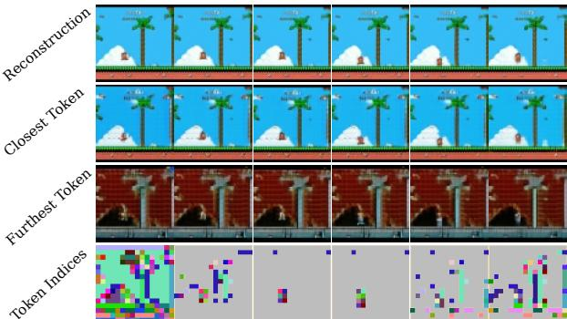  
Figure 5. Tokenizer Representation. Reconstruction images from the tokenizer, and the effect of replacing each token with its closest and furthest in the codebook. Lastly, we visualize the indices of the predicted tokens.

Exploration-based training. We demonstrate our exploration-based training of GenieRedux-G. We perform the procedure on 3 environments - AdventureIslandII, which provides an easy setting for the agent to learn (single platform with no enemies at the start), SuperMarioBros provides an enemy and obstacles soon after the start and Smurfs provides a more complex background imagery and different action dynamics. For each of the environments, we train an AutoExplorer Agent. We observe that the agent learns to move forward and navigate obstacles to maximize reward. (more in Sup.Mat. D)

  
Figure 6. Dynamics Uncertainty. Shown is the uncertainty per token predicted for each image of an example sequence. Uncertainty is generated in the regions of motion.

We use our pretrained GenieRedux-G-50 model as a baseline and fine-tune it for each environment in two settings - a dataset collected on the selected environment by a random agent and by our AutoExplorer Agent. Each dataset consists of 10k sessions, each 700 frames long. We finetune (GenieRedux-G-50-ft) for 10k iterations and pick the best performing model. In our comparison, we also include a GenieRedux-G model trained from scratch on the diverse exploration datasets for $1 5 \mathrm { k }$ iterations to show the effect of pretraining. We perform single-pass generation for all models and the more computationally heavy autoregressive evaluation for the fine-tuned models on data from random and AutoExplore Agent's datasets. Tab. 5 shows visual fidelity and controllability metrics for each environment, confirming the effectiveness of our exploration method. The model fine-tuned on AutoExplore Agent's data consistently outperforms the models trained on random actions in terms of visual fidelity. Exploration-based fine-tuning also improves controllability. Environments with small characters and uniform backgrounds can be more challenging for all models to learn. However, the gain in controllability in this case remains noticeable during autoregressive evaluation. Fig. 7 demonstrates the superior quality of our method. In addition, we observe that the multienvironment pretraining leads to significant gains in both studied aspects compared to the nonpretrained model. (more in Sup.Mat. C)

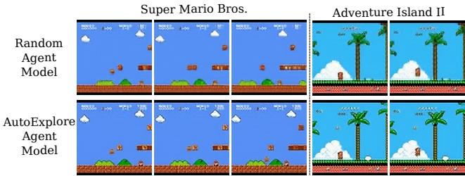  
Figure 7. AutoExplore Agent vs Random Agent Qualitative Comparison. We show that AutoExplore exhibits better visual quality and avoids losing track of the agent.

Table 6. Comparison of AutoExplore Agent with others.   

<table><tr><td>Agent</td><td colspan="3">SuperMarioBros AdventureIslandII PSNR↓ SSIM↓ ΔPSNR↓P</td></tr><tr><td>RF</td><td>28.58 0.94</td><td>0.181</td><td>|PSNR↓ SSIM↓ ∆PSNR↓ 24.82 0.78 0.44</td></tr><tr><td>VAE</td><td>24.40 0.86</td><td>0.087</td><td>16.57 0.5</td></tr><tr><td>Ours 23.81</td><td>0.85</td><td>0.065</td><td>0.072 15.20 0.41 0.070</td></tr></table>

AutoExplore Agent Evaluation. We compare AutoExplore Agent with exploration-based methods in [6]. We train agents based on SSE of RF and VAE features on top of GenieRedux and compare with ours on Tab. 6. AutoExplore Agent's reward results in maximum world model visual and controllability errors (on 1k episodes of agent actions), fulfilling its intended role in our framework. User Studies. To validate the quality of our final results, we perform a user study in which we ask people to rate from 1 to 5 the quality of samples produced respectively by GenieRedux-G trained on random agent's data and on AutoExplore Agent's data. Each sample in our study consists of two 16-frame clips playing in a synchronized manner - the ground truth clip and our GenieRedux-G-50-ft reconstruction, given two initial frames and generating the rest autoregressively. We provide a total of 120 samples to the users - 40 samples per model and 40 samples of two groundtruth samples, to establish scale. We give 20 samples from each of the two selected games - SuperMarioBros and AdventureIslandII. We get reviews from 19 participants. The results are shown in Fig. 8. The model, trained on data from AutoExplore Agent is clearly rated closer to the ground truth, establishing the quality of our method.

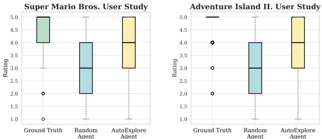  
Figure 8. User study results. Our user study on two games shows that our model trained with AutoExplore Agent's data is consistently rated higher.

With a second user study, we evaluate the action accuracy of the generated frames. We use ambiguous single input cases (character starting mid-air) and generate 60 clips with 3 actions on AdventureIslandII. Users prefer our exploration-trained model, rating it $\mathbf { 0 . 7 5 \ : \pm { \ : 0 . 0 1 9 } }$ on a scale from 0 (random preferred) to 1 (exploration preferred). (more in Sup.Mat. E.2)

# 6. Conclusion

As world models have developed into large models with impressive simulation properties, they require large interaction datasets, complete with diverse observations and actions. Genie [5] demonstrates impressive abilities by training on multiple environments, however, requiring the collection of a large video dataset and a model to infer actions. In this work, we address the heavy burden of data collection and curation by building a new framework for training large world models by collecting interaction data from a large number of virtual environments. We first build an open implementation of Genie - GenieRedux and enhance it into its version GenieRedux-G. We obtain models exhibiting control by pretraining on a large set of virtual environments. We address the overfitting limitations of random data collection policy by proposing AutoExplore Agent, an agent entirely independent of the environment reward, maximizing the uncertainty of GenieRedux-G. After finetuning on the explored environment, our model is able to improve its visual fidelity and controllability much better than training solely on random agent's data. Demonstrating this on multiple environments, we show the potential of our framework to make training of next-generation world models more accessible, cost-effective, and effort-free.

# 7. Acknowledgments

INSAIT, Sofia University "St. Kliment Ohridski". Partially funded by the Ministry of Education and Science of Bulgaria's support for INSAIT as part of the Bulgarian National Roadmap for Research Infrastructure. This project was supported with computational resources provided by Google Cloud Platform (GCP).

# References

[1] Eloi Alonso, Adam Jelley, Vincent Micheli, Anssi Kanervisto, Amos J Storkey, Tim Pearce, and François Fleuret. Diffusion for world modeling: Visual details matter in atari. Advances in Neural Information Processing Systems, 37: 5875758791, 2024.   
[2] Kamyar Azizzadenesheli, Emma Brunskill, and Animashree Anandkumar. Efficient exploration through bayesian deep q-networks. In 2018 Information Theory and Applications Workshop (ITA), pages 19. IEEE, 2018.   
[3] Marc Bellemare, Sriram Srinivasan, Georg Ostrovski, Tom Schaul, David Saxton, and Remi Munos. Unifying countbased exploration and intrinsic motivation. Advances in neural information processing systems, 29, 2016.   
[4] M. G. Bellemare, Y. Naddaf, J. Veness, and M. Bowling. The arcade learning environment: An evaluation platform for general agents. Journal of Artificial Intelligence Research, 47:253279, 2013.   
[5] Jake Bruce, Michael D Dennis, Ashley Edwards, Jack Parker-Holder, Yuge Shi, Edward Hughes, Matthew Lai, Aditi Mavalankar, Richie Steigerwald, Chris Apps, et al. Genie: Generative interactive environments. In Forty-first International Conference on Machine Learning, 2024.   
[6] Yuri Burda, Harri Edwards, Deepak Pathak, Amos Storkey, Trevor Darrell, and Alexei A Efros. Large-scale study of curiosity-driven learning. In International Conference on Learning Representations, 2019.   
[7] Yuri Burda, Harrison Edwards, Amos Storkey, and Oleg Klimov. Exploration by random network distillation. In International Conference on Learning Representations, 2019.   
[8] Huiwen Chang, Han Zhang, Lu Jiang, Ce Liu, and William T Freeman. Maskgit: Masked generative image transformer. In Proceedings of the IEEE/CVF Conference on Computer Vision and Pattern Recognition, pages 1131511325, 2022.   
[9] Chang Chen, Yi-Fu Wu, Jaesik Yoon, and Sungjin Ahn. Transdreamer: Reinforcement learning with transformer world models. arXiv preprint arXiv:2202.09481, 2022.   
10] Silvia Chiappa, Sébastien Racaniere, Daan Wierstra, and Shakir Mohamed. Recurrent environment simulators. In International Conference on Learning Representations, 2017.   
11] Leshem Choshen, Lior Fox, and Yonatan Loewenstein. Dora the explorer: Directed outreaching reinforcement actionselection. arXiv preprint arXiv:1804.04012, 2018.   
12] Xiangxiang Chu, Zhi Tian, Bo Zhang, Xinlong Wang, and Chunhua Shen. Conditional positional encodings for vision transformers. In The Eleventh International Conference on Learning Representations. 2023.   
[13] Karl Cobbe, Oleg Klimov, Chris Hesse, Taehoon Kim, and John Schulman. Quantifying generalization in reinforcement learning. In International conference on machine learning, pages 12821289. PMLR, 2019.   
[14] Alexey Dosovitskiy, Lucas Beyer, Alexander Kolesnikov, Dirk Weissenborn, Xiaohua Zhai, Thomas Unterthiner, Mostafa Dehghani, Matthias Minderer, Georg Heigold, Sylvain Gelly, et al. An image is worth 16x16 words: Transformers for image recognition at scale. In International Conference on Learning Representations, 2020.   
[15] Justin Fu, John Co-Reyes, and Sergey Levine. Ex2: Exploration with exemplar models for deep reinforcement learning. Advances in neural information processing systems, 30, 2017.   
[16] Scott Fujimoto, Herke Hoof, and David Meger. Addressing function approximation error in actor-critic methods. In International conference on machine learning, pages 1587 1596. PMLR, 2018.   
[17] Albert Gu and Tri Dao. Mamba: Linear-time sequence modeling with selective state spaces. arXiv preprint arXiv:2312.00752, 2023.   
[18] David Ha and Jürgen Schmidhuber. Recurrent world models facilitate policy evolution. Advances in neural information processing systems, 31, 2018.   
[19] David Ha and Jürgen Schmidhuber. World models. arXiv preprint arXiv:1803.10122, 2018.   
[20] David Ha, Jonas Jongejan, and Ian Johnson. Draw together with a neural network. Retrieved Oct, 5:2021, 2017.   
[21] Danijar Hafner, Timothy Lillicrap, Ian Fischer, Ruben Villegas, David Ha, Honglak Lee, and James Davidson. Learning latent dynamics for planning from pixels. In International conference on machine learning, pages 25552565. PMLR, 2019.   
[22] Danijar Hafner, Timothy P Lillicrap, Mohammad Norouzi, and Jimmy Ba. Mastering atari with discrete world models. In International Conference on Learning Representations, 2021.   
[23] Danijar Hafner, Timothy P Lillicrap, Mohammad Norouzi, and Jimmy Ba. Mastering atari with discrete world models. In International Conference on Learning Representations, 2021.   
[24] Danijar Hafner, Jurgis Pasukonis, Jimmy Ba, and Timothy Lillicrap. Mastering diverse domains through world models. arXiv preprint arXiv:2301.04104, 2023.   
[25] Martin Heusel, Hubert Ramsauer, Thomas Unterthiner, Bernhard Nessler, and Sepp Hochreiter. Gans trained by a two time-scale update rule converge to a local nash equilibrium. Advances in neural information processing systems, 30, 2017.   
[26] Dan Horgan, John Quan, David Budden, Gabriel BarthMaron, Matteo Hessel, Hado van Hasselt, and David Silver. Distributed prioritized experience replay. In International Conference on Learning Representations, 2018.   
[27] Anthony Hu, Lloyd Russell, Hudson Yeo, Zak Murez, George Fedoseev, Alex Kendall, Jamie Shotton, and Gianluca Corrado. Gaia-1: A generative world model for autonomous driving. arXiv preprint arXiv:2309.17080, 2023.   
[28] Sham Kakade and John Langford. Approximately optimal approximate reinforcement learning. In Proceedings of the Nineteenth International Conference on Machine Learning, pages 267274, 2002.   
[29] Steven Kapturowski, Georg Ostrovski, John Quan, Remi Munos, and Will Dabney. Recurrent experience replay in distributed reinforcement learning. In International conference on learning representations, 2018.   
[30] Youngjin Kim, Wontae Nam, Hyunwoo Kim, Ji-Hoon Kim, and Gunhee Kim. Curiosity-bottleneck: Exploration by distilling task-specific novelty. In International conference on machine learning, pages 33793388. PMLR, 2019.   
[31] Martin Klissarov, Riashat Islam, Khimya Khetarpal, and Doina Precup. Variational state encoding as intrinsic motivation in reinforcement learning. In Task-Agnostic Reinforcement Learning Workshop at Proceedings of the International Conference on Learning Representations, pages 16 32, 2019.   
[32] Lia Le, Benjamn ysebach, milo Parisotto, Ei Xig, Sergey Levine, and Ruslan Salakhutdinov. Efficient exploration via state marginal matching. arXiv preprint arXiv:1906.05274, 2019.   
[33] Ian Lenz, Ross A Knepper, and Ashutosh Saxena. Deepmpc: Learning deep latent features for model predictive control. In Robotics: Science and Systems, page 25. Rome, Italy, 2015.   
[34] Ryan Lowe, Yi I Wu, Aviv Tamar, Jean Harb, OpenAI Pieter Abbeel, and Igor Mordatch. Multi-agent actor-critic for mixed cooperative-competitive environments. Advances in neural information processing systems, 30, 2017.   
[35] Marlos C Machado, Marc G Bellemare, and Michael Bowling. Count-based exploration with the successor representation. In Proceedings of the AAAI Conference on Artificial Intelligence, pages 51255133, 2020.   
[36] Jarryd Martin, Suraj Narayanan Sasikumar, Tom Everitt, and Marcus Hutter. Count-based exploration in feature space for reinforcement learning. arXiv preprint arXiv:1706.08090, 2017.   
[37] Willi Menapace, Stephane Lathuiliere, Sergey Tulyakov, Aliaksandr Siarohin, and Elisa Ricci. Playable video generation. In Proceedings of the IEEE/CVF Conference on Computer Vision and Pattern Recognition, pages 1006110070, 2021.   
[38] Alberto Maria Metelli, Amarildo Likmeta, and Marcello Restelli. Propagating uncertainty in reinforcement learing via wasserstein barycenters. Advances in Neural Information Processing Systems, 32, 2019.   
[39] Vincent Micheli, Eloi Alonso, and François Fleuret. Transformers are sample-efficient world models. In The Eleventh International Conference on Learning Representations, 2023.   
[40] Volodymyr Mnih, Adria Puigdomenech Badia, Mehdi Mirza, Alex Graves, Timothy Lillicrap, Tim Harley, David Silver, and Koray Kavukcuoglu. Asynchronous methods for deep reinforcement learning. In International conference on machine learning, pages 19281937. PmLR, 2016.   
[41] Ian Osband and Benjamin Van Roy. Bootstrapped thompson sampling and deep exploration. arXiv preprint arXiv:1507.00300, 2015.   
[42] Ian Osband, Charles Blundell, Alexander Pritzel, and Benjamin Van Roy. Deep exploration via bootstrapped dqn. Advances in neural information processing systems, 29, 2016.   
[43] Ian Osband, Benjamin Van Roy, and Zheng Wen. Generalization and exploration via randomized value functions. In International Conference on Machine Learning, pages 23772386. PMLR, 2016.   
[44] Ian Osband, John Aslanides, and Albin Cassirer. Randomized prior functions for deep reinforcement learning. Advances in Neural Information Processing Systems, 31, 2018.   
[45] Georg Ostrovski, Marc G Bellemare, Aäron Oord, and Rémi Munos. Count-based exploration with neural density models. In International conference on machine learning, pages 27212730. PMLR, 2017.   
[46] Deepak Pathak, Pulkit Agrawal, Alexei A Efros, and Trevor Darrell. Curiosity-driven exploration by self-supervised prediction. In International conference on machine learning, pages 27782787. PMLR, 2017.   
[47] Deepak Pathak, Dhiraj Gandhi, and Abhinav Gupta. Selfsupervised exploration via disagreement. In International conference on machine learning, pages 50625071. PMLR, 2019.   
[48] Mathieu Poliquin. Stable retro, a maintained fork of openai's gym-retro. https://github.com/FaramaFoundation/stable-retro,2024.   
[49] Ofir Press, Noah Smith, and Mike Lewis. Train short, test long: Attention with linear biases enables input length extrapolation. In International Conference on Learning Representations, 2022.   
[50] Jan Robine, Marc Höftmann, Tobias Uelwer, and Stefan Harmeling. Transformer-based world models are happy with 100k interactions. In The Eleventh International Conference on Learning Representations, 2023.   
[51] Robin Rombach, Andreas Blattmann, Dominik Lorenz, Patrick Esser, and Björn Ommer. High-resolution image synthesis with latent diffusion models. In Proceedings of the IEEE/CVF conference on computer vision and pattern recognition, pages 1068410695, 2022.   
[52] Tom Schaul. Prioritized experience replay. arXiv preprint arXiv:1511.05952, 2015.   
[53] Ramanan Sekar, Oleh Rybkin, Kostas Daniilidis, Pieter Abbeel, Danijar Hafner, and Deepak Pathak. Planning to explore via self-supervised world models. In International conference on machine learning, pages 85838592. PMLR, 2020.   
[54] Niranjan Srinivas, Andreas Krause, Sham Kakade, and Matthias Seeger. Gaussian process optimization in the bandit setting: no regret and experimental design. In Proceedings of the 27th International Conference on International Conference on Machine Learning, pages 10151022, 2010.   
[55] Haoran Tang, Rein Houthooft, Davis Foote, Adam Stooke, OpenAI Xi Chen, Yan Duan, John Schulman, Filip DeTurck, and Pieter Abbeel. # exploration: A study of count-based exploration for deep reinforcement learning. Advances in neural information processing systems, 30, 2017.   
[56] Ruo Yu Tao, Vincent François-Lavet, and Joelle Pineau. Novelty search in representational space for sample efficient expiorauion. Aavances in Ieural injormation rrocessing Systems, 33:81148126, 2020.   
[57] William R Thompson. On the likelihood that one unknown probability exceeds another in view of the evidence of two samples. Biometrika, 25(3-4):285294, 1933.   
[58] Dani Valevski, Yaniv Leviathan, Moab Arar, and Shlomi Fruchter. Diffusion models are real-time game engines. arXiv preprint arXiv:2408.14837, 2024.   
[59] A Vaswani. Attention is all you need. Advances in Neural Information Processing Systems, 2017.   
[60] Ruben Villegas, Mohammad Babaeizadeh, Pieter-Jan Kindermans, Hernan Moraldo, Han Zhang, Mohammad Taghi Saffar, Santiago Castro, Julius Kunze, and Dumitru Erhan. Phenaki: Variable length video generation from open domain textual descriptions. In International Conference on Learning Representations, 2022.   
[61] Zhou Wang, Alan Conrad Bovik, Hamid R. Sheikh, and Eero P. Simoncelli. Image quality assessment: from error visibility to structural similarity. IEEE Transactions on Image Processing, 13:600612, 2004.   
[62] Mingxing Xu, Wenrui Dai, Chunmiao Liu, Xing Gao, Weiyao Lin, Guo-Jun Qi, and Hongkai Xiong. Spatialtemporal tansorme etorks for taf fowfoeas. arXiv preprint arXiv:2001.02908, 2020.   
[63] Sherry Yang, Yilun Du, Seyed Kamyar Seyed Ghasemipour, Jonathan Tompson, Leslie Pack Kaelbling, Dale Schuurmans, and Pieter Abbeel. Learning interactive real-world simulators. In The Twelfth International Conference on Learning Representations, 2023.   
[64] Sherry Yang, Jacob Walker, Jack Parker-Holder, Yilun Du, Jake Bruce, Andre Barreto, Pieter Abbeel, and Dale Schuurmans. Video as the new language for real-world decision making. arXiv preprint arXiv:2402.17139, 2024.   
[65] Ze Yang, Yun Chen, Jingkang Wang, Sivabalan Manivasagam, Wei-Chiu Ma, Anqi Joyce Yang, and Raquel Urtasun. Unisim: A neural closed-loop sensor simulator. In Proceedings of the IEEE/CVF Conference on Computer Vision and Pattern Recognition, pages 13891399, 2023.   
[66] Lixuan Zhang, Meina Kan, Shiguang Shan, and Xilin Chen. Prelar: World model pre-training with learnable action representation. In European Conference on Computer Vision, pages 185201, 2024.   
[67] Tianjun Zhang, Paria Rashidinejad, Jiantao Jiao, Yuandong Tian, Joseph E Gonzalez, and Stuart Russell. Made: Exploration via maximizing deviation from explored regions. Advances in Neural Information Processing Systems, 34:9663 9680, 2021.

# Exploration-Driven Generative Interactive Environments

Supplementary Material

# Table of Contents

# A Experimental Protocol S1

A.1. Training Protocol of GenieRedux and GenieRedux-G. S1   
A.2 Testing Protocol of GenieRedux and GenieRedux-G. S2   
A.3 Training Protocol of AutoExplore Agent S2

# B Super-Resolution Network S2

# C Multi-Environment Models Additional Experiments 1

C.1. Qualitative Results of GenieRedux-G-50 S2   
C.2 Autoregressive Evaluation S2   
C.3. Multi-Environment Fine-tuning . . . . S4   
C.4. Qualitative Evaluation of Fine-tuned   
Models. . S4

# D AutoExplore Agent Behavior Study S6

# E User Studies S6

E.1. General Quality User Study Details . . S6   
E.2. Action Quality User Study Details . . S6

# F. GenieRedux Evaluation on CoinRun Case Study ST

F.1. CoinRun Case Study Details S7   
F.2. Prediction Horizon Evaluations . . . . S7   
F.3. GenieRedux-G Qualitative Evaluation S7   
F.4. GenieRedux-TA Qualitative Evaluation S7   
F.5. Jafar Qualitative Comparison . . . . . S7   
F.6. Additional GenieRedux-G-TA Quali  
tative Results and Limitations . . . . S8

# A. Experimental Protocol

# A.1. Training Protocol of GenieRedux and GenieRedux-G.

The architecture and training parameters of the Tokenizer and the Dynamics module of GenieRedux-G are shown respectively in the Tab. 7 and Tab. 8. GenieRedux shares those choices, with the addition of LAM defined as in Tab. 9. For the purpose of the case study, we use 7 latent actions. Training parameters can be seen in Tab. 10.

Table 7. Tokenizer hyperparameters   

<table><tr><td>Component</td><td>Parameter</td><td>Value</td></tr><tr><td>Encoder</td><td>num_blocks</td><td>8</td></tr><tr><td></td><td>d_model</td><td>512</td></tr><tr><td></td><td>num_heads</td><td>8</td></tr><tr><td>Decoder</td><td>num_block</td><td>8</td></tr><tr><td></td><td>d_model</td><td>512</td></tr><tr><td></td><td>num_heads</td><td>8</td></tr><tr><td>Codebook</td><td>num_codes</td><td>1024</td></tr><tr><td></td><td>latent_dim</td><td>32</td></tr></table>

Table 8. Dynamics hyperparameters   

<table><tr><td>Component</td><td>Parameter</td><td>Value</td></tr><tr><td>Architecture</td><td>num_blocks</td><td>12</td></tr><tr><td rowspan="5">Sampling</td><td>d_model</td><td>512</td></tr><tr><td>num_heads</td><td>8</td></tr><tr><td>temperature</td><td>1.0</td></tr><tr><td>maskgit_steps</td><td>25</td></tr><tr><td></td><td></td></tr></table>

Table 9. LAM hyperparameters   

<table><tr><td>Component</td><td>Parameter</td><td>Value</td></tr><tr><td>Encoder</td><td>num_blocks</td><td>8</td></tr><tr><td></td><td>d_model</td><td>512</td></tr><tr><td></td><td>num_heads</td><td>8</td></tr><tr><td>Decoder</td><td>num_blocks</td><td>8</td></tr><tr><td></td><td>d_model</td><td>512</td></tr><tr><td></td><td>num_heads</td><td>8</td></tr><tr><td>Codebook</td><td>num_codes</td><td>7</td></tr><tr><td></td><td>latent_dim</td><td>32</td></tr></table>

Table 10. Optimizer Hyperparameters   

<table><tr><td>Parameter</td><td>Value</td></tr><tr><td>max_lr</td><td>1 × 10−4</td></tr><tr><td>min_lr</td><td>5 × 10-5</td></tr><tr><td>β1</td><td>0.9</td></tr><tr><td>β2</td><td>0.99</td></tr><tr><td>weight_decay</td><td>1 × 10−4</td></tr><tr><td>linear_warmup_start_factor</td><td>0.5</td></tr><tr><td>warmup_steps</td><td>5000</td></tr></table>

We train the Tokenizer on 8 A100 GPUs for $7 2 \mathrm { k }$ iterations, with batch size 112 and patch size 4, on a dataset of all 483 environments (50 sessions per environment obtained with a random agent). Our Dynamics module is trained with sequences of 16 frames, processed by the pretrained tokenizer. Dynamics module is trained with batch size 80 on 8 A100 GPUs for $1 8 5 \mathrm { k }$ iterations on Platformers $- 2 0 0$ (GenieRedux-G-200), and fine-tuned for 80k iterations on Plat formers-50 (GenieRedux-G-50), batch size 160. For an agent (random or AutoExplore Agent), we obtain a dataset of $1 0 \mathrm { k }$ sequences of length 800. We finetune GenieRedux-G-50 on a set for 10k iterations to obtain GenieRedux-G-50-ft, with batch size 160. We always use the Adam optimizer with a linear warmup and cosine annealing strategy. We note that GenieRedux has $\sim 3 5 0 \mathrm { M }$ total parameters, broken down as follows: Tokenizer (100M), LAM (170M), and Dynamics (80M). Meanwhile, GenieRedux-G has $\mathord { \sim } 1 8 0 \mathrm { M }$ total parameters: Tokenizer (100M) and Dynamics (80M).

# A.2. Testing Protocol of GenieRedux and GenieRedux-G.

For our test set, we train Agent57 per environment, using the available environment reward. In order to have many diverse episodes in our datasets and all the actions to be represented, we mix, using an $\epsilon$ -greedy approach, the agent's actions with random actions. We collect 1000 episodes as the test set (with episode length 700) and evaluate on sequences of size 12 with step size 20 in two settings. While our model can handle a single frame as input, for a fair evaluation, we choose to provide two, as a single frame does not provide motion information and there are multiple valid solutions (see Sect. F.6). We provide two frames and predict the next 10, given all actions. In the usual case, we perform MaskGIT inference with 25 iterations for all 10 images at once. We obtain much fewer artifacts and higher level of control if we adapt an autoregressive approach - iteratively generating 2 frames at a time given all previous tokens in the sequence, each with 25 iterations. However, as this is computationally heavy, we provide autoregressive results for our best models only in our evaluations.

# A.3. Training Protocol of AutoExplore Agent

For each of the environments, we train for 300 epochs with the following schedule for each epoch: 1. Run the current agent for 200 steps in 8 running environments in parallel to collect data in the replay buffer. Actions are sampled with temperature 1.0, with an epsilon-greedy algorithm with $\epsilon$ starting from 0.1 and linearly decaying to 0.01 over the course of 150 epochs. 2. Train the agent for 200 steps, sampling from the buffer, with batch size 128. Actor-critic loss is used with entropy regularization over the actions to prevent greedy behavior. In the end, we choose the agent with the highest evaluation return throughout training.

# B. Super-Resolution Network

We upscale the outputs of GenieRedux-G from 64x64 to 256x256 by a U-Net based super-resolution network, with MSE loss for both training and evaluation. The training data consists of $2 5 6 \times 2 5 6$ images that we captured from the original environments. Three configurations were tested: (1) a small U-Net with feature channel dimensions [64,128,256,512] and approximately 31 million parameters, trained on 16,000 images (12,000 for training and 4,000 for testing), achieving a test loss of 0.0081; (2) the same small U-Net trained on a larger dataset of 50,000 images (45,000 for training and 5,000 for testing), achieving a test loss of 0.0047; and (3) a larger U-Net with feature channel dimensions [128,256,512,1024] and 124 million parameters, trained on the same 50,000-image dataset, achieving a test loss of 0.0029. All models were trained with a batch size of 128, a learning rate of 0.0001, and a step-based scheduler (step_size $= 2 5$ , gamma $_ { = 0 . 5 }$ for 300 epochs, using Adam optimizer.

# C. Multi-Environment Models Additional Experiments

# C.1. Qualitative Results of GenieRedux-G-50

In Fig. 9 we show examples of 10-frame predictions from GenieRedux-G-50. They are sampled from the test set and the actions that resulted in the ground truth sequence were given to the model to produce the predictions. As seen, the model was able to produce outcomes from the actions that are close to the ground truth. In Fig. 10 is shown the developments of 3 actions over time for GenieRedux-G-50, showing a smooth trajectory and the action being executed. In our experiments, we test the ability of our models to simulate multiple environments in virtual environments already observed by the models. For new unseen environments, our models show limited generalization abilities, characterized by pausing motion and visual artifacts. We believe that generalizability can be improved by training our tokenizer on a larger video dataset, however, with care taken to preserve the learned background token strategy learned, as it brings important properties to our exploration reward and the Dynamics module.

# C.2. Autoregressive Evaluation

For one of the environments - SuperMarioBros, we provide comparison of all our models using autoregressive evaluation. This evaluation is more computationally heavy, so we originally compare them with a single-pass evaluation, and evaluate autoregressively only the fine-tuned models on both strategies - with a random agent and AutoExplore Agent. As for small characters and uniform backgrounds, single-pass evaluation appears to produce close results between all models in terms of controllability, we choose to perform full autoregressive evaluation on SuperMarioBros (where these conditions are present) to show the benefit of our approach. Results are shown in Tab. 11. The newly autoregressively evaluated models are GenieRedux-G-50 and GenieRedux. It can be concluded that, with our exploration approach, we obtain significantly better results in terms of visual fidelity and controllability.

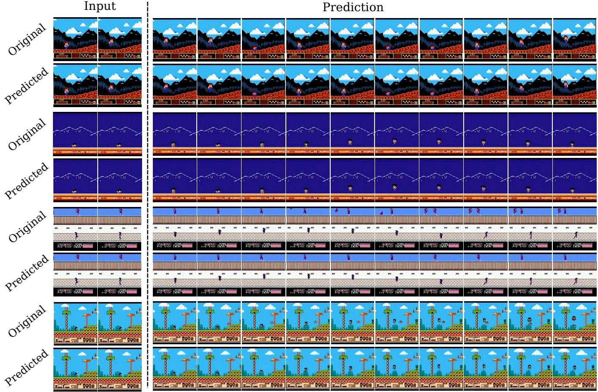  
for comparison.

Table 11. SuperMarioBros Autoregressive Quantitative Evaluation.   

<table><tr><td>Environment</td><td>Strategy</td><td>Model</td><td>FID↓</td><td>PSNR↑</td><td>SSIM↑</td><td>ΔPSNR↑</td></tr><tr><td rowspan="3">Super Mario Bros.</td><td>Random Autoregressive</td><td>GenieRedux-G-50 GenieRedux-G-50-ft</td><td>30.48 30.84</td><td>34.59 34.85</td><td>0.94 0.95</td><td>0.55 0.57</td></tr><tr><td></td><td>Tokenizer-ft</td><td>8.08</td><td>42.00</td><td>0.99</td><td>-</td></tr><tr><td rowspan="2">Exploration Autoregressive</td><td rowspan="2">GenieRedux-G</td><td>9.46</td><td>34.38</td><td>0.95</td><td>0.07</td></tr><tr><td>GenieRedux-G-50-ft</td><td>9.33</td><td>37.77 0.97</td><td>0.76</td></tr></table>

TaRxp (Exploration). GenieRedux-G denotes a non-fine-tuned model, trained with the exploration data.

<table><tr><td>Environment</td><td>Strategy</td><td>Model</td><td>FID↓</td><td>PSNR↑</td><td>SSIM↑</td><td>ΔPSNR↑</td></tr><tr><td rowspan="6">Combined Environments</td><td rowspan="2">Random</td><td>GenieRedux-G-50</td><td>43.57</td><td>27.55</td><td>0.82</td><td>0.65</td></tr><tr><td>GenieRedux-G-50-ft</td><td>43.98</td><td>27.74</td><td>0.82</td><td>0.78</td></tr><tr><td rowspan="2">Exploration</td><td>Tokenizer-ft</td><td>14.02</td><td>37.98</td><td>0.98</td><td>-</td></tr><tr><td>GenieRedux-G</td><td>14.88</td><td>28.91</td><td>0.88</td><td>0.25</td></tr><tr><td>Random Autoregressive</td><td>GenieRedux-G-50-ft</td><td>14.61</td><td>31.29</td><td>0.91</td><td>1.09</td></tr><tr><td></td><td>GenieRedux-G-50-ft</td><td>43.69</td><td>28.19</td><td>0.83</td><td>0.79</td></tr><tr><td></td><td>Exploration Autoregressive</td><td>GenieRedux-G-50-ft</td><td>14.49</td><td>33.14</td><td>0.93</td><td>1.46</td></tr></table>

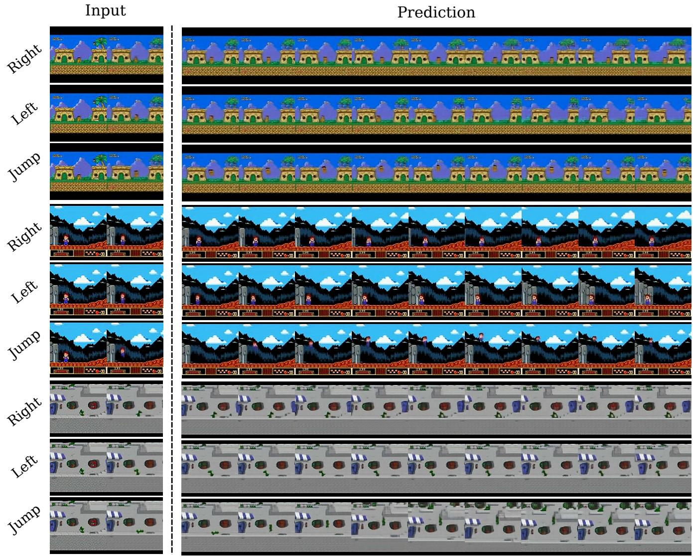  
development of the actions.

# C.3. Multi-Environment Fine-tuning

In this experiment, we take the diverse datasets, collected from the three environments we have studied - AdventureIslandII, SuperMarioBros and Smur f s, and fine-tune GenieRedux-G-50 on all of them together. In this way, we evaluate the effect of our method on multi-environment training. Results are shown in Tab. 12. Using AutoExplore Agent's data, the model has improved its visual fidelity and controllability across the test set, containing all three environments (equal number of samples each). This shows that our method is applicable for improving multi-environment training as well.

# C.4. Qualitative Evaluation of Fine-tuned Models

In Fig. 11 are shown examples per environment of predictions from a model, fine-tuned on a random agent versus a model fine-tuned on AutoExplore Agent's data. The model, trained on AutoExplore Agent's data, exhibits much higher visual quality and less artifacts. We also note that the tokenizer plays a role in improving visual quality. After exploration, the tokenizer is able to fit better to new visuals of the environment, which reduces visual artifacts. In Fig. 12 we show AutoExplore Agent's data helping to achieve better controllability compared to the random agent. As typical for controllability evaluation, we give a single frame as input. We observe that in cases where the motion is ambiguous (e.g. where a character might be going up or down), fine-tuning with exploration data leads to more confidence and hence realistic sequence generation. In contrast, models trained on random data cannot resolve the situation and copy the frame multiple times.

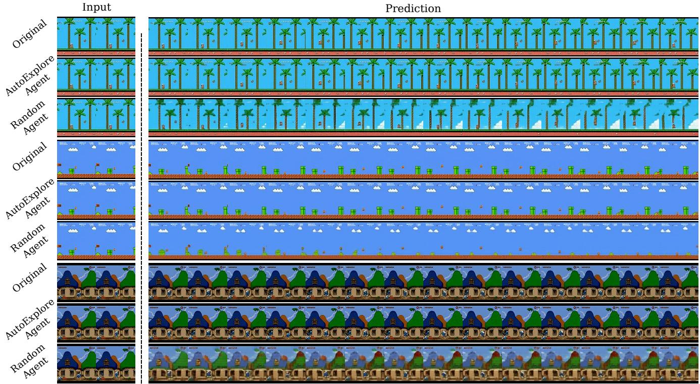  
p .

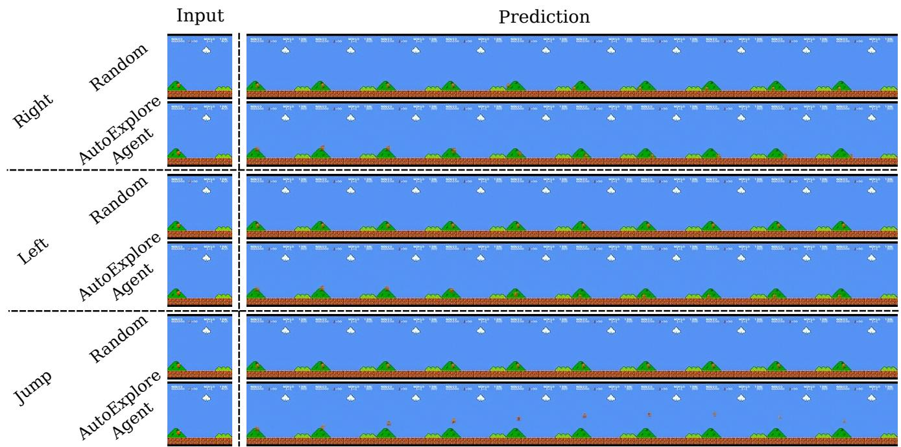  
lbi GRupetu like this where the agent can be going up or down, exploration data shows to improve performance.

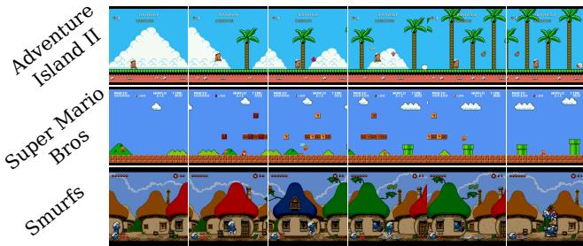  
Figure 13. AutoExplore Agent Behavior. We show the behavior of our AutoExplore Agent on the three environments studied. It can be seen that the agent learned to progress by moving right, jumping over obstacles and dealing with enemies.

# D. AutoExplore Agent Behavior Study

The agent was trained with the five actions that the world model was trained with. While initially in training the agent learns simpler strategies like jumping, eventually it achieves better returns by learning to move forwards in an environment (and reveal new scenes). To progress even further, the agent learns to overcome obstacles and enemies. In Fig. 13, we show the behavior of the agent on the three environments used after training. The agent is observed to move forward in the environment, to overcome enemies, jump over obstacles. Interestingly, the strategy in Smurfs was to sometimes wait to be attacked by an enemy, which caused the player to disappear and the camera to move before spawning. This seems to cause an increase in world model uncertainty in that environment. In other cases (flying enemies), the agent tries to avoid. In Smurfs, there is an action of entering a door. We observe that sometimes the agent enters a door that causes the character to reappear from a different side on the screen.

# E. User Studies

# E.1. General Quality User Study Details

We provide extra details about our user study to evaluate the models fine-tuned on data from a random agent and from AutoExplore Agent. In Fig. 14 we show the interface for a single sample given to the user. A clip is shown with two parts that the user should compare and rate. The order of the samples is random. The instructions given to the users at the start of the study are provided below. Thank you for participating in our study! You will watch a total of 120 video samples. Each sample consists of two clips: Top clip: Reference Bottom clip: Comparison clip

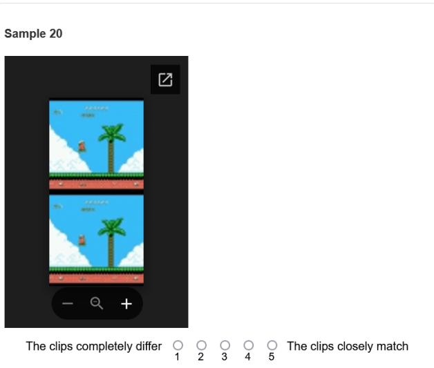  
Figure 14. General User Study Sample.

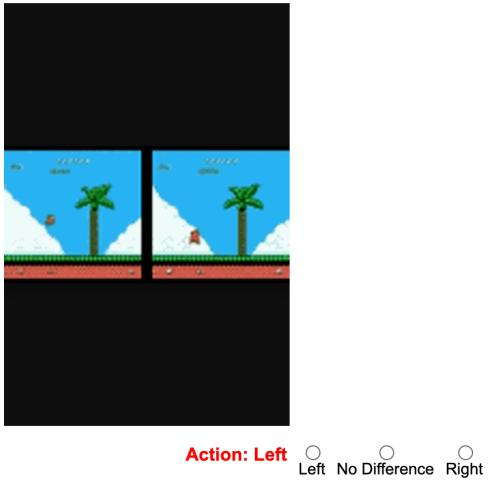  
Figure 15. Action Quality User Study Sample.

Please compare the two clips in each sample and rate how closely they match in terms of visual quality and content. Use the scale provided: 1 : The two clips completely differ in terms of visual quality and/or content   
5 : The two clips closely match in terms of visual quality and content   
Submit your rating for each sample through this form. Your feedback is important and greatly appreciated!

# E.2. Action Quality User Study Details

We conduct a second user study to specifically evaluate the gains in action quality of our model fine-tuned on data from the AutoExplore agent over the baseline. Observing that our model is particularly beneficial in scenarios with ambiguous initial frames, we use this user study to test this.

Table 13. Visual Fidelity of TA models.   

<table><tr><td rowspan="2">Model</td><td colspan="3">Basic Test Set</td></tr><tr><td>FID↓</td><td>PSNR↑</td><td>SSIM↑</td></tr><tr><td>Tokenizer-TA</td><td>12.10</td><td>39.53</td><td>0.97</td></tr><tr><td>LAM-TA</td><td>47.73</td><td>28.24</td><td>0.85</td></tr><tr><td>GenieRedux-TA</td><td>13.26</td><td>25.47</td><td>0.82</td></tr><tr><td>GenieRedux-G-TA</td><td>13.01</td><td>32.09</td><td>0.94</td></tr></table>

We use single initial frames with the agent in mid-jump. Participants interact with an interface shown in Fig.15. The user is shown pairs of synchronized videos, generated by the baseline and the exploration model (left/right position is randomized). Both videos depicted the same action — left, jump, or right—which was explicitly labeled in bold red below them. Participants were instructed to assess the quality of the action performed, disregarding any differences related purely to visual quality, and select one of the following options: •Left: The left clip depicts the action more accurately. •No Difference: Both clips depict the action equally well. •Right: The right clip depicts the action more accurately.

# F. GenieRedux Evaluation on CoinRun Case Study

In this section, we qualitatively evaluate our Genie implementation - GenieRedux and its variant GenieRedux-G on the CoinRun case study. We also quantitatively and qualitatively study the effect of using data from a trained agent in the Coinrun environment (GenieRedux and GenieReduxG). We study the behavior and limitations of the model and compare our implementation with a concurrent one.

# F.1. CoinRun Case Study Details

We train the Tokenizer and the Dynamics module on CoinRun environment datasets, one obtained from a random agent, and one obtained from a trained agent using environment reward. For training the agent for exploration, we enable velocity maps on CoinRun. These maps also need to be enabled for the agent during data collection. When evaluating models trained on different datasets (random agent vs. trained agent), to be fair, we exclude the velocity map regions by setting their pixels to black on all sets. Throughout the training, we use a batch size of 84 and a patch size of 4 for all components. We use the Adam Optimizer with a linear warm-up and cosine annealing strategy. We refer to the test set obtained from a random agent as Basic Test Set and to the one obtained from a trained agent as Diverse Test Set.

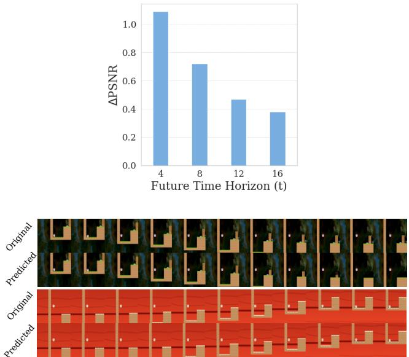  
Figure 16. GenieRedux-G-TA Controllability Across Horizons.   
Figure 17. GenieRedux Quantitative Evaluation. We present a few sequences from the test set with predictions from GenieRedux. On the example at the top we show a successful jump action. On the example at the bottom we show a successful motion progression.

# F.2. Prediction Horizon Evaluations

We evaluate the controllability of our best model (at $5 0 \mathrm { k }$ iterations) over varying prediction horizons in Fig. 16. As expected, predictions become more challenging further into the future. The first prediction is also difficult due to insufficient motion information - we obtain O0. $4 \ \Delta _ { t } \mathrm { P S N R }$ for $t = 1$ . To address this issue, we provide the model with 4 frames and actions (predicting 10), and observe an improvement of our best model (GenieRedux-G-TA) from 34.79 PSNR (12.75 FID) in our results in the main paper to 38.31 PSNR (12.29 FID) on Diverse Test Set.

# F.3. GenieRedux-G Qualitative Evaluation

In Fig. 17 we show quantitative results demonstrating that GenieRedux-G can perform motion progression and action execution.

# F.4. GenieRedux-TA Qualitative Evaluation

In Fig. 18 we demonstrate that GenieRedux-TA is able to execute actions and complete motion. In Fig. 19 we show that the model is capable of executing all actions of the environment.

# F.5. Jafar Qualitative Comparison

We compare with Jafar [68] - a concurrent with our implementation of Genie (in JAX). We obtain and train their model as instructed. We train GenieRedux with Jafar's model parameters and like them separate LAM from Dynamics in training. The latter significantly worsened GenieRedux's action representation. Despite that, GenieRedux shows significantly better visual fidelity metrics, achieving 17.91 PSNR (46.12 FID), compared to Jafar's 12.66 PSNR (154.12 FID). GenieRedux does not exhibit Jafar's artifacts or the reported problematic "hole digging" behavior. Moreover, we observe that Jafar lacks causality, which we find problematic.

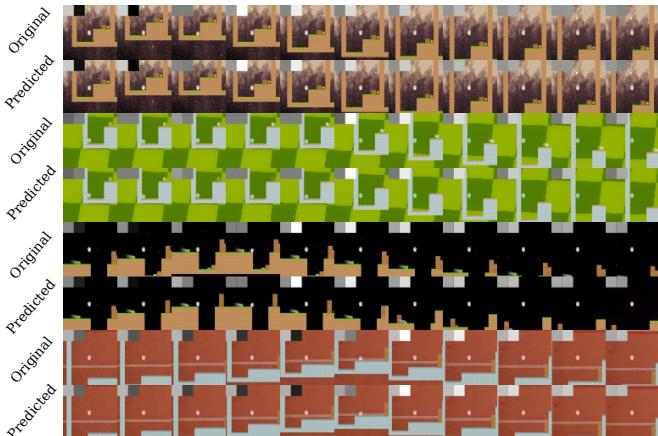  
Figure 18. GenieRedux-TA Qualitative Comparison. We present a few samples from the test set with various actions. We demonstrate that GenieRedux-TA performs the actions correctly.

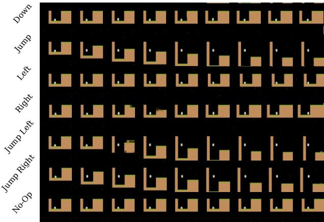  
Figure 19. GenieRedux-TA Controllability. We show predictions for all environment actions of GenieRedux-TA.

In Fig. 20 we show Jafar's reconstruction of 10 frames into the future, given the first frame and a sequence of actions. The results are on the validation set after training. We observe an abundance of artifacts. We note that if we provide the images instead of providing the first frame, we get much less artifacts. This seems to hint that Jafar relies on future images to make predictions for the current frame, which might be an inherent problem of the model not being causal.

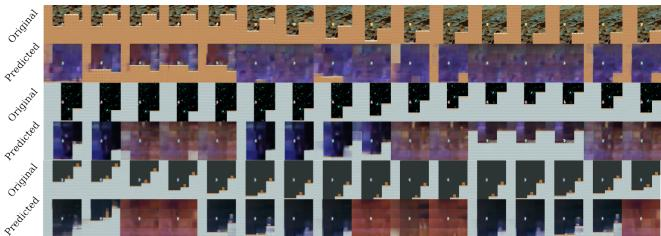  
Figure 20. Jafar Qualitative Results. The results are on the validation set. We give only a single image and actions and predict 15 frames in the future.

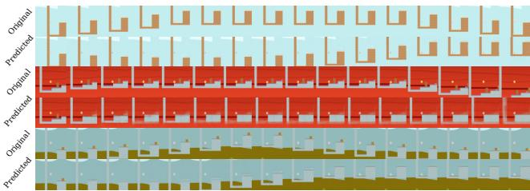  
Figure 21. GenieRedux with Jafar's Parameters Qualitative Results. We show 15 frames into the future given actions and an initial frame of our model.

We additionally report test set results for Jafar - 0.48 SSIM and for GenieRedux (with Jafar parameters) - 0.62 SSIM. In addition, we show the version of GenieRedux that we trained to match Jafar in Fig. 21. While it can be noticed that the model prefers inaction when encountering actions, it successfully progresses motion - e.g. moving a character through the air. We also notice fairly good visual quality.

# F.6. Additional GenieRedux-G-TA Qualitative Results and Limitations

We provide additional visuals of our best performing GenieRedux-G-TA in Fig. 22 and Fig. 23. We see that our model performs well under different actions and scenarios. Next, we discuss the limitations of GenieRedux-G-TA and visualize the known cases in Fig. 24. One possible failure case occurs whenever the environment state or the actions suggest that a major exploration of the environment will unfold - for example, when falling down from midjump. As the agent is only given a single frame and cannot possibly know the layout of the level, it attempts to reconstruct something that is not guaranteed to be the actual level. Often, the agent exhibits uncertainty in these cases, as shown in the results. Another possible weakness occurs whenever on the first frame a motion is already in progress - for example, in progress of jumping. In that case the model observes a single frame with the agent in the air and has no information about which direction the agent is heading - going up or going down. In that case, the model could exhibit uncertainty in the form of artifacts suggesting that the agent is both landing and jumping up, or alternatively not perform an action at all. This is a state from which the agent often recovers in a few steps. Still, we find that it can be avoided by providing more input frames to the model that can give motion information.

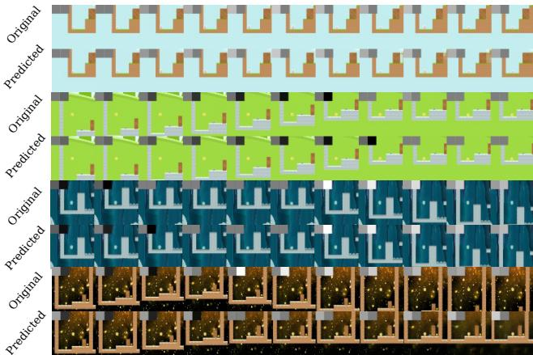  
Figure 22. GenieRedux-G-TA Extra Qualitative Results. More sampled sequences from the test set, showing good match with the ground truth when enacting actions.

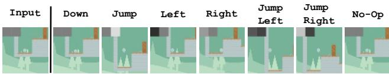  
Figure 23. GenieRedux-G-TA Controllability Demonstration. We show that GenieRedux-G is able to perform all Coinrun environment actions.

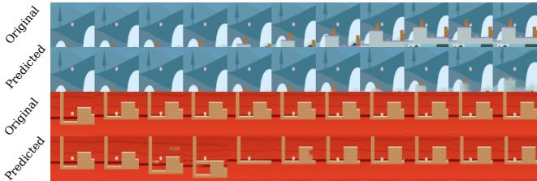  
Figure 24. GenieRedux-G-TA Limitations. Two failure cases of GenieRedux-G-TA - whenever a sizeable new unknown part of the environment is revealed; whenever an in-progress motion is ambiguous.

# References for Supplementary Material

[68] Timon Willi, Matthew Thomas Jackson, and Jakob Nicolaus Foerster. Jafar: An open-source genie reimplemention in jax. In First Workshop on Controllable Video Generation @ ICML 2024, 2024.