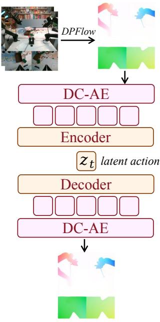
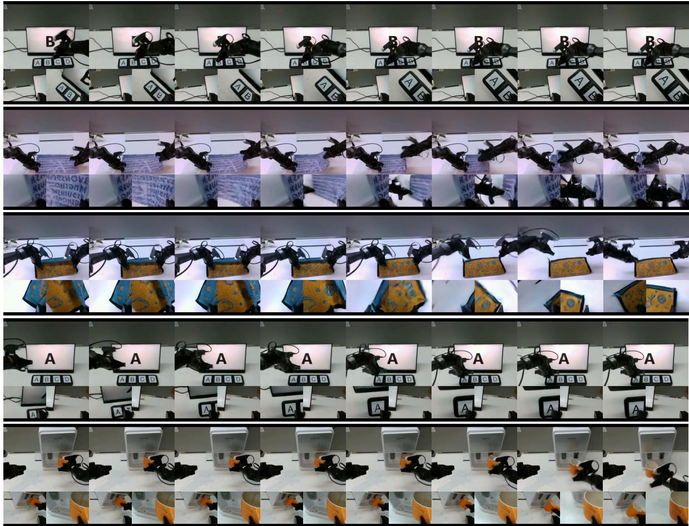
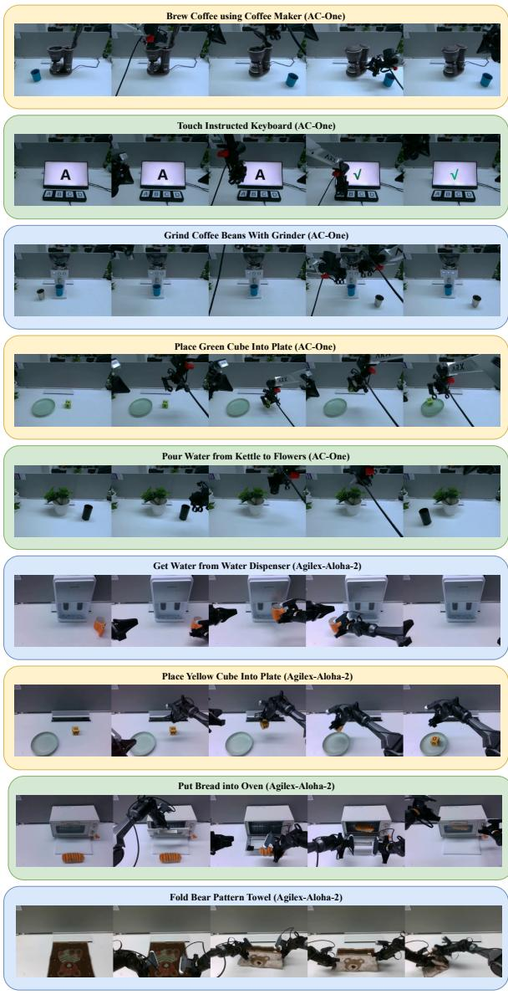
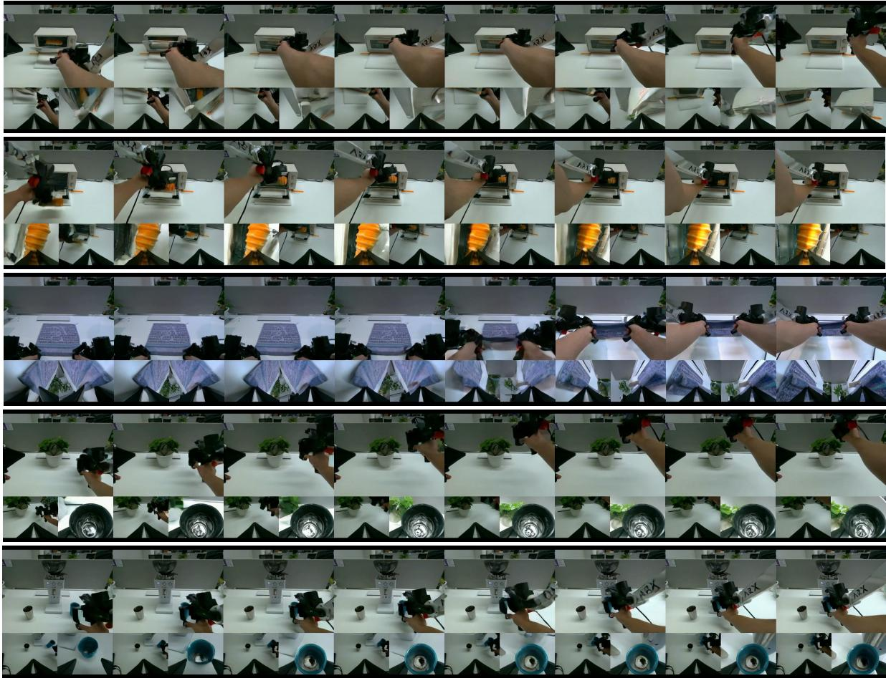
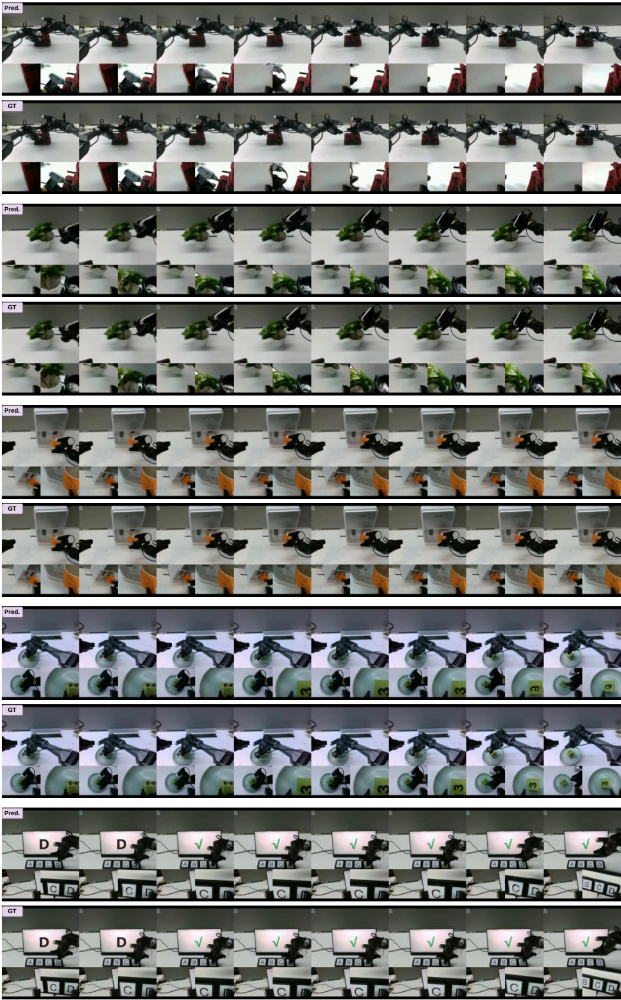
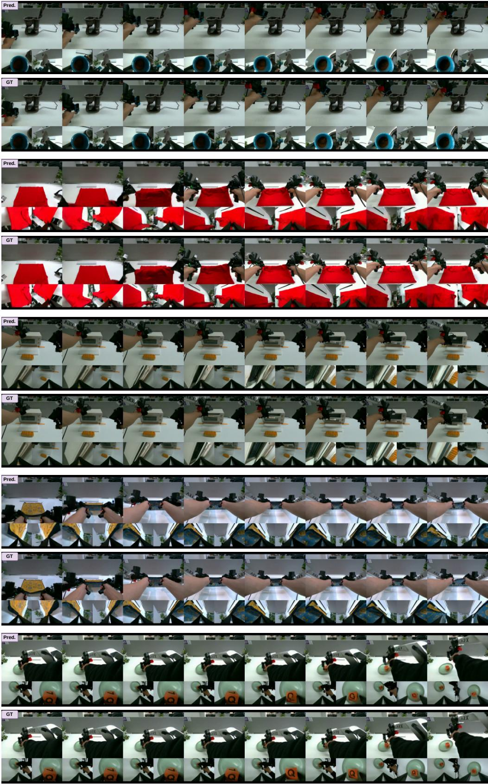
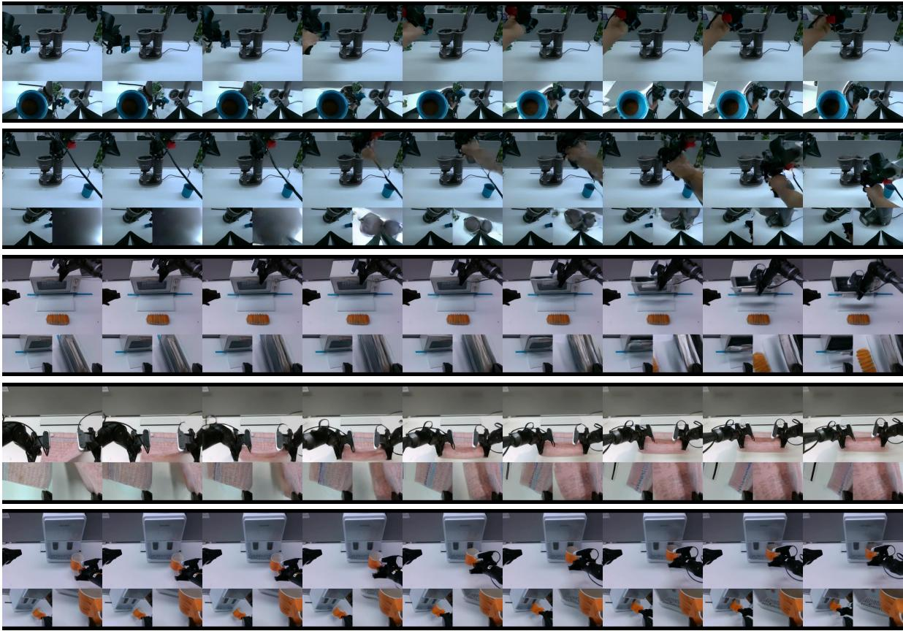

# Motus：统一潜在动作世界模型

洪哲 $\mathrm { B i ^ { 1 * \dagger } }$ , 恒凯 $\mathrm { T a n ^ { 1 * \dagger } }$ , 圣豪 $\mathrm { X i e ^ { 2 , 1 * } }$ , 只愿 王1\*, 舒赫 黄1\*, 海天 刘1\*, 若文 赵1, 瑶 风1, 辰东 向1, 银泽 荣1, 红焰 赵1, 翻宇 刘2, 智忠 $\mathrm { S u ^ { 3 } }$ , 雷 $\mathrm { { M a ^ { 2 } } }$ , 杭 $\mathrm { S u ^ { 1 } }$ , 军 朱1 1 清华大学 计算机科学与技术系，人工智能研究所，BNRist中心，THBI实验室，清华-博世联合机器学习中心 2 北京大学 3 地平线机器人 *联合第一作者 †联合项目负责人 {bhz24, thj23}@mails.tsinghua.edu.cn, dcszj@tsinghua.edu.cn 项目主页: https://motus-robotics.github.io/motus

# 摘要

虽然通用的具身智能体必须作为一个统一系统运行，但当前的方法主要基于孤立的模型来进行理解、世界建模和控制。这种碎片化阻碍了多模态生成能力的统一，且妨碍了从大规模异构数据中学习。在本文中，我们提出了Motus，一个统一的潜在动作世界模型，它利用现有的一般预训练模型和丰富可共享的运动信息。Motus引入了一种混合变换器（Mixture-of-Transformer, MoT）架构，以整合三个专家（即理解、视频生成和动作），并采用UniDiffuser风格的调度器，以实现不同建模模式（即世界模型、视觉-语言-动作模型、逆动力学模型、视频生成模型和视频-动作联合预测模型）之间的灵活切换。Motus进一步利用光流来学习潜在动作，并采用一种具有三阶段训练流程和六层数据金字塔的方案，从而提取像素级“增量动作”，并实现大规模动作预训练。实验表明，Motus在模拟环境中相较于最先进的方法取得了优越的表现（相较于$X \cdot$ VLA提高了$a + I S \%$，相较于$\pi _ { 0 . 5 }$提高了$a + 4 5 \%$），在真实世界场景中的表现也有提升（提高了$+ I I { \sim } 4 8 \%$），显示出统一建模所有功能和先验对下游机器人任务的显著益处。

# 1. 引言

一个统一模型对于具身智能体至关重要，以便将一系列认知功能整合为一个统一的整体——包括理解场景和指令、想象可能的未来、预测后果以及生成行动。然而，现有的方法将这些能力孤立建模：一些依赖于视觉-语言-行动模型（VLAs）从视觉和语言中学习静态策略；其他则使用世界模型或基于预测未来的生成方法；而 $\mathcal { F } _ { 1 }$ 通过明确想象未来视觉观察，将 VLAs 和逆动力学模型（IDMs）结合起来，但它排除了世界模型或视频生成模型（VGMs），导致未能实现完整统一。这些方法将本应为一个统一系统的能力分割为五个独立的建模任务：

VLA: $p ( \pmb { a } _ { t + 1 : t + k } \mid \pmb { o } _ { t } , \ell )$ 。WM: $p \big ( \pmb { o } _ { t + 1 : t + k } \mid \pmb { o } _ { t } , \pmb { a } _ { t + 1 : t + k } \big )$ 。IDM: $p ( \pmb { a } _ { t + 1 : t + k } \mid \pmb { o } _ { t : t + k } )$ 。VGM: $p ( \pmb { o } _ { t + 1 : t + k } \mid \pmb { o } _ { t } , \ell )$ 。视频-动作联合预测模型: $p ( \pmb { o } _ { t + 1 : t + k } , \pmb { a } _ { t + 1 : t + k } \mid \pmb { o } _ { t } , \ell )$ 。两个根本挑战（详见第3节）阻碍了这些能力的整合。首先，将这些多模态生成能力统一在一个框架内并非易事。虽然统一世界模型（UWMs）[64]提供了理论原型，但它们通常是从零开始训练或仅有有限的先验，不具备来自视觉-语言模型（VLMs）的强大视觉-语言理解或来自视觉生成模型（VGMs）的丰富物理交互知识。其次，具身智能要求能够从大规模异构数据中学习，包括网络视频、自我中心的人类演示和多机器人轨迹——但不同具身体的动作空间差异很大，且大多数视频数据缺乏动作标签，这使得很难以通用运动和交互的先验知识预训练动作专家。为了解决这些挑战，我们提出了Motus，一种统一的潜在动作世界模型，在混合变换器（MoT）架构中整合了预训练专家。我们的方法通过共享的多头自注意力层，将视频生成器（生成专家）、动作专家和视觉-语言理解专家连接起来，从而统一了5个关键分布——我们称之为三模型联合注意（Tri-model Joint Attention）的设计，这保留了专门的功能，同时实现跨模态知识的融合。为了进一步协调多模态生成，Motus结合了一种类似于UniDiffuser的调度器，为每种模态（例如，视频和动作）分配不同的时间步和噪声规模。这使得以统一的方式同时建模边际、条件和联合分布，以及在不同推理模式（例如，VLA、WM、IDM、VGM、视频-动作联合预测模型）之间自适应切换。

  
Figure 1. Motus Architecture. Here, $a _ { t } \ldots a _ { t + k }$ are actions, $z _ { t } \ldots z _ { t + k }$ are latent actions, and $\tau _ { v }$ and $\tau _ { a }$ are the rectified flow timesteps for the video generation model and the action expert, respectively.

此外，为了在大规模上利用异构数据，我们引入了潜在动作，该动作通过光流编码运动模式，作为像素级的“增量动作”。这种表示将视觉动态与控制信号相结合，使得动作专家能够在多样的无标签视频和机器人轨迹上进行预训练。具体而言，使用一个预训练的深度压缩自编码器（DC-AE）及额外的轻量级下采样模块来重构光流，同时对其编码的低维潜变量进行少量动作标签的监督，这些标签包括与任务相关和与任务无关的，从而将注意力引导到与机器人活动相关的模式上。随后，Motus经历一个三阶段预训练-微调流程（即视频预训练、潜在动作预训练和具身特定动作微调），在一个跨越网络规模、以自我为中心的人类、模拟、与任务无关的、多机器人和目标机器人数据的六层数据金字塔上进行训练。该方法在光流描述的运动空间内对不同具身体之间的行为进行对齐，并将这种交互知识共享给目标具身体，以增强下游任务的泛化能力，从而使动作专家像其他专家一样获得预训练。总体而言，我们的贡献可以总结如下： • 一个统一的具身基础模型，整合了五种主流范式（即WMs、IDMs、VLAs、VGMs和视频-动作联合预测模型），而不妥协于一般多模态先验。 • 一个可扩展的机器人训练方案，具有三阶段训练流程和六层数据金字塔，利用基于光流的潜在动作学习跨具身可转移的运动知识。 • 大量实验表明，Motus在模拟（相较于X-VLA [60]提升$+15\%$，相较于$\pi_{0.5}$ [8]提升$+45\%$）和现实场景（提升$+11 \sim 48\%$）中显著超越了最先进的方法，证明大规模的一般与领域特定先验可以有效融合，以增强策略学习的泛化能力。

# 2. 相关工作

# 2.1. 统一多模态模型

统一的多模态模型在单一生成框架内联合建模各种模态和任务，展现了在多个领域的广泛应用。特别是，Bagel通过MoT实现统一，共享理解专家和生成专家之间的多头自注意力层。相比之下，现有的具身基础模型是独立开发的，产生了多个不同的范式：一些利用视觉语言模型的文本-图像理解能力来学习动作预测，而另一些则利用视觉生成模型生成视频序列并从连续帧中推断动作。最近，$\mathcal { F } _ { 1 }$扩展了视觉语言代理，通过独立决策模型明确想象未来的视觉状态并输出动作，从而将两种模型合并。此外，UWM在单一扩散主干网络中统一了工作模型、视觉语言代理、独立决策模型、视觉生成模型和视频-动作联合预测模型，实现了对完整机器人模型的初步探索。与UWM不同，我们的方法超越了统一建模，进一步结合了互联网规模的一般多模态先验和来自庞大机器人轨迹的专门先验。

# 2.2. 潜在动作模型

潜在动作通过捕捉视觉动态来缓解动作标签的稀缺性，通常是通过将内隐动态模型（IDMs）与前向动态模型（FDMs）结合来重建基于前一个帧的下一个帧。最初，使用RGB图像进行监督，但这会引入与任务无关的外观信息。为了消除这种干扰，一种常见的方法是限制自编码器的容量，以编码低维潜变量，从而减少冗余的包含。AdaWorld尝试解耦表示，例如$\beta$-VAE，以仅保留有用的因素。其他方法探索替代的重建目标，如DINOv2特征、物体关键点和语言指令，这些都包含丰富的语义和空间特征。此外，LAOM使用少量动作标签来鼓励模型专注于机器人活动。在这些进展的基础上，并受到光流作为通用运动表达的启发，我们使用光流来对齐跨实体的行为并学习潜在动作，以促进大规模的预训练。

# 3. 问题表述与挑战

具身策略 我们考虑语言条件下的机器人操控任务。对于每个具身实例，该任务定义一个动作 $\mathbf { \pmb { a } } \in \mathcal { A }$ ，一个观察 $\mathbf { \sigma } _ { o \mathrm { ~ \in ~ } \mathcal { O } }$ （视觉输入），一个语言指令 $\ell \in \mathcal L$ ，以及机器人的本体感知 $\pmb { p }$ ，其中 $\mathcal { A }$ 、 $\mathcal { O }$ 和 $\mathcal { L }$ 分别表示动作空间、观察空间和语言指令空间。该任务通常提供一个专家数据集 ${ \cal D } _ { \mathrm { e x p e r t } } = \{ \{ \ell , p _ { 1 } , o _ { 1 } , a _ { 1 } , \ldots , p _ { N } , o _ { N } , a _ { N } \} \}$ ，该数据集包含在 $N$ 个时间步中由专家收集的机器人本体感知、视觉观察和动作，并为每条轨迹提供相应的语言注释。我们在 $D _ { \mathrm { e x p e r t } }$ 上训练一个由 $\theta$ 参数化的策略。在每个时间步 $t$ ，策略根据当前的观察和本体感知预测下 $k$ 个动作（动作分块 [59]），建模分布 $p _ { \theta } ( \pmb { a } _ { t + 1 : t + k } \mid \pmb { o } _ { t } , \pmb { p } _ { t } , \ell )$ 或 $p _ { \theta } ( \pmb { a } _ { t + 1 : t + k } \mid \pmb { o } _ { t } , \ell )$ 。策略 $p _ { \theta }$ 被训练以最大化似然目标：

$$
\operatorname* { m a x } _ { \theta } \ \mathbb { E } _ { ( o _ { t } , p _ { t } , a _ { t + 1 : t + k } , \ell ) \sim D _ { \mathrm { e x p e r t } } } \log p _ { \theta } ( a _ { t + 1 : t + k } \mid o _ { t } , p _ { t } , \ell ) .
$$

此外，基于上述符号定义，我们可以推导出现有智能五种建模类型的概率分布，这些分布可以集成到一个单一模型中进行训练：

VLA: $p ( \pmb { a } _ { t + 1 : t + k } \mid \pmb { o } _ { t } , \ell )$ 。WM: $p \big ( \pmb { o } _ { t + 1 : t + k } \mid \pmb { o } _ { t } , \pmb { a } _ { t + 1 : t + k } \big )$ 。IDM: $p ( \pmb { a } _ { t + 1 : t + k } \mid \pmb { o } _ { t : t + k } )$ 。VGM: $p ( \pmb { o } _ { t + 1 : t + k } \mid \pmb { o } _ { t } , \ell )$ 。视频-动作联合预测模型: $p ( \pmb { o } _ { t + 1 : t + k } , \pmb { a } _ { t + 1 : t + k } \mid \pmb { o } _ { t } , \ell )$ 。

挑战一：统一多模态生成能力。一个能够胜任的具身智能体必须整合一系列认知功能——从理解场景和指令、想象可能的未来，到预测结果和生成动作——以拥有接近人类的能力，作为一个统一的整体。然而，目前的模型是碎片化的，无法在一个系统中捕捉到所需能力的完整集合。这提出了一个挑战：如何在一个统一框架内统一建模五个关键分布——VLA、世界模型、IDM、视频生成模型和视频-动作联合预测模型。尽管先前的工作，如 UWMs [64]，在这方面取得了一定进展，但仍然存在一个关键限制：这些方法要么是从头开始训练，要么是基于较小的基础模型构建，或者——即使在某种程度上融入了一些先验——也总是缺乏知识的全谱，要么缺少来自 VLM 的视觉理解先验，要么缺少来自 VGM 的物理交互先验。因此，它们缺乏形成稳健和可推广的具身智能所需的全面世界知识。因此，在统一框架内联合建模视觉、语言和行动的各种分布这一非平凡的挑战尚未得到解决，这正是我们工作的切入点。挑战二：利用异构数据。具身智能中的一个核心挑战是如何有效利用大规模的异构数据。不同具身体之间的动作空间在维度、范围和语义上差异很大，机器人在形态、驱动和感知上也存在不同。因此，控制信号不能直接重用，策略难以学习能够跨具身体转移的通用先验。现有的研究方法，包括 [8, 31, 43, 60]，试图通过使用通用主干网络并注入具身特定信息，或构建高维动作向量强行统一不同的具身体来解决这个问题。然而，它们仍然主要依赖于标注的机器人轨迹，并无法将这些数据集与缺乏动作注释但包含丰富运动和物理交互线索的大规模网络视频或自我中心的人类视频进行整合。这一限制阻碍了动作专家的大规模预训练，并降低了学习通用运动先验的能力。

# 4. 方法论

# 4.1. 动力学

模型架构。为了解决第3节中提出的统一多模态生成能力的挑战，我们提出了Motus，一个统一的潜在动作世界模型。首先，Motus被设计为一个通用的生成模型，通过在异构多模态数据上联合学习，从而在单一网络中整合通用系统的多样化能力（例如，建模5个分布）。其次，为了避免对不切实际的对齐多模态数据量的需求，Motus利用了现有基础模型的丰富预训练先验。它结合了一个预训练的VGM（生成专家）、一个具有预训练VLM的理解专家，以及一个在混合变换器（MoT）架构中的动作专家（如图1所示），有效融合了它们的互补优势——涵盖场景理解、指令解析、后果预测、未来视频想象和行动规划——而无需从头进行完整端到端训练。与简单地将观察令牌和动作令牌串联并通过一系列$N$个UWM块（包含自注意力和前馈网络（FFN）层）处理的统一世界模型（UWMs）[64]不同，我们的方法通过采用MoT结构，利用预训练的VLM和VGM。在我们的模型中，每个专家维护一个独立的变换器模块，而多头自注意力层则被串联，即三模型联合注意力。这不仅保留了专家之间不同的功能角色，避免了任务干扰，还促进了有效的跨模态特征融合，鼓励多样化的预训练知识相互补充。在训练过程中，Motus共同预测视频和动作块，采用修正的基于流的目标：

$$
l _ { \mathrm { a c t i o n } } ^ { \theta } = \mathbb { E } _ { ( o _ { t : t + k } , a _ { t + 1 : t + k } , \ell ) \sim \mathcal { D } } \big \| v _ { a } ^ { \theta } - ( \epsilon _ { a } - \pmb { a } _ { t + 1 : t + k } ) \big \| _ { 2 } ^ { 2 } ,
$$

$$
\begin{array} { r l } & { l _ { \mathrm { o b s } } ^ { \theta } = \mathbb { E } _ { ( o _ { t : t + k } , a _ { t + 1 : t + k } , \ell ) \sim \mathcal { D } } \big \| v _ { o } ^ { \theta } - \big ( \epsilon _ { o } - o _ { t + 1 : t + k } \big ) \big \| _ { 2 } ^ { 2 } , } \\ & { \quad \quad \quad \quad \tau _ { o } \sim \mathcal { U } ( 0 , T _ { \tau } ) } \\ & { \quad \quad \quad \quad \epsilon _ { o } \sim \mathcal { N } ( \mathbf { 0 } , I ) } \end{array}
$$

$$
l ^ { \theta } = l _ { \mathrm { a c t i o n } } ^ { \theta } + l _ { \mathrm { o b s } } ^ { \theta } .
$$

其中 $\mathbf { } _ { o _ { t } }$ 是条件框架，$\pmb { O } _ { t + 1 : t + k } , \pmb { a } _ { t + 1 : t + k }$ 是子区域和行动，$\tau _ { a }$ 和 $\tau _ { o }$ 是 $\epsilon _ { a }$ 和 $\epsilon _ { o }$ ，$v _ { a } ^ { \bar { \theta } } , v _ { o } ^ { \theta }$，$l _ { a c t i o n } ^ { \theta }$ ，$l _ { o b s } ^ { \theta }$ 是观测和行动的损失。通过为视频和行动分配不同的时间步长和噪声尺度，Motus 建立了类似 UniDiffuser 的调度器，以捕捉异构数据分布，并在推理过程中自适应切换各种具体化基础模型（例如 VLA、世界模型、IDM、VGM、联合预测）。所得模型能够理解场景、遵循指令、预测结果、想象未来，并输出行动——所有这些都在统一的多模态架构内实现。

  
Figure 2. Action-Dense Video-Sparse Prediction. The sampling rates for video frames and actions differ.

动作密集型视频稀疏预测。由于我们的模型基于广泛引用的动作分块技术，Motus 需要预测未来视频和动作序列 $\pmb { O } _ { t + 1 : t + k } , \pmb { a } _ { t + 1 : t + k }$。这导致了几个问题：（1）训练和推理效率低，（2）冗余视频帧预测，以及（3）三模态联合注意机制中的不平衡——其中视频标记的数量显著超过动作标记。这种不平衡导致模型对视频预测过拟合，从而削弱了其动作预测能力。为了解决这些问题，我们提出了一种动作密集型视频稀疏预测策略，如图 2 所示。在训练和推理过程中，我们对视频帧进行下采样，使视频标记和动作标记的数量保持平衡——例如，将视频帧率设置为动作帧率的六分之一。专家细节。对于生成专家，我们使用 Wan 2.2 5B [42] 作为视频基础模型，因为它的可访问性和易用性。我们扩展其自注意上下文，以创建跨模态三模态联合注意机制。对于动作专家，我们构建一个与 Wan 同样深度的 Transformer 块。每个块包含用于注入修正流时间步的 AdaLN、一个前馈网络 (FFN) 以及用于跨专家交互的三模态联合注意。我们选择 Qwen3-VL-2B [2, 3, 44] 作为理解专家，因为其在 3D 定位、空间理解和精确物体定位方面的固有能力，这对于机器人操作至关重要。该专家的输入来自于 VLM 的最后一层对应标记。理解专家本身由多个 Transformer 块组成，每个块包含层归一化、一个 FFN 和三模态联合注意。

# 4.2. 潜在动作

我们进一步解决挑战 2，以通过直接从视觉动态中学习可推广的动作模式来利用大规模异构数据。具体而言，我们引入了潜在动作，这些动作编码了从像素直接学习到的运动。这些潜在动作使得模型能够从各种来源吸收运动知识，例如互联网视频、自我中心的人类示范和多机器人轨迹，从而增强了即使在没有明确动作标签的数据上，动作专家的预训练。光流基表示。我们采用光流作为运动的自然表示，它捕捉到连续帧之间的像素级位移。具体而言，光流通过 DPFlow [33] 计算，并随后转换为 RGB 图像。为了将这种高维表示压缩到控制级空间中，我们采用深度卷积变分自编码器（DC-AE [13]），该编码器在编码过程中重构流，同时将其编码为四个 512 维的词元。然后，轻量级编码器将这些拼接的 $4 \times 5 1 2$ 特征投影到一个 14 维向量中，粗略匹配典型机器人动作空间的尺度。整体架构如图 3 所示。这种维度对应关系确保潜在表示能够与真实机器人控制自然对齐，并充当感知与动作之间的桥梁。训练和分布对齐。为了帮助将潜在空间与现实动作空间对齐，我们结合了任务无关的数据，遵循 AnyPos [39]。具体而言，任务无关的数据使用 Curobo 随机采样目标机器人动作空间，以任务无关的方式收集图像-动作对。这些数据提供了额外的真实动作监督，帮助变分自编码器学习反映可行运动行为的嵌入，并将潜在动作锚定在真实控制分布上。在训练过程中，我们将 $90 \%$ 的无标签数据用于自监督重构与 $10 \%$ 的标记轨迹进行弱动作监督，其中标记部分包括任务无关的数据和标准机器人示范。维度对应关系和弱动作监督共同驱动潜在动作分布与真实动作分布对齐，使得从视频中学习的运动先验能够自然映射到可执行控制。总损失结合了重构、对齐和 KL 正则化：

$$
\mathcal { L } = \mathcal { L } _ { \mathrm { r e c o n } } + \lambda _ { a } | | a _ { \mathrm { r e a l } } - a _ { \mathrm { p r e d } } | | ^ { 2 } + \beta \mathcal { L } _ { \mathrm { K L } } ,
$$

其中 $L _ { \mathrm { r e c o n } }$ 最小化流重建误差，第二项对齐潜在行为和真实行为，$L _ { \mathrm { K L }$} 对潜在空间进行正则化；$\lambda _ { a }$ 和 $\beta$ 是超参数。

  
Figure 3. The Latent Action VAE.

# 4.3. 模型训练与数据

Motus训练。Motus经过三个结构化阶段（表1）的训练，逐步将来自不同数据集的物理交互先验整合为可转移到目标机器人的策略。每个阶段解决一个关键挑战：•阶段1：学习视觉动态。为了使模型在真实的物理交互中扎根，我们首先使用多机器人轨迹和人类视频对视频生成模型（VGM）进行调整。这使VGM能够根据语言指令和初始图像生成可行的任务未来视频序列。•阶段2：学习动作表示。为了将视觉预测与控制桥接起来，我们在视频、语言和潜在动作上对整个Motus模型（保持VLM不变）进行预训练。此阶段通过将运动和交互的知识嵌入到潜在动作空间来初始化动作专家。•阶段3：针对目标机器人进行专业化。我们通过在目标机器人数据上进行微调来最终确定模型，确保获得的先验完全适应特定实体的动态和运动学。

Table 1. Motus Training.   

<table><tr><td>Stage</td><td>Data</td><td>Training</td></tr><tr><td>Pretrained Foundation Models (Off-the-shelf)</td><td>Level 1: Web Data</td><td>VGM and VLM</td></tr><tr><td>Stage 1 (Video Generation)</td><td>Level 2: Egocentric Human Videos Level 3: Synthetic Data Level 5: Multi-Robot Task Trajectory Data</td><td>Only VGM</td></tr><tr><td>Stage 2 (Unified Training with Latent Actions)</td><td>Level 2: Egocentric Human Videos Level 3: Synthetic Data Level 4: Task-agnostic Data Level 5: Multi-Robot Task Trajectory Data</td><td>Motus (all 3 experts, with latent actions)</td></tr><tr><td>Stage 3 (SFT)</td><td>Level 6: Target-Robot Task Trajectory Data</td><td>Motus (all 3 experts, with actions)</td></tr></table>

数据。为使机器人具备可推广的操作技能，我们利用大规模的多模态数据，这些数据涵盖了丰富的先验知识——从语义理解、物理推理到时空动态和决策制定。如第3节所述，具身数据本质上跨越了多种模态：语言 $\ell$ 、图像 $^ o$ 和动作 $\mathbf { \delta } _ { \mathbf { \alpha } \mathbf { \alpha } \mathbf { \alpha } } ^ { a ^ { 1 } }$ 。通过考虑每种模态的存在与否，我们系统性地识别出所有有意义的数据类型2： • 语言 $^ +$ 图像 ${ \mathfrak { s e } } + \mathbf { A } \mathbf { c } { \mathfrak { z } }$ 轨迹：机器人轨迹（例如，用于VLAs），$\left\{ \ell , \pmb { o } _ { 1 } , \pmb { a } _ { 1 } , \ldots , \pmb { o } _ { N } , \pmb { a } _ { N } \right\}$ 。 • 语言 $^ +$ 图像：视频序列 $\{ \ell , o _ { 1 } , \ldots , o _ { N } \}$ 或图像-文本对 $\{ ( o , \ell ) \}$ 。图像 $^ +$ 动作：任务无关的交互数据 $\left\{ \left( \pmb { o } _ { 1 } , \pmb { a } _ { 1 } , \dots , \pmb { o } _ { i } , \pmb { a } _ { i } \right) \right\}$ 。仅语言：文本语料库 $\{ \ell \}$ 。我们排除了缺乏视觉模态的数据（例如，语言 $^ +$ 动作），因为它不适合视觉运动策略学习。剩余类型形成了具身策略获取的有用来源的完整谱系。为组织这种多样性，我们引入具身数据金字塔（图4），它按照丰富性和策略相关性对数据类型进行分层组织。我们的框架有效地整合并对齐所有六个数据层次——从大规模但间接的网络来源到有针对性的机器人演示——跨越定制的训练阶段（表1），在单一统一的模型架构中融合异构数据集 [1, 14, 24, 31, 48] 。

  
Figure 4. The Embodied Data Pyramid categorizes data into six levels, from Level 1 at the base to Level 6 at the top. Data quantity decreases from bottom to top, while data quality increases. The order of Levels 3 and 4 may sometimes vary.

# 5. 实验

我们进行广泛的实验，以评估Motus在模拟和现实环境中的有效性。

# 5.1. 基准线

我们将Motus与几种最先进的方法进行比较：$\pi _ { 0 . 5 }$ [8]和X-VLA [60]。我们在仿真环境中评估了所有模型，并进一步评估基线模型$\pi _ { 0 . 5 }$在实际任务中的性能。我们还将从头训练和仅在第一阶段训练的模型与我们的模型进行了比较。

# 5.2. 仿真环境中的评估

我们在随机场景中评估了RoboTwin 2.0任务中50个代表性操作任务的单任务性能。为了探究我们方法的通用能力，我们开展了多任务训练：Motus及所有基线模型在干净场景中收集的2500个示例（每个任务50个）以及在高度随机化场景中收集的25000个示例（每个任务500个）上进行训练。这些随机化包括随机背景、杂乱的桌面、桌面高度扰动和随机光照。所有模型在RoboTwin数据集上从预训练检查点出发进行了40k步的微调，我们通过在100次执行试验中测量每个任务的成功率来评估性能。

Table 2. Evaluation on RoboTwin 2.0 Simulation (Clean vs Randomized, ${ \mathfrak { s o } } +$ tasks).   

<table><tr><td>Simulation Task</td><td colspan="2">π0.5</td><td colspan="2">X-VLA</td><td colspan="2">w/o Pretrain</td><td colspan="2">Stagel</td><td colspan="2">Motus</td></tr><tr><td></td><td>Clean</td><td>Rand.</td><td>Clean</td><td>Rand.</td><td>Clean</td><td>Rand.</td><td>Clean</td><td>Rand.</td><td>Clean</td><td>Rand.</td></tr><tr><td>Place Dual Shoes</td><td>12%</td><td>7%</td><td>79%</td><td>88%</td><td>78%</td><td>80%</td><td>94%</td><td>94%</td><td>93%</td><td>87%</td></tr><tr><td>Move Stapler Pad</td><td>16%</td><td>18%</td><td>78%</td><td>73%</td><td>49%</td><td>37%</td><td>75%</td><td>68%</td><td>83%</td><td>85%</td></tr><tr><td>Stack Blocks Two</td><td>48%</td><td>56%</td><td>92%</td><td>87%</td><td>96%</td><td>94%</td><td>99%</td><td>99%</td><td>100%</td><td>98%</td></tr><tr><td>Scan Object</td><td>42%</td><td>38%</td><td>14%</td><td>36%</td><td>42%</td><td>50%</td><td>56%</td><td>69%</td><td>67 %</td><td>66%</td></tr><tr><td>Place Object Stand</td><td>74%</td><td>65%</td><td>86%</td><td>88%</td><td>91%</td><td>93%</td><td>93%</td><td>96%</td><td>98%</td><td>97%</td></tr><tr><td>Place Fan</td><td>25%</td><td>36%</td><td>80%</td><td>75%</td><td>77%</td><td>85%</td><td>77%</td><td>85%</td><td>91%</td><td>87%</td></tr><tr><td>Move Pillbottle Pad</td><td>33%</td><td>29%</td><td>73%</td><td>71%</td><td>83%</td><td>83%</td><td>96%</td><td>90%</td><td>93%</td><td>96%</td></tr><tr><td>Pick Dual Bottles</td><td>10%</td><td>6%</td><td>47%</td><td>36%</td><td>58%</td><td>68%</td><td>7%</td><td>17%</td><td>96%</td><td>90%</td></tr><tr><td>Blocks Ranking Rgb ...50 tasks)</td><td>43%</td><td>35%</td><td>83%</td><td>83%</td><td>92%</td><td>88%</td><td>97%</td><td>98%</td><td>99%</td><td>97%</td></tr><tr><td>Turn Switch</td><td>5%</td><td>6%</td><td>40%</td><td>61%</td><td>69%</td><td>60%</td><td>59%</td><td>64%</td><td>84%</td><td>78%</td></tr><tr><td>Pick Diverse Bottles</td><td>5%</td><td>3%</td><td>58%</td><td>36%</td><td>53%</td><td>62%</td><td>18%</td><td>18%</td><td>90%</td><td>91%</td></tr><tr><td>Place Bread Basket</td><td>48%</td><td>56%</td><td>81%</td><td>71%</td><td>73%</td><td>83%</td><td>89%</td><td>87%</td><td>91%</td><td>94%</td></tr><tr><td>Stack Blocks Three</td><td>15%</td><td>16%</td><td>6%</td><td>10%</td><td>71%</td><td>76%</td><td>99%</td><td>95%</td><td>91%</td><td>95%</td></tr><tr><td>Put Bottles Dustbin</td><td>12%</td><td>9%</td><td>74%</td><td>77%</td><td>36%</td><td>33%</td><td>34%</td><td>24%</td><td>81%</td><td>79%</td></tr><tr><td>Place Can Basket</td><td>19%</td><td>25%</td><td>49%</td><td>52%</td><td>46%</td><td>62%</td><td>66%</td><td>55%</td><td>81%</td><td>76%</td></tr><tr><td>Stamp Seal</td><td>36%</td><td>23%</td><td>76%</td><td>82%</td><td>80%</td><td>88%</td><td>93%</td><td>95%</td><td>93%</td><td>92%</td></tr><tr><td>Hanging Mug</td><td>3%</td><td>3%</td><td>23%</td><td>27%</td><td>14%</td><td>10%</td><td>37%</td><td>25%</td><td>38%</td><td>38%</td></tr><tr><td>Handover Block</td><td>18%</td><td>19%</td><td>73%</td><td>37%</td><td>34%</td><td>15%</td><td>55%</td><td>55%</td><td>86%</td><td>73%</td></tr><tr><td>Stack Bowls Three</td><td>33%</td><td>35%</td><td>76%</td><td>86%</td><td>90%</td><td>74%</td><td>86%</td><td>83%</td><td>79%</td><td>87%</td></tr><tr><td></td><td>43%</td><td>36%</td><td>44%</td><td>39%</td><td>74%</td><td>75%</td><td>76%</td><td>80%</td><td>81%</td><td>87%</td></tr><tr><td>Place Object Basket Open Microwave</td><td>35%</td><td>37%</td><td>79%</td><td>71%</td><td>83%</td><td>82%</td><td>82%</td><td>84%</td><td>95%</td><td>91%</td></tr><tr><td>Average (%)</td><td>42.98</td><td>43.84</td><td>72.80</td><td>72.84</td><td>72.8</td><td>77.00</td><td>82.86</td><td>81.86</td><td>88.66</td><td>87.02</td></tr></table>

该基准测试具有特别的挑战性和信息量，因为它包含多种任务场景和随机指令，测试模型处理各种操作环境的能力。其强大的背景和环境变异性进一步评估了在分布变化下的泛化能力。此外，所有模型在其预训练检查点基础上仅允许进行 40k 次微调步骤，这为不同预训练策略的有效性提供了严格而公平的评估。如表 2 所示，Motus 在 RoboTwin 2.0 随机多任务设置上实现了最先进的性能，与 $\pi _ { 0 . 5 }$ 模型相比，绝对提升超过 $45 \%$。通过使用统一的 MoT 模型，Motus 成功整合了视觉、语言和动作生成，解决了挑战 1。在挑战 2 中，引入潜在动作使 Motus 能够有效利用标记和大规模未标记数据，提升了在不同表现之间的泛化能力，并捕获了丰富的运动先验。该技术组合使 Motus 克服了以往方法的局限性，实现了卓越的性能。

# 5.3. 真实世界实验

我们在两个不同的现实世界双臂机器人平台AC-One和Agilex-Aloha-2上评估了Motus，针对一系列复杂任务进行了全面测试，这些任务涵盖了策略能力的多个维度，包括：（1）空间理解（2）可变形物体操作（3）精确流体控制（4）视觉理解（5）长时间规划，比如折叠毛巾、使用滴漏咖啡机冲泡咖啡和用研磨机研磨咖啡豆。对于每个任务，我们使用了100条轨迹进行训练。与模拟器一致，我们采用了多任务联合训练方案：在单一模型中集体训练每个机器人平台上的所有任务，随后对每个个别任务进行评估。这种方法为模型的鲁棒性和泛化能力提供了全面而严格的评估。我们选择$\pi _ { 0 . 5 }$作为基线。由于大多数任务涉及长时间推理且可分解，我们采用部分成功率进行评估。该指标通过将任务分解为子任务来量化性能，模型在实现特定子目标时获得部分得分，只有在整体成功时才能获得满分，从而更有力地展示其能力。示例显示在表6和表5中。结果报告在表3中。我们的结果表明，Motus在所有任务上显著优于基线$\pi _ { 0 . 5 }$，在这两个机器人臂上均表现出色。视觉化结果如下。

  
Figure 5. Task Definitions and Visualizations. For each task, we describe its language instruction and definitions of each sub-task.

Table 3. Robotic Manipulation Tasks Performance Across Platforms (Partial Success Rate $\%$ ).   
provided in Figure 5   

<table><tr><td>Task Description</td><td>π0.5</td><td>w/o Pretrain</td><td>Motus</td></tr><tr><td colspan="4">AC-One</td></tr><tr><td>Fold Towel</td><td>4</td><td>1</td><td>14.5</td></tr><tr><td>Brew Coffee using Coffee Maker</td><td>0</td><td>0</td><td>62</td></tr><tr><td>Get Water from Water Dispenser</td><td>30</td><td>8</td><td>36</td></tr><tr><td>Place Cube into Plate</td><td>46</td><td>60</td><td>100</td></tr><tr><td>Place Cube into Plate(OOD)</td><td>28.125</td><td>18.75</td><td>75</td></tr><tr><td>Grind Coffee Beans with Grinder</td><td>8</td><td>0</td><td>92</td></tr><tr><td>Pour Water from Kettle to Flowers</td><td>5</td><td>5</td><td>65</td></tr><tr><td>Touch Instructed Keyboard</td><td>0</td><td>100</td><td>82.5</td></tr><tr><td>Put Bread into Oven</td><td>12</td><td>40</td><td>42</td></tr><tr><td>Average</td><td>14.79</td><td>25.86</td><td>63.22</td></tr><tr><td colspan="4">Agilex-Aloha-2</td></tr><tr><td>Fold Towel</td><td>27.5</td><td>0</td><td>39</td></tr><tr><td>Get Water from Water Dispenser</td><td>62</td><td>8</td><td>96</td></tr><tr><td>Pour Water from Kettle to Flowers</td><td>45</td><td>40</td><td>47.5</td></tr><tr><td>Touch Instructed Keyboard</td><td>72.5</td><td>85</td><td>80</td></tr><tr><td>Put Bread into Oven</td><td>36</td><td>0</td><td>34</td></tr><tr><td>Average</td><td>48.60</td><td>26.60</td><td>59.30</td></tr></table>

# 5.4. 消融研究

我们进行了消融研究，以证明每个训练阶段的贡献。这包括基准测试没有预训练和仅进行阶段1预训练的模型。评估在RoboTwin 2.0模拟器中进行，以测量准确性。在实际部署中，我们将Motus与其从零开始的对手进行比较。模拟器中的结果汇总在图6中，实际实验中的结果显示在表3中。

Table 4. Put Bread into Oven Task on AC-One Platform with a Detailed Subtask Breakdown. The number preceding each subtask indicates the score assigned to its successful completion.   
Table 5. Get Water from Water Dispenser Task on Agilex-Aloha-2 Platform with a Detailed Subtask Breakdown. The number preceding each subtask indicates the score assigned to its successful completion.   

<table><tr><td>Subgoal</td><td>π0.5</td><td>w/o Pretrain</td><td>Motus</td></tr><tr><td>0.0: Complete Failure</td><td>6</td><td>4</td><td>5</td></tr><tr><td>0.2: Open the Oven</td><td>3</td><td>0</td><td>0</td></tr><tr><td>0.4: Grab the Bread</td><td>0</td><td>2</td><td>1</td></tr><tr><td>0.6: Put the Bread into the Oven</td><td>1</td><td>1</td><td>0</td></tr><tr><td>0.8: Close the Oven</td><td>0</td><td>2</td><td>1</td></tr><tr><td>1.0: Spin the Button</td><td>0</td><td>1</td><td>3</td></tr><tr><td>Partial Success Rate</td><td>12%</td><td>40%</td><td>42%</td></tr></table>

<table><tr><td>Subgoal</td><td>π0.5</td><td>w/o Pretrain</td><td>Motus</td></tr><tr><td>0.0: Complete Failure</td><td>0</td><td>8</td><td>0</td></tr><tr><td>0.4: Grab the cup</td><td>5</td><td>2</td><td>0</td></tr><tr><td>0.8: Fill the cup with water</td><td>4</td><td>0</td><td>2</td></tr><tr><td>1.0: Complete Success</td><td>1</td><td>0</td><td>8</td></tr><tr><td>Partial Success Rate</td><td>62%</td><td>8%</td><td>96%</td></tr></table>

  
Figure 6. Ablation in RoboTwin 2.0 Randomized Multi-task Setting. The figure presents the total success rates $( \% )$ of the original Motus (Stage 2 Pretrain) and its two variants: Without Pretrain and Stage 1 Pretrain.

# 6. 结论与局限性

在本工作中，我们提出了 Motus，这是一种统一的潜在动作世界模型，将具身基础模型的主流能力整合到一个单一的生成框架中，即视觉-语言理解、视频生成、逆动力学、世界建模和视频-动作联合预测。通过 MoT 连接预训练专家，使用 UniDiffuser 风格的调度器协调多模态建模，并引入作为像素级“增量动作”和运动表示的潜在动作，Motus 有效地从大规模异构数据中学习，并继承了通用的多模态先验和丰富的物理交互知识。在模拟和现实世界环境中的大量实验表明，Motus 始终优于现有的最先进具身模型（在模拟中提高了 $+ 1 5 { \sim } 4 5 \%$，在现实场景中提高了 $+ 1 1 { \sim } 4 8 \%$），验证了统一多模态生成能力和共享运动先验的重要性。我们希望 Motus 能激励未来在统一架构、以运动为中心的表示学习和大规模具身预训练方面的研究。在未来，我们将继续探索更先进的统一模型架构，追求更通用的运动先验，并从互联网规模的通用视频中学习潜在动作，以促进具身智能的发展。

# References

[1] AgiBot-World-Contributors, Qingwen Bu, Jisong Cai, Li Chen, Xiuqi Cui, Yan Ding, Siyuan Feng, Shenyuan Gao, Xindong He, Xuan Hu, Xu Huang, Shu Jiang, Yuxin Jiang, Cheng Jing, Hongyang Li, Jialu Li, Chiming Liu, Yi Liu, Yuxiang Lu, Jianlan Luo, Ping Luo, Yao Mu, Yuehan Niu, Yixuan Pan, Jiangmiao Pang, Yu Qiao, Guanghui Ren, Cheng Ruan, Jiaqi Shan, Yongjian Shen, Chengshi Shi, Mingkang Shi, Modi Shi, Chonghao Sima, Jianheng Song, Huijie Wang, Wenhao Wang, Dafeng Wei, Chengen Xie, Guo Xu, Junchi Yan, Cunbiao Yang, Lei Yang, Shukai Yang, Maoqing Yao, Jia Zeng, Chi Zhang, Qinglin Zhang, Bin Zhao, Chengyue Zhao, Jiaqi Zhao, and Jianchao Zhu. Agibot world colosseo: A large-scale manipulation platform for scalable and intelligent embodied systems. arXiv preprint arXiv:2503.06669, 2025. 6, 5   
[2] Jinze Bai, Shuai Bai, Shusheng Yang, Shijie Wang, Sinan Tan, Peng Wang, Junyang Lin, Chang Zhou, and Jingren Zhou. Qwen-vl: A versatile vision-language model for understanding, localization, text reading, and beyond. arXiv preprint arXiv:2308.12966, 2023. 5   
[3] Shuai Bai, Keqin Chen, Xuejing Liu, Jialin Wang, Wenbin Ge, Sibo Song, Kai Dang, Peng Wang, Shijie Wang, Jun Tang, Humen Zhong, Yuanzhi Zhu, Mingkun Yang, Zhaohai Li, Jianqiang Wan, Pengfei Wang, Wei Ding, Zheren Fu, Yiheng Xu, Jiabo Ye, Xi Zhang, Tianbao Xie, Zesen Cheng, Hang Zhang, Zhibo Yang, Haiyang Xu, and Junyang Lin. Qwen2.5- vl technical report. arXiv preprint arXiv:2502.13923, 2025. 5   
[4] Homanga Bharadhwaj, Debidatta Dwibedi, Abhinav Gupta, Shubham Tulsiani, Carl Doersch, Ted Xiao, Dhruv Shah, Fei Xia, Dorsa Sadigh, and Sean Kirmani. Gen2act: Human video generation in novel scenarios enables generalizable robot manipulation. CoRR, abs/2409.16283, 2024. 1   
[5] Hongzhe Bi, Lingxuan Wu, Tianwei Lin, Hengkai Tan, Zhizhong Su, Hang Su, and Jun Zhu. H-rdt: Human manipulation enhanced bimanual robotic manipulation, 2025.   
[6] Johan Bjorck, Fernando Castañeda, Nikita Cherniadev, Xingye Da, Runyu Ding, Linxi Fan, Yu Fang, Dieter Fox, Fengyuan Hu, Spencer Huang, et al. Gr00t n1: An open foundation model for generalist humanoid robots. arXiv preprint arXiv:2503.14734, 2025. 3 [7] Kevin Black, Mitsuhiko Nakamoto, Pranav Atreya, Homer Walke, Chelsea Finn, Aviral Kumar, and Sergey Levine. Zeroshot robotic manipulation with pretrained image-editing diffusion models. CoRR, abs/2310.10639, 2023. 1 [8] Kevin Black, Noah Brown, James Darpinian, Karan Dhabalia, Danny Driess, Adnan Esmail, Michael Robert Equi, Chelsea Finn, Niccolo Fusai, Manuel Y Galliker, et al. $\backslash \pi _ { 0 . 5 }$ : a visionlanguage-action model with open-world generalization. In 9th Annual Conference on Robot Learning, 2025. 1, 3, 4, 6 [9] Jake Bruce, Michael D Dennis, Ashley Edwards, Jack Parker-Holder, Yuge Shi, Edward Hughes, Matthew Lai, Aditi Mavalankar, Richie Steigerwald, Chris Apps, Yusuf Aytar, Sarah Maria Elisabeth Bechtle, Feryal Behbahani, Stephanie C.Y. Chan, Nicolas Heess, Lucy Gonzalez, Simon Osindero, Sherjil Ozair, Scott Reed, Jingwei Zhang, Konrad Zolna, Jeff Clune, Nando de Freitas, Satinder Singh, and Tim Rocktäschel. Genie: Generative interactive environments. In Forty-first International Conference on Machine Learning, 2024. 3   
[10] Qingwen Bu, Jisong Cai, Li Chen, Xiuqi Cui, Yan Ding, Siyuan Feng, Shenyuan Gao, Xindong He, Xuan Hu, Xu Huang, et al. Agibot world colosseo: A large-scale manipulation platform for scalable and intelligent embodied systems. arXiv preprint arXiv:2503.06669, 2025. 3   
[11] Qingwen Bu, Yanting Yang, Jisong Cai, Shenyuan Gao, Guanghui Ren, Maoqing Yao, Ping Luo, and Hongyang Li. Univla: Learning to act anywhere with task-centric latent actions. arXiv preprint arXiv:2505.06111, 2025. 1, 3   
[12] Hila Chefer, Uriel Singer, Amit Zohar, Yuval Kirstain, Adam Polyak, Yaniv Taigman, Lior Wolf, and Shelly Sheynin. Videojam: Joint appearance-motion representations for enhanced motion generation in video models. arXiv preprint arXiv:2502.02492, 2025. 3   
[13] Junyu Chen, Han Cai, JunChen, Eze Xie, Shang Yg, Haotian Tang, Muyang Li, and Song Han. Deep compression autoencoder for efficient high-resolution diffusion models. In The Thirteenth International Conference on Learning Representations, ICLR 2025, Singapore, April 24-28, 2025. OpenReview.net, 2025. 5   
[14] Tianxing Chen, Zanxin Chen, Baijun Chen, Zijian Cai, Yibin Liu, Zixuan Li, Qiwei Liang, Xianliang Lin, Yiheng Ge, Zhenyu Gu, et al. Robotwin 2.0: A scalable data generator and benchmark with strong domain randomization for robust bimanual robotic manipulation. arXiv preprint arXiv:2506.18088, 2025. 6, 5   
[15] Yi Chen, Yuying Ge, Weiliang Tang, Yizhuo Li, Yixiao Ge, Mingyu Ding, Ying Shan, and Xihui Liu. Moto: Latent motion token as the bridging language for learning robot manipulation from videos. arXiv preprint arXiv:2412.04445, 2024. 3   
[16] Jaden Clark, Suvir Mirchandani, Dorsa Sadigh, and Suneel Belkhale. Action-free reasoning for policy generalization. In ICRA 2025 Workshop on Foundation Models and NeuroSymbolic AI for Robotics, 2025. 3   
[17] Jeremy A Collins, Loránd Cheng, Kunal Aneja, Albert Wilcox, Benjamin Joffe, and Animesh Garg. Amplify: Actionless motion priors for robot learning from videos. arXiv preprint arXiv:2506.14198, 2025. 3 [18] Chaorui Deng, Deyao Zhu, Kunchang Li, Chenhui Gou, Feng Li, Zeyu Wang, Shu Zhong, Weihao Yu, Xiaonan Nie, Ziang Song, et al. Emerging properties in unified multimodal pretraining. arXiv preprint arXiv:2505.14683, 2025. 3 [19] Yilun Du, Sherry Yang, Bo Dai, Hanjun Dai, Ofir Nachum, Josh Tenenbaum, Dale Schuurmans, and Pieter Abbeel. Learning universal policies via text-guided video generation. Advances in neural information processing systems, 36:9156   
9172, 2023. 1, 3 [20] Ashley Edwards, Himanshu Sahni, Yannick Schroecker, and Charles Isbell. Imitating latent policies from observation. In International conference on machine learning, pages 1755   
1763. PMLR, 2019. 3 [21] Yao Feng, Hengkai Tan, Xinyi Mao, Chendong Xiang, Guodong Liu, Shuhe Huang, Hang Su, and Jun Zhu. Vidar: Embodied video diffusion model for generalist manipulation. arXiv preprint arXiv:2507.12898, 2025. 1, 3 [22] Shenyuan Gao, Siyuan Zhou, Yilun Du, Jun Zhang, and Chuang Gan. Adaworld: Learning adaptable world models with latent actions. In Forty-second International Conference on Machine Learning, 2025. 3 [23] Irina Higgins, Loic Matthey, Arka Pal, Christopher Burgess, Xavier Glorot, Matthew Botvinick, Shakir Mohamed, and Alexander Lerchner. beta-VAE: Learning basic visual concepts with a constrained variational framework. In International Conference on Learning Representations, 2017. 3 [24] Ryan Hoque, Peide Huang, David J Yoon, Mouli Sivapurapu, and Jian Zhang. Egodex: Learning dexterous manipulation from large-scale egocentric video. arXiv preprint arXiv:2505.11709, 2025. 6, 5 [25] Yucheng Hu, Yanjiang Guo, Pengchao Wang, Xiaoyu Chen, Yen-Jen Wang, Jianke Zhang, Koushil Sreenath, Chaochao Lu, and Jianyu Chen. Video prediction policy: A generalist robot policy with predictive visual representations. CoRR, abs/2412.14803, 2024. 1 [26] Moo Jin Kim, Karl Pertsch, Siddharth Karamcheti, Ted Xiao, Ashwin Balakrishna, Suraj Nair, Rafael Rafailov, Ethan P Foster, Pannag R Sanketi, Quan Vuong, et al. Openvla: An open-source vision-language-action model. In 8th Annual Conference on Robot Learning. 1 [27] Moo Jin Kim, Karl Pertsch, Siddharth Karamcheti, Ted Xiao, Ashwin Balakrishna, Suraj Nair, Rafael Rafailov, Ethan P Foster, Pannag R Sanketi, Quan Vuong, Thomas Kollar, Benjamin Burchfiel, Russ Tedrake, Dorsa Sadigh, Sergey Levine, Percy Liang, and Chelsea Finn. OpenVLA: An open-source vision-language-action model. In 8th Annual Conference on Robot Learning, 2024. 3 [28] Shuang Li, Yihuai Gao, Dorsa Sadigh, and Shuran Song. Unified video action model. CoRR, abs/2503.00200, 2025. 1 [29] Zijie Li, Henry Li, Yichun Shi, Amir Barati Farimani, Yuval Kluger, Linjie Yang, and Peng Wang. Dual diffusion for unified image generation and understanding. In Proceedings of the Computer Vision and Pattern Recognition Conference, pages 27792790, 2025. 3 [30] Weixin Liang, LILI YU, Liang Luo, Srini Iyer, Ning Dong, Chunting Zhou, Gargi Ghosh, Mike Lewis, Wen tau Yih, Luke Zettlemoyer, and Xi Victoria Lin. Mixture-of-transformers: A sparse and scalable architecture for multi-modal foundation models. In ICLR 2025 Workshop on World Models: Understanding, Modelling and Scaling, 2025. 3   
[31] Songming Liu, Lingxuan Wu, Bangguo Li, Hengkai Tan, Huayu Chen, Zhengyi Wang, Ke Xu, Hang Su, and Jun Zhu. Rdt-1b: a diffusion foundation model for bimanual manipulation. In The Thirteenth International Conference on Learning Representations. 1, 4, 6, 5   
[32] Qi Lv, Weijie Kong, Hao Li, Jia Zeng, Zherui Qiu, Delin Qu, Haoming Song, Qizhi Chen, Xiang Deng, and Jiangmiao Pang. F1: A vision-language-action model bridging understanding and generation to actions. arXiv preprint arXiv:2509.06951, 2025. 1, 3   
[33] Henrique Morimitsu, Xiaobin Zhu, Roberto M. Cesar, Xiangyang Ji, and $\mathrm { X u }$ Cheng Yin. Dpflow: Adaptive optical flow estimation with a dual-pyramid framework. In IEEE/CVF Conference on Computer Vision and Pattern Recognition, CVPR 2025, Nashville, TN, USA, June 11-15, 2025, pages 1781017820. Computer Vision Foundation / IEEE, 2025. 5   
[34] Alexander Nikulin, Ilya Zisman, Denis Tarasov, Nikita Lyubaykin, Andrei Polubarov, Igor Kiselev, and Vladislav Kurenkov. Latent action learning requires supervision in the presence of distractors. arXiv preprint arXiv:2502.00379, 2025. 3   
[35] Junzhi Ning, Wei Li, Cheng Tang, Jiashi Lin, Chenglong Ma, Chaoyang Zhang, Jiyao Liu, Ying Chen, Shujian Gao, Lihao Liu, Yuandong Pu, Huihui Xu, Chenhui Gou, Ziyan Huang, Yi Xin, Qi Qin, Zhongying Deng, Diping Song, Bin Fu, Guang Yang, Yuanfeng Ji, Tianbin Li, Yanzhou Su, Jin Ye, Shixiang Tang, Ming Hu, and Junjun He. Unimedvl: Unifying medical multimodal understanding and generation through observation-knowledge-analysis, 2025. 3   
[36] Abby O'Neill, Abdul Rehman, Abhiram Maddukuri, Abhishek Gupta, Abhishek Padalkar, Abraham Lee, Acorn Pooley, Agrim Gupta, Ajay Mandlekar, Ajinkya Jain, Albert Tung, Alex Bewley, Alexander Herzog, Alex Irpan, Alexander Khazatsky, Anant Rai, Anchit Gupta, Andrew E. Wang, Anikait Singh, Animesh Garg, Aniruddha Kembhavi, Annie Xie, Anthony Brohan, Antonin Raffin, Archit Sharma, Arefeh Yavary, Arhan Jain, Ashwin Balakrishna, Ayzaan Wahid, Ben Burgess-Limerick, Beomjoon Kim, Bernhard Schölkopf, Blake Wulfe, Brian Ichter, Cewu Lu, Charles Xu, Charlotte Le, Chelsea Finn, Chen Wang, Chenfeng Xu, Cheng Chi, Chenguang Huang, Christine Chan, Christopher Agia, Chuer Pan, Chuyuan Fu, Coline Devin, Danfei Xu, Daniel Morton, Danny Driess, Daphne Chen, Deepak Pathak, Dhruv Shah, Dieter Büchler, Dinesh Jayaraman, Dmitry Kalashnikov, Dorsa Sadigh, Edward Johns, Ethan Paul Foster, Fangchen Liu, Federico Ceola, Fei Xia, Feiyu Zhao, Freek Stulp, Gaoyue Zhou, Gaurav S. Sukhatme, Gautam Salhotra, Ge Yan, Gilbert Feng, Giulio Schiavi, Glen Berseth, Gregory Kahn, Guanzhi Wang, Hao Su, Haoshu Fang, Haochen Shi, Henghui Bao, Heni Ben Amor, Henrik I. Christensen, Hiroki Furuta, Homer Walke, Hongjie Fang, Huy Ha, Igor Mordatch, Ilija Radosavovic, Isabel Leal, Jacky Liang, Jad Abou-Chakra, Jaehyung Kim, Jaimyn Drake, Jan Peters, Jan Schneider, Jas1su, juammett Dung, jum Dmgnam, Jumy wu, Jensen Gao, Jiaheng Hu, Jiajun Wu, Jialin Wu, Jiankai Sun, Jianlan Luo, Jiayuan Gu, Jie Tan, Jihoon Oh, Jimmy Wu, Jingpei Lu, Jingyun Yang, Jitendra Malik, Joo Silvério, Joey H J B Jordi Salvador, Joseph J. Lim, Junhyek Han, Kaiyuan Wang, Kanishka Rao, Karl Pertsch, Karol Hausman, Keegan Go, Keerthana Gopalakrishnan, Ken Goldberg, Kendra Byrne, Kenneth Oslund, Kento Kawaharazuka, Kevin Black, Kevin Lin, Kevin Zhang, Kiana Ehsani, Kiran Lekkala, Kirsty Ellis, Krishan Rana, Krishnan Srinivasan, Kuan Fang, Kunal Pratap Singh, Kuo-Hao Zeng, Kyle Hatch, Kyle Hsu, Laurent Itti, Lawrence Yunliang Chen, Lerrel Pinto, Li Fei-Fei, Liam Tan, Linxi Jim Fan, Lionel Ott, Lisa Lee, Luca Weihs, Magnum Chen, Marion Lepert, Marius Memmel, Masayoshi Tomizuka, Masha Itkina, Mateo Guaman Castro, Max Spero, Maximilian Du, Michael Ahn, Michael C. Yip, Mingtong Zhang, Mingyu Ding, Minho Heo, Mohan Kumar Srirama, Mohit Sharma, Moo Jin Kim, Naoaki Kanazawa, Nicklas Hansen, Nicolas Heess, Nikhil J. Joshi, Niko Sünderhauf, Ning Liu, Norman Di Palo, Nur Muhammad (Mahi) Shafiullah, Oier Mees, Oliver Kroemer, Osbert Bastani, Pannag R. Sanketi, Patrick Tree Miller, Patrick Yin, Paul Wohlhart, Peng Xu, Peter David Fagan, Peter Mitrano, Pierre Sermanet, Pieter Abbeel, Priya Sundaresan, Qiuyu Chen, Quan Vuong, Rafael Rafailov, Ran Tian, Ria Doshi, Roberto Martín-Martín, Rohan Baijal, Rosario Scalise, Rose Hendrix, Roy Lin, Runjia Qian, Ruohan Zhang, Russell Mendonca, Rutav Shah, Ryan Hoque, Ryan Julian, Samuel Bustamante, Sean Kirmani, Sergey Levine, Shan Lin, Sherry Moore, Shikhar Bahl, Shivin Dass, Shubham D. Sonawani, Shuran Song, Sichun Xu, Siddhant Haldar, Siddharth Karamcheti, Simeon Adebola, Simon Guist, Soroush Nasiriany, Stefan Schaal, Stefan Welker, Stephen Tian, Subramanian Ramamoorthy, Sudeep Dasari, Suneel Belkhale, Sungjae Park, Suraj Nair, Suvir Mirchandani, Takayuki Osa, Tanmay Gupta, Tatsuya Harada, Tatsuya Matsushima, Ted Xiao, Thomas Kollar, Tianhe Yu, Tianli Ding, Todor Davchev, Tony Z. Zhao, Travis Armstrong, Trevor Darrell, Trinity Chung, Vidhi Jain, Vincent Vanhoucke, Wei Zhan, Wenxuan Zhou, Wolfram Burgard, Xi Chen, Xiaolong Wang, Xinghao Zhu, Xinyang Geng, Xiyuan Liu, Liangwei Xu, Xuanlin Li, Yao Lu, Yecheng Jason Ma, Yejin Kim, Yevgen Chebotar, Yifan Zhou, Yifeng Zhu, Yilin Wu, Ying Xu, Yixuan Wang, Yonatan Bisk, Yoonyoung Cho, Younge Yuke Zhu, Yunchu Zhang, Yunfan Jiang, Yunshuang Li, Yunzhu Li, Yusuke Iwasawa, Yutaka Matsuo, Zehan Ma, Zhuo Xu, Zichen Jeff Cui, Zichen Zhang, and Zipeng Lin. Open x-embodiment: Robotic learning datasets and RT-X models : Open x-embodiment collaboration. In IEEE International Conference on Robotics and Automation, ICRA 2024, Yokohama, Japan, May 13-17, 2024, pages 68926903. IEEE, 2024. 1   
Oleh Rybkin, Karl Pertsch, Andrew Jaegle, Konstantinos G. Derpanis, and Kostas Daniilidis. Learning what you can do before doing anything. In International Conference on Learning Representations, 2019. 3   
Dominik Schmidt and Minqi Jiang. Learning to act without os. IheTenal Cocn Representations, 2024. 3   
[39] Hengkai Tan, Yao Feng, Xinyi Mao, Shuhe Huang, Guodong Liu, Zhongkai Hao, Hang Su, and Jun Zhu. Anypos: Automated task-agnostic actions for bimanual manipulation, 2025. 1,5   
[40] Chameleon Team. Chameleon: Mixed-modal early-fusion foundation models. arXiv preprint arXiv:2405.09818, 2024. 3   
[41] Yang Tian, Sizhe Yang, Jia Zeng, Ping Wang, Dahua Lin, Hao Dong, and Jiangmiao Pang. Predictive inverse dynamics models are scalable learners for robotic manipulation. CoRR, abs/2412.15109, 2024. 1   
[42] Team Wan, Ang Wang, Baole Ai, Bin Wen, Chaojie Mao, Chen-Wei Xie, Di Chen, Feiwu Yu, Haiming Zhao, Jianxiao Yang, Jianyuan Zeng, Jiayu Wang, Jingfeng Zhang, Jingren Zhou, Jinkai Wang, Jixuan Chen, Kai Zhu, Kang Zhao, Keyu Yan, Lianghua Huang, Mengyang Feng, Ningyi Zhang, Pandeng Li, Pingyu Wu, Ruihang Chu, Ruili Feng, Shiwei Zhang, Siyang Sun, Tao Fang, Tianxing Wang, Tianyi Gui, Tingyu Weng, Tong Shen, Wei Lin, Wei Wang, Wei Wang, Wenmeng Zhou, Wente Wang, Wenting Shen, Wenyuan Yu, Xianzhong Shi, Xiaoming Huang, Xin Xu, Yan Kou, Yangyu Lv, Yifei Li, Yijing Liu, Yiming Wang, Yingya Zhang, Yitong Huang, Yong Li, You Wu, Yu Liu, Yulin Pan, Yun Zheng, Yuntao Hong, Yupeng Shi, Yutong Feng, Zeyinzi Jiang, Zhen Han, Zhi-Fan Wu, and Ziyu Liu. Wan: Open and advanced large-scale video generative models. arXiv preprint arXiv:2503.20314, 2025. 5   
[43] Lirui Wang, Xinlei Chen, Jialiang Zhao, and Kaiming He. Scaling proprioceptive-visual learning with heterogeneous pre-trained transformers. In Advances in Neural Information Processing Systems 38: Annual Conference on Neural Information Processing Systems 2024, NeurIPS 2024, Vancouver, BC, Canada, December 10 - 15, 2024, 2024. 4   
[4] e Wg, Sui i, Sn n, Shije Wa, Zhi n, Jinze Bai, Keqin Chen, Xuejing Liu, Jialin Wang, Wenbin Ge, Yang Fan, Kai Dang, Mengfei Du, Xuancheng Ren, Rui Men, Dayiheng Liu, Chang Zhou, Jingren Zhou, and Junyang Lin. Qwen2-vl: Enhancing vision-language model's perception of the world at any resolution. arXiv preprint arXiv:2409.12191, 2024. 5   
[45] Xinlong Wang, Xiaosong Zhang, Zhengxiong Luo, Quan Sun, Yufeng Cui, Jinsheng Wang, Fan Zhang, Yueze Wang, Zhen Li, Qiying Yu, et al. Emu3: Next-token prediction is all you need. arXiv preprint arXiv:2409.18869, 2024. 3   
[46] Yiqi Wang, Mrinal Verghese, and Jeff Schneider. Latent policy steering with embodiment-agnostic pretrained world models. arXiv preprint arXiv:2507.13340, 2025. 3   
[47] Chengyue Wu, Xiaokang Chen, Zhiyu Wu, Yiyang Ma, Xingchao Liu, Zizheng Pan, Wen Liu, Zhenda Xie, Xingkai Yu, Chong Ruan, et al. Janus: Decoupling visual encoding for unified multimodal understanding and generation. In Proceedings of the Computer Vision and Pattern Recognition Conference, pages 1296612977, 2025. 3   
[48] Kun Wu, Chengkai Hou, Jiaming Liu, Zhengping Che, Xiaozhu Ju, Zhuqin Yang, Meng Li, Yinuo Zhao, Zhiyuan Xu, Guang Yang, et al. Robomind: Benchmark on multiembodiment intelligence normative data for robot manipulation. arXiv preprint arXiv:2412.13877, 2024. 6, 5   
[49] Jinheng Xie, Zhenheng Yang, and Mike Zheng Shou. Showo2: Improved native unified multimodal models. arXiv preprint arXiv:2506.15564, 2025. 3   
[50] Jiange Yang, Yansong Shi, Haoyi Zhu, Mingyu Liu, Kaijing Ma, Yating Wang, Gangshan Wu, Tong He, and Limin Wang. Como: Learning continuous latent motion from internet videos for scalable robot learning. arXiv preprint arXiv:2505.17006, 2025. 3   
[51] Jiange Yang, Haoyi Zhu, Yating Wang, Gangshan Wu, Tong He, and Limin Wang. Tra-moe: Learning trajectory prediction model from multiple domains for adaptive policy conditioning. In Proceedings of the Computer Vision and Pattern Recognition Conference, pages 69606970, 2025. 3   
[52] Ling Yang, Ye Tian, Bowen Li, Xinchen Zhang, Ke Shen, Yunhai Tong, and Mengdi Wang. Mmada: Multimodal large diffusion language models. arXiv preprint arXiv:2505.15809, 2025. 3   
[53] Sherry Yang, Yilun Du, Seyed Kamyar Seyed Ghasemipour, Jonathan Tompson, Leslie Pack Kaelbling, Dale Schuurmans, and Pieter Abbeel. Learning interactive real-world simulators. In The Twelfth International Conference on Learning Representations, ICLR 2024, Vienna, Austria, May 7-11, 2024. OpenReview.net, 2024. 1   
[54] Junliang Ye, Zhengyi Wang, Ruowen Zhao, Shenghao Xie, and Jun Zhu. Shapellm-omni: A native multimodal llm for 3d generation and understanding. arXiv preprint arXiv:2506.01853, 2025. 3   
[55] Seonghyeon Ye, Joel Jang, Byeongguk Jeon, Se June Joo, Jianwei Yang, Baolin Peng, Ajay Mandlekar, Reuben Tan, Yu-Wei Chao, Bill Yuchen Lin, Lars Liden, Kimin Lee, Jianfeng Gao, Luke Zettlemoyer, Dieter Fox, and Minjoon Seo. Latent action pretraining from videos. In The Thirteenth International Conference on Learning Representations, 2025. 3   
[56] Weirui Ye, Fangchen Liu, Zheng Ding, Yang Gao, Oleh Rybkin, and Pieter Abbeel. Video2policy: Scaling up manipulation tasks in simulation through internet videos. CoRR, abs/2502.09886, 2025. 1   
[57] Chengbo Yuan, Rui Zhou, Mengzhen Liu, Yingdong Hu, Shengjie Wang, Li Yi, Shanghang Zhang, Chuan Wen, and Yang Gao. Motiontrans: Human VR data enable motionlevel learning for robotic manipulation policies. In Human to Robot: Workshop on Sensorizing, Modeling, and Learning from Humans, 2025. 3   
[58] Chuheng Zhang, Tim Pearce, Pushi Zhang, Kaixin Wang, Xiaoyu Chen, Wei Shen, Li Zhao, and Jiang Bian. What do latent action models actually learn? arXiv preprint arXiv:2506.15691, 2025. 3   
[59] Tony Z. Zhao, Vikash Kumar, Sergey Levine, and Chelsea Finn. Learning fine-grained bimanual manipulation with lowcost hardware. In Robotics: Science and Systems XIX, Daegu, Republic of Korea, July 10-14, 2023, 2023. 3   
[60] Jinliang Zheng, Jianxiong Li, Zhihao Wang, Dongxiu Liu, Xirui Kang, Yuchun Feng, Yinan Zheng, Jiayin Zou, Yilun Chen, Jia Zeng, et al. X-vla: Soft-prompted transformer as scalable cross-embodiment vision-language-action model. arXiv preprint arXiv:2510.10274, 2025. 1, 3, 4, 6   
[61] Zhide Zhong, Haodong Yan, Junfeng Li, Xiangchen Liu, Xin Gong, Tianran Zhang, Wenxuan Song, Jiayi Chen, Xinhu Zheng, Hesheng Wang, et al. Flowvla: Visual chain of thought-based motion reasoning for vision-language-action models. arXiv preprint arXiv:2508.18269, 2025. 3   
[62] Siyuan Zhou, Yilun Du, Jiaben Chen, Yandong Li, Dit-Yan Yeung, and Chuang Gan. Robodreamer: Learning compositional world models for robot imagination. In International Conference on Machine Learning, pages 6188561896. PMLR, 2024. 1, 3   
[63] Xin Zhou, Dingkang Liang, Sifan Tu, Xiwu Chen, Yikang Ding, Dingyuan Zhang, Feiyang Tan, Hengshuang Zhao, and Xiang Bai. Hermes: A unified self-driving world model for simultaneous 3d scene understanding and generation. arXiv preprint arXiv:2501.14729, 2025. 3   
[64] Chuning Zhu, Raymond Yu, Siyuan Feng, Benjamin Burchfiel, Paarth Shah, and Abhishek Gupta. Unified world models: Coupling video and action diffusion for pretraining on large robotic datasets. arXiv preprint arXiv:2504.02792, 2025. 1, 3,4   
[65] Brianna Zitkovich, Tianhe Yu, Sichun Xu, Peng Xu, Ted Xiao, Fei Xia, Jialin Wu, Paul Wohlhart, Stefan Welker, Ayzaan Wahid, et al. Rt-2: Vision-language-action models transfer web knowledge to robotic control. In Conference on Robot Learning, pages 21652183. PMLR, 2023. 1

# Motus: A Unified Latent Action World Model

Supplementary Material

# 7. Training and Inference of the Unified Model

In this section, we analyze the training and inference procedures of the unified model, from both theoretical and experimental perspectives.

# 7.1. Theorectical Analysis

$o _ { t : t + k } ^ { 0 }$ and $a _ { t : t + k } ^ { 0 }$ ,Motus samples different timesteps $\tau _ { o }$ , $\tau _ { a }$ and noise $\epsilon _ { o }$ , $\epsilon _ { a }$ for them respectively, construct the interpolated trajectories $o _ { t + 1 : t + k } ^ { \tau _ { o } }$ ; $a _ { t + 1 : t + k } ^ { \tau _ { a } }$ based on rectified flow, and compute the loss between the predicted velocity field $v _ { o } ^ { \theta }$ , $v _ { a } ^ { \theta }$ and its ground truth $v _ { o } , v _ { a }$ obtained by path differentiation with $t$ .

# Algorithm 1 Training

1: repeat   
2: b $o _ { t : t + k } ^ { 0 } , a _ { t + 1 : t + k } ^ { 0 } , \ell \sim D _ { e x p e r t }$   
3: $\tau _ { o } , \tau _ { a } \sim \mathrm { U n i f o r m } ( \{ 1 , 2 , \dots , T _ { \tau } \} )$   
4: $\epsilon _ { o } , \epsilon _ { a } \sim \mathcal { N } ( \mathbf { 0 } , I )$   
5: $o _ { t + 1 : t + k } ^ { \tau _ { o } } = ( 1 - \tau _ { o } ) o _ { t + 1 : t + k } ^ { \cup } + \tau _ { o } \epsilon _ { o }$   
$a _ { t + 1 : t + k } ^ { \prime a } = ( 1 - \tau _ { a } ) a _ { t + 1 : t + k } ^ { \cup } + \tau _ { a } \epsilon _ { a }$   
$v _ { o } ^ { \theta } , v _ { a } ^ { \theta } = \mathbf { M o d e l } _ { \theta } ( o _ { t } ^ { 0 } , o _ { t + 1 : t + k } ^ { \tau _ { o } } , a _ { t + 1 : t + k } ^ { \tau _ { a } } , \tau _ { o } , \tau _ { a } , \ell )$   
8: $l _ { \mathrm { a c t i o n } } ^ { \theta } = \lVert v _ { a } ^ { \theta } - ( \epsilon _ { a } - a _ { t + 1 : t + k } ^ { 0 } ) \rVert _ { 2 } ^ { 2 }$   
10: 9: [0 = [i $l _ { \mathrm { o b s } } ^ { \theta } = \| v _ { o } ^ { \theta } - ( \epsilon _ { o } - o _ { t + 1 : t + k } ^ { 0 } ) \| _ { 2 } ^ { 2 }$   
11: θ ← θ − ηθlθ   
12: until converged

During inference, Motus can switch between the following five different modes.

VGM. To enable VGM $p ( o _ { t + 1 : t + k } ^ { 0 } \mid o _ { t } ^ { 0 } , \ell )$ , given $o _ { t } ^ { 0 }$ and $\ell$ as conditions, we set the starting timesteps for both the observations and actions to $T _ { \tau }$ , randomly sample $\epsilon _ { a } , \epsilon _ { o } \sim$ $\mathcal { N } ( \mathbf { 0 } , \pmb { I } )$ $o _ { t + 1 : t + k } ^ { 0 }$ from $\epsilon _ { o }$ , while keeping $a _ { t + 1 : t + k } ^ { T _ { \tau } }$ consistently noisy as $\epsilon _ { a }$ .

# Algorithm 2 VGM

# Require: $o _ { t } ^ { 0 } , \ell , \theta$

1: ,  ∼ N (0, I)   
2: 0t+1:t+k ← 0   
3: $a _ { t + 1 : t + k } ^ { T _ { \tau } } \gets \epsilon _ { a }$   
4: for $\tau = T _ { \tau } \dots 1$ do   
5: $v _ { o } , v _ { a } = \mathbf { M o d e l } _ { \theta } ( o _ { t } ^ { 0 } , o _ { t + 1 : t + k } ^ { \tau } , a _ { t + 1 : t + k } ^ { T _ { \tau } } , \tau , T _ { \tau } , \ell )$   
6: $o _ { t + 1 : t + k } ^ { \tau - 1 } = o _ { t + 1 : t + k } ^ { \tau } + v _ { o } d \tau$   
78: reurm end for $o _ { t + 1 : t + k } ^ { 0 }$

World Model. To enable world model $p ( o _ { t + 1 : t + k } ^ { 0 } |$ $o _ { t } ^ { 0 } , a _ { t + 1 : t + k } ^ { 0 } )$ , given $o _ { t } ^ { 0 }$ and $a _ { t + 1 : t + k } ^ { 0 }$ as conditions, we set the starting timesteps for the observations and actions to $T _ { \tau }$ ply Alg. tdualy iner and 0 respectively, randomly sample $a _ { t + 1 : t + k } ^ { 0 }$ alwas clean.n $o _ { t + 1 : t + k } ^ { 0 }$ $\epsilon _ { o } \sim \mathcal { N } ( \mathbf { 0 } , I )$ from $\epsilon _ { o }$ while kkeeping , then ap

# Algorithm 3 World Model

Require: $o _ { t } ^ { 0 } , a _ { t + 1 : t + k } ^ { 0 } , \ell , \theta$   
1: $\epsilon _ { o } \sim \mathcal { N } ( \mathbf { 0 } , I )$   
2: $o _ { t + 1 : t + k } ^ { T _ { \tau } }  \epsilon _ { o }$   
3: $\tau = T _ { \tau } \dots 1$ $\boldsymbol { v } _ { o } , \boldsymbol { v } _ { a } = \mathbf { M o d e l } _ { \boldsymbol { \theta } } ( o _ { t } ^ { 0 } , o _ { t + 1 : t + k } ^ { \tau } , a _ { t + 1 : t + k } ^ { 0 } , \tau , 0 , \ell )$   
5: $o _ { t + 1 : t + k } ^ { \tau - 1 } = o _ { t + 1 : t + k } ^ { \tau } + v _ { o } d \tau$   
6end for   
7: return o+1t+k

IDM. To enable DM $p ( a _ { t + 1 : t + k } ^ { 0 } \mid o _ { t : t + k } ^ { 0 } )$ given $o _ { t : t + k } ^ { 0 }$ as conditions, we set the starting timesteps for the observations ns tto 0 and $T _ { \tau }$ r. to iveely, ly dom! $\epsilon _ { a } \sim$ $\mathcal { N } ( \mathbf { 0 } , \pmb { I } )$ $a _ { t + 1 : t + k } ^ { 0 }$ $\epsilon _ { a }$ while keeping $o _ { t : t + k } ^ { 0 }$ always clean.

# Algorithm 4 IDM

<table><tr><td>Require:</td><td>ot:t+k, l, θ</td></tr><tr><td></td><td> ∼ N (0, I)</td></tr><tr><td>2:</td><td>Tτ at+1:t+k ← a</td></tr><tr><td>3:</td><td>for τ = Tτ . . . 1 do</td></tr><tr><td>4:</td><td>vo, va = Modelθ(o0t+k, at+1:t+k, 0, τ, )</td></tr><tr><td>5:</td><td>= at+1:t+k + vadτ</td></tr><tr><td>6:</td><td>end for</td></tr><tr><td></td><td>7: return a0+1:t+k</td></tr></table>

VLA. To enable VLA $p ( a _ { t + 1 : t + k } ^ { 0 } \mid o _ { t } ^ { 0 } , \ell )$ , given $o _ { t } ^ { 0 }$ and $\ell$ as conditions, we set the starting timesteps for both the ions and $T _ { \tau }$ rindily ve $\epsilon _ { a } , \epsilon _ { o } \sim$ $\mathcal { N } ( \mathbf { 0 } , \pmb { I } )$ $a _ { t + 1 : t + k } ^ { 0 }$ $\epsilon _ { a }$ $o _ { t + 1 : t + k } ^ { T _ { \tau } }$ $\epsilon _ { o }$

# Algorithm 5 VLA

Require: $o _ { t } ^ { 0 } , \ell , \theta$   
1: $, \epsilon _ { a } \sim \mathcal { N } ( \mathbf { 0 } , I )$   
2: $o _ { t + 1 : t + k } ^ { T _ { \tau } }  \epsilon _ { o }$   
3: . $a _ { t + 1 : t + k } ^ { T _ { \tau } } \gets \epsilon _ { a }$   
4: for $\tau = T _ { \tau } \dots 1$ do   
5: $v _ { o } , v _ { a } = \mathbf { M o d e l } _ { \theta } ( o _ { t } ^ { 0 } , o _ { t + 1 : t + k } ^ { T _ { \tau } } , a _ { t + 1 : t + k } ^ { \tau } , T _ { \tau } , \tau , \ell )$   
6: $a _ { t + 1 : t + k } ^ { \tau - 1 } = a _ { t + 1 : t + k } ^ { \tau } + v _ { a } d \tau$   
78: redr 7:end for $a _ { t + 1 : t + k } ^ { 0 }$

Video-Action Joint Prediction Model. To enable videoon jo eiction moel $p ( o _ { t + 1 : t + k } ^ { 0 } , a _ { t + 1 : t + k } ^ { 0 } \mid o _ { t } ^ { 0 } , \ell )$ given $o _ { t }$ and $\ell$ as conditions, we set the starting timesteps for both the observations and actions to $T _ { \tau }$ , randomly sam$a _ { t + 1 : t + k } ^ { 0 }$ $\epsilon _ { a } , \epsilon _ { o } \sim \mathcal { N } ( \mathbf { 0 } , I )$ $\epsilon _ { a }$ $o _ { t + 1 : t + k } ^ { 0 }$ froM $\epsilon _ { o }$ 2 t0 gradully imfer

# Algorithm 6 Video-Action Joint Prediction Model

Require: $o _ { t } ^ { 0 } , \ell , \theta$   
1: b $\boldsymbol { \mathfrak { z } } _ { o } , \epsilon _ { a } \sim \mathcal { N } ( \mathbf { 0 } , I )$   
2: $o _ { t + 1 : t + k } ^ { T _ { \tau } }  \epsilon _ { o }$   
3: $a _ { t + 1 : t + k } ^ { T _ { \tau } } \gets \epsilon _ { a }$   
4: for $\tau = T _ { \tau } \dots 1$ do   
5: $\boldsymbol { v } _ { o } , \boldsymbol { v } _ { a } = \mathbf { M o d e l } _ { \theta } ( o _ { t } ^ { 0 } , o _ { t + 1 : t + k } ^ { \tau } , a _ { t + 1 : t + k } ^ { \tau } , \tau , \tau , \ell )$ 6: $o _ { t + 1 : t + k } ^ { \tau - 1 } = o _ { t + 1 : t + k } ^ { \tau } + v _ { o } d \tau$ b   
7: . $a _ { t + 1 : t + k } ^ { \tau - 1 } = a _ { t + 1 : t + k } ^ { \tau } + v _ { a } d \tau$   
: edfo $o _ { t + 1 : t + k } ^ { 0 } , a _ { t + 1 : t + k } ^ { 0 }$

# 7.2. Experimental Results

VGM. As shown in Fig. 7 and Fig. 9, when Motus performs in VGM mode, it shows high-quality visualization results across both Agilex-Aloha-2 and AC-One embodiments, demonstrating the strong video generation capabilities.

World Model. As shown in Fig. 11, Fig. 10 and Tab. 6, when Motus performs in world model mode, it shows highquality video generation results across two embodiments on real-world robot data, demonstrating strong future prediction capabilities.

Table 6. Generative Quality of Motus in World Model Mode. The metrics were evaluated on real-world robot data across two robotic platform.   

<table><tr><td>Platform</td><td>FID↓</td><td>FVD↓</td><td>SSIM↑</td><td>LPIPS↓</td><td>PSNR↑</td></tr><tr><td>Agilex-Aloha-2</td><td>9.4571</td><td>49.2848</td><td>0.88618</td><td>0.05449</td><td>26.1021</td></tr><tr><td>AC-One</td><td>12.9609</td><td>73.1325</td><td>0.84605</td><td>0.07280</td><td>24.0379</td></tr><tr><td>Avg.</td><td>11.209</td><td>61.20865</td><td>0.8661</td><td>0.063645</td><td>25.0700</td></tr></table>

IDM. To validate the effectiveness of our model as an IDM, we trained two baseline IDMs for comparison: one based on a pretrained ResNet-18 backbone followed by an MLP layer, and another using DINOv2 features with an MLP head. Both models were trained on the RobotWin 2.0 randomized dataset using the Agilex-Aloha-2 robotic platform. Each model takes the current observation as input and predicts a sequence of future actions with an action chunk size of 16, which is consistent with the configuration used by Motus in RobotTwin. The training objective was to minimize the Mean Squared Error (MSE) between predicted and groundtruth actions.

As shown in Table 7, when Motus performs in IDM mode, it achieves a lower action MSE than the specifically trained IDM baselines. This indicates that our model not only serves as an effective policy but also excels at inverse dynamics modeling, even outperforming models explicitly trained for that purpose.

Table 7. Action MSE of IDM. The models are tested on 100 samples of RoboTwin 2.0 randomized data.   

<table><tr><td>ResNet18+MLP</td><td>DINOv2+MLP</td><td>Motus</td></tr><tr><td>0.044</td><td>0.122</td><td>0.014</td></tr></table>

VLA. As shown in Tab. 8, when Motus performs in the VLA mode, it also demonstrates competitive performance on RoboTwin 2.0 randomized data compared to the videoaction joint prediction mode.

Table 8. Average Success Rate on RoboTwin 2.0 Randomized Data of VLA.   

<table><tr><td colspan="2">Motus (VLA) Motus (Joint)</td></tr><tr><td>83.90</td><td>87.02</td></tr></table>

Video-Action Joint Prediction Model. As shown in Fig. 12, when Motus performs in the video-action joint prediction model mode, it demonstrates strong capabilities in generating both videos and precise actions simultaneously.

# 8. More Experiments Results

# 8.1. Overall Comparison on RoboTwin 2.0 Simulation Data with More Baselines

Tab. 14 shows the evaluation results on RoboTwin 2.0 Simulation, presenting the performance of Motus and other baselines on all 50 tasks under both clean scenes and randomized scenes.

# 8.2. Other Benchmarks

LIBERO-Long. LIBERO-Long is the long-horizon subset of the LIBERO benchmark, comprising 10 languageconditioned manipulation tasks from LIBERO-100 that require multi-stage decision making, diverse manipulation skills, and robust knowledge transfer across objects and scenes. Under the standard LIBERO-Long evaluation protocol, our method achieves an average success score of 97.6, matching the best reported performance of X-VLA and thereby reaching state-of-the-art results on this benchmark.

Figure 7. Visualization of Motus's VGM mode on Agilex-Aloha-2.   
Table 9. Evaluation on LIBERO-Long Benchmark   

<table><tr><td>π0</td><td>GR00T-N1</td><td>UniVLA</td><td>OpenVLA-OFT</td><td>X-VLA</td><td>Motus</td></tr><tr><td>85.2</td><td>90.6</td><td>94.0</td><td>94.5</td><td>97.6</td><td>97.6</td></tr></table>

VLABench. VLAbench is an open-source benchmark for evaluating universal language-conditioned manipulation task learning, covering multiple dimensions such as manipulation skills, vision understanding, semantic comprehension, common sense, and reasoning. A single Motus model was finetuned on multiple tasks and subsequently evaluated based on its success rate across 3 tasks on 2 tracks provided by VLAbench: In Distribution and Cross Category. The result is shown in Tab. 10. The evaluation result of $\pi _ { 0 . 5 }$ is sourced from its official implementation.

# 8.3. More Real-World Results

Fig. 8 illustrates the visualization of the Motus execution for each task presented in Tab. 3. The detailed results containing subtask breakdown of the real-world tasks on the AC-One and Agilex-Aloha-2 platforms are presented in Tab. 15 and

Table 10. Evaluation of Success Rate on VLABench   

<table><tr><td>Model</td><td>Add Condiment</td><td>Select Toy</td><td>Select Fruit</td><td>Avg.</td></tr><tr><td colspan="5">In Distribution</td></tr><tr><td>π0.5</td><td>0.56</td><td>0.3</td><td>0.42</td><td>0.43</td></tr><tr><td>Motus</td><td>0.63</td><td>0.47</td><td>0.33</td><td>0.48</td></tr><tr><td colspan="5">Cross Category</td></tr><tr><td>π0.5</td><td>0.06</td><td>0.24</td><td>0.36</td><td>0.22</td></tr><tr><td>Motus</td><td>0.14</td><td>0.40</td><td>0.20</td><td>0.25</td></tr></table>

Table 11. Motus architecture hyperparameters and key configuration settings.   

<table><tr><td></td><td rowspan=1 colspan=4>Component</td><td rowspan=1 colspan=1>Configuration</td></tr><tr><td></td><td rowspan=1 colspan=4>Action ExpertHidden SizeLayersAttention HeadsLayer Norm EpsilonActivation Function</td><td rowspan=1 colspan=1>102430241e-5GELU</td></tr><tr><td></td><td rowspan=1 colspan=4>Understand ExpertHidden SizeLayersAttention HeadsLayer Norm EpsilonActivation Function</td><td rowspan=1 colspan=1>51230241e-5GELU</td></tr><tr><td></td><td rowspan=1 colspan=4>Latent Action VAEλa (Action Alignment)β (KL Regularization)</td><td rowspan=1 colspan=1>1.01× 10−6</td></tr><tr><td></td><td rowspan=1 colspan=4>Sampling RateVideo FramesAction Chunk</td><td rowspan=1 colspan=1>8 @ 5Hz48 @ 30Hz</td></tr><tr><td></td><td rowspan=1 colspan=4>Flow MatchingInference StepsSampling Strategy</td><td rowspan=1 colspan=1>10Logit Normal</td></tr><tr><td></td><td rowspan=1 colspan=4>Model Scale</td><td rowspan=4 colspan=1>5.00B2.13B641.5M253.5M8B</td></tr><tr><td></td><td rowspan=1 colspan=4>VGM</td></tr><tr><td></td><td rowspan=1 colspan=2>VLM</td><td rowspan=1 colspan=3></td></tr><tr><td rowspan=1 colspan=5>Act. ExpertUnd. ExpertTotal</td><td rowspan=1 colspan=1>Act. Expert</td></tr></table>

Tab. 16. The number preceding each subtask indicates the score assigned to its successful completion. For the towelfolding task, we evaluate each towel type four times. For the grab-cube task, we evaluate each cube type five times for both the in-domain and out-of-domain settings.

# 9. Implementation Details

# 9.1. Model Architecture

Tab. 11 provides the key hyperparameter settings for the Motus model architecture.

  
Figure 8. Demonstrations of Motus for real-world tasks execution featuring 2 robots and 9 tasks.

# 9.2. Datasets

Tab. 12 shows the training data of Motus.

# 9.3. Training Configuration

Tab. 13 provides the detailed training configuration for the three stages of Motus.

Table 12. Detailed information about pre-training and fine-tuning datasets.   

<table><tr><td>Dataset</td><td>Size</td><td>Embodiment</td><td>Data Level in the Pyramid</td></tr><tr><td>Egodex [24]</td><td>230,949</td><td>Human</td><td>Level 2: Egocentric Human Videos</td></tr><tr><td>Agibot [1]</td><td>728,209</td><td>Genie-1 Robot</td><td>Level 5: Multi-Robot Task Trajectory Data</td></tr><tr><td>RDT [31]</td><td>6,083</td><td>Aloha Robot</td><td>Level 5: Multi-Robot Task Trajectory Data</td></tr><tr><td>RoboMind Franka [48]</td><td>9,589</td><td>Franka Robot</td><td>Level 5: Multi-Robot Task Trajectory Data</td></tr><tr><td>RoboMind Aloha [48]</td><td>7,272</td><td>Aloha Robot</td><td>Level 5: Multi-Robot Task Trajectory Data</td></tr><tr><td>RoboTwin [14]</td><td>27,500</td><td>Aloha Robot</td><td>Level 3: Synthetic Data</td></tr><tr><td>Task-Agnostic Data [39]</td><td>1,000</td><td>Aloha Robot</td><td>Level 4: Task-Agnostic Data</td></tr><tr><td>In-house Data</td><td>2,000</td><td>Aloha Robot</td><td>Level 6: Target-Robot Task Trajectory Data</td></tr></table>

Table 13. Training Configuration across Three Stages.   

<table><tr><td>Stages</td><td>Stage 1</td><td>Stage 2</td><td>Stage 3</td></tr><tr><td>Batch Size</td><td>256</td><td>256</td><td>256</td></tr><tr><td>Learning Rate</td><td>8 × 10−5</td><td>5 × 10−5</td><td>1 ∼ 5 × 10−5</td></tr><tr><td>Optimizer</td><td>AdamW</td><td>AdamW</td><td>AdamW</td></tr><tr><td>Weight Decay</td><td>0.01</td><td>0.01</td><td>0.01</td></tr><tr><td>GPU Hours</td><td>~8000</td><td>~10000</td><td>~400</td></tr></table>

  
Figure 9. Visualization of Motus's VGM mode on AC-One.

Table 14. Evaluation on RoboTwin 2.0 Simulation (Clean vs Randomized, $^ { 5 0 + }$ tasks).   

<table><tr><td rowspan=1 colspan=26>Simulation Task           GO-1            π0.5           X-VLA       w/o Pretrain       Stage1          MotusClean  Rand.  Clean  Rand.  Clean  Rand.  Clean  Rand.  Clean  Rand.  Clean  Rand.</td></tr><tr><td rowspan=1 colspan=26>Adjust Bottle        49%   62%   79%   83%   100%  99%   99%   97%   98%   94%   89%   93%</td></tr><tr><td rowspan=1 colspan=26>Beat Block Hammer     6%    10%   63%   50%   92%   88%   88%   90%   88%   82%   95%   88%</td></tr><tr><td rowspan=1 colspan=26>Blocks Ranking Rgb      7%    3%    43%   35%   83%    83%   92%   88%   97%   98%   99%   97%</td></tr><tr><td rowspan=1 colspan=26>Blocks Ranking Size     2%    2%    8%    14%   67%   74%   38%   50%   73%   68%   75%   63%</td></tr><tr><td rowspan=1 colspan=26>Click Alarmclock      95%    90%   97%   93%   99%   99%   100%   99%   100%  100%  100%  100%</td></tr><tr><td rowspan=1 colspan=26>Click Bell         98%   95%   75%   76%   100%  100%  100%  100%  100%  100%  100%  100%</td></tr><tr><td rowspan=1 colspan=16>Dump Bin Bigbin      57%   45%   30%   42%   79%   77%   94%</td><td rowspan=1 colspan=10>96%   98%   96%   95%   91%</td></tr><tr><td rowspan=1 colspan=16>Grab Roller        99%   99%   90%   89%   100%  100%  100%</td><td rowspan=1 colspan=10>100%  100%  100%  100%  100%</td></tr><tr><td rowspan=1 colspan=26>Handover Block       9%    12%   18%   19%   73%   37%   34%   15%   55%   55%   86%   73%</td></tr><tr><td rowspan=1 colspan=5>Handover Mic       12%    8%</td><td rowspan=1 colspan=10>28%    18%   0%    0%</td><td rowspan=1 colspan=11>98%   95%   80%    88%   78%   63%</td></tr><tr><td rowspan=1 colspan=3>Hanging Mug        0%</td><td rowspan=1 colspan=2>0%</td><td rowspan=1 colspan=7>3%    3%    23%</td><td rowspan=1 colspan=3>27%</td><td rowspan=1 colspan=1>14%</td><td rowspan=1 colspan=2>10%</td><td rowspan=1 colspan=3>37%</td><td rowspan=1 colspan=5>25%   38%   38%</td></tr><tr><td rowspan=1 colspan=3>ift Pot          92%</td><td rowspan=1 colspan=9>92%    0%     0%    99%</td><td rowspan=1 colspan=3>100%</td><td rowspan=1 colspan=1>90%</td><td rowspan=1 colspan=2>87%</td><td rowspan=1 colspan=3>87%</td><td rowspan=1 colspan=5>84%   96%   99%</td></tr><tr><td rowspan=1 colspan=3>Move Can Pot       16%</td><td rowspan=1 colspan=9>4%    29%   27%   89%</td><td rowspan=1 colspan=3>86%</td><td rowspan=1 colspan=1>43%</td><td rowspan=1 colspan=2>53%</td><td rowspan=1 colspan=8>56%   65%   34%   74%</td></tr><tr><td rowspan=1 colspan=3>Move Pillbottle Pad     9%</td><td rowspan=1 colspan=9>11%   33%   29%   73%</td><td rowspan=1 colspan=3>71%</td><td rowspan=1 colspan=1>83%</td><td rowspan=1 colspan=2>83%</td><td rowspan=1 colspan=8>96%   90%   93%   96%</td></tr><tr><td rowspan=1 colspan=3>Move Playingcard Away   37%</td><td rowspan=1 colspan=9>24%   59%   67%   93%</td><td rowspan=1 colspan=3>98%</td><td rowspan=1 colspan=1>50%</td><td rowspan=1 colspan=2>47%</td><td rowspan=1 colspan=8>77%   84%   100%   96%</td></tr><tr><td rowspan=1 colspan=3>Move Stapler Pad      3%</td><td rowspan=1 colspan=13>4%    16%   18%   78%   73%   49%</td><td rowspan=1 colspan=6>37%   75%   68%</td><td rowspan=1 colspan=4>83%   85%</td></tr><tr><td rowspan=1 colspan=3>Open Laptop        65%</td><td rowspan=1 colspan=9>60%    19%   35%   93%</td><td rowspan=1 colspan=3>100%</td><td rowspan=1 colspan=1>89%</td><td rowspan=1 colspan=6>89%   91%   96%</td><td rowspan=1 colspan=4>95%   91%</td></tr><tr><td rowspan=1 colspan=12>Open Microwave      12%   14%   35%   37%   79%</td><td></td><td rowspan=1 colspan=2>71%</td><td rowspan=1 colspan=1>83%</td><td rowspan=1 colspan=2>82%</td><td rowspan=1 colspan=4>82%   84%</td><td rowspan=1 colspan=4>95%   91%</td></tr><tr><td rowspan=1 colspan=1></td><td rowspan=1 colspan=7>Pick Diverse Bottles     61%   56%   5%</td><td rowspan=1 colspan=4>3%    58%</td><td></td><td rowspan=1 colspan=3>36%   53%</td><td rowspan=1 colspan=2>62%</td><td rowspan=1 colspan=2>18%</td><td rowspan=1 colspan=2>18%</td><td rowspan=1 colspan=4>90%   91%</td></tr><tr><td rowspan=1 colspan=1></td><td rowspan=1 colspan=2>Pick Dual Bottles      81%</td><td rowspan=1 colspan=4>74%   10%</td><td rowspan=1 colspan=1></td><td rowspan=1 colspan=1>6%</td><td rowspan=1 colspan=1></td><td rowspan=1 colspan=1>47%</td><td rowspan=1 colspan=1></td><td></td><td rowspan=1 colspan=3>36%   58%</td><td rowspan=1 colspan=2>68%</td><td rowspan=1 colspan=2>7%</td><td rowspan=1 colspan=2>17%</td><td rowspan=1 colspan=3>96%</td><td rowspan=1 colspan=1>90%</td></tr><tr><td rowspan=1 colspan=1></td><td rowspan=1 colspan=2>Place A2b Left       33%</td><td rowspan=1 colspan=4>36%   62%</td><td rowspan=1 colspan=1></td><td rowspan=1 colspan=1>60%</td><td rowspan=1 colspan=1></td><td rowspan=1 colspan=1>48%</td><td rowspan=1 colspan=1></td><td></td><td rowspan=1 colspan=2>49%</td><td rowspan=1 colspan=1>78%</td><td rowspan=1 colspan=2>79%</td><td rowspan=1 colspan=2>93%</td><td rowspan=1 colspan=2>82%</td><td rowspan=1 colspan=3>88%</td><td rowspan=1 colspan=1>79%</td></tr><tr><td rowspan=1 colspan=1></td><td rowspan=1 colspan=1>Place A2b Right</td><td rowspan=1 colspan=1>31%</td><td rowspan=1 colspan=4>22%   62%</td><td rowspan=1 colspan=1></td><td rowspan=1 colspan=1>57%</td><td rowspan=1 colspan=1></td><td rowspan=1 colspan=1>36%</td><td rowspan=1 colspan=1></td><td></td><td rowspan=1 colspan=2>36%</td><td rowspan=1 colspan=1>86%</td><td rowspan=1 colspan=2>83%</td><td rowspan=1 colspan=2>94%</td><td rowspan=1 colspan=2>90%</td><td rowspan=1 colspan=3>91%</td><td rowspan=1 colspan=1>87%</td></tr><tr><td rowspan=1 colspan=1></td><td rowspan=1 colspan=1>Place Bread Basket</td><td rowspan=1 colspan=1>47%</td><td rowspan=1 colspan=3>52%</td><td rowspan=1 colspan=1>48%</td><td rowspan=1 colspan=1></td><td rowspan=1 colspan=1>56%</td><td rowspan=1 colspan=1></td><td rowspan=1 colspan=1>81%</td><td rowspan=1 colspan=1></td><td></td><td rowspan=1 colspan=2>71%</td><td rowspan=1 colspan=1>73%</td><td rowspan=1 colspan=1>83%</td><td rowspan=1 colspan=1></td><td rowspan=1 colspan=2>89%</td><td rowspan=1 colspan=2>87%</td><td rowspan=1 colspan=2>91%</td><td rowspan=1 colspan=1></td><td rowspan=1 colspan=1>94%</td></tr><tr><td rowspan=1 colspan=1></td><td rowspan=1 colspan=1>Place Bread Skillet</td><td rowspan=1 colspan=1>2%</td><td rowspan=1 colspan=3>1%</td><td rowspan=1 colspan=1>38%</td><td rowspan=1 colspan=1></td><td rowspan=1 colspan=2>46%</td><td rowspan=1 colspan=1>77%</td><td rowspan=1 colspan=2></td><td rowspan=1 colspan=2>67%</td><td rowspan=1 colspan=1>71%</td><td rowspan=1 colspan=1>71%</td><td rowspan=1 colspan=1></td><td rowspan=1 colspan=2>86%</td><td rowspan=1 colspan=1></td><td rowspan=1 colspan=1>87%</td><td rowspan=1 colspan=2>86%</td><td rowspan=1 colspan=1></td><td rowspan=1 colspan=1>83%</td></tr><tr><td rowspan=1 colspan=1></td><td rowspan=1 colspan=1>Place Burger Fries</td><td rowspan=1 colspan=1>88%</td><td rowspan=1 colspan=3>92%</td><td rowspan=1 colspan=1>66%</td><td rowspan=1 colspan=1></td><td rowspan=1 colspan=2>70%</td><td rowspan=1 colspan=1>94%</td><td rowspan=1 colspan=2></td><td rowspan=1 colspan=1>94%</td><td rowspan=1 colspan=1></td><td rowspan=1 colspan=1>95%</td><td rowspan=1 colspan=1>90%</td><td rowspan=1 colspan=1></td><td rowspan=1 colspan=2>97%</td><td rowspan=1 colspan=1></td><td rowspan=1 colspan=1>99%</td><td rowspan=1 colspan=2>98%</td><td rowspan=1 colspan=1></td><td rowspan=1 colspan=1>98%</td></tr><tr><td rowspan=1 colspan=1></td><td rowspan=1 colspan=1>Place Can Basket</td><td rowspan=1 colspan=1>29%</td><td rowspan=1 colspan=1></td><td rowspan=1 colspan=2>37%</td><td rowspan=1 colspan=1>19%</td><td rowspan=1 colspan=1></td><td rowspan=1 colspan=2>25%</td><td rowspan=1 colspan=1>49%</td><td rowspan=1 colspan=2></td><td rowspan=1 colspan=1>52%</td><td rowspan=1 colspan=1></td><td rowspan=1 colspan=1>46%</td><td rowspan=1 colspan=1>62%</td><td rowspan=1 colspan=1></td><td rowspan=1 colspan=2>66%</td><td rowspan=1 colspan=1></td><td rowspan=1 colspan=1>55%</td><td rowspan=1 colspan=2>81%</td><td rowspan=1 colspan=1></td><td rowspan=1 colspan=1>76%</td></tr><tr><td rowspan=1 colspan=1></td><td rowspan=1 colspan=1>Place Cans Plasticbox</td><td rowspan=1 colspan=1>68%</td><td rowspan=1 colspan=1></td><td rowspan=1 colspan=2>77%</td><td rowspan=1 colspan=1>40%</td><td rowspan=1 colspan=1></td><td rowspan=1 colspan=1>47%</td><td rowspan=1 colspan=1></td><td rowspan=1 colspan=1>97%</td><td rowspan=1 colspan=2></td><td rowspan=1 colspan=1>98%</td><td rowspan=1 colspan=1></td><td rowspan=1 colspan=1>96%</td><td rowspan=1 colspan=1>99%</td><td rowspan=1 colspan=1></td><td rowspan=1 colspan=2>97%</td><td rowspan=1 colspan=1></td><td rowspan=1 colspan=1>100%</td><td rowspan=1 colspan=1></td><td rowspan=1 colspan=1>98%</td><td rowspan=1 colspan=1></td><td rowspan=1 colspan=1>94%</td></tr><tr><td rowspan=1 colspan=1></td><td rowspan=1 colspan=1>Place Container Plate</td><td rowspan=1 colspan=1>73%</td><td rowspan=1 colspan=1></td><td rowspan=1 colspan=2>70%</td><td rowspan=1 colspan=1>71%</td><td rowspan=1 colspan=1></td><td rowspan=1 colspan=1>78%</td><td rowspan=1 colspan=1></td><td rowspan=1 colspan=1>97%</td><td rowspan=1 colspan=2></td><td rowspan=1 colspan=1>95%</td><td rowspan=1 colspan=1></td><td rowspan=1 colspan=1>97%</td><td rowspan=1 colspan=1>100%</td><td rowspan=1 colspan=1></td><td rowspan=1 colspan=2>98%</td><td rowspan=1 colspan=1></td><td rowspan=1 colspan=1>98%</td><td rowspan=1 colspan=1></td><td rowspan=1 colspan=1>98%</td><td rowspan=1 colspan=1></td><td rowspan=1 colspan=1>99%</td></tr><tr><td rowspan=1 colspan=1></td><td rowspan=1 colspan=1>Place Dual Shoes</td><td rowspan=1 colspan=1>6%</td><td rowspan=1 colspan=1></td><td rowspan=1 colspan=2>10%</td><td rowspan=1 colspan=1>12%</td><td rowspan=1 colspan=1></td><td rowspan=1 colspan=1>7%</td><td rowspan=1 colspan=1></td><td rowspan=1 colspan=1>79%</td><td rowspan=1 colspan=2></td><td rowspan=1 colspan=1>88%</td><td rowspan=1 colspan=1></td><td rowspan=1 colspan=1>78%</td><td rowspan=1 colspan=1>80%</td><td rowspan=1 colspan=1></td><td rowspan=1 colspan=1></td><td rowspan=1 colspan=1>94%</td><td rowspan=1 colspan=1></td><td rowspan=1 colspan=1>94%</td><td rowspan=1 colspan=1></td><td rowspan=1 colspan=2>93%</td><td rowspan=1 colspan=1>87%</td></tr><tr><td rowspan=1 colspan=1></td><td rowspan=1 colspan=1>Place Empty Cup</td><td rowspan=1 colspan=1>44%</td><td rowspan=1 colspan=1></td><td rowspan=1 colspan=3>39%   75%</td><td rowspan=1 colspan=1></td><td rowspan=1 colspan=1>86%</td><td rowspan=1 colspan=1></td><td rowspan=1 colspan=1>100%</td><td rowspan=1 colspan=2></td><td rowspan=1 colspan=2>98%</td><td rowspan=1 colspan=1>97%</td><td rowspan=1 colspan=1>97%</td><td rowspan=1 colspan=2></td><td rowspan=1 colspan=1>96%</td><td rowspan=1 colspan=1></td><td rowspan=1 colspan=1>97%</td><td rowspan=1 colspan=1></td><td rowspan=1 colspan=1>99%</td><td rowspan=1 colspan=1></td><td rowspan=1 colspan=1>98%</td></tr><tr><td rowspan=1 colspan=2>Place Fan</td><td rowspan=1 colspan=1>1%</td><td rowspan=1 colspan=1></td><td rowspan=1 colspan=3>0%    25%</td><td rowspan=1 colspan=1></td><td rowspan=1 colspan=1>36%</td><td rowspan=1 colspan=1></td><td rowspan=1 colspan=1>80%</td><td rowspan=1 colspan=2></td><td rowspan=1 colspan=2>75%</td><td rowspan=1 colspan=1>77%</td><td rowspan=1 colspan=1>85%</td><td rowspan=1 colspan=2></td><td rowspan=1 colspan=1>77%</td><td rowspan=1 colspan=1></td><td rowspan=1 colspan=1>85%</td><td rowspan=1 colspan=1></td><td rowspan=1 colspan=1>91%</td><td rowspan=1 colspan=1></td><td rowspan=1 colspan=1>87%</td></tr><tr><td rowspan=1 colspan=1></td><td rowspan=1 colspan=1>Place Mouse Pad</td><td rowspan=1 colspan=1>15%</td><td rowspan=1 colspan=1></td><td rowspan=1 colspan=4>10%   21%</td><td rowspan=1 colspan=1>26%</td><td rowspan=1 colspan=1></td><td rowspan=1 colspan=1>70%</td><td rowspan=1 colspan=2></td><td rowspan=1 colspan=2>70%</td><td rowspan=1 colspan=1>62%</td><td rowspan=1 colspan=1>68%</td><td rowspan=1 colspan=2></td><td rowspan=1 colspan=1>72%</td><td rowspan=1 colspan=1></td><td rowspan=1 colspan=1>69%</td><td rowspan=1 colspan=2>66%</td><td rowspan=1 colspan=2>68%</td></tr><tr><td rowspan=1 colspan=1></td><td rowspan=1 colspan=1>Place Object Basket</td><td rowspan=1 colspan=1>48%</td><td rowspan=1 colspan=1></td><td rowspan=1 colspan=4>49%   43%</td><td rowspan=1 colspan=2>36%</td><td rowspan=1 colspan=1>44%</td><td rowspan=1 colspan=2></td><td rowspan=1 colspan=2>39%</td><td rowspan=1 colspan=1>74%</td><td rowspan=1 colspan=1>75%</td><td rowspan=1 colspan=3>76%</td><td rowspan=1 colspan=1></td><td rowspan=1 colspan=1>80%</td><td rowspan=1 colspan=4>81%   87%</td></tr><tr><td rowspan=1 colspan=1></td><td rowspan=1 colspan=1>Place Object Scale</td><td rowspan=1 colspan=1>26%</td><td rowspan=1 colspan=1></td><td rowspan=1 colspan=3>27%   40%</td><td rowspan=1 colspan=1></td><td rowspan=1 colspan=1>49%</td><td rowspan=1 colspan=1></td><td rowspan=1 colspan=1>52%</td><td rowspan=1 colspan=2></td><td rowspan=1 colspan=2>74%</td><td rowspan=1 colspan=1>84%</td><td rowspan=1 colspan=1>83%</td><td rowspan=1 colspan=3>88%</td><td rowspan=1 colspan=1></td><td rowspan=1 colspan=1>93%</td><td rowspan=1 colspan=2>88%</td><td rowspan=1 colspan=2>85%</td></tr><tr><td rowspan=1 colspan=1></td><td rowspan=1 colspan=1>Place Object Stand</td><td rowspan=1 colspan=1>56%</td><td rowspan=1 colspan=1></td><td rowspan=1 colspan=3>63%   74%</td><td rowspan=1 colspan=1></td><td rowspan=1 colspan=1>65%</td><td rowspan=1 colspan=1></td><td rowspan=1 colspan=1>86%</td><td rowspan=1 colspan=2></td><td rowspan=1 colspan=1>88%</td><td rowspan=1 colspan=1></td><td rowspan=1 colspan=1>91%</td><td rowspan=1 colspan=1>93%</td><td rowspan=1 colspan=3>93%</td><td rowspan=1 colspan=2>96%</td><td rowspan=1 colspan=2>98%</td><td rowspan=1 colspan=2>97%</td></tr><tr><td rowspan=1 colspan=1></td><td rowspan=1 colspan=1>Place Phone Stand</td><td rowspan=1 colspan=1>30%</td><td rowspan=1 colspan=1></td><td rowspan=1 colspan=3>37%   49%</td><td rowspan=1 colspan=1></td><td rowspan=1 colspan=1>53%</td><td rowspan=1 colspan=1></td><td rowspan=1 colspan=1>88%</td><td rowspan=1 colspan=2></td><td rowspan=1 colspan=1>87%</td><td rowspan=1 colspan=1></td><td rowspan=1 colspan=1>80%</td><td rowspan=1 colspan=1>78%</td><td rowspan=1 colspan=3>76%</td><td rowspan=1 colspan=2>86%</td><td rowspan=1 colspan=4>87%   86%</td></tr><tr><td rowspan=1 colspan=1></td><td rowspan=1 colspan=1>Place Shoe</td><td rowspan=1 colspan=1>15%</td><td rowspan=1 colspan=1></td><td rowspan=1 colspan=3>13%   57%</td><td rowspan=1 colspan=1></td><td rowspan=1 colspan=2>61%</td><td rowspan=1 colspan=1>96%</td><td rowspan=1 colspan=2></td><td rowspan=1 colspan=2>95%</td><td rowspan=1 colspan=1>95%</td><td rowspan=1 colspan=1>92%</td><td rowspan=1 colspan=3>100%</td><td rowspan=1 colspan=2>99%</td><td rowspan=1 colspan=4>99%   97%</td></tr><tr><td rowspan=1 colspan=1></td><td rowspan=1 colspan=1>Press Stapler</td><td rowspan=1 colspan=1>66%</td><td rowspan=1 colspan=1></td><td rowspan=1 colspan=3>51%   80%</td><td rowspan=1 colspan=1></td><td rowspan=1 colspan=2>70%</td><td rowspan=1 colspan=1>92%</td><td rowspan=1 colspan=2></td><td rowspan=1 colspan=2>98%</td><td rowspan=1 colspan=1>97%</td><td rowspan=1 colspan=1>94%</td><td rowspan=1 colspan=3>96%</td><td rowspan=1 colspan=2>98%</td><td rowspan=1 colspan=4>93%   98%</td></tr><tr><td rowspan=1 colspan=1></td><td rowspan=1 colspan=1>Put Bottles Dustbin</td><td rowspan=1 colspan=1>7%</td><td rowspan=1 colspan=1></td><td rowspan=1 colspan=3>4%    12%</td><td rowspan=1 colspan=1></td><td rowspan=1 colspan=2>9%</td><td rowspan=1 colspan=1>74%</td><td rowspan=1 colspan=2></td><td rowspan=1 colspan=2>77%</td><td rowspan=1 colspan=1>36%</td><td rowspan=1 colspan=4>33%   34%</td><td rowspan=1 colspan=2>24%</td><td rowspan=1 colspan=4>81%   79%</td></tr><tr><td rowspan=1 colspan=1></td><td rowspan=1 colspan=1>Put Object Cabinet</td><td rowspan=1 colspan=1>60%</td><td rowspan=1 colspan=1></td><td rowspan=1 colspan=2>43%</td><td rowspan=1 colspan=1>24%</td><td rowspan=1 colspan=1></td><td rowspan=1 colspan=2>15%</td><td rowspan=1 colspan=1>46%</td><td rowspan=1 colspan=2></td><td rowspan=1 colspan=2>48%</td><td rowspan=1 colspan=1>84%</td><td rowspan=1 colspan=4>64%   97%</td><td rowspan=1 colspan=2>87%</td><td rowspan=1 colspan=4>88%   71%</td></tr><tr><td rowspan=1 colspan=1></td><td rowspan=1 colspan=1>Rotate Qrcode</td><td rowspan=1 colspan=1>22%</td><td rowspan=1 colspan=1></td><td rowspan=1 colspan=2>9%</td><td rowspan=1 colspan=1>47%</td><td rowspan=1 colspan=1></td><td rowspan=1 colspan=2>56%</td><td rowspan=1 colspan=1>34%</td><td rowspan=1 colspan=2></td><td rowspan=1 colspan=1>33%</td><td rowspan=1 colspan=1></td><td rowspan=1 colspan=1>80%</td><td rowspan=1 colspan=4>60%   91%</td><td rowspan=1 colspan=1></td><td rowspan=1 colspan=1>79%</td><td rowspan=1 colspan=4>89%   73%</td></tr><tr><td rowspan=1 colspan=1></td><td rowspan=1 colspan=1>Scan Object</td><td rowspan=1 colspan=1>1%</td><td rowspan=1 colspan=4>2%    42%</td><td rowspan=1 colspan=1></td><td rowspan=1 colspan=2>38%</td><td rowspan=1 colspan=1>14%</td><td rowspan=1 colspan=2></td><td rowspan=1 colspan=1>36%</td><td rowspan=1 colspan=1></td><td rowspan=1 colspan=1>42%</td><td rowspan=1 colspan=4>50%   56%</td><td rowspan=1 colspan=1></td><td rowspan=1 colspan=1>69%</td><td rowspan=1 colspan=4>67%   66%</td></tr><tr><td rowspan=1 colspan=1>Sh</td><td rowspan=1 colspan=1>Shake Bottle Horizontally</td><td rowspan=1 colspan=1>97%</td><td rowspan=1 colspan=5>92%   96%</td><td rowspan=1 colspan=2>10 0%</td><td rowspan=1 colspan=1>100%</td><td rowspan=1 colspan=2></td><td rowspan=1 colspan=1>100%</td><td rowspan=1 colspan=1></td><td rowspan=1 colspan=1>100%</td><td rowspan=1 colspan=4>97%  100%</td><td rowspan=1 colspan=1></td><td rowspan=1 colspan=1>96%</td><td rowspan=1 colspan=4>100%   98%</td></tr><tr><td rowspan=1 colspan=2>Shake Bottle</td><td rowspan=1 colspan=1>97%</td><td rowspan=1 colspan=3>93%</td><td rowspan=1 colspan=2>91%</td><td rowspan=1 colspan=2>100 %</td><td rowspan=1 colspan=5>99%   100%</td><td rowspan=1 colspan=7>100%   96%   99%   97%</td><td rowspan=1 colspan=4>100%   97%</td></tr><tr><td rowspan=1 colspan=2>Stack Blocks Three</td><td rowspan=1 colspan=1>1%</td><td rowspan=1 colspan=3>1%</td><td rowspan=1 colspan=2>15%</td><td rowspan=1 colspan=2>16%</td><td rowspan=1 colspan=3>6%</td><td rowspan=1 colspan=2>10%</td><td rowspan=1 colspan=7>71%   76%   99%   95%</td><td rowspan=1 colspan=4>91%   95%</td></tr><tr><td rowspan=1 colspan=2>Stack Blocks Two</td><td rowspan=1 colspan=1>12%</td><td rowspan=1 colspan=3>22%</td><td rowspan=1 colspan=2>48%</td><td rowspan=1 colspan=2>56%</td><td rowspan=1 colspan=3>92%</td><td rowspan=1 colspan=2>87%</td><td rowspan=1 colspan=7>96%   94%   99%   99%</td><td rowspan=1 colspan=4>100%   98%</td></tr><tr><td rowspan=1 colspan=1></td><td rowspan=1 colspan=1>Stack Bowls Three</td><td rowspan=1 colspan=1>4%</td><td rowspan=1 colspan=3>7%</td><td rowspan=1 colspan=2>33%</td><td rowspan=1 colspan=2>35%</td><td rowspan=1 colspan=3>76%</td><td rowspan=1 colspan=2>86%</td><td rowspan=1 colspan=7>90%   74%   86%   83%</td><td rowspan=1 colspan=4>79%   87%</td></tr><tr><td rowspan=1 colspan=1></td><td rowspan=1 colspan=1>Stack Bowls Two</td><td rowspan=1 colspan=1>51%</td><td rowspan=1 colspan=5>45%   78%</td><td rowspan=1 colspan=2>66%</td><td rowspan=1 colspan=3>96%</td><td rowspan=1 colspan=9>93%   98%   98%   97%   98%</td><td rowspan=1 colspan=4>98%   98%</td></tr><tr><td rowspan=1 colspan=2>Stamp Seal</td><td rowspan=1 colspan=24>19%   13%   36%   23%   76%   82%   80%   88%   93%   95%   93%   92%</td></tr><tr><td rowspan=1 colspan=26>Turn Switch         34%   30%   5%    6%    40%   61%   69%   60%   59%   64%   84%   78%</td></tr><tr><td rowspan=1 colspan=26>Average (%)        37.8   36.24  42.98  43.84   72.8   72.84  77.56  77.00  82.26  81.86  88.66  87.02</td></tr></table>

Table 15. Real-World Tasks on AC-One Platform with a Detailed Subtask Breakdown.   

<table><tr><td>Subgoal</td><td>π0.5</td><td>w/o Pretrain Motus</td><td></td></tr><tr><td colspan="4">Fold Towel Types: bear-pattern/blue-yellow/purple/red-blue/pink</td></tr><tr><td></td><td></td><td></td><td></td></tr><tr><td>0.0: Complete Failure</td><td>16</td><td>19</td><td>13</td></tr><tr><td>0.2: Grab both sides</td><td>4</td><td>1</td><td>3</td></tr><tr><td>0.5: One fold complete</td><td>-</td><td>-</td><td>3</td></tr><tr><td>0.8: Grab the right side</td><td></td><td>-</td><td>1</td></tr><tr><td>1.0: Two folds complete</td><td>-</td><td>-</td><td>-</td></tr><tr><td>Partial Success Rate</td><td>4%</td><td>1%</td><td>14.5%</td></tr><tr><td colspan="4">Grab Cube Types: red/orange/green/yellow</td></tr><tr><td></td><td></td><td></td><td></td></tr><tr><td>0.0: Complete Failure</td><td>7</td><td>8</td><td>-</td></tr><tr><td>0.5: Grab cube</td><td>3</td><td>-</td><td>-</td></tr><tr><td>1.0: Put cube into plate Partial Success Rate</td><td>10 57.5%</td><td>12</td><td>20</td></tr><tr><td></td><td></td><td>60%</td><td>100%</td></tr><tr><td colspan="4">Grab Cube OOD setting: cube placed outside training space</td></tr><tr><td></td><td></td><td></td><td></td></tr><tr><td>0.0: Complete Failure</td><td>11</td><td>13</td><td>4</td></tr><tr><td>0.5: Grab cube 1.0: Put cube into plate</td><td>1</td><td>- 3</td><td>- 12</td></tr><tr><td>Partial Success Rate</td><td>4 28.125%</td><td>18.75%</td><td>75%</td></tr><tr><td colspan="4">Brew Coffee using Drip Coffee Machine</td></tr><tr><td></td><td>10</td><td></td><td></td></tr><tr><td>0.0: Complete Failure</td><td></td><td>10</td><td>2 1</td></tr><tr><td>0.2: Grab the blue cup</td><td>-</td><td>-</td><td>-</td></tr><tr><td>0.5: Pour coffee grounds</td><td>-</td><td>-</td><td>5</td></tr><tr><td>0.8: Close the lid 1.0: Turn on the switch</td><td>- -</td><td>-</td><td>2</td></tr><tr><td>Partial Success Rate</td><td>0%</td><td>0%</td><td>62%</td></tr><tr><td colspan="4">Get Water from Water Dispenser</td></tr><tr><td></td><td></td><td></td><td>4</td></tr><tr><td>0.0: Complete Failure</td><td>4</td><td>9</td><td>4</td></tr><tr><td>0.4: Grab the orange cup</td><td>5</td><td>- 1</td><td>-</td></tr><tr><td>0.8: Fill the cup with water 1.0: Put down the cup</td><td>- 1</td><td>-</td><td>2</td></tr><tr><td>Partial Success Rate</td><td>30%</td><td>8%</td><td>36%</td></tr><tr><td colspan="4">Grind Coffee Beans with Grinder</td></tr><tr><td>0.0: Complete Failure</td><td>9</td><td>10</td><td></td></tr><tr><td>0.3: Grab the metal cup</td><td>-</td><td>-</td><td>- -</td></tr><tr><td>0.8: Pour the coffee beans</td><td>1</td><td>-</td><td>4</td></tr><tr><td>1.0: Press the button</td><td>-</td><td>-</td><td>6</td></tr><tr><td>Partial Success Rate</td><td>8%</td><td>0%</td><td>92%</td></tr><tr><td colspan="4">Pour Water from Kettle to Flowers</td></tr><tr><td>0.0: Complete Failure</td><td>18</td><td>18</td><td></td></tr><tr><td>0.5: Grab the black cup</td><td>2</td><td>2</td><td>4 6</td></tr><tr><td>1.0: Pour water</td><td>-</td><td>-</td><td>10</td></tr><tr><td>Partial Success Rate</td><td>5%</td><td>5%</td><td>65%</td></tr><tr><td colspan="4">Touch Keyboard with Hand for Multiple Choice Questions</td></tr><tr><td>0.0: Complete Failure</td><td>20</td><td></td><td>3</td></tr><tr><td>0.5: Use the correct arm</td><td>-</td><td></td><td>1</td></tr><tr><td>1.0: Press the right key</td><td>-</td><td>20</td><td>16</td></tr><tr><td>Partial Success Rate</td><td>0%</td><td>100%</td><td>82.5%</td></tr></table>

Table 16. Real-World Tasks on Agilex-Aloha-2 Platform with a Detailed Subtask Breakdown.   

<table><tr><td>Subgoal</td><td>π0.5</td><td>w/o Pretrain</td><td>Motus</td></tr><tr><td colspan="4">Fold Towel</td></tr><tr><td>Types: bear-pattern/blue-yellow/purple/red-blue/pink</td><td></td><td></td><td></td></tr><tr><td>0.0: Complete Failure</td><td>4</td><td>20</td><td>5</td></tr><tr><td>0.2: Grab both sides</td><td>11</td><td>-</td><td>1</td></tr><tr><td>0.5: One fold complete</td><td>3</td><td></td><td>12</td></tr><tr><td>0.8: Grab the right side</td><td>1</td><td>-</td><td>2</td></tr><tr><td>1.0: Two folds complete</td><td>1</td><td>-</td><td>-</td></tr><tr><td>Partial Success Rate</td><td>27.5%</td><td>0%</td><td>39%</td></tr><tr><td colspan="4">Grab Cube Types: red/orange/green/yellow</td></tr><tr><td>0.0: Complete Failure</td><td></td><td></td><td></td></tr><tr><td>0.5: Grab cube</td><td>2</td><td>8</td><td></td></tr><tr><td>1.0: Put cube into plate</td><td>1 17</td><td>8 4</td><td>- 20</td></tr><tr><td>Partial Success Rate</td><td>87.5%</td><td>40%</td><td>100%</td></tr><tr><td colspan="4">Grab Cube</td></tr><tr><td>OOD setting: cube placed outside training space</td><td></td><td></td><td></td></tr><tr><td colspan="4">0.0: Complete Failure</td></tr><tr><td>0.5: Grab cube</td><td>5 -</td><td>13 -</td><td>11 -</td></tr><tr><td>1.0: Put cube into plate</td><td>11</td><td>3</td><td>5</td></tr><tr><td>Partial Success Rate</td><td>68.75%</td><td>18.75%</td><td>31.25%</td></tr><tr><td colspan="4">Put Bread into Oven</td></tr><tr><td>0.0: Complete Failure</td><td>5</td><td>10</td><td>5</td></tr><tr><td>0.2: Open the oven</td><td></td><td>-</td><td>-</td></tr><tr><td>0.4: Grab the bread</td><td>1</td><td></td><td>-</td></tr><tr><td>0.6: Put the bread into the oven</td><td>-</td><td></td><td>3</td></tr><tr><td>0.8: Close the oven</td><td>4</td><td>-</td><td>2</td></tr><tr><td>1.0: Spin the button</td><td>-</td><td>-</td><td>-</td></tr><tr><td>Partial Success Rate</td><td>36%</td><td>0%</td><td>34%</td></tr><tr><td colspan="4">Pour Water from Kettle to Flowers</td></tr><tr><td>0.0: Complete Failure</td><td>2</td><td>4</td><td>3</td></tr><tr><td>0.5: Grab the black cup</td><td>18</td><td>16</td><td>15</td></tr><tr><td>1.0: Pour water</td><td>-</td><td>-</td><td>2</td></tr><tr><td>Partial Success Rate</td><td>45%</td><td>40%</td><td>47.5%</td></tr><tr><td colspan="4">Touch Keyboard with Hand for Multiple Choice Questions</td></tr><tr><td>0.0: Complete Failure</td><td>5</td><td>-</td><td>-</td></tr><tr><td>0.5: Use the correct arm</td><td>1</td><td>6</td><td>8</td></tr><tr><td>1.0: Press the right key</td><td>14</td><td>14</td><td>12</td></tr><tr><td>Partial Success Rate</td><td>72.5%</td><td>85%</td><td>80%</td></tr></table>

  
Figure 10. Visualization of Motus's World Model Mode on Agilex-Aloha-2 Dataset.

  
Figure 11. Visualization of Motus's World Model Mode on AC-One Dataset.

  
Figure 12. Visualization of Motus's Video-Action Joint Prediction Model mode during Real-World Inference.