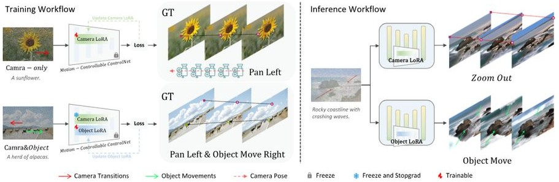

# 1. Bibliographic Information

## 1.1. Title
Image Conductor: Precision Control for Interactive Video Synthesis

## 1.2. Authors
Yaowei Li (Peking University), Xintao Wang (ARC Lab, Tencent PCG), Zhaoyang Zhang (ARC Lab, Tencent PCG), Zhouxia Wang (ARC Lab, Tencent PCG & Nanyang Technological University), Ziyang Yuan (ARC Lab, Tencent PCG & Tsinghua University), Liangbin Xie (ARC Lab, Tencent PCG & University of Macau & SIAT), Yuexian Zou (Peking University), and Ying Shan (ARC Lab, Tencent PCG).

## 1.3. Journal/Conference
This paper was published at the **ArXiv** preprint repository in June 2024. The authors are affiliated with high-tier research institutions and corporate labs (Tencent ARC Lab), indicating a high level of technical rigor and relevance to the current state-of-the-art in generative AI.

## 1.4. Publication Year
2024 (Published UTC: 2024-06-21)

## 1.5. Abstract
Filmmaking and animation require precise coordination of camera and object movements, a process that is traditionally labor-intensive. While AI video generation has improved, fine-grained control remains difficult because camera and object motions are often "coupled" (mixed together) in training data. This paper introduces `Image Conductor`, a method to generate motion-controllable videos from a single image using user-drawn trajectories. The core innovation is a training strategy that uses separate `Low-Rank Adaptation (LoRA)` weights for camera and object motions, an `orthogonal loss` to keep these weights distinct, and a `camera-free guidance` technique during inference to eliminate unwanted camera transitions. The authors also contribute a high-quality trajectory-annotated dataset.

## 1.6. Original Source Link
*   **Official Link:** [https://arxiv.org/abs/2406.15339](https://arxiv.org/abs/2406.15339)
*   **PDF Link:** [https://arxiv.org/pdf/2406.15339v1](https://arxiv.org/pdf/2406.15339v1)
*   **Project Page:** [https://liyaowei-stu.github.io/project/ImageConductor/](https://liyaowei-stu.github.io/project/ImageConductor/)

# 2. Executive Summary

## 2.1. Background & Motivation
The field of **AI-Generated Content (AIGC)** has moved from static images to dynamic videos. However, professional filmmaking requires precise control: a director might want a specific car to move forward while the camera simultaneously "zooms in."
*   **The Core Problem:** Existing models struggle to distinguish between **camera movement** (the entire scene shifting) and **object movement** (a specific item moving within the scene). 
*   **The Challenge:** Internet video data is messy. If a video shows a person walking and the camera following them, the AI perceives both motions as one combined signal. This leads to "ambiguity," where a user's request for an object to move results in the camera moving instead, or vice versa.
*   **Research Gap:** Previous methods like `MotionCtrl` or `DragNUWA` exist but lack the precision to cleanly separate these two types of motion without introducing artifacts or unwanted cinematographic variations.

## 2.2. Main Contributions / Findings
1.  **Image Conductor Framework:** A system that accepts an image and user-drawn trajectories (paths) to generate a video with precise motion.
2.  **LoRA-based Disentanglement:** A two-stage training strategy using `camera LoRA` and `object LoRA` weights to physically separate the learning of camera transitions from object movements.
3.  **Orthogonal Loss:** A mathematical constraint introduced during training to ensure that the camera and object weights do not overlap or interfere with each other.
4.  **Camera-Free Guidance:** A novel inference technique that allows the model to "ignore" accidental camera motions when the user only wants object movement.
5.  **Data Curation Pipeline:** A method to annotate large-scale video datasets with precise point-tracking trajectories using `CoTracker`, filling a gap in the open-source community.

# 3. Prerequisite Knowledge & Related Work

## 3.1. Foundational Concepts
To understand this paper, a novice needs to grasp several key AI concepts:
*   **Diffusion Models:** A class of generative models that start with pure noise and gradually "denoise" it to create an image or video. This process is guided by text prompts or other signals.
*   **Latent Diffusion:** Instead of processing pixels directly, the model works in a compressed "latent space" (a mathematical representation of the image), which is much more computationally efficient.
*   **ControlNet:** An auxiliary neural network structure that "plugs into" a pre-trained diffusion model to provide extra conditions, such as edges, poses, or—in this case—motion trajectories.
*   **LoRA (Low-Rank Adaptation):** A technique for "fine-tuning" large models without retraining everything. It adds a small number of trainable parameters (rank-decomposition matrices) to existing layers.
*   **Trajectory:** A line or path representing the movement of a point over time. Users draw these to tell the AI "move this object from point A to point B."
*   **Optical Flow:** A technique to estimate the motion of pixels between two consecutive frames in a video.

## 3.2. Previous Works
The authors build upon several important models:
*   **AnimateDiff:** A popular framework for turning personalized text-to-image models into video generators by adding "motion modules."
*   **SparseCtrl:** A variant of `ControlNet` specifically designed to handle sparse inputs (like a few dots or lines) for video generation.
*   **MotionCtrl:** A prior attempt to control motion, but it relied on camera parameters (which are hard for humans to define) and had difficulty separating object motion from camera motion.
*   **DragNUWA:** A model that allows users to "drag" parts of an image to define motion. However, it often confuses object dragging with camera panning.

## 3.3. Technological Evolution
The field progressed from **Text-to-Video (T2V)** (random motion) to **Image-to-Video (I2V)** (animating a specific picture). The latest stage is **Controllable I2V**, where the user dictates the *path* of movement. `Image Conductor` represents the current frontier: **Disentangled Controllable I2V**, where the user controls camera and objects independently.

## 3.4. Differentiation Analysis
Unlike its predecessors, `Image Conductor` does not just "learn motion"; it learns to **categorize** motion into camera-specific and object-specific weights. This allows for a modular approach where the user can turn camera motion "on" or "off" during generation.

# 4. Methodology

## 4.1. Principles
The core idea is **Disentangled Learning**. By training the model on camera-only data first and then training on mixed data while keeping the camera knowledge separate, the model learns two distinct "vocabularies" of motion.

## 4.2. Core Methodology In-depth (Layer by Layer)

### 4.2.1. Trajectory Data Construction
Before training, the authors must create a dataset where the AI knows exactly how every pixel moves.
1.  **Video Collection:** They use `WebVid` (general videos) and `RealEstate10K` (camera-only movements).
2.  **Cuts Detection:** They remove "cuts" (when a video jumps to a new scene) to ensure the AI learns smooth, continuous motion.
3.  **Motion Tracking:** They use `CoTracker`, which tracks a $16 \times 16$ grid of points across 32 frames. 
4.  **Flow Map Generation:** These trajectories are converted into "flow maps" (color-coded images representing movement direction and speed) which serve as the input for the `ControlNet`.

    The following figure (Figure 2 from the original paper) illustrates the framework and the data construction pipeline:

    
    *该图像是一个示意图，展示了Image Conductor框架的流程，包括从输入图像生成运动视频的多个步骤，如运动估计和滤波、裁剪与跟踪等。图中强调了使用LoRA模型分离相机和对象运动的方法，展现了具体的处理流程和数据流。*

### 4.2.2. Motion-Controllable Architecture
The system uses a **3D UNet** (the "brain" that generates video frames) and a **Motion ControlNet**. The `ControlNet` takes the user's trajectories and "tells" the `UNet` how to shift pixels. 

### 4.2.3. Stage 1: Camera Transition Training
The model is first trained only on videos that have camera movement but no moving objects (e.g., a drone flying over a static building). This "teaches" the `camera LoRA` ($\theta_{cam}$) how to interpret trajectories as camera shifts.
The standard diffusion denoising training objective used is:
$$
\mathcal{L}_{cam} = \mathbb{E}_{z_{0,cam},c_{txt},c_{img},c_{traj s},\epsilon \sim \mathcal{N}(0,I),t}\big[\Vert \epsilon -\epsilon \theta_{cam}(z_{t,cam},t,c_{txt},c_{img},c_{traj s})\Vert_{2}^2\big]
$$
**Variable Explanation:**
*   $\mathcal{L}_{cam}$: The loss (error) for camera training.
*   $z_{0,cam}$: The original video latent (ground truth).
*   $c_{txt}, c_{img}, c_{traj s}$: The text, image, and trajectory conditions.
*   $\epsilon$: Random noise added to the data.
*   $\epsilon \theta_{cam}$: The model's attempt to predict that noise using the `camera LoRA` weights.
*   $t$: The current timestep in the diffusion process.

### 4.2.4. Stage 2: Object Movement & Disentanglement
Next, the model is trained on "mixed" data (videos with both moving objects and moving cameras). Crucially, they load the `camera LoRA` from Stage 1 but **freeze** it (no more learning for those weights), and introduce a new `object LoRA` ($\Delta \theta_{obj}$).
The combined weights are defined as:
$$
\theta_{mixed} = \theta_{0} + \mathrm{sg}[\Delta \theta_{cam}] + \Delta \theta_{obj}
$$
**Variable Explanation:**
*   $\theta_{0}$: The base model weights.
*   $\mathrm{sg}[\cdot]$: The **Stop-Gradient** operation. This prevents the training process from changing the camera weights, forcing the new learning to happen only in the object weights.
*   $\Delta \theta_{obj}$: The new learnable object motion weights.

    To ensure the `object LoRA` doesn't accidentally learn camera tricks, they introduce an **Orthogonal Loss**:
$$
\mathcal{L}_{ortho} = \mathbb{E}_{W_{i,cam}\in W_{cam},W_{i,traj}\in W_{traj}}\left[\left\| I - W_{i,cam}W_{i,traj}^{T}\right\|_{2}^{2}\right]
$$
**Variable Explanation:**
*   $I$: Identity matrix.
*   $W_{i,cam}, W_{i,traj}$: The mathematical weights of the $i$-th layer in the camera and object LoRAs.
*   $W^T$: The transpose of the matrix.
*   **Purpose:** In linear algebra, if two matrices are orthogonal, their product is zero (or the identity in certain contexts). This loss pushes the two sets of weights to represent "perpendicular" or independent concepts in the model's brain.

    The core idea of this fine-grained motion separation is shown in Figure 3 from the paper:

    
    *该图像是一个示意图，展示了训练工作流程和推理工作流程的对比。左侧展示了仅使用相机和同时使用相机与对象运动的训练步骤，右侧展示了推理时的相机变焦和对象移动过程。*

### 4.2.5. Inference: Camera-Free Guidance
During generation, if a user draws multiple trajectories for different objects, the model might get confused and think the camera should move. To stop this, the authors propose a guidance formula:
$$
\hat{\epsilon}_{\boldsymbol{\theta}_{0},\boldsymbol{\theta}_{traj}}(\boldsymbol {x}_t,\boldsymbol {c}) = \epsilon_{\boldsymbol{\theta}_0}(\boldsymbol {x}_t,\mathcal{O}) +\lambda_{cfg}(\epsilon_{\boldsymbol{\theta}_0}(\boldsymbol {x}_t,\boldsymbol {c}) - \epsilon_{\boldsymbol{\theta}_0}(\boldsymbol {x}_t,\mathcal{O})) +\lambda_{trajs}(\epsilon_{\boldsymbol{\theta}_{traj}}(\boldsymbol {x}_t,\boldsymbol {c}) - \epsilon_{\boldsymbol{\theta}_0}(\boldsymbol{x}_t,\boldsymbol {c}))
$$
**Symbol Explanation:**
*   $\epsilon_{\boldsymbol{\theta}_0}(\boldsymbol {x}_t,\mathcal{O})$: Prediction with no trajectory (random motion).
*   $\lambda_{cfg}$: Standard classifier-free guidance scale (controls how much the AI follows the text/image).
*   $\lambda_{trajs}$: The scale for **Camera-Free Guidance**. By adjusting this, the user can amplify object movements while canceling out the background camera shifts.

# 5. Experimental Setup

## 5.1. Datasets
1.  **WebVid-10M:** A massive dataset of internet videos with text descriptions. Used for general motion learning.
2.  **RealEstate10K:** A dataset focusing on architectural walk-throughs. Used specifically for the `camera LoRA` because the "objects" (houses) never move; only the camera does.
3.  **Custom Annotations:** The authors curated 130,000 mixed videos and 62,000 camera-only videos with precise `CoTracker` point paths.

## 5.2. Evaluation Metrics
The authors use four main automatic metrics:

1.  **FID (Fréchet Inception Distance):** Measures how "realistic" the individual frames are.
    $$
    \text{FID} = \|\mu_1 - \mu_2\|_2^2 + \text{Tr}(\Sigma_1 + \Sigma_2 - 2(\Sigma_1\Sigma_2)^{1/2})
    $$
    *   $\mu, \Sigma$: Mean and covariance of features extracted from a pre-trained image classifier.
    *   `1, 2`: Represent the generated images and the real ground-truth images.

2.  **FVD (Fréchet Video Distance):** Similar to FID, but measures the realism and smoothness of the **entire video sequence** over time.

3.  **CamMC (Camera Motion Consistency):** Quantifies how well the camera followed the intended path. It is calculated as the Euclidean distance between the user's requested trajectory and the actual pixel movement in the background of the generated video.

4.  **ObjMC (Object Motion Consistency):** Quantifies how well the specific objects followed their paths. Similar to CamMC, but focuses on the points designated by the user as "objects."

## 5.3. Baselines
The method is compared against:
*   **DragNUWA:** Uses dragging for motion.
*   **DragAnything:** A recent method for entity-based motion.
*   **MotionCtrl:** A unified motion controller.

# 6. Results & Analysis

## 6.1. Core Results Analysis
*   **Precision:** `Image Conductor` significantly outperformed others in following paths. In qualitative tests, when `DragNUWA` was asked to move an object, it often panned the entire camera. `Image Conductor` kept the camera still and moved only the object.
*   **Quality:** The model maintained higher FID/FVD scores, meaning the videos looked more like real footage and less like AI-generated "soup."
*   **Personalization:** Because it uses LoRA, it can be combined with other community-made models (like those from CIVITAI) to generate motion for specific art styles (Anime, 3D Render, etc.).

## 6.2. Data Presentation (Tables)
The following are the results from Table 1 of the original paper:

<table>
<thead>
<tr>
<th rowspan="2">Method</th>
<th colspan="4">Automatic Metrics</th>
<th colspan="3">Human Evaluation</th>
</tr>
<tr>
<th>FID ↓</th>
<th>FVD ↓</th>
<th>CamMC ↓</th>
<th>ObjMC ↓</th>
<th>Overall ↑</th>
<th>Quality ↑</th>
<th>Motion ↑</th>
</tr>
</thead>
<tbody>
<tr>
<td>DN (Yin et al., 2023)</td>
<td>237.26</td>
<td>1283.85</td>
<td>48.72</td>
<td>51.24</td>
<td>31.8%</td>
<td>37.1%</td>
<td>27.7%</td>
</tr>
<tr>
<td>DA (Wu et al., 2024)</td>
<td>243.17</td>
<td>1287.15</td>
<td>66.54</td>
<td>60.97</td>
<td>6.5%</td>
<td>8.1%</td>
<td>6.3%</td>
</tr>
<tr>
<td><strong>Image Conductor</strong></td>
<td><strong>209.74</strong></td>
<td><strong>1116.17</strong></td>
<td><strong>33.49</strong></td>
<td><strong>42.38</strong></td>
<td><strong>61.7%</strong></td>
<td><strong>54.8%</strong></td>
<td><strong>66.0%</strong></td>
</tr>
</tbody>
</table>

*Note: ↓ indicates lower is better; ↑ indicates higher is better. DN = DragNUWA, DA = DragAnything.*

## 6.3. Ablation Studies
The authors proved that without the **Orthogonal Loss**, the object LoRA would start "leaking" camera motions. Without **Camera-Free Guidance**, complex multi-object trajectories would cause the whole scene to wobble. Figure 6 in the paper shows how loading *only* the camera LoRA vs. *only* the object LoRA results in vastly different outcomes for the same drawn line.

# 7. Conclusion & Reflections

## 7.1. Conclusion Summary
`Image Conductor` successfully addresses the "motion ambiguity" problem in video synthesis. By physically separating the neural weights for camera and object movements and providing a mathematical way to keep them distinct, the authors have created a tool that allows for professional-grade, interactive control over video assets generated from a single image.

## 7.2. Limitations & Future Work
*   **Inconsistency:** The authors noted that while the first frame is perfect, subsequent frames can sometimes lose color or detail consistency (a common "drift" problem in diffusion models).
*   **Prompt Conflict:** If the user's text prompt says "a person running" but the trajectory points backward, the model can produce artifacts as it tries to resolve the contradiction.
*   **Future Direction:** Better integration of image conditioning (like the techniques used in `SVD` or `DynamiCrafter`) could help maintain visual detail across longer clips.

## 7.3. Personal Insights & Critique
The use of **Orthogonal Loss** is a particularly clever application of linear algebra to a deep learning problem. Most "controllable" models try to solve problems by just adding more data. `Image Conductor` solves it by changing the **structure** of how the model learns. 

However, a potential issue is the reliance on `CoTracker`. While accurate, point-tracking on a $16 \times 16$ grid is still "sparse." For very complex deformations (like a person's fingers moving or a cloth fluttering), a grid of points might not be enough to capture the nuance, potentially limiting the model to "rigid" or "semi-rigid" object movements. Overall, it is a significant step toward making AI a viable tool for actual cinematographers rather than just a novelty for hobbyists.