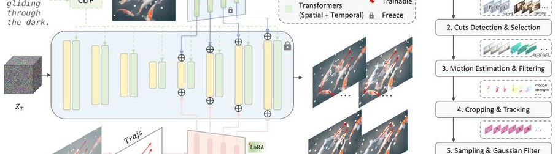
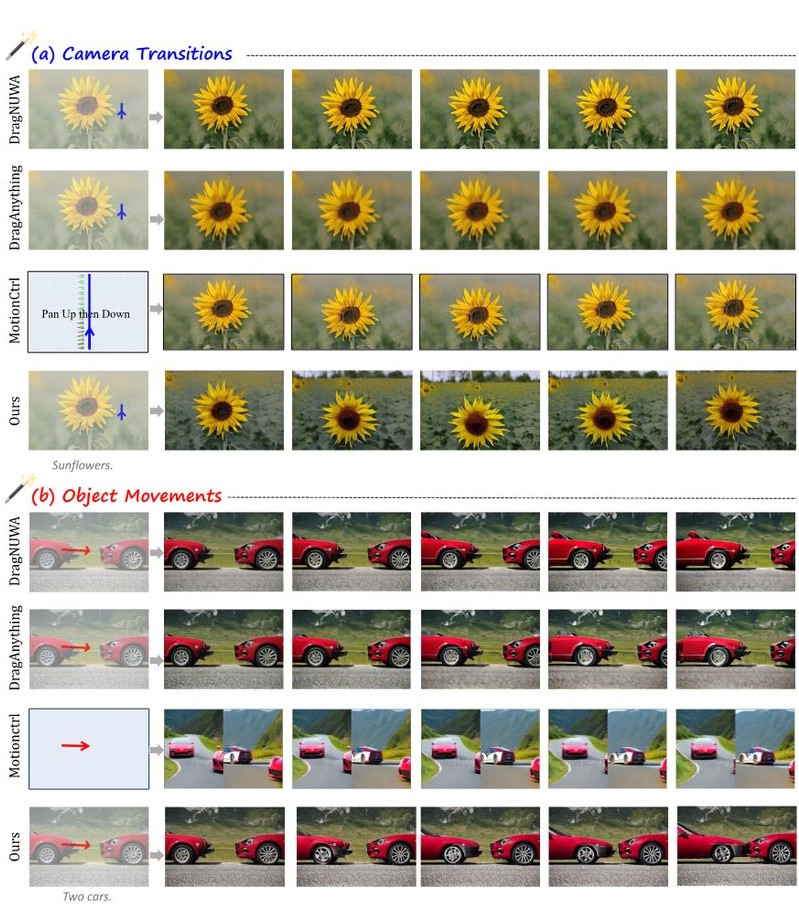

# 1. 论文基本信息

## 1.1. 标题
**Image Conductor: Precision Control for Interactive Video Synthesis**
（图像指挥家：交互式视频合成的精准控制）

## 1.2. 作者
Yaowei Li, Xintao Wang, Zhaoyang Zhang, Zhouxia Wang, Ziyang Yuan, Liangbin Xie, Yuexian Zou, Ying Shan。
来自北京大学（Peking University）、腾讯 ARC 实验室（ARC Lab, Tencent PCG）、南洋理工大学（NTU）、清华大学（Tsinghua University）、澳门大学（University of Macau）以及深圳先进技术研究院（SIAT）。

## 1.3. 发表期刊/会议
该论文发布于 **arXiv** 预印本平台（2024年6月）。作者团队来自腾讯 ARC 实验室等顶尖研究机构，该实验室在计算机视觉和 AIGC 领域具有极高的学术影响力。

## 1.4. 发表年份
2024年

## 1.5. 摘要
电影制作和动画生产通常需要复杂的摄像机转换（Camera Transitions）和物体运动（Object Movements）协调。尽管生成式人工智能在视频创建方面取得了进步，但为交互式视频资产生成实现精确的运动控制仍然具有挑战性。为此，本文提出了 **Image Conductor**，一种通过单张图像生成视频并精准控制相机与物体运动的方法。研究提出了一种精心设计的训练策略，通过相机 `LoRA` 权重和物体 `LoRA` 权重来分离相机运动和物体运动。为了进一步解决由于轨迹定义不当带来的电影感偏差，研究在推理阶段引入了<strong>无相机引导 (Camera-free Guidance)</strong> 技术。此外，研究还开发了一个<strong>面向轨迹的视频运动数据处理流水线 (Trajectory-oriented video motion data curation pipeline)</strong>。实验证明，该方法在运动控制精度和生成质量上均达到了领先水平。

## 1.6. 原文链接
*   **arXiv 链接:** [https://arxiv.org/abs/2406.15339](https://arxiv.org/abs/2406.15339)
*   **PDF 链接:** [https://arxiv.org/pdf/2406.15339v1](https://arxiv.org/pdf/2406.15339v1)
*   **项目主页:** [https://liyaowei-stu.github.io/project/ImageConductor/](https://liyaowei-stu.github.io/project/ImageConductor/)

    ---

# 2. 整体概括

## 2.1. 研究背景与动机
*   **核心问题:** 在目前的 AI 视频生成流程中，精确控制视频中的“镜头怎么动”和“物体怎么动”非常困难。现有的方法往往会将相机运动（如推拉摇移）和物体本身的运动（如人走动、浪花跳跃）混淆。
*   **挑战与空白:** 
    1.  **缺乏高效的控制界面:** 用户难以直观地表达运动意图。
    2.  <strong>运动耦合 (Motion Coupling):</strong> 现实数据中相机和物体往往同时在动，模型难以区分这两者，导致生成的视频出现意料之外的镜头晃动。
    3.  **高质量数据稀缺:** 缺乏带有精确轨迹标注的大规模视频数据集。
*   **创新思路:** 本文提出通过<strong>点轨迹 (Trajectories)</strong> 作为直观的交互方式，并通过特定的模型架构和训练策略（如 `LoRA` 分离和正交损失）实现相机与物体运动的解耦。

## 2.2. 核心贡献/主要发现
1.  **高精度数据集:** 构建了一个包含精确轨迹标注的高质量视频运动数据集。
2.  **运动分离架构:** 引入了相机 `LoRA` 和物体 `LoRA` 的协作优化策略，能独立控制不同的运动类型。
3.  **无相机引导技术:** 提出了一种推理技巧，在不重新训练的情况下，能有效消除不必要的相机转换，增强物体运动。
4.  **性能领先:** 在定量和定性评估中，Image Conductor 在运动遵循精度和视频质量上均优于现有的 `DragNUWA`、`MotionCtrl` 等最先进的方法。

    ---

# 3. 预备知识与相关工作

## 3.1. 基础概念
*   <strong>扩散模型 (Diffusion Models):</strong> 一种生成模型，通过学习将随机噪声逐步还原为清晰图像或视频的过程来生成内容。
*   <strong>低秩自适应 (Low-Rank Adaptation, LoRA):</strong> 一种参数高效的微调技术，通过在原模型权重旁添加小的、可训练的低秩矩阵（$A$ 和 $B$），在不改变原始模型主干的情况下让模型学会新任务。
*   **ControlNet:** 一种用于给预训练扩散模型添加额外控制条件（如边缘图、姿态、轨迹）的神经网络结构。
*   <strong>主干网络 (Backbone):</strong> 模型的核心特征提取或生成部分，本文使用的是预训练的视频生成模型 `AnimateDiff`。

## 3.2. 前人工作
*   **视频生成:** 从早期的 `Video Diffusion Models` 到近期的 `SVD` (Stable Video Diffusion)，模型生成的连贯性不断提升。
*   **运动控制:** `MotionCtrl` 尝试通过相机参数控制，但参数不直观；`DragNUWA` 引入了拖拽轨迹，但在处理复杂相机运动时容易出错。
*   <strong>核心公式补充 - 注意力机制 (Attention):</strong> 视频生成中常用的跨注意力（Cross-Attention）公式为：
    $$ \mathrm{Attention}(Q, K, V) = \mathrm{softmax}\left(\frac{QK^T}{\sqrt{d_k}}\right)V $$
    其中 $Q$ 是查询（Query），$K$ 是键（Key），$V$ 是值（Value），$d_k$ 是缩放因子。在本文中，这用于将文本描述和图像特征注入到视频生成过程中。

## 3.3. 技术演进与差异化
传统的轨迹控制方法（如 `DragNUWA`）通过直接微调整个模型来学习轨迹，这容易导致模型忘记原始的生成质量。本文的创新在于**模块化分离**：将相机和物体运动分别交给两个不同的 `LoRA` 模块管理，并利用<strong>正交损失 (Orthogonal Loss)</strong> 强制它们各司其职，互不干扰。

---

# 4. 方法论

## 4.1. 方法原理
Image Conductor 的核心思想是将视频中的总运动分解为“全局相机运动”和“局部物体运动”。通过使用用户绘制的点轨迹作为输入，模型利用专门训练的 `LoRA` 权重来解释这些轨迹。

## 4.2. 核心方法详解 (逐层深入)

### 4.2.1. 轨迹导向的数据构建流水线
为了训练模型，首先需要高质量的数据。作者从 `WebVid` 和 `Realestate10K` 数据集出发：
1.  **镜头检测:** 剔除视频中的剪辑切换，确保每个片段是连续的场景。
2.  **运动过滤:** 使用 `RAFT` 计算光流，剔除静态或运动极微小的样本。
3.  **点跟踪:** 使用 `CoTracker` 在视频中均匀分布 $16 \times 16$ 的网格点进行长程跟踪，生成精确的坐标轨迹。
4.  **稀疏化:** 模拟用户交互，从密集轨迹中随机采样 1 到 8 条稀疏轨迹，并应用高斯滤波生成运动图 $c_{trajs}$。

    下展示了具体的工作流程：

    
    *该图像是一个示意图，展示了Image Conductor框架的流程，包括从输入图像生成运动视频的多个步骤，如运动估计和滤波、裁剪与跟踪等。图中强调了使用LoRA模型分离相机和对象运动的方法，展现了具体的处理流程和数据流。*

### 4.2.2. 相机运动的学习 (第一阶段)
作者首先在仅包含相机运动的数据集（如 `Realestate10K`）上训练相机 `LoRA` 权重 $\theta_{\mathrm{cam}}$。
训练目标是标准的扩散模型去噪损失：
$$ \mathcal{L}_{\mathrm{cam}} = \mathbb{E}_{z_{0,\mathrm{cam}},c_{\mathrm{txt}},c_{\mathrm{img}},c_{\mathrm{trajs}},\epsilon,t}\big[\Vert \epsilon -\epsilon_{\theta_{\mathrm{cam}}}(z_{t,\mathrm{cam}},t,c_{\mathrm{txt}},c_{\mathrm{img}},c_{\mathrm{trajs}})\Vert_{2}^2\big] \quad (1) $$
*   $\epsilon$: 注入的噪声。
*   $\epsilon_{\theta_{\mathrm{cam}}}$: 带有相机 `LoRA` 的去噪器。
*   $z_{t,\mathrm{cam}}$: 在时刻 $t$ 的带噪潜在特征。
*   $c_{\mathrm{txt}}, c_{\mathrm{img}}, c_{\mathrm{trajs}}$: 分别是文本、第一帧图像和轨迹条件。

### 4.2.3. 物体运动的学习与正交约束 (第二阶段)
在训练物体运动时，加载已训练好的相机 `LoRA`，但通过<strong>停止梯度更新 (stop-gradient, $\mathrm{sg}[\cdot]$)</strong> 冻结它，只训练新的物体 `LoRA` $\Delta \theta_{\mathrm{obj}}$。
混合权重定义为：
$$ \theta_{\mathrm{mixed}} = \theta_{0} + \mathrm{sg}[\Delta \theta_{\mathrm{cam}}] + \Delta \theta_{\mathrm{obj}} \quad (2) $$
相应的去噪损失为：
$$ \mathcal{L}_{\mathrm{mixed}} = \mathbb{E}_{z_{0,\mathrm{mixed}},...}\big[\big\| \epsilon -\epsilon_{\theta_{\mathrm{mixed}}}(z_{t,\mathrm{mixed}},t, ...)||_{2}^{2}\big] \quad (3) $$

为了防止物体 `LoRA` 学到相机运动的内容，引入了<strong>正交损失 (Orthogonal Loss)</strong>：
$$ \mathcal{L}_{\mathrm{ortho}} = \mathbb{E}_{W_{i,\mathrm{cam}},W_{i,\mathrm{traj}}}\left[\left\| I - W_{i,\mathrm{cam}}W_{i,\mathrm{traj}}^{T}\right\|_{2}^{2}\right] \quad (4) $$
*   $I$: 单位矩阵。
*   $W_{i,\mathrm{cam}}$ 和 $W_{i,\mathrm{traj}}$: 分别是相机和物体 `LoRA` 中第 $i$ 层线性层的权重。
*   **目的:** 强制两组权重在数学空间上相互正交，从而实现真正的功能解耦。

### 4.2.4. 无相机引导 (Camera-free Guidance)
在推理阶段，如果用户只想让物体动而相机不动，单纯靠 `LoRA` 可能无法完美解决（因为轨迹信号本身可能包含隐含的平移）。作者借鉴了 `Classifier-free Guidance`，提出了外推融合公式：
$$ \hat{\epsilon}_{\boldsymbol{\theta}_{0},\boldsymbol{\theta}_{\mathrm{traj}}}(\boldsymbol {x}_t,\boldsymbol {c}) = \epsilon_{\boldsymbol{\theta}_0}(\boldsymbol {x}_t,\mathcal{O}) +\lambda_{\mathrm{cfg}}(\epsilon_{\boldsymbol{\theta}_0}(\boldsymbol {x}_t,\boldsymbol {c}) - \epsilon_{\boldsymbol{\theta}_0}(\boldsymbol {x}_t,\mathcal{O})) +\lambda_{\mathrm{trajs}}(\epsilon_{\boldsymbol{\theta}_{\mathrm{traj}}}(\boldsymbol {x}_t,\boldsymbol {c}) - \epsilon_{\boldsymbol{\theta}_0}(\boldsymbol{x}_t,\boldsymbol {c})) \quad (5) $$
*   $\theta_{traj}$: 带有物体 `LoRA` 的模型。
*   $\theta_{0}$: 原始预训练模型。
*   $\lambda_{trajs}$: 轨迹引导强度。通过调节该参数，可以在不引入镜头位移的情况下，极大增强物体的运动幅度。

    ---

# 5. 实验设置

## 5.1. 数据集
*   **WebVid:** 大规模互联网视频，包含丰富的物体运动。
*   **Realestate10K:** 房地产展示视频，几乎全是纯相机移动。
*   **规模:** 13万条混合运动视频，6.2万条纯相机运动视频。

## 5.2. 评估指标
1.  **FID (Fréchet Inception Distance):**
    *   **定义:** 衡量生成图像与真实图像在特征空间分布的相似度。越低表示单帧画质越接近真实图片。
    *   **公式:** $d^2 = \|\mu_1 - \mu_2\|^2 + Tr(\Sigma_1 + \Sigma_2 - 2\sqrt{\Sigma_1\Sigma_2})$。
2.  **FVD (Fréchet Video Distance):**
    *   **定义:** 扩展自 FID，使用视频特征提取器衡量生成视频的连贯性和真实性。越低越好。
3.  **CamMC & ObjMC (Camera/Object Motion Control):**
    *   **定义:** 衡量生成视频中像素的实际运动轨迹与输入轨迹之间的欧几里得距离。越低表示控制越精准。

## 5.3. 对比基线
*   **DragNUWA:** 经典的基于拖拽的视频生成模型。
*   **DragAnything:** 最新的物体中心化拖拽控制模型。
*   **MotionCtrl:** 支持相机参数和轨迹控制的统一框架。

    ---

# 6. 实验结果与分析

## 6.1. 核心结果分析
Image Conductor 在所有指标上均表现优异。特别是在 <strong>ObjMC (物体运动控制)</strong> 上，显著低于竞争对手，说明它能更好地让物体“听话”地按照轨迹移动，而不是简单地晃动整个画面。

下图展示了 Image Conductor 与其他方法的定性对比：

*该图像是图表，展示了不同方法在相机转换（部分(a)）和物体移动（部分(b)）中的表现。图中比较了四种技术，包括DragNUVA、DragAnything、MotionCtrl与我们的方法，展示了各自生成的效果，左侧为输入图像，右侧为经过处理后的图像。*

## 6.2. 数据呈现 (表格)
以下是原文 Table 1 的完整结果：

<table>
<thead>
<tr>
<th rowspan="2">Method</th>
<th colspan="4">Automatic Metrics</th>
<th colspan="3">Human Evaluation</th>
</tr>
<tr>
<th>FID ↓</th>
<th>FVD ↓</th>
<th>CamMC ↓</th>
<th>ObjMC ↓</th>
<th>Overall ↑</th>
<th>Quality ↑</th>
<th>Motion ↑</th>
</tr>
</thead>
<tbody>
<tr>
<td>DN (Yin et al., 2023)</td>
<td>237.26</td>
<td>1283.85</td>
<td>48.72</td>
<td>51.24</td>
<td>31.8%</td>
<td>37.1%</td>
<td>27.7%</td>
</tr>
<tr>
<td>DA (Wu et al., 2024)</td>
<td>243.17</td>
<td>1287.15</td>
<td>66.54</td>
<td>60.97</td>
<td>6.5%</td>
<td>8.1%</td>
<td>6.3%</td>
</tr>
<tr>
<td><b>Image Conductor</b></td>
<td><b>209.74</b></td>
<td><b>1116.17</b></td>
<td><b>33.49</b></td>
<td><b>42.38</b></td>
<td><b>61.7%</b></td>
<td><b>54.8%</b></td>
<td><b>66.0%</b></td>
</tr>
</tbody>
</table>

*注：DN 代表 DragNUWA，DA 代表 DragAnything。*

## 6.3. 消融实验
*   **LoRA 权重的作用:** 实验证明，单独加载相机 `LoRA` 只能实现镜头移动（如 Pan Up），而单独加载物体 `LoRA` 则能让物体在静止相机中移动（如波浪向上），这验证了解耦的成功。
*   **无相机引导的影响:** 随着 $\lambda_{trajs}$ 增大，物体运动的幅度明显增强，同时有效过滤掉了轨迹中误导模型的相机位移。

    ---

# 7. 总结与思考

## 7.1. 结论总结
`Image Conductor` 通过创新的 `LoRA` 两阶段协作微调策略和正交约束，成功解决了视频生成中相机与物体运动相互干扰的问题。它提供了一个高精度的控制接口，使得普通用户只需简单的线条就能指挥复杂的电影级镜头。

## 7.2. 局限性与未来工作
*   **内容一致性:** 虽然运动控制很准，但受限于主干网络（AnimateDiff），视频后期帧可能会出现色彩漂移或细节丢失。
*   **提示词冲突:** 当文本描述（如“奔跑的人”）与轨迹方向（向下移动）严重冲突时，模型生成的质量会下降。
*   **未来方向:** 结合更强大的主干网络（如 `SVD` 或 `Sora` 类架构）进一步提升画质，并探索更复杂的多物体交互控制。

## 7.3. 个人启发与批判
*   **启发:** 该论文展示了在 AIGC 领域，“解耦”是通往精准控制的必经之路。通过数学上的正交性约束来辅助模型学习物理规律是一个非常巧妙的设计。
*   **批判:** 虽然论文强调了“无相机引导”，但在多条轨迹交叉或极度复杂的场景下，这种启发式的引导是否会产生伪影（Artifacts）仍需进一步验证。此外，对于完全遮挡后再出现的物体运动控制，论文中涉及较少，这在实际电影制作中是常见的难点。